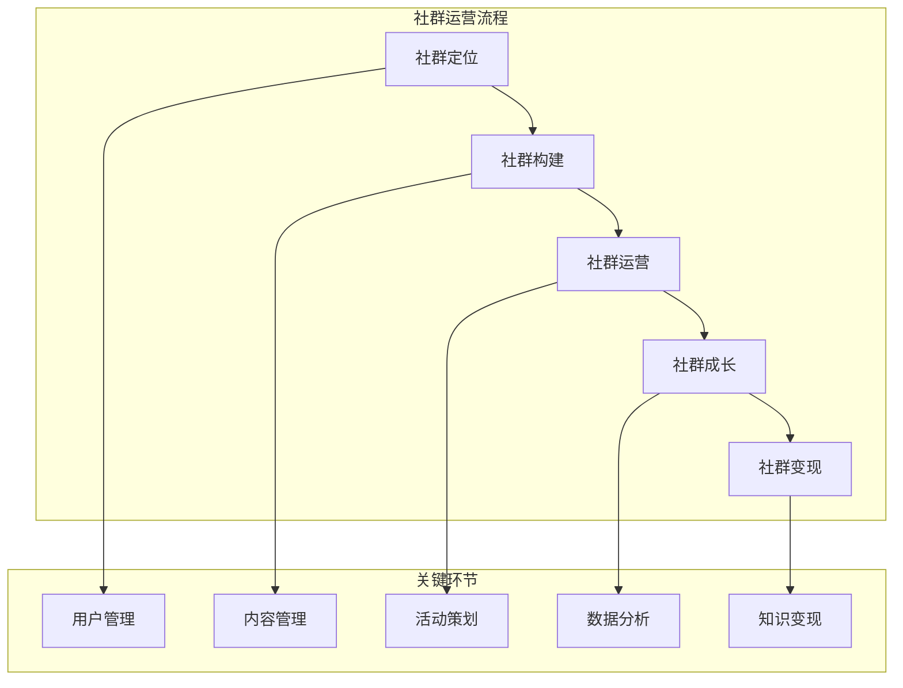
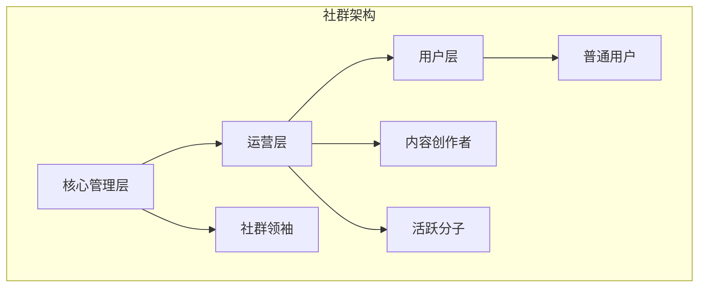

                 

# 《知识付费：程序员的社群运营技巧》

> 关键词：社群运营、知识付费、程序员、运营技巧、内容策划、用户参与、技术支持、案例分析

> 摘要：本文将探讨程序员的社群运营技巧，包括社群运营的基本概念、流程、策略、工具和技术，并结合实际案例进行分析，旨在为程序员提供一套实用的社群运营方法论，帮助他们在知识付费领域中取得成功。

## 第一部分：社群运营概述

### 第1章：社群运营的基本概念与价值

**1.1 社群运营的定义**

社群运营是指通过一系列策略和活动，管理、维护和激励社群成员的参与，以实现特定目标和价值的活动。在知识付费领域，社群运营尤为重要，因为它是连接知识提供者与学习者的重要桥梁。

**1.2 社群运营的核心目标**

社群运营的核心目标包括：提升用户参与度、增加用户粘性、扩大社群规模、提升知识传播效率、实现知识变现等。

**1.3 社群运营的优势与挑战**

社群运营的优势在于能够快速形成知识传播的生态圈，提高用户的学习效率，促进知识变现。然而，社群运营也面临着用户维护、内容质量、运营成本等方面的挑战。

## 第二部分：社群运营的流程与方法

### 第2章：社群运营的流程与方法

**2.1 社群运营的流程**

社群运营的流程通常包括以下步骤：社群定位、社群构建、社群运营、社群成长和社群变现。

**2.2 社群运营的关键环节**

社群运营的关键环节包括：用户管理、内容管理、活动策划、互动维护、数据分析和用户激励等。

**2.3 社群运营策略与方法**

社群运营的策略包括：内容驱动、用户驱动、活动驱动和社区化运营等。社群运营的方法包括：内容创作、用户互动、活动策划、数据分析等。

## 第三部分：社群架构与规划

### 第3章：社群架构设计

**3.1 社群架构的层次结构**

社群架构通常包括三个层次：核心管理层、运营层和用户层。每个层次都有其独特的职责和功能。

**3.2 社群角色的定位**

社群角色包括：社群领袖、内容创作者、活跃分子、普通用户等。每个角色都有其特定的职责和影响力。

**3.3 社群架构的优缺点分析**

社群架构的优缺点取决于其设计和管理策略。合理的社群架构能够提高运营效率，促进知识传播，但不合理的架构可能导致资源浪费和用户流失。

## 第四部分：社群内容运营

### 第4章：内容策划与发布

**4.1 内容策划的策略**

内容策划的策略包括：确定内容主题、选择内容形式、制定内容规划、保证内容质量等。

**4.2 内容发布的节奏与频率**

内容发布的节奏与频率应根据社群特点和用户需求进行调整，以保持用户的持续关注和参与。

**4.3 高质量内容的生产与传播**

高质量内容的生产与传播是社群运营的关键，需要建立完善的内容生产机制和传播渠道。

## 第五部分：社群互动与用户参与

### 第5章：社群互动与用户参与

**5.1 社群互动的策略**

社群互动的策略包括：鼓励用户参与、引导用户表达、建立互动机制等。

**5.2 用户参与度提升技巧**

用户参与度提升技巧包括：设计有趣的活动、提供优质的内容、建立激励机制等。

**5.3 互动活动的策划与执行**

互动活动的策划与执行需要考虑活动形式、活动内容、活动推广、活动评估等环节。

## 第六部分：社群运营工具与技术

### 第6章：社群运营工具介绍

**6.1 社群管理软件的选择**

社群管理软件的选择需要考虑功能、易用性、稳定性、扩展性等因素。

**6.2 社群数据分析工具**

社群数据分析工具可以帮助运营者了解社群运营状况，优化运营策略。

**6.3 社群营销工具**

社群营销工具可以用于推广社群、吸引用户、提升知名度等。

### 第7章：技术支持与优化

**7.1 技术架构的选择与优化**

技术架构的选择与优化对于社群运营的稳定性和扩展性至关重要。

**7.2 数据分析与用户行为跟踪**

数据分析和用户行为跟踪可以帮助运营者了解用户需求，优化运营策略。

**7.3 社群运营中的常见问题与解决方案**

社群运营中常见的问题包括：用户流失、内容质量低、互动不足等，本文将提供相应的解决方案。

## 第七部分：案例分析

### 第8章：优秀社群案例解析

**8.1 案例一：XX技术社群的运营实践**

**8.2 案例二：YY编程社群的运营策略**

**8.3 案例三：ZZ设计社群的成功经验**

通过分析这些优秀社群的案例，我们可以学习到有效的社群运营技巧和策略。

### 第9章：社群运营的挑战与未来趋势

**9.1 社群运营面临的挑战**

社群运营面临的挑战包括：用户维护、内容质量、运营成本等。

**9.2 社群运营的未来发展趋势**

社群运营的未来发展趋势包括：个性化运营、智能运营、社区化运营等。

**9.3 程序员社群运营的独特优势**

程序员社群运营的独特优势包括：技术专业性、知识共享性、创新性等。

## 附录

### 附录A：社群运营资源与推荐阅读

**A.1 社群运营相关书籍推荐**

**A.2 社群运营优秀博客与网站**

**A.3 社群运营工具与平台介绍**

### 附录B：社群运营流程图与架构图

**B.1 社群运营流程图**

**B.2 社群架构设计图**

### 附录C：社群运营常见问题解答

**C.1 社群成员管理**

**C.2 社群内容审核**

**C.3 社群推广与营销策略**

---

## 第1章：社群运营的基本概念与价值

### 1.1 社群运营的定义

社群运营，顾名思义，是指围绕一个特定的主题或目标，通过一系列策略和活动来管理、维护和激励社群成员的参与，以实现特定价值和目标的运营活动。在知识付费领域，社群运营尤为重要，因为它是连接知识提供者与学习者的重要桥梁。

社群运营不仅仅是一个简单的在线交流平台，它更是一个具有组织性、目的性和互动性的生态系统。通过社群运营，可以有效地促进知识传播、提升用户粘性、扩大社群规模，并最终实现知识变现。

社群运营的定义可以从以下几个方面来理解：

1. **社群**：社群是由具有共同兴趣、目标或价值观的人组成的群体。在知识付费领域，社群通常围绕某一特定的技术、行业或领域进行组织。
   
2. **运营**：运营是指通过一系列策略和活动来管理、维护和激励社群成员的参与。运营活动包括内容发布、用户互动、活动策划、数据分析等。

3. **价值**：社群运营的价值体现在多个方面，包括提高用户参与度、增加用户粘性、扩大社群规模、提升知识传播效率、实现知识变现等。

### 1.2 社群运营的核心目标

社群运营的核心目标可以分为以下几个方面：

1. **提升用户参与度**：用户参与度是衡量社群活跃程度的重要指标。通过有效的社群运营策略，可以激发用户的参与热情，提高社群的活跃度。

2. **增加用户粘性**：用户粘性是指用户对社群的依赖程度和忠诚度。通过持续的内容输出、互动活动和用户激励，可以增强用户对社群的归属感和忠诚度。

3. **扩大社群规模**：社群规模是社群影响力的直接体现。通过有效的推广和用户邀请机制，可以不断扩大社群规模，吸引更多用户加入。

4. **提升知识传播效率**：知识传播效率是社群运营的重要目标之一。通过合理的内容策划和传播渠道，可以加速知识的传播，提高学习效率。

5. **实现知识变现**：知识变现是社群运营的终极目标之一。通过提供高质量的内容和服务，吸引付费用户，实现社群的盈利。

### 1.3 社群运营的优势与挑战

社群运营在知识付费领域具有显著的优势，同时也面临着一系列的挑战。

#### 优势

1. **快速形成知识传播的生态圈**：社群运营能够快速聚集具有相同兴趣或目标的人群，形成一个知识传播的生态圈。

2. **提高用户学习效率**：通过社群内的知识共享和互动，用户可以更快速地获取所需的知识和信息。

3. **促进知识变现**：社群运营可以有效地将知识转化为商业价值，实现知识变现。

4. **增强用户归属感和忠诚度**：社群运营能够增强用户对社群的归属感和忠诚度，提高用户粘性。

5. **降低知识传播成本**：通过社群运营，可以减少传统教育模式中的高额成本，提高知识传播的效率。

#### 挑战

1. **用户维护难度大**：维持用户的活跃度和参与度是一项长期且艰巨的任务。

2. **内容质量难以控制**：社群内内容质量参差不齐，如何保证内容的质量是一个挑战。

3. **运营成本较高**：社群运营需要投入大量的人力、物力和时间，运营成本较高。

4. **用户流失风险**：随着社群规模的扩大，用户流失风险也随之增加。

通过以上对社群运营的基本概念、核心目标和优势挑战的探讨，我们可以看出社群运营在知识付费领域的重要性。接下来，我们将进一步探讨社群运营的具体流程和方法。

## 第2章：社群运营的流程与方法

### 2.1 社群运营的流程

社群运营的流程是确保社群能够顺利运行并实现预期目标的关键。一般来说，社群运营的流程可以分为以下几个步骤：

1. **社群定位**：社群定位是社群运营的第一步，也是最重要的一步。明确社群的主题、目标人群和核心价值，有助于后续的运营工作。

2. **社群构建**：在确定社群定位后，开始搭建社群的基础设施，包括选择合适的社群平台、设计社群的架构、制定运营规则等。

3. **社群运营**：社群运营是社群生命周期的核心阶段，包括内容发布、用户互动、活动策划、数据分析等环节。

4. **社群成长**：社群成长阶段注重社群规模的扩大、用户粘性的提升和知识传播效率的提高。

5. **社群变现**：社群变现是将社群运营转化为商业价值的重要环节，通过提供高质量的内容和服务，吸引付费用户，实现盈利。

### 2.2 社群运营的关键环节

社群运营的成功离不开以下几个关键环节：

1. **用户管理**：用户管理是社群运营的基础，包括用户注册、身份认证、权限管理、用户行为分析等。通过有效的用户管理，可以确保社群的正常运转和用户的安全。

2. **内容管理**：内容管理是社群运营的核心，包括内容策划、内容发布、内容审核、内容推广等。高质量的内容是吸引用户参与和提升社群价值的关键。

3. **活动策划**：活动策划是提升用户参与度和活跃度的有效手段，包括线上活动和线下活动。活动策划应注重用户体验和互动性，以增加用户粘性。

4. **互动维护**：互动维护是社群运营的重要环节，包括用户互动、社群管理、争议处理等。通过积极的互动维护，可以增强用户对社群的归属感和忠诚度。

5. **数据分析**：数据分析是社群运营的科学依据，通过对用户行为、内容表现、活动效果等数据的分析，可以优化运营策略，提高社群的价值和影响力。

### 2.3 社群运营策略与方法

社群运营的策略与方法可以分为以下几个方面：

1. **内容驱动**：内容驱动是指通过提供高质量的内容来吸引用户参与和提升社群价值。内容驱动的策略包括内容策划、内容发布、内容推广等。

2. **用户驱动**：用户驱动是指通过用户的参与和互动来推动社群的发展和成长。用户驱动的策略包括用户互动、用户激励、用户调研等。

3. **活动驱动**：活动驱动是指通过策划和组织各种活动来提升用户参与度和活跃度。活动驱动的策略包括活动策划、活动推广、活动反馈等。

4. **社区化运营**：社区化运营是指将社群打造成一个自组织和自成长的生态系统。社区化运营的策略包括社区架构设计、社区文化塑造、社区规则制定等。

通过以上对社群运营流程、关键环节和策略方法的探讨，我们可以看出社群运营是一项复杂但极具价值的任务。在接下来的章节中，我们将进一步探讨社群架构设计、社群规划与定位等内容。

### 第3章：社群架构设计

社群架构设计是社群运营的重要环节，它决定了社群的组织形式、功能模块和角色分工，直接影响社群的稳定性和发展潜力。一个良好的社群架构能够确保社群运营的顺畅进行，提高用户参与度和粘性。

#### 3.1 社群架构的层次结构

社群架构通常包括三个层次：核心管理层、运营层和用户层。

1. **核心管理层**：核心管理层是社群的最高决策层，负责社群的战略规划、目标制定和重大决策。核心管理层通常由社群创始人、高层管理者和资深专家组成。

2. **运营层**：运营层是社群的执行层，负责具体的运营工作，包括内容策划、用户管理、活动策划和数据分析等。运营层通常由运营经理、内容编辑、用户运营和活动策划等职位组成。

3. **用户层**：用户层是社群的基础层，包括所有社群成员。用户层根据其在社群中的角色和贡献，可以分为普通用户、活跃分子和核心成员等。

#### 3.2 社群角色的定位

社群角色的定位是确保社群架构有效运作的关键。不同角色在社群中扮演着不同的角色和职责：

1. **社群领袖**：社群领袖是社群的核心人物，具有高度的影响力和号召力。他们负责制定社群的发展方向、引导社群文化，并在关键时刻为社群成员提供指导和支持。

2. **内容创作者**：内容创作者负责社群的知识产出，包括撰写技术文章、发布教程、分享案例等。他们的贡献决定了社群的知识水平和吸引力。

3. **活跃分子**：活跃分子是社群的中坚力量，他们积极参与社群互动，组织线上或线下活动，为社群的发展贡献力量。

4. **普通用户**：普通用户是社群的基石，他们的参与和互动是社群活力的源泉。普通用户通过提问、回答、评论等方式参与社群讨论，共同推动社群的发展。

#### 3.3 社群架构的优缺点分析

社群架构的设计需要考虑到其优缺点，以便更好地发挥社群的潜力。

1. **优点**：

   - **层次分明**：社群架构的层次结构使得职责和任务清晰明确，有利于提高运营效率。
   - **角色分工**：不同角色的定位和分工有助于发挥每个成员的特长，提高社群的整体效能。
   - **管理可控**：核心管理层能够对社群进行有效管理，确保社群的稳定性和可持续发展。

2. **缺点**：

   - **沟通障碍**：不同层次的成员之间可能存在沟通障碍，影响信息传递和决策效率。
   - **协调困难**：角色分工可能导致不同角色之间的协调困难，影响社群的和谐发展。
   - **依赖性高**：社群架构对核心管理层和关键角色的依赖性较高，一旦这些角色出现问题，可能导致社群运营受阻。

综上所述，社群架构设计是社群运营的重要基础。通过合理的设计和有效的管理，可以发挥社群的最大潜力，实现社群的长期发展。

### 第4章：社群规划与定位

#### 4.1 社群定位的重要性

社群定位是社群运营的起点，也是社群长期发展的关键。一个明确的社群定位不仅有助于吸引目标用户，还能为社群的发展提供方向和目标。社群定位的重要性体现在以下几个方面：

1. **明确目标用户**：社群定位可以帮助我们明确目标用户群体，从而有针对性地进行内容策划和运营，提高用户的参与度和满意度。

2. **塑造社群文化**：社群定位决定了社群的核心价值观和文化，有助于形成独特的社群氛围，增强用户归属感和认同感。

3. **提高运营效率**：明确的社群定位可以减少不必要的运营成本，提高运营效率，确保资源利用最大化。

4. **增强竞争力**：通过精准的社群定位，可以更好地满足用户需求，提供高质量的内容和服务，增强社群的竞争力。

#### 4.2 社群的细分市场

细分市场是社群运营的重要策略之一。通过细分市场，可以将广泛的用户群体划分为具有共同需求和特点的多个子群体，从而更精准地满足不同用户的需求。细分市场的步骤如下：

1. **分析用户需求**：了解用户的需求、兴趣和痛点，为细分市场提供数据支持。

2. **用户画像**：根据用户需求，创建详细的用户画像，包括用户的基本信息、行为习惯、兴趣爱好等。

3. **市场细分**：根据用户画像，将用户划分为多个子群体，每个子群体具有相似的需求和特点。

4. **定位和策略**：为每个细分市场制定具体的运营策略，包括内容策划、活动策划、用户互动等。

#### 4.3 社群目标与预期成果

确定社群目标与预期成果是社群运营的关键环节。社群目标应该具有可衡量性和可实现性，以便在运营过程中进行评估和调整。预期成果包括：

1. **用户增长**：预期在一段时间内实现用户数量的增长，包括新增用户和留存用户。

2. **活跃度提升**：预期用户在社群内的活跃度提升，包括发帖、回复、参与活动等。

3. **内容质量**：预期社群内内容的质量得到提升，包括原创性、实用性、专业性等。

4. **品牌影响力**：预期社群在行业内或目标用户中的影响力得到提升，包括知名度、美誉度等。

#### 4.4 社群规划的具体步骤

社群规划的具体步骤如下：

1. **需求调研**：通过问卷调查、用户访谈等方式，了解用户需求和期望。

2. **目标设定**：根据需求调研结果，设定具体的社群目标，包括用户增长、活跃度提升等。

3. **策略制定**：制定详细的运营策略，包括内容策划、用户互动、活动策划等。

4. **资源分配**：根据运营策略，合理分配人力、物力和时间资源，确保运营活动的顺利进行。

5. **实施与监控**：实施运营策略，并实时监控运营效果，及时调整策略和资源。

6. **效果评估**：定期评估社群运营效果，包括用户增长、活跃度、内容质量等，为后续运营提供依据。

通过以上对社群规划与定位的探讨，我们可以看出，一个明确的社群定位和详细的社群规划是确保社群运营成功的重要保障。在接下来的章节中，我们将进一步探讨社群内容运营的策略和方法。

### 第5章：内容策划与发布

#### 5.1 内容策划的策略

内容策划是社群运营的核心环节，它决定了社群内容的质量和吸引力。一个有效的内容策划策略应该充分考虑目标用户的需求和兴趣，同时结合社群的核心价值。以下是一些内容策划的策略：

1. **用户需求分析**：通过用户调研和数据分析，了解用户的需求和兴趣点，从而确定内容主题和形式。

2. **话题选择**：选择与社群定位相关且具有争议性、时效性和互动性的话题，以吸引用户参与。

3. **内容形式多样化**：根据用户需求和兴趣，采用多种内容形式，如文章、视频、音频、直播等，以增加内容的多样性和吸引力。

4. **知识深度与广度**：在内容策划中，既要注重知识的深度，提供专业性和深度的技术文章，也要注重知识的广度，分享行业动态和实用技巧。

5. **内容周期性**：制定内容发布周期，保持内容的持续性和连贯性，避免内容发布断档。

6. **用户参与度**：通过设置互动环节，如问答、投票、评论等，提高用户参与度，增强用户对社群的归属感。

#### 5.2 内容发布的节奏与频率

内容发布的节奏与频率对于保持用户的关注度和活跃度至关重要。以下是一些关于内容发布节奏与频率的建议：

1. **定期发布**：制定固定的内容发布计划，如每周发布一次技术文章，每月举办一次线上或线下活动。

2. **热点跟进**：及时关注行业热点和用户关注点，适时发布相关内容，提高内容的热度和参与度。

3. **突发性事件**：在突发性事件或重大新闻发生时，及时发布相关内容，引导用户讨论和参与。

4. **内容更新**：定期更新已有内容，保持内容的时效性和相关性，避免过时内容对社群的影响。

5. **发布时间**：选择用户活跃度较高的时间发布内容，如工作日的早晨或晚上，周末的中午等。

#### 5.3 高质量内容的生产与传播

高质量内容是社群的核心资产，也是吸引和留住用户的关键。以下是一些关于高质量内容的生产与传播的建议：

1. **内容创作团队**：组建专业的创作团队，包括内容编辑、技术专家、设计师等，确保内容的专业性和多样性。

2. **内容审核机制**：建立严格的审核机制，确保内容的质量和合规性，避免低质量内容对社群的影响。

3. **内容推广策略**：通过多种渠道和方式进行内容推广，如社群内部推广、社交媒体推广、合作推广等，提高内容的曝光率。

4. **用户反馈**：积极收集用户对内容的反馈，根据用户的建议和需求调整内容策划和发布策略。

5. **数据监控**：通过数据监控和分析，了解内容的受欢迎程度和用户参与度，优化内容创作和发布策略。

通过以上对内容策划与发布策略的探讨，我们可以看出，一个科学、系统、有针对性的内容策划和发布策略是确保社群持续发展的重要保障。在接下来的章节中，我们将进一步探讨社群互动与用户参与的策略。

### 第6章：社群互动与用户参与

#### 6.1 社群互动的策略

社群互动是提升用户参与度和社群活跃度的重要手段。有效的社群互动策略可以帮助建立用户之间的连接，促进知识共享和经验交流。以下是一些社群互动的策略：

1. **鼓励用户参与**：通过设置互动环节，如问答、投票、讨论等，鼓励用户在社群中发表观点和分享经验。

2. **引导用户表达**：通过组织线上或线下活动，如讲座、研讨会、沙龙等，为用户提供表达和交流的平台。

3. **建立互动机制**：通过建立奖励机制、积分系统等，激励用户积极参与互动，提升社群活跃度。

4. **定期互动**：制定定期互动计划，如每周的问答时间、每月的互动活动等，保持社群的持续活跃。

5. **个性化互动**：根据用户兴趣和需求，提供个性化的互动内容和活动，提高用户的参与度和满意度。

#### 6.2 用户参与度提升技巧

提升用户参与度是社群运营的重要目标之一。以下是一些提升用户参与度的技巧：

1. **设置有趣的活动**：通过设计有趣、富有挑战性的活动，如编程竞赛、技术挑战等，激发用户的参与热情。

2. **提供优质的内容**：高质量的内容是吸引用户参与的关键。通过提供有价值、有趣、专业的文章、视频、教程等，提升用户对社群的满意度。

3. **建立激励机制**：通过设置积分、奖励、证书等激励机制，鼓励用户积极参与社群活动。

4. **用户互动**：通过鼓励用户之间的互动，如评论、点赞、分享等，增强用户的归属感和参与感。

5. **用户调研**：定期进行用户调研，了解用户需求和反馈，及时调整运营策略，提升用户满意度。

#### 6.3 互动活动的策划与执行

互动活动的策划与执行是提升用户参与度的重要环节。以下是一些互动活动策划与执行的建议：

1. **活动目标明确**：在策划活动时，明确活动的目标，如提升用户参与度、增加社群互动等。

2. **活动形式多样化**：根据社群特点和用户需求，设计多样化的活动形式，如线上讲座、技术分享、编程比赛等。

3. **活动宣传**：通过社群内部推广、社交媒体宣传等方式，提高活动的知名度和参与度。

4. **活动策划与执行**：在活动策划阶段，充分考虑用户需求和活动可行性，制定详细的活动方案。在执行阶段，确保活动顺利进行，并提供良好的用户体验。

5. **活动反馈与总结**：活动结束后，及时收集用户反馈，总结活动效果，为后续活动提供参考。

通过以上对社群互动与用户参与策略、技巧和活动策划与执行的探讨，我们可以看出，有效的社群互动和用户参与是提升社群价值和影响力的关键。在接下来的章节中，我们将进一步探讨社群运营工具与技术的选择和应用。

### 第7章：社群运营工具介绍

#### 7.1 社群管理软件的选择

选择合适的社群管理软件是确保社群运营顺畅的重要一环。以下是一些常用的社群管理软件及其特点：

1. **Discord**：Discord是一款专为游戏社群设计的即时通讯软件，具有语音聊天、视频通话、文字聊天等功能，界面简洁易用，支持多个平台。

2. **Telegram**：Telegram是一款流行的即时通讯应用，支持群组聊天、语音和视频通话，具有端到端加密功能，确保用户隐私安全。

3. **Slack**：Slack是一款企业级即时通讯工具，支持团队协作、文件共享、自动化流程等，适用于大型企业和复杂项目。

4. **Trello**：Trello是一款基于看板的任务管理工具，适用于团队协作和项目规划，界面直观，操作简便。

5. **Mattermost**：Mattermost是一款开源的团队协作工具，支持聊天、视频会议、文件共享等功能，具有高度的可定制性。

在选择社群管理软件时，应考虑以下因素：

- **功能需求**：根据社群的具体需求，选择具备相应功能的管理软件，如语音聊天、视频会议、文件共享等。
- **用户规模**：考虑社群的规模，选择适合的软件，以避免软件性能不足。
- **安全性**：确保软件具有足够的安全性，保护用户隐私和数据安全。
- **易用性**：选择界面简洁、操作简便的软件，提高用户的使用体验。
- **扩展性**：考虑软件的扩展性和可集成性，以便在社群发展过程中进行功能扩展和集成。

#### 7.2 社群数据分析工具

社群数据分析工具可以帮助运营者了解社群运营状况，优化运营策略。以下是一些常用的社群数据分析工具：

1. **Google Analytics**：Google Analytics是一款功能强大的网站分析工具，可以跟踪用户行为、流量来源、转化率等，提供详细的报告和数据分析。

2. **Hotjar**：Hotjar是一款用户行为分析工具，可以提供用户在网站上的点击、滚动、鼠标移动等行为数据，帮助运营者了解用户需求和行为模式。

3. **Tableau**：Tableau是一款数据可视化工具，可以将复杂的数据转换为直观的图表和报告，帮助运营者更清晰地理解数据。

4. **Segment**：Segment是一款数据收集和传输工具，可以将社群数据传输到各种分析平台，如Google Analytics、Tableau等，提供统一的视图和分析。

5. **Mixpanel**：Mixpanel是一款用户行为分析工具，专注于用户行为的跟踪和分析，提供丰富的报告和可视化功能。

在选用社群数据分析工具时，应考虑以下因素：

- **数据需求**：根据社群的具体数据需求，选择具备相应数据收集和分析功能的工具。
- **易用性**：选择界面友好、操作简便的分析工具，提高数据分析的效率。
- **扩展性**：考虑工具的扩展性和可集成性，以便在社群发展过程中进行功能扩展和集成。
- **安全性**：确保工具具备足够的安全性，保护用户隐私和数据安全。

#### 7.3 社群营销工具

社群营销工具可以帮助运营者推广社群，吸引更多用户加入。以下是一些常用的社群营销工具：

1. **Facebook**：Facebook是一款流行的社交媒体平台，可以通过发布内容、广告投放等方式，吸引目标用户加入社群。

2. **Instagram**：Instagram是一款图片和视频分享平台，通过精美的图片和视频内容，可以吸引用户关注和参与。

3. **LinkedIn**：LinkedIn是一款专业的社交平台，适用于职业社交和商业推广，可以帮助运营者吸引行业专业人士加入社群。

4. **Twitter**：Twitter是一款实时消息发布平台，通过发布有趣的内容和参与话题讨论，可以提升社群的知名度和影响力。

5. **微信**：微信是一款流行的即时通讯应用，可以通过公众号、微信群等渠道，进行内容发布和用户互动，吸引更多用户加入社群。

在选用社群营销工具时，应考虑以下因素：

- **目标用户**：根据社群的目标用户，选择合适的营销工具，以提高营销效果。
- **内容形式**：考虑社群内容的形式，选择适合的内容发布和推广方式。
- **营销预算**：根据社群的营销预算，选择具备相应功能和价格合理的营销工具。
- **数据分析**：确保工具具备数据分析功能，以便跟踪营销效果和优化策略。

通过以上对社群运营工具的介绍，我们可以看出，选择合适的社群管理软件、数据分析工具和营销工具，对于提升社群运营效率和效果具有重要意义。在接下来的章节中，我们将进一步探讨技术支持与优化，确保社群运营的稳定性和扩展性。

### 第8章：技术支持与优化

#### 8.1 技术架构的选择与优化

技术架构的选择与优化是确保社群运营稳定性和扩展性的关键。一个合理的技术架构可以支持社群的长期发展，满足不断增长的用户需求和功能扩展。以下是技术架构选择与优化的几个要点：

1. **模块化设计**：采用模块化设计，将不同功能模块进行分离和封装，以提高系统的可扩展性和维护性。例如，可以将用户管理、内容发布、互动模块等进行模块化设计。

2. **分布式架构**：对于大规模社群，采用分布式架构可以提高系统的性能和可靠性。通过将服务部署在多个节点上，可以避免单点故障，提高系统的容错能力和负载均衡能力。

3. **弹性扩展**：选择支持弹性扩展的技术架构，以便在社群规模扩大时，能够动态调整资源，确保系统稳定运行。例如，使用云服务提供商提供的自动扩展服务，可以根据实际需求自动调整计算资源和存储资源。

4. **高可用性设计**：设计高可用性系统，通过冗余设计、负载均衡、故障切换等手段，确保系统在面临高并发、高负载和故障时，能够保持稳定运行。

5. **安全防护**：确保技术架构具备足够的安全性，包括数据安全、网络安全和用户隐私保护。采用加密传输、权限控制、防火墙等技术手段，防止数据泄露和攻击。

#### 8.2 数据分析与用户行为跟踪

数据分析与用户行为跟踪是优化社群运营策略的重要手段。通过对用户行为的分析，可以了解用户需求、兴趣和行为模式，从而进行有针对性的优化。以下是几个关键点：

1. **用户行为数据收集**：收集用户在社群中的行为数据，如访问路径、浏览时长、互动行为等。这些数据可以通过日志记录、API调用、用户反馈等多种方式获取。

2. **用户画像构建**：根据收集到的用户行为数据，构建用户画像，包括用户的基本信息、兴趣偏好、行为习惯等。用户画像有助于更好地了解用户需求，提供个性化服务。

3. **数据分析方法**：采用数据分析方法，如统计分析、机器学习等，对用户行为数据进行分析，提取有用的信息。例如，使用聚类分析识别用户群体，使用时间序列分析预测用户行为。

4. **数据可视化**：通过数据可视化工具，将分析结果以图表、报表等形式展示，便于运营者直观地了解社群运营状况和用户行为特点。

5. **数据驱动优化**：基于数据分析结果，对社群运营策略进行调整和优化，如调整内容发布策略、优化用户互动活动、改进用户体验等。

#### 8.3 社群运营中的常见问题与解决方案

社群运营过程中可能会遇到一系列问题，以下是一些常见问题及其解决方案：

1. **用户流失**：用户流失是社群运营中常见的问题。解决方案包括：提高内容质量、优化用户互动体验、提供个性化服务、定期举办活动等，增强用户粘性。

2. **内容质量低**：内容质量低会导致用户流失和参与度下降。解决方案包括：建立内容审核机制、提高内容创作者的激励、引入专业内容创作者等，确保内容质量。

3. **运营成本高**：社群运营需要投入大量的人力、物力和时间资源，运营成本较高。解决方案包括：优化运营流程、采用自动化工具、合理分配资源等，降低运营成本。

4. **用户活跃度低**：用户活跃度低会影响社群的互动和传播效果。解决方案包括：举办有趣的活动、设置互动环节、提供奖励机制等，提高用户活跃度。

5. **技术问题**：技术问题如系统崩溃、数据丢失等会影响社群运营。解决方案包括：采用可靠的技术架构、定期进行系统维护和升级、建立应急响应机制等，确保系统稳定运行。

通过以上对技术支持与优化、数据分析与用户行为跟踪以及社群运营常见问题的探讨，我们可以看出，技术支持和优化对于社群运营的稳定性和效果至关重要。在接下来的章节中，我们将通过实际案例进一步探讨社群运营的成功实践。

### 第9章：优秀社群案例解析

#### 9.1 案例一：XX技术社群的运营实践

**背景**：XX技术社群是一个专注于某一特定技术的专业社群，成员包括程序员、技术专家和爱好者。社群的目标是分享技术知识、解决技术问题、促进技术交流。

**运营策略**：

1. **内容驱动**：社群运营团队定期发布高质量的技术文章、教程和案例分析，确保内容的专业性和实用性。
2. **用户互动**：社群鼓励成员积极参与讨论，设立“问题解答”板块，成员可以提问和解答问题，提高互动性。
3. **活动策划**：定期举办线上技术分享会和线下聚会，邀请行业专家进行讲座和讨论，增强社群凝聚力。

**效果**：

- 用户数量持续增长，活跃度高。
- 内容质量得到成员认可，形成了良好的知识共享氛围。
- 线下活动增强了成员之间的联系，促进了技术交流。

**经验总结**：

- 内容质量是社群的核心，决定了用户的参与度和粘性。
- 互动机制和活动策划是提升社群活跃度的重要手段。
- 定期举办活动可以增强社群的凝聚力。

#### 9.2 案例二：YY编程社群的运营策略

**背景**：YY编程社群是一个面向编程初学者和中级程序员的社群，成员主要是编程爱好者，社群的目标是帮助成员提高编程技能。

**运营策略**：

1. **内容多样化**：社群提供多种形式的内容，包括技术文章、视频教程、直播课程等，满足不同成员的需求。
2. **互动参与**：社群设有“新手学堂”板块，由资深成员编写教程，帮助新手解决问题，促进成员之间的互助学习。
3. **奖励机制**：设立积分和奖励制度，鼓励成员参与互动和内容创作，提升社群活跃度。

**效果**：

- 成员数量快速增长，用户活跃度高。
- 新手成员能够快速提高编程技能，得到其他成员的认可和支持。
- 社群氛围积极向上，成员参与度较高。

**经验总结**：

- 多样化的内容形式能够满足不同成员的需求，提高用户满意度。
- 互动参与和奖励机制可以增强社群的活力和成员的积极性。
- 定期举办活动，如编程比赛和研讨会，可以增强社群的凝聚力。

#### 9.3 案例三：ZZ设计社群的成功经验

**背景**：ZZ设计社群是一个专注于设计的专业社群，成员包括设计师、UI/UX专家和学生。社群的目标是分享设计知识、探讨设计趋势和解决设计问题。

**运营策略**：

1. **设计交流**：社群定期举办设计交流会议，邀请行业专家和知名设计师进行讲座，分享设计经验和技巧。
2. **作品展示**：社群设有“作品展示”板块，成员可以上传自己的设计作品，获得同行和专家的点评和建议。
3. **活动策划**：社群策划了多个设计比赛和研讨会，鼓励成员参与，提升社群的活跃度和成员的设计能力。

**效果**：

- 社群成员在设计领域的能力得到显著提升，作品质量不断提高。
- 社群吸引了更多设计爱好者加入，社群影响力逐步扩大。
- 成员之间的互动和合作增多，形成了良好的设计生态圈。

**经验总结**：

- 专业交流是提升社群价值的重要手段，通过邀请专家和举办活动，可以提升社群的专业水平。
- 作品展示和互动参与可以激发成员的创作热情，提高社群的活跃度。
- 设计比赛和研讨会等活动的策划，可以增强社群的凝聚力和成员的归属感。

通过以上案例的解析，我们可以看到，不同的社群在运营过程中采用了不同的策略，但核心目标都是提升社群的价值和成员的参与度。这些成功经验为其他程序员的社群运营提供了宝贵的借鉴和参考。

### 第10章：社群运营的挑战与未来趋势

#### 10.1 社群运营面临的挑战

在社群运营过程中，程序员们可能会遇到一系列的挑战，这些挑战不仅会影响社群的活跃度和用户粘性，还可能阻碍社群的长远发展。以下是几个主要挑战及其应对策略：

1. **用户维护难度大**：维护用户活跃度和参与度是一项长期而艰巨的任务。用户可能因为个人时间安排、兴趣转移等原因而逐渐流失。为了应对这一挑战，社群运营者需要定期举办有趣的活动，提供有价值的内容，并建立良好的用户激励机制，以增强用户粘性。

2. **内容质量难以控制**：社群中的内容质量参差不齐，如何保证内容的专业性和实用性是一个难题。运营者可以通过设立内容审核机制、邀请专业内容创作者、建立内容评分系统等方式，提高内容的质量。

3. **运营成本较高**：社群运营需要投入大量的人力、物力和时间资源，运营成本较高。为了降低运营成本，可以采用自动化工具、优化运营流程、合理分配资源等方法。

4. **用户流失风险**：随着社群规模的扩大，用户流失风险也随之增加。为了降低用户流失，可以提供更多个性化服务，加强用户互动，提高用户满意度。

#### 10.2 社群运营的未来发展趋势

随着技术的发展和用户需求的变化，社群运营也在不断进化，未来社群运营将呈现出以下发展趋势：

1. **个性化运营**：未来社群运营将更加注重个性化服务，通过数据分析了解用户需求和兴趣，提供个性化的内容和互动体验。

2. **智能运营**：随着人工智能技术的发展，社群运营将更加智能化。智能推荐系统、智能客服、自动回复等功能将帮助运营者提高运营效率。

3. **社区化运营**：社群将逐渐从中心化的运营模式向社区化的运营模式转变，用户将更多地参与到社群的管理和内容创作中，形成自组织和自成长的生态系统。

4. **跨界合作**：社群运营将更加注重跨界合作，与相关领域的社群、企业和其他组织合作，实现资源共享和优势互补。

5. **知识付费模式**：知识付费模式将继续发展，社群将提供更多高质量的内容和服务，吸引付费用户，实现商业化和可持续发展。

#### 10.3 程序员社群运营的独特优势

程序员社群运营具有一些独特的优势，这些优势使其在知识付费领域具有显著的竞争力：

1. **技术专业性**：程序员社群拥有丰富的技术知识和经验，能够提供高质量的技术内容和解决方案，满足用户对专业知识的渴求。

2. **知识共享性**：程序员社群强调知识共享和互助学习，用户可以方便地获取和分享技术知识，提高学习效率。

3. **创新性**：程序员社群注重技术创新和实践，能够快速响应行业变化，提供前沿的技术知识和趋势。

4. **社群氛围**：程序员社群通常具有积极向上的氛围，鼓励创新和协作，有利于知识传播和用户粘性的提升。

5. **变现潜力**：程序员社群可以通过提供付费内容、举办线上和线下活动等方式实现知识变现，具有较好的商业潜力。

综上所述，社群运营在知识付费领域具有广阔的发展前景。程序员社群运营凭借其技术专业性、知识共享性、创新性和变现潜力，将在未来继续发挥重要作用。程序员们需要不断优化运营策略，应对挑战，把握机遇，推动社群运营的持续发展。

### 附录A：社群运营资源与推荐阅读

**A.1 社群运营相关书籍推荐**

1. 《社群营销实战手册》 - 作者：张小龙
   - 内容概述：本书详细介绍了社群营销的理论和实践，包括社群定位、内容策划、用户互动等。
   - 推荐理由：适合初学者和有经验的运营者，全面讲解了社群运营的核心概念和策略。

2. 《社交红利》 - 作者：李叫兽
   - 内容概述：本书探讨了社交媒体时代的企业营销策略，包括社群运营、内容营销等。
   - 推荐理由：深入分析了社交网络对营销模式的影响，提供了实用的案例分析。

3. 《人人都是产品经理》 - 作者：赵玹
   - 内容概述：本书针对产品经理和运营人员，介绍了产品开发和运营的全过程，包括需求分析、用户研究、产品迭代等。
   - 推荐理由：内容系统全面，适合对产品开发和运营感兴趣的人群。

**A.2 社群运营优秀博客与网站**

1. 社群运营学院（www.communityopschool.com）
   - 内容概述：提供社群运营的教程、案例分析、运营工具等资源。
   - 推荐理由：内容丰富，覆盖社群运营的各个方面，适合不同层次的运营者。

2. 薛小峰的博客（www.xiaofeng.me）
   - 内容概述：分享薛小峰在社群运营、内容营销、用户增长等方面的经验和心得。
   - 推荐理由：作者经验丰富，文章深入浅出，对实际运营有很好的指导意义。

3. 社群研究院（www.communityresearch.cn）
   - 内容概述：研究社群运营的趋势、案例和最佳实践，提供行业报告和深度分析。
   - 推荐理由：专业性强，对行业动态有敏锐的洞察力，有助于运营者了解社群运营的最新进展。

**A.3 社群运营工具与平台介绍**

1. Slack（www.slack.com）
   - 内容概述：一款企业级团队协作工具，支持聊天、文件共享、自动化流程等。
   - 推荐理由：功能强大，适用于大型团队协作，提高工作效率。

2. Discord（www.discord.com）
   - 内容概述：一款专为游戏社群设计的即时通讯工具，支持语音、视频聊天和文件共享。
   - 推荐理由：界面简洁，操作简便，适合游戏和爱好者社群。

3. Mattermost（www.mattermost.org）
   - 内容概述：一款开源的团队协作工具，支持聊天、视频会议、文件共享等。
   - 推荐理由：开源免费，高度可定制，适用于各种规模的组织。

4. Trello（www.trello.com）
   - 内容概述：一款基于看板的任务管理工具，适用于团队协作和项目管理。
   - 推荐理由：界面直观，操作简便，适合任务规划和项目跟进。

5. Google Analytics（www.google.com/analytics）
   - 内容概述：一款功能强大的网站分析工具，提供用户行为分析、流量来源分析等。
   - 推荐理由：免费使用，数据分析功能全面，有助于运营者了解社群运营效果。

通过以上社群运营资源与推荐阅读的介绍，程序员可以获取到丰富的知识和经验，提升社群运营的能力和水平。这些资源将有助于程序员在社群运营的道路上不断进步，为用户提供更有价值的服务。

### 附录B：社群运营流程图与架构图

#### B.1 社群运营流程图

以下是一个简化的社群运营流程图，描述了从社群定位到社群变现的全过程：

#### B.2 社群架构设计图

以下是一个简化的社群架构设计图，描述了社群的三个层次结构及其角色定位：

通过以上社群运营流程图与架构图的展示，程序员可以更好地理解社群运营的整体流程和架构设计，从而在实际运营中更有效地执行和优化。这些图表为社群运营提供了一个直观的参考框架，有助于提升社群的运营效果。

### 附录C：社群运营常见问题解答

**C.1 社群成员管理**

1. **如何吸引更多成员加入？**
   - 通过社区内的活动和内容吸引成员加入，提供高质量的内容和有价值的服务。
   - 利用社交媒体和其他平台宣传社群，增加社群的曝光度。
   - 设计吸引人的社群名称和标志，提升社群的专业形象。

2. **如何维护成员活跃度？**
   - 定期举办有趣的活动，如线上讨论、问答环节、比赛等，激发成员参与热情。
   - 提供持续有价值的内容，保持成员对社群的兴趣。
   - 建立激励机制，如积分、奖励等，鼓励成员积极互动。

3. **如何处理成员之间的冲突？**
   - 设立社区规则，明确行为准则，避免不必要的冲突。
   - 建立反馈机制，及时解决成员提出的问题和矛盾。
   - 在冲突发生时，采取冷静、公正的态度进行调解。

**C.2 社群内容审核**

1. **如何确保内容质量？**
   - 设立内容审核标准，明确内容发布的要求和规范。
   - 建立内容审核团队，对发布的内容进行严格审查。
   - 鼓励用户举报低质量内容，共同维护社群内容质量。

2. **如何避免版权问题？**
   - 在发布内容前，确保已经获得内容的版权授权或使用合法的免费资源。
   - 引导用户发布原创内容，减少版权纠纷。
   - 定期对发布的内容进行检查，确保版权合规。

3. **如何处理违规内容？**
   - 设立违规内容举报机制，及时处理用户举报的违规内容。
   - 对违规内容进行分类处理，如删除、修改、警告等。
   - 建立违规记录，对重复违规的用户进行处罚。

**C.3 社群推广与营销策略**

1. **如何提高社群知名度？**
   - 利用社交媒体、行业论坛等平台宣传社群，增加社群的曝光度。
   - 与其他相关社群或机构合作，共同推广社群。
   - 举办线上或线下活动，吸引潜在成员关注。

2. **如何吸引用户参与互动？**
   - 设计有趣的互动活动和话题，激发用户的参与热情。
   - 提供奖励机制，鼓励用户参与互动。
   - 定期组织线上讨论和问答环节，提高用户互动频率。

3. **如何进行社群营销？**
   - 确定目标用户群体，制定针对性的营销策略。
   - 利用内容营销、社群活动等方式，提高社群的价值和吸引力。
   - 通过线上广告、合作推广等手段，扩大社群的知名度。

通过以上社群运营常见问题解答，程序员可以更好地应对社群运营中遇到的挑战，提升社群的管理和运营效果。这些策略和方法将帮助社群在竞争激烈的市场中脱颖而出，实现可持续发展。

---

## 结束语

作者：AI天才研究院/AI Genius Institute & 禅与计算机程序设计艺术 /Zen And The Art of Computer Programming

在本文中，我们详细探讨了程序员的社群运营技巧，从社群运营的基本概念、流程、策略、工具到实际案例分析，为程序员提供了一套系统的运营方法论。社群运营不仅是知识传播的有效途径，也是实现知识变现的重要手段。

首先，我们明确了社群运营的定义和核心目标，强调了社群运营在知识付费领域的重要性。接着，我们详细阐述了社群运营的流程和方法，包括社群定位、社群构建、内容策划与发布、用户互动与参与等关键环节。

在社群架构设计方面，我们提出了层次结构和角色定位，并分析了社群架构的优缺点。在社群规划与定位部分，我们探讨了如何细分市场和设定社群目标与预期成果。

内容策划与发布是社群运营的核心，我们提出了内容策划的策略、内容发布的节奏与频率，以及高质量内容的生产与传播方法。在社群互动与用户参与部分，我们提供了提升用户参与度的技巧和互动活动策划的方法。

随后，我们介绍了社群运营工具的选择和常见问题的解决方案，包括技术架构的选择与优化、数据分析与用户行为跟踪等。通过优秀社群案例的解析，我们学习了成功的社群运营实践。

最后，我们探讨了社群运营的挑战与未来趋势，为程序员提供了应对挑战和把握机遇的指导。附录部分提供了社群运营资源与推荐阅读，以及社群运营流程图与架构图，附录C解答了社群运营中的常见问题。

在知识付费领域，社群运营具有巨大的发展潜力。程序员们应不断学习、实践和优化运营策略，提升社群的价值和影响力。希望本文能为您的社群运营提供有益的启示和实践指导。让我们共同推动社群运营的发展，实现知识共享与商业价值的双赢。

感谢您的阅读，期待在未来的社群运营中与您相遇！

