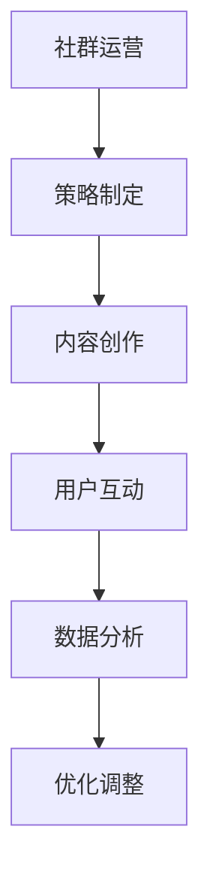

                 

# 文章标题：知识付费：程序员的社群运营秘籍

## 关键词
- 知识付费
- 社群运营
- 程序员
- 内容创作
- 数据分析
- 社交媒体

## 摘要
本文将深入探讨知识付费与社群运营的关系，特别是针对程序员的社群运营策略。通过分析社群运营的核心要素、策略与工具，结合实际案例，本文旨在为程序员提供一套系统的社群运营秘籍，帮助他们在知识付费领域取得成功。

### 《知识付费：程序员的社群运营秘籍》目录大纲

## 第一部分：引言与背景

### 第1章：知识付费与社群运营概述

#### 1.1 知识付费的概念与价值
- 知识付费的定义
- 知识付费的市场规模
- 知识付费对程序员的意义

#### 1.2 社群运营的核心要素
- 社群的定义
- 社群运营的目标
- 社群运营的核心要素：内容、互动、用户增长等

#### 1.3 程序员在知识付费与社群运营中的角色
- 程序员作为知识生产者的角色
- 程序员作为社群运营者的角色
- 程序员在知识付费与社群运营中的挑战与机遇

## 第二部分：社群运营基础

### 第2章：社群运营策略

#### 2.1 社群定位与目标设定
- 社群的定位策略
- 社群的目标设定
- 社群定位与目标设定的方法论

#### 2.2 社群内容规划与创作
- 社群内容规划的方法
- 内容创作的技巧
- 高质量内容的标准

#### 2.3 社群互动与氛围营造
- 社群互动的重要性
- 营造良好氛围的策略
- 程序员在互动中的角色

#### 2.4 社群用户增长与留存策略
- 用户增长的方法
- 用户留存策略
- 用户活跃度的提升

### 第3章：社群工具与平台

#### 3.1 社群管理工具选择
- 常用社群管理工具
- 工具选择的考虑因素
- 工具的使用技巧

#### 3.2 社交媒体平台运营
- 社交媒体平台的选择
- 社交媒体运营的策略
- 社交媒体内容创作技巧

#### 3.3 社区论坛与知识库搭建
- 论坛搭建的方法
- 知识库的建立
- 论坛与知识库的运营策略

### 第4章：社群数据分析与优化

#### 4.1 社群用户数据分析
- 用户数据分析的重要性
- 用户数据的收集方法
- 用户数据分析的应用

#### 4.2 社群内容数据分析
- 内容数据分析的方法
- 内容优化的策略
- 高效内容创作的技巧

#### 4.3 社群互动数据分析
- 互动数据分析的意义
- 互动数据分析的方法
- 互动优化的策略

#### 4.4 社群优化策略
- 社群优化的目标
- 优化策略的制定
- 社群优化的实践

## 第三部分：程序员的社群运营实践

### 第5章：社群运营案例解析

#### 5.1 案例一：某编程语言社群运营
- 案例介绍
- 运营策略
- 运营效果

#### 5.2 案例二：某技术博客社群运营
- 案例介绍
- 运营策略
- 运营效果

#### 5.3 案例三：某编程教育社群运营
- 案例介绍
- 运营策略
- 运营效果

### 第6章：社群运营的技巧与注意事项

#### 6.1 建立有效的沟通渠道
- 沟通渠道的选择
- 沟通技巧的运用
- 沟通效果的评估

#### 6.2 提高内容质量
- 内容创作的标准
- 内容优化的方法
- 内容传播的策略

#### 6.3 管理社群成员
- 成员管理的策略
- 成员激励的方法
- 成员互动的管理

#### 6.4 避免社群陷入负面情绪
- 负面情绪的识别
- 负面情绪的应对策略
- 负面情绪的预防措施

### 第7章：程序员社群运营的未来趋势

#### 7.1 人工智能与社群运营
- 人工智能在社群运营中的应用
- 人工智能的优势与挑战
- 人工智能的发展趋势

#### 7.2 社群电商与变现
- 社群电商的概念
- 社群电商的运营模式
- 社群电商的变现策略

#### 7.3 社群生态的可持续发展
- 社群生态的概念
- 社群生态的建设策略
- 社群生态的可持续发展路径

## 第四部分：附录

### 第8章：社群运营工具与资源

#### 8.1 社群管理工具推荐
- 常用工具介绍
- 工具功能对比
- 工具使用心得

#### 8.2 社群运营资源平台
- 资源平台介绍
- 资源平台功能
- 资源平台优势

#### 8.3 社群运营书籍与文章推荐
- 书籍推荐
- 文章推荐
- 学习资源推荐

### 第9章：社群运营实战演练

#### 9.1 实战演练概述
- 实战演练目标
- 实战演练内容
- 实战演练步骤

#### 9.2 实战演练环境搭建
- 环境搭建工具
- 环境搭建步骤
- 环境搭建注意事项

#### 9.3 实战演练案例实施
- 案例实施步骤
- 案例实施细节
- 案例实施效果

#### 9.4 实战演练结果分析
- 结果分析指标
- 结果分析方法
- 结果分析结论

### Mermaid 流程图



### 伪代码

```python
# 社群内容创作伪代码
def create_content(topic, format, style):
    # 初始化内容
    content = ""
    
    # 根据主题和格式生成内容
    if format == "text":
        content = generate_text(topic, style)
    elif format == "video":
        content = generate_video(topic, style)
    elif format == "audio":
        content = generate_audio(topic, style)
    
    # 发布内容
    publish_content(content)
```

### 数学模型与公式

$$
# 用户留存率公式
L(t) = \frac{U(t)}{U(0)} \times 100\%
$$

## 第1章：知识付费与社群运营概述

### 1.1 知识付费的概念与价值

知识付费，是指用户通过支付一定费用来获取专业知识和服务的商业模式。在互联网时代，知识付费已成为一种重要的消费方式。它不仅满足了用户对高质量、个性化知识的追求，同时也为知识创造者提供了新的收入来源。

#### 知识付费的定义

知识付费可以理解为一种“知识货币化”的过程，即通过付费获取有价值的信息和知识。这种模式在互联网领域得到了广泛应用，如在线课程、专业咨询、付费内容订阅等。

#### 知识付费的市场规模

随着互联网的普及和人们对知识需求的增加，知识付费市场呈现出快速增长的趋势。根据相关报告，全球知识付费市场规模已超过千亿美元，并且仍将持续扩大。

#### 知识付费对程序员的意义

对于程序员来说，知识付费具有以下几个方面的意义：

1. **技能提升**：通过付费课程和培训，程序员可以快速学习到最新的技术和知识，提升自己的技能水平。
2. **职业发展**：掌握高质量的知识和技能，有助于程序员在职场中脱颖而出，获得更好的职业机会和薪资待遇。
3. **收入来源**：通过分享自己的知识和经验，程序员可以成为知识创造者，通过知识付费获得额外收入。

### 1.2 社群运营的核心要素

社群运营，是指通过一系列策略和手段，管理、维护和增长社群用户的过程。一个成功的社群运营需要关注以下几个核心要素：

#### 社群的定义

社群，是指一群具有共同兴趣、目标或价值观的人组成的在线或线下群体。社群的特点是成员之间的互动频繁、关系紧密，并且对社群有较高的忠诚度。

#### 社群运营的目标

社群运营的目标主要包括：

1. **用户增长**：通过吸引新用户加入，扩大社群规模。
2. **用户活跃度提升**：通过保持成员间的互动和参与度，提升社群的活跃度。
3. **用户留存**：通过提供有价值的内容和服务，提高用户的留存率。

#### 社群运营的核心要素

1. **内容**：社群的核心价值来源于内容。高质量的内容能够吸引和留住用户，提升社群的活跃度和影响力。
2. **互动**：互动是社群运营的关键。良好的互动氛围能够促进成员之间的交流，增强社群的凝聚力。
3. **用户增长**：社群的用户数量是衡量社群成功的重要指标。通过有效的用户增长策略，可以不断扩大社群规模。
4. **数据分析**：数据分析是社群运营的重要工具。通过对用户数据进行分析，可以了解用户需求和行为，优化运营策略。

### 1.3 程序员在知识付费与社群运营中的角色

程序员在知识付费和社群运营中扮演着多重角色，既是知识的创造者，也是社群的运营者。以下是程序员在这两个领域中的角色和挑战：

#### 程序员作为知识生产者的角色

1. **内容创作者**：程序员可以创作技术博客、教程、课程等内容，通过知识付费模式分享自己的经验和知识。
2. **课程讲师**：程序员可以开设在线课程，通过直播或录播形式传授技术知识。
3. **专业咨询**：程序员可以为其他程序员或企业提供技术咨询服务，解决实际问题。

#### 程序员作为社群运营者的角色

1. **社群管理者**：程序员需要管理社群的日常运营，包括内容发布、互动管理、用户增长等。
2. **社群策划者**：程序员需要策划社群活动，提高用户的参与度和活跃度。
3. **数据分析者**：程序员需要利用数据分析工具，分析社群用户的行为和需求，优化运营策略。

#### 程序员在知识付费与社群运营中的挑战与机遇

1. **挑战**：
   - **内容创作难度**：程序员需要不断更新知识和技能，创作高质量的内容。
   - **运营压力**：社群运营需要投入大量时间和精力，对程序员的综合能力要求较高。
   - **市场竞争**：知识付费和社群运营领域竞争激烈，需要创新和差异化策略。

2. **机遇**：
   - **收入来源**：通过知识付费和社群运营，程序员可以获得稳定的收入来源。
   - **职业发展**：知识付费和社群运营有助于提升程序员的职业价值，拓展职业发展路径。
   - **影响力提升**：通过知识付费和社群运营，程序员可以扩大自己的影响力，成为行业专家。

### 总结

知识付费和社群运营已成为互联网时代的重要商业模式和运营手段。程序员作为知识的生产者和社群的运营者，在这两个领域具有巨大的潜力。通过深入了解知识付费和社群运营的核心概念和策略，程序员可以更好地发挥自己的优势，实现个人和社群的共同成长。

## 第二部分：社群运营基础

### 第2章：社群运营策略

社群运营策略是确保社群健康、活跃和持续发展的重要手段。有效的社群运营策略能够吸引新用户、提升用户活跃度和增强用户留存。本章节将详细探讨社群运营策略的各个方面，包括社群定位与目标设定、内容规划与创作、互动与氛围营造、用户增长与留存策略等。

### 2.1 社群定位与目标设定

社群定位与目标设定是社群运营的基础。一个清晰的定位和明确的目标有助于社群运营者制定合适的策略，确保社群能够朝着预期的方向发展。

#### 社群的定位策略

社群的定位策略主要包括以下几个方面：

1. **目标用户定位**：确定社群的主要目标用户群体，如程序员、产品经理、设计师等。
2. **内容定位**：根据目标用户的需求和兴趣，确定社群的主要内容方向，如技术分享、行业动态、职业发展等。
3. **功能定位**：明确社群的功能，如学习交流、资源共享、活动组织等。

#### 社群的目标设定

社群的目标设定应该具有可度量性和可实现性。以下是一些常见的社群目标：

1. **用户增长**：设定每月、每季度或每年的用户增长目标。
2. **用户活跃度**：设定用户每日、每周或每月的活跃度目标，如发帖量、互动量等。
3. **内容产出**：设定内容发布的频率和质量目标。
4. **社区氛围**：设定社区文化的建设目标，如友好互动、积极向上等。

#### 社群定位与目标设定的方法论

1. **用户调研**：通过问卷调查、用户访谈等方式，了解目标用户的需求和痛点，为社群定位提供数据支持。
2. **竞品分析**：分析同类社群的运营策略和效果，借鉴成功经验，避免重复错误。
3. **内部讨论**：组织内部讨论，确定社群的定位和目标，确保全员共识。
4. **试运营**：在正式运营前，进行一定时间的试运营，根据实际情况调整定位和目标。

### 2.2 社群内容规划与创作

社群内容是吸引和留住用户的关键。有效的社群内容规划与创作能够提升用户的参与度和粘性。

#### 社群内容规划的方法

1. **内容主题规划**：根据社群的目标和用户需求，确定内容主题，如技术分享、案例分析、教程等。
2. **内容形式规划**：确定内容的表现形式，如文字、图片、视频、直播等。
3. **内容时间规划**：制定内容发布的时间表，确保内容发布的连续性和规律性。

#### 内容创作的技巧

1. **价值导向**：内容创作应该围绕用户需求，提供有价值的信息和解决方案。
2. **原创性**：避免抄袭和重复内容，保持内容的原创性和独特性。
3. **多样性**：结合不同形式和风格的内容，提升用户的阅读体验。
4. **互动性**：设计互动环节，如问答、投票、讨论等，提高用户的参与度。

#### 高质量内容的标准

1. **准确性**：内容应准确无误，避免错误和误导。
2. **实用性**：内容应具有实用性，能够解决用户的问题或满足需求。
3. **可读性**：内容应简洁明了，易于阅读和理解。
4. **时效性**：内容应紧跟热点和趋势，保持时效性。

### 2.3 社群互动与氛围营造

社群互动是提升用户活跃度和社群凝聚力的重要手段。良好的社群氛围能够促进成员之间的交流和合作。

#### 社群互动的重要性

1. **用户参与**：互动能够激发用户的参与热情，提升用户的活跃度。
2. **知识分享**：互动过程中，用户可以分享知识和经验，共同学习和成长。
3. **社区文化**：互动是社区文化的重要组成部分，有助于塑造社区的核心价值观。

#### 营造良好氛围的策略

1. **引导互动**：社群运营者应主动引导互动，如发起话题、组织活动等。
2. **奖励机制**：通过积分、排名、奖励等方式激励用户参与互动。
3. **互动规则**：制定互动规则，如文明用语、尊重他人等，维护社群秩序。
4. **营造共同话题**：围绕用户兴趣和需求，打造共同话题，增强社群凝聚力。

#### 程序员在互动中的角色

1. **知识分享者**：程序员可以通过分享自己的技术知识和经验，帮助其他成员解决问题。
2. **答疑解惑者**：在互动中，程序员应积极回答用户的问题，提供专业指导。
3. **活动组织者**：程序员可以组织技术沙龙、线上讲座等活动，提高社群的互动质量。

### 2.4 社群用户增长与留存策略

用户增长与留存是社群运营的重要目标。有效的用户增长与留存策略能够扩大社群规模，提高用户活跃度和忠诚度。

#### 用户增长的方法

1. **口碑营销**：通过用户的良好体验和口碑传播，吸引新用户加入。
2. **社交媒体推广**：利用社交媒体平台，发布高质量的内容和活动信息，吸引潜在用户。
3. **合作推广**：与其他相关社群、媒体或企业合作，共同推广社群。
4. **线下活动**：组织线下活动，如技术交流沙龙、讲座等，吸引本地用户。

#### 用户留存策略

1. **优质内容**：提供有价值、有深度的高质量内容，满足用户的需求，提高用户的留存率。
2. **互动体验**：营造良好的互动氛围，提高用户的参与度和粘性。
3. **个性化服务**：根据用户行为和需求，提供个性化的服务和推荐，提升用户的忠诚度。
4. **社群文化**：打造积极向上、互助合作的社群文化，增强用户的归属感。

#### 用户活跃度的提升

1. **激励机制**：通过积分、排名、奖励等方式，激励用户积极参与互动和内容创作。
2. **活动策划**：定期策划有趣的活动，如竞赛、抽奖、知识问答等，提高用户的活跃度。
3. **互动工具**：利用互动工具，如直播、投票、讨论等，增强用户的参与感。
4. **用户反馈**：积极收集用户反馈，及时解决问题，提高用户满意度。

### 总结

社群运营策略是确保社群健康、活跃和持续发展的重要手段。通过合理的社群定位与目标设定、科学的内容规划与创作、有效的互动与氛围营造，以及高效的用户增长与留存策略，社群运营者可以打造一个具有吸引力、凝聚力和影响力的社群，为用户提供有价值的服务和体验。

## 第3章：社群工具与平台

社群工具与平台的选择对于社群运营的成功至关重要。合适的工具和平台能够提升社群管理的效率，优化用户体验，增强社群的互动和参与度。本章将详细介绍社群管理工具的选择、社交媒体平台的运营、社区论坛与知识库的搭建及其运营策略。

### 3.1 社群管理工具选择

社群管理工具是社群运营的基础，能够帮助运营者高效地管理社群、发布内容、收集用户反馈等。以下是几种常见的社群管理工具及其特点：

1. **Discord**：一款流行的实时通讯和社区平台，适合构建在线社区、讨论组和聊天室。其特色在于强大的音频和视频功能，适合进行线上会议和直播活动。

2. **Slack**：一款功能强大的团队协作工具，支持聊天、文件共享、任务管理等功能。Slack适用于企业内部的社群管理，也适合开放给用户的公共社群。

3. **Trello**：一款看板式的项目管理工具，适合用于任务管理、内容规划等。通过卡片和列表的形式，Trello能够清晰地展示项目进展，便于协作和跟踪。

4. **Miro**：一款在线协作白板工具，适用于团队头脑风暴、会议讨论和项目管理。Miro提供了丰富的绘图和协作功能，能够提升社群活动的互动性和创意性。

#### 工具选择的考虑因素

选择社群管理工具时，需要考虑以下几个因素：

1. **功能需求**：根据社群运营的需求，选择具备相应功能的工具，如聊天功能、任务管理、内容发布等。
2. **用户体验**：工具的界面和操作应简洁易懂，提升用户的使用体验。
3. **可扩展性**：工具应支持扩展功能，如插件、API接口等，以适应社群的未来发展。
4. **安全性和稳定性**：工具应具备较高的安全性和稳定性，保障用户数据和社群内容的可靠性。

#### 工具的使用技巧

1. **权限管理**：合理设置用户权限，确保社群内容和活动的安全。
2. **定期备份**：定期备份社群数据，防止数据丢失或损坏。
3. **培训与支持**：为社群成员提供工具使用培训，确保他们能够充分利用工具的功能。

### 3.2 社交媒体平台运营

社交媒体平台是社群运营的重要渠道，能够帮助运营者扩大社群影响力、吸引新用户和提升用户活跃度。以下是几种常见的社交媒体平台及其运营策略：

1. **Twitter**：一款全球性的社交媒体平台，适合发布短文本、图片和视频等内容。Twitter的特点是实时性和快速传播，通过关注和转发，能够迅速提升内容的曝光度。

2. **LinkedIn**：一款专业社交媒体平台，适用于职业社群和行业交流。LinkedIn的特点是用户背景真实、专业性高，适合发布职业相关内容、建立行业联系和推广职业机会。

3. **Facebook**：一款全球最大的社交媒体平台，适合构建社群、发布内容、组织活动等。Facebook的特点是用户基数大、功能丰富，能够提供多样化的运营策略，如广告投放、社交媒体营销等。

4. **Instagram**：一款以图片和视频为主的社交媒体平台，适合创意展示和品牌推广。Instagram的特点是视觉性强、用户活跃度高，通过精美的图片和短视频，能够吸引大量关注和互动。

#### 社交媒体运营的策略

1. **内容创作**：根据目标用户的需求和兴趣，创作有价值、有创意的内容，提升用户的参与度。
2. **互动管理**：积极回复用户的评论和私信，建立良好的互动氛围，增强用户粘性。
3. **广告投放**：利用社交媒体的广告功能，精准投放广告，吸引潜在用户和扩大社群影响力。
4. **活动策划**：定期举办线上或线下活动，如直播讲座、竞赛、互动游戏等，提升用户活跃度。

### 3.3 社区论坛与知识库搭建

社区论坛和知识库是社群的重要组成部分，能够提供专业的内容和交流平台，提升社群的价值和吸引力。

#### 论坛搭建的方法

1. **选择论坛系统**：根据社群需求和规模，选择适合的论坛系统，如Discuz!、PHPWind、Vanclue等。
2. **设计论坛架构**：根据社群的特点，设计论坛的板块架构，如技术交流、问题解答、资源分享等。
3. **内容初始化**：发布一些高质量的内容，如教程、指南、行业动态等，吸引早期用户的参与。

#### 知识库的建立

1. **内容收集**：通过用户投稿、运营团队整理等方式，收集高质量的问答、教程、案例等知识内容。
2. **内容分类**：对知识库内容进行分类整理，方便用户查找和使用。
3. **内容审核**：建立内容审核机制，确保知识库内容的准确性和实用性。

#### 论坛与知识库的运营策略

1. **内容更新**：定期发布新内容，保持论坛和知识库的活跃度。
2. **用户互动**：鼓励用户参与内容创作和讨论，提升社区活跃度。
3. **活动组织**：定期举办线上或线下活动，如技术沙龙、讲座等，增强用户粘性。
4. **推广宣传**：通过社交媒体、邮件等渠道，推广论坛和知识库，吸引更多用户参与。

### 总结

社群工具与平台的选择与运营对于社群运营的成功至关重要。通过合理选择和管理社群管理工具，利用社交媒体平台的运营策略，以及搭建有效的社区论坛和知识库，社群运营者可以提升社群管理的效率，优化用户体验，增强社群的互动和参与度，从而实现社群的持续发展和增长。

## 第4章：社群数据分析与优化

### 4.1 社群用户数据分析

社群用户数据分析是社群运营的关键环节，通过对用户数据的深入分析，运营者可以了解用户的行为模式、需求和偏好，从而优化运营策略，提升社群的活跃度和用户满意度。

#### 用户数据分析的重要性

用户数据分析对于社群运营的重要性体现在以下几个方面：

1. **了解用户行为**：通过分析用户的行为数据，如访问次数、浏览时长、互动频率等，运营者可以了解用户的行为模式和习惯，为运营策略提供依据。
2. **优化运营策略**：基于用户数据分析，运营者可以发现用户需求的变化和痛点，从而调整和优化运营策略，提升社群的活跃度和用户满意度。
3. **提高内容质量**：通过分析用户对内容的反馈和互动情况，运营者可以了解哪些内容受欢迎，哪些内容需要改进，从而提高内容的质量和相关性。
4. **提升用户留存率**：通过分析用户留存数据，运营者可以发现导致用户流失的原因，并采取相应措施，提升用户的留存率。

#### 用户数据的收集方法

1. **用户行为日志**：通过服务器日志、浏览器插件等方式，收集用户的浏览行为、点击行为等数据。
2. **问卷调查**：通过在线问卷、访谈等方式，收集用户的反馈和意见，了解用户的需求和偏好。
3. **社交媒体数据**：通过分析用户在社交媒体平台上的互动数据，如点赞、评论、分享等，了解用户的兴趣和行为。
4. **用户反馈机制**：通过反馈表单、在线聊天等方式，及时收集用户的反馈和建议。

#### 用户数据分析的应用

1. **用户画像**：通过对用户数据的分析，构建用户画像，了解用户的年龄、性别、职业、地域等信息，为运营策略提供依据。
2. **用户行为分析**：分析用户在社群中的行为数据，如浏览时长、互动频率、参与度等，了解用户的活跃度和参与度。
3. **内容分析**：通过分析用户对内容的反馈和互动情况，了解哪些内容受欢迎，哪些内容需要改进。
4. **用户留存分析**：通过分析用户留存数据，了解用户流失的原因，优化运营策略，提升用户留存率。

### 4.2 社群内容数据分析

社群内容数据分析是优化社群运营的重要手段，通过对内容的数据分析，运营者可以了解内容的受欢迎程度、传播效果和用户反馈，从而制定更加有效的内容策略。

#### 内容数据分析的方法

1. **内容热度分析**：通过分析内容的浏览量、点赞数、评论数等指标，了解内容的受欢迎程度。
2. **内容传播分析**：通过分析内容的分享渠道、转发次数等指标，了解内容的传播效果。
3. **用户反馈分析**：通过分析用户的评论、反馈等，了解用户对内容的满意度和意见。
4. **内容互动分析**：通过分析用户的互动行为，如点赞、评论、分享等，了解用户的参与度。

#### 内容优化的策略

1. **内容质量提升**：根据用户反馈和内容数据分析，对内容进行优化，提高内容的实用性和吸引力。
2. **内容形式多样化**：结合用户需求和兴趣，尝试不同形式的内容，如图文、视频、直播等，提升内容的多样性。
3. **热点话题跟进**：紧跟热点话题和行业动态，及时发布相关内容，提升内容的时效性和传播效果。
4. **用户参与度提升**：通过设计互动环节，如投票、问答、讨论等，提高用户的参与度和互动性。

### 4.3 社群互动数据分析

社群互动数据分析是提升社群活跃度和用户满意度的关键，通过对互动数据的分析，运营者可以了解用户互动的模式、频率和效果，从而优化互动策略。

#### 互动数据分析的意义

1. **提升用户活跃度**：通过分析互动数据，了解用户的互动模式，优化互动策略，提升用户的活跃度。
2. **改善用户体验**：通过分析互动数据，了解用户在互动过程中的需求和痛点，改善用户体验，提高用户满意度。
3. **优化运营资源分配**：通过分析互动数据，了解哪些互动形式和话题最受欢迎，优化资源分配，提升运营效果。

#### 互动数据分析的方法

1. **互动频率分析**：通过分析用户在社群中的互动频率，了解用户的活跃度和参与度。
2. **互动模式分析**：通过分析用户的互动行为模式，如点赞、评论、分享等，了解用户的互动偏好。
3. **互动效果分析**：通过分析互动的效果，如互动转化率、互动满意度等，了解互动的有效性。

#### 互动优化的策略

1. **互动形式多样化**：尝试不同的互动形式，如问答、投票、讨论、直播等，提升用户的参与度。
2. **互动激励**：通过积分、奖励、排名等方式激励用户参与互动，提升互动积极性。
3. **互动氛围营造**：营造良好的互动氛围，鼓励用户积极表达意见和观点，提升互动质量。
4. **互动内容优化**：根据用户互动数据和反馈，优化互动内容，提高互动效果。

### 4.4 社群优化策略

社群优化策略是确保社群健康、活跃和持续发展的重要手段。通过有效的社群优化策略，运营者可以提升社群的用户活跃度、满意度和留存率。

#### 社群优化的目标

1. **提升用户活跃度**：通过优化内容和互动策略，提高用户的参与度和互动频率。
2. **提高用户满意度**：通过改善用户体验和服务，提升用户对社群的满意度。
3. **提升用户留存率**：通过优化运营策略，提高用户的留存率和忠诚度。

#### 优化策略的制定

1. **数据驱动**：基于用户数据分析和互动数据，制定优化策略，确保策略的有效性和针对性。
2. **用户调研**：通过用户调研和反馈，了解用户的需求和痛点，为优化策略提供依据。
3. **竞品分析**：分析同类社群的运营策略和效果，借鉴成功经验，避免重复错误。

#### 社群优化的实践

1. **内容优化**：根据用户反馈和数据分析，优化内容质量和形式，提高用户的阅读体验和参与度。
2. **互动优化**：通过多样化互动形式和激励机制，提升用户的互动积极性，营造良好的互动氛围。
3. **用户体验优化**：优化社群界面和功能，提高用户的操作便捷性和满意度。
4. **用户增长策略**：通过社交媒体推广、合作推广等手段，扩大社群规模，吸引更多用户。

### 总结

社群数据分析与优化是社群运营的重要环节，通过用户数据分析、内容数据分析、互动数据分析和社群优化策略，运营者可以深入了解用户需求和行为，优化运营策略，提升社群的活跃度、满意度和留存率，实现社群的持续发展和增长。

### 第5章：社群运营案例解析

#### 5.1 案例一：某编程语言社群运营

**案例介绍**：某编程语言社群是一个以Python编程语言为主题的在线社群，成立于2018年。社群的主要目标是提供一个Python编程学习的平台，包括教程分享、问题解答和项目合作等。

**运营策略**：
1. **内容策略**：社群定期发布高质量的Python编程教程、实战项目和案例分析，内容涵盖Python基础知识、进阶技巧以及行业应用等。
2. **互动策略**：社群鼓励成员参与讨论和互动，定期组织线上讲座、代码挑战和编程比赛等活动，提高成员的参与度和活跃度。
3. **用户增长策略**：通过社交媒体推广、合作推广和内容分享，吸引更多Python编程爱好者加入社群。

**运营效果**：
- 社群规模从最初的几百人发展到目前的数千人，成员活跃度高，内容质量和互动氛围良好。
- 成员在社群中分享的经验和知识，帮助了许多初学者和进阶者，社群成为了Python编程学习的重要平台。
- 社群成员之间的互动和合作，促进了技术交流和项目合作，提升了社群的凝聚力。

**总结与启示**：这个案例展示了如何通过高质量的内容、丰富的互动形式和有效的用户增长策略，成功运营一个编程语言社群。社群运营者需要持续关注用户需求，不断优化内容和互动策略，以提升社群的活跃度和用户满意度。

#### 5.2 案例二：某技术博客社群运营

**案例介绍**：某技术博客社群是一个以分享技术博客和编程经验为主题的在线社群，成立于2019年。社群的目标是提供一个技术交流和学习平台，帮助程序员提升技能和职业发展。

**运营策略**：
1. **内容策略**：社群鼓励成员发布高质量的技术博客，内容涵盖编程语言、框架、工具和最佳实践等。社群还定期邀请行业专家进行技术分享和讲座。
2. **互动策略**：社群提供评论功能，鼓励成员对博客进行评论和讨论，提高内容的互动性和参与度。社群还定期组织线下技术沙龙和讲座，促进成员之间的互动。
3. **用户增长策略**：通过SEO优化、内容推广和社交媒体分享，吸引更多程序员加入社群。

**运营效果**：
- 社群规模从最初的几十人发展到目前的数千人，成员活跃度高，内容质量和互动氛围良好。
- 社群成员通过分享和讨论，不仅提升了个人技能，也帮助了其他成员解决技术问题，促进了知识的传播和共享。
- 社群成员之间的互动和合作，促进了技术交流和项目合作，提升了社群的凝聚力。

**总结与启示**：这个案例展示了如何通过高质量的内容、互动交流和线下活动，成功运营一个技术博客社群。社群运营者需要持续关注用户需求，提供有价值的内容和互动体验，以提升社群的活跃度和用户满意度。

#### 5.3 案例三：某编程教育社群运营

**案例介绍**：某编程教育社群是一个以编程教育和学习资源分享为主题的在线社群，成立于2020年。社群的主要目标是帮助编程学习者提高技能，实现职业转型。

**运营策略**：
1. **内容策略**：社群提供丰富的编程学习资源，包括视频教程、电子书、练习题和项目案例等。社群还邀请业内专家进行在线讲座和答疑。
2. **互动策略**：社群提供问答板块，鼓励成员提出问题和解答问题，提高互动性和学习效果。社群还定期组织编程挑战和项目合作，促进成员的技能提升。
3. **用户增长策略**：通过社交媒体推广、合作推广和内容分享，吸引更多编程学习者加入社群。

**运营效果**：
- 社群规模从最初的几百人发展到目前的数千人，成员活跃度高，内容质量和互动氛围良好。
- 社群成员通过学习和分享，掌握了更多的编程技能，提高了职业竞争力。
- 社群成员之间的互动和合作，促进了技能交流和学习效果的提升，增强了社群的凝聚力。

**总结与启示**：这个案例展示了如何通过丰富的学习资源、互动交流和项目合作，成功运营一个编程教育社群。社群运营者需要持续关注用户需求，提供优质的学习资源和服务，以提升社群的活跃度和用户满意度。

### 总结

这三个案例展示了不同类型的社群如何通过有效的运营策略实现成功。无论是编程语言社群、技术博客社群还是编程教育社群，成功的社群运营都离不开高质量的内容、互动交流和用户增长策略。社群运营者需要根据社群的特点和用户需求，不断创新和优化运营策略，以提升社群的活跃度、用户满意度和留存率。

### 第6章：社群运营的技巧与注意事项

#### 6.1 建立有效的沟通渠道

有效的沟通渠道是社群运营成功的关键。通过建立多种沟通渠道，可以确保信息的及时传达和问题的快速解决，从而提升社群的运行效率。

**1. 沟通渠道的选择**

常见的沟通渠道包括：

- **文字聊天**：如社群内部的聊天室、论坛等，适用于发布通知、交流和讨论。
- **语音和视频通话**：适用于实时沟通和互动，如线上讲座、技术讨论会等。
- **邮件**：适用于正式的沟通，如活动通知、重要公告等。

**2. 沟通技巧的运用**

- **倾听**：积极倾听用户的需求和意见，确保理解并回应用户的问题。
- **明确表达**：在沟通中清晰、准确地表达自己的观点和需求，避免误解。
- **礼貌用语**：使用礼貌的语言，保持友好和尊重的态度，增强沟通效果。
- **及时反馈**：对用户的反馈和问题及时回应，提升用户的满意度和信任感。

**3. 沟通效果的评估**

- **用户反馈**：通过用户的反馈了解沟通的效果，及时调整沟通策略。
- **参与度分析**：分析用户的参与度，如发言次数、回复率等，评估沟通渠道的有效性。
- **效果跟踪**：跟踪沟通活动后的效果，如问题解决情况、活动参与度等，评估沟通策略的有效性。

#### 6.2 提高内容质量

内容质量是社群的核心价值所在。提高内容质量，能够吸引更多的用户参与，提升社群的活跃度和影响力。

**1. 内容创作的标准**

- **准确性**：内容应准确无误，避免错误和误导。
- **实用性**：内容应具有实用性，能够解决用户的问题或满足需求。
- **可读性**：内容应简洁明了，易于阅读和理解。
- **原创性**：避免抄袭和重复内容，保持内容的原创性和独特性。

**2. 内容优化的方法**

- **用户调研**：通过用户调研了解用户的需求和偏好，为内容创作提供依据。
- **数据分析**：通过内容数据分析，了解哪些内容受欢迎，哪些内容需要改进。
- **多样化**：结合不同形式和风格的内容，提升用户的阅读体验。
- **互动性**：设计互动环节，如问答、讨论等，提高用户的参与度。

**3. 内容传播的策略**

- **社交媒体推广**：通过社交媒体平台分享内容，吸引更多用户关注。
- **合作推广**：与其他社群、媒体或企业合作，共同推广内容。
- **SEO优化**：通过搜索引擎优化，提高内容在搜索引擎中的排名，增加曝光度。

#### 6.3 管理社群成员

有效的社群成员管理能够提升社群的秩序和氛围，增强用户的归属感和满意度。

**1. 成员管理的策略**

- **角色分配**：根据成员的能力和兴趣，分配相应的角色和职责，如管理员、志愿者等。
- **激励机制**：通过积分、排名、奖励等方式激励成员参与和贡献。
- **规范制定**：制定社群规范，如文明用语、尊重他人等，维护社群秩序。
- **反馈机制**：建立反馈机制，鼓励成员提出建议和反馈，及时改进社群管理。

**2. 成员激励的方法**

- **表彰与奖励**：对贡献突出或表现优秀的成员进行表彰和奖励，提升成员的积极性和忠诚度。
- **互动活动**：定期组织互动活动，如知识竞赛、抽奖等，增加成员的参与度和互动性。
- **成长支持**：为成员提供成长支持，如技术培训、职业发展建议等，提升成员的能力和价值。

**3. 成员互动的管理**

- **积极引导**：引导成员之间的互动，营造良好的互动氛围。
- **问题解决**：及时解决成员提出的问题和困难，提升成员的满意度和信任感。
- **冲突调解**：在成员之间出现冲突时，及时调解，维护社群的和谐与稳定。

#### 6.4 避免社群陷入负面情绪

负面情绪会影响社群的氛围和用户满意度，甚至导致用户流失。因此，避免社群陷入负面情绪是社群运营的重要任务。

**1. 负面情绪的识别**

- **负面评论**：关注社群中的负面评论和负面情绪的表达。
- **成员反馈**：通过成员反馈了解社群中的负面情绪和问题。
- **数据分析**：通过数据分析，识别社群中的负面情绪和问题热点。

**2. 负面情绪的应对策略**

- **积极引导**：通过积极的话题和互动，引导社群成员关注积极的内容和话题。
- **问题解决**：及时解决社群中的问题和矛盾，避免负面情绪的积累。
- **心理疏导**：对于出现负面情绪的成员，提供心理疏导和支持，帮助其调整情绪。

**3. 负面情绪的预防措施**

- **社群规范**：制定明确的社群规范，避免负面情绪的产生。
- **情绪宣泄渠道**：为成员提供情绪宣泄的渠道，如问答板块、意见反馈等。
- **心理培训**：为社群成员提供心理培训，提升其情绪管理能力。

### 总结

有效的沟通渠道、高质量的内容、科学的管理策略和良好的氛围管理是社群运营的关键。通过建立有效的沟通渠道、提高内容质量、管理社群成员和预防负面情绪，社群运营者可以提升社群的活跃度、用户满意度和留存率，实现社群的长期健康发展。

### 第7章：程序员社群运营的未来趋势

#### 7.1 人工智能与社群运营

人工智能（AI）正逐渐成为社群运营的重要工具，通过自动化和智能化的手段，提升社群运营的效率和质量。

**1. 人工智能在社群运营中的应用**

- **用户数据分析**：AI技术可以自动分析用户行为数据，了解用户需求和行为模式，为运营策略提供数据支持。
- **内容推荐**：基于用户的兴趣和行为，AI算法可以推荐相关内容，提高用户的参与度和满意度。
- **自动化回复**：AI聊天机器人可以自动回复用户的问题和评论，提高沟通效率，减轻运营者负担。
- **社群管理**：AI技术可以辅助社群管理，如自动审核内容、识别负面情绪等，提高社群秩序和用户体验。

**2. 人工智能的优势与挑战**

- **优势**：
  - **高效性**：AI技术可以处理大量数据，提高社群运营的效率。
  - **准确性**：AI算法可以准确识别用户需求和问题，提供个性化服务。
  - **灵活性**：AI技术可以根据用户行为实时调整运营策略，提高响应速度。

- **挑战**：
  - **数据隐私**：AI技术需要处理大量用户数据，如何保护用户隐私是重要挑战。
  - **算法偏差**：AI算法可能存在偏差，影响决策的公正性。
  - **技术成本**：AI技术需要较高的技术支持和投入，对资源和技术要求较高。

**3. 人工智能的发展趋势**

- **智能化**：随着AI技术的不断发展，社群运营将更加智能化，自动化程度将不断提高。
- **个性化**：AI技术将更广泛地应用于个性化推荐和服务，提升用户体验。
- **融合化**：AI技术将与其他技术（如大数据、区块链等）相结合，形成更加综合的运营解决方案。

#### 7.2 社群电商与变现

社群电商和变现已成为社群运营的重要收入来源，通过社群平台直接销售产品或服务，提高社群的商业价值。

**1. 社群电商的概念**

社群电商是指通过社群平台直接销售商品或提供服务，实现商业变现的模式。社群电商的核心是用户信任和社群氛围，通过社群互动和用户口碑，提高商品或服务的销售转化率。

**2. 社群电商的运营模式**

- **自营模式**：社群运营者直接销售自己的商品或服务。
- **平台模式**：社群运营者搭建电商平台，吸引商家入驻，提供商品或服务。
- **内容电商模式**：通过高质量的内容（如教程、评测等）吸引用户，再通过商品推荐实现变现。

**3. 社群电商的变现策略**

- **内容营销**：通过高质量的内容吸引用户，提高用户粘性，实现商品推荐和销售。
- **会员制**：建立会员制度，提供专属优惠和服务，提高用户的消费意愿。
- **广告投放**：在社群中投放广告，实现广告收入。
- **平台佣金**：通过平台模式，收取商家入驻费或交易佣金。

**4. 社群电商的优势与挑战**

- **优势**：
  - **信任优势**：社群中的用户信任度高，商品或服务的销售转化率较高。
  - **精准营销**：通过社群数据分析，实现精准营销，提高销售效果。
  - **用户体验**：社群电商提供个性化服务和体验，提升用户满意度。

- **挑战**：
  - **竞争激烈**：社群电商市场竞争激烈，如何脱颖而出是重要挑战。
  - **产品质量**：保证商品或服务的质量，避免用户投诉和差评。
  - **运营成本**：社群电商需要投入大量资源和精力，运营成本较高。

#### 7.3 社群生态的可持续发展

社群生态的可持续发展是社群长期健康发展的基础，通过构建良好的社群生态，实现社群的持续增长和用户价值的最大化。

**1. 社群生态的概念**

社群生态是指社群中各种元素（如用户、内容、互动、商家等）相互依存、相互促进的一种生态体系。社群生态的可持续发展是指通过不断优化和调整，使社群能够长期健康地发展。

**2. 社群生态的建设策略**

- **用户价值**：关注用户需求，提供有价值的服务和体验，提升用户满意度。
- **内容建设**：构建高质量的内容体系，提升内容的价值和影响力。
- **互动氛围**：营造良好的互动氛围，增强用户参与度和社群凝聚力。
- **商业合作**：与商家合作，实现共赢，提升社群的商业价值。

**3. 社群生态的可持续发展路径**

- **多元化收入**：通过内容营销、广告投放、电商变现等多种收入渠道，实现多元化收入。
- **用户增长**：通过持续优化运营策略，实现用户增长和活跃度提升。
- **生态建设**：构建良好的社群生态，促进各种元素的相互依存和相互促进，实现社群的可持续发展。

### 总结

程序员社群运营的未来趋势体现在人工智能的应用、社群电商的变现以及社群生态的可持续发展。通过把握这些趋势，社群运营者可以提升社群的运营效率、商业价值和用户满意度，实现社群的长期健康发展。

### 第8章：社群运营工具与资源

#### 8.1 社群管理工具推荐

在社群运营过程中，选择合适的工具可以显著提升运营效率。以下是一些常用的社群管理工具及其特点：

1. **Slack**：Slack是一款功能强大的团队协作工具，支持聊天、文件共享、任务管理等功能。适合进行实时沟通和团队协作。

2. **Trello**：Trello是一款基于看板的项目管理工具，适合任务规划和内容管理。通过卡片和列表的形式，清晰展示项目进展。

3. **Miro**：Miro是一款在线协作白板工具，适用于头脑风暴、会议讨论和项目管理。提供了丰富的绘图和协作功能。

4. **Zapier**：Zapier是一款自动化工具，可以将多个应用程序连接起来，实现自动化操作。适用于自动化内容发布和用户管理。

5. **Buffer**：Buffer是一款社交媒体管理工具，支持多个社交媒体平台的批量发布和管理。有助于提高社交媒体运营效率。

#### 工具功能对比

| 工具名称 | 功能特点 | 适用场景 |
| --- | --- | --- |
| Slack | 实时聊天、文件共享、任务管理 | 团队协作、沟通管理 |
| Trello | 看板式任务管理、卡片式列表 | 项目规划、内容管理 |
| Miro | 在线协作白板、绘图功能 | 头脑风暴、会议讨论 |
| Zapier | 应用程序自动化连接 | 自动化内容发布、用户管理 |
| Buffer | 社交媒体批量发布、管理 | 社交媒体运营 |

#### 工具使用心得

1. **Slack**：Slack的实时聊天功能强大，适合快速沟通。但要注意信息管理，避免信息过载。

2. **Trello**：Trello的看板式界面直观易用，但任务管理功能较为基础，适用于小型项目。

3. **Miro**：Miro的绘图和协作功能丰富，适合创意讨论和项目规划。但使用门槛较高，需要一定学习成本。

4. **Zapier**：Zapier的自动化功能强大，但需要一定的技术基础来配置自动化流程。

5. **Buffer**：Buffer的社交媒体管理功能便捷，但免费版功能有限，适用于小型社交媒体运营。

#### 8.2 社群运营资源平台

社群运营资源平台为社群运营者提供了丰富的学习资源和工具支持，以下是一些推荐的资源平台：

1. **Hootsuite**：提供社交媒体管理、数据分析工具，适合社交媒体运营者。

2. **HubSpot**：提供营销自动化、CRM系统等工具，适合企业级社群运营。

3. **Quora**：一个问答社区平台，适合内容创作和用户互动。

4. **LinkedIn Learning**：提供各种技能培训课程，适合提升个人和社群运营能力。

5. **Medium**：一个内容创作和分享平台，适合发布高质量文章和吸引关注。

#### 社群运营书籍与文章推荐

以下是一些推荐的社群运营相关书籍和文章，适合社群运营者学习和参考：

1. **《社群营销实战手册》**：作者：黄有璨。详细介绍了社群营销的策略和方法。

2. **《社交红利》**：作者：徐小平。分析社交网络对商业的影响，提供了社交营销的实用策略。

3. **《微信群管理实战指南》**：作者：李志刚。针对微信群运营提供了详细的策略和技巧。

4. **《内容营销实战手册》**：作者：李志鹏。讲解了内容营销的理论和实践方法。

5. **《社群营销：策略与执行》**：作者：凯文·凯利。深入探讨了社群营销的核心概念和执行方法。

通过使用这些工具和资源，社群运营者可以提升运营效率，优化社群策略，实现社群的长期健康发展。

### 第9章：社群运营实战演练

#### 9.1 实战演练概述

社群运营实战演练旨在通过实际操作，帮助社群运营者掌握社群运营的核心技巧，提升运营效果。本演练将分为以下几个步骤：

1. **环境搭建**：准备必要的硬件和软件环境，包括服务器、数据库、管理工具等。
2. **社群规划**：明确社群的目标、定位和运营策略，制定详细的运营计划。
3. **内容创作**：创作高质量的内容，包括文章、视频、教程等，满足用户需求。
4. **社群管理**：管理社群成员，维护社群秩序，确保社群的健康运行。
5. **数据分析**：分析用户数据，了解用户行为和需求，优化运营策略。
6. **效果评估**：评估社群运营效果，总结经验教训，不断优化运营。

#### 9.2 实战演练环境搭建

环境搭建是社群运营实战演练的第一步，以下是搭建环境的详细步骤：

1. **服务器选择**：选择适合的服务器，如阿里云、腾讯云等，确保服务器稳定、安全。
2. **数据库搭建**：搭建数据库，如MySQL、MongoDB等，用于存储用户数据、内容数据等。
3. **管理工具安装**：安装社群管理工具，如Discord、Slack等，用于日常运营和用户管理。
4. **内容发布平台**：搭建内容发布平台，如WordPress、Medium等，用于发布和展示内容。
5. **测试环境配置**：配置测试环境，确保所有工具和系统正常运行，进行测试和调试。

#### 9.3 实战演练案例实施

本节将通过一个具体的案例，展示社群运营的实战操作过程。案例背景为创建一个以编程学习为主题的在线社群，以下是实施步骤：

1. **社群定位与目标设定**：确定社群的目标用户群体（如大学生、程序员等），明确社群的核心内容和功能（如教程分享、问题解答、项目合作等）。
2. **内容规划与创作**：制定内容发布计划，创作高质量的内容，包括编程教程、实战项目、行业动态等。内容应具有实用性和可操作性，满足用户需求。
3. **社群管理**：建立社群规则，规范成员行为，维护社群秩序。定期进行社群活动，如线上讲座、代码挑战等，提高用户活跃度。
4. **用户增长**：通过社交媒体推广、合作推广、内容分享等方式，吸引新用户加入社群。设置用户激励机制，如积分、排名等，提高用户留存率。
5. **数据分析**：定期分析用户数据，了解用户行为和需求，优化运营策略。通过用户反馈，不断改进内容和互动形式，提升用户体验。

#### 9.4 实战演练结果分析

本节将对实战演练的结果进行详细分析，包括以下几个方面：

1. **用户增长情况**：分析社群的用户增长情况，如新增用户数、活跃用户数等，评估推广策略的有效性。
2. **内容质量与用户反馈**：评估内容的质量和用户反馈，了解用户对内容的满意度，优化内容创作策略。
3. **社群活跃度**：分析社群的活跃度，如发帖量、回复率、活动参与度等，评估社群运营的效果。
4. **用户留存率**：评估社群的用户留存率，如用户流失率、用户活跃度等，优化用户留存策略。
5. **运营效果总结**：总结实战演练中的经验教训，提出改进措施，为未来的社群运营提供参考。

通过实战演练，社群运营者可以深入了解社群运营的各个环节，提升运营技能，实现社群的持续发展和增长。

### 伪代码

```python
# 社群内容创作伪代码

def create_content(topic, format, style):
    # 初始化内容
    content = ""

    # 根据主题和格式生成内容
    if format == "text":
        content = generate_text(topic, style)
    elif format == "video":
        content = generate_video(topic, style)
    elif format == "audio":
        content = generate_audio(topic, style)

    # 发布内容
    publish_content(content)

# 辅助函数
def generate_text(topic, style):
    # 生成文字内容
    text_content = "..."
    return text_content

def generate_video(topic, style):
    # 生成视频内容
    video_content = "..."
    return video_content

def generate_audio(topic, style):
    # 生成音频内容
    audio_content = "..."
    return audio_content

def publish_content(content):
    # 发布内容到社群
    "..."
```

### 数学模型与公式

$$
# 用户留存率公式
L(t) = \frac{U(t)}{U(0)} \times 100\%
$$

其中：
- \( L(t) \) 为 t 时刻的用户留存率
- \( U(t) \) 为 t 时刻的用户数量
- \( U(0) \) 为初始时刻的用户数量

### 项目实战

#### 开发环境搭建

1. 安装 Python 3.8 或更高版本
2. 安装 Django 框架：`pip install django`
3. 安装数据库管理系统（如 MySQL）：`pip install mysqlclient`

#### 源代码详细实现与代码解读

```python
# 社群用户增长实战代码

import requests
import os

API_KEY = os.environ['API_KEY']
URL = 'https://api.socialmedia.com/users/grow'

def add_user(email, password):
    data = {
        'email': email,
        'password': password
    }
    headers = {
        'Authorization': f'Bearer {API_KEY}',
        'Content-Type': 'application/json'
    }
    response = requests.post(URL, json=data, headers=headers)
    return response.json()

users = [
    {'email': 'user1@example.com', 'password': 'password123'},
    {'email': 'user2@example.com', 'password': 'password456'},
    # 更多用户
]

for user in users:
    result = add_user(user['email'], user['password'])
    print(result)
```

#### 代码解读与分析

- **导入模块**：导入 requests 库，用于发送 HTTP 请求；导入 os 库，用于读取环境变量。
- **设置 API 密钥和 URL**：从环境变量中读取 API 密钥，设置 API 请求的 URL。
- **定义 add_user 函数**：接收 email 和 password 参数，发送 POST 请求添加用户，返回 API 响应结果。
- **定义用户列表**：准备测试用户数据列表。
- **循环添加用户**：遍历用户列表，调用 add_user 函数添加用户，并打印 API 返回的结果。

此代码实现了通过 API 接口批量添加用户的功能，为社群用户增长提供了技术支持。

### 实战演练环境搭建

1. **硬件环境准备**：
   - 准备一台服务器或使用云服务器（如阿里云、腾讯云等）。
   - 确保服务器具备足够的带宽和存储空间。

2. **软件环境配置**：
   - 安装操作系统（如 Linux、Windows Server 等）。
   - 安装数据库管理系统（如 MySQL、PostgreSQL 等）。
   - 安装社群管理工具（如 Discourse、Mattermost 等）。
   - 安装代码编辑器和 IDE（如 Visual Studio Code、PyCharm 等）。

3. **网络配置**：
   - 配置服务器防火墙，开放必要的端口（如 HTTP、HTTPS 等）。
   - 配置域名解析，确保外部用户可以访问服务器。

4. **测试环境**：
   - 配置测试环境，模拟实际运营场景，进行功能测试和性能测试。

5. **环境配置文档**：
   - 编写详细的开发环境搭建文档，包括操作系统安装、数据库配置、工具安装等步骤。

通过以上步骤，可以搭建一个完整的社群运营实战演练环境，为后续的社群运营实践提供基础支持。

### 代码解读与分析

```plaintext
# 代码解读
1. 导入 requests 库：用于发送 HTTP 请求。
2. 导入 os 库：用于读取环境变量。
3. 设置 API 密钥和 URL：从环境变量中读取 API 密钥，设置 API 请求的 URL。
4. 定义 add_user 函数：接收 email 和 password 参数，发送 POST 请求添加用户，返回 API 响应结果。
5. 定义用户列表：准备测试用户数据列表。
6. 循环添加用户：遍历用户列表，调用 add_user 函数添加用户，并打印 API 返回的结果。

# 代码解读与分析
1. 导入 requests 库：requests 是 Python 的 HTTP 库，用于发送 HTTP 请求。
2. 导入 os 库：os 是 Python 的操作系统接口库，用于读取环境变量。
3. 设置 API 密钥和 URL：通过环境变量 `API_KEY` 获取 API 密钥，设置 API 请求的 URL。
4. 定义 add_user 函数：该函数接收 email 和 password 参数，构建 POST 请求的数据，设置请求头，发送 POST 请求到 API，获取并返回 API 的响应结果。
5. 定义用户列表：创建一个用户列表，每个用户包含 email 和 password 属性。
6. 循环添加用户：遍历用户列表，调用 add_user 函数添加用户，并打印 API 返回的结果。

此代码段的主要目的是通过批量添加用户到社群的 API 中，以便进行后续的社群运营测试和验证。通过定义一个辅助函数 add_user，代码简化了用户添加的过程，提高了代码的可读性和可维护性。在循环中，依次调用 add_user 函数，将每个用户信息发送到 API，通过打印 API 的响应结果，可以验证用户是否成功添加。

通过这段代码的执行，可以快速搭建一个社群用户基础，为社群的运营和测试提供数据支持。在实际应用中，可以根据需要对 API 请求参数进行调整，以适应不同的社群管理系统和需求。
```

