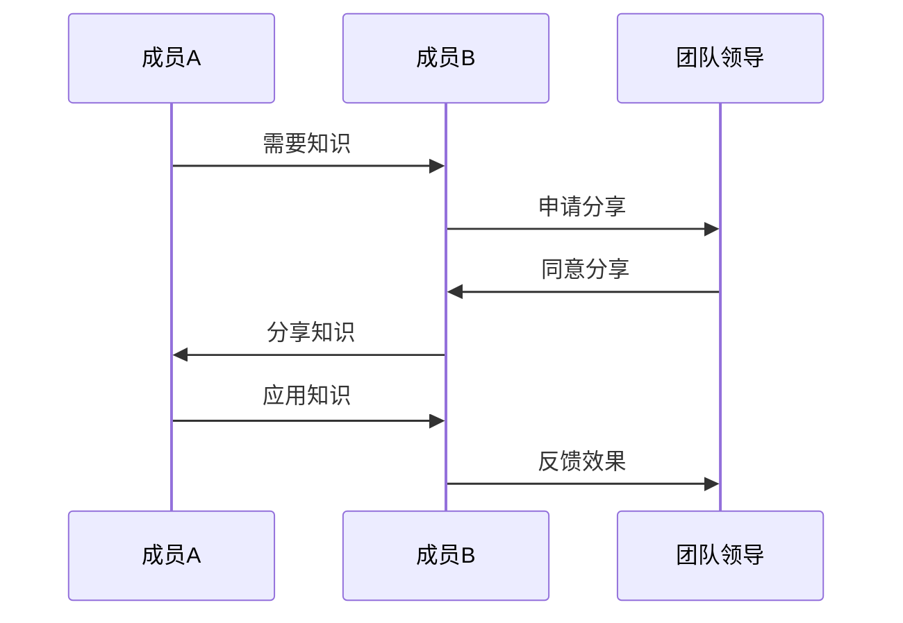
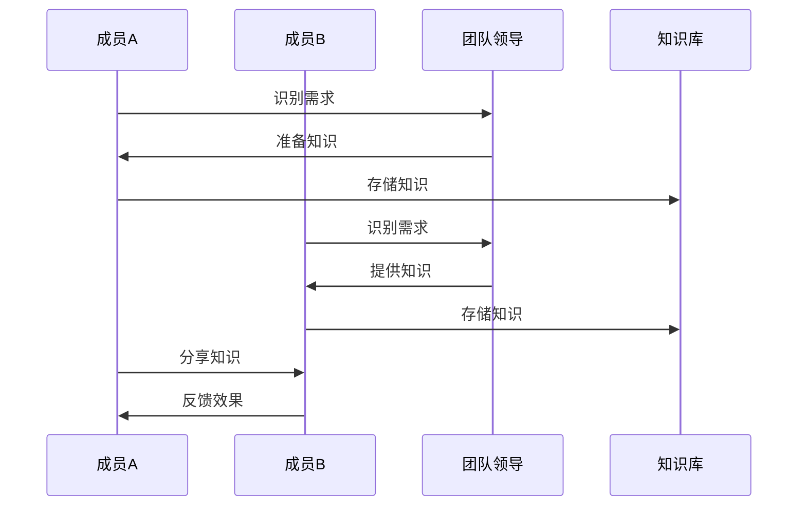

                 

### 第1章：知识分享的基本概念

在信息技术飞速发展的今天，知识分享已成为提升团队效能和实现团队发展的重要手段。本章将探讨知识分享的定义、类型、障碍及其在团队中的作用。

#### 1.1 知识分享的定义与价值

知识分享，是指在团队环境中，成员通过互动与合作，将个人的知识和经验传递给其他成员，从而实现知识的积累和共享。其基本定义包括以下几个方面：

- **主体**：知识分享的主体是团队成员，可以是个人或团队。
- **客体**：知识分享的客体是知识，包括事实、信息、经验、技能等。
- **过程**：知识分享是一个动态过程，包括知识的识别、获取、传递、吸收和应用。

知识分享的价值体现在以下几个方面：

1. **提高工作效率**：通过知识分享，团队成员能够快速获取所需信息，减少重复劳动，提高工作效率。
2. **促进个人成长**：知识分享不仅有助于他人，也能促进分享者对知识的深入理解和运用，实现自我提升。
3. **增强团队凝聚力**：知识分享有助于团队成员之间的沟通和理解，增强团队凝聚力。

#### 1.2 知识分享的类型与形式

知识分享的类型可以根据不同的标准进行分类：

- **根据知识性质**，知识分享可以分为显性知识和隐性知识。显性知识易于编码和传播，如文档、书籍等；隐性知识则难以编码，需要通过实践和交流获取，如经验、技能等。

- **根据知识分享的渠道**，知识分享可以分为正式和非正式。正式知识分享包括培训、讲座、会议等形式；非正式知识分享则体现在日常的沟通和互动中，如闲聊、讨论等。

知识分享的形式多种多样，常见的有以下几种：

- **文字形式**：文档、报告、博客等。
- **口头形式**：会议、访谈、一对一交流等。
- **视频形式**：视频教程、直播等。

#### 1.3 知识分享的障碍与挑战

尽管知识分享具有诸多价值，但在实际操作过程中仍面临诸多障碍和挑战：

- **知识保护意识**：一些团队成员担心知识分享会导致个人知识的贬值，从而对知识分享持保留态度。
- **知识复杂性**：某些知识难以用简单的语言表达，导致知识分享难度增加。
- **沟通渠道不畅**：团队成员之间的沟通渠道不畅，影响知识分享的效果。

知识分享的挑战包括：

- **知识碎片化**：知识呈现碎片化趋势，使得知识整合和传播变得更加困难。
- **知识更新速度快**：知识更新速度快，知识分享需要不断更新和迭代。
- **知识版权问题**：知识分享可能涉及到知识产权问题，需要妥善处理。

通过本章的探讨，我们理解了知识分享的定义、类型和障碍，为后续章节的深入讨论奠定了基础。

#### 1.1 知识分享的定义与价值

知识分享，是指团队成员通过互动与合作，将个人的知识和经验传递给其他成员，实现知识的积累和共享。具体来说，知识分享涉及以下几个核心要素：

- **主体**：知识分享的主体是团队成员，可以是个人或团队。
- **客体**：知识分享的客体是知识，包括事实、信息、经验、技能等。
- **过程**：知识分享是一个动态过程，包括知识的识别、获取、传递、吸收和应用。

首先，让我们通过一个简单的Mermaid流程图来描述知识分享的基本流程：

在这个流程图中，成员A需要知识，向成员B提出需求；成员B向团队领导C申请分享；领导C同意后，成员B将知识分享给成员A；成员A应用知识，并将反馈传递给成员B。

知识分享的价值体现在以下几个方面：

1. **提高工作效率**：通过知识分享，团队成员能够快速获取所需信息，减少重复劳动，提高工作效率。例如，在开发过程中，团队成员可以通过知识分享快速掌握新技术或解决问题的方法。

2. **促进个人成长**：知识分享不仅有助于他人，也能促进分享者对知识的深入理解和运用，实现自我提升。例如，通过撰写技术博客，程序员不仅帮助他人解决问题，还能巩固自己的技术知识。

3. **增强团队凝聚力**：知识分享有助于团队成员之间的沟通和理解，增强团队凝聚力。通过知识分享，团队成员可以更好地了解彼此的工作内容和技能，从而提高协作效率。

接下来，我们将进一步探讨知识分享的类型与形式，以及可能面临的障碍和挑战。

#### 1.2 知识分享的类型与形式

知识分享的类型可以根据不同的标准进行分类：

- **根据知识性质**，知识分享可以分为显性知识和隐性知识。显性知识是指那些可以明确表述和编码的知识，如文档、书籍、数据库等。隐性知识则是指那些难以明确表述和编码的知识，如经验、技能、直觉等。

- **根据知识分享的渠道**，知识分享可以分为正式和非正式。正式知识分享通常发生在特定的时间和地点，如培训、讲座、会议等。非正式知识分享则是在日常工作和生活中自然发生的，如闲聊、讨论、一对一交流等。

- **根据知识内容**，知识分享可以分为专业知识和通用知识。专业知识通常与团队成员的专业技能和工作相关，如编程、项目管理等。通用知识则是指那些适用于各种情境的知识，如沟通技巧、时间管理等。

知识分享的形式多种多样，常见的有以下几种：

1. **文字形式**：这是最常见的知识分享形式，包括文档、报告、博客、书籍等。文字形式的知识分享可以详细记录知识内容，便于团队成员查阅和引用。

2. **口头形式**：包括演讲、讨论、访谈、一对一交流等。口头形式的知识分享具有即时性和互动性，能够更好地促进团队成员之间的沟通和理解。

3. **视频形式**：包括视频教程、直播、视频会议等。视频形式的知识分享能够直观地展示操作过程，适用于复杂的技能培训。

4. **图形形式**：包括图表、示意图、流程图等。图形形式的知识分享能够简化复杂的概念，使团队成员更容易理解和掌握。

5. **实践形式**：通过实际操作、项目实践等方式进行知识分享。实践形式的知识分享能够帮助团队成员将理论知识应用到实际工作中，提高实际操作能力。

#### 1.3 知识分享的障碍与挑战

尽管知识分享具有诸多价值，但在实际操作过程中仍面临诸多障碍和挑战：

1. **知识保护意识**：一些团队成员担心知识分享会导致个人知识的贬值，从而对知识分享持保留态度。这种意识可能源于对知识价值的误解或对知识共享后竞争关系的担忧。

2. **知识复杂性**：某些知识难以用简单的语言表达，导致知识分享难度增加。例如，一些复杂的算法或技术架构可能需要专业的术语和详细的解释，这增加了知识分享的难度。

3. **沟通渠道不畅**：团队成员之间的沟通渠道不畅，影响知识分享的效果。例如，团队成员可能因地理位置、工作时间等差异，难以进行有效的沟通和交流。

4. **知识碎片化**：随着知识的不断更新和扩展，知识呈现碎片化趋势，使得知识整合和传播变得更加困难。团队成员可能难以找到所需的知识，导致知识分享的效果不理想。

5. **知识版权问题**：知识分享可能涉及到知识产权问题，需要妥善处理。例如，共享的文档或视频可能包含他人的版权信息，需要确保分享的过程符合相关法律法规。

6. **知识更新速度快**：知识更新速度快，知识分享需要不断更新和迭代。这要求团队成员具备快速学习和适应新知识的能力，否则可能会出现知识过时的问题。

通过识别和解决这些障碍与挑战，我们可以更好地发挥知识分享在团队中的作用，提高团队的整体效能。

#### 1.2 知识分享的原理与模型

知识分享的原理与模型是理解知识在团队中流动和增值的关键。本节将深入探讨知识分享的理论基础、流程机制及其评估方法。

##### 2.1 知识分享的理论基础

知识分享的理论基础主要包括社会化学习理论、知识管理理论和沟通理论。

1. **社会化学习理论**：社会化学习理论强调学习者在社会互动中通过观察、模仿和交流来获取知识。这种理论认为，知识不仅是个人经验的积累，更是通过社会互动和合作产生的。在团队环境中，社会化学习理论有助于解释成员之间知识分享的行为机制。

2. **知识管理理论**：知识管理理论关注知识在不同个体和组织之间的流动、整合和创新。知识管理理论强调知识的识别、获取、共享、应用和评估。在团队中，知识管理理论提供了知识分享的框架和策略，帮助团队实现知识的高效利用。

3. **沟通理论**：沟通理论探讨信息在发送者和接收者之间的传递过程，以及影响沟通效果的因素。知识分享本质上是一种沟通活动，需要通过有效的沟通手段来传递知识。沟通理论为知识分享提供了沟通技巧和策略，帮助提高知识分享的效果。

##### 2.2 知识分享的流程与机制

知识分享的流程通常包括以下几个步骤：

1. **需求识别**：团队成员识别出知识需求，如解决问题、提高技能等。这一步骤是知识分享的起点，决定了知识分享的目标和内容。

2. **内容准备**：知识分享者根据需求准备相应的知识内容。这可以通过查阅资料、个人经验总结等方式实现。内容准备是知识分享的核心环节，直接关系到知识分享的效果。

3. **知识传递**：知识分享者将知识内容通过口头、书面、视频等形式传递给需求者。传递过程需要确保知识的准确性和可理解性。

4. **知识接收**：需求者接收并理解知识内容，通过实践或进一步学习加深对知识的掌握。接收环节是知识分享的关键，决定了知识是否能够被有效吸收和应用。

5. **应用反馈**：需求者将知识应用于实际工作，并通过反馈优化知识分享过程。反馈有助于分享者了解知识的实际效果，不断改进知识分享的方法和内容。

知识分享的机制主要包括以下几个要素：

1. **激励机制**：通过奖励、认可等方式激励团队成员进行知识分享。激励机制有助于提高知识分享的积极性。

2. **沟通渠道**：建立畅通的沟通渠道，确保知识能够高效传递。沟通渠道包括会议、培训、在线讨论平台等。

3. **知识库**：建设知识库，将知识进行系统化整理和存储，便于团队成员查找和利用。知识库是知识分享的重要基础设施。

4. **共享文化**：培养共享文化，鼓励团队成员主动分享知识。共享文化有助于形成知识分享的良好氛围。

##### 2.3 知识分享的评估与反馈

知识分享的评估与反馈是确保知识分享效果的重要环节。评估与反馈的方法包括：

1. **效果评估**：通过调查问卷、访谈、观察等方式，评估知识分享的内容和质量。效果评估有助于了解知识分享的实际效果，发现问题和不足。

2. **团队效能评估**：通过团队绩效、团队成员满意度等指标，评估知识分享对团队效能的影响。团队效能评估有助于衡量知识分享对团队发展的贡献。

3. **反馈机制**：建立反馈机制，鼓励团队成员提出意见和建议，不断优化知识分享过程。反馈机制有助于知识分享的持续改进。

通过理解知识分享的原理与模型，我们可以更有效地实施知识分享策略，提升团队的整体效能。

#### 2.1 知识分享的理论基础

知识分享的理论基础是构建知识分享模型和实践策略的基石。核心的理论包括社会化学习理论、知识管理理论和沟通理论。这些理论从不同的角度解释了知识分享的过程和机制，并为知识分享提供了理论支持。

**社会化学习理论**：
社会化学习理论强调学习者在社会互动中通过观察、模仿和交流来获取知识。这一理论认为，知识不仅是个人经验的积累，更是通过社会互动和合作产生的。在团队环境中，社会化学习理论有助于解释成员之间知识分享的行为机制。例如，通过观察同事解决问题的方法，团队成员可以更快地学习和掌握新技能。社会化学习理论的核心观点是，知识分享是团队成员之间相互学习和成长的过程。

**知识管理理论**：
知识管理理论关注知识在不同个体和组织之间的流动、整合和创新。知识管理理论强调知识的识别、获取、共享、应用和评估。知识管理理论为知识分享提供了系统的框架和策略。例如，通过建立知识库，组织可以系统地存储和整理知识，便于团队成员查找和利用。知识管理理论的核心观点是，知识分享是组织实现知识增值和创新的重要手段。

**沟通理论**：
沟通理论探讨信息在发送者和接收者之间的传递过程，以及影响沟通效果的因素。知识分享本质上是一种沟通活动，需要通过有效的沟通手段来传递知识。沟通理论为知识分享提供了沟通技巧和策略，帮助提高知识分享的效果。例如，通过选择合适的沟通渠道和方式，如面对面交流、在线讨论平台、视频会议等，可以确保知识能够高效传递。沟通理论的核心观点是，有效的沟通是知识分享成功的关键。

通过结合社会化学习理论、知识管理理论和沟通理论，我们可以构建一个全面的知识分享模型。这个模型包括以下几个关键组成部分：

1. **知识识别与需求识别**：首先，团队需要识别出成员的知识需求和现有知识。这可以通过问卷调查、访谈等方式进行。

2. **知识获取与内容准备**：然后，知识分享者根据需求准备相应的知识内容。这可以通过查阅资料、个人经验总结、项目总结等方式实现。

3. **知识传递与沟通渠道**：知识分享者通过口头、书面、视频等形式将知识传递给需求者。这需要选择合适的沟通渠道和方式，确保知识的准确性和可理解性。

4. **知识接收与应用反馈**：需求者接收并理解知识内容，通过实践或进一步学习加深对知识的掌握。需求者将知识应用于实际工作，并通过反馈优化知识分享过程。

5. **知识评估与反馈机制**：通过评估知识分享的效果，团队可以不断优化知识分享的过程和方法。评估方法包括调查问卷、访谈、观察等。反馈机制鼓励团队成员提出意见和建议，持续改进知识分享过程。

这个知识分享模型体现了社会化学习理论、知识管理理论和沟通理论的融合，有助于实现知识的高效传递和应用。通过这个模型，团队可以建立有效的知识分享机制，提升整体效能和创新能力。

下面是一个简化的Mermaid流程图，展示了知识分享模型的基本流程：

在这个流程图中，团队成员A和B识别出知识需求，团队领导C根据需求提供知识。知识被存储在知识库KB中，方便团队成员查询和利用。成员A和B通过分享知识，实现了知识的高效传递和应用。反馈机制确保知识分享的效果得到持续优化。

通过这个知识分享模型，团队可以实现知识的积累、共享和应用，提高整体效能和创新能力。知识分享不仅是团队成员个人成长的过程，也是团队发展和进步的重要推动力。

#### 2.2 知识分享的流程与机制

知识分享的流程与机制是确保知识有效传递和应用的关键。一个完善的流程与机制包括以下几个关键步骤：

1. **需求识别**：团队成员首先需要识别出自身的知识需求。这可以通过定期的团队会议、需求调查问卷等方式进行。需求识别是知识分享的起点，决定了后续知识分享的目标和内容。

2. **内容准备**：在识别出知识需求后，知识分享者需要准备相应的知识内容。这可以通过查阅资料、个人经验总结、项目回顾等方式实现。内容准备是知识分享的核心环节，直接关系到知识分享的质量和效果。

3. **知识传递**：知识分享者将准备好的知识内容通过合适的渠道和方式传递给需求者。知识传递的形式多种多样，包括口头、书面、视频等。选择合适的传递方式有助于确保知识的准确性和可理解性。

4. **知识接收**：需求者接收并理解知识内容，通过实践或进一步学习加深对知识的掌握。接收环节是知识分享的关键，决定了知识是否能够被有效吸收和应用。

5. **应用反馈**：需求者将知识应用于实际工作，并通过反馈优化知识分享过程。反馈有助于分享者了解知识的实际效果，发现问题和不足，从而不断改进知识分享的方法和内容。

知识分享的机制主要包括以下几个要素：

1. **激励机制**：通过奖励、认可等方式激励团队成员进行知识分享。激励机制有助于提高知识分享的积极性，促进知识的高效传递和应用。

2. **沟通渠道**：建立畅通的沟通渠道，确保知识能够高效传递。沟通渠道包括会议、培训、在线讨论平台、知识库等。选择合适的沟通渠道和方式有助于提高知识分享的效果。

3. **知识库**：建设知识库，将知识进行系统化整理和存储，便于团队成员查找和利用。知识库是知识分享的重要基础设施，有助于实现知识的高效积累和共享。

4. **共享文化**：培养共享文化，鼓励团队成员主动分享知识。共享文化有助于形成知识分享的良好氛围，提高团队成员的参与度和积极性。

下面是一个简化的Mermaid流程图，展示了知识分享的流程与机制：

在这个流程图中，团队成员A和B识别出知识需求，团队领导C协助准备和提供知识。知识被存储在知识库KB中，方便团队成员查询和利用。成员A和B通过分享知识，实现了知识的高效传递和应用。反馈机制确保知识分享的效果得到持续优化。

通过这个流程与机制，团队可以实现知识的高效传递和应用，提高整体效能和创新能力。知识分享不仅是团队成员个人成长的过程，也是团队发展和进步的重要推动力。

#### 2.3 知识分享的评估与反馈

知识分享的评估与反馈是确保知识分享效果的重要环节。一个有效的评估与反馈机制可以帮助团队了解知识分享的实际效果，发现问题和不足，从而不断优化知识分享的过程和方法。

**评估方法**：

1. **效果评估**：通过调查问卷、访谈、观察等方式，评估知识分享的内容和质量。效果评估有助于了解知识分享的实际效果，发现哪些知识内容受到了团队成员的欢迎，哪些方面需要改进。

2. **团队效能评估**：通过团队绩效、团队成员满意度等指标，评估知识分享对团队效能的影响。团队效能评估有助于衡量知识分享对团队发展的贡献。

3. **反馈机制**：建立反馈机制，鼓励团队成员提出意见和建议，不断优化知识分享过程。反馈机制可以通过定期的团队会议、在线讨论平台等方式实现。

**关键指标**：

1. **知识利用率**：知识利用率是指团队成员使用知识库中知识资源的比例。高知识利用率表明知识分享得到了有效利用，团队效能得到提升。

2. **知识更新率**：知识更新率是指知识库中知识内容的更新频率。高知识更新率表明团队具备持续学习和创新的能力。

3. **团队成员满意度**：团队成员满意度是指团队成员对知识分享过程的满意程度。高满意度表明知识分享机制得到了团队成员的认可和支持。

**案例分析**：

以某企业为例，该企业通过建立内部知识分享平台，定期举办知识分享会议，鼓励员工提交知识文档和经验总结。通过效果评估和团队效能评估，该企业发现：

1. **知识利用率显著提高**：员工在项目中使用知识库资源的比例从30%提高到70%，大大提高了工作效率。

2. **知识更新率不断提高**：知识库中的内容更新频率从每月一次增加到每月两次，表明团队成员具备持续学习和创新的能力。

3. **团队成员满意度较高**：通过调查问卷，团队成员对知识分享平台的满意度达到90%，员工积极参与知识分享，形成良好的知识分享氛围。

通过这个案例，我们可以看到，有效的评估与反馈机制有助于提高知识分享的效果，促进团队发展和进步。

### 第3章：知识分享在团队中的作用

知识分享在团队中的作用不可忽视，它不仅能够提高工作效率，还能促进团队协作和团队发展。本章节将深入探讨知识分享对团队效能、团队协作和团队发展的具体影响。

#### 3.1 知识分享与团队效能

知识分享对团队效能的提升具有显著的促进作用。以下是知识分享如何提高团队效能的具体表现：

1. **减少重复劳动**：通过知识分享，团队成员可以获取已有的知识和经验，避免重复性的工作。例如，一个项目团队成员在解决了一个技术问题时，可以将解决方法分享给其他团队成员，从而节省时间，提高工作效率。

2. **快速获取信息**：知识分享平台可以帮助团队成员快速获取所需的信息，无论是技术文档、工作流程，还是最佳实践，都能在知识库中找到。这大大减少了信息传递的时间，提高了决策效率。

3. **提高决策质量**：知识分享使团队成员能够掌握更多的信息，从而做出更加全面和准确的决策。团队成员可以通过分享不同的观点和经验，形成更加丰富的决策依据，避免因信息不全而导致的错误决策。

4. **促进创新**：知识分享不仅传递现有知识，还能激发新的想法和创意。团队成员在分享知识的过程中，可能会发现新的应用场景或解决问题的方法，从而推动团队的创新。

**案例**：某互联网公司在实施知识分享后，通过内部知识库和定期的知识分享会议，团队成员在解决问题时能够快速获取相关知识和经验，项目周期显著缩短，客户满意度大幅提升。

#### 3.2 知识分享与团队协作

知识分享在促进团队协作方面同样发挥着重要作用。以下是知识分享如何促进团队协作的几个方面：

1. **增强沟通**：知识分享提供了一个沟通的平台，团队成员可以分享自己的知识和经验，讨论工作中的挑战和解决方案。这有助于增强团队成员之间的沟通和理解，减少误解和冲突。

2. **提高协同效率**：通过知识分享，团队成员可以更快地了解其他成员的工作内容和技能，从而在协同工作时更加高效。例如，一个开发人员可以通过知识分享了解测试团队的工作流程和工具，从而更好地与他们合作。

3. **促进跨部门协作**：在大型组织中，不同部门之间的知识分享有助于打破部门壁垒，促进跨部门协作。例如，产品部门可以与市场部门分享产品知识，帮助市场团队更好地推广产品。

**案例**：某跨国公司在全球范围内实施知识分享计划，通过在线平台和定期研讨会，不同国家和地区的团队成员可以分享经验和最佳实践，有效提高了跨部门协作的效率。

#### 3.3 知识分享与团队发展

知识分享不仅对团队效能和协作有积极影响，还能够在长期内促进团队的发展。以下是知识分享如何促进团队发展的几个方面：

1. **培养人才**：知识分享为团队成员提供了学习和成长的机会。通过分享经验和知识，团队成员可以不断提升自己的专业技能和知识水平，成为团队中的骨干力量。

2. **知识传承**：知识分享有助于团队知识体系的建立和传承。新员工可以通过知识分享快速融入团队，了解团队的工作流程和文化，从而提高工作效率。

3. **增强团队文化**：知识分享可以塑造积极向上的团队文化。团队成员通过分享知识和经验，展现自己的专业能力和团队精神，从而增强团队的凝聚力和归属感。

**案例**：某科技公司通过实施内部知识分享平台和定期的知识分享活动，不仅提高了团队成员的工作效率，还培养了一批优秀的技术专家和管理人才，为公司的发展做出了重要贡献。

通过以上探讨，我们可以看到知识分享在团队中的作用是多方面的，它不仅能够提高工作效率，促进团队协作，还能促进团队发展。因此，在团队管理中，应该重视知识分享的重要性，制定相应的策略和措施，推动知识分享的深入开展。

### 知识分享在团队中的作用

知识分享在团队中的作用至关重要，它不仅能够提升团队效能，还能促进团队协作和团队发展。为了更深入地理解知识分享的实际应用，我们来看一个具体的案例：某互联网公司的知识分享实践。

#### 案例背景

某互联网公司是一家高速发展的科技公司，拥有数百名员工。随着公司规模的不断扩大，团队成员之间的知识交流变得越来越重要。然而，传统的沟通方式如电子邮件和面对面的会议已经无法满足快速变化的需求。为了提升团队效能和协作，公司决定实施知识分享平台，以促进团队成员之间的知识交流和传递。

#### 实施过程

1. **需求识别**：公司首先通过问卷调查和访谈，识别出团队成员在知识分享方面的具体需求。发现主要需求包括：快速获取公司内部的技术文档、了解团队成员的工作内容和技能、获取项目经验和最佳实践等。

2. **平台建设**：基于需求，公司搭建了一个内部知识分享平台，包括文档管理系统、视频分享系统和在线讨论区。平台提供多种知识分享方式，如文档、视频、讨论等，方便团队成员获取所需信息。

3. **知识库建设**：公司鼓励团队成员贡献自己的知识和经验，将工作过程中的问题和解决方案整理成文档，上传到知识库中。同时，定期举办知识分享会议，邀请团队成员分享项目经验和技术心得。

4. **激励机制**：为了激励团队成员积极参与知识分享，公司设立了一套奖励机制，包括奖金、表彰和职业晋升等。通过这些激励措施，提高了团队成员的知识分享积极性。

5. **反馈机制**：公司建立了反馈机制，通过调查问卷和访谈，收集团队成员对知识分享平台和活动的反馈，不断优化平台的功能和内容。

#### 实施效果

通过知识分享平台和实践，公司取得了显著的成果：

1. **提升工作效率**：团队成员可以快速获取所需知识，减少了重复劳动，工作效率显著提升。例如，一个项目团队成员在解决了一个技术问题时，可以通过知识分享平台快速分享给其他团队成员，节省了大量时间。

2. **增强团队协作**：知识分享平台提供了一个沟通和交流的平台，团队成员可以更好地了解其他成员的工作内容和技能，从而在协作工作时更加高效。例如，开发人员可以通过知识分享平台了解测试团队的工作流程和工具，提高协作效率。

3. **培养人才**：通过知识分享，团队成员有机会学习和掌握更多的知识和技能，提高了个人职业素养。公司还通过表彰和职业晋升等激励机制，鼓励团队成员积极参与知识分享，培养了一批优秀的技术专家和管理人才。

4. **知识传承**：知识分享平台和会议有助于新员工快速融入团队，了解公司的工作流程和文化。新员工可以通过知识库和分享会，快速获取公司内部的知识和经验，提高工作效率。

5. **增强团队文化**：知识分享不仅传递知识，还促进了团队成员之间的交流和互动，增强了团队的凝聚力和归属感。公司通过定期的知识分享活动和平台，营造了一个积极向上的团队文化。

#### 案例总结

通过该案例，我们可以看到知识分享在团队中的作用是多方面的。它不仅能够提升工作效率和协作，还能培养人才、传承知识和增强团队文化。因此，在团队管理中，应该重视知识分享的重要性，制定相应的策略和措施，推动知识分享的深入开展。

### 知识分享的实践方法

要实现有效的知识分享，团队需要从文化、制度、工具等多个方面入手，构建一个支持知识流动和知识应用的环境。以下是一些具体的实践方法：

#### 4.1 培养知识分享意识

1. **树立知识共享价值观**：团队领导者应首先树立知识共享的价值观，强调知识是团队共同财富，而非个人私产。通过定期的培训和宣传，让每位成员认识到知识分享的重要性。

2. **倡导知识分享行为**：鼓励团队成员在工作和生活中主动分享知识和经验。可以通过设立知识分享之星、优秀知识贡献者等荣誉，激发团队成员的分享意愿。

3. **营造积极氛围**：营造一个开放、包容、互助的知识分享氛围。鼓励团队成员勇于表达自己的观点和经验，尊重他人的意见和知识。

#### 4.2 设立知识分享制度

1. **制定知识分享政策**：明确知识分享的目标、范围、流程和激励措施。制定详细的制度文件，确保每位成员都了解和遵循知识分享的规范。

2. **设立知识分享平台**：建立内部知识库、文档管理系统、在线讨论平台等，为团队成员提供便捷的知识分享和获取渠道。

3. **定期组织知识分享活动**：如知识沙龙、讲座、研讨会等，定期举办活动，鼓励团队成员分享知识和经验，提高知识分享的频率和效果。

#### 4.3 创造知识分享环境

1. **提供技术支持**：为团队成员提供必要的技术工具和资源，如知识管理软件、在线协作工具等，确保知识分享的顺利进行。

2. **鼓励跨部门交流**：打破部门壁垒，鼓励不同部门之间的知识交流和协作。可以通过跨部门项目、联合研讨会等方式，促进知识的共享和融合。

3. **建立学习社区**：建立一个学习型社区，为团队成员提供学习和成长的平台。通过线上和线下的学习活动，帮助团队成员不断提升自身的能力。

#### 4.4 实施知识分享激励机制

1. **奖励制度**：设立知识分享奖励制度，对积极参与知识分享的成员给予物质和精神奖励，如奖金、表彰、职业晋升等。

2. **绩效评估**：将知识分享纳入员工绩效评估体系，激励员工在工作和生活中主动分享知识和经验。

3. **激励机制设计**：根据不同成员的特点和需求，设计多样化的激励机制，如培训机会、项目优先权等，确保激励机制的有效性和吸引力。

通过以上实践方法，团队可以构建一个支持知识分享的环境，提高知识利用效率，促进团队成员的持续成长，最终实现团队的整体发展。

### 知识分享的方法与工具

在实现知识分享的过程中，选择合适的方法和工具至关重要。以下是一些常用的知识分享方法和工具，包括知识文档化管理、知识库建设和知识共享平台应用。

#### 5.1 知识文档化管理

知识文档化管理是一种通过整理和系统化文档来管理知识的方法。这种方法有助于确保知识的可发现性和可重用性。以下是一些具体做法：

1. **文档分类和标签**：将知识文档按照主题、领域、项目等分类，并使用标签进行标注，便于团队成员快速查找和定位所需文档。

2. **版本控制**：使用版本控制系统（如Git）来管理文档的版本，确保文档的一致性和准确性。每次更新文档时，应记录变更日志，便于追踪文档的历史版本。

3. **文档模板**：为不同类型的文档（如报告、项目计划、技术文档等）制定统一的模板，确保文档格式的一致性，提高文档的可读性和专业性。

4. **文档共享和权限管理**：通过文档管理系统（如Confluence、SharePoint等）将文档共享给团队成员，并设置权限，确保只有授权人员可以编辑和访问文档。

#### 5.2 知识库建设

知识库是一个集中存储和组织知识的系统，旨在为团队成员提供全面、准确和及时的知识资源。以下是一些知识库建设的关键步骤：

1. **需求分析**：在建设知识库之前，进行需求分析，明确团队成员对知识库的需求，如知识类别、获取方式、更新频率等。

2. **知识分类和结构设计**：根据需求分析结果，设计知识库的分类和结构，确保知识库的逻辑性和易用性。

3. **知识采集和整理**：从团队成员和外部资源中采集知识，并进行整理和分类，确保知识的准确性和完整性。

4. **知识更新和维护**：定期更新知识库中的内容，保持知识的时效性和准确性。同时，设立知识库管理员，负责知识库的维护和管理工作。

5. **知识共享和检索**：通过知识库管理系统（如IBM Lotus Notes、Oracle Knowledge Management等）提供知识共享和检索功能，确保团队成员可以方便地获取所需知识。

#### 5.3 知识共享平台应用

知识共享平台是一个集知识管理、知识共享、协作交流于一体的综合系统。以下是一些常用的知识共享平台及其应用：

1. **Wiki平台**：Wiki平台（如MediaWiki、Confluence等）提供文档创作、编辑、共享和版本控制功能，适合团队进行知识共享和协作。

2. **博客系统**：博客系统（如WordPress、Blogger等）可以用来发布技术博客、项目进展报告等，便于团队成员分享经验和知识。

3. **论坛和社区**：论坛和社区（如Discourse、Reddit等）提供讨论、问答和知识共享功能，有助于团队成员交流和互动，促进知识传播。

4. **在线会议和培训系统**：在线会议和培训系统（如Zoom、WebEx等）可以用于组织知识分享会议、培训课程等，提高知识传递的效率和效果。

通过以上方法和工具，团队可以有效地实现知识分享，提高知识利用效率，促进团队协作和发展。

#### 5.1 知识文档化管理

知识文档化管理是知识分享中不可或缺的一环，它通过系统化的文档整理和管理，确保知识的可发现性和可重用性。以下是对知识文档化管理方法的详细讲解：

##### 文档分类和标签

1. **分类方法**：在知识文档化管理中，对文档进行合理的分类是第一步。分类方法可以根据文档的主题、领域、项目等维度进行。例如，可以将文档分为以下几类：技术文档、项目管理文档、市场分析文档、财务报表等。这样的分类方式有助于团队成员快速定位所需的文档。

2. **标签使用**：标签是另一个关键工具，它可以帮助进一步细化文档分类。通过为文档添加标签，如“前端开发”、“数据库设计”、“敏捷方法”等，可以使得文档的查找和利用更加灵活和精准。标签的使用可以结合分类方法，实现多层次、多维度的文档管理。

##### 版本控制

版本控制是知识文档化管理中的重要环节，它确保文档的一致性和准确性。以下是一些常用的版本控制方法：

1. **版本控制系统**：使用版本控制系统（如Git、Subversion等）来管理文档的版本。每次文档更新时，系统会自动记录变更日志，包括谁修改了文档、何时修改、修改的内容等。这有助于追踪文档的历史版本，方便团队成员查看和恢复旧版本。

2. **变更日志**：在每次文档更新时，记录详细的变更日志，包括修改的原因、内容和影响等。这样，团队成员可以了解文档的变更历史，更好地理解文档的当前状态。

##### 文档模板

为了提高文档的专业性和一致性，制定统一的文档模板至关重要。以下是一些文档模板的设计和应用建议：

1. **模板设计**：根据不同类型的文档（如报告、项目计划、技术文档等）的特点，设计相应的模板。模板应包括固定的格式、结构和内容要求，确保文档的一致性和规范性。

2. **模板应用**：将模板应用到实际文档编写过程中。团队成员在编写文档时，可以基于模板进行，从而提高文档的质量和效率。同时，模板的统一应用有助于团队成员快速熟悉文档结构和内容要求。

##### 文档共享和权限管理

在知识文档化管理中，共享和权限管理是确保知识安全性和可控性的关键。以下是一些具体做法：

1. **共享机制**：通过文档管理系统（如Confluence、SharePoint等）实现文档的共享。这些系统提供了方便的文档上传、下载和浏览功能，团队成员可以方便地获取所需文档。

2. **权限设置**：根据团队成员的角色和职责，设置不同的文档权限。例如，项目团队成员可以阅读和编辑项目文档，而外部合作伙伴只能查看文档。权限设置有助于确保知识的安全性和保密性。

##### 实际案例

以某科技公司为例，该公司通过知识文档化管理，实现了技术文档的高效管理和共享。以下是该公司的具体实践：

1. **分类和标签**：公司按照项目、技术领域和业务模块对技术文档进行分类，并为每个文档添加相应的标签，如“前端开发”、“后端开发”、“人工智能”等。

2. **版本控制**：公司使用Git进行版本控制，每次文档更新都会生成版本日志，团队成员可以随时查看文档的历史版本和变更内容。

3. **文档模板**：公司为不同类型的技术文档设计了统一的模板，包括项目计划书、技术需求文档、测试报告等。

4. **共享和权限管理**：公司通过Confluence构建知识库，实现文档的集中管理和共享。同时，根据团队成员的角色和职责，设置了不同的权限，确保文档的安全性和保密性。

通过以上实践，该公司有效提高了技术文档的管理效率和知识共享的效果，为团队协作和创新提供了有力支持。

#### 5.2 知识库建设

知识库建设是知识分享的重要环节，它通过系统化地收集、整理和存储知识，为团队成员提供全面、准确和及时的知识资源。以下是关于知识库建设的详细讲解：

##### 需求分析

在建设知识库之前，进行需求分析是非常关键的。需求分析的目标是明确团队成员对知识库的需求，包括以下方面：

1. **知识类别**：确定知识库需要涵盖的知识类别，如技术知识、业务知识、管理知识等。了解不同类别知识的优先级和重要性，确保知识库内容的全面性。

2. **获取方式**：分析团队成员获取知识的途径，如内部文档、外部资料、项目经验等。明确知识来源的可靠性和及时性，为知识库的更新和维护提供依据。

3. **更新频率**：了解团队成员对知识更新的需求，确定知识库的更新频率。例如，技术文档可能需要每周更新，而业务知识可能只需每季度更新。

4. **应用场景**：分析团队成员在工作和生活中可能遇到的问题和应用场景，确保知识库中的知识能够解决实际问题。

##### 知识分类和结构设计

知识分类和结构设计是知识库建设的基础，它决定了知识库的逻辑性和易用性。以下是知识分类和结构设计的关键步骤：

1. **分类方法**：选择合适的分类方法，如按领域、主题、项目等分类。例如，可以按照业务模块对知识库进行分类，如客户关系管理、财务管理、人力资源管理等。

2. **层级结构**：设计知识库的层级结构，确保知识的组织层次清晰。例如，可以在一级分类下设置二级分类，二级分类下再设置三级分类，形成多层次的分类体系。

3. **标签和关键词**：为每个知识条目添加标签和关键词，提高知识的可检索性。标签和关键词应具有代表性，便于团队成员快速定位所需知识。

##### 知识采集和整理

知识采集和整理是知识库建设的重要环节，以下是一些具体做法：

1. **内部知识采集**：从公司内部文档、项目报告、员工经验等渠道采集知识。确保知识来源的权威性和准确性，对采集到的知识进行筛选和整理。

2. **外部知识采集**：从外部资源，如行业报告、学术论文、技术博客等，采集相关知识点。外部知识可以补充内部知识的不足，为团队成员提供更全面的信息。

3. **知识整理**：对采集到的知识进行整理，包括分类、标注、摘要等。确保知识的结构化和标准化，提高知识库的可用性。

##### 知识更新和维护

知识库的更新和维护是确保知识库内容及时、准确的重要保障。以下是知识更新的具体方法：

1. **定期更新**：根据需求分析结果，制定知识库的更新计划，定期对知识库中的内容进行审查和更新。

2. **版本控制**：使用版本控制系统对知识库中的知识条目进行版本控制，确保每次更新都有详细的记录，方便追溯。

3. **知识审核**：设立知识审核机制，由专家或审核员对知识库中的内容进行审核，确保知识的准确性和可靠性。

4. **反馈机制**：建立知识反馈机制，鼓励团队成员对知识库中的知识提出意见和建议，不断优化知识库的内容。

##### 知识共享和检索

知识共享和检索是知识库建设的最终目标，以下是实现知识共享和检索的具体方法：

1. **知识共享平台**：搭建知识共享平台，为团队成员提供知识检索、浏览、下载和分享的功能。可以使用知识管理软件（如IBM Lotus Notes、Oracle Knowledge Management等）来构建知识共享平台。

2. **搜索引擎**：在知识库中集成搜索引擎，提高知识检索的效率和准确性。确保搜索引擎能够对知识库中的关键词、标签和摘要进行索引，提供智能搜索功能。

3. **个性化推荐**：利用数据分析和机器学习技术，为团队成员提供个性化推荐，根据团队成员的兴趣和需求，推荐相关知识和资源。

通过以上方法和步骤，团队可以构建一个高效的知识库，实现知识的系统化、结构化和共享，为团队成员的工作和学习提供有力支持。

#### 5.3 知识共享平台应用

知识共享平台是现代团队实现知识有效传递和应用的重要工具。以下将详细探讨知识共享平台的应用，包括Wiki平台、博客系统、论坛和社区、在线会议和培训系统等。

##### Wiki平台

Wiki平台是一种基于协作的文档编辑系统，它允许团队成员轻松地创建、编辑和共享文档。以下是Wiki平台的应用要点：

1. **文档协作**：Wiki平台提供了实时协作功能，团队成员可以同时编辑同一文档，提高工作效率。例如，项目团队可以使用Wiki平台编写项目计划、需求文档和用户手册。

2. **版本控制**：Wiki平台内置版本控制系统，记录每次文档的编辑历史，团队成员可以查看和回滚到之前的版本，确保文档的完整性和可追溯性。

3. **扩展性**：Wiki平台通常支持丰富的插件和扩展功能，如表格、图片、代码片段等，便于团队创建复杂和多维的文档。

4. **权限管理**：Wiki平台提供了严格的权限管理功能，管理员可以根据团队成员的角色和职责设置不同的访问权限，确保文档的安全性和保密性。

##### 博客系统

博客系统是一种用于发布个人或团队博客的平台，它可以帮助团队成员分享个人见解、技术心得和项目进展。以下是博客系统的应用要点：

1. **个人展示**：博客系统为每个团队成员提供了一个展示个人能力和经验的平台。团队成员可以撰写技术博客，分享自己的见解和经验，提升个人品牌价值。

2. **知识传播**：通过博客系统，团队成员可以发布技术文档、案例分析和最佳实践，实现知识的传播和共享。博客内容可以通过标签和分类进行管理，便于团队成员查找和阅读。

3. **互动交流**：博客系统支持评论功能，团队成员可以在博客下留言，进行交流和讨论，促进知识共享和团队协作。

4. **社区建设**：团队可以通过博客系统建立一个内部社区，鼓励团队成员参与讨论和分享，增强团队的凝聚力和归属感。

##### 论坛和社区

论坛和社区是团队成员进行交流和互动的重要平台。以下是论坛和社区的应用要点：

1. **知识问答**：论坛和社区提供了问答功能，团队成员可以在社区中提出问题和解答问题，实现知识的互动和共享。例如，技术支持团队可以在社区中解答开发人员的技术疑问。

2. **专题讨论**：论坛和社区可以组织专题讨论，围绕某个主题进行深入探讨和交流。这种方式有助于激发团队成员的思考和创新，推动团队知识水平的提升。

3. **用户反馈**：论坛和社区可以作为用户反馈的渠道，团队成员可以在此收集用户意见和需求，为产品改进提供参考。

4. **兴趣小组**：团队可以根据兴趣和专长组建兴趣小组，如编程小组、设计小组等，成员可以在小组内分享知识和经验，促进专业成长。

##### 在线会议和培训系统

在线会议和培训系统是一种通过网络进行实时交流和培训的工具，以下是它的应用要点：

1. **远程协作**：在线会议系统支持远程视频会议，团队成员可以实时交流和讨论，无论地理位置如何，都能高效协作。

2. **实时互动**：在线会议系统提供了聊天、投票、屏幕共享等功能，确保会议的互动性和参与度，提高会议效果。

3. **培训分享**：在线培训系统可以帮助团队组织在线培训课程，邀请专家进行讲解和分享，提升团队成员的专业技能。

4. **培训记录**：在线培训系统可以录制培训课程，团队成员可以随时回看，巩固所学知识。

通过以上平台的应用，团队可以实现知识的有效传递和应用，提高整体效能和创新能力。知识共享平台不仅提供了知识共享的工具，也为团队协作和创新提供了有力支持。

### 知识分享的激励与机制

在知识分享中，激励和机制的设计至关重要。有效的激励和机制可以激发团队成员的知识分享积极性，促进知识的高效传递和应用。以下将从激励机制设计、知识分享考核与评估、知识分享案例分析三个方面进行详细探讨。

#### 6.1 知识分享激励机制设计

激励机制的设计是确保团队成员积极参与知识分享的关键。以下是一些有效的激励机制设计方法：

1. **物质激励**：提供直接的物质奖励，如奖金、礼品等，激励团队成员分享知识和经验。例如，可以设立“知识分享之星”奖项，每月评选出在知识分享中表现突出的成员，并给予一定的奖金或奖品。

2. **职业发展激励**：将知识分享与职业发展挂钩，为积极参与知识分享的成员提供晋升机会和职业发展路径。例如，可以设立“知识贡献者”资格，满足条件的成员可以获得额外的职业晋升机会。

3. **荣誉激励**：通过颁发荣誉称号，如“优秀知识分享者”、“知识传承者”等，认可和激励团队成员的知识分享行为。荣誉激励不仅可以提升成员的自豪感，还能在团队内部树立榜样，带动更多人参与知识分享。

4. **团队建设激励**：通过组织团队建设活动，如团建活动、聚餐等，增强团队成员之间的凝聚力和归属感。在团队活动中，可以设立知识分享环节，让团队成员在轻松的氛围中分享知识和经验。

#### 6.2 知识分享考核与评估

知识分享的考核与评估是确保知识分享效果的重要手段。以下是一些有效的考核与评估方法：

1. **知识分享量评估**：通过统计团队成员在知识库中的文档数量、参与知识分享会议的次数等，评估成员的知识分享量。这可以作为物质激励和荣誉激励的依据。

2. **知识质量评估**：通过团队成员的反馈、知识应用的成效等，评估知识分享的质量。高质量的知识分享不仅能够解决实际问题，还能为团队带来创新和改进。

3. **团队效能评估**：通过团队绩效、项目成功率、客户满意度等指标，评估知识分享对团队效能的影响。这可以帮助团队了解知识分享的实际效果，调整和优化知识分享策略。

4. **知识分享参与度评估**：通过调查问卷、访谈等方式，了解团队成员对知识分享活动的参与度和满意度。这有助于了解团队成员对知识分享机制的感受和需求，为优化机制提供依据。

#### 6.3 知识分享案例分析

以下是对几个实际案例的分析，探讨如何设计有效的知识分享激励和机制。

**案例一：某科技公司的知识分享激励机制**

某科技公司通过以下方式设计知识分享激励机制：

1. **物质激励**：每月评选“知识分享之星”，获奖者将获得1000元奖金和一张精美礼品卡。

2. **职业发展激励**：知识分享积分与职业晋升挂钩，每年积累一定积分的成员可以获得晋升机会。

3. **荣誉激励**：设立“知识传承者”称号，每年评选一次，获奖者将在公司年会中受到表彰。

4. **团队建设激励**：定期组织知识分享大会，评选出优秀分享者，并在活动中颁发奖品和证书。

通过这些激励措施，该公司的知识分享活动得到了团队成员的积极参与，知识库内容持续丰富，团队整体效能显著提升。

**案例二：某互联网公司的知识分享考核与评估**

某互联网公司通过以下方法进行知识分享考核与评估：

1. **知识分享量评估**：每位团队成员每月需提交至少一篇知识文档，文档质量高且被多次引用的成员将获得额外积分。

2. **知识质量评估**：设立“优秀知识分享奖”，由团队领导和其他成员共同评选，评选标准包括知识的应用效果和创新性。

3. **团队效能评估**：通过项目成功率和客户满意度等指标，评估知识分享对团队效能的影响。

4. **知识分享参与度评估**：通过调查问卷，了解团队成员对知识分享活动的满意度和建议，不断优化知识分享机制。

通过这些考核与评估方法，该公司的知识分享活动得到了团队成员的积极响应，知识库的内容质量和数量不断提升，团队协作效率显著提高。

**案例三：某金融机构的知识分享实践**

某金融机构通过以下措施实施知识分享：

1. **建立内部知识库**：搭建内部知识库，收集和整理公司的各类知识，包括产品知识、业务流程、法律法规等。

2. **知识分享会议**：定期举办知识分享会议，邀请团队成员分享专业知识、经验和心得。

3. **培训和学习**：组织培训课程和学习活动，提升团队成员的专业技能和知识水平。

4. **知识考核**：对团队成员进行知识考核，将知识掌握情况纳入绩效评估。

通过这些实践，该公司的知识分享机制得到了有效落实，团队成员的知识水平和工作能力显著提升，业务流程优化，客户满意度提高。

通过以上案例分析，我们可以看到，有效的知识分享激励和机制设计对于提升团队效能和知识管理水平至关重要。企业应根据自身特点和需求，灵活设计激励和机制，推动知识分享的深入开展。

### 跨团队知识分享

在大型组织或复杂项目中，不同团队之间的知识分享至关重要。然而，跨团队知识分享面临着一系列独特的挑战。本节将探讨跨团队知识分享的挑战、策略以及成功案例。

#### 7.1 跨团队知识分享的挑战

1. **文化差异**：不同团队可能有不同的工作文化、价值观和沟通风格，这可能导致知识分享过程中的障碍。

2. **信息孤岛**：不同团队可能拥有不同的信息系统和工具，信息孤岛现象可能导致知识无法有效传递。

3. **信任问题**：团队成员可能担心知识分享后会被替代或失去优势，导致信任缺失。

4. **时间冲突**：跨团队项目通常涉及多个团队，各团队可能有不同的工作时间和节奏，导致知识分享的时间和效率受到影响。

5. **资源限制**：跨团队知识分享可能需要额外的资源投入，如人力资源、技术支持等，这可能导致资源紧张。

#### 7.2 跨团队知识分享的策略

1. **建立跨团队沟通渠道**：建立统一的沟通平台，如企业内部社交网络、视频会议系统等，促进团队成员之间的沟通和协作。

2. **制定共享协议**：制定跨团队知识共享的协议，明确知识共享的目标、范围、流程和责任，确保知识分享的有序进行。

3. **建立信任机制**：通过信任建设活动，如团队建设、共同目标设定等，增强团队成员之间的信任，为知识分享创造良好氛围。

4. **提供技术支持**：为跨团队知识分享提供必要的技术支持，如知识管理软件、共享文档系统等，确保知识传递的顺畅和高效。

5. **明确知识共享的激励机制**：通过奖励、认可等方式激励团队成员参与知识分享，提高知识分享的积极性。

#### 7.3 跨团队知识分享的成功案例

**案例一：某跨国公司的跨团队知识分享实践**

某跨国公司通过以下策略实施跨团队知识分享：

1. **知识库建设**：公司建立了统一的内部知识库，收集和整理了各个团队的知识和经验，实现知识共享。

2. **定期知识分享会议**：公司定期举办跨团队知识分享会议，邀请不同团队的成员分享专业知识、经验和最佳实践。

3. **激励机制**：公司设立知识分享奖励机制，对积极参与知识分享的成员给予奖金和荣誉认可。

4. **技术支持**：公司为跨团队知识分享提供了技术支持，如视频会议系统、共享文档平台等，确保知识传递的顺畅。

通过这些策略，该公司成功实现了跨团队的知识共享，提高了整体项目的效率和成功率。

**案例二：某科技公司的跨团队协作与创新**

某科技公司通过以下方式推动跨团队协作和创新：

1. **共同目标设定**：公司明确跨团队项目的共同目标，确保团队成员有共同的方向和目标，提高协作效率。

2. **项目团队成员互访**：公司鼓励项目团队成员相互访问，了解其他团队的工作内容和挑战，增强团队间的信任和沟通。

3. **知识共享平台**：公司搭建了跨团队的知识共享平台，团队成员可以方便地获取和分享知识，促进知识流动。

4. **创新工作坊**：公司定期举办创新工作坊，跨团队成员共同探讨新的想法和解决方案，推动团队创新。

通过这些措施，该公司成功实现了跨团队的协作和创新，提升了项目质量和效率。

通过以上案例，我们可以看到，跨团队知识分享在提高项目效率、促进团队协作和创新方面具有重要意义。企业应积极应对跨团队知识分享的挑战，采取有效的策略和措施，推动知识共享的深入开展。

### 知识分享的未来趋势

知识分享作为团队协作和创新能力提升的关键手段，其未来发展趋势将受到技术进步、管理和组织模式的变革以及全球化的影响。以下将从数字化知识分享、知识分享与人工智能结合、以及知识分享的未来方向三个方面进行探讨。

#### 8.1 数字化知识分享

随着数字化技术的不断发展，知识分享正逐渐从传统的面对面交流和文档共享向数字化平台转移。以下是数字化知识分享的几个重要趋势：

1. **在线协作平台**：企业正越来越多地采用在线协作平台，如Google Workspace、Microsoft Teams等，这些平台提供了文档编辑、视频会议、实时沟通等功能，使得团队成员可以随时随地分享知识和经验。

2. **自动化文档生成**：利用自然语言处理（NLP）和机器学习技术，企业可以自动化生成知识文档，提高知识分享的效率。例如，通过分析会议记录和项目报告，自动生成知识库中的文档。

3. **知识图谱**：知识图谱作为一种结构化知识表示方法，可以帮助企业更好地组织和利用知识。通过构建知识图谱，企业可以更直观地展示知识之间的关系，方便团队成员快速定位和获取所需信息。

4. **社交媒体化知识分享**：社交媒体平台如LinkedIn、Twitter等正在被用于知识分享。这些平台提供了便捷的沟通渠道，团队成员可以在平台上分享专业见解、最佳实践和项目进展，促进知识的快速传播。

#### 8.2 知识分享与人工智能

人工智能（AI）的快速发展为知识分享带来了新的机遇和挑战。以下是知识分享与人工智能结合的几个关键领域：

1. **智能推荐系统**：通过AI技术，企业可以构建智能推荐系统，根据团队成员的兴趣、行为和需求，提供个性化的知识推荐。例如，AI可以分析团队成员的阅读历史，推荐相关的技术文档和培训课程。

2. **智能问答系统**：AI驱动的问答系统可以帮助团队成员快速获取所需知识。这些系统可以通过自然语言处理技术理解用户的问题，并从知识库中检索出相关答案。例如，企业可以使用聊天机器人提供24/7的技术支持。

3. **知识挖掘与分析**：AI可以帮助企业从大量的非结构化数据中提取有价值的信息，实现知识的深度挖掘和分析。例如，通过文本挖掘技术，企业可以从客户反馈和社交媒体评论中提取关键意见和趋势。

4. **自动化知识更新**：AI技术可以自动化知识库的更新和维护，通过持续学习和自我优化，确保知识库中的内容始终是最新的。例如，AI可以自动检测知识库中的过时信息，并进行相应的更新。

#### 8.3 知识分享的未来方向

随着技术的进步和管理模式的变革，知识分享的未来方向将呈现出以下几个趋势：

1. **知识管理与敏捷性**：在敏捷开发和工作模式盛行的今天，知识管理也需要更加灵活和敏捷。企业将更加注重知识的实时传递和应用，以快速响应市场变化和客户需求。

2. **个性化知识服务**：随着大数据和人工智能技术的发展，知识分享将更加个性化和定制化。企业将根据团队成员的个性化需求，提供量身定制的学习资源和服务。

3. **全球化知识共享**：随着全球化的深入，企业需要跨越地理和文化的障碍，实现全球范围内的知识共享。通过建立全球知识网络，企业可以充分利用全球资源，提升整体竞争力。

4. **知识分享与可持续发展**：知识分享不仅关注当前的工作和项目，还将更加注重长期的发展和可持续发展。企业将更加注重知识的传承和创新，确保知识分享能够持续为团队和组织带来价值。

通过上述未来趋势的探讨，我们可以看到，知识分享正朝着更加数字化、智能化和个性化的方向发展。企业应积极拥抱这些趋势，不断创新知识分享的方法和工具，以提升团队效能和创新能力。

### 9.1 全球知识分享的发展现状

全球知识分享的发展现状展现出显著的区域差异和多样性。在全球范围内，知识分享活动主要集中在大都市、科技中心和大型企业，而在一些发展中国家和偏远地区，知识分享活动相对较少。

在发达国家，如美国、欧洲和亚洲的一些国家，知识分享已经成为企业文化的重要组成部分。大型企业、科技公司和研究机构纷纷建立内部和跨组织的知识分享平台，通过在线社区、内部博客、研讨会和培训等方式，促进知识的高效传递和应用。这些国家和地区通常具备先进的通信技术、丰富的知识资源和强大的创新能力，为知识分享提供了良好的环境和条件。

与此同时，在发展中国家，知识分享活动也在逐渐兴起。随着互联网和移动通信技术的普及，许多发展中国家的企业和组织开始重视知识管理。一些跨国公司和国际组织也在这些国家推动知识分享项目，通过技术援助、培训计划和国际合作，提升当地的知识水平和创新能力。

全球知识分享的发展现状还体现在不同行业和领域之间的差异。在科技、金融和医疗等高知识密集型行业，知识分享活动较为频繁，而在农业、制造业等传统行业，知识分享的应用相对较少。这主要是由于不同行业的知识特点和需求不同，高知识密集型行业对知识更新和创新的要求更高，因此更注重知识分享。

此外，全球知识分享的发展也受到政策和文化因素的影响。一些国家和地区出台相关政策，鼓励企业和组织进行知识分享，如税收优惠、资金支持等。而一些文化背景重视知识和经验的传承，如亚洲的一些国家，知识分享活动在企业和组织内部更加普遍。

总的来说，全球知识分享的发展现状呈现出区域差异和多样性，发达国家和发展中国家、不同行业和领域之间的知识分享活动存在显著差异。未来，随着全球化的深入和技术的进步，知识分享将在全球范围内得到更广泛的推广和应用。

### 9.2 国外优秀知识分享案例

在全球范围内，许多企业和组织在知识分享方面取得了显著成果，以下是几个具有代表性的优秀知识分享案例：

**案例一：谷歌的知识分享文化**

谷歌以其独特的知识分享文化而闻名。公司内部建立了多个知识分享平台，如“谷歌内部博客”（Google Blog）和“谷歌开发者论坛”（Google Developers），员工可以在这里分享技术心得、项目进展和个人见解。此外，谷歌还定期举办“Tech Talks”和“Google I/O”大会，邀请内部和外部专家进行知识分享。谷歌的知识分享文化不仅促进了内部创新，也吸引了全球开发者的关注。

**案例二：麦肯锡的知识管理项目**

麦肯锡是一家全球领先的管理咨询公司，其知识管理项目被誉为业界典范。公司通过建立全球知识库，收集和整理全球顾问团队的项目经验、案例研究和最佳实践。员工可以通过内部网络访问这些资源，并在项目中广泛应用。此外，麦肯锡还设立“知识网络”（Knowledge Networks），鼓励员工跨部门合作，共享知识和经验。这种知识管理项目显著提升了公司的咨询质量和效率。

**案例三：联合利华的知识共享平台**

联合利华是一家跨国消费品公司，通过建立内部知识共享平台，实现了全球知识的高效传递和应用。公司内部的知识共享平台名为“联合利华学习网络”（Unilever Learning Network），员工可以在这里获取培训课程、学习资料和经验分享。此外，联合利华还定期举办“联合利华全球会议”（Unilever Global Conferences），鼓励员工分享成功案例和最佳实践。这种知识分享平台和活动不仅提升了员工的专业技能，也促进了全球业务的发展。

**案例四：瑞士再保险的知识图谱**

瑞士再保险（Swiss Re）利用知识图谱技术，构建了一个智能化的知识分享平台。通过知识图谱，员工可以直观地查看知识之间的关系，快速定位和获取所需信息。此外，瑞士再保险还通过机器学习技术，对知识库中的信息进行分类和推荐，提高知识检索的效率和准确性。这种智能化的知识分享平台显著提升了公司的决策效率和创新能力。

这些国外优秀知识分享案例展示了不同行业和领域在知识分享方面的成功实践，为其他企业和组织提供了宝贵的经验和启示。通过借鉴这些案例，企业可以构建适合自己的知识分享机制，提升团队效能和创新能力。

### 9.3 国际合作与知识分享

国际合作与知识分享是促进全球知识流动和创新能力提升的重要途径。通过国际合作，不同国家和地区的企业、学术机构和政府部门可以共同参与知识分享，实现资源的互补和优势的叠加。以下将从国际合作的重要性、合作模式以及实际成果三个方面探讨国际合作与知识分享。

#### 9.3.1 国际合作的重要性

1. **知识共享与技术创新**：国际合作为知识分享提供了广阔的平台，不同国家和地区的企业和学术机构可以共享各自的研究成果和先进技术，促进技术创新和知识应用。例如，通过跨国科研项目，研究人员可以共同探讨前沿问题，分享实验数据和研究成果，加速知识的传播和落地。

2. **人才培养与知识传承**：国际合作有助于培养国际化的人才，通过跨国交流和合作项目，年轻学者和专业人士可以接触到不同文化背景下的工作方式和知识体系，提升自身的综合素质和跨文化沟通能力。此外，国际合作还可以促进知识的传承，通过国际会议、研讨会和工作坊，资深专家可以将自己的经验和知识传授给下一代。

3. **经济与社会发展**：国际合作与知识分享有助于促进各国经济和社会的发展。通过知识共享，发展中国家可以获得先进的技术和管理经验，提高生产效率和竞争力。同时，国际合作还可以推动可持续发展，通过分享环境科学、可再生能源等领域的知识，共同应对全球性挑战。

#### 9.3.2 合作模式

1. **跨国公司内部合作**：许多跨国公司通过内部合作平台，促进全球员工的知识分享。例如，通过内部社交网络、在线论坛和虚拟会议，跨国公司的员工可以分享工作经验、项目进展和最佳实践，实现全球知识的高效传递和应用。

2. **国际科研合作**：学术机构和研究人员通过国际合作，共同开展科研项目，分享研究资源和成果。例如，欧盟的“地平线2020”计划（Horizon 2020）就是一项大规模的国际科研合作项目，吸引了全球众多科研机构和企业的参与。

3. **跨国企业联盟**：跨国企业通过建立联盟，共同开发新技术和市场，实现知识共享和资源整合。例如，汽车行业的“汽车创新联盟”（Automotive Innovation Alliance）旨在通过合作，推动电动汽车和智能网联技术的发展。

4. **国际非政府组织和慈善机构**：国际非政府组织和慈善机构通过合作项目，在发展中国家中推广知识和技术，提升当地的知识水平和生产能力。例如，国际红十字会通过培训项目，提升当地医疗人员的急救技能和知识。

#### 9.3.3 实际成果

1. **技术创新**：通过国际合作，许多前沿技术得到了推广和应用。例如，5G技术的研发和推广就是国际合作的重要成果，多个国家和地区的科研机构和企业在这一领域进行了深入合作，推动了通信技术的革新。

2. **知识传播**：国际合作促进了知识的全球传播，许多国际学术期刊、会议和报告成为了知识传播的重要渠道。例如，国际计算机学会（ACM）和电气电子工程师学会（IEEE）举办的国际会议，吸引了全球众多计算机科学和工程领域的研究人员和从业者，推动了知识的交流和传播。

3. **人才培养**：通过国际合作，许多国家成功培养了一批具备国际视野和专业技能的人才。这些人才在国际组织中工作，促进了全球知识共享和技术创新。例如，联合国开发计划署（UNDP）和世界银行等国际组织，通过国际合作项目，培养了大批发展中国家的专业人才。

4. **可持续发展**：国际合作在推动可持续发展方面也取得了显著成果。通过知识分享和合作项目，各国共同应对环境、能源和健康等领域的挑战。例如，国际环保组织“绿色和平”通过国际合作，推动了全球范围内的环保行动和气候变化解决方案。

总的来说，国际合作与知识分享在全球范围内发挥了重要作用，推动了技术创新、知识传播和可持续发展。通过不断加强国际合作，全球企业和组织可以共同应对挑战，实现知识的最大化利用和共享。

### 9.4 知识分享在中国的发展历程

知识分享在中国的发展历程，既反映了国内外技术变革和知识管理理念的碰撞与融合，也体现了中国企业和组织在知识管理实践中的不断探索与创新。以下是知识分享在中国的发展历程、实践与挑战，以及未来展望。

#### 9.4.1 知识分享在中国的发展历程

1. **早期探索（1990-2000年）**：随着互联网的普及，知识分享的概念在中国开始萌芽。在这一阶段，中国企业和组织开始关注知识管理，但主要侧重于建立文档管理系统和培训体系。代表性的实践包括华为、联想等企业的内部培训计划和文档管理平台。

2. **快速发展（2000-2010年）**：进入21世纪，随着企业信息化建设的推进，知识分享得到了快速发展。这一阶段，中国企业和组织开始采用企业内部网络、电子邮件、论坛等工具进行知识交流。同时，企业开始重视知识管理软件的应用，如IBM的Lotus Notes和Microsoft的SharePoint。

3. **成熟阶段（2010年至今）**：随着移动互联网和大数据技术的发展，知识分享在中国进入成熟阶段。这一阶段，中国企业和组织不仅广泛应用知识管理软件，还通过社交网络、在线社区等平台，推动知识分享的深度和广度。代表性的实践包括阿里巴巴的“内网打码”和腾讯的“腾讯学院”。

#### 9.4.2 知识分享在中国的实践与挑战

1. **实践成果**：
   - **企业知识库建设**：中国企业在知识库建设方面取得了显著成果，许多企业建立了涵盖业务知识、技术知识、最佳实践等领域的知识库，提高了知识的可获取性和利用率。
   - **在线培训与教育**：中国企业和组织广泛采用在线培训与教育平台，通过视频课程、在线讲座等方式，推动知识传播和学习。
   - **员工知识分享激励机制**：许多中国企业通过设立知识分享奖励、职业晋升机制等，鼓励员工积极参与知识分享，提高了知识分享的积极性。

2. **挑战**：
   - **文化差异**：中国企业的知识分享活动常常面临文化差异的挑战。不同部门和团队之间的工作文化、价值观和沟通风格可能存在较大差异，影响知识分享的效果。
   - **知识保护**：部分员工担心知识分享后会被替代或失去优势，导致知识保护意识强烈，影响知识分享的积极性。
   - **技术成熟度**：尽管中国的互联网和信息技术发展迅速，但在某些领域，如知识管理软件和平台的应用，还存在技术成熟度不足的问题，限制了知识分享的效果。

#### 9.4.3 中国知识分享的实践与挑战

1. **实践成果**：
   - **知识图谱应用**：中国企业在知识图谱技术方面进行了积极探索，通过构建知识图谱，实现了知识的高效组织和智能化推荐。
   - **人工智能与知识分享**：中国企业开始利用人工智能技术，如自然语言处理、机器学习等，提升知识检索和推荐的准确性，推动知识分享的智能化。
   - **跨界合作**：中国企业和组织积极开展跨界合作，通过与国际企业、科研机构和高校的合作，共享知识和资源，提升了知识分享的广度和深度。

2. **挑战**：
   - **知识碎片化**：随着知识碎片化趋势的加剧，中国企业和组织面临知识整合和系统化的挑战，如何有效整合和管理碎片化的知识成为一大难题。
   - **知识更新速度**：知识更新速度加快，中国企业和组织需要不断更新和迭代知识库，以适应快速变化的市场和技术环境。
   - **人才培养与传承**：在知识分享的过程中，如何培养和传承优秀的人才，确保知识分享的可持续发展，是中国企业和组织面临的重要挑战。

#### 9.4.4 中国知识分享的未来展望

1. **数字化转型**：随着数字化转型的推进，中国企业和组织将继续加大对知识分享数字化平台和工具的投入，提高知识分享的效率和效果。

2. **智能化发展**：人工智能技术的广泛应用将推动知识分享的智能化发展，通过智能推荐、智能问答等手段，提升知识分享的精准性和互动性。

3. **跨界融合**：中国企业和组织将积极开展跨界合作，共享知识和资源，推动知识分享的深度和广度，形成知识共享的生态系统。

4. **人才培养**：中国企业和组织将更加重视知识分享人才培养和传承，通过建立完善的培训体系和激励机制，确保知识分享的可持续发展。

总之，知识分享在中国的发展历程中，经历了从萌芽到成熟的过程，取得了显著成果，同时也面临诸多挑战。未来，随着数字化、智能化和跨界融合的深入推进，中国知识分享将迎来更加广阔的发展前景。

### 知识分享相关资源与工具

为了更好地进行知识分享，企业和团队需要利用各种资源与工具。以下推荐一些与知识分享相关的书籍、在线平台和学术论文，以帮助团队成员掌握知识分享的方法和技巧。

#### 知识分享相关书籍推荐

1. **《知识管理：原理、方法与应用》**
   - 作者：王治国
   - 简介：本书系统介绍了知识管理的理论基础、方法和应用，适合从事知识管理工作的专业人士和研究生阅读。

2. **《团队知识管理》**
   - 作者：林一峰
   - 简介：本书重点讨论团队知识管理的实践方法和案例分析，帮助团队领导者和管理者提升知识管理水平。

3. **《社会化学习：如何打造高效学习型团队》**
   - 作者：陈向东
   - 简介：本书探讨了社会化学习在团队中的应用，通过具体案例和实践指导，帮助团队建立高效的学习和分享机制。

4. **《知识分享：如何实现知识的创造、传递和应用》**
   - 作者：李建华
   - 简介：本书详细介绍了知识分享的过程和策略，包括知识识别、获取、传递和评估等方面的内容。

5. **《知识图谱：构建智能知识服务平台》**
   - 作者：曹军威
   - 简介：本书介绍了知识图谱的基本概念、构建方法和应用场景，适合对知识图谱技术感兴趣的读者。

#### 知识分享在线平台介绍

1. **知乎**
   - 简介：知乎是一个开放、专业的问答社区，用户可以在这里提问、回答问题，分享专业知识和技术见解。

2. **GitLab**
   - 简介：GitLab是一个基于Git的代码托管和项目管理平台，用户可以在这里创建和共享项目文档、代码库等。

3. **LinkedIn**
   - 简介：LinkedIn是一个职业社交平台，用户可以在这里发布和分享职业动态、专业知识和行业见解。

4. **Microsoft Teams**
   - 简介：Microsoft Teams是一个集成沟通、协作和共享功能的办公平台，用户可以在这里创建团队、分享文档和进行实时沟通。

5. **Slack**
   - 简介：Slack是一个团队协作工具，用户可以在这里创建工作空间、分享文件、发起讨论和进行实时沟通。

#### 知识分享相关研究论文

1. **“知识分享行为的动机与影响因素”**
   - 作者：李明华，张晓东
   - 简介：本文探讨了知识分享行为的动机和影响因素，为企业和团队设计知识分享激励机制提供了理论依据。

2. **“知识分享在团队协作中的作用”**
   - 作者：王翠娟，刘宏斌
   - 简介：本文分析了知识分享在团队协作中的重要作用，探讨了如何通过知识分享提高团队效率和创新能力。

3. **“基于知识的团队协作模型研究”**
   - 作者：李永明，刘畅
   - 简介：本文提出了一种基于知识的团队协作模型，通过构建知识共享平台，提高团队协作的效率和效果。

4. **“知识分享与知识创新的关系研究”**
   - 作者：张丽娜，杨青
   - 简介：本文探讨了知识分享与知识创新之间的关系，分析了知识分享对知识创新的影响机制。

5. **“知识分享中的隐私保护问题研究”**
   - 作者：王洪涛，刘志刚
   - 简介：本文研究了知识分享过程中隐私保护的问题，提出了几种隐私保护策略，以保障知识分享的安全性和隐私性。

通过阅读这些书籍、使用这些在线平台和参考这些学术论文，团队成员可以更好地掌握知识分享的方法和技巧，提升团队的知识管理水平。

### 知识分享实践案例

为了更好地理解知识分享的实际应用，以下是三个知识分享实践案例的详细描述，包括背景、实施过程和效果。

#### 案例一：某企业内部知识分享实践

**背景**：某大型企业发现，随着业务的发展和团队的扩张，团队成员之间的沟通变得愈发困难，知识传递效率低下，影响了项目进展和团队协作。为了解决这一问题，企业决定实施内部知识分享计划。

**实施过程**：
1. **需求识别**：通过问卷调查和访谈，企业识别出团队成员在知识获取和传递方面的主要需求，如快速获取项目文档、了解团队成员的专业技能和经验等。
2. **平台搭建**：企业搭建了一个内部知识分享平台，包括文档管理系统、在线讨论区和视频分享系统。平台提供了丰富的知识分享工具，如文档上传、评论功能、标签分类等。
3. **激励机制**：企业设立了一套知识分享激励机制，对积极参与知识分享的成员给予奖励，如奖金、表彰和职业晋升等。
4. **知识库建设**：企业鼓励团队成员贡献知识和经验，将工作过程中的问题和解决方案整理成文档，上传到知识库中。同时，定期举办知识分享会议，邀请团队成员分享项目经验和技术心得。
5. **反馈机制**：企业建立了反馈机制，通过调查问卷和访谈，收集团队成员对知识分享平台和活动的反馈，不断优化平台的功能和内容。

**效果**：
- 知识获取效率提高：团队成员可以通过知识分享平台快速获取所需知识，减少了重复劳动，提高了工作效率。
- 团队协作增强：知识分享平台提供了沟通和交流的平台，团队成员可以更好地了解其他成员的工作内容和技能，从而在协作工作时更加高效。
- 知识传承：知识分享平台和会议有助于新员工快速融入团队，了解公司的工作流程和文化，提高工作效率。

#### 案例二：某高校跨学科知识分享实践

**背景**：某高校发现，随着学科交叉和项目合作的增多，不同学科之间的知识交流和分享变得尤为重要。为了促进跨学科知识共享，学校决定实施跨学科知识分享计划。

**实施过程**：
1. **需求识别**：通过问卷调查和座谈会，学校识别出跨学科知识分享的需求，如跨学科项目合作、学科交叉研究等。
2. **平台搭建**：学校搭建了一个跨学科知识分享平台，包括在线讨论区、文档共享系统和项目合作空间。平台提供了跨学科交流和合作的功能，如讨论区、项目协作工具和共享文档库。
3. **知识库建设**：学校鼓励教师和学生贡献跨学科的知识和经验，将教学案例、研究成果和实践经验整理成文档，上传到知识库中。
4. **跨学科课程**：学校开设了跨学科课程，鼓励学生参与，通过课程学习，学生可以了解不同学科的知识和思维方式，促进跨学科知识的融合和创新。
5. **跨学科项目**：学校组织跨学科项目，鼓励教师和学生团队合作，共同研究和解决实际问题。

**效果**：
- 学科融合：跨学科知识分享平台和课程有助于打破学科壁垒，促进学科之间的融合，推动创新研究。
- 知识积累：知识库的建设和跨学科项目的开展，积累了丰富的跨学科知识和经验，为后续研究和项目提供了宝贵资源。
- 学生成长：跨学科知识分享促进了学生的全面发展，提高了他们的综合素质和创新能力。

#### 案例三：某政府机构知识分享实践

**背景**：某政府机构在实施政务改革过程中，意识到知识分享对于提高行政效率和推进改革至关重要。为了加强知识分享，政府机构决定实施内部知识分享计划。

**实施过程**：
1. **需求识别**：通过问卷调查和访谈，政府机构识别出内部知识分享的需求，如政策文件解读、业务流程优化等。
2. **知识库建设**：政府机构建立了一个内部知识库，收集和整理了各类政策文件、业务流程、案例分析和最佳实践。知识库提供了搜索和分类功能，方便成员查找和利用知识。
3. **在线培训**：政府机构定期举办在线培训课程，邀请专家和有经验的同事分享政策和业务知识，提高成员的专业水平。
4. **内部论坛**：政府机构搭建了一个内部论坛，成员可以在论坛上交流心得、讨论问题和分享经验。
5. **激励机制**：政府机构设立了一套知识分享激励机制，对积极参与知识分享的成员给予表彰和奖励，如奖金、晋升机会等。

**效果**：
- 行政效率提升：知识库和在线培训提高了成员的知识水平和业务能力，减少了重复工作和错误率，提高了行政效率。
- 改革推进：知识分享有助于政府机构深入了解改革政策，发现问题和不足，推进改革进程。
- 内部凝聚力增强：知识分享平台和论坛促进了成员之间的交流和互动，增强了团队凝聚力和归属感。

通过这些案例，我们可以看到知识分享在提升工作效率、促进知识传承和增强团队凝聚力方面的重要作用。企业和团队应根据自身需求，制定合适的知识分享策略，推动知识分享的深入开展。

