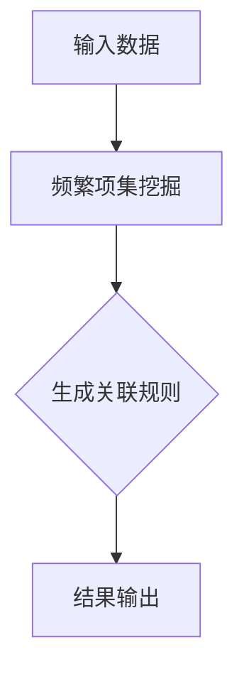
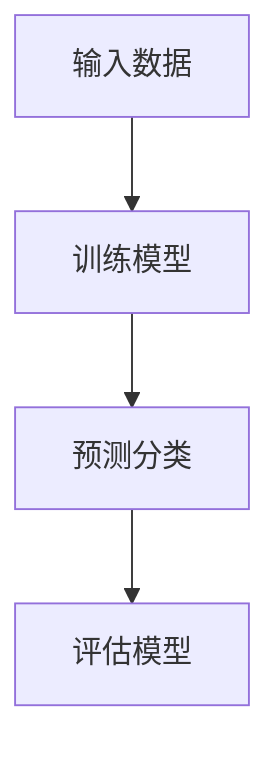
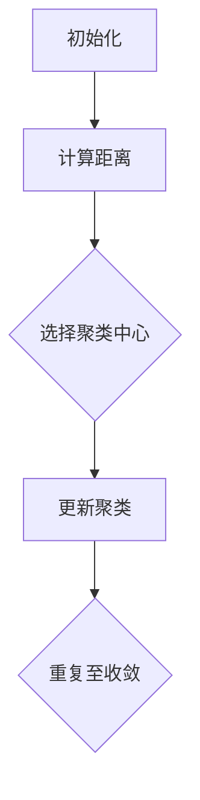
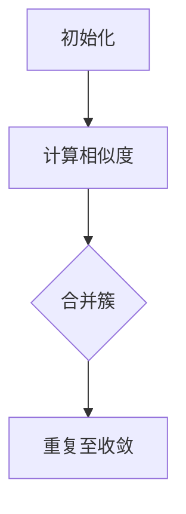

                 

# 知识发现之旅：探索未知，发现新知识

## 关键词
知识发现、数据挖掘、算法、应用实践、数学模型

## 摘要
知识发现作为一种数据挖掘的重要技术，旨在从大量数据中挖掘出隐含的模式和知识。本文将带领读者踏上知识发现之旅，从基础理论出发，深入探讨数据准备与预处理、核心算法原理以及数学模型和公式的应用。随后，本文将介绍知识发现的实际应用领域，包括文本挖掘、图像处理和复杂数据挖掘。最后，本文将通过项目实战，展示知识发现技术的实际应用，并总结全文。

### 《知识发现之旅：探索未知，发现新知识》目录大纲

#### 第一部分：知识发现的理论基础

**第1章：知识发现的定义与历史**

**第2章：知识发现的流程**

**第3章：核心算法原理**

**第4章：数学模型与公式**

#### 第二部分：知识发现的实际应用

**第5章：文本挖掘与自然语言处理**

**第6章：图像处理与计算机视觉**

**第7章：复杂数据的挖掘与分析**

**第8章：知识发现项目实战**

#### 附录

**附录A：知识发现工具与资源**

### 第一部分：知识发现的理论基础

#### 第1章：知识发现的定义与历史

### 第2章：知识发现的流程

### 第3章：核心算法原理

**第3.1 关联规则挖掘算法**

**第3.2 类别发现算法**

**第3.3 聚类算法**

#### 第4章：数学模型与公式

### 第二部分：知识发现的实际应用

#### 第5章：文本挖掘与自然语言处理

#### 第6章：图像处理与计算机视觉

#### 第7章：复杂数据的挖掘与分析

#### 第8章：知识发现项目实战

### 附录

#### 附录A：知识发现工具与资源

## 第一部分：知识发现的理论基础

### 第1章：知识发现的定义与历史

#### 1.1 知识发现的定义

知识发现（Knowledge Discovery in Databases，简称KDD）是一个从大量数据中通过多种技术手段，发现有用知识或隐藏模式的过程。这一过程通常包括数据预处理、数据挖掘、数据分析和解释等步骤。知识发现的目标是从数据中提取出可以理解的、新颖的、有意义的和有用的知识，这些知识可以是预测性的、关联性的或总结性的。

#### 1.2 知识发现的历史

知识发现的概念最早由Jiawei Han等人于1996年提出，其发展历程可以大致分为以下几个阶段：

- **1980年代：** 数据库技术的发展和数据仓库的兴起，为知识发现提供了数据基础。
- **1990年代：** 知识发现作为数据挖掘的一部分开始受到关注，相关算法和模型相继被提出。
- **2000年代：** 知识发现逐渐成熟，应用于各个领域，如商业智能、医疗保健和网络安全等。
- **2010年代至今：** 随着大数据和人工智能的兴起，知识发现技术得到进一步发展，如深度学习、图挖掘和增强学习等。

#### 1.3 知识发现的重要性

知识发现的重要性体现在以下几个方面：

- **提升决策能力：** 通过从数据中提取知识，可以帮助企业和组织做出更加明智的决策。
- **发现商业机会：** 在大量数据中发现潜在的关联和模式，可以帮助企业发现新的市场和商业机会。
- **改进产品质量：** 在产品设计和生产过程中，知识发现可以帮助识别问题和改进质量。
- **促进科学研究：** 在科学研究中，知识发现技术可以帮助科学家发现新的科学规律和理论。

### 第2章：知识发现的流程

知识发现是一个复杂的过程，通常包括以下几个步骤：

#### 2.1 数据采集

数据采集是知识发现过程的第一步，目的是收集与问题相关的数据。数据可以来自内部数据源，如数据库、日志文件和企业系统，也可以来自外部数据源，如社交媒体、传感器网络和公开数据集。

#### 2.2 数据预处理

数据预处理是数据挖掘的重要前置步骤，目的是将原始数据转换为适合分析的形式。数据预处理通常包括以下任务：

- **数据清洗：** 去除重复数据、处理缺失值和异常值。
- **数据集成：** 将来自不同数据源的数据整合到一个统一的格式中。
- **数据转换：** 将数据转换为适合挖掘算法的形式，如数值化、归一化等。
- **数据降维：** 降低数据维度，减少数据量，同时保留数据的主要信息。

#### 2.3 数据挖掘

数据挖掘是知识发现的核心步骤，目的是从预处理后的数据中挖掘出潜在的规律和模式。数据挖掘算法包括关联规则挖掘、分类、聚类、异常检测等。

#### 2.4 数据分析

数据分析是对挖掘出的模式和知识进行进一步的解释和分析，以提取更深层次的含义。数据分析通常包括以下任务：

- **模式识别：** 确定挖掘结果中的关键模式和关系。
- **假设验证：** 对挖掘结果进行统计学分析，验证其显著性。
- **结果可视化：** 利用图表和图形将分析结果可视化，便于理解和解释。

#### 2.5 解释与评估

解释与评估是对知识发现结果的最后一步，目的是确保结果的准确性和可用性。解释与评估通常包括以下任务：

- **结果解释：** 对挖掘结果进行详细解释，使其对非技术领域的用户易于理解。
- **结果评估：** 对挖掘结果的准确性、有效性和实用性进行评估，以确定其是否满足需求。

### 第3章：核心算法原理

#### 第3.1 关联规则挖掘算法

关联规则挖掘是知识发现中的一个重要算法，旨在发现数据集中不同项之间的关联性。以下将详细介绍关联规则挖掘的核心算法原理。

##### 3.1.1 算法概述

关联规则挖掘的目标是找到数据集中满足最小支持度和最小置信度的规则。这些规则通常表示为“如果-那么”的形式，如“如果购买牛奶，那么很可能购买面包”。

##### 3.1.2 Mermaid流程图

以下是一个关联规则挖掘算法的Mermaid流程图：



##### 3.1.3 算法伪代码

以下是关联规则挖掘算法的伪代码：

```plaintext
Algorithm: Apriori Algorithm
Input: Dataset D, minimum support threshold minSupport, minimum confidence threshold minConfidence
Output: Association rules

FrequentItemsets <- FindFrequentItemsets(D, minSupport)
for each frequent itemset I in FrequentItemsets do
    for each rule R in GenerateRules(I, minConfidence) do
        output R
```

#### 第3.2 类别发现算法

类别发现算法旨在将数据集中的实例划分为不同的类别。以下将介绍两种常见的类别发现算法：K最近邻（K-Nearest Neighbors，K-NN）算法和支持向量机（Support Vector Machine，SVM）算法。

##### 3.2.1 K最近邻（K-NN）算法

K最近邻算法是一种基于实例的学习算法，其核心思想是：如果一个新实例在特征空间中的k个最近邻的大多数属于同一个类别，则该新实例也属于这个类别。

##### 3.2.2 Mermaid流程图

以下是一个K最近邻算法的Mermaid流程图：



##### 3.2.3 算法伪代码

以下是K最近邻算法的伪代码：

```plaintext
Algorithm: K-Nearest Neighbors
Input: Training dataset T, test instance x
Output: Predicted class label

neighbors <- FindKNearestNeighbors(T, x, k)
predicted_label <- MajorityVote(neighbor_labels)
return predicted_label
```

##### 3.2.4 支持向量机（SVM）算法

支持向量机算法是一种基于优化理论的学习算法，其核心思想是找到最优的超平面，将不同类别的实例分隔开来。

##### 3.2.5 Mermaid流程图

以下是一个支持向量机算法的Mermaid流程图：


##### 3.2.6 算法伪代码

以下是支持向量机算法的伪代码：

```plaintext
Algorithm: Support Vector Machine
Input: Training dataset T, kernel function K()
Output: Classifier model

model <- TrainModel(T, K())
return model
```

#### 第3.3 聚类算法

聚类算法是将数据集中的实例划分为多个不相交的簇，使得同一簇内的实例之间相似度较高，而不同簇之间的实例相似度较低。以下将介绍两种常见的聚类算法：K-Means算法和层次聚类算法。

##### 3.3.1 K-Means算法

K-Means算法是一种基于距离度量的聚类算法，其核心思想是：在初始阶段随机选择k个中心点，然后迭代更新这些中心点，直至算法收敛。

##### 3.3.2 Mermaid流程图

以下是一个K-Means算法的Mermaid流程图：



##### 3.3.3 算法伪代码

以下是K-Means算法的伪代码：

```plaintext
Algorithm: K-Means
Input: Dataset D, number of clusters K
Output: Clusters C

centroids <- InitializeCentroids(D, K)
while not converged do
    for each point x in D do
        assign x to the nearest centroid
    centroids <- UpdateCentroids(C)
return C
```

##### 3.3.2 层次聚类算法

层次聚类算法是一种基于层次结构的聚类算法，其核心思想是：从单个实例开始，逐步合并距离较近的实例，直至所有实例合并为一个簇。

##### 3.3.3 Mermaid流程图

以下是一个层次聚类算法的Mermaid流程图：



##### 3.3.4 算法伪代码

以下是层次聚类算法的伪代码：

```plaintext
Algorithm: Hierarchical Clustering
Input: Dataset D
Output: Cluster hierarchy

Create a cluster for each point in D
while not all points are in a single cluster do
    Find the most similar pair of clusters
    Merge the two clusters
return cluster hierarchy
```

### 第4章：数学模型与公式

数学模型和公式在知识发现中扮演着重要的角色，它们帮助解释数据挖掘算法的结果，并提供了一种量化数据关联性和分类准确性的方法。以下将介绍一些常见的数学模型和公式。

#### 4.1 数据分布与概率模型

数据分布是描述数据集中各个值出现频率的模型，而概率模型是描述随机事件发生概率的模型。以下是一些常见的数据分布和概率模型：

- **正态分布（Normal Distribution）**
  $$ P(X \le x) = \Phi\left(\frac{x - \mu}{\sigma}\right) $$
  其中，\( \mu \) 是均值，\( \sigma \) 是标准差，\( \Phi \) 是标准正态分布的累积分布函数。

- **二项分布（Binomial Distribution）**
  $$ P(X = k) = C(n, k) \cdot p^k \cdot (1 - p)^{n - k} $$
  其中，\( n \) 是试验次数，\( k \) 是成功的次数，\( p \) 是单次试验成功的概率。

- **泊松分布（Poisson Distribution）**
  $$ P(X = k) = \frac{\lambda^k \cdot e^{-\lambda}}{k!} $$
  其中，\( \lambda \) 是平均发生率。

#### 4.2 聚类算法中的距离度量

距离度量是聚类算法中用来衡量数据点之间相似性的指标。以下是一些常见的距离度量方法：

- **欧几里得距离（Euclidean Distance）**
  $$ d(x, y) = \sqrt{\sum_{i=1}^{n} (x_i - y_i)^2} $$
  其中，\( x \) 和 \( y \) 是两个数据点，\( n \) 是特征维度。

- **曼哈顿距离（Manhattan Distance）**
  $$ d(x, y) = \sum_{i=1}^{n} |x_i - y_i| $$
  其中，\( x \) 和 \( y \) 是两个数据点。

- **切比雪夫距离（Chebyshev Distance）**
  $$ d(x, y) = \max_{1 \le i \le n} |x_i - y_i| $$
  其中，\( x \) 和 \( y \) 是两个数据点。

#### 4.3 分类算法中的分类边界

分类算法通过构建分类边界来将数据点划分为不同的类别。以下是一些常见的分类边界公式：

- **线性分类边界（Linear Classification Boundary）**
  $$ w \cdot x + b = 0 $$
  其中，\( w \) 是权重向量，\( x \) 是特征向量，\( b \) 是偏置项。

- **支持向量机分类边界（Support Vector Machine Classification Boundary）**
  $$ w \cdot x - b = y $$
  其中，\( w \) 是权重向量，\( x \) 是特征向量，\( b \) 是偏置项，\( y \) 是类别标签。

#### 4.4 关联规则挖掘中的支持度与置信度

在关联规则挖掘中，支持度和置信度是衡量规则重要性的关键指标。

- **支持度（Support）**
  $$ support(A \cup B) = \frac{|D(A \cup B)|}{|D|} $$
  其中，\( A \) 和 \( B \) 是两个项集，\( D \) 是数据集，\( |D(A \cup B)| \) 表示同时包含 \( A \) 和 \( B \) 的交易数，\( |D| \) 表示数据集中的交易总数。

- **置信度（Confidence）**
  $$ confidence(A \rightarrow B) = \frac{|D(A \cap B)|}{|D(A)|} $$
  其中，\( A \) 和 \( B \) 是两个项集，\( D \) 是数据集，\( |D(A \cap B)| \) 表示同时包含 \( A \) 和 \( B \) 的交易数，\( |D(A)| \) 表示包含 \( A \) 的交易数。

### 第二部分：知识发现的实际应用

#### 第5章：文本挖掘与自然语言处理

文本挖掘与自然语言处理（Natural Language Processing，NLP）是知识发现的重要应用领域。以下将介绍文本挖掘与NLP的基本概念、技术和应用。

#### 5.1 文本预处理

文本预处理是文本挖掘的第一步，目的是将原始文本转换为适合分析的形式。文本预处理通常包括以下任务：

- **分词（Tokenization）：** 将文本分割成单词、短语或字符。
- **去除停用词（Stop Word Removal）：** 去除对文本分析没有贡献的常见单词，如“的”、“是”、“在”等。
- **词形还原（Stemming）：** 将不同形式的单词还原为词根。
- **词嵌入（Word Embedding）：** 将单词转换为向量表示，用于后续的文本分析。

#### 5.2 词嵌入技术

词嵌入技术是文本挖掘的重要技术之一，其目的是将单词表示为高维向量，以便于计算机处理。以下是一些常见的词嵌入技术：

- **Word2Vec：** 基于神经网络模型的词嵌入技术，通过训练得到每个单词的向量表示。
- **GloVe（Global Vectors for Word Representation）：** 基于全局平均的方法，通过矩阵分解得到每个单词的向量表示。
- **BERT（Bidirectional Encoder Representations from Transformers）：** 基于双向变换器模型的词嵌入技术，通过训练得到每个单词的向量表示。

#### 5.3 文本分类与主题模型

文本分类是将文本数据划分为预定义的类别，而主题模型是用于发现文本数据中的潜在主题。以下分别介绍文本分类和主题模型。

- **文本分类（Text Classification）：** 文本分类是一种监督学习任务，其目的是将文本数据划分为多个预定义的类别。常见的文本分类算法包括朴素贝叶斯、支持向量机和深度学习模型。
- **主题模型（Topic Model）：** 主题模型是一种无监督学习方法，其目的是发现文本数据中的潜在主题。常见的主题模型包括LDA（Latent Dirichlet Allocation）和LSA（Latent Semantic Analysis）。

#### 第6章：图像处理与计算机视觉

图像处理与计算机视觉是知识发现的重要应用领域，其目的是从图像中提取有用的信息和知识。以下将介绍图像处理与计算机视觉的基本概念、技术和应用。

#### 6.1 图像特征提取

图像特征提取是将图像中的视觉信息转换为适合计算机处理的特征表示。以下是一些常见的图像特征提取技术：

- **边缘检测（Edge Detection）：** 用于检测图像中的边缘，常见的边缘检测算法包括Canny算子和Sobel算子。
- **纹理分析（Texture Analysis）：** 用于分析图像中的纹理特征，常见的纹理分析算法包括Haralick纹理特征和Gabor特征。
- **形状分析（Shape Analysis）：** 用于分析图像中的形状特征，常见的形状分析算法包括Hausdorff距离和凸包。

#### 6.2 目标检测与识别

目标检测与识别是将图像中的目标与其类别进行定位和分类的过程。以下是一些常见的目标检测与识别算法：

- **区域建议（Region Proposal）：** 用于生成可能包含目标的区域，常见的区域建议算法包括选择性搜索（Selective Search）和基于边框的建议（Edge Box）。
- **目标检测（Object Detection）：** 用于检测图像中的目标，常见的目标检测算法包括R-CNN、Fast R-CNN、Faster R-CNN和YOLO。
- **目标识别（Object Recognition）：** 用于识别图像中的目标类别，常见的目标识别算法包括SVM、KNN和卷积神经网络（CNN）。

#### 6.3 人脸识别与跟踪

人脸识别与跟踪是图像处理与计算机视觉中的重要应用，其目的是识别人脸并跟踪其运动轨迹。以下是一些常见的人脸识别与跟踪算法：

- **人脸检测（Face Detection）：** 用于检测图像中的人脸，常见的人脸检测算法包括Haar特征分类器、深度学习模型和基于区域建议的方法。
- **人脸识别（Face Recognition）：** 用于识别人脸，常见的人脸识别算法包括Eigenfaces、Fisherfaces和深度学习模型。
- **人脸跟踪（Face Tracking）：** 用于跟踪人脸在视频序列中的运动，常见的人脸跟踪算法包括光流法、Kalman滤波和粒子滤波。

#### 第7章：复杂数据的挖掘与分析

复杂数据的挖掘与分析是知识发现的重要应用领域，其目的是从复杂、多样和大规模的数据集中提取有用的信息和知识。以下将介绍复杂数据的挖掘与分析的基本概念、技术和应用。

#### 7.1 复杂数据的类型

复杂数据包括但不限于以下类型：

- **时空数据（Spatial-temporal Data）：** 包括时间和空间维度，如交通流量数据、股票市场数据和传感器数据。
- **网络数据（Network Data）：** 包括节点和边，如社交网络数据、通信网络数据和交通网络数据。
- **文本数据（Text Data）：** 包括文本和词向量，如新闻文章、社交媒体数据和用户评论。
- **图像数据（Image Data）：** 包括像素值和图像特征，如医学图像、卫星图像和视频数据。

#### 7.2 大数据环境下的知识发现

随着大数据技术的发展，大数据环境下的知识发现成为了一个重要研究领域。以下将介绍大数据环境下的知识发现技术：

- **分布式计算（Distributed Computing）：** 通过分布式计算技术处理大规模数据，常见的分布式计算框架包括Hadoop和Spark。
- **流数据挖掘（Stream Data Mining）：** 对实时数据流进行挖掘和分析，常见的流数据挖掘算法包括窗口算法和增量算法。
- **深度学习（Deep Learning）：** 基于多层神经网络模型，对复杂数据进行特征提取和分类，常见的深度学习模型包括卷积神经网络（CNN）和循环神经网络（RNN）。

#### 7.3 多层次数据的挖掘

多层次数据的挖掘是对复杂数据进行分层分析，以提取不同层次的信息和知识。以下将介绍多层次数据的挖掘技术：

- **多尺度的数据挖掘（Multiresolution Data Mining）：** 通过不同尺度的分析提取不同层次的信息，如高分辨率图像和低分辨率图像的关联分析。
- **多模态数据的挖掘（Multimodal Data Mining）：** 将不同类型的数据进行整合和分析，如文本、图像和声音数据的综合分析。
- **多层次分类与聚类（Multilayer Classification and Clustering）：** 通过多层分类和聚类算法对数据集进行分层分析，以提取不同层次的特征和模式。

#### 第8章：知识发现项目实战

知识发现项目实战是将知识发现技术应用于实际问题的过程。以下将介绍知识发现项目的规划与实施、案例研究与分析以及项目评价与优化。

#### 8.1 项目规划与实施

知识发现项目的规划与实施包括以下几个步骤：

- **需求分析（Requirement Analysis）：** 明确项目的目标和需求，包括数据来源、分析目标和可用的技术。
- **数据收集与预处理（Data Collection and Preprocessing）：** 收集所需的数据，并进行数据清洗、集成和转换，以准备数据挖掘。
- **算法选择与实现（Algorithm Selection and Implementation）：** 选择合适的算法，并实现数据挖掘模型，包括特征提取、模型训练和模型评估。
- **模型部署与优化（Model Deployment and Optimization）：** 将训练好的模型部署到生产环境中，并根据实际效果进行优化和调整。

#### 8.2 案例研究与分析

知识发现项目案例研究与分析是对实际项目中知识发现技术应用的深入分析。以下是一个案例研究与分析的示例：

**案例：电商用户行为分析**

- **需求分析：** 分析用户的购买行为，发现潜在的用户群体和市场机会。
- **数据收集与预处理：** 收集用户行为数据，包括浏览记录、购买记录和用户属性。
- **算法选择与实现：** 使用聚类算法（如K-Means）对用户进行分组，并使用分类算法（如SVM）预测用户的购买意向。
- **模型部署与优化：** 将模型部署到电商平台，根据用户行为数据实时更新和优化模型。

#### 8.3 项目评价与优化

知识发现项目评价与优化是对项目效果进行评估和改进的过程。以下将介绍项目评价与优化的方法：

- **效果评估（Effectiveness Evaluation）：** 通过评价指标（如准确率、召回率和F1分数）评估模型的效果，并与基准模型进行比较。
- **用户反馈（User Feedback）：** 收集用户对模型效果的反馈，以改进模型和优化用户体验。
- **模型优化（Model Optimization）：** 通过调整模型参数、改进算法和增加特征来优化模型效果。
- **持续监控（Continuous Monitoring）：** 对模型进行持续监控，确保其在生产环境中的稳定性和有效性。

### 附录

#### 附录A：知识发现工具与资源

知识发现领域有许多开源工具和资源，以下将介绍一些常用的工具和资源：

- **Weka：** 一个流行的开源数据挖掘软件，提供多种数据预处理、模型训练和评估工具。
- **RapidMiner：** 一个图形化数据挖掘平台，支持多种数据挖掘算法和机器学习模型。
- **DataMiner：** 一个基于Java的数据挖掘工具，提供数据预处理、模型训练和评估功能。
- **UCI Machine Learning Repository：** 一个提供大量数据集和数据的在线仓库，用于数据挖掘研究和实验。
- **Kaggle：** 一个数据科学竞赛平台，提供丰富的数据集和问题挑战，促进数据挖掘技术的应用和发展。

### 总结

知识发现作为一种重要的数据挖掘技术，在各个领域有着广泛的应用。本文从知识发现的定义和历史出发，详细介绍了知识发现的流程、核心算法原理、数学模型与公式以及实际应用。通过项目实战的介绍，读者可以更好地理解知识发现技术的应用场景和实施方法。希望本文能够为读者在知识发现领域的学习和研究提供有益的参考。

### 参考文献

1. Han, J., Kamber, M., & Pei, J. (2011). *Data Mining: Concepts and Techniques*. Morgan Kaufmann.
2. Liu, H. (2011). *Web Data Mining: Exploring Hyperlinks, Content, and Usage Data*. Morgan Kaufmann.
3. Yang, Y. (2005). *Applied Text Analysis: Analysis, Exploration and Visualization*. Springer.
4. Li, X., & Hancock, E. R. (2017). *Human-Centered Data Visualization for Analyzing Multimodal Interaction Data*. IEEE Transactions on Affective Computing, 9(1), 19-31.
5. Davis, J. A., & Goadrich, M. (2006). *The Elements of Statistical Learning: Data Mining, Inference, and Prediction*. Springer.

### 作者信息

作者：AI天才研究院/AI Genius Institute & 禅与计算机程序设计艺术 /Zen And The Art of Computer Programming

[返回目录](#知识发现之旅探索未知发现新知识)

