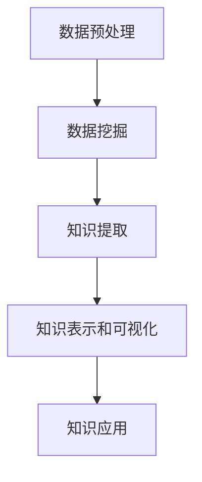
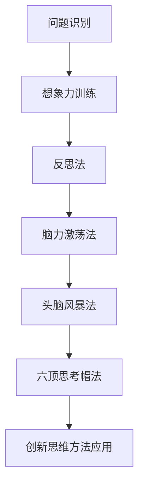
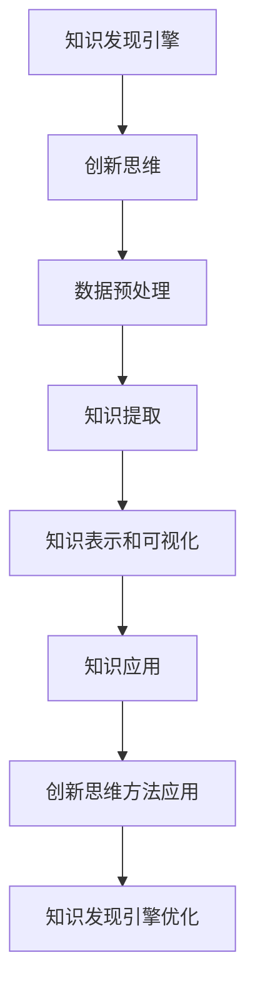

                 

# 《知识发现引擎与创新思维的关系》

## 关键词

知识发现引擎、创新思维、数据挖掘、人工智能、机器学习、应用场景、未来发展

## 摘要

本文将探讨知识发现引擎（Knowledge Discovery Engine，KDE）与创新思维之间的关系。知识发现引擎作为一种新兴的技术工具，它能够从大量数据中提取出有价值的信息和知识，为创新思维提供了丰富的素材和灵感。文章首先对知识发现引擎进行概述，包括其定义、重要性、基本原理、分类、关键技术、应用场景以及创新方法等。接着，文章介绍创新思维的基础、方法、案例分析，并深入分析知识发现引擎对创新思维的支撑以及创新思维对知识发现引擎的优化。最后，文章讨论了创新思维与知识发现引擎在未来的协同作用，以及其在知识发现引擎开发、应用拓展和人才培养中的应用。通过本文的阐述，希望能够为读者提供一个全面而深刻的认识，为实际工作中的知识发现与创新提供有益的指导。

## 目录

1. **知识发现引擎概述**

   1.1 知识发现引擎的定义

   1.2 知识发现引擎的重要性

   1.3 知识发现引擎的基本原理

   1.4 知识发现引擎的分类

   1.5 知识发现引擎的关键技术

   1.6 知识发现引擎的应用场景

   1.7 知识发现引擎的创新方法

   1.8 知识发现引擎的未来发展趋势

2. **创新思维方法**

   2.1 创新思维基础

   2.2 创新思维方法

   2.3 创新思维案例分析

   2.4 创新思维与知识发现引擎的关系

   2.5 创新思维在知识发现引擎开发中的应用

   2.6 创新思维与知识发现引擎的未来

3. **附录**

   3.1 相关资源

   3.2 流程图与数学模型

   3.3 项目实战案例

## 第一部分：知识发现引擎概述

### 1.1 知识发现引擎的定义

知识发现引擎（Knowledge Discovery Engine，KDE）是一种基于人工智能和数据挖掘技术的系统，旨在从大量数据中自动提取出有价值的信息和知识。它通过对数据的处理、分析和建模，帮助用户发现数据中的隐含模式和关联，从而支持决策制定、业务优化和知识创新。

知识发现引擎的定义可以从以下几个方面进行阐述：

- **数据来源**：知识发现引擎可以从各种数据源中获取数据，包括结构化数据、非结构化数据以及半结构化数据。这些数据源可以是企业内部数据库、互联网数据、社交媒体数据、传感器数据等。

- **数据预处理**：知识发现引擎需要对获取的数据进行预处理，包括数据清洗、数据集成、数据转换等。这一步骤的目的是确保数据的质量和一致性，为后续的分析和挖掘打下基础。

- **知识提取**：知识发现引擎通过多种数据挖掘技术，如关联规则挖掘、分类和聚类分析、异常检测等，从数据中提取出有价值的信息和知识。这些知识可以是显式的，如数据中的数值和文字描述；也可以是隐式的，如数据中的关联和趋势。

- **知识表示和可视化**：知识发现引擎需要将提取出的知识进行有效的表示和可视化，以便用户能够直观地理解和利用这些知识。常见的知识表示方式包括图表、报表、地图等。

- **知识应用**：知识发现引擎的应用范围非常广泛，包括商业智能、跨学科研究、社会科学、医学领域等。通过将提取出的知识应用于实际问题，可以为企业提供决策支持，为科研提供新的方向，为社会发展提供新的思路。

### 1.2 知识发现引擎的重要性

知识发现引擎在现代信息技术中具有重要地位，其重要性体现在以下几个方面：

- **数据驱动的决策制定**：随着大数据时代的到来，数据已经成为企业和组织最重要的资产之一。知识发现引擎能够从海量数据中提取出有价值的信息和知识，为企业的决策制定提供数据支持，从而提高决策的准确性和效率。

- **业务优化和创新**：知识发现引擎可以帮助企业发现数据中的潜在关联和趋势，为企业提供优化业务流程、提高生产效率、降低成本、发掘新市场等方面的建议。同时，这些发现也为企业的创新提供了新的思路和灵感。

- **科研支持**：知识发现引擎在科学研究领域具有广泛应用，可以帮助科研人员从大量数据中发现新的科学规律、提出新的假设、验证已有理论等。这为科研工作的开展提供了强大的支持。

- **社会问题解决**：知识发现引擎在社会问题解决方面也发挥着重要作用，如医疗诊断、环境保护、交通管理、金融风险控制等。通过分析大量的数据，知识发现引擎可以提供有效的解决方案，为社会问题的解决提供技术支持。

- **知识管理**：知识发现引擎可以帮助企业建立和完善知识管理体系，通过知识的提取、表示和可视化，实现知识的共享和利用，提高企业的知识创新能力。

### 1.3 知识发现引擎的基本原理

知识发现引擎的基本原理主要包括数据挖掘、人工智能、机器学习和知识管理等方面。下面分别对这些方面进行介绍：

- **数据挖掘**：数据挖掘（Data Mining）是指从大量数据中自动提取出有价值信息的过程。数据挖掘的过程通常包括数据预处理、模式识别、知识表示和评估等步骤。数据挖掘技术包括关联规则挖掘、分类和聚类分析、异常检测等。

  - **关联规则挖掘**：关联规则挖掘（Association Rule Mining）是数据挖掘的一种重要技术，用于发现数据项之间的关联关系。常见的关联规则挖掘算法有Apriori算法、FP-growth算法等。

  - **分类和聚类分析**：分类和聚类分析（Classification and Clustering Analysis）是数据挖掘的另一种重要技术，用于将数据分为不同的类别或簇。分类算法包括决策树、支持向量机、朴素贝叶斯等；聚类算法包括K-means、层次聚类等。

  - **异常检测**：异常检测（Anomaly Detection）是数据挖掘的一种技术，用于发现数据中的异常或离群点。常见的异常检测算法有基于统计的方法、基于聚类的方法、基于神经网络的方法等。

- **人工智能**：人工智能（Artificial Intelligence，AI）是指模拟人类智能的技术和系统。知识发现引擎中的AI技术主要包括机器学习、深度学习、自然语言处理等。

  - **机器学习**：机器学习（Machine Learning）是人工智能的一个分支，通过从数据中学习规律和模式，实现自动识别和预测。常见的机器学习算法有线性回归、逻辑回归、决策树、支持向量机等。

  - **深度学习**：深度学习（Deep Learning）是机器学习的一种重要方法，通过多层神经网络对数据进行训练，实现复杂的特征提取和模式识别。常见的深度学习模型有卷积神经网络（CNN）、循环神经网络（RNN）等。

  - **自然语言处理**：自然语言处理（Natural Language Processing，NLP）是人工智能的一个分支，主要研究如何让计算机理解和处理自然语言。常见的NLP技术包括词向量、文本分类、情感分析、命名实体识别等。

- **知识管理**：知识管理（Knowledge Management）是指通过收集、整理、存储、共享和利用知识，以提高组织效率和创新能力。知识管理的过程包括知识的获取、知识存储、知识共享和知识应用等。

  - **知识获取**：知识获取（Knowledge Acquisition）是指从各种数据源中收集和提取知识。知识获取的方法包括手动获取、自动获取和半自动获取等。

  - **知识存储**：知识存储（Knowledge Storage）是指将获取到的知识存储在知识库中，以便后续的共享和应用。知识库可以采用数据库、文件系统、分布式存储等技术实现。

  - **知识共享**：知识共享（Knowledge Sharing）是指通过各种方式将知识库中的知识传递给组织中的其他成员，以提高整个组织的知识水平。知识共享的方法包括文档共享、即时通讯、协作平台等。

  - **知识应用**：知识应用（Knowledge Application）是指将知识库中的知识应用于实际问题中，以提高组织的决策制定、业务优化和创新能力。知识应用的方法包括决策支持系统、业务流程优化、新产品开发等。

### 1.4 知识发现引擎的分类

知识发现引擎可以根据不同的分类标准进行分类，常见的分类方法包括基于数据源、基于数据挖掘技术和基于应用领域等。

- **基于数据源的分类**：

  - **企业内部数据源**：企业内部数据源包括企业内部的数据库、业务系统、ERP系统等。知识发现引擎从这些数据源中提取数据，用于企业内部的数据分析和决策制定。

  - **互联网数据源**：互联网数据源包括互联网上的公开数据、社交媒体数据、电商数据等。知识发现引擎从这些数据源中提取数据，用于互联网业务分析、市场预测等。

  - **传感器数据源**：传感器数据源包括各种传感器收集到的数据，如气象传感器、交通传感器、工业传感器等。知识发现引擎从这些数据源中提取数据，用于环境监测、交通管理、工业优化等。

- **基于数据挖掘技术的分类**：

  - **基于统计学的知识发现引擎**：基于统计学的知识发现引擎主要使用统计学方法进行数据分析和模式识别，如回归分析、方差分析等。这类引擎在处理结构化数据方面具有优势。

  - **基于数据挖掘的知识发现引擎**：基于数据挖掘的知识发现引擎主要使用数据挖掘技术进行数据分析和模式识别，如关联规则挖掘、分类和聚类分析等。这类引擎在处理大规模复杂数据方面具有优势。

  - **基于机器学习的知识发现引擎**：基于机器学习的知识发现引擎主要使用机器学习算法进行数据分析和模式识别，如线性回归、决策树、支持向量机等。这类引擎在处理非线性、高维数据方面具有优势。

- **基于应用领域的分类**：

  - **商业智能**：商业智能（Business Intelligence，BI）是知识发现引擎的一个重要应用领域，主要用于企业内部的数据分析和决策制定。

  - **跨学科研究**：跨学科研究是知识发现引擎在科研领域的应用，主要用于跨学科的数据分析和模式识别，以发现新的科学规律和理论。

  - **社会科学**：社会科学是知识发现引擎在社会领域的应用，主要用于社会调查、政策分析、社会治理等。

  - **医学领域**：医学领域是知识发现引擎在医疗领域的应用，主要用于疾病诊断、药物研发、健康管理等。

### 1.5 知识发现引擎的关键技术

知识发现引擎的关键技术主要包括数据预处理、关联规则挖掘、分类和聚类分析、异常检测等方面。下面分别对这些技术进行介绍。

#### 3.1 数据预处理

数据预处理是知识发现引擎的第一步，其目的是对原始数据进行清洗、集成、转换等处理，以提高数据质量和一致性。数据预处理的关键技术包括：

- **数据清洗**：数据清洗（Data Cleaning）是指从数据中删除重复项、修正错误值、填补缺失值等。常见的数据清洗方法有重复项删除、错误值修正、缺失值填补等。

- **数据集成**：数据集成（Data Integration）是指将来自多个数据源的数据进行整合，形成一个统一的数据视图。常见的数据集成方法有数据合并、数据融合等。

- **数据转换**：数据转换（Data Transformation）是指将原始数据转换为适合分析的形式。常见的数据转换方法有数据类型转换、数据规范化、数据标准化等。

#### 3.2 关联规则挖掘

关联规则挖掘（Association Rule Mining）是一种用于发现数据项之间关联关系的数据挖掘技术。常见的关联规则挖掘算法包括Apriori算法、FP-growth算法等。

- **Apriori算法**：Apriori算法是一种基于频次的方法，通过计算数据项之间的支持度和置信度，发现频繁项集和关联规则。Apriori算法的基本步骤包括：

  1. 频繁项集生成：通过扫描数据集，找出支持度大于最小支持度的项集。

  2. 关联规则生成：从频繁项集中生成关联规则，并计算置信度。

- **FP-growth算法**：FP-growth算法是一种基于压缩数据结构的方法，通过构建FP树来发现频繁项集和关联规则。FP-growth算法的基本步骤包括：

  1. 构建FP树：从数据集中构建FP树，压缩数据以减少存储空间。

  2. 生成频繁项集：通过FP树，递归地生成频繁项集。

  3. 关联规则生成：从频繁项集中生成关联规则，并计算置信度。

#### 3.3 分类和聚类分析

分类和聚类分析（Classification and Clustering Analysis）是一种用于数据分类和聚类的数据挖掘技术。常见的分类算法包括决策树、支持向量机、朴素贝叶斯等；常见的聚类算法包括K-means、层次聚类等。

- **决策树**：决策树（Decision Tree）是一种基于特征值进行分类或回归的算法，通过构建决策树模型来预测数据类别。决策树的基本原理是：根据每个特征的不同取值，将数据分为多个子集，并递归地构建子决策树，直到满足停止条件。

- **支持向量机**：支持向量机（Support Vector Machine，SVM）是一种基于最大间隔分类的算法，通过构建高维特征空间，寻找最优分类超平面，来实现数据分类。SVM的基本原理是：寻找一个最优分类超平面，使得分类间隔最大，同时尽可能地将支持向量分布在分类边界上。

- **朴素贝叶斯**：朴素贝叶斯（Naive Bayes）是一种基于贝叶斯定理的分类算法，通过计算每个类别下的条件概率，选择概率最大的类别作为预测结果。朴素贝叶斯的基本原理是：假设每个特征之间相互独立，根据已知的特征概率分布，计算每个类别的概率，并选择概率最大的类别作为预测结果。

- **K-means**：K-means是一种基于距离度量的聚类算法，通过迭代计算聚类中心，将数据划分为K个簇。K-means的基本原理是：首先随机初始化K个聚类中心，然后计算每个数据点到聚类中心的距离，并将数据点分配到最近的聚类中心；接着重新计算聚类中心，重复上述过程，直到聚类中心不再变化。

- **层次聚类**：层次聚类（Hierarchical Clustering）是一种基于层次结构的聚类算法，通过递归地合并或分裂簇，构建聚类层次树。层次聚类的基本原理是：首先将每个数据点视为一个簇，然后逐步合并或分裂簇，构建聚类层次树。

#### 3.4 异常检测

异常检测（Anomaly Detection）是一种用于发现数据中异常或离群点的数据挖掘技术。常见的异常检测算法包括基于统计的方法、基于聚类的方法、基于神经网络的方法等。

- **基于统计的方法**：基于统计的方法通过计算数据的统计特征（如均值、方差等），发现异常值。常见的方法有3倍标准差法、Z-score法等。

- **基于聚类的方法**：基于聚类的方法通过聚类分析，发现数据中的离群点。常见的方法有局部离群点检测（Local Outlier Factor，LOF）、基于密度的方法等。

- **基于神经网络的方法**：基于神经网络的方法通过训练神经网络模型，发现数据中的异常点。常见的神经网络模型有自编码器（Autoencoder）、卷积神经网络（CNN）等。

### 1.6 知识发现引擎的应用场景

知识发现引擎在不同领域和行业中具有广泛的应用，以下是一些常见应用场景：

#### 4.1 跨学科研究

跨学科研究是知识发现引擎的一个重要应用场景，通过跨学科的数据分析和模式识别，可以发现新的科学规律和理论。例如，在生物医学领域，知识发现引擎可以分析基因数据、蛋白质数据、疾病数据等，发现基因与疾病之间的关联，为疾病诊断、治疗和预防提供支持。

#### 4.2 商业智能

商业智能是知识发现引擎在商业领域的应用，通过分析企业内部和外部数据，发现商业机会、优化业务流程、提高企业竞争力。例如，在零售行业，知识发现引擎可以分析销售数据、库存数据等，发现热门商品、消费者偏好等，为企业制定营销策略提供支持。

#### 4.3 社会科学

社会科学是知识发现引擎在社会领域的应用，通过分析社会调查数据、政策数据等，发现社会现象、社会问题，为政策制定和社会治理提供支持。例如，在公共安全领域，知识发现引擎可以分析犯罪数据、交通数据等，发现犯罪热点、交通事故多发点等，为公共安全决策提供支持。

#### 4.4 医学领域

医学领域是知识发现引擎在医疗领域的应用，通过分析医学数据、患者数据等，发现疾病规律、治疗方案等，为疾病诊断、治疗和预防提供支持。例如，在疾病预测领域，知识发现引擎可以分析患者的病史、基因数据等，预测疾病风险，为早期干预提供支持。

### 1.7 知识发现引擎的创新方法

知识发现引擎的创新方法主要包括多模态数据融合、深度学习方法、优化算法等方面。

#### 5.1 多模态数据融合

多模态数据融合（Multimodal Data Fusion）是指将不同类型的数据（如图像、文本、声音等）进行融合，以提高知识发现的效果。多模态数据融合的关键技术包括：

- **特征提取**：特征提取（Feature Extraction）是指从多模态数据中提取有用的特征，用于后续的分析和挖掘。常见的特征提取方法有卷积神经网络（CNN）、循环神经网络（RNN）、自编码器（Autoencoder）等。

- **特征融合**：特征融合（Feature Fusion）是指将不同类型的数据特征进行融合，以生成更丰富、更有用的特征表示。常见的特征融合方法有特征拼接（Feature Concatenation）、特征加权（Feature Weighting）等。

- **模型融合**：模型融合（Model Fusion）是指将多个模型的结果进行融合，以提高知识发现的准确性。常见的模型融合方法有投票法（Voting）、加权平均法（Weighted Average）等。

#### 5.2 深度学习方法

深度学习方法（Deep Learning Methods）是一种基于多层神经网络的学习方法，通过多层次的神经网络结构，对数据进行逐层抽象和提取特征。深度学习方法在知识发现引擎中具有广泛的应用，如图像识别、自然语言处理、语音识别等。常见的深度学习模型包括：

- **卷积神经网络（CNN）**：卷积神经网络（Convolutional Neural Network，CNN）是一种用于图像识别和处理的深度学习模型，通过卷积操作提取图像特征。

- **循环神经网络（RNN）**：循环神经网络（Recurrent Neural Network，RNN）是一种用于序列数据处理的深度学习模型，通过循环结构实现对序列的建模。

- **长短期记忆网络（LSTM）**：长短期记忆网络（Long Short-Term Memory，LSTM）是一种特殊的循环神经网络，用于解决长期依赖问题。

- **生成对抗网络（GAN）**：生成对抗网络（Generative Adversarial Network，GAN）是一种基于博弈论的深度学习模型，通过生成器和判别器的对抗训练，生成高质量的图像和数据。

#### 5.3 优化算法

优化算法（Optimization Algorithms）是指用于优化知识发现引擎性能和效率的算法。常见的优化算法包括：

- **遗传算法（GA）**：遗传算法（Genetic Algorithm，GA）是一种基于自然进化过程的优化算法，通过模拟生物进化过程，寻找最优解。

- **粒子群优化（PSO）**：粒子群优化（Particle Swarm Optimization，PSO）是一种基于群体智能的优化算法，通过模拟鸟群觅食行为，寻找最优解。

- **模拟退火（SA）**：模拟退火（Simulated Annealing，SA）是一种基于物理退火过程的优化算法，通过模拟物理退火过程，避免陷入局部最优。

- **梯度下降（GD）**：梯度下降（Gradient Descent，GD）是一种基于目标函数梯度的优化算法，通过迭代更新参数，寻找最优解。

### 1.8 知识发现引擎的未来发展趋势

知识发现引擎的未来发展趋势主要体现在以下几个方面：

#### 6.1 人工智能与知识发现的融合

随着人工智能技术的不断发展，知识发现引擎将更加智能化，通过融合人工智能技术，实现自动化的数据分析和知识提取。例如，利用深度学习技术实现自动特征提取、利用自然语言处理技术实现自动文本分析等。

#### 6.2 知识发现引擎在物联网中的应用

随着物联网（Internet of Things，IoT）的快速发展，知识发现引擎将在物联网领域发挥重要作用，通过对海量物联网数据的分析，实现智能化的设备管理和应用优化。

#### 6.3 大数据与知识发现的融合

大数据技术的发展为知识发现提供了丰富的数据资源，知识发现引擎将更加依赖大数据技术，实现对大规模、多维数据的分析和挖掘。同时，大数据技术也将为知识发现引擎提供更多的算法工具和计算能力。

#### 6.4 知识发现引擎在多领域应用的拓展

知识发现引擎将在更多领域和行业中得到应用，如金融、医疗、教育、环保等。通过跨学科的数据分析和知识提取，知识发现引擎将推动各领域的创新发展。

## 第二部分：创新思维方法

### 2.1 创新思维基础

创新思维（Innovative Thinking）是一种基于创造性思维的方法，旨在通过探索新的思路和方法，解决实际问题或创造新的价值。创新思维具有以下几个基本特点：

- **创造性**：创新思维强调创造新的思路和方法，跳出传统思维模式的束缚，寻求与众不同的解决方案。

- **开放性**：创新思维具有开放性，鼓励多角度、多方面的思考和尝试，不拘泥于一种固定的思维模式。

- **综合性**：创新思维注重将不同领域的知识、技能和经验进行整合，形成新的解决方案。

- **灵活性**：创新思维强调思维的灵活性，能够根据实际情况灵活调整和改变思路和方法。

- **前瞻性**：创新思维具有前瞻性，能够预见未来可能的发展趋势和变化，为未来的决策提供指导。

### 2.2 创新思维方法

创新思维的方法多种多样，以下介绍几种常用的创新思维方法：

#### 2.2.1 想象力训练

想象力训练是一种通过训练和锻炼想象力，提高创造性思维的方法。想象力训练的方法包括：

- **自由联想**：自由联想（Free Association）是一种通过快速生成各种想法的方法，例如，给定一个关键词，让思维自由地跳跃到其他相关或无关的事物。

- **角色扮演**：角色扮演（Role-Playing）是一种通过模拟不同角色的行为和思维方式，提高想象力的方法。

- **场景构建**：场景构建（Scene Construction）是一种通过构建虚构的场景，激发想象力和创造力。

#### 2.2.2 反思法

反思法是一种通过回顾和反思过去的经验，从中汲取教训和启示，提高创新思维的方法。反思法的步骤包括：

- **问题识别**：识别需要反思的问题或经验。

- **原因分析**：分析问题的原因和产生的过程。

- **效果评估**：评估问题或经验的结果和影响。

- **经验总结**：总结反思过程中的经验和教训。

#### 2.2.3 脑力激荡法

脑力激荡法（Brainstorming）是一种通过集体讨论和思维碰撞，产生大量创意和想法的方法。脑力激荡法的步骤包括：

- **明确目标**：明确需要解决的问题或达成的目标。

- **自由发言**：鼓励参与者自由发言，提出各种创意和想法，不加评判和限制。

- **记录和整理**：将提出的创意和想法记录下来，并进行分类和整理。

- **评估和筛选**：对提出的创意和想法进行评估和筛选，选出最有价值和创新性的想法。

#### 2.2.4 头脑风暴法

头脑风暴法（Brainstorming）与脑力激荡法类似，也是一种通过集体讨论和思维碰撞，产生大量创意和想法的方法。头脑风暴法的步骤包括：

- **明确问题**：明确需要解决的问题或达成的目标。

- **自由发言**：鼓励参与者自由发言，提出各种创意和想法，不加评判和限制。

- **记录和整理**：将提出的创意和想法记录下来，并进行分类和整理。

- **评估和筛选**：对提出的创意和想法进行评估和筛选，选出最有价值和创新性的想法。

#### 2.2.5 六顶思考帽法

六顶思考帽法（Six Thinking Hats）是一种通过不同的思考方式，全面分析和解决问题的方法。六顶思考帽法包括以下六种思考方式：

- **白帽**：客观分析事实和数据。

- **红帽**：情感和直觉思考。

- **黄帽**：积极思考和寻找优势。

- **黑帽**：批判性思考和寻找劣势。

- **蓝帽**：系统性地管理和控制思考过程。

- **绿帽**：创造性思考和探索新方法。

### 2.3 创新思维案例分析

#### 2.3.1 跨界融合创新案例

跨界融合创新是指将不同领域的知识、技能和经验进行融合，创造新的产品或服务。以下是一个跨界融合创新的案例：

**案例：阿里巴巴的盒马鲜生**

阿里巴巴旗下的盒马鲜生是一种新型的零售业态，将线上电子商务和线下实体零售进行融合。盒马鲜生通过以下方式实现跨界融合创新：

- **线上线下一体化**：盒马鲜生通过电子商务平台和线下门店的融合，实现线上线下一体化的购物体验。顾客可以通过手机APP在线上下单，线下门店快速配送。

- **数据驱动**：盒马鲜生通过收集和分析大量消费者数据，了解消费者需求和购物习惯，实现精准营销和个性化推荐。

- **智能化供应链**：盒马鲜生采用智能化供应链系统，通过数据分析和预测，实现库存优化、生产计划优化等，提高运营效率。

- **跨界产品**：盒马鲜生推出一系列跨界产品，如预制菜、生鲜食材等，满足消费者多样化的需求。

#### 2.3.2 成功企业创新案例

成功企业的创新案例是创新思维成功应用的典范，以下是一个成功企业的创新案例：

**案例：苹果公司的新产品发布**

苹果公司每年都会举办新品发布会，推出一系列创新产品，如iPhone、iPad、Mac等。苹果公司的创新成功主要得益于以下因素：

- **持续创新**：苹果公司始终坚持持续创新，不断推出具有前瞻性和创新性的产品，如iPhone的触摸屏设计、iPad的平板电脑等。

- **用户体验**：苹果公司注重用户体验，通过简洁美观的设计、流畅的操作界面等，提升用户满意度。

- **生态系统**：苹果公司建立了强大的生态系统，包括硬件、软件、服务等多方面，实现产品的深度融合和协同创新。

- **协同创新**：苹果公司鼓励员工跨部门合作，实现知识共享和创新。

#### 2.3.3 创新型人才培养案例

创新型人才是推动创新的关键因素，以下是一个创新型人才培养的案例：

**案例：谷歌的“20%时间”政策**

谷歌的“20%时间”政策是一种创新性的人才培养机制，允许员工将20%的工作时间用于自己感兴趣的项目或创新活动。这一政策激发了员工的创造力和创新精神，以下是一些成功案例：

- **Gmail**：Gmail是谷歌的一位工程师在“20%时间”中开发的一款电子邮件服务，后来成为谷歌的核心产品之一。

- **AdSense**：AdSense是谷歌的一款广告服务，由一位工程师在“20%时间”中开发，为谷歌带来了巨大的收益。

- **Google News**：Google News是谷歌的一款新闻聚合服务，由一位工程师在“20%时间”中开发，为用户提供了一个全新的新闻阅读体验。

### 2.4 创新思维与知识发现引擎的关系

创新思维与知识发现引擎之间存在密切的关系，二者相互促进，共同推动创新和发展。

#### 2.4.1 知识发现引擎对创新思维的支撑

知识发现引擎为创新思维提供了丰富的素材和灵感，主要体现在以下几个方面：

- **数据支持**：知识发现引擎能够从大量数据中提取出有价值的信息和知识，为创新思维提供数据支持。创新思维可以基于这些数据，发现新的机会和解决方案。

- **模式识别**：知识发现引擎可以通过数据挖掘技术，发现数据中的潜在模式和关联，为创新思维提供启示。创新思维可以基于这些模式和关联，探索新的思路和方法。

- **知识共享**：知识发现引擎可以帮助企业建立和完善知识管理体系，实现知识的共享和利用。创新思维可以基于这些共享的知识，进行创新性的思考和实践。

#### 2.4.2 创新思维对知识发现引擎的优化

创新思维对知识发现引擎的优化主要体现在以下几个方面：

- **算法创新**：创新思维可以推动知识发现引擎算法的创新和发展，如基于深度学习、多模态数据融合等新技术，提高知识发现的效率和准确性。

- **应用拓展**：创新思维可以拓展知识发现引擎的应用领域，如从传统的商业智能领域扩展到跨学科研究、社会科学、医学领域等。

- **用户体验**：创新思维可以优化知识发现引擎的用户体验，如通过设计友好的用户界面、提供个性化的推荐等，提高用户满意度。

### 2.5 创新思维在知识发现引擎开发中的应用

创新思维在知识发现引擎开发中的应用主要体现在以下几个方面：

#### 2.5.1 创新思维在数据预处理中的应用

- **数据预处理算法的创新**：创新思维可以推动数据预处理算法的创新，如采用多模态数据融合技术，提高数据预处理的效果和效率。

- **数据预处理流程的创新**：创新思维可以优化数据预处理流程，如采用并行处理、分布式计算等技术，提高数据预处理的速度和性能。

#### 2.5.2 创新思维在关联规则挖掘中的应用

- **关联规则挖掘算法的创新**：创新思维可以推动关联规则挖掘算法的创新，如采用深度学习技术，提高关联规则挖掘的效率和准确性。

- **关联规则挖掘应用的拓展**：创新思维可以拓展关联规则挖掘的应用领域，如将关联规则挖掘应用于跨学科研究、社会科学等领域。

#### 2.5.3 创新思维在分类和聚类分析中的应用

- **分类和聚类算法的创新**：创新思维可以推动分类和聚类算法的创新，如采用基于深度学习的分类和聚类算法，提高分类和聚类分析的准确性和效率。

- **分类和聚类分析应用的拓展**：创新思维可以拓展分类和聚类分析的应用领域，如将分类和聚类分析应用于医学诊断、金融风险评估等领域。

#### 2.5.4 创新思维在异常检测中的应用

- **异常检测算法的创新**：创新思维可以推动异常检测算法的创新，如采用基于深度学习的异常检测算法，提高异常检测的效率和准确性。

- **异常检测应用的拓展**：创新思维可以拓展异常检测的应用领域，如将异常检测应用于网络安全、交通管理等领域。

### 2.6 创新思维与知识发现引擎的未来

随着知识发现引擎技术的不断发展和创新思维的深入应用，未来创新思维与知识发现引擎的关系将更加紧密，二者将在以下几个方面实现深度结合：

#### 2.6.1 创新思维在知识发现引擎技术更新中的应用

- **技术创新**：创新思维将推动知识发现引擎技术的持续更新和发展，如通过深度学习、多模态数据融合等新技术，提高知识发现引擎的性能和效率。

- **跨领域融合**：创新思维将促进知识发现引擎与其他领域的融合，如将知识发现引擎应用于医疗、金融、教育等领域，实现跨领域的创新发展。

#### 2.6.2 创新思维在知识发现引擎应用拓展中的应用

- **新应用领域**：创新思维将拓展知识发现引擎的应用领域，如将知识发现引擎应用于环境保护、公共安全、社会治理等领域，为社会问题提供解决方案。

- **个性化服务**：创新思维将推动知识发现引擎在个性化服务领域的应用，如通过数据分析，为用户提供个性化的推荐和决策支持。

#### 2.6.3 创新思维在知识发现引擎人才培养中的应用

- **教育模式创新**：创新思维将推动知识发现引擎相关人才培养模式的创新，如通过项目实战、跨界合作等，培养具备创新能力和实践能力的人才。

- **持续学习**：创新思维将促进知识发现引擎领域人才的持续学习和发展，如通过在线课程、研讨会、实践项目等，不断提升专业水平和创新能力。

## 附录

### 附录 A：创新思维与知识发现引擎相关资源

#### A.1 开源工具和平台

- **Apache Mahout**：一个开源的机器学习库，提供了多种机器学习算法，包括分类、聚类和协同过滤等。

- **Apache Flink**：一个开源的流处理框架，支持实时数据处理和机器学习算法。

- **TensorFlow**：一个开源的深度学习框架，提供了丰富的神经网络模型和工具。

- **Scikit-learn**：一个开源的机器学习库，提供了多种机器学习算法和工具。

#### A.2 学术论文与书籍推荐

- **《知识发现：数据挖掘的概念与技术》**：详细介绍知识发现和大数据技术的经典著作。

- **《数据挖掘：实用工具与技术》**：一本涵盖数据挖掘算法和应用技术的综合性教材。

- **《深度学习》**：由Ian Goodfellow、Yoshua Bengio和Aaron Courville编写的深度学习领域的经典教材。

#### A.3 创新思维与知识发现引擎专业网站与论坛

- **DataCamp**：一个提供数据科学和机器学习课程的学习平台。

- **KDNuggets**：一个数据挖掘和机器学习的专业网站，提供最新的技术和应用动态。

- **LinkedIn Learning**：一个提供各种技术课程的学习平台，包括数据科学和机器学习等领域。

### 附录 B：知识发现引擎与创新思维流程图

#### B.1 知识发现引擎流程图



#### B.2 创新思维流程图



#### B.3 知识发现引擎与创新思维融合流程图



### 附录 C：数学模型与公式

#### C.1 关联规则挖掘中的支持度计算公式

$$ 支持度 = \frac{包含A和B的交易数}{总交易数} $$

#### C.2 聚类分析中的距离公式

$$ 距离 = \sqrt{\sum_{i=1}^{n}(x_i - \mu_i)^2} $$

#### C.3 异常检测中的阈值设定公式

$$ 阈值 = \mu + k \times \sigma $$

其中，$\mu$为平均值，$\sigma$为标准差，$k$为常数。

### 附录 D：项目实战案例

#### D.1 数据预处理实战案例

**开发环境搭建：**

- 数据预处理工具：Apache Spark
- 开发环境：IntelliJ IDEA

**源代码实现：**

```python
from pyspark.sql import SparkSession
from pyspark.ml import Pipeline
from pyspark.ml.feature import VectorAssembler
from pyspark.ml import PipelineModel

# 创建SparkSession
spark = SparkSession.builder.appName("DataPreprocessingExample").getOrCreate()

# 读取数据
data = spark.read.csv("path/to/data.csv", header=True)

# 数据预处理
assembler = VectorAssembler(inputCols=["feature1", "feature2", "feature3"], outputCol="features")

# 构建Pipeline
pipeline = Pipeline(stages=[assembler])

# 加载模型
model = pipeline.fit(data)

# 预测
predictions = model.transform(data)

# 显示预测结果
predictions.select("features", "prediction").show()
```

**代码解读与分析：**

1. **创建SparkSession**：首先创建一个SparkSession，作为数据预处理的入口。

2. **读取数据**：使用Spark读取CSV文件，生成DataFrame。

3. **数据预处理**：使用VectorAssembler将原始特征进行组合，生成一个特征向量。

4. **构建Pipeline**：将数据预处理步骤封装在Pipeline中，便于后续的模型训练和预测。

5. **加载模型**：加载已经训练好的模型，用于数据预处理。

6. **预测**：使用模型对数据进行预处理，生成预测结果。

7. **显示预测结果**：将预测结果进行展示，便于分析和验证。

#### D.2 关联规则挖掘实战案例

**开发环境搭建：**

- 数据挖掘工具：Apache Flink
- 开发环境：IntelliJ IDEA

**源代码实现：**

```scala
import org.apache.flink.api.scala._
import org.apache.flink.streaming.api.scala._
import org.apache.flink.ml.classification.Apriori

// 创建Flink流处理环境
val env = StreamExecutionEnvironment.getExecutionEnvironment

// 读取数据
val data = env.fromCollection(Seq(
  ("苹果", "香蕉", "橙子"),
  ("苹果", "香蕉", "梨"),
  ("苹果", "香蕉", "橙子"),
  ("苹果", "橙子", "梨"),
  ("香蕉", "橙子", "梨")
))

// 数据转换
val dataWithSupport = data.flatMap { case item =>
  Apriori.generateAllCombinations(Seq(item))
}.map(_._1)

// 计算支持度
val minSupport = 0.5
val frequentItemsets = dataWithSupport.groupBy(_._1).filter {_._2.size >= minSupport}

// 输出结果
frequentItemsets.print()

// 执行任务
env.execute("AprioriExample")
```

**代码解读与分析：**

1. **创建Flink流处理环境**：首先创建一个Flink流处理环境，用于数据挖掘任务。

2. **读取数据**：使用Flink从集合中读取数据，生成DataStream。

3. **数据转换**：使用Apriori生成所有可能的项集，并计算支持度。

4. **计算支持度**：设置最小支持度阈值，过滤出频繁项集。

5. **输出结果**：将频繁项集输出到控制台，便于分析和验证。

6. **执行任务**：执行Flink流处理任务，完成关联规则挖掘。

#### D.3 类别和聚类分析实战案例

**开发环境搭建：**

- 机器学习工具：TensorFlow
- 开发环境：Jupyter Notebook

**源代码实现：**

```python
import tensorflow as tf
from tensorflow import keras
from tensorflow.keras import layers
from sklearn.model_selection import train_test_split

# 加载数据
iris_data = keras.datasets.iris.load_data()

# 数据预处理
X = iris_data.data
y = iris_data.target

X_train, X_test, y_train, y_test = train_test_split(X, y, test_size=0.2, random_state=42)

# 构建模型
model = keras.Sequential([
  keras.layers.Dense(64, activation='relu', input_shape=(4,)),
  keras.layers.Dense(64, activation='relu'),
  keras.layers.Dense(3, activation='softmax')
])

# 编译模型
model.compile(optimizer='adam',
              loss='sparse_categorical_crossentropy',
              metrics=['accuracy'])

# 训练模型
model.fit(X_train, y_train, epochs=10)

# 评估模型
test_loss, test_acc = model.evaluate(X_test, y_test)

print(f"Test accuracy: {test_acc}")
```

**代码解读与分析：**

1. **加载数据**：使用TensorFlow加载鸢尾花数据集，并分为训练集和测试集。

2. **数据预处理**：对数据进行标准化处理，以便于模型训练。

3. **构建模型**：使用Sequential模型构建多层感知机（MLP），包含两个隐藏层，每个隐藏层有64个神经元，输出层有3个神经元（对应3个类别）。

4. **编译模型**：设置模型编译参数，包括优化器、损失函数和评价指标。

5. **训练模型**：使用fit方法训练模型，设置训练轮次为10。

6. **评估模型**：使用evaluate方法评估模型在测试集上的性能，并打印测试准确率。

#### D.4 异常检测实战案例

**开发环境搭建：**

- 异常检测工具：Scikit-learn
- 开发环境：Jupyter Notebook

**源代码实现：**

```python
import numpy as np
import matplotlib.pyplot as plt
from sklearn.datasets import make_blobs
from sklearn.ensemble import IsolationForest

# 生成数据
X, y = make_blobs(n_samples=100, centers=3, cluster_std=0.5, random_state=0)

# 添加异常点
outliers = np.random.uniform(low=-1.5, high=1.5, size=(15, 2))
X = np.concatenate((X, outliers), axis=0)

# 构建异常检测模型
clf = IsolationForest(n_estimators=100, contamination=0.15, random_state=42)

# 模型训练
clf.fit(X)

# 预测异常点
y_pred = clf.predict(X)

# 可视化
plt.scatter(X[:, 0], X[:, 1], c=y_pred, cmap='coolwarm')
plt.xlabel('Feature 1')
plt.ylabel('Feature 2')
plt.title('Isolation Forest for Anomaly Detection')
plt.show()
```

**代码解读与分析：**

1. **生成数据**：使用make_blobs函数生成标准的数据集，并添加异常点。

2. **构建异常检测模型**：使用IsolationForest构建异常检测模型，设置随机种子和异常点比例。

3. **模型训练**：使用fit方法训练模型。

4. **预测异常点**：使用predict方法预测数据集中的异常点。

5. **可视化**：使用matplotlib绘制数据集和预测结果，直观地展示异常检测的效果。

