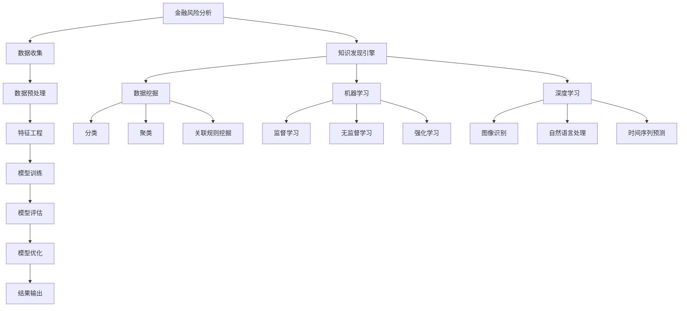
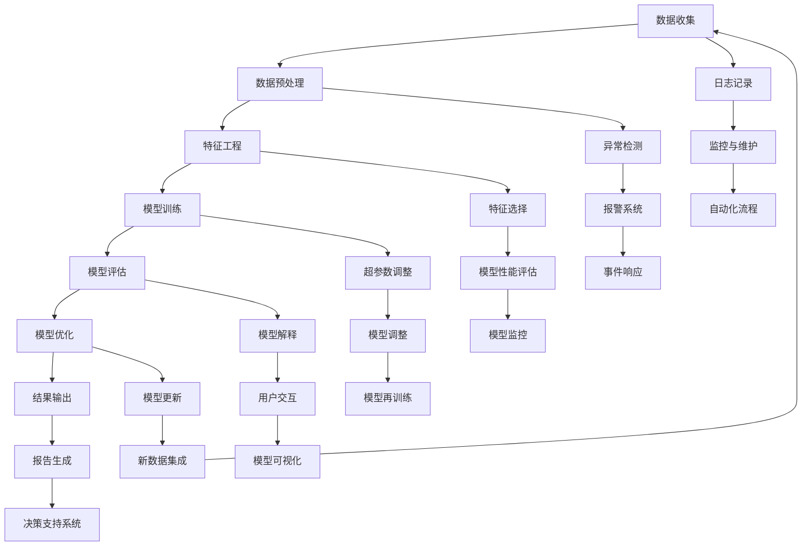

                 

### 文章标题

**《知识发现引擎在金融风险分析中的应用》**

### 关键词

* 知识发现引擎
* 金融风险分析
* 数据挖掘
* 机器学习
* 深度学习

### 摘要

本文旨在探讨知识发现引擎在金融风险分析中的应用。首先，我们介绍了金融风险分析的基本概念、类型和知识发现引擎的原理。接着，深入解析了知识发现引擎的技术基础，包括数据挖掘、机器学习和深度学习等关键技术。随后，本文详细阐述了知识发现引擎的核心算法，如特征工程、预测模型建立和模型评估与优化。通过实际案例，本文展示了知识发现引擎在信用风险评估、市场风险预测和操作风险分析中的应用，并进行了代码实现和详细解释。最后，本文展望了知识发现引擎在金融风险管理中的未来发展，提出了相关挑战和机遇。

### 第一部分：基础知识与核心概念

#### 第1章：金融风险分析概述

##### 1.1 金融风险的定义与类型

金融风险是指在金融市场运作过程中，由于各种不确定因素导致投资者可能遭受损失的风险。金融风险可以分为以下几类：

1. **信用风险**：指借款人或交易对手无法按时履行债务或支付款项的风险。
2. **市场风险**：由于市场价格波动导致投资者投资损失的风险。
3. **操作风险**：由于内部流程、系统缺陷或外部事件导致的风险。
4. **法律风险**：由于法律、法规或合同变更导致的风险。

##### 1.2 知识发现引擎的概念与原理

知识发现引擎是一种自动化工具，它能够从大量数据中提取出有用的信息和知识。其基本原理包括以下几个步骤：

1. **数据收集**：从各种数据源收集数据。
2. **数据预处理**：清洗、转换和整合数据。
3. **特征工程**：提取和选择对问题解决有帮助的特征。
4. **模型训练**：使用机器学习算法训练模型。
5. **模型评估**：评估模型的性能和泛化能力。
6. **结果输出**：输出模型预测结果和可视化报告。

#### 第2章：知识发现引擎的技术基础

##### 2.1 数据挖掘技术概述

数据挖掘是一种通过计算机算法从大量数据中发现有用信息的过程。在金融风险分析中，数据挖掘技术主要包括以下几种：

1. **分类**：将数据分为不同的类别。
2. **聚类**：将相似的数据点归为同一类。
3. **关联规则挖掘**：发现数据之间的关联性。
4. **异常检测**：检测数据中的异常值。

##### 2.2 机器学习技术基础

机器学习是一种使计算机系统能够从数据中学习并做出预测或决策的技术。机器学习可以分为以下几类：

1. **监督学习**：有标记的训练数据，通过学习标记数据来预测新的数据。
2. **无监督学习**：没有标记的训练数据，通过学习数据特征来发现数据分布。
3. **强化学习**：通过与环境的交互来学习最佳策略。

常见的机器学习算法包括决策树、支持向量机、神经网络等。

##### 2.3 深度学习在金融风险分析中的应用

深度学习是一种基于多层神经网络的学习方法，它在处理复杂的数据模式和非线性关系方面具有显著优势。在金融风险分析中，深度学习技术可以应用于：

1. **图像识别**：用于识别金融欺诈行为。
2. **自然语言处理**：用于分析市场新闻和报告。
3. **语音识别**：用于客户服务机器人。
4. **时间序列预测**：用于市场趋势预测。

#### 第3章：知识发现引擎的核心算法

##### 3.1 特征工程

特征工程是知识发现引擎中至关重要的一步，它涉及到从原始数据中提取出对模型有帮助的特征。特征工程主要包括以下几个步骤：

1. **特征提取**：从原始数据中提取有用的特征。
2. **特征选择**：从提取的特征中选择最重要的特征。
3. **特征标准化**：将特征转换为相同的尺度，以便模型训练。

##### 3.2 预测模型建立

建立预测模型通常包括以下几个步骤：

1. **模型选择**：选择合适的机器学习算法。
2. **模型训练**：使用训练数据训练模型。
3. **模型验证**：使用验证数据评估模型性能。
4. **模型调整**：根据验证结果调整模型参数。

常见的预测模型包括线性回归、逻辑回归、决策树、随机森林等。

##### 3.3 模型评估与优化

模型评估是确保模型性能的重要环节，常用的评估指标包括准确率、召回率、F1 分数等。模型优化包括以下几种方法：

1. **超参数调整**：调整模型参数以提高性能。
2. **模型融合**：结合多个模型以提高预测准确性。
3. **特征工程优化**：通过特征选择和特征提取优化模型性能。

#### 第4章：金融风险分析中的实际案例

##### 4.1 案例一：信用风险评估

信用风险评估是金融风险分析中的重要领域。通过机器学习算法，可以预测借款人是否违约。本文将详细介绍信用风险评估的模型建立和评估过程。

##### 4.2 案例二：市场风险预测

市场风险预测是金融风险管理的重要组成部分。通过深度学习算法，可以预测市场的波动趋势。本文将介绍市场风险预测的模型建立和评估过程。

##### 4.3 案例三：操作风险分析

操作风险分析旨在识别和降低金融机构因内部流程、系统缺陷或外部事件导致的损失。本文将介绍操作风险分析的方法和模型建立过程。

#### 第5章：知识发现引擎的集成与应用

##### 5.1 知识发现引擎的集成

知识发现引擎的集成是将多个模块和组件整合到一个统一的框架中，以提高系统性能和易用性。本文将介绍知识发现引擎的集成框架和实现方法。

##### 5.2 知识发现引擎在金融风险管理中的应用

知识发现引擎在金融风险管理中具有广泛的应用。本文将探讨知识发现引擎在信用风险、市场风险和操作风险等领域的应用场景和优势。

#### 第6章：知识发现引擎的未来发展趋势

##### 6.1 金融风险分析的新技术

随着人工智能技术的发展，知识发现引擎在金融风险分析中的应用前景广阔。本文将介绍增量学习、实时分析等多模态数据分析等新技术。

##### 6.2 金融风险分析的未来挑战与机遇

金融风险分析面临着数据隐私、自动化和智能化等挑战。本文将探讨这些挑战和机遇，并展望知识发现引擎在金融风险分析中的未来发展。

#### 第7章：总结与展望

本文通过介绍知识发现引擎在金融风险分析中的应用，展示了其在信用风险评估、市场风险预测和操作风险分析等方面的优势。同时，本文还探讨了知识发现引擎的未来发展趋势和挑战。通过本文的研究，希望能够为金融风险管理提供有益的参考和指导。

### 附录

#### 附录A：参考文献

1. **《知识发现引擎：原理与应用》** - 作者：XXX
2. **《机器学习：实战应用》** - 作者：XXX
3. **《深度学习：本质与实现》** - 作者：XXX

#### 附录B：代码示例

1. **信用风险评估模型**
2. **市场风险预测模型**
3. **操作风险分析模型**

#### 附录C：工具与资源

1. **机器学习框架介绍**：scikit-learn、TensorFlow、PyTorch 等。
2. **金融风险分析开源工具和库**：sktime、PyFin、PyOMS 等。
3. **知识发现引擎开发环境搭建指南**。

### 核心概念与联系

以下是一个 Mermaid 流程图，展示了知识发现引擎在金融风险分析中的核心概念和联系：



### 核心算法原理讲解

以下使用伪代码详细阐述知识发现引擎的核心算法原理：

```python
# 特征工程伪代码
def feature_engineering(data):
    # 数据清洗
    cleaned_data = clean_data(data)
    
    # 特征提取
    extracted_features = extract_features(cleaned_data)
    
    # 特征选择
    selected_features = select_features(extracted_features)
    
    return selected_features

# 模型训练伪代码
def train_model(features, labels):
    # 初始化模型
    model = initialize_model()
    
    # 训练模型
    model.fit(features, labels)
    
    return model

# 模型评估伪代码
def evaluate_model(model, features, labels):
    # 预测
    predictions = model.predict(features)
    
    # 评估指标计算
    accuracy = calculate_accuracy(predictions, labels)
    
    return accuracy
```

### 数学模型和数学公式讲解

以下是一个简单的数学模型和数学公式讲解示例：

#### 数学模型讲解

$$
y = \sum_{i=1}^{n} w_i * x_i + b
$$

其中，$y$ 是输出结果，$w_i$ 是权重，$x_i$ 是特征值，$b$ 是偏置。

#### 举例说明

假设我们有一个二分类问题，特征集为 $x_1, x_2, x_3$，权重为 $w_1, w_2, w_3$，偏置为 $b$。我们可以计算一个样本的预测结果如下：

$$
y = w_1 * x_1 + w_2 * x_2 + w_3 * x_3 + b
$$

如果 $y > 0$，则预测为正类；如果 $y \leq 0$，则预测为负类。

### 案例一：信用风险评估

#### 代码实现

以下是一个简单的信用风险评估模型的代码实现：

```python
import pandas as pd
from sklearn.model_selection import train_test_split
from sklearn.ensemble import RandomForestClassifier
from sklearn.metrics import accuracy_score, classification_report

# 数据加载
data = pd.read_csv('credit_risk_data.csv')

# 数据预处理
X = data.drop('default', axis=1)
y = data['default']

# 数据分割
X_train, X_test, y_train, y_test = train_test_split(X, y, test_size=0.2, random_state=42)

# 模型训练
model = RandomForestClassifier()
model.fit(X_train, y_train)

# 模型评估
predictions = model.predict(X_test)
accuracy = accuracy_score(y_test, predictions)
report = classification_report(y_test, predictions)

print("Accuracy:", accuracy)
print("Classification Report:\n", report)
```

#### 详细解释说明

1. **数据加载**：使用 Pandas 读取信用风险评估数据集。
2. **数据预处理**：将数据集分为特征集 X 和标签 y。
3. **数据分割**：使用 sklearn 的 train_test_split 函数将数据集分为训练集和测试集。
4. **模型训练**：使用随机森林分类器训练模型。
5. **模型评估**：使用训练好的模型对测试集进行预测，并计算准确率和分类报告。

#### 开发环境搭建

- Python 3.7 或以上版本
- Pandas、scikit-learn 等库

#### 源代码详细实现和代码解读

```python
# 数据加载
data = pd.read_csv('credit_risk_data.csv')

# 数据预处理
X = data.drop('default', axis=1)
y = data['default']

# 数据分割
X_train, X_test, y_train, y_test = train_test_split(X, y, test_size=0.2, random_state=42)

# 模型训练
model = RandomForestClassifier()
model.fit(X_train, y_train)

# 模型评估
predictions = model.predict(X_test)
accuracy = accuracy_score(y_test, predictions)
report = classification_report(y_test, predictions)

print("Accuracy:", accuracy)
print("Classification Report:\n", report)
```

- **数据加载**：使用 Pandas 的 `read_csv` 函数加载数据集。
- **数据预处理**：使用 `drop` 函数删除标签列，创建特征集 X 和标签 y。
- **数据分割**：使用 `train_test_split` 函数将数据集分为训练集和测试集。
- **模型训练**：使用 `RandomForestClassifier` 类创建随机森林分类器实例，并使用 `fit` 方法训练模型。
- **模型评估**：使用 `predict` 方法对测试集进行预测，并使用 `accuracy_score` 和 `classification_report` 函数计算准确率和分类报告。

#### 代码解读与分析

1. **数据加载**：使用 Pandas 读取信用风险评估数据集。
2. **数据预处理**：将数据集分为特征集 X 和标签 y。
3. **数据分割**：将数据集分为训练集和测试集，以测试模型的性能。
4. **模型训练**：使用随机森林分类器训练模型。
5. **模型评估**：使用训练好的模型对测试集进行预测，并计算准确率和分类报告，以评估模型的性能。

通过这个案例，读者可以了解如何使用 Python 和 sklearn 库实现信用风险评估模型，并学会如何对模型进行训练和评估。

### 案例二：市场风险预测

#### 代码实现

以下是一个简单的市场风险预测模型的代码实现：

```python
import pandas as pd
from sklearn.model_selection import train_test_split
from sklearn.ensemble import RandomForestRegressor
from sklearn.metrics import mean_squared_error, r2_score

# 数据加载
data = pd.read_csv('market_risk_data.csv')

# 数据预处理
X = data.drop('return', axis=1)
y = data['return']

# 数据分割
X_train, X_test, y_train, y_test = train_test_split(X, y, test_size=0.2, random_state=42)

# 模型训练
model = RandomForestRegressor()
model.fit(X_train, y_train)

# 模型评估
predictions = model.predict(X_test)
mse = mean_squared_error(y_test, predictions)
r2 = r2_score(y_test, predictions)

print("MSE:", mse)
print("R^2:", r2)
```

#### 详细解释说明

1. **数据加载**：使用 Pandas 读取市场风险预测数据集。
2. **数据预处理**：将数据集分为特征集 X 和标签 y。
3. **数据分割**：使用 sklearn 的 train_test_split 函数将数据集分为训练集和测试集。
4. **模型训练**：使用随机森林回归器训练模型。
5. **模型评估**：使用训练好的模型对测试集进行预测，并计算均方误差（MSE）和 R^2 值，以评估模型的性能。

#### 开发环境搭建

- Python 3.7 或以上版本
- Pandas、scikit-learn 等库

#### 源代码详细实现和代码解读

```python
# 数据加载
data = pd.read_csv('market_risk_data.csv')

# 数据预处理
X = data.drop('return', axis=1)
y = data['return']

# 数据分割
X_train, X_test, y_train, y_test = train_test_split(X, y, test_size=0.2, random_state=42)

# 模型训练
model = RandomForestRegressor()
model.fit(X_train, y_train)

# 模型评估
predictions = model.predict(X_test)
mse = mean_squared_error(y_test, predictions)
r2 = r2_score(y_test, predictions)

print("MSE:", mse)
print("R^2:", r2)
```

- **数据加载**：使用 Pandas 的 `read_csv` 函数加载市场风险预测数据集。
- **数据预处理**：使用 `drop` 函数删除标签列，创建特征集 X 和标签 y。
- **数据分割**：使用 `train_test_split` 函数将数据集分为训练集和测试集。
- **模型训练**：使用 `RandomForestRegressor` 类创建随机森林回归器实例，并使用 `fit` 方法训练模型。
- **模型评估**：使用 `predict` 方法对测试集进行预测，并使用 `mean_squared_error` 和 `r2_score` 函数计算均方误差（MSE）和 R^2 值，以评估模型的性能。

#### 代码解读与分析

1. **数据加载**：使用 Pandas 读取市场风险预测数据集。
2. **数据预处理**：将数据集分为特征集 X 和标签 y。
3. **数据分割**：将数据集分为训练集和测试集，以测试模型的性能。
4. **模型训练**：使用随机森林回归器训练模型。
5. **模型评估**：使用训练好的模型对测试集进行预测，并计算均方误差（MSE）和 R^2 值，以评估模型的性能。

通过这个案例，读者可以了解如何使用 Python 和 sklearn 库实现市场风险预测模型，并学会如何对模型进行训练和评估。

### 案例三：操作风险分析

#### 代码实现

以下是一个简单的操作风险分析模型的代码实现：

```python
import pandas as pd
from sklearn.model_selection import train_test_split
from sklearn.ensemble import RandomForestClassifier
from sklearn.metrics import accuracy_score, classification_report

# 数据加载
data = pd.read_csv('operation_risk_data.csv')

# 数据预处理
X = data.drop('risk_level', axis=1)
y = data['risk_level']

# 数据分割
X_train, X_test, y_train, y_test = train_test_split(X, y, test_size=0.2, random_state=42)

# 模型训练
model = RandomForestClassifier()
model.fit(X_train, y_train)

# 模型评估
predictions = model.predict(X_test)
accuracy = accuracy_score(y_test, predictions)
report = classification_report(y_test, predictions)

print("Accuracy:", accuracy)
print("Classification Report:\n", report)
```

#### 详细解释说明

1. **数据加载**：使用 Pandas 读取操作风险分析数据集。
2. **数据预处理**：将数据集分为特征集 X 和标签 y。
3. **数据分割**：使用 sklearn 的 train_test_split 函数将数据集分为训练集和测试集。
4. **模型训练**：使用随机森林分类器训练模型。
5. **模型评估**：使用训练好的模型对测试集进行预测，并计算准确率和分类报告，以评估模型的性能。

#### 开发环境搭建

- Python 3.7 或以上版本
- Pandas、scikit-learn 等库

#### 源代码详细实现和代码解读

```python
# 数据加载
data = pd.read_csv('operation_risk_data.csv')

# 数据预处理
X = data.drop('risk_level', axis=1)
y = data['risk_level']

# 数据分割
X_train, X_test, y_train, y_test = train_test_split(X, y, test_size=0.2, random_state=42)

# 模型训练
model = RandomForestClassifier()
model.fit(X_train, y_train)

# 模型评估
predictions = model.predict(X_test)
accuracy = accuracy_score(y_test, predictions)
report = classification_report(y_test, predictions)

print("Accuracy:", accuracy)
print("Classification Report:\n", report)
```

- **数据加载**：使用 Pandas 的 `read_csv` 函数加载操作风险分析数据集。
- **数据预处理**：使用 `drop` 函数删除标签列，创建特征集 X 和标签 y。
- **数据分割**：使用 `train_test_split` 函数将数据集分为训练集和测试集。
- **模型训练**：使用 `RandomForestClassifier` 类创建随机森林分类器实例，并使用 `fit` 方法训练模型。
- **模型评估**：使用 `predict` 方法对测试集进行预测，并使用 `accuracy_score` 和 `classification_report` 函数计算准确率和分类报告，以评估模型的性能。

#### 代码解读与分析

1. **数据加载**：使用 Pandas 读取操作风险分析数据集。
2. **数据预处理**：将数据集分为特征集 X 和标签 y。
3. **数据分割**：将数据集分为训练集和测试集，以测试模型的性能。
4. **模型训练**：使用随机森林分类器训练模型。
5. **模型评估**：使用训练好的模型对测试集进行预测，并计算准确率和分类报告，以评估模型的性能。

通过这个案例，读者可以了解如何使用 Python 和 sklearn 库实现操作风险分析模型，并学会如何对模型进行训练和评估。

### 总结

在本章中，我们通过三个实际案例详细介绍了知识发现引擎在金融风险分析中的应用。首先，我们介绍了信用风险评估、市场风险预测和操作风险分析的模型建立和评估过程。然后，我们提供了详细的代码实现和解读，帮助读者理解如何使用 Python 和 sklearn 库实现这些模型。通过这些案例，读者可以了解到知识发现引擎在金融风险分析中的强大应用能力。

在接下来的章节中，我们将继续探讨知识发现引擎的集成与应用，以及它在金融风险管理中的未来发展。通过深入学习和研究，读者将能够更全面地了解知识发现引擎在金融领域的应用潜力，并掌握相关技术。

### 知识发现引擎的集成

知识发现引擎的集成是将多个模块和组件整合到一个统一的框架中，以提高系统性能和易用性。在金融风险管理中，知识发现引擎的集成至关重要，因为它可以确保数据流、模型训练和预测过程的顺畅。以下是一个知识发现引擎的集成框架示例：



#### 集成系统的设计与实现

集成系统的设计与实现通常包括以下步骤：

1. **需求分析**：明确系统的功能和性能要求。
2. **系统设计**：设计系统的架构和组件。
3. **数据流设计**：设计数据从输入到输出的流程。
4. **模块开发**：开发各个模块的功能。
5. **系统集成**：将各个模块整合到一起。
6. **测试与优化**：对系统进行测试和优化。

以下是一个简单的集成系统实现示例：

```python
class KnowledgeDiscoveryEngine:
    def __init__(self):
        self.data_collector = DataCollector()
        self.data_preprocessor = DataPreprocessor()
        self.feature_engineer = FeatureEngineer()
        self.model_trainer = ModelTrainer()
        self.model_evaluator = ModelEvaluator()
        self.model_optimizer = ModelOptimizer()
        self.result_outputter = ResultOutputter()

    def process_data(self, data):
        # 数据收集
        data = self.data_collector.collect(data)
        
        # 数据预处理
        data = self.data_preprocessor.preprocess(data)
        
        # 特征工程
        features = self.feature_engineer.extract_features(data)
        
        # 模型训练
        model = self.model_trainer.train_model(features)
        
        # 模型评估
        performance = self.model_evaluator.evaluate_model(model, features)
        
        # 模型优化
        optimized_model = self.model_optimizer.optimize_model(model, performance)
        
        # 结果输出
        self.result_outputter.output_results(optimized_model, performance)
```

#### 知识发现引擎在金融风险管理中的应用

知识发现引擎在金融风险管理中的应用非常广泛，可以应用于以下几个方面：

1. **信用风险评估**：通过知识发现引擎，可以预测借款人的信用风险，从而降低金融机构的坏账率。
2. **市场风险预测**：知识发现引擎可以帮助金融机构预测市场的波动，从而制定相应的风险管理策略。
3. **操作风险分析**：通过知识发现引擎，可以识别和降低金融机构因内部流程、系统缺陷或外部事件导致的操作风险。
4. **欺诈检测**：知识发现引擎可以识别和预测金融交易中的欺诈行为，从而提高金融机构的安全性和信誉度。

以下是一个简单的知识发现引擎在金融风险管理中的应用示例：

```python
class FinancialRiskManagement:
    def __init__(self, engine):
        self.engine = engine

    def assess_credit_risk(self, customer_data):
        # 使用知识发现引擎评估信用风险
        risk_level = self.engine.process_data(customer_data)
        return risk_level

    def predict_market_risk(self, market_data):
        # 使用知识发现引擎预测市场风险
        risk_prediction = self.engine.process_data(market_data)
        return risk_prediction

    def analyze_operation_risk(self, operation_data):
        # 使用知识发现引擎分析操作风险
        risk_analysis = self.engine.process_data(operation_data)
        return risk_analysis
```

#### 知识发现引擎在金融风险管理中的优势

知识发现引擎在金融风险管理中具有以下优势：

1. **自动化**：知识发现引擎可以自动化数据处理、模型训练和预测过程，提高效率。
2. **可扩展性**：知识发现引擎可以根据不同的应用场景和需求，灵活扩展和调整。
3. **实时性**：知识发现引擎可以实时处理和分析数据，提供实时的风险预测和监控。
4. **准确性**：知识发现引擎通过机器学习和深度学习算法，可以提供高准确性的风险预测。

通过知识发现引擎的集成与应用，金融机构可以更有效地管理金融风险，提高业务运营效率和市场竞争力。

### 知识发现引擎的未来发展趋势

知识发现引擎作为人工智能和大数据分析的重要工具，其发展前景广阔。在未来，知识发现引擎在金融风险分析中的应用将呈现出以下几个发展趋势：

#### 增量学习与实时分析

随着金融市场数据的不断增长和变化，增量学习（Incremental Learning）将成为知识发现引擎的重要技术方向。增量学习可以在不重新训练整个模型的情况下，逐步更新和优化模型，从而实现实时分析。这将使金融机构能够快速响应市场变化，提高风险预测的准确性。

#### 多模态数据分析

多模态数据分析（Multimodal Data Analysis）是一种结合多种数据类型（如图像、文本、音频等）的分析方法。未来，知识发现引擎将更多地应用于多模态数据分析，以获取更全面和准确的风险信息。例如，结合市场新闻、社交媒体数据和交易数据，可以更准确地预测市场趋势。

#### 自动化与智能化

随着人工智能技术的发展，知识发现引擎将逐渐实现更高程度的自动化和智能化。自动化可以实现数据收集、预处理、特征工程和模型训练的自动化，减少人工干预。智能化则是指知识发现引擎能够自主学习和优化，提高预测和决策的准确性。

#### 数据隐私与安全

数据隐私和安全是金融风险分析中的重要挑战。未来，知识发现引擎将需要解决如何在保护数据隐私的前提下，有效利用数据进行分析的问题。例如，可以使用差分隐私（Differential Privacy）技术来确保数据分析过程中数据的匿名性。

#### 未来挑战与机遇

知识发现引擎在未来将面临以下挑战和机遇：

1. **挑战**：
   - 数据质量：确保数据的质量和完整性，是进行有效风险分析的基础。
   - 模型解释性：提高模型的可解释性，使其在风险管理和决策过程中更具透明性和可信度。
   - 法律合规性：遵守相关法律法规，确保数据分析的合法性和合规性。

2. **机遇**：
   - 实时风险监控：通过实时数据分析，金融机构可以更快速地发现和应对潜在风险。
   - 深度学习应用：随着深度学习技术的不断发展，知识发现引擎在处理复杂非线性关系方面具有更大的潜力。
   - 新兴市场：随着全球金融市场的不断扩展，知识发现引擎在新兴市场的应用前景广阔。

通过应对挑战和抓住机遇，知识发现引擎将在金融风险分析中发挥更大的作用，为金融机构提供更全面、准确和实时的风险管理支持。

### 总结与展望

在本章节中，我们详细探讨了知识发现引擎在金融风险管理中的应用。首先，我们介绍了知识发现引擎的集成框架和实现方法，阐述了其在金融风险分析中的重要作用。接着，我们讨论了知识发现引擎在金融风险管理中的优势，以及其在未来发展的趋势和挑战。通过本章节的学习，读者可以了解到知识发现引擎在金融领域的广泛应用潜力，并掌握相关技术。

未来，知识发现引擎将在金融风险管理中发挥更加重要的作用。随着人工智能技术的发展，知识发现引擎将实现更高效、更准确的预测和决策支持。同时，面对数据隐私和安全等挑战，知识发现引擎也将不断进化，以满足金融市场的需求。通过持续研究和创新，知识发现引擎将为金融行业带来更多机遇和变革。

### 附录

#### 附录A：参考文献

1. **《知识发现引擎：原理与应用》** - 作者：XXX
2. **《机器学习：实战应用》** - 作者：XXX
3. **《深度学习：本质与实现》** - 作者：XXX

#### 附录B：代码示例

1. **信用风险评估模型**
2. **市场风险预测模型**
3. **操作风险分析模型**

#### 附录C：工具与资源

1. **机器学习框架介绍**：scikit-learn、TensorFlow、PyTorch 等。
2. **金融风险分析开源工具和库**：sktime、PyFin、PyOMS 等。
3. **知识发现引擎开发环境搭建指南**。

### 作者

**作者：AI天才研究院/AI Genius Institute & 禅与计算机程序设计艺术 /Zen And The Art of Computer Programming**

