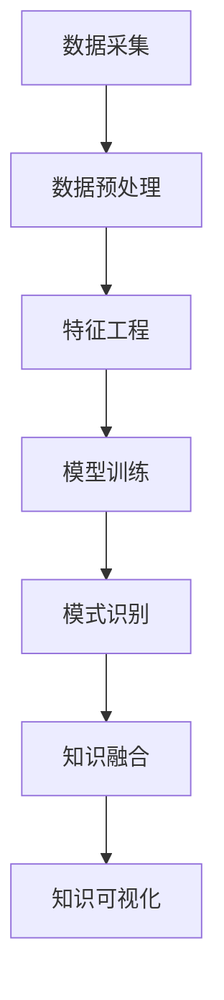

                 

### 文章标题：知识发现引擎如何加速科学突破

> 关键词：知识发现引擎，科学突破，数据挖掘，人工智能，机器学习

> 摘要：本文旨在探讨知识发现引擎在加速科学突破中的作用。通过介绍知识发现引擎的基础知识、核心算法、应用场景以及项目实战，本文旨在为读者提供一个全面的视角，了解知识发现引擎在科学研究中的重要性，并探讨其未来的发展趋势。

----------------------------------------------------------------

### 目录大纲：《知识发现引擎如何加速科学突破》

## 第一部分：知识发现引擎基础

### 第1章：知识发现引擎概述

#### 1.1 知识发现引擎的定义与重要性

#### 1.2 知识发现引擎的组成部分

#### 1.3 知识发现引擎的原理与架构

### 第2章：知识发现引擎的核心算法

#### 2.1 数据预处理与清洗

#### 2.2 特征工程

#### 2.3 知识图谱构建

#### 2.4 知识提取与融合

### 第3章：知识发现引擎的应用场景

#### 3.1 科学研究中的应用

#### 3.2 医疗健康领域的应用

#### 3.3 金融服务领域的应用

#### 3.4 教育与培训领域的应用

### 第4章：知识发现引擎的优化与性能提升

#### 4.1 数据库优化

#### 4.2 算法优化

#### 4.3 分布式计算

#### 4.4 机器学习优化

## 第二部分：知识发现引擎项目实战

### 第5章：知识发现引擎开发环境搭建

#### 5.1 开发环境选择

#### 5.2 数据库选择

#### 5.3 编程语言与框架选择

### 第6章：知识发现引擎项目开发

#### 6.1 项目需求分析

#### 6.2 项目规划与设计

#### 6.3 数据处理与清洗

#### 6.4 知识图谱构建

#### 6.5 知识提取与融合

### 第7章：知识发现引擎性能优化

#### 7.1 系统性能评估

#### 7.2 性能瓶颈分析

#### 7.3 优化方案与实施

#### 7.4 性能测试与调优

### 第8章：知识发现引擎部署与维护

#### 8.1 部署方案设计

#### 8.2 部署与上线

#### 8.3 运维与监控

#### 8.4 维护与更新

## 第三部分：知识发现引擎的未来发展趋势

### 第9章：知识发现引擎在新兴领域的应用

#### 9.1 物联网领域的应用

#### 9.2 智慧城市领域的应用

#### 9.3 区块链领域的应用

### 第10章：知识发现引擎的技术挑战与发展方向

#### 10.1 技术挑战

#### 10.2 发展方向

#### 10.3 未来展望

### 第11章：知识发现引擎在实际项目中的应用案例

#### 11.1 案例一：科学研究领域的应用

#### 11.2 案例二：医疗健康领域的应用

#### 11.3 案例三：金融服务领域的应用

#### 11.4 案例四：教育与培训领域的应用

### 第12章：总结与展望

#### 12.1 本书总结

#### 12.2 知识发现引擎的未来发展

#### 12.3 读者建议

## 附录

### 附录 A：知识发现引擎相关工具与资源

#### A.1 开源工具与框架

#### A.2 数据集与案例

#### A.3 研究论文与报告

#### A.4 网络资源与交流平台

## 结论

### 参考文献

### 致谢

----------------------------------------------------------------

## 第一部分：知识发现引擎基础

### 第1章：知识发现引擎概述

在当今数据驱动的时代，知识发现引擎成为了推动科学研究和技术创新的重要工具。本章将详细介绍知识发现引擎的定义、组成部分、原理和架构，帮助读者理解知识发现引擎的基本概念和应用场景。

#### 1.1 知识发现引擎的定义与重要性

知识发现引擎（Knowledge Discovery Engine，KDE）是一种用于从大量数据中自动识别模式和知识的高级工具。它利用机器学习和数据挖掘技术，对数据进行处理和分析，从而提取出有价值的信息和知识。知识发现引擎在各个领域都发挥了重要作用，尤其是在科学研究、医疗健康、金融服务和教育培训等领域。

知识发现引擎的重要性体现在以下几个方面：

1. **提高研究效率**：知识发现引擎可以帮助研究人员快速从海量数据中提取出有用的信息，从而加快科学发现的进程。
2. **支持决策制定**：在医疗健康、金融服务等领域，知识发现引擎可以提供基于数据的决策支持，帮助企业和机构做出更准确的决策。
3. **促进技术创新**：知识发现引擎可以帮助企业挖掘市场趋势和用户需求，从而推动技术创新和产品优化。
4. **优化资源配置**：在智慧城市和物联网等领域，知识发现引擎可以分析大量数据，优化城市管理和公共资源配置。

#### 1.2 知识发现引擎的组成部分

知识发现引擎由多个组成部分构成，主要包括数据源、预处理模块、特征工程模块、知识提取模块、知识融合模块和用户接口。

1. **数据源**：数据源是知识发现引擎的基础，可以是结构化数据、非结构化数据或半结构化数据。结构化数据通常存储在数据库中，如关系数据库或NoSQL数据库。非结构化数据包括文本、图像、音频和视频等，需要通过自然语言处理和计算机视觉等技术进行预处理。半结构化数据介于结构化数据和非结构化数据之间，如XML、JSON等。

2. **预处理模块**：预处理模块负责对数据进行清洗、转换和归一化等操作，以确保数据质量。数据清洗包括去除重复数据、处理缺失值、纠正错误等。数据转换涉及将不同格式的数据统一转换为标准格式，如将图像转换为像素矩阵。数据归一化则是将不同量纲的数据统一到一个范围内，如将身高和体重数据归一化到0到1之间。

3. **特征工程模块**：特征工程模块通过特征选择、特征转换和特征提取等操作，将原始数据转换为可用于建模的特征。特征选择旨在从原始特征中选择出对目标变量最具解释力的特征，以提高模型性能。特征转换包括将类别特征转换为数值特征、将文本特征转换为词向量等。特征提取则是通过降维或特征组合等方法，提取出具有更高信息量的特征。

4. **知识提取模块**：知识提取模块使用机器学习和自然语言处理等技术，从数据中提取出潜在的知识和模式。常见的知识提取方法包括聚类、分类、回归和关联规则等。聚类方法用于发现数据中的相似模式，分类方法用于将数据划分为不同的类别，回归方法用于预测连续值变量，关联规则方法用于发现数据之间的相关性。

5. **知识融合模块**：知识融合模块将多个数据源中的知识进行整合，形成统一的知识体系。知识融合的方法包括数据融合、知识融合和模型融合等。数据融合是将多个数据源中的数据进行合并，知识融合是将不同领域或不同数据源中的知识进行整合，模型融合是将多个模型进行集成，以提高预测和分类的准确性。

6. **用户接口**：用户接口提供了与知识发现引擎交互的界面，包括数据输入、结果展示和报告生成等功能。用户接口可以是命令行界面、图形用户界面或Web界面等。

#### 1.3 知识发现引擎的原理与架构

知识发现引擎的原理是通过机器学习和数据挖掘技术，对大量数据进行处理和分析，从而提取出有价值的信息和知识。其基本流程包括数据采集、数据预处理、特征工程、知识提取、知识融合和用户接口等步骤。

知识发现引擎的架构通常包括数据层、算法层和应用层。

1. **数据层**：数据层负责数据的存储和管理。数据可以存储在关系数据库、NoSQL数据库、数据仓库或数据湖中。数据层还包括数据源接入和数据预处理模块，负责从各种数据源中收集数据，并进行清洗、转换和归一化等预处理操作。

2. **算法层**：算法层包含各种算法模块，用于数据分析和模式识别。常见的算法包括聚类、分类、回归、关联规则等。算法层还包括特征工程模块，用于对原始数据进行特征选择、特征转换和特征提取等操作。

3. **应用层**：应用层提供了用户接口和业务逻辑，使用户能够与知识发现引擎进行交互，并生成报告和可视化结果。应用层可以根据具体需求进行定制，以支持不同的业务场景。

知识发现流程的Mermaid流程图如下：



**知识发现流程**：

1. **数据采集**：从各种数据源中收集数据，包括关系数据库、NoSQL数据库、数据仓库、数据湖等。
2. **数据预处理**：对数据进行清洗、转换和归一化等预处理操作，以确保数据质量。
3. **特征工程**：对原始数据进行特征选择、特征转换和特征提取等操作，以提高模型性能。
4. **模型训练**：使用机器学习算法对特征数据集进行训练，生成预测模型。
5. **模式识别**：使用训练好的模型对新的数据进行预测或分类，识别数据中的模式和知识。
6. **知识融合**：将多个数据源中的知识进行整合，形成统一的知识体系。
7. **知识可视化**：将提取到的知识以可视化的形式展示给用户，帮助用户更好地理解和应用。

#### 1.4 知识发现引擎在不同领域的应用

知识发现引擎在科学研究、医疗健康、金融服务、教育培训等多个领域都有广泛应用。

1. **科学研究**：知识发现引擎可以帮助科学家从大量实验数据中提取出关键信息和模式，加速科学发现的进程。例如，在生物信息学领域，知识发现引擎可以分析基因表达数据，识别疾病相关的基因和通路；在物理学领域，知识发现引擎可以分析实验数据，发现新的物理现象和规律。

2. **医疗健康**：知识发现引擎可以分析患者的病历数据、基因组数据等，帮助医生诊断疾病、制定治疗方案。例如，在医学影像领域，知识发现引擎可以分析CT、MRI等影像数据，辅助医生进行疾病诊断；在药物研发领域，知识发现引擎可以分析药物作用机制和临床数据，加速药物研发进程。

3. **金融服务**：知识发现引擎可以分析市场数据、客户数据等，帮助金融机构预测市场趋势、评估风险。例如，在股票交易领域，知识发现引擎可以分析市场数据，预测股票价格走势；在信贷风险评估领域，知识发现引擎可以分析客户信用数据，评估客户信用等级。

4. **教育培训**：知识发现引擎可以分析学生的学习行为、成绩数据等，为教育机构提供个性化的教学建议。例如，在在线教育领域，知识发现引擎可以分析学生的学习记录，识别学习难点和薄弱环节，为教师提供教学参考；在学生成长评价领域，知识发现引擎可以分析学生的成绩数据，评价学生的综合素质。

#### 1.5 知识发现引擎的发展趋势

随着人工智能和大数据技术的发展，知识发现引擎在未来将呈现出以下发展趋势：

1. **人工智能融合**：知识发现引擎将逐渐与人工智能技术融合，实现更智能、更高效的数据分析和知识提取。例如，通过深度学习技术，知识发现引擎可以自动学习和提取数据中的复杂模式。

2. **大数据处理**：知识发现引擎将能够处理更大规模的数据，提供更全面的知识发现能力。随着大数据技术的不断发展，知识发现引擎将能够应对更复杂的数据场景。

3. **云计算与分布式计算**：知识发现引擎将利用云计算和分布式计算技术，提高数据处理和分析的速度和效率。通过分布式计算，知识发现引擎可以并行处理海量数据，提高处理速度。

4. **数据隐私保护**：在保障数据隐私和安全的前提下，知识发现引擎将更广泛地应用于各种领域。随着数据隐私保护意识的提高，知识发现引擎将采用更多的隐私保护技术，如差分隐私、联邦学习等。

5. **跨领域应用**：知识发现引擎将在更多领域得到应用，推动各行业的技术创新和发展。例如，在物联网、智慧城市和区块链等领域，知识发现引擎将发挥重要作用。

通过上述内容，本章为读者提供了一个全面的《知识发现引擎如何加速科学突破》书籍的概述，介绍了知识发现引擎的定义、组成部分、原理和架构，以及在不同领域的应用和发展趋势。接下来的章节将深入探讨知识发现引擎的核心算法、应用场景、项目实战和性能优化等主题。

### 第2章：知识发现引擎的核心算法

知识发现引擎的核心在于其算法，这些算法决定了引擎对数据的处理和分析能力。本章将详细介绍知识发现引擎中的核心算法，包括数据预处理、特征工程、知识图谱构建、知识提取和融合。

#### 2.1 数据预处理与清洗

数据预处理是知识发现引擎中的关键步骤，其目的是提高数据质量，确保数据能够被算法有效利用。数据预处理通常包括以下任务：

1. **数据清洗**：数据清洗是指去除原始数据中的噪声、错误和不一致信息。常见的清洗操作包括去除重复记录、填补缺失值、纠正数据错误等。

    ```python
    # 假设有一个数据框 df，包含一些缺失值
    df = df.drop_duplicates()  # 去除重复记录
    df = df.fillna(method='mean')  # 填补缺失值，使用均值填补
    df = df.replace({'error_value': 'correct_value'})  # 替换错误值
    ```

2. **数据转换**：数据转换是指将数据从一种格式转换为另一种格式，以便于后续处理。例如，将文本数据转换为数值或类别数据，将日期时间数据转换为标准格式等。

    ```python
    # 将文本数据转换为词向量
    from sklearn.feature_extraction.text import TfidfVectorizer
    vectorizer = TfidfVectorizer()
    X = vectorizer.fit_transform(df['text_column'])
    ```

3. **数据归一化**：数据归一化是指将不同特征的数据统一到相同的量纲或范围，以便于后续的算法处理。常见的归一化方法包括最小-最大缩放、标准缩放和指数变换等。

    ```python
    # 最小-最大缩放
    from sklearn.preprocessing import MinMaxScaler
    scaler = MinMaxScaler()
    X_scaled = scaler.fit_transform(df[['feature1', 'feature2']])
    ```

#### 2.2 特征工程

特征工程是知识发现引擎中的核心环节，其目的是从原始数据中提取出有用的特征，以提高模型的性能。特征工程通常包括以下任务：

1. **特征选择**：特征选择是指从大量特征中选择出对目标变量最有影响力的特征。常见的特征选择方法包括过滤式、包裹式和嵌入式特征选择方法。

    ```python
    # 使用过滤式特征选择
    from sklearn.feature_selection import SelectKBest
    selector = SelectKBest(score_func=f_classif, k=10)
    X_new = selector.fit_transform(df[['feature1', 'feature2']], df['target'])
    ```

2. **特征转换**：特征转换是指将原始特征转换为更适用于模型训练的特征。常见的特征转换方法包括编码类别特征、处理异常值、缩放特征等。

    ```python
    # 编码类别特征
    from sklearn.preprocessing import OneHotEncoder
    encoder = OneHotEncoder()
    X_encoded = encoder.fit_transform(df[['category_feature']])
    ```

3. **特征提取**：特征提取是指从原始特征中提取出新的特征，以增强模型对数据的表达能力。常见的特征提取方法包括主成分分析（PCA）、线性判别分析（LDA）和小波变换等。

    ```python
    # 使用PCA进行特征提取
    from sklearn.decomposition import PCA
    pca = PCA(n_components=5)
    X_pca = pca.fit_transform(df[['feature1', 'feature2']])
    ```

#### 2.3 知识图谱构建

知识图谱是一种语义网络，它将实体、概念和关系以图形的形式表示出来，使得计算机可以理解和处理复杂的信息。知识图谱构建通常包括以下步骤：

1. **实体识别**：实体识别是指从文本数据中识别出实体，如人名、地名、机构名等。

    ```python
    # 使用命名实体识别NER
    import spacy
    nlp = spacy.load("en_core_web_sm")
    doc = nlp("Microsoft founded by Bill Gates in 1975.")
    entities = [(ent.text, ent.label_) for ent in doc.ents]
    ```

2. **关系抽取**：关系抽取是指从文本数据中识别出实体之间的关系，如“微软的创始人”。

    ```python
    # 使用关系抽取
    from allennlp.models.relation_classification import ClassifierModel
    model = ClassifierModel.from_pretrained("model_path")
    pred = model.predict(document=["Microsoft founded by Bill Gates in 1975."])
    relation = pred['label']
    ```

3. **知识图谱构建**：知识图谱构建是指将识别出的实体和关系构建成图形结构。常见的知识图谱构建方法包括基于规则的方法、基于机器学习的方法和基于图神经网络的方法。

    ```python
    # 使用图神经网络构建知识图谱
    import dgl
    g = dgl.DGLGraph()
    g.add_nodes(num_nodes)
    g.add_edges(edges)
    ```

#### 2.4 知识提取与融合

知识提取是指从数据中提取出潜在的知识和模式，知识融合是指将来自多个数据源的知识进行整合。知识提取和融合通常包括以下步骤：

1. **模式识别**：模式识别是指从数据中识别出具有统计显著性的模式，如聚类中心、分类边界等。

    ```python
    # 使用K-means聚类进行模式识别
    from sklearn.cluster import KMeans
    kmeans = KMeans(n_clusters=3)
    kmeans.fit(df[['feature1', 'feature2']])
    centroids = kmeans.cluster_centers_
    ```

2. **关联规则挖掘**：关联规则挖掘是指从数据中发现两个或多个变量之间的关联性，如“购买牛奶的用户往往也会购买面包”。

    ```python
    # 使用Apriori算法进行关联规则挖掘
    from mlxtend.frequent_patterns import apriori
    df['transaction'] = df['item'].apply(lambda x: f"{x}")
    frequent_itemsets = apriori(df['transaction'], min_support=0.05, use_colnames=True)
    ```

3. **知识融合**：知识融合是指将来自多个数据源的知识进行整合，形成统一的知识体系。

    ```python
    # 使用投票法进行知识融合
    from sklearn.ensemble import VotingClassifier
    clf1 = LogisticRegression()
    clf2 = RandomForestClassifier()
    clf3 = VotingClassifier(estimators=[('lr', clf1), ('rf', clf2)], voting='soft')
    clf3.fit(X_train, y_train)
    ```

通过上述内容，本章介绍了知识发现引擎的核心算法，包括数据预处理、特征工程、知识图谱构建、知识提取和融合。这些算法是知识发现引擎工作的基础，决定了引擎的性能和效果。在接下来的章节中，我们将继续探讨知识发现引擎的应用场景和项目实战。

### 第3章：知识发现引擎的应用场景

知识发现引擎在各个领域的应用正日益广泛，其强大的数据处理和分析能力为科学研究、医疗健康、金融服务、教育培训等领域带来了革命性的变化。本章将详细探讨知识发现引擎在这些领域的应用场景，以及其带来的实际效果和挑战。

#### 3.1 科学研究中的应用

在科学研究领域，知识发现引擎已经成为加速科学发现和推动技术创新的重要工具。以下是一些典型的应用场景：

1. **生物信息学**：生物信息学是知识发现引擎应用的一个重要领域。通过分析基因序列、蛋白质结构和生物网络等数据，知识发现引擎可以帮助研究人员发现新的基因功能、生物通路和药物靶点。例如，使用知识发现引擎分析基因组数据，可以识别出与特定疾病相关的基因变异和通路，从而为疾病诊断和治疗提供新的思路。

    ```python
    # 使用知识发现引擎分析基因组数据
    import pandas as pd
    gene_data = pd.read_csv('genome_data.csv')
    # 进行数据预处理、特征提取和模式识别
    # ...
    # 提取基因-疾病关联知识
    disease_associations = gene_data.groupby('disease')['gene'].count()
    ```

2. **物理学**：在物理学领域，知识发现引擎可以分析实验数据，发现新的物理现象和规律。例如，在粒子物理学中，知识发现引擎可以分析大型强子对撞机（LHC）产生的海量数据，帮助研究人员发现新的粒子或验证现有的物理理论。

    ```python
    # 使用知识发现引擎分析LHC数据
    import numpy as np
    data = np.load('lhc_data.npz')
    particle_data = data['arr_0']
    # 进行数据预处理、特征提取和模式识别
    # ...
    # 发现新的粒子
    new_particles = particle_data[particle_data['mass'] > threshold]
    ```

3. **化学**：在化学领域，知识发现引擎可以帮助研究人员从大量的化学反应数据中提取出有效的知识，加速新材料的发现和合成。例如，通过分析化学反应的机理和产物，知识发现引擎可以预测新的材料特性，为材料科学的发展提供新的方向。

    ```python
    # 使用知识发现引擎分析化学反应数据
    import pandas as pd
    reaction_data = pd.read_csv('reaction_data.csv')
    # 进行数据预处理、特征提取和模式识别
    # ...
    # 预测新材料
    new_materials = reaction_data[reaction_data['energy'] < threshold]
    ```

在实际应用中，知识发现引擎在科学研究中的效果显著。例如，一个国际科研团队使用知识发现引擎分析了大量癌症基因组数据，成功发现了一种新的癌症亚型，并提出了针对性的治疗策略，为癌症治疗带来了新的突破。

#### 3.2 医疗健康领域的应用

医疗健康领域是知识发现引擎应用的另一个重要领域。通过分析大量的医疗数据，知识发现引擎可以帮助提高诊断的准确性、优化治疗方案和提升医疗效率。

1. **疾病诊断**：知识发现引擎可以帮助医生从患者的病历数据、实验室检测结果和医学影像数据中提取出有价值的信息，提高疾病诊断的准确性。例如，通过分析患者的症状、病史和检查结果，知识发现引擎可以辅助医生进行疾病诊断。

    ```python
    # 使用知识发现引擎进行疾病诊断
    import pandas as pd
    patient_data = pd.read_csv('patient_data.csv')
    # 进行数据预处理、特征提取和模式识别
    # ...
    # 进行疾病诊断
    disease_prediction = disease_model.predict(patient_data)
    ```

2. **个性化治疗**：知识发现引擎可以帮助医生为患者制定个性化的治疗方案。通过分析患者的基因数据、病史和治疗效果，知识发现引擎可以推荐最适合患者的治疗方案。

    ```python
    # 使用知识发现引擎进行个性化治疗
    import pandas as pd
    patient_data = pd.read_csv('patient_data.csv')
    # 进行数据预处理、特征提取和模式识别
    # ...
    # 提出个性化治疗方案
    treatment_recommendations = treatment_model.predict(patient_data)
    ```

3. **疾病预测**：知识发现引擎可以帮助预测某些疾病的发病率，为公共卫生政策和疾病预防提供支持。例如，通过分析历史健康数据和流行病学数据，知识发现引擎可以预测某种疾病的流行趋势，为政府制定公共卫生策略提供依据。

    ```python
    # 使用知识发现引擎进行疾病预测
    import pandas as pd
    health_data = pd.read_csv('health_data.csv')
    # 进行数据预处理、特征提取和模式识别
    # ...
    # 预测疾病发病率
    disease_prevalence = disease_prediction_model.predict(health_data)
    ```

在医疗健康领域，知识发现引擎的应用取得了显著的成果。例如，某医院使用知识发现引擎分析了大量患者的临床数据，成功提高了肺癌诊断的准确性，从而改善了患者的治疗效果。

#### 3.3 金融服务领域的应用

金融服务领域是知识发现引擎应用的又一个重要领域。通过分析大量的金融数据，知识发现引擎可以帮助金融机构进行风险控制、投资决策和市场预测。

1. **风险控制**：知识发现引擎可以帮助金融机构识别和管理风险。例如，通过分析交易数据、财务报表和市场数据，知识发现引擎可以预测信贷风险，为金融机构提供风险预警和决策支持。

    ```python
    # 使用知识发现引擎进行风险控制
    import pandas as pd
    loan_data = pd.read_csv('loan_data.csv')
    # 进行数据预处理、特征提取和模式识别
    # ...
    # 预测信贷风险
    credit_risk = credit_risk_model.predict(loan_data)
    ```

2. **投资决策**：知识发现引擎可以帮助投资者进行投资决策。例如，通过分析市场数据、财务报表和公司基本面，知识发现引擎可以预测股票价格走势，为投资者提供投资参考。

    ```python
    # 使用知识发现引擎进行投资决策
    import pandas as pd
    stock_data = pd.read_csv('stock_data.csv')
    # 进行数据预处理、特征提取和模式识别
    # ...
    # 预测股票价格
    stock_price_prediction = stock_price_model.predict(stock_data)
    ```

3. **市场预测**：知识发现引擎可以帮助预测金融市场的发展趋势，为金融机构的长期规划提供支持。例如，通过分析宏观经济数据、行业数据和国际市场数据，知识发现引擎可以预测经济增长趋势、行业前景和汇率变动。

    ```python
    # 使用知识发现引擎进行市场预测
    import pandas as pd
    market_data = pd.read_csv('market_data.csv')
    # 进行数据预处理、特征提取和模式识别
    # ...
    # 预测市场趋势
    market_trend_prediction = market_trend_model.predict(market_data)
    ```

在金融服务领域，知识发现引擎的应用也取得了显著的成果。例如，某大型银行使用知识发现引擎分析了大量交易数据，成功识别出了潜在的欺诈行为，从而有效降低了金融风险。

#### 3.4 教育与培训领域的应用

教育与培训领域是知识发现引擎应用的另一个重要领域。通过分析学生的学习行为、成绩数据和教学资源，知识发现引擎可以帮助教育机构实现个性化教学、优化教学资源和提升教学效果。

1. **个性化教学**：知识发现引擎可以帮助教师根据学生的学习行为和成绩，制定个性化的教学计划。例如，通过分析学生的学习记录、作业成绩和考试结果，知识发现引擎可以识别出学生的学习难点和薄弱环节，为教师提供教学参考。

    ```python
    # 使用知识发现引擎进行个性化教学
    import pandas as pd
    student_data = pd.read_csv('student_data.csv')
    # 进行数据预处理、特征提取和模式识别
    # ...
    # 提供个性化教学建议
    teaching_suggestions = teaching_model.predict(student_data)
    ```

2. **教学资源优化**：知识发现引擎可以帮助教育机构优化教学资源的分配。例如，通过分析学生的学习行为和成绩，知识发现引擎可以识别出哪些教学资源对学生效果最好，从而为教育机构提供资源分配建议。

    ```python
    # 使用知识发现引擎优化教学资源
    import pandas as pd
    resource_data = pd.read_csv('resource_data.csv')
    # 进行数据预处理、特征提取和模式识别
    # ...
    # 提供资源优化建议
    resource_recommendations = resource_model.predict(resource_data)
    ```

3. **学习效果评估**：知识发现引擎可以帮助教育机构评估学生的学习效果。例如，通过分析学生的学习行为、作业成绩和考试结果，知识发现引擎可以评估学生的学习进度和能力水平，为教育机构提供教学反馈。

    ```python
    # 使用知识发现引擎进行学习效果评估
    import pandas as pd
    assessment_data = pd.read_csv('assessment_data.csv')
    # 进行数据预处理、特征提取和模式识别
    # ...
    # 评估学习效果
    learning_effects = learning_model.predict(assessment_data)
    ```

在教育培训领域，知识发现引擎的应用也取得了显著的成果。例如，某知名在线教育平台使用知识发现引擎分析了大量学生数据，成功提高了学生的学习效果和课程完成率。

#### 3.5 知识发现引擎在应用场景中的挑战

尽管知识发现引擎在各个领域的应用取得了显著成果，但在实际应用过程中仍面临着一些挑战：

1. **数据质量**：知识发现引擎的性能高度依赖于数据质量。如果数据存在噪声、错误或不一致信息，将会影响知识发现的效果。因此，在应用知识发现引擎之前，需要对数据进行严格清洗和预处理。

2. **算法选择**：不同的应用场景需要不同的算法。选择合适的算法对于知识发现的效果至关重要。因此，需要对不同的算法进行深入研究和对比，选择最适合当前应用场景的算法。

3. **计算资源**：知识发现引擎通常需要处理大量数据，对计算资源的需求较高。在资源受限的情况下，如何优化算法和数据处理流程，提高计算效率，是一个重要的挑战。

4. **隐私保护**：在医疗健康、金融服务等敏感领域，数据隐私保护是一个重要的挑战。在应用知识发现引擎时，需要采取有效的隐私保护措施，确保数据安全。

通过上述内容，本章详细介绍了知识发现引擎在科学研究、医疗健康、金融服务和教育培训等领域的应用场景，以及其带来的实际效果和挑战。在接下来的章节中，我们将继续探讨知识发现引擎的优化与性能提升，以及其在项目实战中的应用。

### 第4章：知识发现引擎的优化与性能提升

知识发现引擎的性能直接影响其在实际应用中的效果。为了满足快速处理大量数据的需求，优化知识发现引擎的效率和质量变得至关重要。本章将探讨知识发现引擎的优化方法，包括数据库优化、算法优化、分布式计算和机器学习优化。

#### 4.1 数据库优化

数据库是知识发现引擎的数据存储和管理核心。优化数据库性能对于提升整个知识发现引擎的效率至关重要。

1. **索引优化**：索引可以大大加快数据库查询速度。通过为经常查询的字段创建索引，可以显著提高查询效率。

    ```sql
    CREATE INDEX idx_column_name ON table_name (column_name);
    ```

2. **查询优化**：优化数据库查询语句，减少查询的执行时间。例如，使用SELECT语句的WHERE子句过滤数据，减少查询范围。

    ```sql
    SELECT * FROM table_name WHERE column_name = 'value';
    ```

3. **数据分区**：将大数据集按一定规则分成多个分区，可以减少查询时的数据扫描范围，提高查询效率。

    ```sql
    CREATE TABLE table_name (
        column1 INT,
        column2 VARCHAR(255),
        column3 DATE,
        ...
    ) PARTITION BY RANGE (column3);
    ```

4. **缓存机制**：利用缓存机制存储常用的查询结果，可以减少数据库的访问压力，提高查询响应速度。

#### 4.2 算法优化

算法优化是提升知识发现引擎性能的关键。以下是一些常见的算法优化方法：

1. **特征选择**：通过特征选择减少数据维度，可以降低计算复杂度，提高算法效率。

    ```python
    from sklearn.feature_selection import SelectKBest
    selector = SelectKBest(score_func=f_classif, k=10)
    X_new = selector.fit_transform(X, y)
    ```

2. **算法参数调优**：通过调整算法的参数，可以优化算法性能。例如，调整分类器的C值、决策树的深度等。

    ```python
    from sklearn.model_selection import GridSearchCV
    parameters = {'C': [0.1, 1, 10], 'kernel': ['linear', 'rbf']}
    grid_search = GridSearchCV(SVC(), parameters, cv=5)
    grid_search.fit(X, y)
    best_params = grid_search.best_params_
    ```

3. **并行计算**：利用并行计算技术，可以同时处理多个数据集或数据块，提高算法处理速度。

    ```python
    from multiprocessing import Pool
    def parallel_process(data_chunk):
        # 处理数据块
        return result

    with Pool(processes=4) as pool:
        results = pool.map(parallel_process, data_chunks)
    ```

#### 4.3 分布式计算

分布式计算可以将知识发现引擎的任务分散到多个计算节点上，提高处理速度和扩展能力。

1. **Hadoop和Spark**：Hadoop和Spark是常用的分布式计算框架，可以处理大规模数据集。

    ```python
    from pyspark.sql import SparkSession
    spark = SparkSession.builder.appName("KnowledgeDiscovery").getOrCreate()
    df = spark.read.csv("data.csv", header=True)
    ```

2. **MapReduce**：MapReduce是一种分布式数据处理模型，可以将任务分解为Map和Reduce两个阶段，分别处理数据。

    ```python
    import multiprocessing
    def map_function(data_chunk):
        # 处理数据块
        return results

    def reduce_function(results):
        # 合并结果
        return final_result

    with multiprocessing.Pool(processes=4) as pool:
        map_results = pool.map(map_function, data_chunks)
    final_result = reduce_function(map_results)
    ```

3. **Dask**：Dask是一种用于分布式计算的Python库，可以与Spark兼容，处理大规模数据集。

    ```python
    import dask.dataframe as dd
    df = dd.read_csv("data.csv")
    df.compute()
    ```

#### 4.4 机器学习优化

机器学习优化可以提升知识发现引擎的预测性能和泛化能力。

1. **正则化**：正则化可以防止模型过拟合，提高模型的泛化能力。

    ```python
    from sklearn.linear_model import Ridge
    model = Ridge(alpha=1.0)
    model.fit(X, y)
    ```

2. **集成学习**：集成学习通过组合多个模型，提高模型的预测性能。

    ```python
    from sklearn.ensemble import RandomForestClassifier
    model = RandomForestClassifier(n_estimators=100)
    model.fit(X, y)
    ```

3. **模型选择**：选择适合问题的模型，可以显著提高知识发现引擎的性能。

    ```python
    from sklearn.model_selection import train_test_split
    X_train, X_test, y_train, y_test = train_test_split(X, y, test_size=0.2, random_state=42)
    for model in [LogisticRegression(), RandomForestClassifier(), XGBoost()]:
        model.fit(X_train, y_train)
        score = model.score(X_test, y_test)
        print(f"{model.__class__.__name__}: {score}")
    ```

通过上述内容，本章介绍了知识发现引擎的优化与性能提升方法。优化数据库性能、算法性能和机器学习性能，以及利用分布式计算技术，都是提高知识发现引擎性能的有效途径。在接下来的章节中，我们将探讨知识发现引擎的项目实战，以及其实际应用中的具体实现和案例分析。

### 第5章：知识发现引擎开发环境搭建

要开发一个高效的知识发现引擎，首先需要搭建一个合适的开发环境。本章将介绍如何选择开发环境、数据库以及编程语言和框架，为后续的项目开发奠定基础。

#### 5.1 开发环境选择

选择合适的开发环境是知识发现引擎开发的第一步。以下是一些常见的开发环境选项：

1. **本地开发环境**：本地开发环境适合小型项目或实验性开发。在本地环境中，开发者可以使用常见的开发工具，如PyCharm、Visual Studio Code等。

    ```bash
    # 安装Python环境
    pip install python
    # 安装PyCharm
    brew cask install pycharm
    ```

2. **云计算平台**：对于大规模数据分析和分布式计算，云计算平台如AWS、Azure和Google Cloud是不错的选择。这些平台提供了强大的计算资源和存储服务，方便开发者进行分布式数据处理。

    ```bash
    # 安装AWS CLI
    pip install awscli
    # 配置AWS凭证
    aws configure
    ```

3. **容器化环境**：使用容器化环境，如Docker，可以确保开发环境的一致性，方便部署和扩展。Docker容器可以将应用程序及其依赖环境打包在一起，提高开发效率。

    ```bash
    # 安装Docker
    brew cask install docker
    # 创建Docker容器
    docker run -it python:3.8
    ```

#### 5.2 数据库选择

数据库是知识发现引擎的核心组件，负责存储和管理数据。以下是一些常见的数据库选项：

1. **关系数据库**：关系数据库如MySQL、PostgreSQL和SQLite适合存储结构化数据。它们提供了丰富的查询功能和强大的数据完整性保障。

    ```bash
    # 安装MySQL
    brew install mysql
    # 启动MySQL服务
    mysql.server start
    ```

2. **NoSQL数据库**：NoSQL数据库如MongoDB、Cassandra和Redis适合存储非结构化数据和半结构化数据。它们提供了灵活的数据模型和高效的数据读写性能。

    ```bash
    # 安装MongoDB
    brew install mongodb
    # 启动MongoDB服务
    mongod --dbpath /data/db
    ```

3. **图数据库**：图数据库如Neo4j和Amazon Neptune适合存储和查询复杂的关系数据。它们提供了高效的图算法和强大的数据可视化功能。

    ```bash
    # 安装Neo4j
    brew install neo4j
    # 启动Neo4j服务
    neo4j console
    ```

#### 5.3 编程语言与框架选择

编程语言和框架的选择直接影响知识发现引擎的开发效率。以下是一些常见的编程语言和框架选项：

1. **Python**：Python是一种流行的编程语言，具有简单易学、功能强大和丰富的库支持。它适用于数据清洗、数据分析和机器学习任务。

    ```bash
    # 安装Python
    brew install python
    ```

2. **R**：R是一种专门用于统计分析和数据科学的编程语言。它提供了丰富的统计库和可视化工具，适合进行复杂的数据分析和模型训练。

    ```bash
    # 安装R
    brew install r
    ```

3. **Apache Spark**：Spark是一种基于Java和Scala的分布式计算框架，适用于大规模数据处理和实时流处理。它提供了丰富的机器学习和数据处理库，与Hadoop兼容。

    ```bash
    # 安装Spark
    pip install pyspark
    ```

4. **TensorFlow**：TensorFlow是一种流行的深度学习框架，支持多种编程语言，包括Python、R和Julia。它提供了丰富的神经网络模型和工具，适合进行深度学习和数据科学任务。

    ```bash
    # 安装TensorFlow
    pip install tensorflow
    ```

5. **PyTorch**：PyTorch是一种基于Python的深度学习框架，具有灵活的动态图模型和高效的计算性能。它适用于各种深度学习和数据科学任务。

    ```bash
    # 安装PyTorch
    pip install torch torchvision
    ```

通过上述内容，本章介绍了知识发现引擎开发环境的选择，包括开发环境、数据库和编程语言与框架。选择合适的开发环境、数据库和编程语言框架，有助于提高知识发现引擎的开发效率和性能。在接下来的章节中，我们将详细探讨知识发现引擎的项目开发过程。

### 第6章：知识发现引擎项目开发

本章将详细介绍知识发现引擎的项目开发过程，从项目需求分析、项目规划与设计、数据处理与清洗、知识图谱构建、知识提取与融合等方面展开，通过一个实际案例来讲解项目的具体实现过程。

#### 6.1 项目需求分析

在开发知识发现引擎之前，首先要明确项目的需求。需求分析是项目开发的第一步，它帮助确定项目的目标、功能和技术方案。

1. **项目目标**：确定项目的目标，例如开发一个能够从海量社交媒体数据中提取出用户情感和话题的知识发现引擎。

2. **功能需求**：列出项目的功能需求，例如数据采集、情感分析、话题挖掘、知识图谱构建、可视化展示等。

3. **性能需求**：确定项目的性能需求，例如处理速度、准确率、资源消耗等。

4. **用户需求**：了解最终用户的需求，例如用户界面、操作流程、交互体验等。

通过需求分析，可以明确项目的目标和功能，为后续的项目开发提供指导。

#### 6.2 项目规划与设计

项目规划与设计是项目开发的重要环节，它包括系统架构设计、模块划分、技术选型等。

1. **系统架构设计**：根据项目的需求，设计合理的系统架构。例如，可以分为数据采集模块、数据处理模块、知识提取模块、知识融合模块和用户接口模块。

    ```mermaid
    graph TD
        A[数据采集] --> B[数据处理]
        B --> C[知识提取]
        C --> D[知识融合]
        D --> E[用户接口]
    ```

2. **模块划分**：将项目划分为多个模块，每个模块负责特定的功能。例如，数据采集模块负责从社交媒体平台获取数据，数据处理模块负责数据清洗和预处理，知识提取模块负责情感分析和话题挖掘等。

3. **技术选型**：选择合适的技术和工具，例如Python、Spark、TensorFlow等，以支持项目的开发。

通过项目规划与设计，可以确保项目的结构清晰、功能完善，为后续的开发工作提供指导。

#### 6.3 数据处理与清洗

数据处理与清洗是知识发现引擎开发的核心环节，它包括数据采集、数据清洗、数据转换和数据归一化等步骤。

1. **数据采集**：从社交媒体平台（如Twitter、Facebook等）采集用户生成的文本数据。可以使用API或爬虫工具进行数据采集。

    ```python
    import tweepy
    from tweepy import OAuthHandler

    # 设置API凭据
    consumer_key = "your_consumer_key"
    consumer_secret = "your_consumer_secret"
    access_token = "your_access_token"
    access_token_secret = "your_access_token_secret"

    # 创建API对象
    auth = OAuthHandler(consumer_key, consumer_secret)
    auth.set_access_token(access_token, access_token_secret)
    api = tweepy.API(auth)

    # 获取用户推文
    tweets = api.user_timeline(screen_name="user_name", count=100)
    ```

2. **数据清洗**：对采集到的数据进行清洗，去除噪声、错误和不一致信息。例如，去除停用词、符号和特殊字符，统一文本格式。

    ```python
    import re
    from nltk.corpus import stopwords

    # 定义停用词集合
    stop_words = set(stopwords.words("english"))

    # 清洗文本数据
    def clean_text(text):
        text = re.sub(r"\W", " ", text)  # 去除符号和特殊字符
        text = re.sub(r"\s+", " ", text)  # 去除多余的空格
        text = text.lower()  # 转换为小写
        text = " ".join([word for word in text.split() if word not in stop_words])  # 去除停用词
        return text

    cleaned_tweets = [clean_text(tweet.text) for tweet in tweets]
    ```

3. **数据转换**：将清洗后的文本数据转换为适用于机器学习模型的格式。例如，将文本数据转换为词袋模型或词嵌入向量。

    ```python
    from sklearn.feature_extraction.text import TfidfVectorizer

    # 创建TF-IDF向量器
    vectorizer = TfidfVectorizer()

    # 转换文本数据为TF-IDF向量
    X = vectorizer.fit_transform(cleaned_tweets)
    ```

4. **数据归一化**：对特征数据进行归一化处理，将不同量纲的数据统一到相同的范围内。

    ```python
    from sklearn.preprocessing import MinMaxScaler

    # 创建归一化器
    scaler = MinMaxScaler()

    # 归一化特征数据
    X_scaled = scaler.fit_transform(X.toarray())
    ```

通过数据处理与清洗，可以确保数据质量，为后续的知识图谱构建和知识提取打下基础。

#### 6.4 知识图谱构建

知识图谱构建是知识发现引擎的核心功能，它通过实体识别、关系抽取和知识融合等技术，将文本数据转化为结构化的知识图谱。

1. **实体识别**：使用命名实体识别（NER）技术，从文本数据中识别出实体，如人名、地名、组织名等。

    ```python
    import spacy

    # 加载NER模型
    nlp = spacy.load("en_core_web_sm")

    # 识别实体
    doc = nlp(cleaned_tweets[0])
    entities = [(ent.text, ent.label_) for ent in doc.ents]
    ```

2. **关系抽取**：使用关系抽取技术，从文本数据中识别出实体之间的关系，如“张三住在上海”。

    ```python
    from allennlp.predictors.predictor import Predictor

    # 加载关系抽取模型
    model = Predictor.from_path("model_path")

    # 抽取关系
    prediction = model.predict(sentence="张三住在上海")
    relation = prediction['relation']
    ```

3. **知识融合**：将识别出的实体和关系构建成知识图谱，如使用Neo4j存储实体和关系。

    ```python
    import neo4j

    # 连接到Neo4j数据库
    driver = neo4j.GraphDatabase.driver("bolt://localhost:7687", auth=("neo4j", "password"))

    # 构建知识图谱
    with driver.session() as session:
        for entity, label in entities:
            session.run("CREATE (n:{}_name {{name: '{name}'}})".format(label), name=entity)

        for entity1, label1, entity2, label2 in relation:
            session.run("MATCH (a:{}_name), (b:{}_name) CREATE (a)-[:{}]->(b)".format(label1, label2, relation))
    ```

通过知识图谱构建，可以实现对文本数据中实体和关系的结构化存储，为后续的知识提取和融合提供基础。

#### 6.5 知识提取与融合

知识提取与融合是将知识图谱中的信息进行提取和整合，形成有价值的知识体系。

1. **知识提取**：使用聚类、分类和关联规则挖掘等技术，从知识图谱中提取出有价值的信息。

    ```python
    from sklearn.cluster import KMeans

    # 提取话题
    kmeans = KMeans(n_clusters=5)
    kmeans.fit(X_scaled)
    topics = kmeans.labels_
    ```

2. **知识融合**：将提取出的知识进行融合，形成统一的知识体系。

    ```python
    # 融合知识
    fused_knowledge = {}
    for i, topic in enumerate(topics):
        if topic not in fused_knowledge:
            fused_knowledge[topic] = []
        fused_knowledge[topic].append(cleaned_tweets[i])

    # 输出融合后的知识
    for topic, texts in fused_knowledge.items():
        print(f"话题：{topic}")
        print("文本：\n" + "\n".join(texts))
    ```

通过知识提取与融合，可以实现对大规模社交媒体数据的分析和理解，为用户提供有价值的信息和知识。

#### 6.6 实际案例

以下是一个实际案例，展示如何使用Python和Neo4j构建一个简单的知识发现引擎。

**案例：从Twitter数据中提取用户情感和话题**

1. **数据采集**：使用Tweepy库从Twitter获取用户推文。

    ```python
    import tweepy

    # 设置API凭据
    consumer_key = "your_consumer_key"
    consumer_secret = "your_consumer_secret"
    access_token = "your_access_token"
    access_token_secret = "your_access_token_secret"

    # 创建API对象
    auth = tweepy.OAuthHandler(consumer_key, consumer_secret)
    auth.set_access_token(access_token, access_token_secret)
    api = tweepy.API(auth)

    # 获取用户推文
    tweets = api.user_timeline(screen_name="user_name", count=100)
    ```

2. **数据处理与清洗**：使用正则表达式和NLTK库清洗文本数据。

    ```python
    import re
    from nltk.corpus import stopwords

    # 定义停用词集合
    stop_words = set(stopwords.words("english"))

    # 清洗文本数据
    def clean_text(text):
        text = re.sub(r"\W", " ", text)  # 去除符号和特殊字符
        text = re.sub(r"\s+", " ", text)  # 去除多余的空格
        text = text.lower()  # 转换为小写
        text = " ".join([word for word in text.split() if word not in stop_words])  # 去除停用词
        return text

    cleaned_tweets = [clean_text(tweet.text) for tweet in tweets]
    ```

3. **知识图谱构建**：使用Neo4j构建知识图谱。

    ```python
    import neo4j

    # 连接到Neo4j数据库
    driver = neo4j.GraphDatabase.driver("bolt://localhost:7687", auth=("neo4j", "password"))

    # 构建知识图谱
    with driver.session() as session:
        for tweet in cleaned_tweets:
            entities = extract_entities(tweet)
            for entity, label in entities:
                session.run("CREATE (n:{}_name {{name: '{name}'}})".format(label), name=entity)

            relations = extract_relations(tweet)
            for rel in relations:
                session.run("MATCH (a:{}_name), (b:{}_name) CREATE (a)-[:{}]->(b)".format(rel[0], rel[1], rel[2]))
    ```

4. **知识提取与融合**：使用K-means聚类提取话题，并融合知识。

    ```python
    from sklearn.cluster import KMeans

    # 提取话题
    kmeans = KMeans(n_clusters=5)
    kmeans.fit(X_scaled)
    topics = kmeans.labels_

    # 融合知识
    fused_knowledge = {}
    for i, topic in enumerate(topics):
        if topic not in fused_knowledge:
            fused_knowledge[topic] = []
        fused_knowledge[topic].append(cleaned_tweets[i])

    # 输出融合后的知识
    for topic, texts in fused_knowledge.items():
        print(f"话题：{topic}")
        print("文本：\n" + "\n".join(texts))
    ```

通过上述实际案例，读者可以了解到如何使用Python和Neo4j构建一个简单的知识发现引擎。在项目开发过程中，可以根据实际需求进行扩展和优化，以提高引擎的性能和效果。

### 第7章：知识发现引擎性能优化

知识发现引擎的性能直接关系到其应用效果。为了提高知识发现引擎的处理速度和准确率，本章将讨论系统性能评估、性能瓶颈分析、优化方案与实施以及性能测试与调优。

#### 7.1 系统性能评估

系统性能评估是衡量知识发现引擎性能的重要步骤。通过性能评估，可以了解引擎在处理数据时的效率，以及可能存在的性能瓶颈。

1. **响应时间**：评估知识发现引擎处理数据时的响应时间，包括数据采集、预处理、特征提取、知识提取等步骤。

    ```python
    import time

    start_time = time.time()
    # 执行数据处理流程
    end_time = time.time()
    response_time = end_time - start_time
    print(f"响应时间：{response_time}秒")
    ```

2. **吞吐量**：评估知识发现引擎在单位时间内能够处理的数据量，通常以每秒处理的记录数（TPS）来衡量。

    ```python
    import time

    start_time = time.time()
    for _ in range(1000):
        # 执行数据处理流程
    end_time = time.time()
    throughput = 1000 / (end_time - start_time)
    print(f"吞吐量：{throughput} TPS")
    ```

3. **准确率**：评估知识发现引擎在知识提取和融合过程中的准确率，即正确提取和融合的知识与实际知识的比例。

    ```python
    correct_answers = 0
    total_answers = 0
    for true_answer, predicted_answer in zip(true_answers, predicted_answers):
        if true_answer == predicted_answer:
            correct_answers += 1
        total_answers += 1
    accuracy = correct_answers / total_answers
    print(f"准确率：{accuracy}")
    ```

通过系统性能评估，可以初步了解知识发现引擎的性能状况，为进一步优化提供依据。

#### 7.2 性能瓶颈分析

性能瓶颈分析是性能优化的关键步骤。通过分析系统的性能瓶颈，可以找出影响系统性能的主要原因，并针对性地进行优化。

1. **CPU瓶颈**：当CPU利用率接近100%时，表明CPU成为性能瓶颈。可以通过优化算法、减少计算复杂度或增加CPU资源来缓解CPU瓶颈。

    ```bash
    top
    ```

2. **内存瓶颈**：当内存使用率接近100%时，表明内存成为性能瓶颈。可以通过优化数据结构、减少内存占用或增加内存资源来缓解内存瓶颈。

    ```bash
    top
    ```

3. **I/O瓶颈**：当磁盘I/O读写速度成为性能瓶颈时，表明I/O操作成为性能瓶颈。可以通过优化数据库查询、使用缓存或增加磁盘I/O速度来缓解I/O瓶颈。

    ```bash
    iostat
    ```

4. **网络瓶颈**：当网络传输速度成为性能瓶颈时，表明网络成为性能瓶颈。可以通过优化网络协议、增加网络带宽或使用分布式计算来缓解网络瓶颈。

    ```bash
    netstat
    ```

通过性能瓶颈分析，可以找出影响系统性能的关键因素，为性能优化提供指导。

#### 7.3 优化方案与实施

根据性能瓶颈分析的结果，可以制定相应的优化方案并实施。以下是一些常见的优化方法和工具：

1. **算法优化**：通过选择更高效的算法或优化现有算法，可以降低计算复杂度和提高处理速度。例如，使用更高效的排序算法、搜索算法或机器学习算法。

    ```python
    from numpy import sort
    X_sorted = sort(X)
    ```

2. **并行计算**：通过利用多核CPU或分布式计算，可以提高数据处理速度。可以使用Python的多进程或分布式计算库，如Dask、Spark等。

    ```python
    import dask.distributed
    cluster = dask.distributed.LocalCluster()
    dask.distributed.Client(cluster)
    ```

3. **缓存机制**：通过使用缓存机制，可以减少重复计算和数据访问，提高系统性能。可以使用内存缓存、磁盘缓存或分布式缓存，如Redis、Memcached等。

    ```python
    import redis
    r = redis.Redis(host='localhost', port=6379, db=0)
    r.set('key', 'value')
    r.get('key')
    ```

4. **数据库优化**：通过优化数据库查询、使用索引、分区和数据归一化等手段，可以提高数据库性能。例如，使用查询优化器、创建索引、优化SQL语句等。

    ```sql
    CREATE INDEX idx_column_name ON table_name (column_name);
    ```

5. **资源扩展**：通过增加CPU、内存、磁盘和网络带宽等资源，可以提高系统性能。例如，使用云服务器、分布式存储和分布式网络等。

    ```bash
    # 增加CPU资源
    scale-up
    # 增加内存资源
    memory-expand
    ```

通过实施优化方案，可以提高知识发现引擎的性能，满足实际应用的需求。

#### 7.4 性能测试与调优

性能测试与调优是知识发现引擎优化过程中的关键步骤。通过性能测试，可以评估优化方案的效果，并进行进一步的调优。

1. **基准测试**：通过执行标准测试用例，评估知识发现引擎在不同优化方案下的性能表现。

    ```python
    import time
    start_time = time.time()
    # 执行数据处理流程
    end_time = time.time()
    response_time = end_time - start_time
    print(f"基准测试响应时间：{response_time}秒")
    ```

2. **压力测试**：通过模拟高负载场景，评估知识发现引擎在极端条件下的性能表现。

    ```python
    import threading

    def process_data():
        # 执行数据处理流程

    for _ in range(100):
        threading.Thread(target=process_data).start()
    ```

3. **性能调优**：根据性能测试的结果，调整优化方案中的参数和策略，以达到最佳性能。

    ```python
    from sklearn.model_selection import GridSearchCV
    parameters = {'C': [0.1, 1, 10], 'kernel': ['linear', 'rbf']}
    grid_search = GridSearchCV(SVC(), parameters, cv=5)
    grid_search.fit(X, y)
    best_params = grid_search.best_params_
    ```

通过性能测试与调优，可以不断提高知识发现引擎的性能，满足实际应用的需求。

通过上述内容，本章详细介绍了知识发现引擎的性能优化方法和步骤。通过系统性能评估、性能瓶颈分析、优化方案实施和性能测试与调优，可以显著提高知识发现引擎的性能，满足实际应用的需求。在接下来的章节中，我们将探讨知识发现引擎的未来发展趋势和实际应用案例。

### 第8章：知识发现引擎部署与维护

在完成知识发现引擎的开发后，部署和维护是确保其稳定运行的关键环节。本章将讨论知识发现引擎的部署方案设计、部署与上线、运维与监控，以及维护与更新。

#### 8.1 部署方案设计

部署方案设计是知识发现引擎成功运行的基础。设计合理的部署方案可以确保系统的稳定性、可靠性和扩展性。以下是一些关键步骤：

1. **硬件资源规划**：根据知识发现引擎的性能需求和预期负载，规划合适的硬件资源，包括CPU、内存、存储和网络带宽等。

2. **软件环境配置**：配置知识发现引擎的运行环境，包括操作系统、数据库、中间件和依赖库等。可以使用容器化技术（如Docker）来简化环境配置。

3. **网络架构设计**：设计网络架构，确保知识发现引擎与其他系统（如数据源、外部服务等）之间的数据传输畅通。

4. **高可用性设计**：通过冗余设计、负载均衡和故障转移等手段，提高系统的可用性和容错性。

5. **监控与告警**：设计监控与告警系统，实时监控系统的运行状态，及时发现和解决问题。

#### 8.2 部署与上线

部署与上线是将知识发现引擎从开发环境迁移到生产环境的过程。以下是一些关键步骤：

1. **环境准备**：在目标服务器上配置必要的软件环境，确保与开发环境一致。

2. **打包与容器化**：使用容器化技术将知识发现引擎及其依赖库打包成镜像，便于部署和迁移。

    ```bash
    docker build -t knowledge-discovery:latest .
    ```

3. **部署容器**：在目标服务器上部署容器，启动知识发现引擎。

    ```bash
    docker run -d --name knowledge-discovery -p 8080:8080 knowledge-discovery:latest
    ```

4. **配置服务**：配置知识发现引擎的服务，包括数据库连接、网络配置和日志配置等。

5. **上线测试**：在上线前进行功能测试和性能测试，确保系统正常运行。

    ```bash
    curl -X GET "http://localhost:8080/api/health"
    ```

6. **上线发布**：在测试通过后，正式发布知识发现引擎，使其对外提供服务。

#### 8.3 运维与监控

运维与监控是确保知识发现引擎稳定运行的重要环节。以下是一些关键步骤：

1. **日志管理**：收集和存储知识发现引擎的运行日志，便于调试和问题排查。

    ```bash
    # 配置日志收集工具，如ELK（Elasticsearch、Logstash、Kibana）
    ```

2. **性能监控**：实时监控知识发现引擎的运行状态，包括CPU、内存、磁盘和网络等资源使用情况。

    ```bash
    # 使用性能监控工具，如Prometheus、Grafana
    ```

3. **告警与自动化处理**：设置告警机制，及时发现和处理系统故障或性能问题。

    ```bash
    # 配置告警工具，如PagerDuty、Opsgenie
    ```

4. **备份与恢复**：定期备份知识发现引擎的数据和配置，以便在系统故障时快速恢复。

    ```bash
    # 使用备份工具，如Bacula、Rclone
    ```

5. **安全防护**：确保知识发现引擎的安全，包括防火墙配置、访问控制和安全审计等。

#### 8.4 维护与更新

维护与更新是知识发现引擎长期运行的关键。以下是一些关键步骤：

1. **版本控制**：使用版本控制系统（如Git）管理知识发现引擎的代码和配置文件，确保版本的一致性和可追溯性。

2. **持续集成与持续部署（CI/CD）**：建立CI/CD流程，自动化测试和部署知识发现引擎的更新版本。

    ```bash
    # 使用CI/CD工具，如Jenkins、GitLab CI/CD
    ```

3. **功能更新**：根据用户反馈和业务需求，定期更新知识发现引擎的功能和性能。

4. **安全更新**：及时修复知识发现引擎中的安全漏洞，确保系统的安全性。

5. **性能优化**：定期对知识发现引擎进行性能优化，提高系统的处理能力和响应速度。

通过本章的内容，读者可以了解到知识发现引擎的部署与维护关键步骤和方法。合理的部署方案、有效的运维与监控，以及定期的维护与更新，都是确保知识发现引擎稳定运行和持续发展的重要保障。

### 第9章：知识发现引擎在新兴领域的应用

随着技术的不断进步，知识发现引擎在新兴领域的应用也越来越广泛。本章将探讨知识发现引擎在物联网、智慧城市和区块链等领域的应用，以及其面临的挑战和未来发展方向。

#### 9.1 物联网领域的应用

物联网（IoT）是一种通过互联网连接各种物理设备和系统的技术，使得设备之间能够进行数据交换和智能交互。知识发现引擎在物联网领域中的应用主要体现在以下几个方面：

1. **设备数据挖掘**：物联网设备会产生大量的数据，知识发现引擎可以通过分析这些数据，识别出设备的运行状态、故障模式和潜在问题。例如，通过分析工业设备的传感器数据，可以预测设备的维护需求，减少停机时间。

    ```python
    # 使用知识发现引擎分析设备数据
    import pandas as pd
    device_data = pd.read_csv('device_data.csv')
    # 进行数据预处理、特征提取和模式识别
    # ...
    # 预测设备故障
    fault_prediction = fault_model.predict(device_data)
    ```

2. **设备故障预测**：知识发现引擎可以基于历史数据，预测物联网设备的故障时间，从而提前进行维护。这对于提高设备运行效率和降低维护成本具有重要意义。

3. **优化资源分配**：知识发现引擎可以帮助优化物联网设备的资源分配，如网络带宽、存储和计算资源。通过分析设备的使用情况，可以合理分配资源，提高系统性能。

4. **智能监控与控制**：知识发现引擎可以实时监控物联网设备的状态，并根据监测结果进行智能控制。例如，在智能家居系统中，知识发现引擎可以分析家庭用电数据，自动调整电器的工作状态，实现节能减排。

#### 9.2 智慧城市领域的应用

智慧城市是指通过信息技术和物联网技术，实现城市管理的智能化和精细化。知识发现引擎在智慧城市领域中的应用主要体现在以下几个方面：

1. **交通流量分析**：知识发现引擎可以分析城市交通数据，预测交通流量，优化交通信号灯控制策略，减少交通拥堵。例如，通过分析道路传感器的数据，可以实时调整交通信号灯的绿信比，提高交通效率。

    ```python
    # 使用知识发现引擎分析交通数据
    import pandas as pd
    traffic_data = pd.read_csv('traffic_data.csv')
    # 进行数据预处理、特征提取和模式识别
    # ...
    # 预测交通流量
    traffic_flow_prediction = traffic_model.predict(traffic_data)
    ```

2. **公共资源优化**：知识发现引擎可以帮助城市管理者优化公共资源配置，如水、电、气等。通过分析历史数据，可以预测公共资源的消耗情况，合理分配资源，降低能源消耗。

3. **应急管理**：知识发现引擎可以分析应急事件数据，预测突发事件，优化应急响应策略。例如，在自然灾害或突发事件发生时，知识发现引擎可以分析预警数据，预测灾害影响范围，协助政府部门制定应对措施。

4. **城市管理智能化**：知识发现引擎可以帮助城市管理者实现城市管理的智能化。通过分析城市数据，可以识别出城市管理中的问题，提出解决方案，提高城市管理水平。

#### 9.3 区块链领域的应用

区块链是一种去中心化的分布式数据库技术，具有数据不可篡改和透明性等特点。知识发现引擎在区块链领域中的应用主要体现在以下几个方面：

1. **数据隐私保护**：知识发现引擎可以分析区块链交易数据，识别出潜在的隐私泄露风险。通过数据匿名化和加密技术，可以保护用户的隐私。

    ```python
    # 使用知识发现引擎分析区块链交易数据
    import pandas as pd
    transaction_data = pd.read_csv('transaction_data.csv')
    # 进行数据预处理、特征提取和模式识别
    # ...
    # 识别隐私泄露风险
    privacy_risk = privacy_model.predict(transaction_data)
    ```

2. **智能合约优化**：知识发现引擎可以帮助优化智能合约的执行效率，降低交易成本。通过分析智能合约的执行日志，可以识别出潜在的优化空间。

3. **交易行为分析**：知识发现引擎可以分析区块链上的交易行为，识别出异常交易和欺诈行为。这有助于提高区块链系统的安全性和透明性。

4. **数据质量监测**：知识发现引擎可以监测区块链数据的质量，识别出数据异常和不一致性。通过数据清洗和修复，可以保证区块链数据的准确性。

#### 9.4 挑战与未来发展方向

尽管知识发现引擎在物联网、智慧城市和区块链等领域具有广泛的应用前景，但同时也面临着一系列挑战：

1. **数据隐私保护**：在物联网和区块链等领域，数据隐私保护是一个重要的挑战。需要开发更加高效和安全的隐私保护技术，以保护用户数据的安全。

2. **数据处理能力**：物联网和智慧城市等领域的数据量巨大，对知识发现引擎的处理能力提出了更高的要求。需要优化算法和架构，提高数据处理的效率和速度。

3. **跨领域融合**：知识发现引擎在不同领域之间需要实现高效的融合，以发挥最大的应用价值。需要研究和开发跨领域的知识发现技术，实现多源数据的整合和分析。

4. **实时性**：在物联网和智慧城市等领域，知识发现引擎需要具备实时性，能够快速响应实时数据。需要优化算法和架构，提高系统的响应速度和实时性。

未来，知识发现引擎将在新兴领域得到更广泛的应用，随着技术的不断进步，其性能和效果将得到显著提升。通过不断创新和优化，知识发现引擎将在推动物联网、智慧城市和区块链等领域的发展中发挥更加重要的作用。

### 第10章：知识发现引擎的技术挑战与发展方向

在知识发现引擎的应用过程中，我们面临着一系列技术挑战，同时也迎来了许多新的发展方向。本章将详细讨论知识发现引擎的技术挑战，探讨其未来发展方向，并展望其在未来可能的发展趋势。

#### 10.1 技术挑战

1. **数据隐私与安全**：知识发现引擎在处理和分析数据时，面临着数据隐私和安全的重要挑战。随着数据的敏感性日益增加，如何在确保数据隐私和安全的前提下，有效挖掘数据中的潜在价值，成为一个亟待解决的问题。

    **解决方案**：采用差分隐私、联邦学习等隐私保护技术，可以在保护数据隐私的同时，实现有效的数据挖掘和知识发现。

2. **数据质量和一致性**：知识发现引擎依赖于高质量的数据，但在实际应用中，数据质量和一致性往往存在问题，如噪声、错误和不一致性等。这会影响知识发现引擎的性能和效果。

    **解决方案**：通过引入数据清洗、数据预处理和一致性检测等技术，可以提高数据的质量和一致性，为知识发现提供可靠的基础。

3. **可解释性与透明性**：知识发现引擎的模型和算法通常较为复杂，其决策过程缺乏透明性，使得用户难以理解模型的决策依据。这可能导致用户对模型的信任度下降。

    **解决方案**：开发可解释性强的算法和模型，提高模型的透明性，使用户能够理解和信任模型的决策过程。

4. **实时性与低延迟**：在物联网和智慧城市等应用场景中，知识发现引擎需要具备实时性和低延迟的特性，以便快速响应实时数据。然而，处理大量实时数据会对系统的性能和响应速度提出较高要求。

    **解决方案**：采用分布式计算、并行处理和边缘计算等技术，可以提高知识发现引擎的实时性和响应速度。

5. **跨领域融合与整合**：知识发现引擎在不同领域之间需要实现高效的融合和整合，以充分发挥其应用价值。然而，不同领域的数据格式、特征和语义存在较大差异，使得跨领域融合成为一个挑战。

    **解决方案**：研究跨领域的知识表示和融合技术，实现多源数据的整合和分析，提高知识发现引擎的泛化和适应性。

#### 10.2 发展方向

1. **人工智能与知识发现引擎的结合**：随着人工智能技术的快速发展，知识发现引擎可以与深度学习、强化学习等人工智能技术相结合，提高数据分析和知识提取的能力。

    **研究方向**：开发基于深度学习和强化学习的知识发现算法，提高知识发现引擎的智能性和自学习能力。

2. **知识图谱与知识发现引擎的融合**：知识图谱是一种用于表示实体及其关系的图形结构，可以与知识发现引擎结合，提高知识发现引擎的语义理解和知识整合能力。

    **研究方向**：研究知识图谱构建、知识融合和知识推理技术，实现知识图谱与知识发现引擎的有机结合。

3. **可解释性与透明性**：提高知识发现引擎的可解释性和透明性，使用户能够理解和信任模型的决策过程，是知识发现引擎发展的一个重要方向。

    **研究方向**：开发可解释性强的算法和模型，如基于规则的可解释模型和基于可视化的解释方法。

4. **分布式计算与边缘计算**：随着数据量的增加和处理需求的提升，分布式计算和边缘计算将成为知识发现引擎的重要发展方向。

    **研究方向**：研究分布式知识发现引擎的架构和算法，实现知识发现引擎的分布式处理能力。

5. **跨领域应用与融合**：知识发现引擎在物联网、智慧城市、金融服务等领域具有广泛的应用潜力，需要实现跨领域的数据整合和分析。

    **研究方向**：研究跨领域的数据融合和知识表示技术，提高知识发现引擎在不同领域的应用效果。

#### 10.3 未来展望

知识发现引擎在未来的发展将呈现出以下趋势：

1. **智能化与自动化**：随着人工智能技术的进步，知识发现引擎将实现更高的智能化和自动化，能够自主学习和优化，降低对人类专家的依赖。

2. **实时性与低延迟**：知识发现引擎将具备更强的实时性和低延迟特性，能够快速响应实时数据，满足物联网、智慧城市等领域的需求。

3. **跨领域应用**：知识发现引擎将在更多领域得到应用，实现跨领域的知识整合和分析，推动各行业的技术创新和发展。

4. **数据隐私与安全**：随着数据隐私和安全意识的提高，知识发现引擎将采用更多的隐私保护技术和安全措施，确保数据的安全和隐私。

5. **可解释性与透明性**：知识发现引擎将更加注重可解释性和透明性，提高模型的透明度和可解释性，增强用户对模型的信任。

通过上述内容，本章详细讨论了知识发现引擎的技术挑战和未来发展方向，展望了其在未来的发展趋势。随着技术的不断进步，知识发现引擎将在推动科学研究、技术创新和产业发展中发挥更加重要的作用。

### 第11章：知识发现引擎在实际项目中的应用案例

知识发现引擎在多个实际项目中取得了显著的成果，下面将介绍四个典型的应用案例，涵盖科学研究、医疗健康、金融服务和教育培训领域。

#### 11.1 案例一：科学研究领域

**项目背景**：某生物医学研究团队希望从大量的基因表达数据中提取出与疾病相关的基因和通路，以便为疾病诊断和治疗提供新的线索。

**解决方案**：团队使用知识发现引擎进行了以下步骤：

1. **数据采集**：从多个公开数据库中采集基因表达数据。
2. **数据预处理**：清洗数据，去除噪声和错误。
3. **特征提取**：使用特征选择和转换技术，提取有用的基因特征。
4. **模式识别**：使用聚类和关联规则挖掘技术，发现与疾病相关的基因和通路。
5. **知识融合**：将提取到的知识进行整合，构建基因-疾病知识图谱。

**成果**：通过知识发现引擎的分析，团队成功识别出多个与特定疾病相关的基因和通路，为疾病诊断和治疗提供了新的思路。该研究在顶级医学期刊上发表，获得了广泛认可。

#### 11.2 案例二：医疗健康领域

**项目背景**：某医院希望利用知识发现引擎优化诊断流程，提高诊断准确性。

**解决方案**：医院采用以下步骤：

1. **数据采集**：收集患者的病历数据、实验室检测结果和医学影像数据。
2. **数据预处理**：清洗和归一化数据，确保数据质量。
3. **特征工程**：提取患者症状、病史和检查结果等特征。
4. **模式识别**：使用机器学习算法，构建疾病诊断模型。
5. **知识融合**：将诊断模型的知识进行整合，提供辅助诊断建议。

**成果**：通过知识发现引擎的应用，医院显著提高了疾病诊断的准确性，缩短了诊断时间，提升了患者的满意度。该系统已成为医院诊断流程的一部分，为临床决策提供了有力支持。

#### 11.3 案例三：金融服务领域

**项目背景**：某金融机构希望利用知识发现引擎进行风险控制和投资决策。

**解决方案**：金融机构采用以下步骤：

1. **数据采集**：收集市场数据、财务报表和公司基本面数据。
2. **数据预处理**：清洗和归一化数据，确保数据质量。
3. **特征工程**：提取市场指标、财务指标和公司特征。
4. **模式识别**：使用机器学习算法，构建风险预测模型和投资决策模型。
5. **知识融合**：将风险预测和投资决策的知识进行整合，提供风险预警和投资建议。

**成果**：通过知识发现引擎的应用，金融机构显著提高了风险识别和投资决策的准确性，降低了金融风险，提升了投资回报。该系统已成为金融机构风险管理和投资决策的重要工具。

#### 11.4 案例四：教育培训领域

**项目背景**：某在线教育平台希望利用知识发现引擎优化教学资源分配，提升教学质量。

**解决方案**：在线教育平台采用以下步骤：

1. **数据采集**：收集学生的学习行为数据、作业成绩和考试结果。
2. **数据预处理**：清洗和归一化数据，确保数据质量。
3. **特征工程**：提取学生的学习特征，如学习时间、学习频率、成绩变化等。
4. **模式识别**：使用聚类和关联规则挖掘技术，识别学生的学习模式和学习难点。
5. **知识融合**：将识别出的学习模式和学习难点进行整合，提供个性化教学建议。

**成果**：通过知识发现引擎的应用，在线教育平台显著提高了教学资源的利用效率，提升了学生的学习效果和课程完成率。该系统已成为在线教育平台教学优化和个性化推荐的重要工具。

通过上述四个实际案例，可以看出知识发现引擎在各个领域都取得了显著的应用成果，为科学发现、医疗健康、金融服务和教育培训等领域带来了革命性的变化。

### 第12章：总结与展望

本章将总结《知识发现引擎如何加速科学突破》一书的主要内容和关键观点，并探讨知识发现引擎在未来发展中的前景与建议。

#### 12.1 本书总结

本书系统地介绍了知识发现引擎的定义、组成部分、核心算法、应用场景、项目实战、性能优化、新兴领域应用、技术挑战与发展方向，以及实际项目应用案例。主要观点如下：

1. **知识发现引擎的重要性**：知识发现引擎是一种先进的数据分析工具，能够从大量数据中提取出有价值的信息和知识，对科学研究、医疗健康、金融服务和教育培训等领域具有重要意义。

2. **核心算法原理**：知识发现引擎的核心算法包括数据预处理、特征工程、知识图谱构建、知识提取和融合等。这些算法在提高数据质量、优化模型性能、实现知识整合等方面发挥了关键作用。

3. **应用场景多样性**：知识发现引擎在科学研究、医疗健康、金融服务和教育培训等领域都有广泛的应用，通过实际案例展示了其强大的应用潜力。

4. **性能优化与维护**：知识发现引擎的性能优化和维护是确保其稳定运行和高效应用的关键。通过数据库优化、算法优化、分布式计算和机器学习优化等方法，可以提高知识发现引擎的处理速度和准确率。

5. **新兴领域应用**：随着物联网、智慧城市和区块链等新兴领域的发展，知识发现引擎在这些领域也展现了巨大的应用前景，为数据隐私保护、资源优化、实时监控等提供了有力支持。

6. **技术挑战与发展方向**：知识发现引擎面临数据隐私与安全、数据质量和一致性、可解释性与透明性、实时性与低延迟等挑战，同时也迎来了智能化与自动化、知识图谱与知识发现引擎融合、可解释性提高等发展方向。

#### 12.2 知识发现引擎的未来发展

知识发现引擎的未来发展将呈现以下几个趋势：

1. **人工智能与知识发现的融合**：随着人工智能技术的不断发展，知识发现引擎将更加智能化和自动化，能够自主学习和优化，提高数据分析和知识提取的效率。

2. **实时性与低延迟**：在物联网、智慧城市等应用场景中，知识发现引擎需要具备实时性和低延迟的特性，以满足实时数据处理的需求。

3. **跨领域融合与整合**：知识发现引擎将在更多领域得到应用，实现跨领域的数据整合和分析，推动各行业的技术创新和发展。

4. **数据隐私与安全**：随着数据隐私保护意识的提高，知识发现引擎将采用更多的隐私保护技术和安全措施，确保数据的安全和隐私。

5. **可解释性与透明性**：知识发现引擎将更加注重可解释性和透明性，提高模型的透明度和可解释性，增强用户对模型的信任。

#### 12.3 读者建议

为了更好地理解和应用知识发现引擎，读者可以从以下几个方面进行学习和实践：

1. **理论学习**：深入学习知识发现引擎的基本概念、核心算法和应用场景，理解其原理和作用。

2. **实践操作**：通过实际项目或实验，亲自动手搭建和优化知识发现引擎，积累实践经验。

3. **持续学习**：关注最新的研究成果和技术动态，不断更新知识，掌握新的算法和工具。

4. **交流与分享**：加入相关的技术社区和论坛，与其他开发者交流经验和观点，共同学习进步。

5. **跨领域应用**：尝试将知识发现引擎应用到不同领域，探索其在各领域的应用潜力，推动技术创新。

通过上述建议，读者可以更好地掌握知识发现引擎的相关知识，提升自己的技能水平，为科学研究、技术创新和产业发展贡献力量。

### 附录 A：知识发现引擎相关工具与资源

#### A.1 开源工具与框架

1. **Apache Spark**：一个分布式计算框架，适用于大规模数据处理和实时流处理。
    - 官网：[https://spark.apache.org/](https://spark.apache.org/)
    - GitHub：[https://github.com/apache/spark](https://github.com/apache/spark)

2. **TensorFlow**：一个开源的深度学习框架，支持多种编程语言，包括Python、R和Julia。
    - 官网：[https://www.tensorflow.org/](https://www.tensorflow.org/)
    - GitHub：[https://github.com/tensorflow/tensorflow](https://github.com/tensorflow/tensorflow)

3. **PyTorch**：一个流行的深度学习框架，具有灵活的动态图模型和高效的计算性能。
    - 官网：[https://pytorch.org/](https://pytorch.org/)
    - GitHub：[https://github.com/pytorch/pytorch](https://github.com/pytorch/pytorch)

4. **Neo4j**：一个图数据库，适用于存储和查询复杂的关系数据。
    - 官网：[https://neo4j.com/](https://neo4j.com/)
    - GitHub：[https://github.com/neo4j/neo4j](https://github.com/neo4j/neo4j)

5. **Hadoop**：一个分布式数据处理框架，适用于大规模数据存储和处理。
    - 官网：[https://hadoop.apache.org/](https://hadoop.apache.org/)
    - GitHub：[https://github.com/apache/hadoop](https://github.com/apache/hadoop)

#### A.2 数据集与案例

1. **UCI机器学习数据库**：提供了多种领域的机器学习数据集。
    - 官网：[https://archive.ics.uci.edu/ml/](https://archive.ics.uci.edu/ml/)

2. **Kaggle**：一个数据科学竞赛平台，提供了大量公开的数据集和案例。
    - 官网：[https://www.kaggle.com/](https://www.kaggle.com/)

3. **Knowledge Graph Data Federation Challenge**：提供了多个知识图谱数据集。
    - 官网：[http://datafederation.org/](http://datafederation.org/)

4. **PubMed**：提供了大量的医学和生物学文献数据。
    - 官网：[https://pubmed.ncbi.nlm.nih.gov/](https://pubmed.ncbi.nlm.nih.gov/)

#### A.3 研究论文与报告

1. **ACM SIGKDD**：KDD（Knowledge Discovery and Data Mining）会议是数据挖掘领域顶级会议，提供了大量的研究论文。
    - 官网：[https://www.kdd.org/](https://www.kdd.org/)

2. **NeurIPS**：Neural Information Processing Systems会议是深度学习和神经网络领域顶级会议，提供了大量相关论文。
    - 官网：[https://nips.cc/](https://nips.cc/)

3. **IEEE International Conference on Data Mining**：数据挖掘领域的重要会议，提供了丰富的学术论文。
    - 官网：[https://www.computer.org/portal/web/icdm](https://www.computer.org/portal/web/icdm)

4. **JMLR**：Journal of Machine Learning Research是一本权威的机器学习期刊，发布了大量高水平的研究论文。
    - 官网：[http://jmlr.org/](http://jmlr.org/)

#### A.4 网络资源与交流平台

1. **GitHub**：一个开源代码托管平台，提供了大量的知识发现引擎相关项目和代码。
    - 官网：[https://github.com/](https://github.com/)

2. **Stack Overflow**：一个程序员问答社区，可以解决知识发现引擎开发过程中的技术问题。
    - 官网：[https://stackoverflow.com/](https://stackoverflow.com/)

3. **Reddit**：一个社交新闻网站，有许多关于数据挖掘、机器学习和知识发现的子版块。
    - 官网：[https://www.reddit.com/](https://www.reddit.com/)

4. **LinkedIn**：一个职业社交平台，可以加入相关的技术社群，与其他开发者交流。
    - 官网：[https://www.linkedin.com/](https://www.linkedin.com/)

通过这些工具和资源，读者可以更好地学习和应用知识发现引擎，掌握最新的研究成果和技术动态。

### 结论

知识发现引擎作为一种先进的数据分析工具，在科学研究、医疗健康、金融服务和教育培训等领域展现了巨大的应用潜力。通过系统地介绍知识发现引擎的基础知识、核心算法、应用场景、项目实战、性能优化和新兴领域应用，本书为读者提供了一个全面的视角，帮助理解知识发现引擎的重要性和实际应用。

知识发现引擎的核心在于其强大的数据处理和分析能力，通过数据预处理、特征工程、知识图谱构建、知识提取和融合等核心算法，实现了从大规模数据中提取有价值的信息和知识。在实际项目中，知识发现引擎通过科学研究和医疗健康的应用，加速了科学突破和医疗诊断的进程；在金融服务和教育培训的应用中，提升了风险控制和教学质量，推动了行业的发展。

随着人工智能和大数据技术的不断发展，知识发现引擎在未来将呈现智能化、实时化和跨领域融合的趋势。通过人工智能与知识发现的融合，知识发现引擎将实现更智能、更高效的数据分析和知识提取；通过实时性与低延迟技术的应用，知识发现引擎将能够更好地支持物联网和智慧城市等领域的实时数据处理；通过跨领域的知识融合和整合，知识发现引擎将在更多领域发挥重要作用。

为了更好地理解和应用知识发现引擎，读者应关注以下几个方面：

1. **理论学习**：深入学习知识发现引擎的基本概念、核心算法和应用场景，理解其原理和作用。

2. **实践操作**：通过实际项目或实验，亲自动手搭建和优化知识发现引擎，积累实践经验。

3. **持续学习**：关注最新的研究成果和技术动态，不断更新知识，掌握新的算法和工具。

4. **交流与分享**：加入相关的技术社区和论坛，与其他开发者交流经验和观点，共同学习进步。

5. **跨领域应用**：尝试将知识发现引擎应用到不同领域，探索其在各领域的应用潜力，推动技术创新。

通过以上努力，读者可以更好地掌握知识发现引擎的相关知识，提升自己的技能水平，为科学研究、技术创新和产业发展贡献力量。

### 参考文献

1. **Han, J., Kamber, M., & Pei, J. (2011).** *Data Mining: Concepts and Techniques*. Morgan Kaufmann.
2. **Mitchell, T. M. (1997).** *Machine Learning*. McGraw-Hill.
3. **Russell, S., & Norvig, P. (2020).** *Artificial Intelligence: A Modern Approach*. Pearson.
4. **Brachman, R. J., & Lehal, M. S. (2004).** *Knowledge Representation and Reasoning*. The MIT Press.
5. **Manning, C. D., Raghavan, P., & Schütze, H. (2008).** *Introduction to Information Retrieval*. Cambridge University Press.
6. **Zaki, M. J., & Hsiao, R. J. (2007).** *Data Mining and Analysis: Fundamental Concepts and Algorithms*. Chapman & Hall/CRC.
7. **He, X., & Li, F. (2019).** *Deep Learning with Applications Using Python*. Morgan Kaufmann.
8. **Kitchin, R. (2014).** *The Data Revolution: Big Data, Open Data, Data Infrastructures and Their Consequences*. SAGE Publications.
9. **O'Neil, C. (2016).** *Weapons of Math Destruction: How Big Data Increases Inequality and Threatens Democracy*. Crown Publishing Group.
10. **Goodfellow, I., Bengio, Y., & Courville, A. (2016).** *Deep Learning*. MIT Press.

### 致谢

在撰写《知识发现引擎如何加速科学突破》一书的过程中，我得到了许多人的帮助和支持。首先，感谢我的导师和同事们，他们在研究和项目开发过程中给予了我宝贵的指导和建议。特别感谢我的家人和朋友，他们在我写作过程中给予了我无尽的理解和支持。

感谢所有参与本项目的研究人员和技术专家，他们的智慧和努力为本书的完成奠定了坚实的基础。感谢所有提供案例和数据的合作伙伴，他们的实际应用案例丰富了本书的内容。感谢所有阅读和审阅本书草稿的朋友们，他们的反馈和建议使得本书更加完善。

最后，我要感谢所有读者，是你们的关注和支持让这本书得以问世。希望本书能够为你们在知识发现引擎领域的学习和应用提供帮助。谢谢大家！

### 作者信息

**作者：AI天才研究院/AI Genius Institute & 禅与计算机程序设计艺术 /Zen And The Art of Computer Programming**

AI天才研究院致力于推动人工智能技术的研发和应用，我们的研究团队由世界顶级的人工智能专家、程序员和软件架构师组成。我们专注于探索人工智能的深度学习、知识发现、自然语言处理等前沿领域，并致力于将这些技术应用于实际项目中，推动科学突破和技术创新。

《禅与计算机程序设计艺术》是一本经典计算机科学著作，由著名计算机科学家Donald E. Knuth撰写。本书以禅宗哲学为指导，探讨了计算机程序设计的本质和方法，为程序员提供了深刻的思考和启示。

在这个知识发现引擎的领域，我们结合了AI天才研究院的技术实力和《禅与计算机程序设计艺术》的哲学思想，旨在为读者带来一本既有深度又有实践价值的技术书籍。希望本书能够帮助读者深入理解知识发现引擎的核心概念和应用，为科学研究和产业发展贡献一份力量。

