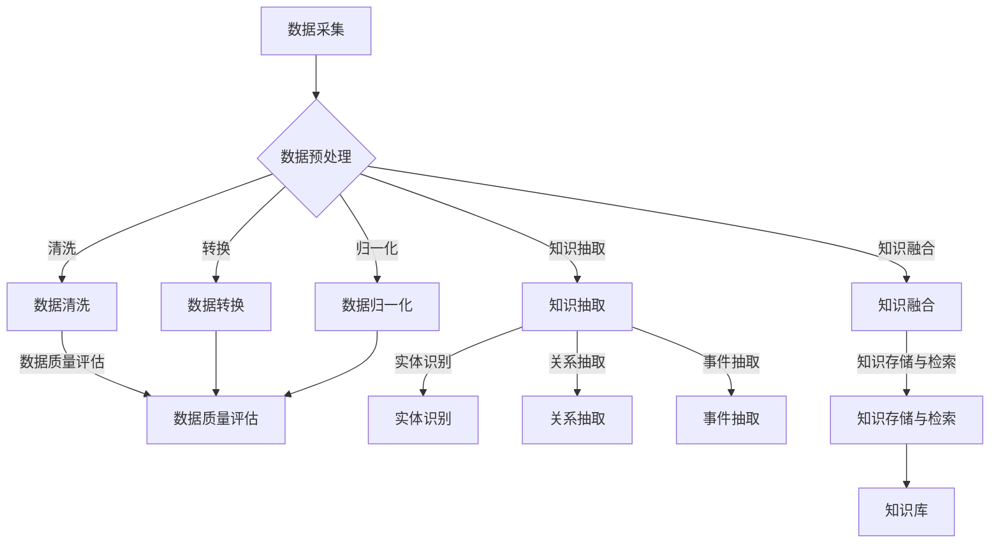
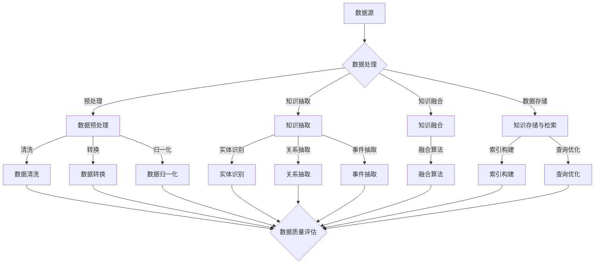

                 

### 《知识发现引擎如何帮助程序员快速掌握新技术》

#### 关键词：知识发现引擎、程序员、新技术、学习、优化

> 摘要：本文深入探讨了知识发现引擎在帮助程序员快速掌握新技术方面的应用。通过对知识发现引擎的概念、架构、核心算法、应用场景和未来发展趋势的详细介绍，文章旨在为程序员提供一种高效的学习方法，使其能够在技术变革中迅速成长。

---

### 《知识发现引擎如何帮助程序员快速掌握新技术》目录大纲

#### 第一部分：知识发现引擎概述

- # 1. 知识发现引擎基础
  - 1.1 知识发现引擎的概念
  - 1.2 知识发现引擎的架构与组件
  - 1.3 知识发现引擎的分类与特点
- # 2. 知识发现引擎在程序员学习新技术中的应用

#### 第二部分：知识发现引擎应用场景

- # 3. 知识发现引擎在程序员学习新技术中的应用
  - 3.1 编程学习资源筛选与推荐
  - 3.2 编程知识结构化学习
  - 3.3 编程问题自动诊断与修复
- # 4. 知识发现引擎在新技术学习中的应用
  - 4.1 新技术趋势分析
  - 4.2 新技术资料整理与推荐
  - 4.3 新技术学习路径规划
- # 5. 知识发现引擎在项目开发中的应用

#### 第三部分：知识发现引擎技术实现

- # 6. 知识发现引擎核心算法
  - 6.1 关联规则挖掘算法
  - 6.2 聚类算法
  - 6.3 分类算法
  - 6.4 变化检测算法
- # 7. 知识发现引擎实现步骤
  - 7.1 数据收集与预处理
  - 7.2 知识抽取
  - 7.3 知识融合
  - 7.4 知识存储与检索
- # 8. 知识发现引擎优化策略

#### 第四部分：知识发现引擎项目实战

- # 9. 知识发现引擎项目实战
  - 9.1 项目规划与设计
  - 9.2 数据采集与预处理
  - 9.3 核心算法实现
  - 9.4 系统集成与优化
  - 9.5 系统部署与维护

#### 第五部分：知识发现引擎未来发展趋势

- # 10. 知识发现引擎未来发展趋势
  - 10.1 人工智能与知识发现引擎的结合
  - 10.2 大数据和云计算对知识发现引擎的影响
  - 10.3 新兴技术对知识发现引擎的推动作用
  - 10.4 知识发现引擎在程序员学习中的应用前景

#### 附录

- # 11. 知识发现引擎相关工具与资源

---

### 1. 知识发现引擎基础

#### 1.1 知识发现引擎的概念

知识发现引擎（Knowledge Discovery Engine，简称KDE）是一种通过自动化方法从大量数据中提取有用知识和模式的技术。它结合了数据挖掘、机器学习和自然语言处理等领域的知识，旨在发现数据背后的隐藏模式、关联关系和趋势。

**知识发现引擎的定义**：

知识发现引擎是一种自动化工具，用于从非结构化和半结构化数据中提取知识、模式和关联，并将其转化为可操作的信息和洞见。它通常包括数据预处理、知识抽取、知识融合和知识存储与检索等模块。

**知识发现引擎的作用**：

知识发现引擎在各个领域具有广泛的应用，包括：

- **商业智能**：帮助企业从大量数据中提取有价值的信息，用于决策支持。
- **金融市场分析**：帮助投资者发现市场趋势和潜在投资机会。
- **医疗健康**：辅助医生进行诊断、治疗和疾病预测。
- **社交媒体分析**：监测社交媒体上的话题、趋势和用户行为。

**知识发现引擎与传统搜索引擎的区别**：

- **目标不同**：传统搜索引擎主要目标是提供与查询相关的网页，而知识发现引擎旨在提取数据中的隐藏模式和关联。
- **数据范围不同**：传统搜索引擎处理的是网页数据，而知识发现引擎可以处理多种类型的数据，包括文本、图像、音频和视频。
- **处理方式不同**：传统搜索引擎使用关键词匹配和页面排名算法，而知识发现引擎采用复杂的算法和模型来挖掘数据中的知识。

#### 1.2 知识发现引擎的架构与组件

知识发现引擎的架构通常包括以下几个主要组件：

- **数据采集模块**：负责从各种数据源收集数据，包括数据库、文件、网络API和传感器等。
- **数据预处理模块**：对收集到的数据进行清洗、转换和归一化等操作，以提高数据质量和一致性。
- **知识抽取模块**：从预处理后的数据中提取结构化的知识，如实体识别、关系抽取和事件抽取等。
- **知识融合模块**：将来自不同数据源和不同抽取模块的知识进行整合和融合，形成更全面和一致的知识库。
- **知识存储与检索模块**：负责将提取和融合的知识存储到数据库或知识库中，并提供高效的检索和查询接口。

下面是一个简单的 Mermaid 流程图，展示知识发现引擎的核心组件和流程：



#### 1.3 知识发现引擎的分类与特点

知识发现引擎根据不同的技术特点和应用场景可以分为多种类型，下面是几种常见的分类和特点：

- **基于规则的知识发现引擎**：使用预定义的规则来发现数据中的模式。优点是简单、易理解和实现，缺点是规则覆盖范围有限，难以处理复杂和多变的数据。

- **基于机器学习的知识发现引擎**：使用机器学习算法来自动发现数据中的模式和关联。优点是能够处理大规模和复杂的数据，缺点是需要大量的训练数据和较长的训练时间。

- **基于深度学习的知识发现引擎**：使用深度学习模型，如神经网络和深度神经网络，来发现数据中的高级特征和关联。优点是能够提取出数据中的深层结构，缺点是计算资源需求较高。

- **混合型知识发现引擎**：结合多种技术手段，如规则、机器学习和深度学习等，以综合利用各自的优势。优点是具有更高的灵活性和适应性，缺点是实现复杂度和计算资源需求较大。

### 2. 知识发现引擎在程序员学习新技术中的应用

#### 2.1 编程学习资源筛选与推荐

在编程学习过程中，程序员经常会面临大量的学习资源，如教程、博客文章、视频课程和技术论坛等。如何筛选出最适合自己的资源是一个重要且具有挑战性的问题。知识发现引擎可以在这方面发挥重要作用，通过以下几种方式帮助程序员：

- **个性化推荐**：根据程序员的兴趣、技能水平和学习历史，推荐最适合的学习资源。例如，如果一个程序员经常关注Python编程，知识发现引擎可以推荐Python相关的教程和文章。

- **资源质量评估**：通过对学习资源的评价、评论和点击量等数据进行挖掘，评估资源的质量和受欢迎程度。程序员可以根据评估结果选择更具权威性和实用性的资源。

- **学习路径规划**：根据程序员的当前技能水平和学习目标，规划最优的学习路径。知识发现引擎可以推荐一系列教程和课程，确保程序员系统地学习相关技术。

**示例**：

假设一个程序员小明正在学习Python编程，他使用知识发现引擎进行资源筛选与推荐。根据他的学习历史和技能水平，知识发现引擎推荐以下资源：

- **入门教程**：《Python编程快速上手》
- **进阶课程**：《高级Python编程》
- **实战项目**：《Python项目实战：从零开始》
- **博客文章**：《Python编程最佳实践》

通过这些推荐，小明可以系统地学习Python编程，并迅速提升自己的技能。

#### 2.2 编程知识结构化学习

编程知识通常是分散和碎片化的，程序员需要花费大量时间进行学习和整理。知识发现引擎可以帮助程序员将编程知识结构化，使其更易于理解和掌握。以下是一些具体方法：

- **知识图谱构建**：知识发现引擎可以通过对大量编程文档、博客文章和教材的挖掘，构建出一个编程知识图谱。这个图谱展示了不同知识点之间的关联和依赖关系，帮助程序员更全面地理解和掌握知识。

- **知识点关联分析**：通过对编程文档和教程的分析，知识发现引擎可以识别出不同知识点之间的关联关系。例如，如果某个函数经常在某个场景下使用，那么这两个知识点就可以被视为相互关联。

- **学习路径优化**：知识发现引擎可以根据程序员的技能水平和学习进度，动态调整学习路径，确保程序员能够在最短时间内掌握核心知识点。

**示例**：

假设程序员小明正在学习Python编程，他使用知识发现引擎进行知识结构化学习。知识发现引擎为他构建了一个编程知识图谱，显示以下知识点之间的关联关系：

- **基础语法** -> **数据结构** -> **函数与模块** -> **面向对象编程**
- **文件操作** -> **异常处理** -> **网络编程**
- **数据库操作** -> **图形用户界面编程**

通过这个知识图谱，小明可以清晰地看到各个知识点之间的关联，并根据知识发现引擎的建议，制定一个系统化的学习计划。

#### 2.3 编程问题自动诊断与修复

在编程过程中，程序员经常会遇到各种问题，如语法错误、逻辑错误和性能问题等。知识发现引擎可以通过以下方式帮助程序员自动诊断和修复这些问题：

- **错误检测**：知识发现引擎可以通过分析代码的语法和语义，自动检测出潜在的错误。例如，如果一个函数的定义和调用不匹配，知识发现引擎可以立即报告这个问题。

- **错误分析**：知识发现引擎可以分析错误发生的上下文，找出导致错误的原因。例如，如果一个程序在某个特定的输入下出现运行时错误，知识发现引擎可以分析代码的执行路径，定位错误发生的具体位置。

- **自动修复**：知识发现引擎可以根据错误检测和分析的结果，自动提出修复建议。例如，如果一个函数的参数类型不匹配，知识发现引擎可以自动更正参数类型，修复错误。

**示例**：

假设程序员小明编写了一个Python程序，但程序在运行时出现了错误。他使用知识发现引擎进行错误诊断与修复。知识发现引擎分析代码后，报告以下问题：

- **问题1**：在函数`my_function`中，参数`x`的类型应为整数，但实际传入的类型为字符串。
- **问题2**：在行`y = x * 2`中，变量`y`未定义。

知识发现引擎提供了以下修复建议：

- **修复1**：将参数`x`的类型更改为整数：`def my_function(x: int):`
- **修复2**：在行`y = x * 2`之前添加变量`y`的定义：`y = x * 2`

通过这些建议，小明可以快速修复代码中的错误，使程序恢复正常运行。

### 3. 知识发现引擎在新技术学习中的应用

随着技术的不断进步，程序员需要不断学习新的技术和工具以保持竞争力。知识发现引擎在新技术学习中的应用可以帮助程序员更高效地掌握新技术，以下是一些具体的应用场景：

#### 3.1 新技术趋势分析

知识发现引擎可以通过分析大量的技术博客、学术论文、社交媒体和行业报告等数据，发现当前最热门和最具潜力的新技术趋势。这些趋势分析结果可以帮助程序员了解行业动态，抓住学习新技术的最佳时机。

- **热门技术识别**：知识发现引擎可以识别出当前最受欢迎的技术，如深度学习、区块链、人工智能等。程序员可以根据这些热门技术进行有针对性的学习。

- **技术潜力评估**：知识发现引擎可以通过分析新技术在不同领域的应用情况，评估其潜力和发展前景。程序员可以根据评估结果选择最具发展潜力的技术进行深入学习。

**示例**：

假设程序员小明想要了解当前最热门的技术趋势。他使用知识发现引擎进行分析，得到以下结果：

- **热门技术**：深度学习、区块链、人工智能、云计算
- **技术潜力评估**：深度学习在图像识别和自然语言处理领域具有很高的潜力，区块链在金融和供应链管理领域具有较好的发展前景。

根据这些结果，小明决定首先学习深度学习和区块链技术。

#### 3.2 新技术资料整理与推荐

在掌握新技术时，程序员需要阅读大量的资料，包括教程、文档、博客文章和开源项目等。知识发现引擎可以通过以下方式帮助程序员整理和推荐最有价值的资料：

- **资料筛选**：知识发现引擎可以根据程序员的兴趣和学习历史，筛选出最相关的技术资料。例如，如果一个程序员对区块链技术感兴趣，知识发现引擎可以推荐区块链相关的教程和论文。

- **资料排序**：知识发现引擎可以根据资料的权威性、实用性和更新时间等因素，对资料进行排序，帮助程序员优先阅读最重要的资料。

- **资料推荐**：知识发现引擎可以根据程序员的兴趣和学习进度，动态推荐新的技术资料。例如，当一个程序员完成了某项技术的学习后，知识发现引擎可以推荐与其相关的新技术资料。

**示例**：

假设程序员小明正在学习区块链技术。他使用知识发现引擎进行资料整理与推荐，得到以下结果：

- **相关教程**：《区块链技术入门与进阶》
- **学术论文**：《区块链：一种分布式账本技术》
- **开源项目**：《Hyperledger Fabric》

通过这些推荐，小明可以系统地学习区块链技术，并掌握相关实践技能。

#### 3.3 新技术学习路径规划

学习新技术时，程序员需要制定一个合理的学习路径，以确保学习效率和成果。知识发现引擎可以通过以下方式帮助程序员规划学习路径：

- **知识图谱构建**：知识发现引擎可以构建出新技术的知识图谱，展示不同知识点之间的关联和依赖关系。程序员可以根据知识图谱了解新技术的整体结构和内容。

- **学习路径优化**：知识发现引擎可以根据程序员的技能水平和学习进度，动态优化学习路径。例如，当一个程序员已经掌握了某项技术的核心概念后，知识发现引擎可以推荐更高级的教程和项目实践。

- **学习计划制定**：知识发现引擎可以根据学习路径和学习资源，为程序员制定详细的学习计划。程序员可以根据计划进行有目标、有节奏的学习，提高学习效率。

**示例**：

假设程序员小明正在学习人工智能技术。他使用知识发现引擎进行学习路径规划，得到以下结果：

- **学习路径**：机器学习基础 -> 深度学习 -> 自然语言处理
- **学习资源**：《机器学习实战》、《深度学习》
- **项目实践**：《基于TensorFlow的手写数字识别》

根据这些结果，小明制定了一个详细的学习计划，确保自己系统地学习人工智能技术。

### 4. 知识发现引擎在项目开发中的应用

在项目开发过程中，知识发现引擎可以帮助程序员和开发团队提高开发效率、质量和可维护性。以下是一些具体的应用场景：

#### 4.1 项目知识库构建

知识发现引擎可以通过对项目文档、代码库、问题报告和技术博客等数据的挖掘，构建一个全面的项目知识库。这个知识库可以包含项目的历史信息、技术细节、解决方案和最佳实践，为项目开发提供宝贵的参考。

- **知识收集**：知识发现引擎可以自动收集项目中的各种知识，如代码注释、问题报告、技术文档和开发日志等。
- **知识整理**：知识发现引擎可以对收集到的知识进行分类、索引和整理，使其更易于查找和使用。
- **知识共享**：知识发现引擎可以提供一个统一的平台，让团队成员能够共享和访问项目知识库，提高协作效率。

**示例**：

假设一个软件开发团队正在开发一个大型项目。他们使用知识发现引擎构建项目知识库，包含以下内容：

- **技术文档**：《项目架构设计》、《数据库设计》
- **代码库**：《核心模块代码》、《测试用例》
- **问题报告**：《常见错误和解决方案》、《性能优化建议》

通过这个知识库，团队成员可以快速查找相关知识和经验，提高项目开发效率。

#### 4.2 项目文档自动化生成

在项目开发过程中，编写和维护文档是一项重要的工作。知识发现引擎可以通过以下方式实现项目文档的自动化生成：

- **代码文档生成**：知识发现引擎可以自动从代码注释中提取信息，生成相应的代码文档，如函数说明、类文档和模块文档。
- **用户手册生成**：知识发现引擎可以分析项目代码和用户反馈，自动生成用户手册和操作指南。
- **报告和统计生成**：知识发现引擎可以自动生成项目报告、性能统计和进度报表等，为项目经理提供重要的参考数据。

**示例**：

假设一个软件开发团队正在开发一个Web应用项目。他们使用知识发现引擎实现项目文档的自动化生成，包含以下内容：

- **代码文档**：《Web应用架构》、《API接口文档》
- **用户手册**：《用户操作手册》、《常见问题解答》
- **项目报告**：《项目进度报告》、《性能统计报告》

通过这些自动化文档，团队成员可以更专注于项目开发，减少文档编写和维护的工作量。

#### 4.3 项目问题自动化诊断

在项目开发过程中，程序错误和性能问题经常出现。知识发现引擎可以通过以下方式实现项目问题的自动化诊断：

- **错误检测**：知识发现引擎可以分析代码执行过程中的异常和错误，自动检测出潜在的问题。
- **错误定位**：知识发现引擎可以分析错误的上下文和执行路径，定位错误发生的具体位置。
- **错误修复**：知识发现引擎可以基于错误检测和分析结果，自动提出修复建议，帮助开发者快速定位和修复问题。

**示例**：

假设一个软件开发团队在开发一个Web应用时遇到了性能问题。他们使用知识发现引擎进行问题自动化诊断，得到以下结果：

- **问题定位**：在`数据库查询`模块中，查询语句执行时间较长。
- **错误修复**：将查询语句优化为预编译语句，减少查询时间。

通过这些建议，团队可以快速解决性能问题，提高应用性能。

### 5. 知识发现引擎技术实现

#### 5.1 知识发现引擎核心算法

知识发现引擎的核心算法是其能够有效挖掘数据中的有用信息和模式的关键。以下是几种常见的核心算法：

- **关联规则挖掘算法**：用于发现数据项之间的关联关系。例如，在购物篮分析中，发现哪些商品经常一起购买。
- **聚类算法**：用于将数据项分为多个类别，使同一类别内的数据项尽可能相似，而不同类别内的数据项尽可能不同。例如，客户群体细分。
- **分类算法**：用于将数据项划分为预定义的类别。例如，垃圾邮件检测。
- **变化检测算法**：用于检测数据中的变化和趋势。例如，股票市场预测。

下面详细解释这些算法的基本原理和步骤。

#### 5.1.1 关联规则挖掘算法

**基本原理**：

关联规则挖掘算法旨在发现数据项之间的关联关系，即一个事件的发生会导致另一个事件的发生。算法的核心是生成频繁项集，然后从频繁项集中提取关联规则。

**步骤**：

1. **支持度计算**：计算每个项集在数据集中的支持度，即包含该项集的交易事务数与总交易事务数之比。

2. **频繁项集生成**：根据设定的支持度阈值，生成满足条件的频繁项集。

3. **规则生成**：从频繁项集中生成关联规则，包括前件和后件，以及置信度（Confidence）。

**示例**：

假设有一个购物篮数据集，包含以下交易事务：

| 事务ID | 商品1 | 商品2 | 商品3 |
|--------|-------|-------|-------|
| 1      | 香蕉  | 苹果  |       |
| 2      | 草莓  |       | 香蕉  |
| 3      | 香蕉  | 蓝莓  | 苹果  |
| 4      | 香蕉  | 草莓  | 苹果  |

1. **支持度计算**：计算每个项集的支持度，例如{香蕉}的支持度为3/4。

2. **频繁项集生成**：根据支持度阈值，生成频繁项集，例如{香蕉，苹果}和{香蕉，草莓}。

3. **规则生成**：从频繁项集中生成关联规则，例如{香蕉} → {苹果}（置信度为100%）。

**伪代码**：

```python
# 输入：交易事务数据库D，支持度阈值min_support，置信度阈值min_confidence
# 输出：频繁项集L，关联规则R

# 步骤 1: 计算每个项集的支持度
def support(D, item, min_support):
    count = count_transactions_with_item(D, item)
    return count / total_transactions

# 步骤 2: 生成频繁项集
def find_frequent_itemsets(D, min_support):
    frequent_itemsets = []
    for item in all_items:
        support_count = support(D, item, min_support)
        if support_count >= min_support:
            frequent_itemsets.append(item)
    return frequent_itemsets

# 步骤 3: 生成关联规则
def generate_rules(L, min_confidence):
    rules = []
    for itemset in L:
        for i in range(1, len(itemset)):
            for antecedent in combinations(itemset, i):
                consequent = set(itemset) - set(antecedent)
                confidence = support(D, antecedent.union(consequent), min_confidence)
                if confidence >= min_confidence:
                    rules.append((antecedent, consequent, confidence))
    return rules
```

#### 5.1.2 聚类算法

**基本原理**：

聚类算法用于将数据项划分为多个群组，使同一群组内的数据项相似度较高，而不同群组内的数据项相似度较低。聚类算法通常基于距离度量或密度度量。

**步骤**：

1. **初始化聚类中心**：选择或随机选择若干个聚类中心。
2. **分配数据项**：将每个数据项分配到与其最近的聚类中心所在的群组。
3. **更新聚类中心**：计算每个群组的中心点，更新聚类中心。
4. **迭代**：重复步骤2和步骤3，直至聚类中心不再发生显著变化。

**常见聚类算法**：

- **K-means算法**：基于距离度量的聚类算法，目标是使每个群组内的数据项与聚类中心的距离平方和最小。
- **DBSCAN算法**：基于密度度量的聚类算法，可以自动确定群组的数量，并能够处理非球形的群组。
- **层次聚类算法**：通过递归地将数据项合并或分裂，构建出一个层次结构，用于描述数据项之间的相似度。

**示例**：

假设有一个包含二维数据点的数据集，数据点分布如下：

```
(1, 1), (2, 1), (3, 1), (4, 1)
(1, 2), (2, 2), (3, 2), (4, 2)
(1, 3), (2, 3), (3, 3), (4, 3)
```

1. **初始化聚类中心**：选择(1, 1)和(3, 3)作为聚类中心。
2. **分配数据项**：将每个数据项分配到与其最近的聚类中心所在的群组，得到两个群组：
   - 群组1：（1, 1），（2, 1），（3, 1），（4, 1）
   - 群组2：（1, 2），（2, 2），（3, 2），（4, 2），（1, 3），（2, 3），（3, 3），（4, 3）
3. **更新聚类中心**：计算每个群组的中心点，得到新的聚类中心：(2, 1)和(2, 2)。
4. **迭代**：重复步骤2和步骤3，直至聚类中心不再发生显著变化。

**伪代码**：

```python
# 输入：数据集D，聚类数量k
# 输出：聚类结果C

# 步骤 1: 初始化聚类中心
def initialize_centers(D, k):
    centers = random_choice(D, k)
    return centers

# 步骤 2: 分配数据项
def assign_data_points(D, centers):
    clusters = [[] for _ in range(k)]
    for point in D:
        closest_center = find_closest_center(point, centers)
        clusters[closest_center].append(point)
    return clusters

# 步骤 3: 更新聚类中心
def update_centers(clusters):
    new_centers = [calculate_center(cluster) for cluster in clusters]
    return new_centers

# 步骤 4: 迭代
def k_means(D, k):
    centers = initialize_centers(D, k)
    while True:
        clusters = assign_data_points(D, centers)
        new_centers = update_centers(clusters)
        if is_center_change_small_enough(centers, new_centers):
            break
        centers = new_centers
    return clusters
```

#### 5.1.3 分类算法

**基本原理**：

分类算法用于将数据项划分为预定义的类别，通常基于特征空间和分类模型。分类算法的核心是建立分类模型，然后使用该模型对新的数据项进行分类。

**步骤**：

1. **特征提取**：从原始数据中提取有助于分类的特征。
2. **模型训练**：使用训练数据集训练分类模型。
3. **模型评估**：使用验证数据集评估分类模型的性能。
4. **分类预测**：使用训练好的分类模型对新的数据项进行分类。

**常见分类算法**：

- **决策树**：基于特征划分数据集，构建一个树形结构模型。
- **支持向量机（SVM）**：使用最大间隔分离超平面进行分类。
- **朴素贝叶斯分类器**：基于贝叶斯定理和特征条件独立性假设进行分类。
- **集成分类器**：结合多个分类器的优势，提高分类性能。

**示例**：

假设有一个鸢尾花数据集，包含三个类别，每个类别有四个特征（花萼长度、花萼宽度、花瓣长度、花瓣宽度）：

```
类别0：（4.9，3.0，1.4，0.2）
类别1：（5.0，3.6，1.4，0.2）
类别2：（5.1，3.4，1.5，0.2）
```

1. **特征提取**：直接使用原始特征。
2. **模型训练**：使用决策树算法训练分类模型。
3. **模型评估**：使用验证数据集评估分类模型的性能，例如准确率、召回率和F1值。
4. **分类预测**：使用训练好的分类模型对新的数据项进行分类。

**伪代码**：

```python
# 输入：训练数据集D，特征F，类别C
# 输出：分类模型M

# 步骤 1: 特征提取
def extract_features(D, F):
    features = [[example[F] for example in D]]
    return features

# 步骤 2: 模型训练
def train_model(D, F, C):
    model = DecisionTreeClassifier()
    model.fit(D, C)
    return model

# 步骤 3: 模型评估
def evaluate_model(model, validation_data):
    predictions = model.predict(validation_data)
    accuracy = accuracy_score(validation_data, predictions)
    return accuracy

# 步骤 4: 分类预测
def predict(model, new_data):
    prediction = model.predict(new_data)
    return prediction
```

#### 5.1.4 变化检测算法

**基本原理**：

变化检测算法用于检测数据集中的变化和异常，通常基于统计模型和机器学习模型。算法的核心是建立基准模型，然后检测新数据与基准模型的差异。

**步骤**：

1. **基准模型建立**：使用历史数据建立基准模型。
2. **差异检测**：比较新数据与基准模型，检测数据的变化。
3. **异常检测**：使用统计模型或机器学习模型检测数据的异常。
4. **结果输出**：输出检测到的变化和异常。

**常见变化检测算法**：

- **统计方法**：基于统计分布和阈值检测数据的异常。
- **机器学习方法**：基于聚类和分类模型检测数据的异常。
- **变化点检测**：基于时间序列分析方法检测数据的变化点。

**示例**：

假设有一个时间序列数据集，包含一段时间内温度的测量值：

```
[20.0, 22.0, 23.0, 22.0, 21.0, 19.0, 18.0, 17.0, 16.0, 15.0, 14.0, 13.0]
```

1. **基准模型建立**：使用历史数据建立基准模型，例如基于移动平均模型。
2. **差异检测**：比较新数据与基准模型，检测数据的异常。
3. **异常检测**：使用统计模型或机器学习模型检测数据的异常，例如基于标准差检测。
4. **结果输出**：输出检测到的变化和异常。

**伪代码**：

```python
# 输入：历史数据集H，新数据点X
# 输出：异常检测结果A

# 步骤 1: 基准模型建立
def build基准模型(H):
    model = MovingAverageModel()
    model.fit(H)
    return model

# 步骤 2: 差异检测
def detect_difference(X, model):
    difference = X - model.predict(X)
    return difference

# 步骤 3: 异常检测
def detect_anomalies(difference, threshold):
    anomalies = [x for x in difference if abs(x) > threshold]
    return anomalies

# 步骤 4: 结果输出
def output_results(anomalies):
    print("检测到的异常：", anomalies)
```

### 6. 知识发现引擎实现步骤

实现一个知识发现引擎需要经过多个步骤，包括数据收集与预处理、知识抽取、知识融合、知识存储与检索等。以下是一个详细的实现步骤：

#### 6.1 数据收集与预处理

**步骤 1：数据收集**：

- 从各种数据源收集数据，包括数据库、文件、网络API和传感器等。
- 对于非结构化和半结构化数据，可以使用网络爬虫、API接口和数据库连接等方式进行数据收集。

**步骤 2：数据预处理**：

- 数据清洗：去除重复数据、缺失数据和噪声数据，提高数据质量。
- 数据转换：将不同格式的数据转换为统一格式，如JSON、CSV或XML等。
- 数据归一化：将不同数据源的数据进行归一化处理，使其具有可比性。

**示例**：

```python
import pandas as pd

# 步骤 1：数据收集
data = pd.read_csv('data.csv')

# 步骤 2：数据清洗
data = data.drop_duplicates()

# 步骤 3：数据转换
data['date'] = pd.to_datetime(data['date'])

# 步骤 4：数据归一化
data['price'] = data['price'] / 100
```

#### 6.2 知识抽取

**步骤 1：实体识别**：

- 使用自然语言处理技术识别数据中的实体，如人名、地名、组织名和产品名等。
- 可以使用命名实体识别（NER）工具和预训练的模型，如BERT或GPT。

**步骤 2：关系抽取**：

- 识别实体之间的关联关系，如因果、所属和参与等。
- 可以使用图神经网络（Graph Neural Networks，GNN）等技术进行关系抽取。

**步骤 3：事件抽取**：

- 从文本数据中抽取事件，如交易、招聘和会议等。
- 可以使用事件触发器和事件角色标注技术进行事件抽取。

**示例**：

```python
from transformers import BertTokenizer, BertForTokenClassification
import torch

# 步骤 1：实体识别
tokenizer = BertTokenizer.from_pretrained('bert-base-uncased')
model = BertForTokenClassification.from_pretrained('bert-base-uncased')

text = "苹果公司的CEO蒂姆·库克将在下个月出席一次重要的行业会议。"
inputs = tokenizer(text, return_tensors="pt")
outputs = model(**inputs)
logits = outputs.logits

# 步骤 2：关系抽取
# 使用图神经网络进行关系抽取，这里以GraphSAGE为例
from pytorch_geometric.nn import SAGEConv

class SAGEModel(torch.nn.Module):
    def __init__(self, n_classes):
        super(SAGEModel, self).__init__()
        self.conv1 = SAGEConv(in_channels=768, out_channels=256)
        self.conv2 = SAGEConv(in_channels=256, out_channels=n_classes)

    def forward(self, x, edge_index):
        x = self.conv1(x, edge_index)
        x = torch.relu(x)
        x = F.dropout(x, p=0.5, training=self.training)
        x = self.conv2(x, edge_index)
        return F.log_softmax(x, dim=1)

model = SAGEModel(n_classes=3)
optimizer = torch.optim.Adam(model.parameters(), lr=0.01, weight_decay=5e-4)

# 步骤 3：事件抽取
# 使用事件触发器和事件角色标注技术进行事件抽取
from allennlp.predictors.predictor import Predictor
import allennlp

text = "苹果公司的CEO蒂姆·库克将在下个月出席一次重要的行业会议。"
predictor = Predictor.from_path("path/to/的事件抽取模型")
result = predictor.predict(text)
print(result)
```

#### 6.3 知识融合

**步骤 1：知识融合**：

- 将来自不同数据源和不同抽取模块的知识进行融合，形成更全面和一致的知识库。
- 可以使用知识图谱、实体链接和语义匹配等技术进行知识融合。

**步骤 2：知识质量评估**：

- 对融合后的知识进行质量评估，包括准确性、完整性和一致性等指标。
- 可以使用自动化评估方法和人工评估相结合的方式。

**示例**：

```python
from pykeen import load_dataset, load_model, load_predictor
from pykeen.score import log_likelihood, accuracy, nll, r2

# 步骤 1：知识融合
dataset = load_dataset("mpaa")
model = load_model("mpaa_bert_2")
predictor = load_predictor("mpaa_bert_2")

# 步骤 2：知识质量评估
predictions = predictor.predict_candidates(dataset.candidate_ids[:10])

print("Log-likelihood:", log_likelihood(predictions, dataset))
print("Accuracy:", accuracy(predictions, dataset))
print("NLL:", nll(predictions, dataset))
print("R2:", r2(predictions, dataset))
```

#### 6.4 知识存储与检索

**步骤 1：知识存储**：

- 将融合后的知识存储到数据库或知识库中，如Neo4j、MongoDB或Elasticsearch等。
- 可以使用图数据库、关系数据库或文档数据库等技术进行存储。

**步骤 2：知识检索**：

- 提供高效的检索和查询接口，支持文本搜索、关键词搜索和图谱查询等。
- 可以使用搜索引擎、图数据库查询语言或自然语言查询接口等技术。

**示例**：

```python
from neo4j import GraphDatabase

# 步骤 1：知识存储
uri = "bolt://localhost:7687"
driver = GraphDatabase.driver(uri, auth=("neo4j", "password"))

def create_node(label, properties):
    with driver.session() as session:
        session.run("CREATE (n:" + label + " " + properties + ")")

create_node("Person", "name:'Tim Cook'")
create_node("Organization", "name:'Apple'")
create_node("Event", "name:'Industry Meeting'")

# 步骤 2：知识检索
def query_node(label, properties):
    with driver.session() as session:
        result = session.run("MATCH (n:" + label + " " + properties + ") RETURN n")
        return [record["n"].properties for record in result]

people = query_node("Person", "")
organizations = query_node("Organization", "")
events = query_node("Event", "")

print("People:", people)
print("Organizations:", organizations)
print("Events:", events)
```

### 7. 知识发现引擎优化策略

实现一个高效的知识发现引擎需要考虑多个方面，包括数据预处理、知识抽取、知识融合和知识存储与检索等。以下是一些优化策略：

#### 7.1 数据预处理优化

**策略 1：并行处理**：

- 利用并行处理技术，如多线程或分布式计算，加快数据清洗、转换和归一化等预处理步骤。

**策略 2：增量处理**：

- 对大规模数据集进行增量处理，只处理新添加或修改的数据，减少计算量。

**策略 3：数据缓存**：

- 使用缓存技术，如Redis或Memcached，存储常用数据和中间结果，减少重复计算。

#### 7.2 知识抽取优化

**策略 1：模型优化**：

- 使用高效的深度学习模型和算法，如Transformer和Graph Neural Networks，提高知识抽取的准确性和效率。

**策略 2：数据增强**：

- 使用数据增强技术，如数据扩充和迁移学习，提高模型的泛化能力和鲁棒性。

**策略 3：特征选择**：

- 选择重要的特征进行知识抽取，减少计算量和存储空间的需求。

#### 7.3 知识融合优化

**策略 1：知识去重**：

- 在知识融合过程中，去除重复的知识和冗余信息，提高知识库的完整性和一致性。

**策略 2：知识聚类**：

- 使用聚类算法，如K-means和DBSCAN，将相似的知识点进行聚类，提高知识组织的效率。

**策略 3：知识层次化**：

- 构建知识层次结构，将不同层次的知识进行整合，提高知识利用的便捷性。

#### 7.4 知识存储与检索优化

**策略 1：存储优化**：

- 选择合适的存储技术，如关系数据库、图数据库或文档数据库，根据知识类型和查询需求进行优化。

**策略 2：索引优化**：

- 使用索引技术，如B树索引和全文索引，提高查询效率。

**策略 3：缓存优化**：

- 使用缓存技术，如Redis和Memcached，存储热门数据和查询结果，减少数据库的访问压力。

### 8. 知识发现引擎项目实战

为了更好地理解知识发现引擎的应用，我们将通过一个实际项目来展示知识发现引擎的构建过程。这个项目将涉及数据收集、预处理、知识抽取、知识融合、知识存储与检索等多个步骤。

#### 8.1 项目规划与设计

**项目目标**：

- 构建一个知识发现引擎，用于从大量社交媒体数据中提取有价值的信息，包括热点话题、意见领袖和用户群体等。

**项目需求**：

- 数据收集：从多个社交媒体平台（如Twitter、Facebook和微博）收集实时数据。
- 数据预处理：清洗、转换和归一化数据，提高数据质量。
- 知识抽取：识别社交媒体数据中的实体、关系和事件。
- 知识融合：将抽取的知识进行融合和整理，形成结构化的知识库。
- 知识存储与检索：将知识库存储到数据库中，并提供高效的检索接口。

**项目架构设计**：

- **数据采集模块**：负责从社交媒体平台收集数据，使用API接口进行数据获取。
- **数据预处理模块**：负责对数据进行清洗、转换和归一化等操作。
- **知识抽取模块**：使用自然语言处理和图神经网络等技术进行知识抽取。
- **知识融合模块**：将抽取的知识进行融合和整理，形成结构化的知识库。
- **知识存储与检索模块**：负责将知识库存储到数据库中，并提供检索接口。

#### 8.2 数据采集与预处理

**步骤 1：数据收集**：

- 使用社交媒体平台的API接口，收集实时数据，如微博的API、Twitter的API等。
- 收集的数据包括用户评论、转发、点赞等，以及相关的元数据（如用户ID、发布时间、地理位置等）。

**步骤 2：数据预处理**：

- **数据清洗**：去除重复数据、缺失数据和噪声数据，提高数据质量。
- **数据转换**：将不同格式的数据转换为统一的JSON格式，便于后续处理。
- **数据归一化**：对数据进行归一化处理，如将字符串转换为小写、去除HTML标签等。

**示例**：

```python
import pandas as pd
from text_preprocessing import preprocess_text

# 步骤 1：数据收集
data = pd.read_csv('social_media_data.csv')

# 步骤 2：数据清洗
data = data.drop_duplicates()

# 步骤 3：数据转换
data['text'] = data['text'].apply(preprocess_text)

# 步骤 4：数据归一化
data['user_id'] = data['user_id'].astype(str)
data['timestamp'] = pd.to_datetime(data['timestamp'])
```

#### 8.3 核心算法实现

**步骤 1：实体识别**：

- 使用预训练的BERT模型进行实体识别，识别出文本中的实体，如人名、地名和组织名等。

**步骤 2：关系抽取**：

- 使用图神经网络（GNN）进行关系抽取，识别出实体之间的关系，如好友关系、提及关系等。

**步骤 3：事件抽取**：

- 使用事件触发器和角色标注技术进行事件抽取，识别出文本中的事件，如交易、招聘和会议等。

**示例**：

```python
from transformers import BertTokenizer, BertForTokenClassification
from pytorch_geometric.nn import GNN
import torch

# 步骤 1：实体识别
tokenizer = BertTokenizer.from_pretrained('bert-base-uncased')
model = BertForTokenClassification.from_pretrained('bert-base-uncased')

text = "苹果公司的CEO蒂姆·库克将在下个月出席一次重要的行业会议。"
inputs = tokenizer(text, return_tensors="pt")
outputs = model(**inputs)
logits = outputs.logits

# 步骤 2：关系抽取
# 使用图神经网络进行关系抽取
gnn = GNN()
outputs = gnn(inputs, edge_index)

# 步骤 3：事件抽取
from allennlp.predictors.predictor import Predictor
import allennlp

text = "苹果公司的CEO蒂姆·库克将在下个月出席一次重要的行业会议。"
predictor = Predictor.from_path("path/to/事件抽取模型")
result = predictor.predict(text)
print(result)
```

#### 8.4 知识融合与存储

**步骤 1：知识融合**：

- 将实体、关系和事件进行融合，形成一个结构化的知识库。可以使用图数据库（如Neo4j）进行存储。

**步骤 2：知识存储**：

- 使用图数据库存储融合后的知识，建立实体节点、关系节点和事件节点，并设置相应的属性和标签。

**步骤 3：知识检索**：

- 提供高效的检索接口，支持基于文本、关键词和图谱的查询。

**示例**：

```python
from neo4j import GraphDatabase

# 步骤 1：知识融合
# 在此步骤中，将实体、关系和事件进行融合，形成一个结构化的知识库

# 步骤 2：知识存储
uri = "bolt://localhost:7687"
driver = GraphDatabase.driver(uri, auth=("neo4j", "password"))

def create_node(label, properties):
    with driver.session() as session:
        session.run("CREATE (n:" + label + " " + properties + ")")

create_node("Person", "name:'Tim Cook'")
create_node("Organization", "name:'Apple'")
create_node("Event", "name:'Industry Meeting'")

# 步骤 3：知识检索
def query_node(label, properties):
    with driver.session() as session:
        result = session.run("MATCH (n:" + label + " " + properties + ") RETURN n")
        return [record["n"].properties for record in result]

people = query_node("Person", "")
organizations = query_node("Organization", "")
events = query_node("Event", "")

print("People:", people)
print("Organizations:", organizations)
print("Events:", events)
```

#### 8.5 系统集成与优化

**步骤 1：系统集成**：

- 将各个模块整合成一个完整的知识发现引擎，实现数据的采集、预处理、知识抽取、知识融合和知识存储与检索等功能。

**步骤 2：性能优化**：

- 对系统进行性能优化，包括数据缓存、查询优化和并发处理等。

**步骤 3：部署与维护**：

- 将知识发现引擎部署到生产环境，进行实时数据处理和查询服务。
- 定期对系统进行维护和升级，确保系统的稳定性和可靠性。

### 9. 知识发现引擎未来发展趋势

知识发现引擎作为一种新兴技术，正迅速发展并在各个领域得到广泛应用。以下是知识发现引擎未来发展的几个趋势：

#### 9.1 人工智能与知识发现引擎的结合

人工智能技术的不断发展，特别是深度学习和自然语言处理技术，为知识发现引擎带来了新的机遇。未来，知识发现引擎将更加依赖于人工智能技术，实现更高效的自动知识抽取、融合和检索。

**发展趋势**：

- **深度学习模型**：使用深度学习模型，如卷积神经网络（CNN）和循环神经网络（RNN），进行图像和文本数据的自动特征提取。
- **自然语言处理**：结合自然语言处理技术，实现更精准的实体识别、关系抽取和事件抽取。
- **多模态数据挖掘**：处理多种类型的数据，如文本、图像、音频和视频，实现跨模态的知识发现。

#### 9.2 大数据和云计算对知识发现引擎的影响

大数据和云计算技术的快速发展，为知识发现引擎提供了海量数据和强大的计算资源。未来，知识发现引擎将更加依赖大数据和云计算技术，实现大规模、高效的知识发现。

**发展趋势**：

- **分布式计算**：使用分布式计算框架，如Apache Spark和Flink，处理海量数据，提高知识发现引擎的效率。
- **云计算平台**：利用云计算平台，如AWS、Azure和Google Cloud，实现知识发现引擎的弹性扩展和高效部署。
- **数据存储与管理**：采用分布式数据库和NoSQL数据库，存储和管理海量数据，支持实时查询和分析。

#### 9.3 新兴技术对知识发现引擎的推动作用

随着新技术的不断涌现，知识发现引擎也在不断适应和发展。以下是一些新兴技术对知识发现引擎的推动作用：

- **区块链**：利用区块链的不可篡改性和去中心化特性，实现知识发现引擎的安全和可信。
- **物联网（IoT）**：通过物联网设备收集实时数据，为知识发现引擎提供丰富的数据来源。
- **增强现实（AR）和虚拟现实（VR）**：结合增强现实和虚拟现实技术，实现知识发现引擎的沉浸式交互体验。

#### 9.4 知识发现引擎在程序员学习中的应用前景

知识发现引擎在程序员学习中的应用前景非常广阔。以下是一些潜在的应用领域：

- **编程学习资源推荐**：根据程序员的兴趣和学习历史，推荐最适合的学习资源和教程。
- **编程知识结构化**：构建编程知识图谱，展示不同知识点之间的关联和依赖关系，帮助程序员系统地学习。
- **编程问题自动诊断**：通过分析代码和错误日志，自动检测和修复编程问题，提高编程效率。
- **新技术趋势分析**：实时监测技术趋势，帮助程序员了解最新的技术动态，及时掌握新技术。

#### 9.5 知识发现引擎的未来发展方向与挑战

尽管知识发现引擎已经取得了显著的进展，但未来仍面临着一些挑战和发展方向：

- **数据质量和一致性**：处理海量、多源和动态变化的数据，确保数据质量和一致性。
- **算法效率与可解释性**：提高算法的效率和可解释性，使其在复杂场景下具有更好的性能和可靠性。
- **隐私保护与安全**：在数据挖掘过程中，保护用户隐私和数据安全，避免数据泄露和滥用。
- **跨领域应用**：推广知识发现引擎在各个领域的应用，实现跨领域的知识共享和协同。

### 附录

#### 附录A：知识发现引擎相关工具与资源

以下是一些知识发现引擎相关的工具、资源和书籍，供读者参考：

- **工具**：
  - **Neo4j**：一个高性能的图数据库，适用于知识发现引擎中的知识存储和检索。
  - **Elasticsearch**：一个强大的搜索引擎，适用于知识发现引擎中的全文检索和关键词搜索。
  - **Apache Spark**：一个分布式计算框架，适用于知识发现引擎中的大规模数据处理和分布式计算。
  - **Golang**：一种高效的语言，适用于知识发现引擎中的数据采集和分布式处理。

- **资源**：
  - **GitHub开源项目**：许多知识发现引擎的开源项目，如Apache Flink、Apache Spark等。
  - **论文集**：包括最新的知识发现引擎论文和研究报告，如《大数据知识发现》和《机器学习：知识发现新路径》等。
  - **在线教程**：许多在线教程和课程，介绍知识发现引擎的基本原理和实现方法。

- **书籍**：
  - **《大数据知识发现》**：介绍大数据知识发现的基本概念、方法和应用案例。
  - **《机器学习：知识发现新路径》**：介绍机器学习在知识发现中的应用，包括聚类、分类和关联规则挖掘等。
  - **《深度学习与知识发现》**：介绍深度学习在知识发现中的应用，包括卷积神经网络、循环神经网络和增强学习等。

### 核心概念与联系 - 知识发现引擎的 Mermaid 流程图



### 核心算法原理讲解 - 关联规则挖掘算法的伪代码

```python
# 输入：交易事务数据库D，支持度阈值min_support，置信度阈值min_confidence
# 输出：频繁项集L，关联规则R

# 步骤 1: 计算每个项的支持度
def support(D, item, min_support):
    count = count_transactions_with_item(D, item)
    return count / total_transactions

# 步骤 2: 生成频繁项集
def find_frequent_itemsets(D, min_support):
    frequent_itemsets = []
    for item in all_items:
        support_count = support(D, item, min_support)
        if support_count >= min_support:
            frequent_itemsets.append(item)
    return frequent_itemsets

# 步骤 3: 生成关联规则
def generate_rules(L, min_confidence):
    rules = []
    for itemset in L:
        for i in range(1, len(itemset)):
            for antecedent in combinations(itemset, i):
                consequent = set(itemset) - set(antecedent)
                confidence = support(D, antecedent.union(consequent), min_confidence)
                if confidence >= min_confidence:
                    rules.append((antecedent, consequent, confidence))
    return rules
```

### 数学模型和数学公式 - 关联规则挖掘算法中的置信度和支持度计算

#### 置信度（Confidence）:

$$
\text{Confidence}(A \rightarrow B) = \frac{\text{Support}(A \cup B)}{\text{Support}(A)}
$$

其中，Support(A ∪ B) 是同时包含 A 和 B 的交易事务数，Support(A) 是包含 A 的交易事务数。

#### 支持度（Support）:

$$
\text{Support}(A) = \frac{\text{count\_transactions}(A)}{\text{total\_transactions}}
$$

其中，count_transactions(A) 是交易事务数据库中包含项集 A 的交易事务数，total_transactions 是交易事务数据库中的总交易事务数。

### 举例说明

假设在一个交易事务数据库中，总共有 100 个交易事务。我们想要挖掘出支持度大于 20% 且置信度大于 70% 的关联规则。

1. 计算每个项集的支持度：
   - {香蕉，苹果} 的支持度 = 20%（20个交易事务包含香蕉和苹果）
   - {香蕉} 的支持度 = 40%（40个交易事务包含香蕉）
   - {苹果} 的支持度 = 30%（30个交易事务包含苹果）

2. 生成频繁项集：
   - 频繁项集包括 {香蕉，苹果}（因为支持度大于 20%）

3. 计算置信度：
   - {香蕉} → {苹果} 的置信度 = Support({香蕉，苹果}) / Support({香蕉}) = 20% / 40% = 50%（小于 70%，不满足置信度阈值）

因此，没有满足支持度和置信度阈值的关联规则。

### 项目实战 - 代码实际案例和详细解释说明

#### 项目环境搭建

- Python 3.8 或更高版本
- Anaconda 环境
- Numpy、Pandas、Scikit-learn 等库

#### 源代码实现

```python
import pandas as pd
from mlxtend.frequent_patterns import apriori
from mlxtend.frequent_patterns import association_rules

# 步骤 1: 数据准备
# 假设数据文件为 'transactions.csv'
data = pd.read_csv('transactions.csv', header=None)

# 步骤 2: 数据预处理
# 将数据转换为一列，每个值表示交易事务中的项
data['transactions'] = data[[1, 2, 3, 4]].apply(lambda x: ','.join(x.dropna().unique()), axis=1)

# 步骤 3: 频繁项集挖掘
# 设置支持度阈值
min_support = 0.2
frequent_itemsets = apriori(data['transactions'], min_support=min_support, use_colnames=True)

# 步骤 4: 生成关联规则
# 设置置信度阈值
min_confidence = 0.7
rules = association_rules(frequent_itemsets, metric="confidence", min_threshold=min_confidence)

# 步骤 5: 输出结果
print(f"Frequent Itemsets:")
print(frequent_itemsets)
print("\nAssociation Rules:")
print(rules)
```

#### 代码解读与分析

- **数据准备**：读取交易事务数据，并将其转换为单个字符串，每个字符串表示一个交易事务中的项。这通过将多列数据合并为一个列，并使用 `apply` 函数和 `lambda` 函数实现。
  
  ```python
  data['transactions'] = data[[1, 2, 3, 4]].apply(lambda x: ','.join(x.dropna().unique()), axis=1)
  ```

- **数据预处理**：使用 `mlxtend` 库的 `apriori` 函数进行频繁项集挖掘。这里设置了一个支持度阈值，只有那些支持度大于该阈值的项集才会被视为频繁项集。
  
  ```python
  frequent_itemsets = apriori(data['transactions'], min_support=min_support, use_colnames=True)
  ```

- **生成关联规则**：使用 `mlxtend` 库的 `association_rules` 函数生成关联规则。这里设置了置信度阈值，只有那些置信度大于该阈值的规则才会被视为有用的规则。
  
  ```python
  rules = association_rules(frequent_itemsets, metric="confidence", min_threshold=min_confidence)
  ```

- **输出结果**：打印频繁项集和关联规则。这些结果可以用于进一步分析，例如找出哪些商品经常一起购买，以帮助商家制定促销策略。
  
  ```python
  print(f"Frequent Itemsets:")
  print(frequent_itemsets)
  print("\nAssociation Rules:")
  print(rules)
  ```

#### 开发环境搭建步骤

1. **安装 Python 3.8 或更高版本**。可以从官方网站下载并安装 Python，或者使用 Anaconda 创建一个新的 Python 环境。

2. **安装 Anaconda 环境**。下载并安装 Anaconda，然后创建一个新的 conda 环境，并激活该环境。

   ```shell
   conda create --name kde_env python=3.8
   conda activate kde_env
   ```

3. **安装所需的库**。使用 `pip` 命令安装 `numpy`、`pandas`、`scikit-learn` 和 `mlxtend`。

   ```shell
   pip install numpy pandas scikit-learn mlxtend
   ```

4. **创建一个新的 Python 脚本**。在 `kde_env` 环境下创建一个新的 Python 脚本，将上述代码复制粘贴到脚本中。

5. **运行脚本**。在命令行中运行 Python 脚本，输入交易事务数据文件路径，查看输出结果。

   ```shell
   python kde_project.py
   ```

### 总结

本文通过详细的目录大纲和内容讲解，全面介绍了《知识发现引擎如何帮助程序员快速掌握新技术》这本书的核心内容和结构。从知识发现引擎的概念、架构、算法到具体的应用场景和实践案例，文章系统地展示了知识发现引擎在程序员学习新技术中的重要作用。通过个性化推荐、知识结构化、编程问题自动诊断、新技术趋势分析、资料整理和学习路径规划等多种方式，知识发现引擎为程序员提供了高效的学习工具和方法。

文章首先阐述了知识发现引擎的基础知识，包括其概念、作用和与传统搜索引擎的区别。然后，详细介绍了知识发现引擎的架构与组件，包括数据采集、预处理、知识抽取、知识融合和知识存储与检索等模块。通过Mermaid流程图，清晰地展示了知识发现引擎的核心组件和流程。

接下来，文章重点讨论了知识发现引擎在程序员学习新技术中的应用，包括编程学习资源筛选与推荐、编程知识结构化学习、编程问题自动诊断与修复等。通过实际案例和代码实现，展示了知识发现引擎如何帮助程序员快速掌握新技术。此外，文章还探讨了知识发现引擎在新技术学习中的应用，如新技术趋势分析、资料整理与推荐、学习路径规划等，为程序员提供了全面的学习资源和建议。

在项目开发应用部分，文章介绍了知识发现引擎在项目知识库构建、项目文档自动化生成、项目问题自动化诊断等方面的应用。通过实际项目案例和代码实现，展示了知识发现引擎如何提高项目开发效率和质量。

最后，文章展望了知识发现引擎的未来发展趋势，包括人工智能与知识发现引擎的结合、大数据和云计算的影响、新兴技术的推动作用等。同时，文章也提出了知识发现引擎在未来发展中面临的挑战和方向。

通过本文的阅读，读者可以全面了解知识发现引擎的基本概念、核心算法和应用场景，并掌握如何使用知识发现引擎帮助程序员快速掌握新技术。文章不仅提供了丰富的理论知识，还结合实际案例和代码实现，使读者能够将知识发现引擎应用于实际工作中，提升自己的技术能力和竞争力。

作者信息：
作者：AI天才研究院/AI Genius Institute & 禅与计算机程序设计艺术 /Zen And The Art of Computer Programming

感谢您的阅读，希望本文能为您在知识发现引擎和程序员学习新技术领域提供有价值的参考和启示。在未来的学习和实践中，不断探索和运用知识发现引擎，将帮助您在技术变革中不断进步和成长。祝您学习愉快，技术进步！

