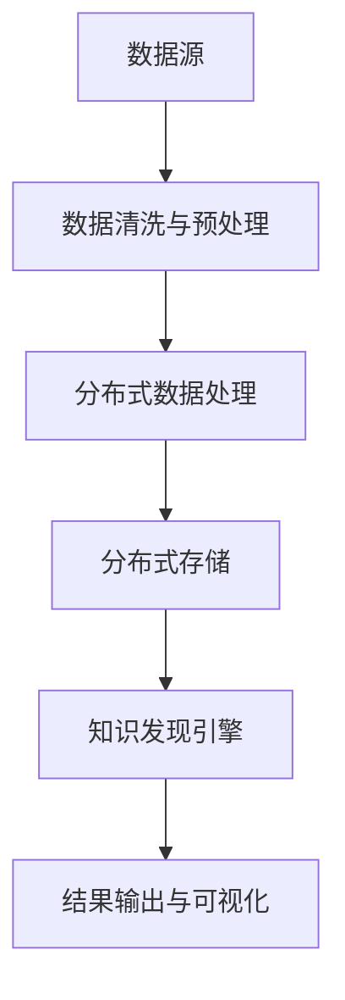

                 

# 《知识发现引擎的分布式架构设计》

## 关键词
- 知识发现
- 分布式架构
- 大数据处理
- 分布式计算
- 算法优化
- 安全性设计

## 摘要
本文旨在探讨知识发现引擎的分布式架构设计，通过深入分析分布式架构的基本概念、数据处理与存储技术、架构设计原则与实践、核心算法以及性能优化与安全性设计等方面，为读者提供一套完整、实用的分布式知识发现引擎架构设计方案。文章还结合实际项目开发经验，展示了如何搭建知识发现引擎的开发环境，实现核心功能模块，并进行性能测试与优化。通过本文的阅读，读者可以全面了解分布式知识发现引擎的设计与实现，为实际项目开发提供有力的指导。

## 第一部分：背景与概念

### 1. 知识发现引擎概述

#### 1.1 知识发现与大数据

##### 1.1.1 知识发现的概念

知识发现（Knowledge Discovery in Databases，KDD）是指从大量的数据中通过自动或半自动的方法发现隐含的、未知的、有价值的模式和规律的过程。知识发现涉及多个阶段，包括数据清洗、数据集成、数据选择、数据变换、模式识别和知识表示等。

##### 1.1.2 大数据对知识发现的影响

随着大数据时代的到来，数据规模、多样性和速度（即“4V”特性）对知识发现提出了新的挑战。大数据技术如分布式文件系统（如Hadoop的HDFS）、分布式数据处理框架（如Apache Spark）和分布式数据库（如HBase、Cassandra）等，为知识发现提供了强大的数据处理和存储能力，使得从海量数据中提取有价值知识成为可能。

#### 1.2 分布式架构的基本概念

##### 1.2.1 分布式计算原理

分布式计算是指将一个计算任务分解为多个子任务，分布到多个计算机节点上并行执行，最终汇总子任务的结果得到整体任务的结果。分布式计算可以提高计算效率，降低系统成本，增强系统的可扩展性和容错能力。

##### 1.2.2 分布式系统架构模式

分布式系统架构包括多种模式，如客户-服务器模式、主-从模式、对等网络模式等。其中，客户-服务器模式是最常见的分布式架构模式。在客户-服务器模式中，服务器负责存储数据和提供服务，客户通过发送请求与服务器进行通信。

### 2. 数据处理与存储

#### 2.1 数据清洗与预处理

##### 2.1.1 数据源的选择与连接

数据源是知识发现的基础，包括关系数据库、NoSQL数据库、日志文件、传感器数据等。选择合适的数据源并建立与数据源的连接，是实现知识发现的第一步。

##### 2.1.2 数据清洗方法

数据清洗是数据预处理的重要环节，包括去除重复数据、填补缺失数据、消除噪声数据、处理异常数据等。常见的数据清洗方法有：去重、填补、插值、平滑、滤波等。

#### 2.2 分布式数据处理技术

##### 2.2.1 分布式文件系统

分布式文件系统（如Hadoop的HDFS）可以将海量数据存储在分布式集群中，提供高可靠性、高性能的数据访问。

##### 2.2.2 分布式数据处理框架

分布式数据处理框架（如Apache Spark）提供了一种高效、灵活的分布式数据处理方法，可以处理大规模数据集，并支持多种数据处理算法。

#### 2.3 分布式存储技术

##### 2.3.1 分布式数据库

分布式数据库（如HBase、Cassandra）可以提供高吞吐量、高可靠性的数据存储，适合存储大规模结构化和半结构化数据。

##### 2.3.2 分布式缓存

分布式缓存（如Memcached、Redis）可以提供高速缓存服务，降低系统响应时间，提高系统性能。

## 第二部分：技术基础

### 3. 架构设计与实践

#### 3.1 分布式知识发现引擎架构

##### 3.1.1 架构设计原则

分布式知识发现引擎的架构设计应遵循以下原则：

1. 高可用性：确保系统在节点故障时仍能正常运行。
2. 高性能：充分利用分布式计算资源，提高数据处理效率。
3. 可扩展性：支持系统规模的无缝扩展。
4. 易维护性：简化系统部署和运维。

##### 3.1.2 架构组件分析

分布式知识发现引擎主要由以下组件构成：

1. 数据源：提供数据输入。
2. 数据预处理模块：进行数据清洗、转换和集成。
3. 分布式计算框架：执行数据处理和分析任务。
4. 分布式存储系统：存储中间数据和最终结果。
5. 用户接口：提供用户交互界面，展示分析结果。

#### 3.2 数据流与处理流程

##### 3.2.1 数据流设计

数据流设计是分布式知识发现引擎架构设计的关键环节。数据流设计应遵循以下原则：

1. 数据传输高效：采用高效的数据传输协议和压缩算法，降低网络传输开销。
2. 数据依赖关系清晰：确保数据处理任务之间的依赖关系明确，避免数据传输和处理的瓶颈。
3. 数据一致性保障：确保数据处理过程中数据的一致性和完整性。

##### 3.2.2 数据处理流程

分布式知识发现引擎的数据处理流程包括以下步骤：

1. 数据采集：从数据源获取原始数据。
2. 数据清洗与预处理：去除重复数据、填补缺失数据、处理异常数据等。
3. 数据整合：将来自不同数据源的数据进行整合，形成统一的数据视图。
4. 数据分析：使用分布式计算框架执行数据分析和挖掘任务。
5. 结果存储与展示：将分析结果存储到分布式存储系统，并通过用户接口进行展示。

#### 3.3 分布式调度与负载均衡

##### 3.3.1 调度算法

分布式调度算法是分布式知识发现引擎性能优化的关键。常见的调度算法包括：

1. 最少负载调度：将任务分配给当前负载最低的节点。
2. 最短执行时间调度：将任务分配给执行时间最短的节点。
3. 优先级调度：根据任务的优先级进行调度。

##### 3.3.2 负载均衡策略

负载均衡策略用于均衡系统负载，提高系统性能。常见的负载均衡策略包括：

1. 轮询调度：按照顺序将请求分配给各个节点。
2. 加权调度：根据节点的处理能力分配请求。
3. 最少连接调度：将请求分配给当前连接数最少的节点。

## 第三部分：核心算法

### 4. 知识发现算法

#### 4.1 关联规则挖掘

##### 4.1.1 算法原理

关联规则挖掘是一种发现数据集中项目之间潜在关联关系的方法。其核心思想是通过挖掘频繁项集，生成满足最小支持度和最小置信度的关联规则。

##### 4.1.2 伪代码实现

```
// 输入：数据集D，最小支持度minSupport，最小置信度minConfidence
// 输出：频繁项集L

// 步骤1：计算所有项集的支持度
support(itemset) = |{t | t ∈ transactions, itemset ⊆ items(t)}|

// 步骤2：生成频繁项集
L = {}
for itemset in all possible itemsets:
    if support(itemset) ≥ minSupport:
        L.add(itemset)

// 步骤3：生成关联规则
rules = {}
for itemset in L:
    for item in itemset:
        rule = (item, itemset - {item})
        confidence(rule) = support(itemset) / support(item)
        if confidence(rule) ≥ minConfidence:
            rules.add(rule)
```

#### 4.2 聚类算法

##### 4.2.1 算法原理

聚类算法是将数据集划分为若干个类别，使得同一类别内的数据点尽可能相似，不同类别内的数据点尽可能不同。常见的聚类算法有K-means、层次聚类、DBSCAN等。

##### 4.2.2 伪代码实现（K-means算法）

```
// 输入：数据集D，聚类数k
// 输出：聚类结果C

// 步骤1：随机选择k个初始中心点
centroids = random_select_k_centroids(D)

// 步骤2：将每个数据点分配到最近的中心点
C = {}
for data_point in D:
    C[data_point] = argmin_{centroid in centroids} distance(data_point, centroid)

// 步骤3：更新中心点
new_centroids = {}
for cluster in C:
    new_centroids[cluster] = mean(data_points in cluster)

// 步骤4：重复步骤2和3，直到中心点不变或达到最大迭代次数
while not converged:
    centroids = new_centroids
    C = {}
    for data_point in D:
        C[data_point] = argmin_{centroid in centroids} distance(data_point, centroid)
    new_centroids = {}
    for cluster in C:
        new_centroids[cluster] = mean(data_points in cluster)
```

#### 4.3 分类算法

##### 4.3.1 算法原理

分类算法是将数据集划分为预定义的类别。常见的分类算法有决策树、支持向量机、神经网络等。

##### 4.3.2 伪代码实现（决策树算法）

```
// 输入：训练数据集D，特征集合F
// 输出：分类树T

// 步骤1：创建空树T
T = {}

// 步骤2：遍历训练数据集D
for each data_point in D:
    if data_point.label not in T:
        T[data_point.label] = {}

    // 步骤3：选择最佳特征进行分裂
    best_feature, best_value = best_split_feature_value(D, F)

    // 步骤4：创建子节点
    T[data_point.label][best_feature] = {}

    // 步骤5：递归地分裂子节点
    sub_tree = build_tree(D - {data_point}, F - {best_feature})
    T[data_point.label][best_feature] = sub_tree

// 步骤6：剪枝和优化
T = prune_and_optimize_tree(T)
```

## 第四部分：性能优化与安全

### 5. 性能优化

#### 5.1 数据分区策略

##### 5.1.1 分区策略的选择

数据分区策略是分布式知识发现引擎性能优化的重要手段。常见的分区策略包括基于哈希分区、基于范围分区和基于列表分区。

##### 5.1.2 分区策略优化

优化分区策略可以提高数据查询性能。优化方法包括：

1. 哈希分区优化：使用一致性哈希算法，提高分区均匀性。
2. 范围分区优化：合并相邻分区，减少数据访问次数。
3. 列表分区优化：使用索引技术，提高数据访问速度。

#### 5.2 缓存与优化

##### 5.2.1 缓存机制

缓存机制可以减少数据访问次数，提高系统性能。常见的缓存机制包括分布式缓存和本地缓存。

##### 5.2.2 缓存优化策略

缓存优化策略包括：

1. 缓存预热：提前加载热门数据到缓存。
2. 缓存淘汰：使用LRU（最近最少使用）算法，淘汰冷数据。
3. 缓存一致性：保证缓存与存储系统的一致性。

### 6. 安全性设计

#### 6.1 数据保护

##### 6.1.1 数据加密方法

数据加密方法是保护数据安全的重要手段。常见的数据加密方法包括对称加密和非对称加密。

##### 6.1.2 数据访问控制

数据访问控制是限制用户对数据的访问权限。常见的数据访问控制方法包括：

1. 访问控制列表（ACL）：定义用户对数据的访问权限。
2. 角色访问控制：根据用户的角色分配访问权限。

#### 6.2 安全架构

##### 6.2.1 安全框架设计

安全框架设计是确保分布式知识发现引擎安全的关键。安全框架应包括：

1. 身份验证：验证用户身份。
2. 访问控制：控制用户对数据的访问权限。
3. 数据安全：保护数据不被未授权访问。
4. 安全审计：记录系统操作日志，监控异常行为。

##### 6.2.2 安全漏洞防范

防范安全漏洞是确保系统安全的重要措施。常见的安全漏洞防范方法包括：

1. 防火墙：阻止非法访问。
2. 入侵检测系统（IDS）：监测和阻止入侵行为。
3. 数据库审计：监测数据库操作，防止数据泄露。

## 第五部分：项目实战

### 7. 知识发现引擎开发实战

#### 7.1 项目背景与目标

##### 7.1.1 项目背景介绍

随着互联网和大数据技术的发展，企业对数据分析和挖掘的需求日益增长。本项目旨在开发一款分布式知识发现引擎，帮助企业从海量数据中提取有价值的信息，提升业务决策水平。

##### 7.1.2 项目目标设定

1. 提供高效的数据处理和存储能力，支持大规模数据集的分析。
2. 实现多种知识发现算法，满足不同业务场景的需求。
3. 设计安全架构，保护数据安全，确保系统稳定运行。

#### 7.2 环境搭建

##### 7.2.1 开发环境搭建

1. 操作系统：Linux（如Ubuntu 18.04）
2. 编程语言：Python 3.8
3. 开发工具：PyCharm
4. 分布式计算框架：Apache Spark 2.4.0
5. 分布式存储系统：Hadoop 3.2.0，HBase 2.2.0

##### 7.2.2 依赖库安装

1. 安装Hadoop和HBase：
   ```
   sudo apt-get install hadoop
   sudo apt-get install hbase
   ```

2. 安装Apache Spark：
   ```
   sudo apt-get install spark-core
   sudo apt-get install spark-hadoop2
   ```

3. 安装Python依赖库：
   ```
   pip install pandas
   pip install numpy
   pip install scipy
   pip install sklearn
   ```

#### 7.3 源代码实现

##### 7.3.1 核心代码实现

以下是一个简单的关联规则挖掘算法的实现示例：

```python
from pyspark.sql import SparkSession
from pyspark.sql.functions import col, sum as _sum

def apriori(df, min_support, min_confidence):
    # 计算所有项集的支持度
    itemsets = df.groupBy("items").agg(_sum("count").alias("support"))
    itemsets = itemsets.filter(col("support") >= min_support)

    # 生成频繁项集
    frequent_itemsets = []
    for i in range(1, len(itemsets.select("items").collect()) + 1):
        frequent_itemsets.extend([itemset for itemset in combinations(itemsets.select("items").collect(), i)])

    # 生成关联规则
    rules = []
    for itemset in frequent_itemsets:
        for item in itemset:
            rule = (item, itemset - {item})
            confidence = itemsets.filter((col("items") == itemset) & (col("items") == item)).agg(_sum("support")) / itemsets.filter(col("items") == item).agg(_sum("support"))
            if confidence >= min_confidence:
                rules.append(rule)

    return rules

# 初始化SparkSession
spark = SparkSession.builder.appName("KnowledgeDiscovery").getOrCreate()

# 加载数据集
data = [{"items": ["A", "B", "C"], "count": 10}, {"items": ["A", "B", "D"], "count": 5}, {"items": ["B", "C", "D"], "count": 10}]
df = spark.createDataFrame(data)

# 设置最小支持度和最小置信度
min_support = 0.4
min_confidence = 0.6

# 执行关联规则挖掘
rules = apriori(df, min_support, min_confidence)
print(rules)
```

##### 7.3.2 功能模块解析

分布式知识发现引擎包括以下主要功能模块：

1. 数据源连接模块：实现与各种数据源的连接，包括关系数据库、NoSQL数据库、日志文件等。
2. 数据预处理模块：进行数据清洗、转换和集成，生成统一的数据视图。
3. 算法执行模块：实现各种知识发现算法，如关联规则挖掘、聚类算法和分类算法等。
4. 结果存储模块：将分析结果存储到分布式存储系统，如HDFS、HBase等。
5. 用户接口模块：提供用户交互界面，展示分析结果。

#### 7.4 测试与调优

##### 7.4.1 测试环境设置

测试环境包括以下组件：

1. 数据集：包含不同来源和类型的测试数据，如电商交易数据、社交媒体数据等。
2. 测试工具：如Apache JMeter，用于模拟大规模并发访问。
3. 测试场景：模拟不同业务场景，如实时数据分析、批量数据处理等。

##### 7.4.2 性能调优实践

性能调优包括以下方面：

1. 资源配置：根据测试结果调整分布式计算框架和存储系统的资源配置，如调整内存、CPU和存储资源等。
2. 数据分区：优化数据分区策略，提高数据查询性能。
3. 缓存策略：优化缓存机制，提高数据访问速度。
4. 算法优化：针对不同算法的特点，进行算法优化，提高计算效率。

## 第六部分：总结与展望

### 8. 总结与展望

本文从多个方面探讨了知识发现引擎的分布式架构设计，包括背景与概念、技术基础、架构设计与实践、核心算法、性能优化与安全性设计以及项目实战。通过本文的阅读，读者可以全面了解分布式知识发现引擎的设计与实现，为实际项目开发提供有力的指导。

展望未来，随着大数据和人工智能技术的不断发展，知识发现引擎将迎来更广阔的应用场景和更高的性能要求。未来的研究工作可以关注以下方向：

1. 深度学习与知识发现：结合深度学习技术，提高知识发现算法的准确性和效率。
2. 跨领域知识融合：实现不同领域知识的融合，提升知识发现引擎的泛化能力。
3. 实时知识发现：优化实时数据处理和分析能力，满足实时业务需求。
4. 安全与隐私保护：加强数据安全和隐私保护，保障用户隐私和数据安全。

附录

### A.1 知识发现引擎相关文献
- Han, J., Kamber, M., & Pei, J. (2011). *Data Mining: Concepts and Techniques* (3rd ed.). Morgan Kaufmann.
- Liu, H. (2011). *Knowledge Discovery from Data: An Introduction to Data Mining* (2nd ed.). Addison-Wesley.

### A.2 分布式计算与存储技术资料
- White, T. (2012). *Hadoop: The Definitive Guide*. O'Reilly Media.
-Dean, J., & Ghemawat, S. (2008). *MapReduce: Simplified Data Processing on Large Clusters*. Commun. ACM, 51(1), 107-113.

### A.3 开源分布式框架介绍
- Apache Spark: https://spark.apache.org/
- Hadoop: https://hadoop.apache.org/
- HBase: https://hbase.apache.org/

### 附录 B：代码解读与分析

#### B.1 核心代码解读

本文的核心代码包括关联规则挖掘算法的实现。该算法主要分为三个步骤：计算项集支持度、生成频繁项集和生成关联规则。在计算项集支持度时，使用Spark SQL对数据集进行分组和聚合操作，以计算每个项集的支持度。在生成频繁项集时，使用集合操作提取所有可能的项集，并过滤掉支持度低于最小支持度的项集。在生成关联规则时，对每个频繁项集进行迭代，提取满足最小置信度的关联规则。

#### B.2 代码解析与优化

1. 数据处理优化：
   - 使用Spark SQL进行高效的数据处理和查询。
   - 根据数据量和数据类型，选择合适的数据分区策略，提高数据处理性能。

2. 算法优化：
   - 引入并行处理和分布式计算，提高算法的执行速度。
   - 根据实际业务需求，选择合适的关联规则挖掘算法和参数设置。

3. 代码可读性和维护性优化：
   - 使用函数和类封装代码，提高代码的可读性和可维护性。
   - 添加注释和文档，便于他人理解和修改代码。

#### B.3 性能分析与调优实践

1. 性能分析：
   - 使用测试数据集和测试工具，对关联规则挖掘算法进行性能测试。
   - 分析算法在不同数据量和数据类型下的性能表现。

2. 性能调优：
   - 调整Spark配置参数，如内存分配、线程数等，优化系统性能。
   - 根据测试结果，选择合适的优化策略，如数据分区、缓存机制等。

### 附录 C：分布式架构 Mermaid 流程图



## 作者信息

作者：AI天才研究院/AI Genius Institute & 禅与计算机程序设计艺术 /Zen And The Art of Computer Programming

