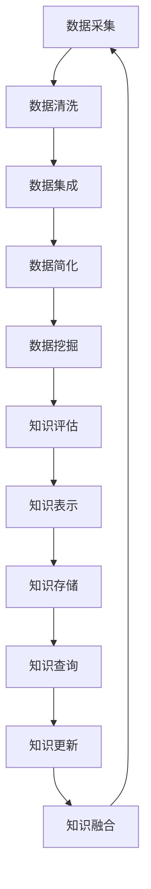

                 

### 《知识发现引擎的分布式架构设计与实现》

> 关键词：知识发现、分布式架构、数据存储、计算模型、性能优化、实现与部署

> 摘要：本文旨在深入探讨知识发现引擎的分布式架构设计与实现，通过系统化的分析和讲解，帮助读者理解分布式知识发现引擎的核心概念、架构设计、关键算法及性能优化策略。本文将分为三个部分，分别介绍知识发现引擎概述与理论基础、分布式知识发现引擎架构设计以及分布式知识发现引擎实现与部署。通过本文的阅读，读者将全面掌握分布式知识发现引擎的设计与实现方法，为实际项目开发提供有力支持。

### 第一部分：知识发现引擎概述与理论基础

#### 第1章：知识发现概述

##### 1.1 知识发现的概念与背景

知识发现（Knowledge Discovery in Databases，KDD）是指从大量数据中提取出潜在有用知识的过程。它是一个跨学科领域，结合了数据库、人工智能、统计学、机器学习等多个领域的理论和技术。KDD 的目标是从原始数据中挖掘出隐含的、未知的、有价值的模式和关联性，以便为决策提供支持。

知识发现的过程通常包括以下几个阶段：

1. 数据清洗：去除噪声和不完整的数据，保证数据质量。
2. 数据集成：将来自多个源的数据整合在一起。
3. 数据简化：通过降维、采样等方法减少数据规模。
4. 数据挖掘：运用算法从数据中提取模式和关联性。
5. 知识评估：对挖掘出的模式进行评估，确定其价值和可靠性。

知识发现的应用领域非常广泛，包括商业智能、金融市场分析、医疗健康、社会网络分析、生物信息学等。随着数据量的爆炸式增长，知识发现技术在现代社会中发挥着越来越重要的作用。

##### 1.2 知识发现的应用领域

知识发现的应用领域涵盖了众多行业和领域，以下是一些典型的应用场景：

1. **商业智能**：通过分析销售数据、客户行为等，为企业提供决策支持，优化营销策略和产品定价。
2. **金融分析**：识别市场趋势、风险评估、欺诈检测等，帮助金融机构提高运营效率和风险管理。
3. **医疗健康**：通过分析电子健康记录、基因组数据等，发现疾病关联性、预测疾病趋势，为个性化医疗提供支持。
4. **社会网络分析**：分析社交网络中的关系结构、群体行为等，帮助了解社会现象和趋势。
5. **生物信息学**：从大规模基因组数据中挖掘基因关联性、药物反应等，为生物科学研究提供支持。

##### 1.3 知识发现的重要性

知识发现的重要性体现在以下几个方面：

1. **信息转化**：将海量数据转化为可操作的知识和智慧，为决策提供支持。
2. **提高效率**：自动化地识别数据中的模式和关联性，减少人工分析的工作量。
3. **数据驱动的决策**：基于数据挖掘的结果，帮助企业制定更为精准和高效的策略。
4. **创新发现**：通过挖掘未知的信息和关联，推动科学研究和技术创新。

##### 1.4 知识发现的挑战

尽管知识发现技术取得了显著进展，但仍然面临着一系列挑战：

1. **数据复杂性**：随着数据来源、数据类型的多样化，数据复杂性不断增加，如何有效地处理和分析这些数据成为一大挑战。
2. **计算资源限制**：大规模数据处理需要大量的计算资源，如何在有限的计算资源下高效地完成数据挖掘任务是一个关键问题。
3. **算法选择与优化**：不同应用场景下需要选择合适的算法，并对算法进行优化，以提高挖掘效率和准确性。
4. **数据隐私与安全**：在数据挖掘过程中，如何保护用户隐私和数据安全是亟待解决的问题。

#### 第2章：分布式系统基础

##### 2.1 分布式系统概述

分布式系统（Distributed System）是指由多个独立的计算机节点组成，通过网络互联，协同完成任务的系统。这些节点可以位于同一物理位置，也可以分布在不同地理位置。分布式系统的目标是提高系统的可用性、扩展性和性能。

分布式系统的基本组成包括：

1. **节点**：构成分布式系统的计算机节点，可以是物理服务器或虚拟机。
2. **通信网络**：连接各节点的通信网络，可以是局域网、广域网或互联网。
3. **分布式算法**：用于实现分布式系统的控制、协调和数据处理的算法。

分布式系统与集中式系统的主要区别在于：

1. **数据分布**：分布式系统将数据分布在多个节点上，而集中式系统将数据存储在中心服务器上。
2. **任务分配**：分布式系统将任务分配到不同的节点上执行，而集中式系统通常由中心服务器统一处理。
3. **容错性**：分布式系统具有较高的容错性，节点故障不会导致整个系统瘫痪。

##### 2.2 分布式系统的优点与挑战

分布式系统具有以下优点：

1. **高可用性**：通过冗余节点和故障转移机制，提高系统的可用性和可靠性。
2. **可扩展性**：通过增加节点数量，可以水平扩展系统性能和容量。
3. **高性能**：数据分布在多个节点上，可以并行处理任务，提高系统的处理速度。
4. **灵活性**：分布式系统可以根据业务需求灵活调整节点数量和资源分配。

然而，分布式系统也面临一系列挑战：

1. **数据一致性**：分布式系统中，数据分布在多个节点上，如何保证数据的一致性是一个难题。
2. **容错性**：分布式系统中的节点故障可能导致部分数据丢失或系统瘫痪，如何确保系统的容错性是一个挑战。
3. **通信开销**：节点之间的通信可能导致系统性能下降，如何优化通信机制是一个关键问题。
4. **复杂性**：分布式系统的设计和实现相对复杂，需要解决数据分布、任务分配、故障处理等问题。

##### 2.3 分布式系统的基本架构

分布式系统的基本架构通常包括以下层次：

1. **物理层**：包括构成分布式系统的物理节点和网络设备。
2. **网络层**：实现节点之间的数据传输和通信，包括TCP/IP协议、DNS、负载均衡等。
3. **数据层**：包括分布式数据库、文件系统、分布式存储等，负责数据的管理和存储。
4. **应用层**：包括分布式应用系统、分布式算法和业务逻辑等，实现具体的功能和业务处理。
5. **管理层**：包括监控系统、运维工具、安全管理等，负责分布式系统的监控、维护和管理。

##### 2.4 分布式系统的设计与实现策略

分布式系统的设计与实现需要考虑以下几个方面：

1. **数据一致性策略**：包括强一致性、最终一致性、弱一致性等，根据业务需求选择合适的一致性模型。
2. **容错性策略**：包括副本机制、故障检测、故障恢复等，提高系统的容错能力和可靠性。
3. **负载均衡策略**：包括基于权重、地理位置、请求负载等因素的负载均衡算法，优化系统性能。
4. **通信优化策略**：包括数据压缩、网络拥塞控制、多路径传输等，减少通信开销，提高通信效率。
5. **安全性策略**：包括数据加密、访问控制、身份认证等，确保系统的安全性和隐私性。

### 第二部分：分布式知识发现引擎架构设计

#### 第3章：分布式数据存储与管理

##### 3.1 分布式数据存储技术

分布式数据存储技术是实现分布式知识发现引擎的基础，它包括以下几个方面：

1. **分布式文件系统**：如HDFS（Hadoop Distributed File System），它将大文件分割成小块，分布式存储在多个节点上，并提供高可靠性和高吞吐量的数据访问。
2. **分布式数据库**：如HBase、Cassandra等，它们支持海量数据的存储和实时访问，并提供分布式事务和一致性的支持。
3. **NoSQL数据库**：如MongoDB、Redis等，它们提供灵活的数据模型和高效的数据访问，适用于高速数据流和实时应用场景。

分布式数据存储技术的优点包括：

1. **高可用性**：通过冗余存储和数据复制，提高系统的可靠性和可用性。
2. **高性能**：通过数据分片和负载均衡，提高系统的吞吐量和性能。
3. **可扩展性**：通过水平扩展节点数量，支持大规模数据的存储和处理。

##### 3.2 分布式数据管理策略

分布式数据管理策略包括以下几个方面：

1. **数据分片**：将大数据集分割成多个小数据集，分布存储在多个节点上，以提高系统的并发能力和性能。
2. **负载均衡**：通过将数据均匀分布到多个节点上，优化系统的负载和性能。
3. **数据复制**：通过将数据复制到多个节点上，提高数据的可靠性和可用性。
4. **数据一致性和容错性**：通过一致性算法和故障恢复机制，确保数据的正确性和系统的稳定性。

##### 3.3 数据分片与负载均衡

数据分片和负载均衡是分布式数据存储和管理中非常重要的技术，它们的目标是：

1. **数据分片**：将大数据集分割成多个小数据集，分布存储在多个节点上，以提高系统的并发能力和性能。数据分片的方法包括范围分片、哈希分片、列表分片等。

2. **负载均衡**：通过将数据均匀分布到多个节点上，优化系统的负载和性能。负载均衡的方法包括基于权重、地理位置、请求负载等因素的算法，如轮询负载均衡、最小连接数负载均衡、最小响应时间负载均衡等。

数据分片和负载均衡的实现需要考虑以下几个方面：

1. **分片策略**：根据数据特点和业务需求选择合适的分片策略。
2. **路由策略**：通过路由算法将请求路由到正确的节点上。
3. **均衡算法**：通过均衡算法实现节点的负载均衡，提高系统的性能和稳定性。

##### 3.4 分布式数据库的选择与应用

分布式数据库的选择与应用是分布式知识发现引擎设计中的重要环节。以下是一些常见的分布式数据库及其特点：

1. **HBase**：
   - **特点**：基于HDFS的分布式NoSQL数据库，提供高吞吐量和低延迟的数据访问，适用于大规模结构化数据存储。
   - **应用场景**：适用于实时查询、大数据分析、搜索引擎等场景。

2. **Cassandra**：
   - **特点**：一个分布式宽列存储系统，提供高可用性、高性能和可扩展性，适用于大规模非结构化和半结构化数据存储。
   - **应用场景**：适用于社交网络、实时数据流处理、物联网等场景。

3. **MongoDB**：
   - **特点**：一个分布式文档数据库，提供灵活的数据模型和高效的文档存储，适用于高速数据流和实时应用场景。
   - **应用场景**：适用于实时数据分析、日志存储、内容管理系统等场景。

4. **Redis**：
   - **特点**：一个高速缓存数据库，提供内存级别的数据存储和快速数据访问，适用于高速缓存、实时数据处理等场景。
   - **应用场景**：适用于缓存系统、实时消息队列、实时数据统计等场景。

在选择分布式数据库时，需要考虑以下几个方面：

1. **数据一致性**：根据业务需求选择合适的一致性模型。
2. **性能和可扩展性**：根据数据规模和访问频率选择适合的数据库。
3. **功能特性**：根据业务需求选择具有所需功能特性的数据库。
4. **社区支持和生态**：考虑数据库的社区支持和生态系统的成熟度。

#### 第4章：分布式计算模型

##### 4.1 MapReduce计算模型

MapReduce是一种分布式计算模型，由Google提出并广泛应用于大数据处理领域。MapReduce模型将数据处理过程分为两个阶段：Map阶段和Reduce阶段。

1. **Map阶段**：
   - **输入**：输入数据被分割成多个小数据块，每个数据块由一个Map任务处理。
   - **处理**：Map任务对输入数据进行处理，生成中间键值对。
   - **输出**：中间键值对被写入本地磁盘，等待后续Reduce阶段处理。

2. **Reduce阶段**：
   - **输入**：中间键值对按键进行分组，每个分组由一个Reduce任务处理。
   - **处理**：Reduce任务对分组后的中间键值对进行聚合、统计等操作，生成最终输出结果。
   - **输出**：最终输出结果被写入磁盘或分布式文件系统。

MapReduce模型的优点包括：

1. **易用性**：通过简单的编程模型实现分布式数据处理，降低开发难度。
2. **可扩展性**：支持大规模数据处理，通过增加节点数量进行水平扩展。
3. **容错性**：通过任务重试和节点故障恢复机制，提高系统的可靠性。

##### 4.2 Spark计算模型

Spark是一个分布式计算框架，提供了丰富的计算模型和API，包括RDD（Resilient Distributed Dataset）、DataFrame和Dataset等。Spark的计算模型主要包括以下几种：

1. **RDD**：
   - **概念**：RDD是一种分布式的弹性数据集，支持高容错性和数据分区。
   - **操作**：包括创建操作、转换操作和行动操作。
   - **优点**：支持内存级别的数据处理，提高计算效率。

2. **DataFrame**：
   - **概念**：DataFrame是一种结构化的分布式数据集，提供了类似关系型数据库的表操作。
   - **操作**：包括创建操作、转换操作和行动操作。
   - **优点**：提供了丰富的API，支持复杂的数据操作和SQL查询。

3. **Dataset**：
   - **概念**：Dataset是DataFrame的增强版，提供了类型安全和强类型的API。
   - **操作**：包括创建操作、转换操作和行动操作。
   - **优点**：提供了更高效和类型的API，提高开发效率和代码质量。

Spark的计算模型具有以下优点：

1. **内存计算**：通过内存级别的数据处理，提高计算效率和性能。
2. **丰富的API**：提供了多种API，支持复杂的数据处理和分析。
3. **高容错性**：通过数据分片和任务重试机制，提高系统的可靠性。
4. **易扩展性**：支持大规模数据处理，通过增加节点数量进行水平扩展。

##### 4.3 Flink计算模型

Flink是一个分布式流处理框架，提供了丰富的API和计算模型，包括DataStream API和Table API等。Flink的计算模型主要包括以下几种：

1. **DataStream API**：
   - **概念**：DataStream API是一种用于处理有界和无界数据流的编程模型。
   - **操作**：包括创建操作、转换操作和行动操作。
   - **优点**：支持实时数据流处理，提供高效和低延迟的处理能力。

2. **Table API**：
   - **概念**：Table API是一种基于关系代数的表操作编程模型，提供了类似SQL的查询能力。
   - **操作**：包括创建操作、转换操作和行动操作。
   - **优点**：提供了简洁和强大的查询能力，支持复杂的数据处理和分析。

3. **Flink SQL**：
   - **概念**：Flink SQL是一种基于SQL的查询编程模型，提供了类似关系型数据库的查询能力。
   - **操作**：包括创建操作、转换操作和行动操作。
   - **优点**：提供了易用和高效的查询能力，支持实时数据流处理。

Flink的计算模型具有以下优点：

1. **实时计算**：支持实时数据流处理，提供低延迟和高吞吐量的计算能力。
2. **高性能**：通过优化计算模型和执行计划，提高系统的性能和效率。
3. **易扩展性**：支持大规模数据处理，通过增加节点数量进行水平扩展。
4. **兼容性**：与现有的大数据生态系统和工具兼容，支持与Hadoop生态系统中的组件集成。

##### 4.4 分布式计算模型的比较与选择

分布式计算模型的选择取决于具体的业务需求和场景。以下是对MapReduce、Spark和Flink三种计算模型的比较：

1. **数据处理方式**：
   - **MapReduce**：基于批量数据处理，适用于离线数据处理场景。
   - **Spark**：基于内存计算，适用于离线数据处理和实时数据处理场景。
   - **Flink**：基于实时数据处理，适用于实时数据处理场景。

2. **性能和效率**：
   - **MapReduce**：适用于大规模数据处理，但性能较低，内存使用效率不高。
   - **Spark**：具有高效的内存计算能力，适用于高速数据流处理和大规模数据处理。
   - **Flink**：具有高效的实时数据处理能力，适用于实时数据处理和高速数据流处理。

3. **易用性**：
   - **MapReduce**：编程模型较为简单，但开发过程较为复杂。
   - **Spark**：提供了丰富的API和工具，易于开发和部署。
   - **Flink**：提供了灵活和易用的API，支持复杂的数据处理和分析。

4. **生态和兼容性**：
   - **MapReduce**：与Hadoop生态系统紧密集成，兼容性较好。
   - **Spark**：与Hadoop生态系统紧密集成，支持与Hive、HBase等组件的集成。
   - **Flink**：与Hadoop生态系统紧密集成，支持与Apache Flink生态系统中的组件集成。

在选择分布式计算模型时，需要综合考虑业务需求、数据处理方式、性能和效率、易用性和生态兼容性等因素。

#### 第5章：分布式知识提取算法

##### 5.1 数据挖掘算法在分布式系统中的实现

数据挖掘算法在分布式系统中的实现是分布式知识发现引擎的核心，以下是一些常见的数据挖掘算法及其在分布式系统中的实现：

1. **关联规则挖掘**：
   - **算法原理**：通过分析数据项之间的关联性，发现频繁出现的关联规则。
   - **分布式实现**：将数据集分割成多个子集，并行计算每个子集中的关联规则，最后进行全局合并。

2. **分类算法**：
   - **算法原理**：通过学习历史数据，建立分类模型，对新数据进行分类预测。
   - **分布式实现**：将数据集分割成多个子集，分别训练分类模型，最后进行全局合并和模型优化。

3. **聚类算法**：
   - **算法原理**：通过无监督学习，将相似的数据点划分为一组，形成聚类。
   - **分布式实现**：将数据集分割成多个子集，分别执行聚类算法，最后进行全局合并。

4. **异常检测**：
   - **算法原理**：通过检测数据中的异常行为，发现潜在的安全问题和异常情况。
   - **分布式实现**：将数据集分割成多个子集，分别执行异常检测算法，最后进行全局合并和综合分析。

在分布式系统中实现数据挖掘算法需要考虑以下几个方面：

1. **数据分片**：根据数据特点和算法需求，合理划分数据集，实现并行处理。
2. **任务分配**：根据节点的计算能力和数据依赖关系，合理分配任务，优化系统性能。
3. **全局合并**：在分布式任务完成后，对结果进行全局合并和处理，得到最终的挖掘结果。
4. **容错性和容灾性**：设计合理的容错和容灾机制，确保系统的可靠性和数据安全性。

##### 5.2 分布式协同过滤算法

协同过滤（Collaborative Filtering）是一种常见的数据挖掘算法，用于预测用户对未知物品的兴趣评分。分布式协同过滤算法在分布式系统中实现，以提高系统的处理能力和性能。

1. **基于用户的协同过滤（User-Based Collaborative Filtering）**：
   - **算法原理**：根据用户之间的相似度，推荐与目标用户相似的其他用户喜欢的物品。
   - **分布式实现**：将用户数据分割成多个子集，分别计算用户之间的相似度矩阵，最后进行全局合并和推荐。

2. **基于物品的协同过滤（Item-Based Collaborative Filtering）**：
   - **算法原理**：根据物品之间的相似度，推荐与目标物品相似的物品。
   - **分布式实现**：将物品数据分割成多个子集，分别计算物品之间的相似度矩阵，最后进行全局合并和推荐。

分布式协同过滤算法的优点包括：

1. **高并发处理能力**：通过分布式计算，提高系统的并发处理能力和性能。
2. **可扩展性**：支持大规模用户和物品数据的处理，通过增加节点数量进行水平扩展。
3. **实时推荐**：支持实时数据流处理和实时推荐，提高用户体验。

##### 5.3 分布式聚类算法

聚类算法是一种无监督学习方法，用于将相似的数据点划分为一组。分布式聚类算法在分布式系统中实现，以提高系统的处理能力和性能。

1. **基于密度的聚类算法**：
   - **算法原理**：通过密度高低的判断，将数据点划分为多个簇。
   - **分布式实现**：将数据集分割成多个子集，分别执行基于密度的聚类算法，最后进行全局合并。

2. **基于划分的聚类算法**：
   - **算法原理**：通过划分策略，将数据点划分为多个簇。
   - **分布式实现**：将数据集分割成多个子集，分别执行基于划分的聚类算法，最后进行全局合并。

3. **基于层次的聚类算法**：
   - **算法原理**：通过层次结构，将数据点划分为多个簇。
   - **分布式实现**：将数据集分割成多个子集，分别执行基于层次的聚类算法，最后进行全局合并。

分布式聚类算法的优点包括：

1. **高并发处理能力**：通过分布式计算，提高系统的并发处理能力和性能。
2. **可扩展性**：支持大规模数据集的处理，通过增加节点数量进行水平扩展。
3. **实时聚类**：支持实时数据流处理和实时聚类，提高系统的响应速度。

##### 5.4 分布式关联规则挖掘算法

关联规则挖掘算法是一种用于发现数据项之间关联性的数据挖掘算法。分布式关联规则挖掘算法在分布式系统中实现，以提高系统的处理能力和性能。

1. **算法原理**：
   - **支持度**：一个规则的支持度是指包含该规则的数据项在所有数据项中所占的比例。
   - **置信度**：一个规则的置信度是指在购买物品A的顾客中，同时购买物品B的顾客所占的比例。

2. **分布式实现**：
   - **分治策略**：将数据集分割成多个子集，分别计算每个子集中的支持度和置信度，最后进行全局合并和规则生成。
   - **并行化处理**：利用多线程或分布式计算框架，并行计算每个子集中的支持度和置信度。

分布式关联规则挖掘算法的优点包括：

1. **高并发处理能力**：通过分布式计算，提高系统的并发处理能力和性能。
2. **可扩展性**：支持大规模数据集的处理，通过增加节点数量进行水平扩展。
3. **实时挖掘**：支持实时数据流处理和实时关联规则挖掘，提高系统的响应速度。

#### 第6章：分布式知识表示与存储

##### 6.1 分布式知识库构建

分布式知识库构建是分布式知识发现引擎的重要组成部分，它涉及以下几个方面：

1. **知识抽取**：从原始数据中提取结构化和非结构化的知识，包括实体、关系、属性等。
2. **知识融合**：将来自不同数据源的知识进行整合和融合，消除冗余和冲突。
3. **知识规范化**：对知识进行规范化处理，统一数据格式和术语，提高知识的可重用性和可扩展性。

分布式知识库构建的步骤包括：

1. **数据采集**：从各种数据源采集原始数据，包括关系数据库、NoSQL数据库、文件系统等。
2. **数据预处理**：对原始数据进行清洗、去噪、归一化等处理，提高数据质量。
3. **知识抽取**：采用文本挖掘、自然语言处理、数据挖掘等技术，从预处理后的数据中提取结构化和非结构化的知识。
4. **知识融合**：对提取的知识进行融合和整合，消除冗余和冲突，构建统一的知识库。
5. **知识存储**：将融合后的知识存储到分布式知识库中，提供高效的数据查询和访问能力。

##### 6.2 分布式知识库管理

分布式知识库管理包括以下几个方面：

1. **知识库存储**：采用分布式存储技术，将知识库存储在多个节点上，提高数据的可靠性和可用性。
2. **知识库查询**：提供高效的查询机制，支持复杂的查询条件和组合查询。
3. **知识库更新**：支持知识的动态更新和版本管理，确保知识库的实时性和准确性。
4. **知识库维护**：定期对知识库进行维护和优化，包括数据清洗、去噪、归一化等操作。

分布式知识库管理的挑战包括：

1. **数据一致性**：在分布式系统中，如何保证知识库中的数据一致性是一个关键问题。
2. **数据可靠性**：在分布式系统中，如何确保数据的可靠性和安全性是一个挑战。
3. **数据访问性能**：如何优化分布式知识库的查询性能，提高数据访问速度。
4. **知识库扩展性**：如何支持大规模数据集和海量知识的存储和处理。

##### 6.3 分布式知识库查询优化

分布式知识库查询优化是提高知识库查询性能的关键，以下是一些常见的优化策略：

1. **索引技术**：采用索引技术，提高数据查询的效率。常见的索引技术包括B树索引、哈希索引、全文索引等。

2. **查询优化器**：设计高效的查询优化器，对查询语句进行优化，生成最优的查询执行计划。查询优化器可以采用代价模型、启发式算法等技术。

3. **分区策略**：根据数据的分布特点和查询模式，设计合理的分区策略，优化查询性能。常见的分区策略包括基于范围、基于哈希、基于列表等。

4. **数据压缩**：采用数据压缩技术，减少数据存储和传输的开销。常见的数据压缩算法包括Huffman编码、LZ77、LZ78等。

5. **并行处理**：利用分布式计算框架，实现并行查询和计算，提高查询性能。常见的并行处理技术包括MapReduce、Spark等。

6. **缓存机制**：利用缓存技术，减少对磁盘的访问次数，提高查询性能。常见的缓存机制包括内存缓存、分布式缓存等。

通过以上优化策略，可以有效提高分布式知识库的查询性能，满足大规模数据集和复杂查询需求。

##### 6.4 分布式知识库的扩展性与可扩展性

分布式知识库的扩展性与可扩展性是确保系统长期稳定运行和适应未来需求的关键。以下是一些关键的考虑因素：

1. **横向扩展**：支持增加节点数量进行水平扩展，以处理不断增加的数据量和查询负载。横向扩展可以通过分布式存储和计算框架实现，如Hadoop、Spark、Flink等。

2. **纵向扩展**：支持增加节点的计算能力和存储容量进行垂直扩展，以提升系统的处理能力和性能。纵向扩展可以通过升级硬件设备、增加内存、存储容量等实现。

3. **负载均衡**：通过负载均衡技术，合理分配查询和计算任务到各个节点上，确保系统的负载均衡和性能。常见的负载均衡技术包括基于权重、地理位置、请求负载等因素的算法。

4. **动态调整**：支持根据系统负载和性能指标，动态调整节点数量和资源配置，以适应实时变化的需求。通过监控和调度机制，实现系统的动态调整和优化。

5. **弹性扩展**：支持系统在面临突发负载和高峰期时，自动扩展资源和调整性能，以保障系统的稳定性和可靠性。常见的弹性扩展技术包括云服务、容器编排等。

通过以上扩展性与可扩展性策略，分布式知识库可以适应不断变化的需求，提供高效的查询和数据处理能力。

### 第三部分：分布式知识发现引擎实现与部署

#### 第7章：分布式知识发现引擎性能优化

##### 7.1 性能优化策略

分布式知识发现引擎的性能优化是确保系统高效运行的关键，以下是一些常见的性能优化策略：

1. **数据分片与负载均衡**：合理划分数据分片，实现负载均衡，确保数据均匀分布在各个节点上，提高系统的并发能力和处理速度。

2. **缓存技术**：利用缓存技术，减少对磁盘的访问次数，提高数据查询和处理的效率。常见的缓存技术包括内存缓存、分布式缓存等。

3. **数据压缩**：采用数据压缩技术，减少数据存储和传输的开销，提高系统性能。常见的数据压缩算法包括Huffman编码、LZ77、LZ78等。

4. **并行处理**：利用分布式计算框架，实现并行查询和计算，提高系统的处理能力和性能。常见的并行处理技术包括MapReduce、Spark等。

5. **查询优化器**：设计高效的查询优化器，对查询语句进行优化，生成最优的查询执行计划，提高查询性能。

6. **索引技术**：采用索引技术，提高数据查询的效率。常见的索引技术包括B树索引、哈希索引、全文索引等。

7. **系统监控与调优**：通过系统监控和性能分析工具，实时监控系统的性能指标，发现性能瓶颈，并进行针对性优化。

##### 7.2 系统调优方法

系统调优是分布式知识发现引擎性能优化的重要环节，以下是一些常见的系统调优方法：

1. **性能测试**：通过性能测试工具，对系统进行压力测试和负载测试，模拟实际运行环境，发现性能瓶颈和问题。

2. **性能分析**：通过性能分析工具，对系统的运行状况进行监控和诊断，分析性能指标，定位瓶颈和优化点。

3. **代码优化**：对系统中的关键代码进行优化，减少不必要的计算和资源消耗，提高系统性能。

4. **配置调整**：根据系统运行环境，调整系统配置参数，如缓存大小、线程数量、连接池大小等，优化系统性能。

5. **硬件优化**：根据系统需求，选择合适的硬件设备，如更快的CPU、更多的内存、更快的网络等，提高系统性能。

6. **集群优化**：对分布式系统的集群架构进行优化，如负载均衡、节点调整、网络优化等，提高系统的整体性能。

##### 7.3 案例分析：性能优化实践

以下是一个分布式知识发现引擎性能优化的实际案例：

**问题**：一个分布式知识发现引擎在处理大规模数据集时，查询响应速度较慢，存在性能瓶颈。

**分析**：
1. **性能测试**：通过性能测试工具，发现查询响应速度较慢的主要原因是数据分片不均匀，导致部分节点负载较高。
2. **性能分析**：通过性能分析工具，发现查询执行过程中，部分SQL语句的执行计划不够优化，存在查询次数过多、连接池使用不充分等问题。
3. **代码优化**：对关键代码进行优化，减少不必要的计算和资源消耗，如减少循环次数、使用缓存等。
4. **配置调整**：调整系统配置参数，如增加缓存大小、调整线程数量、连接池大小等。
5. **硬件优化**：升级硬件设备，如增加内存、更快的CPU等。

**解决方案**：
1. **数据分片优化**：重新划分数据分片，实现负载均衡，确保数据均匀分布在各个节点上。
2. **查询优化**：优化SQL语句的执行计划，减少查询次数，提高查询性能。
3. **代码优化**：对关键代码进行优化，减少不必要的计算和资源消耗。
4. **配置调整**：根据系统运行环境，调整系统配置参数。
5. **硬件优化**：升级硬件设备，提高系统性能。

通过以上优化措施，分布式知识发现引擎的查询响应速度得到显著提升，解决了性能瓶颈问题。

##### 7.4 可扩展性优化策略

分布式知识发现引擎的可扩展性优化是确保系统能够适应不断增长的数据和查询需求的关键。以下是一些常见的可扩展性优化策略：

1. **水平扩展**：通过增加节点数量，实现系统规模的横向扩展，以处理更多的数据和查询负载。水平扩展可以通过分布式存储和计算框架实现，如Hadoop、Spark、Flink等。

2. **垂直扩展**：通过增加节点的计算能力和存储容量，实现系统规模的纵向扩展，以提高系统的处理能力和性能。垂直扩展可以通过升级硬件设备、增加内存、存储容量等实现。

3. **负载均衡**：通过负载均衡技术，合理分配查询和计算任务到各个节点上，确保系统的负载均衡和性能。常见的负载均衡技术包括基于权重、地理位置、请求负载等因素的算法。

4. **动态调整**：支持根据系统负载和性能指标，动态调整节点数量和资源配置，以适应实时变化的需求。通过监控和调度机制，实现系统的动态调整和优化。

5. **弹性扩展**：支持系统在面临突发负载和高峰期时，自动扩展资源和调整性能，以保障系统的稳定性和可靠性。常见的弹性扩展技术包括云服务、容器编排等。

6. **分布式数据库扩展**：采用分布式数据库技术，支持海量数据的存储和查询，通过增加节点数量进行水平扩展。

通过以上可扩展性优化策略，分布式知识发现引擎可以适应不断变化的需求，提供高效的查询和数据处理能力。

#### 第8章：分布式知识发现引擎开发环境搭建

##### 8.1 开发环境需求

在搭建分布式知识发现引擎开发环境时，需要考虑以下需求：

1. **操作系统**：常见的操作系统包括Linux、Windows和macOS，建议选择Linux操作系统，以获得更好的性能和兼容性。
2. **硬件配置**：根据系统需求和实际应用场景，选择合适的硬件设备，包括CPU、内存、存储等。建议使用高性能服务器或云服务器，确保系统有足够的计算和存储资源。
3. **编程语言**：常见的编程语言包括Java、Python、Scala等，根据项目需求和团队技能选择合适的编程语言。
4. **开发工具**：常见的开发工具包括IDE（如Eclipse、IntelliJ IDEA等）、版本控制工具（如Git）、数据库管理工具（如MySQL Workbench、DBeaver等）。
5. **依赖库和框架**：根据项目需求，选择合适的依赖库和框架，如Hadoop、Spark、Flink等分布式计算框架。

##### 8.2 系统软件安装与配置

在搭建分布式知识发现引擎开发环境时，需要安装和配置以下系统软件：

1. **操作系统**：安装Linux操作系统，如Ubuntu、CentOS等。
2. **Java环境**：安装Java运行环境（JDK），设置环境变量，如`JAVA_HOME`和`PATH`。
3. **数据库**：安装分布式数据库，如HBase、Cassandra等，配置数据库连接和权限。
4. **分布式计算框架**：安装分布式计算框架，如Hadoop、Spark、Flink等，配置计算节点和分布式存储。
5. **开发工具**：安装IDE、版本控制工具等，配置项目依赖库和框架。
6. **网络配置**：配置网络环境，确保各节点之间可以正常通信。

##### 8.3 开发工具与框架介绍

在搭建分布式知识发现引擎开发环境时，需要使用以下开发工具和框架：

1. **IDE**：常见的IDE包括Eclipse、IntelliJ IDEA、Visual Studio Code等，提供代码编辑、调试、构建等功能。

2. **版本控制工具**：常见的版本控制工具包括Git、SVN等，用于管理代码版本和协作开发。

3. **分布式计算框架**：
   - **Hadoop**：一个分布式计算框架，提供MapReduce编程模型和分布式存储（HDFS）。
   - **Spark**：一个分布式计算框架，提供RDD、DataFrame、Dataset等编程模型，支持内存计算。
   - **Flink**：一个分布式计算框架，提供DataStream API和Table API，支持实时数据处理。

4. **数据库**：
   - **HBase**：一个分布式NoSQL数据库，提供高吞吐量和低延迟的数据访问。
   - **Cassandra**：一个分布式宽列存储系统，提供高可用性、高性能和可扩展性。
   - **MongoDB**：一个分布式文档数据库，提供灵活的数据模型和高效的文档存储。

通过以上开发工具和框架，可以搭建一个功能强大的分布式知识发现引擎开发环境，支持大规模数据集和复杂查询的处理。

#### 第9章：分布式知识发现引擎实现细节

##### 9.1 数据存储与加载

分布式知识发现引擎的数据存储与加载是整个系统的关键环节，以下是一些实现细节：

1. **数据存储**：
   - **HDFS**：使用Hadoop Distributed File System（HDFS）作为分布式文件存储系统，将数据分割成块（默认128MB或256MB），分布存储在多个节点上。
   - **HBase**：使用HBase作为分布式NoSQL数据库，将结构化数据存储在表中，提供高效的数据查询和访问。
   - **Cassandra**：使用Cassandra作为分布式宽列存储系统，将非结构化和半结构化数据存储在表中，提供高可用性和高性能。

2. **数据加载**：
   - **文件加载**：使用HDFS命令或编程接口，将本地文件或远程文件上传到HDFS中。
   - **数据库加载**：使用分布式计算框架（如Hadoop、Spark、Flink）的API，将数据库中的数据导入到HBase或Cassandra中。

3. **数据分区与分片**：根据数据特点和查询模式，对数据进行分区与分片，实现负载均衡和高效查询。

4. **数据压缩**：采用数据压缩技术，如Gzip、LZO等，减少数据存储和传输的开销，提高系统性能。

5. **数据清洗与预处理**：在数据加载过程中，对数据进行清洗和预处理，包括去噪、去重复、归一化等操作，提高数据质量和准确性。

##### 9.2 分布式计算流程

分布式知识发现引擎的计算流程包括以下几个步骤：

1. **数据输入**：从分布式数据存储系统中读取数据，如HDFS、HBase、Cassandra等。

2. **数据预处理**：对输入数据进行预处理，包括去噪、去重复、归一化等操作，提高数据质量和准确性。

3. **数据分片**：根据数据特点和查询模式，将数据分片，实现负载均衡和高效查询。

4. **数据计算**：使用分布式计算框架（如Hadoop、Spark、Flink）的API，执行数据挖掘算法和计算任务，如分类、聚类、关联规则挖掘等。

5. **数据合并**：将分布式计算任务的结果进行合并，得到最终输出结果。

6. **数据存储**：将计算结果存储到分布式数据存储系统中，如HBase、Cassandra等。

7. **性能监控与优化**：实时监控系统的性能指标，如CPU、内存、网络等，发现性能瓶颈并进行优化。

通过以上分布式计算流程，可以实现大规模数据集的高效处理和计算，满足复杂查询需求。

##### 9.3 知识提取与表示

知识提取与表示是分布式知识发现引擎的核心环节，以下是一些实现细节：

1. **知识提取**：
   - **数据挖掘算法**：采用常见的数据挖掘算法，如分类、聚类、关联规则挖掘等，从数据中提取潜在的知识。
   - **协同过滤算法**：采用基于用户的协同过滤算法和基于物品的协同过滤算法，预测用户对未知物品的兴趣评分。
   - **聚类算法**：采用常见的聚类算法，如K-means、DBSCAN等，将相似的数据点划分为一组。

2. **知识表示**：
   - **知识库构建**：将提取的知识存储到知识库中，如HBase、Cassandra等，提供高效的查询和访问能力。
   - **知识表示形式**：将知识表示为三元组（主体、关系、客体），或者使用图形数据库存储知识，实现知识的图形化表示。

3. **知识融合与整合**：将来自不同数据源的知识进行融合和整合，消除冗余和冲突，构建统一的知识库。

4. **知识更新与维护**：支持知识的动态更新和版本管理，确保知识库的实时性和准确性。

通过以上知识提取与表示方法，可以实现分布式知识发现引擎的知识提取、表示和存储，提供高效的知识查询和挖掘能力。

##### 9.4 知识库构建与查询

知识库构建与查询是分布式知识发现引擎的重要组成部分，以下是一些实现细节：

1. **知识库构建**：
   - **数据源连接**：连接分布式数据存储系统，如HDFS、HBase、Cassandra等，读取数据。
   - **数据预处理**：对输入数据进行预处理，包括去噪、去重复、归一化等操作，提高数据质量和准确性。
   - **知识提取**：采用数据挖掘算法和协同过滤算法，从数据中提取潜在的知识。
   - **知识表示**：将提取的知识表示为三元组或图形化表示，存储到知识库中。

2. **知识库查询**：
   - **查询接口**：提供高效的查询接口，支持各种查询方式和查询条件。
   - **查询优化**：采用查询优化技术，如索引、缓存、并行查询等，提高查询性能。
   - **查询结果处理**：对查询结果进行整理和输出，支持图形化展示和文本化展示。

3. **知识库维护**：
   - **数据更新**：支持知识的动态更新，确保知识库的实时性和准确性。
   - **版本管理**：支持知识库的版本管理，记录知识库的历史版本，方便回滚和追溯。
   - **权限控制**：实现知识库的访问控制和权限管理，确保知识库的安全性。

通过以上知识库构建与查询方法，可以实现分布式知识发现引擎的高效知识库构建和查询，提供强大的知识查询和挖掘能力。

#### 第10章：分布式知识发现引擎部署与运维

##### 10.1 部署策略

分布式知识发现引擎的部署策略是确保系统稳定运行和高效处理的关键，以下是一些常见的部署策略：

1. **水平扩展部署**：通过增加节点数量进行水平扩展，以处理不断增加的数据和查询负载。水平扩展可以通过分布式计算框架（如Hadoop、Spark、Flink）实现。

2. **垂直扩展部署**：通过增加节点的计算能力和存储容量进行垂直扩展，以提高系统的处理能力和性能。垂直扩展可以通过升级硬件设备、增加内存、存储容量等实现。

3. **主从部署**：将系统划分为主节点和从节点，主节点负责协调和管理，从节点负责数据存储和处理。主从部署可以提高系统的可靠性和容错性。

4. **多租户部署**：将系统划分为多个租户，每个租户拥有独立的资源和计算环境。多租户部署可以提高系统的资源利用率和安全性。

5. **混合部署**：结合水平扩展和垂直扩展，根据实际需求选择合适的部署策略。混合部署可以灵活应对不同的业务场景和需求。

##### 10.2 运维管理

分布式知识发现引擎的运维管理是确保系统稳定运行和高效维护的关键，以下是一些常见的运维管理任务：

1. **监控与报警**：通过监控系统（如Zabbix、Prometheus等）实时监控系统的性能指标和运行状态，发现异常并触发报警。

2. **日志管理**：收集和管理系统日志，包括系统运行日志、错误日志、调试日志等，支持日志查询和日志分析。

3. **性能调优**：定期对系统进行性能调优，包括调整系统配置参数、优化查询语句、调整节点资源分配等。

4. **备份与恢复**：定期备份数据库和系统配置，确保数据的可靠性和系统的可恢复性。

5. **安全性管理**：实现系统的安全性和数据保护，包括访问控制、加密传输、安全审计等。

6. **运维自动化**：通过运维自动化工具（如Ansible、Chef等），实现系统的自动化部署、配置管理和维护。

通过以上运维管理任务，可以确保分布式知识发现引擎的稳定运行和高效维护。

##### 10.3 故障处理与监控

分布式知识发现引擎在运行过程中可能会遇到各种故障，以下是一些常见的故障处理和监控方法：

1. **故障检测**：通过监控系统实时检测系统的运行状态，发现异常情况并触发报警。

2. **故障定位**：根据监控系统提供的报警信息和日志信息，定位故障发生的节点和原因。

3. **故障恢复**：根据故障类型和影响范围，采取相应的故障恢复措施，如重启节点、重试任务、数据恢复等。

4. **故障预防**：通过定期系统检查、优化配置、更新软件等手段，预防故障的发生。

5. **监控指标**：监控关键性能指标（如CPU利用率、内存使用率、网络吞吐量等），及时发现和处理性能瓶颈。

6. **日志分析**：分析系统日志和错误日志，查找故障发生的原因和规律，制定相应的预防措施。

通过以上故障处理和监控方法，可以确保分布式知识发现引擎的稳定性和可靠性。

##### 10.4 安全性与隐私保护

分布式知识发现引擎的安全性是确保数据安全、保护用户隐私的关键，以下是一些常见的安全性和隐私保护策略：

1. **数据加密**：对敏感数据进行加密存储和传输，确保数据在存储和传输过程中的安全性。

2. **访问控制**：实现细粒度的访问控制机制，根据用户角色和权限限制访问数据。

3. **身份认证**：采用身份认证机制，确保用户身份的合法性和安全性，如密码认证、双因素认证等。

4. **安全审计**：记录系统操作日志和访问日志，实现安全审计，追踪和监控用户行为。

5. **数据备份**：定期备份数据库和系统配置，确保数据的可靠性和可恢复性。

6. **隐私保护**：遵循隐私保护法律法规，对用户数据进行匿名化和去标识化处理，保护用户隐私。

通过以上安全性和隐私保护策略，可以确保分布式知识发现引擎的安全性和用户隐私保护。

### 附录

#### 附录A：开源分布式知识发现引擎介绍

##### A.1 Apache Flink

Apache Flink 是一个分布式流处理框架，提供高效和低延迟的流数据处理能力。以下是其主要特点和应用场景：

1. **特点**：
   - **实时计算**：支持实时数据处理，提供低延迟和高吞吐量的计算能力。
   - **流与批处理统一**：支持流数据和批处理数据的统一处理，实现流与批处理的无缝集成。
   - **动态窗口计算**：支持动态窗口计算，提供灵活的时间窗口处理能力。
   - **分布式任务调度**：提供高效的分布式任务调度和资源管理，优化系统性能。

2. **应用场景**：
   - **实时数据分析**：用于实时监控、实时预测、实时推荐等场景，提供实时数据分析和决策支持。
   - **复杂事件处理**：用于复杂事件处理，支持实时事件触发、实时关联分析等。
   - **实时日志处理**：用于实时日志处理和日志分析，支持实时日志收集、实时错误诊断等。

##### A.2 Apache Spark

Apache Spark 是一个分布式计算框架，提供丰富的API和高效的数据处理能力。以下是其主要特点和应用场景：

1. **特点**：
   - **内存计算**：提供内存级别的数据处理能力，显著提高计算效率。
   - **丰富的API**：提供RDD、DataFrame、Dataset等丰富的API，支持各种数据处理和分析需求。
   - **支持多种数据源**：支持多种数据源，如HDFS、HBase、Cassandra、MongoDB等，实现数据的统一处理和访问。
   - **易用性和可扩展性**：提供易用和可扩展的编程模型，支持大规模数据处理和分布式计算。

2. **应用场景**：
   - **大数据分析**：用于大规模数据集的统计分析、机器学习、数据挖掘等场景。
   - **实时数据处理**：用于实时数据处理和实时推荐，提供低延迟和高吞吐量的计算能力。
   - **流处理**：用于实时流处理和实时事件处理，提供高效的实时数据处理能力。

##### A.3 Hadoop

Apache Hadoop 是一个分布式计算平台，提供高效的数据存储和处理能力。以下是其主要特点和应用场景：

1. **特点**：
   - **分布式存储**：提供分布式文件系统（HDFS），实现海量数据的分布式存储和管理。
   - **分布式计算**：提供MapReduce计算模型，实现大规模数据的分布式计算和处理。
   - **可扩展性**：支持节点数量的动态扩展，实现高性能和可扩展的分布式计算能力。
   - **高可用性**：通过冗余存储和故障转移机制，实现高可用性和数据可靠性。

2. **应用场景**：
   - **大数据处理**：用于大规模数据集的处理和分析，提供高效的分布式计算能力。
   - **数据处理和分析**：用于数据处理和数据分析，提供丰富的数据处理和分析工具。
   - **实时数据处理**：用于实时数据处理和实时监控，提供低延迟和高吞吐量的计算能力。

### 附录B：知识发现引擎的 Mermaid 流程图

知识发现引擎的 Mermaid 流程图可以帮助读者更直观地理解其工作流程。以下是一个示例流程图：

在这个流程图中，A代表数据采集，B代表数据清洗，C代表数据集成，D代表数据简化，E代表数据挖掘，F代表知识评估，G代表知识表示，H代表知识存储，I代表知识查询，J代表知识更新，K代表知识融合。流程图展示了知识发现引擎从数据采集到知识融合的整个过程，帮助读者更好地理解其工作原理和实现方法。

### 总结与展望

本文系统地介绍了知识发现引擎的分布式架构设计与实现，从知识发现概述、分布式系统基础、分布式知识发现引擎架构设计到实现与部署，全面探讨了分布式知识发现引擎的核心概念、关键算法和性能优化策略。通过本文的阅读，读者可以深入了解分布式知识发现引擎的设计与实现方法，为实际项目开发提供有力支持。

未来，分布式知识发现引擎将在以下几个方面取得进一步发展：

1. **智能化**：结合人工智能技术，实现自动化数据挖掘和智能决策支持，提高系统的智能化水平。

2. **实时性**：优化实时数据处理和实时知识提取算法，实现实时性更高的知识发现引擎。

3. **可扩展性**：通过分布式计算和存储技术的优化，提高系统的可扩展性和性能，支持更大规模的数据处理。

4. **安全性**：加强系统的安全性和隐私保护，确保数据安全和用户隐私。

5. **跨平台与跨语言支持**：提供跨平台和跨语言的API和SDK，实现更广泛的应用场景和开发体验。

总之，分布式知识发现引擎在未来的发展将为大数据分析和人工智能领域带来更多创新和突破。让我们共同期待分布式知识发现引擎的进一步发展，为人类社会的发展做出更大的贡献。

