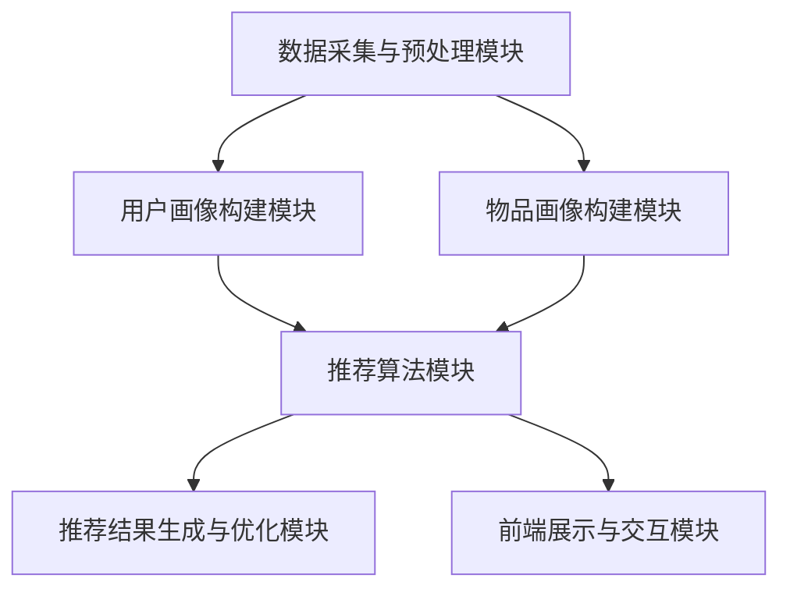
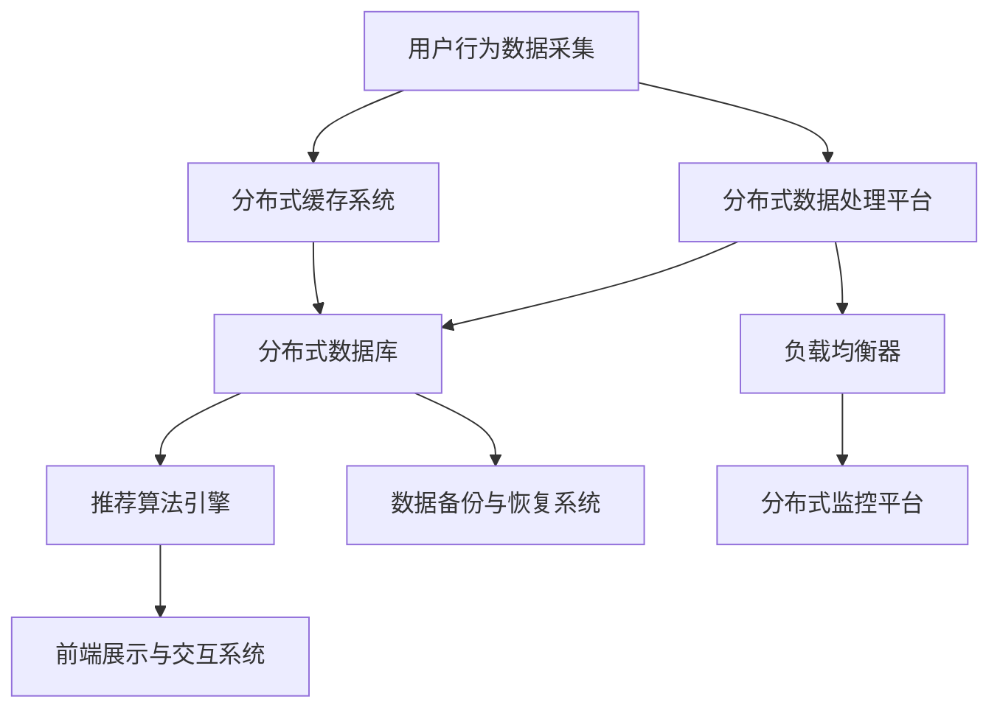

                 

# 《知识发现引擎的实时推荐系统设计》

## 关键词

- 知识发现引擎
- 实时推荐系统
- 数据采集与预处理
- 用户画像
- 物品画像
- 协同过滤
- 内容推荐
- 模型优化
- 多样性优化

## 摘要

本文旨在探讨知识发现引擎的实时推荐系统设计，深入分析实时推荐系统的架构设计、用户画像和物品画像构建方法、推荐算法模型选择与实现，以及实时推荐系统的优化方法。文章通过实践案例分析，展示了实时推荐系统在电商、社交媒体、金融、医疗和教育等领域的应用，并探讨了实时推荐系统的挑战与未来发展趋势。最后，文章提供了实时推荐系统的开发工具与资源，以及代码解读与分析。

## 第一部分：引言

### 1.1 书籍背景与目标

在当今信息爆炸的时代，如何从海量数据中快速、准确地发现有价值的信息成为了许多企业和个人面临的难题。知识发现引擎作为一种能够自动从大量数据中提取隐藏模式的工具，在数据挖掘和智能决策支持方面发挥了重要作用。而实时推荐系统作为知识发现引擎的重要组成部分，能够在用户行为发生的同时提供个性化的推荐，极大地提升了用户体验和商业价值。

本文的核心目标是系统地介绍知识发现引擎的实时推荐系统设计，包括其架构设计、用户画像与物品画像构建、推荐算法模型选择与实现，以及实时推荐系统的优化方法。通过本文的阅读，读者将能够理解实时推荐系统的核心概念与架构，掌握构建用户画像和物品画像的方法，了解各种推荐算法模型的原理与实现，并学会对实时推荐系统进行优化。

### 1.2 知识发现引擎概述

知识发现引擎（Knowledge Discovery Engine，KDE）是一种用于从大量数据中自动提取隐藏模式和知识的技术。其核心思想是通过数据挖掘和分析，从原始数据中发现有价值的模式和规律，从而为决策提供支持。知识发现引擎通常包括以下关键功能：

1. **数据采集**：从各种数据源（如数据库、文件、流数据等）中采集数据。
2. **数据预处理**：对采集到的数据进行清洗、转换和整合，以便后续分析。
3. **模式识别**：使用机器学习和统计分析方法从预处理后的数据中提取模式和知识。
4. **可视化与解释**：将提取出的模式以可视化形式呈现，并提供解释功能，以便用户理解。

知识发现引擎可以分为以下几类：

1. **统计型知识发现引擎**：主要通过统计分析方法（如聚类、分类、回归等）从数据中发现模式和知识。
2. **机器学习型知识发现引擎**：通过机器学习方法（如决策树、支持向量机、神经网络等）从数据中发现模式和知识。
3. **深度学习型知识发现引擎**：通过深度学习方法（如卷积神经网络、循环神经网络、生成对抗网络等）从数据中发现模式和知识。

知识发现引擎的发展历程可以追溯到20世纪80年代，随着计算机性能的提升和算法的进步，知识发现引擎在数据挖掘、商业智能、智能决策支持等领域得到了广泛应用。近年来，随着大数据和人工智能技术的迅猛发展，知识发现引擎的应用场景和功能也得到了进一步拓展。

### 1.3 实时推荐系统概述

实时推荐系统（Real-time Recommendation System）是一种能够根据用户实时行为动态生成个性化推荐的技术。与传统的批量推荐系统不同，实时推荐系统能够在用户行为发生的同时进行推荐，具有更高的响应速度和更低的延迟。实时推荐系统在电商、社交媒体、金融、医疗、教育等领域具有广泛的应用。

实时推荐系统通常包括以下核心要素：

1. **用户行为数据采集**：实时采集用户的浏览、购买、评价等行为数据。
2. **用户画像构建**：基于用户行为数据，构建用户的兴趣、偏好和需求等特征。
3. **物品画像构建**：基于物品的属性和标签，构建物品的特征和分类。
4. **推荐算法模型**：选择合适的推荐算法模型，如协同过滤、内容推荐和基于模型的推荐等。
5. **推荐结果生成与优化**：根据用户画像和物品画像，生成个性化的推荐结果，并进行实时性和多样性优化。

实时推荐系统的发展趋势体现在以下几个方面：

1. **算法优化与智能化**：不断优化推荐算法，提高推荐的准确性和多样性，实现更加智能化的推荐。
2. **多模态数据融合**：将文本、图像、音频等多种类型的数据进行融合，提升推荐的精准度。
3. **实时性提升**：通过分布式计算和边缘计算等技术，进一步提高系统的实时性和响应速度。
4. **个性化与智能化**：基于用户历史行为和实时反馈，实现更加个性化和智能化的推荐。

## 第二部分：实时推荐系统的设计与实现

### 2.1 实时推荐系统的架构设计

实时推荐系统的架构设计是整个系统设计的核心，它决定了系统的性能、可扩展性和可维护性。一个典型的实时推荐系统架构通常包括以下几个关键模块：

1. **数据采集与预处理模块**：负责从各种数据源采集用户行为数据和物品属性数据，并进行数据清洗、转换和整合，为后续分析提供高质量的数据。
2. **用户画像与物品画像构建模块**：基于用户行为数据和物品属性数据，构建用户的兴趣、偏好和需求等特征，以及物品的分类、标签等特征。
3. **推荐算法模块**：选择合适的推荐算法模型，根据用户画像和物品画像生成个性化的推荐结果。
4. **推荐结果生成与优化模块**：根据用户反馈和推荐效果，对推荐结果进行实时优化，提升推荐的准确性和多样性。
5. **前端展示与交互模块**：将推荐结果以可视化的形式呈现给用户，并提供用户交互接口。

下面将详细描述实时推荐系统的架构设计。

#### 2.1.1 系统总体架构设计

实时推荐系统的总体架构设计如图所示：

1. **数据采集与预处理模块**：该模块负责从各种数据源采集用户行为数据和物品属性数据。用户行为数据包括浏览、购买、评价等行为，物品属性数据包括物品的基本属性、分类、标签等。数据采集后，需要进行数据清洗、转换和整合，以确保数据的质量和一致性。常见的数据预处理方法包括去重、缺失值填充、数据格式转换等。

2. **用户画像构建模块**：基于用户行为数据，构建用户的兴趣、偏好和需求等特征。用户画像的构建过程通常包括以下步骤：

   - **行为数据采集**：实时采集用户的浏览、购买、评价等行为数据。
   - **行为数据预处理**：对采集到的行为数据进行清洗、转换和整合，得到高质量的用户行为数据。
   - **用户特征提取**：基于用户行为数据，提取用户的兴趣、偏好和需求等特征。常见的用户特征提取方法包括基于统计的方法（如统计用户的行为频率和平均评分等）和基于模型的方法（如聚类、协同过滤等）。
   - **用户标签生成**：将提取到的用户特征转化为用户标签，用于后续推荐算法的输入。

3. **物品画像构建模块**：基于物品属性数据，构建物品的分类、标签等特征。物品画像的构建过程通常包括以下步骤：

   - **属性数据采集**：实时采集物品的基本属性、分类、标签等数据。
   - **属性数据预处理**：对采集到的属性数据进行清洗、转换和整合，得到高质量的物品属性数据。
   - **物品特征提取**：基于物品属性数据，提取物品的分类、标签等特征。常见的物品特征提取方法包括基于统计的方法（如统计物品的标签频率和共现关系等）和基于模型的方法（如词嵌入、网络嵌入等）。
   - **物品标签生成**：将提取到的物品特征转化为物品标签，用于后续推荐算法的输入。

4. **推荐算法模块**：根据用户画像和物品画像，选择合适的推荐算法模型生成个性化的推荐结果。常见的推荐算法包括协同过滤、内容推荐和基于模型的推荐等。推荐算法的选择需要考虑推荐系统的性能、准确性、实时性等多方面因素。

5. **推荐结果生成与优化模块**：根据用户反馈和推荐效果，对推荐结果进行实时优化，提升推荐的准确性和多样性。常见的优化方法包括基于反馈的优化、基于多样性优化的方法等。

6. **前端展示与交互模块**：将推荐结果以可视化的形式呈现给用户，并提供用户交互接口。用户可以通过前端界面查看推荐结果，并可以提供反馈，如点击、收藏、评分等，这些反馈数据可以用于后续推荐算法的优化。

### 2.1.2 分布式系统设计

实时推荐系统通常需要处理海量数据和大规模并发请求，因此分布式系统设计是必不可少的。分布式系统设计需要考虑以下几个方面：

1. **数据存储与处理**：选择合适的数据存储和处理技术，如分布式数据库、分布式缓存、分布式消息队列等。常用的分布式数据库包括Hadoop、HBase、MongoDB等，分布式缓存包括Redis、Memcached等，分布式消息队列包括Kafka、RabbitMQ等。

2. **服务部署与监控**：将系统划分为多个服务模块，部署在多个节点上，以提高系统的可用性和性能。常见的部署方式包括容器化部署（如Docker、Kubernetes）和虚拟机部署。同时，需要搭建监控系统，实时监控系统的性能和健康状况，如CPU、内存、磁盘使用情况等。

3. **负载均衡**：通过负载均衡技术，将请求均匀分布到多个节点上，避免单点故障和高负载情况下的性能下降。常用的负载均衡技术包括轮询、随机、最小连接数等算法。

4. **容错机制**：在系统设计中加入容错机制，如故障转移、数据备份、故障恢复等，以确保系统的稳定性和可靠性。

### 2.1.3 分布式系统架构

实时推荐系统的分布式系统架构如图所示：

1. **用户行为数据采集**：实时采集用户的浏览、购买、评价等行为数据，并将其发送到分布式数据处理平台。

2. **分布式数据处理平台**：负责处理用户行为数据，包括数据清洗、转换和整合。处理后的数据存储到分布式数据库中。

3. **分布式缓存系统**：用于缓存用户画像和物品画像，提高系统查询性能。

4. **分布式数据库**：存储用户画像、物品画像和推荐结果等数据，支持分布式查询和事务处理。

5. **推荐算法引擎**：根据用户画像和物品画像，选择合适的推荐算法模型生成个性化的推荐结果。

6. **前端展示与交互系统**：将推荐结果以可视化的形式呈现给用户，并提供用户交互接口。

7. **负载均衡器**：将用户请求均匀分布到多个节点上，避免单点故障和高负载情况下的性能下降。

8. **数据备份与恢复系统**：对分布式数据库进行数据备份和恢复，确保数据的安全性和可靠性。

9. **分布式监控平台**：实时监控系统的性能和健康状况，如CPU、内存、磁盘使用情况等。

### 2.1.4 系统部署与运维

实时推荐系统的部署与运维是保证系统稳定运行的关键。以下是一些系统部署与运维的要点：

1. **自动化部署**：使用自动化工具（如Docker、Kubernetes）进行系统部署，提高部署效率，降低人工错误。

2. **持续集成与持续部署（CI/CD）**：实现代码的自动化测试、构建和部署，确保系统的高质量和高可用性。

3. **监控与报警**：使用监控工具（如Prometheus、Grafana）对系统进行实时监控，并设置报警规则，及时发现和解决问题。

4. **故障恢复与备份**：定期进行系统备份，并在故障发生时进行快速恢复。

5. **性能优化**：对系统进行性能优化，包括数据库优化、缓存策略优化、网络优化等，提高系统的响应速度和吞吐量。

## 2.2 用户画像构建方法

用户画像（User Profile）是实时推荐系统的重要输入，它能够反映用户的兴趣、偏好和需求等特征。构建高质量的用户画像能够提高推荐系统的准确性和个性

