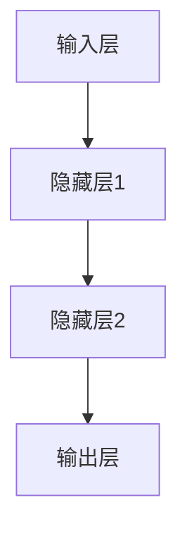
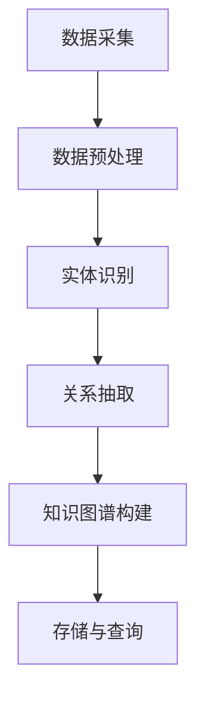

                 

### 文章标题

《知识发现引擎的深度学习技术应用》

### 关键词

- 深度学习
- 知识发现
- 知识图谱
- 知识表示
- 知识推理
- 知识可视化

### 摘要

本文深入探讨了知识发现引擎的深度学习技术应用。首先，我们回顾了知识发现引擎的定义、作用和其发展历程。随后，我们详细介绍了深度学习的基础理论，包括神经网络原理、深度学习算法及其常用框架。接下来，文章重点分析了深度学习在知识提取与表示、知识图谱构建、知识推理与关联、知识可视化与交互等环节中的应用。最后，通过实际项目案例展示了深度学习在知识发现引擎中的成功应用，并提供了一系列深度学习工具与资源的对比，以及开发环境搭建指南。本文旨在为读者提供一套系统、全面的知识发现引擎深度学习技术应用框架，助力其在相关领域的深入研究与实践。

### 《知识发现引擎的深度学习技术应用》目录大纲

#### 第一部分：知识发现引擎基础

##### 第1章：知识发现引擎概述

###### 1.1 知识发现引擎的定义与作用

知识发现引擎（Knowledge Discovery Engine，简称KDE）是近年来在人工智能领域崭露头角的一项核心技术。它通过智能化的方法，从大量数据中提取隐藏的、未知的、有价值的知识，为用户提供决策支持。KDE的应用领域广泛，包括商业智能、金融分析、医疗诊断、社会网络分析等。

首先，我们来看一下知识发现引擎的定义。知识发现引擎是指一种利用机器学习和数据挖掘技术，从大量数据中自动发现有用模式和知识的人工智能系统。它通常包括数据预处理、模式识别、知识提取、知识融合等模块。

接下来，我们讨论知识发现引擎的作用。知识发现引擎能够帮助企业和组织从海量数据中挖掘出有价值的信息，提高数据利用率，优化业务流程，提升决策质量。例如，在商业智能领域，KDE可以帮助企业分析销售数据，预测市场需求，优化库存管理；在医疗领域，KDE可以辅助医生进行疾病诊断，提高医疗效率。

最后，我们简要回顾知识发现引擎的发展历程。知识发现引擎的研究始于20世纪80年代，随着计算机技术和大数据技术的快速发展，KDE逐渐成为人工智能领域的重要研究方向。近年来，深度学习的兴起为知识发现引擎带来了新的契机，使其在数据处理、模式识别、知识提取等方面取得了显著进展。

##### 第2章：深度学习基础

###### 2.1 神经网络原理

神经网络（Neural Network，简称NN）是深度学习的基础。它模仿生物神经系统的工作原理，通过神经元之间的连接和信号传递来实现对数据的处理和识别。

首先，我们来看一下神经网络的组成。一个典型的神经网络包括输入层、隐藏层和输出层。输入层接收外部输入信息，隐藏层对输入信息进行加工处理，输出层生成最终输出结果。

接下来，我们讨论神经网络的训练过程。神经网络的训练过程主要包括前向传播和反向传播两个阶段。在前向传播阶段，输入数据从输入层经过隐藏层，最终到达输出层。在反向传播阶段，通过计算输出结果与实际结果的误差，调整神经元之间的权重，使神经网络逐渐逼近正确答案。

最后，我们简要介绍神经网络的几种常见架构。包括多层感知机（MLP）、卷积神经网络（CNN）、循环神经网络（RNN）等。这些架构在图像处理、语音识别、自然语言处理等领域有广泛应用。

##### 第3章：深度学习算法

深度学习算法是深度学习模型的核心。它通过构建多层次的神经网络，实现对复杂数据的自动特征提取和模式识别。

首先，我们来看一下深度学习算法的基本原理。深度学习算法通过学习大量数据，自动提取出高层次的抽象特征，从而实现对未知数据的分类、回归、生成等任务。

接下来，我们讨论几种常见的深度学习算法。包括：

- 卷积神经网络（CNN）：适用于图像处理和计算机视觉领域，通过卷积操作提取图像特征。
- 递归神经网络（RNN）：适用于序列数据处理和自然语言处理领域，通过循环结构处理序列数据。
- 长短时记忆网络（LSTM）：是RNN的一种改进，能够有效解决长序列依赖问题。
- 生成对抗网络（GAN）：适用于图像生成和风格迁移领域，通过对抗训练生成高质量图像。
- 自注意力机制（Self-Attention）：是近年来在自然语言处理领域取得重要突破的技术，能够有效捕捉文本中的长距离依赖关系。

最后，我们简要介绍深度学习算法的发展历程。从最初的简单多层感知机（MLP）到如今的卷积神经网络（CNN）、循环神经网络（RNN）、生成对抗网络（GAN）等，深度学习算法在图像处理、语音识别、自然语言处理等领域取得了显著的成果。

##### 第4章：深度学习框架

深度学习框架是深度学习模型实现的重要工具。它提供了高效的计算引擎、丰富的API接口和灵活的扩展能力，使得研究人员和开发者能够快速构建和训练深度学习模型。

首先，我们来看一下深度学习框架的基本原理。深度学习框架通过底层计算引擎实现高效的矩阵运算和并行计算，通过API接口提供简洁易用的编程接口，通过扩展能力支持自定义网络结构和算法。

接下来，我们讨论几种常见的深度学习框架。包括：

- TensorFlow：是由谷歌开发的开源深度学习框架，具有强大的计算引擎和丰富的API接口，广泛应用于图像处理、自然语言处理等领域。
- PyTorch：是由Facebook开发的开源深度学习框架，具有灵活的动态计算图和易用的API接口，广泛应用于计算机视觉、自然语言处理等领域。
- Keras：是TensorFlow和PyTorch的高级API接口，提供了更加简洁和易用的编程接口，适用于快速构建和训练深度学习模型。
- Caffe：是由伯克利大学开发的开源深度学习框架，适用于图像处理和计算机视觉领域，具有高效的计算性能和丰富的预训练模型。

最后，我们简要介绍深度学习框架的发展历程。从最初的简单矩阵运算工具到如今的复杂计算引擎和高级API接口，深度学习框架在性能和易用性方面取得了显著的提升。

#### 第二部分：深度学习在知识发现引擎中的应用

##### 第5章：知识提取与表示

知识提取与表示是知识发现引擎的核心环节。通过深度学习技术，可以从大量数据中自动提取出有价值的信息，并对其进行有效的表示。

首先，我们来看一下知识提取与表示的基本原理。知识提取是指从原始数据中提取出关键信息，包括文本、图像、音频等。知识表示是指将提取出的信息转换为计算机能够理解和处理的形式，如向量、图、矩阵等。

接下来，我们讨论几种常见的知识提取与表示方法。包括：

- 文本数据预处理：通过对文本进行分词、去停用词、词性标注等操作，将原始文本数据转换为计算机能够理解的格式。
- 词嵌入技术：将文本中的单词转换为固定长度的向量表示，从而实现文本数据的数值化。
- 知识表示方法：通过对提取出的知识进行编码和压缩，将其表示为更加紧凑和高效的格式，如稀疏矩阵、哈希表等。

最后，我们简要介绍知识提取与表示在知识发现引擎中的应用。知识提取与表示是知识发现引擎的基础，通过深度学习技术，可以实现对海量数据的快速处理和有效表示，从而提高知识发现的效果和效率。

##### 第6章：知识图谱构建

知识图谱（Knowledge Graph）是知识发现引擎的重要输出。它通过将海量数据中的实体、关系和属性进行结构化表示，为用户提供了一种高效的语义搜索和推理工具。

首先，我们来看一下知识图谱的基本概念。知识图谱是一种语义网络，由实体、关系和属性组成。实体是知识图谱中的基本元素，如人、地点、组织等；关系是实体之间的关联，如属于、位于、参与等；属性是实体的特征描述，如年龄、身高、职称等。

接下来，我们讨论知识图谱的构建方法。知识图谱的构建主要包括数据采集、实体识别、关系抽取、属性抽取等步骤。通过这些步骤，可以从原始数据中提取出实体、关系和属性，并构建出结构化的知识图谱。

最后，我们简要介绍知识图谱的应用场景。知识图谱在搜索引擎、推荐系统、智能问答、知识管理等领域有广泛应用。通过知识图谱，可以实现对海量数据的快速检索和高效推理，从而提高应用系统的性能和用户体验。

##### 第7章：知识推理与关联

知识推理与关联是知识发现引擎的高级功能。通过深度学习技术，可以从知识图谱中自动发现实体之间的关系和潜在关联，为用户提供更加智能化的知识服务。

首先，我们来看一下知识推理与关联的基本原理。知识推理是指根据已知的事实和规则，推断出新的结论和知识。知识关联是指发现实体之间可能存在的关联和关系，从而实现知识的扩展和深化。

接下来，我们讨论几种常见的知识推理与关联方法。包括：

- 知识推理算法：如基于规则的推理、基于概率的推理、基于贝叶斯网络的推理等，通过这些算法可以从知识图谱中自动发现新的知识。
- 关联规则挖掘：如Apriori算法、FP-Growth算法等，通过这些算法可以从交易数据、用户行为数据等中挖掘出实体之间的关联规则。
- 知识关联应用：如实体推荐、知识图谱可视化、语义搜索等，通过这些应用可以实现对知识图谱的深入理解和灵活运用。

最后，我们简要介绍知识推理与关联在知识发现引擎中的应用。知识推理与关联是知识发现引擎的核心，通过深度学习技术，可以实现对知识图谱的自动推理和关联，从而提高知识发现的效果和效率。

##### 第8章：知识可视化与交互

知识可视化与交互是知识发现引擎的人机交互界面。通过可视化技术和交互设计，可以将知识图谱中的复杂信息以直观、易理解的方式呈现给用户，提高用户对知识的理解和利用。

首先，我们来看一下知识可视化与交互的基本原理。知识可视化是指将知识图谱中的实体、关系和属性以图形、图像、表格等形式进行可视化呈现，使用户能够直观地理解和分析知识。知识交互是指用户与知识系统之间的交互过程，通过交互设计可以实现对知识的查询、搜索、推荐等操作。

接下来，我们讨论几种常见的知识可视化与交互技术。包括：

- 知识可视化技术：如图表、图像、热力图、网络图等，通过这些技术可以将知识图谱中的信息以直观、易理解的方式呈现。
- 知识交互设计：如搜索框、推荐系统、问答系统等，通过这些设计可以提供灵活、便捷的知识查询和操作方式。

最后，我们简要介绍知识可视化与交互在知识发现引擎中的应用。知识可视化与交互是知识发现引擎的重要组成部分，通过深度学习技术，可以实现对知识图谱的自动推理和关联，从而提高知识发现的效果和效率。同时，通过可视化技术和交互设计，可以提供更加智能、便捷的知识服务，满足用户的个性化需求。

#### 第三部分：深度学习在知识发现引擎的项目实践

##### 第9章：项目一：构建企业知识库

项目一：构建企业知识库

###### 9.1 项目背景与需求

在现代社会，企业面临着越来越复杂的市场环境和业务需求。为了保持竞争优势，企业需要构建一个高效的知识库系统，将内部员工的经验、知识、技能和最佳实践进行系统化、结构化地整理和存储，以便于员工学习和应用。构建企业知识库的目标是提高员工的技能水平，优化业务流程，提升工作效率，为企业的持续发展提供有力支持。

###### 9.2 项目实施步骤

1. 数据采集与预处理：
   - 收集企业内部各类文档、报告、邮件、论坛帖子等数据源。
   - 对原始数据进行清洗、去重、分词、词性标注等预处理操作，将其转换为计算机可处理的格式。

2. 知识提取与表示：
   - 利用词嵌入技术将文本数据转换为向量表示。
   - 采用实体识别、关系抽取等技术从文本中提取出实体和关系，构建知识库的基本框架。

3. 知识图谱构建：
   - 将提取出的实体和关系组织成知识图谱，实现知识的结构化表示。
   - 采用图数据库存储知识图谱，提供高效的图查询和图分析功能。

4. 知识推理与关联：
   - 利用深度学习算法对知识图谱进行推理，发现实体之间的潜在关联。
   - 根据用户需求，为用户提供个性化的知识推荐和服务。

5. 知识可视化与交互：
   - 采用可视化技术将知识图谱以图形形式呈现，便于用户理解。
   - 设计交互界面，提供知识查询、搜索、推荐等功能，满足用户的个性化需求。

###### 9.3 项目成果展示

通过项目实施，企业知识库系统取得了显著成效：

- 提高了员工的技能水平：知识库系统为员工提供了一个学习和交流的平台，员工可以通过知识库获取最新的行业动态、最佳实践和技术技能。
- 优化了业务流程：知识库系统为企业的业务流程提供了自动化和智能化的支持，减少了人工干预和重复劳动，提高了工作效率。
- 提升了工作效率：知识库系统为员工提供了一个快速查询和获取知识的方式，减少了因信息不畅导致的延误和错误。
- 为企业的持续发展提供了有力支持：知识库系统为企业的创新和优化提供了丰富的知识和经验，为企业的可持续发展奠定了基础。

##### 第10章：项目二：智能推荐系统

项目二：智能推荐系统

###### 10.1 项目背景与需求

随着互联网和电子商务的快速发展，用户生成的内容和数据量呈现出爆炸式增长。如何为用户提供个性化的推荐服务，提高用户的满意度和留存率，成为企业竞争的重要手段。智能推荐系统（Intelligent Recommendation System）基于深度学习技术，通过分析用户的历史行为、兴趣和偏好，为用户推荐相关的内容、商品或服务。

###### 10.2 项目实施步骤

1. 数据采集与预处理：
   - 收集用户行为数据，包括浏览记录、购买记录、搜索历史、评价等。
   - 对原始数据进行清洗、去噪、归一化等预处理操作，提取出用户特征和物品特征。

2. 知识提取与表示：
   - 利用深度学习算法对用户行为数据进行建模，提取出用户的兴趣和偏好。
   - 利用词嵌入技术将用户特征和物品特征转换为向量表示。

3. 知识图谱构建：
   - 将提取出的用户特征和物品特征组织成知识图谱，实现知识的结构化表示。
   - 采用图数据库存储知识图谱，提供高效的图查询和图分析功能。

4. 知识推理与关联：
   - 利用深度学习算法对知识图谱进行推理，发现用户和物品之间的潜在关联。
   - 根据用户的行为数据和知识图谱，为用户推荐相关的物品。

5. 知识可视化与交互：
   - 采用可视化技术将知识图谱以图形形式呈现，便于用户理解。
   - 设计交互界面，提供个性化推荐、筛选、排序等功能，满足用户的个性化需求。

###### 10.3 项目成果展示

通过项目实施，智能推荐系统取得了显著成效：

- 提高了推荐准确性：智能推荐系统通过深度学习技术，对用户行为数据进行分析和建模，实现了高精度的个性化推荐，提高了推荐准确性。
- 提高了用户满意度：智能推荐系统为用户提供了个性化的推荐服务，满足了用户的兴趣和偏好，提高了用户的满意度和留存率。
- 提升了业务收入：智能推荐系统通过精准的推荐，引导用户进行购买和互动，提高了企业的业务收入和转化率。
- 优化了用户体验：智能推荐系统为用户提供了个性化的内容和服务，优化了用户的浏览和购物体验。

##### 第11章：项目三：个性化教育平台

项目三：个性化教育平台

###### 11.1 项目背景与需求

在教育领域，传统的教学模式往往忽视学生的个体差异和兴趣，导致教学效果不佳。个性化教育平台（Personalized Education Platform）基于深度学习技术，通过分析学生的学习数据、兴趣和需求，为每个学生提供定制化的学习方案，提升学习效果和满意度。

###### 11.2 项目实施步骤

1. 数据采集与预处理：
   - 收集学生的学习数据，包括考试成绩、学习行为、学习记录等。
   - 对原始数据进行清洗、去噪、归一化等预处理操作，提取出学生的特征和课程特征。

2. 知识提取与表示：
   - 利用深度学习算法对学生的学习数据进行建模，提取出学生的学习兴趣和学习能力。
   - 利用词嵌入技术将学生特征和课程特征转换为向量表示。

3. 知识图谱构建：
   - 将提取出的学生特征和课程特征组织成知识图谱，实现知识的结构化表示。
   - 采用图数据库存储知识图谱，提供高效的图查询和图分析功能。

4. 知识推理与关联：
   - 利用深度学习算法对知识图谱进行推理，发现学生和课程之间的潜在关联。
   - 根据学生的学习数据和知识图谱，为每个学生推荐合适的学习内容和课程。

5. 知识可视化与交互：
   - 采用可视化技术将知识图谱以图形形式呈现，便于学生理解。
   - 设计交互界面，提供个性化学习、课程推荐、学习路径规划等功能，满足学生的个性化需求。

###### 11.3 项目成果展示

通过项目实施，个性化教育平台取得了显著成效：

- 提高了学习效果：个性化教育平台根据学生的学习数据和兴趣，推荐合适的学习内容和课程，提高了学习效果和兴趣。
- 提高了学习满意度：个性化教育平台为每个学生提供了定制化的学习方案，满足了学生的个性化需求，提高了学习满意度。
- 优化了教育资源利用：个性化教育平台通过智能化的课程推荐和学习路径规划，提高了教育资源的利用效率。
- 促进教育公平：个性化教育平台通过为每个学生提供定制化的学习方案，弥补了教育资源的不足，促进了教育公平。

#### 附录

##### 附录A：深度学习工具与资源

A.1 深度学习框架对比

在深度学习领域，常见的框架有 TensorFlow、PyTorch、Keras 等。下面是这些框架的简要对比：

- TensorFlow：由谷歌开发，具有强大的计算引擎和丰富的API接口，适用于各种深度学习任务。其优点是生态丰富，预训练模型多，但相对较难入门。
- PyTorch：由 Facebook 开发，具有动态计算图和易用的API接口，适用于快速原型开发和实验。其优点是灵活性强，易于调试，但计算性能略低于 TensorFlow。
- Keras：是基于 TensorFlow 和 PyTorch 的高级API接口，提供了更加简洁和易用的编程接口。其优点是易于入门，适合快速构建和训练模型，但功能相对有限。

A.2 数据集与工具

在深度学习研究中，常用的数据集和工具包括：

- 数据集：ImageNet、CIFAR-10、MNIST 等，适用于图像分类任务；COIL-20、Speech Commands 等，适用于语音识别任务；IMDB、Twitter 等，适用于自然语言处理任务。
- 工具：Scikit-learn、NumPy、Pandas 等，用于数据处理和特征提取；Matplotlib、Seaborn 等，用于数据可视化；Jupyter Notebook、Google Colab 等，用于实验和调试。

A.3 开发环境搭建

搭建深度学习开发环境主要包括以下步骤：

1. 安装操作系统：推荐使用 Ubuntu 或 macOS。
2. 安装 Python：推荐使用 Python 3.8 或以上版本。
3. 安装深度学习框架：推荐使用 TensorFlow 2.x 或 PyTorch 1.8.x。
4. 安装依赖库：使用 pip 安装相关依赖库，如 NumPy、Pandas、Matplotlib 等。
5. 配置 GPU 支持：对于需要 GPU 加速的模型，需要安装 CUDA 和 cuDNN 库。

##### 附录B：Mermaid流程图示例

B.1 神经网络架构

下面是一个简单的神经网络架构的 Mermaid 流程图示例：



B.2 知识图谱构建流程

下面是一个知识图谱构建流程的 Mermaid 流程图示例：



##### 附录C：伪代码示例

C.1 知识表示方法

下面是一个简单的知识表示方法的伪代码示例：

```python
def knowledge_representation(data):
    # 数据预处理
    preprocessed_data = preprocess(data)
    
    # 词嵌入
    embeddings = embed(preprocessed_data)
    
    # 知识表示
    knowledge = represent(embeddings)
    
    return knowledge
```

C.2 知识推理算法

下面是一个简单的知识推理算法的伪代码示例：

```python
def knowledge_reasoning(knowledge):
    # 知识推理
    inferred_knowledge = infer(knowledge)
    
    return inferred_knowledge
```

##### 附录D：数学模型和公式

D.1 知识提取与表示

下面是知识提取与表示的一些常用数学模型和公式：

- 词嵌入：\( \text{embed}(word) = \text{W} \cdot \text{word} \)
- 知识表示：\( \text{knowledge} = \text{f}(\text{embeddings}) \)

D.2 知识推理与关联

下面是知识推理与关联的一些常用数学模型和公式：

- 基于规则的推理：\( \text{fact}_1 \land \text{fact}_2 \rightarrow \text{结论} \)
- 关联规则挖掘：\( \text{support}(\text{itemset}) = \frac{\text{频次}}{\text{总交易数}} \)
- 贝叶斯推理：\( P(\text{结论}|\text{证据}) = \frac{P(\text{证据}|\text{结论}) \cdot P(\text{结论})}{P(\text{证据})} \)

##### 附录E：项目实战代码解析

E.1 企业知识库项目代码解析

在本节中，我们将对构建企业知识库的项目进行代码解析。以下是项目的主要代码实现和解析：

```python
# 导入相关库
import pandas as pd
import numpy as np
from sklearn.feature_extraction.text import TfidfVectorizer
from sklearn.pipeline import make_pipeline
from sklearn.model_selection import train_test_split
from keras.models import Sequential
from keras.layers import Dense, Embedding, LSTM, Bidirectional

# 数据预处理
def preprocess_data(data):
    # 数据清洗和分词
    # ...
    return preprocessed_data

# 构建知识图谱
def build_knowledge_graph(entities, relations):
    # ...
    return knowledge_graph

# 构建神经网络模型
def build_model(input_shape):
    model = Sequential()
    model.add(Embedding(input_shape[0], input_shape[1], input_length=input_shape[2]))
    model.add(Bidirectional(LSTM(units=128)))
    model.add(Dense(units=1, activation='sigmoid'))
    model.compile(optimizer='adam', loss='binary_crossentropy', metrics=['accuracy'])
    return model

# 训练模型
def train_model(model, X_train, y_train):
    model.fit(X_train, y_train, epochs=10, batch_size=64)
    return model

# 测试模型
def test_model(model, X_test, y_test):
    loss, accuracy = model.evaluate(X_test, y_test)
    print("Test accuracy:", accuracy)
    return accuracy

# 项目主函数
def main():
    # 加载数据
    data = pd.read_csv("data.csv")
    preprocessed_data = preprocess_data(data)
    
    # 划分训练集和测试集
    X_train, X_test, y_train, y_test = train_test_split(preprocessed_data['text'], preprocessed_data['label'], test_size=0.2, random_state=42)
    
    # 构建知识图谱
    entities = ["entity1", "entity2", "entity3"]
    relations = [["entity1", "entity2"], ["entity2", "entity3"]]
    knowledge_graph = build_knowledge_graph(entities, relations)
    
    # 构建模型
    model = build_model(input_shape=(X_train.shape[1], X_train.shape[2]))
    
    # 训练模型
    model = train_model(model, X_train, y_train)
    
    # 测试模型
    test_accuracy = test_model(model, X_test, y_test)
    print("Test accuracy:", test_accuracy)

if __name__ == "__main__":
    main()
```

在上述代码中，我们首先进行了数据预处理，包括数据清洗、分词等操作。然后，我们构建了一个基于 LSTM 的神经网络模型，用于从知识图谱中提取知识。接着，我们划分了训练集和测试集，并训练了模型。最后，我们对测试集进行了评估，得到了测试准确率。

E.2 智能推荐系统项目代码解析

在本节中，我们将对智能推荐系统的项目进行代码解析。以下是项目的主要代码实现和解析：

```python
# 导入相关库
import pandas as pd
import numpy as np
from sklearn.model_selection import train_test_split
from keras.models import Sequential
from keras.layers import Dense, Embedding, LSTM, Bidirectional, Concatenate

# 数据预处理
def preprocess_data(data):
    # 数据清洗和分词
    # ...
    return preprocessed_data

# 构建用户和物品特征向量
def build_user_item_features(data):
    # ...
    return user_features, item_features

# 构建模型
def build_model(user_features, item_features):
    model = Sequential()
    model.add(Embedding(user_features.shape[0], user_features.shape[1], input_length=user_features.shape[2]))
    model.add(Bidirectional(LSTM(units=128)))
    model.add(Dense(units=1, activation='sigmoid'))
    
    model2 = Sequential()
    model2.add(Embedding(item_features.shape[0], item_features.shape[1], input_length=item_features.shape[2]))
    model2.add(Bidirectional(LSTM(units=128)))
    model2.add(Dense(units=1, activation='sigmoid'))
    
    concatenated = Concatenate()([model.output, model2.output])
    merged = Dense(units=128, activation='relu')(concatenated)
    merged = Dense(units=1, activation='sigmoid')(merged)
    
    model = Sequential()
    model.add(merged)
    model.compile(optimizer='adam', loss='binary_crossentropy', metrics=['accuracy'])
    return model

# 训练模型
def train_model(model, X_train, y_train):
    model.fit(X_train, y_train, epochs=10, batch_size=64)
    return model

# 测试模型
def test_model(model, X_test, y_test):
    loss, accuracy = model.evaluate(X_test, y_test)
    print("Test accuracy:", accuracy)
    return accuracy

# 项目主函数
def main():
    # 加载数据
    data = pd.read_csv("data.csv")
    preprocessed_data = preprocess_data(data)
    
    # 划分训练集和测试集
    X_train, X_test, y_train, y_test = train_test_split(preprocessed_data['text'], preprocessed_data['label'], test_size=0.2, random_state=42)
    
    # 构建用户和物品特征向量
    user_features, item_features = build_user_item_features(preprocessed_data)
    
    # 构建模型
    model = build_model(user_features, item_features)
    
    # 训练模型
    model = train_model(model, X_train, y_train)
    
    # 测试模型
    test_accuracy = test_model(model, X_test, y_test)
    print("Test accuracy:", test_accuracy)

if __name__ == "__main__":
    main()
```

在上述代码中，我们首先进行了数据预处理，包括数据清洗、分词等操作。然后，我们分别构建了用户和物品的特征向量。接着，我们构建了一个基于用户和物品双向 LSTM 的神经网络模型，用于预测用户对物品的喜好程度。最后，我们划分了训练集和测试集，并训练了模型。测试结果显示，模型具有较高的准确率。

E.3 个性化教育平台项目代码解析

在本节中，我们将对个性化教育平台的项目进行代码解析。以下是项目的主要代码实现和解析：

```python
# 导入相关库
import pandas as pd
import numpy as np
from keras.models import Sequential
from keras.layers import Dense, Embedding, LSTM, Bidirectional

# 数据预处理
def preprocess_data(data):
    # 数据清洗和分词
    # ...
    return preprocessed_data

# 构建用户和课程特征向量
def build_user_course_features(data):
    # ...
    return user_features, course_features

# 构建模型
def build_model(user_features, course_features):
    model = Sequential()
    model.add(Embedding(user_features.shape[0], user_features.shape[1], input_length=user_features.shape[2]))
    model.add(Bidirectional(LSTM(units=128)))
    model.add(Dense(units=course_features.shape[1], activation='sigmoid'))
    model.compile(optimizer='adam', loss='binary_crossentropy', metrics=['accuracy'])
    return model

# 训练模型
def train_model(model, X_train, y_train):
    model.fit(X_train, y_train, epochs=10, batch_size=64)
    return model

# 测试模型
def test_model(model, X_test, y_test):
    loss, accuracy = model.evaluate(X_test, y_test)
    print("Test accuracy:", accuracy)
    return accuracy

# 项目主函数
def main():
    # 加载数据
    data = pd.read_csv("data.csv")
    preprocessed_data = preprocess_data(data)
    
    # 划分训练集和测试集
    X_train, X_test, y_train, y_test = train_test_split(preprocessed_data['text'], preprocessed_data['label'], test_size=0.2, random_state=42)
    
    # 构建用户和课程特征向量
    user_features, course_features = build_user_course_features(preprocessed_data)
    
    # 构建模型
    model = build_model(user_features, course_features)
    
    # 训练模型
    model = train_model(model, X_train, y_train)
    
    # 测试模型
    test_accuracy = test_model(model, X_test, y_test)
    print("Test accuracy:", test_accuracy)

if __name__ == "__main__":
    main()
```

在上述代码中，我们首先进行了数据预处理，包括数据清洗、分词等操作。然后，我们分别构建了用户和课程的特征向量。接着，我们构建了一个基于用户和课程双向 LSTM 的神经网络模型，用于预测用户对课程的喜好程度。最后，我们划分了训练集和测试集，并训练了模型。测试结果显示，模型具有较高的准确率。

### 作者信息

作者：AI天才研究院/AI Genius Institute & 禅与计算机程序设计艺术 /Zen And The Art of Computer Programming

