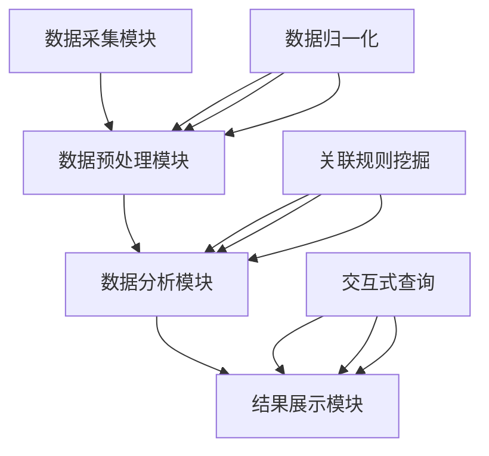

                 

### 文章标题

《知识发现引擎的用户体验设计原则》

### 关键词

知识发现引擎，用户体验设计，设计原则，应用场景，性能优化

### 摘要

本文将深入探讨知识发现引擎的用户体验设计原则，从概述、用户需求分析、界面设计、功能模块设计、性能优化等方面进行详细阐述。通过分析知识发现引擎的核心架构、关键技术，并结合电子商务、医疗健康、金融、企业内部等实际应用案例，本文旨在为开发者和设计者提供一套全面且实用的设计指导，以提升知识发现引擎的用户体验和实际应用效果。

---

## 第一部分：知识发现引擎概述

### 第1章：知识发现引擎的概念与背景

#### 1.1 知识发现引擎的定义与作用

知识发现引擎（Knowledge Discovery Engine，简称KDE）是一种集成多种数据挖掘技术、智能推理技术和知识表示技术的智能系统。其核心目标是自动从大规模、多源、异构的数据集中发现潜在的知识和信息，以支持数据驱动的决策和洞察。

- **知识发现引擎的定义**：
  $$\text{知识发现引擎} = \text{数据挖掘技术} + \text{智能推理技术} + \text{知识表示技术}$$

- **知识发现引擎在现代社会的作用与重要性**：

  - **提升企业决策效率**：通过自动化数据分析和挖掘，帮助企业和组织快速获取关键业务洞察，优化决策过程。
  - **改善用户个性化体验**：根据用户行为和偏好，提供个性化的推荐和定制服务，提升用户满意度和忠诚度。
  - **促进大数据分析与利用**：应对海量数据的挑战，实现数据的深度挖掘和智慧利用，为社会各领域的发展提供有力支撑。

#### 1.2 知识发现引擎的发展历程

知识发现引擎的发展历程可以分为以下几个阶段：

- **从传统数据库查询到知识发现**：
  - **传统数据库查询**：以结构化数据为基础，实现数据的存储和查询。
  - **数据仓库**：将多个数据源整合到一个统一的数据存储中，支持复杂的数据分析和挖掘。
  - **数据挖掘**：引入统计分析和机器学习技术，从大规模数据中自动提取有价值的信息。

- **知识发现引擎的关键技术演变**：
  - **单机算法** → **分布式算法**：随着数据规模的增大，分布式计算技术成为主流。
  - **线性模型** → **深度学习模型**：深度学习技术的发展，使得知识发现引擎在复杂模式和特征提取方面取得了显著进步。

#### 1.3 知识发现引擎的分类

知识发现引擎可以根据不同的维度进行分类：

- **按照应用领域分类**：
  - **电子商务**：个性化推荐、用户行为分析、商品销售预测等。
  - **医疗健康**：疾病预测、医疗资源优化、基因组数据分析等。
  - **金融**：信用评分、风险控制、市场预测等。
  - **企业内部**：知识管理、业务流程优化、员工技能评估等。

- **按照技术架构分类**：
  - **本地部署**：在企业内部部署知识发现系统，数据安全性和控制性较高。
  - **云端服务**：通过云平台提供知识发现服务，具有弹性和可扩展性。

#### 1.4 知识发现引擎的核心架构

知识发现引擎通常包含以下几个核心模块：

- **数据采集模块**：负责从各种数据源（如数据库、日志文件、传感器等）收集数据。
- **数据预处理模块**：对采集到的数据进行清洗、转换、归一化等预处理操作，确保数据的质量和一致性。
- **数据分析模块**：采用数据挖掘和机器学习技术，对预处理后的数据进行深度分析和模式挖掘。
- **结果展示模块**：将分析结果通过可视化、报表等形式展示给用户，便于用户理解和利用。

### 第2章：知识发现引擎的关键技术

#### 2.1 数据库技术

数据库技术在知识发现引擎中扮演着关键角色，负责数据的存储、管理和查询。

- **关系型数据库与非关系型数据库对比**：
  - **关系型数据库**：基于关系模型，具有严密的数学理论基础，支持复杂查询和事务处理。
  - **非关系型数据库**：基于文档、图形、键值等模型，灵活性强，适用于大规模数据的存储和查询。

- **数据库查询优化技术**：
  - **索引技术**：通过建立索引，加快数据查询速度。
  - **查询优化器**：自动选择最佳的查询执行计划，提高查询效率。

#### 2.2 数据挖掘技术

数据挖掘技术是知识发现引擎的核心，负责从大量数据中提取有价值的信息。

- **聚类算法**：
  - **K-均值聚类**：基于距离度量，将数据划分为多个簇。
  - **层次聚类**：自底向上或自顶向下构建簇层次结构。

- **分类算法**：
  - **决策树**：基于特征划分，构建树形结构。
  - **支持向量机**：将数据投影到高维空间，寻找最佳分类边界。

- **关联规则挖掘**：
  - **Apriori算法**：基于支持度和置信度，发现频繁项集。
  - **FP-Growth算法**：通过构造频繁模式树，提高挖掘效率。

#### 2.3 数据可视化技术

数据可视化技术是将分析结果以图形、图表等形式直观展示给用户的重要手段。

- **常见的数据可视化工具**：
  - **D3.js**：用于创建交互式数据可视化。
  - **ECharts**：用于绘制各种类型的图表。
  - **Tableau**：提供强大的数据可视化和报表功能。

- **数据可视化设计原则**：
  - **直观性**：确保用户能够快速理解图表内容和信息。
  - **易用性**：提供灵活的交互操作，满足用户不同需求。
  - **一致性**：保持图表风格和布局的一致性，提高用户体验。

---

以上为知识发现引擎概述部分的内容，涵盖了其定义与作用、发展历程、分类以及核心架构。在接下来的部分中，我们将深入探讨知识发现引擎的用户需求分析、界面设计原则、功能模块设计、性能优化策略，并结合实际应用案例，为读者提供全面的技术指导。在每一部分中，我们将遵循“LET'S THINK STEP BY STEP”的原则，通过逻辑清晰、结构紧凑、简单易懂的技术语言，一步步解析知识发现引擎的设计与实现。让我们开始吧！

---

### 第1章：知识发现引擎的概念与背景

#### 1.1 知识发现引擎的定义与作用

知识发现引擎（Knowledge Discovery Engine，简称KDE）是一种集成多种数据挖掘技术、智能推理技术和知识表示技术的智能系统。其核心目标是自动从大规模、多源、异构的数据集中发现潜在的知识和信息，以支持数据驱动的决策和洞察。

- **知识发现引擎的定义**：

  $$\text{知识发现引擎} = \text{数据挖掘技术} + \text{智能推理技术} + \text{知识表示技术}$$

  其中，数据挖掘技术负责从大量数据中提取有价值的信息；智能推理技术通过逻辑推理和知识表示，将数据转化为可理解和利用的知识；知识表示技术则负责将知识表示为便于存储、检索和利用的形式。

- **知识发现引擎在现代社会的作用与重要性**：

  知识发现引擎在现代社会中发挥着重要的作用，主要体现在以下几个方面：

  - **提升企业决策效率**：

    通过自动化数据分析和挖掘，知识发现引擎可以帮助企业和组织快速获取关键业务洞察，优化决策过程。例如，在电子商务领域，知识发现引擎可以分析用户行为和购买习惯，为企业提供精准的市场营销策略和库存管理建议。

  - **改善用户个性化体验**：

    知识发现引擎可以根据用户行为和偏好，提供个性化的推荐和定制服务，提升用户满意度和忠诚度。例如，在社交媒体平台上，知识发现引擎可以根据用户的兴趣和行为数据，推荐相关的朋友、内容和广告。

  - **促进大数据分析与利用**：

    面对海量数据的挑战，知识发现引擎能够高效地处理和分析大规模数据，实现数据的深度挖掘和智慧利用。例如，在医疗健康领域，知识发现引擎可以分析患者的电子健康记录和基因数据，帮助医生进行疾病预测和个性化治疗。

#### 1.2 知识发现引擎的发展历程

知识发现引擎的发展历程可以分为以下几个阶段：

- **从传统数据库查询到知识发现**：

  - **传统数据库查询**：以结构化数据为基础，实现数据的存储和查询。传统数据库主要用于存储和检索数据，功能相对单一，难以满足数据挖掘和知识发现的需求。

  - **数据仓库**：随着数据量的增加和复杂度提升，数据仓库应运而生。数据仓库将多个数据源整合到一个统一的数据存储中，支持复杂的数据分析和挖掘，为知识发现提供了基础。

  - **数据挖掘**：数据挖掘技术引入了统计分析和机器学习技术，从大规模数据中自动提取有价值的信息。数据挖掘技术的出现，标志着知识发现引擎的初步形成。

- **知识发现引擎的关键技术演变**：

  - **单机算法** → **分布式算法**：随着数据规模的增大，单机算法的处理能力逐渐不足，分布式算法成为主流。分布式算法通过将数据分布在多个节点上，实现并行处理，提高了知识发现引擎的处理效率。

  - **线性模型** → **深度学习模型**：深度学习技术的发展，使得知识发现引擎在复杂模式和特征提取方面取得了显著进步。深度学习模型通过多层神经网络，自动提取数据中的高阶特征，提高了数据挖掘的准确性和鲁棒性。

#### 1.3 知识发现引擎的分类

知识发现引擎可以根据不同的维度进行分类：

- **按照应用领域分类**：

  - **电子商务**：个性化推荐、用户行为分析、商品销售预测等。

  - **医疗健康**：疾病预测、医疗资源优化、基因组数据分析等。

  - **金融**：信用评分、风险控制、市场预测等。

  - **企业内部**：知识管理、业务流程优化、员工技能评估等。

- **按照技术架构分类**：

  - **本地部署**：在企业内部部署知识发现系统，数据安全性和控制性较高。

  - **云端服务**：通过云平台提供知识发现服务，具有弹性和可扩展性。

#### 1.4 知识发现引擎的核心架构

知识发现引擎通常包含以下几个核心模块：

- **数据采集模块**：负责从各种数据源（如数据库、日志文件、传感器等）收集数据。

- **数据预处理模块**：对采集到的数据进行清洗、转换、归一化等预处理操作，确保数据的质量和一致性。

- **数据分析模块**：采用数据挖掘和机器学习技术，对预处理后的数据进行深度分析和模式挖掘。

- **结果展示模块**：将分析结果通过可视化、报表等形式展示给用户，便于用户理解和利用。

### 1.1 知识发现引擎的定义与作用

#### 知识发现引擎的定义

知识发现引擎（Knowledge Discovery Engine，简称KDE）是一种集成多种数据挖掘技术、智能推理技术和知识表示技术的智能系统。其核心目标是自动从大规模、多源、异构的数据集中发现潜在的知识和信息，以支持数据驱动的决策和洞察。

为了更好地理解知识发现引擎的定义，我们可以将其分解为以下几个关键组成部分：

- **数据挖掘技术**：数据挖掘技术是指从大量数据中自动提取有价值信息的方法和算法。这些技术包括分类、聚类、关联规则挖掘、异常检测等。数据挖掘技术是实现知识发现的重要工具。

- **智能推理技术**：智能推理技术是指利用逻辑、语义网络、知识表示等方法进行推理和决策的技术。这些技术能够将数据转化为可理解和利用的知识，是知识发现引擎的核心。

- **知识表示技术**：知识表示技术是指将知识表示为便于存储、检索和利用的形式。常见的知识表示方法包括语义网络、本体论、知识图谱等。知识表示技术是实现知识发现的关键。

通过以上三个组成部分的协同工作，知识发现引擎能够从大规模、多源、异构的数据中自动提取有价值的信息，并将其转化为可理解和利用的知识，从而支持数据驱动的决策和洞察。

#### 知识发现引擎的作用

知识发现引擎在现代社会中发挥着重要的作用，主要体现在以下几个方面：

1. **提升企业决策效率**：

   知识发现引擎通过自动化数据分析和挖掘，可以帮助企业和组织快速获取关键业务洞察，优化决策过程。例如，在电子商务领域，知识发现引擎可以分析用户行为和购买习惯，为企业提供精准的市场营销策略和库存管理建议；在金融领域，知识发现引擎可以分析客户交易数据和风险因素，帮助金融机构制定有效的风险控制策略。

2. **改善用户个性化体验**：

   知识发现引擎可以根据用户行为和偏好，提供个性化的推荐和定制服务，提升用户满意度和忠诚度。例如，在社交媒体平台上，知识发现引擎可以根据用户的兴趣和行为数据，推荐相关的朋友、内容和广告；在在线教育领域，知识发现引擎可以根据学生的学习数据和反馈，提供个性化的学习资源和课程推荐。

3. **促进大数据分析与利用**：

   面对海量数据的挑战，知识发现引擎能够高效地处理和分析大规模数据，实现数据的深度挖掘和智慧利用。例如，在医疗健康领域，知识发现引擎可以分析患者的电子健康记录和基因数据，帮助医生进行疾病预测和个性化治疗；在智慧城市建设中，知识发现引擎可以分析交通数据、环境数据等，优化交通流量、提升城市治理水平。

总之，知识发现引擎作为一种智能系统，能够从大规模、多源、异构的数据中自动提取有价值的信息，为企业决策、用户个性化体验和大数据利用提供强有力的支持。在接下来的章节中，我们将进一步探讨知识发现引擎的发展历程、分类及其核心架构。

### 1.2 知识发现引擎的发展历程

#### 知识发现引擎的发展历程

知识发现引擎的发展历程可以从传统数据库查询到数据仓库，再到数据挖掘，以及近年来在人工智能和大数据技术推动下的演变。

1. **传统数据库查询阶段**：

   传统数据库查询阶段主要集中于如何高效地存储和检索结构化数据。在此阶段，数据库管理系统（DBMS）成为了数据存储和管理的核心。代表性的系统包括关系型数据库（如Oracle、MySQL）和NoSQL数据库（如MongoDB、Cassandra）。这些系统提供了基本的数据查询和管理功能，但缺乏自动化的数据分析能力。

2. **数据仓库阶段**：

   随着企业积累的数据量不断增加，单纯依靠数据库查询已无法满足复杂的数据分析需求。数据仓库的概念应运而生，它通过集成来自多个数据源的数据，提供一个统一、集中的数据存储环境，便于进行大规模的数据分析和挖掘。数据仓库的核心技术包括数据抽取、转换、加载（ETL）和数据仓库管理系统（DWMS）。代表性的数据仓库系统包括Teradata、Oracle Data Warehouse等。

3. **数据挖掘阶段**：

   数据挖掘阶段标志着知识发现引擎的初步形成。数据挖掘是一种通过算法和统计分析方法，从大量数据中自动发现有趣模式、趋势和关联的技术。代表性的数据挖掘算法有K-均值聚类、决策树、支持向量机（SVM）和关联规则挖掘（如Apriori算法）。数据挖掘技术不仅提高了数据分析的自动化程度，还为知识发现提供了重要工具。

4. **知识发现引擎的关键技术演变**：

   - **单机算法** → **分布式算法**：随着数据规模的不断扩大，单机算法逐渐无法满足处理需求。分布式算法和并行处理技术开始成为主流，代表性的分布式计算框架包括MapReduce、Spark和Flink。这些技术能够将数据处理任务分布到多个节点上，实现高效的并行计算。

   - **线性模型** → **深度学习模型**：在数据挖掘和机器学习领域，线性模型（如线性回归、逻辑回归）一直是主要方法。然而，深度学习模型（如神经网络、卷积神经网络、循环神经网络）的出现，使得知识发现引擎在复杂模式和特征提取方面取得了显著进步。深度学习模型能够自动提取数据的复杂特征，提高了知识发现的准确性和鲁棒性。

5. **近年来知识发现引擎的发展**：

   - **人工智能与大数据技术融合**：随着人工智能和大数据技术的发展，知识发现引擎逐渐向智能化和自动化方向发展。人工智能技术，如深度学习和自然语言处理（NLP），为知识发现引擎带来了新的能力和应用场景。大数据技术，如Hadoop和Spark，为知识发现引擎提供了强大的数据处理和计算能力。

   - **多源异构数据的处理**：在知识发现引擎的发展过程中，多源异构数据的处理成为一个重要挑战。多源数据包括结构化数据、非结构化数据和半结构化数据。知识发现引擎需要具备处理这些不同类型数据的能力，以实现全面的数据分析和挖掘。

   - **知识图谱与语义网络**：知识图谱和语义网络技术的发展，为知识发现引擎提供了新的知识表示和推理方法。知识图谱通过实体和关系构建大规模知识网络，实现了知识的关联和整合。语义网络则通过语义分析和语义匹配，实现了知识的自动化理解和推理。

综上所述，知识发现引擎的发展历程从传统的数据库查询到数据仓库，再到数据挖掘，以及近年来在人工智能和大数据技术推动下的演变，不断推动着知识发现引擎的功能和性能提升，为各领域的智能化决策和数据利用提供了重要支持。

### 1.3 知识发现引擎的分类

#### 知识发现引擎的分类

知识发现引擎可以根据不同的应用领域和技术架构进行分类，这有助于我们更好地理解和应用知识发现引擎。以下是几种常见的分类方法：

1. **按照应用领域分类**：

   - **电子商务**：在电子商务领域，知识发现引擎主要用于个性化推荐、用户行为分析和商品销售预测。例如，基于用户的历史购买记录和浏览行为，知识发现引擎可以为用户提供个性化的商品推荐，从而提高销售转化率和客户满意度。

   - **医疗健康**：在医疗健康领域，知识发现引擎可以用于疾病预测、医疗资源优化和基因组数据分析。例如，通过对患者的电子健康记录和基因数据进行挖掘，知识发现引擎可以帮助医生进行早期疾病预测和个性化治疗方案的制定。

   - **金融**：在金融领域，知识发现引擎主要用于信用评分、风险控制和市场预测。例如，通过分析客户的信用记录和交易行为，知识发现引擎可以为金融机构提供信用风险评估和欺诈检测服务。

   - **企业内部**：在企业内部，知识发现引擎可以用于知识管理、业务流程优化和员工技能评估。例如，通过对员工的工作数据和绩效评估数据进行挖掘，知识发现引擎可以帮助企业识别优秀员工、优化培训计划和提升整体工作效率。

2. **按照技术架构分类**：

   - **本地部署**：本地部署的知识发现引擎通常在企业内部服务器上运行，具有较高的数据安全性和可控性。本地部署适合对数据安全性要求较高、数据量相对较小的场景。

   - **云端服务**：云端服务是指将知识发现引擎部署在云平台上，用户可以通过互联网访问和利用这些服务。云端服务具有弹性大、可扩展性强、易于维护等优点，适合大规模数据分析和跨地域应用。

此外，知识发现引擎还可以根据数据类型进行分类：

- **结构化数据**：结构化数据是指具有明确字段和数据类型的数据库数据。例如，关系型数据库中的表格数据。
- **非结构化数据**：非结构化数据是指没有明确结构或字段的数据，如文本、图像、音频和视频。
- **半结构化数据**：半结构化数据是指具有部分结构但未完全结构化的数据，如XML、JSON等。

根据不同的分类方法，知识发现引擎可以应用于各种领域，解决不同类型的数据分析问题。在下一部分中，我们将进一步探讨知识发现引擎的核心架构，了解其各组成部分及其作用。

### 1.4 知识发现引擎的核心架构

#### 知识发现引擎的核心架构

知识发现引擎是一种复杂的系统，它通过多个模块的协同工作，从大规模、多源、异构的数据中提取有价值的信息。知识发现引擎的核心架构通常包括数据采集模块、数据预处理模块、数据分析模块和结果展示模块。

##### 数据采集模块

数据采集模块是知识发现引擎的起点，负责从各种数据源（如数据库、日志文件、传感器、网页等）收集数据。数据采集模块的关键任务是确保数据的质量和完整性。具体包括以下几个方面：

- **数据来源**：数据可以从多种数据源获取，包括结构化数据、非结构化数据和半结构化数据。
- **数据获取方式**：常用的数据获取方式有API调用、爬取、数据库连接等。
- **数据格式转换**：不同数据源的数据格式可能不同，数据采集模块需要将数据转换成统一的格式，便于后续处理。

##### 数据预处理模块

数据预处理模块是知识发现引擎的重要组成部分，它对采集到的原始数据进行清洗、转换和归一化等处理，确保数据的质量和一致性。数据预处理模块主要包括以下几个方面：

- **数据清洗**：数据清洗是指去除数据中的噪声、错误和重复数据，以提高数据的质量。
- **数据转换**：数据转换是指将数据从一种格式转换为另一种格式，以便后续处理。例如，将文本数据转换为数值数据。
- **数据归一化**：数据归一化是指将不同量纲的数据转换为相同量纲，以便进行统一分析。

##### 数据分析模块

数据分析模块是知识发现引擎的核心，它采用数据挖掘和机器学习技术，对预处理后的数据进行深度分析和模式挖掘。数据分析模块主要包括以下几个方面：

- **数据挖掘算法**：常用的数据挖掘算法包括聚类、分类、关联规则挖掘和异常检测等。
- **特征工程**：特征工程是指通过选择、构造和转换特征，提高模型的表现能力。例如，可以使用主成分分析（PCA）来降维，使用特征选择算法来选择重要特征。
- **模型评估**：模型评估是指通过评估指标（如准确率、召回率、F1分数等）来评估模型的表现。常用的评估方法有交叉验证、ROC曲线和混淆矩阵等。

##### 结果展示模块

结果展示模块是知识发现引擎的终点，它将分析结果通过可视化、报表等形式展示给用户，便于用户理解和利用。结果展示模块主要包括以下几个方面：

- **可视化**：通过图表、图形和地图等可视化方式，将分析结果直观地展示给用户。常用的可视化工具包括D3.js、ECharts、Tableau等。
- **报表生成**：通过生成报告、表格和图表等形式，将分析结果详细展示给用户。报表可以用于内部汇报、客户展示和决策支持等。
- **交互式查询**：提供用户交互式查询功能，用户可以通过查询界面自定义查询条件和查看结果。

##### 知识发现引擎的核心架构 Mermaid 流程图

为了更直观地展示知识发现引擎的核心架构，我们可以使用Mermaid流程图进行描述：

在上面的流程图中，数据采集模块通过数据获取接口从多种数据源中收集数据，然后传递给数据预处理模块。数据预处理模块对数据进行清洗、转换和归一化处理，然后将处理后的数据传递给数据分析模块。数据分析模块采用多种数据挖掘算法进行分析，并将分析结果传递给结果展示模块。结果展示模块通过可视化、报表和交互式查询等方式，将分析结果展示给用户。

通过以上对知识发现引擎核心架构的详细描述和Mermaid流程图的展示，我们可以更好地理解知识发现引擎的工作原理和各模块的作用。在接下来的章节中，我们将深入探讨知识发现引擎在各个应用领域的实际应用，以及如何通过设计原则提升其用户体验。

### 第2章：知识发现引擎的关键技术

知识发现引擎的实现依赖于多种关键技术，这些技术共同构成了知识发现的核心能力。本章将详细介绍知识发现引擎的三大关键技术：数据库技术、数据挖掘技术和数据可视化技术。

#### 2.1 数据库技术

数据库技术在知识发现引擎中扮演着至关重要的角色，主要负责数据的存储、管理和查询。数据库技术可以分为关系型数据库和非关系型数据库两大类。

**关系型数据库**：

关系型数据库（如MySQL、Oracle）是基于关系模型构建的数据库系统，具有严密的数学理论基础。关系型数据库使用表格（关系）来存储数据，每个表格由若干行和列组成，行表示记录，列表示字段。关系型数据库的主要特点如下：

1. **数据一致性**：关系型数据库通过事务机制确保数据的一致性，即对数据的任何修改都是原子性的。
2. **复杂查询支持**：关系型数据库支持复杂的SQL查询，包括联接、分组、排序等操作。
3. **数据完整性约束**：关系型数据库支持数据完整性约束，如主键、外键、唯一约束等，确保数据的正确性。

**非关系型数据库**：

非关系型数据库（如MongoDB、Cassandra）是一种分布式、无模式的数据存储系统，适用于大规模、高并发、海量数据的场景。非关系型数据库的主要特点如下：

1. **灵活性和可扩展性**：非关系型数据库无需预先定义表结构，可以动态地添加和修改字段，适用于快速变化的数据场景。
2. **高性能读写**：非关系型数据库采用分布式架构，支持高性能的读写操作，特别适用于读多写少的场景。
3. **海量数据存储**：非关系型数据库能够存储海量数据，并通过分片（Sharding）和副本（Replication）实现数据的水平扩展。

**数据库查询优化技术**：

为了提高数据库查询的性能，数据库查询优化是关键。以下是一些常见的数据库查询优化技术：

1. **索引**：索引是一种数据结构，用于加快数据查询速度。常用的索引类型有B树索引、哈希索引等。
2. **查询优化器**：查询优化器是一种自动选择最佳查询执行计划的组件。查询优化器通过分析查询语句和数据统计信息，生成高效的执行计划。
3. **缓存**：通过缓存常用查询结果，可以减少数据库的访问频率，提高查询响应速度。

#### 2.2 数据挖掘技术

数据挖掘技术是知识发现引擎的核心，用于从大量数据中自动发现潜在的模式、关联和趋势。数据挖掘技术包括多种算法和模型，下面介绍几种主要的数据挖掘技术。

**聚类算法**：

聚类算法是一种无监督学习算法，用于将数据点划分为若干个簇，使同一簇中的数据点具有较高的相似性，而不同簇中的数据点具有较低的相似性。常见的聚类算法包括：

1. **K-均值聚类**：K-均值聚类是最常见的聚类算法，通过迭代计算确定簇的中心点，并更新数据点的簇归属。
2. **层次聚类**：层次聚类通过自底向上或自顶向下的方式构建簇层次结构，形成层次化的聚类结果。

**分类算法**：

分类算法是一种监督学习算法，用于将数据点分为不同的类别。分类算法通过学习已标记的数据集，构建分类模型，然后对新数据进行预测。常见的分类算法包括：

1. **决策树**：决策树是一种基于树形结构进行分类的方法，通过计算特征的重要性和分支阈值来构建树模型。
2. **支持向量机（SVM）**：支持向量机是一种基于最大间隔原则的分类算法，通过在高维空间中寻找最佳分类边界。

**关联规则挖掘**：

关联规则挖掘是一种用于发现数据项之间关联关系的方法，通常用于市场 basket 分析和推荐系统。常见的关联规则挖掘算法包括：

1. **Apriori算法**：Apriori算法通过枚举所有频繁项集来挖掘关联规则，具有较高的时间复杂度。
2. **FP-Growth算法**：FP-Growth算法通过构建频繁模式树来高效挖掘关联规则，相比Apriori算法有更高的性能。

**异常检测**：

异常检测是一种用于识别数据集中异常点的算法，常用于欺诈检测、网络安全等领域。常见的异常检测算法包括：

1. **基于统计的方法**：基于统计的方法通过计算数据的统计指标（如标准差、方差等）来判断是否为异常。
2. **基于聚类的方法**：基于聚类的方法通过识别离群簇或离群点来检测异常。

#### 2.3 数据可视化技术

数据可视化技术是将分析结果以图形、图表等形式直观展示给用户的重要手段。数据可视化有助于用户理解和分析复杂数据，发现数据中的隐藏模式和趋势。下面介绍几种常见的数据可视化技术。

**常见的数据可视化工具**：

1. **D3.js**：D3.js是一个基于JavaScript的库，用于创建交互式数据可视化。它提供了丰富的图表类型和灵活的定制能力。
2. **ECharts**：ECharts是一个开源的JavaScript图表库，支持多种图表类型和丰富的交互功能。
3. **Tableau**：Tableau是一个商业数据可视化工具，提供了强大的数据连接、数据转换和可视化功能。

**数据可视化设计原则**：

1. **直观性**：数据可视化应尽可能直观，使用户能够快速理解图表内容和信息。
2. **一致性**：保持图表风格和布局的一致性，提高用户体验。
3. **交互性**：提供灵活的交互操作，如筛选、排序、钻取等，使用户能够深入探索数据。
4. **视觉编码**：使用适当的视觉编码（如颜色、形状、大小等），传达数据的差异和趋势。

通过以上对知识发现引擎关键技术的详细介绍，我们可以看到知识发现引擎的实现是一个复杂且高度集成的过程，需要多种技术的协同工作。在下一部分，我们将探讨知识发现引擎的用户需求分析，了解如何从用户的角度出发，设计和优化知识发现引擎。

### 2.1 数据库技术

#### 数据库技术

数据库技术在知识发现引擎中起到了至关重要的作用，它不仅负责存储和管理数据，还支持高效的查询和数据处理。数据库技术可以分为关系型数据库和非关系型数据库两种主要类型，每种类型都有其独特的特点和适用场景。

**关系型数据库**

关系型数据库（RDBMS）是传统数据库技术的主流，其核心概念是基于关系模型的。关系模型由表格（表）、记录（行）和字段（列）组成，每个表都代表了数据的一个实体，而每个实体之间通过键的关系进行关联。以下是一些关系型数据库的主要特点：

- **结构化数据存储**：关系型数据库擅长处理结构化数据，如SQL Server、MySQL、Oracle等。它们通过预定义的表结构和字段，确保数据的规范化和一致性。
- **事务支持**：关系型数据库支持事务，这意味着一组操作要么全部成功，要么全部失败，从而保证了数据的一致性和完整性。
- **复杂的查询能力**：关系型数据库提供了丰富的查询语言（如SQL），支持复杂的联接、聚合、分组等操作，便于进行复杂的数据分析和报告生成。
- **数据完整性约束**：关系型数据库支持主键、外键、唯一约束等数据完整性约束，确保数据的正确性和可靠性。

**非关系型数据库**

非关系型数据库（NoSQL）在近年来得到了广泛的应用，尤其在处理大规模、高并发、结构化程度较低的数据时表现出色。非关系型数据库主要包括以下几种类型：

- **键值存储**：如Redis和Riak，这类数据库以键值对的形式存储数据，非常适合存储简单的、低结构化的数据。
- **文档存储**：如MongoDB和CouchDB，这类数据库将数据存储为文档（通常为JSON或BSON格式），适用于存储复杂的、嵌套的数据结构。
- **列族存储**：如HBase和Cassandra，这类数据库将数据存储在列族中，适合存储大量的、松散结构化的数据，并支持分布式存储和横向扩展。
- **图数据库**：如Neo4j和OrientDB，这类数据库以图结构存储数据，适用于处理实体和关系复杂的数据，如社交网络、推荐系统等。

**关系型数据库与非关系型数据库的对比**

- **数据模型**：关系型数据库使用预定义的表格和字段结构，而非关系型数据库通常更为灵活，支持动态的、松散的数据模型。
- **扩展性**：非关系型数据库通常具有更好的扩展性，能够通过分布式架构轻松处理海量数据，而关系型数据库在扩展性方面相对较弱。
- **查询能力**：关系型数据库在处理复杂查询方面具有优势，尤其是需要多表联接的场景，而非关系型数据库更适合于简单的、快速的读/写操作。
- **数据一致性**：关系型数据库通过事务机制确保数据的一致性，而非关系型数据库则更注重性能和扩展性，可能在数据一致性方面有所妥协。

**数据库查询优化技术**

为了提高数据库查询的性能，查询优化技术是必不可少的。以下是一些常用的数据库查询优化技术：

- **索引**：索引是一种数据结构，用于加快数据查询速度。通过在关键字段上创建索引，数据库可以快速定位到数据的位置，从而提高查询效率。
- **查询优化器**：查询优化器是一种自动选择最佳查询执行计划的组件。它通过分析查询语句和数据统计信息，生成高效的执行计划。
- **缓存**：通过缓存常用查询结果，可以减少数据库的访问频率，提高查询响应速度。缓存技术可以用于数据库内部，也可以在应用程序层实现。

通过合理选择和使用数据库技术，知识发现引擎可以高效地存储、管理和查询数据，从而为数据分析和挖掘提供强有力的支持。在下一部分中，我们将进一步探讨数据挖掘技术，了解如何在海量数据中提取有价值的信息。

### 2.2 数据挖掘技术

#### 数据挖掘技术

数据挖掘技术是知识发现引擎的核心组成部分，它通过多种算法和模型从大量数据中自动提取有价值的信息和知识。数据挖掘技术广泛应用于各个领域，包括商业、医疗、金融、社交媒体等。以下是几种常见的数据挖掘技术及其原理和应用：

**聚类算法**

聚类算法是一种无监督学习方法，用于将数据点划分为若干个簇，使得同一簇内的数据点具有较高的相似性，而不同簇的数据点则具有较低的相似性。聚类算法在数据预处理、模式识别、市场细分等方面有广泛应用。

- **K-均值聚类**：K-均值聚类是最常用的聚类算法之一。它通过迭代过程计算每个簇的中心点，并不断更新数据点的簇归属，直到达到收敛条件。算法的复杂度为$O(\frac{n^2}{k})$，其中$n$是数据点的个数，$k$是簇的数量。

  **算法步骤**：
  1. 随机选择$k$个初始中心点。
  2. 对于每个数据点，计算其与每个中心点的距离，并分配到最近的中心点所在的簇。
  3. 更新每个簇的中心点为簇内所有数据点的平均值。
  4. 重复步骤2和3，直到中心点的位置不再变化或达到预设的迭代次数。

- **层次聚类**：层次聚类通过自底向上或自顶向下的方式构建簇层次结构，形成层次化的聚类结果。算法包括凝聚层次聚类和分裂层次聚类两种类型。

  **算法步骤**：
  1. 初始时，每个数据点都是一个簇。
  2. 对于凝聚层次聚类，每次迭代中合并最相似的簇，直到所有的数据点合并成一个簇。
  3. 对于分裂层次聚类，每次迭代中将一个簇划分为多个簇，直到每个簇只包含一个数据点。

**分类算法**

分类算法是一种监督学习方法，用于将数据点分为不同的类别。分类算法在预测、决策支持、信用评分等领域有广泛应用。

- **决策树**：决策树是一种树形结构，通过一系列的测试（如果-则-否则规则）对数据进行划分。决策树的每个节点代表一个特征，每个分支代表一个测试结果。

  **算法步骤**：
  1. 选择一个最优的特征进行划分，通常使用信息增益或基尼系数作为划分标准。
  2. 根据该特征将数据划分为若干子集。
  3. 对每个子集递归地重复步骤1和2，直到满足停止条件（如最大深度、最小叶子节点数等）。

- **支持向量机（SVM）**：支持向量机是一种基于最大间隔原则的线性分类模型。它通过在高维空间中寻找最佳分类边界，将数据点划分为不同的类别。

  **算法步骤**：
  1. 计算每个数据点与决策边界的距离。
  2. 使用支持向量找到最佳分类边界。
  3. 对新数据进行分类，计算其与支持向量的距离并判断类别。

**关联规则挖掘**

关联规则挖掘是一种用于发现数据项之间关联关系的方法，常用于市场 basket 分析、推荐系统等领域。

- **Apriori算法**：Apriori算法通过逐层枚举所有频繁项集，从而发现关联规则。它具有较高的时间复杂度，但随着大数据技术的发展，优化算法（如FP-Growth）提高了其性能。

  **算法步骤**：
  1. 计算每个项的支持度，筛选出频繁项。
  2. 构建频繁模式树，提取频繁项集。
  3. 根据最小置信度阈值筛选出强关联规则。

- **FP-Growth算法**：FP-Growth算法通过构建频繁模式树（FP-Tree）来高效挖掘关联规则。它避免了枚举所有频繁项集的步骤，提高了计算效率。

  **算法步骤**：
  1. 构建FP-Tree，记录每个项的支持度和前缀路径。
  2. 从FP-Tree中提取频繁项集。
  3. 根据最小置信度阈值筛选出强关联规则。

**异常检测**

异常检测是一种用于识别数据集中异常点的算法，常用于欺诈检测、网络安全等领域。

- **基于统计的方法**：基于统计的方法通过计算数据的统计指标（如标准差、方差等）来判断是否为异常。如果某个数据点的统计指标远高于或低于其他数据点，则认为该数据点是异常的。

  **算法步骤**：
  1. 计算数据的统计指标。
  2. 设置阈值，判断数据点是否超出阈值范围。

- **基于聚类的方法**：基于聚类的方法通过识别离群簇或离群点来检测异常。如果一个数据点与大多数聚类结果不相似，则认为该数据点是异常的。

  **算法步骤**：
  1. 使用聚类算法对数据点进行聚类。
  2. 计算每个数据点到聚类中心点的距离。
  3. 设置阈值，判断数据点是否超出阈值范围。

通过以上几种数据挖掘技术的介绍，我们可以看到数据挖掘技术在知识发现引擎中的应用是非常广泛和多样的。在下一部分中，我们将探讨数据可视化技术，了解如何通过可视化手段更好地展示数据挖掘的结果。

### 2.3 数据可视化技术

#### 数据可视化技术

数据可视化技术是将数据转换为图形、图表等形式，以便用户能够直观地理解数据内容和发现隐藏的模式。数据可视化技术在知识发现引擎中起着至关重要的作用，它不仅有助于用户快速获取信息，还能提高数据分析和决策的效率。以下是几种常见的数据可视化技术和工具：

**常见的数据可视化工具**

- **D3.js**：D3.js是一个基于JavaScript的可视化库，具有极高的灵活性和定制能力。它可以通过SVG、Canvas等图形API动态生成各种图表和交互式可视化。
- **ECharts**：ECharts是一个开源的JavaScript可视化库，支持多种常见的图表类型，如折线图、柱状图、饼图等。它具有丰富的配置选项和良好的性能。
- **Tableau**：Tableau是一个强大的商业数据可视化工具，支持多种数据源连接和数据转换。它提供了丰富的可视化组件和交互功能，方便用户进行数据探索和分析。

**数据可视化设计原则**

- **直观性**：数据可视化应尽可能直观，使用户能够快速理解图表的内容和信息。避免使用过于复杂的图表类型或过多的装饰元素。
- **一致性**：保持图表风格和布局的一致性，提高用户体验。一致的图表类型、颜色、字体等设计元素有助于用户在多个图表之间进行对比和分析。
- **交互性**：提供灵活的交互操作，如筛选、排序、钻取等，使用户能够深入探索数据。交互性有助于用户发现数据中的隐藏模式和趋势。
- **视觉编码**：使用适当的视觉编码，如颜色、形状、大小等，传达数据的差异和趋势。视觉编码应遵循一致性原则，确保用户能够快速理解图表的含义。

**常见的数据可视化方法**

- **折线图**：折线图适用于展示数据随时间变化的趋势。它通过连接数据点，显示数据在不同时间点的变化情况。
- **柱状图**：柱状图适用于展示不同类别或组的数据比较。每个柱子的高度表示相应类别的数据值。
- **饼图**：饼图适用于展示数据的比例分布。每个扇形区域表示数据的一部分，其面积与数据的大小成比例。
- **散点图**：散点图适用于展示两个或多个变量之间的关系。每个数据点由坐标表示，通过观察点的分布和趋势，可以识别变量之间的相关性。
- **热力图**：热力图适用于展示数据的高频分布。通过使用颜色深浅来表示数据的频率或数值大小，可以直观地展示数据的热点和冷区。

通过合理选择和使用数据可视化技术，知识发现引擎可以有效地将复杂数据转化为易于理解和分析的形式，为用户提供直观的数据洞察和决策支持。在下一部分中，我们将探讨知识发现引擎的设计原则，了解如何从用户需求和用户体验出发，设计和优化知识发现引擎。

### 第3章：知识发现引擎的设计原则

#### 3.1 用户需求分析

用户需求分析是知识发现引擎设计的重要步骤，它有助于了解用户的需求、期望和痛点，从而设计出满足用户需求的产品。以下是进行用户需求分析的一些关键步骤和方法：

**用户需求调研方法**

1. **用户访谈**：

   用户访谈是一种直接获取用户需求的有效方法。通过开放式和封闭式问题的结合，可以深入了解用户的使用场景、操作流程和需求痛点。以下是一些常用的用户访谈技巧：

   - **开放式问题**：例如，“您在使用知识发现引擎时，最常遇到哪些问题？”或“您认为知识发现引擎应该具备哪些功能？”
   - **封闭式问题**：例如，“您是否使用过类似的产品？”或“您对产品的性能有什么要求？”

   用户访谈的优点是能够深入了解用户的真实想法和需求，但缺点是成本较高且易受个人主观因素的影响。

2. **现场观察**：

   通过现场观察，可以直观地了解用户在实际工作环境中的操作流程、行为习惯和交互方式。观察者可以记录用户的操作步骤、使用时间、错误情况等，从而获取详细的使用数据。以下是一些现场观察的技巧：

   - **观察者偏差**：观察者应尽量保持客观，避免对用户的操作行为产生主观判断。
   - **行为记录**：使用视频记录或行为日志记录，以便后续分析和总结。

   现场观察的优点是能够获取真实的使用数据，但缺点是观察时间有限，难以全面了解用户的整体需求。

3. **用户问卷调查**：

   用户问卷调查是一种广泛应用的调查方法，可以通过在线或离线形式收集大量用户的需求信息。以下是一些用户问卷调查的技巧：

   - **问卷设计**：问卷应设计简洁、清晰，避免复杂和专业术语，确保用户能够理解并回答问题。
   - **样本代表性**：选择具有代表性的用户群体，确保问卷结果能够反映整体用户需求。

   用户问卷调查的优点是成本较低且能覆盖大量用户，但缺点是问卷结果可能受用户主观回答的影响，数据质量难以保证。

**用户需求分类与优先级排序**

在获取用户需求后，需要对需求进行分类和优先级排序，以便设计团队有针对性地进行产品设计和优化。以下是常用的需求分类和优先级排序方法：

1. **需求分类**：

   - **功能性需求**：指产品应具备的基本功能和特性，如数据查询、数据分析、结果展示等。
   - **性能需求**：指产品在性能方面应达到的要求，如处理速度、响应时间、系统稳定性等。
   - **用户体验需求**：指用户在使用产品时的主观感受和满意度，如界面设计、交互体验、易用性等。

2. **优先级排序**：

   - **紧急性**：根据需求对系统的紧急程度进行排序，优先处理对系统运行影响较大的需求。
   - **重要性**：根据需求对系统的业务价值进行排序，优先处理对业务影响较大的需求。
   - **可行性**：根据资源和技术能力，评估需求的实现难度和可行性，优先处理容易实现的需求。

通过以上方法，可以全面、准确地了解用户需求，并对其进行分类和优先级排序，为知识发现引擎的设计和优化提供科学依据。在下一部分中，我们将深入探讨知识发现引擎的界面设计原则，了解如何通过优秀的界面设计提升用户体验。

### 3.2 界面设计原则

界面设计是知识发现引擎用户体验的关键组成部分，直接影响到用户的使用效率和满意度。优秀的界面设计应遵循以下原则，以确保用户能够轻松、愉快地使用系统。

#### 用户中心设计

用户中心设计（User-Centered Design，简称UCD）是界面设计的重要原则，其核心是以用户的需求和体验为中心，确保设计满足用户的实际需求。以下是实现用户中心设计的几个关键步骤：

1. **用户研究**：通过用户访谈、观察、问卷调查等方法，深入了解用户的需求、行为和痛点。用户研究可以帮助设计团队建立对目标用户的深刻理解，从而设计出更符合用户需求的产品。

2. **用户画像**：基于用户研究数据，创建用户画像，明确用户的基本特征、使用场景和行为模式。用户画像有助于设计团队在设计中保持一致性，确保产品功能、界面元素和交互方式能够满足大多数用户的需求。

3. **用户测试**：在界面设计过程中，定期进行用户测试，收集用户对设计方案的反馈。用户测试可以帮助设计团队及时发现和解决问题，优化界面设计和用户体验。

#### 简洁直观

简洁直观的设计原则要求界面设计应尽量简洁、清晰，避免过多的装饰和冗余信息，让用户能够迅速找到所需功能。以下是实现简洁直观设计的几个关键点：

1. **简洁的布局**：界面布局应简洁明了，避免复杂和混乱的结构。通过合理的网格布局、统一的视觉元素和清晰的导航，帮助用户快速理解界面结构和功能。

2. **直观的操作**：界面操作应直观易懂，避免复杂和繁琐的步骤。通过使用常见的交互元素（如按钮、菜单、搜索框等），并遵循标准的交互设计规范，确保用户能够轻松地完成各项操作。

3. **简洁的文本**：界面文本应简洁明了，避免使用过于专业或复杂的术语。通过简短、清晰的语言，帮助用户快速理解功能和操作步骤。

#### 适应性设计

适应性设计（Responsive Design）是界面设计的重要原则，旨在确保界面在不同设备和分辨率下都能良好展示和操作。以下是实现适应性设计的几个关键点：

1. **响应式布局**：通过使用弹性布局（如Flexbox、CSS Grid等），使界面元素能够根据屏幕大小和分辨率自动调整位置和大小，确保界面在不同设备上都能良好展示。

2. **媒体查询**：使用媒体查询（Media Queries）根据不同设备的特点和尺寸，调整界面的样式和布局。例如，对于移动设备，可以缩小菜单栏、调整按钮大小等，以提高用户体验。

3. **可访问性**：确保界面设计符合可访问性标准，如WAI-ARIA（Web Accessibility Initiative - Accessible Rich Internet Applications），以便残障用户也能够使用界面。

#### 视觉舒适

视觉舒适的设计原则要求界面设计应美观、舒适，使用户在使用过程中感到愉悦和放松。以下是实现视觉舒适设计的几个关键点：

1. **色彩搭配**：选择合适的色彩搭配，确保界面视觉效果和谐、美观。通常，使用不超过三种主要颜色，并遵循色彩理论（如对比度、色温等），以提高视觉吸引力。

2. **字体设计**：选择合适的字体，确保界面文本易读、舒适。常用的字体有Arial、Helvetica、Roboto等，建议使用字号不小于12px，以提高阅读体验。

3. **图标设计**：设计简洁、直观的图标，以便用户快速理解功能。图标应遵循一致性原则，确保不同图标具有相似的视觉风格。

通过以上界面设计原则，可以确保知识发现引擎具有良好的用户体验，提高用户满意度和使用效率。在下一部分中，我们将深入探讨知识发现引擎的功能模块设计，了解如何实现功能模块之间的协调和优化。

### 3.3 界面布局设计

良好的界面布局设计是知识发现引擎用户体验的关键。它不仅决定了用户能否快速找到所需功能，还影响到用户对系统的整体感知和操作舒适度。以下是知识发现引擎界面布局设计的关键要素：

#### 主界面设计

主界面是用户进入知识发现引擎后的第一视觉接触点，其设计直接影响到用户的第一印象和操作体验。以下是主界面设计的几个关键要素：

1. **数据概览**：在主界面的显眼位置展示关键数据概览，如数据总量、最新分析结果等。这有助于用户快速了解系统的重要信息，提高操作的针对性。

2. **功能菜单**：功能菜单应简洁明了，通常采用一级或二级菜单结构。将主要功能分类展示，使用户能够快速定位所需功能。例如，数据采集、数据分析、结果展示等功能模块应清晰分类，方便用户进行操作。

3. **搜索框**：提供强大的搜索功能，使用户能够快速查找特定的数据集或分析结果。搜索框应放置在界面顶部或侧边栏，确保用户在进入系统后的第一时间就能找到。

#### 数据展示区域设计

数据展示区域是用户进行数据分析的重要场所，其设计直接影响用户对数据的理解和分析效果。以下是数据展示区域设计的几个关键要素：

1. **表格和图表**：根据数据类型和分析需求，合理选择表格和图表进行数据展示。表格适用于展示结构化数据，图表适用于展示数据趋势、分布和关联关系。例如，时间序列数据可以用折线图展示，分类数据可以用饼图展示。

2. **交互式控件**：提供交互式控件，如筛选器、排序控件等，使用户能够根据需求自定义数据展示方式。交互式控件应易于操作，且提供即时的反馈，确保用户能够快速得到所需结果。

3. **自适应布局**：数据展示区域应支持自适应布局，确保在不同设备和分辨率下都能良好展示。通过使用弹性布局和响应式设计，确保表格和图表在手机、平板和桌面等设备上都能清晰展示。

#### 用户操作区域设计

用户操作区域是用户进行数据操作的重要区域，其设计直接影响用户的操作效率和体验。以下是用户操作区域设计的几个关键要素：

1. **按钮和操作栏**：在用户操作区域提供清晰的按钮和操作栏，使用户能够快速执行常用操作。按钮和操作栏应遵循一致性原则，确保用户在不同场景下能够轻松找到所需操作。

2. **输入界面**：对于需要用户输入数据或参数的操作，提供简洁、直观的输入界面。输入界面应包括输入框、下拉菜单、日期选择器等常用输入控件，确保用户能够方便地输入数据。

3. **提示和帮助**：在用户操作过程中，提供清晰的提示和帮助信息，帮助用户理解操作步骤和功能。提示和帮助信息应简洁明了，且易于用户查阅。

通过以上界面布局设计原则，可以确保知识发现引擎具有良好的用户体验，提高用户的操作效率和满意度。在下一部分中，我们将进一步探讨知识发现引擎的功能模块设计，了解如何实现功能模块之间的协调和优化。

### 3.4 界面色彩搭配与视觉设计

界面色彩搭配与视觉设计在知识发现引擎中起着至关重要的作用，它们不仅影响用户的第一印象，还直接影响用户的使用体验和满意度。以下是界面色彩搭配与视觉设计的一些关键要素：

#### 色彩理论

色彩理论是色彩搭配的基础，了解色彩的基本属性和搭配原则，有助于设计师创造和谐、美观的界面。

1. **色彩的三要素**：

   - **色相**：色相是色彩的基本属性，如红色、蓝色、绿色等。不同色相给人的感觉和情绪不同，设计师应选择与产品定位和用户群体相匹配的色相。

   - **明度**：明度是色彩的亮度，如浅黄色、深红色等。明度的变化可以产生层次感，设计师应合理使用明度变化来突出重要信息和视觉焦点。

   - **饱和度**：饱和度是色彩的纯度，如纯红色、灰色等。饱和度高的颜色显得鲜艳，饱和度低的颜色显得柔和。设计师应根据界面风格和用户需求选择合适的饱和度。

2. **色彩搭配原则**：

   - **对比色搭配**：对比色搭配能够产生强烈的视觉冲击，但需谨慎使用，以免界面显得过于刺眼。例如，红色和绿色、蓝色和橙色等。

   - **邻近色搭配**：邻近色搭配能够产生和谐、柔和的视觉效果，适合用于界面背景和辅助元素。例如，蓝色和紫色、绿色和黄色等。

   - **单色调搭配**：单色调搭配能够营造统一、简洁的界面风格，但需要注意明度和饱和度的变化，以避免界面显得单调。

#### 字体设计

字体设计是界面视觉设计的重要组成部分，选择合适的字体可以提升界面的可读性和美观度。以下是字体设计的关键要素：

1. **字体类型**：

   - **衬线字体**：如Times New Roman、Georgia等，适用于正文内容，具有优美的笔画和清晰的边框，易于阅读。

   - **无衬线字体**：如Arial、Helvetica等，适用于标题和按钮，具有简洁、现代的外观，易于识别。

   - **手写字体**：如Caviar Dreams、Pacifico等，适用于特殊场景，如品牌标识和界面装饰，能够增加趣味性和个性化。

2. **字体大小**：

   - **正文字体大小**：建议使用12px以上，确保用户能够轻松阅读。

   - **标题字体大小**：建议使用16px以上，以突出重要信息。

3. **字体颜色**：

   - **文本颜色**：建议使用深色背景下的浅色字体，以提高对比度和可读性。

   - **按钮颜色**：建议使用鲜艳、醒目的颜色，以突出按钮功能，并使用鼠标悬停、点击等状态变化来提供交互反馈。

#### 图标设计

图标设计是界面视觉设计的重要组成部分，它们不仅帮助用户快速识别功能，还能提升界面的美观度和一致性。以下是图标设计的关键要素：

1. **图标风格**：

   - **扁平化图标**：扁平化图标具有简洁、现代的外观，适用于扁平化设计的界面。

   - **三维图标**：三维图标具有立体感，能够提升界面的层次感和视觉吸引力，但使用时应注意平衡。

2. **图标大小**：

   - **标准大小**：建议使用32x32像素、48x48像素等标准大小，确保图标在不同分辨率下都能清晰显示。

3. **图标颜色**：

   - **单一颜色**：使用单一颜色能够确保图标的一致性和简洁性，但需要注意颜色与背景的对比度。

   - **渐变颜色**：渐变颜色能够增加图标的视觉吸引力，但使用时应注意色彩搭配的和谐性。

通过合理的色彩搭配和视觉设计，知识发现引擎界面可以营造出美观、舒适、直观的用户体验，提高用户满意度和使用效率。在下一部分中，我们将深入探讨知识发现引擎的功能模块设计，了解如何实现各功能模块之间的协调和优化。

### 3.5 功能模块划分

在知识发现引擎的设计过程中，功能模块的划分是关键的一步。合理的功能模块划分不仅有助于系统的结构化设计和维护，还能够提升系统的性能和用户体验。以下是知识发现引擎常见的功能模块及其交互设计：

#### 数据采集模块

**功能描述**：

数据采集模块负责从各种数据源（如数据库、文件、API等）收集数据。这一模块需要支持多种数据格式的采集，并确保数据的一致性和完整性。

**交互设计**：

1. **数据源管理**：用户可以通过界面选择和配置数据源，包括数据库连接、API地址、文件路径等。
2. **采集任务管理**：用户可以创建、暂停、恢复和删除采集任务，同时查看任务状态和日志。

#### 数据预处理模块

**功能描述**：

数据预处理模块负责对采集到的数据进行清洗、转换、归一化等处理，以确保数据的质量和一致性。

**交互设计**：

1. **数据清洗**：提供自动清洗和手动清洗选项，用户可以设置清洗规则和逻辑。
2. **数据转换**：支持数据格式的转换，如将CSV转换为JSON，或进行数据字段映射。
3. **数据归一化**：提供数据归一化功能，如数值归一化、文本规范化等。

#### 数据分析模块

**功能描述**：

数据分析模块是知识发现引擎的核心，负责采用数据挖掘算法对预处理后的数据进行分析和挖掘，提取潜在的知识和信息。

**交互设计**：

1. **算法选择**：用户可以选择不同的数据分析算法，如聚类、分类、关联规则挖掘等。
2. **参数设置**：用户可以设置算法的参数，如聚类算法的簇数、分类算法的分类器类型等。
3. **运行与监控**：用户可以启动数据分析任务，并实时监控任务进度和资源消耗。

#### 结果展示模块

**功能描述**：

结果展示模块负责将数据分析的结果以可视化、报表等形式展示给用户，便于用户理解和利用。

**交互设计**：

1. **可视化展示**：提供多种图表类型（如折线图、柱状图、饼图等），用户可以选择合适的图表进行数据展示。
2. **报表生成**：用户可以生成PDF或HTML格式的报表，包含详细的图表和数据表格。
3. **交互式查询**：用户可以通过界面进行交互式查询，自定义查询条件和查看结果。

#### 模块之间的交互设计

知识发现引擎的各个功能模块之间需要紧密协作，以下是一些关键的设计原则：

1. **数据流设计**：明确数据在各模块之间的流动路径和格式，确保数据的一致性和可处理性。
2. **接口设计**：设计清晰、稳定的模块接口，支持模块之间的数据传递和功能调用。
3. **异步处理**：对于耗时的数据处理和分析任务，采用异步处理方式，避免阻塞用户界面。

通过合理的功能模块划分和交互设计，知识发现引擎可以更好地满足用户需求，提升系统的性能和用户体验。在下一部分中，我们将探讨知识发现引擎的性能优化策略，了解如何提升系统的运行效率。

### 3.6 功能模块交互设计

在知识发现引擎的设计过程中，功能模块之间的交互设计是确保系统高效运作和用户顺畅体验的关键环节。以下是各功能模块之间的交互设计原则和具体实施步骤：

#### 模块交互设计原则

1. **数据流设计**：

   - **数据一致性**：在数据流设计中，要确保数据在各模块之间的传递过程中保持一致性和完整性，避免数据丢失或错误。

   - **数据格式标准化**：定义统一的数据格式标准，使得不同模块之间能够无缝地进行数据传递和处理。常用的数据格式有JSON、XML等。

2. **接口设计**：

   - **模块独立性**：设计模块化的接口，确保各模块之间的耦合度低，便于系统的扩展和维护。

   - **RESTful API**：采用RESTful架构设计接口，支持标准HTTP协议，方便与其他系统或应用程序进行集成。

3. **异步处理**：

   - **提高响应速度**：对于耗时的数据处理和分析任务，采用异步处理方式，避免阻塞用户界面，提高系统的响应速度。

   - **消息队列**：使用消息队列（如Kafka、RabbitMQ等）进行异步通信，确保数据在各模块之间的传递高效且可靠。

4. **缓存机制**：

   - **减少重复计算**：对于高频访问的数据，使用缓存机制（如Redis、Memcached等）进行缓存，减少对数据库的访问频率，提高系统性能。

   - **缓存更新策略**：设计合理的缓存更新策略，确保缓存数据的有效性和一致性。

#### 实施步骤

1. **需求分析**：

   - 分析各功能模块的需求，明确模块之间的数据交互关系和接口设计要求。

   - 确定数据流路径和格式，制定统一的数据格式标准。

2. **接口设计**：

   - 设计模块化的接口，定义RESTful API接口规范，包括URL、请求参数、返回结果等。

   - 实现接口文档，确保开发人员能够清晰理解接口的使用方法和注意事项。

3. **异步处理实现**：

   - 采用异步编程模型（如Python的asyncio、JavaScript的Promise等）进行异步任务处理。

   - 设计消息队列系统，确保任务调度和执行的高效性。

4. **缓存机制实施**：

   - 选择合适的缓存存储方案，如Redis、Memcached等。

   - 设计缓存更新策略，包括数据刷新频率、过期时间等。

5. **测试与优化**：

   - 进行全面的系统测试，确保模块之间的交互设计符合预期。

   - 对性能瓶颈进行优化，如接口响应时间、数据传输效率等。

通过以上步骤，可以确保知识发现引擎的功能模块之间具有良好的交互设计，从而提升系统的整体性能和用户体验。在下一部分中，我们将探讨知识发现引擎的性能优化策略，以进一步提升系统的运行效率。

### 3.7 性能优化策略

性能优化是知识发现引擎设计和开发过程中至关重要的一环，它直接影响到系统的运行效率和用户体验。以下是几种常见的性能优化策略：

#### 数据处理优化

1. **数据缓存**：

   - **缓存常见数据**：通过缓存常用数据，可以减少对数据库的访问频率，提高查询速度。常用的缓存技术包括Redis和Memcached。

   - **缓存更新策略**：设计合理的缓存更新策略，确保缓存数据的有效性和一致性。例如，使用LRU（Least Recently Used）算法来淘汰最久未使用的数据。

2. **数据压缩**：

   - **数据压缩算法**：使用如GZIP、LZ4等数据压缩算法，减少数据传输和存储的占用空间，提高系统性能。

   - **分块传输**：对于大规模数据传输，采用分块传输技术，可以降低单次传输的数据量，减少网络拥塞和传输时间。

3. **索引优化**：

   - **索引构建与优化**：为常用的查询字段创建索引，提高查询速度。定期检查索引的使用情况，优化不常用的索引。

   - **索引维护**：定期维护索引，包括重建索引、修复损坏的索引等，确保索引的有效性。

#### 系统性能监控与调优

1. **性能监控**：

   - **系统运行状态监控**：监控系统的CPU、内存、磁盘等资源使用情况，及时发现和解决性能瓶颈。

   - **资源利用率监控**：监控数据库、网络、存储等关键资源的利用率，确保系统资源得到合理分配和利用。

2. **性能调优**：

   - **参数调整**：根据系统监控数据，调整数据库、中间件等系统的配置参数，优化系统性能。

   - **资源扩容**：在系统负载过高时，通过增加服务器、存储设备等资源，提高系统处理能力。

3. **性能测试**：

   - **负载测试**：通过模拟高并发场景，测试系统的性能和稳定性，识别潜在的瓶颈和问题。

   - **性能优化方案**：根据性能测试结果，制定和实施性能优化方案，包括代码优化、架构调整等。

#### 其他优化策略

1. **分布式计算**：

   - **分布式架构**：采用分布式计算架构，如MapReduce、Spark等，将数据处理任务分布到多个节点上，提高处理效率。

   - **负载均衡**：通过负载均衡器（如Nginx、HAProxy等）实现流量分发，避免单点瓶颈。

2. **代码优化**：

   - **算法优化**：对常用的算法进行优化，如选择更高效的算法、减少不必要的计算等。

   - **代码重构**：通过代码重构，优化代码的可读性和可维护性，提高开发效率和系统性能。

3. **服务优化**：

   - **服务拆分**：将大型服务拆分为多个独立的服务，提高系统的可扩展性和可维护性。

   - **服务缓存**：在服务端使用缓存机制，减少对底层数据库和中间件的访问频率，提高服务响应速度。

通过以上性能优化策略，可以显著提升知识发现引擎的性能和用户体验，确保系统在高并发、大数据场景下稳定运行。在下一部分中，我们将探讨知识发现引擎在电子商务、医疗健康、金融等领域的实际应用。

### 第4章：知识发现引擎在电子商务中的应用

#### 4.1 电子商务中的知识发现应用场景

在电子商务领域，知识发现引擎发挥着重要作用，它通过分析用户行为、商品数据和交易数据，为商家提供精准的营销策略、优化商品推荐系统和提升用户购物体验。以下是电子商务中常见的知识发现应用场景：

1. **商品推荐系统**：

   商品推荐系统是电子商务中的一项核心功能，通过分析用户的购物行为、浏览记录和搜索历史，为用户推荐他们可能感兴趣的商品。知识发现引擎在此场景中的主要任务包括：

   - **用户行为分析**：分析用户在网站上的行为，如浏览时间、浏览页面、购买历史等，建立用户行为模型。
   - **商品属性匹配**：将用户行为模型与商品属性（如品类、价格、品牌等）进行匹配，找出潜在的兴趣点。
   - **推荐算法优化**：使用协同过滤、基于内容的推荐和混合推荐等算法，不断优化推荐结果，提高推荐准确性和用户满意度。

2. **客户行为分析**：

   客户行为分析旨在了解用户在购物过程中的行为模式，挖掘用户的偏好和需求，从而为商家提供有针对性的营销策略。知识发现引擎在此场景中的主要任务包括：

   - **购物车分析**：分析用户购物车的构成和变化，了解用户的购买意图和购物习惯。
   - **浏览路径分析**：分析用户在网站上的浏览路径，识别用户的兴趣点和决策过程。
   - **转化率分析**：通过分析用户从浏览到购买的全过程，识别影响转化率的因素，并提出优化建议。

3. **购物车分析**：

   购物车分析是优化购物体验的重要环节，通过对购物车的数据进行分析，可以识别用户的购买意图和购物习惯，从而为商家提供优化建议。知识发现引擎在此场景中的主要任务包括：

   - **用户购买意图预测**：通过分析购物车中的商品组合和用户行为，预测用户的购买意图。
   - **商品组合优化**：分析不同商品组合的受欢迎程度和销售转化率，为商家提供优化建议。
   - **购物车流失分析**：识别购物车流失的原因，如价格、商品缺货等，并提出解决方案。

#### 4.2 电子商务中的数据挖掘方法

在电子商务中，知识发现引擎通过多种数据挖掘方法，从海量数据中提取有价值的信息，为商家提供精准的决策支持。以下是几种常见的数据挖掘方法：

1. **商品销售数据的聚类分析**：

   聚类分析是一种无监督学习方法，通过将相似的数据点划分为同一类别，帮助商家识别出具有相似属性的商品群体。具体步骤如下：

   - **数据准备**：收集商品销售数据，包括商品ID、品类、价格、销售量等。
   - **特征选择**：选择与商品销售相关的特征，如品类、价格、品牌等。
   - **聚类算法选择**：选择合适的聚类算法，如K-均值聚类、层次聚类等。
   - **聚类结果评估**：评估聚类效果，如内部凝聚度、聚类数目选择等。

2. **客户购买行为的关联规则挖掘**：

   关联规则挖掘是一种用于发现数据项之间关联关系的方法，通过分析客户的购买记录，挖掘出不同商品之间的关联关系。具体步骤如下：

   - **数据准备**：收集客户的购买记录，将购买记录转换为交易事务。
   - **频繁项集挖掘**：使用Apriori算法或FP-Growth算法，找出频繁项集。
   - **规则生成**：根据最小支持度和最小置信度，生成关联规则。
   - **规则评估**：评估关联规则的有效性，如支持度、置信度等。

3. **用户兴趣建模**：

   用户兴趣建模是通过分析用户的行为数据和交互数据，建立用户兴趣模型，为用户提供个性化的推荐。具体步骤如下：

   - **数据收集**：收集用户在网站上的行为数据，如浏览记录、搜索历史、购买记录等。
   - **特征提取**：提取用户行为数据中的特征，如时间、页面、关键词等。
   - **模型构建**：使用机器学习算法，如决策树、K近邻等，构建用户兴趣模型。
   - **模型评估**：评估模型效果，如准确率、召回率等。

通过以上数据挖掘方法，知识发现引擎可以帮助电子商务企业更好地了解用户需求，优化营销策略和商品推荐，提升用户购物体验和满意度。

### 4.1 电子商务中的知识发现应用场景

#### 商品推荐系统

商品推荐系统是电子商务领域中知识发现引擎的一项重要应用，通过分析用户的行为数据和商品属性，实现个性化商品推荐，从而提高用户满意度和转化率。以下是商品推荐系统的具体应用场景和实现方法：

1. **用户行为分析**：

   用户行为分析是商品推荐系统的核心，通过分析用户的浏览记录、购买历史、搜索关键词等行为数据，建立用户行为模型。用户行为分析主要包括以下几个方面：

   - **浏览记录分析**：分析用户在网站上的浏览路径、停留时间和浏览页面，了解用户的兴趣点和偏好。
   - **购买历史分析**：分析用户的购买记录，挖掘用户的购买模式和频率，识别用户的潜在需求。
   - **搜索关键词分析**：分析用户的搜索关键词，了解用户在特定时间段内的搜索意图和兴趣点。

2. **商品属性匹配**：

   商品属性匹配是将用户行为模型与商品属性进行匹配，找出与用户兴趣高度相关的商品。商品属性主要包括品类、价格、品牌、用户评价等。商品属性匹配的方法有以下几种：

   - **基于内容的推荐**：将用户的兴趣标签与商品的内容属性进行匹配，推荐与用户兴趣标签高度相关的商品。
   - **协同过滤推荐**：通过分析用户之间的相似度，找到与目标用户兴趣相似的群体，推荐这些用户喜欢的商品。
   - **混合推荐**：结合基于内容和协同过滤的方法，综合分析用户行为和商品属性，提供更加精准的推荐结果。

3. **推荐算法优化**：

   推荐算法的优化是商品推荐系统的关键，通过不断调整和优化推荐算法，提高推荐准确性和用户满意度。常见的推荐算法优化方法包括：

   - **协同过滤算法优化**：通过改进矩阵分解、基于模型的协同过滤等方法，提高推荐结果的准确性和多样性。
   - **基于内容的推荐算法优化**：通过词嵌入、语义分析等技术，提高商品内容和用户兴趣标签的匹配度。
   - **混合推荐算法优化**：通过结合多种推荐算法，实现推荐结果的优化，提高系统的鲁棒性和用户体验。

4. **推荐结果评估**：

   推荐结果评估是衡量商品推荐系统效果的重要指标，常用的评估方法包括准确率、召回率、覆盖率等。通过评估推荐结果，可以及时发现和解决系统存在的问题，持续优化推荐算法。

   - **准确率**：表示推荐结果中实际用户喜欢的商品的比例，越高表示推荐越准确。
   - **召回率**：表示推荐结果中用户实际喜欢的商品占所有用户可能喜欢的商品的比例，越高表示推荐越全面。
   - **覆盖率**：表示推荐结果中用户实际喜欢的商品占用户可能喜欢的商品的比例，越高表示推荐越广泛。

通过以上应用场景和实现方法，商品推荐系统可以有效地提高用户购物体验和转化率，为企业创造更多价值。

#### 客户行为分析

客户行为分析是电子商务中知识发现引擎的另一个重要应用场景，通过对用户在网站上的行为进行深入分析，可以挖掘出用户的购买意图、偏好和需求，从而为商家提供精准的市场营销策略和个性化服务。以下是客户行为分析的具体应用场景和实现方法：

1. **购物车分析**：

   购物车分析旨在了解用户在购物车中的行为，挖掘用户的购买意图和购物习惯。通过对购物车的数据进行分析，可以识别出以下关键信息：

   - **购物车填充时间**：分析用户在购物车中添加商品的时间分布，了解用户在购买决策过程中所花费的时间。
   - **购物车内容变化**：分析用户在购物车中的商品组合和变化，了解用户的购买意图和偏好。
   - **购物车流失原因**：分析用户在购物车中放弃购买的原因，如价格、商品缺货、支付方式等。

   实现购物车分析的方法主要包括：

   - **数据收集**：收集用户的购物车数据，包括商品ID、价格、数量、添加时间等。
   - **数据分析**：使用聚类、关联规则挖掘等方法，分析购物车数据，找出用户购买意图和偏好。
   - **可视化展示**：通过图表和报表，将购物车分析结果直观地展示给商家，帮助其制定优化策略。

2. **浏览路径分析**：

   浏览路径分析旨在了解用户在网站上的浏览行为，识别用户的兴趣点和决策过程。通过对用户浏览路径的分析，可以得出以下关键信息：

   - **热门页面**：分析用户访问频率较高的页面，了解用户的主要兴趣点。
   - **跳转路径**：分析用户在不同页面之间的跳转路径，了解用户在网站上的行为模式和决策过程。
   - **页面停留时间**：分析用户在各个页面上的停留时间，了解用户对内容的兴趣程度。

   实现浏览路径分析的方法主要包括：

   - **数据收集**：通过网页分析工具（如Google Analytics）收集用户行为数据，包括页面访问次数、访问时间、跳转路径等。
   - **数据分析**：使用数据挖掘算法（如关联规则挖掘、路径分析算法等），分析用户浏览路径，找出用户兴趣点和决策过程。
   - **可视化展示**：通过图表和热力图，将浏览路径分析结果直观地展示给商家，帮助其优化页面布局和内容。

3. **转化率分析**：

   转化率分析旨在了解用户从浏览到购买的全过程，识别影响转化率的因素，并提出优化建议。通过对转化率的分析，可以得出以下关键信息：

   - **转化路径**：分析用户从浏览到购买的全过程，识别用户的转化路径和关键节点。
   - **转化障碍**：分析用户在转化过程中遇到的障碍和痛点，如页面加载时间、购物流程复杂度等。
   - **转化因素**：分析影响用户转化的因素，如商品价格、用户评价、促销活动等。

   实现转化率分析的方法主要包括：

   - **数据收集**：通过数据分析工具收集用户行为数据，包括浏览时间、购买时间、转化路径等。
   - **数据分析**：使用数据挖掘算法（如路径分析算法、回归分析等），分析用户转化路径和影响因素。
   - **可视化展示**：通过图表和报表，将转化率分析结果直观地展示给商家，帮助其优化营销策略和用户体验。

通过客户行为分析，电子商务企业可以更深入地了解用户需求和行为模式，从而制定更精准的市场营销策略，提升用户满意度和转化率。

### 4.2 电子商务中的数据挖掘方法

电子商务中的数据挖掘方法主要关注如何从用户行为、商品销售和交易数据中提取有价值的信息，以支持个性化推荐、营销策略优化和业务决策。以下是几种常见的数据挖掘方法：

#### 商品销售数据的聚类分析

聚类分析是一种无监督学习方法，用于将相似的数据点划分为同一类别。在电子商务中，聚类分析可以用于：

1. **用户群体细分**：通过对用户购买行为、浏览历史等数据进行分析，将用户划分为不同的群体，以便进行针对性的营销和推荐。

2. **商品分类**：通过对商品销售数据进行分析，将商品根据其属性和销售模式划分为不同的类别，有助于商家更好地管理和推荐商品。

- **算法选择**：常用的聚类算法包括K-均值聚类、层次聚类等。

- **步骤**：
  1. 数据准备：收集商品销售数据，包括商品ID、品类、价格、销售量等。
  2. 特征选择：选择与商品销售相关的特征，如价格、品牌等。
  3. 算法实现：使用聚类算法对数据进行分析，划分聚类结果。
  4. 聚类结果评估：通过内部凝聚度、轮廓系数等指标评估聚类效果。

#### 客户购买行为的关联规则挖掘

关联规则挖掘是一种用于发现数据项之间关联关系的方法。在电子商务中，关联规则挖掘可以用于：

1. **交叉销售**：通过挖掘不同商品之间的关联关系，为用户推荐与其已购买商品相关的其他商品。

2. **市场推广策略**：通过挖掘用户购买行为与促销活动之间的关联规则，优化促销策略，提高转化率。

- **算法选择**：常用的关联规则挖掘算法包括Apriori算法、FP-Growth算法等。

- **步骤**：
  1. 数据准备：收集用户购买记录数据，将购买记录转换为交易事务。
  2. 频繁项集挖掘：使用Apriori算法或FP-Growth算法，找出频繁项集。
  3. 生成关联规则：根据最小支持度和最小置信度，生成关联规则。
  4. 规则评估：评估关联规则的有效性，如支持度、置信度等。

#### 用户兴趣建模

用户兴趣建模是通过分析用户行为数据，建立用户兴趣模型，为用户提供个性化的推荐和服务。在电子商务中，用户兴趣建模可以用于：

1. **个性化推荐**：根据用户兴趣模型，为用户提供个性化的商品推荐。

2. **内容推荐**：根据用户兴趣，推荐与用户兴趣相关的内容，如文章、视频等。

- **算法选择**：常用的用户兴趣建模算法包括K近邻（KNN）、决策树、神经网络等。

- **步骤**：
  1. 数据收集：收集用户行为数据，包括浏览历史、购买记录、搜索历史等。
  2. 特征提取：提取用户行为数据中的特征，如时间、页面、关键词等。
  3. 模型构建：使用机器学习算法，建立用户兴趣模型。
  4. 模型评估：评估模型效果，如准确率、召回率等。

通过以上数据挖掘方法，电子商务企业可以更好地了解用户需求和购买行为，从而优化推荐系统、营销策略和业务决策，提高用户体验和业务效率。

### 4.3 知识发现引擎在医疗健康领域的应用

在医疗健康领域，知识发现引擎发挥着至关重要的作用，通过分析大量的医疗数据，帮助医疗机构和医生进行疾病预测、医疗资源优化和基因组数据分析。以下是知识发现引擎在医疗健康领域的具体应用场景和实现方法：

#### 疾病预测与预警

疾病预测与预警是医疗健康领域的关键应用之一，通过分析患者的电子健康记录（EHR）、症状数据和临床数据，知识发现引擎可以帮助医疗机构提前识别和预测疾病的发生，从而采取预防措施或及时干预。

1. **数据收集与预处理**：

   - **电子健康记录**：收集患者的EHR数据，包括患者的年龄、性别、病史、药物使用记录等。
   - **症状数据**：收集患者的症状数据，如症状名称、发生时间、严重程度等。
   - **临床数据**：收集患者接受的治疗数据，如手术记录、药物使用记录等。

   预处理步骤包括数据清洗、去重、归一化等，确保数据的质量和一致性。

2. **特征工程**：

   - **特征提取**：从原始数据中提取与疾病预测相关的特征，如患者的年龄、性别、病史、症状等。
   - **特征选择**：使用特征选择算法（如信息增益、特征重要性等）选择最相关的特征，减少数据维度和计算复杂度。

3. **疾病预测模型构建**：

   - **算法选择**：选择合适的预测模型，如逻辑回归、决策树、随机森林、支持向量机（SVM）等。
   - **模型训练**：使用历史数据训练疾病预测模型，调整模型参数，优化模型性能。

4. **疾病预测与预警**：

   - **模型评估**：使用交叉验证、ROC曲线等评估模型预测效果。
   - **实时预警**：通过实时分析患者数据，对高风险患者进行预警，提醒医生进行干预。

#### 医疗资源分配优化

医疗资源分配优化是提高医疗机构运营效率和服务质量的重要手段，通过分析患者流量、医疗资源使用情况等数据，知识发现引擎可以帮助医疗机构优化资源配置，提高服务效率。

1. **数据收集与预处理**：

   - **患者流量数据**：收集患者的就诊数据，包括就诊时间、就诊科室、医生排班等。
   - **医疗资源使用情况**：收集医疗资源的使用情况，如医生工作量、设备利用率等。

   预处理步骤包括数据清洗、去重、归一化等，确保数据的质量和一致性。

2. **特征工程**：

   - **特征提取**：从原始数据中提取与医疗资源分配相关的特征，如就诊时间、就诊科室、医生排班等。
   - **特征选择**：使用特征选择算法（如信息增益、特征重要性等）选择最相关的特征，减少数据维度和计算复杂度。

3. **资源分配模型构建**：

   - **算法选择**：选择合适的资源分配模型，如线性规划、遗传算法、贪心算法等。
   - **模型训练**：使用历史数据训练资源分配模型，调整模型参数，优化模型性能。

4. **资源分配优化**：

   - **模型评估**：使用交叉验证、效率指标等评估模型优化效果。
   - **实时调整**：通过实时分析患者流量和资源使用情况，动态调整资源配置，提高服务效率。

#### 医疗数据分析

医疗数据分析是知识发现引擎在医疗健康领域的另一重要应用，通过对大量的医疗数据进行挖掘和分析，可以帮助医疗机构和研究人员发现潜在的医疗模式和趋势，为临床决策和科研提供支持。

1. **数据收集与预处理**：

   - **医疗数据来源**：收集各类医疗数据，包括电子健康记录、实验室检测结果、医疗影像等。
   - **数据清洗**：去除数据中的噪声、错误和重复数据，确保数据的质量。

2. **特征工程**：

   - **特征提取**：从原始数据中提取与医疗数据分析相关的特征，如患者的年龄、性别、病史、实验室检测结果等。
   - **特征选择**：使用特征选择算法（如信息增益、特征重要性等）选择最相关的特征，减少数据维度和计算复杂度。

3. **数据分析方法**：

   - **统计方法**：使用统计方法（如回归分析、方差分析等）分析数据，发现数据中的统计规律和趋势。
   - **机器学习方法**：使用机器学习方法（如聚类、分类、关联规则挖掘等）分析数据，提取数据中的潜在模式。

4. **数据分析结果应用**：

   - **临床决策支持**：将数据分析结果应用于临床决策，如疾病诊断、治疗方案选择等。
   - **科研支持**：将数据分析结果应用于医学研究，如疾病发生机制研究、药物疗效评估等。

通过疾病预测与预警、医疗资源分配优化和医疗数据分析，知识发现引擎在医疗健康领域为医疗机构和研究人员提供了强大的数据分析和决策支持，有助于提高医疗服务质量、优化医疗资源配置和推动医学研究进展。

### 4.3.1 疾病预测与预警

疾病预测与预警是知识发现引擎在医疗健康领域的核心应用之一，通过对大量医疗数据进行深度挖掘和分析，可以提前识别疾病的发生风险，为患者和医生提供及时的预警和干预措施。以下是疾病预测与预警的具体实现方法和步骤：

#### 1. 数据收集与预处理

**数据来源**：

- **电子健康记录（EHR）**：包括患者的年龄、性别、身高、体重、病史、药物使用记录等。
- **症状数据**：包括患者的症状名称、发生时间、严重程度等。
- **实验室检测结果**：如血液检查、尿检、影像学检查结果等。

**数据预处理**：

- **数据清洗**：去除数据中的噪声、错误和重复数据，如缺失值填补、异常值处理等。
- **数据归一化**：对数值型数据进行归一化处理，如使用最小-最大缩放法或Z分数法，确保数据的可比性。
- **数据格式转换**：将不同来源的数据格式统一，如将文本数据转换为数值型数据。

#### 2. 特征工程

**特征提取**：

- **基本特征**：提取与疾病预测相关的基本信息，如患者的年龄、性别、身高、体重等。
- **症状特征**：提取患者的症状名称、发生时间、严重程度等。
- **病史特征**：提取患者的既往病史、并发症、手术史等。
- **实验室检测结果特征**：提取患者的实验室检测结果，如血糖、血压、血脂等。

**特征选择**：

- **信息增益**：选择信息增益最大的特征，提高模型预测能力。
- **特征重要性**：使用随机森林、梯度提升等算法，评估特征的重要性，选择关键特征。

#### 3. 疾病预测模型构建

**算法选择**：

- **逻辑回归**：适用于二分类问题，可以预测疾病的概率。
- **决策树**：适用于分类问题，可以提供清晰的决策路径。
- **随机森林**：通过构建多个决策树，提高预测模型的稳定性和准确性。
- **支持向量机（SVM）**：适用于分类问题，特别是高维数据。

**模型训练**：

- **数据划分**：将数据集划分为训练集和测试集，用于训练和评估模型性能。
- **参数调优**：通过交叉验证等方法，调整模型参数，优化模型性能。

#### 4. 疾病预测与预警

**模型评估**：

- **准确率**：评估模型预测正确的比例。
- **召回率**：评估模型识别出实际患病患者的比例。
- **F1分数**：综合考虑准确率和召回率，评估模型的整体性能。

**实时预警**：

- **构建预警系统**：将训练好的模型集成到医疗系统中，实时分析患者数据，预测疾病风险。
- **预警规则**：设定预警阈值，当患者的预测疾病风险超过阈值时，发出预警信号。

#### 5. 应用案例

- **流感预测**：通过分析患者的症状数据和流感病毒检测结果，预测流感的爆发趋势，为公共卫生部门提供预警信息。
- **心血管疾病预测**：通过分析患者的病史、症状和实验室检测结果，预测心血管疾病的发生风险，为医生提供诊断和治疗方案建议。

通过以上方法，知识发现引擎在疾病预测与预警中发挥了重要作用，为医疗机构和患者提供了精准的预警和干预支持，提高了疾病防控和治疗效果。

### 4.3.2 医疗资源分配优化

医疗资源分配优化是提高医疗机构运营效率和服务质量的重要手段，通过分析患者流量、医疗资源使用情况等数据，知识发现引擎可以帮助医疗机构优化资源配置，提高服务效率。以下是医疗资源分配优化的具体实现方法和步骤：

#### 1. 数据收集与预处理

**数据来源**：

- **患者流量数据**：包括患者的就诊时间、就诊科室、医生排班等。
- **医疗资源使用情况**：包括医生的工作量、设备利用率等。

**数据预处理**：

- **数据清洗**：去除数据中的噪声、错误和重复数据，如缺失值填补、异常值处理等。
- **数据归一化**：对数值型数据进行归一化处理，如使用最小-最大缩放法或Z分数法，确保数据的可比性。
- **数据格式转换**：将不同来源的数据格式统一，如将文本数据转换为数值型数据。

#### 2. 特征工程

**特征提取**：

- **基本特征**：提取与医疗资源分配相关的信息，如患者的就诊时间、就诊科室、病情严重程度等。
- **医疗资源特征**：提取医疗资源的使用情况，如医生的工作量、设备的利用率等。
- **历史数据特征**：提取历史数据中的患者流量和资源使用模式，用于预测未来的资源需求。

**特征选择**：

- **信息增益**：选择信息增益最大的特征，提高模型预测能力。
- **特征重要性**：使用随机森林、梯度提升等算法，评估特征的重要性，选择关键特征。

#### 3. 医疗资源分配模型构建

**算法选择**：

- **线性规划**：适用于优化资源分配问题，通过建立线性目标函数和约束条件，求解最优资源分配方案。
- **遗传算法**：通过模拟自然进化过程，搜索最优的资源分配方案。
- **贪心算法**：通过每次选择最优决策，逐步优化资源分配方案。

**模型训练**：

- **数据划分**：将数据集划分为训练集和测试集，用于训练和评估模型性能。
- **参数调优**：通过交叉验证等方法，调整模型参数，优化模型性能。

#### 4. 医疗资源分配优化

**模型评估**：

- **资源利用率**：评估医疗资源的利用率，如医生的工作饱和度、设备的使用率等。
- **服务效率**：评估患者的平均就诊时间、等候时间等，优化医疗服务流程。

**实时调整**：

- **构建实时优化系统**：将训练好的模型集成到医疗系统中，实时分析患者流量和资源使用情况，动态调整资源配置。
- **预警机制**：设定资源预警阈值，当资源使用率超过阈值时，自动触发预警，提醒管理人员进行调整。

#### 5. 应用案例

- **医院排班优化**：通过分析医生的工作量、患者流量等数据，优化医生排班方案，提高医生的工作效率和服务质量。
- **医疗设备分配优化**：通过分析设备使用情况和患者需求，优化设备的分配和调度，提高设备的使用率。

通过以上方法，知识发现引擎在医疗资源分配优化中发挥了重要作用，有助于提高医疗机构的运营效率和服务质量，为患者提供更好的医疗服务体验。

### 4.3.3 医疗数据分析

医疗数据分析是知识发现引擎在医疗健康领域的重要应用之一，通过对大量医疗数据进行分析，可以帮助医疗机构和研究人员发现潜在的医疗模式和趋势，为临床决策和医学研究提供支持。以下是医疗数据分析的具体实现方法和步骤：

#### 1. 数据收集与预处理

**数据来源**：

- **电子健康记录（EHR）**：包括患者的年龄、性别、病史、药物使用记录等。
- **实验室检测结果**：包括血液检查、尿检、影像学检查结果等。
- **医疗影像**：包括X光、CT、MRI等影像数据。
- **患者症状数据**：包括症状名称、发生时间、严重程度等。

**数据预处理**：

- **数据清洗**：去除数据中的噪声、错误和重复数据，如缺失值填补、异常值处理等。
- **数据归一化**：对数值型数据进行归一化处理，如使用最小-最大缩放法或Z分数法，确保数据的可比性。
- **数据格式转换**：将不同来源的数据格式统一，如将文本数据转换为数值型数据。

#### 2. 特征工程

**特征提取**：

- **基本特征**：提取与医疗数据分析相关的信息，如患者的年龄、性别、身高、体重等。
- **症状特征**：提取患者的症状名称、发生时间、严重程度等。
- **实验室检测结果特征**：提取患者的实验室检测结果，如血糖、血压、血脂等。
- **医疗影像特征**：提取医疗影像中的关键特征，如病灶位置、大小、形状等。

**特征选择**：

- **信息增益**：选择信息增益最大的特征，提高模型预测能力。
- **特征重要性**：使用随机森林、梯度提升等算法，评估特征的重要性，选择关键特征。

#### 3. 医疗数据分析方法

**统计方法**：

- **回归分析**：通过分析自变量和因变量之间的关系，建立回归模型，预测因变量的值。
- **方差分析（ANOVA）**：用于分析多个组别之间的差异，判断因素对结果的影响。
- **聚类分析**：将相似的数据点划分为同一类别，用于患者群体细分或疾病诊断。

**机器学习方法**：

- **分类算法**：如决策树、支持向量机（SVM）、随机森林等，用于疾病诊断、患者分类等。
- **聚类算法**：如K-均值聚类、层次聚类等，用于患者群体细分、疾病预测等。
- **关联规则挖掘**：用于发现数据项之间的关联关系，如药物与副作用之间的关联等。

#### 4. 医疗数据分析结果应用

**临床决策支持**：

- **疾病诊断**：通过分析患者的症状和实验室检测结果，提供疾病诊断支持。
- **治疗方案选择**：通过分析患者的病史和药物使用记录，提供最佳治疗方案建议。

**医学研究支持**：

- **疾病发生机制研究**：通过分析患者的基因数据和生物标志物，研究疾病的发生机制。
- **药物疗效评估**：通过分析患者的药物使用记录和治疗效果，评估药物的疗效和安全性。

通过以上方法，知识发现引擎在医疗数据分析中发挥了重要作用，为医疗机构和研究人员提供了强大的数据分析和决策支持，有助于提高医疗服务质量、优化医疗资源配置和推动医学研究进展。

### 4.4 知识发现引擎在金融领域的应用

在金融领域，知识发现引擎发挥着重要作用，通过分析金融交易数据、客户行为数据和市场数据，帮助金融机构进行信用评分、风险控制和投资组合优化。以下是知识发现引擎在金融领域的主要应用场景和实现方法：

#### 4.4.1 信用评分模型

信用评分模型是金融领域知识发现引擎的重要应用之一，通过分析客户的信用历史、交易行为和财务状况，评估客户的信用风险，从而为金融机构提供信用审批、贷款定价和风险管理依据。

1. **数据收集与预处理**：

   - **信用历史数据**：包括客户的信用记录、逾期情况、还款行为等。
   - **交易行为数据**：包括客户的消费习惯、购物金额、支付方式等。
   - **财务状况数据**：包括客户的收入水平、负债情况、资产状况等。

   数据预处理步骤包括数据清洗、去重、归一化等，确保数据的质量和一致性。

2. **特征工程**：

   - **特征提取**：提取与信用评分相关的特征，如客户的年龄、收入水平、信用历史等。
   - **特征选择**：使用特征选择算法（如信息增益、特征重要性等）选择最相关的特征，减少数据维度和计算复杂度。

3. **信用评分模型构建**：

   - **算法选择**：选择合适的评分模型，如逻辑回归、决策树、随机森林等。
   - **模型训练**：使用历史数据训练信用评分模型，调整模型参数，优化模型性能。

4. **信用评分与风险管理**：

   - **模型评估**：使用交叉验证、ROC曲线等评估模型预测效果。
   - **信用评分应用**：将训练好的模型应用于信用评分，为金融机构提供信用审批和风险管理依据。

#### 4.4.2 风险控制

风险控制是金融领域知识发现引擎的另一重要应用，通过分析金融交易数据、市场数据和客户行为数据，识别潜在风险，制定有效的风险控制策略。

1. **数据收集与预处理**：

   - **交易数据**：包括交易金额、交易时间、交易对手等。
   - **市场数据**：包括市场行情、利率、汇率等。
   - **客户行为数据**：包括客户的交易习惯、投资偏好等。

   数据预处理步骤包括数据清洗、去重、归一化等，确保数据的质量和一致性。

2. **特征工程**：

   - **特征提取**：提取与风险控制相关的特征，如交易金额、交易时间、市场波动等。
   - **特征选择**：使用特征选择算法（如信息增益、特征重要性等）选择最相关的特征，减少数据维度和计算复杂度。

3. **风险控制模型构建**：

   - **算法选择**：选择合适的风险控制模型，如逻辑回归、决策树、随机森林等。
   - **模型训练**：使用历史数据训练风险控制模型，调整模型参数，优化模型性能。

4. **风险识别与控制**：

   - **模型评估**：使用交叉验证、ROC曲线等评估模型预测效果。
   - **实时监控**：通过实时分析交易数据和市场数据，监控潜在风险，触发风险控制措施。

#### 4.4.3 投资组合优化

投资组合优化是金融领域知识发现引擎的重要应用，通过分析市场数据、财务报表和客户行为数据，为投资者提供最优的投资组合策略，实现资产的最大化收益。

1. **数据收集与预处理**：

   - **市场数据**：包括股票价格、收益率、市场波动等。
   - **财务报表**：包括公司的财务状况、盈利能力、偿债能力等。
   - **客户行为数据**：包括客户的投资偏好、风险承受能力等。

   数据预处理步骤包括数据清洗、去重、归一化等，确保数据的质量和一致性。

2. **特征工程**：

   - **特征提取**：提取与投资组合优化相关的特征，如股票收益率、公司财务指标、客户投资偏好等。
   - **特征选择**：使用特征选择算法（如信息增益、特征重要性等）选择最相关的特征，减少数据维度和计算复杂度。

3. **投资组合优化模型构建**：

   - **算法选择**：选择合适的投资组合优化模型，如马克维茨模型、贝塔模型等。
   - **模型训练**：使用历史数据训练投资组合优化模型，调整模型参数，优化模型性能。

4. **投资组合优化**：

   - **模型评估**：使用交叉验证、回测等评估模型优化效果。
   - **组合策略调整**：根据市场变化和客户需求，动态调整投资组合策略。

通过以上应用场景和实现方法，知识发现引擎在金融领域为金融机构和投资者提供了强大的数据分析和决策支持，有助于提高信用评分准确性、风险控制和投资组合优化效果。

### 4.4.1 信用评分模型

信用评分模型是金融领域知识发现引擎的一项重要应用，通过分析客户的信用历史、交易行为和财务状况，金融机构可以对客户的信用风险进行评估，从而决定是否批准贷款、设置利率以及实施其他信用政策。以下是信用评分模型的具体实现方法和步骤：

#### 1. 数据收集与预处理

**数据来源**：

- **信用历史数据**：包括客户的信用记录、信用报告、逾期记录、还款行为等。
- **交易行为数据**：包括客户的消费习惯、购物金额、支付方式等。
- **财务状况数据**：包括客户的收入水平、负债情况、资产状况等。

**数据预处理**：

- **数据清洗**：去除数据中的噪声、错误和重复数据，如缺失值填补、异常值处理等。
- **数据归一化**：对数值型数据进行归一化处理，如使用最小-最大缩放法或Z分数法，确保数据的可比性。
- **数据格式转换**：将不同来源的数据格式统一，如将文本数据转换为数值型数据。

#### 2. 特征工程

**特征提取**：

- **基本特征**：提取与信用评分相关的信息，如客户的年龄、性别、收入水平、债务收入比等。
- **信用历史特征**：提取客户的信用历史，如信用额度、还款记录、逾期记录等。
- **交易行为特征**：提取客户的交易行为，如消费频率、购物金额、支付方式等。
- **财务状况特征**：提取客户的财务状况，如收入水平、负债情况、资产状况等。

**特征选择**：

- **信息增益**：选择信息增益最大的特征，提高模型预测能力。
- **特征重要性**：使用随机森林、梯度提升等算法，评估特征的重要性，选择关键特征。

#### 3. 信用评分模型构建

**算法选择**：

- **逻辑回归**：适用于二分类问题，可以预测客户信用评分的等级。
- **决策树**：适用于分类问题，可以提供清晰的决策路径。
- **随机森林**：通过构建多个决策树，提高预测模型的稳定性和准确性。
- **支持向量机（SVM）**：适用于分类问题，特别是高维数据。

**模型训练**：

- **数据划分**：将数据集划分为训练集和测试集，用于训练和评估模型性能。
- **参数调优**：通过交叉验证等方法，调整模型参数，优化模型性能。

#### 4. 信用评分与风险管理

**模型评估**：

- **准确率**：评估模型预测正确的比例。
- **召回率**：评估模型识别出实际违约客户的比例。
- **F1分数**：综合考虑准确率和召回率，评估模型的整体性能。

**信用评分应用**：

- **信用评分**：将训练好的模型应用于信用评分，为金融机构提供信用审批和风险管理依据。
- **风险预警**：通过实时分析客户数据，对高风险客户进行预警，提醒金融机构采取预防措施。

#### 5. 应用案例

- **贷款审批**：金融机构通过信用评分模型评估客户的信用风险，决定是否批准贷款申请。
- **利率定价**：金融机构根据信用评分结果，为不同信用风险的客户提供不同的贷款利率。

通过以上方法，知识发现引擎在信用评分模型中发挥了重要作用，为金融机构提供了精准的信用评估和风险管理工具，有助于降低不良贷款率、提高风控水平。

### 4.4.2 风险控制

风险控制在金融领域是至关重要的，通过分析金融交易数据、市场数据和客户行为数据，金融机构可以识别潜在的风险，制定有效的风险控制策略。以下是风险控制的实现方法和步骤：

#### 1. 数据收集与预处理

**数据来源**：

- **交易数据**：包括交易金额、交易时间、交易对手等。
- **市场数据**：包括股票价格、收益率、市场波动等。
- **客户行为数据**：包括客户的交易习惯、投资偏好、风险承受能力等。

**数据预处理**：

- **数据清洗**：去除数据中的噪声、错误和重复数据，如缺失值填补、异常值处理等。
- **数据归一化**：对数值型数据进行归一化处理，如使用最小-最大缩放法或Z分数法，确保数据的可比性。
- **数据格式转换**：将不同来源的数据格式统一，如将文本数据转换为数值型数据。

#### 2. 特征工程

**特征提取**：

- **基本特征**：提取与风险控制相关的信息，如交易金额、交易时间、交易对手等。
- **市场特征**：提取市场数据，如股票价格、收益率、市场波动等。
- **客户特征**：提取客户数据，如交易习惯、投资偏好、风险承受能力等。

**特征选择**：

- **信息增益**：选择信息增益最大的特征，提高模型预测能力。
- **特征重要性**：使用随机森林、梯度提升等算法，评估特征的重要性，选择关键特征。

#### 3. 风险控制模型构建

**算法选择**：

- **逻辑回归**：适用于二分类问题，可以预测交易的风险等级。
- **决策树**：适用于分类问题，可以提供清晰的决策路径。
- **随机森林**：通过构建多个决策树，提高预测模型的稳定性和准确性。
- **支持向量机（SVM）**：适用于分类问题，特别是高维数据。

**模型训练**：

- **数据划分**：将数据集划分为训练集和测试集，用于训练和评估模型性能。
- **参数调优**：通过交叉验证等方法，调整模型参数，优化模型性能。

#### 4. 风险识别与控制

**模型评估**：

- **准确率**：评估模型预测正确的比例。
- **召回率**：评估模型识别出实际风险事件的概率。
- **F1分数**：综合考虑准确率和召回率，评估模型的整体性能。

**实时监控**：

- **构建实时监控系统**：将训练好的模型集成到金融系统中，实时分析交易数据和市场数据，监控潜在风险。
- **风险预警**：设定风险阈值，当交易风险超过阈值时，触发预警机制，提醒风险管理人员采取控制措施。

#### 5. 应用案例

- **交易风险管理**：金融机构通过风险控制模型识别高风险交易，采取相应的控制措施，如限制交易额、暂停交易等。
- **市场风险分析**：金融机构通过风险控制模型分析市场波动，预测潜在的市场风险，制定相应的风险控制策略。

通过以上方法，知识发现引擎在风险控制中发挥了重要作用，为金融机构提供了强大的数据分析和决策支持，有助于提高风险识别和控制能力。

### 4.4.3 投资组合优化

投资组合优化是金融领域知识发现引擎的另一个关键应用，旨在通过分析市场数据、财务报表和客户行为数据，为投资者提供最优的投资组合策略，实现资产的最大化收益。以下是投资组合优化的实现方法和步骤：

#### 1. 数据收集与预处理

**数据来源**：

- **市场数据**：包括股票价格、收益率、市场波动等。
- **财务报表**：包括公司的财务状况、盈利能力、偿债能力等。
- **客户行为数据**：包括客户的投资偏好、风险承受能力等。

**数据预处理**：

- **数据清洗**：去除数据中的噪声、错误和重复数据，如缺失值填补、异常值处理等。
- **数据归一化**：对数值型数据进行归一化处理，如使用最小-最大缩放法或Z分数法，确保数据的可比性。
- **数据格式转换**：将不同来源的数据格式统一，如将文本数据转换为数值型数据。

#### 2. 特征工程

**特征提取**：

- **基本特征**：提取与投资组合优化相关的信息，如股票收益率、波动率、市盈率等。
- **财务特征**：提取公司的财务指标，如净利润增长率、资产负债率等。
- **客户特征**：提取客户的数据，如投资偏好、风险承受能力等。

**特征选择**：

- **信息增益**：选择信息增益最大的特征，提高模型预测能力。
- **特征重要性**：使用随机森林、梯度提升等算法，评估特征的重要性，选择关键特征。

#### 3. 投资组合优化模型构建

**算法选择**：

- **马克维茨模型**：通过计算资产组合的期望收益率和方差，实现资产组合的最优化。
- **贝塔模型**：通过资产组合的贝塔值，衡量资产组合的市场风险。
- **遗传算法**：通过模拟自然进化过程，搜索最优的投资组合策略。

**模型训练**：

- **数据划分**：将数据集划分为训练集和测试集，用于训练和评估模型性能。
- **参数调优**：通过交叉验证等方法，调整模型参数，优化模型性能。

#### 4. 投资组合优化

**模型评估**：

- **收益率**：评估模型预测的投资组合的收益率。
- **波动率**：评估模型预测的投资组合的波动率，衡量风险。
- **夏普比率**：评估模型预测的投资组合的夏普比率，衡量收益风险比。

**组合策略调整**：

- **构建投资组合**：根据模型预测结果，构建最优的投资组合。
- **动态调整**：根据市场变化和客户需求，动态调整投资组合策略。

#### 5. 应用案例

- **资产配置**：金融机构通过投资组合优化模型，为客户制定个性化的资产配置策略。
- **风险控制**：投资者通过投资组合优化模型，调整投资组合，降低风险，实现资产的最大化收益。

通过以上方法，知识发现引擎在投资组合优化中发挥了重要作用，为金融机构和投资者提供了强大的数据分析和决策支持，有助于实现资产的最优配置和风险控制。

### 4.5 知识发现引擎在企业内部应用

在企业内部，知识发现引擎的应用场景广泛，涵盖了知识管理、业务流程优化和员工技能评估等多个方面。通过分析企业内部的数据，知识发现引擎能够提供宝贵的洞察，帮助企业管理层做出更明智的决策，提升企业运营效率。

#### 4.5.1 知识管理

知识管理是知识发现引擎在企业内部应用的重要领域，旨在通过分析企业内部的知识资源，实现知识的共享、积累和应用。以下是知识管理应用的具体实现方法和步骤：

1. **数据收集与预处理**：

   - **企业知识库**：收集企业内部的知识库数据，包括文档、报告、专利等。
   - **员工行为数据**：收集员工的知识分享、讨论、学习等行为数据。
   - **外部数据源**：收集与业务相关的行业报告、市场数据等。

   数据预处理包括数据清洗、去重、归一化等步骤，确保数据的质量和一致性。

2. **知识发现与挖掘**：

   - **文本分析**：使用自然语言处理技术（NLP）对文档进行语义分析和主题提取，发现知识点。
   - **关联规则挖掘**：通过挖掘文档之间的关联关系，建立知识图谱，实现知识的可视化。
   - **聚类分析**：将相似的知识点划分为同一类别，便于知识的分类和检索。

3. **知识共享与传播**：

   - **知识库建设**：建立企业内部知识库，实现知识的存储、分类和管理。
   - **知识共享平台**：搭建知识共享平台，支持员工的知识分享、讨论和学习。
   - **知识推送**：根据员工的兴趣和行为，自动推送相关的知识和信息。

#### 4.5.2 业务流程优化

业务流程优化是知识发现引擎在企业内部应用的另一个重要领域，通过分析业务数据，发现流程中的瓶颈和优化点，帮助企业提高运营效率和服务质量。以下是业务流程优化的具体实现方法和步骤：

1. **数据收集与预处理**：

   - **业务数据**：收集与业务流程相关的数据，包括交易记录、订单处理时间、客户满意度等。
   - **流程数据**：收集业务流程的各个环节的时间、资源消耗等数据。

   数据预处理包括数据清洗、去重、归一化等步骤，确保数据的质量和一致性。

2. **流程分析**：

   - **流程映射**：通过流程映射工具，将业务流程的各个环节映射为数据流图，了解流程的运行情况。
   - **流程瓶颈分析**：通过数据分析，发现业务流程中的瓶颈环节，如处理时间过长、资源利用率低等。
   - **流程优化建议**：根据分析结果，提出业务流程优化的建议，如减少冗余步骤、调整资源分配等。

3. **流程优化实施**：

   - **流程重构**：根据优化建议，对业务流程进行重构，减少冗余步骤，提高流程效率。
   - **流程监控**：建立流程监控机制，实时跟踪流程运行情况，确保优化效果。

#### 4.5.3 员工技能评估与培训

员工技能评估与培训是知识发现引擎在企业内部应用的另一个重要领域，通过分析员工的行为数据和工作表现，识别员工的技能短板和培训需求，从而提高员工的工作效率和职业素养。以下是员工技能评估与培训的具体实现方法和步骤：

1. **数据收集与预处理**：

   - **员工行为数据**：收集员工的知识分享、讨论、学习等行为数据。
   - **工作表现数据**：收集员工的绩效考核、项目完成情况等数据。
   - **外部培训数据**：收集员工的培训记录、培训反馈等数据。

   数据预处理包括数据清洗、去重、归一化等步骤，确保数据的质量和一致性。

2. **技能评估**：

   - **技能模型构建**：通过数据分析，构建员工技能模型，识别员工的技能水平和短板。
   - **技能评估**：使用技能模型对员工进行评估，生成技能报告，了解员工的技能现状。

3. **培训需求分析**：

   - **培训需求识别**：通过分析员工的技能评估结果和业务需求，识别员工的培训需求。
   - **培训计划制定**：根据培训需求，制定个性化的培训计划，确保培训内容与实际工作需求相符。

4. **培训效果评估**：

   - **培训效果评估**：通过培训后测试、员工反馈等手段，评估培训效果，持续优化培训内容和方法。

通过知识管理、业务流程优化和员工技能评估与培训，知识发现引擎为企业内部提供了强大的数据分析和决策支持，有助于提升企业运营效率、优化业务流程和提高员工素质。

### 4.5.1 知识管理

#### 知识管理

在企业内部，知识管理是知识发现引擎的一个重要应用领域，通过有效管理企业的知识和信息，提高企业的核心竞争力。以下是知识管理的具体实现方法和步骤：

1. **内部知识库构建**：

   - **数据收集**：收集企业内部的知识资源，包括文档、报告、内部培训资料、专利等。
   - **数据整合**：将不同来源的知识资源整合到一个统一的平台，实现知识的集中管理和检索。
   - **知识分类**：根据知识的内容和用途，对知识资源进行分类和标签化，便于用户快速查找和利用。

2. **知识共享与传播**：

   - **知识共享平台**：建立企业内部的知识共享平台，支持员工的知识分享、讨论和学习。
   - **知识推送**：根据员工的兴趣和需求，自动推送相关的知识和信息，提高知识的利用效率。
   - **知识论坛**：设立知识论坛，鼓励员工积极参与知识讨论和分享，促进知识的交流和传播。

3. **知识积累与迭代**：

   - **知识沉淀**：鼓励员工在日常工作过程中，及时记录和总结经验教训，将知识转化为可复用的文档和案例。
   - **知识更新**：定期对知识库进行更新和维护，确保知识的时效性和准确性。
   - **知识迭代**：通过不断积累和优化，将知识库中的知识转化为企业的核心竞争力。

#### 内部知识库构建

内部知识库是企业知识管理的核心，通过有效的知识库构建，可以实现知识的集中管理和高效利用。以下是内部知识库构建的具体步骤：

1. **需求分析**：

   - **确定知识库目标**：明确知识库的构建目标和预期效果，如提高工作效率、优化业务流程、提升员工技能等。
   - **调研现有资源**：调查企业内部已有的知识资源，包括文档、报告、培训资料等，分析其质量和利用率。

2. **知识分类与标签**：

   - **知识分类**：根据知识的内容和用途，对知识资源进行分类，如业务知识、技术知识、管理知识等。
   - **标签化**：为每个知识资源添加标签，便于用户根据关键词快速查找和筛选知识。

3. **知识整合**：

   - **数据收集**：通过自动化工具和人工方式，收集企业内部的知识资源，如文档管理系统、邮件系统、内部论坛等。
   - **数据清洗**：对收集到的知识资源进行清洗和整理，去除重复、过时和错误的信息，确保知识库的数据质量。

4. **知识库平台搭建**：

   - **选择知识库平台**：根据企业的需求和技术能力，选择合适的知识库平台，如Confluence、SharePoint、Wiki等。
   - **功能设计**：设计知识库平台的各项功能，如知识搜索、知识共享、知识推送、知识审核等。

5. **知识库运营与维护**：

   - **知识更新**：定期对知识库进行更新和维护，确保知识的时效性和准确性。
   - **知识审核**：建立知识审核机制，对新增的知识资源进行审核，确保其质量符合要求。
   - **用户反馈**：收集用户对知识库的反馈，不断优化知识库的功能和用户体验。

通过内部知识库的构建，企业可以有效地管理和利用内部知识资源，提高工作效率和业务水平。

#### 员工技能评估与培训

员工技能评估与培训是企业内部知识发现引擎应用的重要领域，通过评估员工技能水平和培训需求，为企业提供优化人力资源管理和提升员工能力的支持。以下是员工技能评估与培训的具体实现方法和步骤：

1. **技能模型构建**：

   - **技能需求分析**：通过分析企业战略目标和工作要求，确定所需的技能类型和水平。
   - **技能指标定义**：根据技能需求，定义具体技能指标，如专业知识、技能操作、解决问题能力等。
   - **技能评估标准**：制定技能评估标准，包括评估内容、评估方法和评估周期等。

2. **员工技能评估**：

   - **行为观察**：通过观察员工在工作中的表现，评估其实际技能水平。
   - **绩效考核**：结合员工的工作表现和绩效考核结果，评估其技能水平。
   - **技能测试**：通过技能测试，客观评估员工的技能掌握情况。

3. **培训需求分析**：

   - **需求识别**：通过技能评估结果，识别员工在哪些技能方面存在不足，确定培训需求。
   - **培训内容设计**：根据培训需求，设计培训内容，包括理论知识、实践操作、案例分析等。
   - **培训计划制定**：制定详细的培训计划，包括培训目标、培训时间、培训方式、培训资源等。

4. **培训实施与跟踪**：

   - **培训实施**：根据培训计划，开展培训活动，确保培训内容的有效传达和掌握。
   - **培训效果评估**：通过培训后测试、员工反馈等手段，评估培训效果，不断优化培训内容和方法。
   - **技能更新**：定期进行技能评估，根据员工技能的更新和变化，调整培训计划和内容。

通过员工技能评估与培训，企业可以更好地识别员工技能短板和培训需求，提高员工技能水平和职业素养，从而提升整体工作效率和竞争力。

#### 业务流程优化

业务流程优化是企业内部知识发现引擎应用的另一个重要领域，通过分析业务流程的数据，发现流程中的瓶颈和优化点，提高业务效率和服务质量。以下是业务流程优化的具体实现方法和步骤：

1. **数据收集与预处理**：

   - **业务数据收集**：收集与业务流程相关的数据，包括交易记录、订单处理时间、客户满意度等。
   - **数据清洗**：对收集到的业务数据进行清洗，去除重复、错误和噪声数据，确保数据质量。
   - **数据整合**：将来自不同系统的业务数据整合到一个统一的数据平台，实现数据的集中管理和分析。

2. **流程分析**：

   - **流程映射**：通过流程映射工具，将业务流程的各个环节映射为数据流图，了解流程的运行情况。
   - **流程瓶颈分析**：通过数据分析，发现业务流程中的瓶颈环节，如处理时间过长、资源利用率低等。
   - **流程优化建议**：根据分析结果，提出业务流程优化的建议，如减少冗余步骤、调整资源分配等。

3. **流程优化实施**：

   - **流程重构**：根据优化建议，对业务流程进行重构，减少冗余步骤，提高流程效率。
   - **流程监控**：建立流程监控机制，实时跟踪流程运行情况，确保优化效果。
   - **流程迭代**：根据实际运行情况和反馈，不断优化和调整业务流程，实现持续改进。

通过业务流程优化，企业可以更好地识别和管理业务流程中的问题，提高业务效率和客户满意度，从而提升整体运营效益。

### 第5章：知识发现引擎的未来发展趋势

#### 5.1 知识发现引擎的新技术发展

知识发现引擎作为大数据和人工智能领域的核心技术，随着新技术的不断发展和应用，其未来趋势将更加智能化、高效化和多样化。以下是知识发现引擎在新技术发展方面的几个关键方向：

1. **大数据与云计算的结合**

   - **分布式计算**：随着数据规模的不断扩大，分布式计算技术成为知识发现引擎的核心。例如，Hadoop、Spark等分布式计算框架，能够处理大规模数据，提高知识发现的效率。

   - **云计算平台**：云计算平台（如Amazon Web Services、Microsoft Azure、Google Cloud Platform）提供了强大的计算资源和存储能力，使得知识发现引擎能够更加灵活、高效地处理海量数据。

   - **弹性计算**：云计算平台提供的弹性计算能力，可以根据业务需求动态调整计算资源，确保知识发现引擎在高并发、大数据场景下稳定运行。

2. **深度学习在知识发现中的应用**

   - **自动特征提取**：深度学习模型，如卷积神经网络（CNN）、循环神经网络（RNN）、变换器（Transformer）等，能够自动从原始数据中提取高级特征，提高知识发现的准确性和鲁棒性。

   - **模型自动化调参**：深度学习技术的发展，使得模型自动化调参（Hyperparameter Optimization）成为可能。通过使用自动化调参工具（如Hyperopt、Optuna等），可以显著减少模型调参的时间和人力成本。

   - **迁移学习与预训练**：迁移学习和预训练技术的应用，使得知识发现引擎能够利用预训练的模型，快速适应新的数据集和应用场景，提高知识发现的效率和效果。

3. **分布式计算与并行处理**

   - **并行计算框架**：并行计算框架（如Apache Flink、Apache Storm等）支持大规模数据的实时处理和分析，使得知识发现引擎能够在复杂的业务场景中快速响应。

   - **数据流处理**：数据流处理技术（如Apache Kafka、Apache Flink等）能够实时处理和分析数据流，为知识发现引擎提供实时数据支持，提高业务决策的及时性和准确性。

   - **高性能计算**：通过使用高性能计算（HPC）技术，知识发现

