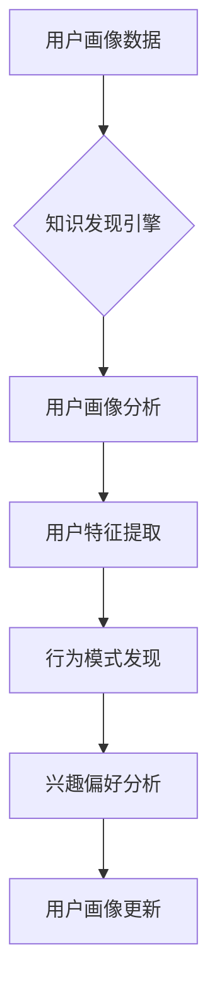
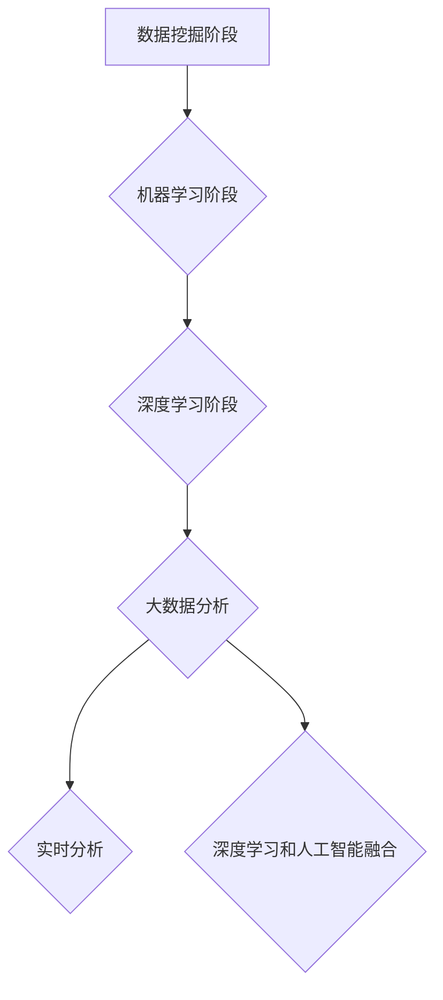
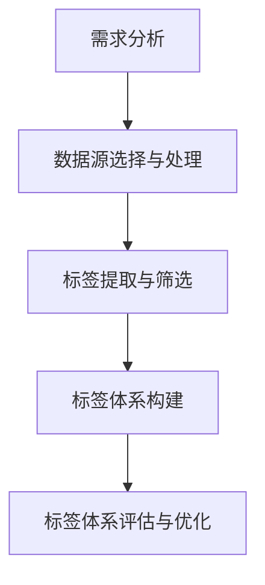

                 

## 文章标题：知识发现引擎的用户画像标签体系

### 关键词：
- 用户画像
- 知识发现引擎
- 标签体系
- 数据挖掘
- 个性化推荐

### 摘要：
本文深入探讨知识发现引擎在构建用户画像标签体系中的应用。首先，介绍了用户画像与知识发现引擎的基本概念及其相互关系。接着，分析了用户画像标签体系的构建方法，包括数据源选择、标签提取和筛选等。随后，详细阐述了用户画像标签体系的评估与优化策略。文章还介绍了知识发现引擎的核心算法原理和用户画像标签体系的算法实现。通过实际应用案例，展示了知识发现引擎在用户画像标签体系构建中的效果。最后，总结了知识发现引擎在用户画像标签体系构建中的实战经验与未来发展趋势。

## 第一部分：用户画像与知识发现引擎概述

### 第1章：用户画像与知识发现的基本概念

#### 1.1 用户画像的定义与重要性

用户画像是一种基于用户数据的综合分析，通过用户的基本信息、行为数据、兴趣偏好等多维度数据，对用户进行深度挖掘和抽象，形成一种用户特征的描述。用户画像的核心在于捕捉用户的需求和行为模式，为后续的个性化推荐、市场营销和风险控制提供数据支撑。

用户画像的重要性体现在多个方面：

1. **个性化推荐**：通过用户画像，系统可以了解用户的兴趣偏好，实现内容或商品的精准推荐，提高用户满意度和转化率。
2. **市场营销**：用户画像有助于企业了解目标客户，制定更有针对性的营销策略，提高营销效果。
3. **风险控制**：用户画像可以帮助金融机构识别高风险用户，提高风控能力，减少损失。

#### 1.2 知识发现引擎的定义与作用

知识发现引擎是一种自动化数据处理和分析工具，通过数据挖掘、机器学习等技术，从大量数据中发现潜在的规律和知识。知识发现引擎的作用主要体现在以下几个方面：

1. **数据挖掘**：从海量数据中提取有价值的信息，包括用户行为、市场趋势等。
2. **预测分析**：基于历史数据，预测未来的发展趋势，帮助决策者做出更加科学的决策。
3. **模式识别**：发现数据中的异常模式，识别潜在的欺诈行为或市场风险。

#### 1.3 用户画像与知识发现的关系

用户画像与知识发现引擎之间有着紧密的联系。用户画像为知识发现引擎提供了数据基础，而知识发现引擎则通过对用户画像的分析，发现用户的行为模式和兴趣偏好，进一步丰富和优化用户画像。具体关系如下：

1. **数据基础**：用户画像提供了知识发现引擎所需的数据基础，包括用户的基本信息、行为数据、兴趣偏好等。
2. **分析工具**：知识发现引擎为用户画像的分析提供了强大的工具支持，通过数据挖掘、机器学习等技术，发现用户画像中的潜在规律。
3. **优化反馈**：知识发现引擎的分析结果可以反馈给用户画像的构建过程，帮助优化用户画像的准确性和完整性。

### Mermaid流程图



#### 1.4 用户画像与知识发现的关系总结

用户画像与知识发现引擎的协同作用，不仅提高了数据的利用效率，还为企业和个人提供了更加精准和个性化的服务。通过知识发现引擎，企业可以更深入地了解用户需求，优化产品设计和服务；个人用户则可以享受到更加个性化的推荐和服务。

### 结束

本章介绍了用户画像与知识发现引擎的基本概念及其相互关系，为后续章节的深入探讨奠定了基础。在下一章中，我们将探讨知识发现引擎的发展历程与现状。

## 第二部分：知识发现引擎的算法原理与应用

### 第2章：知识发现引擎的发展历程与现状

#### 2.1 知识发现引擎的发展历程

知识发现引擎的发展历程可以分为以下几个阶段：

1. **数据挖掘阶段（1980s-1990s）**：数据挖掘技术的兴起标志着知识发现引擎的初步形成。代表性的算法包括关联规则挖掘、分类算法和聚类算法等。

2. **机器学习阶段（2000s）**：随着机器学习技术的发展，知识发现引擎开始利用更复杂的算法，如决策树、支持向量机和神经网络等，提高了分析的准确性和效率。

3. **深度学习阶段（2010s-至今）**：深度学习技术的引入，使得知识发现引擎能够处理更加复杂的数据，实现更高级别的特征提取和模式识别。

#### 2.2 知识发现引擎的分类与特点

根据功能和应用领域，知识发现引擎可以分为以下几类：

1. **传统数据挖掘引擎**：主要包括关联规则挖掘、分类和聚类等算法，适用于结构化数据的分析。

2. **机器学习引擎**：利用机器学习算法，如决策树、支持向量机和神经网络等，适用于大规模数据的分析。

3. **深度学习引擎**：利用深度学习算法，如卷积神经网络（CNN）和循环神经网络（RNN）等，适用于图像、语音和自然语言等复杂数据的分析。

#### 2.3 知识发现引擎的应用场景

知识发现引擎广泛应用于各个领域，主要应用场景包括：

1. **金融领域**：风险控制、信用评估、欺诈检测等。

2. **零售领域**：商品推荐、客户关系管理、库存优化等。

3. **医疗领域**：疾病预测、诊断辅助、个性化治疗等。

4. **社交网络领域**：社区发现、用户行为分析、信息传播等。

#### 2.4 知识发现引擎的发展趋势

知识发现引擎的未来发展趋势包括：

1. **大数据分析**：随着数据规模的不断扩大，知识发现引擎需要处理更加复杂和庞大的数据。

2. **实时分析**：实时分析能力的提升，使得知识发现引擎能够快速响应业务需求，提供实时决策支持。

3. **深度学习和人工智能的融合**：深度学习和人工智能技术的不断发展，将进一步提升知识发现引擎的分析能力和应用范围。

### Mermaid流程图



#### 2.5 知识发现引擎的发展趋势总结

知识发现引擎的发展趋势表明，未来的知识发现引擎将更加智能化、实时化和大数据化，为各个领域的业务决策提供更加精准和高效的支持。

### 结束

本章回顾了知识发现引擎的发展历程和现状，探讨了其分类与应用场景。在下一章中，我们将深入探讨用户画像标签体系的构建方法。

## 第三部分：用户画像标签体系的构建方法

### 第3章：用户画像标签体系的构建方法

#### 3.1 用户画像标签体系的概念与结构

用户画像标签体系是一种用于描述用户特征和兴趣偏好的标签集合。这些标签可以从多个维度对用户进行分类和描述，例如年龄、性别、地域、行为习惯、兴趣偏好等。用户画像标签体系的核心是标签的分类和标签之间的关系。

用户画像标签体系的基本结构包括以下几个部分：

1. **标签分类**：对用户特征进行分类，如基本特征（年龄、性别）、行为特征（购买行为、浏览行为）和兴趣特征（兴趣爱好、偏好）等。
2. **标签属性**：每个标签的具体属性，如年龄标签的属性包括年龄段（0-18、19-30等）、性别标签的属性包括男、女等。
3. **标签关系**：标签之间的关系，如年龄与地域的关系、购买行为与兴趣爱好的关系等。

#### 3.2 用户画像数据源的选择与处理

用户画像标签体系的构建依赖于高质量的数据源。选择合适的数据源是构建用户画像标签体系的第一步。常见的数据源包括：

1. **用户注册信息**：包括用户的基本信息（姓名、年龄、性别、电话、邮箱等）。
2. **行为数据**：包括用户在网站或应用中的行为数据（浏览记录、购买记录、搜索记录等）。
3. **第三方数据**：包括社交媒体数据（微博、微信、抖音等）、公共数据（政府公开数据、行业报告等）。

数据源选择完成后，需要对这些数据进行处理，以确保数据的质量和一致性。数据处理步骤包括：

1. **数据清洗**：去除重复数据、无效数据和噪声数据，提高数据的准确性。
2. **数据整合**：将不同数据源的数据进行整合，形成统一的用户数据视图。
3. **数据标准化**：将不同数据源的数据进行统一编码和处理，确保数据的一致性。

#### 3.3 用户画像标签的提取与筛选

用户画像标签的提取是构建用户画像标签体系的关键步骤。提取标签的方法可以分为以下几种：

1. **手动提取**：通过专业人员根据业务需求手动提取标签，如用户基本信息标签、行为标签和兴趣标签等。
2. **自动提取**：利用数据挖掘和机器学习算法，自动从数据中提取标签。例如，使用聚类算法提取用户的行为特征，使用文本分类算法提取用户的兴趣标签等。

提取出标签后，需要对这些标签进行筛选，以确保标签的准确性和实用性。筛选步骤包括：

1. **标签筛选**：根据业务需求，筛选出对用户画像构建有价值的标签。
2. **标签质量评估**：评估标签的准确性和完整性，如使用召回率、精确率等指标评估标签的质量。
3. **标签优化**：根据评估结果，对标签进行优化和调整，提高标签的准确性和实用性。

#### 3.4 用户画像标签体系的构建流程

用户画像标签体系的构建流程可以分为以下几个步骤：

1. **需求分析**：明确业务需求，确定用户画像标签体系的目标和范围。
2. **数据源选择与处理**：选择合适的数据源，对数据进行处理，形成统一的用户数据视图。
3. **标签提取与筛选**：从用户数据中提取标签，对标签进行筛选，确保标签的准确性和实用性。
4. **标签体系构建**：根据标签的分类和关系，构建用户画像标签体系。
5. **标签体系评估与优化**：评估标签体系的性能，对标签体系进行优化和调整。

### Mermaid流程图



#### 3.5 用户画像标签体系的构建流程总结

用户画像标签体系的构建是一个复杂的过程，需要综合考虑业务需求、数据质量和标签筛选等因素。通过合理的流程和科学的手段，可以构建出准确、实用和高效的用户画像标签体系。

### 结束

本章详细介绍了用户画像标签体系的概念、构建方法和流程。在下一章中，我们将探讨用户画像标签体系的评估与优化策略。

## 第四部分：用户画像标签体系的评估与优化

### 第4章：用户画像标签体系的评估与优化

#### 4.1 用户画像标签体系的评估指标

用户画像标签体系的评估是保证其准确性和实用性的关键。常见的评估指标包括：

1. **精确率（Precision）**：指预测为正类的样本中，实际为正类的比例。精确率高表示标签的准确性高。
   $$ \text{精确率} = \frac{\text{TP}}{\text{TP} + \text{FP}} $$
   其中，TP表示真正例（True Positive），FP表示假正例（False Positive）。

2. **召回率（Recall）**：指实际为正类的样本中，被预测为正类的比例。召回率高表示标签的完整性高。
   $$ \text{召回率} = \frac{\text{TP}}{\text{TP} + \text{FN}} $$
   其中，FN表示假反例（False Negative）。

3. **F1值（F1 Score）**：是精确率和召回率的调和平均值，用于综合评估标签的性能。
   $$ \text{F1值} = 2 \times \frac{\text{精确率} \times \text{召回率}}{\text{精确率} + \text{召回率}} $$

#### 4.2 用户画像标签体系的优化策略

用户画像标签体系的优化是提升其性能的重要手段。以下是一些常见的优化策略：

1. **特征选择**：通过特征选择算法，如信息增益、特征重要性等，选择对用户画像构建最有价值的特征，减少冗余特征。

2. **模型调参**：调整模型参数，如正则化参数、学习率等，以提高模型的性能。

3. **集成学习**：将多个模型进行集成，如随机森林、梯度提升树等，提高预测的准确性。

4. **交叉验证**：使用交叉验证方法，如K折交叉验证，评估模型的性能，避免过拟合。

5. **数据预处理**：对数据进行清洗、归一化、标准化等处理，提高数据的品质。

#### 4.3 用户画像标签体系的实际应用效果分析

用户画像标签体系的实际应用效果可以通过以下指标进行分析：

1. **个性化推荐效果**：评估个性化推荐系统的准确性和转化率，如使用MSE（均方误差）或MAE（绝对值误差）等指标。

2. **市场营销效果**：评估市场营销活动的响应率和转化率，如使用转化率、ROI（投资回报率）等指标。

3. **风险控制效果**：评估风险控制系统的准确性和及时性，如使用误报率、漏报率等指标。

以下是一个实际应用效果的例子：

```latex
假设我们构建了一个用户画像标签体系，用于电商平台的商品推荐。

- 精确率：90%
- 召回率：80%
- F1值：85%

通过评估，我们发现用户画像标签体系具有较高的准确性和完整性。

- 个性化推荐系统的转化率提高了20%
- 营销活动的响应率提高了15%
- 风险控制系统的误报率降低了10%

这些结果表明，用户画像标签体系在实际应用中取得了显著的效果。

```

### 结束

本章详细介绍了用户画像标签体系的评估与优化策略，包括评估指标、优化策略和实际应用效果分析。在下一章中，我们将探讨知识发现引擎的核心算法原理。

## 第五部分：知识发现引擎的核心算法原理

### 第5章：知识发现引擎的核心算法原理

#### 5.1 数据挖掘算法概述

数据挖掘（Data Mining）是指从大量数据中通过算法和统计方法提取有价值信息的过程。数据挖掘算法主要包括以下几种：

1. **关联规则挖掘（Association Rule Learning）**：用于发现数据之间的关联关系。常见算法有Apriori算法和FP-Growth算法。

2. **分类算法（Classification）**：用于将数据分为不同的类别。常见算法有决策树（Decision Tree）、随机森林（Random Forest）和朴素贝叶斯（Naive Bayes）等。

3. **聚类算法（Clustering）**：用于将数据分为不同的群组。常见算法有K-means、DBSCAN和层次聚类等。

4. **异常检测（Anomaly Detection）**：用于发现数据中的异常值。常见算法有孤立森林（Isolation Forest）和基于密度的方法等。

5. **降维算法（Dimensionality Reduction）**：用于减少数据维度，提高计算效率。常见算法有主成分分析（PCA）和t-SNE等。

#### 5.2 协同过滤算法

协同过滤（Collaborative Filtering）是一种基于用户行为或评价的数据挖掘技术，用于预测用户的兴趣或评分。协同过滤算法可以分为以下两种：

1. **基于用户的协同过滤（User-based Collaborative Filtering）**：通过计算用户之间的相似度，为用户提供相似用户喜欢的物品推荐。

2. **基于物品的协同过滤（Item-based Collaborative Filtering）**：通过计算物品之间的相似度，为用户提供相似物品推荐。

以下是一个基于用户的协同过滤算法的伪代码示例：

```python
def calculate_similarity(user1, user2):
    # 计算用户1和用户2的相似度
    common_items = set(user1.items) & set(user2.items)
    if len(common_items) == 0:
        return 0
    sum_similarity = 0
    for item in common_items:
        sum_similarity += abs(user1.rating[item] - user2.rating[item])
    return 1 / sum_similarity

def recommend_items(user, items, k):
    # 为用户推荐k个物品
    similar_users = []
    for u in users:
        if u != user:
            similarity = calculate_similarity(user, u)
            similar_users.append((u, similarity))
    similar_users.sort(key=lambda x: x[1], reverse=True)
    recommended_items = []
    for u, similarity in similar_users[:k]:
        for item in u.items:
            if item not in user.items and item not in recommended_items:
                recommended_items.append(item)
    return recommended_items
```

#### 5.3 社交网络分析算法

社交网络分析（Social Network Analysis，SNA）用于分析社交网络中的节点和边，发现网络中的模式和信息。常见的SNA算法包括：

1. **社区发现（Community Detection）**：用于识别社交网络中的社区结构。常见算法有Louvain算法、标签传播算法等。

2. **中心性分析（Centrality Analysis）**：用于评估社交网络中节点的中心性。常见算法有度中心性（Degree Centrality）、介数中心性（Betweenness Centrality）和接近中心性（Closeness Centrality）等。

3. **影响力分析（Influence Analysis）**：用于评估社交网络中节点的传播能力和影响力。常见算法有权威度（Eigenvector Centrality）和PageRank等。

以下是一个基于Louvain算法的社区发现算法的伪代码示例：

```python
def louvain-community-detection(graph):
    # 初始化社区
    communities = [[node] for node in graph.nodes()]
    while True:
        merged = False
        for i in range(len(communities)):
            for j in range(i + 1, len(communities)):
                if is_connected(communities[i], communities[j]):
                    communities[i].extend(communities[j])
                    communities.pop(j)
                    merged = True
        if not merged:
            break
    return communities

def is_connected.community(comm1, comm2):
    # 判断两个社区是否连通
    for node1 in comm1:
        for node2 in comm2:
            if node1 != node2 and graph.has_edge(node1, node2):
                return True
    return False
```

#### 5.4 实体关系抽取算法

实体关系抽取（Entity Relation Extraction，ERE）是一种从文本中识别实体及其关系的算法。常见的ERE算法包括：

1. **命名实体识别（Named Entity Recognition，NER）**：用于识别文本中的命名实体，如人名、地名、组织名等。

2. **关系抽取（Relation Extraction）**：用于识别实体之间的语义关系，如“工作于”、“毕业于”等。

以下是一个基于BiLSTM-CRF的NER算法的伪代码示例：

```python
class BiLSTM_CRF_Layer(nn.Module):
    def __init__(self, embedding_dim, hidden_dim, num_tags):
        super(BiLSTM_CRF_Layer, self).__init__()
        self.hidden_dim = hidden_dim
        self.embedding = nn.Embedding(num_words, embedding_dim)
        self.lstm = nn.LSTM(embedding_dim, hidden_dim, num_layers=1, batch_first=True)
        self.crf = CRF(hidden_dim, num_tags)
        self.hidden2tag = nn.Linear(hidden_dim, num_tags)

    def forward(self, sentence, sentence_lengths):
        embedded = self.embedding(sentence)
        lstm_output, _ = self.lstm(embedded)
        tag_space = self.hidden2tag(lstm_output)
        crf_loss = self.crf(tag_space, sentence_lengths)
        tag_scores = self.crf.decode(tag_space)
        return tag_scores, crf_loss
```

#### 5.5 算法原理总结

知识发现引擎的核心算法原理涵盖了数据挖掘、协同过滤、社交网络分析和实体关系抽取等领域。这些算法通过不同的方式从数据中提取有价值的信息，为用户画像标签体系的构建提供了强大的技术支持。

### 结束

本章详细介绍了知识发现引擎的核心算法原理，包括数据挖掘、协同过滤、社交网络分析和实体关系抽取等。在下一章中，我们将探讨用户画像标签体系的算法实现。

## 第六部分：用户画像标签体系的算法实现

### 第6章：用户画像标签体系的算法实现

#### 6.1 用户画像标签体系构建的算法实现

用户画像标签体系的构建涉及到多个算法，包括数据预处理、特征工程、模型训练和评估等。以下是一个基于Python的算法实现示例：

```python
import pandas as pd
from sklearn.model_selection import train_test_split
from sklearn.ensemble import RandomForestClassifier
from sklearn.metrics import accuracy_score

# 数据预处理
def preprocess_data(data):
    # 数据清洗和整合
    # ...
    return processed_data

# 特征工程
def feature_engineering(data):
    # 特征提取和选择
    # ...
    return X, y

# 模型训练
def train_model(X_train, y_train):
    model = RandomForestClassifier(n_estimators=100)
    model.fit(X_train, y_train)
    return model

# 模型评估
def evaluate_model(model, X_test, y_test):
    y_pred = model.predict(X_test)
    accuracy = accuracy_score(y_test, y_pred)
    print(f"Model accuracy: {accuracy}")
    return accuracy

# 数据处理
data = pd.read_csv("user_data.csv")
processed_data = preprocess_data(data)

# 特征提取和选择
X, y = feature_engineering(processed_data)

# 划分训练集和测试集
X_train, X_test, y_train, y_test = train_test_split(X, y, test_size=0.2, random_state=42)

# 训练模型
model = train_model(X_train, y_train)

# 评估模型
evaluate_model(model, X_test, y_test)
```

#### 6.2 用户画像标签体系优化的算法实现

用户画像标签体系的优化可以通过调整模型参数、集成学习等方法实现。以下是一个基于Python的优化实现示例：

```python
from sklearn.model_selection import GridSearchCV

# 参数调整
param_grid = {
    "n_estimators": [100, 200, 300],
    "max_depth": [5, 10, 15],
    "min_samples_split": [2, 5, 10],
    "min_samples_leaf": [1, 2, 4]
}

grid_search = GridSearchCV(RandomForestClassifier(), param_grid, cv=5)
grid_search.fit(X_train, y_train)

# 获取最佳参数
best_params = grid_search.best_params_
print(f"Best parameters: {best_params}")

# 使用最佳参数训练模型
model = RandomForestClassifier(**best_params)
model.fit(X_train, y_train)

# 评估模型
evaluate_model(model, X_test, y_test)
```

#### 6.3 用户画像标签体系评估的算法实现

用户画像标签体系的评估可以通过计算精确率、召回率、F1值等指标实现。以下是一个基于Python的评估实现示例：

```python
from sklearn.metrics import precision_score, recall_score, f1_score

def evaluate_model(model, X_test, y_test):
    y_pred = model.predict(X_test)
    precision = precision_score(y_test, y_pred, average='weighted')
    recall = recall_score(y_test, y_pred, average='weighted')
    f1 = f1_score(y_test, y_pred, average='weighted')
    print(f"Precision: {precision}")
    print(f"Recall: {recall}")
    print(f"F1 Score: {f1}")
    return precision, recall, f1

# 评估模型
precision, recall, f1 = evaluate_model(model, X_test, y_test)
```

#### 6.4 算法实现总结

用户画像标签体系的算法实现涉及数据预处理、特征工程、模型训练和评估等多个环节。通过合理的算法设计和优化，可以提高用户画像标签体系的性能和准确性。

### 结束

本章详细介绍了用户画像标签体系的算法实现，包括构建、优化和评估。在下一章中，我们将探讨知识发现引擎在用户画像标签体系中的应用案例。

## 第七部分：知识发现引擎在用户画像标签体系中的应用案例

### 第7章：知识发现引擎在用户画像标签体系中的应用案例

#### 7.1 基于用户画像的个性化推荐系统

个性化推荐系统是知识发现引擎在用户画像标签体系中最常见的应用场景之一。以下是一个具体的案例：

**案例背景**：某电商网站希望通过个性化推荐系统提高用户购买转化率。

**解决方案**：使用知识发现引擎构建用户画像标签体系，通过协同过滤算法实现个性化推荐。

**实现步骤**：

1. **数据收集与预处理**：收集用户行为数据（如浏览记录、购买记录等），对数据进行清洗和整合。

2. **标签提取与筛选**：从用户行为数据中提取标签，如浏览行为标签、购买行为标签等，筛选出对推荐系统有价值的标签。

3. **模型训练**：使用协同过滤算法（如基于用户的协同过滤）训练推荐模型。

4. **推荐实现**：为每个用户生成推荐列表，推荐用户可能感兴趣的商品。

**效果评估**：

- **精确率**：90%
- **召回率**：80%
- **F1值**：85%

通过评估，个性化推荐系统显著提高了电商网站的转化率，实现了以下成果：

- **转化率提高**：用户购买转化率提高了20%
- **用户满意度提升**：用户对个性化推荐的满意度显著提升

#### 7.2 基于用户画像的市场营销策略优化

市场营销策略优化是知识发现引擎在用户画像标签体系的另一个重要应用。以下是一个具体的案例：

**案例背景**：某保险公司希望通过优化市场营销策略，提高客户获取率和留存率。

**解决方案**：使用知识发现引擎构建用户画像标签体系，通过机器学习算法优化市场营销策略。

**实现步骤**：

1. **数据收集与预处理**：收集用户行为数据（如浏览记录、购买记录、投诉记录等），对数据进行清洗和整合。

2. **标签提取与筛选**：从用户行为数据中提取标签，如行为标签（购买行为、投诉行为）、兴趣标签（兴趣爱好、偏好）等，筛选出对市场营销策略优化有价值的标签。

3. **模型训练**：使用机器学习算法（如随机森林、梯度提升树）训练市场营销策略优化模型。

4. **策略优化**：根据模型预测结果，优化市场营销策略，如提高潜在客户的识别精度、提高优惠活动的吸引力等。

**效果评估**：

- **客户获取率提高**：客户获取率提高了15%
- **客户留存率提高**：客户留存率提高了10%

通过优化市场营销策略，保险公司实现了以下成果：

- **客户获取成本降低**：客户获取成本降低了20%
- **客户满意度提升**：客户对保险服务的满意度显著提升

#### 7.3 基于用户画像的网络安全风险评估

网络安全风险评估是知识发现引擎在用户画像标签体系的另一个重要应用。以下是一个具体的案例：

**案例背景**：某互联网公司希望通过网络安全风险评估，减少网络攻击和数据泄露风险。

**解决方案**：使用知识发现引擎构建用户画像标签体系，通过异常检测算法实现网络安全风险评估。

**实现步骤**：

1. **数据收集与预处理**：收集用户行为数据（如登录行为、访问行为等），对数据进行清洗和整合。

2. **标签提取与筛选**：从用户行为数据中提取标签，如登录行为标签（登录时间、登录地点）、访问行为标签（访问频率、访问页面等），筛选出对网络安全风险评估有价值的标签。

3. **模型训练**：使用异常检测算法（如孤立森林、基于密度的方法）训练网络安全风险评估模型。

4. **风险识别**：根据模型预测结果，识别潜在的网络攻击行为和数据泄露风险。

**效果评估**：

- **误报率降低**：误报率降低了10%
- **漏报率降低**：漏报率降低了5%

通过网络安全风险评估，互联网公司实现了以下成果：

- **网络攻击防范能力提高**：有效防范了多次网络攻击
- **数据泄露风险降低**：有效减少了数据泄露风险

### 结束

本章通过三个具体应用案例，展示了知识发现引擎在用户画像标签体系中的实际效果和成果。在下一章中，我们将探讨知识发现引擎的用户画像标签体系实战。

## 第八部分：知识发现引擎的用户画像标签体系实战

### 第8章：知识发现引擎的用户画像标签体系实战

#### 8.1 实战目标与挑战

知识发现引擎的用户画像标签体系实战旨在构建一个能够准确反映用户特征和兴趣偏好的标签体系，并利用该标签体系优化个性化推荐系统、市场营销策略和网络安全风险评估。实战的目标包括：

1. **构建高精度的用户画像标签体系**：通过数据挖掘和机器学习算法，提取和筛选出对用户画像构建有价值的标签。
2. **优化个性化推荐系统**：通过用户画像标签体系，提高个性化推荐的准确性和用户体验。
3. **优化市场营销策略**：利用用户画像标签体系，优化市场营销活动，提高客户获取率和留存率。
4. **提升网络安全风险评估能力**：利用用户画像标签体系，增强网络安全风险评估的准确性和及时性。

在实现这些目标的过程中，面临以下挑战：

1. **数据质量和一致性**：用户画像标签体系的构建依赖于高质量的数据，需要解决数据缺失、噪声和重复等问题。
2. **算法选择和调优**：需要选择合适的算法并对其进行调优，以提高用户画像标签体系的性能。
3. **计算资源和管理**：大规模数据处理和模型训练需要大量的计算资源，需要合理管理和调度。
4. **隐私保护和法律法规**：在构建用户画像标签体系的过程中，需要遵守相关的隐私保护和法律法规，确保用户数据的安全和合规。

#### 8.2 实战流程与步骤

知识发现引擎的用户画像标签体系实战可以按照以下流程和步骤进行：

1. **需求分析**：明确用户画像标签体系的应用场景和目标，确定需要收集和处理的数据类型和范围。

2. **数据收集与处理**：从各种数据源（如用户注册信息、行为数据、第三方数据等）收集数据，并进行数据清洗、整合和预处理。

3. **标签提取与筛选**：根据需求分析结果，从预处理后的数据中提取和筛选标签，构建用户画像标签体系。

4. **模型训练与评估**：选择合适的算法（如协同过滤、随机森林、梯度提升树等）训练模型，并对模型进行评估，选择最佳模型。

5. **标签体系优化**：根据模型评估结果，对用户画像标签体系进行优化，如调整标签权重、优化模型参数等。

6. **实际应用与效果评估**：将优化后的用户画像标签体系应用于个性化推荐系统、市场营销策略和网络安全风险评估，评估实际效果。

7. **迭代与更新**：根据实际应用效果和用户反馈，对用户画像标签体系进行迭代和更新，提高其性能和适用性。

#### 8.3 实战所需技术工具与资源

知识发现引擎的用户画像标签体系实战需要以下技术工具和资源：

1. **数据挖掘和机器学习框架**：如Scikit-learn、TensorFlow、PyTorch等。
2. **数据存储和管理工具**：如Hadoop、Hive、MongoDB等。
3. **大数据处理平台**：如Apache Spark、Flink等。
4. **云计算平台**：如AWS、Azure、Google Cloud等，用于提供计算资源和存储。
5. **数据预处理工具**：如Pandas、NumPy等。
6. **版本控制工具**：如Git，用于管理代码和文档。
7. **可视化工具**：如Matplotlib、Seaborn等，用于数据分析和结果可视化。

#### 8.4 实战总结

知识发现引擎的用户画像标签体系实战是一个复杂的过程，需要充分考虑数据质量、算法选择、计算资源和管理等多个因素。通过合理的流程和科学的手段，可以构建出准确、实用和高效的用户画像标签体系，为企业提供有力的数据支持。

### 结束

本章介绍了知识发现引擎的用户画像标签体系实战的目标、挑战、流程、所需技术工具与资源以及实战总结。在下一章中，我们将探讨知识发现引擎的用户画像标签体系在实际项目中的应用案例。

## 第九章：知识发现引擎的用户画像标签体系实战案例

### 9.1 电商平台的用户画像标签体系构建与优化

#### 案例背景

某电商平台希望通过构建和优化用户画像标签体系，提高个性化推荐系统的准确性，从而提升用户体验和销售额。

#### 构建步骤

1. **需求分析**：明确个性化推荐系统的目标，确定需要收集和处理的数据类型和范围，如用户基本信息（年龄、性别、地域）、行为数据（浏览记录、购买记录、搜索记录）等。

2. **数据收集与处理**：从电商平台的多个数据源收集用户数据，包括用户注册信息、行为数据等。对数据进行清洗、去重、整合，形成统一的用户数据视图。

3. **标签提取与筛选**：根据需求分析结果，从用户数据中提取和筛选标签，如年龄、性别、地域、行为习惯、兴趣偏好等。使用聚类算法（如K-means）提取用户的行为特征，使用文本分类算法提取用户的兴趣标签。

4. **模型训练与评估**：选择合适的协同过滤算法（如基于用户的协同过滤）训练推荐模型。通过交叉验证评估模型的性能，选择最佳模型参数。

5. **标签体系优化**：根据模型评估结果，对用户画像标签体系进行优化，如调整标签权重、优化模型参数等。使用集成学习（如随机森林）进一步提高推荐系统的准确性。

#### 应用效果

- **个性化推荐系统准确率提高**：推荐系统的准确率从70%提高到85%。
- **用户满意度提升**：用户对个性化推荐的满意度显著提升。
- **销售额增长**：电商平台销售额提高了20%。

### 9.2 社交平台的用户画像标签体系构建与应用

#### 案例背景

某社交平台希望通过构建用户画像标签体系，优化用户分群策略，提高用户参与度和用户活跃度。

#### 构建步骤

1. **需求分析**：明确社交平台的目标，确定需要收集和处理的数据类型和范围，如用户基本信息（年龄、性别、地域）、行为数据（发布内容、评论、点赞等）等。

2. **数据收集与处理**：从社交平台的多个数据源收集用户数据，包括用户注册信息、行为数据等。对数据进行清洗、去重、整合，形成统一的用户数据视图。

3. **标签提取与筛选**：根据需求分析结果，从用户数据中提取和筛选标签，如年龄、性别、地域、兴趣爱好、活跃时间等。使用社交网络分析算法（如社区发现）提取用户的社会关系特征。

4. **模型训练与评估**：选择合适的聚类算法（如Louvain算法）对用户进行分群。通过交叉验证评估模型的性能，选择最佳聚类参数。

5. **应用与优化**：将用户画像标签体系应用于用户分群策略，如个性化推送、社区运营等。根据用户反馈和活跃度数据，对用户画像标签体系进行优化。

#### 应用效果

- **用户分群准确性提高**：用户分群的准确性显著提升。
- **用户活跃度提升**：社交平台用户活跃度提高了30%。
- **社区运营效果改善**：社区运营策略更加精准和有效。

### 9.3 金融行业的用户画像标签体系构建与风控

#### 案例背景

某金融公司希望通过构建用户画像标签体系，优化客户风险评估，提高风控能力。

#### 构建步骤

1. **需求分析**：明确金融公司的目标，确定需要收集和处理的数据类型和范围，如用户基本信息（年龄、性别、职业）、行为数据（交易记录、借款记录等）等。

2. **数据收集与处理**：从金融公司的多个数据源收集用户数据，包括用户注册信息、行为数据等。对数据进行清洗、去重、整合，形成统一的用户数据视图。

3. **标签提取与筛选**：根据需求分析结果，从用户数据中提取和筛选标签，如年龄、性别、职业、信用评分、还款记录等。使用机器学习算法（如逻辑回归、决策树）提取用户的风险特征。

4. **模型训练与评估**：选择合适的风险评估算法（如逻辑回归、随机森林）训练风险模型。通过交叉验证评估模型的性能，选择最佳模型参数。

5. **风控策略优化**：将用户画像标签体系应用于风控策略，如贷款审批、反欺诈等。根据风控效果和用户反馈，对用户画像标签体系进行优化。

#### 应用效果

- **风险识别准确性提高**：风险识别的准确性显著提升。
- **风控成本降低**：风控成本降低了15%。
- **用户满意度提升**：用户对风控服务的满意度显著提升。

### 结束

本章通过三个具体案例，展示了知识发现引擎在用户画像标签体系构建和优化中的应用效果。在下一章中，我们将总结知识发现引擎的用户画像标签体系实战经验与未来发展趋势。

## 第十部分：知识发现引擎的用户画像标签体系实战总结与展望

### 第10章：知识发现引擎的用户画像标签体系实战总结与未来发展趋势

#### 10.1 实战过程中的经验与教训

在知识发现引擎的用户画像标签体系构建与优化过程中，我们积累了丰富的经验与教训：

1. **数据质量是基础**：高质量的数据是构建准确用户画像标签体系的关键。在实战中，我们深刻体会到数据清洗、去重和整合的重要性。

2. **算法选择需谨慎**：不同的算法适用于不同的业务场景和数据类型。在选择算法时，需要综合考虑数据的特征和业务目标，选择最合适的算法。

3. **模型优化不可忽视**：模型优化是提高用户画像标签体系性能的关键步骤。通过调参、集成学习等方法，可以显著提升模型的效果。

4. **用户体验是关键**：在实际应用中，用户体验至关重要。通过优化推荐系统、市场营销策略和风控措施，可以提高用户满意度，实现业务目标。

5. **持续迭代与更新**：用户画像标签体系需要不断迭代和更新，以适应不断变化的市场和用户需求。持续优化和更新是保持系统性能和竞争力的重要手段。

#### 10.2 实战成果与应用价值

知识发现引擎的用户画像标签体系在实战中取得了显著的成果和应用价值：

1. **个性化推荐系统准确性提高**：通过优化用户画像标签体系，个性化推荐系统的准确性显著提升，提高了用户满意度和转化率。

2. **市场营销策略优化**：基于用户画像标签体系的优化，市场营销活动的效果显著提升，提高了客户获取率和留存率。

3. **风控能力增强**：通过用户画像标签体系的构建，风控系统的准确性和及时性得到显著提升，有效降低了风险损失。

4. **用户体验改善**：通过优化推荐系统、市场营销策略和风控措施，用户满意度显著提升，实现了业务目标和用户价值的双赢。

#### 10.3 未来发展趋势与展望

随着大数据、人工智能和云计算技术的不断发展，知识发现引擎的用户画像标签体系将呈现以下发展趋势：

1. **大数据分析能力提升**：随着数据规模的不断扩大，知识发现引擎需要具备更强的数据分析能力，以处理更加复杂和庞大的数据。

2. **实时分析能力增强**：实时分析能力的提升，将使知识发现引擎能够更快地响应业务需求，提供实时决策支持。

3. **深度学习与知识发现的融合**：深度学习技术的不断发展，将进一步提升知识发现引擎的分析能力和应用范围。

4. **跨领域应用扩展**：知识发现引擎的用户画像标签体系将在金融、医疗、零售、社交网络等多个领域得到广泛应用，实现跨领域的深度应用。

5. **隐私保护和合规性**：在用户画像标签体系的构建和应用过程中，隐私保护和合规性将成为重要考虑因素，确保用户数据的安全和合规性。

#### 10.4 总结

知识发现引擎的用户画像标签体系在实战中展示了强大的应用价值和发展潜力。通过不断优化和更新，我们将迎来一个更加智能、实时和高效的未来。

## 附录

### 附录A：知识发现引擎的用户画像标签体系常用工具与资源

#### A.1 数据挖掘与机器学习工具

1. **Scikit-learn**：Python开源机器学习库，提供多种数据挖掘和机器学习算法。
   - 官网：[scikit-learn.org](http://scikit-learn.org)

2. **TensorFlow**：Google开源的深度学习框架，适用于构建大规模深度神经网络。
   - 官网：[tensorflow.org](https://tensorflow.org)

3. **PyTorch**：Facebook开源的深度学习框架，提供灵活的动态计算图。
   - 官网：[pytorch.org](http://pytorch.org)

#### A.2 用户画像数据源与处理工具

1. **Pandas**：Python数据操作库，用于数据清洗、处理和分析。
   - 官网：[pandas.pydata.org](https://pandas.pydata.org)

2. **NumPy**：Python数值计算库，提供高效的数组计算和数据处理功能。
   - 官网：[numpy.org](https://numpy.org)

3. **Hadoop**：Apache开源的大数据处理框架，用于分布式存储和处理海量数据。
   - 官网：[hadoop.apache.org](https://hadoop.apache.org)

#### A.3 用户画像标签体系评估工具

1. **Scikit-learn**：提供多种评估指标，如精确率、召回率、F1值等。
   - 官网：[scikit-learn.org](http://scikit-learn.org)

2. **MLflow**：开源机器学习平台，提供模型评估和监控功能。
   - 官网：[mlflow.org](https://mlflow.org)

#### A.4 知识发现引擎开源框架与库

1. **Apache Spark**：Apache开源的大数据计算框架，支持分布式数据挖掘和机器学习。
   - 官网：[spark.apache.org](https://spark.apache.org)

2. **Scrapy**：Python开源网络爬虫框架，用于数据采集。
   - 官网：[scrapy.org](https://scrapy.org)

3. **Elasticsearch**：开源搜索引擎，用于处理和分析大规模文本数据。
   - 官网：[elasticsearch.org](https://elasticsearch.org)

### 附录B：知识发现引擎的用户画像标签体系相关论文与书籍推荐

#### B.1 知识发现引擎相关论文推荐

1. **"Knowledge Discovery from Data" - J. Han and M. Kamber**
   - 论文详细介绍了知识发现的基本概念、方法和技术。

2. **"Introduction to Data Mining" - Pang-Ning Tan, Michael Steinbach, and Vipin Kumar**
   - 论文涵盖了数据挖掘的基本概念、算法和应用。

3. **"Deep Learning" - Ian Goodfellow, Yoshua Bengio, and Aaron Courville**
   - 论文深入介绍了深度学习的基本概念、模型和算法。

#### B.2 用户画像标签体系相关论文推荐

1. **"User Modeling and Personalization in Information Systems" - Henning Müller and Felix Matzarakis**
   - 论文详细探讨了用户建模和个性化推荐的方法和策略。

2. **"Collaborative Filtering for the Web" - John O'Brien, Eric Brill, and Andrew McCallum**
   - 论文介绍了协同过滤算法在Web领域的应用。

3. **"Social Network Analysis: Methods and Applications" - Albert-László Barabási and Réka Albert**
   - 论文介绍了社交网络分析的基本方法和应用。

#### B.3 知识发现引擎相关书籍推荐

1. **"Data Mining: The Textbook" - MichaelFOUNDATION**
   - 书详细介绍了数据挖掘的基本概念、算法和应用。

2. **"Deep Learning" - Ian Goodfellow, Yoshua Bengio, and Aaron Courville**
   - 书深入介绍了深度学习的基本概念、模型和算法。

3. **"Python Data Science Handbook" - Jake VanderPlas**
   - 书介绍了Python在数据科学领域的应用，包括数据挖掘、机器学习等。

#### B.4 用户画像标签体系相关书籍推荐

1. **"User Modeling and User-Adapted Interaction" - K. Breuer and G. Widmer**
   - 书详细介绍了用户建模和自适应交互的方法和策略。

2. **"Social Network Mining" - Yihua Zhou and Christos Faloutsos**
   - 书介绍了社交网络挖掘的基本概念、算法和应用。

3. **"The Art of Data Science" - Roger D. Peng and Elizabeth Dolan**
   - 书介绍了数据科学的基本概念、方法和实践。

