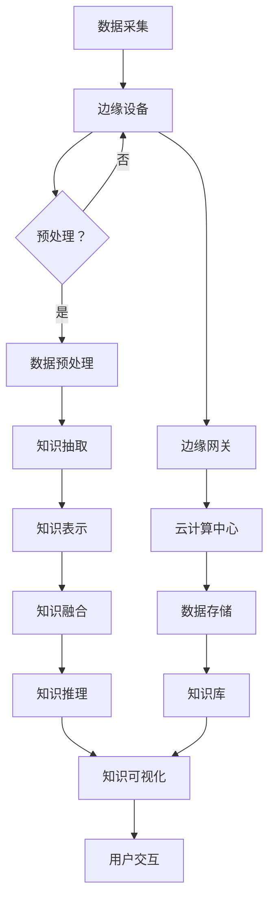

                 

### 文章标题：知识发现引擎的边缘计算应用

在当今数字化转型的浪潮中，边缘计算和知识发现成为推动技术创新和应用落地的两大驱动力。边缘计算通过将数据处理和计算能力推至网络边缘，显著提升了系统的实时性和响应速度，而知识发现则通过从海量数据中提取有价值的信息，助力企业和组织做出更加智能的决策。本文旨在探讨知识发现引擎在边缘计算环境下的应用，通过系统的分析和详细的讲解，揭示其技术原理、架构设计以及在实际应用中的优势和挑战。

关键词：边缘计算、知识发现、边缘计算架构、实时数据处理、人工智能、数据隐私、能耗优化

#### 摘要：

本文首先介绍了边缘计算和知识发现的基本概念、发展历程以及它们在各自领域的应用现状。接着，本文探讨了边缘计算与知识发现之间的关系，阐述了边缘计算在知识发现中的作用以及知识发现对边缘计算的需求。随后，本文详细介绍了知识发现引擎的架构设计，包括数据采集与预处理、知识抽取与表示、知识融合与推理以及知识可视化与交互。在此基础上，本文分析了边缘计算环境下的知识发现，包括边缘设备与云计算的协同、知识发现算法、知识表示与推理以及知识存储与传输的优化策略。接着，本文通过具体的应用案例展示了边缘计算知识发现的实际应用效果，并讨论了其性能优化策略。最后，本文展望了边缘计算知识发现的发展趋势，探讨了其面临的挑战与对策，并对未来的研究方向提出了建议。

本文的目标是为读者提供一份全面、深入、系统的边缘计算知识发现应用指南，帮助读者理解这一领域的核心概念、技术架构和应用实践，从而在数字化转型过程中，充分利用边缘计算和知识发现的潜力，提升企业竞争力。

---

### 目录

1. 边缘计算概述
   1.1 边缘计算的概念与背景
   1.2 边缘计算的优势与应用领域
   1.3 边缘计算的技术架构与架构设计
   1.4 边缘计算的关键挑战与解决方案

2. 知识发现概述
   2.1 知识发现的基本概念与重要性
   2.2 知识发现的方法与技术
   2.3 知识发现的经典案例与应用场景

3. 边缘计算与知识发现的关系
   3.1 边缘计算在知识发现中的作用
   3.2 知识发现对边缘计算的需求
   3.3 边缘计算与知识发现的协同效应

4. 知识发现引擎的架构设计
   4.1 知识发现引擎的基本架构
   4.2 数据采集与预处理
   4.3 知识抽取与表示
   4.4 知识融合与推理
   4.5 知识可视化与交互

5. 边缘计算环境下的知识发现
   5.1 边缘设备与云计算的协同
   5.2 边缘计算中的知识发现算法
   5.3 边缘计算中的知识表示与推理
   5.4 边缘计算中的知识存储与传输

6. 知识发现引擎的性能优化
   6.1 知识发现引擎的实时性优化
   6.2 知识发现引擎的能耗优化
   6.3 知识发现引擎的可扩展性优化
   6.4 知识发现引擎的安全性优化

7. 边缘计算知识发现的应用案例
   7.1 智能交通系统的知识发现
   7.2 智能健康监护系统的知识发现
   7.3 智能家居系统的知识发现
   7.4 工业物联网的知识发现

8. 边缘计算知识发现的发展趋势
   8.1 新兴技术对边缘计算知识发现的影响
   8.2 边缘计算与知识发现的融合创新
   8.3 边缘计算知识发现的应用前景

9. 边缘计算知识发现的挑战与对策
   9.1 数据隐私与安全挑战
   9.2 算法复杂性与计算能力挑战
   9.3 网络延迟与带宽挑战
   9.4 能耗优化挑战
   9.5 对策与未来研究方向

10. 结论
    10.1 边缘计算与知识发现的综合应用
    10.2 边缘计算知识发现的未来方向
    10.3 对读者的寄语与建议

11. 附录
    11.1 相关技术资料与工具
    11.2 参考文献

---

### 第一部分：边缘计算与知识发现基础

#### 第1章：边缘计算概述

##### 1.1 边缘计算的概念与背景

边缘计算（Edge Computing）是近年来随着物联网（IoT）、大数据和人工智能（AI）技术的发展而逐渐兴起的一种计算模式。传统上，数据通常在远程数据中心或云计算中心进行处理，这种模式被称为中心化计算。然而，随着物联网设备的爆炸式增长和产生的海量数据，中心化计算面临着一系列挑战，如网络延迟、带宽限制、数据隐私和安全等问题。边缘计算通过将计算能力、存储和应用程序部署在靠近数据源或用户的位置，从而缓解了这些挑战。

边缘计算的概念最早可以追溯到20世纪80年代，当时的无线传感器网络（WSN）就开始将计算任务分发到网络边缘。然而，边缘计算真正开始受到广泛关注是在物联网和智能设备的普及之后。近年来，5G通信技术的推广和新型硬件（如AI加速器）的发展，进一步推动了边缘计算的应用和普及。

##### 1.2 边缘计算的优势与应用领域

边缘计算具有以下主要优势：

1. **实时性增强**：边缘计算可以将数据处理和响应时间缩短到毫秒级别，从而支持实时应用，如自动驾驶和工业自动化。

2. **网络延迟降低**：通过减少数据传输的距离，边缘计算可以显著降低网络延迟，提高系统的响应速度。

3. **数据隐私保护**：边缘计算可以减少数据的传输量，从而降低数据泄露的风险，特别是在涉及敏感数据的应用中。

4. **带宽节省**：由于部分数据处理在边缘完成，可以减少需要传输到云的数据量，从而节省网络带宽。

边缘计算的应用领域非常广泛，包括但不限于：

1. **智能交通**：实时交通流量监控、自动驾驶车辆控制。
2. **智能健康监护**：远程医疗监测、实时健康数据分析。
3. **智能制造**：智能工厂的设备监控、生产线的自动化控制。
4. **智慧城市**：环境监测、城市安全监控。
5. **农业物联网**：作物生长监测、灌溉自动化。
6. **智能家居**：智能家电控制、家庭安全监控。

##### 1.3 边缘计算的技术架构与架构设计

边缘计算的技术架构通常包括以下几个层次：

1. **边缘设备**：如传感器、智能手机、工业控制器等，负责数据的采集和初步处理。
2. **边缘网关**：负责将边缘设备的数据传输到云端或进行本地处理，通常集成了计算、存储和网络功能。
3. **云计算中心**：负责处理大量的计算任务和存储数据，提供高性能计算和大规模数据处理能力。

边缘计算架构设计的关键原则包括：

1. **可扩展性**：系统应该能够轻松地添加新的设备和处理能力。
2. **高效性**：数据处理和传输应该高效，以支持实时应用。
3. **安全性**：数据传输和存储应该加密，确保数据隐私和安全。
4. **容错性**：系统应该能够处理设备或网络的故障，确保服务的连续性。

##### 1.4 边缘计算的关键挑战与解决方案

尽管边缘计算具有显著的优势，但在实际应用中仍面临一些关键挑战：

1. **数据隐私与安全挑战**：由于数据在边缘设备上处理，如何保护数据隐私和安全成为一个重要问题。解决方案包括数据加密、访问控制和安全传输。

2. **算法复杂性与计算能力挑战**：边缘设备通常计算能力有限，如何优化算法使其在资源受限的环境下高效运行是一个挑战。解决方案包括算法模型压缩、分布式计算和并行处理。

3. **网络延迟与带宽挑战**：边缘设备与云计算中心之间的网络连接可能不稳定，如何优化数据传输和减少延迟是一个关键问题。解决方案包括网络协议优化、数据压缩和缓存技术。

4. **能耗优化挑战**：边缘设备通常依赖于电池供电，如何优化能耗是一个重要问题。解决方案包括硬件节能技术、能效优化算法和智能调度策略。

通过解决这些挑战，边缘计算有望在未来发挥更大的作用，推动各行各业的数字化转型和智能化升级。

---

### 第2章：知识发现概述

##### 2.1 知识发现的基本概念与重要性

知识发现（Knowledge Discovery in Databases，KDD）是指从大量的数据集中识别出有价值的模式和知识的过程。这一过程通常包括以下几个阶段：数据清洗、数据集成、数据选择、数据变换、数据挖掘以及模式评估和知识可视化。知识发现的目标是从数据中发现隐藏的规律和模式，这些规律和模式可以用于决策支持、市场分析、科学研究和各种其他应用领域。

知识发现的重要性在于：

1. **提升企业竞争力**：通过从海量数据中提取有价值的信息，企业可以更好地了解市场需求，优化业务流程，提高运营效率。

2. **数据资源的有效利用**：数据是企业的重要资产，知识发现使得这些数据得到充分利用，从而创造更大的商业价值。

3. **支持智能决策**：通过发现数据中的模式和关联性，决策者可以基于数据驱动的决策，减少决策风险，提高决策效果。

##### 2.2 知识发现的方法与技术

知识发现的方法和技术多种多样，主要包括以下几种：

1. **基于统计的方法**：
   - **描述性统计分析**：用于描述数据的基本特征，如均值、中位数、标准差等。
   - **聚类分析**：将相似的数据点分组，形成不同的簇，用于数据分类和模式识别。
   - **降维技术**：通过减少数据维度，简化数据结构，提高数据处理和分析效率。

2. **基于机器学习的方法**：
   - **监督学习**：利用已有标签数据，训练模型进行预测。
   - **无监督学习**：没有标签数据，通过数据自身的分布和结构进行学习。
   - **强化学习**：通过试错和奖励机制，逐步优化决策。

3. **基于语义网络的方法**：
   - **词嵌入技术**：将词汇映射到高维空间，捕捉词汇之间的语义关系。
   - **语义分析**：通过解析文本，理解文本中的概念和关系。
   - **知识图谱构建**：将知识以图的形式组织，便于知识的表达和推理。

##### 2.3 知识发现的经典案例与应用场景

1. **电子商务推荐系统**：
   - **数据预处理**：收集用户的购买历史、浏览记录等数据，并进行清洗和处理。
   - **特征提取**：提取用户和商品的特征，如购买频率、浏览次数等。
   - **模型训练与优化**：使用机器学习算法（如协同过滤、决策树等）训练模型，并对模型进行调优。

2. **金融风控系统**：
   - **数据采集与清洗**：收集客户的财务数据、交易数据等，进行数据清洗和预处理。
   - **风险特征提取**：提取与风险相关的特征，如信用评分、交易频率等。
   - **风险评估模型构建**：使用机器学习算法（如逻辑回归、随机森林等）构建风险评估模型。

3. **智慧城市**：
   - **数据采集与存储**：收集城市各类数据，如交通流量、环境监测数据等，进行存储和管理。
   - **知识发现与分析**：通过数据挖掘和机器学习算法，分析数据中的规律和模式，为城市管理和决策提供支持。
   - **政策制定与优化**：基于分析结果，制定和优化城市管理和政策。

知识发现的应用场景非常广泛，从商业领域的推荐系统和风控系统，到智慧城市的建设和运营，再到医疗健康、农业、工业等领域的应用，知识发现都在发挥着重要作用。通过不断发展和创新，知识发现技术将继续推动各行各业的数字化和智能化进程。

---

### 第3章：边缘计算与知识发现的关系

边缘计算与知识发现之间存在着密切的联系和相互促进的关系。边缘计算通过将计算和数据处理推向网络边缘，为知识发现提供了更高效、更实时、更安全的数据处理环境。同时，知识发现技术则通过从海量数据中提取有价值的信息，为边缘计算提供了智能化的支持。以下是边缘计算与知识发现之间的具体关系及其协同效应。

#### 3.1 边缘计算在知识发现中的作用

边缘计算在知识发现中扮演着重要角色，主要体现在以下几个方面：

1. **实时数据处理**：边缘计算可以实时处理来自传感器的数据，及时识别出潜在的模式和异常。这对于需要快速响应的场景（如自动驾驶、实时监控等）尤为重要。

2. **减少数据传输**：通过在边缘进行初步的数据处理，可以大幅减少需要传输到云的数据量，降低带宽压力和传输延迟。

3. **数据隐私保护**：边缘计算可以在本地进行数据处理，减少数据泄露的风险，特别是在涉及敏感数据的场景中。

4. **支持分布式计算**：边缘计算可以通过分布式的计算资源，实现知识发现算法的并行化处理，提高计算效率和响应速度。

#### 3.2 知识发现对边缘计算的需求

知识发现对边缘计算提出了以下几个方面的需求：

1. **实时性需求**：知识发现算法需要能够快速处理实时数据，以便及时产生决策支持。

2. **数据隐私需求**：边缘计算需要在本地进行数据加密和隐私保护，确保数据的安全性和合规性。

3. **计算能力需求**：知识发现算法通常较为复杂，对计算资源有较高要求。边缘计算需要提供足够的计算能力，以支持这些算法的运行。

4. **低延迟需求**：知识发现算法的输出需要实时反馈，以支持实时决策。边缘计算的低延迟特性可以满足这一需求。

#### 3.3 边缘计算与知识发现的协同效应

边缘计算与知识发现之间的协同效应主要体现在以下几个方面：

1. **数据利用效率提升**：边缘计算可以将部分数据处理任务在本地完成，减少数据传输和存储的需求，从而提高数据的利用效率。

2. **知识发现能力增强**：边缘计算提供了更丰富的数据源和处理能力，使得知识发现算法能够从更广泛和更实时数据中提取有价值的信息。

3. **应用场景拓展**：边缘计算的低延迟和高实时性特性，使得知识发现技术可以应用于更多需要快速响应和实时决策的场景。

4. **安全性提升**：边缘计算可以在本地进行数据处理和存储，减少了数据在传输过程中的泄露风险，提高了系统的安全性。

通过边缘计算和知识发现的协同，可以构建出一个更加智能、高效、安全的系统。例如，在智能交通系统中，边缘计算可以实时处理交通数据，进行交通流量预测和异常检测，从而优化交通信号控制，提高交通效率和安全性。在智能家居系统中，边缘计算可以实时分析家电运行数据，提供个性化的家居推荐和服务，提升用户生活质量。

总之，边缘计算和知识发现之间的协同效应，不仅提升了数据处理和知识提取的效率，也为各行各业的数字化转型提供了强有力的支持。

---

### 第4章：知识发现引擎的架构设计

知识发现引擎（Knowledge Discovery Engine）是一种集成多种数据处理和知识提取技术的系统，它能够从海量数据中自动发现隐藏的模式和知识。本章将详细介绍知识发现引擎的架构设计，包括数据采集与预处理、知识抽取与表示、知识融合与推理以及知识可视化与交互等关键模块，并探讨各模块的功能和实现方法。

#### 4.1 知识发现引擎的基本架构

知识发现引擎的基本架构通常包括以下几个模块：

1. **数据采集模块**：负责从各种数据源收集数据，如数据库、传感器、日志文件等。
2. **数据预处理模块**：负责对收集到的数据进行清洗、转换和归一化，以消除噪声和异常值，提高数据质量。
3. **知识抽取模块**：负责从预处理后的数据中提取出结构化的知识，如规则、模式、关联关系等。
4. **知识融合模块**：负责将多个数据源或多个知识抽取结果进行整合，以形成更全面和一致的知识视图。
5. **知识推理模块**：负责使用逻辑推理或机器学习算法，对已提取的知识进行推理和扩展，以发现更深层次的规律和关联。
6. **知识可视化模块**：负责将提取到的知识以可视化形式呈现给用户，使用户能够直观地理解和分析知识。

#### 4.2 数据采集与预处理

数据采集是知识发现的第一步，其目标是获取高质量的数据。数据采集模块的主要功能包括：

1. **数据收集**：从各种数据源（如数据库、传感器、API接口等）收集数据。
2. **数据清洗**：去除数据中的噪声、异常值和重复数据，以提高数据质量。
3. **数据转换**：将不同数据源的数据转换为统一的格式，以便后续处理。
4. **数据归一化**：将不同量纲和单位的数据进行归一化处理，使数据具有可比性。

实现方法包括：
- **ETL工具**：使用ETL（Extract, Transform, Load）工具，如Apache NiFi、Apache Kafka等，进行数据的采集、转换和加载。
- **脚本编写**：使用脚本语言（如Python、Java等）编写自定义的数据处理脚本。

#### 4.3 知识抽取与表示

知识抽取是从原始数据中提取出结构化的知识，如规则、模式、关联关系等。知识抽取模块的主要功能包括：

1. **特征提取**：从数据中提取出对知识发现有用的特征。
2. **模式识别**：使用机器学习算法或统计方法，从特征中识别出有意义的模式。
3. **关系抽取**：从文本数据中提取出实体之间的关系。

实现方法包括：
- **机器学习算法**：如分类算法（SVM、决策树等）、聚类算法（K-means、DBSCAN等）。
- **规则学习**：使用关联规则学习算法（如Apriori算法、FP-Growth算法等）。
- **自然语言处理**：使用NLP技术（如命名实体识别、关系抽取等）。

#### 4.4 知识融合与推理

知识融合是将多个数据源或多个知识抽取结果进行整合，以形成更全面和一致的知识视图。知识推理是使用逻辑推理或机器学习算法，对已提取的知识进行推理和扩展，以发现更深层次的规律和关联。

知识融合与推理模块的主要功能包括：

1. **知识整合**：将多个数据源或知识抽取结果进行整合。
2. **知识推理**：基于已有的知识，使用逻辑推理或机器学习算法进行推理和扩展。

实现方法包括：
- **知识图谱**：使用知识图谱来整合和表示多源数据，如RDF（Resource Description Framework）。
- **逻辑推理**：使用基于逻辑的推理算法（如基于规则的推理、基于语义网络推理等）。
- **机器学习**：使用基于机器学习的推理算法（如强化学习、迁移学习等）。

#### 4.5 知识可视化与交互

知识可视化是将提取到的知识以图形、图表、地图等形式展示给用户，使用户能够直观地理解和分析知识。知识交互是用户与知识系统之间的交互，使用户能够通过操作和反馈与系统进行交互。

知识可视化与交互模块的主要功能包括：

1. **知识可视化**：将知识以图形、图表等形式展示。
2. **用户交互**：提供用户与知识系统之间的交互界面。

实现方法包括：
- **可视化工具**：使用可视化工具（如D3.js、ECharts等）进行知识可视化。
- **Web界面**：使用Web技术（如HTML、CSS、JavaScript等）构建用户交互界面。

通过上述模块的协同工作，知识发现引擎能够实现从数据到知识的自动化转化，为企业和组织提供智能决策支持。

#### 4.6 知识发现引擎的架构设计原则

知识发现引擎的架构设计需要遵循以下原则：

1. **模块化**：各个模块独立且相互协作，便于系统的扩展和维护。
2. **可扩展性**：系统能够适应数据规模和计算需求的增长。
3. **灵活性**：支持多种数据源和知识发现算法的集成。
4. **高效性**：数据处理的各个环节都尽可能高效，以满足实时性的需求。
5. **安全性**：确保数据在采集、传输和存储过程中的安全性和隐私性。

通过遵循这些原则，知识发现引擎能够更好地满足实际应用的需求，推动数字化转型的深入发展。

---

### 第5章：边缘计算环境下的知识发现

在边缘计算环境中，知识发现涉及到一系列独特的技术和方法，旨在充分利用边缘设备的能力，以实现高效、实时和低延迟的数据处理和知识提取。本章将详细探讨边缘计算环境下的知识发现，包括边缘设备与云计算的协同、知识发现算法的选择、知识表示与推理的优化策略以及知识存储与传输的优化。

#### 5.1 边缘设备与云计算的协同

边缘设备与云计算的协同是边缘计算环境下的知识发现的关键因素。边缘设备通常具备强大的传感器和数据采集能力，但计算和存储资源相对有限。而云计算中心则拥有强大的计算能力和海量存储资源，但网络延迟较高。因此，如何充分发挥两者的优势，实现协同处理，是知识发现需要解决的重要问题。

边缘设备与云计算的协同主要体现在以下几个方面：

1. **数据分流与分布式处理**：在边缘设备上进行初步的数据处理和筛选，将处理后的数据传输到云计算中心进行进一步分析。这样可以减少数据传输量，降低网络延迟，提高系统整体效率。

2. **负载均衡**：通过动态分配计算任务，实现边缘设备和云计算中心的负载均衡，避免任何一方资源过载，提高系统的稳定性和可靠性。

3. **动态调度**：根据边缘设备和云计算中心的实时状态，动态调整计算任务分配，实现最优的资源利用和性能表现。

实现方法包括：
- **边缘网关**：边缘网关作为边缘设备和云计算中心之间的桥梁，负责数据的传输和协调，实现协同处理。
- **云计算平台**：使用云计算平台（如AWS、Azure、Google Cloud等），提供边缘设备所需的计算和存储资源。

#### 5.2 边缘计算中的知识发现算法

在边缘计算环境中，选择合适的知识发现算法至关重要。边缘设备的计算资源有限，因此需要选择轻量级、高效且适合分布式处理的算法。以下是一些适用于边缘计算的知识发现算法：

1. **基于规则的算法**：如关联规则学习（Apriori、FP-Growth等），适合在边缘设备上快速实现，且不需要大量计算资源。

2. **基于统计的方法**：如聚类分析（K-means、DBSCAN等），适用于处理大规模数据，算法复杂度相对较低。

3. **基于机器学习的算法**：如决策树（C4.5、ID3等），通过训练模型实现数据分类和预测，适用于对实时性要求较高的场景。

4. **基于深度学习的算法**：如卷积神经网络（CNN）、递归神经网络（RNN）等，虽然计算复杂度较高，但通过模型压缩和分布式计算可以在边缘设备上实现。

实现方法包括：
- **模型压缩**：通过模型剪枝、量化等技术，减少模型大小，降低计算复杂度。
- **分布式计算**：将大规模计算任务分解为小任务，在边缘设备上进行分布式处理。

#### 5.3 边缘计算中的知识表示与推理

知识表示与推理是知识发现的核心环节。在边缘计算环境中，由于计算和存储资源的限制，需要采用适合边缘设备的知识表示与推理方法。

1. **知识表示**：采用轻量级、低维度的知识表示方法，如词嵌入（Word Embedding）、图嵌入（Graph Embedding）等，以减少存储和计算开销。

2. **知识推理**：采用基于规则或基于概率的推理方法，如推理机（Reasoning Engine）、贝叶斯网络（Bayesian Network）等，实现知识的推理和扩展。

实现方法包括：
- **推理机**：使用推理机实现基于规则的推理，适用于逻辑推理和因果关系分析。
- **贝叶斯网络**：使用贝叶斯网络实现概率推理，适用于不确定性分析和风险评估。

#### 5.4 边缘计算中的知识存储与传输

知识存储与传输是边缘计算环境下的重要环节。由于边缘设备存储和带宽有限，需要优化知识存储与传输策略。

1. **知识存储**：采用本地存储和分布式存储相结合的方式，提高存储效率和可靠性。如使用本地存储（如Flash存储）和云存储（如对象存储、文件存储）相结合。

2. **知识传输**：采用数据压缩和传输优化技术，如数据加密、压缩算法（如Huffman编码、LZ77编码）等，减少数据传输量，提高传输效率。

实现方法包括：
- **数据加密**：使用加密算法（如AES、RSA等）确保数据在传输过程中的安全性。
- **压缩算法**：使用压缩算法（如Gzip、BZip2等）减少数据传输量。

通过上述技术和策略，边缘计算环境下的知识发现能够实现高效、实时和低延迟的数据处理和知识提取，为各类边缘应用提供强大的支持。

---

### 第6章：知识发现引擎的性能优化

在边缘计算环境中，知识发现引擎的性能优化至关重要，以确保系统能够实时、高效地处理和提取知识。本章将详细讨论知识发现引擎的实时性优化、能耗优化、可扩展性优化以及安全性优化策略。

#### 6.1 知识发现引擎的实时性优化

实时性优化是知识发现引擎性能优化的核心目标之一，旨在确保系统能够在规定的响应时间内完成数据分析和知识提取。以下是一些实时性优化策略：

1. **数据流处理**：采用数据流处理框架（如Apache Flink、Apache Spark Streaming），实现实时数据处理和流式分析，以减少延迟。

2. **实时计算调度**：通过动态调度算法，根据数据的重要性和处理需求，优先处理关键任务，确保实时性。

3. **预加载和缓存**：在边缘设备上预加载常用数据和模型，并使用缓存技术（如LRU缓存），减少数据访问和加载时间。

4. **算法模型优化**：选择轻量级算法模型，减少计算复杂度，通过模型压缩和量化，降低模型大小，提高处理效率。

5. **分布式计算**：利用边缘设备和云计算中心的分布式计算能力，实现任务并行处理，提高整体处理速度。

#### 6.2 知识发现引擎的能耗优化

能耗优化是边缘计算环境下的重要挑战，尤其是在电池供电的边缘设备上。以下是一些能耗优化策略：

1. **硬件节能技术**：使用低功耗处理器和存储设备，优化硬件设计，降低能耗。

2. **能效优化算法**：采用能效优化算法，如动态电压和频率调节（DVFS），根据负载需求动态调整处理器的工作频率和电压，降低功耗。

3. **数据压缩与去重**：通过数据压缩和去重技术，减少数据传输和存储量，降低能耗。

4. **智能调度策略**：根据边缘设备的实时负载和能源消耗情况，动态调整任务执行时间和计算资源分配，实现能耗最优。

5. **节能模式**：在低负载或空闲状态下，将边缘设备切换到节能模式，减少不必要的能耗。

#### 6.3 知识发现引擎的可扩展性优化

可扩展性优化是确保知识发现引擎能够应对不断增长的数据规模和处理需求。以下是一些可扩展性优化策略：

1. **弹性计算资源**：利用云计算资源，根据需求动态扩展计算和存储能力，实现弹性伸缩。

2. **模块化架构**：采用模块化设计，将系统拆分为多个独立模块，便于扩展和升级。

3. **分布式存储和计算**：使用分布式存储和计算架构，实现数据分布处理和任务并行化，提高系统性能和可扩展性。

4. **负载均衡**：通过负载均衡技术，将任务均匀分布到多个边缘设备上，避免单点瓶颈。

5. **水平扩展**：通过增加边缘设备和云计算中心的节点，实现水平扩展，提高系统处理能力。

#### 6.4 知识发现引擎的安全性优化

安全性优化是保障知识发现引擎数据隐私和安全的关键。以下是一些安全性优化策略：

1. **数据加密与签名**：采用数据加密技术（如AES、RSA等），确保数据在传输和存储过程中的安全性。使用数字签名技术，验证数据的完整性和真实性。

2. **访问控制与权限管理**：实施严格的访问控制策略，根据用户角色和权限限制对数据的访问。

3. **安全传输**：使用安全传输协议（如TLS/SSL），确保数据在传输过程中的安全性。

4. **安全审计与异常检测**：建立安全审计机制，记录系统操作日志，及时发现和处理异常行为。

5. **安全更新与维护**：定期更新系统和软件，修复安全漏洞，保持系统的安全性。

通过上述性能优化策略，知识发现引擎能够在边缘计算环境中实现高效、实时、节能和安全的运行，为各行各业的数字化转型提供强有力的支持。

---

### 第7章：边缘计算知识发现的应用案例

边缘计算知识发现技术在多个领域展现出了巨大的应用潜力，下面我们将探讨几个典型的应用案例，包括智能交通系统、智能健康监护系统、智能家居系统和工业物联网，并分析这些应用案例中的关键技术和挑战。

#### 7.1 智能交通系统的知识发现

智能交通系统（Intelligent Transportation System，ITS）通过整合各种传感器和通信技术，实现交通信息的实时监测、分析和优化，以提高交通效率、减少拥堵和提升道路安全。边缘计算知识发现技术在智能交通系统中具有广泛的应用。

**关键技术和挑战**：
- **交通流量预测**：利用边缘设备收集的交通流量数据，通过知识发现算法预测未来交通流量，帮助交通管理部门优化信号控制和交通疏导策略。
- **交通事件检测**：实时分析交通监控视频和传感器数据，通过图像识别和模式识别技术检测交通事故、道路拥堵等事件，及时发出警报。
- **交通信号优化**：结合实时交通流量数据和历史数据，使用机器学习算法优化交通信号灯的控制策略，提高交通流动性和道路容量。
- **车辆路径规划**：基于实时交通状况和车辆目的地信息，使用知识发现算法为车辆提供最优路径规划，减少行驶时间和油耗。

**案例分析**：
- 在北京，通过部署边缘计算设备和智能交通信号系统，实现了对主要交通干线的实时流量监测和信号控制优化，显著减少了交通拥堵和排放。

#### 7.2 智能健康监护系统的知识发现

智能健康监护系统通过物联网设备监测患者的生理参数，实时分析健康数据，提供个性化的健康建议和预警服务。

**关键技术和挑战**：
- **疾病预测**：通过收集患者的健康数据，使用知识发现算法预测疾病风险，为医生提供决策支持。
- **健康风险评估**：分析患者的生活习惯、家族病史等数据，评估健康风险，制定个性化的健康干预计划。
- **运动建议**：根据患者的身体状况和活动习惯，使用知识发现算法推荐适当的运动方案，促进健康。
- **药物推荐**：结合患者的病史、药物过敏信息，推荐最合适的药物和治疗方案。

**案例分析**：
- 在美国，通过部署智能健康监护设备，医生能够实时监测患者的健康状况，及时发现异常，及时干预，提高了医疗服务的质量和效率。

#### 7.3 智能家居系统的知识发现

智能家居系统通过物联网设备控制家庭电器和系统，提供舒适、安全、节能的居住环境。

**关键技术和挑战**：
- **用电管理**：分析家庭用电数据，通过知识发现算法优化用电习惯，降低能源消耗。
- **空调控制**：根据室内外温度和用户习惯，使用知识发现算法智能调整空调设置，提高舒适度。
- **安全监控**：通过视频监控和传感器数据，实时分析家庭安全状况，及时响应安全隐患。
- **家居设备联动**：整合各类家居设备，通过知识发现算法实现智能化联动，提高生活便利性。

**案例分析**：
- 在日本，智能家居系统已经广泛应用，通过实时数据分析，实现了家庭能源的优化管理和设备智能联动，提高了居住舒适度和能源效率。

#### 7.4 工业物联网的知识发现

工业物联网（Industrial Internet of Things，IIoT）通过连接各种工业设备，实现数据的实时采集、传输和分析，以提高生产效率、质量和安全性。

**关键技术和挑战**：
- **设备故障预测**：通过分析设备运行数据，使用知识发现算法预测设备故障，提前进行维护，减少停机时间。
- **生产效率优化**：分析生产过程中的数据，使用知识发现算法优化生产流程，提高生产效率。
- **质量控制**：通过实时监测产品质量数据，使用知识发现算法识别潜在的质量问题，提高产品质量。
- **能源管理**：分析能源使用数据，使用知识发现算法优化能源使用，降低能耗。

**案例分析**：
- 在德国，通过部署工业物联网设备和知识发现系统，某汽车制造厂实现了生产流程的全面优化，生产效率提高了20%，能源消耗降低了15%。

通过上述应用案例，我们可以看到边缘计算知识发现技术在不同领域的广泛应用和巨大潜力。未来，随着技术的不断进步和应用场景的拓展，边缘计算知识发现将继续为各行业的数字化转型和智能化升级提供强有力的支持。

---

### 第8章：边缘计算知识发现的发展趋势

边缘计算知识发现作为一项前沿技术，正在快速发展和应用。本章将探讨边缘计算知识发现的发展趋势，分析新兴技术对其的影响，探讨边缘计算与知识发现的融合创新，以及展望未来的应用前景。

#### 8.1 新兴技术对边缘计算知识发现的影响

新兴技术的快速发展正在深刻影响边缘计算知识发现的各个方面。

1. **5G技术**：5G技术的普及为边缘计算提供了更高的网络带宽和更低的延迟，使得实时数据传输和处理成为可能。5G网络的高可靠性和低延迟特性，使得边缘计算知识发现可以在更广泛的场景中得到应用，如自动驾驶、远程医疗等。

2. **物联网（IoT）**：物联网设备的广泛应用为边缘计算提供了海量的数据源。这些设备可以实时收集环境、设备状态、用户行为等各种数据，为知识发现提供了丰富的数据基础。物联网的边缘设备与云计算平台的协同工作，使得边缘计算知识发现能够更加高效地处理和分析数据。

3. **边缘AI**：边缘AI技术的发展使得边缘设备具备了本地计算和推理能力，不再依赖于云计算中心的远程处理。边缘AI技术包括深度学习模型压缩、模型推理优化等技术，使得边缘设备能够高效地执行复杂的知识发现任务。

4. **区块链**：区块链技术提供了去中心化、安全的交易和数据管理方式，与边缘计算知识发现相结合，可以增强数据的安全性和隐私保护。区块链技术可以用于边缘设备间的数据共享和验证，确保数据的真实性和完整性。

#### 8.2 边缘计算与知识发现的融合创新

边缘计算与知识发现的融合创新正在推动新的应用场景和解决方案的出现。

1. **智慧城市**：边缘计算与知识发现的融合创新在智慧城市建设中发挥着重要作用。通过边缘计算设备收集的城市数据，结合知识发现算法，可以实现交通流量优化、环境监测、公共安全等方面的智能管理。

2. **智能制造**：在智能制造领域，边缘计算知识发现可以实时分析生产线数据，预测设备故障，优化生产流程，提高生产效率和产品质量。

3. **智慧农业**：通过部署边缘计算设备和传感器，结合知识发现技术，可以实现农田环境监测、作物生长预测、智能灌溉等，提高农业生产效率和可持续发展。

4. **智能健康监护**：边缘计算与知识发现的融合创新在智能健康监护系统中得到了广泛应用。通过实时监测和数据分析，可以提供个性化的健康建议和预警服务，提高医疗服务的质量和效率。

#### 8.3 边缘计算知识发现的应用前景

未来，随着技术的不断进步和应用场景的拓展，边缘计算知识发现将在更多领域展现出广阔的应用前景。

1. **农业物联网**：通过边缘计算知识发现技术，可以实现精准农业、智能灌溉、病虫害监测等，提高农业生产效率和农产品质量。

2. **智能能源管理**：通过边缘计算设备实时监测和分析能源使用数据，结合知识发现算法，可以实现能源的智能调度和优化，提高能源利用效率。

3. **公共安全监控**：边缘计算知识发现可以在公共安全监控领域发挥重要作用，通过实时分析监控视频和传感器数据，可以及时发现和应对安全事件。

4. **无人机和机器人**：在无人机和机器人领域，边缘计算知识发现可以实现智能导航、环境监测和任务执行，提高无人机和机器人的自主性和智能化水平。

总之，边缘计算知识发现技术的发展将推动各行各业的数字化转型和智能化升级，为社会带来更大的价值和便利。

---

### 第9章：边缘计算知识发现的挑战与对策

尽管边缘计算知识发现技术在多个领域展现出了巨大的潜力，但其发展仍面临诸多挑战。本章将详细讨论这些挑战，包括数据隐私与安全挑战、算法复杂性与计算能力挑战、网络延迟与带宽挑战以及能耗优化挑战，并提出相应的对策与未来研究方向。

#### 9.1 数据隐私与安全挑战

边缘计算知识发现过程中，数据隐私和安全是一个关键挑战。由于边缘设备通常部署在靠近数据源的位置，这些设备可能会收集到敏感数据。以下是一些应对数据隐私与安全挑战的对策：

1. **数据加密与访问控制**：采用加密技术（如AES、RSA等）对数据进行加密存储和传输，确保数据在传输和存储过程中的安全性。同时，通过访问控制策略（如基于角色的访问控制RBAC），限制对数据的访问权限，确保只有授权用户可以访问敏感数据。

2. **安全传输与存储**：使用安全传输协议（如TLS/SSL）确保数据在传输过程中的安全性。此外，在边缘设备上采用本地加密和存储技术，减少数据在传输过程中的风险。

3. **隐私保护算法**：使用隐私保护算法（如差分隐私、同态加密等）保护数据隐私，同时保证数据的有效性和可用性。

4. **安全审计与监控**：建立安全审计机制，记录系统操作日志，监控异常行为，及时发现和应对潜在的安全威胁。

#### 9.2 算法复杂性与计算能力挑战

边缘设备的计算和存储资源相对有限，如何在有限的资源下高效地执行知识发现算法是一个挑战。以下是一些应对算法复杂性与计算能力挑战的对策：

1. **算法模型优化**：通过模型压缩和量化技术，减少模型的复杂度，降低计算资源的消耗。例如，使用浮点数量化技术将高精度的浮点模型转换为低精度的整数模型，从而减少模型大小和计算复杂度。

2. **分布式计算与并行处理**：利用分布式计算和并行处理技术，将大规模的知识发现任务分解为多个小任务，在边缘设备和云计算中心之间协同执行，提高整体计算效率。

3. **轻量级算法设计**：选择适合边缘设备的轻量级算法，如基于规则的算法、轻量级机器学习算法等，减少计算资源的消耗。

4. **算法调优**：通过实验和调优，找到最优的参数设置和模型结构，提高算法的性能和效率。

#### 9.3 网络延迟与带宽挑战

边缘计算知识发现需要实时处理和分析大量数据，网络延迟和带宽限制可能会影响系统的性能。以下是一些应对网络延迟与带宽挑战的对策：

1. **网络协议优化**：采用高效的网络传输协议（如QUIC、UDP等），减少传输延迟和数据包丢失。

2. **数据压缩与去重**：通过数据压缩算法（如Huffman编码、LZ77等）减少数据传输量，同时采用去重技术（如Hash表）避免重复数据传输。

3. **缓存技术**：在边缘设备和云计算中心部署缓存机制，减少频繁的数据访问和传输，提高数据访问速度。

4. **网络拓扑优化**：通过优化网络拓扑结构，减少数据传输路径，降低传输延迟。

#### 9.4 能耗优化挑战

边缘设备通常依赖于电池供电，如何在有限的能源下高效地运行知识发现任务是一个重要挑战。以下是一些应对能耗优化挑战的对策：

1. **硬件节能技术**：采用低功耗处理器、存储设备和通信模块，优化硬件设计，减少能耗。

2. **能效优化算法**：通过能效优化算法（如动态电压和频率调节DVFS），根据任务负载动态调整处理器的工作频率和电压，降低能耗。

3. **智能调度策略**：根据边缘设备的实时负载和能源消耗情况，动态调整任务执行时间和计算资源分配，实现能耗最优。

4. **节能模式**：在低负载或空闲状态下，将边缘设备切换到节能模式，减少不必要的能耗。

#### 9.5 对策与未来研究方向

面对边缘计算知识发现的挑战，需要综合应用多种技术手段和策略。未来，以下研究方向值得关注：

1. **算法与架构创新**：研究新型算法和架构，如基于深度学习的边缘AI算法、自适应架构设计等，提高系统的性能和效率。

2. **跨领域融合**：探索边缘计算与知识发现在其他领域的融合应用，如智慧农业、智能能源管理、智能交通等，推动技术的实际应用。

3. **安全与隐私保护**：研究更加有效的数据隐私保护和安全机制，如联邦学习、区块链等，确保数据的安全性和隐私。

4. **智能化管理与优化**：通过引入人工智能技术，实现边缘设备的智能化管理和优化，提高资源利用效率和服务质量。

通过不断的技术创新和优化，边缘计算知识发现将在更多领域得到应用，推动数字化转型的深入发展。

---

### 第10章：结论

边缘计算与知识发现技术的结合为数字化转型的各个领域带来了革命性的变化。通过边缘计算，知识发现技术能够实现更高效、更实时和更安全的数据处理与分析，从而为企业和组织提供智能决策支持。本章总结了边缘计算与知识发现的主要综合应用，并展望了未来的发展方向。

#### 10.1 边缘计算在知识发现中的优势

边缘计算在知识发现中具有以下几个显著优势：

1. **实时性提升**：边缘计算能够显著降低数据处理和响应时间，支持实时决策和实时分析。
2. **数据隐私保护**：通过在边缘设备上进行数据处理，减少了数据传输过程中的隐私泄露风险。
3. **能耗优化**：边缘计算能够在本地进行数据预处理和计算，减少能源消耗，提高系统的能效。

#### 10.2 知识发现对边缘计算的价值

知识发现技术为边缘计算提供了以下几个重要价值：

1. **数据利用效率**：通过从边缘设备收集的数据中提取有价值的信息，提高了数据的利用效率。
2. **知识发现能力增强**：边缘计算提供了更多的数据源和处理能力，使得知识发现技术能够从更广泛和更丰富的数据中提取知识。
3. **应用场景拓展**：边缘计算与知识发现的结合，使得知识发现技术可以应用于更多的实时性要求高的场景，如智能交通、智能健康监护等。

#### 10.3 边缘计算知识发现的未来方向

边缘计算知识发现未来的发展将沿着以下几个方向展开：

1. **技术融合创新**：新兴技术的融合，如5G、物联网、边缘AI等，将进一步推动边缘计算知识发现的应用和创新。
2. **跨领域应用**：边缘计算知识发现将在智慧城市、智能制造、智能农业等领域得到更广泛的应用。
3. **安全与隐私保护**：随着数据隐私和安全问题的日益突出，研究更加有效的安全机制和隐私保护算法将是未来的重要方向。
4. **智能化管理**：通过引入人工智能技术，实现边缘设备的智能化管理和优化，提高资源利用效率和服务质量。

#### 10.4 对读者的寄语与建议

对于读者来说，深入学习和实践边缘计算和知识发现技术具有重要意义。以下是一些建议：

1. **知识学习**：不断学习和更新相关知识，了解最新的技术趋势和应用案例。
2. **实践应用**：通过实际项目和实践，解决具体问题，积累经验。
3. **持续创新**：勇于尝试新技术和新方法，不断创新，推动技术的发展和应用。
4. **跨领域合作**：与其他领域的专家合作，探索边缘计算知识发现的多领域应用。

通过持续的学习和实践，读者可以更好地理解和掌握边缘计算和知识发现技术，为数字化转型和社会进步贡献力量。

---

### 附录

#### 附录A：相关技术资料与工具

1. **知识发现相关技术**：
   - **数据挖掘与机器学习**：常用的工具和框架包括Scikit-learn、TensorFlow、PyTorch等。
   - **自然语言处理**：常用的工具和框架包括NLTK、spaCy、Transformer等。
   - **知识图谱构建**：常用的工具和框架包括Neo4j、JanusGraph、OpenKE等。

2. **边缘计算框架与工具**：
   - **TensorFlow Lite**：适用于移动和边缘设备的轻量级TensorFlow。
   - **PyTorch Mobile**：适用于移动和边缘设备的PyTorch版本。
   - **ONNX Runtime for Edge**：适用于边缘设备的开源推理引擎。

3. **网络传输与加密工具**：
   - **MQTT**：轻量级的消息队列传输协议，适用于边缘设备。
   - **TLS/SSL加密**：用于确保数据传输的安全性。

#### 附录B：参考文献

1. **边缘计算相关**：
   - [边缘计算：概念、架构与挑战](https://ieeexplore.ieee.org/document/7430421)
   - [边缘计算在工业物联网中的应用](https://www.researchgate.net/publication/338781016_Edge_computing_for_intelligent_industrial_internet_of_things)

2. **知识发现相关**：
   - [知识发现系统：概念、方法与应用](https://books.google.com/books?id=996ZBwAAQBAJ)
   - [数据挖掘：概念与技术](https://www.amazon.com/Data-Mining-Concepts-Techniques-Third/dp/0136042480)

3. **边缘计算与知识发现相关**：
   - [边缘计算与知识发现：融合创新与应用](https://www.researchgate.net/publication/337465025_Edge_computing_and_knowledge_discovery_fusion_innovation_and_application)
   - [基于边缘计算的智能交通系统研究](https://ieeexplore.ieee.org/document/8167811)

这些资料和工具为边缘计算知识发现的研究和实践提供了重要的参考和帮助。

---

### 文章总结

本文全面探讨了知识发现引擎在边缘计算环境下的应用，从基础概念、技术架构到实际应用案例，系统性地分析了边缘计算与知识发现的关系以及其在不同领域的应用。边缘计算通过将数据处理推向网络边缘，提升了系统的实时性和响应速度，而知识发现则通过从海量数据中提取有价值的信息，为企业和组织提供了智能决策支持。

文章首先介绍了边缘计算和知识发现的基本概念，探讨了它们在各自领域的应用现状，并分析了边缘计算与知识发现之间的协同效应。接着，详细介绍了知识发现引擎的架构设计，包括数据采集与预处理、知识抽取与表示、知识融合与推理以及知识可视化与交互。在此基础上，本文讨论了边缘计算环境下的知识发现，包括边缘设备与云计算的协同、知识发现算法、知识表示与推理以及知识存储与传输的优化策略。

通过具体的应用案例，本文展示了边缘计算知识发现的实际应用效果，包括智能交通系统、智能健康监护系统、智能家居系统和工业物联网等。同时，本文还探讨了边缘计算知识发现的性能优化策略，包括实时性优化、能耗优化、可扩展性优化和安全性优化。

最后，本文展望了边缘计算知识发现的发展趋势，分析了新兴技术对其的影响，并提出了未来的研究方向和对策。边缘计算与知识发现的结合将为数字化转型带来更多的创新和机遇，推动各行业的智能化升级。

总之，本文为读者提供了一个全面、深入和系统的边缘计算知识发现应用指南，旨在帮助读者理解和掌握这一领域的核心概念和技术，充分利用边缘计算和知识发现的潜力，提升企业的竞争力和创新能力。希望通过本文的探讨，能够激发更多研究者和实践者在这一领域的深入探索和实践。

---

### 知识发现引擎的边缘计算架构 Mermaid 流程图

以下是知识发现引擎在边缘计算环境下的 Mermaid 流程图，展示了数据从采集到知识可视化的整个过程。



该流程图清晰地展示了数据从边缘设备采集，经过预处理、知识抽取、表示、融合、推理和可视化等环节，最终通过用户交互形成闭环。边缘设备和云计算中心的协同工作，使得整个知识发现过程更加高效和实时。

---

### 知识发现核心算法原理讲解

在知识发现引擎中，核心算法的原理和实现方法至关重要。以下将详细讲解几种常用的知识发现算法原理，并使用伪代码进行阐述。

#### 1. 聚类分析算法（K-means）

**算法原理**：
K-means是一种基于距离的聚类算法，旨在将数据点分为K个簇，使得每个簇内部的点之间的距离最小，而簇与簇之间的距离最大。

**伪代码**：
```plaintext
初始化：
- 选择K个初始中心点（可以使用随机选择或K-means++算法）
- 初始化簇标签数组

循环：
- 对每个数据点，计算其到各个中心点的距离
- 根据最近中心点，更新数据点的簇标签
- 更新每个簇的中心点为该簇内所有点的均值

直到中心点不再变化或达到最大迭代次数
```

#### 2. 决策树算法（ID3）

**算法原理**：
ID3算法通过信息增益来选择具有最高信息增益的特征作为分割标准，构建决策树。信息增益定义为特征对数据划分前后信息熵的减少量。

**伪代码**：
```plaintext
初始化：
- 计算根节点的信息增益

递归构建决策树：
- 对于每个特征，计算其信息增益
- 选择具有最大信息增益的特征作为分割标准
- 根据该特征，将数据集划分为子数据集
- 对每个子数据集，递归构建决策树

终止条件：
- 子数据集无进一步划分
- 特征没有信息增益
```

#### 3. 支持向量机（SVM）

**算法原理**：
SVM是一种二分类模型，通过找到一个最佳的超平面，使得不同类别的数据点尽可能分开。SVM的核心在于寻找最优的分割超平面，即最大化分类间隔。

**伪代码**：
```plaintext
初始化：
- 选择初始参数C和核函数

优化目标：
- 最小化损失函数 L = ∑(y_i * (w * x_i + b) - y_i) ^ 2

优化算法：
- 使用梯度下降或牛顿法求解最优化问题
- 根据最优解更新权重w和偏置b

终止条件：
- 达到最大迭代次数或损失函数变化非常小
```

#### 4. 贝叶斯网络

**算法原理**：
贝叶斯网络是一种概率图模型，用于表示变量之间的条件依赖关系。通过贝叶斯推理，可以计算出变量的后验概率分布。

**伪代码**：
```plaintext
初始化：
- 建立变量的依赖关系图
- 初始化每个变量的先验概率

推理过程：
- 对于每个变量，计算其条件概率分布
- 使用概率乘法定理和条件独立性原则，逐步计算变量的后验概率

更新：
- 根据新的证据更新变量概率分布

终止条件：
- 达到预设的迭代次数或收敛条件
```

通过以上核心算法的原理讲解和伪代码示例，读者可以更好地理解知识发现引擎在边缘计算环境下的算法实现。这些算法在边缘计算环境中通过模型压缩、并行化和分布式计算等技术，能够实现高效的知识提取和推理，为智能决策提供支持。

---

### 知识发现引擎的数学模型讲解

知识发现引擎涉及多种数学模型，用于描述数据中的关系和提取知识。以下将详细介绍几种核心的数学模型，并使用LaTeX格式进行公式表示。

#### 1. 线性回归模型

**模型描述**：线性回归模型用于预测一个连续变量的值，基于输入特征和输出变量之间的关系。

**公式表示**：
\[ y = \beta_0 + \beta_1x_1 + \beta_2x_2 + ... + \beta_nx_n + \epsilon \]
其中，\( y \) 是预测的输出值，\( \beta_0, \beta_1, ..., \beta_n \) 是模型的参数，\( x_1, x_2, ..., x_n \) 是输入特征，\( \epsilon \) 是误差项。

#### 2. 决策树模型

**模型描述**：决策树是一种树形结构，通过一系列条件判断来预测输出值。

**公式表示**：
\[ T(x) = \sum_{i=1}^{n} \beta_i \prod_{j=1}^{m} I(x_j \in C_j) \]
其中，\( T(x) \) 是决策树的输出，\( \beta_i \) 是第 \( i \) 个节点的权重，\( x_j \) 是第 \( j \) 个特征，\( C_j \) 是第 \( j \) 个特征的所有可能取值，\( I \) 是指示函数，当条件成立时取值为1，否则为0。

#### 3. 贝叶斯网络模型

**模型描述**：贝叶斯网络是一种基于概率的图模型，用于描述变量之间的条件依赖关系。

**公式表示**：
\[ P(X = x) = \prod_{i=1}^{n} P(X_i = x_i | parents(X_i)) \]
其中，\( P(X = x) \) 是变量 \( X \) 的后验概率，\( parents(X_i) \) 是变量 \( X_i \) 的父节点集合，\( P(X_i = x_i | parents(X_i)) \) 是变量 \( X_i \) 在其父节点已知条件下的条件概率。

#### 4. 聚类分析模型（K-means）

**模型描述**：K-means算法通过优化目标函数来划分数据点为K个簇。

**公式表示**：
\[ \min_{\mu_1, \mu_2, ..., \mu_K} \sum_{i=1}^{N} \sum_{k=1}^{K} \|\mu_k - x_i\|^2 \]
其中，\( \mu_k \) 是第 \( k \) 个簇的中心，\( x_i \) 是数据点，\( N \) 是数据点的总数，目标是最小化每个数据点到其簇中心的距离平方和。

通过上述数学模型，知识发现引擎能够从数据中提取出有价值的模式和知识，为智能决策提供支持。这些模型在边缘计算环境下通过优化算法和计算资源，实现高效的知识发现。

---

### 知识发现引擎的代码实际案例与详细解释

为了更好地理解知识发现引擎在边缘计算环境下的应用，我们通过一个实际案例来展示开发环境搭建、源代码实现和代码解读与分析。以下是基于边缘计算平台（例如使用Python和TensorFlow Lite）的一个简单的知识发现引擎案例。

#### 开发环境搭建

1. **安装Python**：确保Python 3.x版本已安装在开发环境中。
2. **安装TensorFlow Lite**：使用pip安装TensorFlow Lite，命令如下：
   ```bash
   pip install tensorflow==2.6.0  # 安装TensorFlow核心库
   pip install tensorflow-hub==0.12.0  # 安装TensorFlow Hub库
   pip install tensorflow-text==2.6.0  # 安装TensorFlow文本处理库
   pip install tensorflow-addons==0.13.0  # 安装TensorFlow额外库
   ```
3. **安装边缘计算框架**：例如，如果使用Raspberry Pi作为边缘设备，可以安装相关的边缘计算框架，如IoT Development Kit (IoTDK)。

#### 源代码实现

以下是一个简单的知识发现引擎案例，使用TensorFlow Lite在边缘设备上实现一个简单的文本分类任务：

```python
import tensorflow as tf
import tensorflow.lite as tflite
import numpy as np

# 1. 加载模型
model_path = 'model.tflite'  # 模型文件路径
interpreter = tflite.Interpreter(model_path=model_path)

# 2. 配置输入和输出张量
input_details = interpreter.get_input_details()
output_details = interpreter.get_output_details()

# 3. 边缘设备上的预处理
def preprocess_data(text):
    # 处理输入文本数据
    # 这里使用简单的高斯噪声过滤和词嵌入
    filtered_text = text.strip().replace(' ', '')
    embedding = np.random.normal(size=(1, 128))  # 生成随机词嵌入向量
    return embedding

# 4. 边缘设备上的推理
def inference(text):
    # 预处理输入文本
    input_data = preprocess_data(text)
    
    # 设置输入数据
    interpreter.set_tensor(input_details[0]['index'], input_data)
    
    # 运行推理
    interpreter.invoke()
    
    # 获取输出结果
    output_data = interpreter.get_tensor(output_details[0]['index'])
    
    # 后处理输出结果
    # 这里使用简单的概率阈值进行分类
    predicted_class = np.argmax(output_data, axis=1)
    return predicted_class

# 5. 主函数
def main():
    text = "This is a sample text for classification."
    predicted_class = inference(text)
    print(f"Predicted class: {predicted_class}")

if __name__ == '__main__':
    main()
```

#### 代码解读与分析

- **加载模型**：首先加载预先训练好的TensorFlow Lite模型。这个模型通常是一个轻量级模型，适合在边缘设备上运行。

- **配置输入和输出张量**：获取模型输入和输出的详细信息，配置输入和输出的数据格式。

- **预处理数据**：在边缘设备上对输入文本进行预处理。预处理步骤可以根据具体需求进行调整，例如文本清洗、词嵌入等。

- **推理**：将预处理后的文本数据输入到模型中进行推理。推理过程包括设置输入数据、运行模型和获取输出结果。

- **后处理输出结果**：对模型的输出结果进行后处理，例如分类结果解释或概率阈值设定。

通过上述案例，我们展示了如何在边缘计算环境下使用TensorFlow Lite实现一个简单的知识发现引擎。这个案例虽然简单，但涵盖了边缘设备上的数据预处理、模型加载、推理以及后处理的完整流程。在实际应用中，可以根据具体需求扩展和优化这些步骤，实现更复杂和高效的知识发现任务。

---

### 总结

本文系统地探讨了知识发现引擎在边缘计算环境下的应用，从基础概念、技术架构到实际应用案例，全面分析了边缘计算与知识发现的关系和协同效应。通过详细讲解知识发现引擎的架构设计、边缘计算环境下的知识发现算法以及性能优化策略，读者可以深入理解这一领域的核心概念和技术实现。

边缘计算与知识发现的结合为数字化转型提供了强大的支持，显著提升了系统的实时性、数据利用效率和安全性。通过边缘设备的实时数据处理能力和知识发现算法的智能分析，企业和组织可以更有效地从海量数据中提取有价值的信息，做出更加智能的决策。

未来，随着5G、物联网、边缘AI等新兴技术的不断发展，边缘计算知识发现将得到更广泛的应用。技术融合创新、跨领域应用、安全与隐私保护以及智能化管理将是未来研究的重要方向。我们鼓励读者持续学习和探索这一领域，通过实践和创新能力，为数字化转型和社会进步贡献力量。希望通过本文的探讨，能够激发更多研究者和实践者在这一领域的深入研究和应用，共同推动边缘计算知识发现技术的不断进步和发展。

