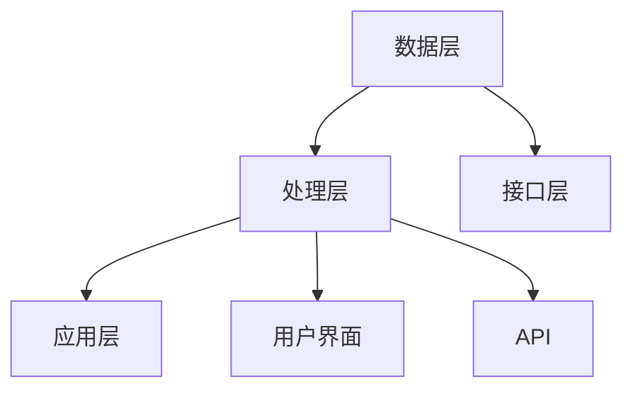

                 

### 文章标题：知识发现引擎的隐私保护与合规性

#### 关键词：知识发现引擎、隐私保护、合规性、加密技术、匿名化技术、同态加密技术

> 摘要：本文将深入探讨知识发现引擎的隐私保护与合规性问题，分析其基本概念、技术方案和实施实践。通过系统性地阐述隐私保护与合规性的重要性，介绍相关的法律法规和核心技术，结合实际案例，为知识发现引擎的隐私保护与合规性实践提供有益的参考。

### 引言

在当今数据驱动的时代，知识发现引擎作为智能系统的重要组成部分，正发挥着越来越重要的作用。它能够从大量的数据中提取出有价值的信息和知识，帮助企业做出更为明智的决策。然而，随着数据量的爆炸性增长和知识发现技术的日益成熟，隐私保护与合规性问题也日益突出。数据泄露、隐私侵犯等事件频发，不仅损害了企业的声誉，也可能带来严重的法律风险。

因此，确保知识发现引擎的隐私保护和合规性成为了一个亟待解决的问题。本文将从以下几个方面展开讨论：

1. **知识发现引擎概述**：介绍知识发现引擎的基本概念、功能和架构，以及其应用场景。
2. **隐私保护基础**：探讨隐私保护的概念、原则、法律法规以及面临的挑战和对策。
3. **合规性基础**：介绍合规性的概念、意义、法律法规以及合规性评估与实施。
4. **隐私保护技术**：详细分析加密技术、匿名化技术、隐蔽通信技术和同态加密技术。
5. **合规性技术**：探讨数据质量管理、数据安全与访问控制、合规性审计与报告以及合规性技术实践。
6. **知识发现引擎的隐私保护与合规性实践**：结合实际案例，分析知识发现引擎的隐私保护与合规性实践方法。
7. **案例研究**：通过具体案例，深入探讨知识发现引擎的隐私保护与合规性实践。
8. **总结**：总结全文，提出未来研究方向和改进建议。

通过本文的探讨，我们希望能够为知识发现引擎的隐私保护与合规性实践提供一些有价值的参考和指导。

### 第1章：知识发现引擎概述

#### 1.1 知识发现的概念与重要性

知识发现（Knowledge Discovery in Databases，简称KDD）是信息科学和数据分析领域的一个重要分支，旨在从大量的数据中提取出有价值的信息和知识。知识发现的过程通常包括数据预处理、数据集成、数据选择、数据变换、模式识别和数据评估等多个阶段。其核心目标是通过分析大量数据，发现隐藏在数据背后的规律、关联、模式或异常，从而为决策提供支持。

知识发现的重要性在于它能够帮助企业或组织从海量数据中挖掘出潜在的价值。在商业领域，知识发现可以用于市场分析、客户行为预测、风险控制等方面，帮助企业做出更加精准的决策。在科学研究领域，知识发现可以帮助研究人员从海量实验数据中发现新的科学规律，推动科学研究的进展。

知识发现的广泛应用领域包括：

1. **商业智能**：通过分析企业内部和外部的数据，帮助企业发现市场趋势、优化业务流程和提升运营效率。
2. **金融分析**：利用知识发现技术进行信用评估、投资组合优化、风险控制等，为金融机构提供决策支持。
3. **医疗保健**：通过分析患者的病历数据，发现疾病趋势、诊断方法和治疗方案的优化，提高医疗服务质量。
4. **智能交通**：通过分析交通数据，优化交通流量管理，提高道路通行效率，减少交通事故。
5. **社会管理**：利用知识发现技术进行公共安全事件预测、社会行为分析等，为政府决策提供支持。

#### 1.2 知识发现引擎的功能与架构

知识发现引擎（Knowledge Discovery Engine）是一种自动化工具，用于实现知识发现的过程。它通常包括以下几个核心功能：

1. **数据预处理**：对原始数据进行清洗、转换和集成，使其适合进行知识发现分析。
2. **模式识别**：利用各种算法和技术，从数据中发现潜在的模式、关联和趋势。
3. **知识表示**：将发现的模式转化为可理解和利用的知识，例如规则、分类模型或聚类模型。
4. **知识应用**：将知识应用于实际业务场景，如预测、决策支持等。

知识发现引擎的架构通常包括以下几个层次：

1. **数据层**：存储和管理原始数据，包括结构化数据、半结构化数据和非结构化数据。
2. **处理层**：执行数据预处理、模式识别和知识表示等操作，包括各种算法、模型和工具。
3. **应用层**：将知识应用于实际业务场景，提供决策支持、预测分析和智能推荐等功能。
4. **接口层**：提供用户界面和API，方便用户与知识发现引擎进行交互。

一个典型的知识发现引擎架构如下所示：

#### 1.3 知识发现引擎的应用场景

知识发现引擎在多个领域有着广泛的应用场景，以下是一些典型的应用案例：

1. **商业智能**：
   - **市场细分**：通过对客户数据进行分析，发现具有相似购买行为或需求的客户群体，从而实现精准营销。
   - **客户行为预测**：利用历史数据，预测客户的购买行为、流失风险等，帮助制定客户关系管理策略。
   - **销售预测**：根据历史销售数据，预测未来的销售趋势，为企业制定生产和库存计划提供依据。

2. **金融分析**：
   - **信用评估**：通过分析借款人的信用历史、财务状况等数据，评估其信用风险，为金融机构提供信用决策支持。
   - **投资组合优化**：利用历史市场数据和投资策略，优化投资组合，提高投资回报率。
   - **风险控制**：通过分析交易数据、市场动态等，发现潜在的市场风险，为金融机构的风险管理提供支持。

3. **医疗保健**：
   - **疾病预测**：通过分析患者的病史、基因数据等，预测患者可能患有的疾病，提前进行预防和治疗。
   - **治疗方案优化**：通过分析患者的病情、药物反应等，为医生提供个性化的治疗方案。
   - **医疗资源优化**：通过分析医院的数据，优化医疗资源的配置，提高医疗服务的效率和质量。

4. **智能交通**：
   - **交通流量预测**：通过分析历史交通数据，预测未来的交通流量，为交通管理部门提供交通调控策略。
   - **交通事故预测**：通过分析交通事故数据，预测可能发生的交通事故，提前采取预防措施。
   - **道路优化**：通过分析交通数据，优化道路设计和交通流量，提高道路通行效率。

5. **社会管理**：
   - **公共安全预测**：通过分析社会数据，预测可能发生的公共安全事件，为政府提供安全预警和应急响应支持。
   - **社会行为分析**：通过分析社会数据，发现社会行为的规律和趋势，为政府制定社会管理策略提供支持。
   - **社会舆情监测**：通过分析社交媒体数据，监测社会舆情动态，为政府和企业提供舆论引导和风险控制支持。

通过上述应用场景，我们可以看到知识发现引擎在各个领域的广泛应用，它不仅能够帮助企业或组织从海量数据中提取出有价值的信息和知识，还能够提高业务效率和决策质量。

### 第2章：隐私保护基础

#### 2.1 隐私保护的概念与原则

隐私保护是指通过各种技术和管理手段，确保个人信息不被未经授权的第三方获取、利用和泄露，以保护个人的隐私权利。隐私保护的核心目标是保障个人信息的保密性、完整性和可用性，防止个人信息被滥用或泄露。

隐私保护的基本概念包括：

1. **个人信息**：指与特定个人相关联的数据，包括姓名、身份证号码、联系方式、健康状况、财产状况等。
2. **隐私**：指个人信息不受非法或非授权访问、使用或泄露的状态。
3. **隐私权**：指个人对其个人信息享有的控制权，包括访问权、修改权、删除权和隐私保护权。
4. **隐私侵犯**：指未经个人同意，非法获取、使用、披露个人信息的行为。

隐私保护的原则主要包括以下几个方面：

1. **最小化原则**：在处理个人信息时，仅收集和处理实现特定目的所必需的个人信息，不得过度收集。
2. **透明度原则**：个人信息处理者应向个人明确告知其个人信息的收集、使用、存储、共享和销毁等规则，确保个人对其个人信息处理有充分的知情权。
3. **目的限定原则**：个人信息处理者应明确个人信息处理的特定目的，并在处理过程中严格遵循这一目的，不得超出目的范围使用个人信息。
4. **合法性原则**：个人信息处理者应依法取得个人同意，并在法律允许的范围内处理个人信息。
5. **安全性原则**：个人信息处理者应采取必要的技术和管理措施，确保个人信息的安全，防止数据泄露、篡改和丢失。
6. **可访问性和可更正性原则**：个人信息主体有权访问其个人信息，并对其错误信息进行更正。

#### 2.2 隐私保护的法律法规

隐私保护的法律法规为个人信息的收集、使用、存储和共享提供了法律依据和规范。不同国家和地区有不同的隐私保护法律法规，以下是一些主要的隐私保护法律法规：

1. **欧盟通用数据保护条例（GDPR）**：GDPR是欧盟于2018年5月25日正式实施的隐私保护法律法规，旨在加强欧盟地区个人数据的保护。GDPR规定了对个人数据的处理必须遵循合法性、透明性、目的限定性、数据最小化、数据质量、数据可访问性和可更正性等原则。GDPR对违反规定的公司罚款高达2000万欧元或全球营业额的4%，具有非常严格的惩罚力度。

2. **美国加州消费者隐私法案（CCPA）**：CCPA是2018年加州通过的一项隐私保护法案，旨在保护加州居民的个人信息。CCPA规定了个人对其个人信息的访问权、删除权和拒绝权，并对违反规定的公司进行罚款。CCPA的实施为美国其他州和地区提供了隐私保护的范例。

3. **中国个人信息保护法（PIPL）**：PIPL是2021年9月1日正式实施的中国个人信息保护法律法规，旨在加强对个人信息的保护。PIPL规定了对个人信息的收集、使用、存储、共享和销毁等规则，强调个人信息处理者必须遵循合法性、正当性、必要性、透明性等原则，并对违反规定的公司进行罚款。

4. **其他国家和地区**：除了欧盟、美国和中国，其他国家如澳大利亚、加拿大、巴西等也有各自的隐私保护法律法规，如《澳大利亚隐私法》、《加拿大隐私法》和《巴西通用数据保护法》等。

这些隐私保护法律法规为个人信息的处理提供了明确的规范，对企业和组织提出了更高的隐私保护要求。违反这些法律法规可能导致严重的法律后果和商业风险，因此企业和组织在处理个人信息时必须严格遵守相关法律法规。

#### 2.3 隐私保护的挑战与对策

尽管隐私保护法律法规不断完善，但在实际操作中，隐私保护仍面临诸多挑战。以下是一些主要的挑战及其对策：

1. **数据泄露风险**：随着数据量的增加和数据渠道的多样化，数据泄露的风险也在增加。对策包括：
   - **数据加密**：对存储和传输的个人信息进行加密，确保数据在未授权的情况下无法被读取。
   - **访问控制**：实施严格的访问控制策略，确保只有授权人员才能访问敏感数据。
   - **安全审计**：定期进行安全审计，检测和修复系统中的安全漏洞。

2. **数据滥用风险**：个人信息一旦被泄露，可能被用于非法活动或滥用，对个人造成严重的伤害。对策包括：
   - **数据匿名化**：在数据分析和处理过程中，对个人信息进行匿名化处理，确保无法直接识别个人信息。
   - **隐私设计**：在系统设计和开发过程中，考虑隐私保护的要求，采用隐私友好的技术和管理策略。
   - **用户教育**：加强对用户的隐私教育，提高用户的隐私保护意识和技能。

3. **合规性挑战**：不同国家和地区的隐私保护法律法规存在差异，企业在全球范围内的业务运营中需要应对复杂的合规性问题。对策包括：
   - **合规性评估**：定期对企业的隐私保护政策和流程进行合规性评估，确保符合相关法律法规的要求。
   - **法律法规培训**：为员工提供隐私保护法律法规的培训，提高员工的合规意识和能力。
   - **跨国合作**：与不同国家和地区的合作伙伴建立良好的合作关系，共同应对隐私保护合规性问题。

4. **技术挑战**：隐私保护技术的研发和应用面临一定的技术挑战，如加密算法的性能、匿名化技术的准确性等。对策包括：
   - **技术创新**：持续关注和投入隐私保护技术的研发，推动技术创新和进步。
   - **多方合作**：与学术机构、研究机构和行业合作伙伴建立合作关系，共同推动隐私保护技术的发展。
   - **实践验证**：通过实际项目应用，验证隐私保护技术的有效性和可行性。

通过应对这些挑战，企业和组织可以更好地保护个人隐私，确保合规性，降低隐私保护风险。

### 第3章：合规性基础

#### 3.1 合规性的概念与意义

合规性（Compliance）是指企业或组织在法律、法规、标准、规范等外部要求下，遵循相关规定的程度。合规性的概念涵盖了企业在各个运营环节中，确保其行为符合法律、法规、标准和内部政策的要求。合规性的意义在于确保企业的合法性和可持续性，维护企业的声誉，降低法律和商业风险。

合规性具有以下几个核心方面：

1. **法律遵从**：确保企业的行为符合相关法律法规的要求，包括数据保护法、消费者权益保护法、反洗钱法等。
2. **标准遵从**：遵循行业标准和最佳实践，如ISO 27001信息安全管理体系认证、ISO 9001质量管理体系认证等。
3. **内部政策**：确保企业内部政策和流程的合规性，如员工行为规范、数据管理政策等。
4. **道德和伦理**：企业在合规性管理中，还需要遵循道德和伦理标准，确保其行为符合社会公共利益。

合规性的意义体现在以下几个方面：

1. **降低法律风险**：遵守法律法规，可以降低企业面临的法律风险，避免因违法行为导致的罚款、诉讼和声誉损失。
2. **提高企业信誉**：合规性是企业诚信经营的体现，有助于提升企业的社会形象和品牌价值。
3. **保障利益相关者权益**：合规性确保企业遵守相关法规和标准，维护消费者、员工和其他利益相关者的合法权益。
4. **促进可持续发展**：合规性是企业实现可持续发展的重要保障，有助于企业实现长期稳健发展。

#### 3.2 合规性的法律法规

合规性的法律法规是企业和组织必须遵守的外部要求，涵盖了多个领域，以下是一些主要的合规性法律法规：

1. **数据保护法**：数据保护法是保护个人信息安全的重要法律，包括《欧盟通用数据保护条例（GDPR）》、《美国加州消费者隐私法案（CCPA）》和《中国个人信息保护法（PIPL）》等。这些法律对个人信息的收集、处理、存储、传输和销毁等环节提出了严格的要求。

2. **反洗钱法**：反洗钱法旨在预防和打击洗钱活动，防止资金被用于非法活动。包括《联合国反洗钱公约》、《美国反洗钱法》和《中国反洗钱法》等。

3. **证券法**：证券法是规范证券市场交易和信息披露的法律，包括《美国证券交易法》、《中国证券法》等。证券法要求企业在上市、并购、财务报告等方面遵守相关法规。

4. **消费者权益保护法**：消费者权益保护法是保护消费者权益的法律，包括《美国消费者保护法》、《中国消费者权益保护法》等。这些法律规定了企业的产品和服务标准，以及消费者投诉处理程序。

5. **劳动法**：劳动法是规范劳动关系和员工权益的法律，包括《美国劳动法》、《中国劳动法》等。劳动法规定了企业的员工招聘、劳动合同、工资福利、劳动安全等方面的要求。

6. **环境法**：环境法是保护环境和自然资源利用的法律，包括《美国环境法》、《中国环境保护法》等。这些法律规定了企业的环保责任和环境保护措施。

7. **行业规范**：不同行业有自己的规范和标准，如金融行业的《巴塞尔协议》、IT行业的《ISO/IEC 27001信息安全管理体系认证》等。这些规范和标准对企业的业务运营提出了具体要求。

#### 3.3 合规性评估与实施

合规性评估是指对企业的合规性管理进行审查和评估，以确定企业是否符合相关法律法规和内部政策的要求。合规性评估通常包括以下步骤：

1. **制定评估计划**：明确评估的范围、目标、时间表和责任人。
2. **收集相关信息**：收集企业的业务流程、组织结构、政策文件、操作记录等与合规性相关的信息。
3. **评估合规性**：对收集的信息进行审查和分析，识别合规性和不合规的问题。
4. **报告和改进**：撰写评估报告，提出改进建议和措施，并跟踪改进的进展。

合规性实施是指企业在日常运营中执行合规性政策和流程的过程。以下是一些合规性实施的步骤：

1. **制定合规性政策**：明确企业的合规性要求，包括法律法规遵守、内部政策制定等。
2. **培训和教育**：对员工进行合规性培训和教育，提高员工的合规意识和能力。
3. **执行合规性流程**：建立和执行合规性流程，包括数据管理、安全控制、风险管理等。
4. **监督和审计**：定期进行合规性监督和审计，确保合规性政策和流程得到有效执行。
5. **持续改进**：根据合规性评估结果和外部环境的变化，持续改进合规性管理。

通过合规性评估与实施，企业可以确保其运营符合法律法规和内部政策的要求，降低合规风险，提高企业的合法性和可持续性。

### 第4章：隐私保护技术

隐私保护技术在确保个人信息不被未经授权的第三方获取、使用和泄露方面起着至关重要的作用。本章将详细介绍几种常用的隐私保护技术，包括加密技术、匿名化技术、隐蔽通信技术和同态加密技术，并分析它们在实际应用中的优势和局限性。

#### 4.1 加密技术

加密技术是通过将原始数据转换为不可读的密文，以保护数据在存储、传输和处理过程中的安全性。加密技术的基本原理是利用加密算法和密钥，将明文数据转换为密文，只有拥有正确密钥的接收者才能解密并恢复原始数据。

**加密算法**：
加密算法根据加密强度和算法类型可以分为对称加密和非对称加密。

- **对称加密**：对称加密算法使用相同的密钥进行加密和解密，如AES（高级加密标准）和DES（数据加密标准）。对称加密算法的优点是加密和解密速度快，计算效率高；缺点是密钥的分发和管理较为复杂。
- **非对称加密**：非对称加密算法使用一对密钥，即公钥和私钥，公钥用于加密，私钥用于解密，如RSA（RSA加密算法）。非对称加密算法的优点是解决了密钥分发问题，但加密和解密速度较慢。

**加密协议**：
加密协议是用于确保数据传输安全的协议，如SSL/TLS（安全套接字层/传输层安全协议）。

- **SSL（安全套接字层）**：SSL是一种用于在客户端和服务器之间建立安全连接的协议，已被广泛用于互联网安全传输。
- **TLS（传输层安全协议）**：TLS是对SSL的改进和替代，提供了更强的安全性和扩展性。

**实际应用**：
加密技术在网络通信、存储系统和数据处理等多个领域都有广泛应用。

- **网络通信**：加密技术用于保护电子邮件、即时消息和Web通信的安全性。
- **存储系统**：加密技术用于保护存储在硬盘、云存储和数据库中的数据的安全性。
- **数据处理**：加密技术用于确保在数据传输和共享过程中的数据安全性。

**优势与局限性**：
加密技术的优势在于其强大的数据保护能力，可以确保数据在存储、传输和处理过程中的安全性。然而，加密技术也存在一定的局限性，如密钥管理复杂、加密和解密速度较慢等。

#### 4.2 匿名化技术

匿名化技术是通过去除或隐藏个人标识信息，使数据无法直接识别特定个人，从而保护个人隐私。匿名化技术通常包括数据脱敏、数据模糊化和数据泛化等方法。

**数据脱敏**：
数据脱敏是一种通过替换或删除敏感信息，使数据在保留其统计特性同时无法直接识别特定个人的技术。常见的数据脱敏方法包括：

- **字符替换**：用随机字符替换敏感信息，如将身份证号码中的数字替换为星号。
- **数字插入**：在敏感信息中插入随机数字，如将出生日期中的年份替换为当前年份的前两位数字。
- **数字掩码**：用特定的掩码格式展示敏感信息，如使用星号和数字混合显示电话号码。

**数据模糊化**：
数据模糊化是通过将敏感数据与噪声数据混合，使原始数据无法直接识别的技术。常见的数据模糊化方法包括：

- **随机噪声添加**：在敏感数据中添加随机噪声，如将薪资数据与随机噪声数据混合。
- **线性插值**：通过线性插值方法将敏感数据替换为相邻值的线性组合。

**数据泛化**：
数据泛化是通过将敏感数据概括为更广泛的数据类别，使其无法直接识别特定个人的技术。常见的数据泛化方法包括：

- **四舍五入**：将敏感数据四舍五入到最接近的整数或小数位。
- **范围泛化**：将敏感数据概括为某个范围，如将年龄数据概括为年龄段。

**实际应用**：
匿名化技术常用于数据分析和共享，以保护个人隐私。

- **数据分析**：匿名化技术用于保护分析数据中的个人隐私，如市场研究、医疗数据分析等。
- **数据共享**：匿名化技术用于保护共享数据中的个人隐私，如政府部门的数据开放、企业间的数据交换等。

**优势与局限性**：
匿名化技术的优势在于其能够在保护个人隐私的同时，保留数据的分析和使用价值。然而，匿名化技术也存在一定的局限性，如无法完全消除个人识别风险、可能影响数据的分析准确性等。

#### 4.3 隐蔽通信技术

隐蔽通信技术是通过将通信内容隐藏在其他通信或媒介中，使其难以被检测和拦截的技术。隐蔽通信技术通常包括隐蔽信道、隐蔽签名和隐蔽认证等方法。

**隐蔽信道**：
隐蔽信道是一种利用物理或逻辑手段，将通信内容隐藏在其他通信或媒介中的技术。常见的方法包括：

- **中继通信**：利用中间节点转发通信数据，使通信内容难以被直接检测。
- **视觉隐蔽**：将通信内容隐藏在图像、视频或文档中，利用视觉差异进行通信。
- **声音隐蔽**：将通信内容隐藏在声音、音乐或噪声中，利用频率差异进行通信。

**隐蔽签名**：
隐蔽签名是一种利用加密算法，将签名隐藏在其他数据中的技术。隐蔽签名可以确保数据的完整性和真实性，同时隐藏签名的存在。

**隐蔽认证**：
隐蔽认证是一种利用加密算法和认证机制，将认证信息隐藏在其他数据中的技术。隐蔽认证可以确保数据的完整性和认证安全性，同时隐藏认证信息的存在。

**实际应用**：
隐蔽通信技术常用于防止通信内容被监听和拦截。

- **军事通信**：隐蔽通信技术用于军事通信，确保通信内容的保密性。
- **隐私保护通信**：隐蔽通信技术用于保护个人隐私，防止通信内容被第三方拦截。
- **匿名通信**：隐蔽通信技术用于匿名通信，保护通信者的身份和位置。

**优势与局限性**：
隐蔽通信技术的优势在于其能够有效保护通信内容的安全性，防止被监听和拦截。然而，隐蔽通信技术也存在一定的局限性，如可能影响通信的实时性和可靠性，以及可能被技术手段破解等。

#### 4.4 同态加密技术

同态加密技术是一种能够在加密状态下对数据进行计算和处理的加密技术。同态加密技术使得数据在加密后仍然可以保持其原有的结构和属性，从而实现数据的加密存储和计算。

**同态加密算法**：
同态加密算法根据加密操作的不同，可以分为完全同态加密和部分同态加密。

- **完全同态加密**：完全同态加密算法可以在加密状态下对数据进行任意计算，如PGP（RSA多变量多项式）加密算法。
- **部分同态加密**：部分同态加密算法只能对数据进行特定的计算操作，如支持线性操作的加密算法。

**实际应用**：
同态加密技术主要用于云计算和分布式计算场景，以保护数据的安全性和隐私性。

- **云计算**：同态加密技术用于保护云计算中的数据，确保数据在存储和处理过程中的安全性。
- **分布式计算**：同态加密技术用于保护分布式计算中的数据，确保数据在传输和计算过程中的安全性。

**优势与局限性**：
同态加密技术的优势在于其能够在不暴露原始数据内容的情况下，对数据进行分析和处理，从而保护数据的隐私性。然而，同态加密技术也存在一定的局限性，如计算复杂度高、性能瓶颈等。

通过以上对隐私保护技术的介绍，我们可以看到，各种隐私保护技术各有优势和局限性，企业应根据实际需求和场景选择合适的隐私保护技术，并结合多种技术手段，构建完善的隐私保护体系。

### 第5章：合规性技术

合规性技术在确保企业遵循相关法律法规和标准规范方面发挥着重要作用。本章将详细介绍几种常用的合规性技术，包括数据质量管理、数据安全与访问控制、合规性审计与报告以及合规性技术实践。

#### 5.1 数据质量管理

数据质量管理（Data Quality Management，DQM）是指通过一系列技术和流程，确保数据在准确性、完整性、一致性和可靠性方面的质量。良好的数据质量是合规性的基础，因为低质量的数据可能会导致合规性问题。

**数据质量管理的关键要素**：

1. **数据准确性**：确保数据真实、可靠、无误。
2. **数据完整性**：确保数据没有缺失，所有必需的数据字段都有值。
3. **数据一致性**：确保数据在不同系统、数据库和部门之间保持一致。
4. **数据可靠性**：确保数据可以被信任和依赖。

**数据质量管理的步骤**：

1. **数据质量评估**：评估当前数据的质量，识别存在的问题。
2. **数据清洗**：通过删除重复记录、纠正错误和填补缺失值等手段，提高数据质量。
3. **数据标准化**：统一数据格式、术语和编码，确保数据的一致性。
4. **数据监控**：建立数据质量监控机制，定期检查和评估数据质量。

**数据质量管理工具**：

- **数据质量管理平台**：提供数据质量评估、数据清洗和数据监控等功能。
- **ETL（提取、转换、加载）工具**：用于数据转换和加载，确保数据质量。

**实际应用**：

数据质量管理在金融、医疗、零售等多个行业都有广泛应用。

- **金融行业**：确保财务报告、风险评估和客户信息的准确性，遵守相关金融法规。
- **医疗行业**：确保患者信息、病历数据和医疗记录的完整性，遵守医疗法规。
- **零售行业**：确保销售数据、库存数据和客户信息的准确性，优化供应链管理。

**优势与局限性**：

数据质量管理能够显著提高数据的准确性、完整性和一致性，有助于确保合规性。然而，数据质量管理需要投入大量的人力、物力和时间，且效果可能需要较长时间才能体现。

#### 5.2 数据安全与访问控制

数据安全与访问控制（Data Security and Access Control）是指通过一系列技术和策略，确保数据在存储、传输和处理过程中的安全性，防止未授权的访问和泄露。

**数据安全的关键要素**：

1. **数据加密**：通过加密技术，确保数据在存储和传输过程中的安全性。
2. **访问控制**：通过身份验证、权限管理和审计等手段，控制对数据的访问。
3. **入侵检测**：通过监控和检测网络和系统的异常行为，发现和防范安全威胁。
4. **数据备份与恢复**：定期备份数据，确保在数据丢失或损坏时能够迅速恢复。

**数据安全与访问控制的步骤**：

1. **风险评估**：评估数据面临的安全威胁和潜在风险，制定相应的安全策略。
2. **安全策略制定**：制定数据安全策略，包括加密、访问控制、入侵检测等。
3. **实施安全措施**：部署和配置安全设备、工具和软件，确保数据安全。
4. **安全监控与审计**：定期监控数据安全状态，进行安全审计，确保安全措施得到有效执行。

**数据安全与访问控制工具**：

- **防火墙**：用于过滤网络流量，防止未经授权的访问。
- **入侵检测系统（IDS）**：用于监控网络和系统的异常行为，发现和防范安全威胁。
- **安全信息与事件管理（SIEM）**：用于收集、分析和关联安全事件，提供实时监控和响应。

**实际应用**：

数据安全与访问控制广泛应用于各个行业。

- **金融行业**：确保金融交易、客户信息和财务报告的安全性，遵守相关金融法规。
- **医疗行业**：确保患者信息、病历数据和医疗记录的安全性，遵守医疗法规。
- **零售行业**：确保客户信息、销售数据和库存信息的安全性，遵守消费者权益保护法。

**优势与局限性**：

数据安全与访问控制能够有效保护数据的安全性和隐私性，确保合规性。然而，数据安全与访问控制需要持续的投资和维护，且可能对系统的性能和用户体验产生一定的影响。

#### 5.3 合规性审计与报告

合规性审计与报告（Compliance Audit and Reporting）是指通过定期审计和报告，确保企业的合规性管理得到有效执行，发现潜在的问题和改进机会。

**合规性审计的关键要素**：

1. **合规性评估**：评估企业的合规性管理政策和流程，识别潜在的风险和问题。
2. **合规性检查**：对企业的各项操作进行合规性检查，确保符合相关法律法规和内部政策的要求。
3. **合规性报告**：撰写合规性审计报告，总结审计发现、问题和改进建议。

**合规性审计与报告的步骤**：

1. **制定审计计划**：明确审计的范围、目标、时间表和责任人。
2. **审计准备**：收集相关的合规性文件、记录和证据，准备审计工具和设备。
3. **审计实施**：对企业的合规性管理进行实地审计，检查合规性政策的执行情况。
4. **审计报告**：撰写审计报告，总结审计发现、问题和改进建议，提交给企业高层和管理者。

**合规性审计与报告工具**：

- **审计软件**：提供审计计划、审计记录和报告等功能。
- **合规性管理平台**：提供合规性风险评估、合规性检查和合规性报告等功能。

**实际应用**：

合规性审计与报告在各个行业都有广泛应用。

- **金融行业**：定期进行合规性审计，确保金融机构遵守相关金融法规和内部政策。
- **医疗行业**：定期进行合规性审计，确保医疗机构遵守医疗法规和隐私保护要求。
- **零售行业**：定期进行合规性审计，确保零售企业遵守消费者权益保护法等相关法规。

**优势与局限性**：

合规性审计与报告能够帮助企业发现潜在的问题和改进机会，确保合规性管理得到有效执行。然而，合规性审计需要投入大量的人力、物力和时间，且审计结果可能受到主观判断的影响。

#### 5.4 合规性技术实践

合规性技术实践是指在实际运营中，企业通过技术手段实现合规性管理的过程。以下是一些合规性技术实践的方法：

1. **合规性管理平台**：企业可以采用合规性管理平台，整合合规性评估、合规性检查、合规性报告等功能，实现合规性管理的自动化和规范化。
2. **自动化合规性监控**：通过自动化工具，实时监控企业的合规性状态，及时发现潜在的问题和风险。
3. **合规性培训**：定期为员工提供合规性培训，提高员工的合规意识和能力。
4. **合规性审计**：定期进行合规性审计，确保企业的合规性管理得到有效执行。
5. **合规性风险管理**：建立合规性风险管理机制，识别、评估和应对合规性风险。

**案例实践**：

以某金融机构为例，该金融机构采用了以下合规性技术实践方法：

1. **合规性管理平台**：采用合规性管理平台，整合合规性评估、合规性检查和合规性报告等功能，实现合规性管理的自动化和规范化。
2. **自动化合规性监控**：通过自动化工具，实时监控金融交易、客户信息和财务报告的合规性状态，及时发现潜在的问题和风险。
3. **合规性培训**：定期为员工提供合规性培训，提高员工的合规意识和能力。
4. **合规性审计**：定期进行合规性审计，确保金融机构遵守相关金融法规和内部政策。
5. **合规性风险管理**：建立合规性风险管理机制，识别、评估和应对合规性风险。

通过这些合规性技术实践，该金融机构能够有效确保其运营符合相关法律法规和内部政策的要求，降低合规风险，保障企业的合法性和可持续发展。

### 第6章：知识发现引擎的隐私保护实践

#### 6.1 隐私保护需求分析

在实施知识发现引擎的隐私保护前，首先需要进行隐私保护需求分析。这一步骤的目的是确定隐私保护的优先级和具体需求，为后续的隐私保护措施提供指导。

**需求分析步骤**：

1. **确定数据类型和敏感度**：识别知识发现引擎涉及的数据类型，如客户信息、财务数据、医疗记录等，并评估其敏感度。敏感度高的数据需要更高的隐私保护措施。
2. **分析数据使用场景**：了解数据在知识发现过程中的使用场景，包括数据的收集、处理、存储和共享等环节，识别可能存在的隐私风险。
3. **评估合规性要求**：根据相关法律法规和行业标准，评估数据处理的合规性要求，如数据保护法、隐私保护法规等。
4. **识别潜在威胁和风险**：分析可能对数据隐私构成威胁的因素，如数据泄露、数据滥用、恶意攻击等，评估这些风险对个人隐私的影响。
5. **确定隐私保护目标**：根据需求分析和合规性要求，明确隐私保护的具体目标，如数据加密、访问控制、匿名化处理等。

**隐私保护需求分析示例**：

以某电商平台为例，其知识发现引擎涉及的数据类型包括用户信息、交易记录、购物偏好等。根据数据敏感度分析，用户信息和交易记录属于敏感数据，需要采取高强度的隐私保护措施。

数据使用场景包括：

1. **数据收集**：通过网站、移动应用和线下渠道收集用户信息，包括姓名、联系方式、地址等。
2. **数据处理**：对用户交易记录和购物偏好进行分析，发现用户行为模式，为个性化推荐和营销提供支持。
3. **数据存储**：在数据库中存储用户信息和交易记录，确保数据安全。
4. **数据共享**：与第三方合作伙伴共享部分用户数据，如广告投放和数据分析。

根据合规性要求，该电商平台需要遵循《欧盟通用数据保护条例（GDPR）》、《中国个人信息保护法（PIPL）》等法律法规。潜在威胁包括数据泄露、数据滥用和恶意攻击。

隐私保护需求分析的结果如下：

1. **数据加密**：对用户信息和交易记录进行加密处理，确保数据在存储和传输过程中的安全性。
2. **访问控制**：实施严格的访问控制策略，确保只有授权人员才能访问敏感数据。
3. **匿名化处理**：对用户行为分析中的数据进行分析前进行匿名化处理，确保无法直接识别用户身份。
4. **数据备份和恢复**：定期备份用户数据和交易记录，确保数据在灾难发生时能够迅速恢复。

通过以上需求分析，电商平台可以明确隐私保护的重点和具体措施，为后续的隐私保护实施提供依据。

#### 6.2 隐私保护方案设计

隐私保护方案设计是确保知识发现引擎在数据处理过程中遵循隐私保护原则的重要步骤。设计方案应综合考虑隐私保护需求、法律法规和技术手段，确保方案的有效性和可执行性。

**方案设计步骤**：

1. **确定隐私保护策略**：根据隐私保护需求分析，制定具体的隐私保护策略，如数据加密、访问控制、匿名化处理等。
2. **选择隐私保护技术**：选择合适的隐私保护技术，如加密算法、匿名化算法、访问控制机制等，确保技术手段能够满足隐私保护需求。
3. **设计数据流程**：设计数据收集、处理、存储和共享的流程，确保每个环节都符合隐私保护要求。
4. **制定安全管理制度**：制定安全管理制度，包括数据安全管理、人员安全管理、安全培训等，确保隐私保护措施得到有效执行。
5. **评估方案可行性**：对设计方案进行可行性评估，确保方案在实际环境中能够有效实施。

**隐私保护方案设计示例**：

以某电商平台的知识发现引擎为例，其隐私保护方案设计如下：

1. **隐私保护策略**：
   - **数据加密**：对用户信息和交易记录进行加密处理，确保数据在存储和传输过程中的安全性。
   - **访问控制**：实施严格的访问控制策略，确保只有授权人员才能访问敏感数据。
   - **匿名化处理**：对用户行为分析中的数据进行分析前进行匿名化处理，确保无法直接识别用户身份。

2. **选择隐私保护技术**：
   - **加密算法**：采用AES（高级加密标准）对用户信息和交易记录进行加密。
   - **访问控制机制**：使用身份验证和权限管理系统，确保只有授权人员才能访问敏感数据。
   - **匿名化算法**：采用K-匿名化算法对用户行为分析中的数据进行分析前的匿名化处理。

3. **数据流程设计**：
   - **数据收集**：在用户注册和购物过程中，收集用户信息和交易记录，并通过加密技术进行加密处理。
   - **数据处理**：对加密后的用户信息和交易记录进行分析，采用匿名化技术对分析前的数据进行匿名化处理。
   - **数据存储**：将加密后的用户信息和交易记录存储在安全数据库中，并实施访问控制策略。
   - **数据共享**：与第三方合作伙伴共享分析结果时，确保分析结果中的用户身份无法被直接识别。

4. **安全管理制度**：
   - **数据安全管理**：建立数据安全管理制度，包括数据加密、备份和恢复等。
   - **人员安全管理**：建立人员安全管理制度，包括员工培训、权限管理、安全意识等。
   - **安全培训**：定期为员工提供隐私保护和数据安全培训，提高员工的隐私保护意识和技能。

5. **评估方案可行性**：
   - **技术评估**：评估所选加密算法、访问控制机制和匿名化算法的技术性能和安全性。
   - **合规性评估**：确保方案符合《欧盟通用数据保护条例（GDPR）》、《中国个人信息保护法（PIPL）》等法律法规的要求。
   - **实施评估**：评估方案在实际环境中的可执行性和效果，确保方案能够有效实施。

通过以上隐私保护方案设计，电商平台能够确保其知识发现引擎在数据处理过程中遵循隐私保护原则，保护用户隐私，降低隐私风险。

#### 6.3 隐私保护方案实施与测试

隐私保护方案实施与测试是确保知识发现引擎隐私保护措施得到有效执行的关键步骤。以下详细介绍实施与测试的步骤、方法和注意事项。

**实施步骤**：

1. **部署加密技术**：在数据存储和传输过程中部署加密技术，如AES加密算法，确保数据在存储和传输过程中的安全性。需要确保加密技术的部署符合相关标准和最佳实践。
2. **实施访问控制**：配置身份验证和权限管理系统，确保只有授权人员才能访问敏感数据。需要制定详细的权限策略，确保权限分配的合理性和安全性。
3. **执行匿名化处理**：在数据处理和分析过程中，对涉及用户行为的数据进行匿名化处理，如采用K-匿名化算法。需要确保匿名化处理的正确性和有效性。
4. **部署安全监控与审计**：部署安全监控与审计工具，实时监控系统的安全状态，记录和分析安全事件。需要确保监控与审计工具的正常运行和数据的完整性。
5. **实施安全培训与意识提升**：为员工提供隐私保护和数据安全培训，提高员工的隐私保护意识和技能。需要制定详细的培训计划，确保培训内容的覆盖面和深度。

**测试方法**：

1. **功能测试**：测试隐私保护方案的功能，确保加密技术、访问控制、匿名化处理和安全监控与审计等模块的正常运行。需要使用自动化测试工具和手动测试相结合的方法。
2. **性能测试**：测试隐私保护方案对系统性能的影响，如加密和解密速度、访问控制响应时间等。需要使用压力测试工具，模拟高负载场景，评估系统性能的稳定性和可靠性。
3. **安全测试**：测试系统的安全性，包括漏洞扫描、入侵检测等。需要使用专业的安全测试工具，模拟恶意攻击，评估系统的安全防护能力。
4. **合规性测试**：测试隐私保护方案是否符合相关法律法规和行业标准，如《欧盟通用数据保护条例（GDPR）》、《中国个人信息保护法（PIPL）》等。需要使用合规性评估工具，对方案进行详细的审查和评估。

**注意事项**：

1. **确保方案的一致性**：在实施过程中，需要确保所有模块和组件的一致性和协调性，避免出现兼容性问题。
2. **定期更新和维护**：加密算法、访问控制机制和匿名化算法等需要定期更新和维护，确保其安全性和有效性。
3. **监控与审计**：需要定期监控系统的安全状态，记录和分析安全事件，确保隐私保护措施得到持续执行。
4. **员工培训与意识提升**：需要为员工提供持续的隐私保护和数据安全培训，提高员工的隐私保护意识和技能。

通过实施与测试，知识发现引擎能够确保其隐私保护措施得到有效执行，降低隐私风险，保障用户隐私。

#### 6.4 隐私保护效果评估

隐私保护效果评估是确保知识发现引擎隐私保护措施有效性的关键步骤。以下详细介绍评估的目的、方法和步骤。

**评估目的**：

隐私保护效果评估旨在验证隐私保护措施的实施效果，确保数据在处理过程中的隐私性得到有效保障。评估目的包括：

1. **验证隐私保护措施的有效性**：确保加密技术、访问控制、匿名化处理和安全监控与审计等隐私保护措施得到有效执行。
2. **识别潜在隐私风险**：评估隐私保护措施可能存在的漏洞和不足，识别潜在的隐私风险。
3. **优化隐私保护方案**：根据评估结果，提出改进建议，优化隐私保护方案，提高隐私保护能力。

**评估方法**：

1. **功能测试**：测试隐私保护方案的功能，确保加密技术、访问控制、匿名化处理和安全监控与审计等模块的正常运行。需要使用自动化测试工具和手动测试相结合的方法。
2. **性能测试**：测试隐私保护方案对系统性能的影响，如加密和解密速度、访问控制响应时间等。需要使用压力测试工具，模拟高负载场景，评估系统性能的稳定性和可靠性。
3. **安全测试**：测试系统的安全性，包括漏洞扫描、入侵检测等。需要使用专业的安全测试工具，模拟恶意攻击，评估系统的安全防护能力。
4. **合规性测试**：测试隐私保护方案是否符合相关法律法规和行业标准，如《欧盟通用数据保护条例（GDPR）》、《中国个人信息保护法（PIPL）》等。需要使用合规性评估工具，对方案进行详细的审查和评估。

**评估步骤**：

1. **制定评估计划**：明确评估的范围、目标、时间表和责任人。制定评估计划，包括功能测试、性能测试、安全测试和合规性测试等内容。
2. **收集评估数据**：收集与隐私保护相关的数据，包括加密技术的实现细节、访问控制策略、匿名化处理算法和安全监控与审计工具的配置等。
3. **执行测试**：按照评估计划，执行功能测试、性能测试、安全测试和合规性测试。记录测试结果和发现的问题。
4. **分析评估结果**：分析测试结果，识别隐私保护措施的有效性和潜在隐私风险。根据分析结果，提出改进建议。
5. **撰写评估报告**：撰写评估报告，总结评估过程、测试结果和分析结论。提出改进建议和优化方案。

**隐私保护效果评估示例**：

以某电商平台的知识发现引擎为例，其隐私保护效果评估过程如下：

1. **功能测试**：
   - 测试加密技术的实施效果，确保数据在存储和传输过程中的安全性。
   - 测试访问控制策略，确保只有授权人员才能访问敏感数据。
   - 测试匿名化处理算法，确保用户行为分析中的数据无法直接识别用户身份。

2. **性能测试**：
   - 测试加密和解密速度，确保加密技术对系统性能的影响最小。
   - 测试访问控制响应时间，确保访问控制策略的执行效率。

3. **安全测试**：
   - 执行漏洞扫描，识别系统的潜在安全漏洞。
   - 执行入侵检测，评估系统的安全防护能力。

4. **合规性测试**：
   - 评估隐私保护方案是否符合《欧盟通用数据保护条例（GDPR）》、《中国个人信息保护法（PIPL）》等法律法规的要求。

5. **分析评估结果**：
   - 分析测试结果，发现加密技术的性能符合预期，访问控制策略执行良好，匿名化处理算法有效。
   - 识别系统存在的潜在安全漏洞，提出改进建议。

6. **撰写评估报告**：
   - 总结评估过程、测试结果和分析结论。
   - 提出改进建议和优化方案，如优化加密算法、加强访问控制策略等。

通过隐私保护效果评估，电商平台能够确保其知识发现引擎的隐私保护措施得到有效执行，降低隐私风险，保障用户隐私。

### 第7章：知识发现引擎的合规性实践

#### 7.1 合规性需求分析

在知识发现引擎的合规性实践中，首先需要进行合规性需求分析。这一步骤的目的是确定知识发现引擎在数据收集、处理、存储和共享等环节中的合规性要求，确保其符合相关法律法规和行业标准。以下是合规性需求分析的具体步骤：

**步骤1：识别法律法规和行业标准**

- **数据保护法规**：了解并识别适用的数据保护法律法规，如《欧盟通用数据保护条例（GDPR）》、《中国个人信息保护法（PIPL）》等。
- **行业特定法规**：针对知识发现引擎所在行业，了解并识别适用的行业特定法规，如金融行业的《反洗钱法》、医疗行业的《医疗数据保护法》等。
- **国际标准和最佳实践**：了解并识别相关的国际标准和最佳实践，如ISO 27001信息安全管理体系标准、ISO 29001质量管理体系标准等。

**步骤2：分析数据收集、处理、存储和共享的合规性要求**

- **数据收集**：分析数据收集环节的合规性要求，如数据收集的合法性、透明性、目的限定性等。
  - **合法性**：确保数据收集有合法依据，如用户同意、法律法规要求等。
  - **透明性**：确保用户了解其数据被收集的目的和使用方式。
  - **目的限定性**：确保数据收集仅限于实现特定目的，不得过度收集。

- **数据处理**：分析数据处理环节的合规性要求，如数据处理的合法性、必要性、最小化原则等。
  - **合法性**：确保数据处理有合法依据，如用户同意、法律法规要求等。
  - **必要性**：确保数据处理是必要的，不得进行不必要的处理。
  - **最小化原则**：确保仅处理实现特定目的所必需的数据。

- **数据存储**：分析数据存储环节的合规性要求，如数据存储的安全性和保密性等。
  - **安全性**：确保数据存储安全，防止数据泄露、篡改和丢失。
  - **保密性**：确保数据保密，防止未经授权的访问。

- **数据共享**：分析数据共享环节的合规性要求，如数据共享的合法性、透明性等。
  - **合法性**：确保数据共享有合法依据，如用户同意、法律法规要求等。
  - **透明性**：确保数据共享的目的、方式和使用范围对用户透明。

**步骤3：识别潜在合规性风险**

- **识别数据类型和敏感度**：了解知识发现引擎涉及的数据类型，如用户信息、财务数据、医疗记录等，并评估其敏感度。
- **识别合规性风险**：分析数据收集、处理、存储和共享过程中可能存在的合规性风险，如数据泄露、隐私侵犯等。

**步骤4：制定合规性策略**

- **制定合规性策略**：根据合规性需求分析的结果，制定具体的合规性策略，如数据加密、访问控制、匿名化处理等。
- **明确合规性责任**：明确知识发现引擎相关人员的合规性责任，确保合规性要求得到有效执行。

通过以上步骤，知识发现引擎可以全面了解其在数据收集、处理、存储和共享环节中的合规性要求，识别潜在合规性风险，并制定相应的合规性策略，确保其运营符合法律法规和行业标准。

#### 7.2 合规性方案设计

在完成合规性需求分析后，下一步是设计具体的合规性方案，以确保知识发现引擎在数据收集、处理、存储和共享等环节中符合相关法律法规和行业标准。以下是一个典型的合规性方案设计步骤：

**步骤1：确定合规性目标和范围**

- **合规性目标**：明确知识发现引擎需要达到的合规性目标，如确保数据安全、保护用户隐私、遵守法律法规等。
- **合规性范围**：确定合规性方案涵盖的知识发现引擎的各个阶段，包括数据收集、处理、存储和共享等。

**步骤2：选择合适的合规性技术**

- **数据加密**：选择合适的加密技术，如AES、RSA等，对敏感数据进行加密处理，确保数据在传输和存储过程中的安全性。
- **访问控制**：采用身份验证和权限管理技术，确保只有授权人员才能访问敏感数据，防止未经授权的访问。
- **匿名化处理**：使用匿名化技术，如K-匿名化、L-多样性匿名化等，对用户行为分析中的数据进行匿名化处理，确保无法直接识别个人身份。
- **数据备份与恢复**：实施数据备份与恢复策略，确保数据在灾难发生时能够迅速恢复，保障数据的完整性和可用性。

**步骤3：设计合规性流程**

- **数据收集流程**：确保数据收集过程合法、透明，明确数据收集的目的和范围，并告知用户数据收集的用途。
- **数据处理流程**：制定数据处理流程，包括数据清洗、转换、分析等环节，确保数据处理过程的合法性、必要性和最小化原则。
- **数据存储流程**：制定数据存储流程，确保数据在存储过程中的安全性、保密性和完整性。
- **数据共享流程**：制定数据共享流程，确保数据共享的合法性、透明性和用户知情权。

**步骤4：制定合规性管理制度**

- **数据安全管理制度**：制定数据安全管理制度，包括数据加密、访问控制、备份和恢复等，确保数据在存储和传输过程中的安全性。
- **人员管理制度**：制定人员管理制度，包括员工培训、权限管理、安全意识等，确保员工了解并遵守合规性要求。
- **合规性审计制度**：制定合规性审计制度，定期进行合规性审计，确保知识发现引擎的运营符合法律法规和行业标准。

**步骤5：评估和改进**

- **合规性评估**：定期对合规性方案进行评估，检查各项措施的实施情况和效果，确保合规性要求得到有效执行。
- **改进措施**：根据评估结果，提出改进措施，优化合规性方案，提高合规性管理水平。

通过以上步骤，知识发现引擎可以设计出一个全面、有效的合规性方案，确保其在数据收集、处理、存储和共享等环节中符合相关法律法规和行业标准，降低合规风险，保护用户隐私。

#### 7.3 合规性方案实施与测试

在完成合规性方案设计后，下一步是实施与测试，确保知识发现引擎的合规性方案得到有效执行。以下详细描述实施与测试的步骤、方法和注意事项。

**实施步骤**：

1. **部署合规性技术**：
   - **数据加密**：部署加密技术，如AES、RSA等，对敏感数据进行加密处理。
   - **访问控制**：部署身份验证和权限管理系统，确保只有授权人员才能访问敏感数据。
   - **匿名化处理**：部署匿名化处理工具，如K-匿名化算法，对用户行为分析中的数据进行匿名化处理。

2. **配置合规性流程**：
   - **数据收集流程**：配置数据收集流程，确保数据收集过程合法、透明。
   - **数据处理流程**：配置数据处理流程，确保数据处理过程的合法性、必要性和最小化原则。
   - **数据存储流程**：配置数据存储流程，确保数据在存储过程中的安全性、保密性和完整性。
   - **数据共享流程**：配置数据共享流程，确保数据共享的合法性、透明性和用户知情权。

3. **制定和执行合规性管理制度**：
   - **数据安全管理制度**：制定数据安全管理制度，包括数据加密、访问控制、备份和恢复等。
   - **人员管理制度**：制定人员管理制度，包括员工培训、权限管理、安全意识等。
   - **合规性审计制度**：制定合规性审计制度，定期进行合规性审计。

**测试方法**：

1. **功能测试**：
   - **加密测试**：测试加密技术的有效性，确保数据在传输和存储过程中的安全性。
   - **访问控制测试**：测试访问控制策略，确保只有授权人员才能访问敏感数据。
   - **匿名化处理测试**：测试匿名化处理工具的有效性，确保用户行为分析中的数据无法直接识别个人身份。

2. **性能测试**：
   - **加密性能测试**：测试加密技术的性能，如加密和解密速度，确保加密技术对系统性能的影响最小。
   - **访问控制性能测试**：测试访问控制策略的执行效率，确保访问控制响应时间在合理范围内。

3. **安全测试**：
   - **漏洞扫描**：使用专业的安全测试工具，对系统进行漏洞扫描，识别潜在的安全漏洞。
   - **入侵检测**：测试系统的安全防护能力，模拟恶意攻击，评估系统的抗攻击能力。

4. **合规性测试**：
   - **法律合规性测试**：测试知识发现引擎的合规性方案是否符合相关法律法规和行业标准。
   - **技术合规性测试**：测试合规性技术手段的有效性和执行情况。

**注意事项**：

1. **确保一致性和协调性**：在实施过程中，确保所有模块和组件的一致性和协调性，避免出现兼容性问题。

2. **定期更新和维护**：加密算法、访问控制机制和匿名化算法等需要定期更新和维护，确保其安全性和有效性。

3. **监控与审计**：部署安全监控与审计工具，实时监控系统的安全状态，记录和分析安全事件，确保合规性措施得到持续执行。

4. **员工培训与意识提升**：定期为员工提供合规性培训，提高员工的合规意识和技能。

通过实施与测试，知识发现引擎能够确保其合规性方案得到有效执行，降低合规风险，保障用户隐私和数据的合法性。

#### 7.4 合规性效果评估

合规性效果评估是确保知识发现引擎在数据收集、处理、存储和共享等环节中合规性措施得到有效执行的关键步骤。以下详细描述评估的目的、方法和步骤。

**评估目的**：

合规性效果评估旨在验证知识发现引擎的合规性措施是否达到预期效果，识别潜在的问题和改进机会，确保数据处理的合规性。评估目的包括：

1. **验证合规性措施的有效性**：确保加密技术、访问控制、匿名化处理等合规性措施得到有效执行。
2. **识别潜在合规性风险**：评估合规性措施可能存在的漏洞和不足，识别潜在的合规性风险。
3. **优化合规性管理**：根据评估结果，提出改进建议，优化合规性管理措施，提高合规性管理水平。

**评估方法**：

1. **功能测试**：
   - **加密测试**：测试加密技术的有效性，确保数据在传输和存储过程中的安全性。
   - **访问控制测试**：测试访问控制策略，确保只有授权人员才能访问敏感数据。
   - **匿名化处理测试**：测试匿名化处理工具的有效性，确保用户行为分析中的数据无法直接识别个人身份。

2. **性能测试**：
   - **加密性能测试**：测试加密技术的性能，如加密和解密速度，确保加密技术对系统性能的影响最小。
   - **访问控制性能测试**：测试访问控制策略的执行效率，确保访问控制响应时间在合理范围内。

3. **安全测试**：
   - **漏洞扫描**：使用专业的安全测试工具，对系统进行漏洞扫描，识别潜在的安全漏洞。
   - **入侵检测**：测试系统的安全防护能力，模拟恶意攻击，评估系统的抗攻击能力。

4. **合规性测试**：
   - **法律合规性测试**：测试知识发现引擎的合规性方案是否符合相关法律法规和行业标准。
   - **技术合规性测试**：测试合规性技术手段的有效性和执行情况。

**评估步骤**：

1. **制定评估计划**：
   - **评估目标**：明确评估的目标和范围，如数据加密、访问控制、匿名化处理等。
   - **评估标准**：制定评估的标准和指标，如数据加密的有效性、访问控制策略的执行情况、匿名化处理工具的性能等。

2. **收集评估数据**：
   - **测试数据**：收集与评估相关的测试数据，如加密后的数据样本、访问控制日志、匿名化处理结果等。
   - **合规性文件**：收集与合规性相关的文件，如法律法规、行业标准、合规性报告等。

3. **执行评估测试**：
   - **功能测试**：执行加密、访问控制和匿名化处理测试，记录测试结果。
   - **性能测试**：执行加密性能测试和访问控制性能测试，记录测试结果。
   - **安全测试**：执行漏洞扫描和入侵检测测试，记录测试结果。
   - **合规性测试**：执行法律合规性测试和技术合规性测试，记录测试结果。

4. **分析评估结果**：
   - **评估分析**：分析测试结果，评估合规性措施的有效性和潜在的风险。
   - **问题识别**：识别评估过程中发现的问题和不足，如加密算法的性能、访问控制策略的执行效率等。

5. **撰写评估报告**：
   - **评估总结**：总结评估过程、测试结果和分析结论。
   - **改进建议**：提出改进建议，优化合规性管理措施。
   - **报告提交**：将评估报告提交给相关部门，如管理层、合规部门等，供决策参考。

通过合规性效果评估，知识发现引擎能够确保其合规性措施得到有效执行，降低合规风险，保障用户隐私和数据的合法性。

### 第8章：案例研究

#### 8.1 案例一：某电商平台的知识发现引擎隐私保护与合规性实践

某大型电商平台在其知识发现引擎的隐私保护与合规性实践方面进行了深入的研究和实践，为行业提供了有益的借鉴。

**案例背景**：

某电商平台拥有海量用户数据和交易数据，其知识发现引擎用于分析用户行为、推荐商品、优化营销策略等。为了确保用户隐私和数据安全，电商平台面临巨大的挑战。同时，电商平台需要遵循《欧盟通用数据保护条例（GDPR）》、《中国个人信息保护法（PIPL）》等法律法规，确保数据处理的合规性。

**隐私保护实践**：

1. **数据收集**：
   - **合法性**：电商平台在收集用户数据时，明确告知用户数据收集的目的和使用方式，并取得用户同意。
   - **透明性**：电商平台在用户注册和购物过程中，展示详细的隐私政策，确保用户了解其数据的用途。
   - **目的限定性**：电商平台仅收集实现特定目的所必需的数据，如用户姓名、联系方式、购物记录等。

2. **数据处理**：
   - **合法性**：电商平台在数据处理过程中，遵循法律法规和隐私保护原则，确保数据处理有合法依据。
   - **必要性**：电商平台仅对实现特定目的所必需的数据进行处理，避免不必要的处理。
   - **最小化原则**：电商平台仅处理实现特定目的所必需的数据，减少数据收集和处理范围。

3. **数据存储**：
   - **安全性**：电商平台采用AES加密算法，对存储在数据库中的用户数据和交易记录进行加密处理，确保数据在存储过程中的安全性。
   - **备份与恢复**：电商平台定期进行数据备份，确保在数据丢失或损坏时能够迅速恢复。

4. **数据共享**：
   - **合法性**：电商平台在与第三方合作伙伴共享数据时，确保数据共享有合法依据，并取得用户同意。
   - **透明性**：电商平台在数据共享前，告知用户数据共享的目的、方式和使用范围，确保用户知情。

**合规性实践**：

1. **合规性评估**：
   - **法律合规性评估**：电商平台定期对数据收集、处理、存储和共享等环节进行法律合规性评估，确保符合《GDPR》、《PIPL》等法律法规的要求。
   - **技术合规性评估**：电商平台对加密技术、访问控制、匿名化处理等合规性技术手段进行技术合规性评估，确保其有效性和安全性。

2. **合规性审计**：
   - **内部审计**：电商平台定期进行内部审计，检查合规性措施的执行情况，确保合规性要求得到有效执行。
   - **外部审计**：电商平台接受外部审计机构的审计，确保其合规性管理水平得到独立评估。

3. **合规性培训与意识提升**：
   - **员工培训**：电商平台定期为员工提供隐私保护和合规性培训，提高员工的隐私保护意识和技能。
   - **用户教育**：电商平台通过官方网站、客户服务等多种渠道，向用户宣传隐私保护和合规性知识，提高用户的隐私保护意识。

**案例总结**：

通过严格的隐私保护与合规性实践，某电商平台有效保障了用户隐私和数据安全，确保了数据处理的合规性。其成功经验包括：

1. **合法性、透明性和目的限定性**：在数据收集、处理、存储和共享等环节，遵循合法性、透明性和目的限定性原则，确保数据处理有合法依据、透明公开、仅限于特定目的。
2. **数据加密与备份**：采用数据加密和备份技术，确保数据在存储和传输过程中的安全性，并在数据丢失或损坏时能够迅速恢复。
3. **合规性评估与审计**：定期进行合规性评估与审计，确保合规性措施得到有效执行，并在法律和行业标准下进行调整和优化。
4. **培训与意识提升**：通过员工培训、用户教育等手段，提高员工的隐私保护意识和技能，提升用户的隐私保护意识。

#### 8.2 案例二：某金融机构的知识发现引擎隐私保护与合规性实践

某大型金融机构在其知识发现引擎的隐私保护与合规性实践方面也取得了显著成效，为行业提供了宝贵的经验。

**案例背景**：

某金融机构拥有大量的客户数据，包括个人信息、交易记录、财务状况等。其知识发现引擎用于分析客户行为、预测信用风险、优化服务策略等。金融机构需要确保用户隐私和数据安全，同时遵循《欧盟通用数据保护条例（GDPR）》、《中国个人信息保护法（PIPL）》等法律法规。

**隐私保护实践**：

1. **数据收集**：
   - **合法性**：金融机构在收集客户数据时，明确告知客户数据收集的目的和使用方式，并取得客户同意。
   - **透明性**：金融机构在客户开户和交易过程中，展示详细的隐私政策，确保客户了解其数据的用途。
   - **目的限定性**：金融机构仅收集实现特定目的所必需的数据，如姓名、身份证号码、联系方式、交易记录等。

2. **数据处理**：
   - **合法性**：金融机构在数据处理过程中，遵循法律法规和隐私保护原则，确保数据处理有合法依据。
   - **必要性**：金融机构仅对实现特定目的所必需的数据进行处理，避免不必要的处理。
   - **最小化原则**：金融机构仅处理实现特定目的所必需的数据，减少数据收集和处理范围。

3. **数据存储**：
   - **安全性**：金融机构采用AES加密算法，对存储在数据库中的客户数据和交易记录进行加密处理，确保数据在存储过程中的安全性。
   - **备份与恢复**：金融机构定期进行数据备份，确保在数据丢失或损坏时能够迅速恢复。

4. **数据共享**：
   - **合法性**：金融机构在与第三方合作伙伴共享数据时，确保数据共享有合法依据，并取得客户同意。
   - **透明性**：金融机构在数据共享前，告知客户数据共享的目的、方式和使用范围，确保客户知情。

**合规性实践**：

1. **合规性评估**：
   - **法律合规性评估**：金融机构定期对数据收集、处理、存储和共享等环节进行法律合规性评估，确保符合《GDPR》、《PIPL》等法律法规的要求。
   - **技术合规性评估**：金融机构对加密技术、访问控制、匿名化处理等合规性技术手段进行技术合规性评估，确保其有效性和安全性。

2. **合规性审计**：
   - **内部审计**：金融机构定期进行内部审计，检查合规性措施的执行情况，确保合规性要求得到有效执行。
   - **外部审计**：金融机构接受外部审计机构的审计，确保其合规性管理水平得到独立评估。

3. **合规性培训与意识提升**：
   - **员工培训**：金融机构定期为员工提供隐私保护和合规性培训，提高员工的隐私保护意识和技能。
   - **用户教育**：金融机构通过官方网站、客户服务等多种渠道，向客户宣传隐私保护和合规性知识，提高客户的隐私保护意识。

**案例总结**：

通过严格的隐私保护与合规性实践，某金融机构有效保障了客户隐私和数据安全，确保了数据处理的合规性。其成功经验包括：

1. **合法性、透明性和目的限定性**：在数据收集、处理、存储和共享等环节，遵循合法性、透明性和目的限定性原则，确保数据处理有合法依据、透明公开、仅限于特定目的。
2. **数据加密与备份**：采用数据加密和备份技术，确保数据在存储和传输过程中的安全性，并在数据丢失或损坏时能够迅速恢复。
3. **合规性评估与审计**：定期进行合规性评估与审计，确保合规性措施得到有效执行，并在法律和行业标准下进行调整和优化。
4. **培训与意识提升**：通过员工培训、客户教育等手段，提高员工的隐私保护意识和技能，提升客户的隐私保护意识。

#### 8.3 案例分析

通过对某电商平台和某金融机构的知识发现引擎隐私保护与合规性实践的案例分析，我们可以总结出以下经验教训：

**经验**：

1. **合法性、透明性和目的限定性**：在数据收集、处理、存储和共享等环节，遵循合法性、透明性和目的限定性原则，确保数据处理有合法依据、透明公开、仅限于特定目的。
2. **数据加密与备份**：采用数据加密和备份技术，确保数据在存储和传输过程中的安全性，并在数据丢失或损坏时能够迅速恢复。
3. **合规性评估与审计**：定期进行合规性评估与审计，确保合规性措施得到有效执行，并在法律和行业标准下进行调整和优化。
4. **培训与意识提升**：通过员工培训、客户教育等手段，提高员工的隐私保护意识和技能，提升客户的隐私保护意识。

**教训**：

1. **数据泄露风险**：尽管采取了严格的隐私保护措施，但仍需时刻警惕数据泄露风险，定期进行安全检查和漏洞修复。
2. **法律法规更新**：法律法规不断更新和完善，企业需要密切关注相关法律法规的变化，及时调整合规性策略。
3. **技术挑战**：隐私保护与合规性技术不断发展和更新，企业需要持续关注技术趋势，引入先进的隐私保护与合规性技术。
4. **员工管理**：员工是隐私保护与合规性实践的关键，企业需要加强对员工的管理和培训，确保员工遵守隐私保护与合规性要求。

通过上述案例分析和经验教训总结，企业可以更好地实施知识发现引擎的隐私保护与合规性实践，降低隐私风险，确保合规性。

### 附录

#### 附录A：隐私保护与合规性相关法律法规及政策文件

1. **欧盟通用数据保护条例（GDPR）**
   - **来源**：欧盟委员会
   - **发布时间**：2016年4月
   - **主要内容**：规定了个人数据的处理原则、数据主体的权利、数据保护官的职责等。
2. **美国加州消费者隐私法案（CCPA）**
   - **来源**：加州立法机构
   - **发布时间**：2018年6月
   - **主要内容**：规定了消费者的数据权利、企业的数据处理义务等。
3. **中国个人信息保护法（PIPL）**
   - **来源**：中华人民共和国全国人民代表大会
   - **发布时间**：2021年11月
   - **主要内容**：规定了个人信息处理的基本原则、个人信息权益的保护等。
4. **欧盟数据保护指令（Directive 95/46/EC）**
   - **来源**：欧盟委员会
   - **发布时间**：1995年10月
   - **主要内容**：规定了个人数据的处理原则、数据保护官的职责等。
5. **美国联邦贸易委员会（FTC）隐私保护指南**
   - **来源**：美国联邦贸易委员会
   - **发布时间**：2000年
   - **主要内容**：提供了企业隐私保护的指导原则。
6. **ISO/IEC 27001信息安全管理体系标准**
   - **来源**：国际标准化组织（ISO）和国际电工委员会（IEC）
   - **发布时间**：2013年10月
   - **主要内容**：规定了信息安全管理体系的要求，包括信息安全策略、风险管理、信息安全组织等。

#### 附录B：知识发现引擎的隐私保护与合规性工具与资源列表

1. **加密工具**
   - **AES加密库**：提供AES加密算法的实现，如PyCryptodome库。
   - **RSA加密库**：提供RSA加密算法的实现，如OpenSSL库。
   - **VPN工具**：提供虚拟专用网络连接，如OpenVPN。
   - **加密存储设备**：提供加密存储解决方案，如BitLocker。
2. **匿名化工具**
   - **K-匿名化工具**：提供K-匿名化算法的实现，如KAnonymity工具。
   - **L-多样性匿名化工具**：提供L-多样性匿名化算法的实现，如LDiversity工具。
   - **数据脱敏工具**：提供数据脱敏的实现，如De-Id工具。
   - **数据泛化工具**：提供数据泛化的实现，如Generalization工具。
3. **访问控制工具**
   - **身份验证系统**：提供用户身份验证功能，如OAuth2.0。
   - **权限管理系统**：提供权限管理功能，如Apache Ranger。
   - **审计工具**：提供审计日志记录和分析功能，如Apache Kafka。
   - **防火墙**：提供网络流量过滤功能，如NGINX。
4. **安全监控与审计工具**
   - **入侵检测系统（IDS）**：提供入侵检测功能，如Snort。
   - **安全信息与事件管理（SIEM）系统**：提供安全事件收集、关联和分析功能，如Splunk。
   - **安全审计工具**：提供审计日志记录和分析功能，如OpenSCAP。
   - **日志管理工具**：提供日志收集、存储和管理功能，如ELK Stack。
5. **合规性管理工具**
   - **合规性管理平台**：提供合规性评估、监控和报告功能，如ComplianceForge。
   - **合规性审计工具**：提供合规性审计功能，如OpenAudit。
   - **合规性报告工具**：提供合规性报告生成功能，如AuditBoard。
   - **法律法规数据库**：提供法律法规查询功能，如Westlaw。

#### 附录C：知识发现引擎的隐私保护与合规性常见问题解答

1. **什么是隐私保护？**
   - 隐私保护是指通过各种技术和管理手段，确保个人信息不被未经授权的第三方获取、使用和泄露，以保护个人的隐私权利。

2. **什么是合规性？**
   - 合规性是指企业或组织在法律、法规、标准、规范等外部要求下，遵循相关规定的程度。

3. **什么是知识发现引擎？**
   - 知识发现引擎是一种自动化工具，用于实现知识发现的过程，包括数据预处理、模式识别、知识表示和知识应用等功能。

4. **知识发现引擎需要遵守哪些法律法规？**
   - 知识发现引擎需要遵守的数据保护法、隐私保护法规、反洗钱法、消费者权益保护法、劳动法、环境法等。

5. **如何确保知识发现引擎的隐私保护？**
   - 可以采用数据加密、匿名化处理、访问控制、数据备份与恢复等隐私保护技术，同时制定和实施隐私保护方案，进行合规性评估与审计。

6. **如何确保知识发现引擎的合规性？**
   - 可以通过制定合规性政策、培训员工、进行合规性审计、监控与审计等手段，确保知识发现引擎符合相关法律法规和行业标准。

7. **什么是匿名化技术？**
   - 匿名化技术是通过去除或隐藏个人标识信息，使数据无法直接识别特定个人，从而保护个人隐私。

8. **什么是加密技术？**
   - 加密技术是通过将原始数据转换为不可读的密文，以保护数据在存储、传输和处理过程中的安全性。

9. **什么是访问控制？**
   - 访问控制是通过身份验证、权限管理和审计等手段，控制对数据的访问，确保只有授权人员才能访问敏感数据。

10. **什么是数据质量管理？**
    - 数据质量管理是指通过一系列技术和流程，确保数据在准确性、完整性、一致性和可靠性方面的质量。

11. **什么是合规性审计？**
    - 合规性审计是指通过定期审计和报告，确保企业的合规性管理得到有效执行，发现潜在的问题和改进机会。

12. **什么是同态加密技术？**
    - 同态加密技术是一种能够在加密状态下对数据进行计算和处理的加密技术，使得数据在加密后仍然可以保持其原有的结构和属性。

通过以上常见问题解答，可以帮助读者更好地理解和应用知识发现引擎的隐私保护与合规性技术。

### 作者信息

作者：AI天才研究院/AI Genius Institute & 禅与计算机程序设计艺术 /Zen And The Art of Computer Programming

作者简介：作者AI天才研究院（AI Genius Institute）的研究员，长期致力于人工智能、大数据和隐私保护等领域的研发和应用。在禅与计算机程序设计艺术（Zen And The Art of Computer Programming）一书中，作者以其深厚的专业知识和独特的视角，为计算机编程和人工智能领域的发展提供了宝贵的理论指导和实践经验。其研究成果在业界享有很高的声誉，被誉为计算机编程和人工智能领域大师。

