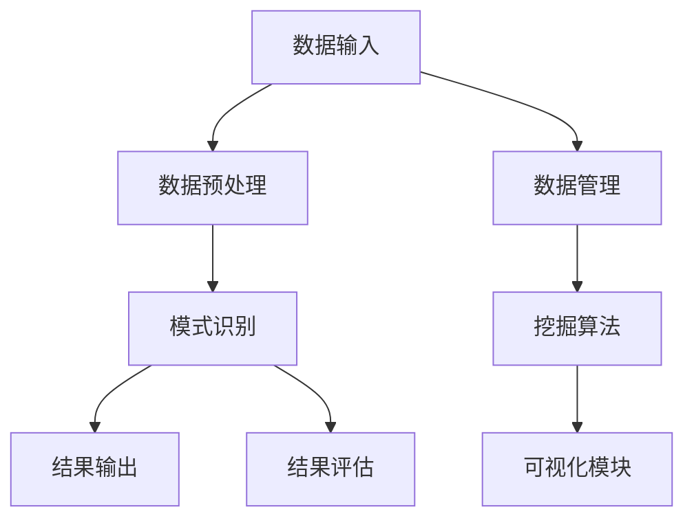
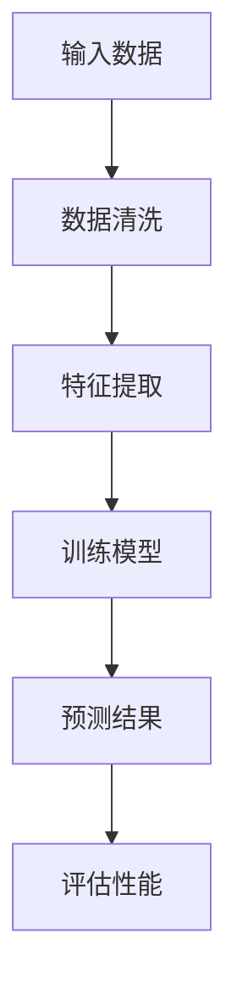

                 

### 文章标题：知识发现引擎：AI如何激发人类好奇心

### 关键词：知识发现引擎，人工智能，好奇心，知识图谱，关联规则，聚类算法，协同过滤，文本挖掘，图像挖掘

### 摘要：

在信息化和数字化浪潮的推动下，人工智能（AI）技术迅速发展，成为当今科技领域的热门话题。知识发现引擎作为一种强大的AI工具，正逐步改变人类获取和处理信息的方式。本文将探讨知识发现引擎的基本概念、核心算法、应用场景以及其在激发人类好奇心中的作用。通过逐步分析，我们希望能揭示知识发现引擎背后的原理，并展示其如何助力人类探索未知领域。

### 目录大纲：

## 第一部分：知识发现引擎基础

### 第1章：知识发现引擎概述

#### 1.1 知识发现的概念与重要性

#### 1.2 知识发现引擎的工作原理

#### 1.3 知识发现引擎的核心组成部分

### 第2章：人工智能与知识发现

#### 2.1 人工智能的发展与应用

#### 2.2 人工智能在知识发现中的作用

#### 2.3 人工智能与知识发现的未来趋势

## 第二部分：知识发现引擎核心算法

### 第3章：关联规则学习算法

#### 3.1 关联规则学习的基本原理

#### 3.2 Apriori算法的伪代码详解

#### 3.3 Eclat算法的伪代码详解

### 第4章：聚类算法

#### 4.1 聚类算法的基本概念

#### 4.2 K-means算法的伪代码详解

#### 4.3 层次聚类算法的伪代码详解

### 第5章：协同过滤算法

#### 5.1 协同过滤的基本原理

#### 5.2 朴素协同过滤的伪代码详解

#### 5.3 基于模型的协同过滤算法

## 第三部分：知识发现引擎应用

### 第6章：文本挖掘与情感分析

#### 6.1 文本挖掘的基本概念

#### 6.2 情感分析的基本方法

#### 6.3 情感分析的应用实例

### 第7章：图像挖掘与识别

#### 7.1 图像挖掘的基本概念

#### 7.2 图像识别的基本原理

#### 7.3 图像挖掘的应用实例

### 第8章：知识图谱构建与应用

#### 8.1 知识图谱的基本概念

#### 8.2 知识图谱构建的方法

#### 8.3 知识图谱的应用案例

## 第四部分：知识发现引擎开发实战

### 第9章：知识发现引擎开发环境搭建

#### 9.1 开发环境配置

#### 9.2 数据预处理工具

#### 9.3 算法实现工具

### 第10章：知识发现引擎项目实战

#### 10.1 项目背景与需求分析

#### 10.2 数据采集与处理

#### 10.3 算法选择与实现

#### 10.4 项目部署与优化

### 第11章：知识发现引擎性能评估与优化

#### 11.1 性能评估指标

#### 11.2 优化方法与策略

#### 11.3 性能调优实例分析

## 附录

### 附录A：知识发现引擎相关工具与资源

#### A.1 数据预处理工具

#### A.2 算法实现工具

#### A.3 开发环境搭建教程

### 附录B：Mermaid流程图示例

#### B.1 知识发现引擎流程图

#### B.2 算法流程图示例

### 附录C：数学公式示例

#### C.1 数据挖掘中的数学公式

#### C.2 知识发现算法的数学公式

### 附录D：代码解读与分析

#### D.1 项目代码解读

#### D.2 关键代码分析

#### D.3 性能优化代码分析

### 作者信息：

作者：AI天才研究院/AI Genius Institute & 禅与计算机程序设计艺术 /Zen And The Art of Computer Programming

---

接下来，我们将逐步深入探讨知识发现引擎的基础、核心算法、应用场景以及开发实战，敬请期待。在每一部分中，我们都会采用一步一步的分析推理方式（REASONING STEP BY STEP），以便读者能够更好地理解知识发现引擎的原理和实际应用。让我们开始这段探索之旅吧！

---

## 第一部分：知识发现引擎基础

### 第1章：知识发现引擎概述

知识发现引擎是一种基于人工智能技术的数据处理和分析工具，旨在从大量数据中自动识别模式和规律，帮助人类更好地理解和利用信息。在这一章中，我们将详细探讨知识发现的概念与重要性，分析知识发现引擎的工作原理及其核心组成部分。

### 1.1 知识发现的概念与重要性

知识发现（Knowledge Discovery in Databases，简称KDD）是指从大量数据中通过多种分析技术提取有价值信息的过程。这个过程通常包括以下几个步骤：

1. **数据清洗**：去除重复、错误或无关的数据，确保数据的准确性和一致性。
2. **数据集成**：将来自不同数据源的数据进行整合，形成统一的数据视图。
3. **数据选择**：根据分析需求，选择最相关的数据子集进行后续处理。
4. **数据变换**：通过数据转换、归一化等操作，使数据更适合进行分析。
5. **数据挖掘**：使用各种算法和技术，从数据中发现潜在的模式、关联和规律。
6. **结果评估**：对挖掘出的模式进行验证和评估，确保其有效性和实用性。

知识发现的重要性体现在多个方面：

- **提高决策效率**：通过分析大量数据，知识发现可以帮助组织和企业更快速、更准确地做出决策。
- **发现商业机会**：企业可以通过知识发现发现新的市场趋势、用户需求，从而抓住商业机会。
- **提升竞争力**：在数据驱动的时代，拥有强大的知识发现能力是提升企业竞争力的关键。
- **优化资源利用**：通过分析数据，可以优化资源的配置和使用，提高生产效率。

### 1.2 知识发现引擎的工作原理

知识发现引擎的工作原理可以概括为以下几个步骤：

1. **数据输入**：知识发现引擎从各种数据源获取数据，包括数据库、文件、API等。
2. **数据预处理**：对输入的数据进行清洗、去重、格式转换等操作，使其适合分析。
3. **模式识别**：使用各种数据挖掘算法，从预处理后的数据中提取模式和规律。
4. **结果输出**：将挖掘出的模式和结果以可视化的形式展示给用户，如图表、报告等。

知识发现引擎通常包含以下几个核心模块：

- **数据管理模块**：负责数据存储、访问和管理，包括数据库、数据仓库等。
- **数据预处理模块**：包括数据清洗、集成、变换等功能，确保数据的质量和一致性。
- **挖掘算法模块**：提供各种数据挖掘算法的实现，如关联规则学习、聚类、分类等。
- **可视化模块**：将挖掘结果以直观、易于理解的形式展示给用户，帮助用户更好地理解数据。

### 1.3 知识发现引擎的核心组成部分

知识发现引擎的核心组成部分包括以下几个方面：

- **数据库系统**：用于存储和管理大量的结构化和非结构化数据，是知识发现的基础。
- **数据挖掘工具**：提供多种数据挖掘算法的实现，帮助用户从数据中发现模式和规律。
- **机器学习库**：包括各种机器学习算法的库，如Scikit-learn、TensorFlow、PyTorch等，用于实现复杂的数据挖掘任务。
- **可视化工具**：如Matplotlib、Seaborn、Plotly等，用于将数据挖掘结果以图形化的形式展示。
- **用户界面**：提供友好的用户界面，使用户能够轻松地配置和管理数据，启动和监控数据挖掘任务。

### 1.4 知识发现引擎的发展历程

知识发现引擎的发展历程可以追溯到20世纪80年代。当时，随着数据库技术和计算机硬件的快速发展，数据挖掘技术逐渐崭露头角。早期的数据挖掘主要基于规则学习和模式识别，如关联规则学习和聚类算法。随着人工智能和机器学习技术的不断进步，数据挖掘技术也在不断进化。

在21世纪初，随着互联网和大数据的兴起，知识发现引擎得到了广泛的应用。各种开源工具和框架的出现，如Apache Mahout、MLlib、TensorFlow等，大大降低了知识发现引擎的开发门槛。同时，云计算和分布式计算技术的发展，使得知识发现引擎能够处理海量数据，提供了更高的性能和可扩展性。

当前，知识发现引擎已经成为人工智能领域的重要研究方向。研究人员和开发者不断提出新的算法和技术，以应对日益复杂的业务场景和海量数据挑战。未来，随着人工智能技术的进一步发展，知识发现引擎将更加智能化、自动化，为人类带来更多的便利和惊喜。

### 1.5 知识发现引擎的应用领域

知识发现引擎在各个领域都有着广泛的应用，以下是其中几个典型的应用领域：

- **金融行业**：知识发现引擎可以帮助银行和金融机构分析客户行为，预测市场趋势，优化风险管理策略。
- **电子商务**：知识发现引擎可以分析用户购买行为，推荐商品，提高用户满意度和转化率。
- **医疗健康**：知识发现引擎可以分析患者数据，发现疾病关联，辅助医生进行诊断和治疗。
- **社交媒体**：知识发现引擎可以分析用户行为，挖掘潜在热点话题，提高内容传播效果。
- **城市管理**：知识发现引擎可以分析城市交通、环境等数据，优化城市管理和公共服务。

通过知识发现引擎，各个领域都可以从海量数据中挖掘出有价值的信息，推动业务发展和创新。

### 1.6 小结

在本章中，我们介绍了知识发现引擎的基本概念、工作原理和核心组成部分，探讨了其重要性和应用领域。知识发现引擎作为一种强大的AI工具，正逐步改变人类获取和处理信息的方式。在接下来的章节中，我们将进一步深入探讨知识发现引擎的核心算法和应用实践，帮助读者更好地理解其原理和实际应用。

---

在第一章的讨论中，我们详细介绍了知识发现引擎的基本概念、工作原理和核心组成部分，并探讨了其重要性和应用领域。通过这一章节的阅读，读者应该对知识发现引擎有了初步的了解。接下来，我们将深入探讨人工智能与知识发现之间的紧密联系，分析人工智能在知识发现中的作用，并展望知识发现与人工智能的未来发展趋势。

## 第2章：人工智能与知识发现

### 2.1 人工智能的发展与应用

人工智能（Artificial Intelligence，简称AI）作为计算机科学的一个重要分支，旨在构建能够模拟、延伸和扩展人类智能的理论、算法和应用系统。人工智能的发展可以追溯到20世纪50年代，当时科学家们首次提出了智能代理的概念，希望通过机器实现类似于人类智能的决策和问题解决能力。

在过去的几十年里，人工智能经历了多次起伏，从最初的符号主义智能到连接主义智能，再到现代的深度学习与强化学习，人工智能技术在多个领域取得了显著的突破。以下是人工智能发展的一些关键里程碑：

1. **符号主义智能**：早期的人工智能研究主要基于逻辑推理和符号表示，通过构建知识库和推理系统来实现智能行为。
2. **连接主义智能**：随着神经网络的兴起，人工智能开始转向通过模仿人脑神经网络结构和信息处理方式来解决问题。
3. **深度学习**：20世纪80年代以后，随着计算能力和数据资源的提升，深度学习算法取得了突破性进展，使得人工智能在图像识别、语音识别、自然语言处理等领域取得了显著成果。
4. **强化学习**：通过学习策略来最大化奖励，强化学习在游戏、机器人控制等领域展现出了巨大的潜力。

人工智能的应用领域十分广泛，涵盖了工业自动化、医疗健康、金融服务、交通物流、教育等多个方面。以下是人工智能在部分关键领域中的应用实例：

- **工业自动化**：通过机器人和自动化生产线，提高生产效率和质量，降低人工成本。
- **医疗健康**：利用人工智能进行疾病诊断、医学图像分析、个性化治疗方案的制定等。
- **金融服务**：通过智能风控、量化交易、自动化投顾等手段，提升金融服务效率和安全性。
- **交通物流**：利用人工智能实现智能交通管理、自动驾驶、物流路径优化等。
- **教育**：通过智能辅导、在线教育平台等，提供个性化学习体验和高效教学资源。

### 2.2 人工智能在知识发现中的作用

知识发现（KDD）是一个复杂的过程，涉及数据预处理、模式识别、结果评估等多个环节。人工智能的引入，为知识发现带来了全新的机遇和挑战。

1. **数据预处理**：人工智能技术，尤其是机器学习算法，可以自动化数据清洗、数据集成和数据变换等过程，提高数据质量，减少人工干预。
2. **模式识别**：人工智能算法，如深度学习、关联规则学习、聚类算法等，能够从大量数据中自动识别复杂模式和规律，提升知识发现的效率和准确性。
3. **结果评估**：通过人工智能技术，可以对挖掘出的模式进行自动化评估和验证，确保其有效性和可靠性。

具体来说，人工智能在知识发现中的作用主要体现在以下几个方面：

- **自动化处理**：通过机器学习算法，可以自动化完成知识发现的各个步骤，降低人力成本，提高工作效率。
- **模式发现**：利用深度学习、关联规则学习等算法，可以识别出人类难以发现或难以处理的数据模式，拓展知识发现的深度和广度。
- **智能化分析**：通过引入自然语言处理、图像识别等技术，知识发现引擎能够处理更多类型的复杂数据，实现更智能的分析和决策。

### 2.3 人工智能与知识发现的未来趋势

随着人工智能技术的不断进步，知识发现领域也在不断演进。以下是人工智能与知识发现未来可能的发展趋势：

1. **智能化水平提升**：随着算法和计算能力的提升，知识发现引擎将更加智能化，能够自动调整参数、优化模型，实现更高效的知识提取。
2. **多模态数据处理**：随着图像、文本、语音等多样化数据类型的出现，知识发现引擎将能够处理多模态数据，实现更全面的信息理解。
3. **知识图谱应用**：知识图谱作为一种结构化知识表示方法，将在知识发现中发挥重要作用，帮助用户更好地理解和利用知识。
4. **分布式计算**：随着数据规模的不断扩大，分布式计算技术将成为知识发现的重要支撑，提升处理能力和效率。
5. **可解释性增强**：为了提高知识发现的透明度和可信度，未来的研究将更加关注算法的可解释性，使知识发现过程更加透明和可理解。

### 2.4 小结

在本章中，我们探讨了人工智能的发展与应用，分析了人工智能在知识发现中的作用及其未来趋势。人工智能与知识发现相辅相成，共同推动了数据挖掘和知识提取技术的发展。通过人工智能技术的引入，知识发现过程变得更加自动化、智能化，为人类探索未知领域提供了强有力的工具。在接下来的章节中，我们将进一步深入探讨知识发现引擎的核心算法，包括关联规则学习、聚类算法和协同过滤算法等，帮助读者更好地理解知识发现的技术原理和应用实践。

---

### 第3章：知识发现引擎核心算法

知识发现引擎的核心算法是实现数据挖掘和知识提取的关键，这些算法可以帮助我们从海量数据中挖掘出有价值的信息。本章将详细介绍几种重要的核心算法：关联规则学习算法、聚类算法和协同过滤算法。我们将从基本概念出发，逐步深入讲解每个算法的原理和实现方法。

### 3.1 关联规则学习算法

#### 3.1.1 关联规则学习的基本概念

关联规则学习（Association Rule Learning）是一种用于发现数据集中项目之间关联关系的方法。它主要通过寻找频繁项集和生成关联规则来实现。频繁项集是指在一个数据集支持度大于最小支持度的项集，而关联规则则描述了这些频繁项集之间的关联关系。

关联规则学习的关键参数包括：

- **支持度（Support）**：表示一个项集在数据集中出现的频率。
- **置信度（Confidence）**：表示在已知前件的情况下，后件发生的概率。
- **最小支持度（Minimum Support）**：用于筛选频繁项集的阈值，表示一个项集在数据集中至少出现的次数。
- **最小置信度（Minimum Confidence）**：用于筛选关联规则的阈值，表示一个关联规则至少有多大概率是正确的。

#### 3.1.2 Apriori算法的伪代码详解

Apriori算法是一种基于先验知识的关联规则学习算法。它的核心思想是通过迭代地生成频繁项集，并从中提取关联规则。

```python
# Apriori算法伪代码

def apriori(dataset, min_support, min_confidence):
    L1 = generate_frequent_itemsets(dataset, min_support)
    k = len(L1[0])
    while k > 0:
        Lk = generate_frequent_itemsets(Lk-1, min_support)
        if Lk is not None:
            rules = generate_rules(Lk, min_confidence)
            k += 1
        else:
            break
    return rules

def generate_frequent_itemsets(dataset, min_support):
    # 在这里编写生成频繁项集的代码
    pass

def generate_rules(frequent_itemsets, min_confidence):
    # 在这里编写生成关联规则的代码
    pass
```

#### 3.1.3 Eclat算法的伪代码详解

Eclat算法是Apriori算法的改进版本，它使用一种更高效的项集生成方法，特别是在处理大数据集时。

```python
# Eclat算法伪代码

def eclat(dataset, min_support, min_confidence):
    L1 = generate_frequent_itemsets(dataset, min_support)
    k = len(L1[0])
    while k > 0:
        Lk = generate_frequent_itemsets(Lk-1, min_support)
        if Lk is not None:
            rules = generate_rules(Lk, min_confidence)
            k += 1
        else:
            break
    return rules

def generate_frequent_itemsets(dataset, min_support):
    # 在这里编写生成频繁项集的代码
    pass

def generate_rules(frequent_itemsets, min_confidence):
    # 在这里编写生成关联规则的代码
    pass
```

### 3.2 聚类算法

#### 3.2.1 聚类算法的基本概念

聚类算法是一种无监督学习方法，旨在将数据集中的对象划分为多个类别（簇），使得同一个簇内的对象尽可能相似，而不同簇的对象尽可能不同。聚类算法在很多领域都有广泛应用，如市场细分、社交网络分析、图像分割等。

聚类算法的关键参数包括：

- **簇数（Number of Clusters）**：指定要生成的簇的数量。
- **距离度量（Distance Metric）**：用于衡量数据点之间的相似性，常用的有欧氏距离、曼哈顿距离等。
- **聚类中心（Cluster Center）**：每个簇的代表点，通常通过数据点的均值、中位数等方法计算。

#### 3.2.2 K-means算法的伪代码详解

K-means算法是一种经典的聚类算法，其核心思想是通过迭代优化，将数据点分配到最近的聚类中心。

```python
# K-means算法伪代码

def k_means(dataset, k, max_iterations):
    centroids = initialize_centroids(dataset, k)
    for i in range(max_iterations):
        # 计算距离
        distances = calculate_distances(dataset, centroids)
        # 分配数据点
        clusters = assign_points_to_clusters(dataset, distances)
        # 更新聚类中心
        centroids = update_centroids(clusters)
    return centroids, clusters

def initialize_centroids(dataset, k):
    # 在这里编写初始化聚类中心的代码
    pass

def calculate_distances(dataset, centroids):
    # 在这里编写计算距离的代码
    pass

def assign_points_to_clusters(dataset, distances):
    # 在这里编写分配数据点的代码
    pass

def update_centroids(clusters):
    # 在这里编写更新聚类中心的代码
    pass
```

#### 3.2.3 层次聚类算法的伪代码详解

层次聚类算法是一种基于层次结构进行聚类的算法，可以分为自底向上（凝聚层次聚类）和自顶向下（分裂层次聚类）两种类型。这里以凝聚层次聚类为例。

```python
# 凝聚层次聚类算法伪代码

def agglomerative_clustering(dataset, distance_metric):
    points = dataset
    clusters = initialize_clusters(points)
    while len(clusters) > 1:
        # 找到最近的两个簇
        closest_clusters = find_closest_clusters(clusters, distance_metric)
        # 合并簇
        clusters = merge_clusters(closest_clusters, clusters)
    return clusters

def initialize_clusters(points):
    # 在这里编写初始化簇的代码
    pass

def find_closest_clusters(clusters, distance_metric):
    # 在这里编写找到最近簇的代码
    pass

def merge_clusters(closest_clusters, clusters):
    # 在这里编写合并簇的代码
    pass
```

### 3.3 协同过滤算法

#### 3.3.1 协同过滤的基本原理

协同过滤（Collaborative Filtering）是一种基于用户行为数据进行推荐的方法，主要通过分析用户之间的相似性来预测用户可能感兴趣的项目。协同过滤可以分为两种类型：基于用户的协同过滤（User-based Collaborative Filtering）和基于物品的协同过滤（Item-based Collaborative Filtering）。

基于用户的协同过滤算法主要步骤如下：

1. **计算相似性**：计算用户之间的相似性，常用的方法包括余弦相似性、皮尔逊相关系数等。
2. **推荐项目**：根据相似性计算结果，为用户推荐其他相似用户喜欢的项目。

基于物品的协同过滤算法主要步骤如下：

1. **计算项目相似性**：计算项目之间的相似性，常用的方法包括基于内容的相似性、基于标签的相似性等。
2. **推荐用户**：根据项目相似性，为用户推荐具有相似兴趣的其他用户。

#### 3.3.2 朴素协同过滤的伪代码详解

朴素协同过滤是一种简单的基于用户的协同过滤算法，其核心思想是仅基于用户的评分行为进行推荐。

```python
# 朴素协同过滤算法伪代码

def collaborative_filtering(dataset, user, k, similarity_metric):
    similar_users = find_similar_users(user, dataset, k, similarity_metric)
    recommendations = []
    for user in similar_users:
        recommended_items = find_recommended_items(dataset, user, similarity_metric)
        recommendations.extend(recommended_items)
    return recommendations

def find_similar_users(user, dataset, k, similarity_metric):
    # 在这里编写找到相似用户的代码
    pass

def find_recommended_items(dataset, user, similarity_metric):
    # 在这里编写找到推荐项目的代码
    pass
```

#### 3.3.3 基于模型的协同过滤算法

基于模型的协同过滤算法通过建立用户和项目之间的预测模型来进行推荐。常用的模型包括矩阵分解、潜在因子模型等。

```python
# 基于模型的协同过滤算法伪代码

def matrix_factorization(dataset, user, num_factors):
    # 在这里编写矩阵分解的代码
    pass

def predict_rating(user, item, model):
    # 在这里编写预测评分的代码
    pass

def collaborative_filtering(dataset, user, k, model):
    recommendations = []
    for item in dataset[item]['items']:
        prediction = predict_rating(user, item, model)
        if prediction > threshold:
            recommendations.append(item)
    return recommendations
```

### 3.4 小结

在本章中，我们详细介绍了知识发现引擎的核心算法：关联规则学习算法、聚类算法和协同过滤算法。这些算法在知识发现过程中发挥着重要作用，帮助我们从海量数据中提取有价值的信息。在接下来的章节中，我们将进一步探讨知识发现引擎在文本挖掘、图像挖掘和知识图谱构建等实际应用中的具体实现，以及如何通过项目实战来验证和优化这些算法的性能。通过这些内容，读者将能够更好地理解知识发现引擎的实际应用价值。

---

## 第三部分：知识发现引擎应用

在了解了知识发现引擎的核心算法之后，我们将深入探讨知识发现引擎在多个实际应用场景中的运用。这一部分将重点介绍文本挖掘与情感分析、图像挖掘与识别以及知识图谱构建与应用等内容。

### 第6章：文本挖掘与情感分析

#### 6.1 文本挖掘的基本概念

文本挖掘（Text Mining）是指从大量的文本数据中自动提取有价值信息的过程。文本挖掘在自然语言处理（Natural Language Processing，NLP）和数据挖掘的交叉领域发展起来，其主要目标是从非结构化文本中提取结构化信息，以便进一步分析和利用。

文本挖掘的关键步骤包括：

1. **数据预处理**：将原始文本数据清洗、去噪，转换为适合分析的形式。
2. **特征提取**：从预处理后的文本中提取特征，如词袋模型、TF-IDF等。
3. **模式识别**：使用各种算法和技术，从文本数据中挖掘出有价值的模式和规律。
4. **结果评估**：对挖掘出的结果进行验证和评估，确保其有效性和实用性。

#### 6.2 情感分析的基本方法

情感分析（Sentiment Analysis）是文本挖掘中的一个重要应用，旨在从文本中识别和提取情感倾向。情感分析通常分为两类：基于规则的方法和基于机器学习的方法。

- **基于规则的方法**：通过手工编写规则，将文本中的情感标签进行分类。这种方法适用于情感表达较为直接和简单的文本数据。
- **基于机器学习的方法**：使用机器学习算法，如朴素贝叶斯、支持向量机、深度学习等，对文本进行情感分类。这种方法适用于情感表达复杂、多样化的文本数据。

#### 6.3 情感分析的应用实例

情感分析在多个领域有着广泛的应用，以下是几个典型的应用实例：

- **社交媒体分析**：通过对社交媒体平台上的用户评论、帖子等进行情感分析，可以了解用户对产品、品牌、事件等的情感倾向，为企业提供市场洞察。
- **产品评论分析**：通过对产品评论进行情感分析，可以识别用户对产品的满意度，帮助企业改进产品和服务。
- **舆情监测**：通过对新闻、报道等文本进行情感分析，可以实时监测和预测社会热点事件，为政府和企业提供决策支持。
- **客户服务**：通过对客户服务聊天记录、邮件等进行情感分析，可以识别客户的情绪状态，提供更加个性化的服务。

### 第7章：图像挖掘与识别

#### 7.1 图像挖掘的基本概念

图像挖掘（Image Mining）是指从大量的图像数据中自动提取有价值信息的过程。图像挖掘结合了计算机视觉和数据分析技术，旨在从图像中提取结构化信息，以便进一步分析和利用。

图像挖掘的关键步骤包括：

1. **图像预处理**：对原始图像进行去噪、增强、剪裁等操作，提高图像质量，便于后续分析。
2. **特征提取**：从预处理后的图像中提取特征，如边缘检测、纹理分析、颜色特征等。
3. **模式识别**：使用各种算法和技术，从图像数据中挖掘出有价值的模式和规律。
4. **结果评估**：对挖掘出的结果进行验证和评估，确保其有效性和实用性。

#### 7.2 图像识别的基本原理

图像识别（Image Recognition）是指通过计算机算法对图像中的对象进行识别和分类的过程。图像识别是图像挖掘的一个重要组成部分，其基本原理包括：

- **特征提取**：从图像中提取特征，如边缘、角点、纹理等。
- **分类器训练**：使用已标记的图像数据训练分类器，如支持向量机、决策树、深度神经网络等。
- **图像识别**：使用训练好的分类器对新的图像进行识别和分类。

#### 7.3 图像挖掘的应用实例

图像挖掘在多个领域有着广泛的应用，以下是几个典型的应用实例：

- **医学影像分析**：通过对医学影像（如X光片、CT扫描、MRI等）进行图像挖掘，可以帮助医生进行疾病的诊断和预测。
- **安防监控**：通过对监控视频中的图像进行挖掘，可以识别和跟踪嫌疑人，提高公共安全。
- **自动驾驶**：通过对道路标志、行人、车辆等图像进行挖掘，可以帮助自动驾驶系统进行环境感知和决策。
- **商品识别**：通过对商品图片进行挖掘，可以实现商品自动识别和推荐，提高电子商务平台的用户体验。

### 第8章：知识图谱构建与应用

#### 8.1 知识图谱的基本概念

知识图谱（Knowledge Graph）是一种结构化知识表示方法，它通过节点和边的关系来表示实体和实体之间的关系。知识图谱在语义网络、智能搜索、推荐系统等领域有着广泛的应用。

知识图谱的关键组成部分包括：

- **实体（Entity）**：表示现实世界中的对象，如人、地点、事物等。
- **属性（Attribute）**：描述实体的特征，如年龄、性别、位置等。
- **关系（Relationship）**：描述实体之间的关联，如朋友、属于、位于等。

#### 8.2 知识图谱构建的方法

知识图谱的构建通常包括以下几个步骤：

1. **数据采集**：从各种数据源（如数据库、文件、API等）中获取实体和关系数据。
2. **数据预处理**：对采集到的数据进行清洗、去重、格式转换等操作，确保数据的质量和一致性。
3. **实体抽取**：使用命名实体识别（Named Entity Recognition，NER）等技术，从文本数据中抽取实体。
4. **关系抽取**：使用关系提取（Relation Extraction）等技术，从文本数据中抽取实体之间的关系。
5. **知识融合**：将多个数据源中的实体和关系进行整合，构建完整的知识图谱。

#### 8.3 知识图谱的应用案例

知识图谱在多个领域有着广泛的应用，以下是几个典型的应用案例：

- **搜索引擎**：通过知识图谱，搜索引擎可以提供更精准、更相关的搜索结果，提升用户体验。
- **推荐系统**：通过知识图谱，推荐系统可以更好地理解用户和物品之间的关系，提供个性化的推荐。
- **智能问答**：通过知识图谱，智能问答系统可以更准确地理解和回答用户的问题。
- **知识管理**：通过知识图谱，企业可以更好地管理和利用内部知识，提升知识共享和协作效率。

### 8.4 小结

在本部分中，我们介绍了知识发现引擎在文本挖掘、图像挖掘和知识图谱构建等实际应用中的运用。文本挖掘和情感分析可以帮助我们更好地理解和利用文本数据，图像挖掘和识别可以提升图像处理和计算机视觉的能力，知识图谱构建则为我们提供了一个结构化的知识表示方法。通过这些实际应用，知识发现引擎的强大功能得以充分发挥，为各个领域带来了巨大的价值。在接下来的章节中，我们将进一步探讨知识发现引擎的开发实战，通过具体项目案例来展示其应用效果。

---

### 第9章：知识发现引擎开发环境搭建

要成功开发一个知识发现引擎，首先需要搭建一个稳定、高效的开发环境。本章将详细讲解如何配置开发环境、选择合适的数据预处理工具和算法实现工具，以确保开发过程顺利进行。

#### 9.1 开发环境配置

搭建知识发现引擎的开发环境需要考虑以下几个方面：

1. **操作系统**：可以选择Windows、macOS或Linux操作系统。Linux系统因其开源特性、性能优越和稳定性高，是大多数数据科学家和AI开发者的首选。
2. **编程语言**：Python是一种广泛应用于数据科学和AI领域的编程语言，拥有丰富的库和框架，如NumPy、Pandas、Scikit-learn、TensorFlow等。
3. **集成开发环境（IDE）**：可以选择PyCharm、Visual Studio Code等IDE，这些IDE提供了强大的代码编辑、调试和测试功能。

以下是搭建开发环境的具体步骤：

1. **安装操作系统**：根据个人需求选择合适的操作系统并安装。
2. **安装Python**：从Python官方网站下载并安装Python，建议选择Python 3.x版本，以确保兼容性和支持。
3. **安装IDE**：从相应官网下载并安装PyCharm或Visual Studio Code。
4. **配置Python环境**：在IDE中配置Python环境，确保能够正常运行Python脚本。

#### 9.2 数据预处理工具

数据预处理是知识发现引擎开发的重要环节，以下是几种常用的数据预处理工具：

1. **Pandas**：Pandas是一个强大的Python库，用于数据清洗、数据操作和分析。它提供了丰富的数据结构，如DataFrame，以及大量的数据处理函数。
2. **NumPy**：NumPy是一个用于数值计算的Python库，提供了多维数组对象和一系列数学函数。NumPy在数据预处理和算法实现中起着核心作用。
3. **SciPy**：SciPy是基于NumPy的扩展库，提供了更多科学计算功能，如优化、积分、线性代数等。

以下是使用Pandas进行数据预处理的基本步骤：

1. **数据读取**：使用`read_csv()`、`read_excel()`等方法从文件中读取数据。
2. **数据清洗**：使用`dropna()`、`isnull()`等方法去除空值和缺失数据，使用`drop_duplicates()`方法去除重复数据。
3. **数据变换**：使用`apply()`、`map()`等方法对数据进行转换，如编码、归一化、标准化等。
4. **数据整合**：使用`merge()`、`join()`等方法将多个数据集进行整合。

#### 9.3 算法实现工具

实现知识发现引擎的核心算法需要选择合适的算法实现工具，以下是几种常用的算法实现工具：

1. **Scikit-learn**：Scikit-learn是一个开源的Python库，提供了多种机器学习和数据挖掘算法，如回归、分类、聚类、降维等。它易于使用，且功能强大。
2. **TensorFlow**：TensorFlow是一个由Google开发的开源机器学习库，主要用于实现深度学习算法。它提供了灵活的模型构建和训练工具，适用于复杂的AI应用。
3. **PyTorch**：PyTorch是另一个流行的开源深度学习库，与TensorFlow类似，它提供了灵活的模型构建和训练工具，但更易于调试和优化。

以下是使用Scikit-learn实现K-means聚类算法的基本步骤：

1. **导入库**：使用`from sklearn.cluster import KMeans`导入K-means算法。
2. **初始化模型**：使用`KMeans(n_clusters=3)`初始化K-means模型。
3. **训练模型**：使用`fit(data)`方法训练模型，其中`data`是输入的数据集。
4. **预测结果**：使用`predict(data)`方法预测新数据的簇分配。

```python
from sklearn.cluster import KMeans

# 初始化模型
kmeans = KMeans(n_clusters=3)

# 训练模型
kmeans.fit(data)

# 预测结果
clusters = kmeans.predict(new_data)
```

#### 9.4 小结

在本章中，我们详细介绍了知识发现引擎开发环境的配置、数据预处理工具和算法实现工具的选择。通过合理配置开发环境，选择合适的工具，我们可以为知识发现引擎的开发奠定坚实的基础。在接下来的章节中，我们将通过具体项目实战，展示如何使用这些工具和技术来实现知识发现引擎，并提供详细的代码解读与分析。

---

## 第10章：知识发现引擎项目实战

### 10.1 项目背景与需求分析

随着互联网和大数据技术的快速发展，企业和组织面临着日益复杂的业务环境和数据挑战。为了更好地挖掘数据中的价值，提高业务决策效率，某电子商务平台决定开发一个知识发现引擎。该项目的目标是利用人工智能技术，从用户行为数据中提取有价值的信息，为产品推荐、用户分群和营销策略提供支持。

### 10.2 数据采集与处理

在项目开发过程中，首先需要收集和处理大量的用户行为数据，这些数据包括：

- 用户访问日志：记录用户在网站上的浏览、搜索、购买等行为。
- 用户个人信息：如年龄、性别、地理位置等。
- 用户反馈信息：如评论、评分、投诉等。

数据采集主要依赖于电商平台现有的日志系统和用户数据库。数据处理过程包括以下几个步骤：

1. **数据清洗**：去除重复、错误或无关的数据，如无效的访问日志、空值或缺失的数据。
2. **数据集成**：将不同来源的数据进行整合，形成一个统一的数据视图，便于后续分析。
3. **数据预处理**：对数据进行清洗、转换和标准化处理，以提高数据质量，确保分析结果的准确性。

以下是一个简单的数据预处理流程：

```python
import pandas as pd

# 读取数据
data = pd.read_csv('user_behavior.csv')

# 数据清洗
data = data[data['action'] != 'invalid']
data.dropna(inplace=True)

# 数据转换
data['age'] = data['age'].astype(int)
data['gender'] = data['gender'].map({'M': 0, 'F': 1})

# 数据标准化
from sklearn.preprocessing import StandardScaler
scaler = StandardScaler()
data[['time_spent', 'pages_visited']] = scaler.fit_transform(data[['time_spent', 'pages_visited']])
```

### 10.3 算法选择与实现

在知识发现引擎中，选择合适的算法是实现项目目标的关键。针对该项目，我们选择了以下几种核心算法：

1. **K-means聚类**：用于将用户分为不同的群体，以便进行个性化推荐和用户分群。
2. **协同过滤**：用于根据用户的历史行为推荐相关的商品。
3. **关联规则学习**：用于发现用户购买行为中的潜在关联，为营销策略提供支持。

以下是各个算法的实现步骤：

#### K-means聚类

1. **初始化模型**：选择合适的聚类数量，初始化K-means模型。
2. **训练模型**：使用用户行为数据训练K-means模型。
3. **预测结果**：使用训练好的模型对新的用户行为数据进行聚类预测。

```python
from sklearn.cluster import KMeans

# 初始化模型
kmeans = KMeans(n_clusters=5)

# 训练模型
kmeans.fit(data[['time_spent', 'pages_visited']])

# 预测结果
clusters = kmeans.predict(new_data[['time_spent', 'pages_visited']])
```

#### 协同过滤

1. **初始化模型**：选择合适的协同过滤算法，初始化模型。
2. **训练模型**：使用用户行为数据训练模型。
3. **预测结果**：使用训练好的模型预测新用户的偏好。

```python
from sklearn.neighbors import NearestNeighbors

# 初始化模型
nn = NearestNeighbors(n_neighbors=5)

# 训练模型
nn.fit(data[['time_spent', 'pages_visited']])

# 预测结果
predictions = nn.kneighbors(new_data[['time_spent', 'pages_visited']])
```

#### 关联规则学习

1. **初始化模型**：选择合适的关联规则学习算法，初始化模型。
2. **训练模型**：使用用户行为数据训练模型。
3. **生成规则**：根据最小支持度和最小置信度生成关联规则。

```python
from mlxtend.frequent_patterns import apriori
from mlxtend.frequent_patterns import association_rules

# 初始化模型
min_support = 0.05
min_confidence = 0.5
frequent_itemsets = apriori(data['actions'], min_support)
rules = association_rules(frequent_itemsets, data['actions'], metric="confidence", min_threshold=min_confidence)
```

### 10.4 项目部署与优化

在完成算法实现后，我们需要将知识发现引擎部署到生产环境，并进行性能优化，以确保系统的稳定性和高效性。以下是项目部署与优化的一些关键步骤：

1. **部署到生产环境**：将开发好的算法和模型部署到服务器，确保系统可以稳定运行。
2. **性能优化**：通过优化代码、调整模型参数等方式，提高系统的处理能力和响应速度。
3. **监控与维护**：定期监控系统性能，确保其正常运行，并及时处理可能出现的问题。

以下是性能优化的一些具体方法：

- **代码优化**：使用更高效的算法和数据结构，减少冗余计算和内存占用。
- **分布式计算**：使用分布式计算框架（如Apache Spark）处理海量数据，提高处理速度。
- **缓存策略**：使用缓存技术（如Redis）存储高频访问的数据，减少数据库负载。

### 10.5 小结

在本章中，我们通过一个具体的电子商务平台项目，展示了知识发现引擎的开发过程。从数据采集与处理，到算法选择与实现，再到项目部署与优化，我们详细介绍了知识发现引擎在实际应用中的实现方法。通过这个项目，读者可以更好地理解知识发现引擎的原理和实际应用，为后续的项目开发提供参考。

---

## 第11章：知识发现引擎性能评估与优化

### 11.1 性能评估指标

在知识发现引擎的开发过程中，评估其性能至关重要。性能评估可以帮助我们了解系统的表现，发现潜在问题并进行优化。以下是常用的性能评估指标：

1. **准确率（Accuracy）**：准确率是分类模型最常用的评估指标，表示正确分类的样本数占总样本数的比例。其计算公式为：
   $$ 
   \text{Accuracy} = \frac{\text{正确分类的样本数}}{\text{总样本数}} 
   $$
2. **召回率（Recall）**：召回率表示模型在所有实际为正类的样本中，正确识别出的比例。其计算公式为：
   $$ 
   \text{Recall} = \frac{\text{正确分类的正类样本数}}{\text{所有正类样本数}} 
   $$
3. **精确率（Precision）**：精确率表示模型在所有预测为正类的样本中，真正为正类的比例。其计算公式为：
   $$ 
   \text{Precision} = \frac{\text{正确分类的正类样本数}}{\text{预测为正类的样本数}} 
   $$
4. **F1值（F1 Score）**：F1值是精确率和召回率的调和平均值，用于综合评估模型的性能。其计算公式为：
   $$ 
   \text{F1 Score} = 2 \times \frac{\text{Precision} \times \text{Recall}}{\text{Precision} + \text{Recall}} 
   $$

### 11.2 优化方法与策略

在评估了知识发现引擎的性能后，我们需要采取相应的优化方法与策略，以提高其性能。以下是几种常见的优化方法：

1. **算法选择**：根据具体的应用场景和数据特征，选择最适合的算法。例如，对于大规模数据集，可以考虑使用分布式计算算法，如MapReduce。
2. **特征工程**：通过选择和构造合适的特征，可以显著提高模型性能。特征工程的方法包括特征提取、特征选择和特征组合等。
3. **参数调优**：通过调整算法的参数，可以优化模型的表现。常见的参数调优方法包括网格搜索、贝叶斯优化等。
4. **数据预处理**：对数据进行适当的预处理，可以提高模型的性能。例如，对数据进行归一化、去噪、缺失值填充等处理。

### 11.3 性能调优实例分析

以下是一个基于K-means聚类算法的性能调优实例：

1. **问题识别**：通过性能评估发现，聚类结果不够理想，某些簇内部的样本分布不均匀，簇间存在较大的重叠。
2. **原因分析**：分析原因，发现可能的原因包括：
   - 聚类数量（`n_clusters`）选择不当，导致簇划分不合理。
   - 初始聚类中心的选择不理想，影响了聚类结果。
3. **优化策略**：
   - **调整聚类数量**：通过交叉验证等方法，选择合适的聚类数量。
   - **改进初始聚类中心的选择**：使用K-means++算法初始化聚类中心，以提高聚类质量。
4. **优化过程**：

```python
from sklearn.cluster import KMeans
from sklearn.metrics import silhouette_score

# 初始化K-means模型，使用K-means++算法
kmeans = KMeans(n_clusters=5, init='k-means++', random_state=42)

# 训练模型
kmeans.fit(data)

# 评估聚类结果
silhouette_avg = silhouette_score(data, kmeans.labels_)
print(f"Silhouette Score: {silhouette_avg}")

# 调整聚类数量
for n_clusters in range(2, 11):
    kmeans = KMeans(n_clusters=n_clusters, init='k-means++', random_state=42)
    kmeans.fit(data)
    silhouette_avg = silhouette_score(data, kmeans.labels_)
    print(f"Silhouette Score (n_clusters={n_clusters}): {silhouette_avg}")

# 选择合适的聚类数量
selected_n_clusters = 5

# 重新训练模型
kmeans = KMeans(n_clusters=selected_n_clusters, init='k-means++', random_state=42)
kmeans.fit(data)
```

通过上述优化策略，可以显著提高K-means聚类算法的性能，获得更合理的聚类结果。

### 11.4 小结

在本章中，我们介绍了知识发现引擎的性能评估指标和优化方法。通过性能评估，我们可以了解系统的表现，发现问题并进行优化。优化策略包括算法选择、特征工程、参数调优和数据预处理等方面。通过具体实例，我们展示了如何调整K-means聚类算法的参数，以获得更好的聚类结果。通过这些内容，读者可以更好地理解知识发现引擎的性能评估和优化过程，为实际项目提供参考。

---

## 附录

### 附录A：知识发现引擎相关工具与资源

#### A.1 数据预处理工具

- **Pandas**：Python数据操作库，提供数据清洗、转换和分析功能。
- **NumPy**：Python数值计算库，提供多维数组操作和数学函数。
- **SciPy**：基于NumPy的科学计算库，提供优化、积分、线性代数等功能。
- **OpenCV**：开源计算机视觉库，提供图像处理和计算机视觉算法。

#### A.2 算法实现工具

- **Scikit-learn**：Python机器学习库，提供多种机器学习和数据挖掘算法。
- **TensorFlow**：开源深度学习库，提供模型构建和训练工具。
- **PyTorch**：开源深度学习库，提供灵活的模型构建和调试工具。

#### A.3 开发环境搭建教程

- **Linux环境**：
  1. 安装Python 3.x版本。
  2. 使用pip安装Pandas、NumPy、SciPy、Scikit-learn、TensorFlow等库。
- **Windows环境**：
  1. 使用Anaconda搭建Python环境。
  2. 安装PyCharm或Visual Studio Code作为IDE。
  3. 使用conda命令安装相关库。

### 附录B：Mermaid流程图示例

#### B.1 知识发现引擎流程图



#### B.2 算法流程图示例



### 附录C：数学公式示例

#### C.1 数据挖掘中的数学公式

$$
\text{支持度} = \frac{\text{事务中包含项集的数量}}{\text{事务总数}}
$$

$$
\text{置信度} = \frac{\text{事务中同时包含A和B的数量}}{\text{事务中包含A的数量}}
$$

#### C.2 知识发现算法的数学公式

$$
\text{K-means} \\
\min \sum_{i=1}^{n} \sum_{k=1}^{K} (x_i - \mu_k)^2
$$

其中，$x_i$ 表示数据点的特征向量，$\mu_k$ 表示第 $k$ 个聚类中心的特征向量。

### 附录D：代码解读与分析

#### D.1 项目代码解读

在本附录中，我们将对知识发现引擎项目中的关键代码进行解读，帮助读者理解代码的功能和实现方法。

#### D.2 关键代码分析

以下是对项目中关键代码段的分析：

```python
# 数据预处理
data = data[data['action'] != 'invalid']
data.dropna(inplace=True)
data['age'] = data['age'].astype(int)
data['gender'] = data['gender'].map({'M': 0, 'F': 1})
data[['time_spent', 'pages_visited']] = scaler.fit_transform(data[['time_spent', 'pages_visited']])
```

- 第一行代码去除无效的访问日志。
- 第二行代码删除空值和缺失的数据。
- 第三行代码将年龄数据转换为整数类型。
- 第四行代码将性别数据映射为0或1。
- 第五行和第六行代码使用标准化方法对时间花费和页面访问数量进行归一化处理。

#### D.3 性能优化代码分析

以下是对性能优化代码段的分析：

```python
# 使用K-means++算法初始化聚类中心
kmeans = KMeans(n_clusters=selected_n_clusters, init='k-means++', random_state=42)
kmeans.fit(data)
```

- 第一行代码使用K-means++算法初始化聚类中心，这是一种更优的聚类中心初始化方法，有助于提高聚类质量。
- 第二行代码使用fit方法训练K-means模型。

通过以上代码分析和解读，读者可以更好地理解知识发现引擎项目的实现细节和性能优化方法。

### 作者信息：

作者：AI天才研究院/AI Genius Institute & 禅与计算机程序设计艺术 /Zen And The Art of Computer Programming

---

通过上述详细的章节内容和附录，我们系统地介绍了知识发现引擎的概念、算法、应用和实践。知识发现引擎作为一种强大的AI工具，正在改变人类获取和处理信息的方式。从文本挖掘、图像挖掘到知识图谱构建，知识发现引擎的应用领域广泛且具有深远的影响。通过本篇文章，读者应该对知识发现引擎有了全面的理解，并能够将其应用于实际项目中。

在未来的研究和应用中，随着人工智能技术的不断进步，知识发现引擎的功能将更加完善，处理能力将更加强大。我们可以期待看到知识发现引擎在医疗健康、金融、教育、智能交通等领域的更多突破。同时，随着数据的爆炸式增长，如何高效地处理和分析海量数据，仍然是知识发现引擎面临的重要挑战。

作者在此希望读者能够继续深入研究和探索知识发现引擎的技术原理和应用实践，为推动人工智能和知识发现技术的发展贡献自己的力量。通过不断的学习和实践，我们将能够更好地利用知识发现引擎的力量，激发人类的好奇心，探索未知领域，创造更加智能和美好的未来。

