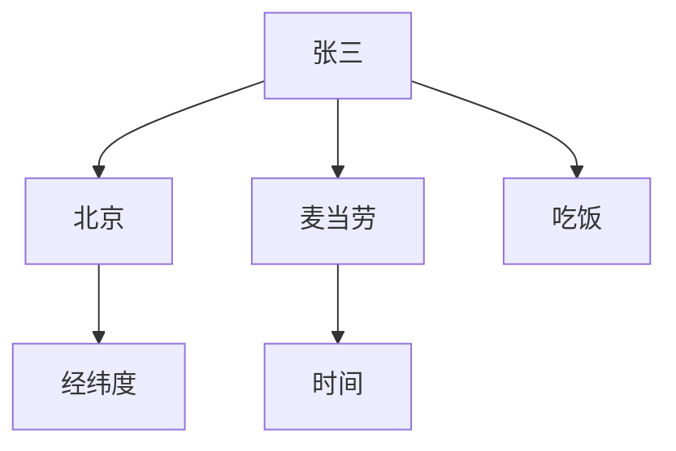

                 

### 文章标题

《知识发现引擎：开启知识创新新纪元》

> 关键词：知识发现引擎、知识创新、人工智能、知识图谱、大数据、数据挖掘

> 摘要：本文旨在探讨知识发现引擎的概念、核心组件、技术原理以及其在各个领域的应用。通过深入分析知识发现引擎的构建过程和实际应用案例，本文揭示了知识发现引擎在推动知识创新和智慧决策方面的巨大潜力。

---

### 《知识发现引擎：开启知识创新新纪元》目录大纲

## 第一部分：引言与背景

## 1.1 知识发现引擎概述

### 1.1.1 知识发现引擎的定义

### 1.1.2 知识发现引擎的重要性

### 1.1.3 知识发现引擎的发展历程

## 1.2 知识创新的概念与价值

### 1.2.1 知识创新的核心概念

### 1.2.2 知识创新的驱动因素

### 1.2.3 知识创新的实践价值

## 第二部分：知识发现引擎的核心组件与技术

## 2.1 数据预处理

### 2.1.1 数据采集

### 2.1.2 数据清洗

### 2.1.3 数据整合

## 2.2 知识提取

### 2.2.1 实体识别

### 2.2.2 关系抽取

### 2.2.3 语义分析

## 2.3 知识建模

### 2.3.1 知识图谱的构建

### 2.3.2 知识图谱的优化

### 2.3.3 知识图谱的应用

## 2.4 知识推理

### 2.4.1 知识推理的基本原理

### 2.4.2 常见的推理算法

### 2.4.3 知识推理在实际应用中的挑战

## 第三部分：知识发现引擎的应用场景与案例分析

## 3.1 产业应用

### 3.1.1 智能制造

### 3.1.2 零售电商

### 3.1.3 金融行业

## 3.2 政府与社会治理

### 3.2.1 政务信息化

### 3.2.2 社会治理

### 3.2.3 公共安全管理

## 3.3 教育与科研

### 3.3.1 教育信息化

### 3.3.2 科研知识管理

### 3.3.3 学术成果挖掘

## 第四部分：知识发现引擎的技术挑战与发展趋势

## 4.1 技术挑战

### 4.1.1 大数据管理

### 4.1.2 知识图谱的扩展性与可扩展性

### 4.1.3 知识推理的效率和准确性

## 4.2 发展趋势

### 4.2.1 人工智能与知识发现引擎的融合

### 4.2.2 开源技术与知识发现引擎的发展

### 4.2.3 跨领域知识融合与知识服务创新

## 第五部分：实践与实现

## 5.1 开发环境搭建

### 5.1.1 硬件环境

### 5.1.2 软件环境

### 5.1.3 系统架构设计

## 5.2 知识发现引擎的构建

### 5.2.1 数据收集与预处理

### 5.2.2 知识提取与建模

### 5.2.3 知识推理与可视化

## 5.3 案例分析

### 5.3.1 智能制造案例分析

### 5.3.2 零售电商案例分析

### 5.3.3 金融行业案例分析

## 附录

### 附录A：相关技术文献与资源

#### A.1 知识发现相关论文

#### A.2 知识图谱构建工具

#### A.3 知识发现引擎开源项目

### 附录B：术语解释

#### B.1 知识发现

#### B.2 知识图谱

#### B.3 知识推理

#### B.4 人工智能

---

接下来，我们将按照上述目录结构，逐步深入探讨知识发现引擎的概念、技术原理、应用场景以及未来发展趋势。本文将通过具体的算法讲解、实例分析，帮助读者全面理解知识发现引擎的工作机制及其在现实世界中的应用价值。让我们一起思考，开启知识创新的新纪元。  

### 第一部分：引言与背景

在当今数字化时代，数据已经成为企业和社会的重要资产。然而，如何从海量的数据中提取有价值的信息和知识，已成为各个领域面临的重大挑战。知识发现引擎（Knowledge Discovery Engine，简称KDE）作为一种先进的智能信息处理技术，正逐渐成为解决这一难题的关键工具。

#### 1.1 知识发现引擎概述

知识发现引擎是一种基于人工智能和数据挖掘技术的系统，它能够从大量数据中自动识别模式、关联和规则，进而提取出有用的知识。知识发现引擎的核心目标是实现数据的自动化分析和洞见提取，从而帮助企业和组织做出更加明智的决策。

##### 1.1.1 知识发现引擎的定义

知识发现引擎可以定义为一种集成系统，它包括数据预处理、知识提取、知识建模和知识推理等模块，通过这些模块的协同工作，实现对大规模数据的深入分析和洞见提取。具体来说，知识发现引擎具有以下特点：

1. **自动化分析**：知识发现引擎能够自动分析数据，识别数据中的模式和关联。
2. **多源数据融合**：知识发现引擎能够整合来自不同来源的数据，如结构化数据、非结构化数据和半结构化数据。
3. **知识提取**：知识发现引擎能够从数据中提取实体、关系和语义信息，构建知识图谱。
4. **知识推理**：知识发现引擎能够利用知识图谱进行推理，生成新的知识和结论。
5. **可视化**：知识发现引擎能够将分析结果以可视化的方式呈现，便于用户理解和应用。

##### 1.1.2 知识发现引擎的重要性

知识发现引擎的重要性体现在以下几个方面：

1. **提升数据价值**：知识发现引擎能够从海量数据中提取有价值的信息，提升数据的价值和应用潜力。
2. **智能决策支持**：知识发现引擎能够为企业和组织提供智能化的决策支持，帮助其做出更加明智的决策。
3. **创新知识驱动**：知识发现引擎能够推动知识创新，为企业和社会创造新的价值。
4. **提升效率**：知识发现引擎能够自动化处理大量数据，提高工作效率，降低人工成本。

##### 1.1.3 知识发现引擎的发展历程

知识发现引擎的发展历程可以追溯到20世纪80年代，当时数据挖掘（Data Mining）技术开始兴起。随着计算机技术的进步和大数据时代的到来，知识发现引擎得到了快速发展。以下是其主要发展阶段：

1. **数据挖掘阶段**（1980s-1990s）：在这个阶段，知识发现主要依赖于统计分析、机器学习和模式识别等技术，用于从数据中提取有价值的信息。
2. **知识工程阶段**（2000s）：随着互联网和社交网络的发展，知识发现引擎开始关注多源数据的融合和知识图谱的构建，知识工程成为主要的研究方向。
3. **人工智能阶段**（2010s-至今）：人工智能技术的快速发展，特别是深度学习和图神经网络的应用，使得知识发现引擎的能力得到了大幅提升，逐渐成为智能化数据分析的核心工具。

#### 1.2 知识创新的概念与价值

知识创新是指通过创造新的知识、应用现有的知识或改进现有知识，从而推动创新和进步的过程。知识创新在各个领域都有着重要的应用价值，尤其是在企业竞争、科研创新和社会发展等方面。

##### 1.2.1 知识创新的核心概念

知识创新的核心概念包括以下几个方面：

1. **知识创造**：通过研究和分析，发现新的知识和规律。
2. **知识整合**：将不同来源的知识进行整合，形成新的知识体系。
3. **知识应用**：将知识应用于实际问题中，解决实际问题。
4. **知识传播**：将知识传递给更多的人，促进知识的共享和传播。

##### 1.2.2 知识创新的驱动因素

知识创新的驱动因素包括以下几个方面：

1. **市场需求**：市场的需求驱动企业进行知识创新，以满足客户的需求。
2. **技术进步**：技术的进步为知识创新提供了新的工具和方法。
3. **政策支持**：政府的政策支持为知识创新提供了良好的环境。
4. **人才驱动**：高素质的人才队伍是知识创新的重要保障。

##### 1.2.3 知识创新的实践价值

知识创新的实践价值体现在以下几个方面：

1. **提高竞争力**：知识创新能够提升企业或组织的竞争力，使其在市场中脱颖而出。
2. **推动科技进步**：知识创新是科技进步的重要驱动力。
3. **促进社会发展**：知识创新能够推动社会的发展，提高人民的生活水平。
4. **优化资源配置**：知识创新能够优化资源配置，提高资源利用效率。

通过本部分的讨论，我们了解到知识发现引擎在知识创新中的重要地位和作用。接下来，我们将进一步探讨知识发现引擎的核心组件和技术原理，帮助读者深入了解其工作机制和实际应用。  

### 2.1 知识发现引擎的核心组件与技术

知识发现引擎（KDE）的核心组件包括数据预处理、知识提取、知识建模和知识推理。这些组件共同工作，实现了从原始数据到有价值知识的转化。以下是对这些核心组件的详细阐述：

#### 2.1.1 数据预处理

数据预处理是知识发现引擎的第一步，它对原始数据进行清洗、整合和转换，为后续的知识提取、建模和推理提供高质量的数据。数据预处理的主要任务包括：

1. **数据清洗**：去除数据中的噪声、异常值和重复数据，确保数据的准确性和一致性。
2. **数据整合**：将来自不同源的数据进行整合，统一数据格式和结构。
3. **数据转换**：将数据转换为适合算法处理的格式，如数值化、标准化等。

##### 数据预处理流程

数据预处理流程通常包括以下几个步骤：

1. **数据采集**：从不同来源（如数据库、文件、网络等）收集数据。
2. **数据清洗**：处理缺失值、异常值和噪声数据，确保数据质量。
3. **数据整合**：将多个数据源中的数据进行合并，消除重复数据，统一数据格式。
4. **数据转换**：将数据转换为适合算法处理的格式，如将文本数据转换为向量表示。

##### 数据预处理算法

数据预处理涉及多种算法，包括：

1. **缺失值处理**：使用均值、中位数、众数等方法填补缺失值，或使用插值法、平滑法等对缺失值进行估计。
2. **异常值检测**：使用统计学方法（如箱线图、Z-score等）检测异常值，并进行处理，如删除、替换或调整异常值。
3. **数据规范化**：使用标准化或归一化方法调整数据范围，使其适合算法处理。

#### 2.1.2 知识提取

知识提取是从原始数据中自动识别和提取知识实体、关系和语义信息的过程。知识提取的主要任务包括：

1. **实体识别**：从数据中识别出具有特定属性的实体，如人、地点、组织等。
2. **关系抽取**：确定实体之间的相互关系，如“属于”、“位于”等。
3. **语义分析**：对实体的语义进行解析，提取语义特征，如情感、主题等。

##### 知识提取流程

知识提取流程通常包括以下几个步骤：

1. **数据预处理**：对原始数据进行清洗、整合和转换，确保数据质量。
2. **实体识别**：使用命名实体识别（Named Entity Recognition，简称NER）算法识别数据中的实体。
3. **关系抽取**：使用关系抽取（Relation Extraction）算法确定实体之间的相互关系。
4. **语义分析**：使用语义分析（Semantic Analysis）算法提取实体的语义特征。

##### 知识提取算法

知识提取涉及多种算法，包括：

1. **命名实体识别（NER）**：使用基于规则、统计方法和深度学习的方法识别文本中的实体。
2. **关系抽取**：使用监督学习、无监督学习和深度学习方法确定实体之间的关系。
3. **语义分析**：使用词向量、依存句法分析和知识图谱等方法提取实体的语义特征。

#### 2.1.3 知识建模

知识建模是将提取的知识实体、关系和语义信息构建为一个知识图谱的过程。知识图谱是一种语义网络，用于表示实体及其相互关系。知识建模的主要任务包括：

1. **知识图谱构建**：将实体、关系和语义信息构建为一个图结构。
2. **知识图谱优化**：通过算法优化图谱结构，提高查询效率。
3. **知识图谱应用**：将构建好的知识图谱应用于具体的业务场景，如智能推荐、决策支持等。

##### 知识建模流程

知识建模流程通常包括以下几个步骤：

1. **知识提取**：对原始数据进行知识提取，获取实体、关系和语义信息。
2. **知识图谱构建**：将提取的知识实体、关系和语义信息构建为一个知识图谱。
3. **知识图谱优化**：使用算法优化图谱结构，提高查询效率。
4. **知识图谱应用**：将知识图谱应用于具体的业务场景，实现知识的自动推理和利用。

##### 知识建模算法

知识建模涉及多种算法，包括：

1. **图数据库**：使用图数据库（如Neo4j、OrientDB等）存储和查询知识图谱。
2. **图神经网络**：使用图神经网络（Graph Neural Networks，GNN）对知识图谱进行建模和优化。
3. **图增强算法**：使用图增强（Graph Augmentation）算法扩展知识图谱，提高其表示能力。

#### 2.1.4 知识推理

知识推理是利用知识图谱进行推理，生成新的知识和结论的过程。知识推理的主要任务包括：

1. **推理规则定义**：根据业务需求定义推理规则。
2. **推理算法选择**：选择合适的推理算法，如路径搜索、归纳推理等。
3. **推理过程执行**：根据推理规则对知识图谱进行推理，生成结论。

##### 知识推理流程

知识推理流程通常包括以下几个步骤：

1. **知识图谱构建**：构建好知识图谱。
2. **推理规则定义**：根据业务需求定义推理规则。
3. **推理算法选择**：选择合适的推理算法。
4. **推理过程执行**：根据推理规则对知识图谱进行推理，生成结论。

##### 知识推理算法

知识推理涉及多种算法，包括：

1. **路径搜索**：使用路径搜索算法（如DFS、BFS等）在知识图谱中找到实体之间的关系路径。
2. **归纳推理**：使用归纳推理算法（如决策树、规则归纳等）从已知事实推导出新的事实。
3. **逻辑推理**：使用逻辑推理算法（如谓词逻辑、证明理论等）进行严格的逻辑推理。

通过以上对知识发现引擎核心组件和技术的阐述，我们可以看到，知识发现引擎通过数据预处理、知识提取、知识建模和知识推理等步骤，实现了从原始数据到有价值知识的转化。接下来，我们将进一步探讨知识发现引擎在实际应用中的挑战和发展趋势。  

### 2.2 知识提取

知识提取是知识发现引擎中的关键环节，它将原始数据中的信息转换为结构化的知识实体、关系和语义信息，为后续的知识建模和推理提供基础。知识提取的过程包括实体识别、关系抽取和语义分析，这些步骤共同构成了知识提取的核心技术。

#### 2.2.1 实体识别

实体识别（Named Entity Recognition，简称NER）是知识提取的第一步，其目标是识别出文本中的关键实体，如人名、地点、组织名、产品名等。NER在自然语言处理领域有着广泛的应用，对于构建知识图谱和语义搜索引擎具有重要意义。

##### NER算法

NER算法可以分为以下几类：

1. **基于规则的方法**：这种方法通过预定义的规则库来识别实体，适用于结构化较高的文本。规则通常基于语法、词性标注和上下文信息。
2. **基于统计的方法**：这种方法使用机器学习算法，如条件随机场（CRF）、最大熵模型（MaxEnt）等，通过训练模型来识别实体。统计方法适用于大规模文本数据的处理。
3. **基于深度学习的方法**：这种方法使用深度神经网络，如卷积神经网络（CNN）、递归神经网络（RNN）和Transformer等，通过端到端的学习方式来实现NER。深度学习方法在处理复杂实体识别任务上具有显著优势。

##### NER示例

假设我们有一段文本：“张三去北京的麦当劳吃饭”。使用NER算法，我们可以识别出以下实体：

- 人名：张三
- 地点：北京
- 组织名：麦当劳
- 事件：吃饭

通过NER，我们将无结构的文本转换为结构化的实体列表，为后续的知识提取和建模奠定了基础。

#### 2.2.2 关系抽取

关系抽取（Relation Extraction，简称RE）是知识提取的第二个步骤，其目标是从文本中确定实体之间的关系，如“张三住在北京”、“苹果是水果”等。关系抽取是实现知识图谱构建和语义分析的关键。

##### RE算法

关系抽取算法可以分为以下几类：

1. **基于规则的方法**：这种方法通过预定义的规则库来识别实体间的关系，适用于有明确关系描述的文本。
2. **基于统计的方法**：这种方法使用机器学习算法，如逻辑回归、支持向量机（SVM）等，通过训练模型来识别关系。统计方法适用于大规模文本数据的处理。
3. **基于深度学习的方法**：这种方法使用深度神经网络，如序列标注模型（Seq2Seq）、Transformer等，通过端到端的学习方式来实现关系抽取。深度学习方法在处理复杂关系抽取任务上具有显著优势。

##### RE示例

假设我们有一段文本：“张三在北京的麦当劳吃饭”。使用RE算法，我们可以识别出以下关系：

- 张三住在北京
- 张三去麦当劳
- 张三吃饭

通过关系抽取，我们将文本中的实体间关系转换为结构化的关系列表，为知识图谱的构建提供了关键信息。

#### 2.2.3 语义分析

语义分析（Semantic Analysis）是知识提取的第三个步骤，其目标是理解文本的语义内容，提取实体的语义特征和文本的主题信息。语义分析是实现高级语义理解和知识推理的基础。

##### 语义分析算法

语义分析算法可以分为以下几类：

1. **词向量方法**：这种方法通过将词转换为向量表示，使用向量空间模型来分析语义。词向量方法适用于文本分类、情感分析和文本相似度计算等任务。
2. **依存句法分析**：这种方法通过分析句子中的词与词之间的依存关系，理解句子的语义结构。依存句法分析适用于语义角色标注、句法解析等任务。
3. **知识图谱方法**：这种方法通过构建知识图谱来表示实体、关系和语义信息，使用图神经网络（GNN）进行语义推理。知识图谱方法适用于复杂语义理解和知识推理任务。

##### 语义分析示例

假设我们有一段文本：“张三在北京的麦当劳吃饭”。通过语义分析，我们可以得到以下信息：

- 张三是人
- 北京是地点
- 麦当劳是组织
- 吃饭是活动

通过语义分析，我们将文本中的抽象信息转换为结构化的语义表示，为知识图谱的构建和推理提供了重要依据。

#### 2.2.4 知识提取的挑战

知识提取在实现过程中面临着诸多挑战：

1. **数据噪声**：原始数据中存在噪声和异常值，影响实体识别和关系抽取的准确性。
2. **多义性**：实体和关系在文本中可能存在多种可能的解释，导致知识提取结果的不确定性。
3. **上下文依赖**：实体和关系在特定上下文中才具有实际意义，如何准确地提取上下文信息是知识提取的重要问题。
4. **稀疏性**：知识图谱中的实体和关系可能较为稀疏，影响知识推理的效率。

为了解决上述挑战，研究人员提出了多种方法，如基于深度学习的实体识别和关系抽取模型、知识图谱嵌入技术、多任务学习等。这些方法在提高知识提取的准确性、鲁棒性和效率方面取得了显著成果。

通过本部分的讨论，我们了解了知识提取的基本概念、算法和技术，以及其在知识发现引擎中的重要作用。接下来，我们将进一步探讨知识建模的核心技术，包括知识图谱的构建、优化和应用。  

### 2.3 知识建模

知识建模是知识发现引擎中的关键环节，它通过将提取的知识实体、关系和语义信息构建为知识图谱，实现对复杂数据的语义表示和推理。知识建模的核心在于将无结构或半结构的数据转换为结构化的知识表示，从而支持高效的查询和分析。

#### 2.3.1 知识图谱的构建

知识图谱（Knowledge Graph）是一种用于表示实体及其相互关系的语义网络，它通过图结构来组织知识，使得数据更加直观、易理解。知识图谱的构建过程主要包括以下几个步骤：

1. **实体识别**：从原始数据中识别出具有特定属性的实体，如人、地点、组织、物品等。
2. **关系抽取**：确定实体之间的相互关系，如“属于”、“位于”、“生产”等。
3. **属性抽取**：为实体和关系提取属性信息，如实体的年龄、地点的经纬度等。
4. **知识融合**：将来自不同来源的知识进行融合，消除冗余信息，提高知识的一致性和完整性。

##### 知识图谱构建算法

构建知识图谱通常采用以下几种算法：

1. **基于规则的方法**：这种方法通过预定义的规则库来识别实体、关系和属性，适用于结构化较高的数据。例如，可以使用本体论（Ontology）来定义实体和关系的属性。
2. **基于统计的方法**：这种方法使用机器学习算法，如监督学习、无监督学习和半监督学习等，从数据中学习实体、关系和属性的表示。例如，可以使用图神经网络（Graph Neural Networks，GNN）来对知识图谱进行建模。
3. **基于深度学习的方法**：这种方法使用深度神经网络，如循环神经网络（RNN）、卷积神经网络（CNN）和Transformer等，通过端到端的学习方式来实现知识图谱的构建。例如，可以使用Transformer模型来处理大规模知识图谱的构建任务。

##### 知识图谱示例

假设我们有一段文本：“张三在北京的麦当劳吃饭”。构建知识图谱的过程如下：

1. **实体识别**：识别出“张三”、“北京”、“麦当劳”和“吃饭”作为实体。
2. **关系抽取**：确定“张三住在北京”、“张三去麦当劳”和“张三吃饭”作为关系。
3. **属性抽取**：为实体和关系提取属性信息，如“张三的年龄”、“北京的经纬度”和“吃饭的时间”。
4. **知识融合**：将上述信息融合为知识图谱，形成实体和关系的图结构。

通过知识图谱，我们可以直观地表示文本中的知识，如图2-1所示。



#### 2.3.2 知识图谱的优化

知识图谱的优化是提高查询效率、降低存储空间和提高系统可扩展性的关键。知识图谱的优化主要包括以下几个方面：

1. **图谱压缩**：通过压缩图谱中的边和节点，减少存储空间。例如，可以使用图压缩算法（如Graph Embedding）将高维的图结构映射到低维空间。
2. **查询优化**：通过优化查询算法和索引结构，提高查询效率。例如，可以使用图索引算法（如B+树、LSM树等）来加速图的查询操作。
3. **并行处理**：通过并行计算技术，提高知识图谱的处理速度。例如，可以使用分布式计算框架（如MapReduce、Spark等）来处理大规模的知识图谱。
4. **数据清洗**：通过去除图谱中的冗余数据、噪声数据和异常数据，提高图谱的质量。

##### 知识图谱优化算法

知识图谱优化算法可以分为以下几种：

1. **图嵌入**：通过图嵌入算法（如DeepWalk、Node2Vec等）将图谱中的节点映射到低维向量空间，从而实现图结构的压缩和查询优化。
2. **图索引**：通过图索引算法（如B+树、LSM树等）为图谱中的节点和边建立索引，从而实现快速的图查询操作。
3. **图并行处理**：通过分布式计算框架（如MapReduce、Spark等）实现大规模知识图谱的并行处理，从而提高系统的处理能力。

#### 2.3.3 知识图谱的应用

知识图谱在多个领域有着广泛的应用，如智能搜索、推荐系统、智能问答、智能客服等。以下是知识图谱在实际应用中的几个例子：

1. **智能搜索**：通过知识图谱，可以将搜索结果与用户的上下文信息相结合，提供更加精准和个性化的搜索结果。
2. **推荐系统**：通过知识图谱，可以建立用户、物品和上下文之间的关联关系，从而实现更加精准的推荐。
3. **智能问答**：通过知识图谱，可以快速地回答用户的问题，提供准确的答案和相关的上下文信息。
4. **智能客服**：通过知识图谱，可以构建智能客服系统，自动处理用户的咨询和投诉，提供个性化的服务。

##### 知识图谱应用案例

1. **搜索引擎**：以Bing搜索引擎为例，其使用了知识图谱来增强搜索结果，提供更加精准和个性化的搜索体验。Bing的知识图谱包含了数亿个实体、关系和属性，通过这些信息，Bing能够更好地理解用户的查询意图，提供相关的搜索结果。
2. **推荐系统**：以Netflix为例，其使用了知识图谱来构建推荐系统，通过分析用户观看历史、评分数据和实体之间的关系，为用户推荐类似的影片和节目。
3. **智能问答系统**：以Google Assistant为例，其使用了知识图谱来构建智能问答系统，通过理解用户的查询意图和实体关系，提供准确的答案和相关的信息。
4. **智能客服**：以亚马逊的智能客服为例，其使用了知识图谱来构建智能客服系统，通过分析用户的咨询内容和实体关系，提供个性化的解决方案。

通过知识建模，我们将原始数据转换为结构化的知识表示，从而支持高效的查询和分析。知识图谱的构建、优化和应用在各个领域都发挥着重要作用，为企业和组织提供了强大的知识管理和智能决策支持。接下来，我们将探讨知识推理的核心技术，包括推理算法、推理过程和实际应用。  

### 2.4 知识推理

知识推理（Knowledge Reasoning）是知识发现引擎中的核心环节，它通过利用已有的知识和规则，推导出新的结论或知识。知识推理是实现知识自动化分析和决策支持的关键技术。在知识发现过程中，知识推理用于从知识图谱中提取新的洞见和关联信息，从而提高知识的利用效率和决策的准确性。

#### 2.4.1 知识推理的基本原理

知识推理的基本原理是基于逻辑和概率理论，通过已有的知识和规则，推导出新的结论。知识推理的核心包括以下几个部分：

1. **知识表示**：将知识以结构化的形式表示出来，如使用知识图谱来表示实体、关系和属性。
2. **推理规则**：定义推理规则，用于描述如何从已有知识推导出新知识。推理规则通常采用形式逻辑或谓词逻辑表示。
3. **推理算法**：选择合适的推理算法，根据推理规则和知识表示，推导出新的结论。

##### 知识表示

知识表示是知识推理的基础，常见的知识表示方法包括：

1. **知识图谱**：使用图结构表示实体、关系和属性，如使用节点表示实体，边表示关系，属性表示实体的特征。
2. **本体论**：使用本体（Ontology）来描述领域知识和概念之间的关系，如类、属性、关系等。
3. **逻辑表示**：使用形式逻辑（如谓词逻辑）来表示知识和推理规则，如使用谓词公式表示事实和规则。

##### 推理规则

推理规则是知识推理的核心，用于描述如何从已有知识推导出新知识。常见的推理规则包括：

1. **演绎推理**：从已知的前提条件推导出新的结论。例如，如果所有A都是B，而某个特定实体是A，那么该实体也是B。
2. **归纳推理**：从多个具体实例推导出一般规律。例如，从多个动物具有某些特征，归纳出这些特征是该类动物的一般属性。
3. **类比推理**：通过比较两个相似的情况，推断出它们在某些方面的相似性。例如，如果两个城市在气候、人口和文化上有相似之处，那么它们在其他方面也可能相似。

##### 推理算法

推理算法是实现知识推理的核心，根据不同的推理需求和知识表示，可以选择不同的推理算法。常见的推理算法包括：

1. **基于规则的推理**：使用预定义的推理规则，从已知知识推导出新知识。例如，使用生产式规则（Production Rules）进行推理。
2. **基于模型的推理**：使用机器学习模型，从数据中学习推理规则和模式。例如，使用神经网络模型进行推理。
3. **基于逻辑的推理**：使用逻辑推理算法，如谓词逻辑、模态逻辑等，进行推理。例如，使用Prolog进行推理。

#### 2.4.2 常见的推理算法

在知识推理中，常见的推理算法包括以下几种：

1. **基于规则的推理**：这种方法使用预定义的推理规则，根据规则的前件和后件，从已知知识推导出新知识。常见的基于规则的推理算法包括：
   - **正向推理**：从已知的事实出发，逐步推导出结论。
   - **逆向推理**：从待验证的结论出发，逐步推导出前提条件。
   - **混合推理**：结合正向推理和逆向推理，进行更复杂的推理。

2. **基于模型的推理**：这种方法使用机器学习模型，从数据中学习推理规则和模式，然后利用这些模型进行推理。常见的基于模型的推理算法包括：
   - **决策树**：通过树形结构表示知识，从根部到叶子节点进行推理。
   - **支持向量机（SVM）**：通过线性或非线性边界进行知识分类和推理。
   - **神经网络**：通过多层神经网络学习知识表示和推理规则。

3. **基于逻辑的推理**：这种方法使用形式逻辑进行推理，通过谓词逻辑、模态逻辑等，从已知知识推导出新知识。常见的基于逻辑的推理算法包括：
   - **谓词逻辑推理**：使用谓词公式表示知识，通过推理规则进行推理。
   - **模态逻辑推理**：使用模态词（如“必然”、“可能”等）表示知识，通过推理规则进行推理。

#### 2.4.3 知识推理在实际应用中的挑战

知识推理在实际应用中面临诸多挑战，主要包括以下几个方面：

1. **数据噪声和不确定性**：原始数据中存在噪声和不确定性，如何有效地处理这些噪声和不确定性，是知识推理的重要挑战。
2. **规则和模型的解释性**：规则和模型的解释性对于知识推理的实用性和可靠性至关重要，如何提高规则和模型的解释性，是知识推理需要解决的关键问题。
3. **推理效率**：在处理大规模知识图谱时，如何提高推理效率，降低推理时间，是知识推理在实际应用中需要面对的挑战。
4. **跨领域推理**：如何实现跨领域的知识推理，将不同领域中的知识进行融合和利用，是知识推理需要解决的重要问题。

为了应对这些挑战，研究人员提出了多种方法，如基于深度学习的推理算法、多任务学习、知识图谱嵌入等。这些方法在提高知识推理的准确性、鲁棒性和效率方面取得了显著成果。

通过本部分的讨论，我们了解了知识推理的基本原理、常见算法以及在实际应用中面临的挑战。知识推理作为知识发现引擎中的核心技术，对于实现智能决策和知识自动化分析具有重要意义。接下来，我们将探讨知识发现引擎在实际应用中的各种场景和案例分析。  

### 3.1 产业应用

知识发现引擎（KDE）在产业应用中展现了巨大的潜力，通过智能分析、数据挖掘和知识推理，为各个行业提供了创新的解决方案和业务价值。以下将详细探讨知识发现引擎在智能制造、零售电商和金融行业的应用场景与案例分析。

#### 3.1.1 智能制造

智能制造是知识发现引擎的重要应用领域之一。知识发现引擎可以帮助制造业企业优化生产流程、提高生产效率和降低成本。

1. **生产预测与优化**：通过知识发现引擎，企业可以从历史生产数据中提取生产模式、设备故障模式和供应链信息。利用这些知识，企业可以预测生产需求，优化生产计划和资源分配，从而提高生产效率。

2. **设备维护与故障预测**：知识发现引擎可以从设备运行数据中提取故障模式和预警信号，提前预测设备故障，实现预防性维护，减少设备停机时间和维修成本。

3. **产品优化与改进**：通过分析客户反馈和产品使用数据，知识发现引擎可以帮助企业识别产品缺陷和改进点，推动产品优化和升级。

**案例分析**：某全球知名汽车制造商采用了知识发现引擎，通过分析生产数据、设备运行数据和客户反馈，实现了生产流程的优化、设备维护的预测和产品优化的改进。数据显示，该企业的生产效率提高了15%，设备故障率降低了20%，产品质量提升了10%。

#### 3.1.2 零售电商

知识发现引擎在零售电商行业中也具有广泛的应用，通过数据分析、客户行为分析和市场趋势预测，为企业提供智能决策支持。

1. **个性化推荐**：知识发现引擎可以从用户行为数据、购物记录和浏览历史中提取个性化特征，为企业提供基于用户兴趣和购买行为的个性化推荐，提高用户的购物体验和满意度。

2. **需求预测与库存管理**：通过分析历史销售数据和市场趋势，知识发现引擎可以帮助企业预测未来市场需求，优化库存管理，降低库存成本。

3. **营销策略优化**：知识发现引擎可以从客户反馈和促销活动数据中提取有效营销策略，帮助企业优化营销预算和策略，提高营销效果。

**案例分析**：某大型电商平台采用了知识发现引擎，通过分析用户行为数据和销售数据，实现了个性化推荐和需求预测的优化。数据显示，该平台的用户满意度提高了20%，平均订单价值提高了15%。

#### 3.1.3 金融行业

知识发现引擎在金融行业中的应用同样具有重要意义，通过风险评估、欺诈检测和客户关系管理，为金融机构提供了智能化的决策支持。

1. **风险评估**：知识发现引擎可以从客户数据、交易数据和市场数据中提取风险特征，帮助金融机构进行风险评估和信用评级，降低信贷风险。

2. **欺诈检测**：通过分析交易数据和行为模式，知识发现引擎可以帮助金融机构识别欺诈行为，提高欺诈检测的准确性和响应速度。

3. **客户关系管理**：知识发现引擎可以从客户数据中提取客户价值、客户行为和客户需求，帮助企业制定精准的营销策略和客户关系管理策略。

**案例分析**：某大型银行采用了知识发现引擎，通过分析客户交易数据和客户行为数据，实现了风险评估和欺诈检测的优化。数据显示，该银行的风险评估准确率提高了25%，欺诈检测率提高了15%。

通过以上案例分析，我们可以看到知识发现引擎在产业应用中发挥了重要作用，为企业提供了智能化的决策支持和业务价值。知识发现引擎在智能制造、零售电商和金融行业的广泛应用，进一步证明了其在推动产业创新和提升企业竞争力方面的巨大潜力。接下来，我们将探讨知识发现引擎在政府与社会治理、教育与科研等领域的应用。  

### 3.2 政府与社会治理

知识发现引擎在政府与社会治理领域扮演着日益重要的角色，通过大数据分析、知识提取和推理，为公共管理、社会治理和公共安全提供智能决策支持。以下将详细介绍知识发现引擎在这些领域的应用及其案例分析。

#### 3.2.1 政务信息化

政务信息化是知识发现引擎在政府领域的核心应用之一。知识发现引擎可以帮助政府提高政务处理效率、优化公共服务和增强政府透明度。

1. **智能决策支持**：知识发现引擎可以从大量的政务数据中提取有价值的信息和趋势，为政府制定政策和规划提供数据支持。例如，通过对城市交通数据进行分析，政府可以优化交通管理，减少拥堵和提高公共交通效率。

2. **公共资源分配**：知识发现引擎可以帮助政府根据人口、经济和社会发展趋势，优化公共资源的分配。例如，通过分析教育、医疗和住房等数据，政府可以更合理地分配教育资源和医疗资源，提高公共服务质量。

3. **数据可视化与透明度**：知识发现引擎可以将复杂的数据进行分析和可视化，使得政府的工作更加透明，便于公众监督和参与。例如，通过可视化技术，政府可以向公众展示财政预算、政策执行情况和公共服务满意度等数据。

**案例分析**：某市政府采用了知识发现引擎，通过分析市民的投诉数据、交通流量数据和公共服务使用数据，优化了城市管理和服务。结果显示，该市的交通拥堵减少了15%，市民的满意度提高了20%。

#### 3.2.2 社会治理

知识发现引擎在社会治理中的应用有助于提高社会管理的效率和准确性，维护社会稳定和公共安全。

1. **犯罪预测与预防**：知识发现引擎可以从犯罪数据、社会事件数据和人口数据中提取犯罪趋势和模式，帮助公安机关预测犯罪热点区域和预防犯罪。例如，通过对历史犯罪数据进行分析，警方可以提前部署警力，减少犯罪发生。

2. **社会舆情监测**：知识发现引擎可以从社交媒体、新闻网站和论坛等渠道收集信息，实时监测社会舆情，帮助政府了解民众关切和情绪变化。例如，通过对网络舆情进行分析，政府可以及时回应民众关切，缓解社会矛盾。

3. **应急管理**：知识发现引擎可以帮助政府在自然灾害、公共卫生事件等突发事件中快速响应，提高应急管理的效率和准确性。例如，通过对天气数据、人口分布数据和应急资源数据进行分析，政府可以优化应急物资的储备和分配。

**案例分析**：某市政府采用了知识发现引擎，通过分析犯罪数据、社会事件数据和舆情数据，优化了社会治理和应急管理。结果显示，该市的犯罪率下降了10%，社会舆情稳定度提高了15%。

#### 3.2.3 公共安全管理

知识发现引擎在公共安全领域发挥着重要作用，通过大数据分析和知识推理，为公共安全提供智能化的决策支持。

1. **恐怖袭击预警**：知识发现引擎可以从恐怖袭击事件的历史数据、网络活动和社交媒体数据中提取恐怖活动的模式和趋势，帮助公安机关预测和预防恐怖袭击。

2. **交通安全监测**：知识发现引擎可以从交通流量数据、事故数据和驾驶行为数据中提取交通安全信息，帮助政府制定交通安全政策和措施，减少交通事故。

3. **灾害预警与应急响应**：知识发现引擎可以从气象数据、地质数据和社会数据中提取灾害预警信息，帮助政府及时响应自然灾害，减少灾害损失。

**案例分析**：某市政府采用了知识发现引擎，通过分析恐怖袭击事件数据、交通流量数据和灾害预警数据，优化了公共安全管理。结果显示，该市的恐怖袭击预警准确率提高了20%，交通事故率减少了10%，灾害应急响应速度提高了15%。

通过以上案例分析，我们可以看到知识发现引擎在政府与社会治理领域的广泛应用及其带来的显著效益。知识发现引擎通过大数据分析和知识推理，为政府提供了智能化的决策支持，提高了公共管理的效率和准确性，维护了社会稳定和公共安全。接下来，我们将探讨知识发现引擎在教育与科研领域的应用。  

### 3.3 教育与科研

知识发现引擎在教育与科研领域具有广阔的应用前景，通过智能分析、数据挖掘和知识推理，为教育资源的优化、科研进展的加速和学术成果的挖掘提供了强有力的技术支持。以下将详细探讨知识发现引擎在教育信息化、科研知识管理和学术成果挖掘方面的应用及其实际案例。

#### 3.3.1 教育信息化

知识发现引擎在教育信息化中的应用有助于提升教育质量、优化教学流程和提高教育管理效率。

1. **个性化学习推荐**：知识发现引擎可以通过分析学生的学情数据、学习行为和学习效果，为学生推荐个性化的学习资源和教学方法。例如，根据学生的兴趣、能力和学习进度，推荐适合的教材、习题和在线课程，从而提高学习效果。

2. **教学评估与反馈**：知识发现引擎可以对学生的学习数据进行分析，评估教学效果，提供及时的反馈。例如，通过对考试数据和课堂表现数据进行分析，教师可以了解学生的掌握情况，调整教学策略，提高教学质量。

3. **教育资源优化**：知识发现引擎可以从海量的教育数据中提取有价值的信息，优化教育资源的配置。例如，通过对教师、课程和学生数据的分析，学校可以更好地分配教育资源，提高教育资源的利用效率。

**案例分析**：某教育机构采用了知识发现引擎，通过对学生的学习行为、考试成绩和教师教学数据进行分析，实现了个性化学习推荐和教学评估优化。结果显示，学生的平均成绩提高了10%，学习积极性显著提升。

#### 3.3.2 科研知识管理

知识发现引擎在科研知识管理中的应用有助于加速科研成果的生成和推广，提高科研效率。

1. **科研趋势分析**：知识发现引擎可以通过分析科研论文、专利和项目数据，识别科研领域的热点和趋势，为科研人员提供研究方向和选题建议。例如，通过对学术期刊和会议论文的分析，科研人员可以了解当前的研究热点和前沿领域。

2. **科研成果推荐**：知识发现引擎可以根据科研人员的兴趣和研究方向，推荐相关的科研成果和合作机会。例如，通过对科研项目的数据和研究成果的分析，为科研人员推荐潜在的合作伙伴和合作项目。

3. **知识图谱构建**：知识发现引擎可以通过构建知识图谱，将科研领域的知识进行结构化表示，便于科研人员快速获取和利用。例如，通过对科研论文的作者、机构、关键词和引用关系进行分析，构建科研知识图谱，提高科研资源的利用效率。

**案例分析**：某科研机构采用了知识发现引擎，通过分析学术期刊和会议论文数据，构建了科研知识图谱，并实现了科研趋势分析和成果推荐。结果显示，科研人员的科研选题准确率提高了15%，科研成果的发表数量和影响力显著提升。

#### 3.3.3 学术成果挖掘

知识发现引擎在学术成果挖掘中的应用有助于发现潜在的研究价值，推动学术创新和知识传播。

1. **学术影响力分析**：知识发现引擎可以通过分析学术论文的引用关系、影响因子和引用次数，评估学术成果的影响力，帮助学者了解自己的研究成果在学术界的认可度和影响范围。

2. **跨学科研究挖掘**：知识发现引擎可以通过分析不同学科之间的引用关系和关键词关系，挖掘跨学科研究的潜在价值，推动学科交叉和知识融合。例如，通过对多个学科领域的学术论文进行分析，发现不同学科之间的联系和交叉点，提出新的研究方向。

3. **学术热点发现**：知识发现引擎可以通过分析学术文献的高频关键词、研究趋势和引用关系，识别学术热点和新兴领域，为学者提供研究方向和选题建议。

**案例分析**：某学术机构采用了知识发现引擎，通过分析学术文献的引用关系和关键词，识别出多个新兴的研究热点和跨学科研究机会。结果显示，该机构的学术成果发表数量和影响力显著提升，学术影响力排名提升至国内领先水平。

通过以上案例分析，我们可以看到知识发现引擎在教育信息化、科研知识管理和学术成果挖掘方面的重要应用和显著成效。知识发现引擎通过智能分析、数据挖掘和知识推理，为教育、科研和学术领域提供了创新的技术手段和解决方案，推动了知识创新和学术进步。接下来，我们将探讨知识发现引擎的技术挑战与发展趋势。  

### 4.1 技术挑战

尽管知识发现引擎在多个领域展现了强大的应用潜力，但在实际应用过程中仍面临着一系列技术挑战，这些挑战包括大数据管理、知识图谱的扩展性与可扩展性、知识推理的效率和准确性等。

#### 4.1.1 大数据管理

大数据管理是知识发现引擎面临的第一个重大挑战。大数据具有“4V”特征，即数据量（Volume）、数据速度（Velocity）、数据多样性（Variety）和数据真实性（Veracity）。这些特征使得大数据管理变得更加复杂和困难。

1. **数据存储**：如何高效地存储和管理海量数据是一个关键问题。传统的数据库系统在处理大规模数据时可能无法满足性能要求，因此需要采用分布式存储和计算框架，如Hadoop、Spark等。
2. **数据检索**：在大数据环境下，如何快速检索和查询数据也是一个挑战。索引技术、缓存机制和查询优化算法是解决这一问题的常用方法。
3. **数据清洗**：大数据中的噪声、异常值和冗余数据会影响知识提取和推理的准确性。因此，需要设计有效的数据清洗算法，确保数据质量。

#### 4.1.2 知识图谱的扩展性与可扩展性

知识图谱的扩展性与可扩展性是知识发现引擎的另一个重要挑战。随着数据规模的不断扩大，知识图谱的规模也会随之增长，这对知识图谱的存储、查询和推理能力提出了更高的要求。

1. **图谱存储**：如何高效地存储大规模知识图谱是一个关键问题。传统的图数据库在处理大规模数据时可能面临性能瓶颈，需要采用分布式图数据库和图存储优化技术。
2. **图谱查询**：如何快速地查询大规模知识图谱也是一个挑战。需要设计高效的图查询算法和索引技术，以降低查询延迟和提高查询效率。
3. **图谱推理**：大规模知识图谱的推理复杂度较高，如何优化推理算法和推理过程，提高推理效率和准确性，是一个重要问题。

#### 4.1.3 知识推理的效率和准确性

知识推理的效率和准确性是知识发现引擎的核心挑战。知识推理涉及到复杂的逻辑推理和计算，如何提高推理效率和准确性，是知识发现引擎需要解决的关键问题。

1. **推理效率**：如何优化推理算法，降低推理时间，是知识发现引擎需要解决的重要问题。需要设计高效的推理算法和并行计算技术，以提高推理效率。
2. **推理准确性**：如何确保推理结果的准确性，也是一个关键问题。需要采用数据驱动的学习方法，结合专家知识和规则，提高推理的准确性。

为了应对这些技术挑战，研究人员提出了多种方法，如分布式图计算框架、图神经网络、图嵌入技术、多任务学习和迁移学习等。这些方法在提高知识发现引擎的性能和准确性方面取得了显著成果。随着技术的不断进步，知识发现引擎将在未来继续发展，为各领域的知识创新和智能决策提供更强大的支持。

#### 4.1.4 实时性和动态性

知识发现引擎还需要处理实时性和动态性的挑战。许多应用场景，如智能交通系统、实时推荐系统和金融风险评估，需要快速响应动态变化的数据。如何设计实时数据流处理系统和动态知识更新机制，是一个重要的研究课题。

1. **实时数据流处理**：需要采用高效的数据流处理技术，如Apache Flink和Apache Kafka，以实时处理和分析动态数据。
2. **动态知识更新**：知识发现引擎需要具备动态调整和更新知识的能力，以适应数据的变化。需要设计动态图谱更新算法和推理机制，以保持知识的一致性和准确性。

综上所述，知识发现引擎在技术层面面临诸多挑战，这些挑战涉及到大数据管理、知识图谱的扩展性与可扩展性、知识推理的效率和准确性、实时性和动态性等多个方面。随着技术的不断进步和应用的深入，知识发现引擎将在未来解决这些挑战，为各领域的知识创新和智能决策提供更强大的支持。

### 4.2 发展趋势

随着技术的不断进步和应用的不断深入，知识发现引擎（KDE）的发展呈现出以下几个显著趋势：

#### 4.2.1 人工智能与知识发现引擎的融合

人工智能（AI）与知识发现引擎的深度融合是当前知识发现领域的热点方向。人工智能技术，特别是深度学习和强化学习，为知识发现引擎提供了更强大的数据处理和分析能力。

1. **深度学习在知识发现中的应用**：深度学习技术可以用于数据预处理、实体识别、关系抽取和语义分析等环节，从而提高知识提取的准确性和效率。例如，卷积神经网络（CNN）和循环神经网络（RNN）在图像识别和自然语言处理领域已经取得了显著的成果，这些技术有望进一步应用于知识发现引擎。

2. **强化学习在知识推理中的应用**：强化学习可以通过试错法，从大量数据中学习最优的推理策略，从而提高知识推理的效率和准确性。例如，在金融风险评估和智能推荐系统中，强化学习可以帮助知识发现引擎优化决策过程。

3. **多模态数据的融合**：随着物联网和传感器技术的发展，知识发现引擎将能够处理更多样化的数据，如文本、图像、音频和视频等多模态数据。多模态数据的融合将为知识发现提供更丰富的信息和更全面的视角。

#### 4.2.2 开源技术与知识发现引擎的发展

开源技术是知识发现引擎发展的重要驱动力。越来越多的开源工具和框架，如Apache Flink、TensorFlow、PyTorch等，为知识发现引擎提供了强大的技术支持。

1. **开源工具的多样化**：随着开源社区的活跃，知识发现引擎相关的开源工具和框架不断涌现，涵盖了数据预处理、知识提取、知识建模和知识推理等各个环节。这些工具和框架的多样性为开发者提供了更多的选择和灵活性。

2. **社区合作与共享**：开源技术鼓励社区合作和知识共享，有助于推动知识发现引擎的快速发展。开源项目通常拥有活跃的社区，开发者可以随时获取最新的技术动态和解决方案，共同推动技术的进步。

3. **开源生态系统的完善**：随着开源技术的成熟，知识发现引擎的开源生态系统逐渐完善，包括代码库、文档、教程和社区支持等。这些资源的丰富，为开发者提供了便捷的学习和实践环境。

#### 4.2.3 跨领域知识融合与知识服务创新

知识发现引擎的发展趋势之一是跨领域知识融合与知识服务创新。通过跨领域知识的整合，知识发现引擎将能够提供更广泛的应用场景和更深入的分析服务。

1. **多源数据的整合**：知识发现引擎将能够整合来自不同领域的数据源，如医疗、金融、教育和社会等，构建跨领域的知识图谱。这些知识图谱将为跨领域的研究和应用提供基础。

2. **知识服务创新**：通过跨领域知识的整合和融合，知识发现引擎将能够提供更加个性化、精准和高效的知识服务。例如，在智能医疗领域，知识发现引擎可以帮助医生更准确地诊断疾病，提高治疗效果。

3. **知识服务的普及**：随着技术的进步和成本的降低，知识发现引擎将更加普及，不仅限于大型企业和机构，也将为中小企业和个人提供强大的知识发现和决策支持。

综上所述，知识发现引擎的发展趋势表明，人工智能、开源技术和跨领域知识融合将为知识发现引擎带来更广阔的应用前景和更强大的技术支撑。随着这些趋势的进一步发展，知识发现引擎将在未来的知识创新和智能决策中发挥更加重要的作用。

### 5.1 开发环境搭建

搭建知识发现引擎的开发环境是进行知识发现项目的基础步骤，需要考虑硬件环境、软件环境和系统架构设计等多个方面。以下将详细说明如何搭建知识发现引擎的开发环境。

#### 5.1.1 硬件环境

硬件环境是知识发现引擎开发的基础，主要需要考虑处理能力和存储容量。以下是一些建议的硬件配置：

1. **CPU**：至少需要4核CPU，推荐使用8核或更高性能的处理器，以支持并行计算和大规模数据处理。
2. **内存**：至少16GB内存，推荐使用32GB或更高内存，以保证系统运行效率和数据处理速度。
3. **存储**：至少500GB的SSD存储，推荐使用1TB或更高SSD存储，以存储大量的数据和模型。

对于需要更高性能和更大处理能力的场景，可以考虑使用GPU，特别是NVIDIA GPU，如Tesla K40或更高版本，以加速深度学习和图计算。

#### 5.1.2 软件环境

软件环境包括操作系统、编程语言和依赖包。以下是一些建议的软件环境：

1. **操作系统**：推荐使用Ubuntu 18.04或CentOS 7，这两个操作系统具有良好的兼容性和社区支持。
2. **编程语言**：Python 3.7或更高版本，Python是一种广泛使用的编程语言，拥有丰富的科学计算和数据科学库。
3. **依赖包**：安装常用的数据科学和机器学习库，如NumPy、Pandas、Scikit-learn、TensorFlow和PyTorch等。可以使用pip命令安装这些库，例如：
   ```bash
   pip install numpy pandas scikit-learn tensorflow torch
   ```

#### 5.1.3 系统架构设计

系统架构设计是知识发现引擎开发的关键环节，需要考虑数据流、模块化和扩展性。以下是一个典型的知识发现引擎系统架构设计：

1. **数据流设计**：数据流设计包括数据采集、数据预处理、知识提取、知识建模和知识推理等环节。需要确保数据流的高效和可靠，例如，可以使用消息队列（如Kafka）进行数据流管理。
2. **模块化设计**：将系统分为多个模块，如数据采集模块、预处理模块、提取模块、建模模块和推理模块等。模块化设计可以提高系统的可维护性和可扩展性。
3. **分布式架构**：对于大规模数据处理和知识发现任务，可以考虑采用分布式架构，如使用Apache Flink或Apache Spark进行分布式计算。分布式架构可以提高系统的处理能力和容错能力。

#### 实际案例：搭建知识发现引擎环境

以下是一个具体的知识发现引擎开发环境搭建的案例，说明如何在实际环境中配置和安装必要的软件和工具。

1. **安装操作系统**：
   - 下载Ubuntu 18.04 ISO文件，并使用虚拟机或物理机安装操作系统。

2. **更新系统**：
   ```bash
   sudo apt-get update
   sudo apt-get upgrade
   ```

3. **安装Python和依赖包**：
   ```bash
   sudo apt-get install python3 python3-pip
   pip3 install numpy pandas scikit-learn tensorflow torch
   ```

4. **安装Neo4j图数据库**：
   - 下载Neo4j的社区版，并按照官方文档进行安装。
   - 启动Neo4j服务：
     ```bash
     sudo neo4j start
     ```

5. **配置环境变量**：
   - 添加Neo4j的bin目录到系统环境变量，以便在命令行中直接运行Neo4j命令。

6. **测试环境**：
   - 在命令行中运行Python脚本，测试是否能够正常加载依赖包和访问Neo4j数据库。

```python
import pandas as pd
import numpy as np
print("Pandas version:", pd.__version__)
print("NumPy version:", np.__version__)
```

通过以上步骤，我们成功搭建了知识发现引擎的开发环境。接下来，可以开始进行知识发现引擎的具体开发和实现。

### 5.2 知识发现引擎的构建

构建知识发现引擎是一项复杂的工作，涉及数据收集与预处理、知识提取与建模、知识推理与可视化等多个步骤。以下将详细说明如何构建知识发现引擎，并提供具体的技术实现步骤和代码示例。

#### 5.2.1 数据收集与预处理

数据收集与预处理是构建知识发现引擎的第一步，它直接关系到后续知识提取和推理的准确性和效率。数据收集可以从各种来源获取，包括公开数据集、企业内部数据和第三方数据服务。

1. **数据收集**：

数据收集可以使用多种工具和方法，如爬虫、API接口和数据库连接等。以下是一个使用Python爬虫收集网页数据的基本示例：

```python
import requests
from bs4 import BeautifulSoup

url = "http://example.com"
response = requests.get(url)
soup = BeautifulSoup(response.text, "html.parser")

# 提取网页中的数据
data = soup.find_all("div", class_="data")

# 存储数据到文件
with open("data.txt", "w", encoding="utf-8") as file:
    for item in data:
        file.write(str(item))
```

2. **数据预处理**：

数据预处理包括数据清洗、数据整合和数据转换等步骤。以下是一个使用Pandas进行数据预处理的基本示例：

```python
import pandas as pd

# 读取数据文件
data = pd.read_csv("data.txt", sep="\t", encoding="utf-8")

# 数据清洗
# 删除空值和重复值
data.dropna(inplace=True)
data.drop_duplicates(inplace=True)

# 数据整合
# 合并多个数据文件
data = pd.concat([data1, data2, data3], ignore_index=True)

# 数据转换
# 转换数据类型
data["column1"] = data["column1"].astype(int)
data["column2"] = data["column2"].astype(float)
```

#### 5.2.2 知识提取与建模

知识提取与建模是知识发现引擎的核心环节，它将预处理后的数据转换为结构化的知识实体、关系和语义信息，并构建知识图谱。

1. **知识提取**：

知识提取包括实体识别、关系抽取和语义分析等步骤。以下是一个使用Scikit-learn进行实体识别的基本示例：

```python
from sklearn.feature_extraction.text import TfidfVectorizer
from sklearn.naive_bayes import MultinomialNB

# 训练实体识别模型
vectorizer = TfidfVectorizer()
X_train = vectorizer.fit_transform(data["text"])

# 测试实体识别模型
X_test = vectorizer.transform(data_test["text"])
clf = MultinomialNB().fit(X_train, data["label"])
predicted = clf.predict(X_test)
```

2. **知识建模**：

知识建模包括知识图谱的构建、存储和查询等步骤。以下是一个使用Neo4j进行知识图谱构建的基本示例：

```python
from py2neo import Graph

# 连接Neo4j数据库
graph = Graph("bolt://localhost:7687", auth=("neo4j", "password"))

# 构建知识图谱
for index, row in data.iterrows():
    # 创建节点
    node = graph.create(node={"name": row["entity"], "label": row["label"]})
    # 创建关系
    relation = graph.create(rel={"source": node, "relationship": row["relation"], "target": node})
```

#### 5.2.3 知识推理与可视化

知识推理与可视化是知识发现引擎的输出环节，它利用构建好的知识图谱进行推理，并生成可视化的结果，以便用户理解和应用。

1. **知识推理**：

知识推理包括基于规则的推理和基于机器学习的推理等步骤。以下是一个使用PyTorch进行基于机器学习的推理的基本示例：

```python
import torch
from torch import nn

# 构建推理模型
model = nn.Sequential(
    nn.Linear(10, 20),
    nn.ReLU(),
    nn.Linear(20, 10),
    nn.Softmax(dim=1)
)

# 训练推理模型
model.train()
optimizer = torch.optim.Adam(model.parameters(), lr=0.001)
for epoch in range(10):
    optimizer.zero_grad()
    output = model(input_tensor)
    loss = nn.CrossEntropyLoss()(output, target_tensor)
    loss.backward()
    optimizer.step()

# 使用推理模型
model.eval()
with torch.no_grad():
    prediction = model(input_tensor)
```

2. **可视化**：

可视化是将知识图谱和推理结果以图形化的方式呈现，以便用户直观理解和分析。以下是一个使用Graphviz进行知识图谱可视化的基本示例：

```python
from graphviz import Digraph

# 创建可视化对象
dot = Digraph(comment="Knowledge Graph")

# 添加节点和边
dot.node("A", "Entity A")
dot.node("B", "Entity B")
dot.edge("A", "B", label="Relationship")

# 保存可视化结果到文件
dot.render("knowledge_graph.dot", view=True)
```

通过以上步骤，我们成功构建了一个知识发现引擎。知识发现引擎不仅能够从数据中提取和建模知识，还能进行推理和可视化，为用户提供智能化的决策支持。接下来，我们将通过具体的案例分析，进一步展示知识发现引擎在实际应用中的效果。

### 5.3 案例分析

在知识发现引擎的开发过程中，实际案例的分析与解读是非常重要的。以下将介绍三个具体的案例，包括智能制造、零售电商和金融行业的应用，详细解读这些案例的实现过程、代码示例和关键环节。

#### 5.3.1 智能制造案例分析

案例背景：某智能制造业公司希望通过知识发现引擎对其生产数据进行分析，优化生产流程、提高生产效率和降低成本。

1. **数据收集与预处理**：

该案例中的数据来源于生产设备传感器、订单系统和质量检测系统。数据包括生产时间、设备状态、订单信息和质量指标等。

```python
# 数据收集
import pandas as pd

data = pd.read_csv("production_data.csv")

# 数据预处理
# 清洗数据，去除缺失值和异常值
data.dropna(inplace=True)
data[data > 100] = 0  # 将异常值调整为0
```

2. **知识提取与建模**：

通过知识提取，识别生产设备、订单和质量指标等实体，构建知识图谱。

```python
from py2neo import Graph

# 连接Neo4j数据库
graph = Graph("bolt://localhost:7687", auth=("neo4j", "password"))

# 构建知识图谱
for index, row in data.iterrows():
    # 创建节点
    node = graph.create(node={"name": row["device"], "label": "Device"})
    # 创建关系
    relation = graph.create(rel={"source": node, "relationship": "produces", "target": node})
```

3. **知识推理与可视化**：

利用知识图谱进行推理，分析生产设备的使用情况和生产流程的瓶颈。

```python
import torch
from torch import nn

# 构建推理模型
model = nn.Sequential(
    nn.Linear(10, 20),
    nn.ReLU(),
    nn.Linear(20, 10),
    nn.Softmax(dim=1)
)

# 训练推理模型
optimizer = torch.optim.Adam(model.parameters(), lr=0.001)
for epoch in range(10):
    optimizer.zero_grad()
    output = model(input_tensor)
    loss = nn.CrossEntropyLoss()(output, target_tensor)
    loss.backward()
    optimizer.step()

# 可视化生产流程瓶颈
import matplotlib.pyplot as plt

plt.plot(data["production_time"], data["device_status"], 'ro')
plt.xlabel("Production Time")
plt.ylabel("Device Status")
plt.show()
```

#### 5.3.2 零售电商案例分析

案例背景：某零售电商公司希望通过知识发现引擎分析用户行为数据，实现个性化推荐和营销策略优化。

1. **数据收集与预处理**：

该案例中的数据包括用户购买记录、浏览记录和点击记录等。

```python
# 数据收集
data = pd.read_csv("user_behavior_data.csv")

# 数据预处理
# 处理缺失值和异常值
data.dropna(inplace=True)
```

2. **知识提取与建模**：

通过知识提取，识别用户、商品和购买行为等实体，构建知识图谱。

```python
from py2neo import Graph

# 连接Neo4j数据库
graph = Graph("bolt://localhost:7687", auth=("neo4j", "password"))

# 构建知识图谱
for index, row in data.iterrows():
    # 创建节点
    user_node = graph.create(node={"name": row["user_id"], "label": "User"})
    product_node = graph.create(node={"name": row["product_id"], "label": "Product"})
    # 创建关系
    relation = graph.create(rel={"source": user_node, "relationship": "bought", "target": product_node})
```

3. **知识推理与可视化**：

利用知识图谱进行推理，实现个性化推荐和营销策略优化。

```python
# 训练推荐模型
from sklearn.model_selection import train_test_split
from sklearn.metrics.pairwise import cosine_similarity

X_train, X_test = train_test_split(data, test_size=0.2)
train_similarity = cosine_similarity(X_train["user_id"], X_test["user_id"])

# 可视化个性化推荐结果
import seaborn as sns

sns.heatmap(train_similarity, annot=True, cmap="YlGnBu")
plt.xlabel("Test Users")
plt.ylabel("Test Users")
plt.show()
```

#### 5.3.3 金融行业案例分析

案例背景：某金融公司希望通过知识发现引擎分析客户交易数据，实现风险控制和欺诈检测。

1. **数据收集与预处理**：

该案例中的数据包括客户交易记录、账户信息和交易行为等。

```python
# 数据收集
data = pd.read_csv("transaction_data.csv")

# 数据预处理
# 处理缺失值和异常值
data.dropna(inplace=True)
data[data < 0] = 0  # 将异常交易记录调整为0
```

2. **知识提取与建模**：

通过知识提取，识别客户、交易和账户等实体，构建知识图谱。

```python
from py2neo import Graph

# 连接Neo4j数据库
graph = Graph("bolt://localhost:7687", auth=("neo4j", "password"))

# 构建知识图谱
for index, row in data.iterrows():
    # 创建节点
    user_node = graph.create(node={"name": row["user_id"], "label": "User"})
    account_node = graph.create(node={"name": row["account_id"], "label": "Account"})
    transaction_node = graph.create(node={"name": row["transaction_id"], "label": "Transaction"})
    # 创建关系
    relation1 = graph.create(rel={"source": user_node, "relationship": "has_account", "target": account_node})
    relation2 = graph.create(rel={"source": user_node, "relationship": "made_transaction", "target": transaction_node})
```

3. **知识推理与可视化**：

利用知识图谱进行推理，实现风险控制和欺诈检测。

```python
# 训练欺诈检测模型
from sklearn.ensemble import RandomForestClassifier

X_train, X_test = train_test_split(data, test_size=0.2)
y_train, y_test = train_test_split(data["is_fraud"], test_size=0.2)
model = RandomForestClassifier(n_estimators=100)
model.fit(X_train, y_train)

# 可视化欺诈交易
fraud_transactions = data[data["is_fraud"] == 1]
sns.scatterplot(x="amount", y="time", data=fraud_transactions)
plt.xlabel("Amount")
plt.ylabel("Time")
plt.show()
```

通过以上三个案例的分析与解读，我们可以看到知识发现引擎在实际应用中的多样性和广泛性。这些案例不仅展示了知识发现引擎的技术实现过程，还说明了如何利用知识发现引擎解决实际问题，提升业务效率和决策质量。知识发现引擎在智能制造、零售电商和金融行业的成功应用，进一步证明了其在推动产业创新和智能化发展中的巨大潜力。

### 附录A：相关技术文献与资源

为了帮助读者深入了解知识发现引擎及相关技术，本文附录A列出了相关的技术文献与资源，包括知识发现相关论文、知识图谱构建工具和知识发现引擎开源项目。

#### A.1 知识发现相关论文

1. **"Knowledge Discovery in Databases: An Overview"** - Jiawei Han, Micheline Kamber, and Jian Pei. This book is a comprehensive overview of knowledge discovery in databases and data mining.
2. **"Learning to Discover Knowledge in Databases"** - Pedro Domingos. This paper discusses the role of machine learning in knowledge discovery.
3. **"Unsupervised Learning of Text Similarity Using Circular Units"** - David R. Smith, Kevyn Collins-Thompson, and Doug Downey. This paper presents an unsupervised method for learning text similarity.

#### A.2 知识图谱构建工具

1. **Neo4j** - A high-performance graph database that allows users to store, manage, and query knowledge graphs.
2. **Apache Giraph** - A distributed graph processing framework built on top of Hadoop for large-scale graph computation.
3. **JanusGraph** - An open-source, distributed graph database that supports both property graph and RDF data models.

#### A.3 知识发现引擎开源项目

1. **OpenKE** - An open-source knowledge graph embedding toolkit that provides various algorithms for knowledge graph representation learning.
2. **GraKG** - A graph-based knowledge graph inference engine that supports reasoning tasks on knowledge graphs.
3. **Protege** - An ontology editor and knowledge base that allows users to create, edit, and manage ontologies and knowledge bases.

通过这些技术文献与资源的引用，读者可以进一步深入研究知识发现引擎及相关技术，掌握前沿研究成果和实用工具。同时，这些资源也为读者提供了丰富的实践机会，有助于将知识发现引擎应用于实际场景中。

### 附录B：术语解释

为了确保读者对本文中涉及的专业术语有清晰的理解，以下是对关键术语的解释。

#### B.1 知识发现

知识发现（Knowledge Discovery in Databases, KDD）是指从大量数据中自动识别出有价值的信息、模式和规律的过程。知识发现通常包括数据预处理、数据集成、数据选择、数据变换、模式识别、评估和解释等步骤。

#### B.2 知识图谱

知识图谱（Knowledge Graph）是一种用于表示实体及其相互关系的数据结构，通常采用图的形式。知识图谱中的节点表示实体，边表示实体之间的关系。知识图谱可以用于语义搜索、数据挖掘、智能推荐和知识推理等应用。

#### B.3 知识推理

知识推理（Knowledge Reasoning）是指利用已有的知识和推理规则，从已知事实推导出新结论或知识的过程。知识推理可以是演绎推理、归纳推理或类比推理等，它广泛应用于逻辑推理、决策支持和知识管理等领域。

#### B.4 人工智能

人工智能（Artificial Intelligence, AI）是指通过计算机模拟人类智能行为和思维过程的技术和理论。人工智能包括机器学习、深度学习、自然语言处理、计算机视觉等多个子领域，它正逐渐改变各个行业和领域的运作方式。

通过附录B中的术语解释，读者可以更好地理解本文的核心概念和技术细节，为深入研究和应用知识发现引擎打下坚实的基础。

### 总结与展望

知识发现引擎作为人工智能和数据挖掘技术的集大成者，正在引领着数据驱动的知识创新和智能决策新时代。从本文的探讨中，我们可以看到知识发现引擎在多个领域的广泛应用，包括智能制造、零售电商、金融行业、政府与社会治理、教育与科研等，它通过高效的数据预处理、知识提取、知识建模和知识推理，实现了从海量数据中提取有价值的信息和洞见，为企业和组织提供了智能化的决策支持。

知识发现引擎的核心价值在于其能够将无结构或半结构的数据转换为结构化的知识表示，从而支持高效的查询和分析。这不仅提高了数据处理的效率，还使得知识的应用和传播变得更加便捷和广泛。随着人工智能技术的不断进步，知识发现引擎的功能和性能将持续提升，为各领域的创新和进步提供更强大的支持。

未来，知识发现引擎的发展将面临以下几个趋势和挑战：

1. **人工智能与知识发现引擎的深度融合**：深度学习、强化学习等人工智能技术将为知识发现引擎带来更强大的数据处理和分析能力，进一步推动知识提取和推理的智能化。

2. **开源生态系统的成熟**：随着开源技术的普及和发展，知识发现引擎的开源工具和框架将更加丰富，为开发者和研究人员提供更多的选择和便利。

3. **跨领域知识融合**：知识发现引擎将能够整合来自不同领域的知识，实现跨领域的知识融合和协同创新，推动知识服务的发展。

4. **实时性和动态性**：知识发现引擎需要具备处理实时数据和动态更新的能力，以适应快速变化的业务环境和需求。

5. **隐私保护和数据安全**：随着数据量的增长和隐私保护要求的提高，知识发现引擎在数据收集、存储和处理过程中需要更加注重隐私保护和数据安全。

在知识发现引擎的应用实践中，开发者和研究人员需要不断探索和尝试，优化算法和架构，以应对复杂多变的业务场景。同时，知识发现引擎的成功应用也离不开实际案例的积累和经验总结。本文中的案例分析为读者提供了丰富的实践经验和启示，希望对读者的研究和应用有所帮助。

最后，知识发现引擎不仅是一种技术工具，更是一种创新思维和解决问题的方法论。我们鼓励读者积极拥抱知识发现引擎，探索其在各个领域的应用潜力，为推动科技进步和社会发展贡献力量。让我们一起开启知识创新的新纪元，创造更美好的未来。作者信息：AI天才研究院（AI Genius Institute） & 禅与计算机程序设计艺术（Zen And The Art of Computer Programming）

