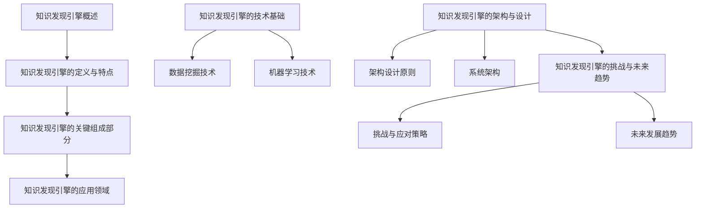

                 

# 知识发现引擎：推动创新引擎的全速运转

> 关键词：知识发现、数据挖掘、机器学习、智能推荐、创新应用

> 摘要：本文将深入探讨知识发现引擎的定义、技术基础、架构设计以及其在推动创新过程中的关键作用。我们将通过实例和代码分析，展示知识发现引擎在实践中的应用，并展望其未来发展。

## 引言

在信息爆炸的时代，数据的数量呈指数级增长，如何从海量数据中提取有用信息，推动创新成为企业和科研机构面临的重大挑战。知识发现引擎（Knowledge Discovery Engine，KDE）作为一种智能系统，能够在数据中自动识别模式，生成知识，从而为决策提供支持。本文将围绕知识发现引擎的各个方面，包括其基础、技术、架构、创新应用以及未来趋势，进行详细探讨。

## 第一部分：引擎基础

### 1.1 知识发现引擎概述

#### 1.1.1 知识发现引擎的定义

知识发现引擎是一种能够从海量数据中提取、分析和解释有用信息的智能系统。它融合了数据挖掘、机器学习、自然语言处理等技术，通过算法和模型，从原始数据中提取出有价值的信息和知识。

#### 1.1.2 知识发现引擎的关键组成部分

知识发现引擎通常包括以下几个关键组成部分：

- **数据预处理**：包括数据清洗、数据整合、数据转换等，目的是为后续分析提供高质量的数据。
- **特征提取**：从原始数据中提取出有助于分析的特征，这些特征将作为输入，用于训练模型。
- **模式识别**：使用算法识别数据中的模式，这些模式可能是潜在的用户需求、市场趋势或者业务规则。
- **知识表示**：将识别出的模式转化为可理解的知识表示，以便于人类或计算机使用。

#### 1.1.3 知识发现引擎的应用领域

知识发现引擎的应用领域非常广泛，涵盖了金融、医疗、零售、物联网等多个行业。在金融行业，知识发现引擎可以用于风险评估、客户细分、欺诈检测等；在医疗行业，可以用于疾病预测、诊断辅助、个性化治疗等；在零售行业，可以用于产品推荐、库存管理、供应链优化等。

### 1.2 知识发现引擎的技术基础

#### 1.2.1 数据挖掘技术

数据挖掘技术是知识发现引擎的核心，它包括以下几个基本流程：

1. **数据理解**：了解数据的结构、内容、质量。
2. **数据准备**：清洗、整合、转换数据。
3. **模型选择**：选择合适的数据挖掘算法。
4. **模型评估**：评估模型的性能和预测能力。

常见的数据挖掘算法包括：

- **分类算法**：如决策树、随机森林、支持向量机等。
- **聚类算法**：如K-means、层次聚类等。
- **关联规则学习**：如Apriori算法、FP-growth算法等。

#### 1.2.2 机器学习技术

机器学习技术是知识发现引擎的重要组成部分，它通过构建模型，对数据进行学习和预测。机器学习的基本概念包括：

- **监督学习**：输入特征和标签，输出模型。
- **无监督学习**：仅输入特征，输出模型。
- **强化学习**：通过反馈调整策略。

常见的机器学习算法包括：

- **线性模型**：如线性回归、逻辑回归等。
- **神经网络**：如深度神经网络、卷积神经网络等。
- **集成方法**：如随机森林、梯度提升树等。

### 1.3 知识发现引擎的架构与设计

知识发现引擎的架构设计需要考虑以下几个方面：

- **模块化**：将系统划分为可独立开发的模块，以提高开发效率和可维护性。
- **分布式**：利用分布式计算，提高系统性能和处理大量数据的能力。
- **可扩展性**：系统应该能够随着数据量和用户量的增长而扩展。

知识发现引擎的典型架构包括以下几个层次：

- **数据层**：数据存储、数据预处理。
- **算法层**：数据挖掘、机器学习算法。
- **应用层**：构建知识发现应用，如智能推荐、预测分析等。

### 1.4 知识发现引擎的挑战与未来趋势

知识发现引擎在处理海量数据、优化算法性能、保护数据隐私等方面面临着诸多挑战。未来，人工智能与知识发现的深度融合、知识图谱与语义分析、边缘计算与实时分析等将成为知识发现引擎发展的主要趋势。

## 第二部分：推动创新引擎

### 2.1 知识发现引擎在创新中的应用

#### 2.1.1 创新过程与知识发现引擎

在创新过程中，知识发现引擎可以通过以下方式发挥作用：

- **需求分析**：通过知识发现引擎分析市场需求，了解用户需求。
- **概念验证**：利用知识发现引擎验证创新概念，预测其可行性。
- **产品设计**：结合用户数据与市场趋势，进行产品设计。

#### 2.1.2 创新案例分析

以某电商平台的智能推荐系统为例，该平台利用知识发现引擎，通过分析用户行为数据，提取出用户的兴趣和偏好，从而实现个性化推荐。具体流程如下：

1. **数据收集**：收集用户的浏览、购买、评价等行为数据。
2. **数据预处理**：清洗、整合、转换数据，提取特征。
3. **特征提取**：使用机器学习算法，从数据中提取出用户的兴趣特征。
4. **模型训练**：训练推荐模型，预测用户对商品的潜在兴趣。
5. **推荐生成**：根据模型预测结果，生成个性化推荐列表。

### 2.2 知识发现引擎在研发管理中的应用

#### 2.2.1 研发过程与知识发现引擎

在研发管理过程中，知识发现引擎可以通过以下方式提升研发效率：

- **需求管理**：通过知识发现引擎进行需求分析，识别潜在需求。
- **项目管理**：利用知识发现引擎优化项目进度，预测项目风险。
- **风险评估**：通过知识发现引擎预测项目风险，提前采取预防措施。

#### 2.2.2 研发管理案例分析

以某科技公司的研发项目管理为例，该公司利用知识发现引擎，通过对项目历史数据进行分析，预测项目的完成时间和潜在风险。具体流程如下：

1. **数据收集**：收集项目进度、任务完成情况等数据。
2. **数据预处理**：清洗、整合、转换数据，提取特征。
3. **特征提取**：使用机器学习算法，从数据中提取出影响项目进度的因素。
4. **模型训练**：训练预测模型，预测项目完成时间和潜在风险。
5. **风险预警**：根据模型预测结果，提前采取预防措施。

### 2.3 知识发现引擎在商业战略中的应用

#### 2.3.1 商业战略与知识发现引擎

在商业战略中，知识发现引擎可以通过以下方式帮助企业做出更明智的决策：

- **市场分析**：利用知识发现引擎分析市场趋势，了解竞争对手。
- **竞争对手分析**：通过知识发现引擎了解竞争对手的策略。
- **产品定位**：结合市场数据与用户分析，进行产品定位。

#### 2.3.2 商业战略案例分析

以某零售企业的产品定位为例，该企业利用知识发现引擎，通过对用户购买行为和市场趋势进行分析，确定了产品的最佳定位。具体流程如下：

1. **数据收集**：收集用户购买数据、市场趋势数据等。
2. **数据预处理**：清洗、整合、转换数据，提取特征。
3. **特征提取**：使用机器学习算法，从数据中提取出影响产品定位的因素。
4. **模型训练**：训练预测模型，预测最佳产品定位。
5. **决策制定**：根据模型预测结果，制定产品定位策略。

### 2.4 知识发现引擎在创新生态系统中的角色

#### 2.4.1 创新生态系统的概念

创新生态系统是由不同角色、不同资源组成的创新网络。它包括企业、科研机构、政府部门、投资者等。创新生态系统通过协同创新、知识流动和资源整合，推动创新活动的发展。

#### 2.4.2 知识发现引擎在生态系统中的作用

知识发现引擎在创新生态系统中扮演着重要角色：

- **协同创新**：促进各成员之间的知识共享与协同，提高创新效率。
- **知识流动**：加速知识的生成、传播和应用，推动创新过程。
- **资源整合**：整合各方资源，提高创新效率和成功率。

#### 2.4.3 创新生态系统案例分析

以某创新园区为例，该园区利用知识发现引擎，通过对入驻企业、科研项目和投资者的数据分析，识别出创新热点和潜在合作机会。具体流程如下：

1. **数据收集**：收集企业、科研项目和投资者的数据。
2. **数据预处理**：清洗、整合、转换数据，提取特征。
3. **特征提取**：使用机器学习算法，从数据中提取出影响创新活动的因素。
4. **模型训练**：训练预测模型，预测创新热点和潜在合作机会。
5. **决策制定**：根据模型预测结果，制定园区发展战略和合作方案。

### 2.5 知识发现引擎的未来发展与挑战

#### 2.5.1 未来发展趋势

知识发现引擎的未来发展趋势包括：

- **人工智能与知识发现的深度融合**：通过引入人工智能技术，提高知识发现引擎的性能和智能化水平。
- **知识图谱与语义分析**：构建知识图谱，实现语义分析和推理，提高知识的可解释性和应用价值。
- **边缘计算与实时分析**：利用边缘计算技术，实现实时数据处理和分析，提高系统的响应速度和实时性。

#### 2.5.2 挑战与应对策略

知识发现引擎在未来发展过程中将面临以下挑战：

- **数据处理能力提升**：如何处理海量、多样、实时数据。
- **算法性能优化**：如何提高算法的效率和准确度。
- **数据隐私保护**：如何在保证数据安全的前提下进行知识发现。

应对策略包括：

- **分布式计算与云计算**：通过分布式计算和云计算技术，提高数据处理能力和算法性能。
- **加密与去标识化**：通过加密和去标识化技术，保护数据隐私。

## 第三部分：实践与案例

### 3.1 实践篇

#### 3.1.1 知识发现引擎开发环境搭建

搭建知识发现引擎开发环境需要考虑以下硬件和软件要求：

- **硬件要求**：服务器、存储设备、网络设备等。
- **软件要求**：操作系统、数据库、编程语言等。

例如，可以选择使用Linux操作系统，Hadoop分布式计算框架，以及Python编程语言。

#### 3.1.2 知识发现引擎开发工具与库

知识发现引擎开发过程中常用的工具与库包括：

- **数据预处理工具**：如Pandas、NumPy等。
- **机器学习框架**：如Scikit-learn、TensorFlow、PyTorch等。
- **知识表示库**：如Neural Network Library、Theano等。

这些工具与库提供了丰富的功能和接口，方便开发者进行数据预处理、模型训练和知识表示。

#### 3.1.3 知识发现引擎开发实战

以下是一个基于电商用户行为的知识发现引擎开发实战案例：

1. **数据收集**：收集电商平台的用户浏览、购买、评价等行为数据。
2. **数据预处理**：清洗、整合、转换数据，提取特征。
3. **特征提取**：使用机器学习算法，如K-means，对用户行为数据进行聚类，提取用户兴趣特征。
4. **模型训练**：使用训练数据训练推荐模型，如基于协同过滤的矩阵分解模型。
5. **推荐生成**：根据模型预测结果，生成个性化推荐列表。

### 3.2 案例篇

#### 3.2.1 案例一：智能推荐系统

**背景**：某电商平台希望通过知识发现引擎实现个性化推荐，提高用户满意度。

**目标**：构建智能推荐系统，根据用户行为预测其兴趣，生成个性化推荐列表。

**实现**：

1. **数据收集**：收集用户的浏览、购买、评价等行为数据。
2. **数据预处理**：清洗、整合、转换数据，提取特征。
3. **特征提取**：使用机器学习算法提取用户兴趣特征，如K-means聚类。
4. **模型训练**：使用训练数据训练推荐模型，如基于协同过滤的矩阵分解模型。
5. **推荐生成**：根据模型预测结果，生成个性化推荐列表。

#### 3.2.2 案例二：金融风险评估

**背景**：某金融机构希望通过知识发现引擎进行信用评分和风险预警。

**目标**：通过知识发现引擎预测客户的信用风险，提高风险控制能力。

**实现**：

1. **数据收集**：收集客户的财务状况、信用历史、社会关系等数据。
2. **数据预处理**：清洗、整合、转换数据，提取特征。
3. **特征提取**：使用机器学习算法提取风险特征，如逻辑回归。
4. **模型训练**：使用训练数据训练信用评分模型。
5. **风险预警**：根据模型预测结果，生成风险预警报告。

#### 3.2.3 案例三：智能医疗诊断

**背景**：某医疗机构希望通过知识发现引擎实现智能医疗诊断，提高诊断准确率和效率。

**目标**：构建智能医疗诊断系统，根据患者数据预测疾病类型。

**实现**：

1. **数据收集**：收集患者的病史、检查结果、实验室数据等。
2. **数据预处理**：清洗、整合、转换数据，提取特征。
3. **特征提取**：使用机器学习算法提取疾病特征，如随机森林。
4. **模型训练**：使用训练数据训练诊断模型。
5. **诊断预测**：根据模型预测结果，给出诊断建议。

### 3.3 代码解读与分析

以下是一个简单的基于K-means算法的用户行为聚类案例：

```python
import numpy as np
from sklearn.cluster import KMeans

# 加载数据
data = np.loadtxt('user_behavior_data.csv', delimiter=',')

# 使用K-means算法进行聚类
kmeans = KMeans(n_clusters=3, random_state=0).fit(data)

# 输出聚类结果
print("聚类中心：", kmeans.cluster_centers_)
print("用户所属类别：", kmeans.labels_)

# 代码解读
# 1. 导入相关库
# 2. 加载数据，使用numpy的loadtxt函数读取CSV文件
# 3. 使用KMeans类进行聚类，设置聚类个数和随机种子
# 4. 调用fit方法训练模型，得到聚类中心和用户所属类别

# 代码性能分析
# 时间复杂度：O(n * k^2)
# 空间复杂度：O(n * k)

# 代码优化建议
# 使用随机初始化聚类中心，减少局部最优问题
# 使用增量K-means算法，处理大规模数据集
```

通过代码解读与分析，我们可以更好地理解知识发现引擎的实现细节，为实际应用提供参考。

## 附录

### 附录 A：知识发现引擎开发资源

- **开源工具与库**：
  - 数据预处理：Pandas、NumPy
  - 机器学习框架：Scikit-learn、TensorFlow、PyTorch
  - 知识表示库：Neural Network Library、Theano

- **研究论文与书籍**：
  - 《数据挖掘：实用机器学习技术》
  - 《深度学习》

### 附录 B：知识发现引擎相关技术概述

- **自然语言处理技术**：
  - 词嵌入
  - 序列模型
  - 注意力机制

- **知识图谱技术**：
  - 实体识别
  - 关系抽取
  - 图谱嵌入

- **边缘计算技术**：
  - 实时数据处理
  - 智能终端应用

### 梅鲁德流程图



### 作者信息

作者：AI天才研究院/AI Genius Institute & 禅与计算机程序设计艺术 /Zen And The Art of Computer Programming

## 总结

知识发现引擎作为一种智能系统，在数据挖掘、机器学习、自然语言处理等技术的基础上，实现了从海量数据中提取有用信息的功能。本文从知识发现引擎的概述、技术基础、架构设计、创新应用、实践案例等方面进行了详细探讨，展示了知识发现引擎在推动创新过程中的关键作用。未来，随着人工智能与知识发现的深度融合、知识图谱与语义分析、边缘计算与实时分析等技术的发展，知识发现引擎将在更广泛的领域发挥重要作用。

