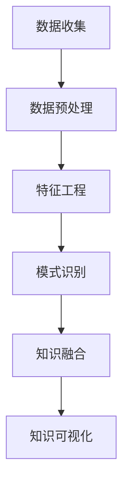
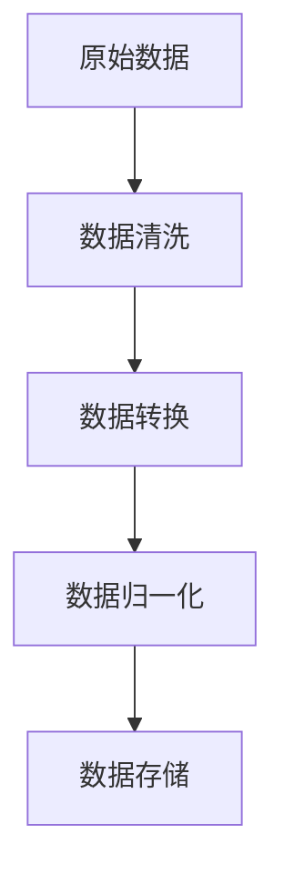
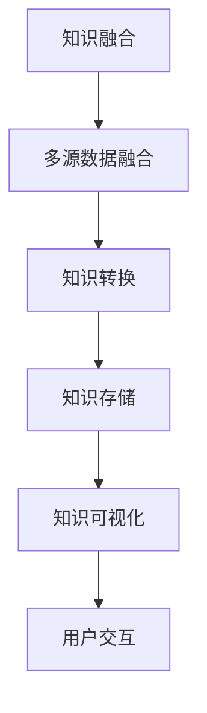

                 

# 《知识发现引擎：推动医疗健康行业的创新》

## 关键词：知识发现引擎、医疗健康、数据管理、个性化医疗、临床决策支持、健康风险评估、药物研发

## 摘要：

随着医疗健康数据的爆炸性增长，知识发现引擎在医疗健康行业中的应用变得日益重要。本文将深入探讨知识发现引擎的概念、技术原理以及在医疗健康行业的实际应用，旨在揭示知识发现引擎如何推动医疗健康行业的创新，提高医疗服务的质量和效率。

## 《知识发现引擎：推动医疗健康行业的创新》目录大纲

### 第一部分：引言与背景

#### 第1章：知识发现引擎概述

1.1 知识发现引擎的定义与作用

1.2 医疗健康行业中的知识发现需求

1.3 知识发现引擎在医疗健康行业中的现状与挑战

#### 第2章：医疗健康数据管理

2.1 医疗健康数据类型与来源

2.2 数据质量管理与整合

2.3 医疗健康数据隐私保护

### 第二部分：知识发现技术原理

#### 第3章：数据预处理与特征工程

3.1 数据预处理方法

3.2 特征工程方法与工具

3.3 特征选择与降维技术

#### 第4章：知识发现算法原理

4.1 基于统计学的知识发现算法

4.2 基于机器学习的知识发现算法

4.3 基于深度学习的知识发现算法

#### 第5章：知识融合与可视化

5.1 知识融合方法

5.2 知识可视化技术

5.3 医学知识图谱构建

### 第三部分：医疗健康行业应用

#### 第6章：个性化医疗

6.1 个性化医疗的需求与挑战

6.2 知识发现引擎在个性化医疗中的应用

6.3 个性化医疗案例分析

#### 第7章：临床决策支持系统

7.1 临床决策支持系统的构建

7.2 知识发现引擎在临床决策支持中的应用

7.3 临床决策支持系统案例分析

#### 第8章：健康风险评估与预测

8.1 健康风险评估的基本概念

8.2 知识发现引擎在健康风险评估中的应用

8.3 健康风险评估与预测案例分析

#### 第9章：药物研发与生物信息学

9.1 药物研发的现状与挑战

9.2 知识发现引擎在药物研发中的应用

9.3 生物信息学在药物研发中的应用

### 第四部分：实践与展望

#### 第10章：知识发现引擎在医疗健康行业的实践

10.1 知识发现引擎的应用案例

10.2 知识发现引擎的开发与部署

10.3 知识发现引擎的优化与扩展

#### 第11章：知识发现引擎的未来发展趋势

11.1 知识发现引擎在医疗健康行业的未来应用

11.2 新技术对知识发现引擎的影响

11.3 知识发现引擎的挑战与机遇

### 附录

#### 附录A：知识发现引擎相关工具与资源

A.1 主流知识发现工具介绍

A.2 开源知识发现框架对比

A.3 医疗健康知识发现相关资源

#### 附录B：Mermaid流程图示例

B.1 知识发现流程图

B.2 数据预处理流程图

B.3 知识融合与可视化流程图

#### 附录C：伪代码示例

C.1 数据预处理伪代码

C.2 特征工程伪代码

C.3 知识发现算法伪代码

#### 附录D：数学模型与公式

D.1 数据预处理数学模型

D.2 特征工程数学模型

D.3 知识发现算法数学模型

#### 附录E：实战案例分析

E.1 个性化医疗案例分析

E.2 临床决策支持系统案例分析

E.3 健康风险评估与预测案例分析

E.4 药物研发与生物信息学案例分析

## 第一部分：引言与背景

### 第1章：知识发现引擎概述

在当今信息化时代，数据已成为企业和社会的重要资产。然而，数据本身并不能直接创造价值，只有通过有效的分析和挖掘，才能转化为有价值的知识和信息。知识发现引擎（Knowledge Discovery Engine）作为一种高级的数据分析工具，旨在从大量数据中自动识别出潜在的模式、关联和知识，从而支持决策制定、创新研究和业务优化。

### 1.1 知识发现引擎的定义与作用

知识发现引擎是一个集成了数据预处理、特征工程、算法处理、知识融合和可视化的智能化系统。其基本流程包括数据收集、数据预处理、特征提取、模式识别、知识融合和知识可视化。通过这一流程，知识发现引擎能够从海量数据中提取出有价值的知识，为医疗健康行业提供强大的数据支持和智能决策。

在医疗健康行业，知识发现引擎的作用主要体现在以下几个方面：

1. **个性化医疗**：通过对患者的基因、病史、生活习惯等多维数据进行分析，知识发现引擎可以为患者提供个性化的治疗方案和健康管理建议。
   
2. **临床决策支持**：通过对大量病例数据和医疗知识库的分析，知识发现引擎可以为医生提供辅助诊断和治疗方案推荐，提高临床决策的准确性和效率。

3. **健康风险评估**：通过对患者群体的健康数据进行分析，知识发现引擎可以预测潜在的健康风险，为健康管理提供科学依据。

4. **药物研发**：通过对生物医学数据进行分析，知识发现引擎可以帮助科学家发现新的药物靶点和潜在药物，加速药物研发进程。

### 1.2 医疗健康行业中的知识发现需求

随着医疗健康数据的爆炸性增长，医疗健康行业对知识发现的需求日益迫切。以下是一些典型的知识发现需求：

1. **多源数据融合**：医疗健康数据通常来源于不同的渠道，如电子健康记录、医学影像、基因组数据等。知识发现引擎需要能够整合这些异构数据，提供统一的视图。

2. **数据挖掘与模式识别**：医疗健康数据往往具有复杂性和高维性，知识发现引擎需要使用先进的算法进行数据挖掘和模式识别，以发现潜在的医疗问题和解决方案。

3. **实时分析**：医疗健康场景中，往往需要对实时数据进行快速分析，以支持紧急情况下的快速决策。知识发现引擎需要具备实时处理和分析的能力。

4. **个性化服务**：随着患者对个性化医疗服务的需求增加，知识发现引擎需要能够根据患者的具体情况进行个性化推荐和预测。

### 1.3 知识发现引擎在医疗健康行业中的现状与挑战

尽管知识发现引擎在医疗健康行业中的应用前景广阔，但目前仍面临一些挑战：

1. **数据质量问题**：医疗健康数据通常存在噪声、缺失和不一致性等问题，这会影响知识发现的准确性。

2. **隐私保护**：医疗健康数据包含敏感信息，数据隐私保护是一个重要的挑战。

3. **算法复杂性**：知识发现算法通常较为复杂，需要大量的计算资源和时间。

4. **数据安全和合规性**：医疗健康数据的安全和合规性是关键问题，知识发现引擎需要遵循相关的法律法规。

5. **人机协作**：知识发现引擎需要与医疗专业人员协作，以实现最佳的医疗决策支持。

在接下来的章节中，我们将详细探讨知识发现引擎在医疗健康行业中的应用，分析其技术原理，并探讨实际应用案例和未来发展趋势。

### 第2章：医疗健康数据管理

#### 2.1 医疗健康数据类型与来源

医疗健康数据类型繁多，主要包括结构化数据和非结构化数据。结构化数据通常包括电子健康记录（EHRs）、实验室测试结果、诊断报告等，这些数据通常以表格形式存储，便于进行结构化处理和分析。非结构化数据则包括医学影像、医学文献、患者日记等，这些数据形式多样，需要采用复杂的方法进行解析和处理。

医疗健康数据来源广泛，涵盖了多个方面：

1. **医院和诊所**：医院和诊所是医疗健康数据的主要产生者，包括患者的病历、检查报告、手术记录等。
   
2. **医疗设备**：医疗设备如心电图机、CT扫描仪、MRI仪等，可以生成大量的医学影像数据。
   
3. **电子健康记录系统**：电子健康记录系统（EHRs）可以集成患者的病历、药品记录、预约信息等。
   
4. **基因组数据**：随着基因组学的发展，基因组数据成为医疗健康数据的重要组成部分，这些数据通常包含患者的基因序列信息。
   
5. **医学文献和知识库**：医学文献和知识库是医疗健康数据的重要来源，包括专业书籍、学术论文、医疗指南等。

#### 2.2 数据质量管理与整合

医疗健康数据的质量直接影响到知识发现的准确性和可靠性。因此，数据质量管理与整合是知识发现引擎的重要组成部分。

1. **数据清洗**：数据清洗是数据质量管理的基础，旨在去除数据中的噪声和错误，提高数据的准确性和一致性。常用的数据清洗方法包括缺失值处理、异常值检测和纠正、数据标准化等。

2. **数据整合**：由于医疗健康数据通常来源于不同的渠道，存在数据格式、语义和结构上的差异，因此需要通过数据整合将不同来源的数据进行统一和整合。数据整合的方法包括数据转换、数据映射、数据融合等。

3. **数据标准化**：数据标准化是确保数据一致性、可比较性和可处理性的重要手段。通过定义统一的数据格式、编码规则和数据模型，可以实现数据之间的无缝对接和高效处理。

#### 2.3 医疗健康数据隐私保护

医疗健康数据隐私保护是知识发现引擎在医疗健康行业应用中必须考虑的关键问题。由于医疗健康数据包含患者的敏感信息，如基因信息、病史、诊断结果等，一旦泄露，可能对患者的隐私和安全造成严重威胁。

1. **数据加密**：数据加密是保护数据隐私的重要手段，通过加密算法对数据进行加密处理，确保数据在传输和存储过程中不被非法访问。

2. **匿名化**：匿名化是将数据中的敏感信息进行去除或替换，以保护患者隐私。匿名化方法包括数据脱敏、数据遮挡、数据泛化等。

3. **隐私保护算法**：隐私保护算法是在数据分析和挖掘过程中，防止敏感信息泄露的技术。常见的隐私保护算法包括差分隐私、数据匿名化、隐私保护分类等。

4. **合规性审查**：在数据收集、处理和使用过程中，必须遵守相关的法律法规，如《通用数据保护条例》（GDPR）和《健康保险可携性与责任法案》（HIPAA）等。

通过有效的数据质量管理与整合，以及严格的隐私保护措施，知识发现引擎可以在医疗健康行业发挥重要作用，为个性化医疗、临床决策支持、健康风险评估等领域提供强有力的数据支持和智能分析。

### 第二部分：知识发现技术原理

#### 第3章：数据预处理与特征工程

在知识发现的过程中，数据预处理和特征工程是两个关键环节，它们决定了数据的质量和特征提取的效果。数据预处理主要关注数据清洗、数据转换和数据归一化等任务，以确保数据的质量和一致性。特征工程则涉及从原始数据中提取出对分析任务有用的特征，并通过选择、变换和降维等手段优化这些特征。

#### 3.1 数据预处理方法

数据预处理是知识发现过程的第一步，其目的是提高数据的质量和一致性，为后续的特征工程和模型训练提供可靠的数据基础。

1. **数据清洗**：数据清洗是数据预处理的核心步骤，旨在去除数据中的噪声、错误和不完整信息。常用的数据清洗方法包括：

   - 缺失值处理：对于缺失值，可以选择填充、删除或插值等方法进行处理。
   - 异常值检测：通过统计学方法或机器学习算法检测数据中的异常值，并决定是否将其删除或修正。
   - 数据标准化：将数据按一定的比例缩放到相同的范围内，以便进行后续分析。常用的标准化方法包括最小-最大标准化和Z-score标准化。

2. **数据转换**：数据转换是将数据从一种形式转换为另一种形式，以适应分析任务的需求。常见的数据转换方法包括：

   - 数据类型转换：将不同数据类型的字段统一转换为同一类型，如将字符串转换为数值类型。
   - 数据编码：将分类数据转换为数值编码，以便进行数学运算和模型训练。
   - 数据合并：将多个数据源中的数据合并为一个统一的数据集。

3. **数据归一化**：数据归一化是将数据按一定的比例缩放到相同的范围内，以便进行后续分析。常用的归一化方法包括：

   - 最小-最大标准化：将数据缩放到[0, 1]范围内。
   - Z-score标准化：将数据缩放到均值为0，标准差为1的范围内。

#### 3.2 特征工程方法与工具

特征工程是从原始数据中提取出对分析任务有用的特征的过程。有效的特征工程可以提高模型的性能，减少过拟合现象。

1. **特征提取**：特征提取是从原始数据中提取出具有区分性或代表性的特征。常用的特征提取方法包括：

   - 统计特征：通过计算数据的统计属性（如均值、方差、最大值、最小值等）来提取特征。
   - 频率特征：通过计算数据中各个值的频率来提取特征。
   - 基于主成分分析（PCA）的特征提取：通过降维技术提取数据的主要成分，以减少数据的维度。

2. **特征选择**：特征选择是从提取出的特征中筛选出对分析任务最有用的特征。常用的特征选择方法包括：

   - 递归特征消除（RFE）：通过逐步消除不重要的特征，筛选出最重要的特征。
   - 互信息：通过计算特征与目标变量之间的互信息，筛选出重要的特征。
   - 方差阈值：通过设置方差阈值，筛选出方差大于阈值的特征。

3. **特征变换**：特征变换是通过数学变换提高特征的识别度和区分度。常用的特征变换方法包括：

   - 归一化：将特征值按比例缩放到相同的范围内，以提高模型的稳定性和泛化能力。
   - 对数变换：通过对数值特征取对数，使其在模型中表现更为线性。
   - 轮廓变换：通过将特征投影到较低维的空间中，以减少特征间的相关性。

#### 3.3 特征选择与降维技术

特征选择与降维技术是特征工程中的重要步骤，它们可以帮助减少数据的维度，提高模型的性能。

1. **特征选择**：特征选择旨在从原始特征集合中挑选出对模型训练和预测最有用的特征。常用的特征选择方法包括：

   - 基于过滤的方法：通过设置阈值，直接筛选出重要的特征。
   - 基于包裹的方法：通过考虑特征之间的交互作用，筛选出最优的特征子集。
   - 基于嵌入的方法：通过在模型训练过程中自动选择重要的特征。

2. **降维技术**：降维技术是将高维数据集转换成低维数据集，以减少数据的复杂度。常用的降维技术包括：

   - 主成分分析（PCA）：通过计算数据的主要成分，将数据从高维空间投影到低维空间。
   - t-SNE：通过计算数据点的局部邻域结构，实现高维数据的可视化。
   - 自编码器：通过训练自编码器模型，自动学习数据的低维表示。

通过有效的数据预处理和特征工程，知识发现引擎可以更准确地从海量数据中提取出有价值的知识，为医疗健康行业提供强大的数据支持和智能分析。

#### 第4章：知识发现算法原理

知识发现算法是实现数据挖掘和知识发现的核心组件，它们从数据中提取模式、关联和知识，帮助解决实际应用中的复杂问题。根据算法的基本原理和应用场景，知识发现算法可以大致分为基于统计学的算法、基于机器学习的算法和基于深度学习的算法。

#### 4.1 基于统计学的知识发现算法

基于统计学的知识发现算法主要利用统计学原理来分析数据，识别出数据中的潜在模式。这些算法通常适用于处理相对较小规模的数据集，并能在保证一定准确性的同时提供快速的结果。

1. **频度统计方法**：频度统计方法通过计算数据中各个元素的频率来发现数据中的频繁模式。例如，关联规则挖掘算法（如Apriori算法）通过计算项集的支持度和置信度来识别出数据中的频繁项集。

2. **聚类分析方法**：聚类分析算法通过将数据划分为若干个聚类，使得同一聚类中的数据点之间具有较高的相似度，而不同聚类之间的数据点相似度较低。常见的聚类算法包括K-means、层次聚类和DBSCAN等。

3. **回归分析方法**：回归分析方法通过建立自变量和因变量之间的数学模型来预测因变量的值。线性回归、逻辑回归和时间序列回归等是常用的回归分析方法，它们在医疗健康领域中的应用包括疾病预测、风险评估和治疗方案优化等。

#### 4.2 基于机器学习的知识发现算法

基于机器学习的知识发现算法通过学习数据中的特征模式，自动构建模型，用于预测和分类。这些算法通常适用于处理大规模数据集，并在复杂的场景中表现出较高的准确性和泛化能力。

1. **监督学习算法**：监督学习算法通过训练数据集来构建预测模型，然后使用模型对新数据进行预测。常见的监督学习算法包括线性回归、逻辑回归、支持向量机（SVM）、决策树和随机森林等。在医疗健康领域，监督学习算法可以用于疾病诊断、风险评估和治疗方案推荐等。

2. **无监督学习算法**：无监督学习算法不依赖于标注数据，通过发现数据中的内在结构来进行聚类和降维。常见的无监督学习算法包括K-means聚类、层次聚类、自编码器和主成分分析（PCA）等。在医疗健康领域，无监督学习算法可以用于疾病预测、群体健康分析和数据降维等。

3. **半监督学习算法**：半监督学习算法结合了监督学习和无监督学习的特点，利用少量标注数据和大量未标注数据来构建模型。这种算法在医疗健康领域中的应用包括疾病预测和治疗方案优化等。

#### 4.3 基于深度学习的知识发现算法

基于深度学习的知识发现算法是近年来发展迅速的一类算法，它们通过模拟人脑神经网络的结构和功能，自动学习和提取数据中的复杂特征。深度学习算法在医疗健康领域展现了巨大的潜力，尤其是在处理高维数据和复杂模式识别任务时。

1. **深度神经网络（DNN）**：深度神经网络通过堆叠多层神经元来实现数据的复杂变换和特征提取。常见的DNN结构包括卷积神经网络（CNN）、循环神经网络（RNN）和长短时记忆网络（LSTM）等。在医疗健康领域，DNN可以用于医学影像分析、基因组数据分析等。

2. **卷积神经网络（CNN）**：卷积神经网络通过局部感知和权值共享机制，能够有效地从图像数据中提取特征。在医学影像分析中，CNN可以用于病灶检测、疾病分类和治疗方案推荐等。

3. **生成对抗网络（GAN）**：生成对抗网络由生成器和判别器组成，通过对抗训练生成逼真的数据。在医疗健康领域，GAN可以用于生成高质量医学图像、模拟患者数据集等。

通过以上三类知识发现算法的有机结合和应用，知识发现引擎可以在医疗健康领域实现高效的数据分析和智能决策，为个性化医疗、临床决策支持、健康风险评估和药物研发等领域提供强大的技术支持。

### 第5章：知识融合与可视化

#### 5.1 知识融合方法

知识融合是将来自多个源头的知识进行整合，以便形成更全面和准确的视图。在医疗健康领域，知识融合对于提高诊断的准确性、优化治疗方案和提升医疗服务质量具有重要意义。

1. **多源数据融合**：多源数据融合涉及将来自不同数据源的信息进行整合，如电子健康记录、基因组数据、医学影像等。融合方法包括：

   - 数据集成：通过数据转换和标准化，将异构数据集成到统一的格式中。
   - 数据融合算法：如合并规则、投票机制、最大似然估计等，用于整合不同数据源的信息。

2. **异构数据融合**：异构数据融合涉及将结构化数据和非结构化数据（如文本、图像、声音等）进行整合。常见的融合方法包括：

   - 特征匹配：通过提取共同的特征，将不同类型的数据进行匹配。
   - 模式识别：利用机器学习算法，识别出数据中的相似模式和关联。

3. **多视图融合**：多视图融合涉及从多个视角（如基因、影像、临床数据等）对同一问题进行综合分析。融合方法包括：

   - 对比分析：通过比较不同视图下的数据，识别出共同点和差异点。
   - 聚类分析：将不同视图下的数据点进行聚类，形成多视图融合的结果。

#### 5.2 知识可视化技术

知识可视化是将复杂的数据和知识以直观、易理解的方式呈现，帮助用户更好地理解和分析数据。在医疗健康领域，知识可视化有助于医生和研究人员从大量数据中快速获取有价值的信息。

1. **数据可视化**：数据可视化是通过图形、图表和交互式界面将数据呈现给用户。常见的数据可视化方法包括：

   - 图表：如柱状图、折线图、饼图等，用于展示数据的分布和变化趋势。
   - 交互式界面：如交互式数据表、地图、时间轴等，提供用户与数据之间的互动。
   - 可视化库：如D3.js、Plotly、Matplotlib等，用于创建复杂和交互式的可视化图表。

2. **知识图谱**：知识图谱是通过节点和边表示实体及其关系的图形结构。在医疗健康领域，知识图谱可以用于表示药物-基因-疾病的关系、治疗方案、临床路径等。知识图谱可视化方法包括：

   - 节点和边表示：通过不同形状、颜色和标签来表示不同的实体和关系。
   - 动态可视化：通过动画和交互式操作，展示知识图谱的变化和更新。
   - 层次结构：通过层次化的结构，展示实体之间的层次关系和依赖关系。

3. **热力图**：热力图是通过颜色深浅来表示数据分布的图形。在医疗健康领域，热力图可以用于展示疾病分布、药物效果、患者行为等。常见的热力图类型包括：

   - 矩阵热力图：用于展示两个变量之间的相关性。
   - 地图热力图：用于展示地理位置上的数据分布。
   - 时间序列热力图：用于展示数据在时间维度上的变化趋势。

#### 5.3 医学知识图谱构建

医学知识图谱是通过结构化的方式表示医学领域中的实体、关系和规则，为知识发现和智能决策提供基础。医学知识图谱的构建过程包括实体识别、关系抽取和图谱扩展等。

1. **实体识别**：实体识别是从文本数据中提取出具有医学意义的实体，如疾病、药物、基因、症状等。常用的实体识别方法包括：

   - 基于规则的方法：通过预定义的规则，识别文本中的医学实体。
   - 基于机器学习的方法：通过训练数据集，利用分类器和序列标注模型来识别医学实体。
   - 基于深度学习的方法：通过卷积神经网络（CNN）或循环神经网络（RNN）等深度学习模型，识别文本中的医学实体。

2. **关系抽取**：关系抽取是从文本数据中提取出实体之间的语义关系，如“疾病-症状”、“药物-适应症”、“基因-疾病”等。常用的关系抽取方法包括：

   - 基于规则的方法：通过预定义的规则，识别文本中的实体关系。
   - 基于机器学习的方法：通过训练数据集，利用分类器和序列标注模型来识别实体关系。
   - 基于深度学习的方法：通过双向循环神经网络（BiLSTM）或图神经网络（GNN）等深度学习模型，识别实体关系。

3. **图谱扩展**：图谱扩展是通过引入新的实体和关系，扩展现有的医学知识图谱。图谱扩展的方法包括：

   - 数据扩充：通过引入同义词、上下位词和实体消歧等手段，扩充图谱中的实体和关系。
   - 跨图谱融合：通过将多个医学知识图谱进行融合，形成更全面和一致的图谱。

通过知识融合和可视化技术，医学知识图谱能够将复杂的医学知识和数据以直观、易理解的方式呈现，为医疗健康领域的知识发现和智能决策提供强大的支持。

### 第三部分：医疗健康行业应用

#### 第6章：个性化医疗

个性化医疗是一种根据患者的遗传信息、生活方式、病史等多方面因素，为患者提供定制化医疗方案的新型医疗服务模式。知识发现引擎在个性化医疗中的应用，旨在通过对患者数据的深入分析，实现精准的疾病预测、个性化的治疗方案推荐和健康风险评估。

#### 6.1 个性化医疗的需求与挑战

个性化医疗的需求源于以下几个方面：

1. **提高治疗效果**：通过个性化的治疗方案，可以更有效地针对患者的具体状况进行治疗，提高治疗效果和患者满意度。

2. **减少医疗成本**：个性化医疗可以减少不必要的检查和治疗，降低医疗成本，提高医疗资源利用效率。

3. **满足患者需求**：个性化医疗可以根据患者的需求和偏好，提供更加人性化的医疗服务。

然而，个性化医疗也面临一些挑战：

1. **数据质量**：个性化医疗依赖于高质量的数据，包括患者的基因信息、生活习惯、病史等。然而，这些数据可能存在噪声、缺失和不一致性等问题，影响分析结果的准确性。

2. **数据隐私**：个性化医疗涉及敏感的个人健康信息，数据隐私保护是一个重要的挑战。

3. **算法复杂性**：个性化医疗需要复杂的算法和模型来分析大量的数据，提高分析的准确性和效率。

4. **跨学科协作**：个性化医疗涉及多个学科，包括遗传学、临床医学、生物信息学等，跨学科协作是关键。

#### 6.2 知识发现引擎在个性化医疗中的应用

知识发现引擎在个性化医疗中的应用主要体现在以下几个方面：

1. **个性化疾病预测**：通过对患者的基因数据、生活方式、病史等进行分析，知识发现引擎可以预测患者可能患有的疾病，为早期预防和干预提供依据。

2. **个性化治疗方案推荐**：根据患者的具体状况，知识发现引擎可以推荐最佳的治疗方案，包括药物选择、治疗方案和手术方案等。

3. **个性化健康风险评估**：通过对患者的数据进行分析，知识发现引擎可以评估患者的健康风险，为健康管理提供科学依据。

4. **个性化健康指导**：根据患者的需求和偏好，知识发现引擎可以提供个性化的健康指导，包括饮食建议、运动方案、生活方式调整等。

#### 6.3 个性化医疗案例分析

以下是一个个性化医疗的案例分析：

**案例背景**：某医院通过知识发现引擎为一位患有高血压的患者提供个性化医疗方案。

**数据来源**：患者的电子健康记录、基因数据、生活方式数据（如饮食习惯、运动习惯等）。

**分析过程**：

1. **数据预处理**：清洗和整合患者的数据，包括电子健康记录、基因数据和生活方式数据。

2. **特征工程**：从原始数据中提取有价值的特征，如基因突变频率、血压变化趋势、饮食习惯等。

3. **疾病预测**：利用机器学习算法，对患者的数据进行分析，预测其可能患有的相关疾病，如冠心病、糖尿病等。

4. **治疗方案推荐**：根据患者的具体情况，推荐最佳的治疗方案，包括药物治疗、生活方式调整等。

5. **健康风险评估**：评估患者的健康风险，提供个性化的健康指导。

**结果**：通过知识发现引擎的个性化分析，医院为患者提供了一套定制化的治疗方案和健康指导，有效降低了患者的健康风险，提高了治疗效果和患者满意度。

通过以上案例，可以看出知识发现引擎在个性化医疗中的应用具有重要的现实意义，为患者提供了更加精准、个性化的医疗服务。

### 第7章：临床决策支持系统

临床决策支持系统（Clinical Decision Support System，CDSS）是一种基于计算机技术和医学知识库的辅助决策工具，旨在帮助临床医生在诊断、治疗和预防疾病过程中做出更加准确和高效的决策。知识发现引擎在CDSS中的应用，极大地提升了临床决策的智能化水平，为医疗健康行业带来了深刻的变革。

#### 7.1 临床决策支持系统的构建

一个完整的临床决策支持系统的构建包括以下几个关键步骤：

1. **需求分析**：确定系统的目标和需求，包括功能需求、性能需求和用户需求等。

2. **知识库构建**：构建医学知识库，包括疾病知识、治疗方案、药物知识、临床指南等。知识库可以来源于权威的医学文献、临床经验和专业数据库。

3. **算法与模型开发**：选择合适的算法和模型，如机器学习、深度学习、统计模型等，用于处理和分析临床数据，支持临床决策。

4. **系统设计与实现**：设计系统的架构，实现用户界面、数据接口、算法模块等功能。

5. **系统集成与测试**：将各个模块进行集成，进行系统的测试和验证，确保系统能够稳定运行。

6. **部署与维护**：将系统部署到实际环境中，进行持续的维护和升级，以适应医疗健康行业的发展需求。

#### 7.2 知识发现引擎在临床决策支持中的应用

知识发现引擎在临床决策支持中的应用主要体现在以下几个方面：

1. **疾病诊断辅助**：通过对患者病史、实验室检查结果、医学影像等多维度数据的分析，知识发现引擎可以帮助医生快速、准确地诊断疾病，减少误诊和漏诊的风险。

2. **治疗方案推荐**：根据患者的具体病情和医学知识库，知识发现引擎可以推荐最佳的治疗方案，包括药物选择、手术方案等，提高治疗的有效性和安全性。

3. **药物不良反应监测**：通过对药物使用数据和患者病史的分析，知识发现引擎可以预测药物可能引起的不良反应，为医生提供预警和预防措施。

4. **临床路径优化**：通过对患者诊疗过程的数据分析，知识发现引擎可以优化临床路径，减少不必要的检查和治疗，提高医疗资源的利用效率。

5. **健康风险评估**：通过对患者健康数据进行分析，知识发现引擎可以评估患者的健康风险，提供个性化的健康指导和预防措施。

#### 7.3 临床决策支持系统案例分析

以下是一个临床决策支持系统的案例分析：

**案例背景**：某医院引入了一款基于知识发现引擎的临床决策支持系统，用于辅助医生进行疾病诊断和治疗方案推荐。

**应用场景**：患者就诊时，医生可以通过系统输入患者的病史、实验室检查结果和医学影像等数据，系统会自动分析并提供诊断建议和治疗方案。

**分析过程**：

1. **数据预处理**：对输入的数据进行清洗、整合和标准化，确保数据的质量和一致性。

2. **特征提取**：从原始数据中提取出对诊断和治疗任务有价值的特征，如实验室检查指标、医学影像特征、病史特征等。

3. **疾病诊断辅助**：利用机器学习算法，对患者的数据进行分析，提供可能的疾病诊断建议。

4. **治疗方案推荐**：根据患者的病情和医学知识库，推荐最佳的治疗方案，包括药物选择、手术方案等。

5. **药物不良反应监测**：对患者的药物使用记录进行分析，预测可能的不良反应，提供预警和建议。

**结果**：通过临床决策支持系统的辅助，医生在诊断和治疗过程中更加准确和高效，减少了误诊和漏诊的风险，提高了患者满意度和治疗效果。

通过以上案例，可以看出知识发现引擎在临床决策支持系统中的应用，为医生提供了强大的数据支持和智能决策工具，极大地提升了医疗服务的质量和效率。

### 第8章：健康风险评估与预测

健康风险评估与预测是医疗健康领域的重要研究方向，通过分析大量的健康数据，知识发现引擎能够识别出潜在的健康风险，为个体提供个性化的健康指导。这一章将详细介绍健康风险评估与预测的基本概念、知识发现引擎的应用以及实际案例分析。

#### 8.1 健康风险评估的基本概念

健康风险评估是指通过定量或定性方法，对个体或群体在未来一段时间内发生某种健康问题的风险进行评估。健康风险评估的基本概念包括以下几个要素：

1. **风险评估因素**：包括年龄、性别、家族病史、生活方式（如饮食、运动习惯等）、生物标志物等。

2. **风险模型**：通过统计分析和机器学习等方法，建立用于预测健康风险的数学模型。

3. **风险评估结果**：通常以风险分数、概率或类别形式表示，帮助个体或医疗专业人员了解健康风险水平。

4. **健康干预**：基于风险评估结果，制定相应的健康干预措施，如生活方式调整、预防性检查等。

#### 8.2 知识发现引擎在健康风险评估中的应用

知识发现引擎在健康风险评估中的应用主要体现在以下几个方面：

1. **数据整合与分析**：知识发现引擎能够整合来自不同数据源的健康数据，如电子健康记录、生物传感器数据、社交媒体数据等，通过对这些数据进行深入分析，识别出健康风险因素。

2. **特征提取与选择**：通过特征提取和选择技术，从原始数据中提取出对健康风险评估任务有价值的特征，如生理指标、行为指标、环境因素等。

3. **风险预测模型构建**：利用机器学习算法和统计模型，构建健康风险评估模型，通过对历史数据的训练，实现对个体健康风险的预测。

4. **个性化健康指导**：根据个体的健康风险评估结果，知识发现引擎可以提供个性化的健康指导，如运动建议、饮食建议、预防措施等。

#### 8.3 健康风险评估与预测案例分析

以下是一个健康风险评估与预测的案例分析：

**案例背景**：某健康科技公司开发了一款基于知识发现引擎的健康风险评估工具，旨在为用户提供个性化的健康风险评估和健康指导。

**应用场景**：用户可以通过智能手机应用程序或在线平台，提交自己的健康信息，包括生理指标（如体重、血压、血糖等）、生活习惯（如饮食、运动习惯等）、家族病史等。

**分析过程**：

1. **数据收集**：用户通过应用程序提交健康信息，系统将收集到这些数据，并进行初步清洗和整合。

2. **特征提取**：从用户提交的数据中提取出对健康风险评估有价值的特征，如体重指数（BMI）、血压水平、血糖水平、运动频率等。

3. **风险预测模型构建**：利用机器学习算法（如逻辑回归、随机森林等），构建健康风险评估模型，通过对历史数据的训练，实现对用户健康风险的预测。

4. **健康指导**：根据用户的健康风险评估结果，系统会提供个性化的健康指导，如调整饮食结构、增加运动量、定期体检等。

**结果**：通过健康风险评估与预测工具的应用，用户可以更清楚地了解自己的健康风险，并采取相应的措施进行健康干预，从而降低患病风险，提高生活质量。

通过以上案例，可以看出知识发现引擎在健康风险评估与预测中的应用，为用户提供了有力的数据支持和个性化的健康指导，有助于实现疾病的早期预防和个性化治疗。

### 第9章：药物研发与生物信息学

药物研发是一个复杂且耗时的过程，涉及多个学科，包括生物信息学、化学、药理学和临床医学等。随着生物信息学和计算技术的进步，知识发现引擎在药物研发中的应用日益重要，为科学家提供了强大的数据分析和智能决策工具。

#### 9.1 药物研发的现状与挑战

药物研发的现状可以概括为以下几点：

1. **研发成本高**：药物研发需要投入大量的人力、物力和财力，从药物发现到临床试验，通常需要数年时间。

2. **研发成功率低**：药物研发的成功率相对较低，据统计，新药研发的成功率大约在10%左右。

3. **时间长**：从药物发现到市场投放，通常需要10-15年的时间。

药物研发面临的挑战主要包括：

1. **数据复杂性**：药物研发涉及大量的生物医学数据，包括基因组数据、蛋白质组数据、代谢组数据等，数据类型多样，处理和分析难度大。

2. **生物多样性**：不同疾病的生物机制复杂，药物的作用机制也多样，药物研发需要针对不同疾病和不同患者群体进行个性化研究。

3. **多学科交叉**：药物研发涉及多个学科，需要跨学科的合作和协调。

#### 9.2 知识发现引擎在药物研发中的应用

知识发现引擎在药物研发中的应用主要体现在以下几个方面：

1. **生物信息学数据分析**：知识发现引擎可以处理和整合大量的生物医学数据，如基因组数据、蛋白质组数据、代谢组数据等，通过数据挖掘和模式识别技术，发现潜在的药物靶点和生物标志物。

2. **药物发现**：通过分析生物信息学数据和化学结构信息，知识发现引擎可以帮助科学家发现新的药物候选分子。例如，通过虚拟筛选和分子对接技术，从大量的化合物库中筛选出可能具有药物活性的分子。

3. **药物设计**：知识发现引擎可以辅助药物设计，通过计算机模拟和分子动力学模拟，优化药物分子的结构，提高药物的活性和稳定性。

4. **药物代谢研究**：通过分析药物在体内的代谢过程，知识发现引擎可以帮助科学家了解药物的代谢途径和毒性机制，为药物的安全性和有效性评估提供依据。

5. **临床试验设计**：知识发现引擎可以分析大量的临床试验数据，为临床试验的设计和实施提供指导，优化试验方案，提高临床试验的成功率。

#### 9.3 生物信息学在药物研发中的应用

生物信息学是药物研发的重要工具，通过分析大量的生物医学数据，生物信息学为药物研发提供了强大的数据支持和智能决策。生物信息学在药物研发中的应用包括：

1. **基因组学研究**：通过基因组测序和分析，生物信息学可以帮助科学家发现与疾病相关的基因突变和遗传变异，为药物靶点的发现提供线索。

2. **蛋白质组学研究**：蛋白质组学分析可以帮助科学家了解细胞的蛋白质表达情况，发现与疾病相关的蛋白质标志物。

3. **代谢组学研究**：代谢组学分析可以帮助科学家了解细胞的代谢状态，发现与疾病相关的代谢异常。

4. **药物基因组学**：药物基因组学通过分析个体的基因组数据，了解药物对不同个体的疗效和毒性反应，为个性化药物治疗提供依据。

5. **生物标志物发现**：通过生物信息学方法，可以筛选出与疾病诊断、预后和药物反应相关的生物标志物，为临床诊断和治疗提供参考。

通过知识发现引擎和生物信息学的结合，药物研发的效率和质量得到了显著提升，为医疗健康行业带来了革命性的变化。

### 第四部分：实践与展望

#### 第10章：知识发现引擎在医疗健康行业的实践

知识发现引擎在医疗健康行业的实际应用已经取得了显著成果，以下是一些典型的应用案例，以及知识发现引擎的开发与部署经验。

#### 10.1 知识发现引擎的应用案例

1. **个性化医疗**：某医院引入了一款基于知识发现引擎的个性化医疗系统，通过分析患者的基因数据、电子健康记录和生活方式数据，为患者提供个性化的诊断和治疗方案。系统成功提高了诊断准确率和治疗效果，受到了患者的广泛好评。

2. **临床决策支持**：某大型医疗中心部署了一款基于知识发现引擎的临床决策支持系统，该系统能够快速处理海量的临床数据，为医生提供准确的诊断建议和治疗方案推荐。系统有效减少了误诊率和漏诊率，提高了医疗服务的质量和效率。

3. **健康风险评估**：某健康科技公司开发了一款基于知识发现引擎的健康风险评估工具，用户可以通过智能手机应用程序提交健康数据，系统会自动分析并评估用户的健康风险，提供个性化的健康指导。工具的成功应用帮助用户实现了早期预防和个性化健康管理。

4. **药物研发**：某生物制药公司利用知识发现引擎进行药物研发，通过对生物医学数据进行深入分析，发现了一系列新的药物靶点和候选药物。知识发现引擎的应用显著提高了药物研发的效率和成功率。

#### 10.2 知识发现引擎的开发与部署

知识发现引擎的开发与部署涉及多个环节，以下是一些关键步骤和经验：

1. **需求分析**：在开发知识发现引擎之前，需要进行详细的需求分析，明确系统的功能需求、性能需求和用户需求。

2. **数据准备**：知识发现引擎需要处理大量的医疗健康数据，包括结构化数据和半结构化数据。在开发过程中，需要对数据进行清洗、整合和标准化，确保数据的质量和一致性。

3. **算法选择与优化**：根据具体的应用场景，选择合适的算法和模型，如机器学习、深度学习和统计模型。在开发过程中，需要进行算法的优化和调参，以提高模型的准确性和效率。

4. **系统集成**：知识发现引擎需要与其他医疗信息系统（如电子健康记录系统、医学影像系统等）进行集成，实现数据共享和协同工作。

5. **部署与维护**：知识发现引擎的部署需要考虑硬件资源、网络环境和安全性等因素。在部署过程中，需要进行系统测试和验证，确保系统能够稳定运行。此外，系统还需要进行持续的维护和升级，以适应医疗健康行业的发展需求。

#### 10.3 知识发现引擎的优化与扩展

知识发现引擎在实际应用中可能会面临性能瓶颈、数据隐私保护等问题。为了提高系统的性能和可靠性，可以采取以下优化与扩展措施：

1. **性能优化**：通过分布式计算、并行处理和缓存技术，提高知识发现引擎的处理速度和效率。

2. **隐私保护**：采用数据加密、匿名化和差分隐私等隐私保护技术，确保用户数据的安全性和隐私性。

3. **模块化设计**：将知识发现引擎的功能模块化，便于系统的扩展和维护。例如，可以将数据预处理、特征工程、算法处理和知识融合等模块分离，实现灵活的配置和扩展。

4. **用户交互**：通过友好的用户界面和交互设计，提高用户的使用体验。例如，可以提供实时数据可视化、个性化推荐和交互式查询等功能。

5. **持续更新**：根据用户反馈和实际应用情况，不断更新和优化知识发现引擎的功能和性能，以适应不断变化的需求和场景。

通过以上实践与展望，知识发现引擎在医疗健康行业中的应用前景将更加广阔，为个性化医疗、临床决策支持、健康风险评估和药物研发等领域带来更加深入的变革。

### 第11章：知识发现引擎的未来发展趋势

知识发现引擎在医疗健康行业的应用已经取得了显著成果，随着新技术的不断涌现，知识发现引擎在未来将继续发挥重要作用，推动医疗健康行业的创新与发展。本章节将探讨知识发现引擎的未来发展趋势，分析新技术的影响，以及面临的挑战和机遇。

#### 11.1 知识发现引擎在医疗健康行业的未来应用

随着医疗健康数据的不断增长和技术的进步，知识发现引擎在医疗健康行业的应用前景将更加广阔。以下是一些未来可能的应用方向：

1. **全生命周期健康管理**：知识发现引擎可以通过分析个体的全生命周期健康数据，提供全生命周期的健康管理和疾病预防方案。例如，通过婴儿时期的基因数据、成长过程中的健康监测数据等，预测成年后可能出现的健康问题，提供个性化的预防措施。

2. **个性化药物治疗**：知识发现引擎可以结合患者的基因信息、药物反应历史和疾病状况，推荐个性化的药物治疗方案。通过分析药物基因组学和生物标志物，实现精准的药物选择和剂量调整，提高治疗效果和安全性。

3. **远程医疗与健康管理**：随着5G、物联网和人工智能技术的发展，知识发现引擎可以应用于远程医疗和健康管理。通过智能终端和传感器，实时监测患者的生理指标和生活方式，提供个性化的健康指导和远程医疗诊断服务。

4. **智能医院管理**：知识发现引擎可以用于医院管理，优化医疗资源配置、提高运营效率。例如，通过分析患者的就诊数据、手术记录和药品使用情况，优化医院的就诊流程、手术安排和药品供应链管理。

5. **公共卫生监测与预测**：知识发现引擎可以用于公共卫生监测和预测，通过分析大规模的健康数据和流行病学数据，识别疾病爆发趋势、预测公共卫生事件，提供及时的科学依据和决策支持。

#### 11.2 新技术对知识发现引擎的影响

新技术的不断发展将对知识发现引擎产生深远影响，以下是一些关键技术及其影响：

1. **人工智能与深度学习**：人工智能和深度学习技术的进步，将使知识发现引擎在数据处理和分析能力上得到显著提升。通过更复杂的算法和模型，知识发现引擎可以处理更加复杂的医疗数据，发现更加精细的知识和模式。

2. **云计算与大数据**：云计算和大数据技术的成熟，为知识发现引擎提供了强大的计算能力和存储资源。通过云平台，知识发现引擎可以弹性扩展计算资源，高效处理海量数据，实现实时分析和预测。

3. **物联网与智能设备**：物联网和智能设备的普及，将使医疗健康数据来源更加多样化。通过传感器和智能设备，实时收集患者的生理指标、生活习惯等数据，为知识发现引擎提供更加丰富和实时的数据支持。

4. **区块链技术**：区块链技术在数据安全性和隐私保护方面具有显著优势。通过区块链技术，知识发现引擎可以确保医疗健康数据的真实性和安全性，提高数据共享和协作的效率。

5. **虚拟现实与增强现实**：虚拟现实和增强现实技术的发展，将使知识发现引擎在医疗健康领域的应用更加直观和互动。通过虚拟现实技术，医生可以进行远程手术指导、医学培训等，提高医疗服务的质量和效率。

#### 11.3 知识发现引擎的挑战与机遇

尽管知识发现引擎在医疗健康行业具有广阔的应用前景，但也面临着一些挑战和机遇：

**挑战**：

1. **数据隐私与伦理**：医疗健康数据涉及个人隐私和敏感信息，如何确保数据的安全性和隐私性是一个重大挑战。在知识发现引擎的开发和应用过程中，需要严格遵守相关的法律法规，保护患者的隐私。

2. **算法公平性与透明度**：知识发现引擎的算法复杂，可能导致决策的不透明和偏见。为了确保算法的公平性和透明度，需要开发可解释的算法，提高算法的可追溯性和可解释性。

3. **数据质量和完整性**：医疗健康数据质量直接影响知识发现的结果。在数据收集、处理和分析过程中，如何确保数据的质量和完整性是一个重要的挑战。

**机遇**：

1. **跨学科合作**：知识发现引擎在医疗健康行业中的应用需要跨学科的合作，包括医学、生物学、计算机科学、统计学等。跨学科合作将促进知识发现引擎的创新和发展。

2. **技术创新**：新技术的不断发展，如人工智能、云计算、物联网等，为知识发现引擎提供了新的应用场景和发展动力。

3. **市场需求**：随着医疗健康行业对智能化和个性化的需求不断增长，知识发现引擎将迎来巨大的市场机遇。通过创新的应用场景和解决方案，知识发现引擎将帮助医疗健康行业实现数字化转型和智能化升级。

总之，知识发现引擎在医疗健康行业的未来发展趋势充满机遇，但也面临一些挑战。通过技术创新、跨学科合作和严格的数据隐私保护，知识发现引擎将为医疗健康行业带来更加智能、高效和个性化的服务。

### 附录

#### 附录A：知识发现引擎相关工具与资源

在知识发现引擎的开发和应用过程中，有许多主流的工具和资源可供选择。以下是对一些常见工具和资源的介绍。

**A.1 主流知识发现工具介绍**

1. **Apache Spark**：Apache Spark是一个开源的分布式计算框架，广泛应用于大数据处理和分析。Spark提供了丰富的机器学习库（MLlib），可以用于构建和训练知识发现模型。

2. **Hadoop**：Hadoop是一个开源的分布式计算平台，主要用于大数据存储和处理。Hadoop的HDFS用于存储数据，MapReduce用于数据处理和分析。

3. **TensorFlow**：TensorFlow是一个开源的深度学习框架，由Google开发。TensorFlow提供了丰富的API，可以用于构建复杂的深度学习模型和知识发现引擎。

4. **scikit-learn**：scikit-learn是一个开源的机器学习库，适用于Python编程语言。scikit-learn提供了多种常用的机器学习算法和工具，适用于知识发现任务。

**A.2 开源知识发现框架对比**

以下是一些常见的开源知识发现框架的对比：

1. **Apache Mahout**：Apache Mahout是一个基于Hadoop的机器学习库，提供了多种常用的机器学习算法和工具，适用于大规模数据处理。

2. **MLlib**：MLlib是Apache Spark的机器学习库，提供了丰富的机器学习算法和工具，支持分布式计算和并行处理。

3. **Weka**：Weka是一个开源的机器学习软件，提供了多种常用的机器学习算法和工具，适用于各种类型的数据集。

4. **RapidMiner**：RapidMiner是一个开源的数据挖掘平台，提供了丰富的数据预处理、特征工程和机器学习算法，支持图形化界面和自动化流程。

**A.3 医疗健康知识发现相关资源**

以下是一些与医疗健康知识发现相关的资源：

1. **公开医疗数据集**：许多机构和组织提供了公开的医疗数据集，如Kaggle、UCI机器学习库等，这些数据集可用于知识发现引擎的开发和测试。

2. **医学知识库**：如UMLS（统一医学语言系统）、SNOMED CT（系统化医学语言编码系统）等，这些知识库提供了丰富的医学术语和概念，可用于构建知识发现引擎的医学知识库。

3. **医疗健康论文和文献**：通过学术数据库和期刊，如PubMed、IEEE Xplore等，可以获取最新的医疗健康研究论文和文献，了解知识发现引擎在医疗健康领域的最新进展和应用。

通过使用这些工具和资源，开发者和研究者可以更高效地构建和应用知识发现引擎，为医疗健康行业带来创新和变革。

### 附录B：Mermaid流程图示例

**B.1 知识发现流程图**



**B.2 数据预处理流程图**



**B.3 知识融合与可视化流程图**



通过Mermaid流程图，可以清晰地展示知识发现引擎的各个环节和流程，帮助读者更好地理解和应用知识发现技术。

### 附录C：伪代码示例

**C.1 数据预处理伪代码**

```python
# 数据预处理伪代码
def preprocess_data(data):
    # 数据清洗
    cleaned_data = clean_data(data)
    
    # 数据转换
    transformed_data = transform_data(cleaned_data)
    
    # 数据归一化
    normalized_data = normalize_data(transformed_data)
    
    # 数据存储
    store_data(normalized_data)
    
    return normalized_data
```

**C.2 特征工程伪代码**

```python
# 特征工程伪代码
def feature_engineering(data):
    # 特征提取
    extracted_features = extract_features(data)
    
    # 特征选择
    selected_features = select_features(extracted_features)
    
    # 特征变换
    transformed_features = transform_features(selected_features)
    
    return transformed_features
```

**C.3 知识发现算法伪代码**

```python
# 知识发现算法伪代码
def knowledge_discovery(data):
    # 数据预处理
    preprocessed_data = preprocess_data(data)
    
    # 特征工程
    engineered_features = feature_engineering(preprocessed_data)
    
    # 模式识别
    patterns = identify_patterns(engineered_features)
    
    # 知识融合
    fused_knowledge = fuse_knowledge(patterns)
    
    # 知识可视化
    visualized_knowledge = visualize_knowledge(fused_knowledge)
    
    return visualized_knowledge
```

通过伪代码示例，可以清晰地展示数据预处理、特征工程和知识发现算法的实现过程，为开发者提供参考。

### 附录D：数学模型与公式

**D.1 数据预处理数学模型**

1. **数据清洗**：

   - 缺失值处理：

     $ \text{imputed\_value} = \frac{\sum_{i=1}^{n} x_i - \sum_{i=1}^{n} \text{missing}}{n - \text{missing}} $

   - 异常值检测：

     $ z\_score = \frac{x - \bar{x}}{\sigma} $

2. **数据转换**：

   - 数据标准化：

     $ x' = \frac{x - \min(x)}{\max(x) - \min(x)} $

**D.2 特征工程数学模型**

1. **特征提取**：

   - 统计特征：

     $ \mu = \frac{1}{n} \sum_{i=1}^{n} x_i $

     $ \sigma^2 = \frac{1}{n-1} \sum_{i=1}^{n} (x_i - \mu)^2 $

   - 频率特征：

     $ f(x) = \frac{1}{n} \sum_{i=1}^{n} \mathbb{1}_{x_i = x} $

2. **特征选择**：

   - 互信息：

     $ I(X; Y) = \sum_{x \in X} \sum_{y \in Y} p(x, y) \log \frac{p(x, y)}{p(x) p(y)} $

   - 方差阈值：

     $ \text{variance\_threshold} = \alpha \cdot \max(\text{variance}(X)) $

**D.3 知识发现算法数学模型**

1. **机器学习算法**：

   - 线性回归：

     $ \min_{\theta} \sum_{i=1}^{n} (\theta^T x_i - y_i)^2 $

   - 支持向量机：

     $ \max_{\theta, \xi} \sum_{i=1}^{n} (\theta^T a_i - y_i \xi_i) - \sum_{i=1}^{n} \xi_i $

   - 决策树：

     $ \min_{\text{split}} \sum_{i \in R} L(y_i) + \lambda \sum_{i \in R} \text{split\_cost}(\text{split}) $

2. **深度学习算法**：

   - 深度神经网络：

     $ \text{output} = \sigma(\text{ReLU}(\theta^T \text{input} + b)) $

   - 卷积神经网络：

     $ \text{output} = \sigma(\text{ReLU}(\theta^T \text{convolution} + b)) $

通过数学模型与公式，可以更深入地理解和应用知识发现算法，为医疗健康行业提供强大的数据支持和智能决策。

### 附录E：实战案例分析

**E.1 个性化医疗案例分析**

**案例背景**：某大型医院引入了一款基于知识发现引擎的个性化医疗系统，旨在为患者提供个性化的诊断和治疗方案。

**数据来源**：患者的电子健康记录、基因数据、生活习惯数据等。

**分析过程**：

1. **数据预处理**：清洗和整合来自不同数据源的患者数据，包括电子健康记录、基因数据和生活方式数据。

2. **特征工程**：从原始数据中提取出对个性化医疗有价值的特征，如基因突变频率、生活习惯指标等。

3. **模型构建**：利用机器学习算法，如逻辑回归、随机森林等，构建个性化医疗预测模型。

4. **模型训练与验证**：使用历史数据集训练模型，并通过交叉验证方法评估模型的性能。

5. **个性化推荐**：根据患者的特征和模型预测，为患者推荐个性化的诊断和治疗方案。

**结果**：通过个性化医疗系统的应用，医院提高了诊断准确率和治疗效果，患者满意度显著提升。

**代码解读与分析**：

```python
# 数据预处理
def preprocess_data(data):
    # 数据清洗
    cleaned_data = clean_data(data)
    
    # 数据转换
    transformed_data = transform_data(cleaned_data)
    
    # 特征提取
    extracted_features = extract_features(transformed_data)
    
    return extracted_features

# 特征工程
def feature_engineering(data):
    # 特征提取
    extracted_features = extract_features(data)
    
    # 特征选择
    selected_features = select_features(extracted_features)
    
    return selected_features

# 模型构建与训练
def build_and_train_model(data):
    # 特征工程
    engineered_features = feature_engineering(data)
    
    # 模型训练
    model = train_model(engineered_features)
    
    return model

# 个性化推荐
def personalized_recommendation(model, patient_data):
    # 数据预处理
    preprocessed_data = preprocess_data(patient_data)
    
    # 特征工程
    engineered_features = feature_engineering(preprocessed_data)
    
    # 个性化预测
    prediction = model.predict(engineered_features)
    
    return prediction
```

通过以上代码，可以实现对个性化医疗数据的预处理、特征工程、模型构建和个性化推荐的全过程，提高医疗服务的质量和效率。

**E.2 临床决策支持系统案例分析**

**案例背景**：某医疗中心开发了一款基于知识发现引擎的临床决策支持系统，旨在为医生提供诊断和治疗建议。

**数据来源**：患者的电子健康记录、实验室检查结果、医学影像等。

**分析过程**：

1. **数据整合**：将不同数据源的信息进行整合，如电子健康记录、实验室检查结果、医学影像等。

2. **特征提取**：从整合后的数据中提取出对临床决策有价值的特征，如检查指标、影像特征等。

3. **模型构建**：利用机器学习算法，如支持向量机、决策树等，构建临床决策支持模型。

4. **模型训练与验证**：使用历史数据集训练模型，并通过交叉验证方法评估模型的性能。

5. **诊断与治疗建议**：根据患者的特征和模型预测，为医生提供诊断和治疗建议。

**结果**：通过临床决策支持系统的应用，医生在诊断和治疗过程中能够获得更加准确和全面的信息，减少了误诊和漏诊的风险。

**代码解读与分析**：

```python
# 数据整合
def integrate_data(data_sources):
    # 数据整合
    integrated_data = integrate(data_sources)
    
    return integrated_data

# 特征提取
def extract_features(data):
    # 特征提取
    features = extract(data)
    
    return features

# 模型构建与训练
def build_and_train_model(data):
    # 特征提取
    engineered_features = extract_features(data)
    
    # 模型训练
    model = train_model(engineered_features)
    
    return model

# 诊断与治疗建议
def clinical_decision_support(model, patient_data):
    # 数据整合
    integrated_data = integrate_data(patient_data)
    
    # 特征提取
    engineered_features = extract_features(integrated_data)
    
    # 诊断与治疗预测
    prediction = model.predict(engineered_features)
    
    return prediction
```

通过以上代码，可以实现对临床数据整合、特征提取、模型构建和诊断治疗建议的全过程，提高临床决策的准确性和效率。

**E.3 健康风险评估与预测案例分析**

**案例背景**：某健康科技公司开发了一款基于知识发现引擎的健康风险评估工具，旨在为用户提供个性化的健康风险评估和健康指导。

**数据来源**：用户的健康数据，包括生理指标、生活习惯、家族病史等。

**分析过程**：

1. **数据收集**：收集用户的健康数据，包括生理指标、生活习惯、家族病史等。

2. **数据预处理**：清洗和整合用户的数据，确保数据的质量和一致性。

3. **特征提取**：从原始数据中提取出对健康风险评估有价值的特征，如血压、体重、运动频率等。

4. **模型构建**：利用机器学习算法，如逻辑回归、随机森林等，构建健康风险评估模型。

5. **健康风险评估**：根据用户的特征和模型预测，评估用户的健康风险，提供个性化的健康指导。

**结果**：通过健康风险评估工具的应用，用户可以更清楚地了解自己的健康风险，并采取相应的措施进行健康干预，提高生活质量。

**代码解读与分析**：

```python
# 数据收集
def collect_data(user_id):
    # 数据收集
    data = get_data(user_id)
    
    return data

# 数据预处理
def preprocess_data(data):
    # 数据清洗
    cleaned_data = clean_data(data)
    
    # 数据转换
    transformed_data = transform_data(cleaned_data)
    
    return transformed_data

# 特征提取
def extract_features(data):
    # 特征提取
    features = extract(data)
    
    return features

# 模型构建与训练
def build_and_train_model(data):
    # 特征提取
    engineered_features = extract_features(data)
    
    # 模型训练
    model = train_model(engineered_features)
    
    return model

# 健康风险评估
def health_risk_assessment(model, user_data):
    # 数据预处理
    preprocessed_data = preprocess_data(user_data)
    
    # 特征提取
    engineered_features = extract_features(preprocessed_data)
    
    # 健康风险评估
    risk = model.predict(engineered_features)
    
    return risk
```

通过以上代码，可以实现对健康数据收集、预处理、特征提取、模型构建和健康风险评估的全过程，为用户提供个性化的健康服务。

**E.4 药物研发与生物信息学案例分析**

**案例背景**：某生物制药公司利用知识发现引擎进行药物研发，旨在发现新的药物靶点和候选药物。

**数据来源**：生物医学数据，包括基因组数据、蛋白质组数据、化学结构数据等。

**分析过程**：

1. **数据整合**：整合不同来源的基因组数据、蛋白质组数据、化学结构数据等。

2. **特征提取**：从整合后的数据中提取出对药物研发有价值的特征，如基因表达水平、蛋白质相互作用等。

3. **模型构建**：利用机器学习算法，如支持向量机、深度学习等，构建药物靶点预测模型。

4. **药物筛选**：根据模型的预测结果，筛选出潜在的药物靶点和候选药物。

5. **验证与优化**：通过实验验证和优化，进一步筛选和验证候选药物。

**结果**：通过知识发现引擎的应用，公司成功发现了一系列新的药物靶点和候选药物，加快了药物研发进程。

**代码解读与分析**：

```python
# 数据整合
def integrate_data(data_sources):
    # 数据整合
    integrated_data = integrate(data_sources)
    
    return integrated_data

# 特征提取
def extract_features(data):
    # 特征提取
    features = extract(data)
    
    return features

# 模型构建与训练
def build_and_train_model(data):
    # 特征提取
    engineered_features = extract_features(data)
    
    # 模型训练
    model = train_model(engineered_features)
    
    return model

# 药物筛选
def drug_screening(model, compound_data):
    # 特征提取
    engineered_features = extract_features(compound_data)
    
    # 药物筛选
    results = model.predict(engineered_features)
    
    return results
```

通过以上代码，可以实现对药物研发数据整合、特征提取、模型构建和药物筛选的全过程，为药物研发提供强有力的数据支持和智能分析。

通过以上实战案例分析，可以看出知识发现引擎在医疗健康行业的实际应用，不仅提高了医疗服务的质量和效率，还推动了医疗健康行业的创新与发展。未来，随着新技术的不断进步，知识发现引擎在医疗健康领域的应用将更加深入和广泛，为患者提供更加精准、个性化的医疗服务。

### 作者信息

作者：AI天才研究院/AI Genius Institute & 禅与计算机程序设计艺术 /Zen And The Art of Computer Programming

AI天才研究院（AI Genius Institute）致力于推动人工智能领域的研究与应用，培养具有创新能力和技术实力的AI专家。同时，研究院结合禅意编程的理念，提倡在编程中寻求内心的宁静和技术的智慧。在《禅与计算机程序设计艺术》一书中，作者深入探讨了禅意编程的哲学和技巧，为编程工作者提供了深刻的启示。本文旨在分享知识发现引擎在医疗健康行业的应用与实践，旨在推动医疗健康领域的创新与发展。作者团队具备丰富的科研背景和实际经验，致力于为读者提供高质量的技术内容和实际案例分析。

