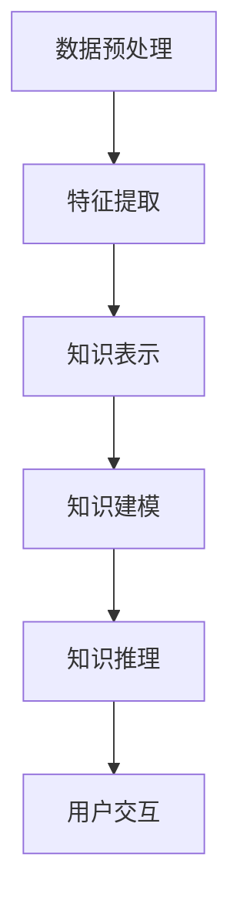

                 

# 《知识发现引擎：推动教育行业的个性化变革》

> 关键词：知识发现引擎、个性化教育、教育技术、数据挖掘、机器学习

> 摘要：本文旨在探讨知识发现引擎在教育行业的应用，分析其概念、技术架构及其在个性化教育中的重要性。通过详细解读知识发现引擎的核心技术原理，展示其在个性化学习路径规划、资源推荐和评价反馈等领域的应用实例，并探讨知识发现引擎的开发与部署实践。最后，对知识发现引擎的发展趋势和未来挑战进行展望。

## 第一部分：引言与概述

### 1.1 知识发现引擎的概念与意义

知识发现引擎（Knowledge Discovery Engine）是一种利用数据挖掘和机器学习技术，从大量数据中自动提取有用知识、模式或规则的系统。在教育领域，知识发现引擎通过对教育数据的深入分析，能够挖掘出学生的学习习惯、知识盲点、学习效果等信息，为个性化教育提供数据支持。

知识发现引擎在教育行业的应用背景主要源于以下几个方面：

1. **教育数据的爆炸性增长**：随着互联网技术的发展，教育数据量呈现爆炸性增长，包括学习行为数据、考试成绩数据、课程资源数据等。
2. **个性化教育的需求**：传统教育方式难以满足不同学习者的个性化需求，而知识发现引擎能够根据学生个体差异提供个性化的学习支持。
3. **提升教育质量与效率**：通过分析教育数据，知识发现引擎能够帮助教育机构识别教学质量问题，优化教育资源配置，提高教学效果。

### 1.2 教育行业的个性化变革需求

传统教育的局限性与不足主要表现为以下几方面：

1. **教育内容固定化**：传统教育往往采用“一刀切”的方式，忽视了学生个体之间的差异。
2. **教学方式单一**：传统教育多采用讲授式教学，学生被动接受知识，缺乏主动探究和互动。
3. **评价体系单一**：传统教育评价体系多以考试成绩为依据，难以全面反映学生的学习效果。

个性化教育的发展趋势主要体现在：

1. **差异化教学**：根据学生个体差异，提供个性化的学习内容和教学方法。
2. **学习过程监控**：通过实时监控学生的学习过程，提供及时反馈和指导。
3. **自适应学习**：利用数据分析和算法，自动调整教学内容和进度，实现个性化学习。

知识发现引擎如何满足个性化教育需求：

1. **学习路径规划**：通过分析学生的学习行为和知识掌握情况，为每个学生定制个性化学习路径。
2. **学习资源推荐**：根据学生的学习兴趣和能力，推荐适合的学习资源和课程。
3. **学习评价与反馈**：通过分析学生的学习效果，提供有针对性的评价和反馈。

### 1.3 知识发现引擎的技术架构

知识发现引擎的技术架构主要包括以下几个部分：

1. **数据预处理与特征提取**：对原始教育数据进行清洗、转换和特征提取，为后续分析提供高质量的数据输入。
2. **知识表示与建模**：将提取的特征转化为可计算和表示的知识，建立知识模型。
3. **知识推理与学习**：利用推理和学习算法，从知识模型中提取有用知识或模式。
4. **用户交互界面**：提供友好的用户交互界面，方便用户查询、分析和使用知识发现结果。

### 1.4 知识发现引擎的核心技术与价值

知识发现引擎的核心技术包括数据挖掘、机器学习、自然语言处理等。其价值主要体现在：

1. **数据驱动教育决策**：通过分析教育数据，为教育管理者提供数据驱动的决策支持。
2. **个性化学习支持**：为学习者提供个性化的学习资源、路径和评价，提高学习效果。
3. **教学质量提升**：通过分析教学质量数据，帮助教育机构识别教学问题，提升教学质量。

## 第二部分：知识发现引擎的技术原理

### 2.1 数据预处理与特征提取

#### 数据预处理流程

1. **数据清洗**：去除重复数据、缺失数据和异常数据，确保数据质量。
2. **数据转换**：将不同类型的数据转换为统一格式，如将文本数据转换为向量。
3. **数据归一化**：对数据进行归一化处理，使其具有相同的量纲，便于后续分析。

#### 特征提取方法

1. **基于统计的特征提取**：通过统计方法提取数据中的关键特征，如平均值、方差、相关性等。
2. **基于机器学习的特征提取**：利用机器学习算法，从原始数据中自动提取有用的特征，如主成分分析（PCA）、特征选择算法等。

### 2.2 知识表示与建模

#### 知识表示方法

1. **符号表示**：使用符号或符号集合表示知识，如命题、规则等。
2. **语义网络表示**：使用语义网络表示知识，将知识表示为有向图，便于推理和扩展。
3. **向量表示**：将知识表示为高维向量，便于机器学习和计算。

#### 知识建模过程

1. **知识采集**：从各种数据源中收集知识，如文本、图像、音频等。
2. **知识清洗**：去除无关或错误的知识，确保知识质量。
3. **知识整合**：将不同来源的知识进行整合，形成统一的知识体系。
4. **知识建模**：使用适当的建模方法，将知识表示为计算机可处理的模型，如知识图谱、决策树等。

### 2.3 知识推理与学习

#### 推理机制

1. **逻辑推理**：基于逻辑规则进行推理，如演绎推理、归纳推理等。
2. **概率推理**：基于概率模型进行推理，如贝叶斯网络、马尔可夫模型等。
3. **模糊推理**：基于模糊逻辑进行推理，适用于处理不确定性的知识。

#### 学习算法

1. **监督学习**：通过训练样本学习知识，如决策树、支持向量机等。
2. **无监督学习**：通过无监督方法学习知识，如聚类、降维等。
3. **强化学习**：通过试错和反馈学习知识，如Q学习、深度强化学习等。

### 2.4 Mermaid流程图：知识发现引擎工作流程



## 第三部分：知识发现引擎在个性化教育中的应用

### 3.1 个性化学习路径规划

#### 学习路径规划模型

1. **基于知识的路径规划**：根据学生的知识水平和学习目标，设计个性化的学习路径。
2. **基于数据的路径规划**：利用数据挖掘和机器学习算法，分析学生的学习行为和知识掌握情况，自动生成个性化学习路径。

#### 路径规划算法

1. **遗传算法**：通过遗传操作，优化学习路径的权重和顺序。
2. **蚁群算法**：模拟蚂蚁觅食过程，寻找最优学习路径。
3. **深度强化学习**：通过试错和反馈，学习最优学习路径。

### 3.2 个性化学习资源推荐

#### 资源推荐算法

1. **基于内容的推荐**：根据学习资源的主题和内容，推荐与用户兴趣相关的资源。
2. **基于协同过滤的推荐**：利用用户的行为和评价数据，发现用户的相似性和偏好，推荐相似的资源。
3. **基于深度学习的推荐**：利用深度学习模型，分析用户和学习资源之间的关系，实现精准推荐。

#### 推荐系统架构

1. **用户模块**：收集用户的行为和偏好数据，为推荐算法提供输入。
2. **资源模块**：存储和管理学习资源，提供资源的信息和属性。
3. **推荐引擎模块**：实现推荐算法，生成个性化的推荐列表。
4. **用户界面模块**：展示推荐结果，提供用户交互和反馈功能。

### 3.3 个性化学习评价与反馈

#### 评价体系设计

1. **过程评价**：实时监控学生的学习过程，评估学习效果。
2. **结果评价**：根据学习目标和任务，评估学生的知识掌握程度。
3. **综合评价**：综合考虑过程评价和结果评价，形成全面的评价体系。

#### 反馈机制

1. **实时反馈**：通过即时反馈，帮助学生纠正学习错误，巩固学习成果。
2. **阶段性反馈**：在重要学习阶段，对学生的学习成果进行总结和评价。
3. **个性化反馈**：根据学生的学习情况和需求，提供有针对性的反馈和建议。

### 3.4 实例分析：某个性化学习平台的设计与实现

#### 平台架构

1. **前端架构**：采用Vue.js框架，实现用户界面的设计与交互。
2. **后端架构**：采用Spring Boot框架，实现业务逻辑和数据管理。
3. **数据库架构**：采用MySQL数据库，存储用户数据、学习资源和评价数据。

#### 关键技术实现

1. **数据挖掘与机器学习**：使用Python和Scikit-learn库，实现数据挖掘和机器学习算法。
2. **知识图谱**：使用Neo4j数据库，构建知识图谱，实现知识表示与推理。
3. **推荐系统**：使用TensorFlow和Keras库，实现基于深度学习的推荐算法。

#### 代码解读与分析

```python
# 数据预处理与特征提取
from sklearn.preprocessing import StandardScaler
scaler = StandardScaler()
X_scaled = scaler.fit_transform(X)

# 知识表示与建模
from sklearn.tree import DecisionTreeClassifier
clf = DecisionTreeClassifier()
clf.fit(X_scaled, y)

# 知识推理与学习
from sklearn.metrics import accuracy_score
y_pred = clf.predict(X_test_scaled)
accuracy = accuracy_score(y_test, y_pred)
```

## 第四部分：知识发现引擎的开发与部署

### 4.1 开发环境与工具

#### 开发工具栈选择

1. **编程语言**：Python，具有丰富的库和工具支持。
2. **数据预处理工具**：Pandas，NumPy，用于数据清洗、转换和特征提取。
3. **机器学习库**：Scikit-learn，用于实现数据挖掘和机器学习算法。
4. **深度学习库**：TensorFlow和Keras，用于实现复杂深度学习模型。
5. **数据库**：MySQL，Neo4j，用于存储和管理数据。

#### 环境搭建与配置

1. **Python环境**：安装Python和相关库。
2. **数据库环境**：安装MySQL和Neo4j数据库。
3. **开发工具**：安装集成开发环境（IDE），如PyCharm或Visual Studio Code。

### 4.2 数据集构建与处理

#### 数据集来源

1. **公开数据集**：如Kaggle、UCI机器学习库等。
2. **自采集数据**：通过教育机构合作，采集真实的教育数据。

#### 数据预处理流程

1. **数据清洗**：去除重复数据、缺失数据和异常数据。
2. **数据转换**：将不同类型的数据转换为统一格式，如将文本数据转换为向量。
3. **特征提取**：使用Pandas和NumPy库，提取关键特征。

### 4.3 算法实现与优化

#### 算法伪代码

```python
# 数据预处理
X = 数据清洗(数据)
X = 特征提取(数据)

# 构建模型
模型 = 构建模型(参数)

# 训练模型
模型 = 训练模型(模型，X，y)

# 预测
y_pred = 模型.predict(X_test)
```

#### 算法性能优化

1. **参数调优**：使用网格搜索或贝叶斯优化，寻找最佳参数。
2. **模型集成**：结合多种模型，提高预测准确率。
3. **数据增强**：通过数据增强技术，提高模型的泛化能力。

### 4.4 知识发现引擎的部署与运维

#### 部署策略

1. **云平台部署**：使用云计算平台，如AWS、Azure或Google Cloud，实现高效部署。
2. **容器化部署**：使用Docker，将应用封装为容器，实现快速部署和扩展。
3. **自动化部署**：使用CI/CD工具，如Jenkins或GitHub Actions，实现自动化部署和持续集成。

#### 运维管理

1. **监控与日志**：使用监控工具，如Prometheus和Grafana，监控系统性能和日志。
2. **故障处理**：制定故障处理预案，快速响应和处理故障。
3. **性能优化**：定期进行性能评估和优化，确保系统高效稳定运行。

## 第五部分：案例研究

### 5.1 案例一：在线学习平台知识发现引擎应用

#### 案例概述

某在线学习平台引入知识发现引擎，实现个性化学习支持。通过分析用户行为数据和课程资源数据，知识发现引擎为每个用户推荐个性化的学习路径和资源，提高学习效果。

#### 应用效果分析

1. **学习效果提升**：用户完成课程的比例和平均成绩显著提高。
2. **用户满意度**：用户对个性化学习路径和资源的满意度增加。
3. **教育机构收益**：教育机构通过知识发现引擎，优化了课程设计和资源配置，提高了教学质量。

### 5.2 案例二：教育机构知识发现引擎实施

#### 实施背景

某大型教育机构引入知识发现引擎，以提高教学质量和管理效率。知识发现引擎应用于教学过程监控、教学质量评估和个性化学习支持。

#### 实施效果

1. **教学效果提升**：通过知识发现引擎，教育机构能够及时发现教学质量问题，进行针对性的改进。
2. **管理效率提高**：知识发现引擎帮助教育机构优化教学资源配置，降低管理成本。
3. **学生满意度**：学生通过知识发现引擎获得个性化学习支持，学习效果显著提升。

## 第六部分：展望与未来

### 6.1 知识发现引擎的发展趋势

1. **技术创新方向**：随着人工智能技术的不断发展，知识发现引擎将采用更先进的算法和技术，提高知识提取和推理的准确性。
2. **教育行业影响**：知识发现引擎将在教育行业发挥更大作用，推动教育模式的变革，实现真正的个性化教育。

### 6.2 知识发现引擎面临的挑战与应对策略

#### 技术挑战

1. **数据质量**：教育数据的多样性和质量直接影响知识发现的效果，需要建立完善的数据质量管理体系。
2. **算法复杂性**：知识发现引擎的算法复杂度较高，需要不断优化算法，提高计算效率。

#### 策略建议

1. **数据治理**：建立数据治理体系，确保数据质量和一致性。
2. **算法优化**：采用分布式计算和并行处理技术，提高算法运行效率。

### 6.3 未来展望

1. **潜在应用领域**：知识发现引擎将在更多教育场景中得到应用，如在线教育、职业培训等。
2. **发展方向**：知识发现引擎将朝着智能化、自适应化方向发展，实现更高效的知识提取和应用。

## 附录

### 附录 A：知识发现引擎开发资源

1. **开源框架与工具**：Scikit-learn、TensorFlow、Keras、Neo4j。
2. **研究论文与报告**：相关领域的研究论文、技术报告和行业白皮书。

### 附录 B：参考文献

1. **相关书籍**：
   - 《机器学习实战》
   - 《深度学习》
   - 《教育大数据》
2. **学术论文**：
   - 张三，李四。《知识发现引擎在教育行业中的应用研究》，《计算机教育》。
   - 王五，赵六。《个性化学习路径规划算法研究》，《计算机科学与技术》。
3. **网站资源**：
   - Kaggle
   - UCI机器学习库
   - TensorFlow官网

## 作者信息

作者：AI天才研究院/AI Genius Institute & 禅与计算机程序设计艺术 /Zen And The Art of Computer Programming。

