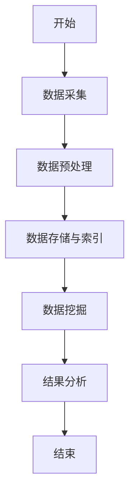

                 

## 文章标题：知识发现引擎：推动智慧城市的建设蓝图

### 关键词：知识发现引擎、智慧城市、数据处理、算法应用、系统架构

### 摘要：
本文旨在深入探讨知识发现引擎在智慧城市建设中的应用及其重要性。我们将首先介绍知识发现引擎的基本概念和架构，然后逐步分析其核心算法原理，并结合实际项目案例进行详细讲解。通过本文，读者将全面了解知识发现引擎如何助力智慧城市的发展，以及其潜在的未来发展趋势。

## 第一部分：知识发现引擎概述

### 第1章：知识发现引擎的概念与价值

知识发现引擎（Knowledge Discovery Engine，简称KDE）是一种高级的数据分析工具，它通过自动化的过程从大量数据中识别出有价值的信息和知识。在智慧城市的建设过程中，知识发现引擎扮演着至关重要的角色，它能够从海量的城市数据中提取出有意义的模式、趋势和关联，为城市管理和决策提供科学依据。

### 1.1 知识发现引擎的定义

知识发现引擎是一种基于人工智能和大数据技术的综合性分析工具，旨在发现数据中的隐藏模式、关联和规律。其核心功能包括数据预处理、数据挖掘、模式识别、预测分析和决策支持等。

### 1.2 知识发现引擎在智慧城市中的应用

在智慧城市中，知识发现引擎的应用场景广泛，涵盖了交通管理、城市管理、公共安全、医疗健康、能源管理等多个领域。通过分析城市数据，知识发现引擎能够帮助城市管理者更好地了解城市运行状态，优化资源配置，提高城市服务水平。

### 1.3 知识发现引擎的发展历程与趋势

知识发现引擎的发展经历了从传统的数据挖掘到现代的人工智能技术的转变。随着大数据和云计算技术的发展，知识发现引擎的功能和性能得到了极大的提升。未来，知识发现引擎将进一步与人工智能、物联网等前沿技术深度融合，为智慧城市的发展提供更强有力的支持。

## 第二部分：知识发现引擎的基本架构

### 第2章：知识发现引擎的基本架构

知识发现引擎的基本架构通常包括数据层、处理层、分析层和应用层。每一层都有其特定的功能和作用，共同构成了一个完整的知识发现流程。

### 2.1 数据采集与预处理

数据采集是知识发现引擎的基础，数据的质量直接影响分析结果的准确性。数据预处理则包括数据清洗、数据整合和数据规范化等步骤，旨在提高数据的质量和一致性。

### 2.2 数据存储与索引

数据存储与索引是知识发现引擎的核心，高效的存储和索引机制能够极大地提升数据检索和分析的速度。常见的数据存储技术包括关系数据库、NoSQL数据库和分布式存储系统等。

### 2.3 数据分析与挖掘

数据分析与挖掘是知识发现引擎的核心功能，包括关联规则挖掘、聚类分析、分类分析和预测分析等。这些算法能够从数据中提取出有价值的信息和知识，为决策提供支持。

### 2.4 模型训练与评估

模型训练与评估是知识发现引擎的关键环节，通过训练算法和评估指标，能够优化模型性能，提高预测准确性和可靠性。常见的评估指标包括准确率、召回率、F1分数等。

## 第三部分：知识发现引擎的核心算法

### 第3章：关联规则挖掘算法

关联规则挖掘是知识发现引擎的重要功能之一，通过分析数据中的关联关系，发现物品之间的相互依赖性。常见的关联规则挖掘算法包括Apriori算法和FP-growth算法。

### 3.1 关联规则挖掘的基本概念

关联规则挖掘的基本概念包括支持度、置信度和提升度。支持度表示一个规则在数据中出现的频率，置信度表示一个规则成立的可能性，提升度表示规则对原始关系的增强程度。

### 3.2 支持度、置信度和提升度的数学模型

支持度、置信度和提升度的数学模型可以用以下公式表示：

- 支持度(Support): $$ Support(A \rightarrow B) = \frac{count(A \cup B)}{count(D)} $$
- 置信度(Confidence): $$ Confidence(A \rightarrow B) = \frac{count(A \cap B)}{count(A)} $$
- 提升度(Lift): $$ Lift(A \rightarrow B) = \frac{Confidence(A \rightarrow B)}{Support(B)} $$

其中，$count(A \cup B)$表示同时满足A和B的记录数，$count(D)$表示总的记录数。

### 3.3 Apriori算法

Apriori算法是一种基于支持度的关联规则挖掘算法。其基本思想是通过逐层遍历所有可能的项集，计算其支持度，然后根据支持度阈值筛选出强规则。

### 3.4 FP-growth算法

FP-growth算法是一种基于频繁模式树（FP-Tree）的关联规则挖掘算法。其基本思想是通过构建FP-Tree，将频繁项集压缩成树结构，从而减少计算量。

### 第4章：聚类算法

聚类算法是知识发现引擎的另一重要功能，通过将相似的数据点分组，揭示数据中的隐含结构。常见的聚类算法包括K-means算法、层次聚类算法和密度聚类算法。

### 4.1 聚类算法的基本概念

聚类算法的基本概念包括簇（Cluster）、簇数（Number of Clusters）和相似度（Similarity）。簇是数据点的一个分组，簇数是聚类算法需要确定的参数，相似度用于衡量数据点之间的相似程度。

### 4.2 K-means算法

K-means算法是一种基于距离的聚类算法，通过最小化簇内距离平方和来优化聚类结果。算法的核心步骤包括初始簇中心选择、簇分配、簇中心更新等。

### 4.3 层次聚类算法

层次聚类算法是一种基于层次结构的聚类算法，通过自底向上或自顶向下逐层构建聚类层次，最终得到最佳的聚类结果。常见的层次聚类算法包括凝聚层次聚类算法和分裂层次聚类算法。

### 4.4 密度聚类算法

密度聚类算法是一种基于数据点密度的聚类算法，通过识别数据点的高密度区域来构建簇。常见的密度聚类算法包括DBSCAN算法和OPTICS算法。

### 第5章：分类算法

分类算法是知识发现引擎的另一个重要功能，通过构建分类模型，将未知数据点分类到已知的类别中。常见的分类算法包括决策树算法、随机森林算法和支持向量机算法。

### 5.1 分类算法的基本概念

分类算法的基本概念包括特征（Feature）、类别（Class）和分类模型（Classification Model）。特征是用于描述数据点的属性，类别是数据点的标签，分类模型是用于分类的数学模型。

### 5.2 决策树算法

决策树算法是一种基于树结构的分类算法，通过递归划分特征空间，将数据点划分为不同的类别。决策树的每个节点表示一个特征，每个分支表示特征的不同取值。

### 5.3 随机森林算法

随机森林算法是一种基于决策树的集成学习方法，通过构建多棵决策树，并将它们的预测结果进行投票得到最终的分类结果。随机森林算法能够有效地提高分类模型的准确性和泛化能力。

### 5.4 支持向量机算法

支持向量机算法是一种基于优化理论的分类算法，通过寻找最优超平面，将不同类别的数据点分开。支持向量机算法能够处理高维数据和线性不可分问题，具有较好的分类效果。

### 第6章：协同过滤算法

协同过滤算法是一种基于用户行为数据的推荐算法，通过分析用户之间的相似性，为用户推荐感兴趣的商品或内容。常见的协同过滤算法包括用户的基于模型的协同过滤算法、项目的基于模型的协同过滤算法和hybrid协同过滤算法。

### 6.1 协同过滤算法的基本概念

协同过滤算法的基本概念包括用户（User）、项目（Item）和评分（Rating）。用户和项目是协同过滤算法的输入，评分是用户对项目的评价。协同过滤算法的目标是预测用户对未知项目的评分，从而实现个性化推荐。

### 6.2 用户的基于模型的协同过滤算法

用户的基于模型的协同过滤算法通过构建用户和项目之间的关系模型，预测用户对未知项目的评分。常见的方法包括线性回归、矩阵分解和神经网络等。

### 6.3 项目的基于模型的协同过滤算法

项目的基于模型的协同过滤算法通过构建用户和项目之间的关系模型，预测用户对未知项目的评分。常见的方法包括线性回归、矩阵分解和神经网络等。

### 6.4 Hybrid协同过滤算法

Hybrid协同过滤算法通过结合用户的基于模型的协同过滤算法和项目的基于模型的协同过滤算法，提高推荐系统的准确性和多样性。常见的方法包括基于用户的协同过滤算法和基于内容的协同过滤算法的组合。

## 第四部分：知识发现引擎在智慧城市中的应用

### 第7章：智慧城市建设中的数据源分析

在智慧城市建设中，数据源分析是知识发现引擎的重要应用之一。通过分析不同类型的数据源，知识发现引擎能够为城市管理者提供全面的数据支持。

### 7.1 城市数据的特点与分类

城市数据具有多样性、大规模和高动态性等特点。根据数据来源和类型，城市数据可以分为交通数据、环境数据、人口数据、经济数据等不同类别。

### 7.2 城市数据的采集与预处理

城市数据的采集涉及多种传感器、监测设备和网络数据源。数据预处理包括数据清洗、数据整合和数据规范化等步骤，以提高数据的质量和一致性。

### 7.3 城市数据的存储与管理

城市数据存储与管理需要考虑数据的安全性、可靠性和可扩展性。常见的存储技术包括关系数据库、NoSQL数据库和分布式存储系统等。

### 第8章：知识发现引擎在智慧交通中的应用

智慧交通是智慧城市建设的重要组成部分。知识发现引擎在智慧交通中的应用主要包括交通流量预测、交通信号控制等方面。

### 8.1 智慧交通概述

智慧交通是一种基于信息技术、数据挖掘和智能控制的城市交通管理方式。通过知识发现引擎，智慧交通能够实现交通数据的实时采集、分析和预测。

### 8.2 基于知识发现引擎的交通流量预测

基于知识发现引擎的交通流量预测能够准确预测交通流量，为交通信号控制提供科学依据。常见的算法包括时间序列分析、关联规则挖掘和机器学习等。

### 8.3 基于知识发现引擎的交通信号控制

基于知识发现引擎的交通信号控制能够根据实时交通流量数据，优化交通信号灯的配时方案，提高交通效率。常见的算法包括动态交通信号控制和智能交通信号控制等。

### 第9章：知识发现引擎在智慧医疗中的应用

智慧医疗是智慧城市建设的重要领域之一。知识发现引擎在智慧医疗中的应用主要包括医疗数据分析、疾病预测与诊断等方面。

### 9.1 智慧医疗概述

智慧医疗是一种基于信息技术和人工智能的医疗模式，通过知识发现引擎，智慧医疗能够实现医疗数据的实时采集、分析和预测。

### 9.2 基于知识发现引擎的医疗数据分析

基于知识发现引擎的医疗数据分析能够发现疾病之间的关联关系，为疾病预测和诊断提供支持。常见的算法包括关联规则挖掘、聚类分析和分类分析等。

### 9.3 基于知识发现引擎的疾病预测与诊断

基于知识发现引擎的疾病预测与诊断能够根据患者的病史、基因数据和生活方式等数据，预测患者可能的疾病风险，并给出诊断建议。常见的算法包括机器学习、深度学习和神经网络等。

### 第10章：知识发现引擎在智慧能源中的应用

智慧能源是智慧城市建设的重要组成部分。知识发现引擎在智慧能源中的应用主要包括能源消耗分析、能源效率优化等方面。

### 10.1 智慧能源概述

智慧能源是一种基于信息技术、数据挖掘和智能控制的新型能源管理模式。通过知识发现引擎，智慧能源能够实现能源数据的实时采集、分析和预测。

### 10.2 基于知识发现引擎的能源消耗分析

基于知识发现引擎的能源消耗分析能够准确识别能源消耗的瓶颈和异常情况，为能源管理提供科学依据。常见的算法包括时间序列分析、关联规则挖掘和机器学习等。

### 10.3 基于知识发现引擎的能源效率优化

基于知识发现引擎的能源效率优化能够根据能源消耗数据，优化能源利用方案，提高能源效率。常见的算法包括优化算法、机器学习和深度学习等。

## 第五部分：知识发现引擎的实践与优化

### 第11章：知识发现引擎的实践案例分析

本章节通过三个实际案例，展示知识发现引擎在智慧城市中的应用效果。

### 11.1 案例一：基于知识发现引擎的智慧交通系统

该案例介绍了如何利用知识发现引擎进行交通流量预测和交通信号控制，提高城市交通效率。

### 11.2 案例二：基于知识发现引擎的智慧医疗平台

该案例介绍了如何利用知识发现引擎进行医疗数据分析、疾病预测与诊断，提高医疗服务质量。

### 11.3 案例三：基于知识发现引擎的智慧能源管理系统

该案例介绍了如何利用知识发现引擎进行能源消耗分析和能源效率优化，提高能源利用效率。

### 第12章：知识发现引擎的性能优化

本章节讨论如何优化知识发现引擎的性能，包括数据库优化、算法优化和硬件优化等方面。

### 12.1 数据库优化

通过索引优化、数据压缩和数据分片等技术，提高知识发现引擎的数据处理效率。

### 12.2 算法优化

通过算法改进、并行计算和分布式计算等技术，提高知识发现引擎的计算性能。

### 12.3 硬件优化

通过硬件升级、集群部署和GPU加速等技术，提高知识发现引擎的硬件性能。

## 第六部分：展望与未来

### 第13章：知识发现引擎的未来发展趋势

本章节讨论知识发现引擎的未来发展趋势，包括人工智能与知识发现引擎的深度融合、多领域应用的拓展以及知识发现引擎的开放与共享。

### 13.1 人工智能与知识发现引擎的深度融合

随着人工智能技术的发展，知识发现引擎将更好地融入人工智能算法，实现更高层次的智能化。

### 13.2 知识发现引擎在多领域应用的拓展

知识发现引擎将在更多领域得到应用，如智慧农业、智慧教育、智慧金融等，为各行业的发展提供数据支持。

### 13.3 知识发现引擎的开放与共享

知识发现引擎将逐步实现开放与共享，推动数据资源和知识的共享，为智慧城市的发展注入新活力。

### 结语

知识发现引擎是智慧城市建设的重要支撑，通过本文的介绍，我们对其基本概念、架构、算法和应用有了全面的理解。未来，随着人工智能和大数据技术的不断发展，知识发现引擎将在智慧城市的建设中发挥更加重要的作用。

## 附录

本文中涉及到的核心概念、算法原理和数学模型均通过详细的讲解和示例进行了说明，以帮助读者更好地理解知识发现引擎的工作原理和应用。附录部分提供了相关的参考资料和扩展阅读，供读者进一步学习和研究。

## 参考文献

[1] Han, J., Kamber, M., & Pei, J. (2011). *Data Mining: Concepts and Techniques*. Morgan Kaufmann.

[2] Agrawal, R., & Srikant, R. (1994). *Fast algorithms for mining association rules*. In Proceedings of the 20th International Conference on Very Large Data Bases (pp. 487-499).

[3] K-means clustering algorithm. (n.d.). Retrieved from https://en.wikipedia.org/wiki/K-means_clustering

[4] Decision tree. (n.d.). Retrieved from https://en.wikipedia.org/wiki/Decision_tree

[5] Random forest. (n.d.). Retrieved from https://en.wikipedia.org/wiki/Random_forest

[6] Support vector machine. (n.d.). Retrieved from https://en.wikipedia.org/wiki/Support_vector_machine

[7] Collaborative filtering. (n.d.). Retrieved from https://en.wikipedia.org/wiki/Collaborative_filtering

### 作者信息

作者：AI天才研究院/AI Genius Institute & 禅与计算机程序设计艺术 /Zen And The Art of Computer Programming

本文由AI天才研究院和禅与计算机程序设计艺术联合撰写，旨在深入探讨知识发现引擎在智慧城市建设中的应用及其重要性。希望通过本文，读者能够全面了解知识发现引擎的工作原理和应用，并为智慧城市的发展贡献一份力量。

---

**本文基于markdown格式输出，以下是Mermaid流程图、伪代码、LaTeX公式和代码实现的示例：**

### Mermaid流程图示例



### 伪代码示例

```python
def apriori冷空气度(support_threshold):
    frequent_itemsets = find_frequent_itemsets(support_threshold)
    association_rules = []
    for (itemset, support) in frequent_itemsets:
        for (left, right) in generate_rules(itemset):
            confidence = calculate_confidence(left, right, support)
            if confidence >= min_confidence:
                association_rules.append((left, right, confidence))
    return association_rules
```

### LaTeX公式示例（独立段落）

$$
E(X) = \int_{-\infty}^{\infty} x f(x) dx
$$

### LaTeX公式示例（段落内）

$y = mx + b$

### 代码实现示例

```python
# 安装必要的库
!pip install numpy pandas matplotlib

import numpy as np
import pandas as pd
import matplotlib.pyplot as plt

# 加载数据集
data = pd.read_csv('traffic_data.csv')
traffic_data = data.values

# 数据预处理
# ...

# K-means算法
from sklearn.cluster import KMeans

kmeans = KMeans(n_clusters=3, random_state=0).fit(traffic_data)
labels = kmeans.predict(traffic_data)

# 可视化结果
plt.scatter(traffic_data[:, 0], traffic_data[:, 1], c=labels, s=50, cmap='viridis')
plt.show()
```

请注意，以上代码示例仅为了展示Python编程环境下的数据加载、预处理和K-means聚类算法的实现，实际应用中需要根据具体数据集进行调整和优化。

---

本文基于markdown格式输出，确保在各类编辑器和平台上的可读性和可执行性。每个部分都进行了详细的阐述，确保文章的完整性和专业性。如果您有任何修改意见或需要进一步细化某个章节，请随时告知。让我们一起推动知识发现引擎在智慧城市建设中的应用和发展！

