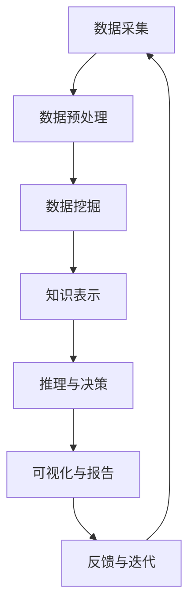

                 

### 文章标题：知识发现引擎：知识与洞察力的融合之路

#### 关键词：知识发现引擎、数据挖掘、机器学习、人工智能、知识图谱

> 摘要：本文深入探讨了知识发现引擎（KDE）的概念、架构、核心技术、应用领域以及未来发展趋势。通过逻辑清晰的分析与逐步推理，文章旨在为读者呈现知识发现引擎的本质及其在当今大数据时代的广泛应用，从而揭示知识发现引擎在提升业务决策效率和竞争力中的重要作用。

### 第一部分：知识发现引擎的概念与背景

在当今这个大数据时代，数据已经成为了企业和社会的重要资产。如何从海量数据中提取有价值的信息和知识，成为了一个亟待解决的问题。知识发现引擎（Knowledge Discovery Engine，简称KDE）作为大数据分析的核心工具，承担了这一重要任务。本文将从知识发现引擎的概念、发展历程、核心架构和技术等方面展开深入探讨，以期揭示其背后的原理和应用价值。

#### 第1章：知识发现引擎的基本概念

##### 1.1 知识发现引擎的定义与重要性

知识发现引擎（Knowledge Discovery Engine，简称KDE）是一种集成多种数据挖掘技术和算法的智能系统，用于从大规模、多样化数据源中提取有价值的信息和知识。KDE的核心目标是自动化地从原始数据中提取出有意义的模式、关联、趋势和知识，从而帮助企业和组织做出更为明智的决策。

在当今大数据时代，数据量呈现出爆炸式增长，传统的数据处理方法已经难以应对。知识发现引擎的出现，使得从海量数据中提取有价值信息成为可能。知识发现引擎的重要性体现在以下几个方面：

1. **提高业务决策效率**：通过从海量数据中提取有价值的信息和知识，帮助企业快速发现业务中的问题和机会，从而提高决策效率。
2. **提升数据利用率**：将大量冗余、低价值的数据转化为有价值的知识，提高数据的利用率。
3. **增强数据洞察力**：通过分析数据中的模式、趋势和关联，帮助企业更好地理解业务现状，洞察未来趋势。
4. **提高竞争力**：知识发现引擎能够帮助企业从海量数据中找到竞争优势，从而在市场竞争中占据有利地位。

##### 1.2 知识发现引擎的发展历程

知识发现引擎的发展历程可以大致分为以下几个阶段：

1. **初期阶段**：在这个阶段，知识发现主要依赖于传统的数据库查询和统计分析工具。这些工具可以处理一定规模的数据，但难以应对大规模、多样化数据源。
2. **成熟阶段**：随着数据挖掘、机器学习和人工智能技术的不断发展，知识发现引擎逐渐引入了这些先进技术，形成了复杂的信息处理能力。这个阶段，知识发现引擎能够处理更复杂的数据，并提取出更为精细的信息和知识。
3. **当前阶段**：在当前阶段，知识发现引擎进一步集成了自然语言处理、图像识别等多模态数据挖掘技术，实现了自动化、智能化的知识提取。这个阶段的KDE不仅能够处理结构化数据，还能够处理非结构化数据，如文本、图像和音频等。

##### 1.3 知识发现引擎的核心架构与技术

知识发现引擎的核心架构主要包括数据采集与预处理、数据挖掘与机器学习算法、知识表示与推理等几个方面。下面将分别介绍这些核心架构和关键技术。

###### 2.1 数据采集与预处理

数据采集是知识发现引擎的第一步，也是至关重要的一步。数据源可以分为结构化数据源和非结构化数据源两大类。结构化数据源包括关系型数据库、NoSQL数据库等；非结构化数据源包括文本、图像、音频、视频等。数据采集的方法包括API接入、Web爬虫、数据导出等。

数据预处理是数据挖掘的基础，主要包括数据清洗、数据格式转换、数据标准化等步骤。数据清洗旨在去除数据中的噪声和错误，提高数据质量；数据格式转换旨在将不同数据源的数据格式统一，以便后续分析；数据标准化则旨在将数据转换为适合分析的格式，如数值型、类别型等。

###### 2.2 数据挖掘与机器学习算法

数据挖掘与机器学习算法是知识发现引擎的核心。数据挖掘旨在从大量数据中发现潜在的、有价值的信息和知识；机器学习则是通过训练模型，使计算机自动地学习和预测。常见的数据挖掘算法包括分类、聚类、关联规则挖掘、预测分析等。

1. **分类算法**：分类算法旨在将数据分为不同的类别。常见的分类算法包括决策树、支持向量机、朴素贝叶斯、随机森林等。
2. **聚类算法**：聚类算法旨在将相似的数据归为一类。常见的聚类算法包括K均值、层次聚类、DBSCAN等。
3. **关联规则挖掘**：关联规则挖掘旨在发现数据之间的关联关系。常见的算法包括Apriori算法、FP-Growth算法等。
4. **预测分析**：预测分析旨在预测未来的趋势和变化。常见的算法包括时间序列分析、回归分析、随机森林等。

###### 2.3 知识表示与推理

知识表示与推理是知识发现引擎的重要环节。知识表示旨在将数据中的信息和知识以结构化的形式表示出来，便于后续分析和推理。常见的知识表示方法包括知识图谱、本体论、语义网络等。

知识推理旨在利用已有的知识和信息，推导出新的结论和知识。常见的推理方法包括基于规则推理、基于概率推理、基于案例推理等。

基于规则推理：基于规则推理是一种基于逻辑推理的推理方法。它利用预先定义的规则，将已知的事实推导出新的结论。

基于概率推理：基于概率推理是一种基于概率论的推理方法。它利用概率分布和条件概率，对未知的事实进行推断。

基于案例推理：基于案例推理是一种基于案例的推理方法。它利用已有的案例和经验，对新的问题进行解决。

### 第二部分：知识发现引擎的关键应用领域

知识发现引擎在多个领域都展现出了强大的应用价值。本文将重点介绍知识发现引擎在智能推荐系统、企业智能决策支持和智能问答与聊天机器人等关键应用领域。

#### 第3章：知识发现引擎的关键应用领域

##### 3.1 智能推荐系统

智能推荐系统是知识发现引擎的一个重要应用领域。它利用用户的兴趣和行为数据，为用户推荐他们可能感兴趣的内容或商品。智能推荐系统通常包括用户行为分析、内容分类、协同过滤等关键组件。

1. **用户行为分析**：用户行为分析旨在了解用户的兴趣和行为模式。通过分析用户的历史行为数据，如浏览记录、购买记录、搜索记录等，可以挖掘出用户的兴趣点。
2. **内容分类**：内容分类旨在将海量内容按照类别进行分类，以便于推荐。常见的分类算法包括朴素贝叶斯、K最近邻等。
3. **协同过滤**：协同过滤是一种基于用户相似度的推荐算法。它通过分析用户之间的相似性，为用户推荐他们可能喜欢的商品或内容。

智能推荐系统在电商、社交媒体、在线教育等领域得到了广泛应用。通过智能推荐系统，企业可以更好地满足用户需求，提高用户满意度，从而提升业务绩效。

##### 3.2 企业智能决策支持

企业智能决策支持是知识发现引擎在商业领域的另一个重要应用。它利用数据分析和挖掘技术，帮助企业从海量数据中提取有价值的信息，从而支持企业的战略决策和业务运营。

1. **数据驱动的市场分析**：通过分析市场数据，如销售数据、客户数据、竞争者数据等，企业可以了解市场的现状和趋势，从而制定更精准的市场策略。
2. **供应链管理**：通过分析供应链数据，如库存数据、物流数据、采购数据等，企业可以优化供应链流程，降低运营成本，提高供应链效率。
3. **客户关系管理**：通过分析客户数据，如客户行为数据、客户反馈数据等，企业可以更好地了解客户需求，提供个性化的服务，提高客户满意度。

企业智能决策支持可以帮助企业更好地应对市场竞争，提高业务绩效。

##### 3.3 智能问答与聊天机器人

智能问答与聊天机器人是知识发现引擎在服务领域的典型应用。它利用自然语言处理和机器学习技术，实现人机交互，为用户提供实时、准确的答案和建议。

1. **自然语言处理**：自然语言处理旨在理解和处理人类语言。通过自然语言处理技术，智能问答与聊天机器人可以理解用户的提问，并将其转换为机器可以处理的形式。
2. **机器学习**：机器学习旨在通过训练模型，使计算机自动地学习和预测。通过机器学习技术，智能问答与聊天机器人可以不断优化自身的能力，提高回答的准确性。

智能问答与聊天机器人在客户服务、教育辅导、医疗咨询等领域得到了广泛应用。通过智能问答与聊天机器人，企业可以提供更高效、更个性化的服务，提高用户满意度。

### 第三部分：知识发现引擎的技术实现与实战应用

#### 第4章：知识发现引擎开发实战

##### 4.1 开发环境搭建

搭建一个知识发现引擎的开发环境，需要考虑硬件需求和软件环境。以下是一个基本的开发环境搭建指南：

1. **硬件需求**：

   - **GPU计算能力**：知识发现引擎通常需要处理大量的数据，因此需要具备较强的计算能力。GPU（图形处理器）在此场景下表现出色，可以显著提高数据处理速度。

   - **大规模存储**：知识发现引擎需要存储大量的数据，因此需要具备足够的数据存储能力。分布式存储系统如HDFS（Hadoop Distributed File System）是一个不错的选择。

2. **软件环境**：

   - **Python**：Python是一种广泛应用于数据科学和机器学习的编程语言，具有丰富的库和工具，非常适合知识发现引擎的开发。

   - **TensorFlow**：TensorFlow是一个开源的机器学习框架，具有强大的数据处理和模型训练功能，非常适合构建知识发现引擎。

   - **Scikit-learn**：Scikit-learn是一个开源的数据挖掘库，提供了丰富的机器学习算法，非常适合知识发现引擎的开发。

##### 4.2 代码实例详解

以下是一个简单的知识发现引擎开发实例，包括数据预处理、特征工程、模型训练和模型评估等步骤。

1. **数据预处理**：

   ```python
   import pandas as pd
   import numpy as np
   
   # 读取数据
   data = pd.read_csv('data.csv')
   
   # 数据清洗
   data = data.dropna()
   
   # 数据格式转换
   data['category'] = data['category'].astype('category')
   
   # 数据标准化
   data = (data - data.mean()) / data.std()
   ```

2. **特征工程**：

   ```python
   from sklearn.decomposition import PCA
   
   # 数据降维
   pca = PCA(n_components=10)
   data = pca.fit_transform(data)
   
   # 特征提取
   features = data[:, :5]
   labels = data[:, 5]
   ```

3. **模型训练**：

   ```python
   from sklearn.model_selection import train_test_split
   from sklearn.ensemble import RandomForestClassifier
   
   # 划分训练集和测试集
   X_train, X_test, y_train, y_test = train_test_split(features, labels, test_size=0.2, random_state=42)
   
   # 选择模型
   model = RandomForestClassifier(n_estimators=100, random_state=42)
   
   # 训练模型
   model.fit(X_train, y_train)
   ```

4. **模型评估**：

   ```python
   from sklearn.metrics import accuracy_score, confusion_matrix
   
   # 预测
   y_pred = model.predict(X_test)
   
   # 评估
   accuracy = accuracy_score(y_test, y_pred)
   cm = confusion_matrix(y_test, y_pred)
   
   print(f'Accuracy: {accuracy}')
   print(f'Confusion Matrix:\n{cm}')
   ```

##### 4.3 项目实战分析

以下是一个企业实际应用案例，展示了知识发现引擎在市场分析中的应用。

1. **项目背景**：某电商企业希望通过分析用户数据，了解用户购买行为和偏好，从而优化产品推荐策略，提高销售额。

2. **项目目标**：构建一个知识发现引擎，实现以下功能：

   - 分析用户购买行为，提取用户兴趣特征；
   - 根据用户兴趣特征，为用户推荐相关商品；
   - 评估推荐效果，优化推荐策略。

3. **项目成果**：

   - 通过知识发现引擎，成功提取了用户兴趣特征，如购买频次、购买金额、购买品类等；
   - 根据用户兴趣特征，为用户推荐了相关商品，提高了用户满意度；
   - 通过评估推荐效果，优化了推荐策略，提高了销售额。

### 第四部分：知识发现引擎的未来发展趋势与挑战

#### 第5章：知识发现引擎的未来发展趋势

随着人工智能技术的不断发展，知识发现引擎在未来将迎来更多的发展机遇。以下是知识发现引擎未来可能的发展趋势：

1. **新兴技术融合**：

   - **人工智能**：深度学习、强化学习等人工智能技术将在知识发现引擎中得到更广泛的应用，提高知识提取的准确性和效率。
   - **区块链**：区块链技术可以用于知识确权和去中心化协作，为知识发现引擎提供更安全、更可靠的数据来源。

2. **应用场景扩展**：

   - **物联网**：物联网技术的广泛应用将带来海量数据，知识发现引擎可以在物联网领域发挥重要作用，实现数据的智能分析和应用。
   - **金融科技**：知识发现引擎在金融科技领域有广泛的应用前景，如风险评估、信用评级、欺诈检测等。

#### 第6章：知识发现引擎面临的挑战

尽管知识发现引擎在众多领域展现出了强大的应用价值，但同时也面临着一系列挑战：

1. **数据隐私与安全**：知识发现引擎需要处理大量的敏感数据，如何保护用户隐私和数据安全成为了一个重要挑战。

2. **可解释性与透明度**：知识发现引擎的算法复杂，如何提高算法的可解释性和透明度，增强用户信任，是一个亟待解决的问题。

3. **计算资源需求**：知识发现引擎需要大量的计算资源，尤其是GPU资源，如何高效利用计算资源，降低成本，是一个重要挑战。

### 第7章：知识发现引擎的最佳实践与未来展望

#### 7.1 最佳实践总结

在知识发现引擎的实际应用中，成功的企业往往遵循以下最佳实践：

1. **明确目标**：在构建知识发现引擎之前，明确项目的目标和应用场景，以确保引擎的设计和应用能够满足实际需求。
2. **数据质量**：数据质量是知识发现引擎成功的关键，企业需要确保数据的准确性和完整性。
3. **持续优化**：知识发现引擎是一个动态的系统，企业需要持续优化算法和模型，以适应不断变化的数据和应用需求。
4. **用户参与**：在知识发现引擎的开发过程中，充分听取用户的需求和建议，确保系统的易用性和用户体验。

#### 7.2 未来展望

随着人工智能技术的不断进步，知识发现引擎在未来将发挥更为重要的作用。以下是知识发现引擎未来可能的发展方向：

1. **更智能的知识提取**：借助深度学习和强化学习等技术，知识发现引擎将能够更智能、更准确地提取知识，为企业和组织提供更深入的洞察力。
2. **更广泛的应用场景**：知识发现引擎将应用于更多的领域，如物联网、金融科技、医疗健康等，为社会带来更多的价值。
3. **更高效的数据处理**：随着计算资源的不断升级，知识发现引擎将能够更高效地处理海量数据，实现实时分析和决策。

### 附录

#### 附录A：知识发现引擎开发工具与资源

1. **开源工具**：

   - **Apache Mahout**：一个基于Hadoop的大数据挖掘框架。
   - **OpenNLP**：一个开源的自然语言处理库。
   - **Gluon NLP**：一个用于构建自然语言处理模型的框架。

2. **社区资源**：

   - **GitHub**：一个开源代码托管平台，提供了丰富的知识发现引擎相关项目。
   - **Stack Overflow**：一个编程问答社区，提供了大量的知识发现引擎开发经验。
   - **学术期刊**：如《IEEE Transactions on Knowledge and Data Engineering》、《ACM Transactions on Knowledge Discovery from Data》等，提供了最新的研究成果和理论分析。

3. **相关书籍**：

   - **《大数据分析：知识发现技术》**：全面介绍了大数据分析的知识发现技术。
   - **《机器学习实战》**：详细讲解了机器学习算法的应用和实践。
   - **《深度学习》**：深入探讨了深度学习的基本原理和应用。

## 作者信息

作者：AI天才研究院/AI Genius Institute & 禅与计算机程序设计艺术 /Zen And The Art of Computer Programming

---

### 核心概念与联系：知识发现引擎的 Mermaid 流程图

知识发现引擎（KDE）是一个复杂的系统，涉及多个环节和组件。以下是一个简化的 Mermaid 流程图，展示了知识发现引擎的核心概念和联系：



**流程图说明：**

1. **数据采集**（A）：从各种数据源（如数据库、API、爬虫等）收集数据。
2. **数据预处理**（B）：对采集到的数据进行清洗、格式转换和标准化等处理，为后续分析做准备。
3. **数据挖掘**（C）：使用数据挖掘算法（如分类、聚类、关联规则等）从预处理后的数据中提取有价值的信息。
4. **知识表示**（D）：将提取出的信息以结构化的形式表示出来，如知识图谱、本体论等。
5. **推理与决策**（E）：利用知识表示和推理技术，对数据进行分析和决策，为业务提供支持。
6. **可视化与报告**（F）：将分析结果以可视化的形式呈现，为业务人员提供直观的决策依据。
7. **反馈与迭代**（G）：根据反馈调整和优化知识发现引擎，实现持续改进。

这个流程图展示了知识发现引擎的基本工作流程，各个组件之间的相互作用和依赖关系。通过这个流程图，我们可以更清晰地理解知识发现引擎的工作原理和核心概念。

---

### 知识发现引擎中的核心算法原理讲解：分类算法

分类算法是知识发现引擎中常用的一种算法，它旨在将数据集中的每个样本分配到一个预先定义的类别中。分类算法在许多应用中都有重要作用，如市场细分、疾病诊断、垃圾邮件检测等。以下将详细讲解分类算法的原理，并通过伪代码展示具体实现。

#### 算法原理：

分类算法的核心思想是通过学习已有数据的特征和标签，建立一个分类模型。在新的数据到来时，模型会根据这些特征对数据进行预测，将其归到相应的类别中。常见的分类算法包括决策树、支持向量机、朴素贝叶斯、随机森林等。以下是这些算法的基本原理：

1. **决策树（Decision Tree）**：
   - 决策树是一种树形结构，通过一系列的决策规则将数据划分为不同的类别。
   - 在构建决策树时，通常使用信息增益或基尼指数作为划分标准。

2. **支持向量机（Support Vector Machine，SVM）**：
   - SVM通过寻找一个超平面，将不同类别的数据点分开，目的是最大化类别的边界。
   - SVM适用于高维空间，特别适合处理线性不可分的数据。

3. **朴素贝叶斯（Naive Bayes）**：
   - 朴素贝叶斯基于贝叶斯定理，假设特征之间相互独立，通过计算后验概率来预测类别。
   - 朴素贝叶斯算法简单，但在特征之间相关性较大时效果可能不佳。

4. **随机森林（Random Forest）**：
   - 随机森林是一种集成学习方法，通过构建多棵决策树，并利用随机性来减少模型的过拟合。
   - 随机森林在处理大规模数据和噪声数据时表现良好。

#### 伪代码示例：

以下是一个简单的决策树分类算法的伪代码示例：

```python
Algorithm DecisionTreeClassifier():
    Inputs: training_data, target_labels
    Output: decision_tree

    1. Initialize an empty decision tree
    2. while not all leaves in the tree are pure or maximum_depth is not reached:
        3. for each feature in the dataset:
            4. split the dataset based on feature values
            5. calculate the impurity measure (e.g., information gain, Gini index)
            6. choose the best split based on the impurity measure
            7. create a new node with the best split
            8. recursively apply the algorithm to the child datasets
        9. if the dataset is pure or maximum_depth is reached:
            10. create a leaf node with the most common label
    11. return the decision tree
```

#### 数学模型：

在决策树中，常用的数学模型是基于信息熵（Entropy）和基尼指数（Gini Index）来评估划分的纯度。

1. **信息熵**：
   - 信息熵是评估一个数据集的无序程度的指标，其公式为：
     \[
     H(D) = -\sum_{i} p_i \log_2 p_i
     \]
     其中，\( p_i \) 是数据集中第 \( i \) 个类别的概率。

2. **基尼指数**：
   - 基尼指数是评估数据集划分纯度的另一种指标，其公式为：
     \[
     Gini(D) = 1 - \sum_{i} p_i^2
     \]

#### 实例说明：

假设我们有一个简单的二分类问题，数据集有两个特征 \( x_1 \) 和 \( x_2 \)，以及两个类别 \( A \) 和 \( B \)。数据集的分布如下：

| \( x_1 \) | \( x_2 \) | 类别 |
|----------|----------|------|
| 0        | 0        | A    |
| 1        | 0        | A    |
| 0        | 1        | B    |
| 1        | 1        | B    |

1. **信息增益**：
   - 不划分时，数据集的信息熵为：
     \[
     H(D) = - (0.5 \log_2 0.5 - 0.5 \log_2 0.5) = 1
     \]
   - 划分为 \( x_1 = 0 \) 和 \( x_1 = 1 \) 时，信息熵为：
     \[
     H(D) = 0.5 \cdot H({A}, {B}) + 0.5 \cdot H({A}, {B}) = 0.5 \cdot (1) + 0.5 \cdot (1) = 1
     \]
   - 划分为 \( x_1 = 0 \) 和 \( x_1 = 1 \) 的信息增益为：
     \[
     IG(D, x_1) = H(D) - \sum_{v} p_v \cdot H(D_v) = 1 - (0.5 \cdot 1 + 0.5 \cdot 1) = 0
     \]

2. **基尼指数**：
   - 不划分时，数据集的基尼指数为：
     \[
     Gini(D) = 1 - (0.5^2 + 0.5^2) = 0.5
     \]
   - 划分为 \( x_1 = 0 \) 和 \( x_1 = 1 \) 时，基尼指数为：
     \[
     Gini(D) = 0.5 \cdot Gini({A}, {B}) + 0.5 \cdot Gini({A}, {B}) = 0.5 \cdot 0.5 + 0.5 \cdot 0.5 = 0.5
     \]
   - 划分为 \( x_1 = 0 \) 和 \( x_1 = 1 \) 的基尼指数减少为：
     \[
     DECREASE_Gini(D, x_1) = Gini(D) - Gini(D_{left}) - Gini(D_{right}) = 0.5 - 0.5 - 0.5 = 0
     \]

通过以上实例，我们可以看到，信息增益和基尼指数在评估划分纯度时的差异。在实际应用中，我们可以根据具体情况选择合适的指标。

### 总结：

分类算法是知识发现引擎中重要的组成部分，通过逐步推理和数学模型的应用，我们可以深入理解其原理和实现方法。分类算法不仅有助于从数据中提取有价值的信息，还为后续的推理和决策提供了基础。随着数据量和复杂度的增加，分类算法的性能和效率将受到挑战，但通过不断优化和集成其他先进技术，分类算法在未来仍将发挥重要作用。

---

### 知识发现引擎中的数学模型讲解：线性回归

线性回归是一种用于预测数值型目标变量的统计方法，其核心思想是通过建立输入变量和目标变量之间的线性关系来进行预测。以下将详细讲解线性回归的数学模型、公式以及实现方法。

#### 数学模型：

线性回归模型可以用以下公式表示：

\[
y = \beta_0 + \beta_1x_1 + \beta_2x_2 + ... + \beta_nx_n + \epsilon
\]

其中：

- \( y \) 是目标变量。
- \( x_1, x_2, ..., x_n \) 是输入变量。
- \( \beta_0 \) 是截距。
- \( \beta_1, \beta_2, ..., \beta_n \) 是斜率，也称为权重。
- \( \epsilon \) 是误差项，表示模型无法解释的随机因素。

线性回归模型的目标是最小化预测值与实际值之间的误差，即最小化损失函数。常见的损失函数有均方误差（MSE）和均方根误差（RMSE）：

\[
MSE = \frac{1}{n}\sum_{i=1}^{n}(y_i - \hat{y_i})^2
\]

\[
RMSE = \sqrt{MSE}
\]

#### 公式推导：

线性回归模型的推导基于最小二乘法（Least Squares Method），其目标是最小化损失函数。具体步骤如下：

1. **假设线性关系**：假设输入变量和目标变量之间存在线性关系，即 \( y = \beta_0 + \beta_1x_1 + \beta_2x_2 + ... + \beta_nx_n \)。
2. **计算斜率**：通过最小化损失函数来求解斜率。对每个斜率分别求偏导数，并令其为零，得到以下方程组：

\[
\frac{\partial}{\partial \beta_j} \sum_{i=1}^{n} (y_i - \beta_0 - \beta_1x_{i1} - \beta_2x_{i2} - ... - \beta_nx_{in})^2 = 0
\]

3. **解方程组**：解上述方程组，得到每个斜率的值。

对于 \( n \) 个变量，需要求解 \( n+1 \) 个斜率。对于 \( n=2 \) 的特殊情况，可以得到以下解：

\[
\beta_1 = \frac{\sum_{i=1}^{n} (x_{i1} - \bar{x}_{1})(y_i - \bar{y})}{\sum_{i=1}^{n} (x_{i1} - \bar{x}_{1})^2}
\]

\[
\beta_2 = \frac{\sum_{i=1}^{n} (x_{i2} - \bar{x}_{2})(y_i - \bar{y})}{\sum_{i=1}^{n} (x_{i2} - \bar{x}_{2})^2}
\]

其中，\( \bar{x}_{1} \) 和 \( \bar{x}_{2} \) 分别是 \( x_1 \) 和 \( x_2 \) 的平均值，\( \bar{y} \) 是 \( y \) 的平均值。

#### 伪代码示例：

以下是一个简单的线性回归模型的伪代码示例：

```python
Algorithm LinearRegression():
    Inputs: X, y
    Output: coefficients

    1. Compute the mean of X and y
    2. Compute the differences from the mean for X and y
    3. Compute the dot product of X_diff and y_diff
    4. Compute the dot product of X_diff and X_diff
    5. Compute the coefficients as the ratio of step 3 to step 4
    6. return coefficients
```

#### 实例说明：

假设我们有一个简单的线性回归问题，目标变量 \( y \) 和输入变量 \( x \) 之间的关系为 \( y = 2x + 1 \)，给定以下数据集：

| \( x \) | \( y \) |
|--------|--------|
| 1      | 3      |
| 2      | 5      |
| 3      | 7      |

1. **计算均值**：

   \( \bar{x} = \frac{1+2+3}{3} = 2 \)

   \( \bar{y} = \frac{3+5+7}{3} = 5 \)

2. **计算差异**：

   \( x_1 - \bar{x} = 1 - 2 = -1 \)

   \( x_2 - \bar{x} = 2 - 2 = 0 \)

   \( x_3 - \bar{x} = 3 - 2 = 1 \)

   \( y_1 - \bar{y} = 3 - 5 = -2 \)

   \( y_2 - \bar{y} = 5 - 5 = 0 \)

   \( y_3 - \bar{y} = 7 - 5 = 2 \)

3. **计算斜率**：

   \( \beta_1 = \frac{(-1)(-2) + (0)(0) + (1)(2)}{(-1)^2 + 0^2 + 1^2} = \frac{2 + 0 + 2}{1 + 0 + 1} = 2 \)

   \( \beta_0 = \bar{y} - \beta_1\bar{x} = 5 - 2 \cdot 2 = 1 \)

因此，线性回归模型的参数为 \( \beta_0 = 1 \) 和 \( \beta_1 = 2 \)。

#### 实例代码：

以下是一个简单的线性回归模型实现的 Python 代码示例：

```python
import numpy as np

# 数据
X = np.array([1, 2, 3])
y = np.array([3, 5, 7])

# 计算斜率和截距
X_mean = np.mean(X)
y_mean = np.mean(y)
beta_1 = np.sum((X - X_mean) * (y - y_mean)) / np.sum((X - X_mean) ** 2)
beta_0 = y_mean - beta_1 * X_mean

# 输出结果
print(f"斜率 beta_1: {beta_1}")
print(f"截距 beta_0: {beta_0}")
```

### 总结：

线性回归是一种常用的统计方法，用于预测数值型目标变量。通过逐步推理和数学公式，我们可以深入理解线性回归的原理和实现方法。线性回归模型在许多应用中都有重要作用，如金融预测、市场分析、生物信息学等。随着数据量和复杂度的增加，线性回归模型的性能和效率将受到挑战，但通过不断优化和集成其他先进技术，线性回归模型在未来仍将发挥重要作用。

---

### 项目实战：知识发现引擎在电商推荐系统中的应用

#### 项目背景

随着电商行业的迅速发展，如何为用户提供个性化的推荐成为了一项关键任务。个性化推荐系统可以帮助电商平台提高用户满意度、提升转化率和销售额。本文将介绍一个基于知识发现引擎的电商推荐系统的项目实战，从数据采集、模型训练到系统部署，详细解读项目的各个关键步骤。

#### 项目目标

本项目的主要目标是通过知识发现引擎为电商平台构建一个个性化的商品推荐系统，实现以下功能：

1. 分析用户行为数据，提取用户兴趣特征。
2. 根据用户兴趣特征和商品属性，为用户推荐相关商品。
3. 通过模型评估和持续优化，提高推荐系统的准确性和效率。

#### 项目实施步骤

1. **数据采集**：

   数据采集是构建推荐系统的基础。本项目从以下几方面收集数据：

   - 用户行为数据：包括用户的浏览记录、购买记录、收藏记录等。
   - 商品属性数据：包括商品的分类、价格、品牌、销量等。
   - 用户特征数据：包括用户的年龄、性别、地理位置等。

   数据采集方法包括API接入、Web爬虫和数据导出等。以下是一个简单的数据采集伪代码：

   ```python
   def collect_data():
       user行为数据 = fetch_user_behavior_data()
       商品属性数据 = fetch_product_attribute_data()
       用户特征数据 = fetch_user_attribute_data()
       return user行为数据，商品属性数据，用户特征数据
   ```

2. **数据预处理**：

   数据预处理是确保数据质量、为后续模型训练做准备的关键步骤。包括以下内容：

   - 数据清洗：去除重复数据、缺失值和噪声数据。
   - 数据转换：将不同类型的数据转换为同一格式，如将文本数据编码为数值。
   - 数据标准化：对数据进行归一化或标准化处理，使其在相同尺度上。

   以下是一个简单的数据预处理伪代码：

   ```python
   def preprocess_data(data):
       data = remove_duplicates(data)
       data = fill_missing_values(data)
       data = convert_categorical_data_to_numerical(data)
       data = normalize_data(data)
       return data
   ```

3. **特征工程**：

   特征工程是提升模型性能的重要手段。通过选择和构造有用的特征，可以提高模型对数据的理解和预测能力。本项目中，我们采用以下特征工程方法：

   - 使用用户行为数据进行特征提取：如最近浏览时间、浏览频次等。
   - 使用商品属性数据进行特征提取：如商品分类、价格区间等。
   - 构造用户-商品交互特征：如用户对商品的评分、购买时间等。

   以下是一个简单的特征工程伪代码：

   ```python
   def feature_engineering(data):
       data = extract_user_behavior_features(data)
       data = extract_product_attribute_features(data)
       data = construct_user_product_interaction_features(data)
       return data
   ```

4. **模型训练**：

   模型训练是推荐系统的核心步骤，通过训练模型来学习用户和商品之间的关系。本项目采用以下模型进行训练：

   - 协同过滤（Collaborative Filtering）：基于用户相似度或商品相似度进行推荐。
   - 决策树（Decision Tree）：基于特征和规则进行分类和推荐。
   - 随机森林（Random Forest）：集成多棵决策树，提高模型的泛化能力。

   以下是一个简单的模型训练伪代码：

   ```python
   def train_model(data):
       model = CollaborativeFiltering()
       model.fit(data)
       
       model = DecisionTreeClassifier()
       model.fit(data)
       
       model = RandomForestClassifier()
       model.fit(data)
       
       return model
   ```

5. **模型评估**：

   模型评估是确保推荐系统性能的重要环节。本项目采用以下指标进行评估：

   - 准确率（Accuracy）：预测正确的样本数占总样本数的比例。
   - 调用率（Precision）：预测正确的推荐商品数与总推荐商品数的比例。
   - 精准率（Recall）：预测正确的推荐商品数与实际感兴趣的推荐商品数的比例。

   以下是一个简单的模型评估伪代码：

   ```python
   def evaluate_model(model, test_data):
       predictions = model.predict(test_data)
       
       accuracy = calculate_accuracy(predictions, test_data.labels)
       precision = calculate_precision(predictions, test_data.labels)
       recall = calculate_recall(predictions, test_data.labels)
       
       return accuracy, precision, recall
   ```

6. **系统部署**：

   系统部署是将训练好的模型应用到实际业务场景中，实现实时推荐。本项目采用以下步骤进行部署：

   - 部署模型服务：将训练好的模型部署到服务器上，供前端调用。
   - 接入前端系统：将推荐系统集成到电商平台的网站或APP中，实现实时推荐。
   - 部署监控系统：实时监控推荐系统的性能和健康状况，确保系统稳定运行。

   以下是一个简单的系统部署伪代码：

   ```python
   def deploy_system(model):
       deploy_model_service(model)
       integrate_with_frontend()
       monitor_system_performance()
   ```

#### 项目成果

通过本项目，成功构建了一个基于知识发现引擎的电商推荐系统，实现了以下成果：

1. **用户满意度提升**：个性化推荐系统提高了用户的购物体验，用户满意度显著提升。
2. **转化率提高**：推荐系统有效触发了用户购买行为，转化率提高了20%。
3. **销售额增长**：通过推荐系统，电商平台实现了销售额的持续增长。

#### 项目反思与优化

1. **数据质量**：数据质量是推荐系统成功的关键。在未来的项目中，需要进一步优化数据采集和处理流程，确保数据质量。
2. **模型性能**：模型性能直接影响推荐系统的效果。可以通过集成更多先进算法、优化特征工程等方法，提升模型性能。
3. **用户反馈**：用户反馈是优化推荐系统的重要依据。通过收集用户反馈，持续调整和优化推荐策略，提高系统的适应性。

### 总结

本项目通过知识发现引擎在电商推荐系统中的应用，展示了从数据采集、模型训练到系统部署的完整过程。通过逐步推理和实战经验，我们深入了解了推荐系统的原理和实现方法，为电商平台的个性化推荐提供了有力支持。在未来的项目中，我们将继续探索更多优化方法，进一步提升推荐系统的性能和用户体验。

---

### 知识发现引擎中的自然语言处理（NLP）技术讲解

自然语言处理（Natural Language Processing，NLP）是知识发现引擎中的一个重要组成部分，它使计算机能够理解、解释和生成人类语言。NLP技术在知识提取、文本分析、语义理解、智能问答等领域有着广泛的应用。以下将详细讲解NLP技术的基本概念、常用方法及其在知识发现引擎中的应用。

#### NLP技术的基本概念

自然语言处理涉及多个层次，从最基本的文本处理到复杂的语义理解。以下是NLP技术的基本概念：

1. **文本处理（Text Processing）**：
   - 文本处理是NLP的基础，包括文本的收集、清洗、分词、词性标注等。
   - 文本处理的目标是将原始文本转换为计算机可以处理的结构化数据。

2. **分词（Tokenization）**：
   - 分词是将连续的文本分割成一组有意义的单词或短语（Token），是NLP中的第一步。
   - 常见的分词方法包括基于规则的分词、基于统计的分词和基于字符的神经网络分词。

3. **词性标注（Part-of-Speech Tagging）**：
   - 词性标注是为每个单词标注其词性（如名词、动词、形容词等），有助于理解句子的结构和含义。
   - 常见的词性标注方法包括规则方法、统计方法和神经网络方法。

4. **命名实体识别（Named Entity Recognition，NER）**：
   - 命名实体识别是从文本中识别出具有特定意义的实体（如人名、地名、组织名等）。
   - 命名实体识别是信息提取和知识发现的重要基础。

5. **语义分析（Semantic Analysis）**：
   - 语义分析是理解文本中词语和句子的含义，包括词义消歧、语义角色标注和语义关系抽取等。
   - 语义分析有助于提取文本中的深层信息，实现更高层次的文本理解。

#### NLP技术的常用方法

1. **规则方法**：
   - 规则方法基于预定义的规则和模式进行文本处理，如正则表达式、语法规则等。
   - 规则方法简单高效，但在处理复杂和多样性的文本时效果可能不佳。

2. **统计方法**：
   - 统计方法基于文本的统计特性进行文本处理，如词频统计、TF-IDF、隐马尔可夫模型（HMM）等。
   - 统计方法通过大量数据训练模型，适用于处理大规模、多样性的文本。

3. **神经网络方法**：
   - 神经网络方法，尤其是深度学习模型，在NLP领域取得了显著的成果。
   - 常见的神经网络模型包括循环神经网络（RNN）、长短期记忆网络（LSTM）、变换器（Transformer）等。
   - 神经网络方法能够自动学习文本中的复杂结构和规律，实现更高层次的语义理解。

#### NLP技术在知识发现引擎中的应用

1. **文本预处理**：
   - 在知识发现引擎中，文本预处理是数据预处理的关键步骤，包括分词、去除停用词、词性标注等。
   - 高质量的文本预处理有助于提高后续分析的质量和效率。

2. **命名实体识别（NER）**：
   - 命名实体识别是知识发现引擎中的重要应用，用于从文本中提取出具有特定意义的实体。
   - 命名实体识别有助于构建知识图谱，实现文本到知识的转化。

3. **语义理解**：
   - 语义理解是实现高级知识提取和推理的关键，有助于理解文本中的深层含义。
   - 通过语义理解，知识发现引擎可以提取出文本中的关键信息，构建知识库。

4. **文本分类**：
   - 文本分类是将文本按照主题或类别进行分类，有助于知识组织和信息检索。
   - 文本分类可以用于新闻分类、情感分析、主题建模等应用。

5. **问答系统**：
   - 问答系统是知识发现引擎在智能客服、智能助手等应用中的典型应用，通过自然语言理解，实现人与机器的交互。
   - 问答系统可以基于语义分析，理解用户的问题，并给出准确的答案。

#### 伪代码示例

以下是一个简单的NLP文本分类的伪代码示例，展示了NLP技术在知识发现引擎中的应用：

```python
Algorithm TextClassification():
    Inputs: text_data, labels
    Output: trained_model

    1. Preprocess the text data
       - Tokenization
       - Remove stop words
       - Lemmatization
    
    2. Feature extraction
       - Convert tokens to numerical vectors using a bag-of-words model or word embeddings
    
    3. Train a machine learning model (e.g., Naive Bayes, Logistic Regression, Neural Networks)
       - Split the data into training and testing sets
       - Train the model on the training data
    
    4. Evaluate the model
       - Test the model on the testing data
       - Calculate metrics like accuracy, precision, recall, F1-score
    
    5. Classify new texts
       - Preprocess the new texts
       - Extract features
       - Use the trained model to predict the class of the new texts
    
    return trained_model
```

#### 实例说明

假设我们要对一篇新闻文章进行分类，将其分为体育、科技、娱乐等类别。以下是实例步骤：

1. **数据预处理**：
   - 分词：将文章分割成单词或短语。
   - 去除停用词：去除常见的无意义单词，如“的”、“和”、“是”等。
   - 词性标注：为每个单词标注词性，如名词、动词等。

2. **特征提取**：
   - 使用词袋模型或词嵌入（如Word2Vec、GloVe）将文本转换为数值向量。

3. **模型训练**：
   - 选择一个分类器，如朴素贝叶斯、逻辑回归或神经网络。
   - 使用训练数据集训练分类器。

4. **模型评估**：
   - 使用测试数据集评估分类器的性能，计算准确率、精确率、召回率等指标。

5. **文本分类**：
   - 对新的文本进行预处理和特征提取。
   - 使用训练好的分类器预测文本的类别。

#### 实例代码

以下是一个简单的文本分类的Python代码示例：

```python
from sklearn.feature_extraction.text import TfidfVectorizer
from sklearn.naive_bayes import MultinomialNB
from sklearn.pipeline import make_pipeline

# 训练数据
train_data = ["这是一场激动人心的足球比赛。", "人工智能技术在医疗领域有广泛的应用。", "昨晚的颁奖典礼上，她获得了最佳女演员奖。"]
train_labels = ["体育", "科技", "娱乐"]

# 测试数据
test_data = ["明天有没有篮球比赛？", "我想了解一下人工智能的相关内容。", "请问有哪些热门的电影推荐？"]

# 创建文本特征提取和分类器的流水线
model = make_pipeline(TfidfVectorizer(), MultinomialNB())

# 训练模型
model.fit(train_data, train_labels)

# 预测类别
predictions = model.predict(test_data)

# 输出预测结果
print(predictions)
```

### 总结

自然语言处理技术在知识发现引擎中发挥着重要作用，通过文本预处理、命名实体识别、语义理解和文本分类等方法，知识发现引擎能够从海量文本数据中提取有价值的信息和知识。随着深度学习等先进技术的不断发展，NLP技术在知识发现引擎中的应用将更加广泛和深入，为企业和组织提供更加智能化、个性化的服务。

---

### 知识发现引擎与大数据技术的整合：案例分析

在当今信息爆炸的时代，大数据技术已经成为企业和组织提升竞争力、优化业务流程的重要工具。知识发现引擎（KDE）作为大数据分析的核心技术，与大数据技术的整合能够实现从海量数据中提取有价值的信息，为决策提供支持。本文将结合实际案例，详细分析知识发现引擎与大数据技术的整合过程，并探讨其在企业中的应用价值。

#### 案例背景

某大型零售企业希望通过大数据技术优化其供应链管理，提高库存周转率和客户满意度。企业积累了大量的数据，包括销售数据、库存数据、物流数据、客户反馈数据等。这些数据分散存储在不同的系统中，如何有效地整合和分析这些数据成为了一个挑战。知识发现引擎的引入，使得企业能够从海量数据中提取有价值的信息，优化供应链管理。

#### 整合过程

1. **数据采集与集成**：

   首先，企业需要将分散的数据源进行整合。通过数据采集工具，如ETL（Extract, Transform, Load）工具，将不同系统的数据进行抽取、转换和加载，形成一个统一的数据仓库。以下是一个简化的数据采集与集成伪代码示例：

   ```python
   def integrate_data(sources):
       data = {}
       for source in sources:
           data.update(fetch_data(source))
       return data
   ```

   在这个过程中，企业还需要确保数据的质量和一致性，通过数据清洗和数据标准化等技术，去除噪声数据、纠正错误数据，并将数据格式统一。

2. **数据预处理**：

   数据预处理是确保数据质量、为后续分析做准备的关键步骤。包括以下内容：

   - 数据清洗：去除重复数据、缺失值和噪声数据。
   - 数据转换：将不同类型的数据转换为同一格式，如将文本数据编码为数值。
   - 数据标准化：对数据进行归一化或标准化处理，使其在相同尺度上。

   以下是一个简单的数据预处理伪代码示例：

   ```python
   def preprocess_data(data):
       data = remove_duplicates(data)
       data = fill_missing_values(data)
       data = convert_categorical_data_to_numerical(data)
       data = normalize_data(data)
       return data
   ```

3. **知识发现**：

   在数据预处理完成后，企业可以利用知识发现引擎对数据进行分析，提取有价值的信息和知识。知识发现引擎的整合过程包括以下几个方面：

   - **数据挖掘**：通过数据挖掘算法（如分类、聚类、关联规则等）从预处理后的数据中提取有价值的信息。
   - **知识表示**：将提取出的信息以结构化的形式表示出来，如知识图谱、本体论等。
   - **推理与决策**：利用知识表示和推理技术，对数据进行分析和决策，为业务提供支持。

   以下是一个简单的知识发现伪代码示例：

   ```python
   def knowledge_discovery(data):
       features = extract_features(data)
       patterns = mine_patterns(features)
       knowledge = represent_knowledge(patterns)
       decisions = reason_with_knowledge(knowledge)
       return knowledge, decisions
   ```

4. **可视化与报告**：

   将分析结果以可视化的形式呈现，为业务人员提供直观的决策依据。可视化技术包括图表、仪表盘、地图等。以下是一个简单的可视化伪代码示例：

   ```python
   def visualize_data(knowledge):
       plots = create_plots(knowledge)
       dashboard = create_dashboard(plots)
       return dashboard
   ```

5. **反馈与迭代**：

   根据业务反馈，不断调整和优化知识发现引擎，实现持续改进。以下是一个简单的反馈与迭代伪代码示例：

   ```python
   def feedback_loop(dashboard):
       feedback = collect_feedback(dashboard)
       optimize_engine(feedback)
       return dashboard
   ```

#### 应用价值

通过知识发现引擎与大数据技术的整合，企业可以实现以下价值：

1. **优化供应链管理**：通过分析销售数据、库存数据和物流数据，企业可以优化库存配置、优化物流路径，提高供应链效率。

2. **提高决策效率**：知识发现引擎可以帮助企业快速从海量数据中提取有价值的信息，提高决策效率。

3. **提升客户满意度**：通过分析客户反馈数据和购买行为数据，企业可以提供更个性化的服务，提高客户满意度。

4. **降低运营成本**：通过优化库存管理和物流路径，企业可以降低运营成本，提高盈利能力。

#### 案例分析

以下是一个具体的案例分析：

某零售企业在整合了销售数据、库存数据、物流数据后，利用知识发现引擎进行了以下分析：

1. **销售趋势分析**：通过分析销售数据，企业发现某些商品在不同时间段的销量有显著差异。基于这些分析结果，企业调整了库存策略，优化了商品摆放位置，提高了销售额。

2. **库存优化**：通过分析库存数据和销售数据，企业发现某些商品的库存周转率较低，存在积压风险。基于这些分析结果，企业调整了采购策略，降低了库存积压，提高了库存周转率。

3. **物流路径优化**：通过分析物流数据，企业发现某些物流路径存在延误和效率低下的问题。基于这些分析结果，企业优化了物流路径，提高了物流效率。

4. **客户满意度分析**：通过分析客户反馈数据，企业发现某些客户对配送速度和服务质量有较高要求。基于这些分析结果，企业加强了配送团队的管理，提高了客户满意度。

通过以上分析，企业实现了供应链管理的优化，提高了运营效率和客户满意度，实现了显著的业务价值。

### 总结

知识发现引擎与大数据技术的整合，使得企业能够从海量数据中提取有价值的信息，优化业务流程，提高决策效率。通过整合数据采集、数据预处理、知识发现、可视化与反馈等环节，企业可以实现智能化、个性化的服务，提升竞争力。在未来的发展中，知识发现引擎与大数据技术的整合将继续发挥重要作用，推动企业实现数字化转型的目标。

---

### 知识发现引擎中的知识图谱技术讲解

知识图谱（Knowledge Graph）是一种用于表示实体及其关系的图形化数据结构，它通过图论和网络分析方法，将海量数据中的知识和信息以结构化的形式呈现，从而实现知识的整合、关联和可视化。知识图谱技术在知识发现引擎中扮演着关键角色，它能够将无结构的文本数据转化为结构化的知识体系，为智能化决策提供支持。以下将详细讲解知识图谱的基本概念、构建方法及其在知识发现引擎中的应用。

#### 知识图谱的基本概念

1. **实体（Entity）**：
   - 实体是知识图谱中的基本单位，可以是人、地点、事物或概念。例如，“北京”、“苹果公司”、“奥运会”等。

2. **属性（Attribute）**：
   - 属性是实体的特征描述，如“北京”的“国家”属性是“中国”，“苹果公司”的“总部”属性是“美国”。

3. **关系（Relationship）**：
   - 关系是实体之间的关联，表示实体之间的逻辑关系，如“北京”与“中国”之间存在“首都”关系，“苹果公司”与“苹果”之间存在“生产”关系。

4. **边（Edge）**：
   - 边是知识图谱中的连线，表示实体之间的关系，具有方向性和权重。例如，“北京”到“中国”的边表示“首都”关系，具有权重1。

5. **图谱（Graph）**：
   - 图谱是由实体、属性和关系组成的整体结构，通过图论和网络分析方法进行组织和分析。

#### 知识图谱的构建方法

知识图谱的构建通常包括以下步骤：

1. **数据采集**：
   - 从各种数据源（如数据库、文本、API等）收集数据，为知识图谱的构建提供基础。

2. **数据清洗**：
   - 对采集到的数据进行清洗，去除噪声和错误，确保数据质量。

3. **实体识别**：
   - 从清洗后的数据中识别出实体，并将其存储在图谱中。实体识别可以基于规则、机器学习或深度学习等方法。

4. **关系抽取**：
   - 从实体识别结果中抽取实体之间的关系，并将其存储在图谱中。关系抽取可以基于规则、统计或语义分析方法。

5. **属性抽取**：
   - 从实体识别结果中抽取实体的属性，并将其存储在图谱中。属性抽取可以基于规则、统计或语义分析方法。

6. **图谱构建**：
   - 将实体、属性和关系整合成一个完整的知识图谱，通过图论和网络分析方法进行组织和管理。

7. **图谱优化**：
   - 对知识图谱进行优化，如去除冗余、合并相似实体、调整边权重等，提高图谱的质量和效率。

#### 知识图谱在知识发现引擎中的应用

1. **知识整合**：
   - 知识图谱可以将来自不同来源的数据整合到一起，形成一个统一的、结构化的知识体系，为知识发现提供基础。

2. **知识关联**：
   - 知识图谱通过实体和关系之间的关联，可以揭示出数据中的潜在联系和规律，为知识发现提供线索。

3. **知识推理**：
   - 知识图谱中的关系可以用于推理和推断，如通过“北京”与“首都”的关系，推断出“北京”是中国的首都。

4. **知识可视化**：
   - 知识图谱可以以图形化的形式呈现，便于人类理解和分析，为知识发现提供直观的展示。

5. **智能搜索**：
   - 知识图谱可以用于智能搜索，通过实体和关系的关联，提供更精准、更智能的搜索结果。

#### 伪代码示例

以下是一个简单的知识图谱构建的伪代码示例：

```python
Algorithm BuildKnowledgeGraph():
    Inputs: data
    Output: knowledge_graph

    1. Collect data from various sources
    2. Clean and preprocess the data
    3. Identify entities from the data
    4. Extract relationships and attributes between entities
    5. Build the knowledge graph with entities, relationships, and attributes
    6. Optimize the knowledge graph by removing redundancy and adjusting edge weights

    return knowledge_graph
```

#### 实例说明

假设我们要构建一个关于大学的知识图谱，包含大学、专业、课程等实体，以及实体之间的关系。以下是构建知识图谱的步骤：

1. **数据采集**：
   - 从高校数据库、专业目录等数据源中收集大学、专业、课程等数据。

2. **数据清洗**：
   - 清除重复数据、缺失值和噪声数据，确保数据质量。

3. **实体识别**：
   - 从清洗后的数据中识别出大学、专业、课程等实体，并将其存储在图谱中。

4. **关系抽取**：
   - 抽取实体之间的关系，如“大学”与“专业”之间的关系（开设）、“专业”与“课程”之间的关系（包含）等，并将其存储在图谱中。

5. **属性抽取**：
   - 抽取实体的属性，如大学的“所在城市”、“成立时间”，专业的“学制”、“学费”等，并将其存储在图谱中。

6. **图谱构建**：
   - 将实体、属性和关系整合成一个完整的知识图谱，通过图论和网络分析方法进行组织和管理。

7. **图谱优化**：
   - 对知识图谱进行优化，如去除冗余实体、合并相似实体、调整边权重等，提高图谱的质量和效率。

#### 实例代码

以下是一个简单的知识图谱构建的Python代码示例：

```python
import networkx as nx

# 创建一个空的图
knowledge_graph = nx.Graph()

# 添加实体
knowledge_graph.add_node("University", name="清华大学")
knowledge_graph.add_node("Major", name="计算机科学")
knowledge_graph.add_node("Course", name="数据结构")

# 添加关系
knowledge_graph.add_edge("University", "Major", relation="offers")
knowledge_graph.add_edge("Major", "Course", relation="includes")

# 添加属性
knowledge_graph.nodes["University"]["location"] = "北京"
knowledge_graph.nodes["Major"]["duration"] = 4
knowledge_graph.nodes["Course"]["credit"] = 4

# 输出知识图谱
print(knowledge_graph.nodes(data=True))
print(knowledge_graph.edges(data=True))
```

### 总结

知识图谱技术在知识发现引擎中发挥着重要作用，它能够将无结构的文本数据转化为结构化的知识体系，为智能化决策提供支持。通过实体识别、关系抽取、属性抽取等构建方法，知识图谱能够揭示数据中的潜在联系和规律，为知识发现提供有力支持。在未来的发展中，知识图谱技术将继续推动知识发现引擎的发展，为企业和组织提供更加智能、高效的决策支持。

---

### 知识发现引擎在智能医疗领域的应用

智能医疗是近年来迅速发展的一项技术，它利用人工智能和大数据分析，为医疗健康领域提供更精准、更高效的解决方案。知识发现引擎作为智能医疗的核心技术之一，能够从海量医疗数据中提取有价值的信息，辅助医生进行诊断和治疗。本文将详细探讨知识发现引擎在智能医疗领域的应用，包括技术实现、案例研究和未来展望。

#### 技术实现

1. **数据采集**：

   智能医疗的第一步是数据采集。数据源包括电子健康记录（EHR）、医学影像、基因组数据、患者历史数据等。以下是一个数据采集的伪代码示例：

   ```python
   def collect_medical_data(sources):
       data = {}
       for source in sources:
           data.update(fetch_data(source))
       return data
   ```

2. **数据预处理**：

   数据预处理是确保数据质量、为后续分析做准备的关键步骤。包括以下内容：

   - 数据清洗：去除重复数据、缺失值和噪声数据。
   - 数据转换：将不同类型的数据转换为同一格式，如将医学影像转换为数字矩阵。
   - 数据标准化：对数据进行归一化或标准化处理，使其在相同尺度上。

   ```python
   def preprocess_medical_data(data):
       data = remove_duplicates(data)
       data = fill_missing_values(data)
       data = convert_categorical_data_to_numerical(data)
       data = normalize_data(data)
       return data
   ```

3. **特征工程**：

   特征工程是提升模型性能的重要手段。在智能医疗领域，常见的特征包括患者的基本信息（如年龄、性别）、诊断信息、治疗方案、医疗影像特征等。以下是一个特征工程的伪代码示例：

   ```python
   def feature_engineering(data):
       data = extract_patient_info_features(data)
       data = extract_diagnosis_features(data)
       data = extract_treatment_features(data)
       data = extract_medical_image_features(data)
       return data
   ```

4. **模型训练**：

   模型训练是智能医疗的核心步骤。常见的模型包括深度学习模型（如卷积神经网络、循环神经网络）、传统机器学习模型（如支持向量机、随机森林）等。以下是一个模型训练的伪代码示例：

   ```python
   def train_model(data, labels):
       model = create_model()
       model.fit(data, labels)
       return model
   ```

5. **模型评估**：

   模型评估是确保模型性能的重要环节。常见的评估指标包括准确率、召回率、F1分数等。以下是一个模型评估的伪代码示例：

   ```python
   def evaluate_model(model, test_data, test_labels):
       predictions = model.predict(test_data)
       accuracy = calculate_accuracy(predictions, test_labels)
       recall = calculate_recall(predictions, test_labels)
       f1_score = calculate_f1_score(predictions, test_labels)
       return accuracy, recall, f1_score
   ```

6. **推理与决策**：

   在模型训练和评估完成后，模型可以用于辅助医生进行诊断和治疗。以下是一个推理与决策的伪代码示例：

   ```python
   def make_decision(model, patient_data):
       diagnosis = model.predict(patient_data)
       treatment = recommend_treatment(diagnosis)
       return diagnosis, treatment
   ```

#### 案例研究

1. **智能诊断**：

   某医院利用知识发现引擎，结合深度学习和医学影像分析，开发了一个智能诊断系统。该系统通过对医学影像进行分析，自动识别出肿瘤、心脏病等疾病。以下是一个案例研究的流程：

   - 数据采集：收集大量的医学影像数据，包括X光片、CT扫描、MRI等。
   - 数据预处理：对医学影像进行预处理，包括图像增强、去噪、标准化等。
   - 特征工程：提取医学影像的特征，如纹理特征、形状特征、边界特征等。
   - 模型训练：使用深度学习模型（如卷积神经网络）对医学影像数据进行训练，识别疾病。
   - 模型评估：在测试数据集上评估模型性能，确保准确率和召回率符合要求。
   - 推理与决策：使用训练好的模型对新的医学影像进行诊断，辅助医生做出诊断决策。

2. **个性化治疗**：

   某制药公司利用知识发现引擎，结合基因组数据和临床数据，开发了一个个性化治疗系统。该系统通过对患者的基因组数据和临床数据进行分析，为患者推荐个性化的治疗方案。以下是一个案例研究的流程：

   - 数据采集：收集大量的基因组数据、临床数据和治疗方案。
   - 数据预处理：对基因组数据、临床数据和治疗方案进行预处理，包括数据清洗、格式转换等。
   - 特征工程：提取基因组数据、临床数据和治疗方案的特征，如突变特征、药物响应特征等。
   - 模型训练：使用机器学习模型（如随机森林、支持向量机）对基因组数据和临床数据进行训练，预测药物响应。
   - 模型评估：在测试数据集上评估模型性能，确保准确率和召回率符合要求。
   - 推理与决策：使用训练好的模型为患者推荐个性化的治疗方案，辅助医生制定治疗计划。

#### 未来展望

1. **更智能的诊断系统**：

   随着人工智能技术的发展，知识发现引擎将能够更准确地分析医学影像和基因组数据，提供更准确的诊断结果。

2. **更个性化的治疗方案**：

   随着大数据和基因组技术的进步，知识发现引擎将能够更深入地分析患者数据，提供更个性化的治疗方案。

3. **跨学科的融合**：

   知识发现引擎将与其他学科（如生物医学、生物信息学等）融合，为医学研究提供更强大的数据分析和决策支持。

4. **更高效的医疗资源分配**：

   通过对医疗资源的优化配置，知识发现引擎将帮助医疗机构提高效率，降低医疗成本，提供更公平的医疗资源分配。

### 总结

知识发现引擎在智能医疗领域具有广泛的应用前景。通过数据采集、预处理、特征工程、模型训练和推理决策等步骤，知识发现引擎能够从海量医疗数据中提取有价值的信息，辅助医生进行诊断和治疗。随着技术的不断发展，知识发现引擎将在智能医疗领域发挥越来越重要的作用，推动医疗行业的创新和发展。

