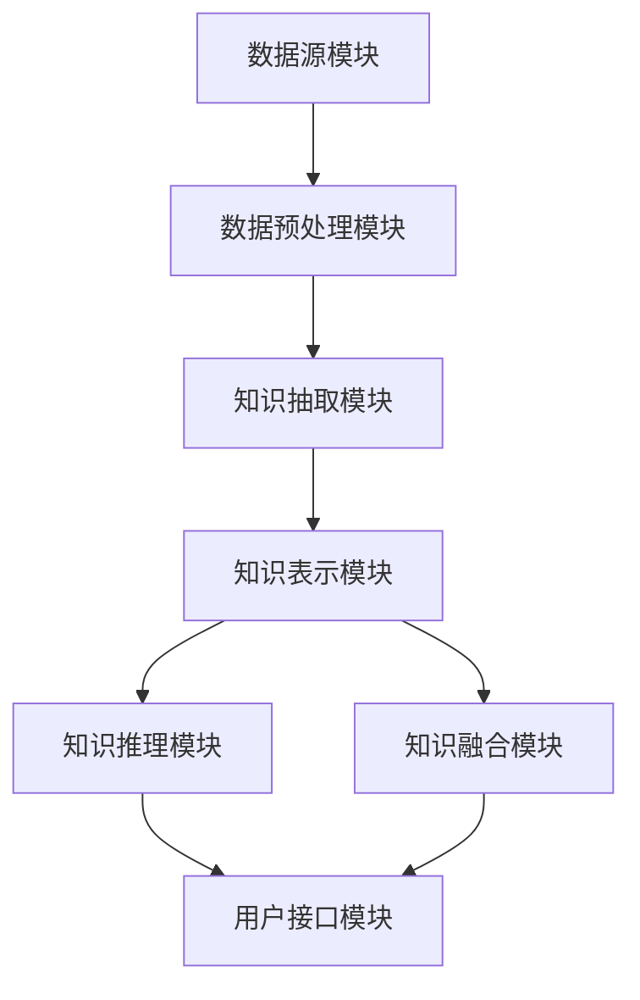
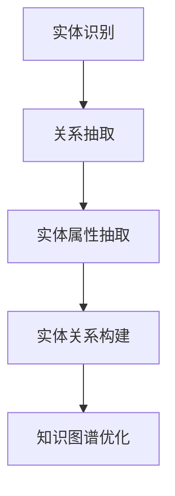
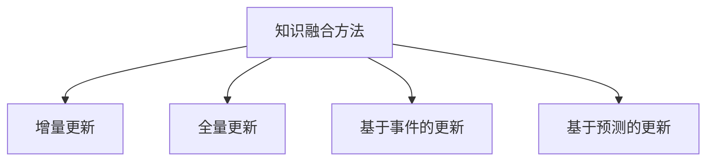

                 

## 文章标题：知识发现引擎：赋能人类知识进化的加速器

> 关键词：知识发现引擎，知识图谱，数据挖掘，人工智能，知识融合，知识进化

> 摘要：本文深入探讨了知识发现引擎的概念、架构、核心技术和应用场景，分析了知识发现引擎在教育、医疗、金融和社科领域的具体应用。同时，文章还探讨了知识发现引擎面临的挑战及其未来发展趋势，为人工智能和知识工程领域的研究与实践提供了有价值的参考。

## 目录

1. **引言与背景**
   - 1.1 知识发现引擎概述
   - 1.2 知识发现引擎的重要性
   - 1.3 知识发现引擎的发展历程
   - 1.4 本书内容结构安排

2. **知识发现引擎的架构与核心技术**
   - 2.1 知识发现引擎的基本架构
   - 2.2 数据预处理技术
   - 2.3 知识抽取与知识表示
   - 2.4 知识推理与图谱构建
   - 2.5 知识融合与更新

3. **知识发现引擎在各个领域的应用**
   - 3.1 知识发现引擎在教育领域的应用
   - 3.2 知识发现引擎在医疗领域的应用
   - 3.3 知识发现引擎在金融领域的应用
   - 3.4 知识发现引擎在社会科学领域的应用

4. **知识发现引擎的技术挑战与发展趋势**
   - 4.1 知识发现引擎的技术挑战
   - 4.2 知识发现引擎的发展趋势

5. **附录**
   - 附录A：知识发现引擎开源工具与框架
   - 附录B：参考文献与推荐阅读

### 1.1 知识发现引擎概述

知识发现引擎（Knowledge Discovery Engine）是一种集成了知识抽取、知识表示、知识推理和知识融合等核心技术的智能系统，旨在从大量数据中自动发现隐藏的、有价值的知识模式，辅助人类进行决策和创新。知识发现引擎的核心概念可以追溯到知识工程和人工智能领域，其目标是将结构化和非结构化数据转换为可操作的知识，从而提升数据利用效率和智能化水平。

知识发现引擎的主要作用包括：

- **数据挖掘与知识提取**：从海量的原始数据中提取有用的信息，转化为结构化的知识。
- **知识表示与组织**：通过建立知识图谱等方式，将知识进行有效组织，便于查询和使用。
- **知识推理与发现**：利用逻辑推理、统计分析和机器学习等技术，从已有知识中推导出新的结论和发现。
- **知识融合与更新**：结合多种数据源和知识源，实现知识的融合和更新，保持知识的实时性和准确性。

### 1.2 知识发现引擎的重要性

知识发现引擎在当今社会的重要性不可忽视，主要表现在以下几个方面：

- **提高决策效率**：通过自动化的知识发现过程，帮助决策者快速获取有价值的信息，减少决策时间，提高决策质量。
- **促进知识创新**：知识发现引擎可以从海量数据中挖掘出新的知识模式，激发新的创新思维，推动科技进步和社会发展。
- **优化资源配置**：通过分析各类数据，知识发现引擎可以帮助企业优化资源配置，提高生产效率和经济效益。
- **支持个性化服务**：在医疗、教育等领域，知识发现引擎可以根据用户需求提供个性化的知识服务，提升用户体验。

### 1.3 知识发现引擎的发展历程

知识发现引擎的发展历程可以追溯到20世纪80年代，当时以知识工程为主要研究方向。以下是其主要发展阶段的概述：

- **早期探索阶段（1980s-1990s）**：这一阶段主要聚焦于知识表示、推理和知识库的构建。代表性的研究包括KL-ONE和OntoWiki等项目。
- **知识发现阶段（1990s-2000s）**：随着数据挖掘和机器学习技术的发展，知识发现成为研究热点。知识发现引擎在这一阶段逐渐形成，主要应用领域包括商业智能、数据分析和信息检索。
- **智能化阶段（2000s-今）**：近年来，随着人工智能和深度学习技术的突破，知识发现引擎在智能化水平上取得了显著提升，不仅能够处理大规模数据，还能够进行自动化的知识推理和融合。

### 1.4 本书内容结构安排

本书将系统介绍知识发现引擎的相关内容，具体分为以下几个部分：

- **引言与背景**：介绍知识发现引擎的概念、重要性和发展历程。
- **知识发现引擎的架构与核心技术**：详细阐述知识发现引擎的基本架构和核心技术，包括数据预处理、知识抽取、知识表示、知识推理和知识融合等。
- **知识发现引擎在各个领域的应用**：分析知识发现引擎在教育、医疗、金融和社科等领域的具体应用案例。
- **知识发现引擎的技术挑战与发展趋势**：探讨知识发现引擎面临的技术挑战及其未来发展趋势。
- **附录**：提供知识发现引擎相关的开源工具和框架，以及推荐阅读的参考文献。

通过本书的阅读，读者将全面了解知识发现引擎的理论和实践，为相关领域的研究和应用提供有益的参考。接下来，我们将深入探讨知识发现引擎的架构与核心技术，帮助读者建立系统性的认识。

### 2.1 知识发现引擎的基本架构

知识发现引擎作为一种高度复杂的系统，其基本架构通常包括以下几个主要模块：

1. **数据源模块**：数据源模块是知识发现引擎的基础，负责从各种数据源（如数据库、文件、网络等）收集数据。这些数据源可以是结构化数据（如关系数据库中的表）、半结构化数据（如XML、JSON）或非结构化数据（如文本、图像、音频等）。数据源模块需要保证数据的准确性和完整性，以便后续处理。

2. **数据预处理模块**：数据预处理模块对收集到的原始数据进行清洗、转换和集成，使其适合进一步的分析。这一过程通常包括数据去重、缺失值处理、异常值检测、数据格式转换和数据归一化等操作。数据预处理是知识发现过程中至关重要的一步，因为它直接影响后续分析的质量。

3. **知识抽取模块**：知识抽取模块负责从预处理后的数据中提取结构化的知识。这一过程通常包括实体识别、关系抽取、事件抽取和属性抽取等。知识抽取是知识发现的核心步骤，它将无序、分散的数据转化为有序、结构化的知识，便于后续的表示和处理。

4. **知识表示模块**：知识表示模块负责将抽取出来的知识以特定格式进行表示。常见的方法包括知识图谱、本体论、语义网络等。知识表示的目的是将知识组织成一种易于查询、理解和推理的形式，以便用户或系统可以方便地使用这些知识。

5. **知识推理模块**：知识推理模块利用逻辑推理、统计分析和机器学习等技术，从已有的知识中推导出新的结论和发现。知识推理是知识发现引擎的高级功能，它可以帮助用户发现数据中的潜在关系和模式，从而为决策提供支持。

6. **知识融合模块**：知识融合模块负责将来自不同数据源和不同领域的知识进行整合，形成统一的、综合的知识库。知识融合的过程通常涉及数据的对齐、合并、冲突解决和一致性维护等。知识融合是提高知识发现引擎实用性的关键步骤，因为它能够提供更加全面和准确的知识服务。

7. **用户接口模块**：用户接口模块提供与用户的交互界面，允许用户查询、浏览和使用知识库。用户接口可以是命令行界面、图形用户界面（GUI）或Web界面等。通过用户接口，用户可以方便地获取所需的知识，并进行个性化的知识服务。

下面是一个简化的知识发现引擎的基本架构的Mermaid流程图：



通过上述模块的协同工作，知识发现引擎能够从海量数据中自动发现隐藏的、有价值的信息，为用户提供智能化的知识服务。

### 2.2 数据预处理技术

数据预处理是知识发现过程中的关键步骤，其目标是确保输入数据的质量和一致性，以便后续的知识抽取、表示和推理。数据预处理技术主要包括数据清洗、数据转换和数据集成等几个方面。

1. **数据清洗**

数据清洗是数据预处理的核心环节，其主要任务是识别和修复数据中的错误、异常和缺失值。数据清洗过程通常包括以下步骤：

- **去重**：识别并删除重复的数据记录，确保数据的唯一性。
- **缺失值处理**：对于缺失的数据，可以选择填充、删除或保留缺失值等方法。常用的填充方法包括平均值填充、中值填充、众数填充和插值等。
- **异常值检测**：识别并处理数据中的异常值，这些异常值可能是数据录入错误或异常数据点。处理异常值的方法包括删除、修正或标记异常值。
- **格式转换**：将不同数据源的数据格式转换为统一的格式，以便后续处理。例如，将不同格式的日期、货币和文本数据转换为标准格式。

2. **数据转换**

数据转换是数据预处理的重要环节，其主要目的是将原始数据转换为适合分析和建模的格式。数据转换过程通常包括以下步骤：

- **归一化**：将不同尺度的数据进行归一化处理，使其具有相同的尺度。常用的归一化方法包括最小-最大归一化和Z-Score归一化。
- **标准化**：将数据转换为标准正态分布，消除不同特征间的量纲差异。常用的标准化方法包括Z-Score标准化和Min-Max标准化。
- **特征选择**：从原始数据中筛选出对分析任务最有意义的特征，去除无关或冗余的特征。特征选择的方法包括信息增益、卡方检验和主成分分析等。

3. **数据集成**

数据集成是将来自不同数据源的数据进行整合，形成统一的数据视图。数据集成过程通常包括以下步骤：

- **数据对齐**：识别并处理不同数据源中的数据对齐问题，包括时间戳对齐、实体对齐和属性对齐等。
- **数据合并**：将不同数据源的数据进行合并，形成统一的数据集。合并的方法包括垂直合并和水平合并。
- **冲突解决**：处理数据集成过程中出现的冲突和矛盾。冲突解决的方法包括基于规则的冲突解决、基于投票的冲突解决和基于机器学习的冲突解决等。
- **一致性维护**：确保数据集的一致性和完整性，防止数据重复和遗漏。一致性维护的方法包括数据同步、数据版本控制和数据审计等。

### 2.3 知识抽取与知识表示

知识抽取（Knowledge Extraction）和知识表示（Knowledge Representation）是知识发现过程中的两个关键环节。知识抽取的目标是从原始数据中提取结构化的知识，而知识表示则是将这些知识以特定格式进行组织，以便于后续处理和应用。

#### 2.3.1 知识抽取

知识抽取通常包括实体识别、关系抽取、事件抽取和属性抽取等几个方面：

1. **实体识别（Entity Recognition）**：实体识别是指从文本数据中识别出具有特定意义的实体，如人名、地名、机构名等。实体识别是知识抽取的基础，常用的方法包括基于规则的方法、基于统计的方法和基于深度学习的方法。

2. **关系抽取（Relationship Extraction）**：关系抽取是指从文本数据中识别出实体之间的关系，如“张三出生在上海”、“公司招聘员工”等。关系抽取的方法包括基于规则的方法、基于统计的方法和基于深度学习的方法。

3. **事件抽取（Event Extraction）**：事件抽取是指从文本数据中识别出事件以及事件的相关实体和关系，如“苹果公司发布了新款iPhone”。事件抽取的方法包括基于规则的方法、基于统计的方法和基于深度学习的方法。

4. **属性抽取（Attribute Extraction）**：属性抽取是指从文本数据中识别出实体的属性信息，如“苹果公司成立于1976年”、“张三的身高为180cm”。属性抽取的方法包括基于规则的方法、基于统计的方法和基于深度学习的方法。

#### 2.3.2 知识表示

知识表示是将抽取出来的知识以特定格式进行组织，以便于存储、查询和使用。常见的知识表示方法包括知识图谱、本体论和语义网络等：

1. **知识图谱（Knowledge Graph）**：知识图谱是一种用于表示实体及其关系的图形结构，它通过节点和边来表示实体和关系，每个节点表示一个实体，每条边表示实体之间的关系。知识图谱的优点是能够直观地表示复杂的关系网络，并支持高效的查询和推理。

2. **本体论（Ontology）**：本体论是一种用于描述领域知识的理论框架，它通过定义概念、属性和关系等来组织知识。本体论的优点是能够提供明确的语义定义，便于知识的理解和推理。

3. **语义网络（Semantic Network）**：语义网络是一种基于图形结构的知识表示方法，它通过节点表示概念，通过边表示概念之间的关系。语义网络的优点是能够直观地表示知识的层次结构和关系。

#### 2.3.3 知识表示的方法

1. **基于知识图谱的方法**：知识图谱是一种常见的知识表示方法，它通过节点和边来表示实体和关系。知识图谱的构建通常包括以下步骤：

   - **实体识别**：从文本数据中识别出实体，并将它们作为节点添加到知识图谱中。
   - **关系抽取**：从文本数据中识别出实体之间的关系，并将它们作为边添加到知识图谱中。
   - **实体属性抽取**：从文本数据中识别出实体的属性信息，并将它们与对应的实体节点关联。

2. **基于本体论的方法**：本体论是一种基于语义描述的知识表示方法，它通过定义概念、属性和关系等来组织知识。本体论的构建通常包括以下步骤：

   - **概念定义**：定义领域中的基本概念，如“人”、“地点”、“组织”等。
   - **属性定义**：定义概念之间的属性关系，如“年龄”、“身高”、“国籍”等。
   - **关系定义**：定义概念之间的语义关系，如“属于”、“包含”、“继承”等。

3. **基于语义网络的方法**：语义网络是一种基于图形结构的知识表示方法，它通过节点表示概念，通过边表示概念之间的关系。语义网络的构建通常包括以下步骤：

   - **概念表示**：将领域中的概念表示为节点，并将它们添加到语义网络中。
   - **关系表示**：将概念之间的关系表示为边，并将它们添加到语义网络中。

通过知识抽取和知识表示，知识发现引擎能够从原始数据中提取出结构化的知识，并将其组织成易于查询和使用的格式，为后续的知识推理和知识融合提供了基础。

### 2.4 知识推理与图谱构建

知识推理（Knowledge Reasoning）是知识发现引擎的核心功能之一，它利用逻辑推理、统计分析和机器学习等技术，从已有知识中推导出新的结论和发现。知识推理不仅能够揭示数据中的潜在关系和模式，还能够为决策提供有力支持。在本节中，我们将探讨知识推理的基本原理、算法和方法，以及知识图谱的构建过程。

#### 2.4.1 知识推理的基本原理

知识推理是基于已有知识进行推理和扩展的过程，其核心思想是通过逻辑推理、统计分析和机器学习等方法，从已知的事实中推导出新的结论。知识推理的基本原理包括：

1. **逻辑推理**：逻辑推理是一种基于逻辑规则和命题逻辑的推理方法。它通过前提条件和逻辑规则，推导出结论。例如，如果A则B，并且A成立，那么可以推导出B成立。

2. **统计分析**：统计分析是一种基于概率论和统计学原理的推理方法。它通过分析数据中的统计特征和关系，发现数据中的潜在规律和趋势。例如，通过计算两个变量的相关系数，可以判断它们之间是否存在相关性。

3. **机器学习**：机器学习是一种基于数据驱动的方法。它通过从训练数据中学习模型，然后利用模型对新的数据进行预测和推理。常见的机器学习算法包括决策树、支持向量机、神经网络等。

#### 2.4.2 知识推理的算法和方法

知识推理的算法和方法多种多样，以下是几种常见的知识推理算法：

1. **基于规则的推理**：基于规则的推理是一种经典的推理方法，它通过定义一系列规则，将已知的事实和规则结合起来，推导出新的结论。典型的算法包括前向推理和反向推理。

   - **前向推理**：从已知的事实出发，逐步推导出新的结论。例如，如果A则B，并且A成立，那么可以推导出B成立。
   - **反向推理**：从目标结论出发，逆向推导出已知的事实。例如，如果B成立，并且A则B，那么可以推导出A成立。

2. **基于模型的推理**：基于模型的推理是通过构建模型来表示知识，并利用模型进行推理。常见的模型包括决策树、支持向量机、神经网络等。

   - **决策树**：决策树是一种基于树结构的模型，它通过一系列条件判断来分类或回归数据。例如，通过构建一个决策树模型，可以预测一个患者的疾病类型。
   - **支持向量机**：支持向量机是一种基于优化理论的模型，它通过寻找最优的分离超平面来分类数据。例如，通过构建一个支持向量机模型，可以分类电子邮件是否为垃圾邮件。
   - **神经网络**：神经网络是一种基于模拟生物神经网络的结构，它通过多层神经元进行数据传递和变换。例如，通过构建一个神经网络模型，可以识别图像中的物体。

3. **基于数据的推理**：基于数据的推理是通过分析数据中的统计特征和关系来进行推理。常见的算法包括聚类、关联规则挖掘、时间序列分析等。

   - **聚类**：聚类是一种无监督学习方法，它将数据分为若干个类，使得同一类中的数据点相似，不同类中的数据点不同。例如，通过聚类分析，可以将顾客分为不同的群体，以便进行精准营销。
   - **关联规则挖掘**：关联规则挖掘是一种发现数据中隐含关系的方法，它通过挖掘频繁项集来发现数据中的关联关系。例如，通过关联规则挖掘，可以发现购物车中的商品之间的关联关系，从而优化商品推荐。
   - **时间序列分析**：时间序列分析是一种用于分析时间序列数据的统计方法，它通过分析时间序列中的趋势、周期和季节性特征来进行预测。例如，通过时间序列分析，可以预测一个公司的未来销售额。

#### 2.4.3 知识图谱的构建

知识图谱（Knowledge Graph）是一种用于表示实体及其关系的图形结构，它通过节点和边来表示实体和关系。知识图谱的构建通常包括以下几个步骤：

1. **实体识别**：从文本数据中识别出实体，如人名、地名、组织名等。实体识别是知识图谱构建的基础，常用的方法包括基于规则的方法、基于统计的方法和基于深度学习的方法。

2. **关系抽取**：从文本数据中识别出实体之间的关系，如“张三出生在上海”、“公司招聘员工”等。关系抽取是知识图谱构建的核心步骤，常用的方法包括基于规则的方法、基于统计的方法和基于深度学习的方法。

3. **实体属性抽取**：从文本数据中识别出实体的属性信息，如“苹果公司成立于1976年”、“张三的身高为180cm”等。实体属性抽取是知识图谱构建的重要环节，它能够为实体提供更详细的描述。

4. **实体关系构建**：将识别出的实体和关系进行关联，构建成知识图谱。知识图谱的构建方法包括直接构建法和间接构建法。

   - **直接构建法**：直接构建法是通过直接从文本数据中提取实体和关系，构建知识图谱。例如，通过自然语言处理技术，可以直接从新闻文章中提取出人物、地点、事件等信息，并构建成知识图谱。
   - **间接构建法**：间接构建法是通过已有知识库或外部数据源，构建知识图谱。例如，通过连接多个外部数据源，可以构建出一个包含多个实体和关系的知识图谱。

5. **知识图谱优化**：对构建好的知识图谱进行优化，包括数据清洗、错误修复、冗余删除和一致性维护等。知识图谱的优化能够提高其质量和实用性。

通过知识推理和知识图谱的构建，知识发现引擎能够从已有知识中推导出新的结论和发现，为用户提供智能化的知识服务。知识图谱的构建过程如图所示：



### 2.5 知识融合与更新

知识融合（Knowledge Fusion）是将来自不同数据源、不同领域和不同格式的知识进行整合，形成统一、综合的知识库的过程。知识融合的目的是提高知识的实用性和完整性，为用户提供更加全面和准确的知识服务。知识融合与更新是知识发现过程中的关键步骤，其核心任务是解决知识冲突、提高知识一致性和保持知识的实时性。

#### 2.5.1 知识融合的目标

知识融合的主要目标包括：

- **知识整合**：将来自不同数据源、不同领域和不同格式的知识整合成一个统一的知识库。
- **知识补充**：通过融合多种数据源，补充缺失的知识，提高知识的完整性。
- **知识优化**：通过融合和整合，优化知识的表达和结构，提高知识的可用性。
- **知识增强**：通过融合不同领域的知识，增强知识的深度和广度，为用户提供更丰富、更深入的知识服务。

#### 2.5.2 知识融合的方法

知识融合的方法多种多样，常见的知识融合方法包括以下几种：

1. **基于规则的融合**：基于规则的融合是通过定义一系列规则，将不同数据源中的知识进行对齐和融合。这种方法的优点是规则明确，易于理解和实现。缺点是规则覆盖面有限，难以处理复杂和动态的数据环境。

2. **基于统计的融合**：基于统计的融合是通过计算不同数据源之间的相似度或关联度，将知识进行对齐和融合。这种方法的优点是能够处理大规模和动态的数据环境，缺点是需要大量的计算资源和时间。

3. **基于模型的融合**：基于模型的融合是通过构建模型，将不同数据源中的知识进行对齐和融合。常见的模型包括聚类模型、分类模型和神经网络模型等。这种方法的优点是能够自适应地处理复杂和动态的数据环境，缺点是模型的构建和训练需要大量的计算资源和时间。

4. **基于机器学习的融合**：基于机器学习的融合是通过机器学习算法，将不同数据源中的知识进行对齐和融合。常见的算法包括决策树、支持向量机、神经网络等。这种方法的优点是能够自适应地处理复杂和动态的数据环境，缺点是算法的选择和参数的调优需要大量的实验和经验。

#### 2.5.3 知识更新

知识更新是保持知识库实时性和准确性的关键步骤。知识更新主要包括以下几种方法：

1. **增量更新**：增量更新是指只更新知识库中变化的部分，而不是重新构建整个知识库。这种方法能够降低更新成本和计算复杂度。常见的增量更新方法包括基于差异检测的更新和基于数据流的更新。

2. **全量更新**：全量更新是指重新构建整个知识库，以覆盖所有新的数据和知识。这种方法能够确保知识库的完整性和准确性，但计算成本较高。

3. **基于事件的更新**：基于事件的更新是指根据特定的事件触发知识库的更新。例如，当新的数据到达时，自动触发知识库的更新。这种方法能够确保知识库的实时性和准确性，但需要建立完善的事件触发机制。

4. **基于预测的更新**：基于预测的更新是通过预测未来可能发生的事件，提前更新知识库。这种方法能够提前准备知识库，以应对未来的需求，但需要准确预测未来事件的发生。

通过知识融合和更新，知识发现引擎能够保持知识的实时性、准确性和完整性，为用户提供高质量的知识服务。知识融合与更新的过程如图所示：



### 总结

知识发现引擎的架构与核心技术涵盖了数据预处理、知识抽取、知识表示、知识推理、知识融合和知识更新等关键环节。通过这些技术的协同工作，知识发现引擎能够从海量数据中自动发现隐藏的、有价值的信息，为用户提供智能化的知识服务。在接下来的部分，我们将探讨知识发现引擎在教育、医疗、金融和社科等领域的具体应用，进一步展示其强大功能和广泛影响力。

### 3.1 知识发现引擎在教育领域的应用

在教育领域，知识发现引擎发挥着日益重要的作用，通过智能化的知识挖掘与分析，为教育资源的优化、教学效果的提升以及个性化学习提供了有力支持。以下是知识发现引擎在教育领域的主要应用场景：

#### 3.1.1 教育资源的构建

知识发现引擎能够从海量的教育数据中自动提取和构建高质量的教育资源。这一过程通常包括以下步骤：

1. **数据收集**：从在线课程、教学材料、学生作业、教育论文等多种数据源收集数据。
2. **数据预处理**：清洗和转换原始数据，确保数据的准确性和一致性。
3. **知识抽取**：从预处理后的数据中抽取实体、关系和属性，构建教育资源的知识库。
4. **知识表示**：将知识库中的教育资源以知识图谱或本体论的形式表示，便于查询和使用。

通过知识发现引擎，教育机构可以构建一个全面、准确、动态更新的教育资源库，从而提高教育资源的质量和利用率。

#### 3.1.2 教学分析

知识发现引擎在教育领域的另一个重要应用是对教学过程进行深入分析，以优化教学策略和提高教学效果。具体应用包括：

1. **学生行为分析**：通过分析学生的出勤记录、作业提交情况、考试成绩等数据，发现学生的学习习惯、优势和不足。
2. **教学效果评估**：通过分析教学过程中的反馈数据，评估教学效果，识别有效的教学方法。
3. **个性化推荐**：根据学生的兴趣、学习历史和表现，推荐适合的学习资源和方法。

例如，通过分析学生成绩和作业提交数据，知识发现引擎可以识别出学生在某些知识点上的薄弱环节，教师可以针对性地调整教学内容和方法。

#### 3.1.3 学习路径优化

知识发现引擎可以帮助教育机构优化学习路径，提高学习效率。具体方法包括：

1. **知识图谱构建**：构建包含课程内容、知识点关联和教学资源的知识图谱。
2. **路径规划**：根据学生的兴趣、能力和学习目标，规划个性化的学习路径。
3. **动态调整**：根据学生的学习进度和反馈，动态调整学习路径，确保学生能够高效地掌握知识。

例如，对于一名学习计算机科学的学生，知识发现引擎可以根据其知识图谱，推荐先学习基础课程，再逐步深入专业课程的路径。

#### 3.1.4 个性化学习

知识发现引擎在教育领域的个性化学习应用主要体现在以下几个方面：

1. **学习策略推荐**：根据学生的特点和需求，推荐个性化的学习策略，如学习时间管理、复习计划等。
2. **学习资源推荐**：根据学生的学习兴趣和进度，推荐适合的学习资源，如电子书、视频课程、在线论坛等。
3. **学习评价**：通过分析学生的学习行为和成果，给出个性化的学习评价和建议。

例如，对于一名学习英语的学生，知识发现引擎可以推荐个性化的词汇学习计划，并在学习过程中提供词汇记忆的反馈和建议。

#### 3.1.5 应用案例

以下是一个知识发现引擎在教育领域的应用案例：

**案例：智能教学平台**

某教育机构开发了一款智能教学平台，该平台集成了知识发现引擎，提供了以下功能：

- **教育资源库**：从互联网和内部系统中收集和整理教育资源，构建一个动态更新的教育资源库。
- **教学分析**：分析学生的学习行为和成绩，提供个性化的学习报告和建议。
- **学习路径规划**：根据学生的学习目标和兴趣，规划个性化的学习路径。
- **个性化推荐**：根据学生的学习习惯和表现，推荐适合的学习资源和策略。

通过该平台，教育机构能够更好地满足学生的个性化需求，提高教学质量和学习效率。同时，教师也能够获得丰富的教学数据，优化教学方法和策略。

### 3.2 知识发现引擎在医疗领域的应用

知识发现引擎在医疗领域拥有广泛的应用，通过深入挖掘和分析医疗数据，能够为临床诊断、疾病预测、个性化治疗和医疗资源优化提供有力支持。以下是知识发现引擎在医疗领域的主要应用场景：

#### 3.2.1 疾病诊断

知识发现引擎在疾病诊断中的应用主要体现在以下方面：

1. **症状分析**：通过分析患者的症状数据，发现潜在的疾病线索。知识发现引擎可以从大量的医疗记录中提取症状信息，并利用机器学习算法进行关联分析，帮助医生快速识别疾病。

2. **影像分析**：在医学影像领域，知识发现引擎可以分析CT、MRI、X光等影像数据，识别出异常区域和病变组织。例如，通过深度学习算法，知识发现引擎可以自动识别肺癌、乳腺癌等疾病。

3. **病理分析**：知识发现引擎可以从病理报告中提取信息，结合临床表现和实验室检查结果，为医生提供诊断建议。

#### 3.2.2 疾病预测

知识发现引擎在疾病预测中的应用可以帮助医疗机构提前预警疾病风险，为早期干预提供支持。具体应用包括：

1. **流行病预测**：通过分析历史疾病数据和当前健康状态，知识发现引擎可以预测疾病的爆发趋势和传播范围，为公共卫生决策提供依据。

2. **个人健康预测**：知识发现引擎可以结合患者的健康历史、生活习惯和基因数据，预测个人未来的疾病风险，如心血管疾病、糖尿病等。

3. **药物效果预测**：知识发现引擎可以分析药物与疾病之间的关系，预测不同药物对患者的治疗效果，帮助医生选择最佳治疗方案。

#### 3.2.3 个性化治疗

知识发现引擎在个性化治疗中的应用主要体现在以下几个方面：

1. **基因诊断**：知识发现引擎可以从基因组数据中提取关键信息，帮助医生了解患者的基因特征，为个性化治疗提供依据。

2. **药物推荐**：通过分析患者的基因数据和药物反应历史，知识发现引擎可以推荐最适合患者的药物和剂量，提高治疗效果。

3. **治疗方案优化**：知识发现引擎可以根据患者的病情、基因特征和生活习惯，为医生提供最佳的治疗方案。

#### 3.2.4 医疗资源优化

知识发现引擎在医疗资源优化中的应用主要体现在以下几个方面：

1. **医院运营管理**：通过分析医院的运营数据，如住院率、手术量、床位使用率等，知识发现引擎可以帮助医院优化资源配置，提高运营效率。

2. **医疗设备管理**：知识发现引擎可以分析医疗设备的运行数据，预测设备的故障风险，帮助医院进行设备维护和调度。

3. **患者流量预测**：通过分析患者流量数据，知识发现引擎可以预测医院的未来患者数量，为医院的运营计划提供依据。

#### 3.2.5 应用案例

以下是一个知识发现引擎在医疗领域的应用案例：

**案例：智能医疗诊断系统**

某医疗机构开发了一款智能医疗诊断系统，该系统集成了知识发现引擎，提供了以下功能：

- **智能诊断**：系统从患者的症状、影像和实验室检查结果中提取信息，利用机器学习算法进行疾病诊断。
- **疾病预测**：系统可以分析患者的健康数据和基因信息，预测未来的疾病风险。
- **个性化治疗**：系统根据患者的基因特征和疾病类型，为医生提供个性化的治疗建议。
- **医疗资源优化**：系统可以分析医院的运营数据，为医院提供资源优化方案。

通过该系统，医疗机构能够提供更准确、更高效的医疗服务，提高医疗质量和患者满意度。同时，医生也能够获得丰富的诊断数据，优化诊疗方法和策略。

### 3.3 知识发现引擎在金融领域的应用

知识发现引擎在金融领域具有广泛的应用，通过分析金融数据，能够为风险评估、金融风控、投资决策和个性化金融服务提供有力支持。以下是知识发现引擎在金融领域的主要应用场景：

#### 3.3.1 风险评估

在金融领域，知识发现引擎可以用于风险评估，帮助金融机构识别和管理潜在的风险。具体应用包括：

1. **信用风险评估**：知识发现引擎可以从客户的财务数据、信用记录、社会关系等多维度数据进行综合分析，预测客户的信用风险，为信贷审批提供依据。

2. **市场风险评估**：通过分析市场数据，如股票价格、交易量、宏观经济指标等，知识发现引擎可以预测市场的波动和潜在风险，为投资决策提供支持。

3. **操作风险评估**：知识发现引擎可以分析操作过程中的异常交易和异常行为，识别操作风险，帮助金融机构防范欺诈和违规操作。

#### 3.3.2 金融风控

知识发现引擎在金融风控中的应用主要体现在以下几个方面：

1. **风险预警**：通过实时监控和分析金融交易数据，知识发现引擎可以及时发现异常交易和潜在风险，为金融机构提供预警信息。

2. **风险分类**：知识发现引擎可以根据历史数据和分析结果，对风险进行分类和排序，帮助金融机构优先处理高风险事件。

3. **风险决策支持**：知识发现引擎可以为金融机构提供基于数据的决策支持，如贷款额度、信用额度、风险缓释措施等。

#### 3.3.3 投资决策

知识发现引擎在投资决策中的应用可以帮助投资者和金融机构提高投资效率和收益。具体应用包括：

1. **市场趋势预测**：通过分析历史市场数据、经济指标和行业趋势，知识发现引擎可以预测市场的未来走势，为投资者提供投资建议。

2. **股票筛选**：知识发现引擎可以从大量的股票数据中筛选出具有投资价值的股票，为投资者提供参考。

3. **组合优化**：通过分析资产之间的相关性、风险和收益，知识发现引擎可以帮助投资者优化投资组合，提高收益。

#### 3.3.4 个性化金融服务

知识发现引擎在个性化金融服务中的应用主要体现在以下几个方面：

1. **客户细分**：通过分析客户的历史交易数据、行为特征和需求，知识发现引擎可以将客户进行细分，为不同类型的客户提供个性化的产品和服务。

2. **产品推荐**：根据客户的偏好和需求，知识发现引擎可以推荐适合的产品和服务，提高客户满意度和忠诚度。

3. **服务定制**：知识发现引擎可以根据客户的特点和需求，为金融机构提供定制化的金融服务，如个性化投资策略、专属理财顾问等。

#### 3.3.5 应用案例

以下是一个知识发现引擎在金融领域的应用案例：

**案例：智能投资顾问系统**

某金融科技公司开发了一款智能投资顾问系统，该系统集成了知识发现引擎，提供了以下功能：

- **风险评估**：系统从投资者的财务数据、投资历史等多维度数据进行综合分析，评估投资者的风险承受能力，为投资决策提供依据。
- **市场趋势预测**：系统分析市场数据、经济指标和行业趋势，预测市场的未来走势，为投资者提供投资建议。
- **个性化推荐**：系统根据投资者的投资偏好和风险承受能力，推荐适合的投资产品和策略。
- **风险预警**：系统实时监控投资者的交易行为，及时发现异常交易和潜在风险，为投资者提供预警信息。

通过该系统，金融机构能够提供更高效、更精准的金融服务，提高投资者的投资收益和满意度。同时，投资者也能够获得基于数据的投资决策支持，优化投资策略。

### 3.4 知识发现引擎在社会科学领域的应用

知识发现引擎在社会科学领域具有广泛的应用潜力，通过分析社会数据和人文数据，能够为政策制定、社会调查、社会网络分析和公共管理提供有力支持。以下是知识发现引擎在社会科学领域的主要应用场景：

#### 3.4.1 政策分析

知识发现引擎在政策分析中的应用主要体现在以下几个方面：

1. **政策文本分析**：通过自然语言处理技术，知识发现引擎可以分析政策文本的语义和情感，识别政策的关键词、主题和立场，为政策制定提供参考。

2. **政策影响评估**：知识发现引擎可以分析政策实施后的社会和经济影响，评估政策的成效，为政策调整提供依据。

3. **政策预测**：通过分析历史政策和相关数据，知识发现引擎可以预测未来政策的发展趋势和潜在影响，为决策者提供参考。

#### 3.4.2 社会调查

知识发现引擎在社会调查中的应用可以帮助研究者从大量社会数据中提取有价值的信息，提升调查的准确性和效率。具体应用包括：

1. **调查数据分析**：知识发现引擎可以分析问卷调查的数据，识别调查结果中的趋势和模式，为研究者提供深入的数据分析。

2. **公众意见分析**：通过分析社交媒体、新闻评论等公开数据，知识发现引擎可以了解公众对某一政策、事件或议题的看法和态度，为政策制定者提供民意参考。

3. **行为预测**：知识发现引擎可以结合历史数据和现实行为，预测公众的未来行为和态度，为政策制定提供前瞻性建议。

#### 3.4.3 社会网络分析

知识发现引擎在社会网络分析中的应用主要体现在以下几个方面：

1. **网络结构分析**：通过分析社交网络中的节点和边，知识发现引擎可以揭示社会网络的结构特征，如中心性、凝聚力、模块性等，帮助研究者了解社会网络的运行机制。

2. **传播路径分析**：知识发现引擎可以分析信息在社会网络中的传播路径和速度，识别关键节点和关键路径，为信息传播策略提供支持。

3. **群体识别**：通过分析社交网络中的节点关系，知识发现引擎可以识别出不同的社会群体和亚文化，为社会研究提供新的视角。

#### 3.4.4 公共管理

知识发现引擎在公共管理中的应用可以帮助政府提高公共服务的效率和质量，具体应用包括：

1. **公共资源优化**：通过分析公共资源的使用情况，知识发现引擎可以优化公共资源的配置，提高资源利用率。

2. **公共事件预警**：知识发现引擎可以实时监控社会事件的发展，识别潜在的公共安全风险，为政府提供预警信息。

3. **公共服务改进**：通过分析公众对公共服务的反馈和评价，知识发现引擎可以帮助政府识别服务中的问题和不足，提出改进建议。

#### 3.4.5 应用案例

以下是一个知识发现引擎在社会科学领域的应用案例：

**案例：智能社会调查系统**

某社会科学研究机构开发了一款智能社会调查系统，该系统集成了知识发现引擎，提供了以下功能：

- **文本分析**：系统从政策文本中提取关键词、主题和情感，为政策制定提供参考。
- **数据分析**：系统分析问卷调查数据，识别调查结果中的趋势和模式，为研究者提供深入的数据分析。
- **网络分析**：系统分析社交媒体数据，了解公众对政策、事件或议题的看法和态度，为政策制定者提供民意参考。
- **事件预警**：系统实时监控社会事件的发展，识别潜在的公共安全风险，为政府提供预警信息。

通过该系统，研究机构能够更加高效地进行社会调查和数据分析，为政策制定和公共管理提供科学依据。同时，政府也能够更好地了解公众需求和社会动态，提高公共服务的质量和效率。

### 3.5 知识发现引擎在商业领域的应用

知识发现引擎在商业领域具有显著的应用价值，通过深入挖掘和分析商业数据，为企业提供精准的市场洞察、用户行为预测和商业决策支持。以下是知识发现引擎在商业领域的主要应用场景：

#### 3.5.1 市场洞察

知识发现引擎在市场洞察中的应用主要体现在以下几个方面：

1. **消费者行为分析**：通过分析消费者的购买历史、浏览行为、社交媒体互动等数据，知识发现引擎可以揭示消费者的偏好、需求和购买行为模式，为企业制定市场策略提供参考。

2. **竞争对手分析**：知识发现引擎可以分析竞争对手的市场表现、营销策略和产品特点，帮助企业了解竞争对手的优势和劣势，优化自身的市场定位和策略。

3. **市场趋势预测**：通过分析历史市场数据和宏观经济指标，知识发现引擎可以预测市场的未来趋势，为企业提供前瞻性的市场预测和决策支持。

#### 3.5.2 用户行为预测

知识发现引擎在用户行为预测中的应用可以帮助企业更好地了解用户需求，提高用户满意度和忠诚度。具体应用包括：

1. **用户细分**：通过分析用户的行为数据和特征，知识发现引擎可以将用户划分为不同的群体，为不同类型的用户提供个性化的服务和推荐。

2. **用户流失预测**：知识发现引擎可以分析用户的行为变化和流失信号，提前预测用户的流失风险，为企业提供针对性的挽回策略。

3. **需求预测**：通过分析用户的购买历史和浏览行为，知识发现引擎可以预测用户未来的需求和行为，为企业制定精准的营销策略和库存管理提供支持。

#### 3.5.3 商业决策支持

知识发现引擎在商业决策支持中的应用可以帮助企业优化决策过程，提高决策质量和效率。具体应用包括：

1. **销售预测**：知识发现引擎可以分析历史销售数据、市场趋势和用户需求，预测未来的销售情况，为企业制定销售计划和库存管理提供支持。

2. **产品推荐**：通过分析用户的行为数据和偏好，知识发现引擎可以推荐适合用户的产品和服务，提高转化率和销售额。

3. **运营优化**：知识发现引擎可以分析企业的运营数据，识别运营中的瓶颈和问题，提出优化建议，提高运营效率。

#### 3.5.4 应用案例

以下是一个知识发现引擎在商业领域的应用案例：

**案例：智能零售分析系统**

某零售企业开发了一款智能零售分析系统，该系统集成了知识发现引擎，提供了以下功能：

- **消费者行为分析**：系统从消费者的购买历史、浏览行为和社交媒体互动中提取有价值的信息，揭示消费者的偏好和需求。
- **市场趋势预测**：系统分析历史市场数据和宏观经济指标，预测市场的未来趋势，为企业的市场策略提供参考。
- **用户流失预测**：系统分析用户的行为变化和流失信号，提前预测用户的流失风险，为企业提供针对性的挽回策略。
- **销售预测**：系统分析历史销售数据和市场趋势，预测未来的销售情况，为企业的销售计划和库存管理提供支持。

通过该系统，零售企业能够更加精准地了解市场和用户需求，优化决策过程，提高运营效率和销售额。同时，企业也能够更好地满足消费者的个性化需求，提高用户满意度和忠诚度。

### 3.6 知识发现引擎在智能制造领域的应用

知识发现引擎在智能制造领域具有广泛的应用前景，通过深入挖掘和分析工业数据，能够为企业提供设备维护优化、生产流程优化和供应链优化等方面的智能支持。以下是知识发现引擎在智能制造领域的主要应用场景：

#### 3.6.1 设备维护优化

知识发现引擎在设备维护优化中的应用可以帮助企业实现预测性维护，提高设备运行效率和降低维护成本。具体应用包括：

1. **故障预测**：通过分析设备运行数据、历史故障记录和维护记录，知识发现引擎可以预测设备的潜在故障，为维护工作提供提前预警。

2. **维护计划优化**：知识发现引擎可以分析设备运行状态和维护需求，为设备制定最优的维护计划，减少停机时间和维护成本。

3. **设备健康监测**：知识发现引擎可以实时监控设备的运行状态，识别异常情况，及时采取维护措施，确保设备安全运行。

#### 3.6.2 生产流程优化

知识发现引擎在生产流程优化中的应用可以帮助企业提高生产效率和质量，降低生产成本。具体应用包括：

1. **生产调度优化**：通过分析生产数据、物料库存和生产计划，知识发现引擎可以为生产调度提供优化建议，提高生产效率。

2. **工艺优化**：知识发现引擎可以分析生产过程中的工艺数据，识别生产瓶颈和改进机会，为工艺优化提供支持。

3. **质量控制**：知识发现引擎可以分析生产过程中产生的质量数据，识别质量问题和潜在的缺陷，为质量控制提供支持。

#### 3.6.3 供应链优化

知识发现引擎在供应链优化中的应用可以帮助企业优化供应链管理，提高供应链效率和降低成本。具体应用包括：

1. **需求预测**：通过分析市场需求、销售数据和库存数据，知识发现引擎可以预测未来的需求趋势，为供应链计划提供支持。

2. **库存管理**：知识发现引擎可以分析库存数据、销售数据和供应链信息，为库存管理提供优化建议，减少库存成本。

3. **物流优化**：知识发现引擎可以分析物流数据，优化运输路径和物流网络，提高物流效率。

#### 3.6.4 应用案例

以下是一个知识发现引擎在智能制造领域的应用案例：

**案例：智能制造优化系统**

某制造企业开发了一款智能制造优化系统，该系统集成了知识发现引擎，提供了以下功能：

- **故障预测**：系统从设备运行数据和历史故障记录中提取信息，预测设备的潜在故障，为维护工作提供提前预警。
- **生产调度优化**：系统分析生产数据、物料库存和生产计划，为生产调度提供优化建议，提高生产效率。
- **工艺优化**：系统分析生产过程中的工艺数据，识别生产瓶颈和改进机会，为工艺优化提供支持。
- **需求预测**：系统分析市场需求、销售数据和库存数据，预测未来的需求趋势，为供应链计划提供支持。

通过该系统，制造企业能够实现设备的预测性维护、生产流程优化和供应链优化，提高生产效率和降低成本。同时，企业也能够更好地应对市场变化和需求波动，提高市场竞争力。

### 3.7 知识发现引擎在环境保护领域的应用

知识发现引擎在环境保护领域具有显著的应用价值，通过分析环境数据、生态数据和环境监测数据，能够为环境保护决策提供科学依据，促进可持续发展。以下是知识发现引擎在环境保护领域的主要应用场景：

#### 3.7.1 环境监测与数据分析

知识发现引擎在环境监测与数据分析中的应用主要体现在以下几个方面：

1. **空气质量监测**：通过分析空气污染物浓度数据，知识发现引擎可以识别空气质量变化趋势，为环境保护决策提供依据。

2. **水质监测**：知识发现引擎可以分析水质数据，识别水体中的污染物和生态变化，为水资源管理提供支持。

3. **土壤监测**：通过分析土壤数据，知识发现引擎可以识别土壤污染情况，为土壤修复和环境治理提供指导。

#### 3.7.2 生态数据分析

知识发现引擎在生态数据分析中的应用可以帮助科学家和决策者了解生态系统状态，预测生态变化趋势。具体应用包括：

1. **生物多样性分析**：通过分析生物多样性数据，知识发现引擎可以识别生态系统的物种分布和变化趋势，为生物多样性保护提供支持。

2. **生态过程模拟**：知识发现引擎可以结合生态数据和模型，模拟生态系统的动态变化，预测未来生态状况。

3. **生态风险评估**：通过分析人类活动对生态系统的影响，知识发现引擎可以评估生态风险，为环境保护决策提供依据。

#### 3.7.3 环境保护决策支持

知识发现引擎在环境保护决策支持中的应用可以帮助政府和企业制定科学的环境保护策略。具体应用包括：

1. **污染源识别**：通过分析环境数据，知识发现引擎可以识别污染源和污染物排放情况，为污染治理提供依据。

2. **环境规划**：知识发现引擎可以分析环境数据和社会经济数据，为环境规划提供优化建议，促进可持续发展。

3. **灾害预警**：通过分析气象、地质和生态环境数据，知识发现引擎可以预测自然灾害风险，为灾害预警和应急响应提供支持。

#### 3.7.4 应用案例

以下是一个知识发现引擎在环境保护领域的应用案例：

**案例：智能环境监测系统**

某环保部门开发了一款智能环境监测系统，该系统集成了知识发现引擎，提供了以下功能：

- **空气质量监测**：系统从空气质量监测站的数据中提取信息，识别空气质量变化趋势，为环境保护决策提供依据。
- **水质监测**：系统分析水质数据，识别水体中的污染物和生态变化，为水资源管理提供支持。
- **生态数据分析**：系统从生态数据中提取有价值的信息，为生物多样性保护和生态风险评估提供支持。
- **污染源识别**：系统分析环境数据，识别污染源和污染物排放情况，为污染治理提供依据。

通过该系统，环保部门能够更加科学和有效地进行环境监测和管理，提高环境保护工作的效率和效果。同时，政府和企业也能够更好地了解环境状况，制定科学的环境保护策略，促进可持续发展。

### 3.8 知识发现引擎在智慧城市领域的应用

知识发现引擎在智慧城市领域具有广泛的应用，通过分析城市数据、交通数据、环境数据和社会数据，能够为城市治理、智能交通、环境监测和公共安全提供有力支持。以下是知识发现引擎在智慧城市领域的主要应用场景：

#### 3.8.1 城市治理

知识发现引擎在智慧城市治理中的应用主要体现在以下几个方面：

1. **城市管理优化**：通过分析城市数据，如人口、经济、交通等，知识发现引擎可以为城市管理部门提供科学的管理决策支持，优化城市资源配置。

2. **城市规划**：知识发现引擎可以分析城市数据，为城市规划提供优化建议，促进城市的可持续发展。

3. **城市安全监控**：通过分析城市数据，如人流、车流、视频监控等，知识发现引擎可以为城市安全监控提供支持，提高城市安全保障水平。

#### 3.8.2 智能交通

知识发现引擎在智能交通中的应用主要体现在以下几个方面：

1. **交通流量监测**：通过分析交通数据，如车辆流量、交通拥堵情况等，知识发现引擎可以实时监测城市交通状况，为交通管理和调度提供依据。

2. **交通信号优化**：知识发现引擎可以分析交通数据，优化交通信号灯的配时，提高道路通行效率。

3. **智能停车管理**：知识发现引擎可以分析停车数据，为智能停车管理提供支持，提高停车资源利用率。

#### 3.8.3 环境监测

知识发现引擎在环境监测中的应用主要体现在以下几个方面：

1. **空气质量监测**：通过分析空气质量数据，知识发现引擎可以实时监测城市空气质量，为环保部门提供决策支持。

2. **水质监测**：知识发现引擎可以分析水质数据，监测水体污染情况，为水资源管理部门提供支持。

3. **环境噪声监测**：知识发现引擎可以分析环境噪声数据，监测城市环境噪声水平，为城市管理部门提供噪声污染治理依据。

#### 3.8.4 公共安全

知识发现引擎在公共安全中的应用主要体现在以下几个方面：

1. **自然灾害预警**：通过分析气象、地质和生态环境数据，知识发现引擎可以预测自然灾害风险，为应急管理部门提供预警信息。

2. **社会安全监测**：通过分析社会数据，如人流、视频监控等，知识发现引擎可以实时监测社会安全状况，为公共安全管理部门提供支持。

3. **犯罪预测**：知识发现引擎可以分析犯罪数据，预测犯罪趋势和热点区域，为公安部门提供打击犯罪依据。

#### 3.8.5 应用案例

以下是一个知识发现引擎在智慧城市领域的应用案例：

**案例：智能城市管理系统**

某城市政府开发了一款智能城市管理系统，该系统集成了知识发现引擎，提供了以下功能：

- **城市管理优化**：系统从城市数据中提取有价值的信息，为城市管理部门提供科学的管理决策支持，优化城市资源配置。
- **智能交通管理**：系统实时监测城市交通状况，优化交通信号灯配时，提高道路通行效率。
- **环境监测**：系统实时监测城市空气质量、水质和环境噪声，为环保部门提供决策支持。
- **公共安全监控**：系统实时监测社会安全状况，为公共安全管理部门提供支持，提高城市安全保障水平。

通过该系统，城市政府能够更加高效和智能地进行城市治理，提高城市管理的水平和居民生活质量。同时，政府也能够更好地应对城市面临的各类挑战，促进城市的可持续发展。

### 7.1 知识发现引擎的技术挑战

尽管知识发现引擎在各个领域展现了强大的应用潜力，但其技术实现过程中仍然面临诸多挑战。以下是知识发现引擎在技术方面主要面临的挑战及其解决方案：

#### 7.1.1 数据质量与数据隐私问题

**挑战**：数据质量问题和数据隐私保护是知识发现引擎面临的重要挑战。数据质量差可能导致知识发现结果不准确，而数据隐私问题则可能影响用户对数据共享和开放的信任。

**解决方案**：
1. **数据清洗和去噪**：通过数据清洗技术，如去重、缺失值填充和异常值检测，提高数据质量。
2. **数据隐私保护**：采用数据匿名化、加密和差分隐私等技术，保护用户隐私。

#### 7.1.2 知识表示与推理问题

**挑战**：知识表示与推理是知识发现的核心，但现有方法在处理复杂、大规模和动态的知识表示与推理任务时存在局限性。

**解决方案**：
1. **多模态知识表示**：结合文本、图像、音频等多模态数据，构建统一的表示方法，提高知识表示的全面性和准确性。
2. **分布式推理**：采用分布式计算和图计算技术，实现大规模知识图谱的推理，提高推理效率。

#### 7.1.3 知识图谱的构建与维护

**挑战**：知识图谱的构建和维护是一个复杂的过程，涉及到数据收集、知识抽取、知识融合和图谱更新等环节，且图谱更新频率高，维护成本大。

**解决方案**：
1. **自动化知识抽取**：采用深度学习、自然语言处理等技术，实现自动化知识抽取，降低人工成本。
2. **知识图谱更新策略**：采用增量更新策略，仅更新变化部分，降低更新成本。

#### 7.1.4 跨领域知识融合问题

**挑战**：不同领域的数据和知识具有不同的表达方式和结构，跨领域知识融合难度大，且存在数据不一致性和知识冲突问题。

**解决方案**：
1. **统一本体论**：建立跨领域的统一本体论框架，实现不同领域知识的语义对齐和融合。
2. **知识图谱融合算法**：采用基于图论、机器学习和统计学习的方法，实现跨领域知识的融合。

#### 7.1.5 知识应用的实时性与可扩展性

**挑战**：知识发现引擎需要支持实时性应用，同时满足大规模数据和高并发访问的需求，实现高效的知识查询和服务。

**解决方案**：
1. **分布式计算与存储**：采用分布式计算和分布式存储技术，提高系统的可扩展性和性能。
2. **缓存与索引技术**：利用缓存和索引技术，提高知识查询的速度和响应时间。

通过解决上述技术挑战，知识发现引擎可以更好地满足不同领域的需求，实现知识的自动化发现、表示和融合，为人工智能和知识工程领域的发展提供有力支持。

### 8.1 知识发现引擎的发展趋势

随着技术的不断进步和大数据时代的到来，知识发现引擎正经历着快速的发展。未来，知识发现引擎将在以下几个方面展现出显著的趋势：

#### 8.1.1 新一代知识发现引擎的发展方向

1. **智能化与自动化**：新一代知识发现引擎将更加智能化和自动化，通过深度学习和强化学习等先进技术，实现自动化的知识抽取、表示和推理。
2. **多模态融合**：知识发现引擎将能够处理文本、图像、音频、视频等多模态数据，通过多模态融合技术，提高知识发现的效果和精度。
3. **实时性增强**：随着边缘计算和实时数据分析技术的发展，新一代知识发现引擎将具备更高的实时性，能够实时响应和调整，满足动态变化的需求。
4. **知识图谱的动态更新**：知识图谱的构建和维护将更加自动化和高效，支持动态更新，保持知识的实时性和准确性。

#### 8.1.2 知识发现引擎与区块链技术的融合

1. **数据隐私保护**：区块链技术具有天然的隐私保护特性，与知识发现引擎结合，可以实现数据隐私保护，提高用户对数据共享和开放的信任。
2. **分布式知识存储**：利用区块链的分布式存储机制，知识发现引擎可以构建去中心化的知识库，提高系统的可靠性和容错性。
3. **智能合约与知识服务**：通过智能合约，知识发现引擎可以实现自动化、智能化的知识服务，提高服务的效率和安全性。

#### 8.1.3 知识发现引擎与人工智能技术的融合

1. **知识增强学习**：知识发现引擎将结合人工智能中的知识增强学习技术，通过不断学习和优化，提高知识发现的能力和效果。
2. **多任务学习与迁移学习**：知识发现引擎将能够支持多任务学习和迁移学习，通过跨领域的知识共享和复用，提高知识发现的效果和效率。
3. **对话式交互**：结合自然语言处理和对话系统技术，知识发现引擎将能够实现与用户的自然语言交互，提供更加人性化的服务。

#### 8.1.4 知识发现引擎的未来发展趋势

1. **跨领域应用**：知识发现引擎将在更多领域得到应用，如智慧城市、环境保护、智能制造等，通过跨领域的知识融合，提供更广泛的服务。
2. **开放性与互操作性**：知识发现引擎将支持开放标准和协议，实现不同系统和平台之间的互操作性，促进知识的共享和流通。
3. **标准化与规范化**：随着知识发现引擎应用的普及，标准化和规范化工作将得到加强，提高系统的兼容性和可扩展性。
4. **开源生态的繁荣**：知识发现引擎的开源生态将不断繁荣，开源工具和框架将得到更广泛的应用和优化，推动技术的创新和发展。

通过新一代知识发现引擎的发展方向、与区块链技术和人工智能技术的融合，以及未来发展趋势，知识发现引擎将在未来继续发挥重要作用，为人工智能和知识工程领域的发展提供强有力的支持。

### 附录A：知识发现引擎开源工具与框架

#### A.1 OpenKG

**简介**：OpenKG（Open Knowledge Graph）是一个开源的知识图谱构建和推理工具包，支持从多种数据源中构建知识图谱，并进行知识推理。

**核心功能**：
- **知识抽取**：提供基于规则和深度学习的方法，从非结构化数据中抽取实体和关系。
- **知识融合**：支持多源数据的融合和清洗。
- **知识存储**：使用Neo4j作为知识图谱存储引擎。
- **知识推理**：提供基于规则和图论的方法进行推理。

**使用方法**：
- 安装：通过pip安装OpenKG库。
  ```bash
  pip install openkg
  ```
- 示例代码：
  ```python
  from openkg import Entity, Relation, KnowledgeGraph

  kg = KnowledgeGraph()
  kg.add_entity(Entity(id='张三', name='张三'))
  kg.add_relation(Relation(id='工作于', subject='张三', object='阿里巴巴'))
  print(kg.query("张三的工作单位是什么？"))
  ```

**优势**：易于使用，功能全面，支持多种数据源。

#### A.2 AlchemyAPI

**简介**：AlchemyAPI是一个强大的自然语言处理API，提供实体识别、关系抽取、情感分析等多种NLP功能。

**核心功能**：
- **实体识别**：识别文本中的实体，如人名、地点、组织等。
- **关系抽取**：提取实体之间的关系。
- **情感分析**：分析文本的情感倾向。
- **主题分类**：对文本进行主题分类。

**使用方法**：
- 注册并获取API密钥。
- 使用API进行文本分析。
  ```python
  import requests

  api_key = "your_api_key"
  url = "https://api.alchemyapi.com/parser/features"
  payload = {'apikey': api_key, 'text': "谷歌正在研发一款新手机。"}
  headers = {'Content-Type': 'application/json'}
  response = requests.request("POST", url, headers=headers, data=payload)
  print(response.json())
  ```

**优势**：API调用方便，功能强大，支持多种编程语言。

#### A.3 Knowbox

**简介**：Knowbox是一个开源的知识图谱平台，支持知识抽取、知识融合和知识推理。

**核心功能**：
- **知识抽取**：提供基于规则和深度学习的方法，从非结构化数据中抽取实体和关系。
- **知识融合**：支持多源数据的融合和清洗。
- **知识存储**：使用Neo4j作为知识图谱存储引擎。
- **知识推理**：提供基于规则和图论的方法进行推理。

**使用方法**：
- 安装Knowbox。
  ```bash
  pip install knowbox
  ```
- 示例代码：
  ```python
  from knowbox import KnowledgeGraph

  kg = KnowledgeGraph()
  kg.add_entity('张三', {'name': '张三'})
  kg.add_relation('张三', '工作于', '阿里巴巴')
  print(kg.query("张三的工作单位是什么？"))
  ```

**优势**：开源，支持多种数据源，易于扩展。

通过这些开源工具和框架，开发者可以轻松构建和扩展知识发现引擎，为各种应用场景提供智能化的知识服务。

### 附录B：参考文献与推荐阅读

1. **《知识图谱技术原理与应用》**
   作者：杨文轩，张志华
   简介：本书详细介绍了知识图谱的基本概念、构建方法、应用场景以及相关技术，是知识图谱领域的经典教材。

2. **《大数据知识工程》**
   作者：王珊，肖勇
   简介：本书涵盖了大数据知识工程的基本理论、方法和技术，包括数据预处理、知识抽取、知识表示和推理等内容。

3. **《图计算：体系、算法与编程》**
   作者：曹志刚，马少平
   简介：本书介绍了图计算的基本概念、算法和编程实践，包括图论、图算法和图计算框架等内容，对知识图谱的构建和优化具有重要意义。

4. **《深度学习与自然语言处理》**
   作者：周志华
   简介：本书系统地介绍了深度学习和自然语言处理的基本概念、算法和应用，包括卷积神经网络、循环神经网络和自然语言处理模型等内容。

5. **《人工智能：一种现代的方法》**
   作者：Stuart Russell，Peter Norvig
   简介：本书全面介绍了人工智能的基本理论、方法和技术，包括机器学习、知识表示、搜索和推理等内容，是人工智能领域的权威教材。

6. **《知识发现：数据挖掘的新方法》**
   作者：Jiawei Han，Micheline Kamber，Jian Pei
   简介：本书详细介绍了知识发现的基本概念、方法和应用，包括数据预处理、数据挖掘算法和知识表示等内容，是数据挖掘领域的经典教材。

7. **《区块链技术指南》**
   作者：唐杰，王宏志
   简介：本书介绍了区块链的基本概念、架构和关键技术，包括区块链的工作原理、共识算法、智能合约和分布式账本等。

通过以上参考文献和推荐阅读，读者可以进一步深入了解知识发现引擎的理论基础和应用实践，为相关领域的研究和工作提供有力支持。

