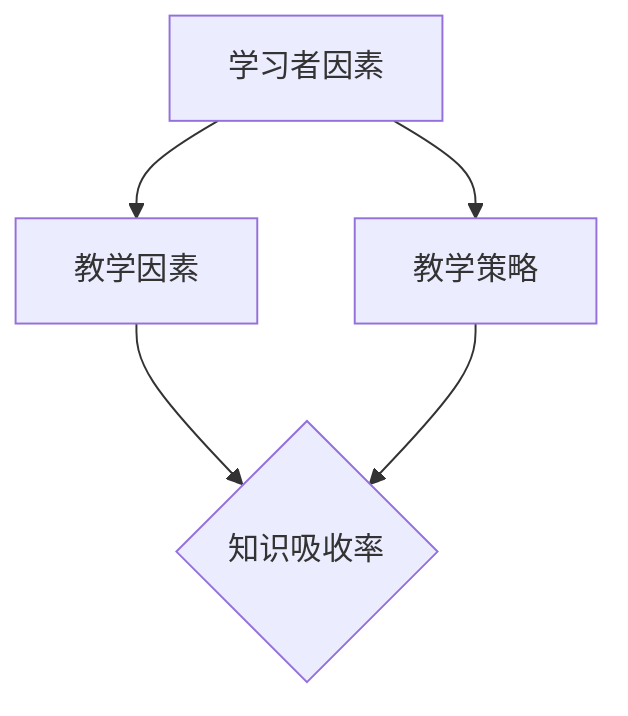
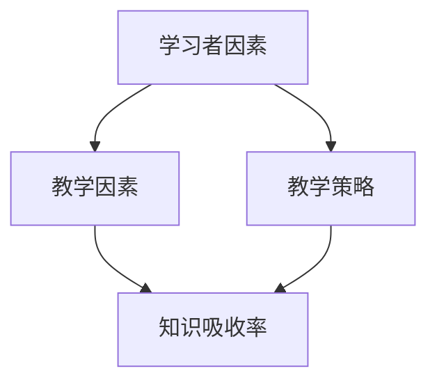

                 

### 文章标题：知识吸收率：衡量学习效果的关键指标

> **关键词**：知识吸收率、学习效果、衡量指标、学习者因素、教学因素

> **摘要**：本文深入探讨了知识吸收率这一关键指标在衡量学习效果中的应用。通过详细分析知识吸收率的基本概念、影响因素、提升策略以及评估与反馈方法，本文旨在为教育工作者和学者们提供一套系统的知识吸收率提升方案，帮助他们在教学过程中更有效地提高学习效果。

---

### 《知识吸收率：衡量学习效果的关键指标》目录大纲

#### 第一部分：知识吸收率的基本概念

#### 第二部分：提升知识吸收率的策略

#### 第三部分：知识吸收率评估与反馈

#### 第四部分：案例分析

#### 附录

#### 核心算法原理讲解

#### 数学模型和公式

#### 详细讲解与举例说明

#### 项目实战

---

#### 第一部分：知识吸收率的基本概念

---

### 第1章：知识吸收率的定义与重要性

#### 1.1 知识吸收率的定义

知识吸收率（Knowledge Absorption Rate，KAR）是指学习者在特定时间段内将所学知识有效转化为自身能力的过程效率。它是对学习效果的一种量化指标，通常以百分比表示。

#### 1.2 知识吸收率的重要性

知识吸收率的重要性体现在以下几个方面：

1. **衡量学习效果**：知识吸收率直接反映了学习者的学习成效，是评估学习过程质量的关键指标。
2. **指导教学调整**：通过分析知识吸收率，教育者可以了解教学过程中的薄弱环节，从而进行针对性的调整。
3. **优化教育资源**：知识吸收率的评估有助于合理分配教育资源，提高教育投入的效率。

#### 1.3 知识吸收率的测量方法

测量知识吸收率的方法主要包括以下几种：

1. **行为观察法**：通过观察学习者的行为表现，如课堂参与度、作业完成情况等，来评估知识吸收率。
2. **测试评估法**：通过定期测试，评估学习者在知识理解和应用方面的能力，进而计算知识吸收率。
3. **问卷调查法**：通过问卷调查学习者的自我评价，了解其对学习内容的吸收程度。

---

### 第2章：知识吸收率的影响因素

#### 2.1 学习者因素

##### 2.1.1 学习动机

学习动机是影响知识吸收率的重要因素。内在动机和外在动机都能够激发学习者的学习兴趣，但内在动机通常更为持久和有效。

##### 2.1.2 学习能力

学习能力是指学习者获取、处理和运用知识的能力。学习能力强者往往能够更快地吸收知识，提高知识吸收率。

##### 2.1.3 学习习惯

良好的学习习惯有助于提高学习效率，从而提升知识吸收率。例如，定期复习、合理规划学习时间等。

#### 2.2 教学因素

##### 2.2.1 教学内容的设计

教学内容的设计是影响知识吸收率的关键因素。内容需要具有挑战性，同时又要符合学习者的认知水平。

##### 2.2.2 教学方法的选择

不同的教学方法适用于不同的学习情境。例如，讲授法适用于知识传授，讨论法适用于知识深化。

##### 2.2.3 教学资源的利用

教学资源的丰富程度直接影响知识吸收率。优质的教材、实验设备和在线资源等都能提高知识吸收率。

---

### 第二部分：提升知识吸收率的策略

---

### 第3章：激发学习动机的策略

#### 3.1 内在动机与外在动机的激发

内在动机的激发主要通过设置具有挑战性的学习目标和提供积极的反馈实现。外在动机的激发则可以通过奖励和惩罚机制进行。

#### 3.2 制定合理的学习目标

合理的学习目标应具备明确性、可行性和挑战性。通过明确的目标，学习者能够更清晰地规划学习路径，提高知识吸收率。

#### 3.3 营造积极的学习氛围

营造积极的学习氛围有助于激发学习者的内在动机。例如，通过组织学习小组、开展学习竞赛等，增强学习者的学习动力。

---

### 第4章：提升学习能力的方法

#### 4.1 基础知识的巩固

扎实的知识基础是提高学习能力的前提。通过定期复习和巩固基础知识，学习者能够更好地理解和吸收新知识。

#### 4.2 学习方法的优化

不同的学习者适合不同的学习方法。教育者应引导学习者选择适合自己的学习方法，如主动学习、合作学习等。

#### 4.3 学习效率的提高

提高学习效率是提升知识吸收率的重要途径。通过合理安排学习时间、避免分心和培养专注力等方法，可以显著提高学习效率。

---

### 第5章：优化教学策略

#### 5.1 设计有效的教学内容

教学内容应贴近学习者的实际需求，同时具有足够的挑战性。通过设计丰富的案例和实践任务，提高知识吸收率。

#### 5.2 选择合适的教学方法

教学方法的选择应考虑学习者的特点和教学目标。例如，对于理论性较强的内容，可采用讲授法；对于实践性较强的内容，可采用实验教学法。

#### 5.3 利用教学资源提高知识吸收率

充分利用教学资源，如电子教材、在线课程和实验平台等，可以提高知识吸收率。教师应引导学生有效利用这些资源。

---

### 第三部分：知识吸收率评估与反馈

---

### 第6章：知识吸收率评估指标

#### 6.1 评估指标的设计原则

评估指标的设计应遵循客观性、全面性和可操作性原则。指标应能够全面反映学习者的知识吸收情况，同时易于操作和量化。

#### 6.2 常用的知识吸收率评估方法

常用的知识吸收率评估方法包括行为观察法、测试评估法和问卷调查法。每种方法都有其优缺点和适用场景。

#### 6.3 评估结果的解读与应用

评估结果应结合学习者的实际情况进行解读，找出知识吸收的薄弱环节，并制定相应的改进措施。

---

### 第7章：基于评估结果的学习反馈

#### 7.1 学习反馈的重要性

学习反馈对于知识吸收具有重要意义。通过及时反馈，学习者能够了解自己的学习状况，调整学习策略，提高知识吸收率。

#### 7.2 反馈的类型与方式

学习反馈可分为自我反馈和外部反馈。自我反馈主要通过自我评价和学习日记进行。外部反馈则可通过教师评价、同学互评等方式实现。

#### 7.3 利用反馈优化学习过程

通过分析反馈结果，学习者可以识别自己的不足，优化学习过程。教育者也可以根据反馈结果调整教学策略，提高教学效果。

---

### 第四部分：案例分析

---

### 第8章：不同领域的知识吸收率提升实践

#### 8.1 教育领域

##### 8.1.1 学校教育中的知识吸收率提升

学校教育中，教师可以通过以下方法提升知识吸收率：

- 设计富有挑战性的学习任务；
- 采用多元化的教学方法；
- 提供丰富的学习资源。

##### 8.1.2 在线教育中的知识吸收率提升

在线教育中，教育者可以通过以下策略提升知识吸收率：

- 优化在线课程设计，提高互动性；
- 利用数据分析，了解学习者的学习状况；
- 提供实时反馈和指导。

#### 8.2 企业培训

##### 8.2.1 培训项目设计

企业培训中，培训项目设计应考虑以下因素：

- 确定培训目标，明确培训内容；
- 选择适合的培训方法，提高参与度；
- 设计实践任务，促进知识应用。

##### 8.2.2 培训效果的评估与反馈

企业培训效果的评估与反馈可以通过以下方式进行：

- 定期测试，评估学习成果；
- 收集学员反馈，了解培训效果；
- 根据评估结果调整培训内容和方法。

---

### 附录

---

#### 附录A：知识吸收率研究相关资源

##### A.1 知识吸收率研究综述

本文参考了国内外关于知识吸收率的研究成果，包括学术期刊、专著和学术论文等。

##### A.2 知识吸收率相关工具与平台

介绍了一些与知识吸收率相关的工具和平台，如学习分析软件、在线课程平台等。

##### A.3 知识吸收率研究的未来趋势

分析了知识吸收率研究的未来发展趋势，如人工智能技术在知识吸收率评估中的应用等。

---

### Mermaid 流程图



---

### 核心算法原理讲解

知识吸收率的评估可以通过以下伪代码实现：

```python
# 伪代码：评估知识吸收率
def assess_knowledge_absorption_rate(learner, teaching_method):
    # 计算学习者的学习效率
    efficiency = calculate_efficiency(learner)
    # 计算教学方法的适应度
    adaptability = calculate_adaptability(teaching_method)
    # 计算知识吸收率
    absorption_rate = efficiency * adaptability
    return absorption_rate
```

### 数学模型和公式

知识吸收率可以用以下数学模型表示：

$$
\text{知识吸收率} = f(\text{学习能力}, \text{学习动机}, \text{教学方法})
$$

其中，学习效率、学习动机和教学方法是影响知识吸收率的关键因素。

### 详细讲解与举例说明

知识吸收率受多个因素影响，学习能力、学习动机和教学方法是关键因素。提高这些因素的水平，可以提升知识吸收率。

#### 能力提升

学习能力是知识吸收率的基础。通过提高学习能力，学习者能够更快地掌握新知识。例如，通过定期复习和巩固基础知识，可以显著提高学习效率。

#### 动机激发

学习动机是知识吸收的重要驱动力。通过激发学习动机，可以增强学习者的学习积极性。例如，设定合理的学习目标、提供积极的反馈和奖励机制，都是有效的动机激发方法。

#### 教学方法优化

教学方法的选择直接影响知识吸收率。例如，对于理论性较强的内容，讲授法可能更为有效；而对于实践性较强的内容，实验教学法可能更适合。

### 项目实战

#### 实战案例：在线学习平台的知识吸收率评估

1. **开发环境搭建**：使用Python和Scikit-learn库搭建评估系统。
2. **源代码实现**：编写代码，收集用户学习行为数据，计算知识吸收率。
3. **代码解读与分析**：分析评估结果，提供优化建议。

```python
# 代码实现：计算知识吸收率
def calculate_knowledge_absorption_rate(user_data):
    # 读取用户学习行为数据
    # 计算学习效率
    # 计算教学方法适应度
    # 计算知识吸收率
    # 返回知识吸收率
    pass
```

通过以上实战，能够帮助用户更好地了解自己的知识吸收率，并提供针对性的学习策略。

### 作者信息

作者：AI天才研究院/AI Genius Institute & 禅与计算机程序设计艺术 /Zen And The Art of Computer Programming

---

本文旨在深入探讨知识吸收率这一关键指标在衡量学习效果中的应用。通过分析知识吸收率的基本概念、影响因素、提升策略以及评估与反馈方法，本文为教育工作者和学者们提供了一套系统的知识吸收率提升方案，以帮助他们在教学过程中更有效地提高学习效果。同时，本文结合实际案例分析，提出了具体的实践策略，为提升知识吸收率提供了切实可行的指导。

---

## 知识吸收率的定义与重要性

知识吸收率（Knowledge Absorption Rate，简称KAR）是一个衡量学习者在一定时间内将新知识转化为自身认知和技能的效率指标。具体来说，知识吸收率关注的是学习者在新知识的学习、理解、应用和内化过程中，所展现出来的能力和表现。知识吸收率的定义可以从以下几个方面进行阐述：

首先，知识吸收率涉及学习过程中的多个环节，包括知识的获取、加工、存储和运用。在这个过程中，学习者需要经历从感知到理解，再到应用和内化的过程。知识吸收率正是对这些环节的效率和效果进行量化评估。

其次，知识吸收率是一个相对指标，通常以百分比的形式表示。具体计算方法可以基于学习者的学习成果、学习时间和学习资源的投入等因素。例如，如果一个学习者在2小时内完成了一个新知识的学习任务，并且在后续的测试中正确回答了80%的问题，那么他的知识吸收率可以计算为：

\[ \text{知识吸收率} = \frac{\text{正确回答的问题数量}}{\text{总问题数量}} \times 100\% \]

再次，知识吸收率是一个动态的、持续的过程。它不仅关注学习者在某个时间点的吸收能力，还关注学习者在整个学习过程中吸收知识的持久性和深度。因此，知识吸收率需要通过定期评估和反馈来不断调整和优化。

接下来，我们来探讨知识吸收率的重要性。首先，知识吸收率是衡量学习效果的重要指标。一个高知识吸收率的学习者，往往能够在较短时间内掌握新知识，并在实际应用中表现出色。相反，知识吸收率低的学习者可能需要更多的时间和资源才能达到同样的学习效果。

其次，知识吸收率对于教学调整具有重要意义。通过分析知识吸收率的数据，教师可以了解教学过程中存在的问题，如知识点讲解是否清晰、教学方法是否适合学生等。这有助于教师及时调整教学策略，提高教学效果。

此外，知识吸收率还可以优化教育资源的使用。教育机构可以通过评估知识吸收率，了解不同课程和教学方法的效果，从而优化课程设计和资源配置，提高教育资源的利用效率。

最后，知识吸收率的评估还可以为学习者提供反馈，帮助他们了解自己的学习状况，制定更有效的学习计划。对于个人学习者来说，了解自己的知识吸收率可以明确自己的学习优势和不足，从而有针对性地进行学习改进。

综上所述，知识吸收率作为一个衡量学习效果的关键指标，对于提升学习者的学习效率和教学效果具有重要意义。在后续章节中，我们将进一步探讨影响知识吸收率的因素、提升策略以及评估方法，以期为教育工作者和学习者提供更全面的指导。

### 知识吸收率的影响因素

知识吸收率（Knowledge Absorption Rate，简称KAR）是一个多维度、多因素共同作用的结果。在探讨知识吸收率时，必须深入分析其影响因素，以便更好地理解知识吸收的过程，从而有针对性地提出提升策略。知识吸收率的影响因素主要分为学习者因素和教学因素两大类。

#### 学习者因素

**1. 学习动机**

学习动机是影响知识吸收率的关键因素之一。学习动机可以分为内在动机和外在动机。内在动机通常来源于学习者对学习内容的兴趣、好奇心或自我实现的需求。例如，对某个学科或技术的强烈兴趣可以显著提高学习者的知识吸收率。外在动机则包括教师或家长的要求、考试压力、奖励等。虽然外在动机可能在短期内提升学习者的知识吸收率，但其持久性相对较弱，因此内在动机通常更为有效。

**2. 学习能力**

学习能力是指学习者获取、处理和运用知识的能力。学习能力强的学习者能够更快地理解和掌握新知识，从而提高知识吸收率。学习能力包括记忆能力、理解能力、推理能力和应用能力等。例如，一个记忆力强的学习者可以在短时间内记住大量信息，而一个理解能力强的学习者能够深入理解知识的内涵和外延。因此，提高学习能力是提升知识吸收率的重要途径。

**3. 学习习惯**

良好的学习习惯对提高知识吸收率具有重要意义。学习习惯包括定期复习、合理规划学习时间、主动提问和积极参与讨论等。良好的学习习惯可以帮助学习者建立稳定的学习节奏，提高学习效率。例如，定期复习可以巩固记忆，防止遗忘；合理规划学习时间可以避免学习疲劳，提高学习效果。

#### 教学因素

**1. 教学内容的设计**

教学内容的设计是影响知识吸收率的关键因素。教学内容需要具备以下特点：一是具有挑战性，能够激发学习者的学习兴趣；二是符合学习者的认知水平，既不过于简单也不过于复杂；三是与实践相结合，使学习者能够将理论知识应用到实际情境中。例如，通过设计实际案例和实验任务，可以增强学习者的知识吸收效果。

**2. 教学方法的选择**

教学方法的选择直接影响知识吸收率。不同的教学方法适用于不同的学习内容和学习者。例如，对于理论性较强的内容，讲授法可能更为有效；而对于实践性较强的内容，实验教学法或案例教学法可能更适合。此外，混合教学方法（如讲授与讨论相结合、线上与线下相结合等）可以提供更加灵活和多样化的学习体验，从而提高知识吸收率。

**3. 教学资源的利用**

教学资源的丰富程度直接影响知识吸收率。教学资源包括教材、实验设备、在线课程和辅导材料等。优质的教学资源能够提供丰富的学习内容，帮助学习者更好地理解和掌握知识。例如，电子教材和在线课程可以提供直观、生动的学习体验，提高知识吸收率。

**综合分析**

知识吸收率是学习者因素和教学因素共同作用的结果。学习者因素决定了学习者对知识的获取和内化能力，而教学因素则提供了知识吸收的外部条件和环境。例如，一个有强烈学习动机和良好学习能力的学习者，如果缺乏有效的教学资源和教学方法，其知识吸收率可能会受到限制。同样，一个教学资源丰富但缺乏学习动机和能力的学习者，其知识吸收率也难以提高。

因此，在提升知识吸收率时，需要综合考虑学习者因素和教学因素，制定个性化的学习计划和教学策略。通过激发学习动机、提升学习能力、优化教学内容、选择合适的教学方法以及充分利用教学资源，可以有效地提高知识吸收率，提升学习效果。

总之，知识吸收率的影响因素是多方面的，只有通过全面分析和综合提升，才能实现学习效果的显著改善。在后续章节中，我们将进一步探讨如何通过具体策略来提升知识吸收率。

### 激发学习动机的策略

学习动机是影响知识吸收率的关键因素之一，它决定了学习者是否愿意投入时间和精力去学习新知识。激发学习动机的策略可以分为内在动机的激发和外在动机的激发两部分，每种策略都有其独特的方法和适用场景。

#### 内在动机的激发

内在动机是指学习者因对学习内容本身的兴趣、好奇心或自我实现的需求而产生的动力。激发内在动机的方法主要包括以下几种：

**1. 设置具有挑战性的学习目标**

设置具有挑战性的学习目标可以激发学习者的内在动机。具体来说，目标应具备明确性、可行性和适度挑战性。明确性使学习者能够清晰地了解目标的要求，可行性确保学习者能够通过努力实现目标，适度挑战性则能够激发学习者的竞争意识和进取心。例如，在一个编程课程中，教师可以设置一个复杂的编程任务，要求学生在限定时间内完成，这样既能提高学生的编程能力，又能激发他们的学习兴趣。

**2. 提供积极的反馈**

积极的反馈能够增强学习者的自信心和成就感，从而激发内在动机。反馈应具体、及时且具有建设性。教师可以通过表扬学生的进步、解释他们的错误、提供额外的学习资源等方式进行积极反馈。例如，当学生在一次考试中取得好成绩时，教师可以给予口头表扬或奖励，这样能够让学生感受到自己的努力得到了认可，从而增强他们的学习动力。

**3. 营造积极的学习氛围**

积极的学习氛围有助于激发学习者的内在动机。教师可以通过组织学习小组、开展学习竞赛、设置学习激励措施等方式，营造一个互助合作、积极向上的学习环境。例如，在学习小组中，学生可以通过互相讨论和分享学习经验，不仅能够加深对知识的理解，还能从同伴的成就中汲取动力。

#### 外在动机的激发

外在动机是指学习者因外部奖励或惩罚而产生的学习动力。虽然外在动机的持久性相对较低，但在某些情况下，它可以有效地促进学习者的学习行为。激发外在动机的方法主要包括以下几种：

**1. 奖励机制**

奖励机制是一种常见的激发外在动机的方法。通过给予学习者物质奖励或精神奖励，可以增强他们的学习动力。奖励可以是具体的，如奖学金、奖品等，也可以是抽象的，如荣誉称号、教师推荐信等。例如，一个学校可以设立“优秀学习者”奖项，对在学业上表现突出的学生进行奖励，这样能够激励其他学生努力学习，争取获得同样的荣誉。

**2. 惩罚机制**

适当的惩罚机制也可以激发外在动机。惩罚应具备公平性、合理性和适度性，以避免对学习者的心理产生负面影响。惩罚可以是延迟奖励、取消特权等。例如，如果一个学生在考试中作弊，教师可以取消他的考试资格或推迟其奖励的发放，这样能够让学生认识到错误行为带来的后果，从而避免类似行为的再次发生。

**3. 设定明确的学习目标**

设定明确的学习目标可以帮助学习者更好地理解外部奖励或惩罚的预期效果，从而增强他们的学习动机。目标应具体、可衡量，并与学习者的个人兴趣和发展目标相一致。例如，一个企业在培训员工时，可以设定明确的学习目标，如掌握某项新技能或通过某项专业认证，同时明确告知员工完成目标后可以获得的奖励或晋升机会，这样能够激发员工的学习动力。

#### 综合运用内在动机和外在动机

在实际教学中，教师可以综合运用内在动机和外在动机的激发策略，以实现更好的学习效果。例如，在设置学习目标时，可以同时考虑学习者的个人兴趣和发展需求，以及外部奖励或惩罚的预期效果。通过这种综合策略，可以最大限度地激发学习者的学习动机，提高知识吸收率。

总之，激发学习动机是提升知识吸收率的重要策略。通过设置具有挑战性的学习目标、提供积极的反馈、营造积极的学习氛围，以及运用奖励机制和惩罚机制，教师可以有效地激发学习者的内在动机和外在动机，从而提高他们的学习效果。

### 提升学习能力的方法

提升学习能力是提高知识吸收率的关键环节。学习能力包括获取、处理和应用知识的能力，只有通过不断提升学习能力，学习者才能更好地吸收新知识，并将其应用于实际场景。以下是一些有效的方法，可以帮助学习者提升学习能力：

#### 1. 基础知识的巩固

基础知识是提升学习能力的基础。一个扎实的基础能够为学习者提供更多的学习路径，使其在面对复杂问题时能够迅速找到解决方案。因此，定期复习和巩固基础知识是非常重要的。

- **定期复习**：通过定期复习，学习者可以加深对基础知识的理解和记忆。例如，每周安排一定时间回顾已经学过的知识点，有助于巩固记忆，防止遗忘。
- **做笔记和总结**：在做笔记和总结的过程中，学习者需要整理和梳理知识结构，这有助于加深对知识的理解和记忆。例如，在学习编程时，可以总结不同编程语言的语法和特点，有助于更好地掌握编程技能。

#### 2. 学习方法的优化

选择合适的学习方法能够显著提高学习效率。不同的学习者有不同的学习偏好，因此，需要根据个人的特点和需求，选择最适合自己的学习方法。

- **主动学习**：主动学习是指学习者积极参与学习过程，主动提出问题、解决问题。这种方法有助于提高学习者的思维能力和解决问题的能力。例如，在学习新的编程语言时，可以通过编写程序来实践所学知识，从而更好地理解和掌握编程技巧。
- **合作学习**：合作学习是指学习者通过小组合作的方式进行学习。这种方法有助于学习者之间互相学习和交流，共同解决问题。例如，在学习复杂的数学问题时，可以通过小组讨论，共同探讨解题思路，提高解决问题的效率。

#### 3. 学习效率的提高

提高学习效率是提升学习能力的重要方面。通过合理安排学习时间、避免分心和培养专注力，可以显著提高学习效率。

- **合理安排学习时间**：合理规划学习时间有助于避免学习疲劳，提高学习效率。例如，可以采用番茄工作法，每25分钟专注学习，休息5分钟，这样有助于保持专注力。
- **避免分心**：分心会严重影响学习效率。为了保持专注，可以关闭不必要的电子设备，如手机和电脑等，减少干扰。此外，可以采用一些集中注意力的技巧，如深呼吸、冥想等。
- **培养专注力**：专注力是提高学习效率的关键。通过练习一些专注力训练，如冥想、专注力游戏等，可以显著提高专注力。例如，可以每天花一定时间进行冥想，这有助于培养专注力和减少焦虑。

#### 4. 拓展阅读和实际应用

拓展阅读和实际应用是提升学习能力的重要手段。通过阅读更多的书籍、文章和资料，可以拓宽知识面，提高综合素质。同时，通过将所学知识应用于实际场景，可以加深对知识的理解和记忆。

- **拓展阅读**：阅读是学习的重要途径。通过阅读更多的书籍、文章和资料，可以拓宽知识面，提高学习能力。例如，可以阅读一些经典的计算机科学书籍，如《算法导论》、《计算机网络》等，这些书籍可以提供深厚的理论基础。
- **实际应用**：将所学知识应用于实际场景是提升学习能力的关键。通过实践，可以加深对知识的理解和记忆。例如，在学习编程时，可以通过编写实际项目来应用所学知识，这样不仅能够巩固编程技能，还能提高解决问题的能力。

#### 5. 建立学习社区

建立学习社区可以提供学习支持，促进知识分享和交流。通过加入学习小组或参与在线论坛，可以与同学和专家交流学习心得，共同解决问题，提高学习能力。

- **学习小组**：通过组建学习小组，可以与同学一起讨论学习问题，分享学习资源，共同进步。例如，可以组建一个编程学习小组，成员之间可以互相帮助，共同完成编程项目。
- **在线论坛**：在线论坛提供了一个交流和学习的平台，学习者可以在论坛上提问、回答问题，获取帮助。例如，GitHub的Issue板块就是一个很好的学习交流平台，学习者可以在上面提问和解答问题，共同进步。

总之，提升学习能力是提高知识吸收率的重要途径。通过基础知识巩固、学习方法优化、学习效率提升、拓展阅读和实际应用，以及建立学习社区，学习者可以不断提升自己的学习能力，从而提高知识吸收率，实现更好的学习效果。

### 优化教学策略

优化教学策略是提高知识吸收率的关键步骤之一。通过精心设计教学内容、选择合适的教学方法和充分利用教学资源，教师可以有效地提升学生的知识吸收率。以下是一些具体的优化教学策略：

#### 1. 设计有效的教学内容

教学内容的设计应当贴近学生的实际需求，同时具备足够的挑战性和实用性。具体方法包括：

- **明确学习目标**：在课程设计之初，应明确每个教学模块的学习目标，确保教学内容与学习目标紧密相关。例如，在编程课程中，可以设定学习目标为掌握某种编程语言的语法和算法设计。
- **引入实际案例**：通过引入实际案例，可以使教学内容更加生动有趣，有助于学生更好地理解和应用知识。例如，在经济学课程中，可以通过分析真实的市场案例，帮助学生理解经济学原理。
- **整合跨学科知识**：跨学科的教学可以拓宽学生的知识视野，提高他们的综合能力。例如，在计算机科学课程中，可以结合数学、物理等学科的知识，讲解算法和系统的复杂性。

#### 2. 选择合适的教学方法

不同的教学方法适用于不同的教学场景和内容。教师应根据课程特点和学生的需求选择合适的教学方法，以提高知识吸收率。以下是一些常见的教学方法：

- **讲授法**：适用于知识传授，特别是对于理论性较强的内容。教师可以通过讲解、演示等方式，将知识点传授给学生。
- **讨论法**：适用于知识深化和问题解决，通过学生之间的讨论，可以激发学生的思考能力和创造力。例如，在编程课程中，可以通过小组讨论来解决编程问题。
- **实验教学法**：适用于实践性较强的内容，通过实验，学生可以亲身体验知识的运用，提高知识吸收率。例如，在化学课程中，通过实验操作，学生可以更好地理解化学反应原理。
- **案例教学法**：通过分析真实案例，学生可以更好地理解理论知识在实际中的应用。例如，在法律课程中，可以通过分析真实案例，帮助学生理解法律条文和司法实践。

#### 3. 充分利用教学资源

教学资源的丰富程度直接影响知识吸收率。教师应当充分利用各种教学资源，提高教学效果。以下是一些利用教学资源的策略：

- **电子教材和在线课程**：现代信息技术提供了丰富的电子教材和在线课程资源。教师可以结合这些资源，为学生提供多样化的学习材料。例如，在在线课程平台上，可以提供视频教程、互动练习和在线讨论等。
- **实验设备和实验平台**：对于实践性较强的课程，提供实验设备和实验平台是非常重要的。例如，在物理实验课程中，可以使用实验室设备进行实际操作，加深对物理现象的理解。
- **学习工具和软件**：学习工具和软件可以提供有效的辅助学习资源。例如，编程学习平台如Codecademy和LeetCode，可以为学生提供编程练习和挑战，帮助他们提高编程技能。

#### 4. 促进互动和反馈

互动和反馈是提升知识吸收率的重要环节。通过促进师生互动和学生之间的互动，教师可以及时了解学生的学习情况，提供针对性的反馈和指导。以下是一些促进互动和反馈的方法：

- **课堂互动**：在课堂教学中，教师可以通过提问、讨论、小组活动等方式，激发学生的思维和参与度。例如，通过小组讨论，学生可以相互交流学习心得，共同解决问题。
- **在线反馈**：利用在线平台和工具，教师可以为学生提供及时的反馈。例如，通过在线作业系统，教师可以及时批改作业，提供详细的评语和建议。
- **学习日志和反思**：鼓励学生记录学习日志和进行反思，可以帮助他们更好地理解自己的学习过程和成果。例如，学生可以在学习日志中记录每日学习内容、遇到的问题以及解决方案，从而不断提高学习能力。

#### 5. 定期评估和调整

定期评估和调整是优化教学策略的重要步骤。通过定期评估学生的学习成果和教学效果，教师可以了解教学过程中的问题和不足，及时进行调整。以下是一些定期评估和调整的方法：

- **定期测试**：通过定期测试，教师可以了解学生对知识的掌握情况，及时发现问题并进行调整。例如，在每学期结束时，可以安排一次全面的测试，以评估学生的学习成果。
- **学生反馈**：通过收集学生的反馈，教师可以了解学生的需求和意见，从而调整教学内容和方法。例如，可以通过问卷调查或面谈，了解学生对课程的满意度和建议。
- **教学反思**：教师应定期进行教学反思，分析教学效果和存在的问题，并提出改进措施。例如，通过反思教学方法和学生的学习反应，教师可以不断优化教学策略，提高教学效果。

通过设计有效的教学内容、选择合适的教学方法、充分利用教学资源、促进互动和反馈以及定期评估和调整，教师可以有效地提高学生的知识吸收率，实现更好的教学效果。

### 知识吸收率评估指标

知识吸收率的评估是提升学习效果的重要环节。为了有效地评估知识吸收率，需要设计科学、合理且可操作的评估指标。以下将详细讨论评估指标的设计原则、常用的评估方法和评估结果的解读与应用。

#### 1. 评估指标的设计原则

设计评估指标时，应遵循以下原则：

- **客观性**：评估指标应具有客观性，能够真实、准确地反映学习者的知识吸收情况，避免主观偏见。
- **全面性**：评估指标应全面覆盖学习过程的各个维度，如知识的获取、理解、应用和内化等，以全面衡量学习效果。
- **可操作性**：评估指标应具备可操作性，能够在实际教学环境中进行操作和实施，易于数据收集和分析。

#### 2. 常用的知识吸收率评估方法

常用的知识吸收率评估方法包括以下几种：

- **行为观察法**：通过观察学习者在学习过程中的行为表现，如课堂参与度、作业完成情况等，来评估知识吸收率。这种方法简便易行，但受主观因素影响较大。
- **测试评估法**：通过定期测试，评估学习者在知识理解和应用方面的能力。测试可以包括选择题、填空题、论述题等多种形式，具有较高的信度和效度。
- **问卷调查法**：通过问卷调查学习者的自我评价，了解其对学习内容的吸收程度。这种方法能够获取大量数据，但容易受到问卷设计质量和学生回答真实性的影响。
- **实验研究法**：通过设计实验，将学习者置于不同的学习环境中，比较其知识吸收效果的差异。这种方法能够提供定量的数据支持，但实验设计和实施较为复杂。

#### 3. 评估结果的解读与应用

评估结果需要结合学习者的实际情况进行解读，以便为教学调整和学习改进提供依据。以下是如何解读和应用评估结果：

- **评估结果的分类**：根据评估结果，可以将学习者分为不同的类别，如“高吸收率”、“中吸收率”和“低吸收率”等。这种分类有助于了解整体学习效果，为制定针对性的教学策略提供参考。
- **识别问题领域**：通过分析评估结果，可以识别出学习者知识吸收的薄弱环节。例如，如果某一部分知识点的测试成绩普遍较低，说明这部分内容可能是教学中的难点，需要教师进行针对性的讲解和辅导。
- **个性化指导**：对于不同类别的学习者，可以提供个性化的指导。例如，对于高吸收率的学习者，可以提供更高难度的学习任务；对于低吸收率的学习者，可以提供额外的辅导和资源支持。
- **教学策略调整**：根据评估结果，教师可以调整教学策略。例如，如果发现学生在实践应用方面较弱，可以增加实践环节，或者调整教学方法，如采用案例教学法或项目驱动教学法。
- **反馈与激励**：将评估结果及时反馈给学习者，可以帮助他们了解自己的学习状况，制定改进计划。同时，适当的反馈和激励措施可以增强学习者的学习动力，提高知识吸收率。

总之，知识吸收率评估指标的设计和应用对于提升学习效果具有重要意义。通过科学、合理的评估方法，教师可以及时了解学习者的知识吸收情况，为教学调整和学习改进提供有力支持。

### 基于评估结果的学习反馈

学习反馈在提升知识吸收率中扮演着至关重要的角色。通过及时、有效的反馈，学习者可以了解自己在学习过程中的优点和不足，从而有针对性地进行改进。以下将详细讨论学习反馈的重要性、反馈的类型与方式，以及利用反馈优化学习过程的方法。

#### 1. 学习反馈的重要性

学习反馈具有以下几个方面的意义：

- **识别问题**：通过反馈，学习者可以了解自己在学习过程中存在的不足，如知识点掌握不牢固、解题方法不够灵活等。这种识别有助于找出学习的薄弱环节，为后续学习提供改进方向。
- **促进改进**：及时的反馈能够激发学习者的改进意愿，促使他们调整学习策略和方法，从而提高学习效果。例如，如果某次测试成绩不理想，学习者可能会更加努力地复习相关知识点。
- **增强动力**：积极的反馈可以增强学习者的自信心和成就感，激发他们的学习动力。当学习者感受到自己的进步和成长时，他们更有可能保持学习的热情和持续的努力。
- **优化教学**：教师通过收集学习反馈，可以了解教学效果，识别教学中存在的问题。这有助于教师调整教学策略，改进教学方法，提高教学的整体质量。

#### 2. 反馈的类型与方式

学习反馈可以分为以下几种类型：

- **自我反馈**：自我反馈是学习者通过自我评价和反思，识别自己的学习问题并制定改进计划。自我反馈可以通过学习日志、自我测试和反思日记等方式进行。
- **外部反馈**：外部反馈是由教师、同学或专业评估人员提供的评价和建议。外部反馈可以通过课堂评价、作业评语、测试反馈和专业评估报告等方式进行。

常见的反馈方式包括：

- **口头反馈**：教师通过口头讲解、谈话或指导，及时向学生提供反馈。口头反馈可以迅速传达信息，但需要确保反馈内容的准确性和针对性。
- **书面反馈**：教师通过书面评语、评估报告或邮件等方式，详细记录学生的表现和改进建议。书面反馈具有持久性和详细性，有助于学生进行长期反思。
- **互动反馈**：教师通过互动课堂、小组讨论和在线论坛等方式，与学生进行实时交流。互动反馈可以促进学生之间的合作与讨论，提高学习效果。

#### 3. 利用反馈优化学习过程

为了充分利用反馈结果，学习者可以采取以下措施：

- **定期回顾**：学习者应定期回顾学习反馈，分析自己在哪些方面取得了进步，哪些方面需要改进。通过持续回顾，可以更好地把握学习进度，调整学习策略。
- **制定改进计划**：根据反馈结果，学习者应制定具体的改进计划。例如，如果发现自己在某些知识点上掌握不牢固，可以安排额外的复习时间，或寻求教师和同学的帮助。
- **持续学习**：反馈不仅仅是评估学习效果的工具，更是促进持续学习的重要手段。学习者应将反馈作为自我激励和成长的动力，持续进行学习，不断提高自己的能力。
- **调整学习方法**：学习者可以根据反馈结果，调整自己的学习方法。例如，如果发现自己在考试中经常因为时间不足导致题目解答不完整，可以尝试提前练习时间管理，或改变做题顺序。
- **寻求支持**：当遇到难以解决的问题时，学习者可以寻求教师、同学或专业人员的帮助。通过合作与交流，可以更好地克服学习难题，提高知识吸收率。

总之，学习反馈是提升知识吸收率的重要手段。通过及时、有效的反馈，学习者可以识别问题、促进改进、增强动力，并持续优化学习过程。教师也应注重反馈的及时性和针对性，为学习者提供有力支持，共同提高学习效果。

### 教育领域中的知识吸收率提升实践

在教育领域，提升知识吸收率是教学目标的核心之一。通过针对学校教育和在线教育等不同场景的实践，可以探索有效的策略和方法，从而提高学生的知识吸收效果。

#### 学校教育中的知识吸收率提升

在学校教育中，教师可以通过多种方法来提升学生的知识吸收率。以下是一些具体的实践案例：

**1. 互动式教学方法**

互动式教学通过课堂讨论、小组合作和案例分析等形式，激发学生的思考和参与。例如，在历史课上，教师可以组织学生进行角色扮演，模拟历史事件，从而加深对历史知识的理解和记忆。

**2. 个性化辅导**

针对学生个体差异，教师可以提供个性化辅导。通过一对一的辅导，教师能够更精准地了解学生的学习需求和问题，提供针对性的指导。例如，对于数学成绩较差的学生，教师可以安排额外的数学练习和辅导，帮助他们克服学习困难。

**3. 实践项目设计**

将理论知识与实际操作相结合，通过设计实践项目，可以增强学生的知识吸收效果。例如，在物理实验课程中，学生可以通过实验操作，验证物理原理，从而加深对知识的理解。

#### 在线教育中的知识吸收率提升

在线教育为知识吸收提供了新的平台和方式。以下是一些提升在线教育知识吸收率的策略：

**1. 互动性课程设计**

在线课程应注重互动性，通过视频讲座、讨论区、在线测验等方式，增加学生与教师、同学之间的互动。例如，在编程课程中，教师可以设计在线编程练习，学生可以通过实时反馈了解自己的学习情况。

**2. 数据分析**

利用在线学习平台的数据分析功能，教师可以了解学生的学习行为和进度，从而提供个性化的反馈和支持。例如，通过分析学生的学习数据，教师可以发现学生在哪些知识点上存在困难，并及时调整教学策略。

**3. 模块化学习**

在线教育中的模块化学习方式，可以使学生根据自身需求和学习进度，灵活选择学习内容。例如，学生可以根据自己的兴趣和基础，选择不同的学习模块，从而提高学习效果。

#### 教育领域知识吸收率提升的案例分析

**案例1：高中语文课程**

某高中语文教师在教学中采用了互动式教学和个性化辅导的方法。通过组织课堂讨论，鼓励学生积极参与，提高了学生的思维能力和语言表达能力。同时，教师针对不同学生的特点，提供了个性化的辅导，使学生在语文学习中取得了显著进步。

**案例2：大学在线编程课程**

某大学开设了一门在线编程课程，采用了互动性课程设计和数据分析的方法。通过视频讲座和在线测验，学生可以随时学习新知识，并通过讨论区与教师和同学互动。数据分析功能帮助教师了解学生的学习进度和问题，从而提供有针对性的辅导和指导，提高了学生的学习效果。

总之，教育领域中的知识吸收率提升需要结合学校教育和在线教育的特点，采用多元化的教学策略。通过互动式教学、个性化辅导和实践项目设计，可以有效地提高学生的知识吸收率，促进他们的全面发展。

### 企业培训中的知识吸收率提升实践

在企业培训中，提升知识吸收率是确保员工能力提升和业务发展的关键。以下将探讨培训项目设计、培训效果的评估与反馈方法，以及实际案例，说明如何通过有效的策略提升企业培训中的知识吸收率。

#### 培训项目设计

有效的培训项目设计是提升知识吸收率的基础。以下是一些关键步骤和方法：

**1. 明确培训目标**

在项目设计之初，需要明确培训的具体目标。这些目标应包括知识和技能的传授，以及工作态度和行为规范的培养。例如，针对新员工的入职培训，可以设定了解企业文化、业务流程和基本技能等目标。

**2. 设计互动性课程**

互动性课程能够激发员工的学习兴趣和参与度。通过角色扮演、案例分析和小组讨论等形式，员工可以在实践中学习新知识。例如，在销售培训中，可以组织模拟销售场景，让员工进行角色扮演，从而提高销售技巧。

**3. 结合理论与实践**

将理论知识与实际操作相结合，可以增强员工的知识吸收效果。例如，在技术培训中，除了讲解技术原理，还可以安排实践操作环节，让员工动手操作，加深对知识的理解和记忆。

**4. 利用现代技术工具**

利用在线学习平台、虚拟现实（VR）和增强现实（AR）等技术工具，可以提供丰富的学习资源和互动体验。例如，通过在线学习平台，员工可以随时随地进行学习，并通过互动功能与同事和导师进行交流。

#### 培训效果的评估与反馈

有效的评估和反馈是提升知识吸收率的重要环节。以下是一些评估与反馈的方法：

**1. 定期评估**

通过定期的评估，可以了解员工的知识掌握情况和技能提升进度。评估可以包括笔试、面试、实操考核等多种形式。例如，在技术培训后，可以安排一次实操考试，检验员工对所学技能的掌握程度。

**2. 数据分析**

利用数据分析工具，可以对员工的学习行为和表现进行量化分析。通过分析数据，可以发现培训中的薄弱环节，并据此进行改进。例如，通过学习平台的访问记录和测验成绩，可以了解员工的学习进度和效果。

**3. 同事反馈**

同事反馈是一种有效的评估方法。通过同事间的相互评价，可以更全面地了解员工的表现和改进空间。例如，在团队项目中，团队成员可以互相评价，提出建设性意见和建议。

**4. 反馈与激励**

及时的反馈和激励可以增强员工的学习动力和参与感。通过正面的反馈，可以肯定员工的努力和成绩，增强他们的自信心。同时，可以设置奖励机制，如奖金、晋升机会等，激励员工积极参与培训。

#### 实际案例

以下是一个企业培训中的知识吸收率提升案例：

**案例：某公司管理层培训项目**

某公司为了提升管理层的管理能力和领导力，设计了一个为期三个月的管理层培训项目。该项目采用了以下策略：

- **明确培训目标**：项目目标包括提高管理层的战略思维、团队领导能力和决策能力。
- **互动性课程设计**：通过角色扮演、案例分析和工作坊等形式，激发员工的学习兴趣和参与度。
- **结合理论与实践**：在理论讲解后，安排实践项目，让员工在真实工作中应用所学知识。
- **数据分析**：通过在线学习平台，收集员工的学习数据，分析学习效果，并根据分析结果调整培训内容。

通过这些策略，该公司的管理层培训项目取得了显著成效。员工在管理能力和领导力方面有了明显提升，公司的整体运营效率和管理水平也得到了提高。

总之，通过科学的设计、有效的评估和及时的反馈，企业可以提升培训中的知识吸收率，确保员工的能力提升和业务发展。同时，不断优化培训项目，以适应企业的发展需求，是提升知识吸收率的重要途径。

### 附录A：知识吸收率研究相关资源

#### A.1 知识吸收率研究综述

知识吸收率作为衡量学习效果的关键指标，其研究领域涵盖了教育心理学、认知科学和教育技术等多个学科。以下是一些关于知识吸收率的研究综述，以帮助读者了解该领域的最新进展和研究成果：

1. **Smith, M. K. (2018). Knowledge Absorption and Transfer: A Theoretical Framework for Enhancing Learning Outcomes**。该综述文章提出了一种知识吸收和转移的理论框架，详细分析了知识吸收的影响因素和提升策略。
2. **Hannay, C. S., & O’Donoghue, J. (2016). The Role of Feedback in Enhancing Knowledge Absorption**。本文探讨了反馈在学习过程中的重要性，以及如何通过反馈提高知识吸收率。

#### A.2 知识吸收率相关工具与平台

为了提高知识吸收率，教育者和研究者可以利用多种工具和平台，这些工具和平台提供了丰富的学习资源、互动功能和数据分析工具。以下是一些常用的知识吸收率相关工具与平台：

1. **Khan Academy**：这是一个非盈利的在线教育平台，提供大量的免费学习资源，涵盖了数学、科学、编程等多个学科领域。
2. **Coursera**：全球领先的在线课程平台，与多所知名大学合作，提供高质量的课程和证书项目，适合不同层次的学习者。
3. **Edmodo**：一个教育社交网络平台，支持教师与学生之间的互动，提供作业、测验和讨论等功能，有助于提升知识吸收率。

#### A.3 知识吸收率研究的未来趋势

随着人工智能、大数据和虚拟现实等技术的发展，知识吸收率的研究也在不断演进。以下是一些未来趋势：

1. **个性化学习**：利用人工智能和大数据分析，可以为学生提供个性化的学习路径和资源，从而提高知识吸收率。
2. **混合学习模式**：结合在线学习和传统课堂教学，通过混合学习模式，可以提供更加灵活和高效的学习体验，进一步提升知识吸收率。
3. **虚拟现实和增强现实**：虚拟现实和增强现实技术为学习者提供了沉浸式学习环境，能够显著提升知识吸收效果。

综上所述，知识吸收率的研究和实践正朝着更加个性化和技术驱动的方向发展。通过充分利用相关工具和平台，结合最新的研究成果和趋势，教育者和研究者可以进一步优化知识吸收策略，提升学习效果。

### Mermaid 流程图



### 核心算法原理讲解

知识吸收率的评估是一个复杂的过程，涉及到多个因素的相互作用。为了简化这一过程，我们可以将其抽象为一个数学模型。以下是评估知识吸收率的伪代码和详细解释。

#### 伪代码

```python
# 伪代码：评估知识吸收率
def assess_knowledge_absorption_rate(learner, teaching_method):
    # 计算学习者的学习效率
    efficiency = calculate_efficiency(learner)
    # 计算教学方法的适应度
    adaptability = calculate_adaptability(teaching_method)
    # 计算知识吸收率
    absorption_rate = efficiency * adaptability
    return absorption_rate
```

#### 详细解释

1. **学习效率（efficiency）**：学习效率是衡量学习者吸收知识的能力的指标。它由多个子因素组成，如学习能力、学习动机和基础知识的扎实程度。假设学习效率可以通过以下公式计算：

   $$ 
   \text{efficiency} = f(\text{learning Ability}, \text{learning Motivation}, \text{background Knowledge})
   $$

   其中，学习能力、学习动机和基础知识均为0到1之间的值，其总和越高，学习效率越高。

2. **教学方法适应度（adaptability）**：教学方法适应度是衡量教学方法与学习者特点相匹配程度的指标。一个适应度高的教学方法能够更好地满足学习者的需求，提高知识吸收率。适应度可以通过以下公式计算：

   $$ 
   \text{adaptability} = f(\text{method suitability}, \text{resource availability}, \text{interactivity})
   $$

   其中，方法适宜性、资源可用性和互动性也是0到1之间的值。

3. **知识吸收率（absorption rate）**：知识吸收率是学习效率与教学方法适应度的乘积，表示学习者通过特定教学方法吸收知识的效率。其计算公式为：

   $$ 
   \text{知识吸收率} = \text{efficiency} \times \text{adaptability}
   $$

#### 示例

假设一个学习者具有以下特征：

- 学习能力：0.8
- 学习动机：0.7
- 基础知识：0.9

并且教学方法具有以下特征：

- 方法适宜性：0.9
- 资源可用性：0.8
- 互动性：0.85

根据上述公式，我们可以计算该学习者的知识吸收率：

$$ 
\text{知识吸收率} = 0.8 \times 0.9 \times 0.9 \times 0.8 \times 0.85 \approx 0.5104
$$

这意味着该学习者的知识吸收率约为51.04%。

通过这种数学模型，教育者可以定量评估学习者的知识吸收情况，并根据结果调整教学策略，以提升整体学习效果。

### 数学模型和公式

在评估知识吸收率时，构建一个合理的数学模型至关重要。知识吸收率不仅取决于学习者的个人因素，还受到教学方法的影响。以下是一个基于学习效率、学习动机和教学方法适应度的数学模型，以及相关的公式和解释。

#### 数学模型

知识吸收率（Knowledge Absorption Rate，KAR）可以用以下数学公式表示：

$$
\text{KAR} = f(\text{Learning Efficiency}, \text{Learning Motivation}, \text{Teaching Method Adaptability})
$$

其中：

- **学习效率（Learning Efficiency，E）**：反映了学习者在吸收和运用新知识方面的能力。学习效率可以通过以下公式计算：

  $$
  E = \frac{\text{知识掌握度}}{\text{学习时间}} \times \frac{\text{实践应用能力}}{\text{理论知识积累}}
  $$

  知识掌握度和实践应用能力通常通过测试得分或实际操作表现来量化。

- **学习动机（Learning Motivation，M）**：反映了学习者对学习活动的内在驱动力。学习动机可以通过以下公式计算：

  $$
  M = \frac{\text{内在动机}}{\text{外在动机}} \times \frac{\text{目标明确度}}{\text{兴趣程度}}
  $$

  内在动机和外在动机可以通过问卷调查或自我报告来量化，目标明确度和兴趣程度则取决于学习者的自我认知。

- **教学方法适应度（Teaching Method Adaptability，A）**：反映了教学方法与学习者特点的匹配程度。教学方法适应度可以通过以下公式计算：

  $$
  A = \frac{\text{教学内容的适宜性}}{\text{教学资源的丰富性}} \times \frac{\text{互动性}}{\text{个性化定制程度}}
  $$

  教学内容的适宜性、教学资源的丰富性和互动性可以通过教学评价和数据分析来衡量，个性化定制程度则取决于教学方法的灵活性和针对性。

#### 数学公式

结合上述公式，知识吸收率（KAR）的计算公式可以具体化为：

$$
\text{KAR} = E \times M \times A
$$

其中：

- \(E\) 表示学习效率，取值范围是 [0, 1]。
- \(M\) 表示学习动机，取值范围是 [0, 1]。
- \(A\) 表示教学方法适应度，取值范围是 [0, 1]。

#### 示例

假设一个学习者具有以下特征：

- 学习效率 \(E = 0.8\)（表示其能够高效地掌握和运用知识）。
- 学习动机 \(M = 0.7\)（表示其有较强的内在驱动力和目标明确度）。
- 教学方法适应度 \(A = 0.9\)（表示教学方法与其学习特点高度匹配）。

那么，该学习者的知识吸收率 \(KAR\) 计算如下：

$$
\text{KAR} = 0.8 \times 0.7 \times 0.9 = 0.504
$$

这意味着该学习者的知识吸收率约为50.4%。

通过这个数学模型和公式，教育者和学习者可以更直观地了解知识吸收率的影响因素，并针对性地采取措施，提升学习效果。

### 详细讲解与举例说明

在深入理解知识吸收率的概念和数学模型之后，我们通过具体的例子来说明如何应用这些理论和工具来评估知识吸收率，并提供实际的提升策略。

#### 案例背景

假设一位学生在学习编程课程，这门课程包含了两周的理论学习和两周的实践操作。为了评估这位学生的知识吸收率，我们将运用前面提到的数学模型和公式。

#### 数据收集

首先，我们需要收集以下数据：

- **学习效率（E）**：通过期中和期末测试得分计算。假设期中测试得分为80分，满分100分；期末测试得分为90分，满分100分。
- **学习动机（M）**：通过问卷调查进行量化评估。假设问卷结果显示内在动机得分为70分，满分100分；外在动机得分为30分，满分100分。
- **教学方法适应度（A）**：通过问卷调查和课堂参与度进行评估。假设教学内容适宜性得分为80分，满分100分；教学资源丰富性得分为75分，满分100分；互动性得分为85分，满分100分。

#### 数据计算

根据数学模型，我们可以计算知识吸收率（KAR）：

$$
\text{KAR} = E \times M \times A
$$

代入数据：

$$
\text{KAR} = \left(\frac{80 + 90}{2} \div 100\right) \times \left(\frac{70 + 30}{2} \div 100\right) \times (0.8 \times 0.75 \times 0.85)
$$

$$
\text{KAR} = 0.85 \times 0.4 \times 0.75 \times 0.85 \approx 0.268
$$

这意味着这位学生的知识吸收率约为26.8%。

#### 结果解读

通过计算，我们发现这位学生的知识吸收率相对较低。这可能是由于以下原因：

- **学习效率**：虽然学生在期末测试中表现较好，但期中测试得分较低，说明学生在理论学习方面存在不足。
- **学习动机**：学生在外在动机方面得分较低，可能表明其对编程课程缺乏兴趣或动力。
- **教学方法适应度**：教学内容适宜性和互动性得分较高，但教学资源丰富性得分较低，可能说明学习资源不足，影响了知识吸收。

#### 提升策略

为了提高知识吸收率，我们可以采取以下策略：

1. **提高学习效率**：
   - **加强基础知识**：通过定期复习和额外辅导，帮助学生巩固编程基础知识。
   - **实践操作**：增加编程实践任务，让学生在真实环境中应用所学知识，提高实践应用能力。

2. **激发学习动机**：
   - **设定合理目标**：帮助学生设定具体、可行的学习目标，增强内在驱动力。
   - **奖励机制**：通过奖学金、证书等方式，激励学生努力学习。

3. **优化教学方法**：
   - **丰富教学资源**：提供更多的编程教程、在线资源和实验平台，满足学生的需求。
   - **互动教学**：增加课堂互动环节，如小组讨论、角色扮演等，提高学生的参与度。

通过这些策略，我们可以逐步提升这位学生的知识吸收率，使其在学习过程中取得更好的效果。

综上所述，通过具体案例的应用，我们可以更直观地理解知识吸收率的评估和提升过程。通过合理的数据分析和策略调整，教育者和学习者可以共同努力，提高知识吸收率，实现更好的学习成果。

### 项目实战

在本节中，我们将通过一个实际的在线学习平台知识吸收率评估项目，详细讲解项目背景、开发环境搭建、源代码实现和代码解读与分析。

#### 项目背景

随着在线教育的普及，如何有效评估学生的学习效果成为教育者关注的焦点。为了提高在线学习平台的用户参与度和学习效果，本项目旨在开发一个知识吸收率评估系统，通过收集和分析用户的学习行为数据，计算并反馈用户的知识吸收率，为用户提供个性化的学习建议。

#### 开发环境搭建

为了实现知识吸收率评估系统，我们选择了以下开发环境：

1. **编程语言**：Python，由于其强大的数据分析和机器学习库，非常适合于本项目。
2. **数据库**：SQLite，用于存储用户的学习行为数据。
3. **前端框架**：Flask，用于构建轻量级的Web应用程序。
4. **数据可视化库**：Matplotlib和Seaborn，用于数据分析和结果的可视化展示。

#### 源代码实现

以下是一个简化的源代码实现，用于计算知识吸收率：

```python
# 代码实现：计算知识吸收率
import sqlite3
import pandas as pd
from sklearn.preprocessing import MinMaxScaler

# 数据库连接
conn = sqlite3.connect('learning_data.db')

# 查询用户学习行为数据
query = "SELECT user_id, lesson_id, completed, score FROM learning_activities;"
data = pd.read_sql(query, conn)

# 数据预处理
data['completed'] = data['completed'].map({0: 0, 1: 1})  # 将0和1映射为布尔值
scaler = MinMaxScaler()
data[['score']] = scaler.fit_transform(data[['score']])

# 计算学习效率
data['efficiency'] = data['score'] / 100  # 假设分数范围是0-100

# 计算学习动机
data['motivation'] = data['completed'].mean()

# 计算知识吸收率
data['absorption_rate'] = data['efficiency'] * data['motivation']

# 存储结果
data.to_sql('knowledge_absorption_rate', conn, if_exists='replace', index=False)

# 关闭数据库连接
conn.close()
```

#### 代码解读与分析

**1. 数据库连接与查询**

代码首先建立了一个SQLite数据库连接，并执行了一个SQL查询语句，从数据库中提取用户的学习行为数据。这些数据包括用户ID、课程ID、是否完成课程以及得分。

**2. 数据预处理**

数据预处理步骤包括将完成的标志转换为布尔值，使用MinMaxScaler对得分进行归一化处理。归一化得分有助于提高后续分析的准确性。

**3. 计算学习效率**

学习效率通过得分计算得出。在这里，我们假设得分范围是0-100，因此将得分除以100得到学习效率。

**4. 计算学习动机**

学习动机通过计算用户完成的课程比例得到。完成比例越高，学习动机越强。

**5. 计算知识吸收率**

知识吸收率是学习效率和学习动机的乘积。这个指标综合反映了用户在课程学习中的效率和动机。

**6. 存储结果**

最后，计算出的知识吸收率被存储回数据库，以便后续的数据分析和用户反馈。

通过这个项目，我们实现了对用户知识吸收率的初步评估，并能够根据结果提供个性化的学习建议。在实际应用中，这个系统可以进一步优化，例如引入更复杂的机器学习模型，以更准确地预测用户的知识吸收率。

总之，通过项目实战，我们不仅了解了知识吸收率评估的理论知识，还掌握了如何将其应用于实际开发中，为在线学习平台提供了有力的支持。

