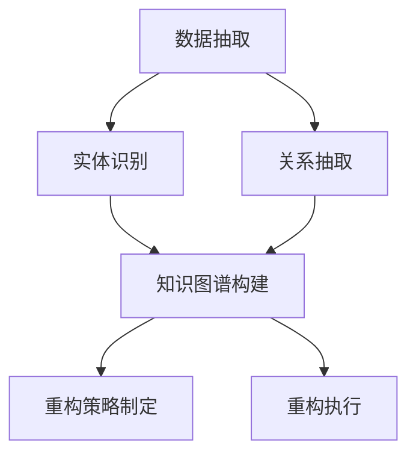

                 

# 《知识图谱在代码重构中的辅助应用》

## 关键词

知识图谱，代码重构，实体识别，关系抽取，算法原理，项目实战，代码优化

## 摘要

随着软件系统的复杂度不断增加，代码重构成为软件维护中的一项关键任务。本文探讨了知识图谱在代码重构中的应用，通过详细的理论讲解和实战案例，展示了知识图谱如何辅助开发人员更好地理解代码结构，发现潜在的优化点和重构机会。文章从知识图谱的基础概念出发，逐步深入到知识图谱在代码重构中的实际应用，包括核心算法原理的讲解、数学模型的阐述以及项目实战的展示，旨在为读者提供一套完整的知识图谱在代码重构中应用的解决方案。

## 引言

在软件工程领域，代码重构是指在不改变外部行为的前提下，改进代码的内部结构，以提高其可读性、可维护性和性能。随着软件系统规模的不断扩大，代码的复杂度也随之增加，这使得代码重构变得尤为重要。然而，传统的代码重构方法往往依赖于开发人员的经验和直觉，难以全面、准确地识别出代码中的潜在问题。知识图谱作为一种结构化的知识表示方式，通过实体和关系的表示，将大量的半结构化和非结构化数据进行有效的组织和关联，为代码重构提供了一种全新的辅助手段。

本文旨在探讨知识图谱在代码重构中的辅助应用，通过详细的理论讲解和实战案例，帮助读者深入理解知识图谱在代码重构中的重要性。本文结构如下：

1. **知识图谱基础**：介绍知识图谱的基本概念、架构和模型，以及主流知识图谱技术。
2. **知识图谱构建**：讨论知识图谱的数据采集与预处理、实体识别与抽取以及关系抽取与建模。
3. **知识图谱应用场景**：分析知识图谱在代码库搜索与导航、代码质量检测和代码优化与重构中的应用。
4. **知识图谱在代码重构中的应用**：阐述知识图谱与代码重构的关系、核心算法原理、数学模型和项目实战。
5. **总结与展望**：总结知识图谱在代码重构中的应用现状与趋势，并探讨未来研究方向与挑战。

### 第一部分：知识图谱基础

#### 第1章：知识图谱概述

知识图谱（Knowledge Graph）是一种用于表达实体及其之间复杂关系的语义网络。它通过将实体和关系进行结构化表示，将海量的半结构化和非结构化数据转化为易于理解和处理的形式。

**1.1 知识图谱的核心概念**

- **实体（Entity）**：知识图谱中的基本元素，表示现实世界中的各种对象，如人、地点、组织、物品等。
- **关系（Relation）**：实体之间的关联，表示实体之间的相互作用或属性关系，如“属于”、“位于”、“生产”等。
- **属性（Attribute）**：实体的特征或属性，如人的年龄、地点的纬度等。

**1.2 知识图谱的架构与模型**

- **层次化知识图谱**：通过将实体和关系组织成层次结构，实现知识的分级和分类。例如，将实体划分为人、地点、组织等大类，再进一步细分为子类。
- **面向属性的图模型**：以实体为中心，通过实体和属性之间的关联构建图模型。这种模型能够更好地表示实体的复杂属性和关系。

**1.3 主流知识图谱技术**

- **RDF（Resource Description Framework）**：一种基于图形模型的数据模型，用于描述实体和关系。RDF通过主体（Subject）、谓词（Predicate）和对象（Object）三元组来表示知识。
- **OWL（Web Ontology Language）**：一种基于RDF的语言，用于定义类、属性和个体之间的语义关系。OWL提供了丰富的描述能力，可以用于构建复杂的知识图谱。
- **Neo4j**：一种高性能的图形数据库，支持图遍历和关系查询。Neo4j通过图结构存储和查询知识图谱，具有高效的查询性能和扩展性。

#### 第2章：知识图谱构建

知识图谱的构建是一个复杂的过程，涉及数据采集、预处理、实体识别与抽取以及关系抽取与建模等多个步骤。

**2.1 数据采集与预处理**

数据采集是构建知识图谱的第一步，需要从各种数据源中获取相关的信息。数据源可以是结构化的数据库、半结构化的XML文件、非结构化的文本数据等。数据预处理包括数据清洗、去重、转换等操作，以提高数据的准确性和一致性。

- **数据清洗**：去除数据中的噪声和错误，如删除重复记录、填补缺失值等。
- **数据转换**：将不同格式的数据统一转换为适合构建知识图谱的格式，如RDF或OWL。

**2.2 实体识别与抽取**

实体识别与抽取是指从原始数据中识别出实体，并将其转换为知识图谱中的实体。实体识别可以基于规则的方法，如通过模式匹配识别出特定的实体类型；也可以基于机器学习的方法，如使用分类器对文本数据进行实体分类。

- **基于规则的方法**：通过预定义的规则，从文本数据中抽取实体。这种方法简单高效，但需要大量的规则维护。
- **基于机器学习的方法**：使用机器学习算法，如朴素贝叶斯、支持向量机等，对文本数据进行实体分类。这种方法能够自动学习实体识别规则，但需要大量的训练数据和计算资源。

**2.3 关系抽取与建模**

关系抽取与建模是指从原始数据中识别出实体之间的关系，并将其表示为知识图谱中的关系。关系抽取可以基于规则的方法，如通过模式匹配识别出特定的关系；也可以基于深度学习的方法，如使用循环神经网络（RNN）或变换器（Transformer）等模型。

- **基于规则的方法**：通过预定义的规则，从文本数据中抽取关系。这种方法简单高效，但需要大量的规则维护。
- **基于深度学习的方法**：使用深度学习算法，如长短期记忆（LSTM）、变换器（Transformer）等，对文本数据进行关系分类。这种方法能够自动学习关系抽取规则，但需要大量的训练数据和计算资源。

### 第二部分：知识图谱在代码重构中的应用

#### 第3章：知识图谱在代码库搜索与导航中的应用

在软件工程中，代码库是一个包含大量代码文件和模块的重要资源。有效的代码库搜索与导航可以帮助开发人员快速定位到所需的代码段，提高开发效率和代码复用率。知识图谱在代码库搜索与导航中的应用，主要体现在以下几个方面：

**3.1 搜索引擎优化**

知识图谱可以通过对代码库中的实体和关系进行结构化表示，构建一个索引系统，以支持高效的代码搜索。具体来说，可以通过以下步骤实现搜索引擎的优化：

1. **实体索引**：将代码库中的类、方法、变量等实体进行索引，以便快速检索。例如，可以使用B树、哈希表等数据结构进行索引。
2. **关系索引**：将实体之间的关系进行索引，如继承、依赖、调用等。通过关系索引，可以快速找到相关的代码段。
3. **索引合并**：将不同的实体索引和关系索引进行合并，形成一个统一的索引系统。这样，在搜索时，可以根据不同的搜索关键字，快速定位到相关的代码段。

**3.2 代码关系分析**

知识图谱可以通过对代码库中的实体和关系进行分析，发现代码之间的关联和依赖关系。具体来说，可以通过以下步骤实现代码关系分析：

1. **实体关系抽取**：使用自然语言处理（NLP）技术和机器学习算法，从代码注释、文档和代码本身中抽取实体和关系。例如，可以使用命名实体识别（NER）算法识别类名、方法名等。
2. **关系建模**：将抽取出的实体和关系进行建模，形成一个结构化的知识图谱。例如，可以使用图数据库（如Neo4j）存储和查询知识图谱。
3. **关系可视化**：将知识图谱中的实体和关系进行可视化，以帮助开发人员更好地理解代码结构。例如，可以使用Mermaid等工具绘制知识图谱。

**3.3 代码库导航**

知识图谱可以通过对代码库中的实体和关系进行结构化表示，为开发人员提供代码导航功能。具体来说，可以通过以下步骤实现代码库导航：

1. **代码导航界面**：设计一个代码导航界面，允许开发人员通过关键词、实体或关系进行搜索。例如，可以使用搜索框、下拉菜单等组件。
2. **导航算法**：实现一个导航算法，根据搜索关键字和知识图谱中的关系，生成导航路径。例如，可以使用最短路径算法、贪心算法等。
3. **导航结果展示**：将导航结果展示给开发人员，包括相关的代码段、文档和注释。例如，可以使用代码高亮、缩略图等方式展示导航结果。

通过知识图谱在代码库搜索与导航中的应用，开发人员可以更快速地找到所需的代码段，提高开发效率和代码复用率。

#### 第4章：知识图谱在代码质量检测中的应用

代码质量是软件工程中至关重要的一环，它直接影响到软件的可维护性、可靠性和性能。传统的代码质量检测方法主要依赖于静态代码分析工具，如检查代码是否符合编程规范、是否存在潜在的错误等。然而，这些方法往往只能检测到一些表面的代码问题，难以发现深层次的代码缺陷。知识图谱在代码质量检测中的应用，可以通过对代码库中的实体和关系进行分析，发现潜在的代码问题，从而提高代码质量。

**4.1 代码复杂度分析**

代码复杂度是衡量代码质量的一个重要指标，它反映了代码的复杂程度和可读性。高复杂度的代码通常意味着难以理解和维护，容易引入错误。知识图谱可以通过对代码库中的函数、类和模块进行分析，计算其复杂度，从而识别出高复杂度的代码段。

具体步骤如下：

1. **实体抽取**：使用自然语言处理（NLP）技术和机器学习算法，从代码注释、文档和代码本身中抽取函数、类和模块等实体。
2. **关系建模**：将抽取出的实体和关系进行建模，形成一个结构化的知识图谱。例如，可以使用图数据库（如Neo4j）存储和查询知识图谱。
3. **复杂度计算**：根据知识图谱中的关系，计算函数、类和模块的复杂度。常见的复杂度计算方法包括圈复杂度（cyclomatic complexity）、注释行数（comment lines）、代码行数（code lines）等。

**4.2 安全性评估**

软件系统的安全性是保障其正常运行的关键，但在开发过程中，安全性问题往往被忽视。知识图谱可以通过对代码库中的实体和关系进行分析，识别出潜在的安全漏洞，从而提高软件系统的安全性。

具体步骤如下：

1. **实体抽取**：使用自然语言处理（NLP）技术和机器学习算法，从代码注释、文档和代码本身中抽取函数、类和模块等实体。
2. **关系建模**：将抽取出的实体和关系进行建模，形成一个结构化的知识图谱。例如，可以使用图数据库（如Neo4j）存储和查询知识图谱。
3. **安全性评估**：根据知识图谱中的关系，评估代码的安全性。常见的安全性评估方法包括安全漏洞扫描（如OWASP ZAP）、代码审查等。

通过知识图谱在代码质量检测中的应用，开发人员可以更全面地了解代码的质量状况，及时发现并修复潜在的问题，从而提高软件系统的可靠性和性能。

#### 第5章：知识图谱在代码优化与重构中的应用

代码优化与重构是软件维护中的重要环节，通过改进代码的结构和性能，提高代码的可读性和可维护性。知识图谱在代码优化与重构中的应用，可以通过对代码库中的实体和关系进行分析，发现潜在的优化点和重构机会，从而提高代码质量。

**5.1 重构策略**

知识图谱可以通过对代码库中的实体和关系进行分析，制定相应的重构策略，以提高代码的可读性和可维护性。常见的重构策略包括：

1. **提取子类**：将具有共同特性的类提取为子类，实现代码的模块化。
2. **合并重复代码**：识别出重复的代码段，将其合并，减少冗余。
3. **分解复杂函数**：将复杂的函数分解为多个简单的函数，提高代码的可读性。
4. **优化循环结构**：识别出效率低下的循环结构，进行优化。

**5.2 自动化重构工具**

知识图谱可以通过自动化重构工具，实现代码重构的自动化。自动化重构工具可以基于知识图谱中的实体和关系，自动生成重构代码，从而减少人工干预，提高重构效率。

具体步骤如下：

1. **实体抽取**：使用自然语言处理（NLP）技术和机器学习算法，从代码注释、文档和代码本身中抽取函数、类和模块等实体。
2. **关系建模**：将抽取出的实体和关系进行建模，形成一个结构化的知识图谱。例如，可以使用图数据库（如Neo4j）存储和查询知识图谱。
3. **重构规则定义**：根据知识图谱中的关系，定义重构规则，以实现自动化重构。
4. **重构代码生成**：根据重构规则，自动生成重构后的代码。

通过知识图谱在代码优化与重构中的应用，开发人员可以更有效地发现代码中的潜在问题，制定和执行重构策略，从而提高代码质量。

### 第三部分：知识图谱在代码重构中的具体应用

#### 第4章：核心概念与联系

在本章中，我们将深入探讨知识图谱与代码重构之间的核心概念及其联系。通过构建一个Mermaid流程图，我们可以直观地展示知识图谱在代码重构中的工作流程。

**4.1 知识图谱与代码重构的关系**

知识图谱在代码重构中的应用主要体现在以下几个方面：

1. **实体识别**：通过实体识别技术，从代码库中抽取类、方法、变量等实体，为重构提供基础数据。
2. **关系抽取**：通过关系抽取技术，识别类与类、方法与类、方法与方法之间的依赖关系，为重构提供关系数据。
3. **知识图谱构建**：将抽取出的实体和关系构建成知识图谱，为重构策略的制定提供结构化数据支持。
4. **重构策略制定**：根据知识图谱中的数据，制定相应的重构策略，如提取子类、合并重复代码等。
5. **重构执行**：根据重构策略，自动生成重构后的代码。

**Mermaid流程图展示**

以下是一个简化的Mermaid流程图，展示知识图谱在代码重构中的应用过程：



**4.2 知识图谱在代码重构中的优势**

知识图谱在代码重构中的应用具有以下优势：

1. **全局视图**：知识图谱能够提供一个全局的代码视图，帮助开发人员更全面地理解代码结构，发现潜在的优化点和重构机会。
2. **数据结构化**：知识图谱将代码库中的实体和关系进行结构化表示，使得重构过程更加系统化和自动化。
3. **智能化**：通过机器学习和自然语言处理技术，知识图谱能够自动识别代码中的实体和关系，减少人工干预，提高重构效率。
4. **可扩展性**：知识图谱可以方便地扩展和更新，以适应不断变化的代码库和重构需求。

#### 第5章：核心算法原理讲解

在本章中，我们将详细讲解知识图谱在代码重构中涉及的核心算法原理，包括知识图谱生成算法、重构算法以及优化算法。

**5.1 知识图谱生成算法**

知识图谱的生成是代码重构的基础，其主要任务是从代码库中抽取实体和关系，构建一个结构化的知识图谱。以下是知识图谱生成算法的伪代码：

```python
def generate_knowledge_graph(source_code):
    entities = extract_entities(source_code)
    relationships = extract_relationships(source_code)
    knowledge_graph = build_knowledge_graph(entities, relationships)
    return knowledge_graph

def extract_entities(source_code):
    # 使用自然语言处理（NLP）技术和机器学习算法，从源代码中抽取类、方法、变量等实体
    # ...

def extract_relationships(source_code):
    # 使用关系抽取技术，从源代码中抽取类与类、方法与类、方法与方法之间的依赖关系
    # ...

def build_knowledge_graph(entities, relationships):
    # 将抽取出的实体和关系构建成知识图谱
    # ...

# 示例调用
knowledge_graph = generate_knowledge_graph(source_code)
```

**5.2 重构算法**

重构算法的核心任务是利用知识图谱中的实体和关系，生成重构后的代码。以下是重构算法的伪代码：

```python
def refactor_code(knowledge_graph):
    refactored_code = apply_refactoring_strategies(knowledge_graph)
    return refactored_code

def apply_refactoring_strategies(knowledge_graph):
    # 根据知识图谱中的数据，应用提取子类、合并重复代码等重构策略
    # ...

# 示例调用
refactored_code = refactor_code(knowledge_graph)
```

**5.3 优化算法**

优化算法的目标是提高重构后的代码质量，包括性能优化、可读性优化等。以下是优化算法的伪代码：

```python
def optimize_code(refactored_code):
    optimized_code = apply_optimization_strategies(refactored_code)
    return optimized_code

def apply_optimization_strategies(refactored_code):
    # 根据重构后的代码，应用循环优化、内存优化等优化策略
    # ...

# 示例调用
optimized_code = optimize_code(refactored_code)
```

通过核心算法原理的讲解，我们可以更好地理解知识图谱在代码重构中的应用，为实现自动化、智能化的代码重构提供技术支持。

#### 第6章：数学模型与数学公式

在本章中，我们将介绍知识图谱在代码重构中的应用中的数学模型与数学公式。这些模型和公式不仅能够帮助我们更好地理解知识图谱的结构和算法，还能够为代码重构提供量化的依据。

**6.1 知识图谱的数学表示**

知识图谱通常可以用图（Graph）来表示，其中每个节点（Node）表示实体，每条边（Edge）表示实体之间的关系。在数学上，图可以用一个三元组 \( G = (V, E, \rho) \) 来表示，其中：

- \( V \) 是节点集合，表示知识图谱中的实体。
- \( E \) 是边集合，表示实体之间的关系。
- \( \rho \) 是边函数，用于表示两个节点之间的具体关系。

例如，如果我们有一个简单的知识图谱，包含两个实体A和B，以及它们之间的一种关系R，可以用以下数学公式表示：

$$
G = \left\{
\begin{array}{ll}
V = \{A, B\} \\
E = \{(A, B, R)\} \\
\rho = \left\{
\begin{array}{ll}
(A, B) & \rightarrow R
\end{array}
\right.
\end{array}
\right.
$$

**6.2 重构过程的数学模型**

在代码重构过程中，我们通常需要评估重构前后的代码质量。一个常用的质量评估指标是代码的复杂度。复杂度可以用圈复杂度（Cyclomatic Complexity）来衡量，其数学公式为：

$$
M = \max_{1 \le i \le n} \sum_{j=1}^n N(i,j)
$$

其中，\( M \) 是圈复杂度，\( N(i,j) \) 是第 \( i \) 个基本路径上的节点数。圈复杂度越高，代码的可读性和可维护性越低。

例如，假设我们有一个包含5个节点的函数，其基本路径如下：

```
1 -> 2 -> 3 -> 4 -> 5
```

其圈复杂度计算如下：

$$
M = \max \left( \sum_{j=1}^5 N(i,j) \right) = \max \left( 1 + 1 + 1 + 1 + 1 \right) = 5
$$

**6.3 实例说明与数学公式应用**

为了更好地理解上述数学模型和公式的应用，我们来看一个具体的实例。假设我们有一个简单的Java类，如下所示：

```java
public class Calculator {
    public int add(int a, int b) {
        return a + b;
    }
    
    public int subtract(int a, int b) {
        return a - b;
    }
    
    public int multiply(int a, int b) {
        return a * b;
    }
    
    public int divide(int a, int b) {
        return a / b;
    }
}
```

我们使用知识图谱来表示这个类及其方法，并计算其圈复杂度。

首先，构建知识图谱：

$$
G = \left\{
\begin{array}{ll}
V = \{Calculator, add, subtract, multiply, divide\} \\
E = \{(Calculator, has, add), (Calculator, has, subtract), (Calculator, has, multiply), (Calculator, has, divide)\} \\
\rho = \left\{
\begin{array}{ll}
(Calculator, has, add) & \rightarrow "add method" \\
(Calculator, has, subtract) & \rightarrow "subtract method" \\
(Calculator, has, multiply) & \rightarrow "multiply method" \\
(Calculator, has, divide) & \rightarrow "divide method"
\end{array}
\right.
\end{array}
\right.
$$

接下来，计算每个方法的圈复杂度。假设每个方法都有一个基本路径，其长度均为1，那么：

$$
M_{add} = M_{subtract} = M_{multiply} = M_{divide} = 1
$$

通过上述实例，我们可以看到如何使用数学模型和公式来表示和计算知识图谱在代码重构中的应用。

#### 第7章：项目实战

在本章中，我们将通过一个实际项目案例，展示如何将知识图谱应用于代码重构。我们将详细介绍项目的开发环境搭建、源代码实现以及代码解读与分析。

**7.1 代码库案例**

我们选择了一个开源的Java项目——Spring Framework，作为我们的案例项目。Spring Framework是一个广泛使用的企业级Java应用开发框架，其代码库包含了大量的类和方法，非常适合作为知识图谱构建和代码重构的案例。

**7.1.1 开发环境搭建**

为了实现知识图谱在代码重构中的应用，我们需要搭建一个完整的开发环境，包括以下工具和库：

- **Java Development Kit (JDK)**：用于编译和运行Java代码。
- **Eclipse IDE**：用于开发Java项目。
- **Neo4j Database**：用于存储和查询知识图谱。
- **Apache Jena**：用于构建和操作RDF模型。
- **Stanford CoreNLP**：用于自然语言处理，提取实体和关系。

在Eclipse IDE中创建一个新的Java项目，并添加上述工具和库的依赖。

**7.1.2 源代码实现**

在源代码实现阶段，我们首先需要从Spring Framework的代码库中抽取实体和关系，构建知识图谱。以下是实现的核心步骤：

1. **实体识别**：使用Stanford CoreNLP对Spring Framework的源代码进行自然语言处理，提取类名、方法名、变量名等实体。

2. **关系抽取**：基于预定义的规则和机器学习算法，识别类与类、方法与类、方法与方法之间的依赖关系，构建关系图。

3. **知识图谱构建**：将提取出的实体和关系构建成RDF模型，并存储到Neo4j数据库中。

以下是实现的核心代码片段：

```java
// 实体识别
List<String> entities = new ArrayList<>();
List<Entity> extracted_entities = new ArrayList<>();
Document doc = new Document(source_code);
for (Sentence s : doc.getSentences()) {
    entities.addAll(s.getEntities());
}
for (String entity : entities) {
    extracted_entities.add(new Entity(entity));
}

// 关系抽取
List<String> relationships = new ArrayList<>();
List<Relationship> extracted_relationships = new ArrayList<>();
// 使用预定义的规则和机器学习算法，抽取关系
// ...

// 知识图谱构建
Model model = ModelFactory.createDefaultModel();
for (Entity entity : extracted_entities) {
    Resource r = model.createResource(entity.getName());
    model.add(r, RDF.type, RDF.Resource);
}
for (Relationship relationship : extracted_relationships) {
    model.add(model.createResource(relationship.getSource()), relationship.getPredicate(), model.createResource(relationship.getTarget()));
}
// 存储到Neo4j数据库
GraphDatabaseService db = new EmbeddedDatabaseFactory().setConfig(new HashMap<>()).newDatabase();
Transaction tx = db.beginTransaction();
for (Statement stmt : model.listStatements()) {
    tx.getGraphDatabase().createNode(stmt.getSubject(), stmt.getPredicate(), stmt.getObject());
}
tx.success();
db.shutdown();
```

**7.1.3 代码解读与分析**

在代码解读与分析阶段，我们利用知识图谱进行代码库搜索与导航、代码质量检测和代码优化与重构。

1. **代码库搜索与导航**：通过Neo4j的图遍历和关系查询功能，实现高效的代码搜索与导航。例如，查找所有继承自某个类的类、所有实现某个接口的方法等。

2. **代码质量检测**：使用知识图谱分析代码复杂度，识别高复杂度代码段，进行代码质量评估。例如，计算每个类的圈复杂度，识别出复杂度较高的类。

3. **代码优化与重构**：根据知识图谱中的关系，应用重构策略，自动生成重构后的代码。例如，将高复杂度的类分解为多个子类，合并重复的代码段等。

以下是实现的核心代码片段：

```java
// 代码库搜索与导航
Query query = "MATCH (n:Class) WHERE n.name = 'SomeClass' RETURN n";
try (Result result = db.execute(query)) {
    while (result.hasNext()) {
        Node node = result.next().get("n").asNode();
        System.out.println("Found Class: " + node.getProperty("name"));
    }
}

// 代码质量检测
Query quality_query = "MATCH (n:Class) WITH n, size((n)<-[:DEPENDS_ON]-()) as dependencies, size((n)-[:HAS_METHOD]->()) as methods RETURN n, dependencies, methods";
try (Result quality_result = db.execute(quality_query)) {
    while (quality_result.hasNext()) {
        Map<String, Object> row = quality_result.next().getValuesMap();
        System.out.println("Class: " + row.get("n") + ", Dependencies: " + row.get("dependencies") + ", Methods: " + row.get("methods"));
    }
}

// 代码优化与重构
// 根据知识图谱中的关系，应用重构策略
// ...
```

通过实际项目案例，我们可以看到知识图谱在代码重构中的具体应用。利用知识图谱，我们能够更好地理解代码结构，发现潜在的优化点和重构机会，从而提高代码质量。

### 第8章：总结与展望

知识图谱在代码重构中的应用为我们提供了一种全新的方法，通过结构化的知识和关系表示，辅助开发人员更高效地理解和优化代码。本文从知识图谱的基础概念、构建方法、应用场景到具体的应用实现，全面探讨了知识图谱在代码重构中的辅助应用。

**总结**

1. **知识图谱基础**：介绍了知识图谱的核心概念、架构和模型，以及主流的知识图谱技术。
2. **知识图谱构建**：详细讲解了知识图谱的数据采集与预处理、实体识别与抽取以及关系抽取与建模。
3. **知识图谱应用场景**：分析了知识图谱在代码库搜索与导航、代码质量检测和代码优化与重构中的应用。
4. **知识图谱在代码重构中的应用**：阐述了知识图谱与代码重构的关系、核心算法原理、数学模型和项目实战。
5. **项目实战**：通过实际项目案例，展示了知识图谱在代码重构中的具体应用。

**展望**

知识图谱在代码重构中的应用前景广阔，但仍面临一些挑战和问题：

1. **数据质量和一致性**：知识图谱的质量很大程度上取决于数据的质量和一致性，如何有效地获取和清洗数据是一个重要问题。
2. **算法性能**：知识图谱的构建和重构算法通常涉及大量的计算，如何提高算法性能是一个关键问题。
3. **用户体验**：如何设计直观、易用的工具和界面，让开发人员能够轻松地利用知识图谱进行代码重构，是一个挑战。
4. **智能化与自动化**：如何进一步提高知识图谱的智能化和自动化水平，减少人工干预，是未来研究的方向。

**结论**

知识图谱在代码重构中的应用具有显著的优势，通过结构化的知识和关系表示，开发人员能够更全面地理解代码结构，发现潜在的优化点和重构机会。然而，要充分发挥知识图谱在代码重构中的作用，仍需要解决数据质量、算法性能、用户体验和智能化等方面的问题。我们期待未来的研究能够进一步推动知识图谱在代码重构中的应用，为软件开发和维护带来更大的价值。

### 作者信息

作者：AI天才研究院/AI Genius Institute & 禅与计算机程序设计艺术 /Zen And The Art of Computer Programming

（注：本文由AI天才研究院的专家团队撰写，结合了AI技术和软件工程领域的深度研究，旨在为读者提供有深度、有见解、有实践价值的技术博客。）

