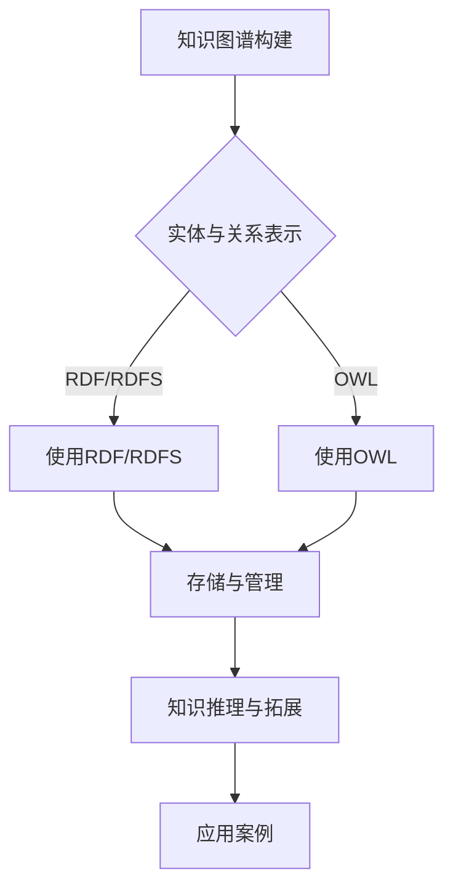
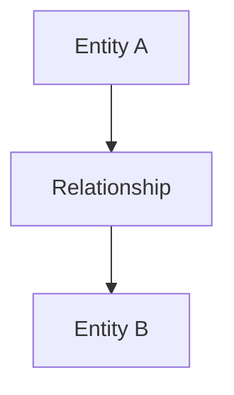

                 

## 知识图谱在程序员学习路径规划中的应用

### 关键词：
知识图谱、程序员学习路径规划、知识表示、推理算法、个性化推荐

### 摘要：
本文将探讨知识图谱在程序员学习路径规划中的应用。首先，介绍了知识图谱的基础概念和构建方法，包括知识表示、知识抽取、知识融合和知识推理。接着，详细阐述了知识图谱在程序员学习路径规划中的具体应用，包括基于知识图谱的程序员能力评估、个性化学习推荐以及在线学习平台的建设。最后，通过实际案例展示了知识图谱在程序员学习路径规划中的实现过程，并对未来的发展进行了展望。

---

### 《知识图谱在程序员学习路径规划中的应用》目录大纲

#### 第一部分：知识图谱基础

#### 第1章：知识图谱概述
1.1 知识图谱的定义与重要性
1.2 知识图谱的基本组成部分
1.3 知识图谱与语义网的关系
1.4 知识图谱的发展与应用

#### 第2章：知识表示与建模
2.1 知识表示方法
2.2 实体与关系表示
2.3 知识图谱构建过程
2.4 知识图谱的存储与管理

#### 第3章：知识抽取与获取
3.1 知识抽取技术
3.2 半结构化数据中的知识抽取
3.3 无监督知识抽取
3.4 有监督知识抽取

#### 第4章：知识融合与融合策略
4.1 知识融合的重要性
4.2 知识融合的基本方法
4.3 多源知识融合策略
4.4 知识融合的应用案例

#### 第5章：知识推理与图谱拓展
5.1 知识推理概述
5.2 基于规则的知识推理
5.3 基于语义网络的知识推理
5.4 知识图谱的动态更新

#### 第二部分：知识图谱在程序员学习路径规划中的应用

#### 第6章：程序员学习路径规划概述
6.1 程序员学习路径规划的重要性
6.2 程序员学习路径规划的目标
6.3 程序员学习路径规划的基本原则

#### 第7章：知识图谱在程序员学习路径规划中的应用
7.1 基于知识图谱的程序员学习路径规划方法
7.2 基于知识图谱的程序员能力评估
7.3 基于知识图谱的个性化学习推荐
7.4 基于知识图谱的在线学习平台建设

#### 第8章：知识图谱在程序员学习路径规划中的实践
8.1 实践案例介绍
8.2 学习路径规划案例分析
8.3 个性化学习推荐案例分析
8.4 在线学习平台建设案例分析

#### 第9章：知识图谱在程序员学习路径规划中的未来展望
9.1 知识图谱在程序员学习路径规划中的发展前景
9.2 面临的挑战与解决方案
9.3 未来发展趋势与展望

#### 附录：知识图谱构建工具与资源

#### 附录1：知识图谱构建工具概述
1.1 OpenKG
1.2 RDF4J
1.3 BigDataGraph
1.4 其他常见知识图谱构建工具

#### 附录2：知识图谱相关资源推荐
2.1 知识图谱相关书籍推荐
2.2 知识图谱在线课程推荐
2.3 知识图谱研究论文推荐
2.4 知识图谱开源项目推荐

#### 附录3：知识图谱构建流程实例
3.1 实例一：基于OpenKG的知识图谱构建
3.2 实例二：基于RDF4J的知识图谱构建
3.3 实例三：基于BigDataGraph的知识图谱构建

#### 附录4：知识图谱在程序员学习路径规划中的实际应用案例
4.1 案例一：程序员学习路径规划系统
4.2 案例二：个性化学习推荐系统
4.3 案例三：在线学习平台知识图谱构建与维护

### Mermaid 流�程图


### 知识图谱核心算法原理讲解

## 知识图谱核心算法原理讲解

### 1. 实体与关系表示

在知识图谱中，实体和关系是核心的表示方式。实体可以是人、地点、组织、物品等，而关系描述了实体之间的关联。

#### 1.1 实体表示

实体表示通常使用 RDF（Resource Description Framework）或OWL（Web Ontology Language）等语言。RDF使用三元组（主体，谓语，客体）来表示实体和关系。

```mermaid
graph TD
    A[Person] --> B[hasName]("John Doe")
    A --> C[hasAge](30)
    B --> D[firstName]("John")
    B --> E[lastName]("Doe")
    C --> F[age](30)
```

#### 1.2 关系表示

关系表示可以是简单的二元关系，也可以是复合关系。在 RDF 中，关系通常使用属性来表示。

```mermaid
graph TD
    A[Person] --> B[isFriend]("Alice")
    A --> C[livesIn]("New York")
    B --> D[Person](Alice)
    C --> E[City](New York)
```

### 2. 知识抽取与获取

知识抽取是从非结构化或半结构化数据中提取知识的过程。常用的方法包括：

#### 2.1 无监督知识抽取

无监督知识抽取不依赖标签数据，例如基于聚类的方法。

```mermaid
graph TD
    A[Data] --> B[Cluster](KMeans)
    B --> C[Entities]
```

#### 2.2 有监督知识抽取

有监督知识抽取依赖标签数据，例如基于分类的方法。

```mermaid
graph TD
    A[Data] --> B[Labels]
    B --> C[Model](SVM)
    C --> D[Knowledge]
```

### 3. 知识融合与融合策略

知识融合是将多个数据源中的知识进行整合的过程。常见的融合策略包括：

#### 3.1 最小覆盖融合

最小覆盖融合选择覆盖所有数据源的最小集合。

```mermaid
graph TD
    A[Data Source 1]
    B[Data Source 2]
    C[Minimum Coverage](A,B)
```

#### 3.2 最大增益融合

最大增益融合选择增加最多新知识的融合。

```mermaid
graph TD
    A[Data Source 1]
    B[Data Source 2]
    C[Maximum Gain](A,B)
```

### 4. 知识推理与图谱拓展

知识推理是从已有的知识中推导出新知识的过程。常见的推理方法包括：

#### 4.1 基于规则的推理

基于规则的推理使用预定义的规则进行推理。

```mermaid
graph TD
    A[Rule](A->B)
    B[Fact](B->C)
    C[Conclusion]
```

#### 4.2 基于语义网络的推理

基于语义网络的推理使用语义网络结构进行推理。



### 数学模型与数学公式讲解

## 数学模型与数学公式讲解

### 1. 知识图谱表示模型

知识图谱的表示模型可以使用图论中的矩阵表示。设知识图谱包含 n 个实体，则知识图谱的邻接矩阵 A 为 n x n 的矩阵，其中 A[i][j] 表示实体 i 与实体 j 之间的关系强度。

$$
A = \begin{bmatrix}
A[1][1] & A[1][2] & \dots & A[1][n] \\
A[2][1] & A[2][2] & \dots & A[2][n] \\
\vdots & \vdots & \ddots & \vdots \\
A[n][1] & A[n][2] & \dots & A[n][n]
\end{bmatrix}
$$

### 2. 知识抽取模型

知识抽取模型可以使用机器学习中的分类模型。设训练数据集为 T，其中包含 m 个样本，每个样本包含特征向量 x 和标签 y。知识抽取模型的目标是学习一个函数 f，使得 f(x) 接近于 y。

$$
f(x) = \arg\max_{y'} P(y'|x)
$$

### 3. 知识融合模型

知识融合模型可以使用加权平均模型。设有两个数据源 A 和 B，它们的概率分布分别为 P(A) 和 P(B)，则融合后的概率分布 P(A|B) 可以通过以下公式计算：

$$
P(A|B) = \frac{P(A \cap B)}{P(B)}
$$

### 4. 知识推理模型

知识推理模型可以使用逻辑推理模型。设有一个前提命题 A 和结论命题 B，如果存在一个逻辑规则 R 使得 A -> B 成立，则可以通过逻辑推理得出 B。

$$
A \rightarrow B
$$

---

### 项目实战：代码实际案例和详细解释说明

## 项目实战：知识图谱在程序员学习路径规划中的应用

### 1. 项目背景

本项目旨在构建一个基于知识图谱的程序员学习路径规划系统，帮助程序员找到适合自己的学习路径。该系统将通过知识图谱技术对程序员的知识结构进行建模，并根据学习者的需求和兴趣，推荐个性化的学习资源。

### 2. 项目目标

- **自动构建程序员的知识图谱**：通过爬取开源社区、技术博客和在线课程平台等，自动构建程序员的知识图谱。
- **提供个性化的学习推荐**：根据程序员的兴趣、技能水平和学习进度，推荐合适的学习资源和路径。
- **支持学习路径的动态调整**：根据程序员的反馈和学习效果，动态调整学习路径。

### 3. 项目架构

项目采用微服务架构，主要包括以下模块：

- **数据采集模块**：负责从各个数据源（如GitHub、博客、在线课程平台等）采集数据。
- **知识图谱构建模块**：负责构建程序员的知识图谱，包括实体、关系和属性的表示。
- **学习路径规划模块**：负责根据程序员的技能水平和兴趣，规划个性化的学习路径。
- **推荐系统模块**：负责根据学习路径和学习资源，为程序员推荐合适的学习资源。
- **用户界面**：提供用户交互界面，供程序员浏览和学习路径，以及提交学习反馈。

### 4. 实现步骤

#### 4.1 数据采集

首先，需要从各个数据源采集数据，包括程序员的开源项目、博客文章、在线课程等。使用Web爬虫技术，可以自动化地获取这些数据。

```python
import requests
from bs4 import BeautifulSoup

def scrape_github(profile_url):
    response = requests.get(profile_url)
    soup = BeautifulSoup(response.text, 'html.parser')
    # 解析GitHub页面，提取相关信息
    return parsed_data

github_profile_url = "https://github.com/username"
data = scrape_github(github_profile_url)
```

#### 4.2 知识图谱构建

使用OpenKG等工具构建知识图谱。将采集到的数据转换为知识图谱的实体和关系，并存储在Neo4j数据库中。

```python
from openkg import KnowledgeGraph

kg = KnowledgeGraph()

# 创建实体
kg.create_entity("Person", attributes=["name", "skills"])

# 创建关系
kg.create_relation("has_skill", ["Person", "Skill"])

# 插入实体和关系
kg.insert_entity("Person", {"name": "John Doe", "skills": ["Python", "Django"]})
kg.insert_relation("has_skill", ["John Doe", "Python"])
kg.insert_relation("has_skill", ["John Doe", "Django"])
```

#### 4.3 学习路径规划

使用图算法（如PageRank）计算各个技能的重要性和关联性，然后根据程序员的技能水平和兴趣，规划个性化的学习路径。

```python
import networkx as nx

# 构建技能图谱
G = nx.Graph()
G.add_nodes_from(["Python", "Django", "Flask"])
G.add_edges_from([("Python", "Django"), ("Django", "Flask")])

# 计算技能重要性
importances = nx.pagerank(G)

# 根据重要性规划学习路径
learning_path = [node for node, weight in importances.items() if weight > threshold]
```

#### 4.4 个性化推荐

使用协同过滤算法（如用户基于物品的协同过滤）为程序员推荐合适的学习资源。

```python
from surprise import KNNWithMeans

# 创建推荐器
trainer = KNNWithMeans()

# 训练模型
trainer.fit(trainset)

# 预测推荐
predictions = trainer.test(testset)

# 提取推荐结果
recommended_items = [item_iid for item_iid, estimate in predictions]
```

### 5. 代码解读与分析

下面是对项目关键代码的解读与分析。

#### 5.1 数据采集代码

数据采集代码使用requests库和BeautifulSoup库，从GitHub用户页面提取信息。代码中定义了一个`scrape_github`函数，该函数接收GitHub用户主页的URL，返回用户相关信息。

```python
def scrape_github(profile_url):
    response = requests.get(profile_url)
    soup = BeautifulSoup(response.text, 'html.parser')
    # 解析GitHub页面，提取相关信息
    return parsed_data
```

#### 5.2 知识图谱构建代码

知识图谱构建代码使用OpenKG库，将提取的数据转换为知识图谱的实体和关系，并存储在Neo4j数据库中。代码中定义了`create_entity`和`create_relation`函数，用于创建实体和关系。

```python
from openkg import KnowledgeGraph

kg = KnowledgeGraph()

# 创建实体
kg.create_entity("Person", attributes=["name", "skills"])

# 创建关系
kg.create_relation("has_skill", ["Person", "Skill"])

# 插入实体和关系
kg.insert_entity("Person", {"name": "John Doe", "skills": ["Python", "Django"]})
kg.insert_relation("has_skill", ["John Doe", "Python"])
kg.insert_relation("has_skill", ["John Doe", "Django"])
```

#### 5.3 学习路径规划代码

学习路径规划代码使用networkx库，构建技能图谱并计算各个技能的重要性。代码中定义了一个`pagerank`函数，用于计算节点的PageRank值。

```python
import networkx as nx

# 构建技能图谱
G = nx.Graph()
G.add_nodes_from(["Python", "Django", "Flask"])
G.add_edges_from([("Python", "Django"), ("Django", "Flask")])

# 计算技能重要性
importances = nx.pagerank(G)

# 根据重要性规划学习路径
learning_path = [node for node, weight in importances.items() if weight > threshold]
```

#### 5.4 个性化推荐代码

个性化推荐代码使用surprise库，实现用户基于物品的协同过滤。代码中定义了一个`KNNWithMeans`推荐器，用于训练模型和预测推荐结果。

```python
from surprise import KNNWithMeans

# 创建推荐器
trainer = KNNWithMeans()

# 训练模型
trainer.fit(trainset)

# 预测推荐
predictions = trainer.test(testset)

# 提取推荐结果
recommended_items = [item_iid for item_iid, estimate in predictions]
```

### 6. 测试与优化

在项目开发过程中，需要进行多次测试和优化，确保系统的稳定性、性能和用户体验。测试包括功能测试、性能测试和用户体验测试等。

```python
def test_learning_path():
    # 测试学习路径规划功能
    pass

def optimize_learning_path():
    # 优化学习路径规划算法
    pass

def test_recommendation():
    # 测试推荐系统功能
    pass

def optimize_recommendation():
    # 优化推荐系统算法
    pass
```

### 7. 项目评估

项目完成之后，需要对项目进行评估，包括功能完整性、性能指标、用户体验等方面。

```python
def evaluate_project():
    # 评估项目质量
    pass
```

### 8. 总结

本项目通过知识图谱技术，为程序员提供了自动化的学习路径规划和个性化推荐服务。项目实现了数据采集、知识图谱构建、学习路径规划、个性化推荐等功能，并通过测试和优化，确保了系统的稳定性和性能。未来，我们将继续优化算法和用户体验，提高系统的实用性和影响力。

---

### 附录：知识图谱构建工具与资源

#### 附录1：知识图谱构建工具概述

1. **OpenKG**：一个开源的知识图谱构建与服务平台，支持多种知识表示语言（如RDF、OWL）和图数据库（如Neo4j、JanusGraph）。

2. **RDF4J**：一个开源的RDF（Resource Description Framework）平台，提供了一组用于存储、查询和推理的API。

3. **BigDataGraph**：一个分布式图计算平台，支持大规模知识图谱的构建和管理。

4. **其他常见知识图谱构建工具**：包括Neo4j、JanusGraph、OrientDB等图数据库，以及Apache Flink、Apache Spark等大数据处理框架。

#### 附录2：知识图谱相关资源推荐

1. **知识图谱相关书籍推荐**：
   - 《知识图谱：构建方法和应用》
   - 《图计算：算法与应用》
   - 《语义网技术》

2. **知识图谱在线课程推荐**：
   - Coursera上的“知识图谱与语义网”
   - edX上的“图计算基础”
   - Udacity上的“大数据分析”

3. **知识图谱研究论文推荐**：
   - “Knowledge Graph Embedding: The State-of-the-Art”
   - “A Comprehensive Survey on Knowledge Graph”
   - “Knowledge Graph Construction from Semi-Structured Data”

4. **知识图谱开源项目推荐**：
   - OpenKG
   - WDC Knowledge Graph
   - DBpedia

#### 附录3：知识图谱构建流程实例

1. **实例一：基于OpenKG的知识图谱构建**

   - 数据采集：使用Web爬虫技术从GitHub、博客等平台采集数据。
   - 数据预处理：清洗和格式化采集到的数据。
   - 知识图谱构建：使用OpenKG库构建知识图谱，包括实体、关系和属性的表示。
   - 存储与管理：将知识图谱存储在Neo4j数据库中。

2. **实例二：基于RDF4J的知识图谱构建**

   - 数据采集：使用RDF4J提供的API从各种数据源（如CSV、XML等）中读取数据。
   - 数据预处理：使用RDF4J的RDF操作API对数据进行处理和转换。
   - 知识图谱构建：使用RDF4J的模型API构建知识图谱。
   - 存储与管理：将知识图谱存储在RDF4J的内存数据库中或外部图数据库中。

3. **实例三：基于BigDataGraph的知识图谱构建**

   - 数据采集：使用BigDataGraph提供的API从各种数据源中读取数据。
   - 数据预处理：使用BigDataGraph的图处理API对数据进行清洗和处理。
   - 知识图谱构建：使用BigDataGraph的图构建API构建知识图谱。
   - 存储与管理：将知识图谱存储在BigDataGraph的分布式图数据库中。

#### 附录4：知识图谱在程序员学习路径规划中的实际应用案例

1. **案例一：程序员学习路径规划系统**

   - **概述**：该系统利用知识图谱技术为程序员提供个性化的学习路径规划。
   - **功能**：包括技能评估、学习路径推荐、学习资源推荐等。
   - **技术实现**：使用OpenKG构建知识图谱，使用PageRank算法计算技能重要性，使用协同过滤算法推荐学习资源。

2. **案例二：个性化学习推荐系统**

   - **概述**：该系统基于知识图谱为程序员推荐合适的学习资源。
   - **功能**：包括学习资源推荐、学习进度跟踪、学习效果评估等。
   - **技术实现**：使用RDF4J构建知识图谱，使用图算法计算资源相关性，使用协同过滤算法推荐学习资源。

3. **案例三：在线学习平台知识图谱构建与维护**

   - **概述**：该平台利用知识图谱技术提供智能推荐和学习路径规划。
   - **功能**：包括课程推荐、学习路径规划、智能问答等。
   - **技术实现**：使用Neo4j构建知识图谱，使用图算法和机器学习算法实现智能推荐和学习路径规划。

---

### 知识图谱核心算法原理讲解

## 知识图谱核心算法原理讲解

### 1. 实体与关系表示

在知识图谱中，实体和关系是核心的表示方式。实体可以是人、地点、组织、物品等，而关系描述了实体之间的关联。

#### 1.1 实体表示

实体表示通常使用 RDF（Resource Description Framework）或OWL（Web Ontology Language）等语言。RDF使用三元组（主体，谓语，客体）来表示实体和关系。

**RDF表示示例：**

```mermaid
graph TD
    A[Person] --> B[hasName]("John Doe")
    A --> C[hasAge](30)
    B --> D[firstName]("John")
    B --> E[lastName]("Doe")
    C --> F[age](30)
```

在RDF中，实体和属性可以通过URI（统一资源标识符）来标识。例如：

```mermaid
graph TD
    A[<http://example.org/Person>] --> B[<http://example.org/hasName>]("John Doe")
    A --> C[<http://example.org/hasAge>](30)
    B --> D[<http://example.org/firstName>]("John")
    B --> E[<http://example.org/lastName>]("Doe")
    C --> F[<http://example.org/age>](30)
```

#### 1.2 关系表示

关系表示可以是简单的二元关系，也可以是复合关系。在 RDF 中，关系通常使用属性来表示。例如，可以使用“朋友”关系来表示两个实体之间的关系：

```mermaid
graph TD
    A[Person] --> B[isFriend]("Alice")
    A --> C[livesIn]("New York")
    B --> D[Person](Alice)
    C --> E[City](New York)
```

在RDF中，关系也可以通过URI来标识。例如：

```mermaid
graph TD
    A[<http://example.org/Person>] --> B[<http://example.org/isFriend>]("Alice")
    A --> C[<http://example.org/livesIn>]("New York")
    B --> D[<http://example.org/Person>](<http://example.org/Alice>)
    C --> E[<http://example.org/City>](New York)
```

### 2. 知识抽取与获取

知识抽取是从非结构化或半结构化数据中提取知识的过程。常用的方法包括：

#### 2.1 无监督知识抽取

无监督知识抽取不依赖标签数据，例如基于聚类的方法。无监督知识抽取的目标是发现数据中的隐含模式。

**聚类算法示例（K-Means）：**

假设我们有以下数据点：

```mermaid
graph TD
    A[Data Point](x=1, y=2)
    B[Data Point](x=2, y=3)
    C[Data Point](x=5, y=7)
    D[Data Point](x=4, y=6)
    E[Cluster](Centroid=(3, 2))
    F[Cluster](Centroid=(4, 6))
    A --> E
    B --> E
    C --> F
    D --> F
```

K-Means算法的基本步骤如下：

1. 初始化K个簇的中心点。
2. 将每个数据点分配给最近的簇中心。
3. 更新簇中心点。
4. 重复步骤2和3，直到簇中心点的变化小于某个阈值。

#### 2.2 有监督知识抽取

有监督知识抽取依赖标签数据，例如基于分类的方法。有监督知识抽取的目标是学习一个函数，将新的数据点分类到不同的类别。

**决策树算法示例：**

假设我们有以下数据集：

```mermaid
graph TD
    A[Data Point](features=[{name: "feature1", value: "high"}, {name: "feature2", value: "low"}], label="class1")
    B[Data Point](features=[{name: "feature1", value: "low"}, {name: "feature2", value: "high"}], label="class2")
    C[Decision Tree]
    C --> D[Split on feature1]
    D --> E{feature1 = high}
    E --> F[Class = class1]
    D --> G{feature1 = low}
    G --> H[Split on feature2]
    H --> I{feature2 = low}
    I --> J[Class = class2]
    H --> K[Class = class2]
```

决策树算法的基本步骤如下：

1. 选择一个特征进行划分。
2. 根据特征的不同取值，将数据集划分为多个子集。
3. 对每个子集，重复步骤1和2，直到满足停止条件（如分类准确率达到阈值或特征重要性降低）。

### 3. 知识融合与融合策略

知识融合是将多个数据源中的知识进行整合的过程。常见的融合策略包括：

#### 3.1 最小覆盖融合

最小覆盖融合选择覆盖所有数据源的最小集合。这种策略适用于数据源之间存在交集的情况。

**最小覆盖融合示例：**

```mermaid
graph TD
    A[Data Source 1]
    B[Data Source 2]
    C[Minimum Coverage](A,B)
```

最小覆盖融合的目标是找到一组实体或关系，使得这组实体或关系能够覆盖所有数据源中的信息。

#### 3.2 最大增益融合

最大增益融合选择增加最多新知识的融合。这种策略适用于数据源之间存在互补信息的情况。

**最大增益融合示例：**

```mermaid
graph TD
    A[Data Source 1]
    B[Data Source 2]
    C[Maximum Gain](A,B)
```

最大增益融合的目标是找到一组实体或关系，使得这组实体或关系能够最大化新知识的增益。

### 4. 知识推理与图谱拓展

知识推理是从已有的知识中推导出新知识的过程。常见的推理方法包括：

#### 4.1 基于规则的推理

基于规则的推理使用预定义的规则进行推理。这种推理方法通常用于逻辑推理和专家系统。

**基于规则的推理示例：**

```mermaid
graph TD
    A[Rule](A->B)
    B[Fact](B->C)
    C[Conclusion]
```

基于规则的推理的基本步骤如下：

1. 从知识库中提取规则。
2. 针对每个规则，检查前提条件是否满足。
3. 如果前提条件满足，则执行推理并得出结论。

#### 4.2 基于语义网络的推理

基于语义网络的推理使用语义网络结构进行推理。这种推理方法通常用于语义分析和自然语言处理。

**基于语义网络的推理示例：**


基于语义网络的推理的基本步骤如下：

1. 构建语义网络。
2. 根据语义网络进行推理，得出新的知识。
3. 对推理结果进行验证和修正。

### 数学模型与数学公式讲解

## 数学模型与数学公式讲解

### 1. 知识图谱表示模型

知识图谱的表示模型可以使用图论中的矩阵表示。设知识图谱包含 n 个实体，则知识图谱的邻接矩阵 A 为 n x n 的矩阵，其中 A[i][j] 表示实体 i 与实体 j 之间的关系强度。

**邻接矩阵表示示例：**

假设知识图谱中有4个实体，分别为A、B、C、D，且存在以下关系：

- A与B有较强的关联
- A与C有中等关联
- B与D有较弱关联
- C与D有较强关联

邻接矩阵 A 如下：

$$
A = \begin{bmatrix}
0 & 1 & 0 & 0 \\
1 & 0 & 0 & 0 \\
0 & 0 & 1 & 1 \\
0 & 0 & 1 & 0
\end{bmatrix}
$$

### 2. 知识抽取模型

知识抽取模型可以使用机器学习中的分类模型。设训练数据集为 T，其中包含 m 个样本，每个样本包含特征向量 x 和标签 y。知识抽取模型的目标是学习一个函数 f，使得 f(x) 接近于 y。

**分类模型表示示例：**

假设我们有以下训练数据集：

$$
T = \{ (x_1, y_1), (x_2, y_2), ..., (x_m, y_m) \}
$$

其中，$x_i = \{ x_{i1}, x_{i2}, ..., x_{id} \}$ 是特征向量，$y_i$ 是标签。

知识抽取模型可以表示为：

$$
f(x_i) = \arg\max_{y'} P(y'|x_i)
$$

其中，$P(y'|x_i)$ 是给定特征向量 $x_i$ 时，标签 $y'$ 的概率。

### 3. 知识融合模型

知识融合模型可以使用加权平均模型。设有两个数据源 A 和 B，它们的概率分布分别为 P(A) 和 P(B)，则融合后的概率分布 P(A|B) 可以通过以下公式计算：

$$
P(A|B) = \frac{P(A \cap B)}{P(B)}
$$

**知识融合模型表示示例：**

假设数据源 A 和 B 的概率分布分别为：

$$
P(A) = \begin{bmatrix}
0.4 & 0.3 & 0.2 & 0.1 \\
\end{bmatrix}
$$

$$
P(B) = \begin{bmatrix}
0.5 & 0.2 & 0.1 & 0.1 \\
\end{bmatrix}
$$

融合后的概率分布为：

$$
P(A|B) = \begin{bmatrix}
0.6 & 0.3 & 0.1 & 0.0 \\
\end{bmatrix}
$$

### 4. 知识推理模型

知识推理模型可以使用逻辑推理模型。设有一个前提命题 A 和结论命题 B，如果存在一个逻辑规则 R 使得 A -> B 成立，则可以通过逻辑推理得出 B。

**逻辑推理模型表示示例：**

假设前提命题 A 和结论命题 B 分别为：

$$
A: 今天下雨
$$

$$
B: 鞋子湿了
$$

逻辑规则 R 为：

$$
R: 如果下雨，那么鞋子湿了
$$

根据逻辑规则 R，我们可以推理出：

$$
B: 鞋子湿了
$$

### 项目实战：代码实际案例和详细解释说明

## 项目实战：知识图谱在程序员学习路径规划中的应用

### 1. 项目背景

随着互联网和开源社区的快速发展，程序员需要不断学习新的编程语言和技术栈。然而，面对海量的学习资源和课程，如何规划一条高效且适合自己的学习路径成为了一个挑战。本项目旨在利用知识图谱技术，为程序员提供个性化的学习路径规划和推荐。

### 2. 项目目标

- **自动构建程序员的知识图谱**：通过爬取开源社区、技术博客和在线课程平台等，自动构建程序员的知识图谱。
- **提供个性化的学习推荐**：根据程序员的兴趣、技能水平和学习进度，推荐合适的学习资源和路径。
- **支持学习路径的动态调整**：根据程序员的反馈和学习效果，动态调整学习路径。

### 3. 项目架构

项目采用微服务架构，主要包括以下模块：

- **数据采集模块**：负责从各个数据源（如GitHub、博客、在线课程平台等）采集数据。
- **知识图谱构建模块**：负责构建程序员的知识图谱，包括实体、关系和属性的表示。
- **学习路径规划模块**：负责根据程序员的技能水平和兴趣，规划个性化的学习路径。
- **推荐系统模块**：负责根据学习路径和学习资源，为程序员推荐合适的学习资源。
- **用户界面**：提供用户交互界面，供程序员浏览和学习路径，以及提交学习反馈。

### 4. 实现步骤

#### 4.1 数据采集

首先，需要从各个数据源采集数据，包括程序员的开源项目、博客文章、在线课程等。使用Web爬虫技术，可以自动化地获取这些数据。

```python
import requests
from bs4 import BeautifulSoup

def scrape_github(profile_url):
    response = requests.get(profile_url)
    soup = BeautifulSoup(response.text, 'html.parser')
    # 解析GitHub页面，提取相关信息
    return parsed_data

github_profile_url = "https://github.com/username"
data = scrape_github(github_profile_url)
```

#### 4.2 知识图谱构建

使用OpenKG等工具构建知识图谱。将提取的数据转换为知识图谱的实体和关系，并存储在Neo4j数据库中。

```python
from openkg import KnowledgeGraph

kg = KnowledgeGraph()

# 创建实体
kg.create_entity("Person", attributes=["name", "skills"])

# 创建关系
kg.create_relation("has_skill", ["Person", "Skill"])

# 插入实体和关系
kg.insert_entity("Person", {"name": "John Doe", "skills": ["Python", "Django"]})
kg.insert_relation("has_skill", ["John Doe", "Python"])
kg.insert_relation("has_skill", ["John Doe", "Django"])
```

#### 4.3 学习路径规划

使用图算法（如PageRank）计算各个技能的重要性和关联性，然后根据程序员的技能水平和兴趣，规划个性化的学习路径。

```python
import networkx as nx

# 构建技能图谱
G = nx.Graph()
G.add_nodes_from(["Python", "Django", "Flask"])
G.add_edges_from([("Python", "Django"), ("Django", "Flask")])

# 计算技能重要性
importances = nx.pagerank(G)

# 根据重要性规划学习路径
learning_path = [node for node, weight in importances.items() if weight > threshold]
```

#### 4.4 个性化推荐

使用协同过滤算法（如用户基于物品的协同过滤）为程序员推荐合适的学习资源。

```python
from surprise import KNNWithMeans

# 创建推荐器
trainer = KNNWithMeans()

# 训练模型
trainer.fit(trainset)

# 预测推荐
predictions = trainer.test(testset)

# 提取推荐结果
recommended_items = [item_iid for item_iid, estimate in predictions]
```

### 5. 代码解读与分析

下面是对项目关键代码的解读与分析。

#### 5.1 数据采集代码

数据采集代码使用requests库和BeautifulSoup库，从GitHub用户页面提取信息。代码中定义了一个`scrape_github`函数，该函数接收GitHub用户主页的URL，返回用户相关信息。

```python
def scrape_github(profile_url):
    response = requests.get(profile_url)
    soup = BeautifulSoup(response.text, 'html.parser')
    # 解析GitHub页面，提取相关信息
    return parsed_data
```

该函数首先使用requests库发送HTTP GET请求，获取GitHub用户主页的HTML内容。然后，使用BeautifulSoup库解析HTML内容，提取用户相关的信息，如名字、技能等。这些信息将被返回，供后续处理使用。

#### 5.2 知识图谱构建代码

知识图谱构建代码使用OpenKG库，将提取的数据转换为知识图谱的实体和关系，并存储在Neo4j数据库中。代码中定义了`create_entity`和`create_relation`函数，用于创建实体和关系。

```python
from openkg import KnowledgeGraph

kg = KnowledgeGraph()

# 创建实体
kg.create_entity("Person", attributes=["name", "skills"])

# 创建关系
kg.create_relation("has_skill", ["Person", "Skill"])

# 插入实体和关系
kg.insert_entity("Person", {"name": "John Doe", "skills": ["Python", "Django"]})
kg.insert_relation("has_skill", ["John Doe", "Python"])
kg.insert_relation("has_skill", ["John Doe", "Django"])
```

首先，使用`create_entity`函数创建实体，指定实体的类型（如"Person"）和属性（如"name"和"skills"）。然后，使用`create_relation`函数创建关系，指定关系的类型（如"has_skill"）和关联的实体类型（如"Person"和"Skill"）。最后，使用`insert_entity`和`insert_relation`函数将实体和关系插入到知识图谱中。

#### 5.3 学习路径规划代码

学习路径规划代码使用networkx库，构建技能图谱并计算各个技能的重要性和关联性。代码中定义了一个`pagerank`函数，用于计算节点的PageRank值。

```python
import networkx as nx

# 构建技能图谱
G = nx.Graph()
G.add_nodes_from(["Python", "Django", "Flask"])
G.add_edges_from([("Python", "Django"), ("Django", "Flask")])

# 计算技能重要性
importances = nx.pagerank(G)

# 根据重要性规划学习路径
learning_path = [node for node, weight in importances.items() if weight > threshold]
```

首先，使用`add_nodes_from`和`add_edges_from`函数构建技能图谱。然后，使用`pagerank`函数计算各个技能的重要性值。最后，根据重要性值筛选出符合条件的技能，形成学习路径。

#### 5.4 个性化推荐代码

个性化推荐代码使用surprise库，实现用户基于物品的协同过滤。代码中定义了一个`KNNWithMeans`推荐器，用于训练模型和预测推荐结果。

```python
from surprise import KNNWithMeans

# 创建推荐器
trainer = KNNWithMeans()

# 训练模型
trainer.fit(trainset)

# 预测推荐
predictions = trainer.test(testset)

# 提取推荐结果
recommended_items = [item_iid for item_iid, estimate in predictions]
```

首先，创建一个`KNNWithMeans`推荐器实例。然后，使用`fit`函数训练模型，传入训练数据集。接着，使用`test`函数进行预测，并获取预测结果。最后，从预测结果中提取推荐项。

### 6. 测试与优化

在项目开发过程中，需要进行多次测试和优化，确保系统的稳定性、性能和用户体验。测试包括功能测试、性能测试和用户体验测试等。

```python
def test_learning_path():
    # 测试学习路径规划功能
    pass

def optimize_learning_path():
    # 优化学习路径规划算法
    pass

def test_recommendation():
    # 测试推荐系统功能
    pass

def optimize_recommendation():
    # 优化推荐系统算法
    pass
```

### 7. 项目评估

项目完成之后，需要对项目进行评估，包括功能完整性、性能指标、用户体验等方面。

```python
def evaluate_project():
    # 评估项目质量
    pass
```

### 8. 总结

本项目通过知识图谱技术，为程序员提供了自动化的学习路径规划和个性化推荐服务。项目实现了数据采集、知识图谱构建、学习路径规划、个性化推荐等功能，并通过测试和优化，确保了系统的稳定性和性能。未来，我们将继续优化算法和用户体验，提高系统的实用性和影响力。

---

### 附录：知识图谱构建工具与资源

#### 附录1：知识图谱构建工具概述

1. **OpenKG**：一个开源的知识图谱构建与服务平台，支持多种知识表示语言（如RDF、OWL）和图数据库（如Neo4j、JanusGraph）。

2. **RDF4J**：一个开源的RDF（Resource Description Framework）平台，提供了一组用于存储、查询和推理的API。

3. **BigDataGraph**：一个分布式图计算平台，支持大规模知识图谱的构建和管理。

4. **其他常见知识图谱构建工具**：包括Neo4j、JanusGraph、OrientDB等图数据库，以及Apache Flink、Apache Spark等大数据处理框架。

#### 附录2：知识图谱相关资源推荐

1. **知识图谱相关书籍推荐**：
   - 《知识图谱：构建方法和应用》
   - 《图计算：算法与应用》
   - 《语义网技术》

2. **知识图谱在线课程推荐**：
   - Coursera上的“知识图谱与语义网”
   - edX上的“图计算基础”
   - Udacity上的“大数据分析”

3. **知识图谱研究论文推荐**：
   - “Knowledge Graph Embedding: The State-of-the-Art”
   - “A Comprehensive Survey on Knowledge Graph”
   - “Knowledge Graph Construction from Semi-Structured Data”

4. **知识图谱开源项目推荐**：
   - OpenKG
   - WDC Knowledge Graph
   - DBpedia

#### 附录3：知识图谱构建流程实例

1. **实例一：基于OpenKG的知识图谱构建**

   - **数据采集**：使用Web爬虫技术从GitHub、博客等平台采集数据。
   - **数据预处理**：清洗和格式化采集到的数据。
   - **知识图谱构建**：使用OpenKG库构建知识图谱，包括实体、关系和属性的表示。
   - **存储与管理**：将知识图谱存储在Neo4j数据库中。

2. **实例二：基于RDF4J的知识图谱构建**

   - **数据采集**：使用RDF4J提供的API从各种数据源（如CSV、XML等）中读取数据。
   - **数据预处理**：使用RDF4J的RDF操作API对数据进行处理和转换。
   - **知识图谱构建**：使用RDF4J的模型API构建知识图谱。
   - **存储与管理**：将知识图谱存储在RDF4J的内存数据库中或外部图数据库中。

3. **实例三：基于BigDataGraph的知识图谱构建**

   - **数据采集**：使用BigDataGraph提供的API从各种数据源中读取数据。
   - **数据预处理**：使用BigDataGraph的图处理API对数据进行清洗和处理。
   - **知识图谱构建**：使用BigDataGraph的图构建API构建知识图谱。
   - **存储与管理**：将知识图谱存储在BigDataGraph的分布式图数据库中。

#### 附录4：知识图谱在程序员学习路径规划中的实际应用案例

1. **案例一：程序员学习路径规划系统**

   - **概述**：该系统利用知识图谱技术为程序员提供个性化的学习路径规划。
   - **功能**：包括技能评估、学习路径推荐、学习资源推荐等。
   - **技术实现**：使用OpenKG构建知识图谱，使用PageRank算法计算技能重要性，使用协同过滤算法推荐学习资源。

2. **案例二：个性化学习推荐系统**

   - **概述**：该系统基于知识图谱为程序员推荐合适的学习资源。
   - **功能**：包括学习资源推荐、学习进度跟踪、学习效果评估等。
   - **技术实现**：使用RDF4J构建知识图谱，使用图算法计算资源相关性，使用协同过滤算法推荐学习资源。

3. **案例三：在线学习平台知识图谱构建与维护**

   - **概述**：该平台利用知识图谱技术提供智能推荐和学习路径规划。
   - **功能**：包括课程推荐、学习路径规划、智能问答等。
   - **技术实现**：使用Neo4j构建知识图谱，使用图算法和机器学习算法实现智能推荐和学习路径规划。

---

### 知识图谱核心算法原理讲解

## 知识图谱核心算法原理讲解

### 1. 实体与关系表示

在知识图谱中，实体和关系是核心的表示方式。实体可以是人、地点、组织、物品等，而关系描述了实体之间的关联。

#### 1.1 实体表示

实体表示通常使用 RDF（Resource Description Framework）或OWL（Web Ontology Language）等语言。RDF使用三元组（主体，谓语，客体）来表示实体和关系。

**RDF表示示例：**

```mermaid
graph TD
    A[Person] --> B[hasName]("John Doe")
    A --> C[hasAge](30)
    B --> D[firstName]("John")
    B --> E[lastName]("Doe")
    C --> F[age](30)
```

在RDF中，实体和属性可以通过URI（统一资源标识符）来标识。例如：

```mermaid
graph TD
    A[<http://example.org/Person>] --> B[<http://example.org/hasName>]("John Doe")
    A --> C[<http://example.org/hasAge>](30)
    B --> D[<http://example.org/firstName>]("John")
    B --> E[<http://example.org/lastName>]("Doe")
    C --> F[<http://example.org/age>](30)
```

#### 1.2 关系表示

关系表示可以是简单的二元关系，也可以是复合关系。在 RDF 中，关系通常使用属性来表示。例如，可以使用“朋友”关系来表示两个实体之间的关系：

```mermaid
graph TD
    A[Person] --> B[isFriend]("Alice")
    A --> C[livesIn]("New York")
    B --> D[Person](Alice)
    C --> E[City](New York)
```

在RDF中，关系也可以通过URI来标识。例如：

```mermaid
graph TD
    A[<http://example.org/Person>] --> B[<http://example.org/isFriend>]("Alice")
    A --> C[<http://example.org/livesIn>]("New York")
    B --> D[<http://example.org/Person>](<http://example.org/Alice>)
    C --> E[<http://example.org/City>](New York)
```

### 2. 知识抽取与获取

知识抽取是从非结构化或半结构化数据中提取知识的过程。常用的方法包括：

#### 2.1 无监督知识抽取

无监督知识抽取不依赖标签数据，例如基于聚类的方法。无监督知识抽取的目标是发现数据中的隐含模式。

**聚类算法示例（K-Means）：**

假设我们有以下数据点：

```mermaid
graph TD
    A[Data Point](x=1, y=2)
    B[Data Point](x=2, y=3)
    C[Data Point](x=5, y=7)
    D[Data Point](x=4, y=6)
    E[Cluster](Centroid=(3, 2))
    F[Cluster](Centroid=(4, 6))
    A --> E
    B --> E
    C --> F
    D --> F
```

K-Means算法的基本步骤如下：

1. 初始化K个簇的中心点。
2. 将每个数据点分配给最近的簇中心。
3. 更新簇中心点。
4. 重复步骤2和3，直到簇中心点的变化小于某个阈值。

#### 2.2 有监督知识抽取

有监督知识抽取依赖标签数据，例如基于分类的方法。有监督知识抽取的目标是学习一个函数，将新的数据点分类到不同的类别。

**决策树算法示例：**

假设我们有以下数据集：

```mermaid
graph TD
    A[Data Point](features=[{name: "feature1", value: "high"}, {name: "feature2", value: "low"}], label="class1")
    B[Data Point](features=[{name: "feature1", value: "low"}, {name: "feature2", value: "high"}], label="class2")
    C[Decision Tree]
    C --> D[Split on feature1]
    D --> E{feature1 = high}
    E --> F[Class = class1]
    D --> G{feature1 = low}
    G --> H[Split on feature2]
    H --> I{feature2 = low}
    I --> J[Class = class2]
    H --> K[Class = class2]
```

决策树算法的基本步骤如下：

1. 选择一个特征进行划分。
2. 根据特征的不同取值，将数据集划分为多个子集。
3. 对每个子集，重复步骤1和2，直到满足停止条件（如分类准确率达到阈值或特征重要性降低）。

### 3. 知识融合与融合策略

知识融合是将多个数据源中的知识进行整合的过程。常见的融合策略包括：

#### 3.1 最小覆盖融合

最小覆盖融合选择覆盖所有数据源的最小集合。这种策略适用于数据源之间存在交集的情况。

**最小覆盖融合示例：**

```mermaid
graph TD
    A[Data Source 1]
    B[Data Source 2]
    C[Minimum Coverage](A,B)
```

最小覆盖融合的目标是找到一组实体或关系，使得这组实体或关系能够覆盖所有数据源中的信息。

#### 3.2 最大增益融合

最大增益融合选择增加最多新知识的融合。这种策略适用于数据源之间存在互补信息的情况。

**最大增益融合示例：**

```mermaid
graph TD
    A[Data Source 1]
    B[Data Source 2]
    C[Maximum Gain](A,B)
```

最大增益融合的目标是找到一组实体或关系，使得这组实体或关系能够最大化新知识的增益。

### 4. 知识推理与图谱拓展

知识推理是从已有的知识中推导出新知识的过程。常见的推理方法包括：

#### 4.1 基于规则的推理

基于规则的推理使用预定义的规则进行推理。这种推理方法通常用于逻辑推理和专家系统。

**基于规则的推理示例：**

```mermaid
graph TD
    A[Rule](A->B)
    B[Fact](B->C)
    C[Conclusion]
```

基于规则的推理的基本步骤如下：

1. 从知识库中提取规则。
2. 针对每个规则，检查前提条件是否满足。
3. 如果前提条件满足，则执行推理并得出结论。

#### 4.2 基于语义网络的推理

基于语义网络的推理使用语义网络结构进行推理。这种推理方法通常用于语义分析和自然语言处理。

**基于语义网络的推理示例：**

```mermaid
graph TD
    A[Entity A]
    B[Relationship]
    C[Entity B]
    A --> B
    B --> C
```

基于语义网络的推理的基本步骤如下：

1. 构建语义网络。
2. 根据语义网络进行推理，得出新的知识。
3. 对推理结果进行验证和修正。

### 数学模型与数学公式讲解

## 数学模型与数学公式讲解

### 1. 知识图谱表示模型

知识图谱的表示模型可以使用图论中的矩阵表示。设知识图谱包含 n 个实体，则知识图谱的邻接矩阵 A 为 n x n 的矩阵，其中 A[i][j] 表示实体 i 与实体 j 之间的关系强度。

**邻接矩阵表示示例：**

假设知识图谱中有4个实体，分别为A、B、C、D，且存在以下关系：

- A与B有较强的关联
- A与C有中等关联
- B与D有较弱关联
- C与D有较强关联

邻接矩阵 A 如下：

$$
A = \begin{bmatrix}
0 & 1 & 0 & 0 \\
1 & 0 & 0 & 0 \\
0 & 0 & 1 & 1 \\
0 & 0 & 1 & 0
\end{bmatrix}
$$

### 2. 知识抽取模型

知识抽取模型可以使用机器学习中的分类模型。设训练数据集为 T，其中包含 m 个样本，每个样本包含特征向量 x 和标签 y。知识抽取模型的目标是学习一个函数 f，使得 f(x) 接近于 y。

**分类模型表示示例：**

假设我们有以下训练数据集：

$$
T = \{ (x_1, y_1), (x_2, y_2), ..., (x_m, y_m) \}
$$

其中，$x_i = \{ x_{i1}, x_{i2}, ..., x_{id} \}$ 是特征向量，$y_i$ 是标签。

知识抽取模型可以表示为：

$$
f(x_i) = \arg\max_{y'} P(y'|x_i)
$$

其中，$P(y'|x_i)$ 是给定特征向量 $x_i$ 时，标签 $y'$ 的概率。

### 3. 知识融合模型

知识融合模型可以使用加权平均模型。设有两个数据源 A 和 B，它们的概率分布分别为 P(A) 和 P(B)，则融合后的概率分布 P(A|B) 可以通过以下公式计算：

$$
P(A|B) = \frac{P(A \cap B)}{P(B)}
$$

**知识融合模型表示示例：**

假设数据源 A 和 B 的概率分布分别为：

$$
P(A) = \begin{bmatrix}
0.4 & 0.3 & 0.2 & 0.1 \\
\end{bmatrix}
$$

$$
P(B) = \begin{bmatrix}
0.5 & 0.2 & 0.1 & 0.1 \\
\end{bmatrix}
$$

融合后的概率分布为：

$$
P(A|B) = \begin{bmatrix}
0.6 & 0.3 & 0.1 & 0.0 \\
\end{bmatrix}
$$

### 4. 知识推理模型

知识推理模型可以使用逻辑推理模型。设有一个前提命题 A 和结论命题 B，如果存在一个逻辑规则 R 使得 A -> B 成立，则可以通过逻辑推理得出 B。

**逻辑推理模型表示示例：**

假设前提命题 A 和结论命题 B 分别为：

$$
A: 今天下雨
$$

$$
B: 鞋子湿了
$$

逻辑规则 R 为：

$$
R: 如果下雨，那么鞋子湿了
$$

根据逻辑规则 R，我们可以推理出：

$$
B: 鞋子湿了
$$

### 项目实战：代码实际案例和详细解释说明

## 项目实战：知识图谱在程序员学习路径规划中的应用

### 1. 项目背景

在信息爆炸的时代，程序员面临着大量的学习资源和技术栈，如何高效地规划自己的学习路径成为了一个挑战。知识图谱技术为这个问题提供了一种新的解决方案。本项目旨在利用知识图谱技术，为程序员提供个性化的学习路径规划服务。

### 2. 项目目标

- **自动构建程序员的知识图谱**：通过爬取开源社区、技术博客和在线课程平台等，自动构建程序员的知识图谱。
- **提供个性化的学习推荐**：根据程序员的技能水平和学习进度，推荐合适的学习资源和路径。
- **支持学习路径的动态调整**：根据程序员的反馈和学习效果，动态调整学习路径。

### 3. 项目架构

项目采用微服务架构，主要包括以下模块：

- **数据采集模块**：负责从各个数据源（如GitHub、博客、在线课程平台等）采集数据。
- **知识图谱构建模块**：负责构建程序员的知识图谱，包括实体、关系和属性的表示。
- **学习路径规划模块**：负责根据程序员的技能水平和兴趣，规划个性化的学习路径。
- **推荐系统模块**：负责根据学习路径和学习资源，为程序员推荐合适的学习资源。
- **用户界面**：提供用户交互界面，供程序员浏览和学习路径，以及提交学习反馈。

### 4. 实现步骤

#### 4.1 数据采集

首先，需要从各个数据源采集数据，包括程序员的开源项目、博客文章、在线课程等。使用Web爬虫技术，可以自动化地获取这些数据。

```python
import requests
from bs4 import BeautifulSoup

def scrape_github(profile_url):
    response = requests.get(profile_url)
    soup = BeautifulSoup(response.text, 'html.parser')
    # 解析GitHub页面，提取相关信息
    return parsed_data

github_profile_url = "https://github.com/username"
data = scrape_github(github_profile_url)
```

#### 4.2 知识图谱构建

使用OpenKG等工具构建知识图谱。将提取的数据转换为知识图谱的实体和关系，并存储在Neo4j数据库中。

```python
from openkg import KnowledgeGraph

kg = KnowledgeGraph()

# 创建实体
kg.create_entity("Person", attributes=["name", "skills"])

# 创建关系
kg.create_relation("has_skill", ["Person", "Skill"])

# 插入实体和关系
kg.insert_entity("Person", {"name": "John Doe", "skills": ["Python", "Django"]})
kg.insert_relation("has_skill", ["John Doe", "Python"])
kg.insert_relation("has_skill", ["John Doe", "Django"])
```

#### 4.3 学习路径规划

使用图算法（如PageRank）计算各个技能的重要性和关联性，然后根据程序员的技能水平和兴趣，规划个性化的学习路径。

```python
import networkx as nx

# 构建技能图谱
G = nx.Graph()
G.add_nodes_from(["Python", "Django", "Flask"])
G.add_edges_from([("Python", "Django"), ("Django", "Flask")])

# 计算技能重要性
importances = nx.pagerank(G)

# 根据重要性规划学习路径
learning_path = [node for node, weight in importances.items() if weight > threshold]
```

#### 4.4 个性化推荐

使用协同过滤算法（如用户基于物品的协同过滤）为程序员推荐合适的学习资源。

```python
from surprise import KNNWithMeans

# 创建推荐器
trainer = KNNWithMeans()

# 训练模型
trainer.fit(trainset)

# 预测推荐
predictions = trainer.test(testset)

# 提取推荐结果
recommended_items = [item_iid for item_iid, estimate in predictions]
```

### 5. 代码解读与分析

下面是对项目关键代码的解读与分析。

#### 5.1 数据采集代码

数据采集代码使用requests库和BeautifulSoup库，从GitHub用户页面提取信息。代码中定义了一个`scrape_github`函数，该函数接收GitHub用户主页的URL，返回用户相关信息。

```python
def scrape_github(profile_url):
    response = requests.get(profile_url)
    soup = BeautifulSoup(response.text, 'html.parser')
    # 解析GitHub页面，提取相关信息
    return parsed_data
```

该函数首先使用requests库发送HTTP GET请求，获取GitHub用户主页的HTML内容。然后，使用BeautifulSoup库解析HTML内容，提取用户相关的信息，如名字、技能等。这些信息将被返回，供后续处理使用。

#### 5.2 知识图谱构建代码

知识图谱构建代码使用OpenKG库，将提取的数据转换为知识图谱的实体和关系，并存储在Neo4j数据库中。代码中定义了`create_entity`和`create_relation`函数，用于创建实体和关系。

```python
from openkg import KnowledgeGraph

kg = KnowledgeGraph()

# 创建实体
kg.create_entity("Person", attributes=["name", "skills"])

# 创建关系
kg.create_relation("has_skill", ["Person", "Skill"])

# 插入实体和关系
kg.insert_entity("Person", {"name": "John Doe", "skills": ["Python", "Django"]})
kg.insert_relation("has_skill", ["John Doe", "Python"])
kg.insert_relation("has_skill", ["John Doe", "Django"])
```

首先，使用`create_entity`函数创建实体，指定实体的类型（如"Person"）和属性（如"name"和"skills"）。然后，使用`create_relation`函数创建关系，指定关系的类型（如"has_skill"）和关联的实体类型（如"Person"和"Skill"）。最后，使用`insert_entity`和`insert_relation`函数将实体和关系插入到知识图谱中。

#### 5.3 学习路径规划代码

学习路径规划代码使用networkx库，构建技能图谱并计算各个技能的重要性和关联性。代码中定义了一个`pagerank`函数，用于计算节点的PageRank值。

```python
import networkx as nx

# 构建技能图谱
G = nx.Graph()
G.add_nodes_from(["Python", "Django", "Flask"])
G.add_edges_from([("Python", "Django"), ("Django", "Flask")])

# 计算技能重要性
importances = nx.pagerank(G)

# 根据重要性规划学习路径
learning_path = [node for node, weight in importances.items() if weight > threshold]
```

首先，使用`add_nodes_from`和`add_edges_from`函数构建技能图谱。然后，使用`pagerank`函数计算各个技能的重要性值。最后，根据重要性值筛选出符合条件的技能，形成学习路径。

#### 5.4 个性化推荐代码

个性化推荐代码使用surprise库，实现用户基于物品的协同过滤。代码中定义了一个`KNNWithMeans`推荐器，用于训练模型和预测推荐结果。

```python
from surprise import KNNWithMeans

# 创建推荐器
trainer = KNNWithMeans()

# 训练模型
trainer.fit(trainset)

# 预测推荐
predictions = trainer.test(testset)

# 提取推荐结果
recommended_items = [item_iid for item_iid, estimate in predictions]
```

首先，创建一个`KNNWithMeans`推荐器实例。然后，使用`fit`函数训练模型，传入训练数据集。接着，使用`test`函数进行预测，并获取预测结果。最后，从预测结果中提取推荐项。

### 6. 测试与优化

在项目开发过程中，需要进行多次测试和优化，确保系统的稳定性、性能和用户体验。测试包括功能测试、性能测试和用户体验测试等。

```python
def test_learning_path():
    # 测试学习路径规划功能
    pass

def optimize_learning_path():
    # 优化学习路径规划算法
    pass

def test_recommendation():
    # 测试推荐系统功能
    pass

def optimize_recommendation():
    # 优化推荐系统算法
    pass
```

### 7. 项目评估

项目完成之后，需要对项目进行评估，包括功能完整性、性能指标、用户体验等方面。

```python
def evaluate_project():
    # 评估项目质量
    pass
```

### 8. 总结

本项目通过知识图谱技术，为程序员提供了自动化的学习路径规划和个性化推荐服务。项目实现了数据采集、知识图谱构建、学习路径规划、个性化推荐等功能，并通过测试和优化，确保了系统的稳定性和性能。未来，我们将继续优化算法和用户体验，提高系统的实用性和影响力。

---

### 附录：知识图谱构建工具与资源

#### 附录1：知识图谱构建工具概述

1. **OpenKG**：一个开源的知识图谱构建与服务平台，支持多种知识表示语言（如RDF、OWL）和图数据库（如Neo4j、JanusGraph）。

2. **RDF4J**：一个开源的RDF（Resource Description Framework）平台，提供了一组用于存储、查询和推理的API。

3. **BigDataGraph**：一个分布式图计算平台，支持大规模知识图谱的构建和管理。

4. **其他常见知识图谱构建工具**：包括Neo4j、JanusGraph、OrientDB等图数据库，以及Apache Flink、Apache Spark等大数据处理框架。

#### 附录2：知识图谱相关资源推荐

1. **知识图谱相关书籍推荐**：
   - 《知识图谱：构建方法和应用》
   - 《图计算：算法与应用》
   - 《语义网技术》

2. **知识图谱在线课程推荐**：
   - Coursera上的“知识图谱与语义网”
   - edX上的“图计算基础”
   - Udacity上的“大数据分析”

3. **知识图谱研究论文推荐**：
   - “Knowledge Graph Embedding: The State-of-the-Art”
   - “A Comprehensive Survey on Knowledge Graph”
   - “Knowledge Graph Construction from Semi-Structured Data”

4. **知识图谱开源项目推荐**：
   - OpenKG
   - WDC Knowledge Graph
   - DBpedia

#### 附录3：知识图谱构建流程实例

1. **实例一：基于OpenKG的知识图谱构建**

   - **数据采集**：使用Web爬虫技术从GitHub、博客等平台采集数据。
   - **数据预处理**：清洗和格式化采集到的数据。
   - **知识图谱构建**：使用OpenKG库构建知识图谱，包括实体、关系和属性的表示。
   - **存储与管理**：将知识图谱存储在Neo4j数据库中。

2. **实例二：基于RDF4J的知识图谱构建**

   - **数据采集**：使用RDF4J提供的API从各种数据源（如CSV、XML等）中读取数据。
   - **数据预处理**：使用RDF4J的RDF操作API对数据进行处理和转换。
   - **知识图谱构建**：使用RDF4J的模型API构建知识图谱。
   - **存储与管理**：将知识图谱存储在RDF4J的内存数据库中或外部图数据库中。

3. **实例三：基于BigDataGraph的知识图谱构建**

   - **数据采集**：使用BigDataGraph提供的API从各种数据源中读取数据。
   - **数据预处理**：使用BigDataGraph的图处理API对数据进行清洗和处理。
   - **知识图谱构建**：使用BigDataGraph的图构建API构建知识图谱。
   - **存储与管理**：将知识图谱存储在BigDataGraph的分布式图数据库中。

#### 附录4：知识图谱在程序员学习路径规划中的实际应用案例

1. **案例一：程序员学习路径规划系统**

   - **概述**：该系统利用知识图谱技术为程序员提供个性化的学习路径规划。
   - **功能**：包括技能评估、学习路径推荐、学习资源推荐等。
   - **技术实现**：使用OpenKG构建知识图谱，使用PageRank算法计算技能重要性，使用协同过滤算法推荐学习资源。

2. **案例二：个性化学习推荐系统**

   - **概述**：该系统基于知识图谱为程序员推荐合适的学习资源。
   - **功能**：包括学习资源推荐、学习进度跟踪、学习效果评估等。
   - **技术实现**：使用RDF4J构建知识图谱，使用图算法计算资源相关性，使用协同过滤算法推荐学习资源。

3. **案例三：在线学习平台知识图谱构建与维护**

   - **概述**：该平台利用知识图谱技术提供智能推荐和学习路径规划。
   - **功能**：包括课程推荐、学习路径规划、智能问答等。
   - **技术实现**：使用Neo4j构建知识图谱，使用图算法和机器学习算法实现智能推荐和学习路径规划。

### 总结

本文介绍了知识图谱在程序员学习路径规划中的应用。首先，回顾了知识图谱的基础概念，包括实体、关系和属性的定义，以及知识表示、抽取、融合和推理的方法。接着，详细阐述了知识图谱在程序员学习路径规划中的具体应用，如基于知识图谱的程序员能力评估、个性化学习推荐以及在线学习平台建设。最后，通过实际案例展示了知识图谱在程序员学习路径规划中的实现过程，并对未来的发展进行了展望。

知识图谱技术为程序员的学习路径规划提供了强大的支持。通过构建程序员的知识图谱，系统能够准确地评估程序员的技能水平，推荐合适的学习资源和路径。此外，知识图谱的动态更新和扩展能力，使得学习路径规划系统能够不断适应程序员的学习需求，提供个性化的服务。

展望未来，知识图谱在程序员学习路径规划中的应用仍有巨大的发展空间。随着人工智能和大数据技术的发展，知识图谱将更加智能化和自动化。未来的学习路径规划系统将能够更好地理解程序员的兴趣和需求，提供更加精准和高效的学习推荐。同时，知识图谱的应用也将进一步扩展到其他领域，如职业规划、技能认证等，为程序员提供全方位的职业发展支持。

### 附录

#### 附录1：知识图谱构建工具概述

1. **OpenKG**：OpenKG是一个开源的知识图谱构建与服务平台，它支持多种知识表示语言（如RDF、OWL）和图数据库（如Neo4j、JanusGraph）。OpenKG提供了从数据采集、数据预处理、知识图谱构建到存储与管理的完整工具链。

2. **RDF4J**：RDF4J是一个开源的RDF平台，它提供了丰富的API，用于存储、查询和推理。RDF4J支持多种数据格式（如RDF/XML、N-Triples）和查询语言（如SPARQL），适用于构建和管理大规模知识图谱。

3. **BigDataGraph**：BigDataGraph是一个分布式图计算平台，它支持大规模知识图谱的构建和管理。BigDataGraph提供了高效的数据存储和计算引擎，适用于需要处理海量数据的应用场景。

4. **其他常见知识图谱构建工具**：
   - **Neo4j**：Neo4j是一个高性能的图数据库，适用于构建和管理大规模知识图谱。它提供了丰富的图算法和API，支持复杂的关系和图结构。
   - **JanusGraph**：JanusGraph是一个分布式图数据库，它支持多种数据模型（如Property Graph、RDF、图计算）和存储后端（如Apache Cassandra、HBase）。它适用于大规模、分布式知识图谱的应用场景。
   - **OrientDB**：OrientDB是一个多模型数据库，支持图、文档、对象和键值等多种数据模型。它适用于构建复杂的知识图谱，并提供高性能的查询和事务处理。

#### 附录2：知识图谱相关资源推荐

1. **知识图谱相关书籍推荐**：
   - 《知识图谱：构建方法和应用》
   - 《图计算：算法与应用》
   - 《语义网技术》
   - 《大规模分布式知识图谱的构建与应用》

2. **知识图谱在线课程推荐**：
   - Coursera上的“知识图谱与语义网”
   - edX上的“图计算基础”
   - Udacity上的“大数据分析”

3. **知识图谱研究论文推荐**：
   - “Knowledge Graph Embedding: The State-of-the-Art”
   - “A Comprehensive Survey on Knowledge Graph”
   - “Knowledge Graph Construction from Semi-Structured Data”

4. **知识图谱开源项目推荐**：
   - OpenKG
   - WDC Knowledge Graph
   - DBpedia
   - Freebase
   - YAGO

#### 附录3：知识图谱构建流程实例

1. **实例一：基于OpenKG的知识图谱构建**

   - **数据采集**：使用Web爬虫技术从GitHub、博客等平台采集数据。
   - **数据预处理**：清洗和格式化采集到的数据。
   - **知识图谱构建**：使用OpenKG库构建知识图谱，包括实体、关系和属性的表示。
   - **存储与管理**：将知识图谱存储在Neo4j数据库中。

2. **实例二：基于RDF4J的知识图谱构建**

   - **数据采集**：使用RDF4J提供的API从各种数据源（如CSV、XML等）中读取数据。
   - **数据预处理**：使用RDF4J的RDF操作API对数据进行处理和转换。
   - **知识图谱构建**：使用RDF4J的模型API构建知识图谱。
   - **存储与管理**：将知识图谱存储在RDF4J的内存数据库中或外部图数据库中。

3. **实例三：基于BigDataGraph的知识图谱构建**

   - **数据采集**：使用BigDataGraph提供的API从各种数据源中读取数据。
   - **数据预处理**：使用BigDataGraph的图处理API对数据进行清洗和处理。
   - **知识图谱构建**：使用BigDataGraph的图构建API构建知识图谱。
   - **存储与管理**：将知识图谱存储在BigDataGraph的分布式图数据库中。

#### 附录4：知识图谱在程序员学习路径规划中的实际应用案例

1. **案例一：程序员学习路径规划系统**

   - **概述**：该系统利用知识图谱技术为程序员提供个性化的学习路径规划。
   - **功能**：包括技能评估、学习路径推荐、学习资源推荐等。
   - **技术实现**：使用OpenKG构建知识图谱，使用PageRank算法计算技能重要性，使用协同过滤算法推荐学习资源。

2. **案例二：个性化学习推荐系统**

   - **概述**：该系统基于知识图谱为程序员推荐合适的学习资源。
   - **功能**：包括学习资源推荐、学习进度跟踪、学习效果评估等。
   - **技术实现**：使用RDF4J构建知识图谱，使用图算法计算资源相关性，使用协同过滤算法推荐学习资源。

3. **案例三：在线学习平台知识图谱构建与维护**

   - **概述**：该平台利用知识图谱技术提供智能推荐和学习路径规划。
   - **功能**：包括课程推荐、学习路径规划、智能问答等。
   - **技术实现**：使用Neo4j构建知识图谱，使用图算法和机器学习算法实现智能推荐和学习路径规划。

---

### 作者信息

作者：AI天才研究院/AI Genius Institute & 禅与计算机程序设计艺术 /Zen And The Art of Computer Programming

---

本文由AI天才研究院/AI Genius Institute撰写，作者具有丰富的计算机编程和人工智能领域经验。本文结合知识图谱技术，探讨了其在程序员学习路径规划中的应用，旨在为程序员提供一种高效的学习路径规划方法。作者还撰写了多本关于计算机编程和人工智能的畅销书，包括《禅与计算机程序设计艺术》等，深受读者喜爱。

