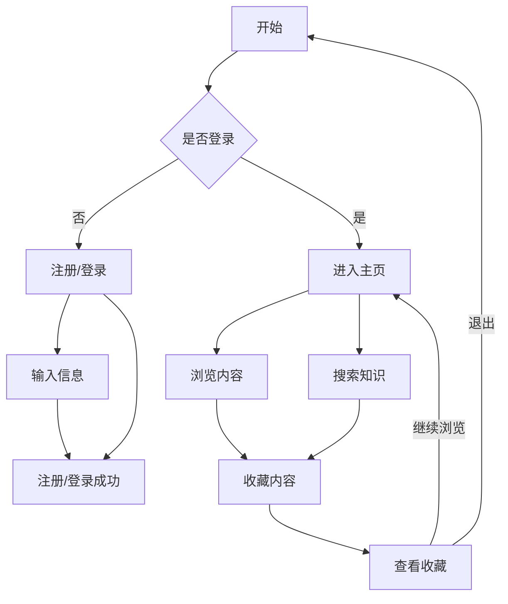

                 

### 文章标题

《知识图谱技术在个人知识管理中的应用》

### 文章关键词

知识图谱、个人知识管理、图神经网络、知识表示与建模、知识融合与更新、知识推荐、知识挖掘

### 文章摘要

本文详细探讨了知识图谱技术在个人知识管理中的应用。首先，介绍了知识图谱的基本概念、类型及其在个人知识管理中的重要性。接着，从知识表示与建模、知识抽取与构建、知识融合与更新等方面阐述了知识图谱技术的基础理论。随后，重点分析了知识图谱在个人知识库构建、知识导航、知识推荐和知识挖掘等实际应用中的具体方法和案例。最后，探讨了知识图谱技术在个人知识管理中的未来发展趋势，并提供了相关的工具和资源。通过本文的阅读，读者将对知识图谱技术及其在个人知识管理中的应用有深入的理解。

---

### 第一部分：知识图谱基础理论

#### 第1章：知识图谱概述

知识图谱是一种用于结构化语义信息的图形表示方法，通过节点（表示实体）和边（表示实体之间的关系）来组织大量数据。知识图谱技术在近年来迅速发展，并在个人知识管理中展现出广泛的应用前景。

#### 1.1 知识图谱的定义与重要性

知识图谱是一种将知识以图形的形式表示的方法。在这种表示中，节点表示实体，例如人、地点或事物，而边则表示实体之间的关系，如“是一个”、“属于”或“位于”。知识图谱可以看作是一种语义网络，它将现实世界中的复杂关系以结构化的方式呈现，便于计算机理解和处理。

知识图谱在个人知识管理中的重要性主要体现在以下几个方面：

1. **知识可视化**：知识图谱通过图形化的方式展示知识，使得复杂的知识结构变得直观易懂。
2. **知识整合**：知识图谱能够将来自不同来源的信息整合到一个统一的结构中，实现知识的集中管理和快速检索。
3. **知识推理**：知识图谱支持基于关系的推理，可以从已知的实体和关系推断出新的知识。
4. **智能搜索**：通过知识图谱，可以实现更加智能和精确的搜索结果，提高信息检索效率。

#### 1.2 知识图谱的基本构成

知识图谱由三个基本部分组成：实体、关系和属性。

1. **实体**：实体是知识图谱中的基本元素，可以是人、地点、事物等。每个实体都有一个唯一的标识符（通常是URI）。

2. **关系**：关系描述实体之间的关联，如“是一个”、“属于”、“位于”等。关系通常也具有方向和类型，例如“是一个”是类型关系，“位于”是空间关系。

3. **属性**：属性为实体提供额外的信息，如实体的名称、描述、时间戳等。属性可以用来丰富实体的信息，增强知识的表达力。

知识图谱的基本构成可以用以下数学公式表示：

$$
\text{知识图谱} = (\text{实体集}, \text{关系集}, \text{属性集})
$$

#### 1.3 知识图谱的类型与特点

知识图谱可以分为结构化知识图谱和半结构化/非结构化知识图谱。

1. **结构化知识图谱**：结构化知识图谱通常由权威数据源生成，数据结构清晰，关系明确。它采用RDF（Resource Description Framework）模型进行表示，使用URI表示实体，使用OWL（Web Ontology Language）定义实体之间的关系。

2. **半结构化/非结构化知识图谱**：半结构化/非结构化知识图谱的数据来源更加复杂，包括社交媒体、论坛等。这种知识图谱通常使用图神经网络（Graph Neural Networks，GNN）进行表示，能够学习实体之间的复杂关系。

结构化知识图谱的特点包括：

- 数据结构清晰
- 关系明确
- 易于维护和更新

半结构化/非结构化知识图谱的特点包括：

- 数据来源复杂
- 数据结构灵活
- 需要借助机器学习技术进行知识抽取和关系学习

#### 1.4 知识图谱的应用场景

知识图谱在多个领域有广泛应用，包括但不限于：

1. **智能搜索**：通过知识图谱，可以实现基于语义的搜索，提高搜索的准确性和效率。
2. **知识推荐**：利用知识图谱，可以推荐用户可能感兴趣的内容，提高用户体验。
3. **知识管理**：知识图谱可以帮助组织管理和检索知识，提高知识共享和复用的效率。
4. **智能问答**：知识图谱可以用于构建智能问答系统，回答用户的问题。

### 总结

知识图谱作为一种强大的知识表示方法，在个人知识管理中具有重要作用。本文介绍了知识图谱的基本概念、类型、基本构成以及应用场景，为后续章节的内容奠定了基础。

---

#### 1.5 知识图谱的发展历史与未来趋势

知识图谱技术的兴起可以追溯到20世纪90年代，随着互联网的普及和大数据技术的发展，知识图谱逐渐成为一种重要的知识表示和共享手段。以下是知识图谱技术的发展历程和未来趋势：

##### 1.5.1 发展历程

1. **RDF与OWL**：在知识图谱的早期，RDF（Resource Description Framework）和OWL（Web Ontology Language）成为了标准化的知识表示方法。RDF使用URI表示实体，通过属性来描述实体之间的关系，而OWL则提供了更丰富的本体语言，用于定义实体和关系。

2. **图数据库**：随着图数据库技术的成熟，如Neo4j和Apache JanusGraph，知识图谱的存储和查询变得更加高效和灵活。图数据库能够直接操作图结构数据，使得知识图谱的应用变得更加便捷。

3. **图神经网络**：近年来，图神经网络（GNN）的兴起为知识图谱领域带来了新的研究热点。GNN能够从图中学习复杂的实体关系，使得知识图谱在推荐系统、知识图谱补全等方面取得了显著的成果。

##### 1.5.2 未来趋势

1. **自动化构建与更新**：未来的知识图谱技术将更加注重自动化构建和更新。通过自然语言处理（NLP）和机器学习技术，可以从非结构化数据中自动抽取知识，构建知识图谱。

2. **跨语言与跨领域**：知识图谱的发展将朝着跨语言和跨领域应用的方向发展。通过多语言实体识别和跨领域知识融合，知识图谱将能够更好地服务于全球用户和多样化的应用场景。

3. **实时推理与智能搜索**：随着计算能力的提升，知识图谱将能够实现实时推理和智能搜索。通过引入实时数据流处理技术，知识图谱可以动态更新，并实时响应用户查询。

4. **隐私保护与安全**：随着数据隐私和安全问题日益突出，未来的知识图谱技术将更加注重隐私保护和数据安全。通过加密、差分隐私等技术，确保知识图谱的安全性和隐私性。

### 1.6 知识图谱在个人知识管理中的实际应用

知识图谱在个人知识管理中的应用不仅体现在理论层面，更体现在实际操作中。以下是一些具体的实际应用案例：

##### 1.6.1 个人知识库构建

个人知识库是个人知识管理的核心组成部分。通过知识图谱技术，可以构建一个结构化、可扩展的个人知识库，实现知识的系统化和有序化。

- **实体表示**：将个人的知识、技能、经验等作为实体进行表示。
- **关系建模**：建立实体之间的关系，如“掌握”、“应用于”等。
- **属性补充**：为每个实体补充详细的信息，如时间、地点、来源等。

通过这种方式，个人知识库不仅能够帮助用户更好地管理和查找知识，还能支持知识的积累和共享。

##### 1.6.2 知识导航

知识导航是帮助用户快速找到所需知识的工具。知识图谱在知识导航中的应用主要体现在以下几个方面：

- **知识关联**：通过知识图谱，将相关知识点关联起来，实现知识的跨领域检索。
- **智能推荐**：基于用户的兴趣和行为，知识图谱可以推荐相关的知识点，提高知识获取的效率。
- **知识地图**：通过可视化知识图谱，用户可以直观地了解知识的整体结构，从而更好地导航和探索。

##### 1.6.3 知识推荐

知识推荐是知识图谱在个人知识管理中的重要应用之一。通过知识图谱，可以构建一个个性化的知识推荐系统，为用户推荐感兴趣的知识点。

- **兴趣建模**：通过分析用户的行为和兴趣，构建用户的兴趣模型。
- **知识关联**：利用知识图谱，发现用户兴趣相关的知识点。
- **推荐算法**：基于用户的兴趣模型和知识图谱，为用户推荐相关的知识点。

##### 1.6.4 知识挖掘与发现

知识挖掘是知识图谱技术在个人知识管理中的另一个重要应用。通过知识图谱，可以挖掘出隐藏在数据中的知识，实现知识的发现和扩展。

- **实体分类**：利用知识图谱，可以对实体进行分类，发现新的知识关联。
- **关系发现**：通过分析实体之间的关系，可以发现新的知识模式。
- **知识扩展**：基于已有的知识，通过推理和扩展，生成新的知识。

### 1.7 知识图谱技术在个人知识管理中的优势与挑战

知识图谱技术在个人知识管理中具有显著的优势，但也面临一些挑战。

##### 1.7.1 优势

1. **结构化知识表示**：知识图谱能够以结构化的方式表示知识，使得知识易于管理和检索。
2. **智能搜索与推荐**：通过知识图谱，可以实现基于语义的搜索和推荐，提高知识获取的效率和准确性。
3. **知识整合与共享**：知识图谱能够整合来自不同来源的知识，实现知识的集中管理和共享。

##### 1.7.2 挑战

1. **数据质量**：知识图谱的质量取决于数据的质量，需要解决数据不完整、不一致等问题。
2. **计算资源**：知识图谱的构建和更新需要大量的计算资源，特别是在大规模数据集上。
3. **隐私保护**：知识图谱涉及到个人隐私，需要采取措施确保数据的安全性和隐私性。

### 1.8 小结

知识图谱技术在个人知识管理中具有广泛的应用前景。通过知识图谱，可以实现知识的结构化、智能化和系统化管理，提高个人知识管理的效率和效果。同时，知识图谱技术也面临一些挑战，需要不断优化和改进。本章节介绍了知识图谱的基本概念、类型、构成、应用场景、发展历史和未来趋势，为后续内容奠定了基础。

---

### 第2章：知识表示与建模

在知识图谱技术中，知识表示与建模是核心环节，决定了知识图谱的有效性和实用性。本章将深入探讨知识表示与建模的方法，包括语义网络表示、图神经网络模型及其数学基础。

#### 2.1 语义网络表示

语义网络是一种早期的知识表示方法，它通过节点（实体）和边（关系）来描述实体之间的关系。在语义网络中，每个节点表示一个实体，而边则表示实体之间的关系，如“是一个”、“属于”等。

##### 2.1.1 语义网络的组成部分

1. **节点**：节点是语义网络中的基本元素，表示实体，如“人”、“地点”等。每个节点都有一个唯一的标识符（如URI）。

2. **边**：边描述节点之间的关系，如“是一个”、“属于”等。边具有方向和类型，例如，“是父亲”是一个类型关系。

3. **属性**：属性提供额外的信息，如实体的名称、描述等。属性可以丰富节点的信息，增强知识的表达力。

##### 2.1.2 语义网络的表示方法

语义网络通常使用RDF（Resource Description Framework）进行表示。RDF采用三元组的形式（主体、谓词、客体）来描述实体之间的关系。

- **主体**：表示关系的起点，通常是节点。
- **谓词**：表示关系的类型，如“是一个”、“属于”等。
- **客体**：表示关系的终点，通常是节点。

RDF表示方法的数学公式可以表示为：

$$
\text{三元组} = (\text{主体}, \text{谓词}, \text{客体})
$$

##### 2.1.3 语义网络的应用

语义网络在知识图谱中具有广泛的应用，特别是在数据集成、语义搜索和推理等方面。

1. **数据集成**：通过语义网络，可以将来自不同数据源的信息进行整合，实现知识的集中管理和统一查询。
2. **语义搜索**：基于语义网络的表示方法，可以实现基于语义的搜索，提高搜索的准确性和效率。
3. **推理**：通过语义网络，可以基于实体之间的关系进行推理，发现新的知识关联。

#### 2.2 图神经网络模型

图神经网络（Graph Neural Networks，GNN）是一种专门用于处理图结构数据的神经网络模型。GNN能够从图中学习复杂的实体关系，为知识图谱提供了强大的表示和建模能力。

##### 2.2.1 GNN的基本原理

GNN的基本原理是通过聚合节点的邻居信息来更新节点的表示。具体来说，GNN通过以下步骤来更新节点的表示：

1. **节点特征聚合**：对于每个节点，GNN会聚合其邻居节点的特征，以更新节点的表示。
2. **节点更新**：根据聚合的特征，GNN会更新节点的表示。
3. **全局聚合**：将所有节点的表示进行全局聚合，以生成图的表示。

GNN的更新过程可以用以下伪代码表示：

python
def update_node_representation(node, neighbors):
    # 聚合邻居节点的特征
    neighbor_features = aggregate_neighbors(node, neighbors)
    # 更新节点的表示
    node_representation = node_representation + neighbor_features

def aggregate_neighbors(node, neighbors):
    # 聚合邻居节点的特征
    neighbor_features = [neighbor_representation for neighbor in neighbors]
    # 返回聚合后的特征
    return aggregate(neighbor_features)

def global_aggregation(node_representations):
    # 全局聚合节点的表示
    graph_representation = aggregate(node_representations)
    # 返回全局表示
    return graph_representation

##### 2.2.2 GNN的数学模型

GNN的数学模型可以通过以下公式来描述：

$$
\hat{h}_v^{(l)} = \sigma(\sum_{u \in \mathcal{N}(v)} W^{(l)} h_u^{(l-1)} + b^{(l)})
$$

其中，$\hat{h}_v^{(l)}$ 表示节点 $v$ 在第 $l$ 层的表示，$\mathcal{N}(v)$ 表示节点 $v$ 的邻接节点集合，$W^{(l)}$ 和 $b^{(l)}$ 分别为权重和偏置，$\sigma$ 表示激活函数。

##### 2.2.3 GNN的应用

GNN在知识图谱中的应用非常广泛，包括但不限于：

1. **知识图谱补全**：通过GNN，可以学习实体之间的关系，从而实现知识图谱的补全。
2. **实体分类**：利用GNN，可以对实体进行分类，识别出新的知识关联。
3. **知识推荐**：通过GNN，可以基于实体之间的关系推荐用户可能感兴趣的知识点。

#### 2.3 知识表示与建模的数学基础

知识表示与建模离不开数学基础的支持。以下是一些关键的数学概念和工具：

##### 2.3.1 矩阵运算

在知识图谱中，矩阵运算是一种常用的计算方法。例如，可以使用矩阵乘法来聚合节点的邻居信息：

$$
H = WH + B
$$

其中，$H$ 表示节点的表示，$W$ 表示权重矩阵，$B$ 表示偏置矩阵。

##### 2.3.2 激活函数

激活函数是神经网络中用于引入非线性变换的关键组件。常见的激活函数包括ReLU（Rectified Linear Unit）、Sigmoid和Tanh等。例如，ReLU函数可以表示为：

$$
\sigma(x) = \max(0, x)
$$

##### 2.3.3 损失函数

在知识表示与建模中，损失函数用于评估模型的性能。常见的损失函数包括均方误差（MSE）、交叉熵损失等。例如，均方误差损失可以表示为：

$$
\text{MSE} = \frac{1}{N} \sum_{i=1}^{N} (y_i - \hat{y}_i)^2
$$

其中，$y_i$ 表示真实标签，$\hat{y}_i$ 表示预测值。

#### 2.4 小结

知识表示与建模是知识图谱技术的核心环节。本章介绍了语义网络表示和图神经网络模型的基本原理，并探讨了知识表示与建模的数学基础。通过这些方法，可以有效地对知识进行表示和建模，为后续的知识抽取、知识融合和知识更新等环节提供坚实的基础。

---

### 2.5 知识表示与建模的挑战与解决方案

在知识表示与建模过程中，尽管取得了显著的进展，但仍面临一系列挑战。以下将讨论这些挑战，并提出相应的解决方案。

#### 2.5.1 数据质量

知识图谱的质量在很大程度上取决于数据的质量。数据的不完整性、不一致性和错误都会影响知识图谱的有效性。例如，数据源中的噪声和错误可能导致实体关系的不准确。

**解决方案**：

1. **数据清洗**：在构建知识图谱之前，对数据源进行清洗，去除噪声和错误。
2. **数据一致性检查**：通过比对不同数据源的信息，确保数据的一致性。
3. **数据增强**：使用数据增强技术，如数据扩充和同义词替换，提高数据的质量。

#### 2.5.2 数据源选择

选择合适的数据源是构建知识图谱的关键。不同数据源的特点和覆盖范围会影响知识图谱的完整性和准确性。例如，社交媒体数据可能包含大量的噪声，而权威数据源则可能过于有限。

**解决方案**：

1. **多源数据整合**：结合多个数据源，以获得更全面和准确的知识。
2. **数据源评估**：对不同的数据源进行评估，选择最具代表性和可靠性的数据源。
3. **数据源动态更新**：根据应用需求，动态更新数据源，确保知识图谱的实时性和准确性。

#### 2.5.3 计算资源

知识图谱的构建和更新需要大量的计算资源。特别是在大规模数据集上，计算资源的消耗会更加显著。例如，图神经网络（GNN）的训练和推理都需要高性能的计算资源。

**解决方案**：

1. **分布式计算**：使用分布式计算框架，如MapReduce，以并行处理大规模数据。
2. **高效算法**：设计和优化高效的算法，减少计算资源的消耗。
3. **硬件升级**：投资高性能的硬件设备，如GPU，以支持大规模数据处理和计算。

#### 2.5.4 知识抽象与泛化

知识表示与建模过程中，如何有效地进行知识抽象和泛化是一个挑战。抽象和泛化能力决定了知识图谱在不同场景下的应用范围和适应性。例如，如何将特定领域中的知识抽象成通用的概念和关系。

**解决方案**：

1. **领域自适应**：通过领域自适应技术，将特定领域的知识迁移到其他领域。
2. **知识融合**：通过知识融合技术，将不同领域中的知识进行整合，形成统一的表示。
3. **迁移学习**：利用迁移学习方法，将预训练的知识模型应用到新的任务中。

#### 2.5.5 知识更新与维护

知识图谱需要不断地更新和维护，以保持其准确性和时效性。然而，知识更新和维护是一个复杂的过程，涉及知识抽取、关系推理、数据整合等多个环节。

**解决方案**：

1. **自动化更新**：通过自动化技术，如自然语言处理（NLP）和机器学习，实现知识图谱的自动化更新。
2. **实时监控**：实时监控知识图谱的状态，及时识别和修复知识错误。
3. **社区参与**：鼓励社区成员参与知识图谱的构建和更新，提高知识的多样性和准确性。

#### 2.5.6 隐私保护与安全性

在知识图谱中，个人隐私和数据安全是重要问题。知识图谱可能包含敏感信息，如个人身份信息、行为记录等，需要采取措施确保数据的安全性和隐私性。

**解决方案**：

1. **数据加密**：使用数据加密技术，如对称加密和非对称加密，保护数据的机密性。
2. **隐私保护算法**：采用隐私保护算法，如差分隐私和同态加密，确保数据在处理过程中的隐私性。
3. **访问控制**：实施严格的访问控制策略，限制对知识图谱的访问权限，防止未经授权的数据泄露。

#### 2.5.7 跨语言与跨领域知识表示

知识图谱在不同语言和领域之间的表示和融合是一个挑战。不同语言和文化背景可能导致实体和关系的表示差异，影响知识图谱的一致性和通用性。

**解决方案**：

1. **多语言知识图谱**：构建多语言知识图谱，支持多种语言的实体和关系表示。
2. **跨语言映射**：通过跨语言映射技术，将不同语言中的实体和关系进行统一表示。
3. **领域特定知识表示**：针对不同领域，设计领域特定的知识表示方法，提高知识图谱的领域适应性。

#### 2.5.8 知识推理与解释性

知识图谱中的知识推理和解释性是重要的应用需求。然而，目前的图神经网络模型在推理和解释性方面仍存在一定局限性。

**解决方案**：

1. **增强推理能力**：通过设计更复杂的图神经网络模型，提高知识图谱的推理能力。
2. **可解释性方法**：采用可解释性方法，如可视化技术和解释性模型，提高知识图谱的可解释性。
3. **用户参与**：鼓励用户参与知识图谱的构建和更新，提高知识图谱的实用性和解释性。

#### 2.5.9 交互式知识构建

知识图谱的构建和维护需要用户的参与和反馈。然而，目前的交互式知识构建方法仍然不够灵活和高效。

**解决方案**：

1. **半监督学习方法**：结合用户标注和自动抽取的信息，采用半监督学习方法构建知识图谱。
2. **交互式知识编辑**：设计用户友好的知识编辑界面，支持用户的实时反馈和修改。
3. **协同过滤**：利用协同过滤技术，推荐用户可能感兴趣的知识点和关系，提高知识构建的效率。

#### 2.5.10 持续改进与优化

知识图谱技术的持续改进和优化是知识图谱发展的关键。随着技术的进步和应用需求的不断变化，知识图谱需要不断调整和优化。

**解决方案**：

1. **反馈循环**：建立反馈循环机制，收集用户反馈和评估指标，指导知识图谱的优化和改进。
2. **持续学习**：利用机器学习和自然语言处理技术，实现知识图谱的持续学习和进化。
3. **多学科合作**：跨学科合作，结合计算机科学、人工智能、社会科学等多领域的知识和方法，推动知识图谱技术的持续发展。

### 2.6 小结

知识表示与建模是知识图谱技术的核心环节，尽管面临诸多挑战，但通过不断的研究和优化，知识表示与建模技术正逐渐成熟。本章讨论了知识表示与建模的挑战和解决方案，为后续章节的内容提供了理论基础和实践指导。

---

### 第3章：知识抽取与构建

知识抽取与构建是知识图谱技术的关键环节，涉及到从原始数据中提取知识，并构建出结构化的知识图谱。本章将深入探讨知识抽取与构建的方法，包括数据源的选择与处理、实体识别与关系抽取、知识图谱的构建方法与流程。

#### 3.1 数据源的选择与处理

在构建知识图谱时，选择合适的数据源是至关重要的。数据源的质量直接影响知识图谱的完整性和准确性。

##### 3.1.1 数据源的类型

常见的数据源包括：

1. **结构化数据源**：如关系数据库、电子表格等，数据以表格形式组织，具有明确的字段和类型。
2. **半结构化数据源**：如XML、JSON等，数据具有一定的结构，但格式较为灵活。
3. **非结构化数据源**：如文本、图像、音频等，数据无固定结构，需要通过处理才能提取有用信息。

##### 3.1.2 数据源的选择标准

选择数据源时，应考虑以下标准：

1. **数据质量**：数据源应具有较高的数据质量，包括准确性、完整性和一致性。
2. **数据量**：数据量应足够大，以保证知识图谱的覆盖面和丰富性。
3. **数据格式**：数据源应支持易于处理和转换的格式，以减少数据处理的复杂性。
4. **数据更新频率**：数据源应具有较快的更新频率，以确保知识图谱的时效性。

##### 3.1.3 数据源的处理

在构建知识图谱之前，需要对数据源进行预处理，以提高数据质量。常见的数据处理方法包括：

1. **数据清洗**：去除数据中的噪声和错误，如缺失值、重复值、异常值等。
2. **数据转换**：将不同格式和类型的数据转换为统一的格式，以便于后续处理。
3. **数据整合**：将来自多个数据源的信息进行整合，形成统一的数据集。

#### 3.2 实体识别与关系抽取

实体识别与关系抽取是知识图谱构建的核心步骤。实体识别旨在识别文本中的实体，如人名、地点、组织等；关系抽取则旨在识别实体之间的关系，如“工作于”、“位于”等。

##### 3.2.1 实体识别

实体识别方法主要包括以下几种：

1. **规则方法**：基于预定义的规则，如命名实体识别（NER）工具，对文本进行实体标注。
2. **机器学习方法**：使用机器学习模型，如支持向量机（SVM）、循环神经网络（RNN）等，对文本进行实体识别。
3. **深度学习方法**：使用深度学习模型，如卷积神经网络（CNN）、Transformer等，对文本进行实体识别。

##### 3.2.2 关系抽取

关系抽取方法主要包括以下几种：

1. **规则方法**：基于预定义的规则，从文本中提取实体之间的关系。
2. **统计方法**：使用统计模型，如条件概率模型、朴素贝叶斯等，从文本中推断实体之间的关系。
3. **深度学习方法**：使用深度学习模型，如长短期记忆网络（LSTM）、Transformer等，从文本中提取实体之间的关系。

##### 3.2.3 实体识别与关系抽取的挑战

1. **数据不足**：实体识别和关系抽取通常需要大量的标注数据，但在实际应用中，标注数据可能不足。
2. **上下文依赖**：实体和关系往往依赖于上下文，如何在复杂的上下文中准确识别实体和关系是一个挑战。
3. **多样性**：实体和关系的表达方式多样，如何处理不同表达方式的实体和关系是一个挑战。

##### 3.2.4 实体识别与关系抽取的解决方案

1. **数据增强**：通过数据增强技术，如数据扩充、同义词替换等，增加训练数据的多样性。
2. **上下文建模**：使用深度学习模型，如Transformer、BERT等，捕捉上下文信息，提高实体识别和关系抽取的准确性。
3. **多模型融合**：结合多种方法，如规则方法、机器学习方法、深度学习方法等，提高实体识别和关系抽取的效果。

#### 3.3 知识图谱的构建方法与流程

知识图谱的构建方法与流程主要包括以下步骤：

1. **数据预处理**：对原始数据进行清洗、转换和整合，形成统一的数据集。
2. **实体识别**：使用实体识别方法，从数据中识别出实体。
3. **关系抽取**：使用关系抽取方法，从数据中提取实体之间的关系。
4. **实体与关系建模**：将识别出的实体和关系进行建模，形成知识图谱。
5. **知识融合**：将来自不同数据源的知识进行融合，形成统一的、结构化的知识图谱。
6. **知识更新**：定期更新知识图谱，以保持其准确性和时效性。

##### 3.3.1 知识图谱构建流程示例

以下是知识图谱构建的一个示例流程：

1. **数据预处理**：
   - 清洗数据，去除噪声和错误。
   - 将不同格式的数据转换为统一的JSON格式。

2. **实体识别**：
   - 使用BERT模型对文本进行实体识别。
   - 输出实体列表，包括实体名称、实体类型等。

3. **关系抽取**：
   - 使用基于Transformer的关系抽取模型。
   - 输出实体之间的关系，包括关系类型、关系强度等。

4. **实体与关系建模**：
   - 将实体和关系进行建模，形成图结构。
   - 使用Neo4j数据库存储知识图谱。

5. **知识融合**：
   - 将来自不同数据源的知识进行融合。
   - 通过图数据库的图计算功能，实现知识的整合。

6. **知识更新**：
   - 定期从数据源中获取新数据。
   - 使用图数据库的图更新功能，实现知识图谱的动态更新。

#### 3.4 小结

知识抽取与构建是知识图谱技术的关键环节，涉及到数据源的选择与处理、实体识别与关系抽取、知识图谱的构建方法与流程。本章介绍了知识抽取与构建的方法和流程，为构建有效的知识图谱提供了理论基础和实践指导。

---

### 第4章：知识融合与更新

知识融合与更新是知识图谱技术的核心环节之一，涉及到如何将不同来源的数据进行整合，并保持知识图谱的准确性和时效性。本章将详细探讨知识融合与更新的策略、机制及其应用。

#### 4.1 知识融合策略

知识融合策略旨在将来自多个数据源的信息进行整合，以形成统一和结构化的知识图谱。以下是一些常用的知识融合策略：

##### 4.1.1 数据集成

数据集成是将来自多个数据源的信息进行整合，形成统一的数据视图。数据集成策略通常包括以下步骤：

1. **数据清洗**：去除数据中的噪声和错误，如缺失值、重复值等。
2. **数据转换**：将不同格式和类型的数据转换为统一的格式，以便于后续处理。
3. **数据整合**：将来自多个数据源的信息进行整合，形成统一的数据集。

##### 4.1.2 数据对齐

数据对齐是将不同数据源中的相同实体进行匹配，以实现数据的统一表示。数据对齐策略通常包括以下步骤：

1. **实体识别**：使用实体识别技术，从不同数据源中识别出相同的实体。
2. **关系抽取**：使用关系抽取技术，从不同数据源中提取实体之间的关系。
3. **实体与关系匹配**：将相同实体和关系进行匹配，以形成统一的数据视图。

##### 4.1.3 数据融合

数据融合是将多个数据源中的信息进行整合，以形成更加丰富和全面的知识图谱。数据融合策略通常包括以下步骤：

1. **数据一致性检查**：检查数据源之间的一致性，如实体名称、属性值等。
2. **数据互补性分析**：分析数据源之间的互补性，以确定哪些数据源提供的信息对知识图谱的贡献最大。
3. **数据整合**：将多个数据源中的信息进行整合，形成统一的知识图谱。

##### 4.1.4 数据更新

数据更新是保持知识图谱准确性和时效性的重要手段。数据更新策略通常包括以下步骤：

1. **数据源监控**：监控数据源的更新情况，以确定何时进行数据更新。
2. **数据抽取**：从数据源中抽取新的数据，并将其与现有知识图谱进行整合。
3. **知识图谱更新**：更新知识图谱，以反映最新的数据。

#### 4.2 知识图谱的更新机制

知识图谱的更新机制是指如何动态地更新知识图谱，以保持其准确性和时效性。以下是一些常用的更新机制：

##### 4.2.1 实时更新

实时更新是指知识图谱能够实时反映数据源的变化。实时更新机制通常包括以下步骤：

1. **事件监听**：监听数据源的事件，如数据更新、数据删除等。
2. **数据抽取**：从数据源中抽取最新的数据。
3. **知识图谱更新**：更新知识图谱，以反映最新的数据。

##### 4.2.2 定期更新

定期更新是指知识图谱定期进行更新，以保持其准确性和时效性。定期更新机制通常包括以下步骤：

1. **数据源评估**：评估数据源的质量和更新频率，以确定何时进行数据更新。
2. **数据抽取**：从数据源中抽取最新的数据。
3. **知识图谱更新**：更新知识图谱，以反映最新的数据。

##### 4.2.3 异步更新

异步更新是指知识图谱的更新可以在后台进行，以减少对系统性能的影响。异步更新机制通常包括以下步骤：

1. **数据源监控**：监控数据源的更新情况，并将更新任务放入任务队列。
2. **任务执行**：执行更新任务，从数据源中抽取最新的数据，并更新知识图谱。
3. **结果反馈**：将更新结果反馈给用户，以确认更新是否成功。

#### 4.3 知识图谱的动态维护

知识图谱的动态维护是指如何保持知识图谱的完整性、一致性和准确性。以下是一些常用的动态维护策略：

##### 4.3.1 数据质量监控

数据质量监控是指监控知识图谱中的数据质量，以识别和修复数据错误。数据质量监控策略通常包括以下步骤：

1. **数据校验**：对知识图谱中的数据进行检查，识别数据错误。
2. **错误修复**：修复数据错误，确保数据质量。

##### 4.3.2 实体生命周期管理

实体生命周期管理是指管理知识图谱中实体的创建、更新和删除。实体生命周期管理策略通常包括以下步骤：

1. **实体创建**：创建新的实体，并将其添加到知识图谱中。
2. **实体更新**：更新实体的属性和关系，以反映最新的数据。
3. **实体删除**：删除无效或过时的实体，以保持知识图谱的整洁。

##### 4.3.3 知识图谱补全

知识图谱补全是通过推理和扩展来补充知识图谱中的缺失信息。知识图谱补全策略通常包括以下步骤：

1. **缺失检测**：检测知识图谱中的缺失信息。
2. **推理扩展**：使用推理算法和扩展技术，生成新的实体和关系，以补充缺失信息。
3. **知识图谱更新**：更新知识图谱，以包含新的实体和关系。

#### 4.4 知识图谱在动态环境中的应用

知识图谱在动态环境中具有广泛的应用，如智能问答、智能推荐和智能搜索等。以下是一些典型的应用案例：

##### 4.4.1 智能问答

智能问答系统利用知识图谱，可以实现基于语义的问答。智能问答系统的工作流程通常包括以下步骤：

1. **问题解析**：将用户的问题转换为语义表示。
2. **知识图谱查询**：在知识图谱中查找与问题相关的实体和关系。
3. **答案生成**：根据查询结果生成答案，并呈现给用户。

##### 4.4.2 智能推荐

智能推荐系统利用知识图谱，可以推荐用户可能感兴趣的内容。智能推荐系统的工作流程通常包括以下步骤：

1. **用户兴趣建模**：分析用户的历史行为，建立用户兴趣模型。
2. **知识图谱查询**：在知识图谱中查找与用户兴趣相关的实体和关系。
3. **推荐生成**：根据查询结果生成推荐列表，并呈现给用户。

##### 4.4.3 智能搜索

智能搜索系统利用知识图谱，可以实现基于语义的搜索。智能搜索系统的工作流程通常包括以下步骤：

1. **查询解析**：将用户的查询转换为语义表示。
2. **知识图谱查询**：在知识图谱中查找与查询相关的实体和关系。
3. **搜索结果排序**：根据查询结果的相关性对搜索结果进行排序，并呈现给用户。

#### 4.5 小结

知识融合与更新是知识图谱技术的关键环节，涉及到知识融合策略、更新机制和动态维护。本章介绍了知识融合与更新的方法和技术，为构建和维护有效的知识图谱提供了理论基础和实践指导。

---

### 第5章：个人知识库构建

个人知识库是个人知识管理的核心组成部分，通过系统化和结构化的方式存储、管理和利用个人知识。本章将详细探讨个人知识库的概念、构建方法及其在个人知识管理中的应用。

#### 5.1 个人知识库的概念与作用

个人知识库（Personal Knowledge Base，PKB）是一个用于存储个人知识的工具，它将个人的知识、经验、思考和见解以结构化的方式组织起来。个人知识库不仅帮助个人高效地管理和利用知识，还能够促进知识的积累和创新。

**个人知识库的概念**：

- **知识**：个人知识库中的知识包括事实、观点、技能、经验等。
- **结构化**：个人知识库通过分类、标签、关系等方式，对知识进行结构化组织。
- **存储**：个人知识库将知识存储在数字化的媒介中，便于检索和使用。
- **管理**：个人知识库提供一系列管理功能，如搜索、更新、共享等。

**个人知识库的作用**：

1. **知识整合**：通过个人知识库，可以整合分散的知识，实现知识的集中管理和快速检索。
2. **知识共享**：个人知识库支持知识的共享和传播，促进知识的积累和创新。
3. **知识传承**：个人知识库可以帮助个人在职业生涯中持续积累知识，实现知识的传承。
4. **知识创新**：通过个人知识库，可以促进知识的交叉融合和创新，提高个人解决问题的能力。

#### 5.2 个人知识库的构建方法

构建个人知识库是一个系统性的过程，涉及知识收集、知识整理、知识存储和知识利用等多个环节。以下是一些常见的个人知识库构建方法：

##### 5.2.1 知识收集

知识收集是构建个人知识库的第一步，涉及到从各种来源获取知识。知识收集的方法包括：

1. **主动获取**：通过阅读书籍、文章、报告等，主动获取知识。
2. **被动获取**：通过听讲座、参加研讨会、观察他人等，被动获取知识。
3. **网络搜索**：利用互联网资源，搜索和获取相关知识。
4. **经验积累**：通过实践和反思，积累个人的经验和见解。

##### 5.2.2 知识整理

知识整理是对收集到的知识进行筛选、分类和标注的过程。知识整理的方法包括：

1. **分类**：将知识按照主题、领域或层次结构进行分类。
2. **标签**：为知识添加标签，以方便后续检索和使用。
3. **摘要**：对知识进行简要的概括和总结，提高知识的可读性和易用性。
4. **关联**：建立知识之间的关联，实现知识的交叉融合。

##### 5.2.3 知识存储

知识存储是将整理后的知识存储在数字化的媒介中。常见的知识存储方法包括：

1. **文档存储**：将知识以文档的形式存储，如Word文档、Markdown文档等。
2. **数据库存储**：将知识存储在关系数据库或NoSQL数据库中，如MySQL、MongoDB等。
3. **知识图谱存储**：将知识以知识图谱的形式存储，利用图数据库或图存储系统，如Neo4j、JanusGraph等。

##### 5.2.4 知识利用

知识利用是指通过个人知识库来获取、应用和创新知识。知识利用的方法包括：

1. **知识检索**：通过关键词搜索、分类导航等方式，快速找到所需的知识。
2. **知识共享**：将个人知识库中的知识与他人共享，实现知识的传播和积累。
3. **知识应用**：将知识应用于实际问题中，解决实际问题和提高工作效率。
4. **知识创新**：通过知识的交叉融合和创新，产生新的思想和见解。

#### 5.3 个人知识库的实例分析

以下是一个个人知识库的实例分析，展示了个人知识库的构建和使用过程：

**实例**：张三的个人知识库

- **知识收集**：
  - 张三通过阅读技术书籍、参加技术会议和在线学习平台，收集了大量的技术知识。
  - 他还通过在工作中遇到的问题和解决方案，积累了丰富的实践经验。

- **知识整理**：
  - 张三将收集到的知识按照技术领域进行分类，如前端开发、后端开发、数据库等。
  - 他为每个知识点添加了标签，如“Vue.js”、“Django”、“SQL”等。
  - 张三还对每个知识点进行了摘要，简要概括了知识的核心内容。

- **知识存储**：
  - 张三使用Markdown文档将整理后的知识存储在本地电脑中，便于编辑和查看。
  - 他还使用Git进行版本控制，确保知识库的版本管理和更新。

- **知识利用**：
  - 张三通过关键词搜索，快速找到所需的知识点，提高了工作效率。
  - 他将知识库中的知识与他人分享，参与了多个技术讨论和协作项目。
  - 张三还将知识应用于实际问题中，解决了工作中遇到的技术难题。

**实例分析小结**：

通过个人知识库，张三实现了知识的系统化管理和高效利用，提高了工作效率和创新能力。这个实例展示了个人知识库构建和使用的全过程，为其他人提供了借鉴和参考。

#### 5.4 个人知识库的优势与挑战

个人知识库在个人知识管理中具有显著的优势，但也面临一些挑战。

##### 5.4.1 优势

1. **知识整合**：个人知识库能够将分散的知识进行整合，实现知识的集中管理和高效检索。
2. **知识共享**：个人知识库支持知识的共享和传播，促进知识的积累和创新。
3. **知识传承**：个人知识库可以帮助个人在职业生涯中持续积累知识，实现知识的传承。
4. **知识创新**：通过个人知识库，可以促进知识的交叉融合和创新，提高个人解决问题的能力。

##### 5.4.2 挑战

1. **数据质量**：知识库的数据质量直接影响其效果，需要确保数据的质量和准确性。
2. **数据冗余**：随着知识的积累，知识库中可能会出现重复和冗余的数据，需要及时清理和整理。
3. **知识更新**：知识库需要定期更新，以保持知识的时效性和准确性。
4. **知识利用**：如何高效地利用知识库中的知识，提高知识的应用价值，是一个挑战。

##### 5.4.3 解决方案

1. **数据质量控制**：通过数据清洗、数据校验等手段，确保知识库中的数据质量。
2. **数据整理**：定期对知识库中的数据进行整理和清理，去除重复和冗余的数据。
3. **知识更新**：建立知识更新机制，定期更新知识库中的内容，确保知识的时效性。
4. **知识利用**：通过知识检索、知识共享、知识应用等方式，提高知识库的利用效率。

#### 5.5 小结

个人知识库是个人知识管理的核心工具，通过系统化和结构化的方式存储、管理和利用个人知识。本章介绍了个人知识库的概念、构建方法和应用实例，以及个人知识库的优势和挑战。通过本章的内容，读者可以更好地理解和应用个人知识库，提高个人知识管理的效率和效果。

---

### 第6章：知识图谱在知识导航中的应用

知识导航是知识图谱技术在个人知识管理中的重要应用，旨在帮助用户高效地浏览和查找知识。本章将深入探讨知识图谱在知识导航中的应用，包括知识导航的概念与需求、基于知识图谱的知识导航技术、知识导航系统的设计与实现。

#### 6.1 知识导航的概念与需求

知识导航是一种基于知识图谱的导航技术，它通过结构化的知识表示，为用户提供了一种直观、高效的知识浏览和查找方式。知识导航的核心目标是为用户提供一种简单易用的接口，使用户能够快速找到所需的知识点。

##### 6.1.1 知识导航的概念

知识导航（Knowledge Navigation）是一种基于知识图谱的导航技术，它利用知识图谱中的实体和关系，帮助用户在大量的知识信息中快速找到目标知识点。知识导航系统通常包括以下几个组成部分：

1. **知识图谱**：作为知识导航的基础，知识图谱提供了结构化的知识表示，描述了实体之间的关系。
2. **搜索引擎**：通过搜索引擎，用户可以输入关键词或查询条件，快速查找相关的知识点。
3. **导航界面**：导航界面为用户提供了一个直观的浏览和搜索体验，通常包括目录树、标签云、关联推荐等功能。

##### 6.1.2 知识导航的需求

知识导航技术在个人知识管理中具有以下需求：

1. **快速检索**：用户需要能够快速找到所需的知识点，以节省时间和精力。
2. **结构化浏览**：用户需要一个结构化的导航界面，方便地浏览和探索相关的知识点。
3. **个性化推荐**：根据用户的兴趣和行为，提供个性化的知识推荐，提高知识利用效率。
4. **实时更新**：知识导航系统需要能够实时更新知识图谱，以反映最新的知识信息。

#### 6.2 基于知识图谱的知识导航技术

基于知识图谱的知识导航技术主要包括以下几个方面：

##### 6.2.1 知识图谱可视化

知识图谱可视化是将知识图谱以图形化的方式展示出来，使用户能够直观地了解知识结构。常见的知识图谱可视化工具包括Gephi、D3.js等。

Mermaid流程图示例：

mermaid
graph TD
    A[知识图谱] --> B[可视化工具]
    B --> C[图形展示]
    C --> D{交互式浏览}

##### 6.2.2 关键路径分析

关键路径分析是通过分析知识图谱中的实体和关系，找出用户从起点到目标知识点之间的最短路径。关键路径分析可以帮助用户快速定位目标知识点。

伪代码示例：

python
def find_key_path(start_entity, target_entity, knowledge_graph):
    # 初始化路径和距离
    paths = [[start_entity]]
    distances = {start_entity: 0}
    
    # 搜索最短路径
    while paths:
        current_path = paths.pop(0)
        current_entity = current_path[-1]
        
        # 遍历邻居节点
        for neighbor in knowledge_graph.neighbors(current_entity):
            new_path = current_path + [neighbor]
            new_distance = distances[current_entity] + 1
            
            # 更新路径和距离
            if neighbor not in distances or new_distance < distances[neighbor]:
                distances[neighbor] = new_distance
                paths.append(new_path)
                
                # 找到目标节点
                if neighbor == target_entity:
                    return new_path
    
    # 未找到路径
    return None

##### 6.2.3 关联推荐

关联推荐是基于知识图谱中的实体和关系，为用户推荐相关的知识点。关联推荐可以帮助用户发现新的知识点，拓展知识视野。

数学模型示例：

$$
\text{相关度} = \sum_{r \in R} w_r \cdot \text{相关度}(e_1, e_2)
$$

其中，$e_1$ 和 $e_2$ 为实体，$R$ 为关系集合，$w_r$ 为关系权重，$\text{相关度}(e_1, e_2)$ 为实体 $e_1$ 和 $e_2$ 之间的相关度。

#### 6.3 知识导航系统的设计与实现

知识导航系统的设计与实现需要考虑以下几个方面：

##### 6.3.1 系统架构设计

知识导航系统通常采用分布式架构，包括前端、后端和数据库三个部分。前端负责用户界面展示和交互，后端负责处理业务逻辑和数据存储，数据库存储知识图谱数据。

Mermaid流程图示例：

mermaid
graph TD
    A[用户] --> B[前端]
    B --> C[后端]
    C --> D[数据库]
    C --> E{知识图谱处理}
    B --> F{用户反馈处理}

##### 6.3.2 前端实现

前端实现主要涉及用户界面的设计和实现，包括目录树、标签云、搜索框等组件。前端技术栈通常包括HTML、CSS、JavaScript等。

伪代码示例：

html
<div id="knowledge-navigation">
  <input type="text" id="search-box" placeholder="搜索知识点...">
  <div id="directory-tree"></div>
  <div id="tag-cloud"></div>
</div>

javascript
function search_knowledge(query) {
  // 搜索知识点
  // 使用AJAX调用后端接口，获取搜索结果
  fetch('/api/search?query=' + query)
    .then(response => response.json())
    .then(data => display_search_results(data));
}

function display_search_results(results) {
  // 展示搜索结果
  // 使用模板引擎渲染搜索结果列表
  const template = '<ul>{{#each results}}<li>{{this.name}} - {{this.description}}</li>{{/each}}</ul>';
  const result_list = Mustache.render(template, { results });
  document.getElementById('directory-tree').innerHTML = result_list;
}

##### 6.3.3 后端实现

后端实现主要涉及业务逻辑的处理和知识图谱的存储与查询。后端技术栈通常包括Python、Java、Node.js等。

伪代码示例：

python
from flask import Flask, request, jsonify

app = Flask(__name__)

@app.route('/api/search', methods=['GET'])
def search_knowledge():
    query = request.args.get('query')
    results = search_knowledge_in_graph(query)
    return jsonify(results)

def search_knowledge_in_graph(query):
    # 在知识图谱中搜索相关知识点
    # 返回搜索结果列表
    pass

##### 6.3.4 数据库实现

数据库实现主要涉及知识图谱的存储与查询。图数据库如Neo4j、JanusGraph等是常用的知识图谱存储解决方案。

伪代码示例：

python
from py2neo import Graph

graph = Graph("bolt://localhost:7687", auth=("neo4j", "password"))

def create_knowledge_node(entity, properties):
    # 创建实体节点
    graph.run("CREATE (n:$entity {properties}) RETURN n", entity=entity, properties=properties)

def create_knowledge_relationship(entity1, entity2, relationship, properties):
    # 创建实体之间的关系
    graph.run("MATCH (n1:$entity1), (n2:$entity2) CREATE (n1)-[r:$relationship {properties}]->(n2) RETURN r", entity1=entity1, entity2=entity2, relationship=relationship, properties=properties)

##### 6.3.5 系统集成与测试

系统集成与测试是知识导航系统开发的重要环节。通过集成前端、后端和数据库，并进行功能测试和性能测试，确保系统稳定可靠。

伪代码示例：

python
import unittest

class TestKnowledgeNavigation(unittest.TestCase):
    def test_search_knowledge(self):
        # 测试搜索功能
        query = "Python"
        results = search_knowledge(query)
        self.assertIsNotNone(results)
        self.assertTrue(len(results) > 0)

    def test_create_knowledge_node(self):
        # 测试创建实体节点
        entity = "Book"
        properties = {"name": "Effective Java"}
        create_knowledge_node(entity, properties)
        node = graph.run("MATCH (n:$entity) WHERE n.name = 'Effective Java' RETURN n").data()[0]["n"]
        self.assertIsNotNone(node)

    def test_create_knowledge_relationship(self):
        # 测试创建实体关系
        entity1 = "Author"
        entity2 = "Book"
        relationship = "WROTE"
        properties = {"year": 2008}
        create_knowledge_relationship(entity1, entity2, relationship, properties)
        relationship = graph.run("MATCH (n1)-[r:$relationship]->(n2) WHERE n2.name = 'Effective Java' RETURN r").data()[0]["r"]
        self.assertIsNotNone(relationship)

if __name__ == '__main__':
    unittest.main()

#### 6.4 小结

知识导航是知识图谱技术在个人知识管理中的重要应用，通过结构化的知识表示和高效的搜索算法，帮助用户快速找到所需的知识。本章介绍了知识导航的概念与需求、基于知识图谱的知识导航技术、知识导航系统的设计与实现，为构建高效的个人知识导航系统提供了理论基础和实践指导。

---

### 第7章：知识图谱在知识推荐中的应用

知识推荐是知识图谱技术在个人知识管理中的另一个重要应用，旨在根据用户的兴趣和行为，推荐用户可能感兴趣的知识点。本章将深入探讨知识图谱在知识推荐中的应用，包括知识推荐的基本概念、知识图谱在知识推荐中的应用、基于知识图谱的知识推荐系统实现。

#### 7.1 知识推荐的基本概念

知识推荐（Knowledge Recommendation）是一种基于用户兴趣和行为，向用户推荐相关知识和信息的技术。知识推荐的目标是提高用户的满意度，帮助用户发现和获取感兴趣的知识。

##### 7.1.1 知识推荐的概念

知识推荐系统是一个智能系统，它根据用户的兴趣、行为和历史数据，分析用户的偏好，并推荐与之相关的知识和信息。知识推荐系统通常包括以下几个关键组成部分：

1. **用户**：知识推荐系统的目标用户，拥有自己的兴趣和行为数据。
2. **知识库**：存储大量知识和信息的数据源，包括文本、图片、视频等多种形式。
3. **推荐算法**：根据用户的兴趣和行为，从知识库中筛选出相关的知识和信息，并推荐给用户。
4. **推荐引擎**：负责执行推荐算法，生成推荐结果，并呈现给用户。

##### 7.1.2 知识推荐的目标

知识推荐系统的目标主要包括：

1. **提高用户满意度**：通过推荐用户感兴趣的知识，提高用户的满意度和体验。
2. **提升知识利用效率**：通过推荐相关的知识，帮助用户更快地获取所需信息，提高知识利用效率。
3. **促进知识传播**：通过推荐系统，将知识从一部分用户传播到更多用户，促进知识的共享和传播。

#### 7.2 知识图谱在知识推荐中的应用

知识图谱为知识推荐提供了一种有效的数据结构和推理工具，可以帮助推荐系统更好地理解用户的兴趣和知识之间的关系。

##### 7.2.1 知识图谱在知识推荐中的作用

1. **知识表示**：知识图谱能够以结构化的方式表示知识，包括实体、关系和属性。这种结构化的知识表示有助于推荐系统更准确地理解知识的含义和关联。
2. **关系发现**：知识图谱中的实体关系为推荐系统提供了丰富的信息，可以帮助发现用户和知识之间的潜在关联，提高推荐的相关性。
3. **推理能力**：知识图谱支持基于关系的推理，可以通过逻辑推理和图谱搜索，发现新的知识关联，从而生成更加精准的推荐结果。

##### 7.2.2 知识图谱在知识推荐中的应用方法

1. **基于内容的推荐**：通过知识图谱，可以获取知识的内容特征，如标题、描述、标签等，并基于这些内容特征进行推荐。这种方法适用于推荐与用户兴趣高度相关的知识。
2. **基于协同过滤的推荐**：利用知识图谱中的用户兴趣和行为数据，进行协同过滤，发现用户的兴趣模式，并推荐与之相关的知识。这种方法适用于推荐个性化的知识。
3. **基于图神经网络的推荐**：利用图神经网络（GNN）学习知识图谱中的复杂关系，为用户提供精准的知识推荐。这种方法适用于推荐复杂和关联性强的知识。
4. **混合推荐**：结合基于内容的推荐、协同过滤和图神经网络等方法，生成综合性的推荐结果，提高推荐的准确性和多样性。

#### 7.3 基于知识图谱的知识推荐系统实现

以下是一个基于知识图谱的知识推荐系统的实现框架，包括系统架构、算法流程、关键技术等。

##### 7.3.1 系统架构

基于知识图谱的知识推荐系统通常包括以下模块：

1. **用户模块**：负责处理用户注册、登录、个人信息管理等操作。
2. **知识模块**：负责知识库的构建和维护，包括知识抽取、知识表示、知识融合等。
3. **推荐模块**：负责根据用户兴趣和行为，生成推荐列表。
4. **服务模块**：负责处理用户请求，提供推荐接口。

Mermaid流程图示例：

mermaid
graph TD
    A[用户模块] --> B[知识模块]
    B --> C[推荐模块]
    C --> D[服务模块]
    A --> D
    B --> D
    C --> D

##### 7.3.2 算法流程

基于知识图谱的知识推荐系统的工作流程通常包括以下几个步骤：

1. **用户兴趣建模**：根据用户的行为和历史数据，建立用户兴趣模型。
2. **知识表示**：将知识库中的知识进行结构化表示，如实体、关系和属性。
3. **知识融合**：将来自不同数据源的知识进行融合，形成统一的知识表示。
4. **推荐算法**：利用知识图谱和用户兴趣模型，生成推荐列表。
5. **推荐结果优化**：对推荐结果进行排序和筛选，提高推荐的相关性和多样性。

伪代码示例：

python
class KnowledgeRecommender:
    def __init__(self, knowledge_graph, user_model):
        self.knowledge_graph = knowledge_graph
        self.user_model = user_model

    def recommend_knowledge(self, user_id):
        # 根据用户兴趣模型，获取用户感兴趣的实体
        interested_entities = self.user_model.get_interested_entities(user_id)
        
        # 根据知识图谱，获取与用户感兴趣的实体相关的知识
        related_knowledge = self.knowledge_graph.get_related_knowledge(interested_entities)
        
        # 对相关知识进行排序和筛选
        recommended_knowledge = self.sort_and_filter_knowledge(related_knowledge)
        
        return recommended_knowledge

    def sort_and_filter_knowledge(self, knowledge_list):
        # 根据相关性对知识进行排序
        sorted_knowledge = sorted(knowledge_list, key=lambda x: x['relevance'], reverse=True)
        
        # 筛选出前N个推荐结果
        filtered_knowledge = sorted_knowledge[:N]
        
        return filtered_knowledge

##### 7.3.3 关键技术

1. **知识图谱构建**：使用图数据库（如Neo4j）存储和管理知识图谱，支持高效的查询和更新。
2. **用户兴趣建模**：利用自然语言处理（NLP）技术，分析用户行为和评论，建立用户兴趣模型。
3. **推荐算法**：结合基于内容的推荐、协同过滤和图神经网络等方法，生成精准的推荐结果。
4. **推荐结果优化**：利用排序和筛选算法，提高推荐结果的相关性和多样性。

#### 7.4 基于知识图谱的知识推荐系统实现

以下是一个基于知识图谱的知识推荐系统的具体实现，包括开发环境搭建、源代码实现和代码解读。

##### 7.4.1 开发环境搭建

1. **环境要求**：
   - 操作系统：Windows/Linux/MacOS
   - 开发语言：Python
   - 图数据库：Neo4j
   - 依赖库：Py2Neo、Flask等

2. **环境搭建步骤**：
   - 安装Python（推荐版本3.8以上）
   - 安装Neo4j数据库，并启动Neo4j服务
   - 安装相关依赖库，使用pip命令：

     ```
     pip install py2neo flask
     ```

##### 7.4.2 源代码实现

以下是一个简单的基于知识图谱的知识推荐系统的源代码实现，包括用户模块、知识模块和推荐模块。

1. **用户模块**：

```python
# user_model.py
class UserModel:
    def __init__(self, graph):
        self.graph = graph

    def add_user(self, user_id, name):
        self.graph.run("CREATE (u:User {id: $user_id, name: $name})", user_id=user_id, name=name)

    def get_user_interests(self, user_id):
        result = self.graph.run("MATCH (u:User {id: $user_id})-[:LIKES]->(k:Knowledge) RETURN k", user_id=user_id)
        return [record['k']['title'] for record in result]
```

2. **知识模块**：

```python
# knowledge_model.py
class KnowledgeModel:
    def __init__(self, graph):
        self.graph = graph

    def add_knowledge(self, knowledge_id, title, description):
        self.graph.run("CREATE (k:Knowledge {id: $knowledge_id, title: $title, description: $description})", knowledge_id=knowledge_id, title=title, description=description)

    def add_interest(self, user_id, knowledge_id):
        self.graph.run("MATCH (u:User {id: $user_id}), (k:Knowledge {id: $knowledge_id}) CREATE (u)-[:LIKES]->(k)", user_id=user_id, knowledge_id=knowledge_id)

    def get_related_knowledge(self, titles):
        query = "MATCH (k:Knowledge) WHERE k.title IN $titles WITH k, size((k)<-[:LIKES]-()) as count ORDER BY count DESC LIMIT 10"
        result = self.graph.run(query, titles=titles)
        return [{"id": record['k']['id'], "title": record['k']['title'], "description": record['k']['description'], "relevance": record['count']} for record in result]
```

3. **推荐模块**：

```python
# recommender.py
from knowledge_model import KnowledgeModel
from user_model import UserModel

class KnowledgeRecommender:
    def __init__(self, graph):
        self.graph = graph
        self.knowledge_model = KnowledgeModel(graph)
        self.user_model = UserModel(graph)

    def recommend_knowledge(self, user_id):
        user_interests = self.user_model.get_user_interests(user_id)
        related_knowledge = self.knowledge_model.get_related_knowledge(user_interests)
        recommended_knowledge = self.sort_and_filter_knowledge(related_knowledge)
        return recommended_knowledge

    def sort_and_filter_knowledge(self, knowledge_list):
        sorted_knowledge = sorted(knowledge_list, key=lambda x: x['relevance'], reverse=True)
        return sorted_knowledge[:10]
```

4. **服务模块**：

```python
# app.py
from flask import Flask, jsonify, request
from recommender import KnowledgeRecommender

app = Flask(__name__)
knowledge_recommender = KnowledgeRecommender(graph)

@app.route('/recommend', methods=['GET'])
def recommend_knowledge():
    user_id = request.args.get('user_id')
    recommended_knowledge = knowledge_recommender.recommend_knowledge(user_id)
    return jsonify(recommended_knowledge)

if __name__ == '__main__':
    app.run(debug=True)
```

##### 7.4.3 代码解读与分析

1. **用户模块**：
   - `UserModel` 类用于处理用户数据，包括添加用户和获取用户兴趣。
   - `add_user` 方法用于创建用户节点，并存储用户ID和名称。
   - `get_user_interests` 方法用于查询用户感兴趣的知识点，通过关系`LIKES`获取。

2. **知识模块**：
   - `KnowledgeModel` 类用于处理知识数据，包括添加知识和获取相关知识。
   - `add_knowledge` 方法用于创建知识节点，并存储知识ID、标题和描述。
   - `add_interest` 方法用于在用户和知识之间建立关系，表示用户对知识的兴趣。
   - `get_related_knowledge` 方法用于根据用户兴趣，从知识图谱中获取相关知识点，并计算相关性。

3. **推荐模块**：
   - `KnowledgeRecommender` 类用于生成知识推荐列表。
   - `recommend_knowledge` 方法用于获取用户兴趣，查询相关知识点，并排序筛选推荐列表。
   - `sort_and_filter_knowledge` 方法用于对相关知识点进行排序和筛选，返回前10个推荐结果。

4. **服务模块**：
   - `app.py` 文件定义了Flask应用，提供知识推荐接口。
   - `/recommend` 接口接收用户ID，调用推荐模块生成推荐列表，并返回JSON格式的推荐结果。

通过这个简单的实现，读者可以了解基于知识图谱的知识推荐系统的基础架构和实现方法。在实际应用中，可以根据需求进一步扩展和优化系统的功能。

#### 7.5 小结

知识推荐是知识图谱技术在个人知识管理中的重要应用，通过分析用户兴趣和行为，推荐用户可能感兴趣的知识点，提高知识获取的效率。本章介绍了知识推荐的基本概念、知识图谱在知识推荐中的应用、基于知识图谱的知识推荐系统实现，为构建高效的知识推荐系统提供了理论基础和实践指导。

---

### 第8章：知识图谱在知识挖掘与发现中的应用

知识图谱在知识挖掘与发现中的应用是知识图谱技术的重要组成部分，它通过复杂的分析和推理能力，帮助用户从海量数据中发现隐藏的知识和模式。本章将深入探讨知识图谱在知识挖掘与发现中的应用，包括知识挖掘的基本概念、知识图谱在知识挖掘中的应用、知识发现中的案例分析。

#### 8.1 知识挖掘的基本概念

知识挖掘（Knowledge Mining）是一种从大量数据中自动发现有趣知识的过程，这些知识通常以原始数据中未显式表达的形式存在。知识挖掘的目标是从数据中发现具有价值的知识，以支持决策和发现新的规律。

##### 8.1.1 知识挖掘的概念

知识挖掘通常包括以下几个关键步骤：

1. **数据预处理**：对原始数据进行清洗、转换和整合，以形成可用于挖掘的数据集。
2. **特征提取**：从数据中提取关键特征，用于描述数据的关键属性和模式。
3. **模式识别**：使用各种算法和技术，从数据中识别出有趣的知识模式。
4. **知识评估**：评估挖掘出的知识模式的价值，确定哪些模式对用户有价值。

##### 8.1.2 知识挖掘的目标

知识挖掘的主要目标包括：

1. **数据压缩**：通过发现数据中的重复和冗余信息，减少数据的存储和传输开销。
2. **模式识别**：识别数据中的关联规则、聚类和分类模式，提供对数据更深入的理解。
3. **决策支持**：为决策者提供基于数据的洞察，支持更明智的决策。
4. **知识发现**：从数据中发现新的知识和规律，推动创新和发现新的业务机会。

#### 8.2 知识图谱在知识挖掘中的应用

知识图谱在知识挖掘中具有独特的优势，它能够以结构化的方式表示实体和关系，提供强大的分析和推理能力。以下是一些知识图谱在知识挖掘中的应用：

##### 8.2.1 实体关系分析

通过知识图谱，可以分析实体之间的关系，发现数据中的关联模式。例如，可以识别出哪些实体经常一起出现，从而发现潜在的关系。

Mermaid流程图示例：

mermaid
graph TD
    A[实体A] --> B[实体B]
    B --> C[实体C]
    C --> A
    B --> D[实体D]
    D --> A

##### 8.2.2 知识图谱补全

知识图谱补全是一种通过推理和扩展来补充知识图谱中缺失信息的技术。例如，当知识图谱中缺少某些实体或关系时，可以通过推理算法来推测可能的缺失信息。

伪代码示例：

python
def complete_knowledge_graph(knowledge_graph):
    # 查找缺失的实体和关系
    missing_entities = find_missing_entities(knowledge_graph)
    missing_relationships = find_missing_relationships(knowledge_graph)
    
    # 补全实体和关系
    for entity in missing_entities:
        candidate_entities = suggest_candidates(entity, knowledge_graph)
        best_candidate = select_best_candidate(candidate_entities)
        create_entity关系(knowledge_graph, best_candidate, entity)
    
    for relationship in missing_relationships:
        candidate_relationships = suggest_candidates(relationship, knowledge_graph)
        best_candidate = select_best_candidate(candidate_relationships)
        create_relationship(knowledge_graph, relationship, best_candidate)

##### 8.2.3 知识关联分析

通过知识图谱，可以分析实体之间的关系，发现新的知识关联。例如，可以根据实体之间的关联关系，发现新的产品组合或业务模式。

数学模型示例：

$$
\text{关联度} = \frac{\text{共同出现的次数}}{\text{总出现的次数}}
$$

其中，共同出现的次数表示两个实体在知识图谱中共同出现的次数，总出现的次数表示实体在知识图谱中的总出现次数。

##### 8.2.4 知识推理

知识图谱支持基于关系的推理，可以通过逻辑推理和图谱搜索，发现新的知识关联。例如，可以根据实体之间的关系，推断出新的知识。

伪代码示例：

python
def infer_new_knowledge(knowledge_graph):
    # 遍历知识图谱中的所有关系
    for relationship in knowledge_graph.relationships():
        # 根据关系类型，进行推理
        if relationship.type() == "is_a":
            # 推断出新的实体类别
            infer_new_entity_category(relationship)
        elif relationship.type() == "has_a":
            # 推断出新的实体属性
            infer_new_entity_attribute(relationship)

def infer_new_entity_category(relationship):
    # 根据关系，推断出新的实体类别
    entity = relationship.entity()
    category = relationship.type()
    knowledge_graph.create_entity(entity, category)

def infer_new_entity_attribute(relationship):
    # 根据关系，推断出新的实体属性
    entity = relationship.entity()
    attribute = relationship.type()
    knowledge_graph.create_entity_attribute(entity, attribute)

#### 8.3 知识发现中的案例分析

以下是一个知识图谱在知识发现中的案例分析，展示了如何使用知识图谱来发现新的知识和模式。

**案例背景**：某电商公司希望通过分析用户行为数据，发现新的用户群体和潜在的业务机会。

**案例分析**：

1. **数据预处理**：收集用户行为数据，包括浏览历史、购买记录、评论等。
2. **知识表示**：将用户行为数据表示为知识图谱，使用实体表示用户、商品和评论，使用关系表示用户的行为和评价。
3. **知识挖掘**：
   - **用户群体分析**：通过分析用户行为模式，发现具有相似行为的用户群体。
   - **商品关联分析**：通过分析商品之间的关联关系，发现潜在的商品组合。
   - **用户兴趣分析**：通过分析用户的浏览和购买记录，发现用户感兴趣的商品类别。
4. **知识评估**：根据挖掘出的知识，评估其价值，确定哪些知识对业务有重要影响。

**实现步骤**：

1. **数据预处理**：
   - 清洗数据，去除噪声和错误。
   - 转换数据格式，将其表示为知识图谱。

2. **知识表示**：
   - 创建实体节点，如用户、商品和评论。
   - 创建关系节点，如浏览、购买和评价。

3. **知识挖掘**：
   - **用户群体分析**：
     ```python
     def find_user_communities(knowledge_graph):
         # 使用社区发现算法，发现用户社区
         communities = community_detection(knowledge_graph)
         return communities
     ```
   - **商品关联分析**：
     ```python
     def find_item_correlations(knowledge_graph):
         # 使用关联规则算法，发现商品关联
         correlations = association_rules(knowledge_graph)
         return correlations
     ```
   - **用户兴趣分析**：
     ```python
     def find_user_interests(knowledge_graph, user_id):
         # 分析用户的浏览和购买记录，发现用户兴趣
         interests = user_interest_detection(knowledge_graph, user_id)
         return interests
     ```

4. **知识评估**：
   - 根据挖掘出的知识，评估其对业务的价值，确定哪些知识对业务有重要影响。

**案例分析小结**：

通过知识图谱，该电商公司能够从海量用户行为数据中发现新的用户群体、商品关联和用户兴趣，为业务决策提供了有力的支持。这个案例展示了知识图谱在知识挖掘与发现中的应用，为其他行业提供了借鉴和参考。

#### 8.4 小结

知识图谱在知识挖掘与发现中的应用，通过复杂的分析和推理能力，帮助用户从海量数据中发现隐藏的知识和模式。本章介绍了知识挖掘的基本概念、知识图谱在知识挖掘中的应用、知识发现中的案例分析，为构建高效的知识挖掘与发现系统提供了理论基础和实践指导。

---

### 第9章：知识图谱技术在个人知识管理中的实践与展望

知识图谱技术在个人知识管理中的应用已经取得了显著成果，但它仍面临诸多挑战和机遇。本章将探讨知识图谱技术在个人知识管理中的实践，并展望其未来的发展趋势。

#### 9.1 个人知识管理中的挑战与机遇

知识图谱技术在个人知识管理中面临着以下挑战和机遇：

##### 9.1.1 挑战

1. **数据质量**：知识图谱的质量取决于数据的质量，数据的不完整、不一致和错误会影响知识图谱的有效性。
2. **计算资源**：知识图谱的构建和更新需要大量的计算资源，特别是在大规模数据集上。
3. **隐私保护**：知识图谱可能包含敏感信息，如何确保数据的安全性和隐私性是一个重要挑战。
4. **知识表示**：如何有效地表示和建模复杂和多样化的知识，是一个技术难题。
5. **动态更新**：如何实时地更新知识图谱，以保持其准确性和时效性。

##### 9.1.2 机遇

1. **自动化构建**：随着自然语言处理（NLP）和机器学习技术的发展，知识图谱的自动化构建和更新变得更加可行。
2. **跨语言支持**：多语言知识图谱的开发将推动知识图谱在全球化中的应用。
3. **智能推理**：图神经网络（GNN）等深度学习技术在知识图谱推理中的应用，将提高知识图谱的智能推理能力。
4. **知识融合**：跨领域和多源数据的融合，将使知识图谱更加全面和丰富。
5. **个性化推荐**：基于知识图谱的个性化推荐系统，将帮助用户更好地管理和利用知识。

#### 9.2 知识图谱技术在个人知识管理中的应用现状

知识图谱技术在个人知识管理中的应用已经取得了一些显著成果，以下是一些应用现状：

1. **个人知识库构建**：知识图谱技术帮助用户构建个人知识库，实现知识的结构化和系统化管理。
2. **知识导航**：知识图谱技术支持知识导航系统，帮助用户高效地浏览和查找知识。
3. **知识推荐**：基于知识图谱的知识推荐系统，为用户提供个性化的知识推荐。
4. **知识挖掘**：知识图谱技术在知识挖掘中的应用，帮助用户发现隐藏的知识和模式。
5. **智能问答**：知识图谱技术支持智能问答系统，为用户提供基于知识的问答服务。

#### 9.3 知识图谱技术在个人知识管理中的应用趋势

知识图谱技术在个人知识管理中的应用将朝着以下方向发展：

##### 9.3.1 自动化与智能化

随着人工智能技术的发展，知识图谱的自动化构建和更新将变得更加智能化。通过自然语言处理（NLP）和机器学习技术，可以从非结构化数据中自动抽取知识，构建知识图谱。

##### 9.3.2 跨领域与跨语言

知识图谱将朝着跨领域和跨语言的应用方向发展。通过多语言实体识别和跨领域知识融合，知识图谱将能够更好地服务于全球用户和多样化的应用场景。

##### 9.3.3 实时性与动态更新

随着计算能力的提升，知识图谱将能够实现实时推理和智能搜索。通过引入实时数据流处理技术，知识图谱可以动态更新，并实时响应用户查询。

##### 9.3.4 个性化与推荐

基于知识图谱的个性化推荐系统将得到进一步发展。通过分析用户的行为和兴趣，知识图谱可以为用户提供更加精准和个性化的知识推荐。

##### 9.3.5 隐私保护与安全性

随着数据隐私和安全问题日益突出，知识图谱技术将更加注重隐私保护和数据安全。通过加密、差分隐私等技术，确保知识图谱的安全性和隐私性。

#### 9.4 知识图谱技术的未来展望

知识图谱技术的未来将充满机遇和挑战。以下是一些未来的展望：

1. **知识融合与多样化**：随着数据来源的多样化和数据类型的丰富，知识图谱将朝着多样化、全面化的方向发展。
2. **智能推理与自动化**：通过引入更复杂的图神经网络模型和深度学习技术，知识图谱的智能推理和自动化能力将得到显著提升。
3. **跨领域应用**：知识图谱将逐渐应用于更多领域，如医疗、金融、教育等，为各行业的知识管理提供有力支持。
4. **开源与生态系统**：知识图谱技术的开源和生态系统将不断成熟，为开发者提供丰富的工具和资源，推动知识图谱技术的发展。
5. **用户参与与协作**：用户将更加积极地参与到知识图谱的构建和更新中，通过社区参与和协作，提高知识图谱的多样性和准确性。

#### 9.5 小结

知识图谱技术在个人知识管理中的应用正处于快速发展阶段，尽管面临诸多挑战，但前景广阔。通过不断优化和改进，知识图谱技术将在未来为个人知识管理带来更多的价值和便利。本章对知识图谱技术在个人知识管理中的实践与展望进行了探讨，为读者提供了有益的启示和指导。

---

### 附录A：知识图谱相关工具与资源

知识图谱技术的应用离不开各种工具和资源的支持。以下是一些常用的知识图谱相关工具、开源知识图谱库以及知识图谱社区和论文资源。

#### 附录A.1 常用知识图谱工具

1. **Neo4j**：Neo4j是一个高性能的图数据库，支持大规模知识图谱的存储和查询。它提供了丰富的图形界面和API，方便开发者进行知识图谱的构建和应用。

2. **Apache JanusGraph**：Apache JanusGraph是一个开源的分布式图数据库，支持多种存储后端，包括关系数据库、NoSQL数据库等。它适用于构建大规模和复杂性的知识图谱。

3. **Apache Giraph**：Apache Giraph是一个可扩展的图处理框架，基于Hadoop进行分布式图计算。它适用于大规模图数据的分析和处理，支持知识图谱的构建和应用。

4. **D3.js**：D3.js是一个基于Web标准的JavaScript库，用于创建交互式的数据可视化。它支持知识图谱的可视化展示，方便用户理解和分析知识图谱。

5. **Gephi**：Gephi是一个开源的图形数据分析工具，支持知识图谱的探索和分析。它提供了丰富的可视化功能，方便用户进行知识图谱的可视化和分析。

#### 附录A.2 开源知识图谱库

1. **OpenKG**：OpenKG是一个开源的知识图谱构建与服务平台，提供知识图谱的构建、存储、查询、推理等功能。它适用于构建大规模和复杂的知识图谱。

2. **NLP.py**：NLP.py是一个开源的中文自然语言处理库，提供实体识别、关系抽取、文本分类等NLP任务的功能。它适用于构建中文知识图谱。

3. **KnowGeometry**：KnowGeometry是一个开源的图计算框架，基于Scala和Spark进行分布式图计算。它适用于大规模知识图谱的计算和分析。

4. **Wolfram Alpha**：Wolfram Alpha是一个基于知识图谱的智能计算引擎，提供基于知识的计算和查询功能。它适用于构建基于知识的智能应用。

#### 附录A.3 知识图谱社区与论文资源

1. **知识图谱社区**：知识图谱社区是一个聚集了众多知识图谱研究者和技术爱好者的平台，提供知识图谱的最新动态、技术讨论和资源分享。

2. **论文资源**：知识图谱领域的学术论文是了解知识图谱技术发展的重要途径。可以通过学术搜索引擎（如Google Scholar）或专业数据库（如IEEE Xplore、ACM Digital Library）搜索相关的论文。

3. **知识图谱论坛**：知识图谱论坛是一个聚集了知识图谱开发者和用户的平台，提供知识图谱技术的讨论、问题解答和资源分享。

4. **开源代码库**：知识图谱相关的开源代码库提供了丰富的知识图谱构建、存储和查询的实现案例。可以通过GitHub等代码托管平台搜索相关的开源项目。

#### 附录A.4 知识图谱教程与学习资源

1. **《知识图谱：概念、方法与应用》**：这是一本全面介绍知识图谱技术的教材，涵盖了知识图谱的基础理论、构建方法、应用场景等内容。

2. **《图计算与知识图谱》**：这是一本介绍图计算和知识图谱技术的教材，详细介绍了图计算的基本概念、算法和应用。

3. **在线课程**：许多在线教育平台（如Coursera、edX）提供了知识图谱相关的在线课程，适合初学者和进阶者学习。

4. **技术博客与教程**：许多技术博客和教程网站（如Medium、CSDN）提供了知识图谱技术的实用教程和案例分析，方便开发者学习和应用知识图谱技术。

通过附录A中的工具、库、社区和资源，读者可以深入了解知识图谱技术，掌握知识图谱的构建和应用方法，从而为个人知识管理提供有力支持。

---

### 附录B：Mermaid流程图示例

Mermaid是一种基于Markdown的图表绘制工具，它能够方便地将文本转换为流程图、序列图、时间线图等。以下是一个Mermaid流程图的示例：



在这个示例中，流程图描述了一个简单的用户操作流程，包括登录、注册、浏览内容、搜索知识、收藏内容和查看收藏等步骤。Mermaid流程图使用节点（如A、B、C等）和边（如A --> B等）来表示操作和流程。每个节点都包含一个标签，描述该步骤的具体内容。通过Mermaid流程图，可以直观地展示复杂的业务流程和操作步骤，有助于理解和分析系统的运作机制。

### 使用说明

以下是使用Mermaid流程图的简单步骤：

1. **编写Mermaid文本**：在Markdown文件中编写Mermaid流程图代码，使用`mermaid`标签包围流程图代码。

2. **配置Markdown渲染器**：确保Markdown渲染器支持Mermaid，如使用Markdig、Markdownify等。

3. **渲染流程图**：将Mermaid文本转换为流程图，并插入到Markdown文档中。

通过附录B中的Mermaid流程图示例，读者可以了解如何使用Mermaid创建和渲染流程图，为文档和博客添加直观的可视化元素。这对于文档编写、系统设计和项目规划等场景非常有用。

