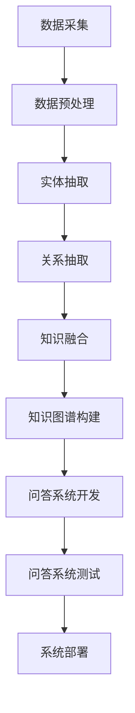
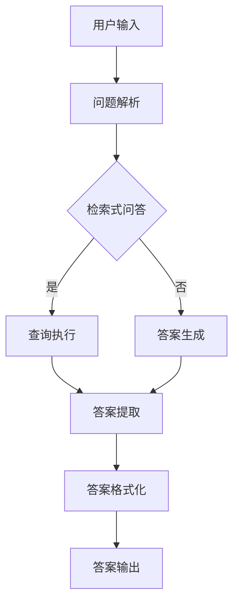

                 

# 文章标题: 知识图谱驱动的智能问答系统开发

> 关键词：知识图谱、智能问答系统、数据采集、实体抽取、关系抽取、知识融合、问答技术、优化与评估、项目实战

> 摘要：本文旨在探讨知识图谱驱动的智能问答系统开发，从基础知识、构建知识图谱、问答系统开发、优化与评估以及项目实战等多个方面进行详细阐述。通过本文的阅读，读者可以全面了解知识图谱驱动的智能问答系统的开发原理、技术架构、实现方法和实际应用。

## 《知识图谱驱动的智能问答系统开发》目录大纲

### 第一部分：基础知识

### 第1章：知识图谱概述

- 1.1 知识图谱的概念与重要性
- 1.2 知识图谱的基本组成
- 1.3 知识图谱的应用领域
- 1.4 知识图谱的发展历程

### 第2章：知识表示与存储

- 2.1 知识表示方法
  - 2.1.1 语义网络表示
  - 2.1.2 逻辑表示
  - 2.1.3 语义向量表示
- 2.2 知识存储技术
  - 2.2.1 图数据库
  - 2.2.2 关系数据库
  - 2.2.3 文档数据库

### 第二部分：构建知识图谱

### 第3章：数据采集与处理

- 3.1 数据源选择与采集
  - 3.1.1 结构化数据源
  - 3.1.2 半结构化数据源
  - 3.1.3 非结构化数据源
- 3.2 数据清洗与预处理
  - 3.2.1 数据质量评估
  - 3.2.2 数据清洗方法
  - 3.2.3 数据预处理流程

### 第4章：实体抽取与关系构建

- 4.1 实体抽取技术
  - 4.1.1 基于规则的方法
  - 4.1.2 基于统计的方法
  - 4.1.3 基于深度学习的方法
- 4.2 关系抽取技术
  - 4.2.1 基于规则的方法
  - 4.2.2 基于统计的方法
  - 4.2.3 基于深度学习的方法
- 4.3 知识融合与实体链接
  - 4.3.1 知识融合方法
  - 4.3.2 实体链接算法

### 第5章：知识图谱的构建工具与实践

- 5.1 知识图谱构建工具
  - 5.1.1 OpenKG
  - 5.1.2 Jena
  - 5.1.3 AllegroGraph
- 5.2 知识图谱构建实践
  - 5.2.1 数据采集与预处理
  - 5.2.2 实体抽取与关系构建
  - 5.2.3 知识图谱可视化

### 第三部分：智能问答系统开发

### 第6章：问答系统概述

- 6.1 问答系统的基本概念
- 6.2 问答系统的分类
- 6.3 问答系统的核心模块

### 第7章：基于知识图谱的问答技术

- 7.1 知识图谱问答框架
  - 7.1.1 问答流程
  - 7.1.2 问答模型
- 7.2 检索式问答技术
  - 7.2.1 检索策略
  - 7.2.2 相似度计算
- 7.3 生成式问答技术
  - 7.3.1 生成式问答模型
  - 7.3.2 生成式问答流程

### 第8章：问答系统优化与评估

- 8.1 问答系统优化策略
- 8.2 问答系统评估指标
- 8.3 问答系统评估方法

### 第四部分：实战项目

### 第9章：项目规划与实施

- 9.1 项目背景与目标
- 9.2 项目需求分析
- 9.3 项目计划与分工
- 9.4 项目风险管理

### 第10章：数据采集与处理

- 10.1 数据采集
- 10.2 数据预处理

### 第11章：知识图谱构建

- 11.1 实体抽取
- 11.2 关系抽取
- 11.3 知识融合
- 11.4 知识图谱可视化

### 第12章：问答系统开发

- 12.1 问答系统设计
- 12.2 检索式问答实现
- 12.3 生成式问答实现

### 第13章：项目测试与部署

- 13.1 问答系统测试
- 13.2 系统部署

### 附录

- 附录A：常用工具与资源
- 附录B：Mermaid流程图

## 引言

### 1.1 为什么选择知识图谱驱动的智能问答系统？

在当前的信息时代，人们对于信息的获取和利用有着极高的需求。然而，海量的信息使得传统的搜索引擎难以满足用户的需求，特别是在涉及专业知识领域时，用户往往需要更为精准和个性化的回答。因此，智能问答系统应运而生，它能够根据用户提出的问题，自动从海量信息中检索并给出相关答案。而知识图谱作为一种新兴的技术，以其强大的知识表示和推理能力，为智能问答系统的开发提供了强有力的支持。

知识图谱驱动的智能问答系统具有以下几个显著优势：

1. **精准性**：知识图谱能够将信息以结构化的形式进行组织，使得问答系统能够精确地理解和回答用户的问题。
2. **灵活性**：知识图谱支持多维度、多层次的关联，使得问答系统可以灵活地处理各种类型的问题。
3. **智能化**：知识图谱结合自然语言处理和机器学习技术，可以不断学习和优化，提高问答系统的智能水平。
4. **实用性**：知识图谱驱动的问答系统在金融、医疗、教育等多个领域都有广泛的应用，具有很高的实用性。

### 1.2 本文结构

本文将从基础知识、构建知识图谱、问答系统开发、优化与评估以及项目实战等多个方面，系统地介绍知识图谱驱动的智能问答系统开发。具体内容结构如下：

- **第一部分：基础知识**：介绍知识图谱的概念、基本组成、应用领域和发展历程，以及知识表示与存储技术。
- **第二部分：构建知识图谱**：详细讲解数据采集与处理、实体抽取与关系构建、知识融合与实体链接，以及知识图谱构建工具与实践。
- **第三部分：智能问答系统开发**：阐述问答系统的基本概念、分类、核心模块，以及基于知识图谱的问答技术。
- **第四部分：实战项目**：通过一个实际项目，从项目规划与实施、数据采集与处理、知识图谱构建、问答系统开发到项目测试与部署，全面展示知识图谱驱动的智能问答系统开发的全过程。

通过本文的阅读，读者可以系统地了解知识图谱驱动的智能问答系统开发的理论和实践，为实际项目开发提供指导。

### 1.3 关键技术概览

在知识图谱驱动的智能问答系统开发中，涉及到多个关键技术和方法，包括：

1. **知识图谱构建**：包括数据采集、数据预处理、实体抽取、关系抽取和知识融合等步骤，这是构建问答系统的基础。
2. **问答技术**：包括检索式问答和生成式问答，这两种技术分别适用于不同的问答场景。
3. **优化与评估**：通过优化策略和评估指标，提升问答系统的性能和用户体验。
4. **项目实战**：通过实际项目，将理论知识应用到实践中，解决实际问题和挑战。

接下来，本文将逐步深入探讨这些关键技术和方法，为读者提供详细的理论和实践指导。

## 第一部分：基础知识

### 第1章：知识图谱概述

#### 1.1 知识图谱的概念与重要性

知识图谱（Knowledge Graph）是一种用于结构化表示知识的方法，它将现实世界中的实体、概念和关系以图的形式进行组织。知识图谱的基本概念包括实体、属性、关系和边，其中实体表示现实世界中的对象，如人、地点、组织等；属性表示实体的特征，如年龄、职位、地址等；关系表示实体之间的关联，如朋友、属于、就职于等；边则是连接实体和属性的纽带。

知识图谱的重要性体现在以下几个方面：

1. **数据结构化**：知识图谱将非结构化的数据转换为结构化的数据，使得数据易于存储、检索和分析。
2. **语义理解**：知识图谱通过实体和关系之间的关联，实现了对数据的语义理解，使得计算机能够像人类一样理解和处理信息。
3. **智能应用**：知识图谱为智能应用提供了丰富的知识资源，如智能问答、推荐系统、知识图谱搜索引擎等。

#### 1.2 知识图谱的基本组成

知识图谱的基本组成包括以下几个部分：

1. **实体（Entity）**：实体是知识图谱中的基本单元，表示现实世界中的对象。例如，人、地点、物品等都是实体。
2. **属性（Attribute）**：属性是实体的特征或属性，用于描述实体的具体信息。例如，人的年龄、职位、居住地等都是属性。
3. **关系（Relationship）**：关系是实体之间的关联，表示实体之间的语义联系。例如，人之间的朋友关系、地点之间的相邻关系等。
4. **边（Edge）**：边是连接实体和属性的纽带，用于表示实体和属性之间的关系。例如，人作为实体，年龄作为属性，边表示了人和年龄之间的关系。

#### 1.3 知识图谱的应用领域

知识图谱在多个领域都有广泛的应用：

1. **搜索引擎**：知识图谱可以帮助搜索引擎更好地理解用户查询，提供更为精准和个性化的搜索结果。
2. **智能问答**：知识图谱可以用于构建智能问答系统，通过理解用户的问题和知识库中的信息，自动生成答案。
3. **推荐系统**：知识图谱可以用于推荐系统，通过实体和关系之间的关联，发现用户可能感兴趣的内容。
4. **金融风控**：知识图谱可以帮助金融机构识别风险、分析客户行为，从而进行有效的风险管理。
5. **医疗健康**：知识图谱可以用于医疗健康领域，帮助医生进行诊断、制定治疗方案，提高医疗服务的质量。

#### 1.4 知识图谱的发展历程

知识图谱的概念最早由Google在2012年提出，并应用于其搜索引擎。随后，知识图谱技术逐渐应用于多个领域，发展历程可以分为以下几个阶段：

1. **早期探索阶段（2000-2005年）**：这一阶段主要研究知识表示和推理技术，提出了许多知识表示方法，如本体论、语义网络等。
2. **数据集成阶段（2006-2010年）**：这一阶段主要研究如何将不同来源的数据进行集成和统一表示，提出了数据融合、数据清洗等技术。
3. **大规模应用阶段（2011年至今）**：这一阶段知识图谱技术得到了广泛应用，包括搜索引擎、推荐系统、智能问答等，同时也出现了许多开源工具和框架，如OpenKG、Jena等。

### 1.5 小结

知识图谱作为一种新兴的技术，以其强大的知识表示和推理能力，为智能问答系统的开发提供了强有力的支持。通过本章的介绍，读者可以初步了解知识图谱的概念、基本组成和应用领域，为后续章节的学习打下基础。

### 第2章：知识表示与存储

#### 2.1 知识表示方法

知识表示是知识图谱构建的核心步骤，它涉及到如何将现实世界中的信息抽象为计算机可以理解和处理的形式。常见的知识表示方法包括语义网络表示、逻辑表示和语义向量表示。

1. **语义网络表示**

语义网络是一种基于图的数据结构，用于表示实体、概念和它们之间的关系。在语义网络中，节点表示实体或概念，边表示实体或概念之间的关系。语义网络表示的优点是直观且易于理解，但它的表示能力有限，难以表达复杂的语义关系。

2. **逻辑表示**

逻辑表示是一种基于形式逻辑的知识表示方法，它使用逻辑公式来表示实体、概念和它们之间的关系。逻辑表示的优点是具有较强的表达能力和推理能力，但它的表示方式较为复杂，难以处理大规模的数据。

3. **语义向量表示**

语义向量表示是一种基于机器学习的方法，将实体和概念映射到高维空间中的向量。通过计算向量之间的相似度，可以识别实体和概念之间的关系。语义向量表示的优点是处理速度快，适用于大规模数据，但它的表示能力有限，难以表达复杂的语义关系。

#### 2.2 知识存储技术

知识存储是知识图谱构建中的另一个关键步骤，它涉及到如何高效地存储和管理大规模的知识数据。常见的知识存储技术包括图数据库、关系数据库和文档数据库。

1. **图数据库**

图数据库是一种基于图的数据结构，用于存储和查询大规模的知识图谱。图数据库的优点是能够高效地处理实体和关系之间的复杂关联，但它的查询能力有限，难以处理大规模的文本数据。

2. **关系数据库**

关系数据库是一种基于表的数据结构，用于存储和查询关系数据。关系数据库的优点是能够高效地处理大规模的文本数据，但它的查询能力有限，难以处理实体和关系之间的复杂关联。

3. **文档数据库**

文档数据库是一种基于文档的数据结构，用于存储和查询大规模的文档数据。文档数据库的优点是能够高效地处理文本数据，但它的关联查询能力较弱。

#### 2.3 知识表示与存储技术比较

知识表示与存储技术各有优缺点，适用于不同的应用场景。以下是几种常见技术之间的比较：

1. **语义网络表示**：适用于简单的知识表示，难以处理大规模数据。
2. **逻辑表示**：适用于复杂的知识表示，但处理速度较慢。
3. **语义向量表示**：适用于大规模数据的快速处理，但表示能力有限。
4. **图数据库**：适用于处理实体和关系之间的复杂关联，但查询能力有限。
5. **关系数据库**：适用于处理大规模的文本数据，但关联查询能力有限。
6. **文档数据库**：适用于处理大规模的文本数据，但关联查询能力较弱。

#### 2.4 小结

知识表示与存储技术是知识图谱构建中的核心环节，它们决定了知识图谱的性能和表达能力。通过本章的介绍，读者可以了解常见的知识表示方法以及知识存储技术，为后续的知识图谱构建打下基础。

### 第3章：数据采集与处理

#### 3.1 数据源选择与采集

数据采集是构建知识图谱的第一步，数据源的选择直接影响到知识图谱的质量和应用效果。常见的数据源包括结构化数据源、半结构化数据源和非结构化数据源。

1. **结构化数据源**

结构化数据源是指数据以表格形式组织，每个单元格包含具体的数值或文本信息。常见的结构化数据源包括关系数据库、XML文件、JSON文件等。结构化数据源的优点是数据格式统一，便于存储和处理，但缺点是数据量有限，难以满足大规模知识图谱的需求。

2. **半结构化数据源**

半结构化数据源是指数据以树状或列表形式组织，部分数据具有结构化特征，但部分数据仍然保持非结构化状态。常见的半结构化数据源包括HTML文件、XML文件、JSON文件等。半结构化数据源的优点是数据量较大，但数据格式不统一，需要一定的预处理才能用于知识图谱构建。

3. **非结构化数据源**

非结构化数据源是指数据没有固定的结构，以文本、图像、音频等形式存在。常见的非结构化数据源包括网页、PDF文件、Word文档等。非结构化数据源的优点是数据量巨大，但数据格式复杂，需要深入的预处理和结构化处理。

在选择数据源时，需要考虑以下几个因素：

- **数据量**：选择数据量较大的数据源，以确保知识图谱的覆盖面和完整性。
- **数据质量**：选择数据质量较高的数据源，以确保知识图谱的准确性和可靠性。
- **数据格式**：选择适合知识图谱构建的数据格式，如结构化数据源适合直接构建知识图谱，而半结构化和非结构化数据源需要预处理。

#### 3.2 数据清洗与预处理

数据清洗与预处理是知识图谱构建的重要步骤，它涉及到去除无效数据、处理噪声数据、标准化数据格式等。数据清洗与预处理的目的是提高数据质量，确保知识图谱的准确性和一致性。

1. **数据清洗**

数据清洗包括以下步骤：

- **去除无效数据**：去除重复数据、空值数据和错误数据，确保数据的有效性。
- **处理噪声数据**：处理数据中的噪声和异常值，如拼写错误、格式错误等。
- **标准化数据格式**：统一数据格式，如将文本数据转换为统一的编码格式，将日期格式统一等。

2. **数据预处理**

数据预处理包括以下步骤：

- **实体识别**：识别文本中的实体，如人名、地点、组织等，并将其标记为实体。
- **关系抽取**：从文本中提取实体之间的关系，如朋友关系、属于关系等。
- **数据标准化**：将文本数据进行标准化处理，如去除停用词、词干提取、词性标注等。

3. **数据格式转换**

数据格式转换是将不同格式的数据转换为统一格式的过程。常见的格式转换方法包括：

- **关系数据库到知识图谱**：将关系数据库中的数据转换为知识图谱的格式，如将关系表示为边。
- **文本数据到知识图谱**：将文本数据中的实体和关系转换为知识图谱的格式，如将实体和关系表示为节点和边。

#### 3.3 数据预处理流程

数据预处理流程通常包括以下几个步骤：

1. **数据导入**：将数据源中的数据导入到数据处理系统中。
2. **数据清洗**：对数据进行清洗，去除无效数据、处理噪声数据和标准化数据格式。
3. **实体识别**：从文本数据中识别实体，并将其标记为实体。
4. **关系抽取**：从文本数据中提取实体之间的关系。
5. **数据格式转换**：将清洗和预处理后的数据转换为知识图谱的格式。

#### 3.4 小结

数据采集与处理是知识图谱构建中的关键步骤，它直接影响到知识图谱的质量和应用效果。通过本章的介绍，读者可以了解数据源选择与采集、数据清洗与预处理以及数据预处理流程，为后续的知识图谱构建打下基础。

### 第4章：实体抽取与关系构建

#### 4.1 实体抽取技术

实体抽取是知识图谱构建的重要环节，它涉及到从文本中识别和提取出重要的实体信息。实体抽取技术可以分为基于规则的方法、基于统计的方法和基于深度学习的方法。

1. **基于规则的方法**

基于规则的方法是通过手工定义一系列的规则，用于识别文本中的实体。这些规则通常包括正则表达式、词性标注、命名实体识别等。基于规则的方法的优点是简单易懂，但缺点是规则定义复杂，难以应对各种复杂的实体识别场景。

2. **基于统计的方法**

基于统计的方法是通过学习大量的标注数据，利用统计模型来识别文本中的实体。常见的统计方法包括最大熵模型、条件概率模型、朴素贝叶斯模型等。基于统计的方法的优点是处理速度快，但缺点是对标注数据依赖较大，难以应对大规模数据。

3. **基于深度学习的方法**

基于深度学习的方法是近年来实体抽取领域的重要进展，通过深度神经网络学习文本的特征表示，实现实体的自动识别。常见的深度学习方法包括卷积神经网络（CNN）、循环神经网络（RNN）、长短时记忆网络（LSTM）等。基于深度学习的方法的优点是识别能力强，但缺点是计算复杂度高，对标注数据要求较高。

#### 4.2 关系抽取技术

关系抽取是知识图谱构建中的另一个重要环节，它涉及到从文本中识别和提取出实体之间的关系。关系抽取技术可以分为基于规则的方法、基于统计的方法和基于深度学习的方法。

1. **基于规则的方法**

基于规则的方法是通过手工定义一系列的规则，用于识别文本中的关系。这些规则通常包括模式匹配、语义角色标注等。基于规则的方法的优点是简单易懂，但缺点是规则定义复杂，难以应对各种复杂的关系识别场景。

2. **基于统计的方法**

基于统计的方法是通过学习大量的标注数据，利用统计模型来识别文本中的关系。常见的统计方法包括最大熵模型、条件概率模型、朴素贝叶斯模型等。基于统计的方法的优点是处理速度快，但缺点是对标注数据依赖较大，难以应对大规模数据。

3. **基于深度学习的方法**

基于深度学习的方法是近年来关系抽取领域的重要进展，通过深度神经网络学习文本的特征表示，实现关系的自动识别。常见的深度学习方法包括卷积神经网络（CNN）、循环神经网络（RNN）、长短时记忆网络（LSTM）等。基于深度学习的方法的优点是识别能力强，但缺点是计算复杂度高，对标注数据要求较高。

#### 4.3 知识融合与实体链接

知识融合与实体链接是知识图谱构建中的关键步骤，它涉及到将来自不同源的数据进行整合，并确保实体的一致性和准确性。

1. **知识融合**

知识融合是指将来自不同源的数据进行整合，形成统一的知识库。常见的知识融合方法包括：

- **基于规则的方法**：通过手工定义一系列的规则，将不同源的数据进行整合。
- **基于统计的方法**：通过学习大量的标注数据，利用统计模型进行知识融合。
- **基于深度学习的方法**：通过深度神经网络学习文本的特征表示，实现知识融合。

2. **实体链接**

实体链接是指将同一实体的不同表示形式进行统一，确保实体的一致性。常见的实体链接方法包括：

- **基于规则的方法**：通过手工定义一系列的规则，将不同源的数据进行实体链接。
- **基于统计的方法**：通过学习大量的标注数据，利用统计模型进行实体链接。
- **基于深度学习的方法**：通过深度神经网络学习文本的特征表示，实现实体链接。

#### 4.4 小结

实体抽取与关系构建是知识图谱构建中的关键步骤，它直接影响到知识图谱的质量和应用效果。通过本章的介绍，读者可以了解实体抽取与关系构建的技术和方法，为后续的知识图谱构建打下基础。

### 第5章：知识图谱的构建工具与实践

#### 5.1 知识图谱构建工具

知识图谱构建工具是知识图谱开发过程中不可或缺的一部分，它们提供了高效的知识图谱构建、存储、查询和管理功能。以下是一些常见的知识图谱构建工具：

1. **OpenKG**

OpenKG是一个开源的知识图谱构建工具，它支持知识图谱的构建、存储、查询和管理。OpenKG提供了Python接口，用户可以通过简单的API调用进行知识图谱的操作。其主要特点包括：

- **支持多种数据源**：OpenKG支持关系数据库、文本文件、CSV文件等多种数据源，方便用户进行数据采集和预处理。
- **支持多种知识表示**：OpenKG支持语义网络表示、图数据库表示等多种知识表示方法，满足不同应用场景的需求。
- **提供丰富的API接口**：OpenKG提供了Python接口，用户可以通过简单的API调用进行知识图谱的构建和管理。

2. **Jena**

Jena是一个开源的JVM上的知识图谱框架，它提供了知识图谱的存储、查询、推理等功能。Jena的主要特点包括：

- **支持多种知识表示**：Jena支持RDF（资源描述框架）和OWL（Web本体语言）等多种知识表示方法，方便用户进行知识建模。
- **提供高效的查询引擎**：Jena提供了一个高效的SPARQL查询引擎，用户可以通过SPARQL查询语言进行知识图谱的查询。
- **提供丰富的API接口**：Jena提供了Java和Scala接口，用户可以通过简单的API调用进行知识图谱的操作。

3. **AllegroGraph**

AllegroGraph是一个高性能的图数据库，它支持知识图谱的存储、查询和管理。AllegroGraph的主要特点包括：

- **支持大规模数据存储**：AllegroGraph支持数十亿个实体和关系，能够处理大规模的知识图谱数据。
- **提供高效的查询引擎**：AllegroGraph提供了一个高效的查询引擎，用户可以通过SPARQL查询语言进行知识图谱的查询。
- **支持多种知识表示**：AllegroGraph支持RDF、OWL等多种知识表示方法，满足不同应用场景的需求。

#### 5.2 知识图谱构建实践

以下是一个简单的知识图谱构建实践，我们将使用OpenKG工具来构建一个简单的知识图谱。

1. **数据采集**

首先，我们需要采集一些数据，例如一个关于学校和学生的数据集。数据集可以包括学校的名称、地址、学生姓名、学生成绩等。

2. **数据预处理**

在数据采集完成后，我们需要对数据进行预处理，包括去除无效数据、处理噪声数据和标准化数据格式。对于本例，我们可以使用Python的Pandas库对数据集进行预处理。

3. **实体抽取**

接下来，我们需要从预处理后的数据中抽取实体和关系。对于本例，我们可以使用基于规则的方法来抽取实体和关系。例如，我们可以定义一个规则，将学校的名称和地址作为实体，将学生姓名和成绩作为关系。

4. **知识融合**

在实体抽取完成后，我们需要将来自不同源的数据进行融合，确保实体的一致性和准确性。对于本例，我们可以使用基于统计的方法进行知识融合，例如通过比较实体名称和地址的相似度，将同一实体的不同表示形式进行统一。

5. **知识存储**

最后，我们将构建好的知识图谱存储到OpenKG中。OpenKG提供了简单的API接口，用户可以通过简单的代码将知识图谱存储到OpenKG中。

```python
from openkg import OpenKG

# 创建OpenKG实例
kg = OpenKG()

# 创建实体
kg.create_entity('School', '清华大学')
kg.create_entity('Student', '张三')

# 创建关系
kg.create_relation('located_in', 'School', '清华大学', 'Address', '北京市')
kg.create_relation('student_of', 'Student', '张三', 'School', '清华大学')

# 查询知识图谱
results = kg.query('SELECT * WHERE { ?s ?p ?o }')

# 输出查询结果
for result in results:
    print(result)
```

通过以上步骤，我们就完成了知识图谱的构建。接下来，我们可以使用OpenKG提供的查询接口，对知识图谱进行查询，获取相关的信息。

#### 5.3 知识图谱可视化

知识图谱可视化是知识图谱构建中的最后一步，它可以帮助我们更好地理解和展示知识图谱。以下是一些常见的知识图谱可视化工具：

1. **Neo4j Browser**

Neo4j Browser是一个Web版的图形化界面，用于查询和可视化Neo4j图数据库中的数据。用户可以通过编写Cypher查询语句，直接在Neo4j Browser中进行查询和可视化。

2. **D3.js**

D3.js是一个基于JavaScript的可视化库，可以用于创建交互式的数据可视化图表。通过使用D3.js，我们可以将知识图谱可视化成树状图、网络图等。

3. **Gephi**

Gephi是一个开源的图形分析工具，用于处理大规模的复杂网络数据。Gephi支持多种可视化布局算法，如力导向布局、层次布局等，可以生成高质量的图形可视化。

4. **Cytoscape**

Cytoscape是一个开源的交互式网络分析工具，可以用于可视化、分析和编辑复杂的网络数据。Cytoscape提供了丰富的插件和扩展，可以满足不同应用场景的需求。

#### 5.4 小结

知识图谱构建工具是知识图谱开发中的重要组成部分，它们提供了高效的知识图谱构建、存储、查询和管理功能。通过本章的介绍，读者可以了解常见的知识图谱构建工具，并掌握知识图谱构建的基本方法和实践技巧。

### 第6章：问答系统概述

#### 6.1 问答系统的基本概念

问答系统（Question Answering System）是一种人工智能技术，用于自动回答用户提出的问题。问答系统通常由用户接口、问题理解模块、知识库和答案生成模块组成。

1. **用户接口**：用户接口用于接收用户的输入问题，并将问题传递给问题理解模块。
2. **问题理解模块**：问题理解模块用于解析用户输入的问题，提取关键信息，并生成问题表示。
3. **知识库**：知识库是问答系统的核心组件，用于存储大量的信息和事实，提供答案生成的数据源。
4. **答案生成模块**：答案生成模块根据问题表示和知识库中的信息，生成问题的答案。

#### 6.2 问答系统的分类

问答系统可以根据不同的分类标准进行分类，以下是一些常见的分类方法：

1. **根据答案形式分类**：

   - **开放域问答**：开放域问答系统可以回答各种类型的问题，不受特定领域限制。
   - **闭合域问答**：闭合域问答系统只能回答特定领域的问题，如医学问答系统、法律问答系统等。

2. **根据答案生成方式分类**：

   - **检索式问答**：检索式问答系统从知识库中检索与问题相关的信息，生成答案。
   - **生成式问答**：生成式问答系统根据用户问题，利用自然语言生成答案。

3. **根据问题理解方式分类**：

   - **基于规则的方法**：基于规则的方法使用预定义的规则，解析和理解用户问题。
   - **基于统计的方法**：基于统计的方法使用机器学习算法，从大量标注数据中学习问题理解和答案生成的模式。
   - **基于深度学习的方法**：基于深度学习的方法使用深度神经网络，对用户问题进行语义理解，生成答案。

#### 6.3 问答系统的核心模块

问答系统通常由以下几个核心模块组成：

1. **用户接口模块**：用户接口模块用于接收用户的输入问题，并展示答案。
2. **问题理解模块**：问题理解模块用于解析用户输入的问题，提取关键信息，并生成问题表示。
3. **知识库模块**：知识库模块用于存储和管理大量的事实和知识，提供答案生成的数据源。
4. **答案生成模块**：答案生成模块根据问题表示和知识库中的信息，生成问题的答案。

#### 6.4 小结

问答系统是一种重要的自然语言处理技术，它能够自动回答用户提出的问题。通过本章的介绍，读者可以了解问答系统的基本概念、分类和核心模块，为后续章节的学习打下基础。

### 第7章：基于知识图谱的问答技术

#### 7.1 知识图谱问答框架

知识图谱问答技术是利用知识图谱中的实体、关系和属性来回答用户问题的方法。一个典型的知识图谱问答系统通常包括以下几个关键模块：

1. **问题解析模块**：该模块用于将用户的问题转化为知识图谱中的查询语句。具体步骤包括：
   - **分词和词性标注**：将问题中的文本进行分词，并对每个词进行词性标注，如名词、动词等。
   - **实体识别**：识别问题中的实体，如人名、地点、组织等。
   - **关系识别**：识别问题中的关系，如“属于”、“位于”等。
   - **构建查询语句**：根据问题中的实体和关系，构建对应的查询语句，如SPARQL查询语句。

2. **查询执行模块**：该模块用于在知识图谱中执行查询语句，获取与问题相关的答案。具体步骤包括：
   - **查询优化**：对查询语句进行优化，提高查询效率。
   - **查询执行**：在知识图谱中进行查询，获取与问题相关的实体和关系。

3. **答案生成模块**：该模块用于生成问题的答案。具体步骤包括：
   - **答案抽取**：从查询结果中抽取答案，如直接提取实体或关系作为答案，或通过推理生成答案。
   - **答案格式化**：将答案格式化成自然语言形式，以便用户理解。

#### 7.2 检索式问答技术

检索式问答技术是一种基于信息检索的方法，用于回答用户的问题。其核心思想是利用信息检索技术，从知识库中检索与用户问题最相关的信息，并将其作为答案。以下是检索式问答技术的主要步骤：

1. **查询构建**：将用户问题转化为一个查询，通常是基于关键词的查询。这个过程包括：
   - **关键词提取**：从用户问题中提取关键词。
   - **查询扩展**：扩展关键词，以增加查询的多样性，提高检索的准确性。

2. **查询匹配**：将查询与知识库中的文档进行匹配，选择最相关的文档作为答案。匹配的方法包括：
   - **关键词匹配**：直接比较查询关键词与知识库文档中的关键词。
   - **相似度计算**：计算查询与知识库文档之间的相似度，常用的方法包括TF-IDF、 cosine相似度等。

3. **答案提取**：从匹配的文档中提取答案。这个过程包括：
   - **文本摘要**：从文档中提取摘要，作为答案。
   - **实体识别**：从文档中识别实体，将其作为答案。

#### 7.3 生成式问答技术

生成式问答技术是一种基于自然语言生成的方法，用于回答用户的问题。其核心思想是利用机器学习模型，将用户问题转化为自然语言回答。以下是生成式问答技术的主要步骤：

1. **问题编码**：将用户问题转化为机器学习模型可以处理的输入。这个过程包括：
   - **语义表示**：将问题中的实体和关系转化为语义表示，如词向量。
   - **编码器**：使用编码器（如Transformer、BERT等）对问题进行编码，生成问题表示。

2. **答案生成**：使用预训练的机器学习模型，生成问题的答案。这个过程包括：
   - **解码器**：使用解码器（如Transformer、BERT等）生成问题的答案。
   - **答案筛选**：从解码器生成的所有可能答案中，筛选出最合适的答案。

3. **答案格式化**：将生成的答案格式化成自然语言形式，以便用户理解。

#### 7.4 检索式问答与生成式问答比较

检索式问答和生成式问答各有优缺点，适用于不同的应用场景：

- **检索式问答**：
  - 优点：简单、快速，适用于回答结构化、明确的问题。
  - 缺点：难以应对开放域、模糊的问题，答案可能不够精确。
- **生成式问答**：
  - 优点：能够生成自然、流畅的答案，适用于开放域问答。
  - 缺点：计算复杂度高，训练过程需要大量数据和计算资源。

#### 7.5 小结

基于知识图谱的问答技术是利用知识图谱中的实体、关系和属性来回答用户问题的方法。本章介绍了知识图谱问答框架、检索式问答技术和生成式问答技术，为构建高效的智能问答系统提供了理论基础和实践指导。

### 第8章：问答系统优化与评估

#### 8.1 问答系统优化策略

为了提升问答系统的性能和用户体验，优化问答系统是至关重要的。以下是几种常见的问答系统优化策略：

1. **知识库优化**

   - **数据质量提升**：通过数据清洗、去重和错误修正，提高知识库的数据质量。
   - **实体关系扩展**：通过引入更多的实体和关系，增加知识库的覆盖面，提高答案的准确性。
   - **实时更新**：定期更新知识库，确保知识库中的信息是最新的。

2. **查询优化**

   - **索引构建**：在知识图谱数据库中构建索引，提高查询效率。
   - **查询缓存**：缓存常见查询的结果，减少数据库查询的负载。
   - **查询重写**：根据查询的语义，重写查询语句，优化查询路径。

3. **答案生成优化**

   - **答案多样性**：通过引入多样性策略，如随机采样、生成对抗网络等，生成多样化的答案。
   - **答案质量评估**：使用人工评估和自动评估方法，对答案的质量进行评估和筛选。
   - **答案格式化**：优化答案的格式化，使其更加自然、易于理解。

#### 8.2 问答系统评估指标

评估问答系统的性能和效果是确保其质量的重要环节。以下是一些常用的问答系统评估指标：

1. **准确率（Accuracy）**

   - **定义**：准确率是正确回答的数量与总回答数量之比。
   - **公式**：\[ \text{Accuracy} = \frac{\text{正确回答的数量}}{\text{总回答的数量}} \]

2. **召回率（Recall）**

   - **定义**：召回率是正确回答的数量与实际正确的回答数量之比。
   - **公式**：\[ \text{Recall} = \frac{\text{正确回答的数量}}{\text{实际正确的回答数量}} \]

3. **F1值（F1 Score）**

   - **定义**：F1值是准确率和召回率的调和平均数，用于综合评估问答系统的性能。
   - **公式**：\[ \text{F1} = 2 \times \frac{\text{准确率} \times \text{召回率}}{\text{准确率} + \text{召回率}} \]

#### 8.3 问答系统评估方法

问答系统的评估可以通过以下几种方法进行：

1. **人工评估**

   - **方法**：通过人工阅读和评估答案的质量，判断其准确性、相关性和流畅性。
   - **优点**：能够提供详细和具体的评估结果。
   - **缺点**：耗时较长，评估结果主观性较强。

2. **自动评估**

   - **方法**：使用自动化工具评估答案的性能，如基于规则的评估工具、机器学习评估模型等。
   - **优点**：评估速度快，适用于大规模系统的自动化测试。
   - **缺点**：评估结果可能不够精细，需要结合人工评估进行综合判断。

#### 8.4 小结

问答系统的优化和评估是确保其性能和用户体验的关键步骤。通过知识库优化、查询优化、答案生成优化以及准确的评估方法，可以显著提升问答系统的质量和效果。本章介绍了问答系统的优化策略、评估指标和评估方法，为问答系统的开发和改进提供了指导。

### 第9章：项目规划与实施

#### 9.1 项目背景与目标

项目背景与目标是项目启动和规划的重要依据。以下是一个关于开发知识图谱驱动的智能问答系统的项目背景与目标：

- **项目背景**：随着互联网和大数据技术的发展，用户对信息的获取和利用需求日益增加。传统的搜索引擎难以满足用户在特定领域内的精准信息需求。因此，我们计划开发一个基于知识图谱的智能问答系统，旨在提供高效、精准的信息查询服务。
- **项目目标**：
  - **功能目标**：实现用户提问后，系统能够自动识别问题、查询知识图谱，并返回准确的答案。
  - **性能目标**：系统响应时间小于1秒，支持海量用户同时查询。
  - **用户体验目标**：提供自然、流畅、多样化的答案，提升用户满意度。

#### 9.2 项目需求分析

项目需求分析是明确项目具体需求和功能的关键步骤。以下是一个知识图谱驱动的智能问答系统的需求分析：

- **功能需求**：
  - **问题理解**：能够解析用户输入的问题，提取关键信息，生成问题表示。
  - **知识查询**：能够查询知识图谱，获取与问题相关的实体和关系。
  - **答案生成**：能够根据查询结果，生成自然语言答案，并进行格式化输出。
  - **用户交互**：提供友好的用户界面，支持用户提问和查看答案。
- **非功能需求**：
  - **可靠性**：系统稳定运行，故障率低，能够快速恢复。
  - **安全性**：确保用户数据和系统数据的安全，防止数据泄露和恶意攻击。
  - **可扩展性**：系统设计应考虑未来的扩展性，能够支持更多的实体和关系。

#### 9.3 项目计划与分工

项目计划与分工是确保项目按时、按质完成的重要手段。以下是一个知识图谱驱动的智能问答系统的项目计划与分工：

- **项目周期**：项目预计为期6个月，分为三个阶段：需求分析阶段（1个月）、开发阶段（3个月）、测试与优化阶段（2个月）。
- **分工**：
  - **项目经理**：负责项目整体规划、进度控制和风险管理。
  - **需求分析师**：负责需求收集和分析，编写需求文档。
  - **系统架构师**：负责系统架构设计和技术选型。
  - **前端开发工程师**：负责用户界面设计和前端开发。
  - **后端开发工程师**：负责后端服务开发，包括知识图谱构建和问答功能实现。
  - **测试工程师**：负责系统测试，包括功能测试、性能测试和安全测试。
  - **运维工程师**：负责系统部署和维护，确保系统稳定运行。

#### 9.4 项目风险管理

项目风险管理是确保项目顺利进行的必要步骤。以下是一个知识图谱驱动的智能问答系统的项目风险管理：

- **风险识别**：
  - **技术风险**：知识图谱构建和问答系统开发过程中可能遇到的技术难题。
  - **数据风险**：知识库数据质量不高，可能影响问答系统的性能。
  - **时间风险**：项目进度延误，可能影响项目交付。
  - **安全风险**：系统安全措施不足，可能导致数据泄露和恶意攻击。
- **风险应对措施**：
  - **技术风险**：提前进行技术调研，选择成熟的技术框架，团队进行技术培训。
  - **数据风险**：严格进行数据清洗和预处理，确保知识库数据质量。
  - **时间风险**：制定详细的进度计划，确保每个阶段都有足够的时间完成。
  - **安全风险**：采用加密技术、访问控制和安全审计等手段，确保系统数据安全。

#### 9.5 小结

项目规划与实施是知识图谱驱动的智能问答系统开发的重要环节。通过明确项目背景与目标、进行需求分析、制定项目计划与分工以及风险管理，可以确保项目顺利进行，最终实现预期功能与性能目标。本章为项目实施提供了详细的指导和参考。

### 第10章：数据采集与处理

#### 10.1 数据采集

数据采集是知识图谱构建的基础步骤，直接影响到知识图谱的质量和应用效果。以下是一个知识图谱驱动的智能问答系统的数据采集步骤：

1. **确定数据源**：根据项目需求和问答系统的应用领域，选择合适的数据源。常见的数据源包括：

   - **公开数据集**：如Wikipedia、OpenKG等，提供大量的结构化数据。
   - **专业数据库**：如医学数据库、金融数据库等，提供特定领域的专业知识。
   - **网页抓取**：使用网络爬虫技术，从互联网上获取相关数据。
   - **用户提交**：通过用户输入和反馈，获取用户关注的问题和知识点。

2. **数据采集方法**：

   - **结构化数据采集**：使用API接口或数据库连接，直接获取结构化数据。
   - **半结构化数据采集**：使用正则表达式或解析库，从HTML、XML等格式中提取数据。
   - **非结构化数据采集**：使用网络爬虫技术，从网页、PDF、Word等非结构化数据中提取数据。

3. **数据清洗**：

   - **去除重复数据**：删除重复的记录，避免数据冗余。
   - **处理缺失值**：根据数据的重要性和实际情况，填补缺失值或删除缺失记录。
   - **处理噪声数据**：过滤掉异常值和错误数据，确保数据质量。

#### 10.2 数据预处理

数据预处理是数据采集后的关键步骤，用于将原始数据转换为适合知识图谱构建的形式。以下是一个知识图谱驱动的智能问答系统的数据预处理步骤：

1. **分词和词性标注**：

   - **分词**：将文本数据分割为单词或短语。
   - **词性标注**：为每个词标注词性，如名词、动词、形容词等。

2. **实体识别**：

   - **命名实体识别**：从文本中识别出人名、地名、组织名等实体。
   - **实体分类**：对识别出的实体进行分类，如人、地点、组织等。

3. **关系抽取**：

   - **规则方法**：使用预定义的规则，从文本中抽取实体间的关系。
   - **机器学习方法**：使用训练好的模型，自动识别实体间的关系。

4. **数据格式转换**：

   - **转换为知识图谱格式**：将预处理后的数据转换为知识图谱的格式，如RDF（资源描述框架）。
   - **存储与管理**：将数据存储在知识图谱数据库中，如Neo4j、Jena等。

#### 10.3 数据采集与处理工具

以下是常用的数据采集与处理工具：

1. **网络爬虫**：

   - **Scrapy**：Python网络爬虫框架，用于大规模网页数据的采集。
   - **BeautifulSoup**：用于HTML解析，从网页中提取数据。

2. **数据预处理**：

   - **Pandas**：Python数据操作库，用于数据清洗、转换和预处理。
   - **NLTK**：Python自然语言处理库，用于文本处理，如分词和词性标注。
   - **Spacy**：Python自然语言处理库，提供高质量的实体识别和关系抽取功能。

3. **知识图谱数据库**：

   - **Neo4j**：图形数据库，用于存储和管理知识图谱数据。
   - **Jena**：RDF数据库，用于存储和管理基于RDF的知识图谱。

#### 10.4 小结

数据采集与处理是知识图谱构建中的关键步骤，它决定了知识图谱的质量和应用效果。本章介绍了数据采集的步骤、数据预处理的方法和常用的数据采集与处理工具，为构建高质量的知识图谱提供了详细的指导和实践参考。

### 第11章：知识图谱构建

#### 11.1 实体抽取

实体抽取是知识图谱构建中的核心步骤之一，它涉及到从文本数据中识别出重要的实体，如人名、地名、组织名等。以下是知识图谱构建中的实体抽取过程：

1. **分词与词性标注**：

   - **分词**：将文本数据分割为单词或短语，以便后续处理。
   - **词性标注**：为每个词标注词性，如名词、动词、形容词等。

2. **命名实体识别**：

   - **规则方法**：使用预定义的规则，如正则表达式，从文本中识别命名实体。
   - **统计方法**：使用统计模型，如条件概率模型，从文本中识别命名实体。
   - **深度学习方法**：使用深度神经网络，如卷积神经网络（CNN）或循环神经网络（RNN），从文本中识别命名实体。

3. **实体分类**：

   - **训练数据集**：收集和标注大量的实体数据，用于训练实体分类模型。
   - **分类模型**：使用监督学习算法，如支持向量机（SVM）或神经网络，对实体进行分类。

4. **实体存储**：

   - **RDF格式**：将实体存储为RDF（资源描述框架）格式，便于后续处理和查询。
   - **图数据库**：将实体存储在图数据库中，如Neo4j，实现高效的存储和查询。

#### 11.2 关系抽取

关系抽取是从文本数据中识别出实体之间的关系，如“属于”、“位于”等。以下是知识图谱构建中的关系抽取过程：

1. **文本预处理**：

   - **分词与词性标注**：对文本进行分词和词性标注，提取文本的关键信息。
   - **实体识别**：从文本中识别出重要的实体。

2. **关系模式识别**：

   - **规则方法**：使用预定义的规则，从文本中识别关系模式。
   - **统计方法**：使用统计模型，从文本中识别关系模式。
   - **深度学习方法**：使用深度神经网络，从文本中识别关系模式。

3. **关系分类**：

   - **训练数据集**：收集和标注大量的关系数据，用于训练关系分类模型。
   - **分类模型**：使用监督学习算法，如支持向量机（SVM）或神经网络，对关系进行分类。

4. **关系存储**：

   - **RDF格式**：将关系存储为RDF格式，便于后续处理和查询。
   - **图数据库**：将关系存储在图数据库中，实现高效的存储和查询。

#### 11.3 知识融合与实体链接

知识融合与实体链接是知识图谱构建中的重要步骤，它涉及到将来自不同源的数据进行整合，并确保实体的一致性和准确性。以下是知识图谱构建中的知识融合与实体链接过程：

1. **知识融合**：

   - **数据预处理**：对来自不同源的数据进行清洗、去重和格式转换，确保数据的一致性。
   - **融合策略**：采用多种融合策略，如基于规则的融合、基于统计的融合等，将不同源的数据进行整合。

2. **实体链接**：

   - **实体识别**：从不同源的数据中识别出实体，如人名、地名、组织名等。
   - **实体匹配**：通过计算实体之间的相似度，将同一实体的不同表示进行匹配。
   - **实体统一**：将匹配成功的实体进行统一，确保知识图谱中实体的一致性。

3. **知识存储**：

   - **RDF格式**：将融合后的知识存储为RDF格式，便于后续处理和查询。
   - **图数据库**：将知识存储在图数据库中，实现高效的存储和查询。

#### 11.4 知识图谱可视化

知识图谱可视化是将知识图谱以图形的形式展示出来，帮助用户更好地理解和分析知识图谱。以下是知识图谱可视化的方法和工具：

1. **可视化方法**：

   - **节点表示**：使用节点来表示实体，节点的形状和颜色可以用来区分不同的实体类型。
   - **边表示**：使用边来表示实体之间的关系，边的颜色和线条样式可以用来区分不同的关系类型。
   - **布局算法**：使用布局算法，如力导向布局、层次布局等，将知识图谱图形化展示。

2. **可视化工具**：

   - **Gephi**：开源的可视化工具，支持多种布局算法和图形化展示。
   - **Cytoscape**：开源的可视化工具，专注于生物信息学的知识图谱可视化。
   - **Mermaid**：Markdown语法支持的图形化工具，用于绘制知识图谱的流程图。

#### 11.5 小结

知识图谱构建是智能问答系统开发的关键步骤，它涉及到实体抽取、关系抽取、知识融合与实体链接等多个方面。本章详细介绍了知识图谱构建的步骤和方法，为构建高质量的知识图谱提供了实用的指导。

### 第12章：问答系统开发

#### 12.1 问答系统设计

问答系统设计是构建高效、精准的智能问答系统的关键步骤。一个典型的问答系统设计包括以下核心模块：

1. **用户接口模块**：负责接收用户的问题输入，并展示答案。用户接口可以是一个网页、移动应用或聊天机器人。

2. **问题解析模块**：用于理解用户输入的问题，提取关键信息，生成问题表示。问题解析包括分词、词性标注、实体识别和意图识别等步骤。

3. **知识库模块**：存储大量的实体、关系和事实，提供答案生成的数据源。知识库可以是结构化数据（如关系数据库）或非结构化数据（如文本文件）。

4. **答案生成模块**：根据问题表示和知识库中的信息，生成问题的答案。答案生成可以采用检索式问答或生成式问答技术。

5. **系统优化模块**：负责对问答系统的性能和用户体验进行优化，包括查询优化、答案优化和系统性能优化等。

#### 12.2 检索式问答实现

检索式问答是一种基于信息检索技术的问答方法，它通过在知识库中检索与用户问题最相关的信息来生成答案。以下是检索式问答的实现步骤：

1. **问题解析**：

   - **分词**：将用户问题分割为单词或短语。
   - **词性标注**：为每个词标注词性，如名词、动词等。
   - **实体识别**：识别问题中的实体，如人名、地名、组织名等。
   - **意图识别**：识别用户问题的意图，如查询、计算、解释等。

2. **查询构建**：

   - **关键词提取**：从问题中提取关键词。
   - **查询扩展**：扩展关键词，以增加查询的多样性。
   - **查询优化**：对查询进行优化，提高查询效率。

3. **查询执行**：

   - **索引检索**：在知识库的索引中检索与查询最相关的文档。
   - **相似度计算**：计算查询与知识库文档之间的相似度，如TF-IDF、cosine相似度等。
   - **答案筛选**：从相似度计算结果中筛选出最相关的文档。

4. **答案提取**：

   - **文本摘要**：从最相关的文档中提取摘要，作为答案。
   - **实体识别**：从文档中识别实体，将其作为答案。

5. **答案格式化**：

   - **文本生成**：将提取的文本进行格式化，生成自然语言答案。
   - **答案输出**：将格式化的答案输出给用户。

#### 12.3 生成式问答实现

生成式问答是一种基于自然语言生成技术的问答方法，它通过生成式模型生成问题的答案。以下是生成式问答的实现步骤：

1. **问题编码**：

   - **词向量表示**：将问题中的词转换为词向量表示。
   - **编码器**：使用预训练的编码器（如BERT、GPT等），将问题编码为固定长度的向量。

2. **答案生成**：

   - **解码器**：使用解码器（如BERT、GPT等），生成问题的答案。
   - **答案筛选**：从解码器生成的所有可能答案中，筛选出最合适的答案。

3. **答案格式化**：

   - **文本生成**：将生成的文本进行格式化，生成自然语言答案。
   - **答案输出**：将格式化的答案输出给用户。

#### 12.4 检索式问答与生成式问答比较

检索式问答和生成式问答各有优缺点，适用于不同的应用场景：

- **检索式问答**：
  - 优点：简单、快速，适用于回答结构化、明确的问题。
  - 缺点：难以应对开放域、模糊的问题，答案可能不够精确。
- **生成式问答**：
  - 优点：能够生成自然、流畅的答案，适用于开放域问答。
  - 缺点：计算复杂度高，训练过程需要大量数据和计算资源。

#### 12.5 小结

问答系统设计是构建智能问答系统的关键步骤，它涉及到用户接口、问题解析、知识库、答案生成和系统优化等多个模块。本章详细介绍了检索式问答和生成式问答的实现步骤，为构建高效、精准的智能问答系统提供了理论和实践指导。

### 第13章：项目测试与部署

#### 13.1 问答系统测试

问答系统的测试是确保其功能和性能达到预期标准的重要环节。以下是问答系统测试的主要步骤和注意事项：

1. **功能测试**：

   - **测试用例设计**：根据问答系统的功能需求，设计详细的测试用例，涵盖各种可能的问题场景。
   - **测试执行**：运行测试用例，验证问答系统能否正确识别问题、查询知识图谱并生成答案。
   - **缺陷管理**：记录并修复在测试过程中发现的缺陷。

2. **性能测试**：

   - **负载测试**：模拟高并发用户同时访问问答系统，测试系统的响应时间、吞吐量和资源使用情况。
   - **稳定性测试**：长时间运行问答系统，检查其在长时间运行下的稳定性。
   - **并发测试**：测试系统在多个用户同时访问时的表现，确保系统资源合理分配。

3. **安全性测试**：

   - **输入验证**：验证用户输入的问题是否经过适当过滤，防止注入攻击。
   - **权限管理**：确保用户只能访问授权的数据和功能。
   - **数据加密**：对用户数据和系统数据进行加密处理，确保数据安全。

4. **用户体验测试**：

   - **界面友好性**：评估用户界面的易用性和美观性。
   - **交互流畅性**：检查问答系统的交互流程是否流畅，用户操作是否便捷。
   - **反馈机制**：测试系统的反馈信息是否准确和及时。

#### 13.2 系统部署

系统部署是将问答系统部署到生产环境，使其能够对外提供服务的过程。以下是系统部署的主要步骤和注意事项：

1. **环境准备**：

   - **硬件配置**：根据系统的需求，配置合适的硬件资源，包括服务器、存储和网络设备。
   - **软件安装**：安装操作系统、数据库、Web服务器等基础软件。
   - **依赖库安装**：安装系统依赖的库和框架，如Python库、自然语言处理库等。

2. **部署流程**：

   - **配置管理**：配置系统的各种参数，如数据库连接、服务器端口等。
   - **代码部署**：将开发完成的代码部署到服务器上，可以使用自动化部署工具，如Jenkins。
   - **服务启动**：启动Web服务器和后台服务，确保系统能够正常运行。

3. **部署后的维护与更新**：

   - **监控**：实时监控系统的运行状态，包括CPU、内存、磁盘使用情况等。
   - **日志管理**：定期查看系统日志，及时发现并解决问题。
   - **版本更新**：定期更新系统，修复已知的缺陷，添加新功能。

4. **注意事项**：

   - **备份与恢复**：定期备份数据和系统配置，确保在发生故障时能够快速恢复。
   - **容灾备份**：部署容灾备份系统，确保数据安全和业务连续性。
   - **性能优化**：根据监控数据，对系统进行性能优化，提高响应速度和稳定性。

#### 13.3 小结

问答系统的测试与部署是确保其功能和性能达到预期目标的关键步骤。本章详细介绍了问答系统测试的主要步骤和注意事项，以及系统部署的主要流程和注意事项，为问答系统的顺利运行提供了全面的指导。

### 附录

#### 附录A：常用工具与资源

以下是构建知识图谱和问答系统常用的工具和资源：

- **知识图谱构建工具**：
  - **OpenKG**：开源知识图谱构建平台，支持Python接口。
  - **Jena**：Apache Jena，开源的JVM上的知识图谱框架。
  - **AllegroGraph**：高性能的图数据库，支持RDF和OWL。

- **问答系统开发工具**：
  - **Elasticsearch**：分布式搜索引擎，支持快速问答。
  - **Apache Lucene**：全文搜索引擎，支持文本索引和查询。
  - **Rasa**：开源的对话系统框架，支持对话管理和自然语言理解。

- **学习资源**：
  - **知识图谱相关书籍**：《知识图谱：基础、技术与应用》
  - **问答系统相关书籍**：《问答系统设计与实现》
  - **在线教程与课程**：Coursera、edX等在线教育平台上的相关课程。

#### 附录B：Mermaid流程图

以下是知识图谱构建流程和问答系统流程的Mermaid流程图示例：





通过以上流程图，可以直观地了解知识图谱构建和问答系统开发的主要步骤和流程。

## 作者信息

作者：AI天才研究院/AI Genius Institute & 禅与计算机程序设计艺术 /Zen And The Art of Computer Programming

感谢您的阅读，希望本文对您在知识图谱驱动的智能问答系统开发方面提供了有价值的指导和启示。如果您有任何疑问或建议，欢迎在评论区留言交流。祝您在人工智能领域取得更大的成就！

