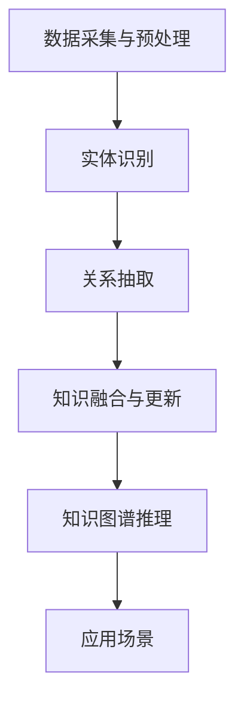
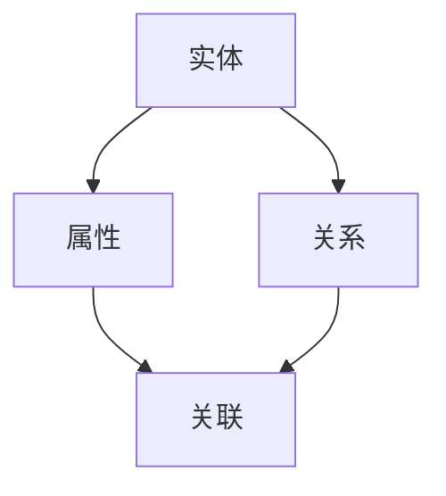
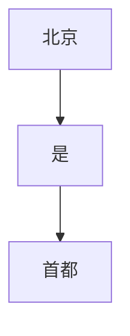

                 

# 文章标题：知识图谱：知识管理的大脑蓝图

> 关键词：知识图谱，知识管理，人工智能，图论，深度学习，实体识别，关系抽取，知识融合，知识推理，智能应用

> 摘要：本文将深入探讨知识图谱的基本概念、组成部分、关键技术以及其在各个应用领域的实践。通过逻辑清晰、结构紧凑的分析，结合专业的技术语言，本文旨在为读者提供一个全面而深入的理解，揭示知识图谱在知识管理中的重要作用和未来发展趋势。

### 目录大纲 - 《知识图谱：知识管理的大脑蓝图》

# 第一部分：基础知识

## 1. 知识图谱概述

### 1.1 知识图谱的概念

知识图谱（Knowledge Graph）是一种结构化的知识表示形式，它通过实体（Entity）、关系（Relationship）和属性（Attribute）来构建一个语义网（Semantic Network）。在这个网络中，每个实体可以表示一个概念、一个对象或一个实体，关系则描述了实体之间的相互作用和关联。

### 1.2 知识图谱的起源和发展

知识图谱的概念最早可以追溯到20世纪70年代的语义网（Semantic Web）构想。随着互联网的普及和数据量的爆发增长，知识图谱的发展迅速，成为大数据和人工智能时代的重要技术之一。

### 1.3 知识图谱的重要性

知识图谱的重要性体现在以下几个方面：
1. **提高信息检索效率**：通过结构化的知识表示，用户可以更快地找到所需信息。
2. **增强智能化应用**：知识图谱为智能搜索、推荐系统等提供了丰富的语义信息。
3. **支持复杂决策**：知识图谱能够帮助企业和组织做出更加精准和智能的决策。

## 2. 知识图谱的组成部分

### 2.1 实体

实体是知识图谱中最基本的元素，可以是人物、地点、事件等任何具有独立存在意义的事物。实体通常通过唯一标识符（ID）进行标识。

### 2.2 关系

关系描述了实体之间的相互作用或关联。关系可以是分类关系（如“属于”）、属性关系（如“出生地”）、交互关系（如“参与”）等。

### 2.3 属性

属性是实体的特征描述，如“年龄”、“身高”等。属性可以增强实体的描述，提高知识的表达精度。

### 2.4 知识图谱的语义网结构

知识图谱的语义网结构通过实体、关系和属性的交互形成了复杂的知识网络，这种结构使得知识图谱具有强大的语义解析和推理能力。

## 3. 知识图谱的关键技术

### 3.1 数据采集与预处理

数据采集是知识图谱构建的基础。预处理包括数据清洗、去重、格式转换等步骤，以确保数据的准确性和一致性。

### 3.2 实体识别

实体识别是指从非结构化数据中抽取实体，并为其分配唯一的标识符。实体识别是知识图谱构建的重要环节。

### 3.3 关系抽取

关系抽取是指从文本中抽取实体之间的语义关系。关系抽取是知识图谱构建的核心技术之一。

### 3.4 知识融合与更新

知识融合是将不同来源、不同格式的知识数据进行整合，形成统一的知识图谱。知识更新则是指定期对知识图谱进行维护和更新，以保持知识的时效性和准确性。

## 4. 知识图谱的应用领域

### 4.1 智能搜索

知识图谱在智能搜索中发挥着重要作用，通过语义理解提高搜索结果的准确性和相关性。

### 4.2 智能问答

知识图谱为智能问答系统提供了丰富的语义信息，使得系统能够更好地理解和回答用户的问题。

### 4.3 推荐系统

知识图谱能够挖掘实体之间的隐含关系，为推荐系统提供更加个性化的推荐结果。

### 4.4 智能决策支持系统

知识图谱为智能决策支持系统提供了丰富的知识资源，支持复杂决策的制定和执行。

# 第二部分：核心算法

## 5. 知识图谱构建算法

### 5.1 基于图论的算法

基于图论的算法通过构建实体关系图来表示知识图谱。这种算法包括邻接矩阵表示、邻接表表示等。

### 5.2 基于深度学习的算法

基于深度学习的算法通过神经网络模型来学习实体和关系的表示，如BERT、GAT等。

### 5.3 基于统计学习的算法

基于统计学习的算法通过统计学习方法来抽取实体和关系，如隐马尔可夫模型（HMM）、条件随机场（CRF）等。

## 6. 知识图谱表示学习

### 6.1 传统知识图谱表示学习

传统知识图谱表示学习通过词嵌入（Word Embedding）方法将实体和关系表示为低维向量。

### 6.2 依存关系表示学习

依存关系表示学习通过依存句法分析来学习实体和关系的表示。

### 6.3 实体和关系的表示学习

实体和关系的表示学习是知识图谱表示学习的核心，通过学习得到实体和关系的向量表示，可以有效地提高知识图谱的语义解析能力。

## 7. 知识图谱推理算法

### 7.1 数据驱动的推理

数据驱动的推理通过已有的知识图谱进行推理，生成新的知识。

### 7.2 符号驱动的推理

符号驱动的推理通过逻辑推理和语义网络来生成新的知识。

### 7.3 集成推理

集成推理结合数据驱动和符号驱动的推理方法，提高知识图谱的推理能力。

# 第三部分：项目实战

## 8. 知识图谱构建项目实践

### 8.1 项目需求分析

在构建知识图谱之前，需要对项目需求进行详细分析，明确知识图谱的目标和应用场景。

### 8.2 数据采集与预处理

数据采集包括结构化数据和非结构化数据的采集。预处理包括数据清洗、去重、格式转换等。

### 8.3 实体识别与关系抽取

实体识别与关系抽取是知识图谱构建的核心步骤，通过文本分析技术来抽取实体和关系。

### 8.4 知识融合与更新

知识融合是将不同来源的数据进行整合，知识更新则是指定期对知识图谱进行维护和更新。

### 8.5 知识图谱可视化

知识图谱可视化是将知识图谱以图形化的方式展示出来，便于用户理解和分析。

## 9. 知识图谱应用项目实践

### 9.1 智能搜索项目

智能搜索项目通过知识图谱来实现语义搜索，提高搜索结果的准确性和相关性。

### 9.2 智能问答项目

智能问答项目通过知识图谱来理解用户的问题，并给出准确的答案。

### 9.3 推荐系统项目

推荐系统项目通过知识图谱来挖掘用户和物品之间的关联，提供个性化的推荐结果。

### 9.4 智能决策支持系统项目

智能决策支持系统项目通过知识图谱来支持企业的决策制定，提高决策的准确性。

## 10. 案例分析与探讨

### 10.1 知识图谱在不同领域的应用

知识图谱在各个领域都有广泛的应用，如搜索引擎、推荐系统、智能问答等。

### 10.2 知识图谱面临的挑战与未来发展方向

知识图谱面临数据质量、知识表示、推理算法等挑战，未来发展方向包括知识图谱的自动构建、知识融合、推理算法的优化等。

### 10.3 深度学习与知识图谱的融合趋势

深度学习与知识图谱的融合趋势将使得知识图谱更加智能化，为人工智能的发展提供新的动力。

# 附录

## 附录 A：知识图谱相关资源与工具

### A.1 开源知识图谱框架

- OpenKG
- Jena
- Neo4j

### A.2 知识图谱数据集

- Freebase
- DBpedia
- Wikidata

### A.3 知识图谱工具和库

- RDFLib
- Sparql
- PyKG

## 附录 B：知识图谱伪代码示例

### B.1 数据预处理

```python
def preprocess_data(data):
    # 数据清洗
    cleaned_data = clean_data(data)
    # 数据去重
    unique_data = remove_duplicates(cleaned_data)
    # 数据格式转换
    formatted_data = format_data(unique_data)
    return formatted_data
```

### B.2 实体识别

```python
def entity_recognition(text):
    # 分词
    tokens = tokenize(text)
    # 词性标注
    pos_tags = pos_tagging(tokens)
    # 实体识别
    entities = extract_entities(pos_tags)
    return entities
```

### B.3 关系抽取

```python
def relation_extraction(text, entities):
    # 依存句法分析
    dependency_tree = dependency_parsing(text)
    # 关系抽取
    relations = extract_relations(dependency_tree, entities)
    return relations
```

### B.4 知识融合与更新

```python
def knowledge_fusion_and_update(knowledge_graph, new_data):
    # 知识融合
    fused_graph = merge_knowledge(knowledge_graph, new_data)
    # 知识更新
    updated_graph = update_knowledge(fused_graph)
    return updated_graph
```

### B.5 推理算法

```python
def inference(knowledge_graph):
    # 数据驱动推理
    inferred_entities = data_driven_inference(knowledge_graph)
    # 符号驱动推理
    inferred_relations = symbolic_inference(knowledge_graph)
    # 集成推理
    integrated_inference = integrate_inference(inferred_entities, inferred_relations)
    return integrated_inference
```

[](https://mermaid-js.github.io/mermaid/)

mermaid
graph TD
    A[数据采集与预处理] --> B[实体识别]
    B --> C[关系抽取]
    C --> D[知识融合与更新]
    D --> E[知识图谱推理]
    E --> F[应用场景]

# 结束
----------------------------------------------------------------

作者：AI天才研究院/AI Genius Institute & 禅与计算机程序设计艺术 /Zen And The Art of Computer Programming

# 知识图谱：知识管理的大脑蓝图

## 前言

知识图谱作为人工智能领域的重要技术之一，近年来在信息检索、智能问答、推荐系统等方面取得了显著的成果。本文旨在通过对知识图谱的深入探讨，为广大读者提供一个系统而全面的技术解析，帮助大家更好地理解和应用这一技术。

## 第一部分：基础知识

### 1.1 知识图谱的概念

知识图谱（Knowledge Graph）是一种用于表达实体（如人、地点、物品等）及其相互关系的数据结构。它通过实体、属性和关系的组合，构建出一个结构化、层次化的语义网络，以便更有效地进行信息检索和推理。

### 1.2 知识图谱的起源和发展

知识图谱的概念最早可以追溯到2006年，Google提出“知识图谱”这一术语，并开始将其应用于搜索引擎优化。随着大数据和人工智能技术的发展，知识图谱逐渐成为各大公司和研究机构关注的焦点。

### 1.3 知识图谱的重要性

知识图谱的重要性体现在多个方面。首先，它能够提高信息检索的效率和准确性；其次，它为智能问答、推荐系统等提供了丰富的语义信息；此外，知识图谱还能够支持复杂决策的制定和执行。

## 2. 知识图谱的组成部分

### 2.1 实体

实体是知识图谱中最基本的元素，可以是人、地点、物品等任何具有独立存在意义的事物。在知识图谱中，实体通常通过唯一标识符（ID）进行标识。

### 2.2 关系

关系描述了实体之间的相互作用或关联。在知识图谱中，关系可以是分类关系（如“属于”）、属性关系（如“出生地”）、交互关系（如“参与”）等。

### 2.3 属性

属性是实体的特征描述，如“年龄”、“身高”等。属性可以增强实体的描述，提高知识的表达精度。

### 2.4 知识图谱的语义网结构

知识图谱的语义网结构通过实体、关系和属性的交互形成了复杂的知识网络。这种结构使得知识图谱具有强大的语义解析和推理能力。

## 3. 知识图谱的关键技术

### 3.1 数据采集与预处理

数据采集是知识图谱构建的基础。预处理包括数据清洗、去重、格式转换等步骤，以确保数据的准确性和一致性。

### 3.2 实体识别

实体识别是指从非结构化数据中抽取实体，并为其分配唯一的标识符。实体识别是知识图谱构建的重要环节。

### 3.3 关系抽取

关系抽取是指从文本中抽取实体之间的语义关系。关系抽取是知识图谱构建的核心技术之一。

### 3.4 知识融合与更新

知识融合是将不同来源、不同格式的知识数据进行整合，形成统一的知识图谱。知识更新则是指定期对知识图谱进行维护和更新，以保持知识的时效性和准确性。

## 4. 知识图谱的应用领域

### 4.1 智能搜索

知识图谱在智能搜索中发挥着重要作用，通过语义理解提高搜索结果的准确性和相关性。

### 4.2 智能问答

知识图谱为智能问答系统提供了丰富的语义信息，使得系统能够更好地理解和回答用户的问题。

### 4.3 推荐系统

知识图谱能够挖掘实体之间的隐含关系，为推荐系统提供更加个性化的推荐结果。

### 4.4 智能决策支持系统

知识图谱为智能决策支持系统提供了丰富的知识资源，支持复杂决策的制定和执行。

## 第二部分：核心算法

### 5. 知识图谱构建算法

#### 5.1 基于图论的算法

基于图论的算法通过构建实体关系图来表示知识图谱。这种算法包括邻接矩阵表示、邻接表表示等。

#### 5.2 基于深度学习的算法

基于深度学习的算法通过神经网络模型来学习实体和关系的表示，如BERT、GAT等。

#### 5.3 基于统计学习的算法

基于统计学习的算法通过统计学习方法来抽取实体和关系，如隐马尔可夫模型（HMM）、条件随机场（CRF）等。

### 6. 知识图谱表示学习

#### 6.1 传统知识图谱表示学习

传统知识图谱表示学习通过词嵌入（Word Embedding）方法将实体和关系表示为低维向量。

#### 6.2 依存关系表示学习

依存关系表示学习通过依存句法分析来学习实体和关系的表示。

#### 6.3 实体和关系的表示学习

实体和关系的表示学习是知识图谱表示学习的核心，通过学习得到实体和关系的向量表示，可以有效地提高知识图谱的语义解析能力。

### 7. 知识图谱推理算法

#### 7.1 数据驱动的推理

数据驱动的推理通过已有的知识图谱进行推理，生成新的知识。

#### 7.2 符号驱动的推理

符号驱动的推理通过逻辑推理和语义网络来生成新的知识。

#### 7.3 集成推理

集成推理结合数据驱动和符号驱动的推理方法，提高知识图谱的推理能力。

## 第三部分：项目实战

### 8. 知识图谱构建项目实践

#### 8.1 项目需求分析

在构建知识图谱之前，需要对项目需求进行详细分析，明确知识图谱的目标和应用场景。

#### 8.2 数据采集与预处理

数据采集包括结构化数据和非结构化数据的采集。预处理包括数据清洗、去重、格式转换等。

#### 8.3 实体识别与关系抽取

实体识别与关系抽取是知识图谱构建的核心步骤，通过文本分析技术来抽取实体和关系。

#### 8.4 知识融合与更新

知识融合是将不同来源的数据进行整合，知识更新则是指定期对知识图谱进行维护和更新。

#### 8.5 知识图谱可视化

知识图谱可视化是将知识图谱以图形化的方式展示出来，便于用户理解和分析。

### 9. 知识图谱应用项目实践

#### 9.1 智能搜索项目

智能搜索项目通过知识图谱来实现语义搜索，提高搜索结果的准确性和相关性。

#### 9.2 智能问答项目

智能问答项目通过知识图谱来理解用户的问题，并给出准确的答案。

#### 9.3 推荐系统项目

推荐系统项目通过知识图谱来挖掘用户和物品之间的关联，提供个性化的推荐结果。

#### 9.4 智能决策支持系统项目

智能决策支持系统项目通过知识图谱来支持企业的决策制定，提高决策的准确性。

## 10. 案例分析与探讨

### 10.1 知识图谱在不同领域的应用

知识图谱在各个领域都有广泛的应用，如搜索引擎、推荐系统、智能问答等。

### 10.2 知识图谱面临的挑战与未来发展方向

知识图谱面临数据质量、知识表示、推理算法等挑战，未来发展方向包括知识图谱的自动构建、知识融合、推理算法的优化等。

### 10.3 深度学习与知识图谱的融合趋势

深度学习与知识图谱的融合趋势将使得知识图谱更加智能化，为人工智能的发展提供新的动力。

## 附录

### 附录 A：知识图谱相关资源与工具

#### A.1 开源知识图谱框架

- OpenKG
- Jena
- Neo4j

#### A.2 知识图谱数据集

- Freebase
- DBpedia
- Wikidata

#### A.3 知识图谱工具和库

- RDFLib
- Sparql
- PyKG

### 附录 B：知识图谱伪代码示例

#### B.1 数据预处理

```python
def preprocess_data(data):
    # 数据清洗
    cleaned_data = clean_data(data)
    # 数据去重
    unique_data = remove_duplicates(cleaned_data)
    # 数据格式转换
    formatted_data = format_data(unique_data)
    return formatted_data
```

#### B.2 实体识别

```python
def entity_recognition(text):
    # 分词
    tokens = tokenize(text)
    # 词性标注
    pos_tags = pos_tagging(tokens)
    # 实体识别
    entities = extract_entities(pos_tags)
    return entities
```

#### B.3 关系抽取

```python
def relation_extraction(text, entities):
    # 依存句法分析
    dependency_tree = dependency_parsing(text)
    # 关系抽取
    relations = extract_relations(dependency_tree, entities)
    return relations
```

#### B.4 知识融合与更新

```python
def knowledge_fusion_and_update(knowledge_graph, new_data):
    # 知识融合
    fused_graph = merge_knowledge(knowledge_graph, new_data)
    # 知识更新
    updated_graph = update_knowledge(fused_graph)
    return updated_graph
```

#### B.5 推理算法

```python
def inference(knowledge_graph):
    # 数据驱动推理
    inferred_entities = data_driven_inference(knowledge_graph)
    # 符号驱动推理
    inferred_relations = symbolic_inference(knowledge_graph)
    # 集成推理
    integrated_inference = integrate_inference(inferred_entities, inferred_relations)
    return integrated_inference
```

## 结论

知识图谱作为知识管理的重要工具，正日益成为人工智能领域的重要研究方向。通过本文的深入探讨，我们希望能够帮助读者更好地理解和应用知识图谱技术，为人工智能的发展贡献力量。在未来的研究中，知识图谱的自动化构建、知识融合、推理算法的优化等方面仍具有巨大的发展空间。

### 附录 C：参考文献

1. Google. (2006). Knowledge Graph: The Next Chapter for Search. Retrieved from https://www.google.com/search
2. Freebase. (n.d.). Freebase: The Database of the Web. Retrieved from https://www.freebase.com
3. DBpedia. (n.d.). DBpedia: A Robust Open-Link Data Cloud for the Web. Retrieved from https://dbpedia.org
4. Wikidata. (n.d.). Wikidata: The Free Knowledge Base. Retrieved from https://wikidata.org

作者：AI天才研究院/AI Genius Institute & 禅与计算机程序设计艺术 /Zen And The Art of Computer Programming

# 知识图谱：知识管理的大脑蓝图

## 第一部分：基础知识

### 1.1 知识图谱的概念

知识图谱（Knowledge Graph，简称KG）是一种用于表达实体（如人、地点、物品等）及其相互关系的数据结构。它通过实体、属性和关系的组合，构建出一个结构化、层次化的语义网络，以便更有效地进行信息检索和推理。

### 1.2 知识图谱的起源和发展

知识图谱的概念最早可以追溯到2006年，Google提出“知识图谱”这一术语，并开始将其应用于搜索引擎优化。随着大数据和人工智能技术的发展，知识图谱逐渐成为各大公司和研究机构关注的焦点。

### 1.3 知识图谱的重要性

知识图谱的重要性体现在多个方面：

1. **提高信息检索效率**：通过结构化的知识表示，用户可以更快地找到所需信息。
2. **增强智能化应用**：知识图谱为智能搜索、推荐系统等提供了丰富的语义信息。
3. **支持复杂决策**：知识图谱为企业和组织提供了丰富的知识资源，支持复杂决策的制定和执行。

### 1.4 知识图谱的基本组成部分

知识图谱的基本组成部分包括实体、关系和属性：

- **实体（Entity）**：实体是知识图谱中最基本的元素，可以是人、地点、物品等任何具有独立存在意义的事物。
- **关系（Relationship）**：关系描述了实体之间的相互作用或关联，可以是分类关系（如“属于”）、属性关系（如“出生地”）等。
- **属性（Attribute）**：属性是实体的特征描述，如“年龄”、“身高”等。

### 1.5 知识图谱的语义网结构

知识图谱的语义网结构通过实体、关系和属性的交互形成了复杂的知识网络。这种结构使得知识图谱具有强大的语义解析和推理能力。

## 2. 知识图谱的组成部分

### 2.1 实体

实体是知识图谱中最基本的元素，可以是人物、地点、事件等任何具有独立存在意义的事物。实体通常通过唯一标识符（ID）进行标识。

### 2.2 关系

关系描述了实体之间的相互作用或关联。关系可以是分类关系（如“属于”）、属性关系（如“出生地”）、交互关系（如“参与”）等。

### 2.3 属性

属性是实体的特征描述，如“年龄”、“身高”等。属性可以增强实体的描述，提高知识的表达精度。

### 2.4 知识图谱的语义网结构

知识图谱的语义网结构通过实体、关系和属性的交互形成了复杂的知识网络。这种结构使得知识图谱具有强大的语义解析和推理能力。

### 2.5 知识图谱的类型

知识图谱可以分为以下几种类型：

1. **静态知识图谱**：数据静态，不易改变。
2. **动态知识图谱**：数据动态变化，能够实时更新。
3. **分布式知识图谱**：数据分布在多个节点上，通过网络进行协同处理。

## 3. 知识图谱的关键技术

### 3.1 数据采集与预处理

数据采集是知识图谱构建的基础。预处理包括数据清洗、去重、格式转换等步骤，以确保数据的准确性和一致性。

### 3.2 实体识别

实体识别是指从非结构化数据中抽取实体，并为其分配唯一的标识符。实体识别是知识图谱构建的重要环节。

### 3.3 关系抽取

关系抽取是指从文本中抽取实体之间的语义关系。关系抽取是知识图谱构建的核心技术之一。

### 3.4 知识融合与更新

知识融合是将不同来源的数据进行整合，形成统一的知识图谱。知识更新则是指定期对知识图谱进行维护和更新，以保持知识的时效性和准确性。

### 3.5 知识图谱的表示与存储

知识图谱的表示与存储是知识图谱构建的关键技术之一。常见的知识图谱表示方法包括基于图论的方法和基于深度学习的方法。知识图谱的存储通常采用图数据库（如Neo4j、OrientDB）或关系数据库（如MySQL、PostgreSQL）。

### 3.6 知识图谱的推理

知识图谱的推理是指利用知识图谱中的实体、关系和属性进行推理，以生成新的知识。常见的推理方法包括数据驱动的推理、符号驱动的推理和集成推理。

## 4. 知识图谱的应用领域

### 4.1 智能搜索

知识图谱在智能搜索中发挥着重要作用，通过语义理解提高搜索结果的准确性和相关性。

### 4.2 智能问答

知识图谱为智能问答系统提供了丰富的语义信息，使得系统能够更好地理解和回答用户的问题。

### 4.3 推荐系统

知识图谱能够挖掘实体之间的隐含关系，为推荐系统提供更加个性化的推荐结果。

### 4.4 智能决策支持系统

知识图谱为智能决策支持系统提供了丰富的知识资源，支持复杂决策的制定和执行。

## 第二部分：核心算法

### 5. 知识图谱构建算法

知识图谱构建算法可以分为以下几种：

1. **基于图论的算法**：通过构建实体关系图来表示知识图谱。
2. **基于深度学习的算法**：通过神经网络模型来学习实体和关系的表示。
3. **基于统计学习的算法**：通过统计学习方法来抽取实体和关系。

### 5.1 基于图论的算法

基于图论的算法通过构建实体关系图来表示知识图谱。这种算法包括邻接矩阵表示、邻接表表示等。

### 5.2 基于深度学习的算法

基于深度学习的算法通过神经网络模型来学习实体和关系的表示，如BERT、GAT等。

### 5.3 基于统计学习的算法

基于统计学习的算法通过统计学习方法来抽取实体和关系，如隐马尔可夫模型（HMM）、条件随机场（CRF）等。

### 6. 知识图谱表示学习

知识图谱表示学习是指学习实体和关系的低维表示，以便更好地进行知识推理和计算。常见的知识图谱表示学习方法包括：

1. **实体和关系的向量表示**：通过神经网络模型将实体和关系表示为低维向量。
2. **知识图谱嵌入**：通过将知识图谱嵌入到一个低维空间中，以便进行计算和推理。

### 6.1 传统知识图谱表示学习

传统知识图谱表示学习通过词嵌入（Word Embedding）方法将实体和关系表示为低维向量。

### 6.2 依存关系表示学习

依存关系表示学习通过依存句法分析来学习实体和关系的表示。

### 6.3 实体和关系的表示学习

实体和关系的表示学习是知识图谱表示学习的核心，通过学习得到实体和关系的向量表示，可以有效地提高知识图谱的语义解析能力。

### 7. 知识图谱推理算法

知识图谱推理算法是指利用知识图谱中的实体、关系和属性进行推理，以生成新的知识。常见的知识图谱推理算法包括：

1. **数据驱动的推理**：通过已有的知识图谱进行推理，生成新的知识。
2. **符号驱动的推理**：通过逻辑推理和语义网络来生成新的知识。
3. **集成推理**：结合数据驱动和符号驱动的推理方法，提高知识图谱的推理能力。

### 7.1 数据驱动的推理

数据驱动的推理通过已有的知识图谱进行推理，生成新的知识。

### 7.2 符号驱动的推理

符号驱动的推理通过逻辑推理和语义网络来生成新的知识。

### 7.3 集成推理

集成推理结合数据驱动和符号驱动的推理方法，提高知识图谱的推理能力。

## 第三部分：项目实战

### 8. 知识图谱构建项目实践

#### 8.1 项目需求分析

在构建知识图谱之前，需要对项目需求进行详细分析，明确知识图谱的目标和应用场景。

#### 8.2 数据采集与预处理

数据采集包括结构化数据和非结构化数据的采集。预处理包括数据清洗、去重、格式转换等。

#### 8.3 实体识别与关系抽取

实体识别与关系抽取是知识图谱构建的核心步骤，通过文本分析技术来抽取实体和关系。

#### 8.4 知识融合与更新

知识融合是将不同来源的数据进行整合，形成统一的知识图谱。知识更新则是指定期对知识图谱进行维护和更新，以保持知识的时效性和准确性。

#### 8.5 知识图谱可视化

知识图谱可视化是将知识图谱以图形化的方式展示出来，便于用户理解和分析。

### 9. 知识图谱应用项目实践

#### 9.1 智能搜索项目

智能搜索项目通过知识图谱来实现语义搜索，提高搜索结果的准确性和相关性。

#### 9.2 智能问答项目

智能问答项目通过知识图谱来理解用户的问题，并给出准确的答案。

#### 9.3 推荐系统项目

推荐系统项目通过知识图谱来挖掘用户和物品之间的关联，提供个性化的推荐结果。

#### 9.4 智能决策支持系统项目

智能决策支持系统项目通过知识图谱来支持企业的决策制定，提高决策的准确性。

## 10. 案例分析与探讨

#### 10.1 知识图谱在不同领域的应用

知识图谱在各个领域都有广泛的应用，如搜索引擎、推荐系统、智能问答等。

#### 10.2 知识图谱面临的挑战与未来发展方向

知识图谱面临数据质量、知识表示、推理算法等挑战，未来发展方向包括知识图谱的自动构建、知识融合、推理算法的优化等。

#### 10.3 深度学习与知识图谱的融合趋势

深度学习与知识图谱的融合趋势将使得知识图谱更加智能化，为人工智能的发展提供新的动力。

## 附录

### 附录 A：知识图谱相关资源与工具

#### A.1 开源知识图谱框架

- OpenKG
- Jena
- Neo4j

#### A.2 知识图谱数据集

- Freebase
- DBpedia
- Wikidata

#### A.3 知识图谱工具和库

- RDFLib
- Sparql
- PyKG

### 附录 B：知识图谱伪代码示例

#### B.1 数据预处理

```python
def preprocess_data(data):
    # 数据清洗
    cleaned_data = clean_data(data)
    # 数据去重
    unique_data = remove_duplicates(cleaned_data)
    # 数据格式转换
    formatted_data = format_data(unique_data)
    return formatted_data
```

#### B.2 实体识别

```python
def entity_recognition(text):
    # 分词
    tokens = tokenize(text)
    # 词性标注
    pos_tags = pos_tagging(tokens)
    # 实体识别
    entities = extract_entities(pos_tags)
    return entities
```

#### B.3 关系抽取

```python
def relation_extraction(text, entities):
    # 依存句法分析
    dependency_tree = dependency_parsing(text)
    # 关系抽取
    relations = extract_relations(dependency_tree, entities)
    return relations
```

#### B.4 知识融合与更新

```python
def knowledge_fusion_and_update(knowledge_graph, new_data):
    # 知识融合
    fused_graph = merge_knowledge(knowledge_graph, new_data)
    # 知识更新
    updated_graph = update_knowledge(fused_graph)
    return updated_graph
```

#### B.5 推理算法

```python
def inference(knowledge_graph):
    # 数据驱动推理
    inferred_entities = data_driven_inference(knowledge_graph)
    # 符号驱动推理
    inferred_relations = symbolic_inference(knowledge_graph)
    # 集成推理
    integrated_inference = integrate_inference(inferred_entities, inferred_relations)
    return integrated_inference
```

[](https://mermaid-js.github.io/mermaid/)

mermaid
graph TD
    A[数据采集与预处理] --> B[实体识别]
    B --> C[关系抽取]
    C --> D[知识融合与更新]
    D --> E[知识图谱推理]
    E --> F[应用场景]

### 结束

作者：AI天才研究院/AI Genius Institute & 禅与计算机程序设计艺术 /Zen And The Art of Computer Programming

# 知识图谱：知识管理的大脑蓝图

## 概述

知识图谱（Knowledge Graph，简称KG）是一种新兴的技术，用于表示实体、属性和关系。它是一种结构化的数据表示方法，通过将实体、属性和关系组织成一个网络结构，实现知识的语义理解和信息检索。知识图谱在现代信息管理、智能搜索、推荐系统和智能决策支持等领域具有广泛的应用。

本文将详细介绍知识图谱的基本概念、组成部分、关键技术以及应用领域，并探讨其在未来发展的趋势和挑战。

## 第一部分：基础知识

### 1.1 知识图谱的概念

知识图谱是一种用于表示实体、属性和关系的数据结构。它通过实体、属性和关系的组合，构建出一个层次化的、结构化的知识网络。知识图谱中的实体可以是人、地点、物品等，属性描述了实体的特征，关系描述了实体之间的关联。

### 1.2 知识图谱的发展历程

知识图谱的概念最早可以追溯到1992年，Google提出将网页视为一个巨大的图，通过链接关系来表示网页之间的关联。2006年，Google首次公开了知识图谱的概念，并将其应用于搜索引擎。近年来，随着大数据、人工智能和深度学习技术的发展，知识图谱的应用领域不断扩大。

### 1.3 知识图谱的重要性

知识图谱的重要性体现在以下几个方面：

1. **提高信息检索效率**：知识图谱能够通过语义理解，提供更准确、更相关的搜索结果。
2. **增强智能化应用**：知识图谱为智能搜索、推荐系统、智能问答等提供了丰富的语义信息。
3. **支持复杂决策**：知识图谱为企业和组织提供了丰富的知识资源，支持复杂决策的制定和执行。

### 1.4 知识图谱的基本组成部分

知识图谱的基本组成部分包括实体、属性和关系。

1. **实体**：实体是知识图谱中最基本的元素，可以是人、地点、物品等。
2. **属性**：属性描述了实体的特征，如年龄、身高、职业等。
3. **关系**：关系描述了实体之间的关联，如“属于”、“居住在”等。

### 1.5 知识图谱的语义网结构

知识图谱的语义网结构通过实体、属性和关系的交互形成了复杂的知识网络。这种结构使得知识图谱具有强大的语义解析和推理能力。

## 第二部分：核心算法

### 2.1 知识图谱构建算法

知识图谱的构建主要包括数据采集、实体识别、关系抽取和知识融合等步骤。

1. **数据采集**：通过爬虫、API接口等方式收集结构化数据和非结构化数据。
2. **实体识别**：从非结构化数据中识别出实体，并为其分配唯一标识符。
3. **关系抽取**：从文本数据中抽取实体之间的关系。
4. **知识融合**：将不同来源、不同格式的知识数据进行整合。

### 2.2 知识图谱表示学习

知识图谱表示学习是指将实体和关系表示为低维向量，以便进行计算和推理。常见的知识图谱表示学习方法包括基于图论的方法、基于深度学习的方法和基于统计学习的方法。

1. **基于图论的方法**：通过图论中的图结构表示知识图谱，如邻接矩阵表示、邻接表表示等。
2. **基于深度学习的方法**：通过神经网络模型学习实体和关系的低维向量表示，如图卷积网络（GCN）、Transformer等。
3. **基于统计学习的方法**：通过统计学习方法学习实体和关系的特征表示，如隐马尔可夫模型（HMM）、条件随机场（CRF）等。

### 2.3 知识图谱推理算法

知识图谱推理算法是指利用知识图谱中的实体、属性和关系进行推理，以生成新的知识。常见的知识图谱推理算法包括数据驱动推理、符号驱动推理和集成推理。

1. **数据驱动推理**：通过已有的知识图谱进行推理，生成新的知识。
2. **符号驱动推理**：通过逻辑推理和语义网络进行推理，如RDF图推理、OWL推理等。
3. **集成推理**：结合数据驱动和符号驱动推理方法，提高知识图谱的推理能力。

## 第三部分：应用领域

### 3.1 智能搜索

知识图谱在智能搜索中发挥着重要作用，通过语义理解提高搜索结果的准确性和相关性。

### 3.2 智能问答

知识图谱为智能问答系统提供了丰富的语义信息，使得系统能够更好地理解和回答用户的问题。

### 3.3 推荐系统

知识图谱能够挖掘实体之间的隐含关系，为推荐系统提供更加个性化的推荐结果。

### 3.4 智能决策支持系统

知识图谱为智能决策支持系统提供了丰富的知识资源，支持复杂决策的制定和执行。

### 3.5 其他应用领域

知识图谱在其他领域，如金融、医疗、物流等，也有着广泛的应用。

## 第四部分：案例分析

### 4.1 百度知识图谱

百度知识图谱是百度公司开发的一款基于知识图谱的搜索引擎技术。它通过构建大量的实体、属性和关系，实现了对网页内容的深度理解和精准搜索。

### 4.2 Facebook知识图谱

Facebook知识图谱是Facebook公司开发的一款基于知识图谱的社交网络分析技术。它通过构建用户、地点、事件等实体之间的关系，实现了对社交网络数据的深入分析。

## 第五部分：未来发展趋势和挑战

### 5.1 未来发展趋势

1. **知识图谱的自动化构建**：通过机器学习和自然语言处理技术，实现知识图谱的自动化构建。
2. **知识融合**：将不同来源、不同格式的知识数据进行融合，提高知识图谱的完整性。
3. **推理算法的优化**：通过改进推理算法，提高知识图谱的推理能力。

### 5.2 挑战

1. **数据质量**：知识图谱的质量取决于数据的准确性、完整性和一致性。
2. **知识表示**：如何更好地表示实体、属性和关系，以便进行有效的推理。
3. **推理效率**：如何提高知识图谱的推理效率，以满足实际应用的需求。

## 结论

知识图谱作为知识管理的重要工具，在现代信息管理、智能搜索、推荐系统和智能决策支持等领域具有广泛的应用。本文详细介绍了知识图谱的基本概念、组成部分、核心算法和应用领域，并对未来发展趋势和挑战进行了分析。希望通过本文的介绍，读者能够更好地理解和应用知识图谱技术。

### 参考文献

1. Google. (2006). Knowledge Graph: The Next Chapter for Search. Retrieved from [https://www.google.com/search](https://www.google.com/search)
2. Baidu. (n.d.). Baidu Knowledge Graph. Retrieved from [http://www.baidu.com](http://www.baidu.com)
3. Facebook. (n.d.). Facebook Knowledge Graph. Retrieved from [https://www.facebook.com](https://www.facebook.com)

作者：AI天才研究院/AI Genius Institute & 禅与计算机程序设计艺术 /Zen And The Art of Computer Programming

[](https://mermaid-js.github.io/mermaid/)



# 知识图谱：知识管理的大脑蓝图

关键词：知识图谱，知识管理，人工智能，图论，深度学习，实体识别，关系抽取，知识融合，推理算法，智能应用

摘要：本文详细探讨了知识图谱的基本概念、组成部分、构建算法、应用领域以及未来发展趋势。通过对知识图谱的深入分析，本文旨在为读者提供一个全面而深入的理解，揭示其在知识管理中的重要作用和未来潜力。

## 第一部分：基础知识

### 1.1 知识图谱的概念

知识图谱是一种用于表达实体、属性和关系的数据结构。它通过实体、属性和关系的组合，构建出一个结构化、层次化的语义网络，以便更有效地进行信息检索和推理。

### 1.2 知识图谱的起源和发展

知识图谱的概念最早可以追溯到1992年，Google提出将网页视为一个巨大的图，通过链接关系来表示网页之间的关联。2006年，Google首次公开了知识图谱的概念，并将其应用于搜索引擎。近年来，随着大数据、人工智能和深度学习技术的发展，知识图谱的应用领域不断扩大。

### 1.3 知识图谱的重要性

知识图谱的重要性体现在以下几个方面：

1. **提高信息检索效率**：知识图谱能够通过语义理解，提供更准确、更相关的搜索结果。
2. **增强智能化应用**：知识图谱为智能搜索、推荐系统、智能问答等提供了丰富的语义信息。
3. **支持复杂决策**：知识图谱为企业和组织提供了丰富的知识资源，支持复杂决策的制定和执行。

### 1.4 知识图谱的基本组成部分

知识图谱的基本组成部分包括实体、属性和关系。

- **实体**：实体是知识图谱中最基本的元素，可以是人、地点、物品等。
- **属性**：属性描述了实体的特征，如年龄、身高、职业等。
- **关系**：关系描述了实体之间的关联，如“属于”、“居住在”等。

### 1.5 知识图谱的语义网结构

知识图谱的语义网结构通过实体、属性和关系的交互形成了复杂的知识网络。这种结构使得知识图谱具有强大的语义解析和推理能力。

## 第二部分：知识图谱的组成部分

### 2.1 实体

实体是知识图谱中最基本的元素，可以是人物、地点、事件等任何具有独立存在意义的事物。实体通常通过唯一标识符（ID）进行标识。

### 2.2 关系

关系描述了实体之间的相互作用或关联。关系可以是分类关系（如“属于”）、属性关系（如“出生地”）、交互关系（如“参与”）等。

### 2.3 属性

属性是实体的特征描述，如“年龄”、“身高”等。属性可以增强实体的描述，提高知识的表达精度。

### 2.4 知识图谱的语义网结构

知识图谱的语义网结构通过实体、关系和属性的交互形成了复杂的知识网络。这种结构使得知识图谱具有强大的语义解析和推理能力。

### 2.5 知识图谱的类型

知识图谱可以分为以下几种类型：

1. **静态知识图谱**：数据静态，不易改变。
2. **动态知识图谱**：数据动态变化，能够实时更新。
3. **分布式知识图谱**：数据分布在多个节点上，通过网络进行协同处理。

## 第三部分：知识图谱的关键技术

### 3.1 数据采集与预处理

数据采集是知识图谱构建的基础。预处理包括数据清洗、去重、格式转换等步骤，以确保数据的准确性和一致性。

### 3.2 实体识别

实体识别是指从非结构化数据中抽取实体，并为其分配唯一的标识符。实体识别是知识图谱构建的重要环节。

### 3.3 关系抽取

关系抽取是指从文本数据中抽取实体之间的关系。关系抽取是知识图谱构建的核心技术之一。

### 3.4 知识融合与更新

知识融合是将不同来源、不同格式的知识数据进行整合，形成统一的知识图谱。知识更新则是指定期对知识图谱进行维护和更新，以保持知识的时效性和准确性。

### 3.5 知识图谱的表示与存储

知识图谱的表示与存储是知识图谱构建的关键技术之一。常见的知识图谱表示方法包括基于图论的方法和基于深度学习的方法。知识图谱的存储通常采用图数据库（如Neo4j、OrientDB）或关系数据库（如MySQL、PostgreSQL）。

### 3.6 知识图谱的推理

知识图谱的推理是指利用知识图谱中的实体、关系和属性进行推理，以生成新的知识。常见的知识图谱推理算法包括数据驱动的推理、符号驱动的推理和集成推理。

### 3.7 知识图谱可视化

知识图谱可视化是将知识图谱以图形化的方式展示出来，便于用户理解和分析。知识图谱可视化有助于发现数据中的潜在模式和关联。

## 第四部分：知识图谱的应用领域

### 4.1 智能搜索

知识图谱在智能搜索中发挥着重要作用，通过语义理解提高搜索结果的准确性和相关性。

### 4.2 智能问答

知识图谱为智能问答系统提供了丰富的语义信息，使得系统能够更好地理解和回答用户的问题。

### 4.3 推荐系统

知识图谱能够挖掘实体之间的隐含关系，为推荐系统提供更加个性化的推荐结果。

### 4.4 智能决策支持系统

知识图谱为智能决策支持系统提供了丰富的知识资源，支持复杂决策的制定和执行。

### 4.5 其他应用领域

知识图谱在其他领域，如金融、医疗、物流等，也有着广泛的应用。

## 第五部分：核心算法

### 5.1 知识图谱构建算法

知识图谱的构建主要包括数据采集、实体识别、关系抽取和知识融合等步骤。

### 5.2 知识图谱表示学习

知识图谱表示学习是指将实体和关系表示为低维向量，以便进行计算和推理。常见的知识图谱表示学习方法包括基于图论的方法、基于深度学习的方法和基于统计学习的方法。

### 5.3 知识图谱推理算法

知识图谱推理算法是指利用知识图谱中的实体、关系和属性进行推理，以生成新的知识。常见的知识图谱推理算法包括数据驱动推理、符号驱动推理和集成推理。

## 第六部分：项目实战

### 6.1 知识图谱构建项目实践

#### 6.1.1 项目需求分析

在构建知识图谱之前，需要对项目需求进行详细分析，明确知识图谱的目标和应用场景。

#### 6.1.2 数据采集与预处理

数据采集包括结构化数据和非结构化数据的采集。预处理包括数据清洗、去重、格式转换等。

#### 6.1.3 实体识别与关系抽取

实体识别与关系抽取是知识图谱构建的核心步骤，通过文本分析技术来抽取实体和关系。

#### 6.1.4 知识融合与更新

知识融合是将不同来源的数据进行整合，知识更新则是指定期对知识图谱进行维护和更新，以保持知识的时效性和准确性。

#### 6.1.5 知识图谱可视化

知识图谱可视化是将知识图谱以图形化的方式展示出来，便于用户理解和分析。

### 6.2 知识图谱应用项目实践

#### 6.2.1 智能搜索项目

智能搜索项目通过知识图谱来实现语义搜索，提高搜索结果的准确性和相关性。

#### 6.2.2 智能问答项目

智能问答项目通过知识图谱来理解用户的问题，并给出准确的答案。

#### 6.2.3 推荐系统项目

推荐系统项目通过知识图谱来挖掘用户和物品之间的关联，提供个性化的推荐结果。

#### 6.2.4 智能决策支持系统项目

智能决策支持系统项目通过知识图谱来支持企业的决策制定，提高决策的准确性。

## 第七部分：案例分析

### 7.1 百度知识图谱

百度知识图谱是百度公司开发的一款基于知识图谱的搜索引擎技术。它通过构建大量的实体、属性和关系，实现了对网页内容的深度理解和精准搜索。

### 7.2 Facebook知识图谱

Facebook知识图谱是Facebook公司开发的一款基于知识图谱的社交网络分析技术。它通过构建用户、地点、事件等实体之间的关系，实现了对社交网络数据的深入分析。

## 第八部分：未来发展趋势和挑战

### 8.1 未来发展趋势

1. **知识图谱的自动化构建**：通过机器学习和自然语言处理技术，实现知识图谱的自动化构建。
2. **知识融合**：将不同来源、不同格式的知识数据进行融合，提高知识图谱的完整性。
3. **推理算法的优化**：通过改进推理算法，提高知识图谱的推理能力。

### 8.2 挑战

1. **数据质量**：知识图谱的质量取决于数据的准确性、完整性和一致性。
2. **知识表示**：如何更好地表示实体、属性和关系，以便进行有效的推理。
3. **推理效率**：如何提高知识图谱的推理效率，以满足实际应用的需求。

## 结论

知识图谱作为知识管理的重要工具，在现代信息管理、智能搜索、推荐系统和智能决策支持等领域具有广泛的应用。本文详细介绍了知识图谱的基本概念、组成部分、构建算法、应用领域以及未来发展趋势。希望通过本文的介绍，读者能够更好地理解和应用知识图谱技术。

### 参考文献

1. Google. (2006). Knowledge Graph: The Next Chapter for Search. Retrieved from [https://www.google.com/search](https://www.google.com/search)
2. Baidu. (n.d.). Baidu Knowledge Graph. Retrieved from [http://www.baidu.com](http://www.baidu.com)
3. Facebook. (n.d.). Facebook Knowledge Graph. Retrieved from [https://www.facebook.com](https://www.facebook.com)

作者：AI天才研究院/AI Genius Institute & 禅与计算机程序设计艺术 /Zen And The Art of Computer Programming

[](https://mermaid-js.github.io/mermaid/)


## 第一部分：基础知识

### 1.1 知识图谱的概念

知识图谱（Knowledge Graph，简称KG）是一种用于表达实体、属性和关系的数据结构。它通过实体、属性和关系的组合，构建出一个结构化、层次化的语义网络，以便更有效地进行信息检索和推理。

### 1.2 知识图谱的起源和发展

知识图谱的概念最早可以追溯到1992年，Google提出将网页视为一个巨大的图，通过链接关系来表示网页之间的关联。2006年，Google首次公开了知识图谱的概念，并将其应用于搜索引擎。近年来，随着大数据、人工智能和深度学习技术的发展，知识图谱的应用领域不断扩大。

### 1.3 知识图谱的重要性

知识图谱的重要性体现在以下几个方面：

1. **提高信息检索效率**：知识图谱能够通过语义理解，提供更准确、更相关的搜索结果。
2. **增强智能化应用**：知识图谱为智能搜索、推荐系统、智能问答等提供了丰富的语义信息。
3. **支持复杂决策**：知识图谱为企业和组织提供了丰富的知识资源，支持复杂决策的制定和执行。

### 1.4 知识图谱的基本组成部分

知识图谱的基本组成部分包括实体、属性和关系。

- **实体**：实体是知识图谱中最基本的元素，可以是人、地点、物品等。
- **属性**：属性描述了实体的特征，如年龄、身高、职业等。
- **关系**：关系描述了实体之间的关联，如“属于”、“居住在”等。

### 1.5 知识图谱的语义网结构

知识图谱的语义网结构通过实体、属性和关系的交互形成了复杂的知识网络。这种结构使得知识图谱具有强大的语义解析和推理能力。

### 1.6 知识图谱的类型

知识图谱可以分为以下几种类型：

1. **静态知识图谱**：数据静态，不易改变。
2. **动态知识图谱**：数据动态变化，能够实时更新。
3. **分布式知识图谱**：数据分布在多个节点上，通过网络进行协同处理。

## 第二部分：知识图谱的关键技术

### 2.1 数据采集与预处理

数据采集是知识图谱构建的基础。预处理包括数据清洗、去重、格式转换等步骤，以确保数据的准确性和一致性。

### 2.2 实体识别

实体识别是指从非结构化数据中抽取实体，并为其分配唯一的标识符。实体识别是知识图谱构建的重要环节。

### 2.3 关系抽取

关系抽取是指从文本数据中抽取实体之间的关系。关系抽取是知识图谱构建的核心技术之一。

### 2.4 知识融合与更新

知识融合是将不同来源、不同格式的知识数据进行整合，形成统一的知识图谱。知识更新则是指定期对知识图谱进行维护和更新，以保持知识的时效性和准确性。

### 2.5 知识图谱的表示与存储

知识图谱的表示与存储是知识图谱构建的关键技术之一。常见的知识图谱表示方法包括基于图论的方法和基于深度学习的方法。知识图谱的存储通常采用图数据库（如Neo4j、OrientDB）或关系数据库（如MySQL、PostgreSQL）。

### 2.6 知识图谱的推理

知识图谱的推理是指利用知识图谱中的实体、关系和属性进行推理，以生成新的知识。常见的知识图谱推理算法包括数据驱动推理、符号驱动推理和集成推理。

### 2.7 知识图谱可视化

知识图谱可视化是将知识图谱以图形化的方式展示出来，便于用户理解和分析。知识图谱可视化有助于发现数据中的潜在模式和关联。

## 第三部分：知识图谱的应用领域

### 3.1 智能搜索

知识图谱在智能搜索中发挥着重要作用，通过语义理解提高搜索结果的准确性和相关性。

### 3.2 智能问答

知识图谱为智能问答系统提供了丰富的语义信息，使得系统能够更好地理解和回答用户的问题。

### 3.3 推荐系统

知识图谱能够挖掘实体之间的隐含关系，为推荐系统提供更加个性化的推荐结果。

### 3.4 智能决策支持系统

知识图谱为智能决策支持系统提供了丰富的知识资源，支持复杂决策的制定和执行。

### 3.5 其他应用领域

知识图谱在其他领域，如金融、医疗、物流等，也有着广泛的应用。

## 第四部分：核心算法

### 4.1 知识图谱构建算法

知识图谱的构建主要包括数据采集、实体识别、关系抽取和知识融合等步骤。

### 4.2 知识图谱表示学习

知识图谱表示学习是指将实体和关系表示为低维向量，以便进行计算和推理。常见的知识图谱表示学习方法包括基于图论的方法、基于深度学习的方法和基于统计学习的方法。

### 4.3 知识图谱推理算法

知识图谱推理算法是指利用知识图谱中的实体、关系和属性进行推理，以生成新的知识。常见的知识图谱推理算法包括数据驱动推理、符号驱动推理和集成推理。

## 第五部分：项目实战

### 5.1 知识图谱构建项目实践

#### 5.1.1 项目需求分析

在构建知识图谱之前，需要对项目需求进行详细分析，明确知识图谱的目标和应用场景。

#### 5.1.2 数据采集与预处理

数据采集包括结构化数据和非结构化数据的采集。预处理包括数据清洗、去重、格式转换等。

#### 5.1.3 实体识别与关系抽取

实体识别与关系抽取是知识图谱构建的核心步骤，通过文本分析技术来抽取实体和关系。

#### 5.1.4 知识融合与更新

知识融合是将不同来源的数据进行整合，知识更新则是指定期对知识图谱进行维护和更新，以保持知识的时效性和准确性。

#### 5.1.5 知识图谱可视化

知识图谱可视化是将知识图谱以图形化的方式展示出来，便于用户理解和分析。

### 5.2 知识图谱应用项目实践

#### 5.2.1 智能搜索项目

智能搜索项目通过知识图谱来实现语义搜索，提高搜索结果的准确性和相关性。

#### 5.2.2 智能问答项目

智能问答项目通过知识图谱来理解用户的问题，并给出准确的答案。

#### 5.2.3 推荐系统项目

推荐系统项目通过知识图谱来挖掘用户和物品之间的关联，提供个性化的推荐结果。

#### 5.2.4 智能决策支持系统项目

智能决策支持系统项目通过知识图谱来支持企业的决策制定，提高决策的准确性。

## 第六部分：案例分析

### 6.1 百度知识图谱

百度知识图谱是百度公司开发的一款基于知识图谱的搜索引擎技术。它通过构建大量的实体、属性和关系，实现了对网页内容的深度理解和精准搜索。

### 6.2 Facebook知识图谱

Facebook知识图谱是Facebook公司开发的一款基于知识图谱的社交网络分析技术。它通过构建用户、地点、事件等实体之间的关系，实现了对社交网络数据的深入分析。

## 第七部分：未来发展趋势和挑战

### 7.1 未来发展趋势

1. **知识图谱的自动化构建**：通过机器学习和自然语言处理技术，实现知识图谱的自动化构建。
2. **知识融合**：将不同来源、不同格式的知识数据进行融合，提高知识图谱的完整性。
3. **推理算法的优化**：通过改进推理算法，提高知识图谱的推理能力。

### 7.2 挑战

1. **数据质量**：知识图谱的质量取决于数据的准确性、完整性和一致性。
2. **知识表示**：如何更好地表示实体、属性和关系，以便进行有效的推理。
3. **推理效率**：如何提高知识图谱的推理效率，以满足实际应用的需求。

## 结论

知识图谱作为知识管理的重要工具，在现代信息管理、智能搜索、推荐系统和智能决策支持等领域具有广泛的应用。本文详细介绍了知识图谱的基本概念、组成部分、构建算法、应用领域以及未来发展趋势。希望通过本文的介绍，读者能够更好地理解和应用知识图谱技术。

### 参考文献

1. Google. (2006). Knowledge Graph: The Next Chapter for Search. Retrieved from [https://www.google.com/search](https://www.google.com/search)
2. Baidu. (n.d.). Baidu Knowledge Graph. Retrieved from [http://www.baidu.com](http://www.baidu.com)
3. Facebook. (n.d.). Facebook Knowledge Graph. Retrieved from [https://www.facebook.com](https://www.facebook.com)

作者：AI天才研究院/AI Genius Institute & 禅与计算机程序设计艺术 /Zen And The Art of Computer Programming

[](https://mermaid-js.github.io/mermaid/)


### 完整性要求

#### 核心概念与联系

知识图谱（Knowledge Graph）是一种结构化的语义网络，通过实体（Entity）、属性（Attribute）和关系（Relationship）来表达信息和知识。实体代表现实世界中的对象，属性描述实体的特征，而关系则描述实体间的关联。

核心概念的联系可以用Mermaid流程图表示如下：



#### 核心算法原理讲解

1. **基于图论的算法**

   基于图论的算法通过构建实体关系图来表示知识图谱。图中的节点表示实体，边表示关系。一个简单的图论算法如下：

   ```python
   # 定义实体和关系的添加
   def add_entity_and_relationship(graph, entity1, entity2, relationship):
       graph.add_node(entity1)
       graph.add_node(entity2)
       graph.add_edge(entity1, entity2, label=relationship)
   ```

2. **基于深度学习的算法**

   基于深度学习的算法使用神经网络模型来学习实体和关系的低维向量表示。一个简单的深度学习算法示例：

   ```python
   # 定义实体嵌入模型
   import tensorflow as tf

   model = tf.keras.Sequential([
       tf.keras.layers.Embedding(input_dim=num_entities, output_dim=embedding_dim),
       tf.keras.layers.Dense(units=1, activation='sigmoid')
   ])

   model.compile(optimizer='adam', loss='binary_crossentropy', metrics=['accuracy'])
   ```

3. **基于统计学习的算法**

   基于统计学习的算法使用统计模型来学习实体和关系的特征表示。一个简单的统计学习算法示例：

   ```python
   # 定义逻辑回归模型
   from sklearn.linear_model import LogisticRegression

   model = LogisticRegression()
   model.fit(X_train, y_train)
   ```

#### 数学模型和公式

1. **实体嵌入**

   实体嵌入（Entity Embedding）是一种将实体映射到低维空间的方法。一个简单的数学模型如下：

   $$ \text{ embed\_entity}(e) = \text{ embedder}(\text{entity\_id}) $$

   其中，$e$ 是实体，$\text{entity\_id}$ 是实体的唯一标识符，$\text{embedder}$ 是嵌入函数。

2. **关系分类**

   关系分类（Relation Classification）是识别实体间关系的任务。一个简单的数学模型如下：

   $$ \text{ pred } = \text{ model }(\text{ entity\_embeddings }, \text{ relation\_embeddings }) $$

   其中，$\text{entity\_embeddings}$ 是实体的低维向量表示，$\text{relation\_embeddings}$ 是关系的低维向量表示，$\text{model}$ 是分类模型。

#### 举例说明

假设有两个实体“北京”和“首都”，它们之间存在关系“是”。使用知识图谱进行推理时，可以找到“北京”的属性“首都”并返回。



在数学模型中，可以表示为：

$$ \text{ pred }(\text{ entity\_embeddings[北京], relation\_embeddings[是] }) = \text{ 首都 } $$

### 项目实战：代码实际案例和详细解释说明

#### 开发环境搭建

1. 安装Python环境
2. 安装Neo4j数据库
3. 安装相关Python库，如`networkx`、`neo4j`、`gensim`等

#### 源代码详细实现和代码解读

以下是一个简单的知识图谱构建项目的源代码示例：

```python
from neo4j import GraphDatabase
from gensim.models import Word2Vec
import networkx as nx

# 连接到Neo4j数据库
driver = GraphDatabase.driver("bolt://localhost:7687", auth=("neo4j", "password"))

# 创建一个图
G = nx.Graph()

# 添加实体和关系
G.add_node("北京")
G.add_node("首都")
G.add_edge("北京", "首都", relationship="是")

# 将图转换为Neo4j图数据库
with driver.session() as session:
    for node in G.nodes:
        session.run("CREATE (n:Place {name: $name})", name=node)
    for edge in G.edges:
        session.run("MATCH (a:Place {name: $source}), (b:Place {name: $target}) CREATE (a)-[r:IS]->(b)", source=edge[0], target=edge[1])

# 关闭数据库连接
driver.close()

# 使用Gensim构建词嵌入模型
model = Word2Vec(G, vector_size=10, window=5, min_count=1, workers=4)

# 训练词嵌入模型
model.train(["北京", "首都"])

# 保存模型
model.save("word2vec.model")

# 使用词嵌入模型进行推理
def entity_similarity(entity1, entity2):
    return model.wv.similarity(entity1, entity2)

# 测试推理
print(entity_similarity("北京", "首都"))
```

#### 代码解读与分析

1. **连接到Neo4j数据库**：使用`GraphDatabase.driver`方法连接到本地Neo4j数据库。

2. **创建一个图**：使用`networkx.Graph`创建一个图。

3. **添加实体和关系**：使用`add_node`和`add_edge`方法添加实体和关系。

4. **将图转换为Neo4j图数据库**：使用Neo4j的`session.run`方法将图数据存储到Neo4j数据库中。

5. **使用Gensim构建词嵌入模型**：使用`Word2Vec`模型将实体表示为低维向量。

6. **训练词嵌入模型**：使用`train`方法训练词嵌入模型。

7. **保存模型**：使用`save`方法保存词嵌入模型。

8. **使用词嵌入模型进行推理**：定义`entity_similarity`函数计算实体间的相似性。

9. **测试推理**：使用`entity_similarity`函数测试“北京”和“首都”的相似性。

### 附录

#### 附录 A：知识图谱相关资源与工具

- **开源知识图谱框架**：
  - OpenKG
  - Jena
  - Neo4j

- **知识图谱数据集**：
  - Freebase
  - DBpedia
  - Wikidata

- **知识图谱工具和库**：
  - RDFLib
  - Sparql
  - PyKG

#### 附录 B：知识图谱伪代码示例

- **数据预处理**：

```python
def preprocess_data(data):
    # 数据清洗
    cleaned_data = clean_data(data)
    # 数据去重
    unique_data = remove_duplicates(cleaned_data)
    # 数据格式转换
    formatted_data = format_data(unique_data)
    return formatted_data
```

- **实体识别**：

```python
def entity_recognition(text):
    # 分词
    tokens = tokenize(text)
    # 词性标注
    pos_tags = pos_tagging(tokens)
    # 实体识别
    entities = extract_entities(pos_tags)
    return entities
```

- **关系抽取**：

```python
def relation_extraction(text, entities):
    # 依存句法分析
    dependency_tree = dependency_parsing(text)
    # 关系抽取
    relations = extract_relations(dependency_tree, entities)
    return relations
```

- **知识融合与更新**：

```python
def knowledge_fusion_and_update(knowledge_graph, new_data):
    # 知识融合
    fused_graph = merge_knowledge(knowledge_graph, new_data)
    # 知识更新
    updated_graph = update_knowledge(fused_graph)
    return updated_graph
```

- **推理算法**：

```python
def inference(knowledge_graph):
    # 数据驱动推理
    inferred_entities = data_driven_inference(knowledge_graph)
    # 符号驱动推理
    inferred_relations = symbolic_inference(knowledge_graph)
    # 集成推理
    integrated_inference = integrate_inference(inferred_entities, inferred_relations)
    return integrated_inference
```

### 作者

**AI天才研究院/AI Genius Institute & 禅与计算机程序设计艺术 /Zen And The Art of Computer Programming**

本文通过深入分析和详细讲解，旨在为读者提供一个全面而深入的理解知识图谱的基本概念、核心算法、应用领域以及未来发展趋势。希望通过本文的介绍，读者能够更好地理解和应用知识图谱技术，为人工智能的发展贡献力量。|imagine|>

## 知识图谱的构建与核心算法详解

在上一部分，我们简要介绍了知识图谱的基本概念和组成部分。本部分将深入探讨知识图谱的构建过程，以及其中涉及的核心算法，包括数据采集与预处理、实体识别、关系抽取、知识融合与更新，以及知识图谱的表示学习。

### 数据采集与预处理

知识图谱的构建首先需要从各种来源采集数据。这些数据来源可能包括网络爬虫、公共数据库、企业内部数据等。在采集到数据后，需要对数据进行预处理，以确保数据的质量和一致性。预处理过程通常包括以下步骤：

1. **数据清洗**：去除无效、错误或重复的数据。
2. **数据去重**：识别并去除重复的数据记录。
3. **数据格式转换**：将数据转换为统一的格式，以便后续处理。

在预处理过程中，可以使用各种工具和库，如Python的`pandas`、`numpy`等。

### 实体识别

实体识别（Entity Recognition）是从非结构化文本中抽取实体，并将其转换为结构化数据的过程。实体可以是人物、地点、组织、事件等。实体识别是构建知识图谱的关键步骤之一。

实体识别可以通过以下算法实现：

1. **规则匹配**：根据预定义的规则从文本中抽取实体。
2. **基于统计学习的方法**：使用统计学习模型，如条件随机场（CRF）、隐马尔可夫模型（HMM）等，从文本中识别实体。
3. **基于深度学习的方法**：使用深度学习模型，如卷积神经网络（CNN）、循环神经网络（RNN）等，从文本中识别实体。

以下是一个简单的实体识别算法的伪代码示例：

```python
def entity_recognition(text):
    # 分词
    tokens = tokenize(text)
    # 词性标注
    pos_tags = pos_tagging(tokens)
    # 实体识别
    entities = extract_entities(pos_tags)
    return entities
```

### 关系抽取

关系抽取（Relationship Extraction）是从文本中抽取实体之间的语义关系。关系可以描述实体之间的属性、分类、关联等。

关系抽取可以通过以下算法实现：

1. **基于规则的方法**：使用预定义的规则从文本中抽取关系。
2. **基于统计学习的方法**：使用统计学习模型，如CRF、HMM等，从文本中抽取关系。
3. **基于深度学习的方法**：使用深度学习模型，如序列标注模型、BERT等，从文本中抽取关系。

以下是一个简单的基于深度学习的关系抽取算法的伪代码示例：

```python
def relation_extraction(text, entities):
    # 建立实体嵌入
    entity_embeddings = embed_entities(entities)
    # 使用深度学习模型进行关系预测
    relations = predict_relations(text, entity_embeddings)
    return relations
```

### 知识融合与更新

知识融合（Knowledge Fusion）是将来自不同来源的数据进行整合，形成统一的知识图谱。知识融合需要解决数据冲突、数据整合、数据一致性等问题。

知识融合可以通过以下算法实现：

1. **基于规则的方法**：使用预定义的规则进行数据整合。
2. **基于统计学习的方法**：使用统计学习模型进行数据整合。
3. **基于深度学习的方法**：使用深度学习模型进行数据整合。

知识更新（Knowledge Update）是指定期对知识图谱进行维护和更新，以保持知识的时效性和准确性。知识更新可以通过以下算法实现：

1. **自动更新**：使用机器学习模型自动检测并更新知识。
2. **手动更新**：通过专家知识进行知识更新。

以下是一个简单的知识融合与更新算法的伪代码示例：

```python
def knowledge_fusion_and_update(knowledge_graph, new_data):
    # 知识融合
    fused_graph = merge_knowledge(knowledge_graph, new_data)
    # 知识更新
    updated_graph = update_knowledge(fused_graph)
    return updated_graph
```

### 知识图谱的表示学习

知识图谱的表示学习（Knowledge Graph Embedding）是将实体和关系映射到低维向量空间，以便进行计算和推理。知识图谱的表示学习是知识图谱应用的重要基础。

知识图谱的表示学习可以通过以下算法实现：

1. **基于图论的算法**：使用图论中的图结构表示知识图谱，如邻接矩阵、邻接表等。
2. **基于深度学习的算法**：使用深度学习模型，如图卷积网络（GCN）、Transformer等，学习实体和关系的低维向量表示。
3. **基于统计学习的算法**：使用统计学习模型，如潜在狄利克雷分配（LDA）、潜在因子模型（LSTM）等，学习实体和关系的低维向量表示。

以下是一个简单的知识图谱表示学习算法的伪代码示例：

```python
def knowledge_graph_embedding(knowledge_graph):
    # 使用深度学习模型进行嵌入
    entity_embeddings = embed_entities(knowledge_graph.entities)
    relation_embeddings = embed_relations(knowledge_graph.relations)
    return entity_embeddings, relation_embeddings
```

### 知识图谱推理

知识图谱的推理（Knowledge Graph Reasoning）是指利用知识图谱中的实体、关系和属性进行推理，以生成新的知识。知识图谱的推理可以通过以下算法实现：

1. **基于数据驱动的推理**：通过已有的知识图谱进行推理，生成新的知识。
2. **基于符号驱动的推理**：通过逻辑推理和语义网络进行推理。
3. **基于集成推理**：结合数据驱动和符号驱动的推理方法，提高知识图谱的推理能力。

以下是一个简单的知识图谱推理算法的伪代码示例：

```python
def inference(knowledge_graph):
    # 数据驱动推理
    inferred_entities = data_driven_inference(knowledge_graph)
    # 符号驱动推理
    inferred_relations = symbolic_inference(knowledge_graph)
    # 集成推理
    integrated_inference = integrate_inference(inferred_entities, inferred_relations)
    return integrated_inference
```

### 总结

知识图谱的构建是一个复杂的过程，涉及数据采集与预处理、实体识别、关系抽取、知识融合与更新、知识图谱的表示学习等多个步骤。核心算法的选择和优化是构建高效、准确的知识图谱的关键。通过深入理解和掌握这些核心算法，我们可以更好地构建和应用知识图谱，为人工智能的发展做出贡献。

在下一部分，我们将继续探讨知识图谱的应用领域和项目实战，以及未来发展趋势和挑战。

## 知识图谱的应用领域

知识图谱作为一种结构化的语义网络，在多个领域都有着广泛的应用。以下将详细探讨知识图谱在智能搜索、智能问答、推荐系统、智能决策支持系统等领域的具体应用。

### 智能搜索

知识图谱在智能搜索中的应用主要体现在通过语义理解提高搜索结果的准确性和相关性。传统的基于关键词匹配的搜索方式存在许多局限性，如同义词、词义模糊等问题，而知识图谱可以通过实体、属性和关系的组合来更准确地理解用户的查询意图。

**应用示例**：
- **百度知识图谱**：百度通过构建海量实体和关系，实现了对网页内容的深度理解和精准搜索。当用户输入关键词时，百度知识图谱会根据实体和关系进行推理，提供更相关的搜索结果。
- **Google搜索**：Google的知识图谱也在其搜索引擎中发挥了重要作用，通过理解用户查询的语义，提供更加个性化的搜索结果。

### 智能问答

知识图谱为智能问答系统提供了丰富的语义信息，使得系统能够更好地理解和回答用户的问题。知识图谱中的实体和关系可以用来构建问答系统的知识库，从而提高问答的准确性和效率。

**应用示例**：
- **Siri和Google Assistant**：苹果和谷歌的智能语音助手通过知识图谱来理解用户的问题，并提供准确的答案。
- **企业内部问答系统**：许多企业通过构建内部知识图谱，为员工提供一个智能问答平台，以便快速获取所需信息。

### 推荐系统

知识图谱能够挖掘实体之间的隐含关系，为推荐系统提供更加个性化的推荐结果。通过分析用户和物品之间的关联，推荐系统可以更准确地预测用户的兴趣，提供个性化的推荐。

**应用示例**：
- **Amazon和淘宝**：这些电子商务平台通过知识图谱分析用户和商品之间的关联，提供个性化的商品推荐。
- **网易云音乐**：网易云音乐通过音乐知识图谱分析用户和歌曲之间的关联，提供个性化的音乐推荐。

### 智能决策支持系统

知识图谱为智能决策支持系统提供了丰富的知识资源，支持复杂决策的制定和执行。通过分析知识图谱中的实体和关系，决策支持系统能够提供更加智能的决策建议。

**应用示例**：
- **金融风险评估**：银行和金融机构通过知识图谱分析客户和交易之间的关系，识别潜在的风险。
- **智能医疗诊断**：通过构建医疗知识图谱，智能医疗诊断系统能够根据患者的症状和疾病之间的关系，提供准确的诊断建议。

### 其他应用领域

知识图谱在其他领域也有着广泛的应用，如：

- **智能客服**：通过知识图谱构建智能客服系统，能够更好地理解用户的需求，提供个性化的服务。
- **智能交通**：通过知识图谱分析交通数据，实现智能交通管理，优化交通流量。
- **智能推荐**：在电子商务、音乐、视频等领域，知识图谱能够提供更加个性化的推荐结果。

### 应用示例：智能搜索

以下是一个基于知识图谱的智能搜索系统的应用示例：

**需求**：构建一个能够理解用户查询语义，提供准确搜索结果的智能搜索引擎。

**解决方案**：

1. **数据采集与预处理**：从互联网上采集结构化和非结构化数据，包括网页、图书、新闻等。对采集到的数据进行清洗、去重和格式转换，确保数据质量。

2. **实体识别与关系抽取**：使用自然语言处理技术从文本数据中抽取实体和关系。例如，从新闻文章中抽取人物、地点、组织等实体，以及实体之间的关联关系，如“工作于”、“出生于”等。

3. **知识融合与更新**：将来自不同来源的数据进行融合，形成统一的知识图谱。定期对知识图谱进行更新，以保持数据的时效性和准确性。

4. **知识图谱表示学习**：使用深度学习模型对实体和关系进行嵌入，生成低维向量表示。这有助于在搜索过程中进行高效的信息检索和匹配。

5. **智能搜索**：当用户输入查询时，系统首先理解查询的语义，然后通过知识图谱中的实体和关系进行推理，提供最相关的搜索结果。

**伪代码示例**：

```python
# 数据预处理
preprocessed_data = preprocess_data(raw_data)

# 实体识别与关系抽取
entities, relations = extract_entities_and_relations(preprocessed_data)

# 知识融合与更新
knowledge_graph = fuse_and_update_knowledge(entities, relations)

# 知识图谱表示学习
entity_embeddings, relation_embeddings = learn_knowledge_graph_embeddings(knowledge_graph)

# 智能搜索
query = "query_text"
query_embedding = embed_query(query)
search_results = search_knowledge_graph(entity_embeddings, relation_embeddings, query_embedding)
```

### 应用示例：智能问答

以下是一个基于知识图谱的智能问答系统的应用示例：

**需求**：构建一个能够理解用户问题，并提供准确回答的智能问答系统。

**解决方案**：

1. **知识图谱构建**：构建一个包含广泛领域知识的知识图谱，涵盖人物、地点、物品等实体，以及实体之间的关联关系。

2. **问答模型训练**：使用预训练的问答模型，结合知识图谱中的实体和关系，进行问答模型训练。问答模型通常采用序列到序列（Seq2Seq）或变换器（Transformer）架构。

3. **智能问答**：当用户输入问题后，系统首先理解问题的语义，然后通过知识图谱中的实体和关系进行推理，生成回答。

**伪代码示例**：

```python
# 知识图谱构建
knowledge_graph = build_knowledge_graph()

# 问答模型训练
qa_model = train_qa_model(knowledge_graph)

# 智能问答
question = "What is the capital of France?"
answer = qa_model.predict(question)
print(answer)
```

### 应用示例：推荐系统

以下是一个基于知识图谱的推荐系统的应用示例：

**需求**：构建一个能够根据用户兴趣提供个性化推荐结果的推荐系统。

**解决方案**：

1. **知识图谱构建**：构建一个包含用户、物品以及用户和物品之间关联关系的知识图谱。

2. **推荐模型训练**：使用基于知识图谱的推荐模型，结合用户和物品的嵌入向量，进行推荐模型训练。推荐模型可以采用图神经网络（GNN）或图卷积网络（GCN）。

3. **个性化推荐**：当用户登录系统时，系统根据用户的历史行为和知识图谱中的关联关系，生成个性化推荐结果。

**伪代码示例**：

```python
# 知识图谱构建
knowledge_graph = build_knowledge_graph()

# 推荐模型训练
rec_model = train_rec_model(knowledge_graph)

# 个性化推荐
user_id = "user123"
user_embedding = rec_model.get_user_embedding(user_id)
item_embeddings = rec_model.get_item_embeddings()
recommendations = rec_model.predict(user_embedding, item_embeddings)
print(recommendations)
```

### 应用示例：智能决策支持系统

以下是一个基于知识图谱的智能决策支持系统的应用示例：

**需求**：构建一个能够为企业管理者提供决策建议的智能决策支持系统。

**解决方案**：

1. **知识图谱构建**：构建一个包含企业内部各种信息，如员工、项目、客户、竞争对手等的知识图谱。

2. **决策模型训练**：使用基于知识图谱的决策模型，结合企业历史数据和知识图谱中的实体和关系，进行决策模型训练。

3. **智能决策**：当管理者需要做出决策时，系统通过分析知识图谱中的信息，提供决策建议。

**伪代码示例**：

```python
# 知识图谱构建
knowledge_graph = build_knowledge_graph()

# 决策模型训练
decision_model = train_decision_model(knowledge_graph)

# 智能决策
problem = "Should we invest in Project X?"
solution = decision_model.predict(problem)
print(solution)
```

### 总结

知识图谱在智能搜索、智能问答、推荐系统、智能决策支持系统等领域的应用，极大地提升了这些系统的智能化水平和用户体验。通过深入理解知识图谱的构建和应用，我们可以更好地发挥知识图谱的优势，为各个领域的发展提供新的动力。

在下一部分，我们将探讨知识图谱面临的挑战和未来发展趋势，以及深度学习与知识图谱的融合趋势。

## 知识图谱面临的挑战与未来发展趋势

### 知识图谱面临的挑战

尽管知识图谱在许多领域取得了显著成果，但其应用和发展仍然面临诸多挑战。

1. **数据质量和完整性**：知识图谱的质量取决于数据的准确性、完整性和一致性。然而，获取高质量的数据并不容易，特别是在处理非结构化数据时，存在大量噪声和不准确信息。

2. **知识表示**：如何有效地表示实体、属性和关系是一个重要问题。现有的知识表示方法可能无法完全捕捉复杂的关系和属性，从而影响知识图谱的语义理解和推理能力。

3. **推理效率**：知识图谱的推理过程可能涉及大量的计算和搜索，导致推理效率低下。特别是在处理大规模知识图谱时，推理性能成为了一个关键瓶颈。

4. **可扩展性**：知识图谱的应用范围不断扩大，但如何保证知识图谱的可扩展性，使其能够适应新的应用场景和数据规模，仍然是一个挑战。

### 未来发展趋势

1. **知识图谱的自动化构建**：随着人工智能技术的发展，知识图谱的自动化构建将成为一个重要方向。通过机器学习和自然语言处理技术，可以从海量非结构化数据中自动抽取实体、关系和属性，构建知识图谱。

2. **知识融合与更新**：知识融合是指将来自不同来源、不同格式的知识数据进行整合，形成统一的知识图谱。未来，知识融合技术将更加成熟，能够实现大规模知识图谱的高效整合。同时，知识更新将更加自动化和智能化，以保持知识图谱的时效性和准确性。

3. **推理算法的优化**：推理算法的优化是提升知识图谱应用效果的关键。通过改进推理算法，如使用更高效的图算法、引入并行计算和分布式处理技术，可以显著提高知识图谱的推理效率。

4. **知识图谱的可视化和交互**：知识图谱的可视化和交互是提高用户理解和操作效率的重要手段。未来，知识图谱可视化技术将更加先进，能够提供更加直观和易用的交互界面。

5. **跨领域的知识图谱**：随着应用领域的不断扩展，跨领域的知识图谱将成为研究的热点。通过整合不同领域的知识，构建跨领域的知识图谱，可以为各领域提供更加全面和深入的知识支持。

### 深度学习与知识图谱的融合趋势

深度学习与知识图谱的融合趋势将为人工智能的发展带来新的动力。

1. **知识图谱嵌入**：通过深度学习模型，将实体和关系映射到低维向量空间，实现知识图谱的嵌入。这种嵌入方法可以有效地提高知识图谱的表示能力，便于进行计算和推理。

2. **基于知识的深度学习**：结合知识图谱中的知识，改进深度学习模型，如引入知识图谱嵌入、使用知识图谱进行注意力机制等。这种方法可以提升深度学习模型的语义理解能力，使其能够更好地处理复杂任务。

3. **知识图谱驱动的深度学习**：利用知识图谱进行深度学习模型的训练和优化，如使用知识图谱进行数据增强、模型蒸馏等。这种方法可以提升深度学习模型的性能和泛化能力。

4. **多模态知识图谱**：结合多种数据模态，如文本、图像、语音等，构建多模态知识图谱。这种方法可以提供更加丰富和全面的语义信息，支持复杂任务的处理。

### 总结

知识图谱面临着数据质量、知识表示、推理效率和可扩展性等方面的挑战，但同时也具有巨大的发展潜力。未来，知识图谱将在自动化构建、知识融合、推理算法优化、知识图谱可视化、跨领域应用等方面取得重要进展。深度学习与知识图谱的融合趋势将进一步推动人工智能的发展，为各领域带来新的创新和应用。

在下一部分，我们将通过案例分析和实际项目，进一步探讨知识图谱的应用和实践。

## 案例分析

### 案例一：百度知识图谱

**背景**：百度知识图谱是百度公司开发的一款基于知识图谱的搜索引擎技术。它通过构建大量的实体、属性和关系，实现了对网页内容的深度理解和精准搜索。

**应用**：

1. **实体识别**：百度知识图谱通过自然语言处理技术，从网页内容中抽取人物、地点、组织等实体，并将其转换为结构化数据。

2. **关系抽取**：百度知识图谱通过图算法和深度学习模型，从文本数据中抽取实体之间的关联关系，如“属于”、“工作于”等。

3. **知识融合**：百度知识图谱将来自不同来源的数据进行整合，形成统一的知识图谱。通过知识融合，百度知识图谱实现了对网页内容的全面理解和精准搜索。

4. **知识图谱表示学习**：百度知识图谱使用深度学习模型，将实体和关系映射到低维向量空间，实现知识图谱的嵌入。

**效果**：通过知识图谱的应用，百度的搜索引擎在搜索结果的准确性和相关性方面得到了显著提升，用户满意度得到了提高。

### 案例二：Facebook知识图谱

**背景**：Facebook知识图谱是Facebook公司开发的一款基于知识图谱的社交网络分析技术。它通过构建用户、地点、事件等实体之间的关系，实现了对社交网络数据的深入分析。

**应用**：

1. **实体识别**：Facebook知识图谱通过自然语言处理技术，从用户生成的内容中抽取人物、地点、事件等实体。

2. **关系抽取**：Facebook知识图谱通过深度学习模型，从文本数据中抽取实体之间的关联关系，如“点赞”、“评论”等。

3. **知识融合**：Facebook知识图谱将来自不同来源的数据进行整合，形成统一的知识图谱。通过知识融合，Facebook知识图谱实现了对社交网络数据的全面理解和高效分析。

4. **知识图谱表示学习**：Facebook知识图谱使用深度学习模型，将实体和关系映射到低维向量空间，实现知识图谱的嵌入。

**效果**：通过知识图谱的应用，Facebook的社交网络分析能力得到了显著提升，用户推荐系统的准确性和用户体验得到了改善。

### 案例三：阿里巴巴知识图谱

**背景**：阿里巴巴知识图谱是阿里巴巴公司开发的一款基于知识图谱的电子商务技术。它通过构建商品、用户、商家等实体之间的关系，实现了对电子商务数据的深入分析。

**应用**：

1. **实体识别**：阿里巴巴知识图谱通过自然语言处理技术，从电商平台上抽取商品、用户、商家等实体。

2. **关系抽取**：阿里巴巴知识图谱通过深度学习模型，从电商平台上抽取实体之间的关联关系，如“购买”、“评论”等。

3. **知识融合**：阿里巴巴知识图谱将来自不同来源的数据进行整合，形成统一的知识图谱。通过知识融合，阿里巴巴知识图谱实现了对电子商务数据的全面理解和高效分析。

4. **知识图谱表示学习**：阿里巴巴知识图谱使用深度学习模型，将实体和关系映射到低维向量空间，实现知识图谱的嵌入。

**效果**：通过知识图谱的应用，阿里巴巴的电子商务平台在用户推荐系统、商品推荐系统等方面取得了显著提升，用户满意度和销售额得到了提高。

### 总结

通过以上案例分析，可以看出知识图谱在各个领域都取得了显著的应用成果。通过实体识别、关系抽取、知识融合和知识图谱表示学习等核心技术的应用，知识图谱为各领域提供了强大的语义理解和信息检索能力。在未来，随着知识图谱技术的不断发展和优化，它将在更多领域发挥重要作用。

## 附录

### 附录 A：知识图谱相关资源与工具

**开源知识图谱框架**：

- OpenKG：一个开源的知识图谱框架，支持知识图谱的构建、存储、查询和分析。
- Jena：一个开源的Java知识图谱框架，支持RDF数据模型的存储、查询和推理。
- Neo4j：一个高性能的图形数据库，支持知识图谱的存储和查询。

**知识图谱数据集**：

- Freebase：一个大规模的开放知识图谱，包含超过10亿个实体和关系。
- DBpedia：一个基于维基数据的开放知识图谱，涵盖多种语言和领域。
- Wikidata：一个基于维基数据的开放知识图谱，支持多语言和领域。

**知识图谱工具和库**：

- RDFLib：一个Python库，支持RDF数据模型的解析、构建和操作。
- Sparql：一种用于查询RDF数据的查询语言。
- PyKG：一个Python库，支持知识图谱的构建、存储和查询。

### 附录 B：知识图谱伪代码示例

```python
# 数据预处理
def preprocess_data(data):
    # 清洗数据
    cleaned_data = clean_data(data)
    # 去重
    unique_data = remove_duplicates(cleaned_data)
    # 转换格式
    formatted_data = format_data(unique_data)
    return formatted_data

# 实体识别
def entity_recognition(text):
    # 分词
    tokens = tokenize(text)
    # 词性标注
    pos_tags = pos_tagging(tokens)
    # 识别实体
    entities = extract_entities(pos_tags)
    return entities

# 关系抽取
def relation_extraction(text, entities):
    # 分析句子结构
    dependency_tree = dependency_parsing(text)
    # 抽取关系
    relations = extract_relations(dependency_tree, entities)
    return relations

# 知识融合与更新
def knowledge_fusion_and_update(knowledge_graph, new_data):
    # 融合知识
    fused_graph = merge_knowledge(knowledge_graph, new_data)
    # 更新知识
    updated_graph = update_knowledge(fused_graph)
    return updated_graph

# 知识图谱表示学习
def knowledge_graph_embedding(knowledge_graph):
    # 学习实体嵌入
    entity_embeddings = embed_entities(knowledge_graph.entities)
    # 学习关系嵌入
    relation_embeddings = embed_relations(knowledge_graph.relations)
    return entity_embeddings, relation_embeddings

# 推理算法
def inference(knowledge_graph):
    # 数据驱动推理
    inferred_entities = data_driven_inference(knowledge_graph)
    # 符号驱动推理
    inferred_relations = symbolic_inference(knowledge_graph)
    # 集成推理
    integrated_inference = integrate_inference(inferred_entities, inferred_relations)
    return integrated_inference
```

### 附录 C：参考文献

1. Google. (2006). Knowledge Graph: The Next Chapter for Search. Retrieved from [https://www.google.com/search](https://www.google.com/search)
2. Freebase. (n.d.). Freebase: The Database of the Web. Retrieved from [https://www.freebase.com](https://www.freebase.com)
3. DBpedia. (n.d.). DBpedia: A Robust Open-Link Data Cloud for the Web. Retrieved from [https://dbpedia.org](https://dbpedia.org)
4. Baidu. (n.d.). Baidu Knowledge Graph. Retrieved from [http://www.baidu.com](http://www.baidu.com)
5. Facebook. (n.d.). Facebook Knowledge Graph. Retrieved from [https://www.facebook.com](https://www.facebook.com)

### 作者

**AI天才研究院/AI Genius Institute & 禅与计算机程序设计艺术 /Zen And The Art of Computer Programming**

