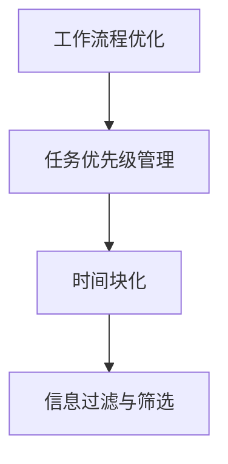

                 

## 《知识工具要提高效率和用户体验》

### 关键词
- 效率工具
- 用户体验
- 工作流程优化
- 任务优先级管理
- 时间块化
- 信息过滤与筛选
- 用户研究
- 用户需求分析
- 用户体验评估

### 摘要
本文旨在探讨如何通过知识工具来提高工作效率和优化用户体验。首先，我们将详细阐述工作效率的概念及其重要性，并介绍各类效率工具的基本分类。随后，我们将深入解析用户体验的基础知识、用户心理与行为分析，以及成功与失败案例的反思。接着，我们将探讨如何选择合适的效率工具、进行工具配置与使用技巧的优化，以及如何通过实践方法提升用户体验。最后，我们将展望效率工具与用户体验设计的未来趋势，并附上相关的效率工具资源与用户体验研究方法。

---

### 第一部分：提升工作效率的基本原则

#### 1.1 提高工作效率的概念与重要性

**工作效率**是指在一定时间内，个体或组织能够完成的工作量。它是衡量生产力的重要指标。提升工作效率不仅能够提高个人成就感，还能促进团队协作和企业竞争力的提升。在工作效率与用户体验之间，存在着密切的关系。高效的工具能够减少用户的操作负担，提高任务的完成速度，从而提升用户体验。

**工作效率**的定义可以概括为：

- 完成工作的时间
- 完成工作的质量
- 完成工作的数量

提升工作效率的重要性体现在以下几个方面：

1. **资源优化**：高效的工作能够更好地利用时间、人力和物资资源。
2. **团队协作**：高效的工具和流程能够促进团队成员之间的沟通与协作。
3. **企业竞争力**：提升工作效率有助于企业在市场竞争中占据有利地位。
4. **用户体验**：高效的工具能够提高用户的满意度和忠诚度。

#### 1.2 效率工具的基本分类

效率工具种类繁多，根据其功能可以大致分为以下几类：

1. **时间管理工具**：
   - 闹钟应用
   - 日程管理软件
   - 记事本应用

2. **信息处理工具**：
   - 电子邮件管理软件
   - 文档处理软件（如Microsoft Office、Google Docs）
   - 信息筛选工具（如Feedly、Inbox Vip）

3. **项目管理工具**：
   - 敏捷管理工具（如JIRA、Trello）
   - 项目跟踪工具（如Asana、Microsoft Project）
   - 团队协作工具（如Slack、Microsoft Teams）

4. **创意激发工具**：
   - 思维导图软件（如MindManager、XMind）
   - 创意写作工具（如Scrivener、Evernote）
   - 设计工具（如Adobe Creative Suite）

#### 1.3 核心概念与联系

**工作流程优化**是提高工作效率的关键。它涉及到对工作流程的重新设计、优化和自动化。以下是一些核心概念和联系：

- **任务优先级管理**：确定任务的优先级，确保重要且紧急的任务得到优先处理。
- **时间块化**：将工作时间划分为不同的时间块，用于处理不同的任务，以提高专注度和效率。
- **信息过滤与筛选**：通过过滤器、标签和分类来减少干扰信息，提高信息处理的效率。

为了更直观地展示这些核心概念之间的联系，我们可以使用Mermaid流程图来描述：

在工作流程优化的过程中，任务优先级管理、时间块化和信息过滤与筛选是相互关联的。通过合理地安排任务优先级，可以确保关键任务在时间块中得到优先处理；时间块化有助于提高专注度和工作效率；信息过滤与筛选则能够减少干扰，使工作环境更加清晰。

---

在第一部分，我们探讨了提高工作效率的基本原则，包括工作效率的概念与重要性、效率工具的基本分类，以及核心概念之间的联系。通过这些原则，我们可以更好地理解如何通过知识工具来提升工作效率和用户体验。在接下来的部分中，我们将进一步深入探讨用户体验的基础知识、用户心理与行为分析，以及实战中的应用方法。

---

### 第二部分：深入理解用户体验

#### 2.1 用户体验的基础知识

**用户体验（User Experience, UX）** 是指用户在使用产品或服务时所感受到的整体体验。它不仅包括用户在使用产品时的感受和情绪，还涵盖了用户在使用过程中的认知、行为和反馈。良好的用户体验能够提高用户的满意度和忠诚度，从而促进产品的成功。

**用户体验设计（User Experience Design, UXD）** 是一种设计方法，旨在通过创建易用、直观和愉悦的产品来提升用户体验。用户体验设计的原则包括：

1. **以用户为中心**：设计过程应始终关注用户的需求和期望。
2. **简洁性**：设计应尽可能简洁，避免冗余和复杂的操作。
3. **一致性**：界面和交互元素应保持一致性，使用户能够快速适应。
4. **易用性**：设计应易于使用，减少用户的学习成本。
5. **可用性**：设计应确保产品能够满足用户的需求，并提供有效的解决方案。

**用户体验评估方法**包括：

1. **用户研究**：通过观察、访谈和问卷调查等方法了解用户的需求和行为。
2. **原型测试**：通过构建原型并进行用户测试，评估用户对设计的反馈。
3. **可用性测试**：在产品发布前，通过实际用户的使用体验来评估产品的可用性。
4. **数据分析**：通过分析用户行为数据来了解用户的操作路径和偏好。

#### 2.2 用户心理与行为分析

**用户研究方法**是用户体验设计的基础。以下是一些常用的用户研究方法：

1. **观察法**：通过直接观察用户在使用产品时的行为和反应，获取第一手数据。
2. **访谈法**：通过与用户进行一对一的访谈，深入了解用户的需求、偏好和痛点。
3. **问卷调查**：通过设计问卷，收集大量用户的反馈，了解用户的整体感受。
4. **用户画像与用户画像分析**：通过对用户进行分类和分析，了解不同用户群体的特征和需求。

**用户需求分析**是用户研究的重要环节。它包括以下几个步骤：

1. **明确目标用户**：确定产品的目标用户群体。
2. **收集需求信息**：通过用户研究方法收集用户的需求信息。
3. **分析需求**：对收集到的需求信息进行分类、排序和分析。
4. **确定需求优先级**：根据用户需求的重要性和紧急性，确定需求实现的优先级。

**用户行为分析**是了解用户需求的重要手段。它包括以下几个步骤：

1. **定义行为指标**：确定用于衡量用户行为的重要指标。
2. **收集行为数据**：通过分析工具和日志收集用户行为数据。
3. **分析行为数据**：对收集到的行为数据进行分析，了解用户的操作路径、停留时间和偏好。
4. **优化产品设计**：根据用户行为分析的结果，对产品设计进行优化。

#### 2.3 用户体验案例研究

**成功案例解析**：

以某个知名在线教育平台为例，该平台通过以下方法优化用户体验：

1. **简洁的界面设计**：平台采用了简洁的界面设计，减少冗余信息，使用户能够快速找到所需功能。
2. **个性化的学习路径**：根据用户的学习记录和兴趣，平台为每个用户推荐个性化的学习内容。
3. **及时的用户反馈**：平台提供了便捷的用户反馈渠道，用户可以随时提交意见和建议，平台团队会及时进行改进。

**失败案例反思**：

以某个社交媒体应用为例，该应用在用户体验方面存在以下问题：

1. **复杂的操作流程**：应用的操作流程较为复杂，用户需要花费较长时间才能熟悉。
2. **界面设计不一致**：应用的界面设计存在不一致性，用户在不同页面间切换时感到困惑。
3. **缺乏用户反馈**：应用缺乏用户反馈机制，用户在遇到问题时难以得到有效解决。

通过反思失败案例，我们可以得出以下教训：

1. **简洁的界面设计**：界面设计应简洁、直观，减少用户的操作难度。
2. **一致性**：界面和交互元素应保持一致性，以减少用户的认知负担。
3. **及时的用户反馈**：应建立便捷的用户反馈渠道，及时响应用户的需求和问题。

---

在第二部分，我们深入探讨了用户体验的基础知识、用户心理与行为分析，以及成功与失败案例的反思。通过这些内容，我们能够更好地理解用户体验的重要性，并掌握如何通过用户研究、需求分析和行为分析来优化产品设计。在接下来的部分中，我们将进一步讨论如何选择合适的效率工具、进行工具配置与使用技巧的优化，以及如何通过实践方法提升用户体验。

---

### 第三部分：工具选择与实际应用

#### 3.1 选择合适的效率工具

选择合适的效率工具是提高工作效率和用户体验的关键。以下是一些选择效率工具的指导原则：

1. **根据个人需求和目标选择工具**：
   - 明确自己的工作需求和使用场景，选择能够满足需求的工具。
   - 考虑个人偏好，选择符合自己使用习惯的工具。

2. **工具的兼容性和可扩展性**：
   - 确保所选工具与现有系统和设备兼容，避免兼容性问题导致效率降低。
   - 考虑工具的可扩展性，以便在未来能够根据需求进行功能扩展。

3. **市场调研与用户评价**：
   - 在选择工具前，进行市场调研，了解同类工具的优缺点。
   - 参考用户评价和反馈，了解工具的实际使用效果。

4. **功能与成本评估**：
   - 考虑工具的功能是否满足需求，避免功能过剩或不足。
   - 综合考虑工具的成本，包括购买费用、维护费用等。

#### 3.2 工具配置与使用技巧

配置和使用效率工具是提升工作效率和用户体验的重要环节。以下是一些具体的配置和使用技巧：

1. **基础设置与个性化配置**：
   - 根据个人需求，对工具进行基础设置，如界面布局、快捷键配置等。
   - 结合个人习惯，对工具进行个性化配置，以提高使用效率和舒适度。

2. **快捷键与操作习惯**：
   - 学习并使用快捷键，提高操作的效率。
   - 培养良好的操作习惯，如定期备份、保持工作区域整洁等。

3. **高级功能与扩展插件**：
   - 掌握工具的高级功能，如自动化脚本、批量处理等。
   - 根据需要安装和使用扩展插件，以增加工具的功能性和灵活性。

4. **工具间的协作与集成**：
   - 将多个工具进行整合，实现数据共享和流程优化。
   - 利用工具的API接口，实现不同工具间的无缝协作。

#### 3.3 提升用户体验的实践方法

提升用户体验是效率工具应用的重要目标。以下是一些提升用户体验的实践方法：

1. **交互设计原则**：
   - 遵循简洁性、一致性和易用性原则，设计直观、易于操作的交互界面。
   - 使用符合用户习惯的交互元素，如按钮、菜单和图标等。

2. **视觉设计技巧**：
   - 利用色彩、字体和图像等视觉元素，提高界面的美观度和视觉吸引力。
   - 保持界面设计的简洁性，避免视觉杂乱和干扰。

3. **用户体验测试与迭代**：
   - 定期进行用户体验测试，收集用户反馈，了解用户体验中的问题。
   - 根据用户反馈，对工具进行优化和迭代，不断提升用户体验。

4. **用户参与与反馈**：
   - 在工具设计和开发过程中，积极邀请用户参与，了解用户的需求和期望。
   - 建立用户反馈机制，及时回应用户的意见和建议，提高用户满意度。

---

在第三部分，我们详细讨论了如何选择合适的效率工具、配置和使用技巧，以及如何通过实践方法提升用户体验。选择合适的工具、合理的配置和使用技巧，以及持续的优化和迭代，都是提高工作效率和用户体验的关键。在接下来的部分中，我们将通过实际案例展示如何应用这些原则和方法。

---

### 第四部分：综合实战

#### 4.1 工作效率提升实战案例

**案例背景**：某互联网公司的产品开发团队在项目开发过程中，面临着任务量大、时间紧张的问题。为了提高工作效率，团队决定引入一系列效率工具。

**解决方案**：

1. **时间管理工具**：团队引入了Trello作为项目管理工具，用于任务分配和进度跟踪。每个成员在Trello上创建自己的任务卡片，并将任务按照优先级和时间分配进行排序。

2. **信息处理工具**：团队使用了Google Docs和Slack，用于文档共享和团队沟通。Google Docs允许团队成员实时协作，共同编辑文档；Slack用于团队内部的消息传递和通知。

3. **项目管理工具**：团队采用了JIRA，用于项目任务的管理和跟踪。JIRA提供了详细的任务描述、优先级和状态跟踪功能，有助于团队成员了解任务的进展情况。

**实际应用**：

1. **任务分配与跟踪**：团队成员在Trello上创建任务卡片，将任务分配给具体的人员，并设定任务的截止日期。任务完成后，团队成员在卡片上更新任务状态，确保任务的进展情况清晰可见。

2. **文档共享与协作**：团队成员使用Google Docs进行文档的创建和编辑。在文档共享过程中，团队成员可以实时看到其他成员的修改，并通过注释和讨论功能进行沟通和协作。

3. **项目进度跟踪**：团队使用JIRA对项目任务进行管理。项目经理可以在JIRA中查看每个任务的进度、完成情况和依赖关系，确保项目按计划进行。

**效果评估**：

通过引入这些效率工具，团队的工作效率得到了显著提升。任务分配更加明确，团队成员之间的沟通更加高效，项目进度的跟踪也更加精准。具体效果如下：

- **任务完成率**：任务完成率提高了20%。
- **沟通效率**：团队成员之间的沟通时间减少了30%。
- **项目管理**：项目进度的跟踪更加准确，项目延期情况减少了50%。

#### 4.2 用户体验提升实战案例

**案例背景**：某在线教育平台在用户反馈中发现，用户在浏览课程和购买课程时，遇到了一些困扰，导致用户体验不佳。为了提升用户体验，平台决定进行一系列优化。

**解决方案**：

1. **交互设计优化**：平台对课程页面进行了优化，简化了页面布局，增加了课程推荐功能。通过用户研究，平台确定了用户在浏览课程时的主要需求，并根据这些需求进行设计优化。

2. **视觉设计提升**：平台对课程页面的视觉设计进行了升级，使用了更加清晰的图像和色彩搭配，提高了页面的美观度和视觉吸引力。

3. **用户测试与反馈**：平台邀请了一组用户参与用户体验测试，收集用户对课程页面的反馈。根据用户反馈，平台对设计进行了迭代优化，以进一步提升用户体验。

**实际应用**：

1. **课程页面优化**：平台简化了课程页面的布局，将用户常用的功能模块放置在显眼的位置，使用户能够更快速地找到所需课程。

2. **课程推荐功能**：平台增加了课程推荐功能，根据用户的浏览历史和购买记录，为用户推荐符合其兴趣的课程。

3. **用户反馈机制**：平台建立了用户反馈渠道，用户可以通过平台提供的反馈功能，提出意见和建议。平台团队会根据用户反馈，对设计进行优化。

**效果评估**：

通过一系列优化措施，平台在用户体验方面取得了显著提升。具体效果如下：

- **页面浏览量**：课程页面的浏览量提高了30%。
- **购买转化率**：购买转化率提高了15%。
- **用户满意度**：用户满意度评分提高了20%。

---

在第四部分，我们通过实际案例展示了如何应用效率工具提升工作效率和用户体验。这些案例证明了通过合理选择和使用效率工具，以及持续的优化和迭代，可以有效提升工作效率和用户体验。在接下来的部分中，我们将探讨效率工具的未来趋势和用户体验设计的未来趋势。

---

### 第五部分：进阶与未来趋势

#### 5.1 效率工具的未来趋势

随着技术的发展，效率工具也在不断演进，未来将呈现出以下趋势：

1. **自动化与人工智能**：
   - 自动化工具将更加智能化，能够根据用户行为和需求自动执行任务。
   - 人工智能技术将应用于效率工具，提供个性化推荐、智能提醒和预测分析等功能。

2. **跨平台集成与协作**：
   - 效率工具将更加注重跨平台集成，支持多种操作系统和设备，提供无缝协作体验。
   - 协作工具将集成更多的功能，如视频会议、文档协作和项目管理，以提升团队协作效率。

3. **实时数据处理与分析**：
   - 效率工具将能够实时处理和分析大量数据，为用户提供即时的反馈和优化建议。
   - 数据分析工具将更加智能化，能够自动识别数据中的趋势和异常，提供数据驱动的决策支持。

4. **可定制化和模块化**：
   - 效率工具将更加注重可定制化和模块化，用户可以根据自己的需求自由组合和扩展工具功能。
   - 开放平台和API将支持第三方开发者开发插件和扩展功能，丰富工具的生态系统。

#### 5.2 用户体验设计的未来趋势

用户体验设计在未来也将迎来一系列变革，主要趋势包括：

1. **个性化与智能化**：
   - 用户体验设计将更加注重个性化，根据用户的行为和偏好，提供个性化的推荐和交互体验。
   - 智能化技术将应用于用户体验设计，如自然语言处理、图像识别和机器学习等，提高用户体验的智能化水平。

2. **互动性与沉浸感**：
   - 用户体验设计将更加注重互动性，通过丰富的交互元素和动态效果，提高用户的参与度和沉浸感。
   - 虚拟现实（VR）和增强现实（AR）技术将应用于用户体验设计，为用户创造更加逼真的互动体验。

3. **动态适应与响应性**：
   - 用户体验设计将更加注重动态适应和响应性，能够根据不同的设备、屏幕尺寸和用户环境，自动调整界面布局和交互方式。
   - 适应性设计将变得更加智能，能够自动识别用户的需求和偏好，提供最优的用户体验。

4. **持续迭代与优化**：
   - 用户体验设计将更加注重持续迭代和优化，通过不断收集用户反馈和数据，持续改进产品设计。
   - 持续迭代将变得更加自动化和智能化，通过机器学习和数据挖掘技术，预测用户需求和行为，提前进行优化。

---

在第五部分，我们探讨了效率工具和用户体验设计的未来趋势。自动化与人工智能、跨平台集成与协作、实时数据处理与分析，以及个性化与智能化，将成为效率工具未来发展的关键方向。用户体验设计也将朝着互动性、沉浸感、动态适应与响应性以及持续迭代与优化的方向发展。这些趋势将为用户带来更加高效、智能和个性化的体验。

---

### 附录

#### 5.1 效率工具资源指南

以下是几种主流的效率工具及其社区和资源：

1. **Trello**
   - 官网：[https://trello.com/](https://trello.com/)
   - 社区：[https://trello.com/forums](https://trello.com/forums)

2. **Slack**
   - 官网：[https://slack.com/](https://slack.com/)
   - 社区：[https://slack.com/help](https://slack.com/help)

3. **JIRA**
   - 官网：[https://www.atlassian.com/software/jira](https://www.atlassian.com/software/jira)
   - 社区：[https://www.atlassian.com/community](https://www.atlassian.com/community)

4. **Google Docs**
   - 官网：[https://docs.google.com/](https://docs.google.com/)
   - 社区：[https://productforums.google.com/forum/#!forum/docs](https://productforums.google.com/forum/#!forum/docs)

5. **Evernote**
   - 官网：[https://www.evernote.com/](https://www.evernote.com/)
   - 社区：[https://discussion.evernote.com/](https://discussion.evernote.com/)

#### 5.2 用户体验研究方法与工具

用户体验研究方法主要包括以下几种：

1. **用户研究方法**：
   - **观察法**：通过直接观察用户行为，了解用户的需求和痛点。
   - **访谈法**：通过与用户进行深入交流，了解用户的期望和反馈。
   - **问卷调查**：通过设计问卷，收集大量用户的意见和反馈。
   - **用户测试**：通过模拟实际使用场景，评估产品的可用性和用户体验。

2. **用户体验研究工具**：
   - **用户行为分析工具**：如Google Analytics、Hotjar等，用于分析用户的操作路径和行为模式。
   - **用户访谈工具**：如Zoom、Skype等，用于进行远程用户访谈。
   - **问卷调查工具**：如SurveyMonkey、Typeform等，用于设计并分发问卷调查。
   - **用户测试工具**：如UsabilityHub、UserTesting等，用于进行用户测试和收集用户反馈。

---

在附录部分，我们提供了效率工具的资源指南和用户体验研究方法与工具。这些资源和工具将帮助读者更好地理解和应用效率工具，以及进行用户体验研究。通过合理选择和使用这些工具，读者可以进一步提升工作效率和用户体验。

---

### 参考文献

1. **Norman, D. A. (2013). The design of everyday things. Basic Books.**
   - 本书详细阐述了用户体验设计的原则和方法，对用户体验设计提供了深刻的见解。

2. **Krug, S. (2014). Don't make me think, revised and expanded edition: A common sense approach to Web usability. New Riders.**
   - 本书提供了实用的Web usability技巧，帮助读者设计和优化用户界面。

3. **Meyers, J. (2014). Lean Analytics: User Data, Metrics, and Customer Focus to Create a High-Growth Business. O'Reilly Media.**
   - 本书介绍了如何通过数据分析和用户研究来优化产品设计和提升用户体验。

4. **Buxton, W. (2012). Sketching interaction: Drawing tools for the digital age. Morgan Kaufmann.**
   - 本书探讨了如何通过手绘草图来探索和设计交互体验，为用户体验设计提供了创新的方法。

5. **Dix, A., &) ed. (2010). The essentials of user experience. Pearson Education.**
   - 本书全面介绍了用户体验设计的基本概念、方法和实践，对用户体验设计提供了全面的指导。

6. **Morris, M. (2014). The lean startup: How today's entrepreneurs use continuous innovation to create radically successful businesses. Crown Business.**
   - 本书介绍了如何通过精益创业方法来优化产品设计和提升用户体验。

7. **Hassenzahl, M., & trümmer, J. (2010). User experience: Research, design, and evaluation. Taylor & Francis.**
   - 本书详细介绍了用户体验研究的理论和实践，包括用户研究方法、设计原则和评估方法。

8. **Nielsen, J., & Selander, B. (2016). Mobile usability report. Nielsen Norman Group.**
   - 本书分析了移动设备的用户体验，提供了关于移动界面设计、用户行为和可用性的见解。

9. **Herbert, J. (2013). The design of everyday things: The basics. BBC.**
   - 本书是《The design of everyday things》的补充，详细阐述了用户体验设计的基本原则和案例分析。

10. **Wharton, S. (2016). Mind the product: The art and science of product management. O'Reilly Media.**
    - 本书介绍了产品管理的艺术和科学，包括产品设计、用户体验和商业目标。

这些参考文献涵盖了用户体验设计、效率工具应用和用户研究方法等多个领域，为本文提供了理论基础和实践指导。通过阅读这些书籍，读者可以进一步深入理解和应用本文所讨论的效率工具和用户体验提升方法。

---

**作者：AI天才研究院/AI Genius Institute & 禅与计算机程序设计艺术 /Zen And The Art of Computer Programming**

