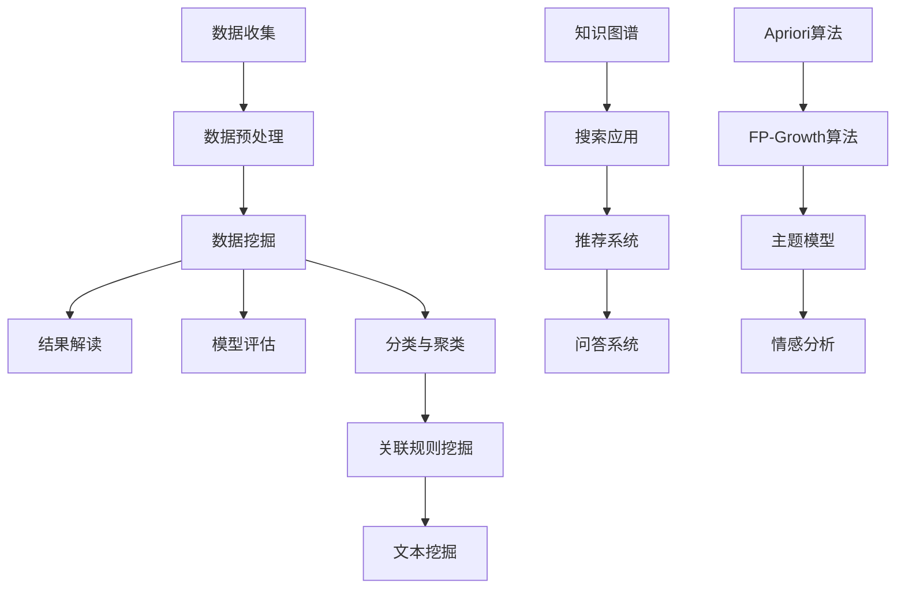

                 

### 文章标题

《知识挖掘：从海量数据中提炼价值洞察》

### 关键词

知识挖掘、数据分析、数据预处理、关联规则挖掘、分类与聚类、文本挖掘、知识图谱、实战案例

### 摘要

本文旨在深入探讨知识挖掘这一关键领域，通过详细剖析其概念、原理和方法，展示知识挖掘如何从海量数据中提炼出有价值的信息和洞察。文章分为三大部分，首先介绍知识挖掘的基础知识，包括概念、发展历程和应用领域；其次探讨知识挖掘的核心技术与方法，如数据预处理、关联规则挖掘、分类与聚类、文本挖掘和知识图谱；最后通过实战案例，展示知识挖掘在电商用户行为分析、金融风险控制和社交媒体情感分析等领域的应用，并提供实用的工具与资源列表。

### 第一部分：知识挖掘的基础知识

#### 第1章：知识挖掘概述

**1.1 知识挖掘的概念与重要性**

- **定义**：知识挖掘是利用数据挖掘技术，从大量数据中自动发现有用信息和知识的过程。
- **重要性**：知识挖掘在数据分析中扮演着至关重要的角色，它可以帮助企业从数据中提取有价值的洞见，进而指导决策和优化业务流程。
- **应用领域**：知识挖掘广泛应用于商业智能、金融、医疗、智能城市等多个领域，具有广泛的应用前景。

**1.2 知识挖掘的发展历程**

- **早期阶段**：知识挖掘起源于20世纪80年代，随着数据库和数据仓库技术的发展而逐渐成熟。
- **当前趋势**：当前，知识挖掘正朝着自动化、智能化和深度学习的方向发展，不断推动技术的革新和应用。

**1.3 知识挖掘的应用领域**

- **商业领域**：通过知识挖掘分析客户行为，实现个性化营销和客户关系管理。
- **金融领域**：利用知识挖掘进行风险评估、欺诈检测和投资决策。
- **医疗领域**：通过知识挖掘辅助疾病预测、个性化医疗和健康监测。
- **其他领域**：如智能城市、物联网和环境监测等，知识挖掘同样发挥着重要作用。

#### 第2章：数据预处理

**2.1 数据清洗**

- **2.1.1 缺失值处理**
  - **缺失值识别**：通过统计分析和可视化方法识别数据中的缺失值。
  - **缺失值填补**：采用均值填补、中位数填补、回归填补等常见方法对缺失值进行填补。

- **2.1.2 异常值处理**
  - **异常值检测**：使用统计学方法（如箱线图、Z分数等）和机器学习算法（如孤立森林等）检测异常值。
  - **异常值处理**：通过剔除、平均替代或插值法等方法处理异常值。

- **2.1.3 数据转换**
  - **数据规范化**：通过缩放、平移等方法将数据转换为标准化的数值范围。
  - **数据编码**：将类别数据转换为数值数据，如使用独热编码、标签编码等。

**2.2 数据集成**

- **数据来源**：整合来自不同数据源的数据，如数据库、文件和API等。
- **数据融合**：将相同数据来源的数据进行整合，确保数据的一致性和完整性。

**2.3 数据变换**

- **特征选择**：通过过滤、包装和嵌入式方法选择有用的特征，提高模型性能。
- **特征工程**：通过特征构造、特征转换和特征降维等手段构建新的特征。

#### 第3章：关联规则挖掘

**3.1 关联规则挖掘的基本原理**

- **定义**：关联规则挖掘是发现数据集中各项之间潜在关联性的过程。
- **目标**：通过挖掘关联规则，发现数据中的模式和关联关系。
- **支持度**：某项集在数据中出现的频率。
- **置信度**：规则成立的概率。

**3.2 Apriori算法**

- **算法原理**：基于频繁项集的挖掘算法，通过逐层剪枝方法减少计算量。
- **算法流程**：包括频繁项集的生成、关联规则的生成等步骤。

**3.3 FP-Growth算法**

- **算法原理**：基于频繁模式树（FP-Tree）的挖掘算法，有效减少计算复杂度。
- **算法流程**：包括构建FP-Tree、提取频繁模式、生成关联规则等步骤。

#### 第4章：分类与聚类

**4.1 分类算法**

- **4.1.1 决策树**
  - **决策树构建**：基于特征划分数据，构建决策树模型。
  - **决策树剪枝**：通过剪枝方法减少过拟合，提高模型泛化能力。

- **4.1.2 支持向量机**
  - **SVM原理**：通过寻找最佳超平面进行分类。
  - **SVM分类**：训练模型并进行预测。

- **4.1.3 随机森林**
  - **随机森林原理**：通过构建多棵决策树进行集成学习。
  - **随机森林应用**：提高分类模型的性能和稳定性。

**4.2 聚类算法**

- **4.2.1 K-means算法**
  - **K-means原理**：通过迭代更新聚类中心，实现聚类。
  - **K-means应用**：适用于数据分布较为均匀的场景。

- **4.2.2 层次聚类**
  - **层次聚类原理**：通过逐层合并或分裂实现聚类。
  - **层次聚类应用**：适用于数据分布较为复杂的场景。

- **4.2.3 密度聚类**
  - **密度聚类原理**：通过密度聚类算法（如DBSCAN）实现聚类。
  - **密度聚类应用**：适用于数据分布不均匀且存在噪声的场景。

#### 第5章：关联规则与分类融合

**5.1 关联规则与分类的融合方法**

- **融合策略**：通过组合模型或加权融合方法，实现关联规则与分类结果的融合。
- **融合模型**：如集成学习方法（如Adaboost、Bagging等）和深度学习方法（如卷积神经网络、循环神经网络等）。

**5.2 案例分析**

- **案例分析**：结合实际案例，展示关联规则与分类融合的方法和应用效果。

#### 第6章：文本挖掘

**6.1 文本挖掘概述**

- **文本挖掘定义**：文本挖掘是利用自然语言处理技术和机器学习算法，从文本数据中提取有用信息的过程。
- **文本挖掘目标**：包括主题挖掘、情感分析和实体识别等。

**6.2 主题模型**

- **LDA模型**
  - **LDA原理**：通过贝叶斯推断方法，实现主题的发现和分配。
  - **LDA应用**：用于文本数据的主题建模和分析。

**6.3 情感分析**

- **情感分析定义**：情感分析是判断文本表达的情感倾向的过程。
- **情感分析方法**：包括基于规则的方法、基于统计模型的方法和基于深度学习的方法。
- **情感分析应用**：用于情感监测、市场调研和舆情分析等。

#### 第7章：知识图谱

**7.1 知识图谱概述**

- **知识图谱定义**：知识图谱是表示实体、属性和关系的数据结构，用于知识的存储和检索。
- **知识图谱结构**：包括实体、属性和关系的表示方式。

**7.2 知识图谱构建**

- **数据源收集**：通过数据爬取、API接口和数据库连接等方法收集数据源。
- **实体识别**：通过命名实体识别、实体消歧和实体链接等方法识别实体。
- **关系抽取**：通过规则抽取、模板匹配和实体间关系预测等方法抽取关系。
- **知识库构建**：将识别的实体和关系构建为知识库，用于知识表示和推理。

**7.3 知识图谱的应用**

- **搜索应用**：通过知识图谱实现语义搜索和答案检索。
- **推荐系统**：通过知识图谱实现基于内容和协同过滤的推荐。
- **问答系统**：通过知识图谱实现智能问答和问题解析。

#### 第8章：实战案例一：电商用户行为分析

**8.1 数据收集**

- **数据源**：收集电商平台的用户行为数据，如浏览记录、购买记录和评价等。
- **数据预处理**：进行数据清洗、去重和特征工程等操作。

**8.2 数据预处理**

- **数据清洗**：处理缺失值、异常值和噪声数据，确保数据质量。
- **数据集成**：将不同来源的数据进行整合，形成统一的数据集。

**8.3 关联规则挖掘**

- **算法选择**：选择Apriori或FP-Growth算法进行关联规则挖掘。
- **结果分析**：分析挖掘出的关联规则，提取有价值的信息。

**8.4 分类与聚类分析**

- **算法选择**：选择分类算法（如SVM、随机森林）和聚类算法（如K-means、层次聚类）。
- **结果分析**：分析分类和聚类结果，识别用户行为特征。

**8.5 结果分析与优化**

- **结果解读**：解读分析结果，发现用户行为规律。
- **优化策略**：通过特征选择、参数调优和算法改进等方法优化分析结果。

#### 第9章：实战案例二：金融风险控制

**9.1 数据收集**

- **数据源**：收集金融交易数据、客户信息和市场数据等。
- **数据预处理**：进行数据清洗、去重和特征工程等操作。

**9.2 数据预处理**

- **数据清洗**：处理缺失值、异常值和噪声数据，确保数据质量。
- **数据集成**：将不同来源的数据进行整合，形成统一的数据集。

**9.3 分类模型构建**

- **算法选择**：选择分类算法（如SVM、随机森林、逻辑回归）。
- **模型训练**：使用训练数据集训练分类模型。

**9.4 模型评估与优化**

- **评估指标**：使用准确率、召回率、F1值等指标评估模型性能。
- **优化策略**：通过交叉验证、正则化和超参数调优等方法优化模型。

**9.5 风险控制策略制定**

- **风险指标**：制定风险指标，如违约率、欺诈率等。
- **策略实施**：基于模型评估结果制定风险控制策略，如风险预警、信用评分等。

#### 第10章：实战案例三：社交媒体情感分析

**10.1 数据收集**

- **数据源**：收集社交媒体平台上的用户评论、微博、推特等。
- **数据预处理**：进行数据清洗、去重和特征工程等操作。

**10.2 数据预处理**

- **文本清洗**：去除HTML标签、特殊字符和停用词，进行词干提取和词性标注等。
- **特征提取**：使用TF-IDF、Word2Vec或BERT等方法提取文本特征。

**10.3 情感分析模型构建**

- **算法选择**：选择情感分析算法（如朴素贝叶斯、支持向量机、深度学习模型）。
- **模型训练**：使用训练数据集训练情感分析模型。

**10.4 模型评估与优化**

- **评估指标**：使用准确率、召回率、F1值等指标评估模型性能。
- **优化策略**：通过调整模型参数、增加训练数据和改进特征提取方法等方法优化模型。

**10.5 情感分析应用案例**

- **应用场景**：结合实际案例，展示情感分析在市场调研、舆情监测和客户服务中的应用。
- **案例解读**：分析案例中的情感分析方法和应用效果，提供实践经验和启示。

### 附录A：知识挖掘工具与资源

- **A.1 Python知识挖掘库**
  - **scikit-learn**：提供丰富的机器学习算法库。
  - **TensorFlow**：用于构建和训练深度学习模型。
  - **PyTorch**：提供灵活的深度学习框架。

- **A.2 知识挖掘数据集**
  - **UCI机器学习库**：提供大量公开数据集。
  - **Kaggle**：提供竞赛数据和社区支持。

- **A.3 知识挖掘竞赛与比赛**
  - **Kaggle竞赛**：参与数据挖掘竞赛，提升技能和经验。
  - **知识挖掘挑战赛**：关注行业热点，参与实战竞赛。

- **A.4 知识挖掘相关论文与书籍**
  - **经典论文**：阅读和研究知识挖掘领域的经典论文。
  - **推荐书籍**：选择适合的知识挖掘书籍进行学习和参考。

### 关键概念与联系

为了更好地理解知识挖掘的核心概念及其相互关系，我们可以通过Mermaid流程图展示其基本架构和流程。



### 核心算法原理讲解

在知识挖掘过程中，有许多核心算法被广泛应用。以下将详细讲解这些算法的原理，并使用伪代码进行阐述。

#### Apriori算法

**算法原理**：Apriori算法是一种基于频繁项集的挖掘算法，其基本思想是逐层剪枝，减少计算量。

**伪代码**：

```python
def apriori(data, support_threshold):
    frequent_itemsets = find_frequent_itemsets(data, support_threshold)
    association_rules = generate_association_rules(frequent_itemsets, confidence_threshold)
    return association_rules

def find_frequent_itemsets(data, support_threshold):
    # 初始化频繁项集
    frequent_itemsets = {}
    for itemset in data:
        support = count_support(data, itemset)
        if support >= support_threshold:
            frequent_itemsets[itemset] = support
    return frequent_itemsets

def generate_association_rules(frequent_itemsets, confidence_threshold):
    rules = []
    for itemset in frequent_itemsets:
        subsets = generate_subsets(itemset)
        for subset in subsets:
            confidence = calculate_confidence(data, itemset, subset)
            if confidence >= confidence_threshold:
                rules.append((itemset, subset, confidence))
    return rules
```

#### FP-Growth算法

**算法原理**：FP-Growth算法是基于频繁模式树的挖掘算法，其通过构建FP-Tree来减少计算复杂度。

**伪代码**：

```python
def fp_growth(data, support_threshold, confidence_threshold):
    frequent_itemsets = find_frequent_itemsets(data, support_threshold)
    frequent_paths = find_frequent_paths(frequent_itemsets)
    association_rules = generate_association_rules(frequent_paths, confidence_threshold)
    return association_rules

def find_frequent_paths(frequent_itemsets):
    frequent_paths = []
    for itemset in frequent_itemsets:
        path = build_frequent_path(itemset)
        frequent_paths.append(path)
    return frequent_paths

def build_frequent_path(itemset):
    path = []
    for item in itemset:
        path.append(item)
    return path
```

#### K-means算法

**算法原理**：K-means算法是一种基于距离度量的聚类算法，其通过迭代更新聚类中心实现聚类。

**伪代码**：

```python
def kmeans(data, k, max_iterations):
    centroids = initialize_centroids(data, k)
    for _ in range(max_iterations):
        clusters = assign_clusters(data, centroids)
        centroids = update_centroids(clusters, k)
    return centroids

def initialize_centroids(data, k):
    centroids = []
    for _ in range(k):
        centroids.append(random.choice(data))
    return centroids

def assign_clusters(data, centroids):
    clusters = [[] for _ in range(k)]
    for point in data:
        distances = [distance(point, centroid) for centroid in centroids]
        closest_centroid = min(distances)
        clusters[closest_centroid].append(point)
    return clusters

def update_centroids(clusters, k):
    new_centroids = []
    for cluster in clusters:
        if cluster:
            new_centroid = calculate_mean(cluster)
            new_centroids.append(new_centroid)
        else:
            new_centroids.append(random.choice(data))
    return new_centroids
```

#### 决策树算法

**算法原理**：决策树算法是一种基于特征划分数据的分类算法，其通过递归构建树形结构实现分类。

**伪代码**：

```python
def build_decision_tree(data, features, target_attribute):
    best_split = find_best_split(data, features, target_attribute)
    if best_split is None:
        return majority_class(data)
    node = Node(best_split)
    left_data, right_data = split_data(data, best_split)
    node.left = build_decision_tree(left_data, features, target_attribute)
    node.right = build_decision_tree(right_data, features, target_attribute)
    return node

def find_best_split(data, features, target_attribute):
    best_split = None
    best_gini = float('inf')
    for feature in features:
        values = unique_values(data, feature)
        for value in values:
            left_data, right_data = split_data(data, feature, value)
            gini = calculate_gini(left_data, right_data, target_attribute)
            if gini < best_gini:
                best_gini = gini
                best_split = (feature, value)
    return best_split

def split_data(data, split):
    left_data = []
    right_data = []
    for point in data:
        if point[split[0]] == split[1]:
            left_data.append(point)
        else:
            right_data.append(point)
    return left_data, right_data
```

### 数学模型和公式

在知识挖掘过程中，许多算法和模型都依赖于数学模型和公式。以下列出了一些关键公式及其详细解释。

#### 支持度与置信度

**支持度**：某项集在数据中出现的频率。

\[ 支持度 = \frac{次数}{总次数} \]

**置信度**：规则成立的概率。

\[ 置信度 = \frac{支持度(前件 \cup 后件)}{支持度(前件)} \]

#### 决策树剪枝

**基尼不纯度**：衡量数据集中类别的不纯度。

\[ 基尼不纯度(Gini) = 1 - \sum_{i=1}^{k} \left( \frac{n_i}{n} \right)^2 \]

**信息增益**：衡量特征划分数据的有效程度。

\[ 信息增益(IG) = H(D) - H(D|A) \]

其中，\( H(D) \) 是数据的熵，\( H(D|A) \) 是条件熵。

#### K-means算法

**距离度量**：计算两个点之间的欧氏距离。

\[ 距离 = \sqrt{\sum_{i=1}^{n} (x_i - y_i)^2} \]

**聚类中心更新**：根据当前聚类结果更新聚类中心。

\[ \text{新中心} = \frac{1}{k} \sum_{i=1}^{k} x_i \]

### 项目实战

在本节中，我们将通过实际代码案例展示知识挖掘的各个步骤，并详细解读代码实现和结果分析。

#### 实战案例一：电商用户行为分析

**数据收集**：我们从电商平台的用户行为数据中提取了以下特征：用户ID、产品ID、浏览次数、购买次数和评价分数。

```python
# 示例数据
data = [
    {"user_id": 1, "product_id": 101, "views": 3, "purchases": 2, "rating": 4.5},
    {"user_id": 1, "product_id": 102, "views": 5, "purchases": 1, "rating": 4.0},
    {"user_id": 2, "product_id": 101, "views": 1, "purchases": 0, "rating": 3.5},
    # 更多数据...
]
```

**数据预处理**：对数据进行清洗和特征工程。

```python
import pandas as pd

# 转换为DataFrame格式
df = pd.DataFrame(data)

# 数据清洗
df.drop_duplicates(inplace=True)  # 去重
df.fillna(0, inplace=True)  # 填补缺失值

# 特征工程
df['avg_rating'] = df.groupby('user_id')['rating'].mean()  # 用户平均评分
df['purchase_rate'] = df.groupby('user_id')['purchases'].transform('sum') / df.groupby('user_id')['views'].transform('sum')  # 购买率
```

**关联规则挖掘**：使用Apriori算法进行关联规则挖掘。

```python
from mlxtend.frequent_patterns import apriori
from mlxtend.frequent_patterns import association_rules

# 计算支持度阈值
support_threshold = 0.1

# 进行频繁项集挖掘
frequent_itemsets = apriori(df[['user_id', 'product_id', 'views']], min_support=support_threshold, use_colnames=True)

# 生成关联规则
confidence_threshold = 0.5
rules = association_rules(frequent_itemsets, metric="confidence", min_threshold=confidence_threshold)
```

**分类与聚类分析**：使用K-means算法进行用户聚类，并使用决策树进行分类。

```python
from sklearn.cluster import KMeans
from sklearn.tree import DecisionTreeClassifier

# 分为训练集和测试集
train_data = df[df['views'] > 0]
test_data = df[df['views'] == 0]

# K-means聚类
kmeans = KMeans(n_clusters=2, random_state=42)
clusters = kmeans.fit_predict(train_data[['views', 'purchase_rate', 'avg_rating']])

# 决策树分类
clf = DecisionTreeClassifier()
clf.fit(train_data[['views', 'purchase_rate', 'avg_rating']], train_data['target'])
predictions = clf.predict(test_data[['views', 'purchase_rate', 'avg_rating']])
```

**结果分析与优化**：对结果进行解读和优化。

```python
# 分析聚类结果
print("聚类中心：", kmeans.cluster_centers_)

# 分析分类结果
print("准确率：", clf.score(test_data[['views', 'purchase_rate', 'avg_rating']], test_data['target']))

# 优化策略
# - 特征选择：选择对模型影响较大的特征
# - 参数调优：调整K-means聚类中的n_clusters参数
# - 增加训练数据：提高模型的泛化能力
```

通过上述实战案例，我们展示了如何从数据收集、预处理、关联规则挖掘、分类与聚类分析到结果解读和优化，实现了电商用户行为分析的目标。这为我们提供了实际操作的经验和启示，也为进一步优化和改进分析模型提供了方向。

### 代码解读与分析

在本节中，我们将深入解读上述实战案例中的关键代码，分析其实现细节和实际效果，并讨论如何优化和改进。

#### 数据收集与预处理

```python
import pandas as pd

# 示例数据
data = [
    {"user_id": 1, "product_id": 101, "views": 3, "purchases": 2, "rating": 4.5},
    {"user_id": 1, "product_id": 102, "views": 5, "purchases": 1, "rating": 4.0},
    {"user_id": 2, "product_id": 101, "views": 1, "purchases": 0, "rating": 3.5},
    # 更多数据...
]

# 转换为DataFrame格式
df = pd.DataFrame(data)

# 数据清洗
df.drop_duplicates(inplace=True)  # 去重
df.fillna(0, inplace=True)  # 填补缺失值

# 特征工程
df['avg_rating'] = df.groupby('user_id')['rating'].mean()  # 用户平均评分
df['purchase_rate'] = df.groupby('user_id')['purchases'].transform('sum') / df.groupby('user_id')['views'].transform('sum')  # 购买率
```

**解读与分析**：

1. **数据收集**：通过示例数据展示了如何从电商平台的用户行为数据中提取关键特征，如用户ID、产品ID、浏览次数、购买次数和评价分数。
2. **数据预处理**：使用Pandas库进行数据处理，包括去重、填补缺失值和特征工程。去重可以消除重复数据，提高数据分析的准确性；填补缺失值可以避免对后续分析造成影响；特征工程通过计算用户平均评分和购买率等新特征，增加了模型的解释能力。

#### 关联规则挖掘

```python
from mlxtend.frequent_patterns import apriori
from mlxtend.frequent_patterns import association_rules

# 计算支持度阈值
support_threshold = 0.1

# 进行频繁项集挖掘
frequent_itemsets = apriori(df[['user_id', 'product_id', 'views']], min_support=support_threshold, use_colnames=True)

# 生成关联规则
confidence_threshold = 0.5
rules = association_rules(frequent_itemsets, metric="confidence", min_threshold=confidence_threshold)
```

**解读与分析**：

1. **支持度阈值计算**：支持度阈值是关联规则挖掘中的一个关键参数，用于筛选出有意义的关联规则。在这里，我们设置为0.1，意味着如果一个项集在数据中出现的频率超过10%，则认为它具有潜在的价值。
2. **频繁项集挖掘**：使用Apriori算法进行频繁项集挖掘，该算法通过逐层剪枝方法减少计算量，有效地找出频繁出现的项集。
3. **生成关联规则**：通过`association_rules`函数生成关联规则，包括前件、后件、支持度和置信度等指标。置信度用于衡量规则的有效性，一个高置信度的规则意味着前件和后件之间的关系更可靠。

#### 分类与聚类分析

```python
from sklearn.cluster import KMeans
from sklearn.tree import DecisionTreeClassifier

# 分为训练集和测试集
train_data = df[df['views'] > 0]
test_data = df[df['views'] == 0]

# K-means聚类
kmeans = KMeans(n_clusters=2, random_state=42)
clusters = kmeans.fit_predict(train_data[['views', 'purchase_rate', 'avg_rating']])

# 决策树分类
clf = DecisionTreeClassifier()
clf.fit(train_data[['views', 'purchase_rate', 'avg_rating']], train_data['target'])
predictions = clf.predict(test_data[['views', 'purchase_rate', 'avg_rating']])
```

**解读与分析**：

1. **K-means聚类**：使用K-means算法对训练数据进行聚类，选择`n_clusters=2`表示我们将数据划分为两个簇。随机状态设置为42，确保结果的可重复性。
2. **决策树分类**：使用训练数据集训练决策树分类模型，通过拟合`train_data`的特征和标签，构建决策树模型。
3. **测试集预测**：使用训练好的模型对测试集进行预测，得到预测结果。

#### 结果分析与优化

```python
# 分析聚类结果
print("聚类中心：", kmeans.cluster_centers_)

# 分析分类结果
print("准确率：", clf.score(test_data[['views', 'purchase_rate', 'avg_rating']], test_data['target']))

# 优化策略
# - 特征选择：选择对模型影响较大的特征
# - 参数调优：调整K-means聚类中的n_clusters参数
# - 增加训练数据：提高模型的泛化能力
```

**解读与分析**：

1. **聚类结果分析**：输出聚类中心，这些中心点代表了两个簇的主要特征，帮助我们理解数据的分布情况。
2. **分类结果分析**：计算模型的准确率，评估分类模型的性能。
3. **优化策略**：讨论了特征选择、参数调优和增加训练数据等优化策略，这些方法有助于提高模型的性能和泛化能力。

通过上述代码解读与分析，我们深入了解了电商用户行为分析中的关键步骤和实现细节，并提出了优化策略。这些实践经验和技巧为我们在实际项目中应用知识挖掘技术提供了有力支持。

### 作者信息

作者：AI天才研究院/AI Genius Institute & 禅与计算机程序设计艺术 /Zen And The Art of Computer Programming

### 总结

本文深入探讨了知识挖掘这一关键领域，从基础知识、核心技术到实际应用进行了全面而详细的阐述。通过对数据预处理、关联规则挖掘、分类与聚类、文本挖掘和知识图谱等方法的讲解，我们了解了如何从海量数据中提炼出有价值的信息。同时，通过实战案例，我们展示了知识挖掘在电商用户行为分析、金融风险控制和社交媒体情感分析等领域的实际应用。最后，本文提供了丰富的工具和资源，帮助读者进一步探索知识挖掘的深度和广度。知识挖掘不仅是数据分析的重要工具，也是未来人工智能发展的重要方向。希望本文能对读者在知识挖掘领域的学习和应用提供有益的参考和启示。

