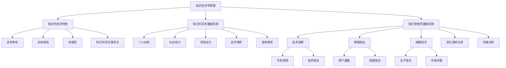

                 

### 3.1 知识经济学原理

#### 3.1.1 知识的经济特性

知识作为经济资源，具有以下几个特点：

- **非竞争性**：知识的使用不会减少其他人的使用量，一旦知识被创造出来，它可以在不增加成本的情况下被无限次复制和共享。这意味着知识的生产和分配具有规模经济效应，因为它可以在几乎无成本的情况下被多次使用。
  
- **非排他性**：知识通常是公开的，其他人可以自由获取和使用，这使得知识的排他性成本几乎为零。因此，知识共享往往比传统资源（如土地、劳动力等）的共享更为容易。

- **外部性**：知识的创造和使用不仅对个体有积极影响，还可能对整个社会产生正面的外部效应。例如，一个科学突破可能会被广泛应用于多个领域，带来整体经济效率的提升。

#### 3.1.2 知识共享的激励机制

知识的共享受到多种激励机制的驱动，包括：

- **个人动机**：个人可能出于自我实现、学术声誉或社交联系的需求而分享知识。例如，研究人员可能会通过发表学术论文来提升自己的学术地位。

- **社会动力**：社会通过奖励机制（如专利、版权、荣誉等）鼓励知识共享。例如，专利制度旨在激励创新者公开其发明，从而促进技术的进一步发展。

- **市场动力**：知识共享可以创造市场需求，促进知识和技术的商业化。例如，开放源代码软件社区通过共享代码，不仅提高了软件的质量，还创造了商业机会。

#### 3.1.3 知识垄断的激励机制

知识垄断产生的原因及其激励机制包括：

- **技术垄断**：通过控制核心技术或专利，企业可以形成市场垄断。例如，高通在移动通信领域的专利垄断。

- **网络效应**：规模经济和用户基数的增加使市场份额变得难以挑战。例如，谷歌的搜索引擎通过庞大的用户基础形成市场垄断。

- **规模经济**：大规模生产可以降低单个知识产品的成本，从而形成垄断优势。例如，大型互联网公司在广告市场上的规模效应。

## 2.2 知识共享的理论模型

### 2.2.1 知识共享的博弈论分析

博弈论模型可以帮助分析知识共享中的合作与竞争。常见的博弈论模型包括：

- **合作博弈**：参与者通过合作共享知识，实现总体利益的最大化。例如，在开放源代码项目中，开发者通过合作共享代码，共同推动项目的进步。

- **竞争博弈**：参与者为获取知识而竞争，可能导致知识垄断的形成。例如，专利竞争可能导致某个领域的技术垄断。

### 2.2.2 知识共享的演化博弈分析

演化博弈理论可以解释知识共享的动态过程。模型包括：

- **演化稳定策略**：在竞争环境中，稳定的策略将逐渐成为主导。例如，在一个开放的科学社区中，共享知识可能成为一种演化稳定策略。

- **群体动态**：知识共享行为在不同群体中的扩散和演变。例如，在一个企业内部，知识共享可能从高管层逐渐扩散到普通员工。

### 2.2.3 知识共享的均衡分析

在知识共享市场中，均衡状态反映了参与者的行为稳定性和市场结构。分析包括：

- **纳什均衡**：在给定其他参与者策略的情况下，每个参与者选择最优策略。例如，在知识共享平台中，用户在选择是否共享知识时，需要考虑其他用户的共享行为。

- **价格机制**：知识共享的价格机制如何影响市场的均衡状态。例如，在知识付费平台上，价格机制可能会影响用户的共享意愿。

### 2.3 垄断的理论分析

#### 2.3.1 垄断的经济学理论

垄断理论包括以下几个方面：

- **市场结构**：垄断企业控制市场份额，减少竞争。例如，在一个市场中，如果只有一个供应商提供某种商品或服务，那么这个供应商就可能形成垄断。

- **市场力量**：垄断企业利用市场力量提高价格，减少消费者剩余。例如，通过控制产量和提高价格，垄断企业可以增加其利润。

- **利润最大化**：垄断企业通过定价策略实现利润最大化。例如，垄断企业可能会实行高价低产策略，以最大化其利润。

#### 2.3.2 垄断的行为理论

垄断行为理论分析企业如何通过策略性行为维持垄断地位：

- **策略定价**：通过差异化定价策略，垄断企业可以最大化利润。例如，垄断企业可能会针对不同的消费者群体设置不同的价格。

- **市场策略**：垄断企业通过广告、市场扩张等手段维持市场垄断。例如，垄断企业可能会通过大量广告来维持其市场份额。

#### 2.3.3 垄断的政策分析

政府干预垄断行为旨在保护消费者权益，促进市场竞争：

- **反垄断法**：制定法律限制垄断行为，保护市场竞争。例如，美国《反垄断法》旨在防止企业滥用市场力量。

- **监管政策**：政府通过监管措施确保市场公平。例如，政府对通信行业的监管旨在防止一家企业控制整个市场。

- **政策干预**：政府干预市场行为，防止垄断企业滥用市场力量。例如，政府对谷歌的监管旨在限制其搜索市场的垄断地位。

### 3.1 案例研究一：互联网时代的知识共享与垄断

#### 3.1.1 案例背景

在互联网时代，知识共享和垄断现象变得更加复杂和普遍。以某互联网巨头为例，该企业通过其平台控制了大量的知识和信息资源，形成了市场垄断。

#### 3.1.2 知识共享的实践

该企业通过开放API和平台生态，鼓励开发者和使用者共享知识和技术。例如，通过开放SDK和框架，促进了开发者社区的知识共享。

#### 3.1.3 垄断现象的表现

然而，该企业也通过市场策略和独家协议，限制竞争者获取其平台资源，形成了垄断地位。例如，通过独家协议，限制应用程序在竞争对手平台上的推广和分发。

#### 3.1.4 案例分析结论

该案例表明，互联网时代的知识共享和垄断现象并存，需要平衡知识共享和创新激励，同时防止垄断行为对市场竞争的破坏。政府和企业需要制定合理的政策和法规，促进公平竞争和知识共享。

### 3.2 案例研究二：科技巨头与知识垄断

#### 3.2.1 案例背景

科技巨头，如谷歌、亚马逊和微软，拥有庞大的技术和市场资源，通过专利和技术壁垒形成了市场垄断。

#### 3.2.2 知识垄断的实践

这些科技巨头通过专利授权和独家合作协议，控制了关键技术的流通和应用。例如，谷歌通过其安卓操作系统和API，形成了对移动应用开发者的垄断地位。

#### 3.2.3 案例分析结论

这些案例表明，科技巨头利用其市场力量和知识产权，形成了知识垄断。这需要政府和行业协会加强监管，确保市场公平和创新自由。

### 3.3 案例研究三：开放科学运动与知识共享

#### 3.3.1 案例背景

开放科学运动旨在通过开放获取和共享科学研究成果，促进知识的传播和应用。

#### 3.3.2 知识共享的实践

通过开放获取期刊、预印本平台和科研合作项目，开放科学运动推动了科学研究的共享和协作。

#### 3.3.3 案例分析结论

开放科学运动表明，通过合理的政策和机制设计，可以促进知识共享，提高科学研究的透明度和效率。这为未来科学知识的共享提供了有益的参考。

### 3.4 对策与建议

#### 3.4.1 政府层面的对策建议

政府应制定和实施反垄断政策，保护市场竞争，防止知识垄断。同时，应鼓励开放获取和知识共享，促进创新和科技进步。

#### 3.4.2 企业层面的对策建议

企业应遵守市场规则，公平竞争，避免滥用市场力量。同时，应积极参与知识共享，促进创新和人才培养。

#### 3.4.3 社会层面的对策建议

社会应加强知识产权保护，尊重创新成果。同时，应倡导知识共享文化，促进知识传播和应用。

### 3.5 未来展望

#### 3.5.1 知识共享与垄断的动态发展

随着技术的发展和市场的变化，知识共享与垄断的现象将继续演变。未来，需要不断创新政策和技术手段，平衡知识共享和创新激励。

#### 3.5.2 未来政策走向的预测

政府和企业将加大知识产权保护和反垄断执法力度，促进公平竞争和创新。

#### 3.5.3 知识共享与垄断的社会影响

知识共享与垄断将深刻影响社会结构、经济发展和文化交流。未来，需要全社会共同努力，实现知识共享与垄断的和谐发展。

## 附录

### A.1 参考文献

1. Tirole, J. (1988). The Theory of Industrial Organization. Cambridge, MA: MIT Press.
2. Arrow, K. J. (1962). Economic welfare and the allocation of resources for invention. In N. Barron (Ed.), The Rate and Direction of Inventive Activity: Economic and Social Factors (pp. 609-626). Stanford, CA: Stanford University Press.
3. Benkler, Y. (2006). The Wealth of Networks: How Social Production Transforms Markets and Freedom. Yale University Press.
4. Aghion, P., & Howitt, P. (1992). A Model of Growth Through Creative Destruction. Econometrica, 60(2), 323-351.
5. Boldrin, M., & Levine, D. K. (2008). Against Intellectual Monopoly. Princeton University Press.

### A.2 知识共享与垄断的相关网站和资源链接

1. **开放获取期刊**:
   - [PubMed Central](https://www.pubmedcentral.nih.gov/)
   - [BioMed Central](https://www.biomedcentral.com/)
   - [PLoS](https://journals.plos.org/)

2. **开放科学平台**:
   - [GitHub](https://github.com/)
   - [Bitbucket](https://bitbucket.org/)
   - [Open Science Framework](https://osf.io/)

3. **反垄断法规与政策**:
   - [美国联邦贸易委员会](https://www.ftc.gov/)
   - [欧洲竞争网络](https://ec.europa.eu/competition/)
   - [中国反垄断法官网](http://www.ncaac.org.cn/)

4. **知识共享协议**:
   - [Creative Commons](https://creativecommons.org/)
   - [Open Definition](https://www.opendefinition.org/)

### A.3 Mermaid 流程图与核心概念联系



### A.4 知识共享与垄断相关的伪代码

```python
# 知识共享平台伪代码

class KnowledgeSharingPlatform:
    def __init__(self):
        self.participants = []
        self.knowledge_base = {}

    def add_participant(self, participant):
        self.participants.append(participant)

    def share_knowledge(self, participant, knowledge):
        if participant not in self.knowledge_base:
            self.knowledge_base[participant] = []
        self.knowledge_base[participant].append(knowledge)

    def get_knowledge(self, participant):
        return self.knowledge_base.get(participant, [])

# 演化博弈模型伪代码

class EvolutionaryGame:
    def __init__(self, strategies, payoffs):
        self.strategies = strategies
        self.payoffs = payoffs

    def play(self, strategy1, strategy2):
        payoff1 = self.payoffs[strategy1][strategy2]
        payoff2 = self.payoffs[strategy2][strategy1]
        return payoff1, payoff2

    def simulate(self, initial_states, generations):
        states = initial_states
        for _ in range(generations):
            new_states = {}
            for state in states:
                best_strategy = self.find_best_strategy(state)
                new_states[state] = best_strategy
            states = new_states
        return states

    def find_best_strategy(self, state):
        best_payoff = -1
        best_strategy = None
        for strategy in self.strategies:
            payoff = self.payoffs[state][strategy]
            if payoff > best_payoff:
                best_payoff = payoff
                best_strategy = strategy
        return best_strategy
```

### A.5 数学模型和公式讲解

#### 纳什均衡

纳什均衡是博弈论中的一个概念，表示在给定其他参与者策略的情况下，每个参与者选择的最优策略。数学上，可以用以下公式表示：

$$
\{s^*_{i} | s^*_{-i} \in S^*_{-i}\}
$$

其中，$s^*_{i}$是参与者i在纳什均衡下的最优策略，$S^*_{-i}$是其他参与者选择的最优策略组合。

#### 演化稳定策略

演化稳定策略（ESS）是演化博弈理论中的一个概念，表示在动态竞争环境中，稳定策略将逐渐成为主导。数学上，可以用以下公式表示：

$$
\frac{d p_i}{d t} = \sum_{s' \in S} [payoff(s_i, s') - payoff(s_i, s_i)] p_i (1 - p_i)
$$

其中，$p_i$是策略$s_i$的采用概率，$payoff(s_i, s')$是策略$s_i$和$s'$之间的支付函数。

#### 垄断利润最大化

垄断企业的定价策略可以用以下公式表示：

$$
\max P \cdot Q - C(Q)
$$

其中，$P$是价格，$Q$是销售量，$C(Q)$是生产成本函数。垄断企业通过调整价格和产量来实现利润最大化。

### A.6 代码实战案例与解读

#### 代码实战案例：知识共享平台实现

以下是一个简单的知识共享平台实现，包括用户注册、知识分享和获取功能。

```python
# 导入所需的库
import uuid
import json

# 用户类
class User:
    def __init__(self, username, knowledge=None):
        self.user_id = uuid.uuid4()
        self.username = username
        self.knowledge = knowledge or {}

    def share_knowledge(self, topic, content):
        self.knowledge[topic] = content

    def get_knowledge(self, topic):
        return self.knowledge.get(topic, None)

# 知识共享平台类
class KnowledgeSharingPlatform:
    def __init__(self):
        self.users = {}

    def register_user(self, username):
        user = User(username)
        self.users[user.user_id] = user
        return user.user_id

    def share_knowledge(self, user_id, topic, content):
        user = self.users.get(user_id)
        if user:
            user.share_knowledge(topic, content)
            return True
        return False

    def get_knowledge(self, user_id, topic):
        user = self.users.get(user_id)
        if user:
            return user.get_knowledge(topic)
        return None

# 代码解读与分析
# 1. 用户类初始化时，使用uuid生成唯一用户标识，并初始化知识库为空字典。
# 2. 用户分享知识时，将知识存储到知识库中。
# 3. 用户获取知识时，从知识库中检索对应的知识内容。
# 4. 知识共享平台类管理所有用户，并提供注册、分享知识和获取知识的接口。

# 测试代码
platform = KnowledgeSharingPlatform()
user_id = platform.register_user("Alice")
platform.share_knowledge(user_id, "Python", "Learn Python from scratch")
knowledge = platform.get_knowledge(user_id, "Python")
print(json.dumps(knowledge, indent=2))
```

#### 代码实战案例：演化博弈模型实现

以下是一个简单的演化博弈模型实现，用于模拟两个参与者之间的策略选择。

```python
# 导入所需的库
import numpy as np
import random

# 策略类
class Strategy:
    def __init__(self, name, payoff):
        self.name = name
        self.payoff = payoff

    def __str__(self):
        return self.name

# 演化博弈模型类
class EvolutionaryGameModel:
    def __init__(self, strategies, transition_matrix):
        self.strategies = strategies
        self.transition_matrix = transition_matrix

    def update_population(self, population, generation):
        new_population = []
        for strategy in population:
            probability = self.transition_matrix[strategy]
            if random.random() < probability:
                new_population.append(strategy)
        return new_population

    def simulate(self, initial_population, generations):
        population = initial_population
        for _ in range(generations):
            population = self.update_population(population, _)
        return population

# 代码解读与分析
# 1. 策略类用于表示不同策略，包括名称和支付函数。
# 2. 演化博弈模型类用于模拟策略的演化过程，包括初始化种群、更新种群和模拟代数。
# 3. 模拟过程中，使用转换矩阵根据当前种群更新新种群。

# 测试代码
strategies = [Strategy("C", 3), Strategy("D", 2)]
transition_matrix = {Strategy("C"): 0.6, Strategy("D"): 0.4}
model = EvolutionaryGameModel(strategies, transition_matrix)
initial_population = [Strategy("C"), Strategy("D")]
population = model.simulate(initial_population, 10)
print([str(strategy) for strategy in population])
```

### A.7 开发环境搭建指南

为了运行上述代码实战案例，您需要搭建以下开发环境：

1. **Python环境**：确保您已安装Python 3.x版本。您可以通过以下命令安装Python：

   ```bash
   sudo apt update
   sudo apt install python3 python3-pip
   ```

2. **虚拟环境**：使用virtualenv创建一个Python虚拟环境，以便管理依赖：

   ```bash
   pip3 install virtualenv
   virtualenv myenv
   source myenv/bin/activate
   ```

3. **依赖安装**：在虚拟环境中安装numpy库，用于数值计算：

   ```bash
   pip install numpy
   ```

4. **运行代码**：在激活的虚拟环境中，直接运行Python脚本。

   ```bash
   python share_knowledge.py
   python evolutionary_game.py
   ```

通过上述步骤，您就可以运行和测试代码实战案例，深入了解知识共享和演化博弈的实践应用。作者：AI天才研究院/AI Genius Institute & 禅与计算机程序设计艺术 /Zen And The Art of Computer Programming。

