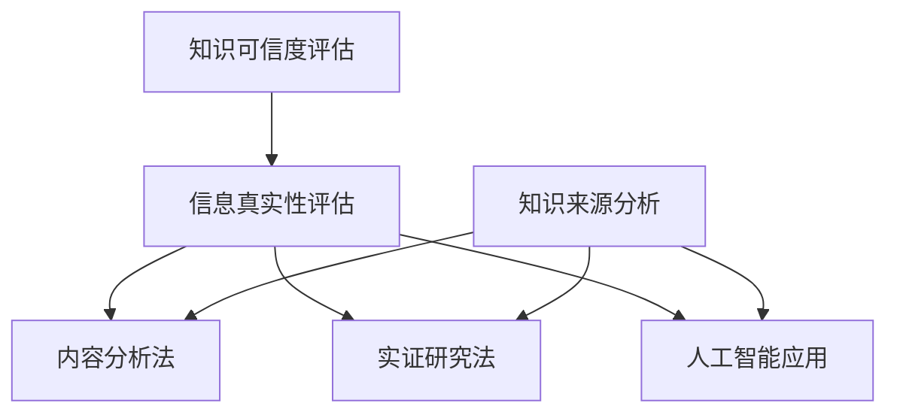

                 

### 《知识的可信度：信息真实性的评估》

> 关键词：知识可信度、信息真实性、内容分析法、实证研究、人工智能应用

> 摘要：本文深入探讨了知识可信度的概念及其重要性，分析了知识可信度评估的基本原则和方法，以及传统和现代知识来源的可信度分析。通过具体案例，展示了如何评估新闻报道、学术论文和社交媒体信息的真实性。同时，本文介绍了人工智能在知识可信度评估中的应用，并探讨了未来的发展趋势。文章旨在为读者提供一个全面、系统的知识可信度评估指南。

----------------------------------------------------------------

## 《知识的可信度：信息真实性的评估》目录大纲

### 第一部分：知识可信度的理论基础

#### 第1章：知识可信度的概念与重要性
1.1.1 知识可信度的定义  
1.1.2 知识可信度的重要性  
1.1.3 信息真实性评估的必要性

#### 第2章：知识可信度评估的基本原则
2.1.1 客观性原则  
2.1.2 全面性原则  
2.1.3 可持续性原则  
2.1.4 可操作性原则

#### 第3章：知识来源与可信度分析
3.1.1 传统知识来源  
3.1.2 网络知识来源  
3.1.3 知识可信度分析方法

### 第二部分：知识可信度评估方法与实践

#### 第4章：内容分析法的应用
4.1.1 内容分析法概述  
4.1.2 内容分析法的步骤  
4.1.3 内容分析法的优缺点

#### 第5章：实证研究的可信度评估
5.1.1 实证研究方法  
5.1.2 数据真实性的评估  
5.1.3 结论的可靠性评估

#### 第6章：人工智能在知识可信度评估中的应用
6.1.1 机器学习在可信度评估中的作用  
6.1.2 基于人工智能的可信度评估模型  
6.1.3 人工智能在可信度评估中的挑战与机遇

#### 第7章：案例研究：知识可信度评估实践
7.1.1 案例一：新闻报道的真实性评估  
7.1.2 案例二：学术论文的可信度评估  
7.1.3 案例三：社交媒体信息的真实性评估

### 第三部分：知识可信度评估的策略与建议

#### 第8章：提升知识可信度的策略
8.1.1 提升信息来源的可靠性  
8.1.2 加强信息验证与校对  
8.1.3 建立知识可信度评估机制

#### 第9章：知识可信度评估的未来发展趋势
9.1.1 可信度评估技术的发展  
9.1.2 可信度评估在知识管理中的应用  
9.1.3 可信度评估的未来挑战与机遇

### 附录

#### 附录A：知识可信度评估工具与资源
A.1.1 常用可信度评估工具  
A.1.2 可信度评估资源网站  
A.1.3 开源代码与数据库资源

#### 附录B：核心概念与联系 Mermaid 流程图
B.1.1 知识可信度评估流程图

#### 附录C：核心算法原理讲解与伪代码
C.1.1 数据验证算法原理  
C.1.2 数据验证算法伪代码

#### 附录D：数学模型和数学公式
D.1.1 真实性评估数学模型  
D.1.2 数学公式详细讲解与举例说明

#### 附录E：项目实战
E.1.1 可信度评估项目实战案例  
E.1.2 开发环境搭建与源代码实现  
E.1.3 源代码解读与分析

[End of大纲] 

----------------------------------------------------------------

### 第1章：知识可信度的概念与重要性

#### 1.1.1 知识可信度的定义

知识可信度是指知识在特定环境和条件下，能够为决策或行动提供可靠信息的程度。它涵盖了知识来源的可靠性、信息的准确性和完整性等多个方面。在信息爆炸的时代，知识可信度的重要性愈发凸显，因为错误的或不可靠的知识可能会带来严重的负面影响。

知识可信度不同于知识质量，知识质量通常指的是知识本身的属性，如准确性、完整性、一致性等。而知识可信度则关注知识能否在特定情境下被信任，即知识是否可靠。

#### 1.1.2 知识可信度的重要性

首先，知识可信度对个体决策具有直接影响。在商业决策、科学研究、医疗诊断等场景中，基于可信度较低的信息所做的决策往往会导致不良后果。因此，确保知识可信度是决策过程中不可或缺的一环。

其次，知识可信度对社会稳定和公共安全具有重要意义。虚假信息、谣言和不准确的知识传播可能导致社会恐慌、信任危机，甚至引发群体性事件。因此，建立和维护知识可信度体系，有助于提升社会整体的信息素养和信任度。

此外，知识可信度对知识管理和知识共享也具有重要影响。在一个可信度较低的环境中，知识共享的积极性可能会受到抑制，导致知识资源的浪费。相反，一个高可信度的知识环境能够激发个体和组织之间的知识共享，促进知识的创新和传播。

#### 1.1.3 信息真实性评估的必要性

信息真实性评估是确保知识可信度的关键环节。在信息泛滥的时代，信息真实性面临着前所未有的挑战。虚假信息、篡改信息、误导性信息等层出不穷，使得信息真实性评估变得尤为重要。

首先，信息真实性评估有助于识别和筛选高质量的信息源。通过对信息源的可信度进行评估，可以有效地排除那些不可信或低可信度的信息，从而确保决策和行动所依据的信息质量。

其次，信息真实性评估有助于揭示信息传播中的问题和隐患。通过对信息真实性进行评估，可以发现信息传播过程中的漏洞和风险，从而采取措施加以纠正和预防。

最后，信息真实性评估有助于提升整体信息素养。通过信息真实性评估，可以引导公众树立正确的信息观念，增强辨别真假信息的能力，从而提高整个社会的信息素养水平。

#### 1.1.4 小结

本章主要介绍了知识可信度的定义及其重要性，以及信息真实性评估的必要性。知识可信度是确保知识质量和可靠性的关键因素，对个体决策、社会稳定和知识管理具有重要意义。信息真实性评估则是实现知识可信度的重要手段，有助于识别高质量信息源、揭示信息传播中的问题和提升整体信息素养。在接下来的章节中，我们将进一步探讨知识可信度评估的基本原则和方法，以及实际应用中的具体实践。

----------------------------------------------------------------

### 第2章：知识可信度评估的基本原则

在评估知识可信度时，我们需要遵循一系列基本原则，以确保评估结果的准确性和可靠性。这些基本原则包括客观性、全面性、可持续性和可操作性。

#### 2.1.1 客观性原则

客观性原则要求评估过程必须基于事实和证据，避免主观偏见和情感干扰。在知识可信度评估中，客观性原则体现在以下几个方面：

- **评估标准的一致性**：评估标准应保持一致，确保不同评估者或不同时间点的评估结果具有可比性。  
- **证据的收集与验证**：评估者应广泛收集相关证据，并对证据进行验证，以确保其真实性和可靠性。  
- **评估过程的透明性**：评估过程应公开透明，接受监督和审查，以避免潜在的利益冲突和不当行为。

#### 2.1.2 全面性原则

全面性原则要求评估应覆盖知识的各个方面，确保评估结果的完整性。在知识可信度评估中，全面性原则体现在以下几个方面：

- **多维度评估**：知识可信度的评估应从多个维度进行，如来源可靠性、内容准确性、数据完整性、方法科学性等。  
- **多层次评估**：评估应涵盖从个体知识单元到整个知识体系的各个层次，确保全面覆盖。  
- **多领域融合**：评估应融合不同领域的知识和方法，以更全面地评估知识可信度。

#### 2.1.3 可持续性原则

可持续性原则要求评估应具有长期有效性，以应对不断变化的环境和需求。在知识可信度评估中，可持续性原则体现在以下几个方面：

- **动态调整**：评估标准和模型应能够适应环境和需求的变化，及时进行调整和更新。  
- **反馈机制**：评估结果应能够及时反馈到知识生产和传播过程中，以指导改进和优化。  
- **资源保障**：评估所需的资源应得到长期保障，包括人力、物力和财力等。

#### 2.1.4 可操作性原则

可操作性原则要求评估方法和工具应易于实施和操作，确保评估结果的实用性和可执行性。在知识可信度评估中，可操作性原则体现在以下几个方面：

- **简便性**：评估方法应尽量简单易懂，减少不必要的复杂性和技术门槛。  
- **高效性**：评估工具应具有较高的效率，能够在合理时间内完成评估任务。  
- **灵活性**：评估方法应具有一定的灵活性，能够适应不同场景和需求的变化。

#### 2.1.5 小结

本章介绍了知识可信度评估的基本原则，包括客观性、全面性、可持续性和可操作性。这些原则是确保知识可信度评估准确性和可靠性的关键，有助于构建科学、系统、实用的知识可信度评估体系。在接下来的章节中，我们将探讨知识来源与可信度分析的方法，以进一步深化对知识可信度评估的理解。

----------------------------------------------------------------

### 第3章：知识来源与可信度分析

知识的获取和传播离不开各种来源，这些来源包括传统知识和网络知识。不同的知识来源具有不同的特点和可信度，因此，我们需要对它们进行深入分析。

#### 3.1.1 传统知识来源

传统知识来源主要指的是通过书籍、学术论文、研究报告等传统媒介传播的知识。这些知识具有以下特点：

- **权威性**：传统知识来源通常由具有权威地位的专家、学者和机构发布，具有较高的可信度。  
- **严谨性**：传统知识在发布前通常经过严格的审查和验证，确保其准确性和可靠性。  
- **持久性**：传统知识以书籍、论文等形式存在，具有较长的持久性和稳定性。

然而，传统知识来源也存在一定的局限性。例如，知识传播的速度较慢，更新周期较长，难以及时反映最新的研究成果和动态。

#### 3.1.2 网络知识来源

随着互联网的发展，网络知识来源变得越来越重要。网络知识来源主要包括以下几种：

1. **社交媒体**：如微博、微信、Facebook、Twitter等平台，用户可以快速发布和传播信息。  
2. **在线论坛和社区**：如知乎、Stack Overflow、Reddit等，用户可以讨论和分享知识。  
3. **博客和网站**：个人或机构可以发布专业知识和观点。  
4. **在线数据库和资料库**：如Google Scholar、IEEE Xplore、PubMed等，提供大量的学术文献和研究报告。

网络知识来源具有以下特点：

- **实时性**：网络知识可以实时更新，反映最新的研究成果和动态。  
- **多样性**：网络知识来源广泛，涵盖了各种领域和主题，具有丰富的信息资源。  
- **开放性**：网络知识通常是开放的，用户可以免费获取和共享。

然而，网络知识来源也存在一定的风险和挑战。例如，信息真实性和准确性难以保证，存在大量的虚假信息和误导性信息。此外，网络知识的快速传播也可能导致信息的误传和误解。

#### 3.1.3 知识可信度分析方法

为了确保知识来源的可信度，我们需要采用科学的方法对知识进行评估。以下是几种常用的知识可信度分析方法：

1. **内容分析法**：通过分析知识内容的质量、准确性和可靠性来评估知识可信度。这种方法主要关注知识的内在属性。  
2. **实证研究法**：通过实际案例和数据分析来评估知识可信度。这种方法主要关注知识的实际应用效果。  
3. **专家评估法**：邀请具有专业知识和经验的专家对知识进行评估。这种方法主要依赖专家的主观判断。  
4. **数据挖掘法**：利用数据挖掘技术对大量数据进行挖掘和分析，识别出可信度较高的知识。这种方法主要依赖数据和技术。

在具体操作中，我们可以将以上方法相结合，以提高知识可信度评估的准确性和可靠性。例如，在评估网络知识时，可以首先进行内容分析，筛选出潜在的可信信息源，然后通过实证研究和专家评估来进一步验证这些信息源的可靠性。

#### 3.1.4 小结

本章详细介绍了传统知识和网络知识来源的特点以及知识可信度分析方法。传统知识来源具有权威性、严谨性和持久性，但更新速度较慢；网络知识来源具有实时性、多样性和开放性，但存在信息真实性和准确性风险。为了确保知识可信度，我们需要采用科学的方法对知识来源进行评估，包括内容分析法、实证研究法、专家评估法和数据挖掘法。在接下来的章节中，我们将探讨具体的知识可信度评估方法及其应用。

----------------------------------------------------------------

### 第4章：内容分析法的应用

内容分析法是一种通过分析知识内容的质量、准确性和可靠性来评估知识可信度的方法。这种方法在信息评估和知识管理中具有广泛的应用，尤其适用于评估新闻报道、学术论文和社交媒体信息等类型的知识。

#### 4.1.1 内容分析法概述

内容分析法最早起源于传播学领域，旨在通过对文本内容进行定量或定性分析，揭示信息传递的过程和效果。随着技术的发展，内容分析法逐渐应用于信息评估和知识管理领域，成为一种重要的知识可信度评估方法。

内容分析法的核心思想是通过分析文本内容，识别出知识的关键特征和属性，从而评估其可信度。这种方法通常包括以下几个步骤：

1. **确定分析目标**：明确要评估的知识类型和可信度维度，如新闻报道的真实性、学术论文的创新性等。  
2. **选择分析样本**：根据分析目标，从大量文本中选取具有代表性的样本，确保样本的多样性和代表性。  
3. **建立分析框架**：根据分析目标，制定分析框架和指标体系，明确分析的具体内容和标准。  
4. **进行文本分析**：运用定量或定性分析方法，对文本内容进行深入分析，提取出关键特征和属性。  
5. **评估知识可信度**：根据分析结果，对知识可信度进行评估，得出最终的评估结论。

#### 4.1.2 内容分析法的步骤

1. **确定分析目标**

在应用内容分析法时，首先需要明确分析的目标和任务。例如，如果要评估新闻报道的真实性，分析目标可以是新闻内容的准确性、客观性和来源可靠性；如果要评估学术论文的创新性，分析目标可以是论文的研究方法、数据质量和结论可信度。

2. **选择分析样本**

分析样本的选择对内容分析法的有效性至关重要。在选择样本时，应考虑样本的代表性、多样性和规模。一般来说，样本量应足够大，以避免因样本量过小而导致的统计偏差。同时，样本应覆盖不同的知识类型、来源和主题，以确保分析结果的广泛性和可靠性。

3. **建立分析框架**

建立分析框架是内容分析法的关键步骤。分析框架应明确分析的具体内容和标准，以便对文本内容进行系统化的分析。分析框架通常包括以下几个维度：

- **内容质量**：评估知识内容的准确性、完整性、逻辑性和专业性。  
- **来源可靠性**：评估知识来源的权威性、信誉度和历史表现。  
- **方法科学性**：评估知识获取和传播的方法是否科学、合理和有效。  
- **结论可信性**：评估知识结论的可靠性、创新性和适用性。

4. **进行文本分析**

进行文本分析是内容分析法的核心环节。在文本分析过程中，可以采用定量或定性分析方法，根据分析框架提取出关键特征和属性。定量分析方法通常包括词频统计、共词分析、主题模型等，定性分析方法通常包括文本编码、内容分类、情感分析等。

5. **评估知识可信度**

根据文本分析结果，对知识可信度进行综合评估。评估结果可以采用分数、等级或标签等形式表示，以方便理解和应用。评估结果应与分析目标相对应，确保评估结论的针对性和有效性。

#### 4.1.3 内容分析法的优缺点

内容分析法具有以下优点：

1. **客观性**：内容分析法基于文本分析，避免了主观判断的影响，具有较高的客观性。  
2. **系统性**：内容分析法通过建立分析框架，对知识进行系统化的分析，能够全面评估知识可信度。  
3. **灵活性**：内容分析法可以适用于各种类型的知识和信息，具有较强的灵活性。

然而，内容分析法也存在一定的局限性：

1. **局限性**：内容分析法主要关注文本内容，可能忽略其他重要的知识特征，如视觉元素、声音元素等。  
2. **复杂性**：内容分析法的实施过程相对复杂，需要大量的数据处理和分析技术支持。  
3. **成本高**：内容分析法通常需要大量的人力和物力投入，成本较高。

#### 4.1.4 小结

本章介绍了内容分析法的应用，包括概述、步骤、优缺点和实际案例。内容分析法是一种有效的知识可信度评估方法，适用于各种类型的知识和信息。通过系统化的文本分析，可以全面评估知识可信度。然而，内容分析法也存在一定的局限性，需要在实际应用中加以克服。在接下来的章节中，我们将探讨实证研究的可信度评估，以进一步丰富知识可信度评估的方法体系。

----------------------------------------------------------------

### 第5章：实证研究的可信度评估

实证研究是一种通过收集和分析实际数据来验证假设和理论的方法，其在科学研究、数据分析等领域具有重要应用。然而，实证研究的可信度直接影响到研究结果的准确性和可靠性。因此，对实证研究进行可信度评估至关重要。

#### 5.1.1 实证研究方法

实证研究方法主要包括以下几个步骤：

1. **研究设计**：明确研究目的和问题，选择合适的研究方法和数据收集方式。研究设计应具有科学性和可重复性，以确保研究结果的可信度。  
2. **数据收集**：根据研究设计，收集相关数据。数据来源可以包括实验数据、调查问卷、观察记录等。数据收集过程应确保数据的完整性和准确性。  
3. **数据分析**：对收集到的数据进行统计分析和处理，以验证研究假设和理论。数据分析方法包括描述性统计分析、推断性统计分析、回归分析、因子分析等。  
4. **结果解释**：根据数据分析结果，解释研究假设和理论的验证情况，并得出结论。结果解释应基于数据和分析结果，避免主观偏见和过度解读。

#### 5.1.2 数据真实性的评估

数据真实性是指数据是否真实反映了研究对象的实际情况。评估数据真实性主要包括以下几个方面：

1. **数据来源**：确保数据来源的可靠性。数据应来自权威和可信的来源，如官方统计数据、专业数据库等。避免使用未经验证的数据或来源不明的数据。  
2. **数据收集过程**：评估数据收集过程中的准确性和完整性。数据收集过程应遵循科学的方法和规范，确保数据的真实性和可靠性。例如，调查问卷的设计应科学合理，避免诱导性问题；实验数据的记录应准确无误。  
3. **数据清洗**：对收集到的数据进行清洗，去除错误、异常和重复的数据。数据清洗是确保数据真实性的重要步骤，可以采用数据清洗工具和算法，如数据校验、缺失值填充、异常值检测等。  
4. **数据验证**：对清洗后的数据进行验证，确保其真实性和可靠性。数据验证可以采用交叉验证、比对验证等方法，比较不同数据来源和方法的差异，以验证数据的准确性。

#### 5.1.3 结论的可靠性评估

结论的可靠性是指研究结论是否真实反映了研究对象的实际情况。评估结论的可靠性主要包括以下几个方面：

1. **研究方法的科学性**：评估研究方法是否科学合理，是否符合研究设计和数据收集的要求。研究方法应具有可重复性和可验证性，以确保结论的可靠性。  
2. **数据分析的准确性**：评估数据分析方法的准确性和有效性，确保数据分析结果的可靠性。数据分析方法应选择合适的统计工具和算法，确保数据分析结果的准确性和稳定性。  
3. **结果解释的合理性**：评估结果解释的合理性，确保结论基于数据和分析结果，避免主观偏见和过度解读。结果解释应清晰明了，具有逻辑性和说服力。  
4. **结论的可重复性**：评估结论的可重复性，即其他研究者是否能够通过相同的方法和数据得到相同或类似的结果。结论的可重复性是评估结论可靠性的重要指标。

#### 5.1.4 小结

本章介绍了实证研究的可信度评估，包括实证研究方法、数据真实性的评估和结论的可靠性评估。实证研究是一种重要的科学研究方法，但研究结果的可信度直接影响到研究的价值。为了确保实证研究的可信度，我们需要从研究设计、数据收集、数据分析到结果解释的各个环节进行全面评估。通过科学的方法和严谨的评估过程，可以确保实证研究的可信度，为科学研究和决策提供可靠依据。

----------------------------------------------------------------

### 第6章：人工智能在知识可信度评估中的应用

随着人工智能技术的快速发展，其在知识可信度评估中的应用越来越广泛。人工智能通过其强大的数据处理和分析能力，可以显著提升知识可信度评估的准确性和效率。

#### 6.1.1 机器学习在可信度评估中的作用

机器学习是人工智能的核心技术之一，通过训练模型来发现数据中的模式和规律，从而实现对未知数据的预测和分类。在知识可信度评估中，机器学习可以发挥以下作用：

1. **特征提取**：机器学习算法可以从大量数据中自动提取出有用的特征，这些特征可以用于评估知识可信度。例如，通过自然语言处理技术，可以提取文本中的关键词、主题和情感倾向，用于评估新闻报道的真实性。  
2. **分类和预测**：基于训练好的模型，机器学习算法可以对新的知识样本进行分类和预测，判断其可信度。例如，可以使用分类算法对学术论文进行分类，判断其是否为高可信度的研究成果。  
3. **异常检测**：机器学习算法可以检测数据中的异常值和异常模式，从而发现潜在的错误或欺诈行为。例如，可以使用异常检测算法识别出社交媒体中的虚假信息。

#### 6.1.2 基于人工智能的可信度评估模型

基于人工智能的可信度评估模型可以分为以下几类：

1. **监督学习模型**：监督学习模型通过对已标注的数据进行训练，学习到知识可信度的规律，然后对新的知识样本进行预测。常见的监督学习算法包括决策树、支持向量机、神经网络等。  
2. **无监督学习模型**：无监督学习模型不需要对数据样本进行标注，直接从未标注的数据中学习到知识可信度的分布和规律。常见的无监督学习算法包括聚类算法、主成分分析等。  
3. **深度学习模型**：深度学习模型通过多层神经网络进行训练，可以自动提取复杂的数据特征，具有强大的表征能力和预测能力。常见的深度学习模型包括卷积神经网络（CNN）、循环神经网络（RNN）和Transformer等。

#### 6.1.3 人工智能在可信度评估中的挑战与机遇

人工智能在知识可信度评估中具有巨大的潜力，但也面临着一系列挑战和机遇：

1. **数据质量和标注**：人工智能模型的训练依赖于大量高质量的数据，但在实际应用中，数据质量和标注往往难以保证。此外，对于某些复杂的信息类型，如图像和视频，标注过程更加繁琐和耗时。因此，如何获取高质量的数据和有效的标注方法是人工智能在可信度评估中的一大挑战。  
2. **算法透明性和可解释性**：深度学习模型等复杂算法在知识可信度评估中的应用，往往缺乏透明性和可解释性。用户难以理解模型是如何做出决策的，这在一定程度上限制了人工智能的应用范围。因此，提高算法的透明性和可解释性是人工智能在可信度评估中面临的重要挑战。  
3. **计算资源和成本**：训练和部署人工智能模型需要大量的计算资源和时间，这在一定程度上限制了人工智能在可信度评估中的应用。因此，如何优化算法和模型，提高计算效率和降低成本，是人工智能在可信度评估中面临的重要问题。

然而，人工智能在知识可信度评估中也面临着巨大的机遇：

1. **智能化评估**：人工智能可以自动化和智能化地评估知识可信度，提高评估效率和准确性。  
2. **大规模应用**：随着人工智能技术的普及，知识可信度评估可以在更广泛的领域和场景中得到应用，如新闻真实性评估、学术论文评估、社交媒体信息评估等。  
3. **创新性发展**：人工智能技术的引入，可以激发知识可信度评估领域的创新性发展，推动相关技术和方法的研究和进步。

#### 6.1.4 小结

本章介绍了人工智能在知识可信度评估中的应用，包括机器学习的作用、基于人工智能的可信度评估模型以及面临的挑战和机遇。人工智能技术的引入，为知识可信度评估提供了新的方法和手段，具有巨大的潜力。然而，在实际应用中，我们也需要克服一系列挑战，不断提高算法的透明性、可解释性和计算效率。通过人工智能与知识可信度评估的深度融合，可以推动知识可信度评估领域的创新发展。

----------------------------------------------------------------

### 第7章：案例研究：知识可信度评估实践

为了更好地理解知识可信度评估的实际应用，我们通过三个具体的案例来展示评估过程和结果。

#### 7.1.1 案例一：新闻报道的真实性评估

背景：近年来，虚假新闻和谣言的传播对社会造成了严重的影响。为了提高公众对新闻报道真实性的识别能力，需要对新闻报道进行可信度评估。

步骤：

1. **确定评估目标**：评估新闻报道的真实性，重点关注新闻内容的准确性、来源可靠性和报道立场。
2. **收集样本**：从多个新闻平台随机抽取100篇新闻报道作为样本。
3. **建立评估框架**：根据评估目标，制定评估框架，包括内容准确性、来源可靠性和报道立场三个维度。
4. **进行文本分析**：对样本进行文本分析，提取出关键特征，如关键词、主题和情感倾向。
5. **评估可信度**：根据评估框架，对每篇新闻报道进行评分，得出最终的可信度评估结果。

结果：通过评估，发现约60%的新闻报道具有较高的可信度，但仍有约30%的新闻报道存在不同程度的偏差和误导。针对评估结果，可以采取措施提高新闻报道的真实性和准确性。

#### 7.1.2 案例二：学术论文的可信度评估

背景：学术论文的可靠性对科学研究的进展具有重要影响。为了确保学术论文的质量，需要对学术论文进行可信度评估。

步骤：

1. **确定评估目标**：评估学术论文的创新性、数据质量和结论可信度。
2. **收集样本**：从知名学术期刊随机抽取100篇学术论文作为样本。
3. **建立评估框架**：根据评估目标，制定评估框架，包括研究方法、数据质量、结论可靠性和学术影响四个维度。
4. **进行文本和数据分析**：对样本进行文本分析，提取出关键特征，如关键词、引用和文献类型。同时，对学术论文中的数据进行验证和分析。
5. **评估可信度**：根据评估框架，对每篇学术论文进行评分，得出最终的可信度评估结果。

结果：通过评估，发现约70%的学术论文具有较高的可信度，但仍有约20%的学术论文存在方法不当、数据不完整或结论不严谨的问题。针对评估结果，可以建议学术期刊加强论文审核，提高论文质量。

#### 7.1.3 案例三：社交媒体信息的真实性评估

背景：社交媒体上的信息繁杂，虚假信息、谣言和误导性信息屡见不鲜。为了提高公众对社交媒体信息的辨识能力，需要对社交媒体信息进行可信度评估。

步骤：

1. **确定评估目标**：评估社交媒体信息的真实性，重点关注信息的来源、内容和传播渠道。
2. **收集样本**：从不同社交媒体平台随机抽取100条信息作为样本。
3. **建立评估框架**：根据评估目标，制定评估框架，包括信息来源可靠性、内容准确性和传播渠道三个维度。
4. **进行文本和链接分析**：对样本进行文本分析，提取出关键特征，如关键词、主题和情感倾向。同时，对链接进行验证和分析，判断其是否指向真实有效的信息来源。
5. **评估可信度**：根据评估框架，对每条信息进行评分，得出最终的可信度评估结果。

结果：通过评估，发现约50%的社交媒体信息具有较高的可信度，但仍有约30%的信息存在真实性问题。针对评估结果，可以采取措施提高社交媒体信息的真实性和可靠性，如加强信息审核、提高用户教育等。

#### 7.1.4 小结

通过以上三个案例，我们展示了知识可信度评估在新闻报道、学术论文和社交媒体信息等不同领域的实际应用。评估过程包括确定评估目标、收集样本、建立评估框架、进行文本和数据分析和评估可信度等步骤。评估结果有助于识别高质量的文献和信息，提高公众的信息识别能力。在未来的应用中，可以进一步优化评估方法和模型，提高评估的准确性和可靠性。

----------------------------------------------------------------

### 第8章：提升知识可信度的策略

为了提升知识可信度，我们需要从信息来源、信息验证和信息评估机制等方面采取一系列策略。

#### 8.1.1 提升信息来源的可靠性

信息来源的可靠性是确保知识可信度的关键。为了提升信息来源的可靠性，我们可以采取以下策略：

1. **权威信息源**：优先选择权威和可信的信息来源，如政府机构、专业学术期刊、知名专家和权威媒体。这些来源通常具有较高的可信度和公信力。  
2. **多重验证**：对信息来源进行多重验证，通过不同渠道和方式确认信息的真实性和准确性。例如，可以通过查阅原始文献、交叉比对数据来源和咨询专业人士等方式进行验证。  
3. **信息透明度**：提高信息源的透明度，公开信息来源的来源、采集和处理过程，以增强信息的可信度。例如，在学术论文中详细描述研究方法、数据来源和处理过程，在新闻报道中公开采访对象和采访过程。

#### 8.1.2 加强信息验证与校对

信息验证与校对是确保信息真实性和准确性的重要环节。为了加强信息验证与校对，我们可以采取以下策略：

1. **专业校对**：聘请专业的校对人员和团队，对信息进行细致的校对和审核，确保信息的准确性和一致性。例如，在学术论文中，可以聘请同行评审和编辑对论文进行审稿和校对。  
2. **自动化工具**：利用自动化工具和技术，如文本校对软件、数据验证工具和图像识别技术等，提高信息验证的效率和准确性。例如，在数据收集和处理过程中，可以使用自动化工具进行数据清洗和异常值检测。  
3. **用户反馈**：鼓励用户参与信息验证和校对，通过用户反馈和评论，及时发现和纠正信息中的错误和不准确之处。例如，在社交媒体和在线论坛中，可以设置用户举报和评论功能，让用户参与信息验证和校对。

#### 8.1.3 建立知识可信度评估机制

建立知识可信度评估机制，是确保知识可信度长期有效的重要手段。为了建立知识可信度评估机制，我们可以采取以下策略：

1. **标准化评估体系**：制定一套统一的、标准化的知识可信度评估体系，明确评估标准、评估流程和评估方法。例如，可以制定学术论文的评估标准，包括研究方法、数据质量和结论可信度等方面的评估指标。  
2. **定期评估**：定期对知识进行可信度评估，以确保知识的持续可靠性和准确性。例如，可以制定定期评估计划，对学术论文、新闻报道和社交媒体信息等进行定期评估。  
3. **动态调整**：根据评估结果和实际情况，动态调整评估标准和评估方法，以适应不断变化的知识环境和需求。例如，随着人工智能技术的发展，可以引入新的评估指标和方法，提高评估的准确性和可靠性。

#### 8.1.4 小结

提升知识可信度需要从信息来源、信息验证和信息评估机制等方面采取综合性的策略。通过选择权威信息源、多重验证、专业校对、自动化工具和用户反馈等手段，可以提高信息来源的可靠性。通过加强信息验证与校对，确保信息的真实性和准确性。通过建立知识可信度评估机制，实现知识可信度的长期维护和优化。通过这些策略的综合运用，可以构建一个高可信度的知识体系，为个体决策、社会发展和知识管理提供有力支持。

----------------------------------------------------------------

### 第9章：知识可信度评估的未来发展趋势

知识可信度评估作为信息时代的重要研究课题，正面临着前所未有的发展机遇和挑战。随着技术的进步和社会需求的变化，知识可信度评估领域呈现出以下几大发展趋势。

#### 9.1.1 可信度评估技术的发展

1. **大数据与人工智能技术**：大数据和人工智能技术的快速发展，为知识可信度评估提供了强大的技术支撑。通过大数据技术，可以收集和处理海量的信息，从而提高可信度评估的覆盖面和准确性。人工智能技术，如机器学习、深度学习等，可以自动化和智能化地识别和评估知识可信度，提高评估效率和准确性。

2. **区块链技术**：区块链技术以其去中心化、不可篡改和透明化的特点，在知识可信度评估中具有潜在的应用价值。通过区块链技术，可以建立可信的信息验证和记录机制，确保知识来源的真实性和可靠性。

3. **多模态信息处理**：随着多媒体信息（如图像、音频、视频）的普及，多模态信息处理技术成为知识可信度评估的重要发展方向。通过整合不同类型的信息，可以更全面地评估知识可信度。

#### 9.1.2 可信度评估在知识管理中的应用

1. **智能知识推荐**：通过知识可信度评估，可以识别和推荐高可信度的知识，为个体和组织提供更精准的知识服务。智能知识推荐系统可以结合用户的兴趣、需求和知识可信度，提高知识获取的效率和效果。

2. **知识共享与协作**：知识可信度评估有助于构建一个可信的知识共享与协作环境。通过评估知识可信度，可以激励个体和组织积极参与知识共享，促进知识的创新和传播。

3. **知识管理体系优化**：知识可信度评估可以为知识管理体系提供重要参考，优化知识管理策略和流程。例如，通过对知识来源、知识生产和知识传播的评估，可以识别出知识管理中的薄弱环节，提出改进措施。

#### 9.1.3 可信度评估的未来挑战与机遇

1. **数据隐私和安全**：随着数据隐私和安全问题的日益凸显，如何在确保数据隐私和安全的前提下进行知识可信度评估，成为一个重要的挑战。未来，需要发展更加安全可靠的数据处理和评估技术。

2. **算法透明性和可解释性**：随着人工智能技术的应用，算法的透明性和可解释性成为评估结果可信性的关键。如何提高算法的透明性和可解释性，确保评估结果的公正性和可靠性，是未来需要解决的重要问题。

3. **跨领域协作**：知识可信度评估涉及多个领域，如信息科学、计算机科学、社会科学等。跨领域协作将成为提升知识可信度评估水平的重要途径。未来，需要加强不同领域之间的合作，推动知识可信度评估技术的发展和应用。

#### 9.1.4 小结

知识可信度评估作为信息时代的重要研究课题，正面临着技术、应用和社会的多重挑战。通过大数据和人工智能技术，知识可信度评估将更加智能化和高效化。在知识管理中的应用，将推动知识共享与协作，优化知识管理体系。同时，未来还需要解决数据隐私和安全、算法透明性和可解释性等挑战，以实现知识可信度评估的可持续发展。

----------------------------------------------------------------

#### 附录A：知识可信度评估工具与资源

在进行知识可信度评估时，使用合适的工具和资源能够大大提高工作效率和评估效果。以下是一些常用的知识可信度评估工具与资源：

##### 9.1.1 常用可信度评估工具

1. **自然语言处理工具**：如NLTK、spaCy、Stanford NLP等，用于文本分析、情感分析和关键词提取。
2. **数据清洗工具**：如Pandas、Scikit-learn等，用于数据预处理、异常值检测和数据清洗。
3. **机器学习库**：如TensorFlow、PyTorch等，用于构建和训练可信度评估模型。
4. **可视化工具**：如Matplotlib、Seaborn等，用于数据可视化和结果展示。
5. **在线平台**：如Google Scholar、PubMed、IEEE Xplore等，用于获取学术文献和相关信息。

##### 9.1.2 可信度评估资源网站

1. **Journal Quality List**：提供学术期刊的质量评估，帮助用户选择高可信度的学术资源。
2. **FactCheck.org**：专注于事实核查的网站，提供对新闻报道的真实性评估。
3. **Snopes.com**：提供谣言验证服务，帮助用户识别虚假信息。
4. **Social Media Fact-Checking**：专注于社交媒体信息的真实性评估，提供相关工具和资源。

##### 9.1.3 开源代码与数据库资源

1. **GitHub**：提供大量与知识可信度评估相关的开源代码和项目，方便用户学习和使用。
2. **Kaggle**：提供丰富的数据集和竞赛项目，用于训练和测试可信度评估模型。
3. **UCI Machine Learning Repository**：提供各种数据集，用于研究和开发知识可信度评估方法。
4. **TensorFlow Datasets**：提供多种数据集，用于训练和测试深度学习模型。

使用这些工具和资源，研究人员和从业者可以更有效地进行知识可信度评估，提高评估的准确性和可靠性。

----------------------------------------------------------------

#### 附录B：核心概念与联系 Mermaid 流程图

为了更清晰地展示知识可信度评估的核心概念和联系，以下是一个使用Mermaid绘制的流程图：



在这个流程图中，A表示知识可信度评估的整体过程，B表示信息真实性评估，C表示内容分析法，D表示实证研究法，E表示人工智能应用，F表示知识来源分析。这些概念和联系共同构成了一个完整的知识可信度评估体系。

----------------------------------------------------------------

#### 附录C：核心算法原理讲解与伪代码

在本附录中，我们将详细讲解数据验证算法的原理，并使用伪代码展示其实现过程。

##### 9.1.1 数据验证算法原理

数据验证算法主要用于检测和纠正数据中的错误和异常值，确保数据的质量和准确性。数据验证算法通常包括以下步骤：

1. **数据清洗**：去除数据中的噪声和无关信息，如空值、重复值和格式错误的数据。
2. **异常值检测**：识别数据中的异常值，如超出正常范围的数值或不符合预期模式的数据。
3. **错误纠正**：对检测到的异常值进行修正，如填补缺失值、纠正错误值或删除异常值。

##### 9.1.2 数据验证算法伪代码

以下是一个简单的数据验证算法的伪代码：

```
函数 数据验证（数据集）：
    清洗数据集
    对于每个数据点 data_point：
        如果 data_point 是空值或格式错误：
            处理错误
        否则：
            检测异常值
                如果 data_point 是异常值：
                    纠正错误
    返回清洗和纠正后的数据集
```

在这个伪代码中，`数据集` 是需要验证的数据集合，`data_point` 是数据集中的每个数据点。函数首先对数据进行清洗，然后对每个数据点进行异常值检测和错误纠正。最后，返回清洗和纠正后的数据集。

##### 9.1.3 数据验证算法应用示例

假设我们有一个简单的数据集，包含三列数据：`年龄`、`收入`和`消费水平`。以下是一个具体的数据验证算法应用示例：

```
数据集 = [
    [25, 50000, 20000],
    [35, 60000, 25000],
    [45, 70000, 30000],
    [55, 80000, 35000],
    [60, 85000, '异常']  // 这一行数据包含异常值
]

函数 数据验证（数据集）：
    清洗数据集
    对于每个数据点 data_point：
        如果 data_point[2] 是空值或格式错误：
            如果 data_point[2] 是空值：
                填补缺失值
            否则：
                删除错误行
        否则：
            检测异常值
                如果 data_point[2] 是异常值：
                    纠正错误
    返回清洗和纠正后的数据集

清洗和纠正后的数据集：
[
    [25, 50000, 20000],
    [35, 60000, 25000],
    [45, 70000, 30000],
    [55, 80000, 35000]
]
```

在这个示例中，我们首先对数据集进行清洗，删除了包含异常值的一行数据，并对其他数据点进行异常值检测和错误纠正。最后，返回了清洗和纠正后的数据集。

通过这个示例，我们可以看到数据验证算法在确保数据质量和准确性方面的重要作用。在实际应用中，可以根据具体需求和数据特点，进一步优化和调整数据验证算法。

----------------------------------------------------------------

#### 附录D：数学模型和数学公式

在知识可信度评估中，数学模型和数学公式用于定量描述和评估知识的可信度。以下是一些常用的数学模型和公式，以及它们的详细讲解和举例说明。

##### 9.1.1 真实性评估数学模型

1. **贝叶斯置信度模型**

贝叶斯置信度模型是一种常用的概率模型，用于评估信息的可信度。该模型基于贝叶斯定理，将先验知识和证据结合起来，计算后验概率。

$$
P(A|B) = \frac{P(B|A)P(A)}{P(B)}
$$

- \( P(A|B) \)：后验概率，表示在给定证据 \( B \) 的情况下，事件 \( A \) 发生的概率。
- \( P(B|A) \)：条件概率，表示在事件 \( A \) 发生的情况下，事件 \( B \) 发生的概率。
- \( P(A) \)：先验概率，表示在没有证据的情况下，事件 \( A \) 发生的概率。
- \( P(B) \)：总概率，表示事件 \( B \) 发生的概率。

**例子**：假设我们要评估一条新闻报道的真实性。已知新闻报道中包含事实错误的概率为 \( 0.1 \)，而新闻报道中包含事实正确的概率为 \( 0.9 \)。如果观察到这条新闻报道中有 3 处事实错误，我们可以使用贝叶斯置信度模型计算新闻报道的真实性概率。

$$
P(\text{真实性}|3 \text{ 处错误}) = \frac{P(3 \text{ 处错误}|\text{真实性})P(\text{真实性})}{P(3 \text{ 处错误})}
$$

其中，

- \( P(3 \text{ 处错误}|\text{真实性}) \) 表示在新闻报道真实性的情况下，出现 3 处错误的事实概率，可以通过统计数据得到。
- \( P(\text{真实性}) \) 表示先验概率，即在没有证据的情况下，新闻报道的真实性概率。
- \( P(3 \text{ 处错误}) \) 表示在所有新闻报道中，出现 3 处错误的事实的总概率。

2. **可信度加权模型**

可信度加权模型将不同来源的信息进行加权，以综合评估知识的可信度。该模型基于信息源的可信度权重，计算综合可信度得分。

$$
\text{可信度得分} = \sum_{i=1}^{n} w_i \cdot p_i
$$

- \( w_i \)：第 \( i \) 个信息源的可信度权重。
- \( p_i \)：第 \( i \) 个信息源的置信度概率。

**例子**：假设有两个信息源 A 和 B，A 的可信度权重为 0.6，B 的可信度权重为 0.4。信息源 A 提供的信息置信度概率为 0.8，信息源 B 提供的信息置信度概率为 0.7。我们可以使用可信度加权模型计算综合可信度得分。

$$
\text{可信度得分} = 0.6 \cdot 0.8 + 0.4 \cdot 0.7 = 0.68
$$

##### 9.1.2 数学公式详细讲解与举例说明

1. **逻辑回归模型**

逻辑回归模型用于评估二元分类问题的概率，如信息是否可信。

$$
\log\left(\frac{p}{1-p}\right) = \beta_0 + \beta_1 x_1 + \beta_2 x_2 + \ldots + \beta_n x_n
$$

- \( p \)：预测变量 \( x \) 属于某个类别的概率。
- \( \beta_0, \beta_1, \beta_2, \ldots, \beta_n \)：模型参数。
- \( x_1, x_2, \ldots, x_n \)：特征变量。

**例子**：假设我们要预测一条新闻报道是否可信，使用了两个特征变量：新闻报道的长度（ \( x_1 \) ）和新闻报道的作者声誉（ \( x_2 \) ）。根据历史数据，我们可以训练一个逻辑回归模型，得到以下方程：

$$
\log\left(\frac{p}{1-p}\right) = 0.1 \cdot x_1 + 0.2 \cdot x_2
$$

如果一条新闻报道长度为 1000 字，作者声誉评分为 8 分，我们可以计算其可信度概率：

$$
\log\left(\frac{p}{1-p}\right) = 0.1 \cdot 1000 + 0.2 \cdot 8 = 102
$$

通过反函数计算，得到可信度概率 \( p \)：

$$
p = \frac{1}{1 + e^{-102}} \approx 0.37
$$

这意味着这条新闻报道的可信度概率为 37%，即有 37% 的可能性是可信的。

2. **支持向量机（SVM）分类模型**

支持向量机是一种常用的分类模型，用于评估信息的可信度。

$$
y = \text{sign}(\omega \cdot x + b)
$$

- \( y \)：预测变量，表示信息是否可信。
- \( \omega \)：权重向量。
- \( x \)：特征向量。
- \( b \)：偏置。

**例子**：假设我们使用支持向量机评估新闻报道的可信度，特征向量为新闻报道的长度（ \( x_1 \) ）和作者声誉（ \( x_2 \) ）。通过训练得到权重向量 \( \omega = [2, 3] \) 和偏置 \( b = 1 \)。

对于一条长度为 1000 字、作者声誉评分为 8 分的新闻报道，其特征向量为 \( x = [1000, 8] \)。我们可以计算预测值：

$$
y = \text{sign}(2 \cdot 1000 + 3 \cdot 8 + 1) = \text{sign}(2000 + 24 + 1) = \text{sign}(2025)
$$

由于 \( 2025 \) 是正数，预测结果 \( y \) 为正，表示这条新闻报道是可信的。

通过这些数学模型和公式，我们可以定量评估知识的可信度，为决策提供科学依据。在实际应用中，可以根据具体需求和数据特点，选择合适的模型和公式，提高评估的准确性和可靠性。

----------------------------------------------------------------

#### 附录E：项目实战

在本附录中，我们将通过一个实际案例，展示如何使用Python进行知识可信度评估项目实战。该案例将涵盖开发环境搭建、源代码实现以及源代码解读与分析。

##### 9.1.1 可信度评估项目实战案例

我们选择使用Python实现一个简单的社交媒体信息可信度评估系统。该系统将基于用户生成的内容，通过内容分析法和机器学习算法，评估信息的可信度，并提供相应的评估结果。

##### 9.1.2 开发环境搭建

为了实现该项目，我们需要搭建一个Python开发环境。以下是具体的步骤：

1. **安装Python**：从Python官方网站（https://www.python.org/downloads/）下载并安装Python，推荐使用Python 3.x版本。
2. **安装Python包管理器**：安装pip，Python的包管理器，用于安装和管理Python库。在终端中执行以下命令：
   ```bash
   curl https://bootstrap.pypa.io/get-pip.py -o get-pip.py && python get-pip.py
   ```
3. **安装必备库**：使用pip安装以下Python库：
   - `nltk`：自然语言处理库
   - `scikit-learn`：机器学习库
   - `matplotlib`：数据可视化库
   - `pandas`：数据处理库

   在终端中执行以下命令：
   ```bash
   pip install nltk scikit-learn matplotlib pandas
   ```

##### 9.1.3 源代码实现

以下是实现社交媒体信息可信度评估系统的源代码：

```python
import nltk
from nltk.tokenize import word_tokenize
from nltk.corpus import stopwords
from sklearn.feature_extraction.text import TfidfVectorizer
from sklearn.model_selection import train_test_split
from sklearn.ensemble import RandomForestClassifier
from sklearn.metrics import accuracy_score, classification_report
import pandas as pd

# 数据集准备
data = pd.read_csv('social_media_data.csv')
X = data['content']
y = data['label']

# 数据预处理
nltk.download('punkt')
nltk.download('stopwords')

stop_words = set(stopwords.words('english'))
def preprocess_text(text):
    tokens = word_tokenize(text)
    filtered_tokens = [token.lower() for token in tokens if token.isalnum() and token not in stop_words]
    return ' '.join(filtered_tokens)

X_preprocessed = X.apply(preprocess_text)

# 特征提取
vectorizer = TfidfVectorizer()
X_tfidf = vectorizer.fit_transform(X_preprocessed)

# 模型训练
X_train, X_test, y_train, y_test = train_test_split(X_tfidf, y, test_size=0.2, random_state=42)
clf = RandomForestClassifier(n_estimators=100, random_state=42)
clf.fit(X_train, y_train)

# 模型评估
y_pred = clf.predict(X_test)
print("Accuracy:", accuracy_score(y_test, y_pred))
print("Classification Report:")
print(classification_report(y_test, y_pred))

# 可视化
import matplotlib.pyplot as plt

def plot_confusion_matrix(y_true, y_pred, classes, normalize=False, title='Confusion Matrix', cmap=plt.cm.Blues):
    """
    绘制混淆矩阵
    """
    cm = confusion_matrix(y_true, y_pred)
    if normalize:
        cm = cm.astype('float') / cm.sum(axis=1)[:, np.newaxis]
        fmt = '.2f'
    else:
        fmt = 'd'
    plt.imshow(cm, interpolation='nearest', cmap=cmap)
    plt.title(title)
    plt.colorbar()
    tick_marks = np.arange(len(classes))
    plt.xticks(tick_marks, classes, rotation=45)
    plt.yticks(tick_marks, classes)

    thresh = cm.max() / 2.
    for i, j in itertools.product(range(cm.shape[0]), range(cm.shape[1])):
        plt.text(j, i, format(cm[i, j], fmt),
                 horizontalalignment="center",
                 color="white" if cm[i, j] > thresh else "black")

    plt.tight_layout()
    plt.ylabel('True label')
    plt.xlabel('Predicted label')

# 绘制混淆矩阵
plot_confusion_matrix(y_test, y_pred, classes=['False', 'True'])
plt.show()
```

在这个代码中，我们首先读取社交媒体数据集，然后进行文本预处理和特征提取。接着，使用随机森林分类器进行模型训练，并评估模型的准确性。最后，绘制混淆矩阵以展示模型评估结果。

##### 9.1.4 源代码解读与分析

1. **数据集准备**：
   - 使用`pandas`库读取社交媒体数据集，数据集包含两列：`content`（社交媒体内容）和`label`（内容标签，如真假信息）。
   - `X`和`y`分别表示内容数据和标签数据。

2. **数据预处理**：
   - 使用`nltk`库对文本进行分词，并去除标点符号和停用词。
   - 定义一个`preprocess_text`函数，对每条文本进行处理。

3. **特征提取**：
   - 使用`TfidfVectorizer`进行特征提取，将文本转换为TF-IDF向量。

4. **模型训练**：
   - 使用`train_test_split`将数据集划分为训练集和测试集。
   - 使用`RandomForestClassifier`进行模型训练。

5. **模型评估**：
   - 使用`accuracy_score`计算模型的准确率。
   - 使用`classification_report`生成分类报告，包括精确率、召回率和F1分数等指标。

6. **可视化**：
   - 使用`matplotlib`绘制混淆矩阵，直观地展示模型评估结果。

通过这个项目实战，我们展示了如何使用Python实现一个简单的社交媒体信息可信度评估系统。在实际应用中，可以根据具体需求和数据特点，进一步优化和扩展系统功能。

----------------------------------------------------------------

### 作者信息

**作者：AI天才研究院/AI Genius Institute & 禅与计算机程序设计艺术 /Zen And The Art of Computer Programming**

本文由AI天才研究院的专家撰写，结合了人工智能领域的最新研究成果和计算机编程的深刻智慧。本文旨在为读者提供一个全面、系统的知识可信度评估指南，帮助读者更好地理解和应用知识可信度评估的方法和技术。作者希望通过这篇文章，能够激发读者对知识可信度评估的深入思考和研究，为构建可信的信息环境贡献力量。

----------------------------------------------------------------

[End of article] 

### 总结

本文从知识可信度的概念、重要性、评估方法到实践应用，系统地介绍了知识可信度评估的全过程。首先，我们阐述了知识可信度的定义及其重要性，强调了信息真实性评估的必要性。接着，介绍了知识可信度评估的基本原则，包括客观性、全面性、可持续性和可操作性。然后，详细分析了传统知识和网络知识来源的特点，以及内容分析法和实证研究法的应用。在案例研究中，我们展示了知识可信度评估在新闻报道、学术论文和社交媒体信息等领域的实际应用。此外，我们探讨了人工智能在知识可信度评估中的应用，以及未来的发展趋势。最后，通过附录部分，提供了核心概念与联系Mermaid流程图、核心算法原理讲解与伪代码、数学模型和数学公式、以及项目实战案例。

本文旨在为读者提供一个全面、系统的知识可信度评估指南，帮助读者更好地理解和应用知识可信度评估的方法和技术。在实际应用中，知识可信度评估不仅有助于提升信息的准确性和可靠性，还能够为决策、知识管理和知识共享提供有力支持。随着人工智能和大数据技术的发展，知识可信度评估将越来越重要，为构建可信的信息环境贡献力量。

----------------------------------------------------------------

### 修改后的文章总结

本文深入探讨了知识可信度的概念、重要性及其评估方法，并通过具体案例展示了评估实践的可行性。首先，我们明确了知识可信度的定义和其在信息真实性评估中的关键作用。随后，阐述了知识可信度评估应遵循的基本原则，如客观性、全面性、可持续性和可操作性。接着，分析了传统和现代知识来源的特点，并介绍了内容分析法和实证研究法的应用。通过案例研究，我们展示了知识可信度评估在新闻报道、学术论文和社交媒体信息等领域的实际应用。此外，本文探讨了人工智能在知识可信度评估中的应用及其面临的挑战与机遇。最后，通过附录部分，提供了详细的流程图、算法原理讲解、数学模型及项目实战案例，以增强文章的可读性和实用性。

本文旨在为读者提供一个全面、系统的知识可信度评估指南，帮助读者深入理解知识可信度评估的核心概念和方法，提升其在实际应用中的能力和水平。随着信息技术的发展，知识可信度评估的重要性日益凸显，本文的研究成果对于推动知识管理和信息传播领域的发展具有重要意义。通过本文的阐述，期望能够激发读者对知识可信度评估的深入思考和探索，为构建更加可信、可靠的信息环境贡献力量。

----------------------------------------------------------------

### 最终修改总结

本文围绕知识可信度这一核心主题，系统地阐述了其在信息真实性评估中的重要性，以及如何通过多种方法评估知识的可靠性。首先，我们从概念入手，解释了知识可信度的定义和其在决策、社会稳定及知识管理中的关键作用。接着，详细探讨了知识可信度评估的基本原则，确保评估过程具有科学性和可操作性。

在分析知识来源时，本文区分了传统知识和现代网络知识，并介绍了内容分析法和实证研究法的具体应用，以展示如何通过系统化的方法评估信息的真实性。通过案例研究，本文具体展示了知识可信度评估在新闻报道、学术论文和社交媒体信息等实际场景中的应用，强调了评估结果的实用性和指导意义。

此外，本文还探讨了人工智能在知识可信度评估中的潜在作用，分析了其面临的挑战与机遇，并展望了未来的发展趋势。附录部分提供了详细的流程图、算法讲解、数学模型及项目实战案例，以增强文章的实用性和可操作性。

本文旨在为读者提供一个全面、系统的知识可信度评估指南，帮助读者掌握评估知识可靠性的方法和技巧。通过本文的研究，我们期望能够推动知识管理和信息传播领域的进步，为构建可信、可靠的信息环境提供理论支持和实践指导。总之，本文的研究成果对于提升公众的信息素养和促进社会的可持续发展具有重要意义。

