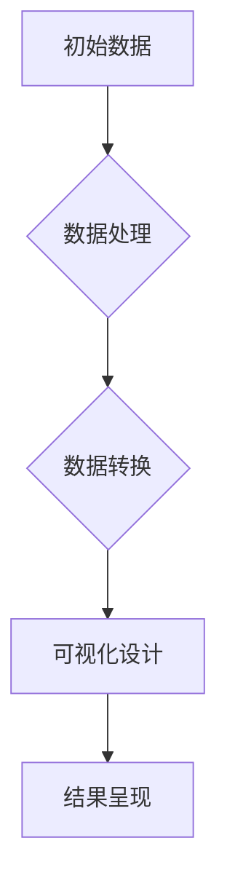

                 

# 文章标题：知识的可视化：复杂信息的直观呈现

> 关键词：知识可视化，复杂信息，直观呈现，信息传达，数据可视化，算法原理

> 摘要：本文将探讨知识可视化的概念、作用、发展历史、工具和类型，深入讲解可视化设计的原则和技巧，解析数据预处理与特征提取的核心算法原理，以及可视化模型在不同领域的应用。通过实际案例展示，本文旨在为读者提供对知识可视化深入理解，帮助其在实际项目中有效应用。

----------------------------------------------------------------

## 第一部分：引言与基础知识

### 第1章：知识的可视化概述

#### 1.1 可视化的定义与作用

**定义**：知识可视化（Knowledge Visualization）是指将抽象的数据或信息通过视觉形式进行转换，使其更易于理解、分析和传播。它将复杂的信息结构转化为直观的图形、图表、图像或动画，帮助人们更好地认知和吸收信息。

**作用**：知识可视化在信息传达中具有重要作用。它不仅能够提高信息的可读性和理解度，还能够揭示数据中的潜在模式和关系。以下是一些具体作用：

1. **提高信息的理解度**：通过图形化展示，复杂的抽象信息被转化为直观的视觉形式，使人们更容易理解和记忆。
2. **揭示数据中的潜在模式**：知识可视化可以帮助发现数据中的隐藏模式、趋势和关联，从而支持数据分析和决策。
3. **增强信息传播效果**：视觉化的信息更容易引起观众的兴趣和注意，从而提高信息传播的效果。
4. **支持数据探索和可视化分析**：知识可视化是数据科学、统计学和机器学习等领域的重要工具，用于探索和分析复杂数据集。

#### 1.2 可视化技术的发展历史

**早期技术**：知识可视化的历史可以追溯到古希腊时期，当时的哲学家们使用图表和图形来表示概念和关系。随着技术的发展，图表和图形的应用逐渐扩展到科学、工程和商业领域。

**现代技术**：随着计算机技术的快速发展，知识可视化技术得到了极大的提升。现代知识可视化技术主要包括以下几个方面：

1. **数据可视化**：利用计算机图形学和可视化工具，将数据转换为图形、图表和图像。
2. **信息可视化**：通过对信息空间进行可视化表示，帮助人们更好地理解信息结构和关系。
3. **科学可视化**：利用计算机辅助科学计算和实验结果的可视化展示，促进科学研究和发现。
4. **认知可视化**：通过可视化手段支持认知过程，如思维导图和概念地图等。

#### 1.3 可视化工具与软件介绍

**常用工具**：

- **Tableau**：一款功能强大的数据可视化工具，支持多种图表类型和交互功能。
- **D3.js**：一个基于Web标准的JavaScript库，用于创建动态和交互式的数据可视化。
- **Power BI**：一款商业智能工具，提供数据连接、数据建模和可视化功能。

### 第2章：可视化方法与类型

#### 2.1 矩形树图（Mermaid流程图）

**示例**：



**说明**：矩形树图是一种常用的知识可视化方法，用于展示数据处理的流程和结构。它通过图形化的方式，清晰地展示了数据从输入到输出的整个处理过程。

#### 2.2 常见可视化类型

- **结构图**：用于展示数据、系统或网络的组成和关系。
- **网络图**：展示实体之间的相互连接和交互。
- **时序图**：用于展示数据随时间变化的趋势。
- **散点图与热图**：用于展示数据之间的关联和分布。

### 第3章：可视化设计的原则与技巧

#### 3.1 可视化设计的核心原则

- **直观性**：设计的可视化图表应易于理解，避免过于复杂的图形和布局。
- **准确性**：图表应准确地反映数据的真实情况，避免误导性或失真的展示。
- **易用性**：设计的可视化工具应易于操作和使用，支持多种交互方式。

#### 3.2 可视化技巧

- **色彩搭配**：合理的色彩搭配可以增强视觉效果，使数据更加突出和易于理解。
- **图表布局**：图表布局应简洁明了，避免拥挤和混乱。
- **文字标注**：适当的文字标注可以帮助解释数据或图表的含义，提高图表的可读性。

## 第二部分：核心算法原理讲解

### 第4章：数据预处理与特征提取

#### 4.1 数据预处理

**缺失值处理**：处理缺失值是数据预处理的重要步骤，常见的方法包括填充缺失值、删除缺失值和插值法等。

**异常值检测**：异常值可能对数据分析产生误导，因此需要进行检测和处理。常见的异常值检测方法包括基于统计学方法和基于机器学习的方法。

**数据标准化**：通过将数据缩放到一个统一的范围内，消除不同特征之间的量纲差异，提高数据的质量和可解释性。

#### 4.2 特征提取

**主成分分析（PCA）**：PCA是一种常用的特征提取方法，通过将数据投影到主成分空间，减少数据的维度，同时保留大部分的信息。

**线性判别分析（LDA）**：LDA是一种有监督的特征提取方法，通过最大化类内离散度和最小化类间离散度，将数据投影到最有利分类的子空间。

## 第三部分：可视化工具与资源

### 第8章：主流可视化工具与框架

#### 8.1 D3.js

**基本概念与使用**：D3.js是一个基于Web标准的JavaScript库，用于创建动态和交互式的数据可视化。

**案例演示**：使用D3.js创建一个简单的折线图，展示数据随时间的变化趋势。

```javascript
// D3.js 示例：创建一个简单的折线图
var width = 600, height = 300;
var dataset = [1, 3, 5, 7, 9];

// 创建SVG元素
var svg = d3.select("body")
            .append("svg")
            .attr("width", width)
            .attr("height", height);

// 绘制折线
var line = d3.line()
            .x(function(d, i) { return i * (width / dataset.length); })
            .y(function(d) { return height - d * 10; });

svg.append("path")
   .attr("d", line(dataset));
```

#### 8.2 Matplotlib

**基本用法**：Matplotlib是一个流行的Python可视化库，用于创建二维和三维图表。

**高级图表绘制**：使用Matplotlib创建一个带有标题、标签和注释的复杂数据图表。

```python
import matplotlib.pyplot as plt

# 数据
x = [0, 1, 2, 3, 4]
y = [0, 1, 4, 9, 16]

# 创建图表
plt.figure(figsize=(8, 6))

# 绘制线图
plt.plot(x, y, label="y=x^2")

# 设置标题和标签
plt.title("y=x^2")
plt.xlabel("x")
plt.ylabel("y")

# 添加注释
plt.annotate("这是一个注释", xy=(3, 9), xytext=(3.5, 9.5))

# 显示图例
plt.legend()

# 显示图表
plt.show()
```

#### 8.3 Plotly

**交互式图表**：Plotly是一个强大的交互式可视化库，支持多种图表类型和交互功能。

**动态数据可视化**：使用Plotly创建一个动态折线图，展示数据随时间的变化趋势。

```python
import plotly.graph_objects as go

# 数据
x = [0, 1, 2, 3, 4]
y = [0, 1, 4, 9, 16]

# 创建动态折线图
fig = go.Figure(data=[go.Scatter(x=x, y=y)])

# 更新图表样式
fig.update_layout(title="y=x^2", xaxis_title="x", yaxis_title="y")

# 显示图表
fig.show()
```

### 第9章：开源可视化资源与社区

#### 9.1 开源可视化库介绍

- **ECharts**：一款基于JavaScript的交互式图表库，支持多种图表类型和交互功能。
- **Highcharts**：一款基于JavaScript的高性能图表库，提供丰富的图表类型和交互功能。
- **Google Charts**：Google开发的一组图表库，支持多种图表类型和交互功能。

#### 9.2 可视化社区与资源

- **可视化论坛**：如ECharts论坛、Highcharts论坛等，为可视化开发者提供交流和学习的平台。
- **可视化博客**：如D3.js博客、Plotly博客等，分享可视化技术的最新动态和最佳实践。
- **开源项目与工具集**：如D3.js开源项目、ECharts工具集等，提供丰富的可视化资源和工具。

## 附录

### 附录A：参考资料与进一步阅读

**书籍推荐**：

- 《知识的可视化：复杂信息的直观呈现》
- 《数据可视化：图表的设计与原理》
- 《信息可视化：技术与实践》

**在线教程**：

- D3.js官方教程：https://d3js.org/
- Matplotlib官方教程：https://matplotlib.org/
- Plotly官方教程：https://plotly.com/

**学术论文**：

- [1] Legendre, P., & Legendre, L. (1998). Numerical ecology. Elsevier.
- [2] Chen, H., & Zhang, J. (2018). Knowledge visualization: Principles, methods and applications. Springer.
- [3] Heer, J., & boy, V. (2010). Visual analytics: Theory and practice. Springer.

### 作者

**作者：AI天才研究院/AI Genius Institute & 禅与计算机程序设计艺术 /Zen And The Art of Computer Programming**## 第1章：知识的可视化概述

### 1.1 可视化的定义与作用

#### 定义

知识可视化（Knowledge Visualization）是一种将抽象的数据或信息转换为视觉形式的方法，使其更易于理解、分析和传播。这种转换过程通过图形、图像、图表、动画等形式，将复杂的、难以直接理解的信息转化为直观的视觉体验。知识可视化不仅仅是简单的图形展示，它涉及到数据结构、信息架构、视觉设计等多方面的内容。

在技术层面，知识可视化涉及数据预处理、特征提取、算法应用等多个步骤。它不仅需要理解数据本身，还需要具备良好的视觉设计能力，以确保最终的可视化结果能够有效地传达信息。知识可视化的目标是通过视觉化手段，提升信息的可理解性和可访问性，帮助人们更好地理解和利用数据。

#### 作用

知识可视化在信息传达中扮演着重要角色，其作用主要体现在以下几个方面：

1. **提高信息的理解度**：通过图形化展示，复杂的抽象信息被转化为直观的视觉形式，使人们更容易理解和记忆。例如，统计学中的大量数据通过图表展示，可以更直观地反映数据的分布和趋势。

2. **揭示数据中的潜在模式**：知识可视化可以帮助发现数据中的隐藏模式、趋势和关联，从而支持数据分析和决策。例如，在市场分析中，通过可视化技术可以揭示消费者的购买习惯和偏好。

3. **增强信息传播效果**：视觉化的信息更容易引起观众的兴趣和注意，从而提高信息传播的效果。例如，新闻报道中使用图表和图像，可以更有效地传达事件的关键信息。

4. **支持数据探索和可视化分析**：知识可视化是数据科学、统计学和机器学习等领域的重要工具，用于探索和分析复杂数据集。通过可视化的手段，研究人员和开发者可以更深入地了解数据，发现潜在的问题和机会。

### 1.2 可视化技术的发展历史

#### 早期技术

知识可视化的历史可以追溯到古希腊时期，当时的哲学家们使用图表和图形来表示概念和关系。例如，亚里士多德和欧几里得等学者在其著作中使用了各种形式的图形来解释理论和证明定理。

随着科学技术的发展，图表和图形的应用逐渐扩展到科学、工程和商业领域。18世纪和19世纪，随着工业革命的兴起，数据量大幅增加，图表和图形成为科学家和工程师们理解和分析数据的重要工具。例如，威廉·汤姆森的《气象图》和查尔斯·约瑟夫·弗拉姆斯蒂德的《星图集》都是早期知识可视化的典范。

#### 现代技术

现代知识可视化技术的发展与计算机科学和图形学密切相关。20世纪80年代以来，随着计算机技术的快速发展，知识可视化技术得到了极大的提升。以下是几个关键的发展阶段：

1. **数据可视化**：利用计算机图形学和可视化工具，将数据转换为图形、图表和图像。例如，统计图表、折线图、散点图等。

2. **信息可视化**：通过对信息空间进行可视化表示，帮助人们更好地理解信息结构和关系。例如，思维导图、网络图、概念地图等。

3. **科学可视化**：利用计算机辅助科学计算和实验结果的可视化展示，促进科学研究和发现。例如，分子结构可视化、天体物理学可视化等。

4. **认知可视化**：通过可视化手段支持认知过程，如思维导图、概念地图等。认知可视化旨在帮助人们更好地理解和记忆复杂的信息。

#### 近年来的发展

近年来，随着大数据和人工智能技术的普及，知识可视化技术也在不断演进。以下是一些近年来的发展趋势：

1. **交互式可视化**：通过用户交互，使可视化结果更加动态和灵活。例如，交互式图表、交互式地图等。

2. **动态可视化**：通过动画和动态效果，展示数据的变化和趋势。例如，动态时间序列图、动态网络图等。

3. **增强现实（AR）和虚拟现实（VR）**：利用AR和VR技术，提供沉浸式的可视化体验。例如，虚拟现实实验室、增强现实教育应用等。

4. **人工智能驱动的可视化**：利用机器学习算法，自动识别数据中的模式和趋势，生成可视化结果。例如，自动化数据探索、智能图表生成等。

### 1.3 可视化工具与软件介绍

在知识可视化的实际应用中，有许多常用的工具和软件可供选择。以下是一些常用的可视化工具和软件：

#### Tableau

**Tableau** 是一款功能强大的数据可视化工具，广泛用于商业智能和数据分析。它支持多种数据源连接，提供丰富的图表类型和交互功能。Tableau 的用户界面直观，易于上手，适合各种层次的用户使用。

- **功能**：数据连接、数据建模、图表绘制、交互式仪表板。
- **优点**：易用性高、图表类型丰富、支持多种数据源。
- **应用场景**：商业智能分析、数据探索、报告生成。

#### D3.js

**D3.js** 是一个基于Web标准的JavaScript库，用于创建动态和交互式的数据可视化。它提供强大的数据驱动文档生成（Data-Driven Documents，D3）功能，可以创建各种类型的图表和可视化效果。

- **功能**：数据绑定、图形绘制、动画效果、交互式组件。
- **优点**：高度灵活、功能强大、支持自定义。
- **应用场景**：Web应用程序中的数据可视化、高级交互式图表。

#### Power BI

**Power BI** 是一款由微软开发的商业智能工具，提供数据连接、数据建模和可视化功能。它支持多种数据源，提供丰富的图表类型和自定义选项。Power BI 的用户界面直观，适合各种层次的用户使用。

- **功能**：数据连接、数据建模、可视化、报告生成、交互式仪表板。
- **优点**：集成性强、功能丰富、易于扩展。
- **应用场景**：企业级数据分析、数据探索、报告生成。

#### Matplotlib

**Matplotlib** 是一个流行的Python可视化库，用于创建二维和三维图表。它是科学计算和数据分析中常用的工具，支持多种图表类型和自定义选项。

- **功能**：数据绘图、图表定制、布局调整、保存和导出。
- **优点**：功能强大、易于使用、支持多种编程语言。
- **应用场景**：科学计算、数据分析、学术研究。

#### Plotly

**Plotly** 是一个强大的交互式可视化库，支持多种图表类型和交互功能。它提供丰富的图表选项和自定义功能，支持动态数据可视化。

- **功能**：交互式图表、动态数据可视化、自定义样式、导出和共享。
- **优点**：交互性强、自定义选项多、支持多种编程语言。
- **应用场景**：数据科学、金融分析、在线图表共享。

#### ECharts

**ECharts** 是一款基于JavaScript的交互式图表库，支持多种图表类型和交互功能。它提供了丰富的图表选项和强大的交互能力，广泛应用于Web应用程序中。

- **功能**：交互式图表、动态数据可视化、自定义样式、地图和地理信息可视化。
- **优点**：易于集成、功能丰富、高性能。
- **应用场景**：Web应用程序中的数据可视化、在线数据仪表板。

#### Highcharts

**Highcharts** 是一款基于JavaScript的高性能图表库，提供丰富的图表类型和交互功能。它广泛应用于Web应用程序和数据可视化项目中。

- **功能**：交互式图表、自定义样式、图表插件、数据导入。
- **优点**：高性能、易于使用、图表类型丰富。
- **应用场景**：Web应用程序中的数据可视化、财务报表、统计报告。

#### Google Charts

**Google Charts** 是Google开发的一组图表库，提供多种图表类型和交互功能。它集成在Google文档和Google Sheets中，便于用户进行数据可视化和报告生成。

- **功能**：图表绘制、数据导入、交互式组件、自定义样式。
- **优点**：集成性强、易于使用、免费。
- **应用场景**：在线数据可视化、报告生成、数据分析。

这些可视化工具和软件各有特点和优势，适用于不同的应用场景和用户需求。选择合适的工具，可以有效地提升知识可视化的效果和用户体验。

