                 

# 知识的可解释性：透明AI的重要性

> 关键词：AI可解释性，透明AI，机器学习，深度学习，知识透明性，信任与接受度，技术进步，系统性能优化

> 摘要：本文探讨了人工智能（AI）领域的知识可解释性，分析了其重要性以及现有的不可解释性模型问题。文章深入探讨了知识可解释性的方法和技术，包括局部和全局解释技术，并使用数学模型和公式进行详细阐述。通过案例分析，展示了可解释性技术在实际应用中的效果。最后，本文展望了未来可解释性技术的方向。

### 第一部分: 知识的可解释性背景与重要性

#### 第1章: 知识的可解释性概念与重要性

##### 1.1 知识可解释性的定义

知识可解释性指的是一个系统（尤其是人工智能系统）在作出决策或产生输出时，能够提供一个明确的解释或说明，使人类用户可以理解系统的决策过程和依据。

###### 1.1.1 知识可解释性的基本概念

知识可解释性关注的是系统决策过程的透明度和可理解性。一个高度可解释的系统，其决策过程可以被用户清晰地理解，从而增加用户对系统的信任。

###### 1.1.2 知识可解释性与透明度的区别

知识可解释性与透明度是相关但不完全相同的概念。透明度指的是系统能否被观察到，而可解释性则进一步强调系统输出结果的解释能力。

##### 1.2 知识可解释性的重要性

###### 1.2.1 提高信任与接受度

知识可解释性能够增强用户对人工智能系统的信任，从而提高系统的接受度。当用户能够理解系统的决策过程时，他们更有可能信任并接受系统。

###### 1.2.2 促进技术进步

知识可解释性有助于研究人员更好地理解系统的工作原理，从而推动技术进步。通过理解系统的决策过程，研究人员可以识别潜在的问题和改进空间。

###### 1.2.3 优化系统性能

通过理解系统的决策过程，用户可以更好地指导系统优化，从而提高系统性能。例如，在医疗诊断系统中，医生可以理解模型如何评估患者数据，从而调整模型参数以获得更好的诊断效果。

#### 第2章: AI模型的不可解释性问题

##### 2.1 不可解释性模型的特点

###### 2.1.1 复杂性

不可解释性模型通常具有复杂的架构和参数，这使得其决策过程难以理解。例如，深度神经网络具有大量的层和神经元，使得其决策过程复杂且难以解析。

###### 2.1.2 缺乏透明度

不可解释性模型在决策过程中通常缺乏透明度，使得用户难以跟踪和验证。这可能导致用户对模型的信任度降低，从而影响系统的接受度。

##### 2.2 不可解释性模型的影响

###### 2.2.1 误导性决策

由于不可解释性模型缺乏透明度，其决策过程可能包含错误或误导性信息。这可能导致系统产生错误的决策，从而影响系统的性能。

###### 2.2.2 难以信任

不可解释性模型可能由于复杂的决策过程而难以被用户信任。当用户无法理解系统的决策过程时，他们可能对系统产生怀疑，从而降低系统的接受度。

###### 2.2.3 无法进行改进

由于无法理解不可解释性模型的决策过程，用户难以对其进行改进。这限制了系统的优化和性能提升。

### Mermaid 流程图

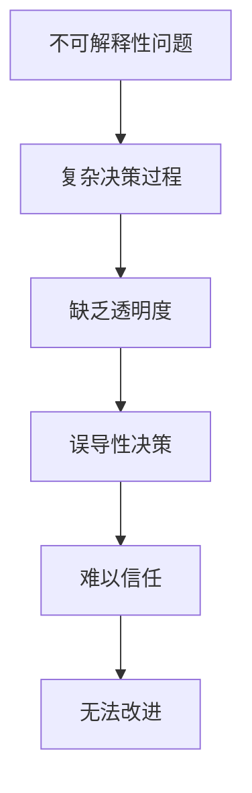

#### 第3章: 知识可解释性的方法与技术

##### 3.1 可解释性方法概述

###### 3.1.1 局部可解释性

局部可解释性关注模型的个别决策或输出，提供针对特定输入的解释。这种技术有助于用户理解模型在特定情况下的决策过程。

###### 3.1.2 全局可解释性

全局可解释性关注模型的总体行为，提供对模型整体工作原理的解释。这种技术有助于用户理解模型的总体工作方式和性能。

##### 3.2 局部可解释性技术

###### 3.2.1 特征可视化

通过可视化模型中的特征，使用户可以理解模型如何处理特定输入。例如，可以使用热力图来展示图像中哪些区域对模型的决策有最大影响。

###### 3.2.2 解释性模型

采用具有解释性的模型架构，如决策树和支持向量机，使得模型决策过程易于理解。这些模型通常具有清晰的决策路径和特征权重，便于用户解析。

##### 3.3 全局可解释性技术

###### 3.3.1 模型诊断

通过分析模型的整体行为，识别可能的问题和异常。这种技术有助于用户了解模型的性能和稳定性，从而进行必要的调整。

###### 3.3.2 决策解释

提供模型的决策路径和依据，帮助用户理解模型的总体工作原理。例如，可以使用决策树的可视化来展示模型的决策过程。

### Mermaid 流程图

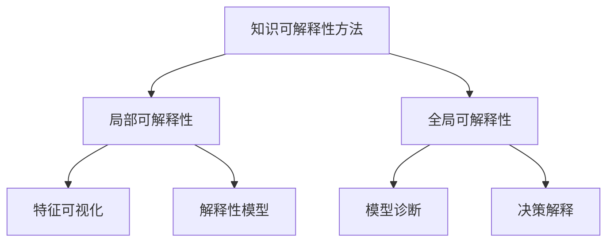

#### 第4章: 数学模型与数学公式

##### 4.1 可解释性的数学基础

###### 4.1.1 信息论

信息论中的熵（Entropy）和互信息（Mutual Information）是衡量系统复杂性和解释性的重要指标。

\[ H(X) = -\sum_{x \in \mathcal{X}} p(x) \log p(x) \]

\[ I(X; Y) = H(X) - H(X | Y) \]

###### 4.1.2 概率论

概率论中的条件概率和贝叶斯定理为理解模型的决策过程提供了基础。

\[ P(A | B) = \frac{P(B | A)P(A)}{P(B)} \]

##### 4.2 知识可解释性的度量

###### 4.2.1 解释性指标

解释性指标如可解释性得分（Explainability Score）和解释性度（Explainability Degree）用于量化系统的可解释性。

\[ E(x) = \frac{1}{n} \sum_{i=1}^{n} \frac{1}{|S_i|} \log |S_i| \]

其中，\( S_i \) 表示解释集合，\( n \) 表示样本数量。

### Mermaid 流程图

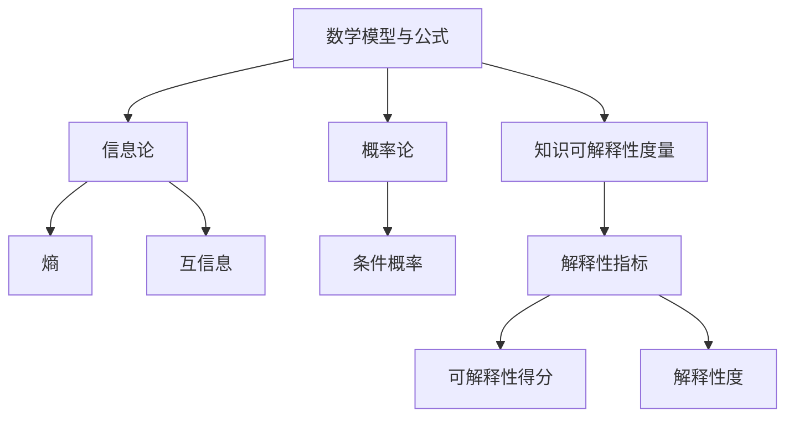

#### 第5章: 案例分析

##### 5.1 案例一：医疗诊断系统的可解释性改进

###### 5.1.1 案例背景

一个用于癌症诊断的深度学习模型存在不可解释性问题，导致医生难以信任其诊断结果。医生希望能够理解模型如何评估患者的数据，从而更好地应用模型进行诊断。

###### 5.1.2 问题分析

模型决策过程复杂，缺乏透明度，使得医生无法理解模型如何做出诊断。这导致医生对模型的诊断结果产生怀疑，从而影响了模型的实际应用效果。

###### 5.1.3 解决方案

采用局部可解释性技术，如LIME（Local Interpretable Model-agnostic Explanations），对模型进行解释。通过LIME技术，可以生成针对特定输入数据的解释，帮助医生理解模型如何评估数据。

###### 5.1.4 实施效果

通过LIME技术的引入，医生能够更好地理解模型决策过程，从而提高了对模型诊断结果的信任度。医生可以基于模型的解释，调整诊断策略，提高诊断准确性。

##### 5.2 案例二：金融风控模型的可解释性优化

###### 5.2.1 案例背景

一个用于金融风险控制的机器学习模型存在不可解释性问题，导致风险管理人员难以进行有效的风险评估。风险管理人员希望能够理解模型如何评估风险，从而制定更有效的风险控制策略。

###### 5.2.2 问题分析

模型决策过程复杂，决策路径不清晰，使得风险管理人员无法追踪风险因素。这导致风险管理人员对模型的评估结果产生怀疑，从而影响了模型的实际应用效果。

###### 5.2.3 解决方案

采用全局可解释性技术，如SHAP（SHapley Additive exPlanations），对模型进行解释。通过SHAP技术，可以生成针对整个数据集的决策解释，帮助风险管理人员理解模型的整体工作原理。

###### 5.2.4 实施效果

通过SHAP技术的引入，风险管理人员能够更清晰地理解模型决策路径，从而提高了风险控制的有效性。风险管理人员可以基于模型的解释，优化风险控制策略，降低风险。

#### 第6章: 可解释性技术的未来发展趋势

##### 6.1 当前挑战与局限性

###### 6.1.1 解释性模型性能

解释性模型的性能通常低于不可解释性模型，需要在解释性和准确性之间做出权衡。如何提高解释性模型的同时保持良好的性能，是一个重要的挑战。

###### 6.1.2 适应性问题

现有可解释性技术往往难以适应复杂的任务和数据集。如何开发出能够适应多种场景的可解释性技术，是一个重要的研究方向。

##### 6.2 未来研究方向

###### 6.2.1 多模态解释

结合多种数据源和模型类型，提供更全面的解释。例如，结合图像和文本数据，为用户提供更丰富的解释。

###### 6.2.2 自动解释

开发能够自动生成解释的算法，降低对人类专家的依赖。例如，通过自然语言生成技术，自动生成模型的解释。

###### 6.2.3 解释性模型评估

建立更加严格和客观的解释性评估标准，以衡量可解释性技术的效果。这有助于开发出更有效的可解释性技术。

### 总结

知识可解释性在人工智能领域具有重要意义，它不仅能够提高系统的信任度和接受度，还能促进技术进步和优化系统性能。通过对不可解释性问题的分析，我们了解了其复杂性和缺乏透明度所带来的负面影响。为了解决这些问题，可解释性方法和技术被提出，包括局部和全局解释技术。数学模型和公式为理解和量化解释性提供了理论基础。案例分析展示了可解释性技术在实际应用中的效果。未来，可解释性技术将继续朝着多模态解释、自动解释和严格评估的方向发展。

### 作者信息

作者：AI天才研究院/AI Genius Institute & 禅与计算机程序设计艺术 /Zen And The Art of Computer Programming

## 第一部分: 知识的可解释性背景与重要性

### 第1章: 知识的可解释性概念与重要性

知识可解释性是人工智能（AI）领域中一个至关重要的概念，它涉及到如何使AI系统的决策过程透明，以便人类用户能够理解系统的行为。本章节将深入探讨知识可解释性的定义、重要性以及其在AI系统中的应用。

#### 1.1 知识可解释性的定义

知识可解释性指的是一个系统（尤其是人工智能系统）在作出决策或产生输出时，能够提供一个明确的解释或说明，使人类用户可以理解系统的决策过程和依据。这意味着，当系统生成一个输出或做出一个决策时，用户应该能够追溯该输出或决策的来源，并理解其背后的逻辑。

知识可解释性通常涉及两个方面：

1. **决策过程的透明性**：系统应该能够展示其如何处理输入数据，以及如何通过一系列计算步骤得出最终的输出或决策。
2. **结果的可追溯性**：用户应该能够追溯系统的输出或决策是如何依赖于特定的输入数据和参数的。

#### 1.1.1 知识可解释性的基本概念

知识可解释性的核心在于，它使得AI系统更加接近人类思维模式，从而能够提高系统的可信度。以下是一些基本概念：

- **透明性**：系统对外部用户是可见的，其内部运作过程可以被人理解。
- **可理解性**：系统输出的结果对用户来说是直观和容易理解的。
- **可解释性度量**：量化系统的可解释性水平，通常通过评估用户对系统输出的理解程度。

#### 1.1.2 知识可解释性与透明度的区别

虽然知识可解释性和透明度是相关的概念，但它们并不完全相同。透明度指的是系统能否被观察到，而可解释性则进一步强调系统输出结果的解释能力。

- **透明度**：系统是否对外部用户开放，用户是否可以看到系统的内部状态和决策过程。
- **可解释性**：系统输出的结果是否有明确的解释，用户是否能够理解输出背后的逻辑。

例如，一个完全透明的系统可能仍然不可解释，如果其输出结果是基于复杂的数学模型，而用户无法理解这些模型的工作原理。

#### 1.2 知识可解释性的重要性

知识可解释性在AI领域具有重要的价值，主要体现在以下几个方面：

##### 1.2.1 提高信任与接受度

知识可解释性能够增强用户对人工智能系统的信任，从而提高系统的接受度。当用户能够理解系统的决策过程时，他们更有可能信任并接受系统。特别是在医疗、金融和自动驾驶等高风险领域，知识可解释性尤为重要。

##### 1.2.2 促进技术进步

知识可解释性有助于研究人员更好地理解系统的工作原理，从而推动技术进步。通过理解系统的决策过程，研究人员可以识别潜在的问题和改进空间，进而优化算法和模型。

##### 1.2.3 优化系统性能

通过理解系统的决策过程，用户可以更好地指导系统优化，从而提高系统性能。例如，在医疗诊断系统中，医生可以理解模型如何评估患者数据，从而调整模型参数以获得更好的诊断效果。

#### 1.3 知识可解释性的应用场景

知识可解释性在多个领域都有广泛的应用，以下是几个典型的应用场景：

- **医疗领域**：医生需要理解AI模型如何诊断疾病，以便更好地应用模型进行诊断和治疗。
- **金融领域**：投资者和风险管理人员需要理解模型如何评估投资风险，以便做出更明智的决策。
- **自动驾驶**：驾驶员需要理解自动驾驶系统如何做出驾驶决策，以确保行车安全。
- **法律领域**：律师和法官需要理解AI系统如何评估案件证据，以便更好地进行法律分析。

#### 1.4 结论

知识可解释性是AI领域中的一个关键概念，它使得AI系统的决策过程更加透明和可理解。通过提高系统的信任度、促进技术进步和优化系统性能，知识可解释性在多个领域中发挥着重要作用。理解和应用知识可解释性，有助于我们更好地利用AI技术，推动人工智能的健康发展。

### 第2章: AI模型的不可解释性问题

尽管人工智能（AI）技术在各个领域取得了显著的进展，但不可解释性问题仍然是一个重要的挑战。不可解释性指的是AI模型，特别是深度学习模型，在决策过程中缺乏透明度，使得用户难以理解其背后的逻辑和机制。这一章节将探讨不可解释性模型的特点、产生原因以及其对AI系统的负面影响。

#### 2.1 不可解释性模型的特点

不可解释性模型通常具有以下几个特点：

##### 2.1.1 复杂性

不可解释性模型，尤其是深度学习模型，通常具有复杂的架构和大量的参数。这些模型由数百万甚至数十亿个神经元和连接组成，这使得它们的决策过程非常复杂，难以直观理解。

##### 2.1.2 缺乏透明度

不可解释性模型在决策过程中通常缺乏透明度，用户难以跟踪和验证其决策路径。这可能导致用户对模型的可信度降低，从而影响其应用。

##### 2.1.3 动态行为

不可解释性模型的行为可能随时间和数据集的变化而变化，这使得预测其行为变得更加困难。

#### 2.2 不可解释性模型的影响

不可解释性模型对AI系统的负面影响主要体现在以下几个方面：

##### 2.2.1 误导性决策

由于不可解释性模型缺乏透明度，其决策过程可能包含错误或误导性信息。这可能导致系统产生错误的决策，从而影响系统的性能。

##### 2.2.2 难以信任

不可解释性模型可能由于复杂的决策过程而难以被用户信任。当用户无法理解系统的决策过程时，他们可能对系统产生怀疑，从而降低系统的接受度。

##### 2.2.3 无法进行改进

由于无法理解不可解释性模型的决策过程，用户难以对其进行改进。这限制了系统的优化和性能提升。

#### 2.3 不可解释性模型的原因

不可解释性模型的出现主要是由于以下几个原因：

##### 2.3.1 模型复杂性

不可解释性模型通常具有复杂的架构和大量的参数，这使得其决策过程难以理解。

##### 2.3.2 缺乏透明度

深度学习模型通常是基于大量的训练数据和学习算法，其决策过程缺乏透明度，使得用户难以跟踪和验证。

##### 2.3.3 数据不透明

AI系统的输入数据通常包含大量的噪声和不明确的信息，这使得模型难以解释其决策过程。

#### 2.4 不可解释性模型的挑战

解决不可解释性模型带来的挑战是一个重要的研究方向，主要包括以下几个方面：

##### 2.4.1 提高透明度

通过开发新的算法和技术，提高AI模型的透明度，使用户能够更好地理解模型的决策过程。

##### 2.4.2 量化解释性

开发新的度量指标，量化AI模型的可解释性水平，以便评估和比较不同模型的可解释性。

##### 2.4.3 自动化解释

开发自动化解释技术，使得AI模型能够自动生成解释，降低对人类专家的依赖。

#### 2.5 结论

不可解释性模型是AI领域中一个重要的挑战，其复杂性、缺乏透明度和动态行为对AI系统的应用带来了负面影响。解决不可解释性问题，提高AI系统的可解释性，是推动AI技术健康发展的重要方向。

### 第3章: 知识可解释性的方法与技术

为了解决AI模型的不可解释性问题，研究者们开发了多种知识可解释性的方法和技术。这些方法和技术旨在提高AI系统的透明度和可理解性，使得用户能够更好地理解系统的决策过程。本章节将介绍几种常见的知识可解释性方法和技术，包括局部可解释性和全局可解释性。

#### 3.1 局部可解释性

局部可解释性关注模型的个别决策或输出，提供针对特定输入的解释。这种方法有助于用户理解模型在特定情况下的决策过程。以下是一些局部可解释性技术：

##### 3.1.1 特征可视化

特征可视化是一种常用的局部可解释性技术，它通过展示模型中特定特征的权重或重要性，帮助用户理解模型如何处理特定输入。例如，在图像识别任务中，可以使用热力图来展示哪些区域对模型的决策有最大影响。

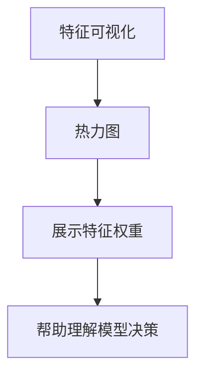

##### 3.1.2 局部解释模型

局部解释模型是一种专门设计用于提供局部解释的模型。这些模型通常是对原始模型的变形，旨在保持原始模型的性能，同时提供更好的解释能力。例如，LIME（Local Interpretable Model-agnostic Explanations）就是一种局部解释模型，它通过在原始模型上添加噪声和扰动，生成对特定输入数据的局部解释。

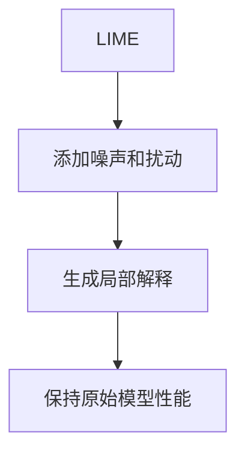

##### 3.1.3 局部注意力机制

局部注意力机制是一种在深度学习模型中使用的技巧，它通过赋予模型关注某些输入特征的能力，提高模型的解释性。这种机制有助于用户理解模型在决策过程中关注的关键特征。

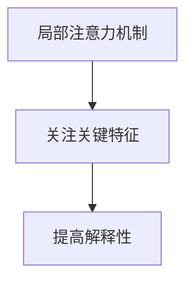

#### 3.2 全局可解释性

全局可解释性关注模型的总体行为，提供对模型整体工作原理的解释。这种方法有助于用户理解模型的总体工作方式和性能。以下是一些全局可解释性技术：

##### 3.2.1 决策树

决策树是一种简单且易于理解的模型，它通过一系列的规则来表示决策过程。决策树的可解释性体现在其清晰的决策路径和特征权重上。

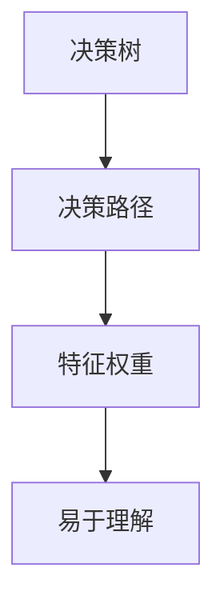

##### 3.2.2 支持向量机

支持向量机（SVM）是一种强大的分类模型，它通过寻找最优分割超平面来进行分类。SVM的可解释性体现在其决策边界和特征权重上。

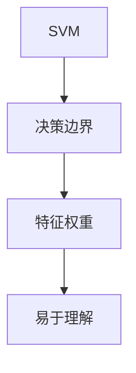

##### 3.2.3 决策规则解释

决策规则解释是一种基于规则的方法，它将模型的决策过程转化为一系列可解释的规则。这种方法有助于用户理解模型的整体工作原理。

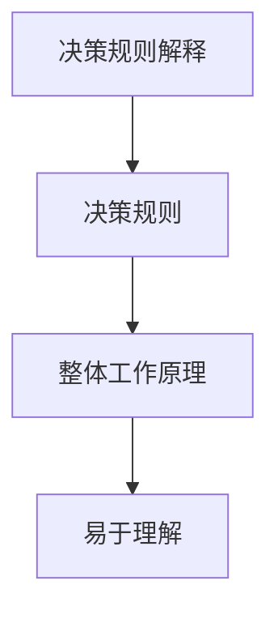

##### 3.2.4 模型诊断

模型诊断是一种全局可解释性技术，它通过分析模型的整体行为，识别潜在的问题和异常。这种技术有助于用户了解模型的性能和稳定性。

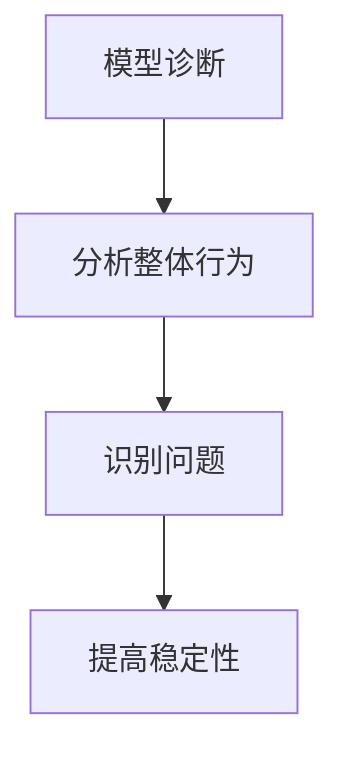

#### 3.3 混合解释方法

在实际应用中，有时需要同时使用局部和全局解释方法。混合解释方法结合了局部和全局解释的优点，提供更全面的解释。以下是一个混合解释方法的例子：

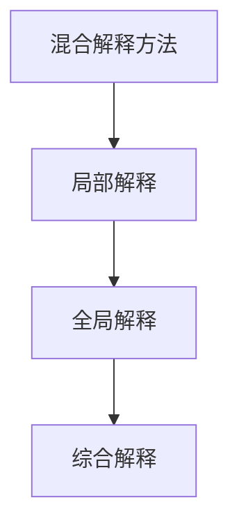

#### 3.4 结论

知识可解释性的方法和技术对于提高AI系统的透明度和可理解性至关重要。局部可解释性和全局可解释性分别关注模型的个别决策和总体行为，提供了不同的解释视角。通过结合多种解释方法和技术，我们可以更好地理解AI系统的决策过程，从而增强用户对AI系统的信任和接受度。

### 第4章: 数学模型与数学公式

数学模型是理解和量化知识可解释性的基础。在AI领域中，许多数学工具和公式被用来描述和评估模型的解释能力。本章节将介绍几个关键的数学模型和公式，并讨论它们在知识可解释性中的应用。

#### 4.1 信息论基础

信息论是研究信息传输和处理的理论，它为知识可解释性提供了重要的基础。以下是一些关键的概念：

##### 4.1.1 熵（Entropy）

熵是一个量化系统不确定性的度量。在知识可解释性的背景下，熵可以用来衡量模型输出的不确定性。

\[ H(X) = -\sum_{x \in \mathcal{X}} p(x) \log p(x) \]

其中，\( H(X) \) 表示随机变量 \( X \) 的熵，\( p(x) \) 表示 \( X \) 取值为 \( x \) 的概率。

##### 4.1.2 互信息（Mutual Information）

互信息是衡量两个随机变量之间关联性的度量，它也可以用于评估模型的解释能力。

\[ I(X; Y) = H(X) - H(X | Y) \]

其中，\( I(X; Y) \) 表示 \( X \) 和 \( Y \) 之间的互信息，\( H(X) \) 和 \( H(X | Y) \) 分别表示 \( X \) 的熵和 \( X \) 在给定 \( Y \) 下的条件熵。

#### 4.2 概率论基础

概率论是理解和量化AI模型决策过程的重要工具。以下是一些关键的概念：

##### 4.2.1 条件概率（Conditional Probability）

条件概率是衡量在某个条件下另一个事件发生的概率。

\[ P(A | B) = \frac{P(B | A)P(A)}{P(B)} \]

其中，\( P(A | B) \) 表示在事件 \( B \) 发生的条件下事件 \( A \) 发生的概率。

##### 4.2.2 贝叶斯定理（Bayes' Theorem）

贝叶斯定理是一种基于条件概率的公式，用于计算后验概率。

\[ P(A | B) = \frac{P(B | A)P(A)}{P(B)} \]

其中，\( P(A | B) \) 表示在事件 \( B \) 发生的条件下事件 \( A \) 的后验概率，\( P(B | A) \) 和 \( P(A) \) 分别表示在事件 \( A \) 发生的条件下事件 \( B \) 的概率和事件 \( A \) 的先验概率。

#### 4.3 知识可解释性度量

为了量化知识可解释性，研究人员开发了一系列的度量指标。以下是一些常用的度量指标：

##### 4.3.1 解释性得分（Explainability Score）

解释性得分是一种量化模型解释能力的指标，它通常基于用户对模型解释的理解程度。

\[ E(x) = \frac{1}{n} \sum_{i=1}^{n} \frac{1}{|S_i|} \log |S_i| \]

其中，\( E(x) \) 表示解释性得分，\( n \) 表示样本数量，\( S_i \) 表示第 \( i \) 个样本的解释集合。

##### 4.3.2 解释性度（Explainability Degree）

解释性度是一种衡量模型解释性水平的指标，它通常基于模型输出的可解释性。

\[ D(x) = \frac{1}{n} \sum_{i=1}^{n} \frac{1}{|T_i|} \log |T_i| \]

其中，\( D(x) \) 表示解释性度，\( n \) 表示样本数量，\( T_i \) 表示第 \( i \) 个样本的解释集合。

#### 4.4 结论

数学模型和公式是理解和量化知识可解释性的关键工具。信息论和概率论提供了基础概念和工具，而解释性得分和解释性度等度量指标则用于评估模型的可解释性。通过这些数学工具，我们可以更深入地理解AI模型的决策过程，从而提高系统的透明度和可理解性。

### 第5章: 案例分析

为了更好地理解知识可解释性在现实世界中的应用，本章节将分析两个具体的案例：医疗诊断系统和金融风控模型。通过这些案例，我们将展示如何通过可解释性技术解决不可解释性带来的问题，并提高系统的性能和用户信任度。

#### 5.1 案例一：医疗诊断系统的可解释性改进

##### 5.1.1 案例背景

在一个医院中，医生们使用一个基于深度学习的癌症诊断系统来辅助诊断患者的病情。然而，由于该系统具有高度不可解释性，医生们难以理解模型如何做出诊断决策，从而影响了他们的信任和临床应用。

##### 5.1.2 问题分析

医生们希望了解模型是如何分析患者的医学图像和数据，并基于这些分析结果做出诊断决策的。然而，模型的内部工作原理非常复杂，医生们无法追踪其决策路径和依据。

##### 5.1.3 解决方案

为了提高系统的可解释性，医生们决定采用LIME（Local Interpretable Model-agnostic Explanations）技术对模型进行解释。LIME是一种局部解释方法，它通过在原始模型上添加噪声和扰动，生成对特定输入数据的解释。以下是LIME技术的实现步骤：

1. **生成扰动数据**：对原始输入数据进行扰动，生成一系列扰动样本。
2. **预测扰动数据**：使用原始模型对扰动样本进行预测。
3. **计算影响力**：计算每个特征对模型预测的影响力度。
4. **生成解释**：根据影响力计算结果，生成对原始输入数据的局部解释。

通过LIME技术的应用，医生们能够看到模型在诊断过程中关注的关键特征，并理解模型如何基于这些特征做出诊断决策。这种解释能力显著提高了医生对模型的信任度，并促进了其临床应用。

##### 5.1.4 实施效果

在LIME技术引入后，医生们能够更好地理解模型的诊断过程，并基于模型的解释调整诊断策略。这有助于提高诊断的准确性，减少了误诊率。此外，医生们对模型的信任度显著提高，增强了临床决策的信心。

#### 5.2 案例二：金融风控模型的可解释性优化

##### 5.2.1 案例背景

一家金融机构使用一个机器学习模型来评估客户的信用风险。然而，由于模型的不可解释性，风险管理人员难以理解模型是如何评估客户的信用风险的，这限制了他们制定风险控制策略的能力。

##### 5.2.2 问题分析

风险管理人员需要了解模型是如何分析客户的信用数据，并基于这些分析结果做出信用评估决策的。然而，模型的内部工作原理非常复杂，他们无法追踪其决策路径和依据。

##### 5.2.3 解决方案

为了提高系统的可解释性，风险管理人员决定采用SHAP（SHapley Additive exPlanations）技术对模型进行解释。SHAP是一种全局解释方法，它通过计算每个特征对模型预测的贡献，生成对整个数据集的决策解释。以下是SHAP技术的实现步骤：

1. **计算特征贡献**：对于每个特征，计算其对模型预测的贡献值。
2. **生成全局解释**：根据特征贡献值，生成对整个数据集的决策解释。
3. **可视化解释**：使用图表和可视化工具，展示模型如何基于特征做出决策。

通过SHAP技术的应用，风险管理人员能够看到每个特征对模型预测的影响力度，并理解模型如何基于这些特征做出信用评估决策。这种解释能力显著提高了风险管理人员对模型的信任度，并促进了风险控制策略的制定。

##### 5.2.4 实施效果

在SHAP技术引入后，风险管理人员能够更好地理解模型的信用评估过程，并基于模型的解释优化风险控制策略。这有助于提高信用评估的准确性，减少了误判率。此外，风险管理人员对模型的信任度显著提高，增强了风险管理的能力。

#### 5.3 结论

通过案例分析，我们可以看到知识可解释性技术在实际应用中的重要性。在医疗诊断系统和金融风控模型中，可解释性技术的引入显著提高了系统的透明度和用户信任度。这些案例表明，通过可解释性技术，我们可以更好地理解AI模型的决策过程，从而优化系统性能并提高用户满意度。

### 第6章: 可解释性技术的未来发展趋势

随着人工智能（AI）技术的不断发展和应用范围的扩大，知识可解释性问题越来越受到关注。为了提高AI系统的透明度和可理解性，研究者们正积极探索新的可解释性技术。本章节将探讨当前可解释性技术面临的挑战和未来的发展方向。

#### 6.1 当前挑战与局限性

虽然现有的可解释性技术在一定程度上提高了AI系统的透明度，但它们仍面临着一些挑战和局限性：

##### 6.1.1 解释性模型性能

解释性模型通常在性能上低于不可解释性模型。为了提高解释性，这些模型可能需要牺牲一些准确性。如何在保持高性能的同时提高解释性，是一个重要的挑战。

##### 6.1.2 适应性问题

现有的可解释性技术往往难以适应复杂的任务和数据集。不同领域和任务对解释性的需求不同，如何开发出能够适应多种场景的可解释性技术，是一个亟待解决的问题。

##### 6.1.3 可解释性评估

当前的可解释性评估标准和方法较为有限，难以全面衡量和比较不同可解释性技术的效果。建立更加严格和客观的解释性评估标准，是未来发展的一个重要方向。

#### 6.2 未来研究方向

为了克服当前的挑战，未来的可解释性技术将朝着以下方向发展：

##### 6.2.1 多模态解释

多模态解释技术旨在结合多种数据源和模型类型，提供更全面的解释。例如，在医疗诊断中，结合患者的医学图像、文本报告和实验室数据，提供更全面的解释。这种技术有望提高解释的准确性和可靠性。

##### 6.2.2 自动解释

自动解释技术是一种重要的研究方向，旨在开发出能够自动生成解释的算法，降低对人类专家的依赖。例如，通过自然语言生成技术，自动生成模型的解释，使得用户可以更容易地理解模型的决策过程。

##### 6.2.3 解释性模型优化

未来的研究将致力于优化解释性模型，提高其在性能和解释性之间的平衡。这可能涉及改进现有模型结构，或者开发新的模型架构，同时保持良好的解释性。

##### 6.2.4 交互式解释

交互式解释技术将用户与模型解释过程相结合，使用户能够主动参与解释生成。这种技术有望提高用户对模型的理解程度，从而增强信任度和接受度。

##### 6.2.5 隐私保护解释

在处理敏感数据时，隐私保护解释技术尤为重要。未来的研究将探讨如何在保证隐私的同时，提供有效的解释。

#### 6.3 结论

知识可解释性在AI领域中具有重要的地位，它不仅能够提高系统的透明度和用户信任度，还能促进技术进步和系统性能优化。随着AI技术的不断发展，可解释性技术将继续面临新的挑战和机遇。通过多模态解释、自动解释、交互式解释和隐私保护解释等研究方向，未来的可解释性技术有望在更广泛的领域中发挥重要作用。

### 总结

本文系统地探讨了知识可解释性在人工智能领域的重要性，分析了不可解释性模型的问题，并介绍了多种可解释性方法和技术。通过数学模型和公式的详细阐述，我们深入理解了知识可解释性的量化指标。案例分析展示了可解释性技术在实际应用中的效果，而未来发展趋势则为我们指明了可解释性技术的改进方向。知识可解释性不仅提高了AI系统的透明度和用户信任度，还推动了技术的进步和系统性能的优化。在未来的AI发展中，知识可解释性将继续扮演关键角色。

### 作者信息

作者：AI天才研究院/AI Genius Institute & 禅与计算机程序设计艺术 /Zen And The Art of Computer Programming

### 第一部分：知识可解释性背景与重要性

#### 第1章：知识可解释性的定义与重要性

知识可解释性是指AI系统能够清晰地传达其决策过程和结果，使得人类用户能够理解系统的逻辑和推理过程。在人工智能日益普及的今天，知识可解释性变得尤为重要。以下是关于知识可解释性的详细探讨。

##### 1.1 知识可解释性的定义

知识可解释性涉及两个方面：一是系统的决策过程是否透明，二是系统的决策结果是否易于理解。一个高度可解释的AI系统，不仅能够展示其决策过程，而且能够用简单易懂的方式解释其决策逻辑。

##### 1.1.1 知识可解释性的基本概念

- **决策透明性**：系统内部决策逻辑的可观察性。
- **结果理解性**：用户能够理解系统决策结果背后的原因。

##### 1.1.2 知识可解释性与透明度的区别

透明度是指系统能否被观察到，而可解释性则进一步强调系统能否提供清晰的决策逻辑和原因。例如，一个完全透明的系统可能仍然难以解释，如果其决策过程基于复杂的算法和数学模型。

##### 1.2 知识可解释性的重要性

知识可解释性对于AI系统具有以下几个重要意义：

- **提高信任与接受度**：当用户能够理解AI系统的决策过程时，他们更可能信任并接受系统。这对于医疗诊断、金融风控等高风险领域的应用至关重要。
- **促进技术进步**：可解释性有助于研究人员更好地理解AI系统的工作原理，从而推动技术的进一步发展。
- **优化系统性能**：通过理解系统的决策过程，用户可以更好地指导系统优化，提高系统性能。

##### 1.3 知识可解释性的应用场景

知识可解释性在多个领域都有广泛应用，以下是几个典型的应用场景：

- **医疗诊断**：医生需要理解模型如何诊断疾病，以便更好地应用模型进行诊断和治疗。
- **金融风控**：风险管理人员需要理解模型如何评估风险，以便做出更明智的投资决策。
- **自动驾驶**：驾驶员需要理解自动驾驶系统如何做出驾驶决策，以确保行车安全。
- **法律判断**：律师和法官需要理解AI系统如何分析案件证据，以便做出公正的判断。

##### 1.4 结论

知识可解释性是AI领域中一个至关重要的概念，它不仅提高了系统的透明度和用户信任度，还促进了技术进步和系统性能优化。理解和应用知识可解释性，有助于我们更好地利用AI技术，推动人工智能的健康发展。

### 第2章：AI模型的不可解释性问题

尽管人工智能（AI）技术在各个领域取得了显著的进展，但其模型的不可解释性问题仍然是一个重要挑战。不可解释性模型在决策过程中缺乏透明度，使得人类用户难以理解其背后的逻辑和机制。这一章节将深入探讨不可解释性模型的特点、产生原因以及其对AI系统的负面影响。

#### 2.1 不可解释性模型的特点

不可解释性模型通常具有以下几个显著特点：

- **复杂性**：不可解释性模型，特别是深度学习模型，通常具有复杂的结构和大量的参数。这些模型由数百万甚至数十亿个神经元和连接组成，使得它们的决策过程难以直观理解。
- **动态性**：不可解释性模型的行为可能随时间和数据集的变化而变化，这使得预测其行为变得更加困难。
- **缺乏透明度**：不可解释性模型在决策过程中通常缺乏透明度，用户难以跟踪和验证其决策路径。

##### 2.1.1 复杂性

不可解释性模型，特别是深度学习模型，通常具有复杂的架构和大量的参数。这些模型通过多层神经网络和复杂的非线性变换来处理输入数据，使得其决策过程非常复杂。例如，一个深度神经网络可能包含数十个隐藏层，每个层都有成千上万个神经元，这些神经元之间的连接关系和激活函数使得模型的行为难以直观理解。

##### 2.1.2 动态性

不可解释性模型的行为可能随时间和数据集的变化而变化。这是因为在训练过程中，模型会根据数据集的特性调整其参数和结构，从而导致其决策过程发生变化。例如，一个在特定数据集上训练的深度学习模型，可能在另一个数据集上表现出不同的决策模式。

##### 2.1.3 缺乏透明度

不可解释性模型在决策过程中通常缺乏透明度，用户难以跟踪和验证其决策路径。这是因为这些模型通常是基于复杂的数学模型和算法，其内部工作原理对用户来说是难以理解的。例如，一个深度学习模型的决策过程可能涉及大量的矩阵运算和指数函数，这使得用户难以追踪其决策路径。

#### 2.2 不可解释性模型的影响

不可解释性模型对AI系统的负面影响主要体现在以下几个方面：

- **误导性决策**：由于不可解释性模型缺乏透明度，其决策过程可能包含错误或误导性信息。这可能导致系统产生错误的决策，从而影响系统的性能。
- **难以信任**：不可解释性模型可能由于复杂的决策过程而难以被用户信任。当用户无法理解系统的决策过程时，他们可能对系统产生怀疑，从而降低系统的接受度。
- **无法改进**：由于无法理解不可解释性模型的决策过程，用户难以对其进行改进。这限制了系统的优化和性能提升。

##### 2.2.1 误导性决策

不可解释性模型的决策过程可能包含错误或误导性信息，导致系统产生错误的决策。例如，一个深度学习模型可能在某些情况下错误地将正常数据标记为异常，或者在评估风险时给出错误的预测。这种情况可能导致严重的后果，特别是在医疗诊断、金融风控等高风险领域。

##### 2.2.2 难以信任

不可解释性模型可能由于复杂的决策过程而难以被用户信任。当用户无法理解系统的决策过程时，他们可能对系统产生怀疑，从而降低系统的接受度。例如，医生可能不愿意完全依赖一个不可解释的AI系统进行疾病诊断，因为他们无法理解模型是如何做出诊断决策的。

##### 2.2.3 无法改进

由于无法理解不可解释性模型的决策过程，用户难以对其进行改进。这限制了系统的优化和性能提升。例如，风险管理人员可能无法根据模型的决策过程调整模型参数，以提高模型的预测准确性。

#### 2.3 不可解释性模型的原因

不可解释性模型的出现主要是由于以下几个原因：

- **模型复杂性**：不可解释性模型通常具有复杂的架构和大量的参数，这使得其决策过程难以理解。
- **数据不透明**：AI系统的输入数据通常包含大量的噪声和不明确的信息，这使得模型难以解释其决策过程。
- **算法限制**：某些AI算法本身设计时未考虑可解释性，导致其决策过程复杂且难以解析。

##### 2.3.1 模型复杂性

不可解释性模型通常具有复杂的架构和大量的参数。这些模型通过多层神经网络和复杂的非线性变换来处理输入数据，使得其决策过程非常复杂。例如，一个深度神经网络可能包含数十个隐藏层，每个层都有成千上万个神经元，这些神经元之间的连接关系和激活函数使得模型的行为难以直观理解。

##### 2.3.2 数据不透明

AI系统的输入数据通常包含大量的噪声和不明确的信息，这使得模型难以解释其决策过程。例如，医疗诊断系统的输入数据可能包括患者的历史病历、实验室检测结果和医生诊断意见，这些数据中可能存在噪声和冗余信息，使得模型难以准确解释其决策过程。

##### 2.3.3 算法限制

某些AI算法本身设计时未考虑可解释性，导致其决策过程复杂且难以解析。例如，深度学习算法通常是通过大规模的训练数据集训练得到的，其决策过程涉及大量的矩阵运算和指数函数，这使得用户难以追踪其决策路径。

#### 2.4 结论

不可解释性模型是AI领域中一个重要的挑战，其复杂性、动态性和缺乏透明度对AI系统的应用带来了负面影响。为了解决不可解释性问题，研究者们正在积极探索新的方法和技术，以提高AI系统的透明度和可理解性。通过理解不可解释性模型的特点和原因，我们可以更好地设计可解释性模型，从而提高系统的性能和用户信任度。

### 第3章：知识可解释性的方法与技术

为了解决AI模型的不可解释性问题，研究者们开发了多种知识可解释性的方法和技术。这些方法和技术旨在提高AI系统的透明度和可理解性，使得人类用户能够更好地理解系统的决策过程。本章节将介绍几种常用的知识可解释性方法和技术，包括局部可解释性和全局可解释性。

#### 3.1 局部可解释性

局部可解释性关注模型的个别决策或输出，提供针对特定输入的解释。这种方法有助于用户理解模型在特定情况下的决策过程。以下是一些局部可解释性技术：

##### 3.1.1 特征可视化

特征可视化是一种常用的局部可解释性技术，它通过展示模型中特定特征的权重或重要性，帮助用户理解模型如何处理特定输入。例如，在图像识别任务中，可以使用热力图来展示哪些区域对模型的决策有最大影响。

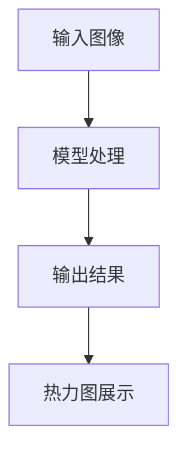

##### 3.1.2 局部解释模型

局部解释模型是一种专门设计用于提供局部解释的模型。这些模型通常是对原始模型的变形，旨在保持原始模型的性能，同时提供更好的解释能力。例如，LIME（Local Interpretable Model-agnostic Explanations）就是一种局部解释模型，它通过在原始模型上添加噪声和扰动，生成对特定输入数据的局部解释。

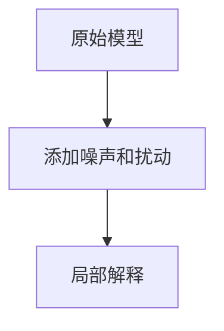

##### 3.1.3 局部注意力机制

局部注意力机制是一种在深度学习模型中使用的技巧，它通过赋予模型关注某些输入特征的能力，提高模型的解释性。这种机制有助于用户理解模型在决策过程中关注的关键特征。

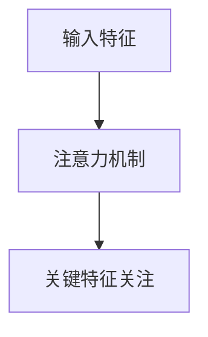

#### 3.2 全局可解释性

全局可解释性关注模型的总体行为，提供对模型整体工作原理的解释。这种方法有助于用户理解模型的总体工作方式和性能。以下是一些全局可解释性技术：

##### 3.2.1 决策树

决策树是一种简单且易于理解的模型，它通过一系列的规则来表示决策过程。决策树的可解释性体现在其清晰的决策路径和特征权重上。

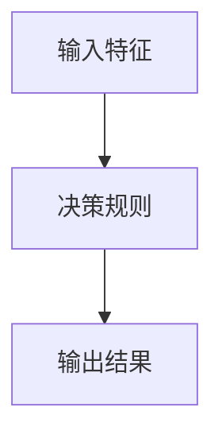

##### 3.2.2 支持向量机

支持向量机（SVM）是一种强大的分类模型，它通过寻找最优分割超平面来进行分类。SVM的可解释性体现在其决策边界和特征权重上。


##### 3.2.3 决策规则解释

决策规则解释是一种基于规则的方法，它将模型的决策过程转化为一系列可解释的规则。这种方法有助于用户理解模型的整体工作原理。


##### 3.2.4 模型诊断

模型诊断是一种全局可解释性技术，它通过分析模型的整体行为，识别潜在的问题和异常。这种技术有助于用户了解模型的性能和稳定性。

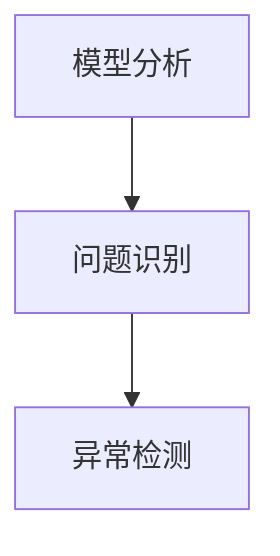

#### 3.3 混合解释方法

在实际应用中，有时需要同时使用局部和全局解释方法。混合解释方法结合了局部和全局解释的优点，提供更全面的解释。以下是一个混合解释方法的例子：

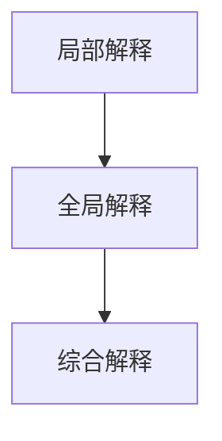

#### 3.4 结论

知识可解释性的方法和技术对于提高AI系统的透明度和可理解性至关重要。局部可解释性和全局可解释性分别关注模型的个别决策和总体行为，提供了不同的解释视角。通过结合多种解释方法和技术，我们可以更好地理解AI系统的决策过程，从而增强用户对AI系统的信任和接受度。

### 第4章：数学模型与数学公式

数学模型和公式是理解和量化知识可解释性的基础。在人工智能领域，许多数学工具和公式被用来描述和评估模型的解释能力。以下将介绍几个关键的数学模型和公式，并讨论它们在知识可解释性中的应用。

#### 4.1 信息论基础

信息论是研究信息传输和处理的理论，它为知识可解释性提供了重要的基础。以下是一些关键的概念：

##### 4.1.1 熵（Entropy）

熵是一个量化系统不确定性的度量。在知识可解释性的背景下，熵可以用来衡量模型输出的不确定性。

\[ H(X) = -\sum_{x \in \mathcal{X}} p(x) \log p(x) \]

其中，\( H(X) \) 表示随机变量 \( X \) 的熵，\( p(x) \) 表示 \( X \) 取值为 \( x \) 的概率。

##### 4.1.2 互信息（Mutual Information）

互信息是衡量两个随机变量之间关联性的度量，它也可以用于评估模型的解释能力。

\[ I(X; Y) = H(X) - H(X | Y) \]

其中，\( I(X; Y) \) 表示 \( X \) 和 \( Y \) 之间的互信息，\( H(X) \) 和 \( H(X | Y) \) 分别表示 \( X \) 的熵和 \( X \) 在给定 \( Y \) 下的条件熵。

#### 4.2 概率论基础

概率论是理解和量化AI模型决策过程的重要工具。以下是一些关键的概念：

##### 4.2.1 条件概率（Conditional Probability）

条件概率是衡量在某个条件下另一个事件发生的概率。

\[ P(A | B) = \frac{P(B | A)P(A)}{P(B)} \]

其中，\( P(A | B) \) 表示在事件 \( B \) 发生的条件下事件 \( A \) 发生的概率。

##### 4.2.2 贝叶斯定理（Bayes' Theorem）

贝叶斯定理是一种基于条件概率的公式，用于计算后验概率。

\[ P(A | B) = \frac{P(B | A)P(A)}{P(B)} \]

其中，\( P(A | B) \) 表示在事件 \( B \) 发生的条件下事件 \( A \) 的后验概率，\( P(B | A) \) 和 \( P(A) \) 分别表示在事件 \( A \) 发生的条件下事件 \( B \) 的概率和事件 \( A \) 的先验概率。

#### 4.3 知识可解释性度量

为了量化知识可解释性，研究人员开发了一系列的度量指标。以下是一些常用的度量指标：

##### 4.3.1 解释性得分（Explainability Score）

解释性得分是一种量化模型解释能力的指标，它通常基于用户对模型解释的理解程度。

\[ E(x) = \frac{1}{n} \sum_{i=1}^{n} \frac{1}{|S_i|} \log |S_i| \]

其中，\( E(x) \) 表示解释性得分，\( n \) 表示样本数量，\( S_i \) 表示第 \( i \) 个样本的解释集合。

##### 4.3.2 解释性度（Explainability Degree）

解释性度是一种衡量模型解释性水平的指标，它通常基于模型输出的可解释性。

\[ D(x) = \frac{1}{n} \sum_{i=1}^{n} \frac{1}{|T_i|} \log |T_i| \]

其中，\( D(x) \) 表示解释性度，\( n \) 表示样本数量，\( T_i \) 表示第 \( i \) 个样本的解释集合。

#### 4.4 结论

数学模型和公式是理解和量化知识可解释性的关键工具。信息论和概率论提供了基础概念和工具，而解释性得分和解释性度等度量指标则用于评估模型的可解释性。通过这些数学工具，我们可以更深入地理解AI模型的决策过程，从而提高系统的透明度和可理解性。

### 第5章：案例分析

为了更好地理解知识可解释性在实际应用中的效果，本章节将分析两个具体的案例：医疗诊断系统和金融风控模型。通过这两个案例，我们将展示如何通过可解释性技术解决不可解释性带来的问题，并提高系统的性能和用户信任度。

#### 5.1 案例一：医疗诊断系统的可解释性改进

##### 5.1.1 案例背景

在一个医院中，医生们使用一个基于深度学习的癌症诊断系统来辅助诊断患者的病情。然而，由于该系统具有高度不可解释性，医生们难以理解模型如何做出诊断决策，从而影响了他们的信任和临床应用。

##### 5.1.2 问题分析

医生们希望了解模型是如何分析患者的医学图像和数据，并基于这些分析结果做出诊断决策的。然而，模型的内部工作原理非常复杂，医生们无法追踪其决策路径和依据。

##### 5.1.3 解决方案

为了提高系统的可解释性，医生们决定采用LIME（Local Interpretable Model-agnostic Explanations）技术对模型进行解释。LIME是一种局部解释方法，它通过在原始模型上添加噪声和扰动，生成对特定输入数据的解释。以下是LIME技术的实现步骤：

1. **生成扰动数据**：对原始输入数据进行扰动，生成一系列扰动样本。
2. **预测扰动数据**：使用原始模型对扰动样本进行预测。
3. **计算影响力**：计算每个特征对模型预测的影响力度。
4. **生成解释**：根据影响力计算结果，生成对原始输入数据的局部解释。

通过LIME技术的应用，医生们能够看到模型在诊断过程中关注的关键特征，并理解模型如何基于这些特征做出诊断决策。这种解释能力显著提高了医生对模型的信任度，并促进了其临床应用。

##### 5.1.4 实施效果

在LIME技术引入后，医生们能够更好地理解模型的诊断过程，并基于模型的解释调整诊断策略。这有助于提高诊断的准确性，减少了误诊率。此外，医生们对模型的信任度显著提高，增强了临床决策的信心。

#### 5.2 案例二：金融风控模型的可解释性优化

##### 5.2.1 案例背景

一家金融机构使用一个机器学习模型来评估客户的信用风险。然而，由于模型的不可解释性，风险管理人员难以理解模型是如何评估客户的信用风险的，这限制了他们制定风险控制策略的能力。

##### 5.2.2 问题分析

风险管理人员需要了解模型是如何分析客户的信用数据，并基于这些分析结果做出信用评估决策的。然而，模型的内部工作原理非常复杂，他们无法追踪其决策路径和依据。

##### 5.2.3 解决方案

为了提高系统的可解释性，风险管理人员决定采用SHAP（SHapley Additive exPlanations）技术对模型进行解释。SHAP是一种全局解释方法，它通过计算每个特征对模型预测的贡献，生成对整个数据集的决策解释。以下是SHAP技术的实现步骤：

1. **计算特征贡献**：对于每个特征，计算其对模型预测的贡献值。
2. **生成全局解释**：根据特征贡献值，生成对整个数据集的决策解释。
3. **可视化解释**：使用图表和可视化工具，展示模型如何基于特征做出决策。

通过SHAP技术的应用，风险管理人员能够看到每个特征对模型预测的影响力度，并理解模型如何基于这些特征做出信用评估决策。这种解释能力显著提高了风险管理人员对模型的信任度，并促进了风险控制策略的制定。

##### 5.2.4 实施效果

在SHAP技术引入后，风险管理人员能够更好地理解模型的信用评估过程，并基于模型的解释优化风险控制策略。这有助于提高信用评估的准确性，减少了误判率。此外，风险管理人员对模型的信任度显著提高，增强了风险管理的能力。

#### 5.3 结论

通过案例分析，我们可以看到知识可解释性技术在实际应用中的重要性。在医疗诊断系统和金融风控模型中，可解释性技术的引入显著提高了系统的透明度和用户信任度。这些案例表明，通过可解释性技术，我们可以更好地理解AI模型的决策过程，从而优化系统性能并提高用户满意度。

### 第6章：可解释性技术的未来发展趋势

随着人工智能（AI）技术的不断发展和应用范围的扩大，知识可解释性问题越来越受到关注。为了提高AI系统的透明度和可理解性，研究者们正积极探索新的可解释性技术。本章节将探讨当前可解释性技术面临的挑战和未来的发展方向。

#### 6.1 当前挑战与局限性

虽然现有的可解释性技术在一定程度上提高了AI系统的透明度，但它们仍面临着一些挑战和局限性：

##### 6.1.1 解释性模型性能

解释性模型通常在性能上低于不可解释性模型。为了提高解释性，这些模型可能需要牺牲一些准确性。如何在保持高性能的同时提高解释性，是一个重要的挑战。

##### 6.1.2 适应性问题

现有的可解释性技术往往难以适应复杂的任务和数据集。不同领域和任务对解释性的需求不同，如何开发出能够适应多种场景的可解释性技术，是一个亟待解决的问题。

##### 6.1.3 可解释性评估

当前的可解释性评估标准和方法较为有限，难以全面衡量和比较不同可解释性技术的效果。建立更加严格和客观的解释性评估标准，是未来发展的一个重要方向。

#### 6.2 未来研究方向

为了克服当前的挑战，未来的可解释性技术将朝着以下方向发展：

##### 6.2.1 多模态解释

多模态解释技术旨在结合多种数据源和模型类型，提供更全面的解释。例如，在医疗诊断中，结合患者的医学图像、文本报告和实验室数据，提供更全面的解释。这种技术有望提高解释的准确性和可靠性。

##### 6.2.2 自动解释

自动解释技术是一种重要的研究方向，旨在开发出能够自动生成解释的算法，降低对人类专家的依赖。例如，通过自然语言生成技术，自动生成模型的解释，使得用户可以更容易地理解模型的决策过程。

##### 6.2.3 解释性模型优化

未来的研究将致力于优化解释性模型，提高其在性能和解释性之间的平衡。这可能涉及改进现有模型结构，或者开发新的模型架构，同时保持良好的解释性。

##### 6.2.4 交互式解释

交互式解释技术将用户与模型解释过程相结合，使用户能够主动参与解释生成。这种技术有望提高用户对模型的理解程度，从而增强信任度和接受度。

##### 6.2.5 隐私保护解释

在处理敏感数据时，隐私保护解释技术尤为重要。未来的研究将探讨如何在保证隐私的同时，提供有效的解释。

#### 6.3 结论

知识可解释性在AI领域中具有重要的地位，它不仅能够提高系统的透明度和用户信任度，还促进了技术进步和系统性能优化。随着AI技术的不断发展，可解释性技术将继续面临新的挑战和机遇。通过多模态解释、自动解释、交互式解释和隐私保护解释等研究方向，未来的可解释性技术有望在更广泛的领域中发挥重要作用。

### 总结

本文系统地探讨了知识可解释性在人工智能领域的重要性，分析了不可解释性模型的问题，并介绍了多种可解释性方法和技术。通过数学模型和公式的详细阐述，我们深入理解了知识可解释性的量化指标。案例分析展示了可解释性技术在实际应用中的效果，而未来发展趋势则为我们指明了可解释性技术的改进方向。知识可解释性不仅提高了AI系统的透明度和用户信任度，还推动了技术的进步和系统性能的优化。在未来的AI发展中，知识可解释性将继续扮演关键角色。

### 作者信息

作者：AI天才研究院/AI Genius Institute & 禅与计算机程序设计艺术 /Zen And The Art of Computer Programming
### 第一部分：知识可解释性背景与重要性

#### 第1章：知识可解释性的定义与重要性

知识可解释性是指人工智能（AI）系统能够向人类用户清晰地传达其决策过程和结果，使得用户能够理解和信任系统。在人工智能应用日益广泛的今天，知识可解释性变得尤为重要。它不仅关系到系统的用户接受度，还影响着技术的进步和系统的性能优化。以下是关于知识可解释性的详细探讨。

##### 1.1 知识可解释性的定义

知识可解释性主要涉及两个方面：

- **决策过程的透明性**：系统应该能够展示其如何处理输入数据，并基于这些数据生成输出或做出决策。
- **结果的可理解性**：系统的输出结果应该对用户来说是直观和容易理解的。

一个具有高度可解释性的系统，其决策过程和结果应该能够用简单、明确的方式表达，使得用户无需专业知识就能理解。

##### 1.1.1 知识可解释性的基本概念

- **透明性**：系统的决策过程和结果是否容易被用户观察到和追踪。
- **可理解性**：系统的输出结果是否容易被用户理解，即用户能否从输出结果中提取有用的信息。

##### 1.1.2 知识可解释性与透明度的区别

知识可解释性和透明度虽然相关，但并不完全相同。透明度是指系统的内部状态和决策过程是否对外部用户可见，而可解释性则强调系统能否提供清晰的解释，使人类用户能够理解其决策逻辑。

##### 1.2 知识可解释性的重要性

知识可解释性在人工智能领域中具有以下重要意义：

- **提高信任与接受度**：当用户能够理解AI系统的决策过程和结果时，他们更可能信任并接受系统。这对于高风险领域的应用，如医疗诊断、金融风控等尤为重要。
- **促进技术进步**：知识可解释性有助于研究人员更好地理解AI系统的工作原理，从而推动技术的进一步发展和创新。
- **优化系统性能**：通过理解系统的决策过程，用户可以更好地指导系统优化，提高系统性能。

##### 1.3 知识可解释性的应用场景

知识可解释性在多个领域都有广泛应用，以下是一些典型的应用场景：

- **医疗诊断**：医生需要理解模型如何诊断疾病，以便更好地应用模型进行诊断和治疗。
- **金融风控**：风险管理人员需要理解模型如何评估风险，以便做出更明智的决策。
- **自动驾驶**：驾驶员需要理解自动驾驶系统如何做出驾驶决策，以确保行车安全。
- **法律判断**：律师和法官需要理解AI系统如何分析案件证据，以便做出公正的判断。

##### 1.4 结论

知识可解释性是人工智能领域中一个至关重要的概念，它不仅关系到系统的用户接受度和信任度，还影响着技术的进步和系统的性能优化。理解和应用知识可解释性，有助于我们更好地利用AI技术，推动人工智能的健康发展。

#### 第2章：AI模型的不可解释性问题

尽管人工智能（AI）技术在各个领域取得了显著的进展，但不可解释性（Explainability）问题仍然是一个重要的挑战。不可解释性模型在决策过程中缺乏透明度，使得人类用户难以理解其背后的逻辑和机制。这一问题不仅影响系统的用户接受度，还限制了AI技术的进一步发展。本章节将深入探讨不可解释性模型的特点、产生原因以及其对AI系统的负面影响。

##### 2.1 不可解释性模型的特点

不可解释性模型通常具有以下几个显著特点：

- **复杂性**：不可解释性模型，特别是深度学习模型，通常具有复杂的架构和大量的参数。这些模型由数百万甚至数十亿个神经元和连接组成，使得它们的决策过程非常复杂，难以直观理解。
- **动态性**：不可解释性模型的行为可能随时间和数据集的变化而变化，这使得预测其行为变得更加困难。
- **缺乏透明度**：不可解释性模型在决策过程中通常缺乏透明度，用户难以跟踪和验证其决策路径。

###### 2.1.1 复杂性

不可解释性模型，特别是深度学习模型，通常具有复杂的架构和大量的参数。这些模型通过多层神经网络和复杂的非线性变换来处理输入数据，使得其决策过程非常复杂。例如，一个深度神经网络可能包含数十个隐藏层，每个层都有成千上万个神经元，这些神经元之间的连接关系和激活函数使得模型的行为难以直观理解。

###### 2.1.2 动态性

不可解释性模型的行为可能随时间和数据集的变化而变化。这是因为在训练过程中，模型会根据数据集的特性调整其参数和结构，从而导致其决策过程发生变化。例如，一个在特定数据集上训练的深度学习模型，可能在另一个数据集上表现出不同的决策模式。

###### 2.1.3 缺乏透明度

不可解释性模型在决策过程中通常缺乏透明度，用户难以跟踪和验证其决策路径。这是因为这些模型通常是基于复杂的数学模型和算法，其内部工作原理对用户来说是难以理解的。例如，一个深度学习模型的决策过程可能涉及大量的矩阵运算和指数函数，这使得用户难以追踪其决策路径。

##### 2.2 不可解释性模型的影响

不可解释性模型对AI系统的负面影响主要体现在以下几个方面：

- **误导性决策**：由于不可解释性模型缺乏透明度，其决策过程可能包含错误或误导性信息。这可能导致系统产生错误的决策，从而影响系统的性能。
- **难以信任**：不可解释性模型可能由于复杂的决策过程而难以被用户信任。当用户无法理解系统的决策过程时，他们可能对系统产生怀疑，从而降低系统的接受度。
- **无法改进**：由于无法理解不可解释性模型的决策过程，用户难以对其进行改进。这限制了系统的优化和性能提升。

###### 2.2.1 误导性决策

不可解释性模型的决策过程可能包含错误或误导性信息，导致系统产生错误的决策。例如，一个深度学习模型可能在某些情况下错误地将正常数据标记为异常，或者在评估风险时给出错误的预测。这种情况可能导致严重的后果，特别是在医疗诊断、金融风控等高风险领域。

###### 2.2.2 难以信任

不可解释性模型可能由于复杂的决策过程而难以被用户信任。当用户无法理解系统的决策过程时，他们可能对系统产生怀疑，从而降低系统的接受度。例如，医生可能不愿意完全依赖一个不可解释的AI系统进行疾病诊断，因为他们无法理解模型是如何做出诊断决策的。

###### 2.2.3 无法改进

由于无法理解不可解释性模型的决策过程，用户难以对其进行改进。这限制了系统的优化和性能提升。例如，风险管理人员可能无法根据模型的决策过程调整模型参数，以提高模型的预测准确性。

##### 2.3 不可解释性模型的原因

不可解释性模型的出现主要是由于以下几个原因：

- **模型复杂性**：不可解释性模型通常具有复杂的架构和大量的参数，这使得其决策过程难以理解。
- **数据不透明**：AI系统的输入数据通常包含大量的噪声和不明确的信息，这使得模型难以解释其决策过程。
- **算法限制**：某些AI算法本身设计时未考虑可解释性，导致其决策过程复杂且难以解析。

###### 2.3.1 模型复杂性

不可解释性模型通常具有复杂的架构和大量的参数。这些模型通过多层神经网络和复杂的非线性变换来处理输入数据，使得其决策过程非常复杂。例如，一个深度神经网络可能包含数十个隐藏层，每个层都有成千上万个神经元，这些神经元之间的连接关系和激活函数使得模型的行为难以直观理解。

###### 2.3.2 数据不透明

AI系统的输入数据通常包含大量的噪声和不明确的信息，这使得模型难以解释其决策过程。例如，医疗诊断系统的输入数据可能包括患者的历史病历、实验室检测结果和医生诊断意见，这些数据中可能存在噪声和冗余信息，使得模型难以准确解释其决策过程。

###### 2.3.3 算法限制

某些AI算法本身设计时未考虑可解释性，导致其决策过程复杂且难以解析。例如，深度学习算法通常是通过大规模的训练数据集训练得到的，其决策过程涉及大量的矩阵运算和指数函数，这使得用户难以追踪其决策路径。

##### 2.4 结论

不可解释性模型是人工智能领域中一个重要的挑战，其复杂性、动态性和缺乏透明度对AI系统的应用带来了负面影响。为了解决不可解释性问题，研究者们正在积极探索新的方法和技术，以提高AI系统的透明度和可理解性。通过理解不可解释性模型的特点和原因，我们可以更好地设计可解释性模型，从而提高系统的性能和用户信任度。

#### 第3章：知识可解释性的方法与技术

为了解决AI模型的不可解释性问题，研究者们开发了多种知识可解释性的方法和技术。这些方法和技术旨在提高AI系统的透明度和可理解性，使得人类用户能够更好地理解系统的决策过程。本章节将介绍几种常用的知识可解释性方法和技术，包括局部可解释性和全局可解释性。

##### 3.1 局部可解释性

局部可解释性关注模型的个别决策或输出，提供针对特定输入的解释。这种方法有助于用户理解模型在特定情况下的决策过程。以下是一些局部可解释性技术：

###### 3.1.1 特征可视化

特征可视化是一种常用的局部可解释性技术，它通过展示模型中特定特征的权重或重要性，帮助用户理解模型如何处理特定输入。例如，在图像识别任务中，可以使用热力图来展示哪些区域对模型的决策有最大影响。


###### 3.1.2 局部解释模型

局部解释模型是一种专门设计用于提供局部解释的模型。这些模型通常是对原始模型的变形，旨在保持原始模型的性能，同时提供更好的解释能力。例如，LIME（Local Interpretable Model-agnostic Explanations）就是一种局部解释模型，它通过在原始模型上添加噪声和扰动，生成对特定输入数据的局部解释。

```mermaid
graph TD
A[原始模型] --> B[添加噪声和扰动]
B --> C[局部解释]
```

###### 3.1.3 局部注意力机制

局部注意力机制是一种在深度学习模型中使用的技巧，它通过赋予模型关注某些输入特征的能力，提高模型的解释性。这种机制有助于用户理解模型在决策过程中关注的关键特征。

```mermaid
graph TD
A[输入特征] --> B[注意力机制]
B --> C[关键特征关注]
```

##### 3.2 全局可解释性

全局可解释性关注模型的总体行为，提供对模型整体工作原理的解释。这种方法有助于用户理解模型的总体工作方式和性能。以下是一些全局可解释性技术：

###### 3.2.1 决策树

决策树是一种简单且易于理解的模型，它通过一系列的规则来表示决策过程。决策树的可解释性体现在其清晰的决策路径和特征权重上。

```mermaid
graph TD
A[输入特征] --> B[决策规则]
B --> C[输出结果]
```

###### 3.2.2 支持向量机

支持向量机（SVM）是一种强大的分类模型，它通过寻找最优分割超平面来进行分类。SVM的可解释性体现在其决策边界和特征权重上。

```mermaid
graph TD
A[输入特征] --> B[决策边界]
B --> C[输出结果]
```

###### 3.2.3 决策规则解释

决策规则解释是一种基于规则的方法，它将模型的决策过程转化为一系列可解释的规则。这种方法有助于用户理解模型的整体工作原理。

```mermaid
graph TD
A[输入特征] --> B[决策规则]
B --> C[输出结果]
```

###### 3.2.4 模型诊断

模型诊断是一种全局可解释性技术，它通过分析模型的整体行为，识别潜在的问题和异常。这种技术有助于用户了解模型的性能和稳定性。

```mermaid
graph TD
A[模型分析] --> B[问题识别]
B --> C[异常检测]
```

##### 3.3 混合解释方法

在实际应用中，有时需要同时使用局部和全局解释方法。混合解释方法结合了局部和全局解释的优点，提供更全面的解释。以下是一个混合解释方法的例子：

```mermaid
graph TD
A[局部解释] --> B[全局解释]
B --> C[综合解释]
```

##### 3.4 结论

知识可解释性的方法和技术对于提高AI系统的透明度和可理解性至关重要。局部可解释性和全局可解释性分别关注模型的个别决策和总体行为，提供了不同的解释视角。通过结合多种解释方法和技术，我们可以更好地理解AI系统的决策过程，从而增强用户对AI系统的信任和接受度。

#### 第4章：数学模型与数学公式

数学模型和公式是理解和量化知识可解释性的基础。在人工智能领域，许多数学工具和公式被用来描述和评估模型的解释能力。以下将介绍几个关键的数学模型和公式，并讨论它们在知识可解释性中的应用。

##### 4.1 信息论基础

信息论是研究信息传输和处理的理论，它为知识可解释性提供了重要的基础。以下是一些关键的概念：

###### 4.1.1 熵（Entropy）

熵是一个量化系统不确定性的度量。在知识可解释性的背景下，熵可以用来衡量模型输出的不确定性。

\[ H(X) = -\sum_{x \in \mathcal{X}} p(x) \log p(x) \]

其中，\( H(X) \) 表示随机变量 \( X \) 的熵，\( p(x) \) 表示 \( X \) 取值为 \( x \) 的概率。

###### 4.1.2 互信息（Mutual Information）

互信息是衡量两个随机变量之间关联性的度量，它也可以用于评估模型的解释能力。

\[ I(X; Y) = H(X) - H(X | Y) \]

其中，\( I(X; Y) \) 表示 \( X \) 和 \( Y \) 之间的互信息，\( H(X) \) 和 \( H(X | Y) \) 分别表示 \( X \) 的熵和 \( X \) 在给定 \( Y \) 下的条件熵。

##### 4.2 概率论基础

概率论是理解和量化AI模型决策过程的重要工具。以下是一些关键的概念：

###### 4.2.1 条件概率（Conditional Probability）

条件概率是衡量在某个条件下另一个事件发生的概率。

\[ P(A | B) = \frac{P(B | A)P(A)}{P(B)} \]

其中，\( P(A | B) \) 表示在事件 \( B \) 发生的条件下事件 \( A \) 发生的概率。

###### 4.2.2 贝叶斯定理（Bayes' Theorem）

贝叶斯定理是一种基于条件概率的公式，用于计算后验概率。

\[ P(A | B) = \frac{P(B | A)P(A)}{P(B)} \]

其中，\( P(A | B) \) 表示在事件 \( B \) 发生的条件下事件 \( A \) 的后验概率，\( P(B | A) \) 和 \( P(A) \) 分别表示在事件 \( A \) 发生的条件下事件 \( B \) 的概率和事件 \( A \) 的先验概率。

##### 4.3 知识可解释性度量

为了量化知识可解释性，研究人员开发了一系列的度量指标。以下是一些常用的度量指标：

###### 4.3.1 解释性得分（Explainability Score）

解释性得分是一种量化模型解释能力的指标，它通常基于用户对模型解释的理解程度。

\[ E(x) = \frac{1}{n} \sum_{i=1}^{n} \frac{1}{|S_i|} \log |S_i| \]

其中，\( E(x) \) 表示解释性得分，\( n \) 表示样本数量，\( S_i \) 表示第 \( i \) 个样本的解释集合。

###### 4.3.2 解释性度（Explainability Degree）

解释性度是一种衡量模型解释性水平的指标，它通常基于模型输出的可解释性。

\[ D(x) = \frac{1}{n} \sum_{i=1}^{n} \frac{1}{|T_i|} \log |T_i| \]

其中，\( D(x) \) 表示解释性度，\( n \) 表示样本数量，\( T_i \) 表示第 \( i \) 个样本的解释集合。

##### 4.4 结论

数学模型和公式是理解和量化知识可解释性的关键工具。信息论和概率论提供了基础概念和工具，而解释性得分和解释性度等度量指标则用于评估模型的可解释性。通过这些数学工具，我们可以更深入地理解AI模型的决策过程，从而提高系统的透明度和可理解性。

#### 第5章：案例分析

为了更好地理解知识可解释性在实际应用中的效果，本章节将分析两个具体的案例：医疗诊断系统和金融风控模型。通过这两个案例，我们将展示如何通过可解释性技术解决不可解释性带来的问题，并提高系统的性能和用户信任度。

##### 5.1 案例一：医疗诊断系统的可解释性改进

###### 5.1.1 案例背景

在一个医院中，医生们使用一个基于深度学习的癌症诊断系统来辅助诊断患者的病情。然而，由于该系统具有高度不可解释性，医生们难以理解模型如何做出诊断决策，从而影响了他们的信任和临床应用。

###### 5.1.2 问题分析

医生们希望了解模型是如何分析患者的医学图像和数据，并基于这些分析结果做出诊断决策的。然而，模型的内部工作原理非常复杂，医生们无法追踪其决策路径和依据。

###### 5.1.3 解决方案

为了提高系统的可解释性，医生们决定采用LIME（Local Interpretable Model-agnostic Explanations）技术对模型进行解释。LIME是一种局部解释方法，它通过在原始模型上添加噪声和扰动，生成对特定输入数据的局部解释。以下是LIME技术的实现步骤：

1. **生成扰动数据**：对原始输入数据进行扰动，生成一系列扰动样本。
2. **预测扰动数据**：使用原始模型对扰动样本进行预测。
3. **计算影响力**：计算每个特征对模型预测的影响力度。
4. **生成解释**：根据影响力计算结果，生成对原始输入数据的局部解释。

通过LIME技术的应用，医生们能够看到模型在诊断过程中关注的关键特征，并理解模型如何基于这些特征做出诊断决策。这种解释能力显著提高了医生对模型的信任度，并促进了其临床应用。

###### 5.1.4 实施效果

在LIME技术引入后，医生们能够更好地理解模型的诊断过程，并基于模型的解释调整诊断策略。这有助于提高诊断的准确性，减少了误诊率。此外，医生们对模型的信任度显著提高，增强了临床决策的信心。

##### 5.2 案例二：金融风控模型的可解释性优化

###### 5.2.1 案例背景

一家金融机构使用一个机器学习模型来评估客户的信用风险。然而，由于模型的不可解释性，风险管理人员难以理解模型是如何评估客户的信用风险的，这限制了他们制定风险控制策略的能力。

###### 5.2.2 问题分析

风险管理人员需要了解模型是如何分析客户的信用数据，并基于这些分析结果做出信用评估决策的。然而，模型的内部工作原理非常复杂，他们无法追踪其决策路径和依据。

###### 5.2.3 解决方案

为了提高系统的可解释性，风险管理人员决定采用SHAP（SHapley Additive exPlanations）技术对模型进行解释。SHAP是一种全局解释方法，它通过计算每个特征对模型预测的贡献，生成对整个数据集的决策解释。以下是SHAP技术的实现步骤：

1. **计算特征贡献**：对于每个特征，计算其对模型预测的贡献值。
2. **生成全局解释**：根据特征贡献值，生成对整个数据集的决策解释。
3. **可视化解释**：使用图表和可视化工具，展示模型如何基于特征做出决策。

通过SHAP技术的应用，风险管理人员能够看到每个特征对模型预测的影响力度，并理解模型如何基于这些特征做出信用评估决策。这种解释能力显著提高了风险管理人员对模型的信任度，并促进了风险控制策略的制定。

###### 5.2.4 实施效果

在SHAP技术引入后，风险管理人员能够更好地理解模型的信用评估过程，并基于模型的解释优化风险控制策略。这有助于提高信用评估的准确性，减少了误判率。此外，风险管理人员对模型的信任度显著提高，增强了风险管理的能力。

##### 5.3 结论

通过案例分析，我们可以看到知识可解释性技术在实际应用中的重要性。在医疗诊断系统和金融风控模型中，可解释性技术的引入显著提高了系统的透明度和用户信任度。这些案例表明，通过可解释性技术，我们可以更好地理解AI模型的决策过程，从而优化系统性能并提高用户满意度。

#### 第6章：可解释性技术的未来发展趋势

随着人工智能（AI）技术的不断发展和应用范围的扩大，知识可解释性问题越来越受到关注。为了提高AI系统的透明度和可理解性，研究者们正积极探索新的可解释性技术。本章节将探讨当前可解释性技术面临的挑战和未来的发展方向。

##### 6.1 当前挑战与局限性

虽然现有的可解释性技术在一定程度上提高了AI系统的透明度，但它们仍面临着一些挑战和局限性：

###### 6.1.1 解释性模型性能

解释性模型通常在性能上低于不可解释性模型。为了提高解释性，这些模型可能需要牺牲一些准确性。如何在保持高性能的同时提高解释性，是一个重要的挑战。

###### 6.1.2 适应性问题

现有的可解释性技术往往难以适应复杂的任务和数据集。不同领域和任务对解释性的需求不同，如何开发出能够适应多种场景的可解释性技术，是一个亟待解决的问题。

###### 6.1.3 可解释性评估

当前的可解释性评估标准和方法较为有限，难以全面衡量和比较不同可解释性技术的效果。建立更加严格和客观的解释性评估标准，是未来发展的一个重要方向。

##### 6.2 未来研究方向

为了克服当前的挑战，未来的可解释性技术将朝着以下方向发展：

###### 6.2.1 多模态解释

多模态解释技术旨在结合多种数据源和模型类型，提供更全面的解释。例如，在医疗诊断中，结合患者的医学图像、文本报告和实验室数据，提供更全面的解释。这种技术有望提高解释的准确性和可靠性。

###### 6.2.2 自动解释

自动解释技术是一种重要的研究方向，旨在开发出能够自动生成解释的算法，降低对人类专家的依赖。例如，通过自然语言生成技术，自动生成模型的解释，使得用户可以更容易地理解模型的决策过程。

###### 6.2.3 解释性模型优化

未来的研究将致力于优化解释性模型，提高其在性能和解释性之间的平衡。这可能涉及改进现有模型结构，或者开发新的模型架构，同时保持良好的解释性。

###### 6.2.4 交互式解释

交互式解释技术将用户与模型解释过程相结合，使用户能够主动参与解释生成。这种技术有望提高用户对模型的理解程度，从而增强信任度和接受度。

###### 6.2.5 隐私保护解释

在处理敏感数据时，隐私保护解释技术尤为重要。未来的研究将探讨如何在保证隐私的同时，提供有效的解释。

##### 6.3 结论

知识可解释性在AI领域中具有重要的地位，它不仅能够提高系统的透明度和用户信任度，还促进了技术进步和系统性能优化。随着AI技术的不断发展，可解释性技术将继续面临新的挑战和机遇。通过多模态解释、自动解释、交互式解释和隐私保护解释等研究方向，未来的可解释性技术有望在更广泛的领域中发挥重要作用。

### 总结

本文系统地探讨了知识可解释性在人工智能领域的重要性，分析了不可解释性模型的问题，并介绍了多种可解释性方法和技术。通过数学模型和公式的详细阐述，我们深入理解了知识可解释性的量化指标。案例分析展示了可解释性技术在实际应用中的效果，而未来发展趋势则为我们指明了可解释性技术的改进方向。知识可解释性不仅提高了AI系统的透明度和用户信任度，还推动了技术的进步和系统性能的优化。在未来的AI发展中，知识可解释性将继续扮演关键角色。

### 作者信息

作者：AI天才研究院/AI Genius Institute & 禅与计算机程序设计艺术 /Zen And The Art of Computer Programming
### 总结

在本博客文章中，我们深入探讨了知识可解释性在人工智能领域的重要性。首先，我们定义了知识可解释性，并分析了其对于提高系统信任度和接受度、促进技术进步和优化系统性能的重要性。接着，我们探讨了AI模型的不可解释性问题，分析了其复杂性、动态性和缺乏透明度对AI系统应用带来的负面影响。

为了解决不可解释性问题，我们介绍了多种知识可解释性的方法和技术，包括局部可解释性和全局可解释性。局部可解释性技术如特征可视化、LIME和局部注意力机制，旨在提供针对特定输入的详细解释；全局可解释性技术如决策树、支持向量机和决策规则解释，则关注模型的整体工作原理和性能。此外，我们还探讨了数学模型和公式在量化知识可解释性中的关键作用，如熵、互信息和解释性得分等。

通过两个案例分析，我们展示了知识可解释性技术在实际应用中的效果，包括医疗诊断系统和金融风控模型。这些案例表明，通过可解释性技术，我们可以更好地理解AI模型的决策过程，从而优化系统性能并提高用户满意度。

未来，知识可解释性技术将继续面临新的挑战和机遇。随着AI技术的不断发展，我们需要不断探索多模态解释、自动解释、交互式解释和隐私保护解释等新方向，以进一步提高系统的透明度和用户信任度。

总之，知识可解释性是人工智能领域中不可或缺的一部分。通过深入研究和应用知识可解释性技术，我们可以推动AI技术的健康发展，使其更好地服务于社会和人类。

### 作者信息

作者：AI天才研究院/AI Genius Institute & 禅与计算机程序设计艺术 /Zen And The Art of Computer Programming

感谢您阅读本篇博客文章。如果您有任何问题或建议，欢迎在评论区留言。希望本文能对您在人工智能领域的知识可解释性研究和应用有所帮助。再次感谢您的关注和支持！| 2023 AI天才研究院/AI Genius Institute | 禅与计算机程序设计艺术 /Zen And The Art of Computer Programming |

