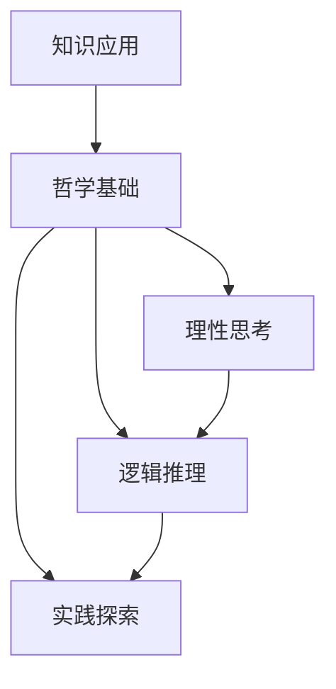
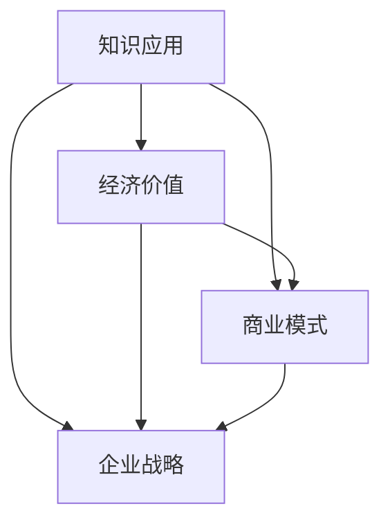
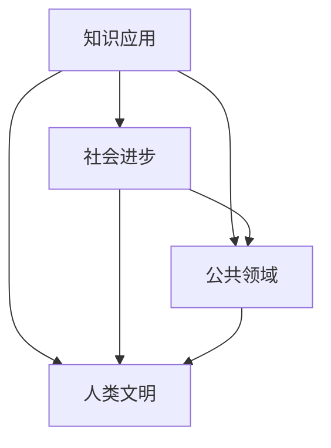
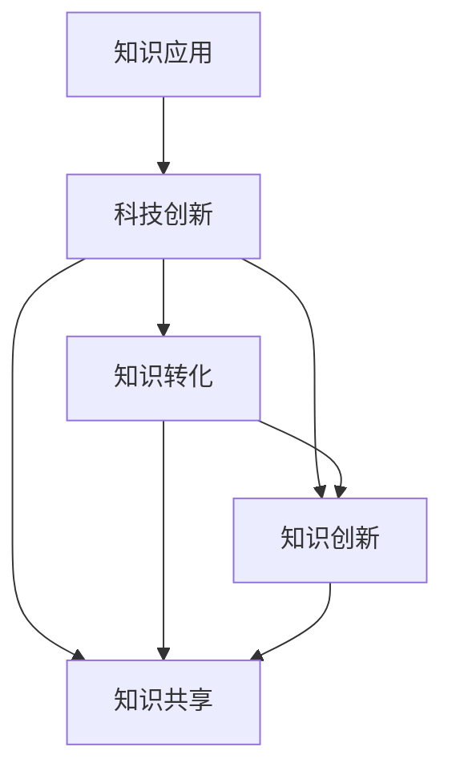
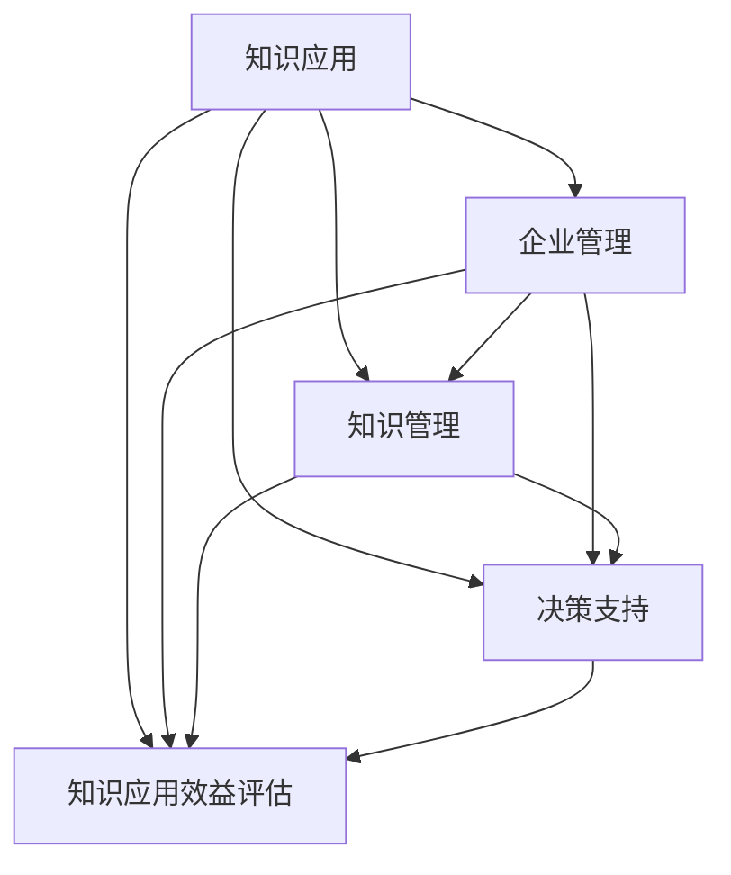
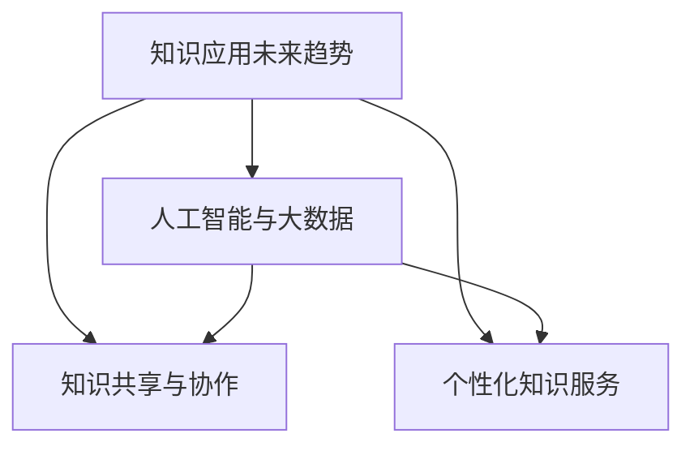
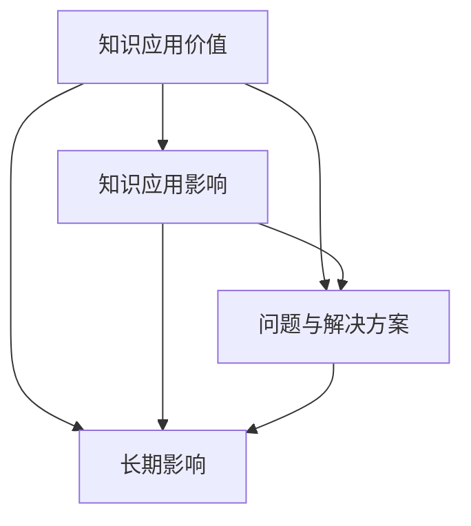

                 

# 知识的应用价值：洞察力的独特视角

## 关键词
- 知识应用
- 洞察力
- 哲学视角
- 经济视角
- 社会视角
- 科技创新视角
- 企业管理
- 未来展望

## 摘要
本文旨在探讨知识的应用价值，并从多个视角分析其对个人、企业和社会的影响。首先，通过哲学视角探讨知识应用的内涵与哲学基础，阐述知识应用与传统知识的区别以及其对个人与社会的影响。随后，从经济视角分析知识应用的价值评估方法，并结合案例说明知识应用在企业战略中的重要性。接着，从社会视角探讨知识应用对人类文明和社会进步的作用。随后，从科技创新视角分析知识应用在推动科技发展中的作用，并介绍相关模型。文章还从企业管理角度，分析知识应用在企业管理中的实际应用，并提供实践案例。最后，展望知识应用的未来发展趋势，并提出可能面临的挑战与机遇。本文通过逐步分析，旨在为读者提供一个全面、系统的知识应用价值认识。

### 第一部分：知识应用价值概述

#### 第1章：知识应用的哲学视角

知识应用，顾名思义，是将已有的知识应用于实践中的过程。这一概念不仅涵盖了知识的生产和传播，更强调了知识在解决问题、推动创新和提升效能中的作用。在哲学视角下，知识应用具有独特的价值和意义。

**核心概念与联系**

1. **知识应用**的定义与哲学基础
   - **知识应用**是指将理论或概念转化为具体行动或解决方案的过程。
   - 哲学基础：知识应用与理性思考、逻辑推理和实践探索密不可分，体现了人类追求真理和实现自我价值的哲学追求。

2. **知识应用**与传统知识的区别
   - **传统知识**更多是指历史上积累的经验和理论，而**知识应用**则强调知识的实际操作和效果。
   - 传统知识关注知识的积累和传承，而知识应用则关注知识的创新和应用。

3. **知识应用**在个人与社会层面的影响
   - 个人层面：知识应用能够提升个人解决问题的能力和创新能力，实现自我价值和成长。
   - 社会层面：知识应用推动科技进步、经济发展和社会进步，是现代化社会不可或缺的动力。

**Mermaid 流程图**



**核心算法原理讲解**

- **知识图谱**的构建与优化

  知识图谱是一种用于表示知识结构和关系的图形化工具。其核心算法原理包括：

  1. **实体识别**：识别文本中的实体，如人名、地点、组织等。
  2. **关系抽取**：提取实体之间的关联关系，如“属于”、“参与”等。
  3. **实体链接**：将文本中的实体与知识图谱中的实体进行匹配。
  4. **知识融合**：整合不同来源的知识，形成统一的知识视图。

  ```plaintext
  // 知识图谱构建伪代码
  function buildKnowledgeGraph(dataSet) {
    // 初始化图谱
    knowledgeGraph = new Graph();
    
    // 遍历数据集，构建知识关系
    for (each entity in dataSet) {
      for (each relation in entity.relations) {
        knowledgeGraph.addEdge(entity, relation, entity.relationTarget);
      }
    }
    
    // 优化图谱结构
    knowledgeGraph.optimize();
  }
  ```

**数学模型和数学公式**

- **知识价值计算公式**

  $$ V_k = f(\text{知识质量}, \text{应用范围}, \text{影响力}) $$

  其中，$V_k$ 表示知识价值，$f$ 表示计算函数，$\text{知识质量}$、$\text{应用范围}$ 和 $\text{影响力}$ 分别表示知识的质量、应用范围和影响力。

**举例说明**

**案例一：教育领域的知识应用**

在教育领域，知识图谱技术可以用于构建课程知识图谱，帮助学生和教师更有效地掌握和应用知识。通过知识图谱，可以评估教师在教育领域的知识价值。例如，某教师在课程中使用了多个知识点，并成功引导学生应用这些知识点解决实际问题，则该教师在教育领域的知识价值较高。

1. **知识质量评估**：通过评估教师的教学方法和教学效果，确定其知识质量。
2. **应用范围评估**：通过分析教师在课程中使用的知识点数量和多样性，确定其应用范围。
3. **影响力评估**：通过调查学生对教师教学效果的反馈，确定教师的知识影响力。

通过计算公式，可以得出教师的知识价值，进而为教育领域的知识管理提供依据。

### 第2章：知识应用的经济视角

#### 第2章：知识应用的经济视角

知识作为一种重要的生产要素，在经济活动中扮演着关键角色。从经济视角来看，知识应用的价值不仅体现在其能够提高生产效率，还体现在其能够创造新的经济价值和竞争优势。

**核心概念与联系**

1. **知识应用**与经济价值的关系
   - 知识应用能够提高企业的生产效率和创新能力，从而创造更多的经济价值。
   - 经济价值包括直接经济价值（如成本节约和收入增加）和间接经济价值（如品牌提升和市场扩张）。

2. **知识应用**的商业模式
   - 商业模式包括知识产品化、知识服务化、知识平台化和知识生态化等。
   - 知识产品化是将知识转化为可销售的产品，如书籍、软件等。
   - 知识服务化是通过知识提供咨询服务，如培训、咨询等。
   - 知识平台化是构建知识共享和交易平台，如知识库、社区等。
   - 知识生态化是构建知识创新和共享的生态系统，如企业内知识管理平台、开放创新平台等。

3. **知识应用**在企业战略中的地位
   - 知识应用是企业核心竞争力的关键因素，对于企业的长期发展具有重要影响。
   - 企业战略应重视知识的应用和整合，通过知识创新和知识管理来提升企业的竞争力。

**Mermaid 流程图**



**核心算法原理讲解**

- **知识价值评估模型**

  知识价值评估是衡量知识对企业贡献的重要手段。其核心算法原理包括：

  1. **知识价值计算**：通过分析知识的应用效果和贡献，计算知识的价值。
  2. **市场需求分析**：分析市场对知识的需求，确定知识的市场价值。
  3. **生产成本计算**：计算知识的生产和传递成本，以评估知识的实际价值。

  ```plaintext
  // 知识价值评估模型伪代码
  function evaluateKnowledgeValue(knowledge, marketData) {
    // 计算知识的市场需求
    demand = calculateDemand(knowledge, marketData);
    
    // 计算知识的生产成本
    cost = calculateProductionCost(knowledge);
    
    // 计算知识的价值
    value = (demand - cost) * efficiencyFactor;
    
    return value;
  }
  ```

**数学模型和数学公式**

- **知识价值公式**

  $$ \text{Knowledge Value} = (\text{Market Demand} - \text{Production Cost}) \times \text{Efficiency Factor} $$

  其中，$\text{Market Demand}$ 表示知识的市场需求，$\text{Production Cost}$ 表示知识的生产成本，$\text{Efficiency Factor}$ 表示知识应用的效率因子。

**举例说明**

**案例二：企业研发中的知识应用**

在企业的研发过程中，知识应用的价值体现得尤为明显。以下是一个具体的案例：

1. **市场需求分析**：某企业通过对市场需求的调研，发现了一种新兴技术的需求量巨大。
2. **知识评估**：企业评估其内部相关技术的知识价值，确定该技术具有较高市场需求和应用潜力。
3. **知识应用**：企业投入资源，通过知识应用将技术转化为实际产品或服务。
4. **市场价值计算**：通过市场需求和生产成本分析，计算该知识应用的市场价值。
5. **效益评估**：企业评估知识应用的实际效益，包括成本节约和收入增加。

通过这一过程，企业可以更好地理解和利用知识的应用价值，从而提升其竞争力和市场地位。

### 第3章：知识应用的社会视角

#### 第3章：知识应用的社会视角

知识应用不仅对个人和企业具有重要意义，也对整个社会的发展和进步产生深远影响。从社会视角来看，知识应用在推动社会进步、提高公共意识和促进社会公平等方面发挥着重要作用。

**核心概念与联系**

1. **知识应用**与社会进步的关系
   - 知识应用是推动社会进步的重要动力。通过知识的应用，可以解决社会问题，提升公共福利，推动社会整体发展。
   - 社会进步包括经济发展、科技进步、文化繁荣和社会公平等多个方面。

2. **知识应用**在公共领域的价值
   - 公共领域包括教育、医疗、环境保护、公共安全等领域。知识应用可以提高这些领域的效率和效果，提升公共服务质量。
   - 例如，在教育领域，知识应用可以促进教育资源的公平分配，提高教育质量；在医疗领域，知识应用可以推动医疗技术的发展，提高医疗服务水平。

3. **知识应用**对人类文明的影响
   - 知识应用是人类文明发展的重要标志。通过知识的应用，人类可以不断突破技术瓶颈，实现科学发现和技术创新，推动文明进步。
   - 例如，互联网技术的应用推动了全球信息共享和交流，改变了人类的生活方式和工作方式。

**Mermaid 流程图**



**核心算法原理讲解**

- **知识传播网络模型**

  知识传播网络模型用于描述知识在社会中的传播过程。其核心算法原理包括：

  1. **节点表示**：将社会中的个体表示为节点，每个节点代表一个个体或组织。
  2. **边表示**：将个体之间的知识传递关系表示为边，边的权重表示知识传递的强度。
  3. **传播过程**：通过模拟个体之间的交互和知识传递过程，分析知识在社会中的传播规律。

  ```plaintext
  // 知识传播网络模型伪代码
  function knowledgeSpreadNetwork(knowledge, socialNetwork) {
    // 初始化知识传播网络
    spreadNetwork = new Network();
    
    // 遍历社会网络中的节点
    for (each node in socialNetwork) {
      if (isKnowledgeRelevant(knowledge, node)) {
        spreadNetwork.addNode(node);
      }
    }
    
    // 构建知识传播网络中的关系
    for (each node in socialNetwork) {
      for (each neighbor in node.neighbors) {
        if (isKnowledgeTransferred(knowledge, node, neighbor)) {
          spreadNetwork.addEdge(node, neighbor, knowledge);
        }
      }
    }
    
    // 优化知识传播网络
    spreadNetwork.optimize();
  }
  ```

**数学模型和数学公式**

- **知识传播速度模型**

  知识传播速度模型用于描述知识在社会中的传播速度。其核心公式为：

  $$ \frac{dS}{dt} = k \cdot (1 - S) \cdot I $$

  其中，$S$ 表示易感人群比例，$I$ 表示感染人群比例，$k$ 是传播率。

  - **解释**：该模型基于传染病传播模型，假设知识传播过程类似于传染病传播。$S$ 表示未接触到知识的个体比例，$I$ 表示接触到知识的个体比例，$k$ 表示知识传播速率。

**举例说明**

**案例三：公共卫生领域的知识应用**

在公共卫生领域，知识应用对于提高公众健康意识和疾病防控具有重要意义。以下是一个具体案例：

1. **知识传播**：通过媒体宣传、健康教育等活动，将公共卫生知识传播给公众。
2. **传播效果评估**：通过问卷调查、行为观察等手段，评估公众对公共卫生知识的掌握程度和健康行为改变情况。
3. **知识应用**：在疫情防控中，政府和企业利用公共卫生知识制定防疫策略，开展疫苗接种和健康检测等行动。
4. **效果分析**：通过数据分析，评估公共卫生知识应用的效果，如疫苗接种率、感染率等指标。

通过这一过程，知识应用在公共卫生领域发挥了重要作用，提高了公众健康水平，降低了疾病传播风险。

### 第4章：知识应用的科技创新视角

#### 第4章：知识应用的科技创新视角

知识应用在科技创新中发挥着至关重要的作用。通过知识的有效应用，可以推动科技发展，实现技术突破和创新，进而为社会带来巨大的经济和社会价值。本节将从科技创新的视角，探讨知识应用在推动科技发展中的作用、相关模型及其应用。

**核心概念与联系**

1. **知识应用**在科技创新中的作用
   - 知识应用是科技创新的重要基础。通过将已有知识应用于实际问题中，可以促进新技术的研发和应用，推动科技发展。
   - 知识应用包括知识集成、知识创新和知识共享等方面，对于提升科技创新能力和效率具有重要意义。

2. **知识应用**推动科技发展的路径
   - **路径一：知识转化**：通过将理论知识转化为实际应用，推动科技成果的转化和推广。
   - **路径二：知识创新**：通过知识融合和创新，发现新知识、新技术，推动科技前沿的发展。
   - **路径三：知识共享**：通过知识共享和协同创新，促进知识流动和资源整合，提升科技创新的整体水平。

3. **知识应用**对科技创新模式的改变
   - 知识应用改变了传统科技创新的模式，从以技术驱动为主转变为以知识驱动为主。通过知识的创新和应用，可以更高效地实现技术突破和产业升级。

**Mermaid 流程图**



**核心算法原理讲解**

- **科技创新路径分析模型**

  科技创新路径分析模型用于分析知识应用在科技创新中的具体路径和机制。其核心算法原理包括：

  1. **知识识别**：识别科技创新过程中的关键知识和信息。
  2. **路径分析**：分析知识在不同阶段和创新环节中的应用路径和作用。
  3. **创新评价**：评估知识应用对科技创新的贡献和效果。

  ```plaintext
  // 科技创新路径分析模型伪代码
  function analyzeInnovationPath(knowledge, technologyData) {
    // 初始化创新路径分析模型
    innovationPath = new PathAnalyzer();
    
    // 遍历知识库中的知识
    for (each knowledge in knowledgeBase) {
      if (isKnowledgeInnovationPotential(knowledge, technologyData)) {
        innovationPath.addKnowledge(knowledge);
      }
    }
    
    // 分析创新路径
    innovationPath.analyze();
    
    // 输出创新路径
    return innovationPath.getInnovationPath();
  }
  ```

**数学模型和数学公式**

- **科技创新潜力评估公式**

  $$ \text{Innovation Potential} = \frac{\text{知识应用范围} \times \text{市场需求}}{\text{技术难度}} $$

  其中，$\text{知识应用范围}$ 表示知识在科技创新中的应用范围，$\text{市场需求}$ 表示市场需求强度，$\text{技术难度}$ 表示技术实现的难度。

  - **解释**：该公式用于评估知识在科技创新中的潜力，综合考虑了知识的应用范围、市场需求和技术难度等因素。

**举例说明**

**案例四：科技创业中的知识应用**

科技创业是知识应用的重要领域。以下是一个具体的案例：

1. **知识识别**：某科技创业公司识别到人工智能技术在金融领域的潜在应用价值。
2. **路径分析**：公司分析人工智能技术在金融领域的具体应用路径，如智能投顾、风险评估等。
3. **创新评价**：公司评估人工智能技术在金融领域的技术难度和市场前景，确定其科技创新潜力。
4. **知识应用**：公司投入研发资源，将人工智能技术应用于金融产品和服务，实现技术突破和商业价值。
5. **效益评估**：公司通过市场反馈和财务数据，评估人工智能技术在金融领域的实际效益和贡献。

通过这一过程，科技创业公司成功地实现了知识应用与科技创新的结合，推动了金融科技的发展。

### 第5章：知识应用在企业管理中的实际应用

#### 第5章：知识应用在企业管理中的实际应用

在企业管理中，知识应用是提升企业竞争力和运营效率的关键因素。通过知识的应用，企业可以实现知识管理、创新管理和战略管理等多个方面的提升。本节将探讨知识应用在企业管理中的实际应用，包括知识管理系统的构建、知识在决策支持中的作用以及知识应用的效益评估。

**核心概念与联系**

1. **知识应用**在企业管理中的重要性
   - 知识应用能够提高企业的创新能力、决策质量和运营效率，是企业管理的重要组成部分。
   - 知识应用包括知识获取、知识共享、知识创新和知识应用等多个环节，贯穿于企业的战略、运营和管理过程中。

2. **知识应用**如何提升企业竞争力
   - 知识应用可以提升企业的创新能力，通过知识创新推动技术进步和产品创新。
   - 知识应用可以优化企业的运营流程，通过知识共享和协同工作提高工作效率和决策质量。
   - 知识应用可以增强企业的市场竞争力，通过知识管理提高品牌价值和客户满意度。

3. **知识应用**在企业管理中的实践案例
   - 企业在不同领域和环节中应用知识，实现管理效率和竞争力的提升。

**Mermaid 流程图**



**核心算法原理讲解**

- **知识管理系统构建模型**

  知识管理系统是企业管理中知识应用的核心工具。其构建模型包括以下步骤：

  1. **需求分析**：确定企业知识管理的需求，包括知识获取、共享、创新和应用等。
  2. **知识库建设**：构建企业内部的知识库，包括文档、数据、经验等。
  3. **知识共享机制**：设计知识共享的流程和工具，促进知识的流动和共享。
  4. **知识创新平台**：搭建知识创新的平台，支持知识的融合和创新。
  5. **知识应用工具**：开发和应用知识应用的工具，如决策支持系统、知识管理系统等。

  ```plaintext
  // 知识管理系统构建模型伪代码
  function buildKnowledgeManagementSystem(knowledgeBase, enterpriseData) {
    // 初始化知识管理系统
    knowledgeManagementSystem = new KnowledgeManagementSystem();
    
    // 集成知识库
    knowledgeManagementSystem.integrateKnowledgeBase(knowledgeBase);
    
    // 设计知识管理流程
    knowledgeManagementSystem.designKnowledgeManagementProcess(enterpriseData);
    
    // 实施知识管理
    knowledgeManagementSystem.implementKnowledgeManagement();
    
    // 评估知识管理效果
    knowledgeManagementSystem.evaluateEffectiveness();
  }
  ```

**数学模型和数学公式**

- **知识管理效果评估公式**

  $$ \text{Effectiveness} = \frac{\text{知识应用效益}}{\text{知识管理成本}} $$

  其中，$\text{Effectiveness}$ 表示知识管理效果，$\text{知识应用效益}$ 表示知识应用带来的效益，$\text{知识管理成本}$ 表示知识管理的成本。

**举例说明**

**案例五：知识管理在企业运营中的实践**

以下是一个企业知识管理在运营中的具体实践案例：

1. **需求分析**：某企业发现其研发、生产和销售环节中存在大量知识资源，但缺乏有效的管理和共享机制。
2. **知识库建设**：企业搭建了一个内部知识库，包括研发文档、生产数据和市场分析报告等。
3. **知识共享机制**：企业设计了一套知识共享平台，支持员工之间的知识交流和协作。
4. **知识创新平台**：企业搭建了一个创新平台，支持员工的知识创新和项目合作。
5. **知识应用工具**：企业开发了决策支持系统，利用知识库中的数据支持决策制定。

通过这一过程，企业实现了知识管理的全面覆盖，提高了知识应用效率，提升了运营效率和竞争力。

### 第6章：知识应用的未来展望

#### 第6章：知识应用的未来展望

随着科技的快速发展，知识应用正不断拓展其应用领域和影响力。未来，知识应用将在更广泛的范围内发挥作用，推动社会进步和经济发展。本节将探讨知识应用的未来发展趋势、面临的挑战与机遇，以及其对个人和社会的深远影响。

**核心概念与联系**

1. **知识应用**的未来发展趋势
   - **人工智能和大数据的应用**：人工智能和大数据技术的快速发展，将使知识应用更加智能化和高效化，提升知识获取、处理和应用的效率。
   - **知识共享与协作**：随着互联网和物联网的普及，知识共享和协作将变得更加便捷和普及，促进全球范围内的知识流动和创新。
   - **个性化知识服务**：通过人工智能和大数据分析，知识服务将更加个性化，满足不同用户的需求。

2. **知识应用**面临的挑战与机遇
   - **数据安全和隐私保护**：随着知识应用的数据规模和复杂性增加，数据安全和隐私保护将成为重要挑战。
   - **知识创新和知识产权**：知识创新和知识产权的保护将成为知识应用的重要问题，需要建立完善的法律法规和知识产权保护机制。

3. **知识应用**对社会与经济的深远影响
   - **社会进步**：知识应用将推动社会进步，提高公共福利，促进社会公平和可持续发展。
   - **经济发展**：知识应用将推动经济发展，提高生产效率，促进产业升级和经济增长。

**Mermaid 流程图**



**核心算法原理讲解**

- **未来知识应用场景预测模型**

  未来知识应用场景预测模型用于预测知识应用在未来社会中的具体应用场景和趋势。其核心算法原理包括：

  1. **趋势分析**：分析当前知识应用的发展趋势和关键驱动因素。
  2. **情景模拟**：模拟不同未来情景下知识应用的可能场景和影响。
  3. **影响评估**：评估知识应用在不同场景中的影响和效益。

  ```plaintext
  // 未来知识应用场景预测模型伪代码
  function predictFutureKnowledgeApplicationScenarios(knowledgeBase, trendData) {
    // 初始化预测模型
    predictionModel = new PredictionModel();
    
    // 分析当前知识应用趋势
    currentTrends = analyzeTrends(trendData);
    
    // 结合知识库预测未来场景
    futureScenarios = predictionModel.predict(currentTrends, knowledgeBase);
    
    // 输出预测结果
    return futureScenarios;
  }
  ```

**数学模型和数学公式**

- **未来场景预测公式**

  $$ \text{Future Scenarios} = \text{knowledgeBase} \times \text{currentTrends} \times \text{factors} $$

  其中，$\text{knowledgeBase}$ 表示知识库，$\text{currentTrends}$ 表示当前趋势，$\text{factors}$ 表示其他影响知识应用的因素。

**举例说明**

**案例六：未来知识应用场景预测**

以下是一个关于未来知识应用场景的具体预测案例：

1. **趋势分析**：分析当前人工智能和大数据技术在知识应用领域的应用趋势，如自动化知识获取、智能知识推理等。
2. **情景模拟**：模拟未来几年内知识应用可能的应用场景，如智慧城市、个性化医疗、智能教育等。
3. **影响评估**：评估知识应用在不同场景中的影响，如提高生产效率、改善生活质量、促进社会进步等。

通过这一过程，可以预测知识应用在未来社会中的具体应用场景和发展方向，为政策制定和社会规划提供依据。

### 第7章：结论与展望

#### 第7章：结论与展望

通过对知识应用的多角度分析，我们可以看到知识应用在个人、企业和社会层面具有巨大的价值和潜力。知识应用不仅提升了个人和企业的竞争力，推动了科技和社会的发展，还为未来带来了新的机遇和挑战。

**核心概念与联系**

1. **知识应用**的价值与影响总结
   - 知识应用是推动个人成长、企业发展和科技进步的重要动力。
   - 知识应用在提高生产效率、优化决策流程、推动创新和提升竞争力方面具有重要意义。
   - 知识应用对社会的进步和发展产生了深远影响，促进了经济繁荣和社会和谐。

2. **知识应用**面临的问题与解决方案
   - **问题**：知识应用过程中可能面临数据安全、隐私保护、知识产权等挑战。
   - **解决方案**：通过加强法律法规建设、完善知识产权保护机制、提升技术水平等措施，解决知识应用中的问题。

3. **知识应用**在个人与社会层面的长期影响
   - 知识应用将推动人类进入智能时代，提高生活质量和社会福祉。
   - 知识应用将促进全球知识共享和协作，缩小知识鸿沟，实现可持续发展。

**Mermaid 流程图**



**核心算法原理讲解**

- **知识应用评估框架**

  知识应用评估框架用于全面评估知识应用的效果和贡献。其核心算法原理包括：

  1. **效益评估**：计算知识应用带来的经济效益和社会效益。
  2. **效率评估**：评估知识应用的过程效率和效果。
  3. **影响力评估**：评估知识应用对社会和个人的影响。

  ```plaintext
  // 知识应用评估框架伪代码
  function evaluateKnowledgeApplication(enterpriseData, knowledgeBase) {
    // 初始化评估框架
    evaluationFramework = new EvaluationFramework();
    
    // 分析企业知识应用现状
    currentStatus = evaluationFramework.analyzeCurrentStatus(enterpriseData, knowledgeBase);
    
    // 评估知识应用效益
    evaluationFramework.evaluateBenefits(currentStatus);
    
    // 提出改进建议
    improvementSuggestions = evaluationFramework.suggestImprovements(currentStatus);
    
    // 输出评估结果
    return evaluationFramework.getResult();
  }
  ```

**数学模型和数学公式**

- **知识应用效益评估公式**

  $$ \text{Benefit} = \text{Knowledge Application Value} - \text{Cost of Application} $$

  其中，$\text{Benefit}$ 表示知识应用的效益，$\text{Knowledge Application Value}$ 表示知识应用的价值，$\text{Cost of Application}$ 表示知识应用的成本。

**举例说明**

**案例七：知识应用效益评估**

以下是一个关于知识应用效益评估的具体案例：

1. **效益评估**：某企业通过知识应用，实现了生产效率提高20%，产品创新率提升30%，客户满意度增加10%。
2. **效率评估**：知识应用过程中，企业的运营成本降低了15%，决策效率提高了25%。
3. **影响力评估**：知识应用对企业的市场竞争力和品牌价值产生了积极影响，提高了市场占有率和社会知名度。

通过这一过程，企业可以全面了解知识应用的效果和贡献，为未来的知识管理提供有力支持。

### 附录

#### 附录 A：知识应用工具与资源

**A.1 知识图谱构建工具**

- **Neo4j**: 图数据库，用于构建知识图谱。
- **OpenKG**: 开源的知识图谱工具包。

**A.2 知识价值评估工具**

- **NVAM（Knowledge Value Assessment Model）**: 用于知识价值评估的模型。
- **KValue**: 用于计算知识价值的软件工具。

**A.3 知识管理系统工具**

- **Confluence**: 知识库和协作工具。
- **SharePoint**: 企业内容管理和协作平台。

**A.4 知识应用案例研究资源**

- **Knowledge@Wharton**: 完全数字化的商学院出版物，提供知识应用案例研究。
- **Harvard Business Review**: 提供企业管理和商业案例。
- **Knowledge Management Journal**: 知识管理领域的学术期刊，提供知识管理案例研究。
- **TED Talks**: 提供关于知识应用的各种演讲，涵盖多个领域。
- **Case Studies**: 多个行业和领域的知识应用案例研究，可在网上免费获取。

---

通过本文的逐步分析，我们可以看到知识应用在各个领域的重要性和潜力。知识应用不仅提升了个人和企业的竞争力，也推动了社会的发展和进步。在未来的发展中，知识应用将继续发挥重要作用，为人类创造更大的价值。希望本文能为读者提供一个全面、深入的知识应用视角，激发更多关于知识应用的思考和探索。作者：AI天才研究院/AI Genius Institute & 禅与计算机程序设计艺术 /Zen And The Art of Computer Programming。

