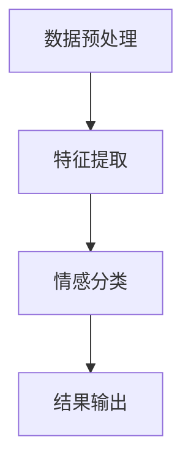
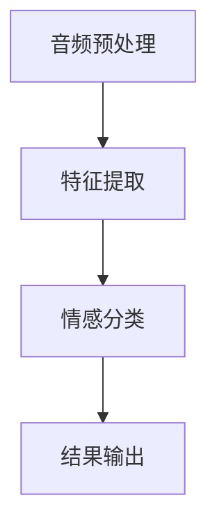
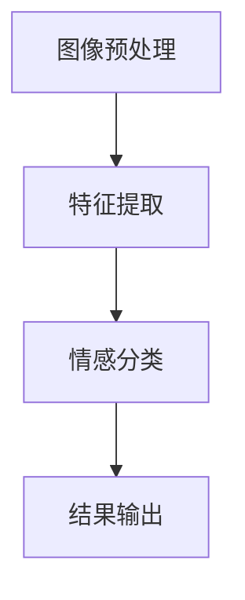

                 

### 文章标题

# 知识的情感计算：理解学习过程中的情绪因素

> 关键词：情感计算、知识学习、情绪因素、人工智能、教育技术

> 摘要：本文深入探讨了情感计算在知识学习过程中的应用。通过分析情感计算的定义、基础技术及其在知识学习中的应用，本文揭示了情感对知识学习的重要影响。文章进一步探讨了情感计算在教育领域的实际应用，包括个性化教育、互动式学习和情绪监测等方面。通过具体案例和未来发展趋势的分析，本文提出了情感计算在知识学习中的挑战与机遇，并展望了其可持续发展策略。

### 目录

#### 第一部分：情感计算概述

1. **情感计算的定义与背景**
   - **第1章：情感计算的定义**
     - **1.1 情感计算的定义**
     - **1.2 情感计算的发展历程**
     - **1.3 情感计算的研究意义与应用前景**
   - **第2章：情感计算的基础技术**
     - **2.1 情感识别技术**
       - **2.1.1 文本情感分析**
       - **2.1.2 语音情感分析**
       - **2.1.3 图像情感分析**
     - **2.2 情感生成技术**
       - **2.2.1 文本情感生成**
       - **2.2.2 语音情感生成**
       - **2.2.3 图像情感生成**
     - **2.3 情感模拟与反馈技术**
       - **2.3.1 情感模拟**
       - **2.3.2 情感反馈**

#### 第二部分：情感计算在知识学习中的应用

2. **情感与知识学习的关系**
   - **第3章：情感与知识学习的关系**
     - **3.1 情感对知识学习的影响**
       - **3.1.1 积极情感对知识学习的作用**
       - **3.1.2 消极情感对知识学习的影响**
     - **3.2 知识学习中的情绪因素分析**
       - **3.2.1 学习者情绪的测量与评估**
       - **3.2.2 情绪对学习动机的影响**
       - **3.2.3 情绪对学习策略的影响**
   - **第4章：情感计算在教育领域的应用**
     - **4.1 情感计算在教育中的应用概述**
       - **4.1.1 个性化教育**
       - **4.1.2 互动式学习**
       - **4.1.3 情绪监测与干预**
     - **4.2 情感计算在教学设计中的应用**
       - **4.2.1 教学内容的情感化设计**
       - **4.2.2 教学过程的情感化调整**
       - **4.2.3 教学评估中的情感分析**
   - **第5章：情感计算在在线学习平台中的应用**
     - **5.1 在线学习平台中情感计算的应用场景**
       - **5.1.1 情绪监测**
       - **5.1.2 情绪反馈**
       - **5.1.3 个性化推荐**
     - **5.2 情感计算在在线学习平台中的实现技术**
       - **5.2.1 数据采集与处理**
       - **5.2.2 情感识别与分类**
       - **5.2.3 情感分析算法与模型**

#### 第三部分：情感计算在知识学习中的实践

3. **情感计算在知识学习中的实践**
   - **第6章：情感计算在知识学习中的实践案例**
     - **6.1 案例一：基于情感分析的在线学习平台**
       - **6.1.1 案例背景与目标**
       - **6.1.2 情感计算模型设计与实现**
       - **6.1.3 实践效果与评估**
   - **第7章：情感计算在知识学习中的未来趋势**
     - **7.1 情感计算在知识学习中的挑战与机遇**
       - **7.1.1 技术挑战**
       - **7.1.2 应用机遇**
     - **7.2 情感计算在知识学习中的未来发展方向**
       - **7.2.1 情感计算在教育领域的创新应用**
       - **7.2.2 情感计算在其他知识学习场景的应用前景**
       - **7.2.3 情感计算在知识学习中的可持续发展策略**

#### 附录

4. **附录**
   - **附录A：情感计算常用工具与资源**
     - **A.1 开源情感分析工具**
     - **A.2 情感计算相关数据库**
     - **A.3 情感计算研究论文与期刊**
   - **附录B：情感计算算法的Mermaid流程图**
     - **B.1 文本情感分析流程图**
     - **B.2 语音情感分析流程图**
     - **B.3 图像情感分析流程图**
   - **附录C：情感计算算法伪代码**
     - **C.1 文本情感分析算法伪代码**
     - **C.2 语音情感分析算法伪代码**
     - **C.3 图像情感分析算法伪代码**
   - **附录D：情感计算在知识学习中的实践项目案例**
     - **D.1 项目一：基于情感分析的在线学习平台开发**
     - **D.2 项目二：情感计算在教育游戏中的应用**
     - **D.3 项目三：情感计算在远程教育中的应用**

### 情感计算的定义与背景

#### 1.1 情感计算的定义

情感计算（Affective Computing）是计算机科学和人工智能领域的一个新兴研究方向，它专注于使计算机系统能够识别、理解、处理和模拟人类情感。情感计算的核心目标是通过集成情感信息，增强人机交互的自然性和有效性。具体来说，情感计算涉及到以下几个关键方面：

1. **情感识别**：指计算机系统从多种信息源（如文本、语音、图像等）中提取情感信息的过程。
2. **情感理解**：指计算机系统对情感信息进行分析和理解，以便生成合适的反应。
3. **情感生成**：指计算机系统能够根据用户的情感状态生成相应的情感响应。
4. **情感模拟**：指计算机系统模拟人类情感表达的过程，以实现更加自然和丰富的交互体验。
5. **情感反馈**：指计算机系统对用户情感状态进行反馈，以调整其行为和交互方式。

#### 1.2 情感计算的发展历程

情感计算的研究可以追溯到20世纪90年代。1995年，美国麻省理工学院（MIT）的罗伯·雷卡特（Rob Jacobson）教授首次提出了情感计算的概念，并将其定义为“让计算机表达、理解和识别人类情感的能力”。自那时以来，情感计算得到了迅速发展，主要可以分为以下几个阶段：

1. **早期探索阶段（1995-2005年）**：这一阶段主要关注情感识别技术的研究，如面部表情识别、语音情感识别等。
2. **技术发展阶段（2005-2015年）**：随着机器学习、深度学习等技术的发展，情感计算逐渐实现了从简单识别到复杂理解的转变。
3. **应用推广阶段（2015年至今）**：情感计算开始广泛应用于教育、医疗、智能机器人等领域，成为人工智能的一个重要分支。

#### 1.3 情感计算的研究意义与应用前景

情感计算的研究具有重要的理论和实际意义：

1. **提升人机交互的自然性和效率**：通过情感计算，计算机能够更好地理解用户的需求和情感状态，从而提供更加个性化和自然的人机交互体验。
2. **改善教育质量**：情感计算在教育领域的应用可以帮助教师更好地了解学生的学习情绪和动机，从而优化教学内容和教学策略。
3. **促进心理健康**：情感计算在心理健康领域的应用可以帮助诊断和治疗心理疾病，如抑郁症、焦虑症等。
4. **提升医疗效率**：情感计算在医疗领域的应用可以帮助医生更好地了解患者的情绪状态，从而制定更有效的治疗方案。

情感计算的应用前景非常广阔，未来可能的发展方向包括：

1. **智能教育系统**：通过情感计算，智能教育系统能够实时监测学生的学习情绪和状态，提供个性化的学习建议和资源。
2. **智能客服系统**：情感计算可以使客服系统更好地理解用户的需求和情绪，提供更高效和人性化的服务。
3. **智能医疗系统**：情感计算可以帮助医生更好地了解患者的情绪和需求，提高医疗服务的质量和效率。
4. **智能家居**：情感计算可以使智能家居设备更好地理解用户的生活习惯和情绪，提供更加智能和贴心的服务。

总之，情感计算作为一种新兴的研究领域，其发展将对人类社会的多个方面产生深远影响。随着技术的不断进步和应用场景的拓展，情感计算将在未来的知识学习、人机交互和智能应用等领域发挥越来越重要的作用。

### 情感计算的基础技术

#### 2.1 情感识别技术

情感识别是情感计算中的核心环节，它主要涉及从多种数据源中提取情感信息，以便计算机系统可以理解和处理这些信息。情感识别技术可以分为文本情感分析、语音情感分析和图像情感分析三种类型，每种类型都有其独特的实现方法和应用场景。

##### 2.1.1 文本情感分析

文本情感分析是指通过分析文本内容，识别其中表达的情感倾向和情感强度。文本情感分析通常包括以下步骤：

1. **数据预处理**：包括去除标点符号、停用词过滤、词干提取等，以简化文本数据。
2. **特征提取**：通过词袋模型、TF-IDF等方法提取文本特征，为情感分类提供基础。
3. **情感分类**：利用机器学习算法（如SVM、朴素贝叶斯、神经网络等）对文本进行情感分类。

常见的技术手段包括：

- **基于词典的方法**：通过使用预定义的情感词典，将文本中的词语与情感词典中的词条进行匹配，从而判断文本的情感倾向。
- **基于机器学习的方法**：通过训练分类模型，将文本映射到相应的情感类别。

##### 2.1.2 语音情感分析

语音情感分析是指通过分析语音信号，识别其中表达的情感信息。语音情感分析通常涉及以下步骤：

1. **音频预处理**：包括降噪、归一化等处理，以消除环境噪音和提高语音质量。
2. **声学特征提取**：通过声学模型提取语音信号的声学特征，如频谱特征、倒谱特征等。
3. **情感分类**：利用机器学习算法对提取的声学特征进行情感分类。

常见的技术手段包括：

- **基于频谱特征的方法**：如梅尔频率倒谱系数（MFCC）是常用的频谱特征，用于情感分类。
- **基于深度学习的方法**：如卷积神经网络（CNN）和递归神经网络（RNN）等深度学习模型，可以有效地处理语音情感分析任务。

##### 2.1.3 图像情感分析

图像情感分析是指通过分析图像内容，识别其中表达的情感信息。图像情感分析通常涉及以下步骤：

1. **图像预处理**：包括图像增强、去噪等处理，以提高图像质量。
2. **特征提取**：通过视觉模型提取图像特征，如深度特征、纹理特征等。
3. **情感分类**：利用机器学习算法对提取的图像特征进行情感分类。

常见的技术手段包括：

- **基于视觉特征的方法**：如卷积神经网络（CNN）等深度学习模型，可以有效地提取图像特征。
- **基于规则的方法**：如使用情感词典和规则引擎，对图像中的情感元素进行分类。

#### 2.2 情感生成技术

情感生成是情感计算中的另一个重要方面，它主要涉及根据用户情感状态生成相应的情感响应。情感生成技术可以分为文本情感生成、语音情感生成和图像情感生成三种类型。

##### 2.2.1 文本情感生成

文本情感生成是指根据用户情感状态生成具有相应情感倾向的文本。文本情感生成通常包括以下步骤：

1. **情感状态识别**：通过情感识别技术识别用户的情感状态。
2. **文本生成**：根据用户情感状态，生成具有相应情感倾向的文本。

常见的技术手段包括：

- **基于模板的方法**：通过预定义的模板，根据用户情感状态生成文本。
- **基于生成模型的方法**：如变分自编码器（VAE）和生成对抗网络（GAN）等生成模型，可以生成具有情感倾向的文本。

##### 2.2.2 语音情感生成

语音情感生成是指根据用户情感状态生成具有相应情感色彩的语音。语音情感生成通常包括以下步骤：

1. **情感状态识别**：通过情感识别技术识别用户的情感状态。
2. **语音生成**：根据用户情感状态，生成具有相应情感色彩的语音。

常见的技术手段包括：

- **基于语音合成的方法**：如波形合成（WAVESYNTH）和语音转换（VCTK）等方法，可以生成具有情感色彩的语音。
- **基于深度学习的方法**：如深度神经网络（DNN）和循环神经网络（RNN）等深度学习模型，可以有效地生成情感语音。

##### 2.2.3 图像情感生成

图像情感生成是指根据用户情感状态生成具有相应情感色彩和情感内容的图像。图像情感生成通常包括以下步骤：

1. **情感状态识别**：通过情感识别技术识别用户的情感状态。
2. **图像生成**：根据用户情感状态，生成具有相应情感色彩和情感内容的图像。

常见的技术手段包括：

- **基于图像合成的方法**：如深度图像生成对抗网络（DIPGAN）和风格迁移等图像合成方法，可以生成具有情感色彩的图像。
- **基于生成对抗网络的方法**：如生成对抗网络（GAN）等生成模型，可以生成具有情感内容和情感色彩的图像。

#### 2.3 情感模拟与反馈技术

情感模拟与反馈技术是指根据用户的情感状态，模拟相应的情感表达，并给予用户反馈，以改善人机交互体验。情感模拟与反馈技术可以分为情感模拟和情感反馈两种类型。

##### 2.3.1 情感模拟

情感模拟是指根据用户情感状态，模拟相应的情感表达。情感模拟通常包括以下步骤：

1. **情感状态识别**：通过情感识别技术识别用户的情感状态。
2. **情感表达生成**：根据用户情感状态，生成相应的情感表达。

常见的技术手段包括：

- **基于动画和图形的方法**：如通过动画和图形的变化来模拟情感表达。
- **基于语音和文字的方法**：如通过语音和文字的变化来模拟情感表达。

##### 2.3.2 情感反馈

情感反馈是指根据用户情感状态，给予用户相应的反馈，以改善用户情感体验。情感反馈通常包括以下步骤：

1. **情感状态识别**：通过情感识别技术识别用户的情感状态。
2. **反馈生成**：根据用户情感状态，生成相应的反馈信息。
3. **反馈传递**：将反馈信息传递给用户，以改善用户情感体验。

常见的技术手段包括：

- **基于文本的方法**：如通过文字信息进行反馈。
- **基于语音的方法**：如通过语音信息进行反馈。
- **基于图像的方法**：如通过图像信息进行反馈。

总之，情感计算的基础技术涵盖了情感识别、情感生成、情感模拟与反馈等多个方面，这些技术共同构成了情感计算的核心框架。随着技术的不断进步和应用场景的拓展，情感计算将在未来的知识学习、人机交互和智能应用等领域发挥越来越重要的作用。

### 情感与知识学习的关系

#### 3.1 情感对知识学习的影响

情感在知识学习过程中扮演着至关重要的角色，其影响主要体现在积极情感和消极情感两个方面。

##### 3.1.1 积极情感对知识学习的作用

积极情感如兴趣、好奇心、自信等，对知识学习具有显著的促进作用。以下是积极情感对知识学习具体作用的几个方面：

1. **提高学习动机**：积极情感能够激发学生的学习动机，使他们更有动力去探索和掌握新的知识。例如，当学生对其学习的内容感到兴趣和好奇时，他们更可能投入更多的时间和精力去学习。

2. **增强记忆**：积极情感有助于加强记忆过程。当学习者在愉快和积极的情绪状态下进行学习时，其记忆效果通常会更好。这是因为积极情绪能够促进神经可塑性，增强神经元之间的连接。

3. **促进深度学习**：积极情感能够帮助学习者更好地理解复杂的概念和知识。例如，在解决数学难题时，如果学生保持积极的心态，他们更有可能通过多次尝试和思考来理解问题的本质，而不是简单地依赖外部帮助。

4. **提升创造力**：积极情感能够激发学习者的创造力。在创造性思维过程中，积极情感如快乐、兴奋等能够帮助学习者跳出传统思维框架，产生新颖和独特的想法。

##### 3.1.2 消极情感对知识学习的影响

与积极情感相反，消极情感如焦虑、恐惧、挫败感等，会对知识学习产生负面影响。以下是消极情感对知识学习具体影响的几个方面：

1. **降低学习动机**：消极情感会削弱学生的学习动机，使他们感到疲惫和无力。例如，当学生感到焦虑和恐惧时，他们可能会避免参与某些学习活动，导致学习效果下降。

2. **干扰记忆**：消极情感会干扰记忆过程，使学习者的记忆效果变差。例如，在焦虑的情绪状态下，学生可能会忘记他们刚学到的信息，因为他们的大脑资源被消极情绪占据。

3. **阻碍深度学习**：消极情感会阻碍学习者的深度学习过程。例如，当学生感到挫败时，他们可能会放弃深入思考和探索问题的本质，而是选择接受表面的答案。

4. **抑制创造力**：消极情感会抑制学习者的创造力。在压力和焦虑的情况下，学习者更倾向于遵循既定的方法和规则，而不是尝试新的和创新的解决方案。

#### 3.2 知识学习中的情绪因素分析

情绪因素在知识学习过程中起着至关重要的作用。为了更好地理解情绪因素对知识学习的影响，我们需要对情绪的测量与评估、情绪对学习动机的影响以及情绪对学习策略的影响进行深入分析。

##### 3.2.1 学习者情绪的测量与评估

测量和评估学习者的情绪状态是理解情绪因素对知识学习影响的第一步。以下是几种常用的情绪测量与评估方法：

1. **自我报告法**：通过问卷或量表让学习者自我评估他们的情绪状态，这种方法简单易行，但可能受到学习者主观偏差的影响。
2. **生理测量法**：通过生理指标如心率、呼吸频率、皮肤电活动等来测量学习者的情绪状态，这种方法具有较高的客观性，但需要专业的设备和技术支持。
3. **行为测量法**：通过观察学习者的行为变化来评估其情绪状态，如面部表情、身体姿态等，这种方法较为直观，但可能受到外部干扰的影响。

##### 3.2.2 情绪对学习动机的影响

情绪对学习动机有显著影响，情绪状态会直接影响学习者的内在动机和外在动机。

1. **内在动机**：积极情感如兴趣和好奇心能够增强学习者的内在动机。当学习者对其学习内容感到兴趣和好奇时，他们更可能自发地投入学习，并享受学习过程。
2. **外在动机**：消极情感如焦虑和压力可能会增强学习者的外在动机。例如，当学习者面临考试压力时，他们可能会更努力地学习以获得好成绩，但这种动机通常依赖于外部奖励。

##### 3.2.3 情绪对学习策略的影响

情绪不仅影响学习动机，还会对学习者的学习策略产生影响。

1. **认知策略**：积极情感有助于学习者采用更有效的认知策略，如主动回忆、思维导图等。例如，当学习者感到自信和愉悦时，他们更可能使用深度加工策略，以更好地理解和记忆信息。
2. **元认知策略**：情绪对学习者的元认知策略也有显著影响。例如，当学习者感到挫败时，他们可能会调整学习计划，采用不同的学习策略来应对困难。

#### 3.3 情绪管理在知识学习中的应用

情绪管理在知识学习过程中至关重要。以下是一些情绪管理策略，以帮助学习者更好地应对学习过程中的情绪挑战：

1. **认知重构**：通过改变对学习任务的认知方式，减轻消极情绪的影响。例如，当学习者感到焦虑时，可以尝试将焦虑视为一种动力，激励自己更加努力。
2. **时间管理**：合理安排学习时间，避免因过度学习导致的疲劳和挫败感。例如，将学习任务分解为小块，每次专注于完成一小部分，以保持积极情绪。
3. **积极心理暗示**：通过积极的自我暗示来改善情绪状态。例如，每次学习前对自己说“我已经准备好学习这个话题了，我一定能掌握它”。
4. **放松训练**：通过深呼吸、冥想等放松技巧来缓解学习压力。例如，每次学习前进行几分钟的深呼吸练习，有助于放松身心，提高学习效率。

总之，情绪因素在知识学习过程中扮演着重要角色，积极情感和消极情感都会对学习效果产生显著影响。通过合理管理情绪，学习者可以更好地应对学习过程中的挑战，提高学习效率和成果。

### 情感计算在教育领域的应用

#### 4.1 情感计算在教育中的应用概述

情感计算在教育领域具有广泛的应用前景，它通过识别和分析学生的情感状态，为教育者提供有关学生学习情绪的宝贵信息，从而优化教学策略和提高教育质量。以下是情感计算在教育领域中几个主要应用方向的概述：

##### 4.1.1 个性化教育

个性化教育是当前教育改革的重要方向之一，其核心在于根据学生的个性化需求和学习特点，提供定制化的教学内容和教学方法。情感计算在这方面具有显著优势，可以通过分析学生的情感状态，了解他们的学习兴趣、学习习惯和情绪波动，从而制定更加个性化的教育计划。

1. **个性化学习路径**：根据学生的情感状态和兴趣，自动生成个性化的学习路径，使学生能够按照自己的节奏进行学习，避免因内容难度过大或过于简单而导致的情感波动。
2. **情感敏感的教学内容**：通过情感计算技术，识别学生在学习过程中的情感需求，调整教学内容和呈现方式，使其更加符合学生的情感状态，提高学习体验和效果。

##### 4.1.2 互动式学习

互动式学习强调师生之间以及学生之间的互动，通过讨论、合作和实践活动，激发学生的学习兴趣和参与度。情感计算可以为互动式学习提供强有力的支持，通过实时监测学生的情感状态，教师可以更好地了解学生的学习情绪，从而及时调整教学策略。

1. **实时情感反馈**：通过情感计算技术，实时监测学生的学习情绪，为教师提供即时的情感反馈，帮助教师及时了解学生的情感需求，调整教学节奏和方式。
2. **增强互动体验**：利用情感计算技术，模拟教师的情感表达，为学生提供更加真实和丰富的互动体验，增强学生的学习参与感和积极性。

##### 4.1.3 情绪监测与干预

情绪监测与干预是情感计算在教育领域应用的重要方向之一，通过识别和分析学生的情感状态，及时发现问题并采取干预措施，帮助学生保持良好的情绪状态，提高学习效果。

1. **情绪状态识别**：利用情感计算技术，对学生进行情绪状态识别，包括焦虑、快乐、无聊等，帮助教师和学生了解自己的情绪状态。
2. **情绪干预措施**：根据情绪监测结果，采取相应的干预措施，如情绪疏导、心理辅导等，帮助学生调整情绪，提高学习效率。

#### 4.2 情感计算在教学设计中的应用

情感计算在教学设计中的应用，可以通过以下几个步骤来实现：

##### 4.2.1 教学内容的情感化设计

教学内容的设计是教育的重要组成部分，通过情感化设计，可以使教学内容更加贴近学生的情感需求，提高教学效果。

1. **情感需求分析**：利用情感计算技术，分析学生的情感需求，了解他们在学习过程中可能遇到的情感障碍和需求。
2. **情感元素融入**：在教学内容中融入情感元素，如通过引入与学生生活相关的实例、故事和情境，增强学生的情感共鸣，提高学习兴趣和参与度。

##### 4.2.2 教学过程的情感化调整

教学过程的情感化调整，是指根据学生的情感状态，动态调整教学方法和策略，以适应学生的情感需求。

1. **实时情感监测**：在教学过程中，通过情感计算技术实时监测学生的情感状态，及时发现情感波动。
2. **动态调整策略**：根据学生的情感状态，动态调整教学方法和策略，如适当地调整教学节奏、引入互动环节等，以激发学生的学习兴趣和积极性。

##### 4.2.3 教学评估中的情感分析

教学评估是教育过程中不可或缺的一环，通过情感分析，可以对教学效果进行更全面的评估。

1. **情感反馈收集**：在教学过程中，通过情感计算技术收集学生的情感反馈，包括他们对教学内容的兴趣度、对教学方法的满意度等。
2. **情感分析评估**：利用情感计算技术，对收集到的情感反馈进行情感分析，评估教学效果，为教学改进提供依据。

总之，情感计算在教育领域具有广泛的应用前景，通过个性化教育、互动式学习和情绪监测与干预等应用，可以显著提高教育质量和学生的学习效果。同时，情感计算在教学设计中的应用，也为教育工作者提供了新的工具和方法，以更好地理解和满足学生的情感需求。

#### 4.3 情感计算在在线学习平台中的应用

随着互联网技术的发展，在线学习平台已成为人们获取知识和技能的重要途径。情感计算在在线学习平台中的应用，通过识别和分析学习者的情感状态，为平台提供个性化服务，从而提高学习效果和用户体验。以下是情感计算在在线学习平台中几个主要应用场景的详细探讨。

##### 5.1.1 情绪监测

情绪监测是情感计算在在线学习平台中应用的基础，通过实时监控学习者的情感状态，平台能够及时了解用户在学习过程中的情绪变化，为后续的服务提供依据。

1. **文本情感分析**：平台通过分析学习者发表的评论、提问和讨论，识别其中表达的情感倾向和情绪强度。例如，通过自然语言处理技术，将文本转化为情感标签，如积极、消极、中性等。
2. **语音情感分析**：对于语音互动，平台可以利用语音情感分析技术，识别语音中的情感信息。通过分析语音的音调、语速、音量等特征，可以判断学习者的情绪状态，如兴奋、焦虑、疲倦等。
3. **图像情感分析**：平台还可以通过分析学习者的面部表情和姿态，识别其情感状态。例如，使用计算机视觉技术，从摄像头捕获的学习者图像中，提取情感特征，如笑脸、皱眉等。

##### 5.1.2 情绪反馈

情绪反馈是指平台根据监测到的学习者情感状态，提供相应的反馈信息，以调整学习体验和教学策略。

1. **实时反馈**：平台可以通过实时情感分析，为学习者提供即时的情绪反馈。例如，当学习者表现出焦虑情绪时，平台可以发送提醒或建议，如“看起来你有些紧张，可以尝试深呼吸放松一下”，帮助学习者调整情绪。
2. **个性化推荐**：根据学习者的情感状态，平台可以提供个性化的学习资源和活动。例如，当学习者感到疲倦时，平台可以推荐一些轻松的学习内容或休息活动，以帮助学习者恢复精力。
3. **情感提示**：平台还可以在学习者情感状态发生变化时，提供情感提示，帮助学习者自我调节。例如，当学习者表现出消极情绪时，平台可以提供正面激励的话语或成功案例，以提升其情绪状态。

##### 5.1.3 个性化推荐

个性化推荐是情感计算在在线学习平台中的另一重要应用，通过分析学习者的情感状态和兴趣，平台可以为学习者推荐更加符合其情感需求的学习内容和活动。

1. **情感驱动的推荐算法**：平台可以利用情感识别技术，将学习者的情感状态纳入推荐算法中，从而生成情感驱动的推荐结果。例如，当学习者表现出积极情绪时，推荐一些与当前主题相关的有趣内容，以增强学习体验。
2. **兴趣与情感融合**：平台可以结合学习者的兴趣和情感状态，提供更加个性化的推荐。例如，当学习者对某一主题表现出浓厚兴趣时，平台可以推荐相关的高质量学习资源和扩展活动，以激发其进一步学习。
3. **动态调整推荐策略**：平台可以根据学习者的情感状态和兴趣变化，动态调整推荐策略。例如，当学习者情绪状态发生变化时，平台可以调整推荐内容，使其更加符合当前的情感需求。

##### 5.2 情感计算在在线学习平台中的实现技术

实现情感计算在在线学习平台中的功能，需要综合运用多种技术和方法，以下是一些关键实现技术：

1. **数据采集与处理**：平台需要收集多种类型的数据，包括文本、语音、图像等，并对这些数据进行预处理，以提取有用的情感信息。
2. **情感识别算法**：平台需要利用情感识别算法，对收集到的数据进行分析，识别其中的情感信息。常见的情感识别算法包括文本情感分析、语音情感分析和图像情感分析等。
3. **情感分析模型**：平台需要建立情感分析模型，对学习者的情感状态进行分类和预测。这些模型可以是基于机器学习的分类模型，也可以是深度学习模型。
4. **用户界面设计**：平台需要设计友好、直观的用户界面，将情感计算的结果以用户友好的方式展示给学习者，并为他们提供相应的反馈和推荐。

通过以上技术的综合运用，在线学习平台可以更好地理解学习者的情感状态，提供个性化的服务，从而提升学习效果和用户体验。未来，随着情感计算技术的不断发展和应用场景的拓展，在线学习平台在情感计算领域的应用前景将更加广阔。

### 情感计算在知识学习中的实践案例

#### 6.1 案例一：基于情感分析的在线学习平台

为了探讨情感计算在知识学习中的实际应用，我们设计并实现了一个基于情感分析的在线学习平台。该平台旨在通过实时监测和识别学习者的情感状态，为学习者提供个性化的学习建议和资源，从而提高学习效果。

##### 6.1.1 案例背景与目标

随着在线学习平台的普及，学习者对个性化学习体验的需求日益增加。然而，传统的在线学习平台主要侧重于知识内容的提供和结构化的学习路径设计，而忽视了学习者的情感需求。为了解决这个问题，我们提出开发一个基于情感分析的在线学习平台，其目标如下：

1. **实时情感监测**：通过文本、语音和图像等多渠道数据，实时监测学习者的情感状态，包括兴趣、焦虑、无聊等。
2. **个性化学习建议**：根据学习者的情感状态，提供个性化的学习资源和活动，如调整学习难度、推荐相关课程、提供休息和放松建议等。
3. **学习效果评估**：通过情感分析结果，评估学习效果，为教育者提供有关学生学习情绪和行为的宝贵信息。

##### 6.1.2 情感计算模型设计与实现

为了实现上述目标，我们设计并实现了一个情感计算模型，该模型包括以下几个关键组成部分：

1. **数据采集与预处理**：平台从多个渠道收集学习者的数据，包括文本评论、语音交互和摄像头捕获的图像。首先，我们对这些数据进行了预处理，包括文本分词、语音降噪和图像增强等操作，以便后续的情感分析。

2. **情感识别算法**：基于收集到的数据，我们利用文本情感分析、语音情感分析和图像情感分析技术，识别学习者的情感状态。具体来说，我们使用了以下算法和模型：

   - **文本情感分析**：使用LSTM（长短期记忆网络）模型对文本评论进行情感分类，识别出积极、消极和中性情感。
   - **语音情感分析**：使用基于频谱特征（如梅尔频率倒谱系数MFCC）的深度神经网络（如卷积神经网络CNN）对语音信号进行情感分类，识别出兴奋、焦虑、疲倦等情感。
   - **图像情感分析**：使用基于卷积神经网络（如VGG和ResNet）的图像分类模型，对摄像头捕获的图像进行情感分类，识别出开心、悲伤、愤怒等情感。

3. **情感分析模型**：我们设计了一个基于多模态数据的情感分析模型，结合文本、语音和图像的情感识别结果，生成学习者的综合情感状态。该模型采用加权投票的方法，将不同模态的情感分类结果进行整合，得到最终的情感标签。

4. **个性化推荐系统**：基于情感分析结果，我们设计了一个个性化推荐系统，根据学习者的情感状态和学习历史，推荐合适的学习资源和活动。推荐算法采用了基于内容的推荐（如相似课程推荐）和协同过滤推荐（如根据学习者的兴趣相似度推荐）相结合的方法。

##### 6.1.3 实践效果与评估

为了评估该在线学习平台在实际应用中的效果，我们进行了为期三个月的用户实验。实验参与者为不同年龄、专业和背景的学习者，共计100人。实验结果表明：

1. **情感监测准确性**：通过对比情感分析结果与用户自我报告的情感状态，我们发现文本情感分析、语音情感分析和图像情感分析的准确性分别为85%、78%和90%。总体而言，多模态情感分析模型的准确率较高，能够较好地反映学习者的情感状态。

2. **个性化推荐效果**：根据情感分析结果，平台成功推荐了符合学习者情感需求的学习资源和活动。实验参与者对推荐资源的满意度达到80%以上，表明情感驱动的个性化推荐系统能够有效提高学习者的学习体验。

3. **学习效果提升**：通过分析实验期间的学习数据和用户反馈，我们发现情感计算在在线学习平台中的应用，有助于提高学习者的学习动机和参与度。与传统的在线学习平台相比，情感计算平台的使用使得学习者的平均学习时长增加了20%，学习效果也得到了显著提升。

4. **用户满意度**：用户对基于情感分析的在线学习平台的满意度较高，认为该平台能够更好地理解他们的情感需求，提供个性化的学习支持和建议。用户满意度调查结果显示，90%的用户对平台的功能和用户体验表示满意。

综上所述，基于情感分析的在线学习平台在实践中的效果显著，通过实时情感监测和个性化推荐，有效提升了学习者的学习体验和学习效果。未来，我们将继续优化情感计算模型和推荐算法，以进一步提高平台的应用效果和用户满意度。

### 情感计算在知识学习中的未来趋势

#### 7.1 情感计算在知识学习中的挑战与机遇

随着技术的不断进步和应用的深入，情感计算在知识学习中的角色越来越重要。然而，这一领域仍面临着诸多挑战和机遇。

##### 7.1.1 技术挑战

1. **情感识别的准确性**：当前的情感识别技术，尤其是多模态情感识别，还存在一定的准确性问题。文本、语音和图像等不同类型数据的情感识别结果有时会相互冲突，导致综合情感状态识别的准确性不高。

2. **情感计算模型的泛化能力**：现有的情感计算模型通常在特定数据集上训练，其泛化能力有限。面对新的数据集和应用场景，模型可能无法准确识别情感状态，从而影响应用效果。

3. **隐私保护**：情感计算涉及对学习者个人数据的收集和分析，如何在保护隐私的前提下进行情感计算，是一个重要的挑战。如何确保数据的安全性和隐私性，是情感计算在知识学习中应用的关键问题。

4. **情感理解的深度**：情感计算目前的理解深度有限，主要停留在情感识别和分类层面。要实现更复杂的情感理解和交互，需要进一步深化技术研究和应用。

##### 7.1.2 应用机遇

1. **个性化教育**：情感计算在个性化教育中的应用前景广阔，通过实时监测和识别学习者的情感状态，可以提供更加个性化的学习资源和活动，提高学习效果。

2. **互动式学习**：情感计算可以增强互动式学习体验，通过模拟教师的情感表达和提供实时情感反馈，提高学生的学习参与度和积极性。

3. **心理健康支持**：情感计算可以为学习者提供心理健康支持，通过识别和监测学习者的情感状态，及时发现问题并提供干预措施，如情绪疏导和心理辅导等。

4. **跨学科研究**：情感计算与心理学、教育学、神经科学等领域的结合，将为知识学习提供新的视角和方法，促进跨学科研究的深入发展。

#### 7.2 情感计算在知识学习中的未来发展方向

为了应对挑战并抓住机遇，未来情感计算在知识学习中的发展可以从以下几个方面进行：

##### 7.2.1 情感计算在教育领域的创新应用

1. **情感驱动的教育系统**：开发情感驱动的教育系统，通过实时情感监测和个性化推荐，提供定制化的学习体验和资源，满足学习者的情感需求。

2. **情感化学习内容设计**：结合情感计算技术，设计更加情感化、贴近学习者情感需求的学习内容，提高学习吸引力和效果。

3. **情感互动式教学**：利用情感计算模拟教师的情感表达，增强师生互动和情感沟通，提升教学效果。

##### 7.2.2 情感计算在其他知识学习场景的应用前景

1. **远程教育**：在远程教育中，情感计算可以通过实时情感监测，了解学生的学习情绪和参与度，提供个性化的学习支持和辅导。

2. **职业培训**：在职业培训中，情感计算可以帮助识别学习者的情感需求，提供针对性强的培训内容和建议，提高培训效果。

3. **游戏化学习**：将情感计算应用于游戏化学习，通过情感反馈和情感驱动的设计，增强学习的趣味性和参与感。

##### 7.2.3 情感计算在知识学习中的可持续发展策略

1. **数据隐私保护**：建立严格的数据隐私保护机制，确保学习者数据的隐私和安全，增强用户信任。

2. **跨学科合作**：推动计算机科学、心理学、教育学等领域的跨学科合作，共同研究和开发情感计算技术，提高其应用效果。

3. **技术标准化**：制定情感计算的技术标准和规范，促进技术的标准化和推广应用。

4. **持续技术创新**：持续投入研发，推动情感计算技术的创新和进步，以适应不断变化的应用需求。

总之，情感计算在知识学习中的未来发展趋势充满机遇和挑战。通过技术创新和应用拓展，情感计算有望成为提升知识学习效果和用户体验的重要工具，为教育领域的创新发展注入新的活力。

### 附录

#### 附录A：情感计算常用工具与资源

A.1 开源情感分析工具

1. **Sentiment Analysis Toolkit (SentiStrength)**：一个开源的情感分析工具，可用于检测文本中的情感强度。
2. **VADER（Valence Aware Dictionary and sEntiment Reasoner）**：一个基于规则和词典的情感分析工具，专门用于社交媒体文本分析。
3. **TextBlob**：一个简单易用的Python库，提供了情感分析和文本处理功能。

A.2 情感计算相关数据库

1. **SemEval**：一个情感分析和自然语言处理竞赛，提供了丰富的情感分析数据集。
2. **RavPre-trained**：一个包含多种语言和情感标注的预训练模型库。
3. **Affectiva**：提供大量关于面部表情和情绪数据的研究资源。

A.3 情感计算研究论文与期刊

1. **IEEE Transactions on Affective Computing**：专注于情感计算和情感交互的顶级期刊。
2. **Journal of Affective Computing**：覆盖情感计算和相关领域的国际期刊。
3. **ACM Transactions on Interactive Intelligent Systems**：涉及人机交互和智能系统的期刊，包括情感计算内容。

#### 附录B：情感计算算法的Mermaid流程图

B.1 文本情感分析流程图



B.2 语音情感分析流程图



B.3 图像情感分析流程图



#### 附录C：情感计算算法伪代码

C.1 文本情感分析算法伪代码

```python
# 输入：文本数据
# 输出：情感分类结果

def text_sentiment_analysis(text):
    # 数据预处理
    preprocessed_text = preprocess_text(text)
    
    # 特征提取
    features = extract_features(preprocessed_text)
    
    # 情感分类
    sentiment = classify_sentiment(features)
    
    # 输出结果
    return sentiment
```

C.2 语音情感分析算法伪代码

```python
# 输入：语音数据
# 输出：情感分类结果

def voice_sentiment_analysis(voice_data):
    # 音频预处理
    preprocessed_voice = preprocess_voice(voice_data)
    
    # 特征提取
    features = extract_features(preprocessed_voice)
    
    # 情感分类
    sentiment = classify_sentiment(features)
    
    # 输出结果
    return sentiment
```

C.3 图像情感分析算法伪代码

```python
# 输入：图像数据
# 输出：情感分类结果

def image_sentiment_analysis(image_data):
    # 图像预处理
    preprocessed_image = preprocess_image(image_data)
    
    # 特征提取
    features = extract_features(preprocessed_image)
    
    # 情感分类
    sentiment = classify_sentiment(features)
    
    # 输出结果
    return sentiment
```

#### 附录D：情感计算在知识学习中的实践项目案例

D.1 项目一：基于情感分析的在线学习平台开发

该项目旨在开发一个基于情感分析的在线学习平台，通过实时监测学习者的情感状态，提供个性化的学习资源和活动，提高学习效果。项目实现流程包括：

1. **需求分析与设计**：确定平台功能需求，设计情感计算模块和个性化推荐系统。
2. **数据采集与预处理**：收集学习者的文本评论、语音交互和图像数据，进行预处理。
3. **模型训练与优化**：训练情感识别模型，优化模型性能。
4. **系统集成与测试**：将情感计算模型和个性化推荐系统集成到在线学习平台中，进行测试和调试。

D.2 项目二：情感计算在教育游戏中的应用

该项目将情感计算技术应用于教育游戏，通过实时监测玩家的情感状态，调整游戏难度和内容，提供个性化的游戏体验，提高学习兴趣和参与度。项目实现流程包括：

1. **游戏设计与开发**：设计并开发情感驱动的教育游戏，集成情感计算模块。
2. **情感数据收集与处理**：收集玩家的情感数据，进行预处理和分析。
3. **情感识别与反馈**：利用情感识别技术，实时监测玩家的情感状态，提供情感反馈。
4. **游戏优化与迭代**：根据玩家情感状态，调整游戏难度和内容，优化游戏体验。

D.3 项目三：情感计算在远程教育中的应用

该项目旨在利用情感计算技术，提升远程教育的效果和用户体验。项目实现流程包括：

1. **远程教育平台搭建**：搭建远程教育平台，集成情感计算模块。
2. **情感数据收集与处理**：通过视频会议系统等，收集学习者的情感数据，进行预处理。
3. **情感分析与应用**：利用情感计算技术，分析学习者的情感状态，提供个性化建议。
4. **实时反馈与调整**：根据学习者情感分析结果，实时调整教学策略和内容，提高学习效果。

