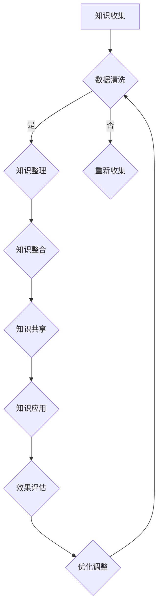
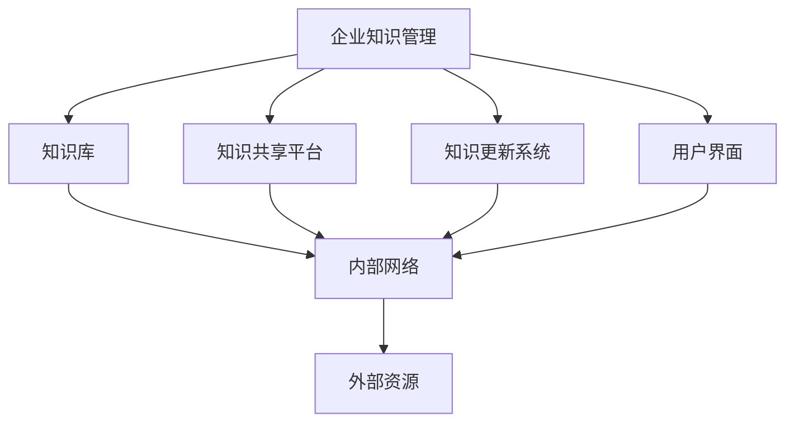

                 

## 《知识的时效性：如何保持与时俱进》

### 关键词：
- 知识时效性
- 持续学习
- 知识更新
- 知识管理
- 技术创新
- 教育改革

> 知识的时效性是信息技术领域的核心问题之一。随着科技的迅速发展，知识的更新速度变得越来越快，传统的学习方法和知识管理方式已经无法满足日益增长的知识需求。本文将深入探讨知识的时效性概念，分析其影响和挑战，并提出一系列方法和策略，帮助个人、企业和教育领域保持知识的时效性，与时俱进。

## 《知识的时效性：如何保持与时俱进》目录大纲

### 第一部分：知识的时效性概述

#### 第1章：知识的时效性概念与背景
- **1.1 知识时效性的定义与特征**
- **1.2 知识时效性的影响与挑战**
- **1.3 知识更新的重要性**

#### 第2章：知识更新的方法与策略
- **2.1 主动学习与持续学习**
- **2.2 信息筛选与处理**
- **2.3 知识重构与转化**

#### 第3章：个人知识管理的实践
- **3.1 知识库的构建与管理**
- **3.2 知识分享与传播**
- **3.3 个人知识成长路径**

### 第二部分：知识时效性的应用领域

#### 第4章：学术研究中的知识时效性
- **4.1 学术研究的时效性挑战**
- **4.2 学术文献的筛选与评估**
- **4.3 学术研究的知识更新策略**

#### 第5章：企业中的知识管理
- **5.1 企业知识管理的目标与原则**
- **5.2 企业知识库的构建与维护**
- **5.3 企业知识更新的实践案例**

#### 第6章：教育领域的知识时效性
- **6.1 教育知识更新的重要性**
- **6.2 教育课程的设计与调整**
- **6.3 教育资源的优化与更新**

#### 第7章：科技发展的知识时效性
- **7.1 科技领域的知识更新速度**
- **7.2 科技创新中的知识管理**
- **7.3 科技发展趋势预测与应对**

### 第三部分：案例分析

#### 第8章：案例分析：知识时效性的成功实践
- **8.1 案例一：企业知识管理的转型**
- **8.2 案例二：学术领域的知识更新策略**
- **8.3 案例三：教育机构的课程更新实践**

#### 第9章：知识时效性的未来展望
- **9.1 知识时效性的未来挑战与机遇**
- **9.2 知识时效性的发展趋势分析**
- **9.3 保持知识与时俱进的长期策略**

### 附录

#### 附录A：知识时效性相关工具与资源
- **A.1 知识管理工具简介**
- **A.2 学术文献检索工具**
- **A.3 知识库构建与维护指南**

#### 附录B：Mermaid流程图示例
- **B.1 知识更新的流程图**
- **B.2 企业知识管理的架构图**

#### 附录C：知识时效性相关术语解释
- **C.1 知识更新率**
- **C.2 知识半衰期**
- **C.3 知识储备能力**

### 摘要
知识的时效性是指知识在特定时间内保持有效和准确的能力。在信息技术飞速发展的今天，知识的时效性显得尤为重要。本文首先定义了知识的时效性，并分析了其在学术研究、企业管理和教育领域的影响与挑战。接着，本文提出了主动学习、持续学习、信息筛选与处理、知识重构与转化等知识更新的方法与策略。在个人知识管理的实践中，文章探讨了知识库的构建与管理、知识分享与传播以及个人知识成长路径。随后，文章针对学术研究、企业和教育领域分别提出了相应的知识更新策略和实践案例。最后，文章对未来知识时效性的发展趋势进行了展望，并提出了保持知识与时俱进的长期策略。通过本文的深入分析和具体指导，希望读者能够更好地理解和应对知识时效性带来的挑战，保持自身知识的时效性和竞争力。

### 第1章：知识的时效性概念与背景

#### 1.1 知识时效性的定义与特征

知识的时效性是指知识在特定时间范围内保持其有效性和准确性的能力。随着信息技术的迅速发展，知识的更新速度越来越快，时效性成为衡量知识价值的重要指标。知识的时效性特征主要体现在以下几个方面：

1. **时效性变化**：知识时效性具有明显的变化特征，即随着时间的推移，知识的时效性会逐渐降低。例如，某一技术领域的最新研究可能在短时间内迅速取代旧有技术，使得原有知识迅速过时。

2. **更新速度快**：信息技术的发展使得知识更新速度加快。在过去，知识更新的周期可能需要数年，而如今，某些领域的知识更新周期可能缩短至几个月甚至几周。

3. **动态性**：知识的时效性具有动态性，不同领域和不同时间点的知识时效性可能会有很大差异。例如，在快速发展的信息技术领域，新技术的出现和旧技术的淘汰速度非常快，因此知识的时效性较为短暂。

4. **适应性**：知识的时效性还取决于知识的适应能力。当知识能够迅速适应新的环境和需求时，其时效性可能会得到延长。例如，一些基本原理和算法在经过适当调整后，可以应用于不同的技术领域，从而延长其时效性。

#### 1.2 知识时效性的影响与挑战

知识的时效性对个人、企业和学术研究等方面都产生了深远的影响和挑战。

1. **对个人的影响**：对于个人来说，知识时效性意味着必须不断更新自己的知识储备，以适应快速变化的工作环境和需求。这要求个人具备较强的学习能力和知识管理能力，以便及时掌握新知识，并将其应用于实际工作中。

2. **对企业的挑战**：对企业而言，知识时效性要求企业不断进行技术创新和知识更新，以保持市场竞争力和技术优势。企业需要建立有效的知识管理体系，确保知识的时效性，从而提高企业的整体效率和创新能力。

3. **对学术研究的挑战**：在学术研究领域，知识时效性意味着研究人员需要迅速掌握最新的研究成果，并将其转化为学术贡献。此外，学术期刊和会议的审稿周期也在不断缩短，要求研究人员具备更高的工作效率和学术敏感度。

4. **知识更新成本**：知识时效性还带来了知识更新成本的问题。对于个人和企业而言，不断更新知识需要投入大量的时间和资源。此外，知识更新的过程中还可能涉及到对旧有知识的淘汰和重新学习，这无疑增加了知识更新的成本。

#### 1.3 知识更新的重要性

知识更新是保持知识时效性的关键。以下是知识更新的一些重要性：

1. **提升竞争力**：在竞争激烈的市场环境中，具备最新知识的企业和个人更容易抓住市场机会，提高竞争力。

2. **适应新技术**：随着新技术的不断涌现，知识更新有助于个人和企业适应新的技术趋势，避免被淘汰。

3. **提高效率**：掌握最新知识可以提高工作效率，减少因信息滞后导致的错误和重复劳动。

4. **创新驱动**：知识更新可以激发创新思维，促进技术进步和学术研究的发展。

综上所述，知识的时效性是信息技术领域的重要概念，对个人、企业和学术研究等方面都具有重要的影响和挑战。为了应对这些挑战，个人和企业需要采取有效的知识更新策略，以保持知识的时效性和竞争力。在下一章中，我们将探讨知识更新的方法与策略。

### 第2章：知识更新的方法与策略

#### 2.1 主动学习与持续学习

主动学习和持续学习是保持知识时效性的重要方法。主动学习是指通过自觉的努力和主动探索来获取新知识，而不是被动地接受信息。持续学习则强调在日常生活中不断学习新知识，并将其应用于实际工作中。

1. **主动学习的步骤**：
   - **设定学习目标**：明确自己的学习目标，确保学习过程具有明确的方向。
   - **选择学习资源**：根据学习目标选择合适的教材、在线课程、讲座和研讨会等学习资源。
   - **制定学习计划**：合理安排学习时间，确保学习计划的执行。
   - **实践与应用**：将所学知识应用于实际工作中，通过实践来加深理解。

2. **持续学习的策略**：
   - **终身学习观念**：树立终身学习的观念，将学习视为一种生活方式，而不是阶段性任务。
   - **时间管理**：合理安排时间，将学习纳入日常生活，确保持续学习的稳定性。
   - **学习社区**：加入学习社区，与其他学习者交流经验，互相启发，提高学习效果。

#### 2.2 信息筛选与处理

在信息爆炸的时代，如何筛选和处理信息成为保持知识时效性的关键。以下是几种常见的信息筛选与处理方法：

1. **信息筛选方法**：
   - **来源筛选**：优先选择权威和可信的来源，如知名学术期刊、权威出版社和专业网站。
   - **标题筛选**：通过标题初步判断信息的价值和相关性，筛选出可能对自己有帮助的内容。
   - **摘要阅读**：快速阅读摘要，了解文章的主要观点和结论，筛选出值得深入阅读的内容。

2. **信息处理方法**：
   - **分类整理**：将获取的信息按照主题、类型和重要性进行分类整理，便于后续查阅和应用。
   - **批判性思维**：对信息进行批判性思考，分析信息的真实性和可信度，避免盲目接受。
   - **共享与传播**：将有价值的信息与他人分享，通过知识传播来提高信息利用率。

#### 2.3 知识重构与转化

知识重构和转化是将新知识融入已有知识体系，提升知识实效性的有效方法。

1. **知识重构步骤**：
   - **识别旧知识**：分析现有知识体系，识别需要重构的旧知识。
   - **评估新知识**：对新知识进行评估，确定其与旧知识的关系和融合点。
   - **重构知识体系**：根据新知识的特性，对知识体系进行调整和优化，确保知识的连贯性和完整性。

2. **知识转化策略**：
   - **应用迁移**：将新知识应用于实际工作中，通过实践来加深理解和掌握。
   - **知识创新**：结合新知识和已有经验，进行知识创新，开发新的解决方案。
   - **跨学科融合**：将不同学科的知识进行融合，形成新的知识体系，推动跨学科发展。

通过主动学习与持续学习、信息筛选与处理和知识重构与转化，个人和企业可以有效地保持知识的时效性，提高知识管理和创新能力。在下一章中，我们将探讨个人知识管理的实践，进一步探讨如何通过有效的知识管理来提升知识的时效性。

### 第3章：个人知识管理的实践

#### 3.1 知识库的构建与管理

知识库是个人知识管理的重要组成部分，它有助于系统地存储、组织和检索知识。以下是构建和管理知识库的步骤和策略：

1. **构建知识库的步骤**：
   - **需求分析**：确定知识库的用途和目标用户，分析所需的知识类型和结构。
   - **系统设计**：设计知识库的架构，包括数据库结构、数据存储方式和数据访问接口。
   - **数据收集**：收集相关领域的知识，包括书籍、论文、研究报告、博客文章等。
   - **数据清洗**：对收集的数据进行清洗和整理，确保数据的准确性和一致性。
   - **知识整合**：将收集到的数据整合到知识库中，形成系统化的知识资源。

2. **管理知识库的策略**：
   - **分类管理**：对知识库中的知识进行分类管理，便于用户快速检索和查找。
   - **标签管理**：为知识库中的知识添加标签，提高知识的可搜索性和相关性。
   - **权限管理**：设置知识库的权限管理机制，确保知识的安全性和保密性。
   - **更新维护**：定期对知识库进行更新和维护，确保知识的时效性和准确性。

#### 3.2 知识分享与传播

知识分享与传播是提升知识价值的重要环节，它有助于扩大知识的受众范围和影响力。以下是知识分享与传播的方法和策略：

1. **知识分享的方法**：
   - **内部培训**：组织内部培训活动，将知识库中的知识传授给团队成员。
   - **在线平台**：利用社交媒体、博客、论坛等在线平台，分享自己的知识和见解。
   - **公开演讲**：参加行业会议、研讨会等活动，通过演讲和讨论分享知识。
   - **协作项目**：参与跨部门或跨领域的项目，与其他团队成员共同研究和分享知识。

2. **知识传播的策略**：
   - **内容营销**：通过撰写专业文章、发布案例研究、制作教学视频等方式，传播知识和经验。
   - **知识社区**：加入知识社区，与其他知识爱好者交流，共同探讨和分享知识。
   - **知识共享协议**：制定知识共享协议，明确知识分享的范围和条件，保护知识创作者的权益。
   - **激励机制**：建立激励机制，鼓励团队成员积极参与知识分享和传播活动。

#### 3.3 个人知识成长路径

个人知识成长路径是指个人在职业生涯中不断学习和提升知识的过程。以下是一些常见的个人知识成长路径：

1. **初学者阶段**：初学者阶段的主要目标是建立基础知识体系，通过学习基础理论和实践技能，为后续深入学习打下基础。

2. **中级阶段**：在中级阶段，个人需要深入学习专业领域，掌握核心技术和方法，并参与实际项目，提升解决实际问题的能力。

3. **高级阶段**：在高级阶段，个人需要不断拓展知识边界，学习前沿技术和理论，进行创新性研究和开发，成为行业专家。

4. **终身学习阶段**：在终身学习阶段，个人需要保持持续学习的态度，不断更新知识和技能，适应快速变化的市场环境。

通过构建和管理知识库、知识分享与传播以及制定个人知识成长路径，个人可以有效地提升知识的时效性和实用性，保持自身在职业发展中的竞争力和创新能力。在下一章中，我们将探讨学术研究中的知识时效性，分析学术研究在保持知识时效性方面所面临的挑战和策略。

### 第4章：学术研究中的知识时效性

#### 4.1 学术研究的时效性挑战

学术研究中的知识时效性挑战主要体现在以下几个方面：

1. **研究速度与成果发布的压力**：随着学术竞争的加剧，研究人员面临越来越大的研究速度和成果发布压力。为了在学术界保持竞争力，研究人员需要在短时间内完成高质量的研究，并迅速发布研究成果。

2. **知识更新速度**：学术领域的知识更新速度非常快，尤其是在一些前沿领域。新理论、新方法和新发现不断涌现，要求研究人员迅速掌握这些知识，并将其应用于后续研究中。

3. **数据获取与处理的复杂性**：许多学术研究需要大量数据作为支持，数据的获取和处理过程可能非常复杂和耗时。研究人员需要花费大量时间和精力来收集、整理和分析数据，以确保研究结果的准确性和可靠性。

4. **知识整合与交叉学科研究**：学术研究越来越倾向于跨学科整合，研究人员需要具备多学科的知识背景，以便在交叉学科研究中进行有效的知识整合和协作。

5. **研究资金的限制**：学术研究往往需要大量资金支持，包括实验室设备、数据采集和数据分析等。资金限制可能导致研究项目无法顺利进行，影响研究成果的时效性和质量。

#### 4.2 学术文献的筛选与评估

为了应对学术研究中的时效性挑战，研究人员需要掌握有效的学术文献筛选与评估方法：

1. **筛选方法**：
   - **来源筛选**：优先选择权威和可信的学术期刊、出版社和会议，确保文献的质量。
   - **标题和摘要筛选**：通过阅读标题和摘要，初步判断文献的相关性和重要性。
   - **关键词筛选**：利用关键词检索工具，筛选与研究主题相关的文献。

2. **评估方法**：
   - **文献质量评估**：通过阅读文献，评估其研究方法、数据质量和结论可靠性。
   - **同行评审**：参考其他研究人员的评价和评论，了解文献的学术影响力。
   - **引用次数分析**：通过引用次数分析，判断文献的受欢迎程度和学术价值。

#### 4.3 学术研究的知识更新策略

为了保持学术研究的时效性，研究人员可以采取以下知识更新策略：

1. **持续学习与培训**：定期参加学术会议、研讨会和培训活动，了解最新的研究动态和方法。
2. **跨学科合作**：与其他学科的研究人员进行合作，借助不同领域的知识和方法，提升研究质量和创新性。
3. **知识管理工具**：利用知识管理工具，如文献管理软件和在线数据库，方便地获取、整理和检索学术文献。
4. **开放获取与共享**：积极参与开放获取运动，共享自己的研究成果，促进知识的传播和交流。
5. **研究方法与创新**：不断探索新的研究方法和技术，提高研究的效率和质量。

通过有效的学术文献筛选与评估和知识更新策略，研究人员可以更好地应对学术研究中的时效性挑战，提升研究成果的质量和影响力。在下一章中，我们将探讨企业中的知识管理，分析企业如何通过有效的知识管理来保持知识的时效性。

### 第5章：企业中的知识管理

#### 5.1 企业知识管理的目标与原则

企业知识管理是指通过系统的方法和技术，对企业的知识资源进行收集、存储、共享、更新和应用，以提升企业的创新能力和竞争力。企业知识管理的目标主要包括以下几个方面：

1. **提高知识利用率**：通过有效的知识管理，确保企业内部的知识资源得到充分利用，减少知识浪费和重复劳动。

2. **促进知识共享**：建立良好的知识共享机制，鼓励员工分享知识和经验，促进跨部门和跨团队的协作。

3. **提升创新能力**：通过知识管理，积累和整合企业内外部的知识资源，为企业创新提供有力支持。

4. **增强企业竞争力**：通过保持知识的时效性和准确性，确保企业在市场竞争中保持技术领先和战略优势。

企业知识管理的基本原则包括：

1. **系统性**：知识管理是一个系统性工程，需要从整体上规划和实施，确保各个环节相互衔接和协同。

2. **动态性**：知识管理需要具备动态性，能够及时适应企业内外部环境的变化，调整知识管理策略。

3. **持续性**：知识管理是一个持续的过程，需要长期投入和持续改进，以确保知识管理的有效性和稳定性。

4. **共享性**：知识管理强调知识的共享和传播，通过共享机制，实现知识的最大化利用。

#### 5.2 企业知识库的构建与维护

企业知识库是企业知识管理的核心组成部分，是存储、管理和共享企业知识资源的重要工具。以下是企业知识库的构建与维护步骤：

1. **需求分析**：分析企业的知识需求，确定知识库的用途和功能，包括知识分类、检索功能、权限管理等。

2. **系统设计**：设计知识库的系统架构，包括数据库结构、前端界面设计和后台管理功能。

3. **知识收集**：从内部文档、外部资源、员工经验等多个渠道收集知识，确保知识的全面性和准确性。

4. **知识整理**：对收集到的知识进行分类、标注和整理，形成系统化的知识资源。

5. **知识更新**：建立知识更新机制，定期对知识库中的知识进行审查和更新，确保知识的时效性和准确性。

6. **权限管理**：设置知识库的权限管理机制，确保知识的安全性和保密性，同时方便用户查阅和共享。

#### 5.3 企业知识更新的实践案例

以下是一个企业知识更新的实践案例：

**案例背景**：某科技公司是一家以技术创新为核心的企业，随着市场竞争的加剧，公司意识到知识管理的重要性，决定进行企业知识更新。

**实施步骤**：
1. **需求调研**：通过内部调查和访谈，了解各部门的知识需求和问题。
2. **制定策略**：根据需求调研结果，制定知识更新策略，包括知识收集、整理、共享和培训等。
3. **知识收集**：从内部文档、外部资源、员工经验等多个渠道收集知识，并进行分类整理。
4. **知识共享**：通过内部网站和知识分享平台，方便员工查阅和共享知识。
5. **知识培训**：组织内部培训活动，将知识库中的知识传授给员工，提高员工的知识水平。
6. **持续改进**：定期对知识更新效果进行评估，根据反馈进行调整和优化。

**效果评估**：
- 通过知识更新，员工的知识水平和技能得到显著提升，提高了工作效率和创新能力。
- 企业内部的知识共享氛围得到增强，促进了跨部门和跨团队的协作。
- 企业在市场竞争中的技术优势和创新能力得到巩固，取得了良好的业绩。

通过有效的企业知识管理，企业可以保持知识的时效性，提高知识利用率，增强创新能力，从而在激烈的市场竞争中保持领先地位。在下一章中，我们将探讨教育领域的知识时效性，分析教育知识更新的重要性和实践方法。

### 第6章：教育领域的知识时效性

#### 6.1 教育知识更新的重要性

教育知识更新是教育领域的重要任务之一，它关系到教育的质量和学生的成长。以下是教育知识更新的重要性：

1. **适应社会需求**：随着社会的发展，各行各业的知识和技术不断更新，教育必须及时调整课程内容和教学方法，以适应社会需求。

2. **提高教学质量**：教育知识更新能够为教师提供最新的教学资源和教学理念，提高教学质量和教学效果。

3. **培养学生的创新能力**：教育知识更新有助于培养学生的创新能力和批判性思维，使其具备适应未来社会的能力。

4. **促进教育公平**：教育知识更新可以缩小城乡、区域之间的教育差距，使所有学生都能接受到最新、最优质的教育资源。

#### 6.2 教育课程的设计与调整

教育课程的设计与调整是教育知识更新的重要组成部分，以下是教育课程设计与调整的方法：

1. **需求分析**：首先，分析社会需求和学生需求，确定课程的目标和内容。这包括对行业发展趋势、学生就业前景、社会需求等方面的研究。

2. **课程内容更新**：根据需求分析结果，对课程内容进行更新。这包括引入最新的科研成果、行业标准和技术发展，确保课程内容的时效性和实用性。

3. **教学方法改进**：结合课程内容更新，改进教学方法，采用现代教育技术和手段，如在线教育、翻转课堂等，提高教学效果。

4. **课程结构优化**：对课程结构进行优化，确保课程内容的逻辑性和系统性，使学生能够更好地理解和掌握知识。

#### 6.3 教育资源的优化与更新

教育资源的优化与更新是教育知识更新的重要环节，以下是一些具体的实践方法：

1. **教材更新**：定期更新教材，引入最新版本的教材和辅助材料，确保教材内容的时效性和准确性。

2. **线上资源建设**：利用互联网资源，建立线上教育资源库，包括视频课程、电子书籍、练习题等，为学生提供丰富的学习资源。

3. **教学辅助工具**：引入现代教学辅助工具，如互动白板、虚拟实验室等，提高教学效果。

4. **教师培训**：定期对教师进行培训，提高教师的教育技术和教学能力，使其能够更好地应对教育知识更新的挑战。

通过教育知识更新，教育领域可以更好地适应社会发展的需求，提高教学质量，培养学生的创新能力，从而为社会培养更多优秀的人才。在下一章中，我们将探讨科技发展的知识时效性，分析科技领域知识更新的速度和应对策略。

### 第7章：科技发展的知识时效性

#### 7.1 科技领域的知识更新速度

科技发展日新月异，知识更新的速度也越来越快。以下从几个方面分析科技领域知识更新的速度：

1. **技术创新频率**：随着科技进步，新技术、新产品和新方法不断涌现。例如，在信息技术领域，每年都会有新的编程语言、框架和工具发布。

2. **研发周期缩短**：科技项目的研发周期不断缩短。以前可能需要数年才能完成的科研项目，现在可能在几个月甚至几周内就能完成。

3. **数据爆炸**：大数据技术的发展使得数据获取和处理变得更加容易，科技领域产生的数据量呈指数级增长，这要求研究人员必须迅速更新知识和技能，以应对数据处理的挑战。

4. **学科交叉融合**：科技领域的知识更新速度加快，学科之间的交叉融合也越来越普遍。例如，人工智能技术不仅涉及计算机科学，还涉及数学、统计学、生物学等多个领域。

#### 7.2 科技创新中的知识管理

在科技创新中，知识管理起着至关重要的作用。以下是科技创新中的知识管理策略：

1. **建立知识库**：科技企业应建立全面的知识库，收集和整理内部和外部的科技知识，确保知识资源的系统化和完整性。

2. **知识共享与传播**：通过内部交流、培训、研讨会等方式，促进知识的共享与传播，提高员工的知识水平和创新能力。

3. **研发项目管理**：采用项目管理系统，对研发项目进行全程跟踪和管理，确保知识资源的有效利用。

4. **知识产权保护**：加强对知识产权的保护，确保企业创新成果的合法性和权益。

#### 7.3 科技发展趋势预测与应对

为了应对科技发展的知识时效性，企业和研究人员可以采取以下措施：

1. **趋势预测**：通过市场调研、数据分析、专家咨询等方式，预测科技发展趋势，提前布局。

2. **技术创新**：不断进行技术创新，紧跟科技发展趋势，保持技术领先优势。

3. **持续学习**：鼓励员工和研究人员持续学习，提高知识更新速度和技能水平。

4. **合作与交流**：加强与企业、高校和科研机构的合作与交流，共享资源和知识。

通过以上措施，企业和研究人员可以更好地应对科技发展的知识时效性挑战，保持科技创新的活力和竞争力。在下一章中，我们将通过案例分析，探讨知识时效性的成功实践。

### 第8章：案例分析：知识时效性的成功实践

#### 8.1 案例一：企业知识管理的转型

**案例背景**：某大型科技企业在市场竞争中感受到知识管理的重要性，决定进行企业知识管理的转型。

**实施步骤**：
1. **需求分析**：通过内部调研，了解各部门的知识需求和现状。
2. **系统设计**：设计企业知识库系统，包括知识收集、整理、共享和更新功能。
3. **知识收集**：从内部文档、外部资源、员工经验等多个渠道收集知识。
4. **知识共享**：建立内部知识共享平台，鼓励员工共享知识和经验。
5. **知识更新**：建立知识更新机制，定期审查和更新知识库内容。
6. **培训与推广**：对员工进行知识管理培训，推广知识管理理念和方法。

**效果评估**：
- 通过知识管理转型，企业内部的知识利用率显著提高，减少了知识浪费和重复劳动。
- 企业创新能力和市场竞争力得到提升，取得了良好的业绩。

#### 8.2 案例二：学术领域的知识更新策略

**案例背景**：某知名大学在学术研究方面感受到知识更新的重要性，决定制定知识更新策略。

**实施步骤**：
1. **需求分析**：分析学术领域的知识更新需求和趋势。
2. **知识收集**：通过学术期刊、会议、研究报告等渠道收集最新的学术文献。
3. **知识整理**：对收集到的学术文献进行分类整理，建立学术文献数据库。
4. **知识共享**：通过内部网络平台，共享学术文献和研究成果。
5. **知识评估**：定期对学术文献进行评估，确保文献的质量和时效性。
6. **持续学习**：鼓励研究人员参加学术会议、培训和研究项目，持续更新知识。

**效果评估**：
- 通过知识更新策略，大学的研究水平和学术影响力得到显著提升。
- 研究人员的知识水平和创新能力得到提升，取得了多项高水平研究成果。

#### 8.3 案例三：教育机构的课程更新实践

**案例背景**：某知名教育机构意识到教育知识更新的重要性，决定进行课程更新实践。

**实施步骤**：
1. **需求分析**：通过市场调研和学生反馈，了解课程需求和社会发展趋势。
2. **课程设计**：结合需求分析结果，设计新的课程体系和教学内容。
3. **教学资源更新**：引入最新的教材、视频课程和教学工具，确保教学资源的时效性和实用性。
4. **教学方法改进**：采用现代教育技术和手段，如在线教育、翻转课堂等，提高教学效果。
5. **教师培训**：对教师进行培训，提高其教育技术和教学方法。
6. **持续评估**：定期对课程效果进行评估，根据反馈进行调整和优化。

**效果评估**：
- 通过课程更新实践，学生的知识水平和学习兴趣得到显著提升。
- 教育机构在市场上获得了良好的声誉，吸引了更多学生和家长的关注。

通过以上案例分析，我们可以看到，在个人、企业和教育领域，通过有效的知识管理和更新策略，可以显著提升知识的时效性和实用性，从而提高整体竞争力和创新能力。在下一章中，我们将探讨知识时效性的未来展望。

### 第9章：知识时效性的未来展望

#### 9.1 知识时效性的未来挑战与机遇

随着科技的不断进步，知识时效性面临的挑战与机遇也在不断变化。

**挑战**：
1. **知识更新速度加快**：人工智能、大数据等技术的快速发展，使得知识更新速度显著加快，对个人和企业提出了更高的知识更新要求。
2. **信息过载**：信息爆炸时代，知识获取渠道增多，但信息质量参差不齐，筛选和处理信息成为知识时效性面临的挑战。
3. **知识整合难度增加**：跨学科、跨领域的知识整合难度加大，如何有效整合不同领域的知识成为重要挑战。

**机遇**：
1. **智能知识管理**：人工智能技术的应用，为知识管理提供了新的手段和工具，有助于提高知识管理的效率和准确性。
2. **终身学习理念的普及**：终身学习理念的普及，使个人和企业更加重视知识更新和持续学习，为知识时效性的保持提供了动力。
3. **知识共享与传播的便利**：互联网和社交媒体的普及，使得知识共享与传播更加便捷，有助于知识的快速传播和共享。

#### 9.2 知识时效性的发展趋势分析

知识时效性在未来将呈现以下发展趋势：

1. **知识更新自动化**：人工智能和机器学习技术的应用，将使知识更新更加自动化，提高知识更新的速度和准确性。
2. **知识融合与创新**：跨学科、跨领域的知识融合将成为趋势，促进知识的创新和应用的多样化。
3. **知识服务个性化**：随着大数据和人工智能技术的发展，知识服务将更加个性化，根据个人和企业的需求提供定制化的知识服务。
4. **知识管理智能化**：智能知识管理系统的普及，将使知识管理更加高效和智能化，提高知识管理的整体水平。

#### 9.3 保持知识与时俱进的长期策略

为了保持知识的时效性，个人和企业可以采取以下长期策略：

1. **持续学习与培训**：建立持续学习的机制，鼓励员工和个人不断学习新知识，提高知识更新速度。
2. **知识共享与传播**：建立良好的知识共享与传播机制，促进内部和外部知识的交流和共享。
3. **知识整合与创新**：积极整合不同领域的知识，推动知识的创新和应用。
4. **智能知识管理**：引入智能知识管理系统，提高知识管理的效率和准确性。
5. **战略规划与调整**：根据市场环境和科技发展趋势，制定相应的知识更新和战略规划，确保知识管理的持续性和适应性。

通过以上策略，个人和企业可以更好地应对知识时效性的挑战，抓住机遇，保持知识的时效性和竞争力。

### 附录A：知识时效性相关工具与资源

#### A.1 知识管理工具简介

1. **Confluence**：是一款面向团队协作的知识管理工具，支持文档的创建、共享和版本控制，适用于企业内部知识库的构建。
2. **Trello**：是一款基于看板的项目管理工具，可以帮助团队对任务进行管理，提高知识共享和任务执行的效率。
3. **Evernote**：是一款个人知识管理工具，支持笔记的创建、存储和同步，适用于个人知识记录和整理。

#### A.2 学术文献检索工具

1. **Google Scholar**：是一款免费的学术搜索引擎，可以检索全球范围内的学术文献。
2. **PubMed**：是一款专业的医学和生命科学文献检索工具，提供了大量的医学和生物学文献。
3. **IEEE Xplore**：是一款电气工程和计算机科学领域的文献数据库，提供了丰富的学术论文和会议记录。

#### A.3 知识库构建与维护指南

1. **知识库构建步骤**：
   - **需求分析**：明确知识库的用途和目标用户。
   - **系统设计**：设计知识库的架构和功能模块。
   - **数据收集**：从多种渠道收集相关领域的知识。
   - **数据整理**：对收集到的数据进行分析、分类和标注。
   - **知识整合**：将整理好的数据整合到知识库中。

2. **知识库维护策略**：
   - **定期审查**：定期对知识库中的知识进行审查和更新。
   - **用户反馈**：收集用户对知识库的反馈，优化知识库的内容和结构。
   - **权限管理**：设置知识库的权限管理机制，确保知识的安全性和保密性。

通过以上工具和资源的介绍，个人和企业可以更好地进行知识管理和更新，保持知识的时效性和准确性。

### 附录B：Mermaid流程图示例

#### B.1 知识更新的流程图

#### B.2 企业知识管理的架构图

通过以上Mermaid流程图示例，可以更清晰地展示知识更新的流程和企业知识管理的架构。

### 附录C：知识时效性相关术语解释

#### C.1 知识更新率

知识更新率是指知识在特定时间内被更新的频率。它通常用百分比表示，表示知识库中知识更新的比例。知识更新率越高，知识时效性越强。

$$
更新率 = \frac{更新次数}{总知识量} \times 100\%
$$

#### C.2 知识半衰期

知识半衰期是指知识保持其有效性和准确性的时间。在知识半衰期内，知识被认为是有效的。知识半衰期通常根据不同领域和知识类型进行评估。

$$
知识半衰期 = \frac{1}{更新率}
$$

#### C.3 知识储备能力

知识储备能力是指个人或组织在特定领域内掌握的知识总量。它反映了个人或组织的知识水平。知识储备能力越强，越能适应快速变化的知识环境。

$$
知识储备能力 = 知识量 \times 更新频率
$$

通过以上术语的解释，可以更好地理解知识时效性的相关概念和指标，为知识管理和更新提供指导。

### 作者信息

**作者：** AI天才研究院/AI Genius Institute & 禅与计算机程序设计艺术 /Zen And The Art of Computer Programming

