                 

## 文章标题：知识的民主化：开放教育资源与全民学习

### 关键词：
开放教育资源（OER），知识民主化，教育公平，终身学习，企业培训，技术创新，教育模式变革，社会经济影响

### 摘要：
本文探讨了开放教育资源（OER）的概念、发展历程、核心原则和理论基础，分析了开放教育资源的建设与推广策略、在教学和企业在培训中的应用，以及面临的法律与伦理问题。同时，文章展望了开放教育资源的未来趋势，探讨了其在技术创新、教育模式变革和社会经济影响等方面的作用。

## 目录大纲：
1. **第一部分：开放教育资源概述**
   1.1 开放教育资源的基本概念
       - 发展历程
       - 核心原则
       - 主要类型
   1.2 开放教育资源的理论基础
       - 知识民主化
       - 教育公平
       - 终身学习

2. **第二部分：开放教育资源的实施与应用**
   2.1 开放教育资源的建设与推广
       - 建设策略
       - 推广方法
       - 使用与反馈
   2.2 开放教育资源在教学中的应用
       - 教学设计
       - 课程开发
       - 教师专业发展
   2.3 开放教育资源在企业培训中的应用
       - 作用
       - 应用策略
       - 挑战与对策

3. **第三部分：开放教育资源的未来发展**
   3.1 开放教育资源的法律与伦理问题
       - 相关法律法规
       - 伦理问题与解决方案
       - 国际合作中的挑战与机遇
   3.2 开放教育资源的未来趋势
       - 技术创新
       - 教育模式变革
       - 社会经济影响

4. **附录**
   4.1 开放教育资源参考资源与工具
       - 平台介绍
       - 工具与应用软件
       - 研究文献与报告

---

### 第一部分：开放教育资源概述

#### 第1章：开放教育资源的基本概念

##### 1.1 开放教育资源的发展历程

开放教育资源（OER）的概念最早起源于1999年，由Wikipedia的创始人吉米·威尔士（Jimmy Wales）提出。OER的核心理念是开放性、重用性、适应性、共享性，旨在为所有人提供免费的、可重用的教育资源，促进知识民主化。以下是一个关于开放教育资源发展历程的Mermaid流程图：

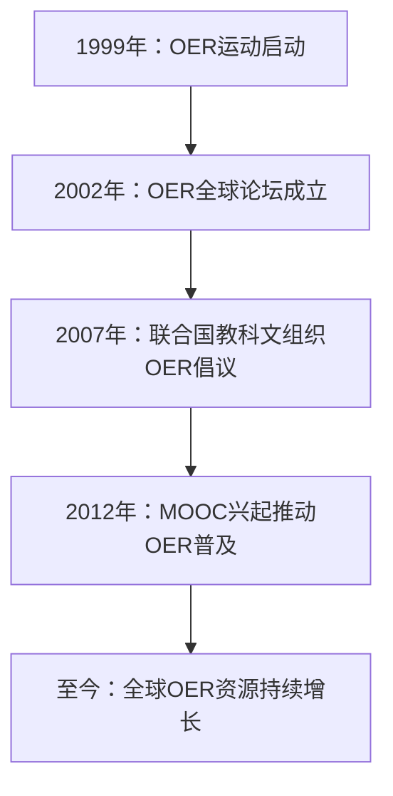

从1999年OER运动启动以来，随着互联网技术的不断发展，OER资源在全球范围内得到了迅速的推广和应用。2002年，OER全球论坛成立，成为OER推广的重要平台。2007年，联合国教科文组织正式发起OER倡议，推动了全球范围内OER的发展。2012年，大规模开放在线课程（MOOC）的兴起进一步推动了OER的普及，使得更多人能够享受到优质的教育资源。至今，全球范围内的OER资源仍在持续增长，为知识的普及和公平获取提供了重要保障。

##### 1.2 开放教育资源的核心原则

开放教育资源的核心原则包括开放性、重用性、适应性和共享性。这些原则共同构成了开放教育资源的理论基础，也是OER能够实现知识民主化的重要保障。

- **开放性**：开放性是OER最核心的原则，它要求教育资源的获取是免费的或低费用的，用户可以在任何时间和地点免费访问这些资源。开放性使得知识传播更加便捷，有助于缩小教育资源的差距，促进教育公平。

- **重用性**：重用性允许用户在原有资源的基础上进行修改和使用，从而创造出新的教育资源。这有助于提高教育资源的利用效率，促进知识的创新和共享。

- **适应性**：适应性要求教育资源能够根据用户的需求进行修改和调整，以满足不同学习者的学习需求。适应性有助于提高教育资源的实用性和有效性，促进个性化学习。

- **共享性**：共享性鼓励用户将改进后的资源分享回社区，使得教育资源在更广泛的范围内得到应用和传播。共享性有助于形成良好的教育生态系统，促进知识的循环和积累。

##### 1.3 开放教育资源的主要类型

开放教育资源主要包括课程资源、教材资源和学习工具等几类。

- **课程资源**：课程资源包括讲义、教学视频、练习题、实验报告等，是教学过程中不可或缺的部分。课程资源可以通过网络平台进行共享，供学习者免费下载和使用，有助于提高教学效果和学习体验。

- **教材资源**：教材资源包括电子书、教科书、参考书籍等，是学习者获取知识的重要来源。教材资源的开放和共享，有助于降低学习成本，提高学习者的学习效率。

- **学习工具**：学习工具包括在线学习管理系统、虚拟实验室、学习软件等，为学习者和教师提供了丰富的学习资源和教学工具。学习工具的开放和共享，有助于提高教学质量和学习效果。

#### 第2章：开放教育资源的理论基础

##### 2.1 开放教育资源与知识民主化

知识民主化是指通过开放和共享知识，促进知识的普及和公平获取，使每个人都能享受到优质的教育资源。开放教育资源是实现知识民主化的重要手段，它通过降低知识获取的门槛，缩小教育资源的差距，推动教育公平的实现。

数学模型和数学公式可以更好地解释知识民主化与开放教育资源之间的关系：

$$
\text{知识民主化} = \text{开放性} \times \text{可访问性} \times \text{共享性}
$$

- **开放性**：开放性是知识民主化的基础，它要求教育资源的获取是免费的或低费用的，用户可以在任何时间和地点免费访问这些资源。开放性使得知识传播更加便捷，有助于缩小教育资源的差距，促进教育公平。

- **可访问性**：可访问性是指教育资源对用户来说是易于获取的，不受地理位置、经济条件等因素的限制。可访问性有助于提高教育资源的普及率，使更多人能够享受到优质的教育资源。

- **共享性**：共享性是指用户可以将获取到的教育资源进行分享，使教育资源在更广泛的范围内得到应用和传播。共享性有助于形成良好的教育生态系统，促进知识的循环和积累。

通过上述公式，我们可以看出，开放教育资源与知识民主化之间存在着密切的关系。开放性、可访问性和共享性共同推动了知识民主化的实现，使得知识的普及和公平获取成为可能。

##### 2.2 开放教育资源与教育公平

教育公平是指每个个体在获取教育资源方面享有平等的机会，不受经济、社会、种族等因素的影响。开放教育资源通过降低知识获取的门槛，缩小教育资源的差距，有助于实现教育公平。

数学模型和数学公式可以更好地解释开放教育资源与教育公平之间的关系：

$$
\text{教育公平} = \text{资源公平分配} + \text{机会均等}
$$

- **资源公平分配**：资源公平分配是指教育资源在各个地区、各个群体之间的分配是公平的，不会因为经济、社会等因素而导致资源分配的不均衡。开放教育资源通过免费或低费用的方式提供教育服务，有助于实现资源的公平分配。

- **机会均等**：机会均等是指每个个体在获取教育资源时都享有平等的机会，不会因为经济、社会等因素而受到歧视。开放教育资源提供了丰富的学习资源，使得每个个体都有机会获得高质量的教育，从而促进机会均等的实现。

通过上述公式，我们可以看出，开放教育资源与教育公平之间存在着密切的关系。资源公平分配和机会均等共同推动了教育公平的实现，使得每个个体都能享受到平等的教育机会。

##### 2.3 开放教育资源与终身学习

终身学习是指个体在其一生中持续学习和发展的过程，以适应快速变化的社会需求和职业发展。开放教育资源为终身学习提供了丰富的学习资源，有助于提高个体的学习能力和知识水平。

数学模型和数学公式可以更好地解释开放教育资源与终身学习之间的关系：

$$
\text{终身学习} = \text{知识更新速度} \times \text{学习资源丰富度}
$$

- **知识更新速度**：知识更新速度是指知识在短时间内不断更新和变化的速度。随着科技的快速发展，知识更新速度越来越快，个体需要不断学习和更新知识，以保持竞争力。开放教育资源提供了丰富的学习资源，有助于个体快速获取新的知识，提高学习效率。

- **学习资源丰富度**：学习资源丰富度是指学习资源的多样性和质量。开放教育资源涵盖了各个领域和层次的学习资源，包括课程资源、教材资源和学习工具等，为个体提供了丰富的学习选择，有助于满足个体多样化的学习需求。

通过上述公式，我们可以看出，开放教育资源与终身学习之间存在着密切的关系。知识更新速度和学习资源丰富度共同推动了终身学习的实现，使得个体能够持续学习和成长。

### 第二部分：开放教育资源的实施与应用

#### 第3章：开放教育资源的建设与推广

##### 3.1 开放教育资源的建设策略

开放教育资源的建设是开放教育资源发展的基础，其建设策略需要综合考虑资源需求、预算、平台选择、资源类型、内容标准、专家团队组织以及资源更新与维护等多个方面。以下是一个关于开放教育资源建设策略的Mermaid流程图：

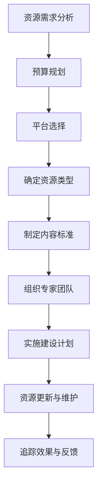

- **资源需求分析**：在建设开放教育资源之前，需要明确资源需求，包括课程资源、教材资源和学习工具等。资源需求分析有助于确定建设重点和资源类型，确保资源的实用性和针对性。

- **预算规划**：预算规划是开放教育资源建设的关键环节，需要合理分配预算，确保资源建设的可持续性。预算规划应包括人力、物力和技术支持等各方面成本。

- **平台选择**：平台选择是开放教育资源建设的重要决策，需要考虑平台的稳定性、安全性、易用性以及扩展性等因素。常见的开放教育资源平台包括Moodle、Canvas、edX等。

- **确定资源类型**：开放教育资源类型多样，包括课程资源、教材资源和学习工具等。确定资源类型有助于明确资源建设的方向和目标，确保资源的高质量和实用性。

- **制定内容标准**：内容标准是开放教育资源建设的基础，需要制定明确的资源质量标准、内容规范和格式要求。内容标准有助于确保资源的一致性和规范性，提高资源的使用效果。

- **组织专家团队**：组织专家团队是开放教育资源建设的重要保障，需要汇聚各领域专家，共同参与资源建设和质量控制。专家团队应具备丰富的教学经验和专业知识，以确保资源的高质量和实用性。

- **实施建设计划**：实施建设计划是开放教育资源建设的关键环节，需要按照建设计划有序推进，确保资源的质量和进度。实施建设计划应包括资源开发、内容审核、资源发布和用户反馈等环节。

- **资源更新与维护**：资源更新与维护是开放教育资源建设的重要保障，需要定期更新资源内容，修复技术故障，提高资源的使用效果。资源更新与维护有助于确保资源的时效性和实用性，提高用户的满意度。

- **追踪效果与反馈**：追踪效果与反馈是开放教育资源建设的重要环节，需要收集用户反馈，分析资源的使用效果，不断优化资源建设策略。追踪效果与反馈有助于发现资源建设的不足和改进方向，推动开放教育资源的持续发展。

##### 3.2 开放教育资源的推广方法

开放教育资源的推广是提高资源利用率和知名度的重要手段，其推广方法需要综合考虑推广计划、社交媒体、合作伙伴关系、线下活动和效果评估与优化等多个方面。以下是一个关于开放教育资源推广方法的Mermaid流程图：

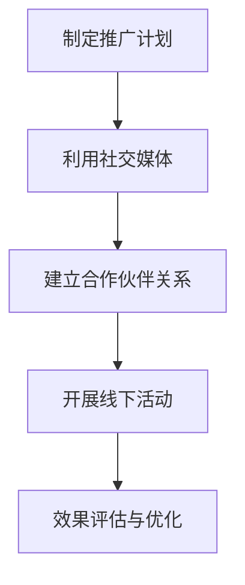

- **制定推广计划**：制定推广计划是开放教育资源推广的重要前提，需要明确推广目标、推广策略和推广渠道。推广计划应包括推广目标、推广预算、推广时间和推广效果评估等。

- **利用社交媒体**：社交媒体是开放教育资源推广的重要渠道，可以通过微信、微博、抖音、B站等平台进行推广。利用社交媒体进行推广，可以扩大资源的影响力，提高用户的参与度和互动性。

- **建立合作伙伴关系**：建立合作伙伴关系是开放教育资源推广的重要手段，可以与学校、企业、社会组织等建立合作关系，共同推广开放教育资源。建立合作伙伴关系有助于扩大资源的覆盖范围，提高资源的使用效果。

- **开展线下活动**：开展线下活动是开放教育资源推广的重要方式，可以通过讲座、研讨会、培训班等形式进行推广。开展线下活动可以增强用户的参与感和体验感，提高资源的使用效果。

- **效果评估与优化**：效果评估与优化是开放教育资源推广的重要环节，需要收集推广效果数据，分析推广效果，不断优化推广策略。效果评估与优化有助于提高推广效果，确保资源的最大化利用。

##### 3.3 开放教育资源的使用与反馈

开放教育资源的使用与反馈是提高资源质量和用户体验的重要环节，其使用与反馈方法需要综合考虑资源访问、用户反馈、数据分析和资源改进等多个方面。以下是一个关于开放教育资源使用与反馈方法的Mermaid流程图：

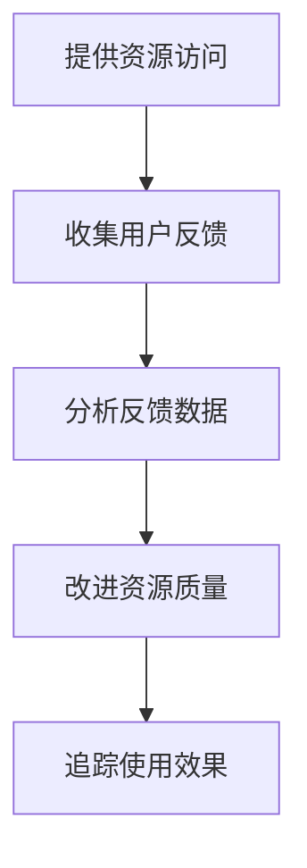

- **提供资源访问**：提供资源访问是开放教育资源使用与反馈的前提，需要确保用户能够方便地获取和访问资源。提供资源访问可以通过网络平台、移动应用等渠道实现，确保用户能够在任何时间和地点获取资源。

- **收集用户反馈**：收集用户反馈是开放教育资源使用与反馈的关键，可以通过问卷调查、用户评论、在线反馈等方式收集用户对资源的评价和建议。收集用户反馈有助于了解用户的需求和满意度，为资源改进提供依据。

- **分析反馈数据**：分析反馈数据是开放教育资源使用与反馈的核心，需要对收集到的用户反馈进行数据分析和归纳总结。分析反馈数据有助于发现资源存在的问题和改进方向，为资源改进提供科学依据。

- **改进资源质量**：改进资源质量是开放教育资源使用与反馈的目的，需要根据用户反馈和数据分析，对资源进行改进和优化。改进资源质量可以从内容、形式、技术等方面入手，提高资源的实用性和用户体验。

- **追踪使用效果**：追踪使用效果是开放教育资源使用与反馈的持续过程，需要持续跟踪用户对资源的反馈和使用情况，了解资源的实际效果。追踪使用效果有助于发现资源使用中的问题，为资源的持续改进提供支持。

#### 第4章：开放教育资源在教学中的应用

##### 4.1 开放教育资源在教学设计中的应用

开放教育资源在教学设计中的应用具有重要意义，它可以帮助教师更好地实现教学目标，提高教学效果。以下是一个关于开放教育资源在教学设计中的应用方法的Mermaid流程图：

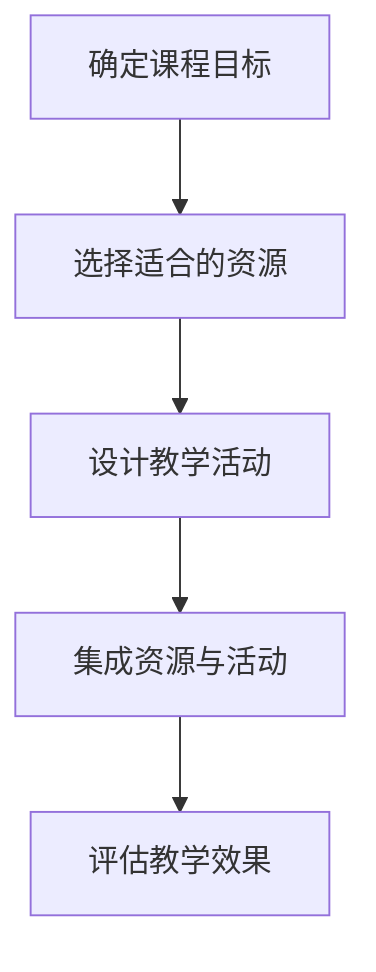

- **确定课程目标**：确定课程目标是教学设计的核心，教师需要明确课程的教学目标，包括知识目标、能力目标和情感目标等。确定课程目标有助于确保教学活动的针对性和有效性。

- **选择适合的资源**：选择适合的资源是实现课程目标的重要环节，教师需要根据课程目标和学习者的需求，选择合适的开放教育资源。选择适合的资源可以从课程资源、教材资源和学习工具等多个方面进行考虑。

- **设计教学活动**：设计教学活动是实现课程目标的重要手段，教师需要根据课程目标和资源特点，设计出具有趣味性、互动性和实用性的教学活动。设计教学活动可以从课堂讨论、实验实践、案例分析等多个方面进行考虑。

- **集成资源与活动**：集成资源与活动是将开放教育资源与教学活动有机结合的重要环节，教师需要将资源与教学活动进行有机整合，确保资源能够有效地服务于教学目标。集成资源与活动可以从内容、形式、技术等多个方面进行考虑。

- **评估教学效果**：评估教学效果是教学设计的重要环节，教师需要通过多种评估方法，如考试、作业、课堂表现等，评估学生的学习效果。评估教学效果有助于了解教学活动的有效性，为教学改进提供依据。

##### 4.2 开放教育资源在课程开发中的应用

开放教育资源在课程开发中的应用具有重要意义，它可以帮助课程开发者更好地实现课程目标，提高课程质量。以下是一个关于开放教育资源在课程开发中的应用方法的Mermaid流程图：

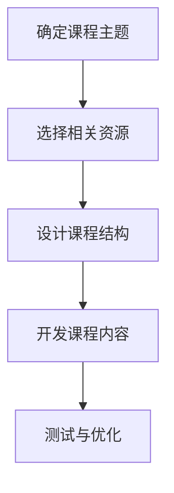

- **确定课程主题**：确定课程主题是课程开发的核心，课程开发者需要明确课程的主题和目标，确保课程具有明确的导向性。确定课程主题可以从学科领域、社会需求、学习者特点等多个方面进行考虑。

- **选择相关资源**：选择相关资源是实现课程目标的重要环节，课程开发者需要根据课程主题和学习者的需求，选择合适的开放教育资源。选择相关资源可以从课程资源、教材资源和学习工具等多个方面进行考虑。

- **设计课程结构**：设计课程结构是实现课程目标的重要手段，课程开发者需要根据课程主题和资源特点，设计出具有层次性、系统性和实用性的课程结构。设计课程结构可以从知识体系、学习路径、教学活动等多个方面进行考虑。

- **开发课程内容**：开发课程内容是实现课程目标的重要环节，课程开发者需要根据课程结构和资源特点，开发出具有创新性、实用性和趣味性的课程内容。开发课程内容可以从理论讲解、案例分析、实验实践等多个方面进行考虑。

- **测试与优化**：测试与优化是课程开发的重要环节，课程开发者需要通过测试，评估课程的质量和效果，发现存在的问题和改进方向。测试与优化可以从课程内容、教学活动、用户反馈等多个方面进行考虑。

##### 4.3 开放教育资源在教师专业发展中的应用

开放教育资源在教师专业发展中的应用具有重要意义，它可以帮助教师不断提升教学能力和专业水平。以下是一个关于开放教育资源在教师专业发展中的应用方法的Mermaid流程图：

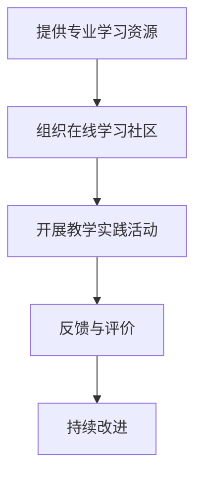

- **提供专业学习资源**：提供专业学习资源是教师专业发展的基础，教育机构需要为教师提供丰富的学习资源，包括课程资源、教材资源和学习工具等。提供专业学习资源有助于教师不断更新知识，提升教学能力。

- **组织在线学习社区**：组织在线学习社区是教师专业发展的重要手段，教育机构可以通过建立在线学习社区，为教师提供一个交流、分享和学习的平台。组织在线学习社区有助于教师相互学习、共同成长。

- **开展教学实践活动**：开展教学实践活动是教师专业发展的重要环节，教育机构需要为教师提供实践机会，让他们将所学知识应用于教学实践。开展教学实践活动有助于教师提高教学能力，积累教学经验。

- **反馈与评价**：反馈与评价是教师专业发展的重要环节，教育机构需要为教师提供反馈和评价机制，帮助他们了解自己的优势和不足，制定改进计划。反馈与评价有助于教师不断反思和改进自己的教学方法和策略。

- **持续改进**：持续改进是教师专业发展的关键，教师需要不断学习新知识、新技能，并将其应用于教学实践。持续改进有助于教师不断提升教学能力，适应教育发展的需求。

#### 第5章：开放教育资源在企业培训中的应用

##### 5.1 开放教育资源在企业培训中的作用

开放教育资源在企业培训中具有重要作用，它可以帮助企业提高员工的技能和知识水平，提升整体竞争力。以下是一个关于开放教育资源在企业培训中的作用和影响的Mermaid流程图：

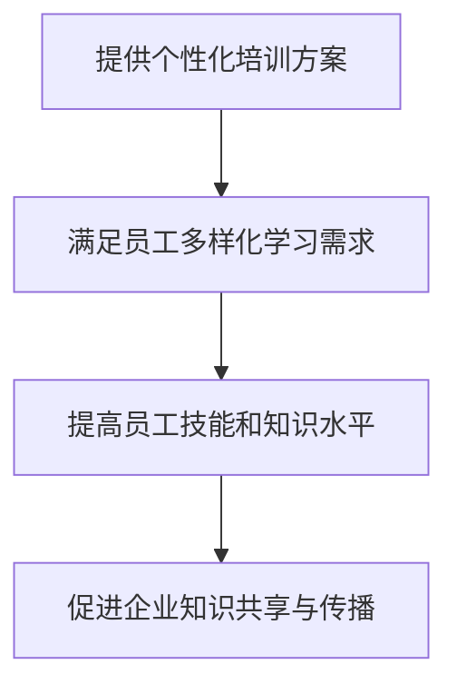

- **提供个性化培训方案**：开放教育资源可以根据员工的个性化需求，提供定制化的培训方案。这种个性化培训方案有助于满足员工多样化的学习需求，提高培训的针对性和有效性。

- **满足员工多样化学习需求**：员工在职业生涯中面临不同的发展阶段和需求，开放教育资源可以提供丰富多样的学习资源，包括课程资源、教材资源和学习工具等，满足员工的多样化学习需求。

- **提高员工技能和知识水平**：开放教育资源涵盖了各个领域和层次的学习资源，员工可以通过学习这些资源，不断提升自己的技能和知识水平，从而提高工作效率和绩效。

- **促进企业知识共享与传播**：开放教育资源可以促进企业内部的知识共享与传播，通过在线学习平台和社区，员工可以分享自己的学习经验和知识，促进企业整体知识水平的提高。

##### 5.2 开放教育资源在企业培训中的应用策略

为了充分发挥开放教育资源在企业培训中的作用，企业需要制定科学合理的应用策略。以下是一个关于开放教育资源在企业培训中的应用策略的Mermaid流程图：

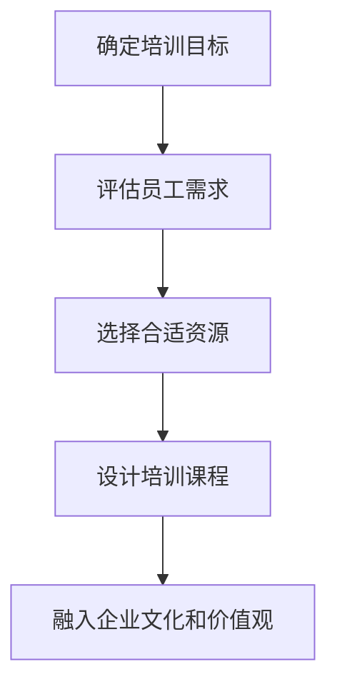

- **确定培训目标**：企业培训的目标是提高员工的技能和知识水平，满足企业的发展需求。在应用开放教育资源时，企业需要明确培训目标，确保培训方案与目标的一致性。

- **评估员工需求**：员工的需求是企业制定培训方案的重要依据，企业需要通过调查问卷、访谈等方式，了解员工的学习需求和兴趣点，为培训方案的制定提供参考。

- **选择合适资源**：开放教育资源种类繁多，企业需要根据培训目标和员工需求，选择合适的资源。选择合适资源可以从课程资源、教材资源和学习工具等多个方面进行考虑。

- **设计培训课程**：设计培训课程是实现培训目标的关键，企业需要根据开放教育资源的特点，设计出符合员工需求的培训课程。设计培训课程可以从课程内容、教学活动、考核方式等多个方面进行考虑。

- **融入企业文化和价值观**：开放教育资源在企业培训中的应用，不仅要满足员工的培训需求，还要融入企业文化和价值观。企业可以将开放教育资源与企业文化相结合，提高员工的归属感和认同感。

##### 5.3 开放教育资源对企业培训的挑战与对策

开放教育资源在企业培训中虽然具有诸多优势，但也面临一定的挑战。以下是一个关于开放教育资源在企业培训中面临的挑战和对策的Mermaid流程图：

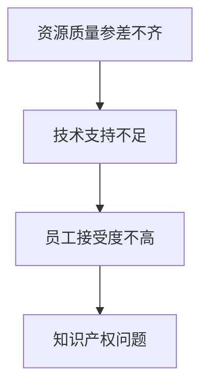

- **资源质量参差不齐**：开放教育资源的质量参差不齐，企业需要花费大量时间和精力筛选合适的资源。对策：建立资源评价体系，对资源进行分类和筛选，确保资源的高质量。

- **技术支持不足**：企业可能缺乏足够的技术支持，影响开放教育资源的有效利用。对策：寻求外部技术支持，与专业培训机构合作，提高技术支持水平。

- **员工接受度不高**：员工可能对开放教育资源缺乏足够的认识和理解，影响培训效果。对策：加强培训宣传和推广，提高员工对开放教育资源的认知和接受度。

- **知识产权问题**：开放教育资源可能涉及知识产权问题，企业需要确保资源的合法性和合规性。对策：遵循相关法律法规，加强与资源提供方的沟通与合作，确保资源的合法使用。

### 第三部分：开放教育资源的未来发展

#### 第6章：开放教育资源的法律与伦理问题

##### 6.1 开放教育资源的相关法律法规

开放教育资源的开发和利用需要遵循相关的法律法规，这些法律法规主要包括版权法、专利法、隐私法和数据保护法。以下是一个关于开放教育资源相关法律法规的Mermaid流程图：

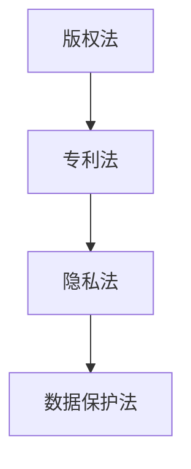

- **版权法**：版权法是保护知识产权的重要法律，它规定了作品的权利归属、使用和保护等内容。开放教育资源的开发和利用需要遵循版权法，确保资源的合法性和合规性。

- **专利法**：专利法是保护发明创造的重要法律，它规定了发明的权利归属、申请和保护等内容。开放教育资源的开发和利用可能涉及专利问题，企业需要确保资源的专利合规性。

- **隐私法**：隐私法是保护个人隐私的重要法律，它规定了个人信息的收集、使用和保护等内容。开放教育资源的开发和利用需要关注隐私问题，确保个人信息的合法使用和保护。

- **数据保护法**：数据保护法是保护数据安全的重要法律，它规定了数据的收集、存储、处理和保护等内容。开放教育资源的开发和利用需要遵循数据保护法，确保数据的安全性和合规性。

##### 6.2 开放教育资源的伦理问题与解决方案

开放教育资源在开发和利用过程中，可能会面临一系列伦理问题，如知识产权保护、隐私保护、信息真实性和教育公平性等。以下是一个关于开放教育资源伦理问题和解决方案的Mermaid流程图：

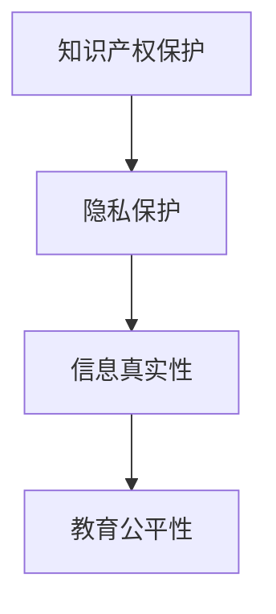

- **知识产权保护**：知识产权保护是开放教育资源伦理问题的核心，开放教育资源的开发和利用需要尊重知识产权，避免侵权行为。解决方案：建立知识产权保护机制，对资源进行版权登记和保护。

- **隐私保护**：隐私保护是开放教育资源伦理问题的另一个重要方面，开放教育资源的开发和利用需要关注个人隐私，确保个人信息的合法使用和保护。解决方案：制定隐私政策，明确个人信息收集、使用和保护的规定。

- **信息真实性**：信息真实性是开放教育资源伦理问题的关键，开放教育资源的开发和利用需要确保信息的真实性和准确性，避免虚假信息的传播。解决方案：建立信息审核机制，对资源进行真实性和准确性审核。

- **教育公平性**：教育公平性是开放教育资源伦理问题的终极目标，开放教育资源的开发和利用需要关注教育公平，确保资源的普及性和公平性。解决方案：制定公平性政策，确保资源对所有人开放和免费获取。

##### 6.3 开放教育资源在国际合作中的挑战与机遇

开放教育资源在国际合作中面临着一系列挑战，如资源共享、文化差异、政策支持和技术标准等。以下是一个关于开放教育资源国际合作挑战和机遇的Mermaid流程图：

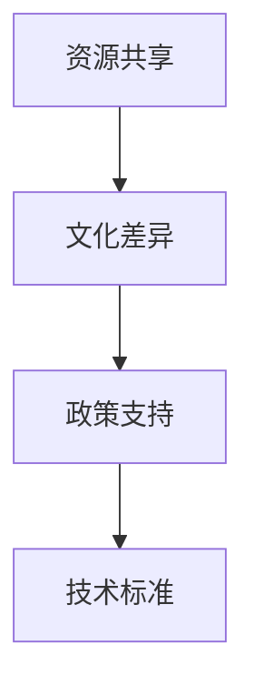

- **资源共享**：资源共享是开放教育资源国际合作的重要目标，各国需要共同建立资源共享机制，提高资源的利用效率。挑战：各国教育资源的不均衡和资源格式的兼容性。机遇：通过国际合作，实现资源的最大化利用。

- **文化差异**：文化差异是开放教育资源国际合作的重要挑战，不同国家在教育理念、教学方法和文化背景等方面存在差异。挑战：文化差异可能导致资源传播和接受度的障碍。机遇：通过文化交流和融合，促进教育资源的创新和发展。

- **政策支持**：政策支持是开放教育资源国际合作的重要保障，各国政府需要制定相关政策，支持和推动开放教育资源的国际合作。挑战：各国政策的不一致和利益冲突。机遇：通过政策协调和合作，推动开放教育资源的全球发展。

- **技术标准**：技术标准是开放教育资源国际合作的重要基础，各国需要制定统一的技术标准，确保资源的兼容性和互操作性。挑战：技术标准的差异和兼容性问题。机遇：通过技术标准的统一和推广，促进教育资源的全球共享和利用。

#### 第7章：开放教育资源的未来趋势

##### 7.1 开放教育资源的技术创新

开放教育资源的技术创新是推动其发展的重要动力，随着科技的不断进步，开放教育资源将迎来新的发展机遇。以下是一个关于开放教育资源技术创新的Mermaid流程图：

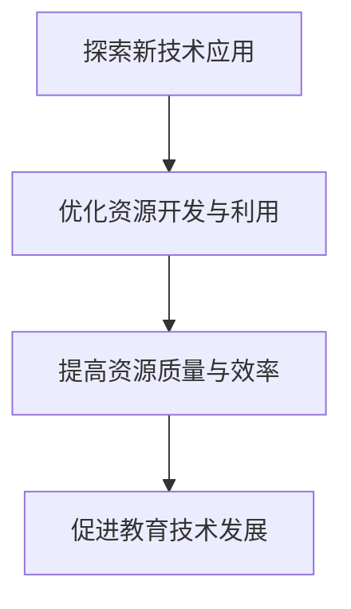

- **探索新技术应用**：开放教育资源的技术创新首先需要探索新技术的应用，如人工智能、大数据、云计算、虚拟现实等。这些新技术可以应用于资源开发、教学设计、学习评估等多个环节，提高教育资源的质量和效率。

- **优化资源开发与利用**：技术创新的目的是优化资源的开发与利用，通过新技术，可以实现资源的个性化推荐、智能搜索、自动生成等功能，提高资源的利用效率和用户体验。

- **提高资源质量与效率**：技术创新有助于提高资源质量与效率，通过新技术的应用，可以实现资源的自动化生成、智能化审核和个性化推送等功能，提高资源的质量和准确性。

- **促进教育技术发展**：开放教育资源的技术创新不仅有助于自身的发展，还可以促进整个教育技术领域的发展。通过技术创新，可以推动教育技术的进步，提高教育质量和效率。

##### 7.2 开放教育资源在教育模式变革中的作用

开放教育资源在教育模式变革中发挥着重要作用，它推动了教育模式的创新和发展。以下是一个关于开放教育资源在教育模式变革中作用的Mermaid流程图：

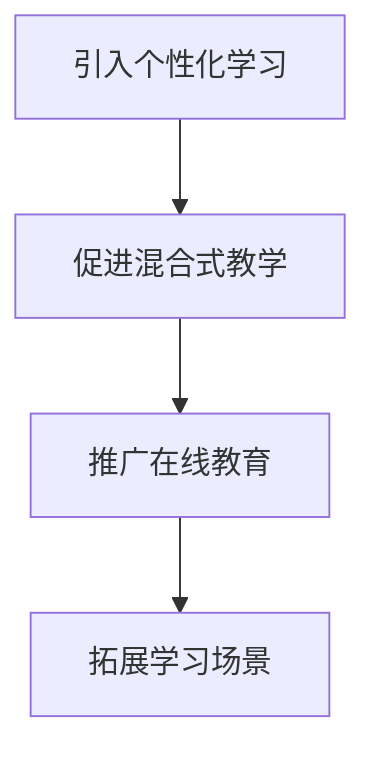

- **引入个性化学习**：开放教育资源可以为个性化学习提供丰富的学习资源，通过数据分析和智能推荐，实现个性化学习路径和教学方案，提高学习效果。

- **促进混合式教学**：开放教育资源与传统的课堂教学相结合，可以实现混合式教学，提高教学效果和学习体验。通过线上线下资源的整合，可以实现学习空间的拓展和学习方式的多样化。

- **推广在线教育**：开放教育资源的推广有助于在线教育的发展，通过在线学习平台和课程资源，可以实现大规模的教育普及和资源共享，提高教育的普及性和公平性。

- **拓展学习场景**：开放教育资源的应用不仅局限于传统的课堂教育，还可以应用于远程教育、职业培训、终身学习等多个场景，实现学习场景的拓展和学习方式的多元化。

##### 7.3 开放教育资源对社会经济的影响

开放教育资源对社会经济具有深远的影响，它不仅推动了教育的发展，还对社会经济产生了积极的推动作用。以下是一个关于开放教育资源对社会经济影响的Mermaid流程图：

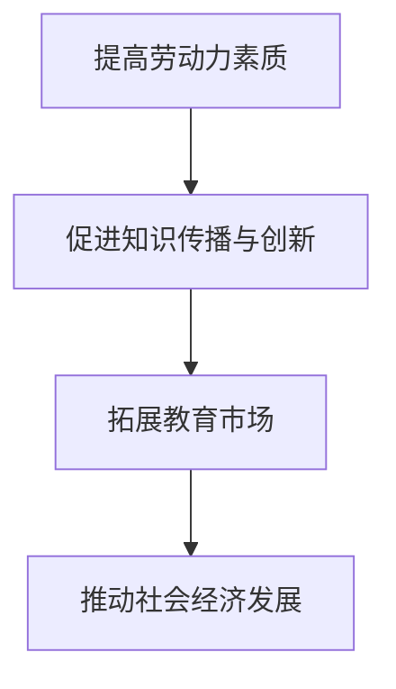

- **提高劳动力素质**：开放教育资源可以为劳动者提供丰富的学习资源，提高劳动者的技能和知识水平，从而提高劳动力素质，增强就业竞争力。

- **促进知识传播与创新**：开放教育资源可以促进知识的传播和创新，通过资源共享和知识共享，可以推动知识的传播和积累，促进科学技术的进步。

- **拓展教育市场**：开放教育资源的发展有助于拓展教育市场，推动教育产业的发展，提高教育资源的利用效率，促进经济的增长。

- **推动社会经济发展**：开放教育资源对社会经济发展具有积极的推动作用，它不仅可以提高劳动力素质，促进知识传播与创新，还可以拓展教育市场，推动社会经济的可持续发展。

### 附录

#### 附录A：开放教育资源参考资源与工具

为了方便读者进一步了解和利用开放教育资源，附录A提供了开放教育资源的相关参考资源与工具。以下是一个关于开放教育资源参考资源与工具的Mermaid流程图：

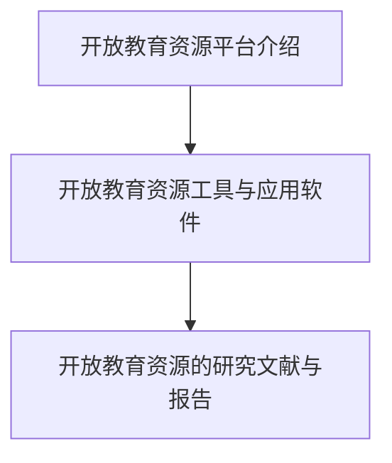

- **开放教育资源平台介绍**：附录A介绍了若干开放教育资源平台，如Moodle、Canvas、edX等，这些平台提供了丰富的开放教育资源和便捷的学习工具，为教师和学习者提供了良好的学习环境。

- **开放教育资源工具与应用软件**：附录A还介绍了若干开放教育资源工具与应用软件，如在线学习管理系统、虚拟实验室、学习软件等，这些工具与应用软件可以帮助教师更好地进行教学设计、教学实施和教学评估。

- **开放教育资源的研究文献与报告**：附录A提供了若干开放教育资源的研究文献与报告，这些文献与报告涵盖了开放教育资源的理论基础、实施策略、应用效果等多个方面，为读者提供了丰富的学术资源和实践参考。

---

作者：AI天才研究院/AI Genius Institute & 禅与计算机程序设计艺术 /Zen And The Art of Computer Programming

通过本文的探讨，我们可以看到开放教育资源（OER）在推动知识民主化、教育公平、终身学习以及企业培训等方面具有重要作用。开放教育资源的建设与推广策略、在教学和企业在培训中的应用、法律与伦理问题以及未来趋势，都是我们关注的重点。随着科技的不断进步和教育模式的变革，开放教育资源将迎来更加广阔的发展空间，为社会经济发展做出更大的贡献。让我们共同期待开放教育资源在未来发挥更大的作用，推动教育的变革与创新。

