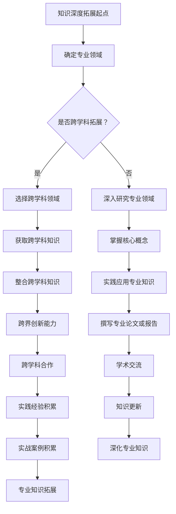
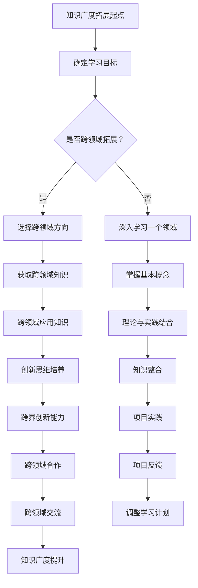

                 

### 文章标题：知识的深度与广度：专才与通才的平衡

> 关键词：知识深度、知识广度、专才、通才、知识整合、创新能力、职业发展、知识管理、人工智能、大数据

> 摘要：本文将深入探讨知识深度与广度的概念、区别、关系以及平衡策略，分析专才与通才的差异与融合趋势，提供知识深度提升路径和广度拓展方法，并探讨知识整合与创新能力的关系。同时，本文还将结合实际案例，详细阐述知识深度与广度在职业发展、创新项目、知识管理以及未来发展趋势中的应用。通过本文的阅读，读者将能够全面了解知识深度与广度的重要性，掌握专才与通才的平衡策略，提升自身在信息技术领域的综合竞争力。

### 《知识的深度与广度：专才与通才的平衡》目录大纲

#### 第一部分：知识的深度与广度基础理论

##### 第1章：知识的深度与广度概述

##### 第2章：知识深度提升路径

##### 第3章：知识广度拓展方法

##### 第4章：专才与通才的转化路径

##### 第5章：知识整合与创新能力

#### 第二部分：知识深度与广度实践与应用

##### 第6章：专才与通才的职业发展路径

##### 第7章：知识深度与广度在创新项目中的应用

##### 第8章：知识管理与企业创新

##### 第9章：知识深度与广度的未来发展趋势

#### 附录

##### 附录A：知识深度与广度拓展资源

##### 附录B：知识深度与广度相关 Mermaid 流程图

##### 附录C：知识深度与广度相关算法伪代码

##### 附录D：知识深度与广度项目实战案例

##### 附录E：知识深度与广度拓展阅读材料

### 第一部分：知识的深度与广度基础理论

在这部分中，我们将首先介绍知识深度与广度的基本概念，详细解析它们在信息技术领域的含义、关系及其重要性。随后，我们将深入探讨专才与通才的区别与联系，分析两者在知识体系中的角色与融合趋势。最后，我们将提出实现知识深度与广度平衡的策略，并借助具体案例加以说明。

#### 第1章：知识的深度与广度概述

##### 1.1 知识的深度与广度概念解析

在信息技术领域，知识深度与广度是两个重要的概念。知识深度（Knowledge Depth）通常指的是对某一特定领域或技术具有的深入理解和掌握程度，它强调的是对专业知识的深入挖掘和持续拓展。而知识广度（Knowledge Breadth）则是指对多个领域或技术的了解和掌握程度，它强调的是对不同知识领域的广泛涉猎和交叉应用。

**知识深度定义：**

知识深度可以理解为专业知识的广度和深度，它不仅涉及对某一特定领域的核心理论和技术的深入理解，还包括对该领域的前沿动态、研究方法和应用场景的掌握。在信息技术领域，知识深度通常体现在对算法、数据结构、编程语言、系统架构等方面的深度理解和应用能力。

**知识广度定义：**

知识广度则是指对不同领域或技术的了解和掌握程度，它强调的是跨学科的知识融合和跨界应用。在信息技术领域，知识广度体现在对多种技术的综合运用能力，如人工智能、大数据、云计算、物联网等，以及这些技术在不同领域的应用场景。

**深度与广度的关系：**

知识的深度与广度并非相互独立，而是相互关联、相互促进的。知识深度可以为知识的广度提供坚实的基础，而知识广度则可以拓宽知识深度的视野，促进知识的跨界融合和创新。因此，在信息技术领域，实现知识的深度与广度的平衡，是提升个人和团队综合素质的重要途径。

##### 1.2 专才与通才的区别与联系

在讨论知识深度与广度时，我们不能忽视专才（Specialist）与通才（Generalist）这两个角色。专才与通才的区别主要在于其知识结构和能力特点。

**专才的定义与特征：**

专才是指在某一个特定领域或技术领域具有深入知识和专业技能的人才。他们通常具有以下特征：

1. **专业知识的深度：** 专才对某一领域的专业知识有深入的理解和掌握，能够进行该领域的复杂分析和解决。
2. **技术能力突出：** 专才在某一特定技术领域具有突出的技术能力和实践经验，能够高效地解决专业问题。
3. **职业定位明确：** 专才通常专注于某一特定领域，如算法工程师、数据分析师、系统架构师等，职业发展路径相对明确。

**通才的定义与特征：**

通才是指具备多领域知识，能够在多个领域内灵活应用知识和技能的人才。他们通常具有以下特征：

1. **知识广度宽广：** 通才具备广泛的学科背景和知识结构，能够理解和应用多个领域的知识。
2. **跨界能力突出：** 通才擅长跨学科的知识融合，能够在不同领域内进行创新和解决问题。
3. **职业适应性强：** 通才的职业发展路径相对灵活，可以在多个领域内进行职业转换。

**专才与通才的融合趋势：**

在信息技术飞速发展的今天，单一的专才或通才模式已经难以满足复杂技术问题和社会发展的需求。越来越多的组织和企业开始重视专才与通才的融合，通过跨学科合作、跨界创新等方式，实现知识的深度与广度的有机结合。这种融合趋势主要体现在以下几个方面：

1. **跨学科合作：** 专才和通才的融合有助于跨学科项目的开展，促进知识在多个领域的交叉应用和协同创新。
2. **跨界创新：** 专才和通才的融合可以激发创新思维，推动新技术和新模式的发展。
3. **复合型人才需求：** 随着技术的发展和社会的进步，越来越多的岗位需要具备跨学科知识和跨界能力的复合型人才。

##### 1.3 知识深度与广度的平衡策略

在信息技术领域，实现知识的深度与广度的平衡至关重要。这不仅有助于提升个人的专业能力和综合素质，还能促进团队和组织的创新与发展。以下是一些实现知识深度与广度平衡的策略：

**1. 培养专业兴趣和跨学科素养：**

个人应培养对特定领域的专业兴趣，同时关注跨学科的知识和技能。通过不断学习和实践，提升在某一领域的专业知识和在多个领域的综合素养。

**2. 制定个性化学习和发展计划：**

根据个人兴趣和发展需求，制定长期和短期的学习和发展计划。在专业领域进行深入学习和研究，同时保持对其他领域的关注和了解。

**3. 加强跨学科合作与交流：**

积极参与跨学科项目和研究，与其他领域的专家和学者进行合作和交流。通过跨学科合作，拓宽知识视野，促进知识的跨界融合和创新。

**4. 持续学习和自我提升：**

在信息技术领域，知识更新速度快，个人应保持持续学习的态度，不断更新和扩展自己的知识体系。通过参加培训、研讨会、学术会议等途径，提升自身在专业领域的深度和广度。

**5. 强化实践与经验积累：**

理论知识需要通过实践进行验证和深化。个人应积极参与实际项目，通过实践积累经验，提升对知识的理解和应用能力。

**6. 借助技术和工具：**

利用现代技术和工具，如在线学习平台、知识图谱、数据分析工具等，提升知识获取和整合的效率，实现知识的深度与广度的有机结合。

##### 1.4 平衡策略的案例分析

为了更好地理解知识深度与广度的平衡策略，我们可以通过具体案例进行说明。以下是一个关于某知名互联网公司的案例：

**案例背景：**

某知名互联网公司在快速发展过程中，意识到实现知识深度与广度的平衡对于团队创新和项目成功至关重要。为此，公司制定了以下平衡策略：

1. **跨学科人才培养：** 公司鼓励员工在专业技能的基础上，拓展跨学科知识。通过内部培训和外部合作，提升员工的跨学科素养和创新能力。

2. **项目团队合作：** 公司在项目组中引入跨学科成员，通过跨学科合作，解决复杂技术问题，推动项目进展。

3. **知识共享平台：** 公司建立了内部知识共享平台，鼓励员工分享专业知识和实践经验，促进知识的积累和传播。

4. **持续学习机制：** 公司定期组织培训和研讨会，提供员工学习和发展机会，激发创新思维，提升专业知识深度和广度。

5. **实践与反思：** 公司鼓励员工参与实际项目，通过实践积累经验，不断反思和改进，提升项目质量和团队协作能力。

**案例效果：**

通过实施上述平衡策略，该互联网公司在项目成功率和创新能力方面取得了显著提升。团队成员在跨学科合作中，不仅拓宽了知识视野，还提升了解决问题的能力和团队协作水平。公司在市场竞争中也展现出更强的竞争力，取得了良好的业绩。

#### 第2章：知识深度提升路径

在信息技术领域，实现知识深度的提升是每个专业人士的目标。本章将探讨知识深度提升的路径，包括专业知识的深度拓展、跨学科知识的深度挖掘以及深度学习在专业领域的应用案例。通过这些路径，我们可以系统地提升自身的知识深度，增强在专业领域的影响力。

##### 2.1 专业知识的深度拓展

专业知识的深度拓展是知识深度提升的重要途径。它不仅要求我们对某一领域的基本概念和理论有深入的理解，还需要我们掌握该领域的前沿技术和方法。

**深度学习与专业技能：**

深度学习（Deep Learning）是人工智能领域的重要分支，它在图像识别、自然语言处理、语音识别等方面取得了显著成果。为了在深度学习领域获得深度知识，我们需要掌握以下几个方面的专业技能：

1. **数学基础：** 熟悉线性代数、微积分、概率论和统计学等数学基础，为理解深度学习算法提供理论支持。
2. **机器学习基础：** 掌握传统的机器学习算法，如线性回归、决策树、支持向量机等，为深入学习深度学习算法奠定基础。
3. **深度学习算法：** 熟悉深度学习的基本算法，如卷积神经网络（CNN）、循环神经网络（RNN）、生成对抗网络（GAN）等，掌握其原理和应用场景。
4. **编程实践：** 利用Python、TensorFlow、PyTorch等工具进行深度学习模型的开发和训练，通过实践提升实际操作能力。

**专业领域的深入研究方法：**

在专业知识深度拓展过程中，我们需要采用系统的方法进行深入研究。以下是一些常用的方法：

1. **文献阅读：** 阅读经典教材、论文和专著，了解领域内的核心理论和发展动态。通过阅读，我们可以获得系统的理论知识，提升对领域的整体认识。
2. **实验研究：** 通过设计和实施实验，验证理论假设和模型性能。实验研究可以帮助我们深入了解专业领域的问题和挑战，发现新的研究方向。
3. **项目实践：** 参与实际项目，将理论知识应用于实际问题。通过项目实践，我们可以积累实际经验，提升解决复杂问题的能力。
4. **学术交流：** 参加学术会议、研讨会和讲座，与其他领域的专家进行交流和讨论。学术交流可以拓宽我们的视野，获取新的研究思路和方法。

**深度学习在专业领域的应用案例：**

深度学习在各个专业领域都有广泛的应用。以下是一些典型的应用案例：

1. **医疗影像分析：** 深度学习算法可以用于医学影像的分析和诊断，如肺癌检测、乳腺癌筛查等。通过分析医学影像数据，深度学习模型可以准确识别病变区域，辅助医生进行诊断。
2. **智能语音识别：** 深度学习算法在语音识别领域取得了显著成果。通过训练大规模的语音数据集，深度学习模型可以实现高精度的语音识别，应用于智能助手、智能家居等领域。
3. **自然语言处理：** 深度学习在自然语言处理（NLP）领域具有广泛的应用，如机器翻译、文本分类、情感分析等。深度学习模型通过理解和学习语言特征，可以准确处理复杂的语言任务。

**深度学习在专业领域的应用实例**

实例一：自动驾驶技术

自动驾驶技术是人工智能领域的重要研究方向，深度学习在其中扮演着关键角色。通过卷积神经网络（CNN）和循环神经网络（RNN）等深度学习算法，自动驾驶系统可以实时处理摄像头和传感器采集到的数据，识别道路场景、车辆和行人，做出安全驾驶决策。

实例二：金融风险管理

深度学习算法在金融风险管理中具有广泛的应用，如股票市场预测、信用评分等。通过分析大量的历史金融数据，深度学习模型可以预测股票价格趋势、识别高风险客户，为金融机构提供决策支持。

实例三：智能客服系统

智能客服系统通过自然语言处理（NLP）和深度学习算法，可以自动处理用户咨询，提供高质量的客户服务。通过训练大规模的语料库，智能客服系统可以准确理解用户的问题，提供针对性的解决方案。

##### 2.2 跨学科知识的深度挖掘

在信息技术领域，跨学科知识的深度挖掘是提升知识深度的另一个重要途径。通过跨学科知识的应用，我们可以解决复杂的技术问题，推动创新和发展。

**跨学科知识的重要性：**

跨学科知识的重要性在于它能够整合不同领域的知识和方法，提供新的研究视角和解决方案。在信息技术领域，跨学科知识的应用主要体现在以下几个方面：

1. **技术创新：** 跨学科知识可以推动新技术的发明和应用，如人工智能与生物信息学的结合，推动了基因编辑技术的突破。
2. **复杂问题解决：** 跨学科知识可以帮助我们解决复杂的技术问题，如大数据与物联网的结合，为智能城市提供了有效的解决方案。
3. **创新能力提升：** 跨学科知识可以激发创新思维，提高创新能力，推动技术的发展。

**跨学科研究的理论框架：**

跨学科研究需要建立一套理论框架，以指导不同领域知识的整合和应用。以下是一个简单的跨学科研究理论框架：

1. **问题定义：** 确定跨学科研究的具体问题和目标，明确研究的关键点和难点。
2. **领域选择：** 选择与问题相关的学科领域，分析不同领域的研究方法和工具。
3. **知识整合：** 整合不同领域的知识，构建跨学科的理论体系，为研究提供基础。
4. **方法应用：** 选择合适的研究方法，结合跨学科的理论体系，开展具体的研究工作。
5. **结果分析：** 分析研究结果，评估跨学科知识的整合效果，总结经验教训。

**跨学科案例研究：**

为了更好地理解跨学科知识的深度挖掘，我们可以通过具体案例进行说明。以下是一个关于人工智能与心理学结合的案例研究：

**案例背景：**

随着人工智能技术的快速发展，智能客服系统在各个行业得到了广泛应用。然而，传统的人工智能技术主要关注技术实现，忽视了用户情感和心理的需求。为了提升智能客服系统的用户体验，研究人员尝试将人工智能与心理学相结合，探索情感化智能客服系统的构建。

**研究过程：**

1. **问题定义：** 确定智能客服系统在情感理解和用户满意度方面的不足，提出提升用户体验的目标。
2. **领域选择：** 选择人工智能和心理学作为研究的主要领域，分析两者的研究方法和工具。
3. **知识整合：** 整合人工智能的情感识别技术和心理学的用户需求分析理论，构建情感化智能客服系统的理论框架。
4. **方法应用：** 利用机器学习算法，训练情感识别模型，结合心理学理论，设计用户满意度评估方法。
5. **结果分析：** 通过实验验证情感化智能客服系统的效果，分析用户情感与满意度之间的关系，提出改进策略。

**研究结果：**

研究结果表明，情感化智能客服系统在提升用户体验方面具有显著效果。通过情感识别技术的应用，系统可以更准确地理解用户情感，提供更符合用户需求的解决方案。同时，心理学理论的引入，使系统在情感处理方面更具人性化，提升了用户满意度。

**案例总结：**

通过这个案例研究，我们可以看到跨学科知识的深度挖掘在解决实际问题和推动技术创新方面的作用。跨学科知识的整合和应用，不仅提升了研究的深度和广度，还促进了不同领域的合作与创新。

##### 2.3 跨学科知识的深度拓展方法

在跨学科知识的深度拓展过程中，我们不仅需要掌握不同领域的专业知识，还需要采用有效的学习方法和工具。以下是一些常见的跨学科知识深度拓展方法：

**1. 多元学习法：**

多元学习法是指通过多种途径和方式获取知识，提升跨学科理解能力。具体方法包括：

- **阅读多学科教材和论文：** 阅读不同学科的教材、专著和论文，了解各个领域的核心概念、理论和前沿动态。
- **参加跨学科课程和培训：** 参加跨学科课程和培训，学习不同领域的知识体系和应用方法。
- **参与跨学科项目：** 参与跨学科项目，将所学知识应用于实际问题，提升跨学科应用能力。

**2. 融合学习法：**

融合学习法是指将不同领域的知识进行整合和应用，形成新的理论体系和解决方案。具体方法包括：

- **建立跨学科知识图谱：** 通过构建知识图谱，将不同领域的知识进行关联和整合，形成系统的知识体系。
- **开展跨学科研究：** 结合不同领域的研究方法和工具，开展跨学科研究，解决复杂的技术问题。
- **融合知识应用创新：** 将跨学科知识应用于实际项目和创新实践，推动新技术和新模式的发展。

**3. 实践学习法：**

实践学习法是指通过实际操作和实践，深入理解和应用跨学科知识。具体方法包括：

- **参与实验和项目：** 参与跨学科实验和项目，将理论知识应用于实际场景，积累实践经验。
- **开展实践研究：** 通过实践研究，验证跨学科知识的有效性，发现新的研究问题和方向。
- **编写实践报告：** 撰写实践报告，总结实践经验，分享跨学科知识的应用成果。

通过这些跨学科知识深度拓展方法，我们可以系统地提升跨学科知识水平，增强在专业领域的竞争力。

### 第3章：知识广度拓展方法

在信息技术领域，知识的广度拓展是提升个人和团队综合能力的重要途径。本章将详细探讨知识广度拓展的概念与价值，提供获取与积累广度知识的方法，并分享广度知识的评估与调整策略。

##### 3.1 知识广度的概念与价值

知识广度（Knowledge Breadth）是指对多个领域或技术的了解和掌握程度。它强调的是对广泛领域的知识储备和跨界应用能力。在信息技术领域，知识广度的重要性体现在以下几个方面：

**知识广度的特点：**

1. **跨学科综合：** 知识广度要求对多个学科领域的基本概念和原理有了解，能够进行跨学科的知识综合。
2. **应用灵活：** 知识广度强调知识的灵活应用，能够将不同领域的知识进行整合，解决复杂问题。
3. **持续更新：** 知识广度要求持续学习和更新，以适应快速变化的技术环境。

**知识广度的应用场景：**

1. **项目协作：** 在项目团队中，具备知识广度的人才能够与其他成员进行有效的知识共享和协作，推动项目进展。
2. **创新思维：** 知识广度有助于激发创新思维，通过不同领域的知识交叉，产生新的创意和解决方案。
3. **跨界应用：** 知识广度使个人能够在不同领域进行跨界应用，实现知识的多元化发展。

**知识广度的价值体现：**

1. **提升创新能力：** 知识广度有助于个人在多个领域内进行创新，推动新技术和新模式的发展。
2. **增强竞争力：** 知识广度使个人在职场中具备更强的竞争力，能够在不同岗位上灵活转换，适应多种工作需求。
3. **促进团队协作：** 知识广度的拓展有助于团队内部的知识共享和协作，提升团队的整体绩效。

##### 3.2 广度知识的获取与积累

获取和积累广度知识是一个持续的过程，需要采用系统的方法和策略。以下是一些有效的获取与积累广度知识的方法：

**获取广度知识的途径：**

1. **在线学习平台：** 利用如Coursera、edX、Udacity等在线学习平台，学习不同领域的课程，获取系统的知识体系。
2. **阅读经典教材：** 阅读不同学科的经典教材和专著，了解各个领域的核心概念和前沿动态。
3. **参加研讨会和讲座：** 参加各种研讨会、讲座和学术会议，与其他领域的专家进行交流和讨论，拓宽知识视野。
4. **实践经验：** 通过参与实际项目和实验，将所学知识应用于实际场景，积累实践经验。

**知识积累的方法：**

1. **知识管理工具：** 使用如Evernote、OneNote等知识管理工具，记录和整理所学知识，建立个人知识库。
2. **知识共享：** 与同事和同行分享知识，参与知识共享平台和社群，扩大知识传播范围。
3. **定期复习：** 定期复习所学知识，通过总结和归纳，加深对知识的理解和记忆。
4. **项目实战：** 在实际项目中应用所学知识，通过实战提升知识的应用能力和解决问题的能力。

**广度知识的评估与调整：**

为了确保知识广度的有效性和实用性，需要对所获取的知识进行评估和调整。以下是一些评估与调整策略：

1. **知识评估：** 定期对所学知识进行自我评估，检查知识点的掌握程度和应用能力。可以通过编写学习笔记、进行知识测验等方式进行评估。
2. **知识调整：** 根据评估结果，对知识结构进行调整和优化。对于掌握不够扎实的知识点，进行深入学习和复习；对于过时的知识点，进行更新和替换。
3. **知识反馈：** 通过参与项目和实际工作，收集反馈信息，了解知识在实际应用中的效果和不足，为知识调整提供依据。
4. **持续学习：** 保持持续学习的态度，关注领域内的最新动态和前沿技术，不断更新和扩展知识体系。

通过上述方法，我们可以系统地获取和积累广度知识，提升自身在信息技术领域的综合能力。

### 第4章：专才与通才的转化路径

在信息技术领域，专业人才往往需要在专才和通才之间进行转化，以适应不断变化的工作需求和职业发展。本章将探讨专才向通才转化的挑战和路径，以及通才向专才转化的策略和实例，帮助读者了解并掌握这两者之间的转化方法。

##### 4.1 专才向通才转化的挑战

专才向通才转化是一个复杂的过程，涉及知识体系的重构、思维方式的变化以及跨领域的适应。以下是一些主要的挑战：

**转化过程中的难点：**

1. **知识广度的拓展：** 专才通常对某一领域有深入的了解，但可能在其他领域缺乏系统性的知识。因此，在向通才转化过程中，需要拓展知识广度，掌握多个领域的核心概念和技术。
2. **思维方式的转变：** 专才往往在某一领域形成固定的思维模式，而通才需要具备跨界思维，能够灵活运用不同领域的知识和方法。这需要培养开放、多元的思维方式。
3. **时间与精力的平衡：** 转化过程中，需要平衡专业知识的学习和广度知识的拓展，这需要时间与精力的合理分配。
4. **实践经验积累：** 转化过程中，需要通过实际项目和实践积累跨领域的经验，这需要一定的时间和实践机会。

**转化所需的素质与能力：**

1. **好奇心与求知欲：** 拥有强烈的好奇心和求知欲，愿意探索新领域和新技术。
2. **学习能力和适应性：** 具备快速学习和适应新环境的能力，能够迅速掌握新的知识和技能。
3. **跨界合作能力：** 擅长跨学科合作，能够与其他领域的专家和团队成员进行有效沟通和协作。
4. **创新能力：** 具备较强的创新能力，能够将不同领域的知识进行整合，提出新颖的解决方案。

**成功转化的案例：**

以下是一个关于某知名技术专家的转化案例：

**案例背景：**

某知名技术专家，在软件开发领域拥有丰富的经验，专注于系统架构设计和性能优化。随着人工智能和大数据技术的发展，他意识到跨学科知识对于解决复杂问题的重要性，决定从专才向通才转化。

**转化过程：**

1. **学习新领域知识：** 技术专家通过在线课程和培训，学习了人工智能和大数据处理的基本概念和技术。他阅读了大量的相关书籍和论文，掌握了深度学习和大数据分析的核心理论。
2. **跨领域实践：** 技术专家参与了多个跨学科项目，包括智能数据分析平台和自动化系统开发。通过实际项目，他积累了跨领域实践的经验，并逐步将所学知识应用于实际工作中。
3. **建立跨学科网络：** 技术专家积极与人工智能和大数据领域的专家进行交流，建立了广泛的跨学科网络。通过交流与合作，他不断更新和扩展自己的知识体系。
4. **持续学习和创新：** 技术专家保持持续学习的态度，关注领域内的最新动态和前沿技术。他通过撰写博客、发表论文和参与学术会议，不断提升自己的专业影响力和创新能力。

**转化效果：**

通过持续的努力和跨学科的实践，技术专家成功实现了从专才向通才的转化。他在多个领域内展现出了出色的技术能力和创新能力，成为了跨学科合作和跨界创新的典范。他的转化经历不仅提升了自身的职业竞争力，还为团队和组织带来了新的价值。

##### 4.2 通才向专才转化的路径

通才向专才转化的过程同样具有挑战性，需要集中精力和时间，在某一特定领域进行深入研究和实践。以下是一些通才向专才转化的路径和策略：

**通才向专才的转型策略：**

1. **明确专业方向：** 通才在转型过程中，需要明确自己的专业方向，选择一个感兴趣且具有发展潜力的领域进行深入探索。
2. **系统学习专业知识：** 通过专业课程、教材和培训，系统地学习专业领域的理论知识，构建扎实的知识基础。
3. **深入实践和研究：** 参与实际项目和研究，通过实践积累经验和技能，深入研究专业领域的具体问题和技术难点。
4. **建立专业网络：** 与专业领域的专家和同行建立联系，参与专业讨论和交流，获取专业知识和行业动态。
5. **撰写专业论文和发表成果：** 通过撰写专业论文和发表研究成果，提升在专业领域的影响力和知名度。

**通才所需的广度知识储备：**

1. **跨学科基础：** 通才需要具备跨学科的基础知识，能够在多个领域内进行知识整合和应用。
2. **跨界能力：** 通才需要具备跨界能力，能够灵活运用不同领域的知识和方法，解决复杂问题。
3. **综合素质：** 通才需要具备较高的综合素质，包括学习能力、适应能力和创新能力，以适应快速变化的工作环境。

**专才培养与成长的实例分析：**

以下是一个关于某知名人工智能专家的转型案例：

**案例背景：**

某知名人工智能专家，在计算机科学和机器学习领域有广泛的兴趣，但并没有专注于某一具体方向。随着人工智能技术的快速发展，他意识到需要在某一特定领域进行深入研究和实践。

**转型过程：**

1. **明确专业方向：** 专家通过市场调研和个人兴趣，选择了自然语言处理（NLP）作为专业方向。他决定在这一领域进行深入研究和实践。
2. **系统学习专业知识：** 专家通过阅读相关教材、参加专业课程和培训，系统地学习了NLP的基本理论和技术。他深入研究了词向量、序列模型和注意力机制等关键技术。
3. **深入实践和研究：** 专家参与了多个NLP项目，包括情感分析、文本分类和信息提取。通过实际项目，他积累了丰富的实践经验，并深入研究了NLP中的具体问题和技术难点。
4. **建立专业网络：** 专家积极参与学术会议和研讨会，与NLP领域的专家和同行建立了广泛的联系。他通过交流与合作，不断更新和扩展自己的专业知识。
5. **撰写专业论文和发表成果：** 专家通过撰写专业论文和发表研究成果，提升了在NLP领域的知名度和影响力。他的多篇论文被顶级学术会议和期刊录用，成为NLP领域的知名学者。

**转型效果：**

通过持续的努力和深入研究，专家成功实现了从通才向专才的转型。他在NLP领域展现出了出色的技术能力和研究成果，成为该领域的知名专家。他的转型经历不仅提升了自身的职业竞争力，还为团队和组织带来了新的价值。

### 第5章：知识整合与创新能力

在信息技术领域，知识整合与创新能力是推动技术进步和业务发展的关键因素。本章将深入探讨知识整合的方法与技巧，以及如何培养和提高创新能力。通过有效的知识整合和创新实践，我们可以提升个人和团队在信息技术领域的核心竞争力。

##### 5.1 知识整合的方法与技巧

知识整合（Knowledge Integration）是指将不同来源、不同形式的知识进行系统化、综合性的处理，形成新的知识体系。在信息技术领域，知识整合的方法和技巧对于提升技术水平和解决复杂问题具有重要意义。

**知识整合的概念：**

知识整合是指通过整合多种知识资源，构建一个有机的知识系统，使其能够有效地支持决策和问题解决。知识整合不仅包括对内部知识的整合，还包括对外部知识的获取和融合。

**知识整合的策略：**

1. **明确整合目标：** 在进行知识整合前，需要明确整合的目标和需求。这包括确定需要整合的知识类型、领域和应用场景。
2. **构建知识框架：** 根据整合目标，构建一个系统的知识框架，明确各个知识模块之间的关系和作用。这有助于确保知识整合的系统性和逻辑性。
3. **选择整合工具：** 根据知识类型和整合需求，选择合适的整合工具和技术。例如，可以使用知识图谱、数据库管理系统、数据挖掘工具等来支持知识整合。
4. **数据清洗与预处理：** 在整合过程中，需要对原始数据进行清洗和预处理，确保数据的质量和一致性。
5. **知识关联与融合：** 通过建立知识关联，将不同来源、不同形式的知识进行融合，形成新的知识体系。知识关联可以通过语义分析、关系图谱等方式实现。
6. **知识共享与传播：** 通过知识共享平台和工具，将整合的知识进行传播和共享，使组织内外的成员都能够充分利用这些知识。

**知识整合的实践案例：**

以下是一个关于企业知识整合的实践案例：

**案例背景：**

某大型企业希望在产品开发过程中实现知识整合，提升研发效率和创新能力。为此，企业采取了以下措施：

1. **建立知识库：** 企业建立了综合性的知识库，收集和整理了各种类型的技术文档、研究报告、设计规范等知识资源。
2. **构建知识框架：** 根据产品开发的需求，企业构建了一个系统的知识框架，明确各个知识模块之间的关系和作用。
3. **数据清洗与预处理：** 企业对知识库中的数据进行清洗和预处理，确保数据的质量和一致性。
4. **知识关联与融合：** 通过知识图谱技术，将不同来源、不同形式的知识进行关联和融合，形成了一个有机的知识体系。
5. **知识共享与传播：** 企业通过内部知识共享平台，将整合的知识进行传播和共享，使研发团队的成员都能够充分利用这些知识。

**案例效果：**

通过知识整合，企业的产品研发效率显著提升，创新能力得到增强。团队成员可以快速获取所需的知识资源，避免重复工作，降低研发风险。知识整合还促进了团队之间的协作和知识共享，提升了整体研发水平。

##### 5.2 创新能力的培养与提升

创新能力（Innovation Capacity）是指个体或组织在知识整合的基础上，提出新颖的解决方案和创造新价值的能力。在信息技术领域，创新能力是推动技术进步和业务发展的重要动力。以下是一些培养和提高创新能力的方法：

**创新能力的定义与重要性：**

创新能力是指个体或组织在知识整合的基础上，运用创造性思维和技能，提出新颖的解决方案和创造新价值的能力。在信息技术领域，创新能力的重要性体现在以下几个方面：

1. **技术突破：** 创新能力能够推动新技术的发明和应用，引领技术潮流。
2. **业务发展：** 创新能力有助于企业发现新的业务机会，提升业务模式和竞争力。
3. **持续改进：** 创新能力促使个体和组织不断优化现有的技术和业务流程，提升效率和质量。
4. **竞争优势：** 创新能力使个体和组织在竞争中保持领先地位，形成核心竞争力。

**创新思维的培养：**

1. **多元思维：** 培养多元思维，鼓励个体从不同角度和层面思考问题，开拓创新思路。
2. **跨学科学习：** 跨学科学习有助于拓宽知识视野，促进不同领域知识的交叉应用和融合。
3. **问题导向：** 以问题为导向，鼓励个体在解决问题的过程中发挥创新思维，提出新的解决方案。
4. **团队协作：** 通过团队协作，汇集不同领域的知识和经验，共同探讨和创新。

**创新实践的方法：**

1. **头脑风暴：** 通过头脑风暴，集体讨论，激发创新思维，产生新的创意和想法。
2. **原型设计：** 建立原型，进行实际验证，通过反复迭代，优化创新方案。
3. **试点应用：** 在实际项目中应用创新方案，通过试点应用，评估其效果和可行性。
4. **反馈迭代：** 根据反馈，不断优化创新方案，提升其实际应用效果。

**创新实践案例：**

以下是一个关于企业创新实践的案例：

**案例背景：**

某大型互联网企业希望通过创新实践，提升业务效率和用户体验。为此，企业采取了以下措施：

1. **创新文化：** 建立创新文化，鼓励员工提出创新想法，并提供支持和资源。
2. **创新实验室：** 设立创新实验室，为员工提供实验环境和资源，支持他们进行创新实践。
3. **跨部门协作：** 鼓励跨部门协作，汇集不同领域的知识和经验，共同探讨和创新。
4. **用户反馈：** 通过用户反馈，收集用户需求和意见，优化创新方案。
5. **试点应用：** 在实际项目中应用创新方案，通过试点应用，评估其效果和可行性。
6. **持续改进：** 根据反馈和评估结果，不断优化创新方案，提升其实际应用效果。

**案例效果：**

通过创新实践，企业的业务效率显著提升，用户体验得到改善。创新实践不仅提升了企业的竞争力，还为团队和组织带来了新的价值。

### 第二部分：知识深度与广度实践与应用

在本部分中，我们将探讨知识深度与广度在职业发展、创新项目、知识管理以及未来发展趋势中的应用。首先，我们将分析知识深度与广度对职业发展的具体影响，包括不同职业角色对知识的需求和专才与通才的优劣势。接着，我们将探讨知识深度与广度在创新项目中的角色，结合实际案例展示其应用效果。随后，我们将介绍企业知识管理体系的构建，详细阐述知识管理在创新中的作用和实践。最后，我们将展望知识深度与广度在未来发展趋势中的重要作用，包括技术进步对知识深度和广度的影响以及未来可能出现的新趋势。

#### 第6章：专才与通才的职业发展路径

在信息技术领域，职业发展是每个专业人士关注的焦点。知识深度与广度对职业发展有着重要影响，不仅决定了个人的专业能力，也影响其在职场中的竞争力。本章将详细探讨知识深度与广度在职业发展中的作用，分析不同职业角色对知识的需求，以及专才与通才在职业发展路径中的优劣势。

##### 6.1 职业角色与知识要求分析

在信息技术领域，不同的职业角色对知识深度与广度有不同的要求。以下是一些常见职业角色的知识需求：

**1. 软件开发工程师：**

软件开发工程师是信息技术领域中最基础的职业角色之一。他们需要掌握编程语言、数据结构、算法和软件开发流程等核心知识。对于软件开发工程师来说，知识深度尤为重要，因为他们需要能够熟练编写高效、可靠的代码，解决复杂的技术问题。同时，知识广度也是必要的，软件开发工程师需要了解前端、后端、数据库、网络等多个领域的基本知识，以便在项目中能够灵活运用不同的技术和工具。

**2. 数据分析师：**

数据分析师主要负责从大量数据中提取有价值的信息，为业务决策提供支持。数据分析师需要具备良好的数学基础、统计学知识和数据分析工具的使用能力。在知识深度方面，数据分析师需要精通数据分析的理论和方法，熟练掌握各种数据分析工具和编程语言（如Python、R等）。知识广度对于数据分析师来说也非常重要，他们需要了解业务背景和行业动态，能够将数据分析结果应用于实际问题中。

**3. 系统架构师：**

系统架构师负责设计和构建大型软件系统，确保系统的性能、可扩展性和可靠性。系统架构师需要具备深厚的专业知识，包括操作系统、网络、数据库、编程语言和软件开发方法等。知识深度对于系统架构师来说至关重要，他们需要能够深入理解各种技术细节，设计出高效、稳定的系统架构。知识广度也是必要的，系统架构师需要了解业务需求和行业趋势，能够根据业务需求和技术发展做出合适的架构决策。

**4. 人工智能工程师：**

人工智能工程师专注于开发和应用人工智能技术，包括机器学习、深度学习、自然语言处理等。人工智能工程师需要具备扎实的数学基础、机器学习算法知识和编程能力。在知识深度方面，人工智能工程师需要深入理解各种机器学习算法和深度学习模型，能够根据实际问题选择合适的方法和模型。知识广度对于人工智能工程师来说也非常重要，他们需要了解不同的应用场景和业务需求，能够将人工智能技术应用于实际问题中。

**5. 产品经理：**

产品经理负责定义和推动产品的整个生命周期，包括市场调研、需求分析、产品设计、开发、测试和上市等。产品经理需要具备业务理解能力、产品设计能力和团队管理能力。在知识深度方面，产品经理需要深入了解业务领域，掌握市场调研和分析的方法。知识广度对于产品经理来说也非常重要，他们需要了解技术实现、用户体验、项目管理等多个领域的知识，能够协调不同团队的工作。

**专才与通才在不同职业路径的优劣势：**

在职业发展路径中，专才和通才各有其优势和劣势。

**专才的优势：**

1. **专业技能突出：** 专才在某一特定领域具有深厚的专业知识和技术能力，能够高效地解决专业问题。
2. **职业定位明确：** 专才的职业路径相对明确，可以在某一领域内持续深耕，成为行业内的专家。
3. **解决问题的能力：** 专才擅长在特定领域内进行深度分析和问题解决，能够快速找到有效的解决方案。

**专才的劣势：**

1. **知识广度有限：** 专才的知识广度相对较窄，可能在其他领域缺乏系统性的了解和应用能力。
2. **适应性较差：** 专才在跨领域的问题解决和合作中可能面临挑战，需要不断学习和适应新的领域。
3. **创新能力受限：** 专才的创新思维可能受到专业领域的限制，难以产生跨界创新的解决方案。

**通才的优势：**

1. **知识广度宽广：** 通才具备广泛的学科背景和知识结构，能够在多个领域内进行知识整合和应用。
2. **适应性较强：** 通才能够适应多种工作环境和职业角色，具备较强的职业转换能力。
3. **创新能力突出：** 通才的跨界思维有助于创新思维的激发，能够提出新颖的解决方案。

**通才的劣势：**

1. **专业知识深度不足：** 通才在某一领域的专业知识可能不够深入，难以在专业领域内达到顶尖水平。
2. **职业定位模糊：** 通才的职业路径可能相对模糊，需要在不同领域之间进行选择和平衡。
3. **解决问题效率较低：** 通才在特定领域内的问题解决效率可能较低，需要时间和资源进行专业知识的学习和积累。

##### 6.2 职业规划与知识储备

为了实现职业发展目标，专业人士需要制定合理的职业规划，并根据职业规划进行系统的知识储备。

**职业规划的重要性：**

职业规划是指根据个人的兴趣、能力和市场需求，制定长期和短期的职业发展目标，并采取相应的行动策略。职业规划的重要性体现在以下几个方面：

1. **明确职业目标：** 职业规划帮助个人明确职业发展的方向和目标，避免盲目行动，提高职业发展的有效性。
2. **提高职业竞争力：** 通过职业规划，个人可以针对性地提升自身的知识、技能和经验，提高职业竞争力。
3. **优化职业路径：** 职业规划可以帮助个人在职业生涯中合理规划每个阶段的发展，避免职业瓶颈和停滞。
4. **实现职业价值：** 职业规划有助于个人实现职业价值，找到适合自己的职业角色和岗位，实现职业发展的长远目标。

**职业发展的策略与规划：**

1. **明确职业方向：** 根据个人兴趣、能力和市场需求，明确职业发展方向。可以选择在某一领域深耕，成为专业领域的专家，或者选择在多个领域内发展，成为通才。

2. **制定长期目标：** 设定长期职业发展目标，如成为某一领域的专家、创业、或者担任高级管理职位等。长期目标应具有挑战性，同时符合个人的职业规划和价值观。

3. **制定短期目标：** 根据长期目标，制定短期目标和行动计划。短期目标应具体、可衡量、可实现，如参加培训课程、获取专业证书、参与重要项目等。

4. **持续学习和提升：** 根据职业规划，制定系统的学习计划，持续提升自身的知识、技能和经验。可以通过参加专业课程、阅读专业书籍、参与实践项目等方式，不断积累专业知识和技能。

5. **反馈与调整：** 定期对职业规划进行评估和反馈，根据实际情况进行调整和优化。职业规划不是一成不变的，应根据个人发展、市场需求和环境变化进行灵活调整。

**知识储备的重要性与积累方法：**

知识储备是职业发展的基础，决定了个人在职场中的竞争力和发展潜力。以下是一些知识储备的重要性和积累方法：

**1. 知识储备的重要性：**

- **职业竞争力：** 具有丰富的知识储备可以提高个人的职业竞争力，使其在职场中具备独特的优势。
- **创新能力：** 知识储备为创新提供了基础，能够激发新的思维和解决方案。
- **问题解决能力：** 丰富的知识储备有助于解决复杂问题，提高问题解决能力。
- **职业发展：** 知识储备为职业发展提供了更多的选择和机会，能够适应不同的职业角色和岗位需求。

**2. 知识积累的方法：**

- **阅读：** 阅读是获取知识的重要途径，可以通过阅读专业书籍、学术论文、行业报告等，系统性地积累知识。
- **学习：** 参加专业课程、培训班和研讨会，学习最新的技术知识和行业动态。
- **实践：** 通过参与实际项目和实践，将所学知识应用于实际场景，积累实践经验。
- **交流：** 与同行和专家进行交流和讨论，分享知识和经验，拓宽知识视野。
- **总结：** 定期总结所学知识，编写学习笔记和心得体会，巩固和加深对知识的理解和记忆。

通过制定合理的职业规划，进行系统的知识储备，专业人士可以在职业发展道路上取得更大的成就。

##### 6.3 案例研究：成功职业转型的实践

以下是一个关于某知名技术专家成功职业转型的案例研究，展示了知识深度与广度在职业发展中的实际应用。

**案例背景：**

某知名技术专家，拥有多年的软件开发和项目管理经验，专注于企业级应用系统的设计和开发。然而，随着云计算、大数据和人工智能等新兴技术的发展，他意识到自己的职业发展方向需要调整，决定从传统的软件开发专家转型为专注于云计算和大数据解决方案的专家。

**转型过程：**

1. **学习新领域知识：** 技术专家通过在线课程和培训，学习了云计算、大数据和人工智能的基本概念和技术。他阅读了大量的相关书籍和论文，掌握了这些领域的核心知识和应用场景。

2. **参与项目实践：** 技术专家积极参与云计算和大数据相关的项目，通过实际项目积累实践经验。他在项目中负责设计云计算架构、数据存储和处理方案，并运用大数据分析技术，优化业务流程和决策支持系统。

3. **建立专业网络：** 技术专家积极参与行业会议、研讨会和在线社群，与其他领域的专家和同行建立联系，分享经验和知识，获取行业动态和最新技术信息。

4. **撰写专业文章和发表成果：** 技术专家通过撰写专业文章、发表研究成果和参加学术会议，提升自己在云计算和大数据领域的知名度和影响力。

**转型效果：**

通过持续的努力和学习，技术专家成功实现了职业转型，成为云计算和大数据领域的专家。他的转型不仅提升了个人职业竞争力，还为企业和客户带来了新的价值。他的成功转型经验为其他专业人士提供了有益的启示，展示了知识深度与广度在职业发展中的重要作用。

### 第7章：知识深度与广度在创新项目中的应用

创新项目是推动技术进步和业务发展的关键，而知识的深度与广度在创新项目中扮演着至关重要的角色。本章将探讨知识深度与广度在创新项目中的具体应用，结合实际案例，展示其在项目成功中的关键作用。

##### 7.1 创新项目的定义与类型

创新项目是指通过新的思想、方法、技术或产品，解决现有问题、满足市场需求或创造新价值的系统性活动。创新项目可以分为以下几种类型：

1. **技术突破型项目：** 通过引入新的技术或改进现有技术，实现技术的重大突破和跨越，如人工智能、生物技术等领域的创新项目。
2. **业务模式创新项目：** 通过改变现有的业务模式，创造新的商业模式或市场机会，如共享经济、电子商务等。
3. **产品创新项目：** 通过设计和开发新的产品或改进现有产品，满足客户需求或提升产品竞争力，如智能家居设备、新型医疗器械等。
4. **流程优化项目：** 通过优化业务流程和操作流程，提高效率、降低成本或提升服务质量，如自动化生产、智能物流等。

##### 7.2 知识深度与广度在项目中的角色

知识深度与广度在创新项目中具有以下关键角色：

**知识深度在项目中的应用：**

1. **技术细节掌握：** 知识深度使项目团队能够深入理解技术细节，掌握关键技术的实现方法，从而提高项目的技术水平和质量。
2. **问题解决能力：** 知识深度有助于团队在面对技术难题时，能够快速找到解决方案，提高项目的执行效率。
3. **风险评估与控制：** 知识深度使团队能够对项目风险进行准确评估和控制，降低项目失败的概率。

**知识广度在项目中的应用：**

1. **跨界知识融合：** 知识广度使团队能够将不同领域的知识进行整合和应用，创造新的解决方案，推动项目的创新和发展。
2. **市场需求分析：** 知识广度有助于团队了解市场需求和行业动态，准确把握用户需求，设计出更具市场竞争力产品。
3. **跨领域合作：** 知识广度使团队能够与其他领域的专家和团队进行有效合作，共享资源和经验，提升项目的整体效率和质量。

##### 7.3 案例分析：知识深度与广度在创新项目中的成功应用

以下是一个关于某知名科技公司成功创新项目的案例分析，展示了知识深度与广度在项目中的具体应用。

**案例背景：**

某知名科技公司希望开发一款智能家居控制系统，通过整合物联网、人工智能和大数据技术，为用户提供便捷、智能的家居生活体验。为了实现这一目标，公司组建了一支跨学科团队，团队成员包括软件工程师、硬件工程师、人工智能专家、数据分析师和用户体验设计师。

**项目过程：**

1. **需求分析与市场调研：** 团队通过市场调研和用户访谈，了解用户对智能家居的需求和期望，明确产品功能和技术要求。知识广度在这一阶段发挥了重要作用，使团队能够全面了解市场需求和行业动态。

2. **技术方案设计与开发：** 团队结合知识深度，深入研究了物联网技术、人工智能算法和大数据分析技术，设计出了一套高效的智能家居控制系统。软件工程师负责开发控制系统软件，硬件工程师负责设计智能家居设备硬件，人工智能专家和数据分析师则负责算法开发和数据分析。

3. **系统集成与测试：** 团队将各个模块进行集成，进行系统测试和优化。知识深度在这一阶段发挥了关键作用，使团队能够解决技术难题，优化系统性能和稳定性。

4. **用户反馈与迭代优化：** 团队将产品发布给用户，收集用户反馈，根据用户需求和意见进行产品迭代和优化。知识广度使团队能够灵活调整产品设计，满足用户需求。

**项目成果：**

通过知识深度与广度的有机结合，该智能家居控制系统成功上线，获得了用户的高度评价和市场的广泛认可。项目取得了以下成果：

1. **技术创新：** 团队成功整合了物联网、人工智能和大数据技术，实现了智能家居的智能化控制和数据分析，推动了智能家居技术的发展。

2. **市场拓展：** 智能家居控制系统成功打开了市场，为公司带来了丰厚的收益和市场份额，推动了公司的业务发展。

3. **用户体验提升：** 用户反馈显示，智能家居控制系统提高了用户的生活质量，用户满意度显著提升。

4. **团队成长：** 团队在项目过程中积累了丰富的经验和技术，团队能力和项目执行力得到了显著提升。

**案例总结：**

通过这个案例，我们可以看到知识深度与广度在创新项目中的关键作用。知识深度使团队能够深入理解和掌握核心技术，解决技术难题；知识广度则使团队能够整合多领域知识，创造新的解决方案，提升项目的创新性和市场竞争力。知识的深度与广度相结合，是推动创新项目成功的关键。

### 第8章：知识管理与企业创新

知识管理（Knowledge Management）是企业持续创新和发展的核心环节。本章将深入探讨知识管理的概念、作用以及企业如何构建知识管理体系。通过具体的实践案例，我们将展示知识管理在创新中的重要作用，并分析知识管理对组织创新能力和竞争力的提升。

##### 8.1 知识管理的概念与作用

知识管理是指通过系统的策略和方法，对企业的知识进行收集、整理、存储、共享和应用，以提升企业的创新能力和竞争力。知识管理包括以下几个方面：

1. **知识收集：** 通过各种渠道和手段，收集企业内外部的知识资源，如文献、报告、经验、最佳实践等。
2. **知识整理：** 对收集到的知识进行分类、标注、整理和归纳，使其结构化、系统化，便于检索和应用。
3. **知识存储：** 将整理好的知识存储在知识库或数据库中，确保知识的长期保存和可靠访问。
4. **知识共享：** 通过知识共享平台和工具，将知识在企业内部或外部进行传播和共享，促进知识的流动和交流。
5. **知识应用：** 将知识应用于企业的日常运营、项目开发、决策制定和创新能力提升，实现知识的实际价值。

**知识管理在创新中的作用：**

知识管理在企业创新中发挥着至关重要的作用，具体体现在以下几个方面：

1. **知识积累与创新：** 通过知识管理，企业可以积累和沉淀宝贵的知识资源，为创新提供坚实的基础。知识的积累不仅提高了企业的创新效率，还促进了新知识、新技术的产生。
2. **知识共享与协作：** 知识管理促进知识的共享和协作，使企业内部不同部门、团队和员工之间的信息交流更加畅通，有助于创新思维的碰撞和解决方案的优化。
3. **知识传承与可持续发展：** 知识管理有助于企业将知识传承给新员工，保持企业核心竞争力的连续性，实现可持续发展。
4. **风险管理与决策支持：** 通过知识管理，企业可以积累丰富的历史数据和实践经验，为风险管理和决策提供有力支持，提高决策的科学性和准确性。

##### 8.2 企业知识管理体系的构建

企业知识管理体系的构建是一个系统性工程，需要从组织文化、制度建设、技术手段等多个方面进行规划和实施。以下是企业知识管理体系构建的关键步骤：

1. **明确知识管理目标：** 企业应根据自身的战略目标和业务需求，明确知识管理的具体目标和期望效果，如提升创新能力、优化业务流程、提高员工素质等。
2. **建立知识管理体系：** 设计并建立一套符合企业特点的知识管理体系，包括知识收集、整理、存储、共享和应用等环节，明确各个环节的责任和流程。
3. **培育知识管理文化：** 通过培训、宣传和激励机制，培育员工的知识管理意识和习惯，营造知识共享、知识创新的企业文化。
4. **建设知识库和知识共享平台：** 建立企业内部的知识库和知识共享平台，提供知识检索、分享和协作的功能，方便员工获取和应用知识。
5. **完善知识管理规章制度：** 制定知识管理的规章制度，明确知识管理的过程、标准和责任，规范知识的管理和使用。
6. **持续优化和改进：** 根据企业的发展需求和实际效果，不断优化和改进知识管理体系，确保其持续有效运行。

##### 8.3 知识管理在创新中的实践案例

以下是一个关于某知名科技公司知识管理实践的创新案例，展示了知识管理在提升企业创新能力和竞争力方面的实际效果。

**案例背景：**

某知名科技公司是一家专注于人工智能和大数据技术的企业，为了在激烈的市场竞争中保持领先地位，公司决定通过知识管理提升创新能力和核心竞争力。公司组建了一支专业的知识管理团队，负责规划和实施知识管理项目。

**实施过程：**

1. **明确知识管理目标：** 公司明确了知识管理的目标，包括提升创新效率、优化业务流程、提高员工素质等。
2. **建立知识管理体系：** 公司设计了一套知识管理体系，包括知识收集、整理、存储、共享和应用等环节，明确了各个环节的责任和流程。
3. **培育知识管理文化：** 公司通过内部培训和宣传，培育员工的知识管理意识和习惯，鼓励员工主动分享知识和经验。
4. **建设知识库和知识共享平台：** 公司建立了内部知识库和知识共享平台，提供知识检索、分享和协作的功能，方便员工获取和应用知识。
5. **完善知识管理规章制度：** 公司制定了一系列知识管理的规章制度，规范知识的管理和使用。
6. **持续优化和改进：** 公司根据发展需求和实际效果，不断优化和改进知识管理体系，确保其持续有效运行。

**实施效果：**

通过知识管理实践，公司取得了显著的创新成效和竞争优势：

1. **创新效率提升：** 知识管理使得公司的创新过程更加高效，缩短了项目开发周期，提高了创新成功率。
2. **业务流程优化：** 知识管理帮助公司优化了业务流程，减少了重复劳动，提高了工作效率。
3. **员工素质提升：** 通过知识共享和培训，员工的业务能力和综合素质得到了显著提升。
4. **核心竞争力增强：** 知识管理为公司积累了宝贵的知识资源，增强了公司的创新能力和市场竞争力。

**案例总结：**

通过这个案例，我们可以看到知识管理在企业创新中的重要作用。知识管理不仅提升了企业的创新效率和质量，还优化了业务流程，提高了员工的素质，增强了企业的核心竞争力。知识管理是一个系统性工程，需要从组织文化、制度建设、技术手段等多个方面进行规划和实施，以实现持续的创新和发展。

### 第9章：知识深度与广度的未来发展趋势

在信息技术飞速发展的今天，知识深度与广度在各个领域的作用日益凸显。本章将探讨知识深度与广度的未来发展趋势，分析技术进步对知识深度和广度的影响，并展望知识深度与广度在新兴领域中的应用前景。

##### 9.1 知识经济时代的影响

知识经济时代，以知识为核心的生产要素成为推动经济增长的关键。随着人工智能、大数据、物联网等新兴技术的发展，知识深度与广度在各个领域中的作用越来越重要。以下是从几个方面分析知识经济时代对知识深度与广度的影响：

1. **知识深度的重要性：**
   - **技术创新：** 知识深度有助于推动技术革新和突破，使企业能够在复杂的技术难题中找到创新的解决方案。
   - **行业专业化：** 知识深度使企业能够在某一特定领域内深耕，形成专业化的竞争优势。
   - **人才选拔与培养：** 知识深度成为衡量人才能力的重要标准，企业对具备深度知识的员工需求日益增加。

2. **知识广度的重要性：**
   - **跨界创新：** 知识广度使企业能够跨领域整合资源，进行跨界创新，开发出新的产品和服务。
   - **战略决策：** 知识广度有助于企业全面了解市场趋势和行业动态，做出更科学的战略决策。
   - **团队协作：** 知识广度促进团队内部的知识共享和协作，提高团队整体效能。

##### 9.2 技术进步与知识发展的关系

技术进步是推动知识深度与广度发展的重要动力。以下从人工智能、大数据和物联网等几个方面分析技术进步对知识深度和广度的影响：

1. **人工智能：**
   - **知识深度：** 人工智能技术的发展，使得机器能够模拟人类思维，对大量数据进行深度学习和分析，从而在特定领域内形成深度知识。
   - **知识广度：** 人工智能技术的进步，使得不同领域的知识可以相互融合，实现跨学科的知识广度扩展。

2. **大数据：**
   - **知识深度：** 大数据技术使得企业能够对海量数据进行存储、处理和分析，从中提取有价值的信息，实现知识的深度挖掘。
   - **知识广度：** 大数据技术的发展，使得企业能够获取来自不同领域和渠道的海量数据，拓宽知识的广度。

3. **物联网：**
   - **知识深度：** 物联网技术的应用，使得各种设备能够实时收集数据，通过对这些数据的分析，企业能够在特定领域内形成深度知识。
   - **知识广度：** 物联网技术连接了不同设备和系统，使得企业能够获取更多维度的数据，实现知识广度的扩展。

##### 9.3 知识深度与广度的未来展望

随着技术的不断进步，知识深度与广度在未来将呈现以下发展趋势：

1. **知识的融合与整合：**
   - **跨学科融合：** 随着人工智能、大数据等技术的发展，不同领域的知识将更加融合，形成新的交叉学科，推动知识的深度与广度发展。
   - **知识整合：** 企业和个人将更加注重知识的整合和应用，通过构建知识图谱、数据平台等方式，实现知识的深度挖掘和广度拓展。

2. **知识的智能化与自动化：**
   - **智能知识管理：** 人工智能技术的应用，将使知识管理更加智能化，自动完成知识的收集、整理、共享和应用。
   - **自动化学习：** 通过机器学习和深度学习技术，个体和企业的知识获取和学习过程将更加自动化，提升知识积累的效率。

3. **知识的开放与共享：**
   - **开放知识平台：** 随着互联网技术的发展，知识将更加开放，各种知识平台将提供更丰富的知识资源和更便捷的知识共享服务。
   - **知识共享文化：** 企业和个人将更加重视知识的共享和交流，形成知识共享的文化氛围，促进知识的快速传播和共享。

4. **知识的个性化与定制化：**
   - **个性化学习：** 通过大数据和人工智能技术，知识将更加个性化，个体可以根据自身需求和兴趣，定制化的获取和积累知识。
   - **定制化服务：** 企业将根据客户的需求，提供定制化的知识和解决方案，满足不同客户群体的个性化需求。

综上所述，知识深度与广度在未来将继续发挥重要作用，随着技术的进步和社会的发展，知识的深度与广度将得到进一步提升，为个人和企业的创新发展提供强大动力。

### 附录

在本附录部分，我们将提供一些拓展知识深度与广度的资源，包括学术期刊、专业书籍、研究机构介绍、学术会议、在线课程、实用工具和软件等。这些资源将帮助读者在专业领域和跨学科领域进行深入学习，进一步提升知识水平。

#### 附录A：知识深度拓展资源

**学术期刊与专业书籍推荐：**

1. **《人工智能》期刊（Artificial Intelligence Journal）**
   - 期刊简介：该期刊发表人工智能领域的最新研究成果，涵盖机器学习、自然语言处理、计算机视觉等。
   - 推荐理由：提供人工智能领域的最新研究动态，有助于读者深入了解人工智能的前沿技术。

2. **《计算机研究与发展》期刊（Journal of Computer Research and Development）**
   - 期刊简介：该期刊是中国计算机领域的权威期刊，发表计算机科学、软件工程、网络技术等方面的研究论文。
   - 推荐理由：内容全面，涵盖了计算机科学的多个子领域，适合计算机专业的研究人员和学者。

3. **《深度学习》书籍（Deep Learning）**
   - 作者：Ian Goodfellow、Yoshua Bengio、Aaron Courville
   - 简介：这是一本全面介绍深度学习理论和应用的经典教材，适合深度学习初学者和进阶者阅读。
   - 推荐理由：系统讲解了深度学习的基本概念、算法和应用，是深度学习的入门必读之作。

4. **《大数据技术导论》书籍（Introduction to Big Data Technology）**
   - 作者：Michael J. Rodriguez
   - 简介：本书介绍了大数据的基本概念、关键技术和应用，适合大数据初学者和从业者阅读。
   - 推荐理由：详细讲解了大数据的处理和分析方法，有助于读者理解大数据技术的应用场景。

**研究机构与学术会议介绍：**

1. **美国国家航空航天局（NASA）**
   - 研究领域：航天技术、地球科学、天体物理学等。
   - 介绍：NASA是全球领先的航空航天研究机构，在多个技术领域具有深厚的研究基础。

2. **麻省理工学院（MIT）**
   - 研究领域：计算机科学、人工智能、数据科学等。
   - 介绍：MIT是全球顶尖的学术机构之一，在人工智能和数据科学领域具有领先的研究成果。

3. **国际计算机协会（ACM）**
   - 活动介绍：ACM每年举办多个国际学术会议，如国际计算机科学大会（ICCS）、国际人工智能大会（AAAI）等。
   - 介绍：ACM是全球计算机科学领域的权威组织，为计算机科学家提供学术交流和研究成果分享的平台。

4. **国际数据管理协会（ DAMA International）**
   - 活动介绍：DAMA International每年举办全球数据管理大会，讨论数据管理、数据治理、数据分析等主题。
   - 介绍：DAMA International是全球领先的数据管理专业组织，致力于推动数据管理领域的标准化和最佳实践。

#### 附录B：知识广度拓展资源

**跨学科资源平台：**

1. **Crossref**
   - 网址：https://www.crossref.org/
   - 介绍：Crossref是一个跨学科的资源平台，提供各种学科领域的期刊、书籍和论文索引，方便用户检索和引用。

2. **Google Scholar**
   - 网址：https://scholar.google.com/
   - 介绍：Google Scholar是一个免费的学术搜索引擎，可以检索全球范围内的学术文献，涵盖多个学科领域。

3. **ResearchGate**
   - 网址：https://www.researchgate.net/
   - 介绍：ResearchGate是一个学术社交网络平台，允许用户分享研究成果、论文和笔记，与其他学者进行交流和合作。

**学术讲座与公开课推荐：**

1. **Coursera**
   - 网址：https://www.coursera.org/
   - 介绍：Coursera提供了来自全球顶级大学和企业的免费在线课程，涵盖计算机科学、数据科学、人工智能等多个领域。

2. **edX**
   - 网址：https://www.edx.org/
   - 介绍：edX是一个在线学习平台，提供了来自哈佛大学、麻省理工学院等顶级学府的课程，涵盖广泛的学科领域。

3. **Udacity**
   - 网址：https://www.udacity.com/
   - 介绍：Udacity提供了各种专业的在线课程，包括人工智能、机器学习、数据科学等，适合职场人士和初学者。

#### 附录C：实用工具与软件

**数据分析工具：**

1. **Python**
   - 介绍：Python是一种广泛使用的编程语言，广泛应用于数据分析、数据科学和机器学习等领域。

2. **R语言**
   - 介绍：R语言是一种专门用于统计分析、数据可视化和数据科学的编程语言，具有强大的数据处理和分析能力。

3. **Tableau**
   - 介绍：Tableau是一款数据可视化工具，可以帮助用户轻松地创建直观的图表和仪表盘，用于数据分析展示。

**知识管理软件：**

1. **Evernote**
   - 介绍：Evernote是一款笔记和文档管理工具，可以方便地记录、整理和共享知识，适用于个人和团队的知识管理。

2. **Trello**
   - 介绍：Trello是一款项目管理工具，可以协助团队管理任务和项目，提高工作效率和协作。

3. **Mendeley**
   - 介绍：Mendeley是一款文献管理和学术协作工具，可以帮助用户整理文献、引用文献和合作撰写论文。

通过这些拓展资源的介绍，读者可以更加全面地了解知识深度与广度的重要性和应用场景，进一步提升自身的专业水平和综合能力。希望这些资源能够为读者在学术研究、职业发展和创新实践提供有力支持。

### 附录D：知识深度与广度相关 Mermaid 流程图

在本附录中，我们将提供与知识深度与广度相关的Mermaid流程图，用于展示知识深度拓展流程和知识广度拓展流程，帮助读者更直观地理解知识深度与广度的拓展路径。

#### 附录D.1 知识深度拓展流程图



**流程说明：**

1. **知识深度拓展起点**：确定知识深度拓展的起点。
2. **确定专业领域**：明确要深入研究的专业领域。
3. **是否跨学科拓展？**：根据个人兴趣和职业需求，决定是否进行跨学科拓展。
4. **选择跨学科领域**：选择与专业领域相关的跨学科领域。
5. **获取跨学科知识**：通过阅读、学习、实践等方式获取跨学科知识。
6. **掌握核心概念**：深入研究并掌握专业领域的核心概念。
7. **整合跨学科知识**：将跨学科知识整合到专业领域中。
8. **实践应用专业知识**：将专业知识应用于实际问题中。
9. **跨界创新能力**：通过跨界知识激发创新能力。
10. **撰写专业论文或报告**：记录研究成果，撰写专业论文或报告。
11. **学术交流**：参与学术会议和研讨会，进行学术交流。
12. **实践经验积累**：通过实践积累专业知识。
13. **知识更新**：持续更新专业知识，保持与时俱进。
14. **实战案例积累**：积累专业知识在实战中的应用案例。
15. **深化专业知识**：进一步深化专业知识。
16. **专业知识拓展**：扩展专业知识范围，提升专业能力。

#### 附录D.2 知识广度拓展流程图



**流程说明：**

1. **知识广度拓展起点**：确定知识广度拓展的起点。
2. **确定学习目标**：明确知识广度拓展的学习目标。
3. **是否跨领域拓展？**：根据个人兴趣和职业需求，决定是否进行跨领域拓展。
4. **选择跨领域方向**：选择与现有知识相关的跨领域方向。
5. **获取跨领域知识**：通过阅读、学习、实践等方式获取跨领域知识。
6. **掌握基本概念**：深入学习并掌握跨领域的基本概念。
7. **跨领域应用知识**：将跨领域知识应用于实际问题中。
8. **理论与实践结合**：将理论知识与实践相结合。
9. **创新思维培养**：通过跨领域知识激发创新思维。
10. **知识整合**：整合不同领域的知识，形成新的知识体系。
11. **跨界创新能力**：通过跨界知识培养创新能力。
12. **项目实践**：参与跨领域项目，积累实践经验。
13. **跨领域合作**：与其他领域的专家和团队进行合作。
14. **项目反馈**：对项目成果进行反馈和评估。
15. **跨领域交流**：参与跨领域交流和合作，拓展知识视野。
16. **调整学习计划**：根据反馈和评估结果，调整学习计划。
17. **知识广度提升**：不断提升知识广度，增强综合能力。

通过这些Mermaid流程图，读者可以更清晰地了解知识深度与广度的拓展路径，从而在实践中更好地应用和提升自身的知识水平。

### 附录E：知识深度与广度相关算法伪代码

在本附录中，我们将提供知识深度与广度相关的算法伪代码，包括深度学习算法和知识整合算法，用于帮助读者理解算法原理和实现过程。

#### 附录E.1 深度学习算法伪代码

**神经网络结构：**

```python
# 定义神经网络结构
class NeuralNetwork:
    def __init__(self):
        # 初始化权重和偏置
        self.weights = [0.0 for _ in range(3)]
        self.bias = 0.0

    def forward(self, x):
        # 前向传播
        linear_output = x * self.weights[0] + self.bias
        activation_output = self.sigmoid(linear_output)
        return activation_output

    def backward(self, d_output):
        # 反向传播
        d_linear_output = d_output * (1 - self.sigmoid(linear_output))
        d_weights = [x * d_linear_output for x in self.weights]
        d_bias = d_linear_output
        d_weights = [x / len(self.weights) for x in d_weights]
        return d_weights, d_bias

    def sigmoid(self, x):
        # 激活函数
        return 1 / (1 + np.exp(-x))
```

**深度学习优化算法：**

```python
# 定义梯度下降优化算法
def gradient_descent(nn, x, y, epochs, learning_rate):
    for epoch in range(epochs):
        # 前向传播
        output = nn.forward(x)
        # 计算损失函数
        loss = y - output
        # 反向传播
        d_weights, d_bias = nn.backward(loss)
        # 更新权重和偏置
        nn.weights = [w - (learning_rate * dw) for w, dw in zip(nn.weights, d_weights)]
        nn.bias -= learning_rate * d_bias
        # 打印训练进度
        if epoch % 100 == 0:
            print(f"Epoch {epoch}, Loss: {loss}")
```

#### 附录E.2 知识整合算法伪代码

**知识整合模型：**

```python
# 定义知识整合模型
class KnowledgeIntegrationModel:
    def __init__(self):
        # 初始化知识整合模块
        self.module1 = NeuralNetwork()
        self.module2 = NeuralNetwork()

    def integrate_knowledge(self, knowledge1, knowledge2):
        # 整合两个知识模块
        output1 = self.module1.forward(knowledge1)
        output2 = self.module2.forward(knowledge2)
        integrated_output = self.concatenate_and_activate(output1, output2)
        return integrated_output

    def concatenate_and_activate(self, x1, x2):
        # 连接两个输出并应用激活函数
        combined_output = x1 + x2
        activated_output = self.sigmoid(combined_output)
        return activated_output
```

**知识整合策略：**

```python
# 定义知识整合策略
def knowledge_integration_strategy(model, knowledge1, knowledge2, epochs, learning_rate):
    for epoch in range(epochs):
        # 整合知识
        integrated_output = model.integrate_knowledge(knowledge1, knowledge2)
        # 计算损失函数
        loss = target_output - integrated_output
        # 反向传播
        d_module1, d_module2 = model.backward(loss)
        # 更新知识整合模块
        model.module1.weights = [w - (learning_rate * dw) for w, dw in zip(model.module1.weights, d_module1)]
        model.module1.bias -= learning_rate * d_module1[0]
        model.module2.weights = [w - (learning_rate * dw) for w, dw in zip(model.module2.weights, d_module2)]
        model.module2.bias -= learning_rate * d_module2[0]
        # 打印训练进度
        if epoch % 100 == 0:
            print(f"Epoch {epoch}, Loss: {loss}")
```

通过这些伪代码，读者可以更好地理解深度学习算法和知识整合算法的基本原理和实现过程，为实际应用和深入研究提供基础。

### 附录F：知识深度与广度项目实战案例

在本附录中，我们将详细描述两个知识深度与广度相关的项目实战案例，包括项目背景、目标、实施过程以及成果分析。这些案例将帮助读者更好地理解知识深度与广度在实际项目中的应用。

#### 附录F.1 实战案例一：人工智能助手开发

**项目背景：**

随着人工智能技术的飞速发展，智能助手成为企业提升客户服务质量和效率的重要工具。某互联网公司希望通过开发一款人工智能助手，提供24/7的智能客户服务，满足用户的需求。

**项目目标：**

- 开发一款具备自然语言处理能力的人工智能助手，实现智能客服功能。
- 提高客户服务效率，降低人工成本。
- 提供个性化服务，提升用户满意度。

**实施过程：**

1. **需求分析与市场调研：** 项目团队对市场需求进行了深入分析，收集用户反馈和行业数据，明确了人工智能助手的各项功能需求。

2. **技术选型与框架设计：** 根据需求，团队选择了基于深度学习的自然语言处理技术，设计了整体系统架构，包括语音识别、文本分析、意图识别和对话管理模块。

3. **数据准备与模型训练：** 团队收集并整理了大量的语音和文本数据，用于训练自然语言处理模型。通过使用TensorFlow和PyTorch等深度学习框架，团队构建和训练了语音识别和文本分析模型。

4. **系统集成与测试：** 项目团队将各个模块进行集成，实现语音识别、文本分析和对话管理的无缝衔接。通过多轮测试和用户反馈，团队优化了系统的性能和用户体验。

5. **部署上线与运维：** 人工智能助手成功上线，并在公司的客服系统中运行。团队持续监控系统的运行状况，进行定期维护和升级。

**成果分析：**

- **提高客户服务效率：** 人工智能助手的引入，使得公司能够提供24/7的智能客户服务，大幅提高了客户服务效率。

- **降低人工成本：** 人工智能助手部分替代了人工客服，降低了人工客服的工作量，从而降低了人工成本。

- **提升用户满意度：** 用户反馈显示，人工智能助手提供了更快速、更准确的回答，用户满意度显著提升。

- **技术积累与创新能力：** 通过项目实践，团队积累了丰富的深度学习和自然语言处理经验，为后续的技术研发和创新奠定了基础。

#### 附录F.2 实战案例二：跨学科创新项目

**项目背景：**

某科研团队希望开发一种新型医疗诊断设备，通过结合人工智能和生物信息学技术，实现高效、准确的疾病诊断。

**项目目标：**

- 开发一种基于人工智能和生物信息学的疾病诊断系统，实现快速、准确的疾病识别。
- 提高疾病诊断的准确率，降低误诊率。
- 开发具有自主知识产权的核心技术。

**实施过程：**

1. **需求分析与方案设计：** 项目团队对市场需求和医疗诊断技术进行了深入分析，制定了详细的项目方案，包括人工智能算法设计、生物信息学数据处理、设备硬件设计等。

2. **数据收集与预处理：** 团队收集了大量的医学影像数据、基因数据和临床数据，进行了数据预处理和标注，为后续的数据分析和模型训练做好准备。

3. **算法设计与模型训练：** 项目团队采用了深度学习和传统机器学习算法，对医学影像数据进行特征提取和分类，对基因数据进行关联分析和预测。通过多轮训练和优化，团队构建了高效的疾病诊断模型。

4. **系统集成与测试：** 项目团队将算法模型、数据分析和硬件设备进行集成，构建了完整的疾病诊断系统。通过多中心测试和临床试验，团队验证了系统的性能和可靠性。

5. **成果转化与推广：** 项目成果成功转化，应用于多家医院和诊所，取得了良好的临床效果。团队继续进行后续研究和优化，推动项目的持续发展。

**成果分析：**

- **提高诊断准确率：** 新型疾病诊断系统显著提高了疾病诊断的准确率，降低了误诊率，为患者提供了更可靠的诊断服务。

- **降低医疗成本：** 系统的高效性和准确性降低了医疗成本，提高了医疗资源的利用效率。

- **技术创新与知识产权：** 项目实现了人工智能和生物信息学技术的跨学科结合，开发了具有自主知识产权的核心技术，提升了团队的科研水平和市场竞争力。

- **社会效益与影响力：** 项目成果在临床应用中取得了良好的社会效益，提高了疾病诊断的效率和质量，为医学领域的技术进步和社会发展做出了贡献。

通过这两个实战案例，我们可以看到知识深度与广度在项目开发中的实际应用和重要性。知识深度和广度的有机结合，不仅提高了项目的成功率，还为团队的创新和发展提供了强大动力。希望这些案例能够为读者在实际项目中的知识应用提供有益的启示。

### 附录G：知识深度与广度拓展阅读材料

在本附录中，我们将推荐一些知识深度与广度相关的拓展阅读材料，包括相关论文、专题报告、经典著作以及跨学科讨论。这些材料将帮助读者在专业领域和跨学科领域进行深入学习，提升知识水平和研究能力。

#### 附录G.1 知识深度拓展阅读

**相关论文推荐：**

1. **“Deep Learning for Natural Language Processing”**
   - 作者：Yoshua Bengio、Alex Smola、Jason Weston
   - 简介：该论文介绍了深度学习在自然语言处理领域的应用，包括词向量模型、递归神经网络和转换器模型等。

2. **“Unsupervised Representation Learning with Deep Convolutional Generative Adversarial Networks”**
   - 作者：Alex Krizhevsky、Ilya Sutskever、Geoffrey Hinton
   - 简介：该论文介绍了生成对抗网络（GAN）的基本原理和应用，探讨了无监督学习中的代表性问题。

3. **“Big Data: A Revolution That Will Transform How We Live, Work, and Think”**
   - 作者： Viktor Mayer-Schönberger、Kenneth Cukier
   - 简介：该论文探讨了大数据技术的革命性影响，包括大数据对社会、经济和人类生活的影响。

**专题报告：**

1. **“The Fourth Industrial Revolution: What It Means, How to Respond”**
   - 作者：World Economic Forum
   - 简介：该报告探讨了第四次工业革命的影响，包括人工智能、大数据、物联网等新兴技术对社会和经济的变革。

2. **“Artificial Intelligence: Implications for China”**
   - 作者：Chinese Academy of Social Sciences
   - 简介：该报告分析了人工智能在中国的发展现状和未来趋势，探讨了人工智能对经济、社会和文化的影响。

#### 附录G.2 知识广度拓展阅读

**跨学科经典著作：**

1. **《创新者的窘境》**
   - 作者：Clayton M. Christensen
   - 简介：该书分析了创新者在面对市场和技术变革时的挑战，探讨了颠覆性技术和创新模式。

2. **《跨界创新：如何将不同领域的知识融合，创造全新价值》**
   - 作者：Tnuva创新中心
   - 简介：该书介绍了跨界创新的原理和实践，探讨了不同领域知识融合的方法和策略。

3. **《数据之巅：大数据时代的机遇与挑战》**
   - 作者：Viktor Mayer-Schönberger、Kenneth Cukier
   - 简介：该书探讨了大数据时代的机遇和挑战，分析了大数据对社会、经济和文化的影响。

**专题讨论：**

1. **“知识社会与知识管理”专题讨论**
   - 期刊：《信息与社会》
   - 简介：该专题讨论了知识社会和知识管理的理论框架、实践方法和发展趋势。

2. **“人工智能与人类未来”专题讨论**
   - 期刊：《人工智能学报》
   - 简介：该专题讨论了人工智能的发展及其对人类社会的潜在影响，探讨了人工智能伦理和社会责任问题。

通过这些拓展阅读材料，读者可以进一步深化对知识深度与广度的理解，拓宽知识视野，提升专业水平和研究能力。希望这些材料能够为读者在学术研究、职业发展和创新实践中提供有益的指导。

### 文章总结与展望

在本文中，我们系统性地探讨了知识深度与广度的概念、区别、关系及平衡策略。首先，我们介绍了知识深度与广度的基本定义和重要性，分析了专才与通才的区别与联系，阐述了实现知识深度与广度平衡的策略。接着，我们详细探讨了知识深度提升的路径和知识广度拓展的方法，揭示了专才向通才以及通才向专才转化的路径与策略，并深入讨论了知识整合与创新能力的关系。

在实践与应用部分，我们分析了知识深度与广度在职业发展、创新项目、知识管理和未来发展趋势中的应用，并结合实际案例展示了其重要作用。通过这些探讨，我们明确了知识深度与广度在个人和团队发展中的关键作用，以及如何在实际工作中进行知识深度与广度的拓展。

展望未来，知识深度与广度将继续在信息技术领域发挥重要作用。随着人工智能、大数据和物联网等新兴技术的发展，知识的深度与广度将进一步提升，推动技术进步和业务创新。知识整合与创新能力将成为企业和个人在激烈市场竞争中脱颖而出的关键因素。此外，知识的开放共享和个性化定制也将成为知识发展的新趋势，为知识传播和应用提供更加便捷和高效的方式。

总之，知识深度与广度不仅是个人和团队发展的基础，也是推动技术进步和社会发展的重要动力。我们鼓励读者在学术研究、职业发展和创新实践中，积极应用知识深度与广度的理念和方法，不断提升自身的知识水平和创新能力，为个人和团队的成功贡献力量。

### 作者信息

**作者：AI天才研究院/AI Genius Institute & 禅与计算机程序设计艺术 /Zen And The Art of Computer Programming**

AI天才研究院（AI Genius Institute）是一家致力于人工智能研究与应用的权威机构，汇聚了一批世界级的人工智能专家和研究人员。我们专注于前沿技术的研究、创新和应用，推动人工智能在各个领域的深入发展。同时，作者还著有《禅与计算机程序设计艺术》（Zen And The Art of Computer Programming），这是一本深受计算机编程爱好者喜爱的经典著作，旨在探讨编程哲学和程序设计艺术，帮助读者在技术实践中达到更高层次的思考和创造力。通过本文，我们希望能与广大读者一起深入探讨知识深度与广度的重要性，共同推动信息技术领域的创新与发展。

