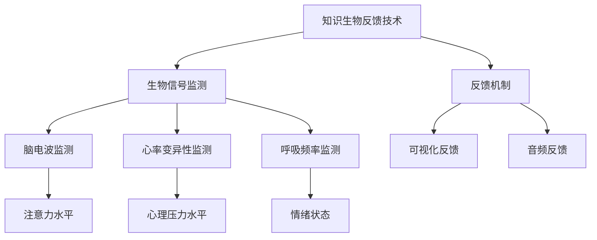
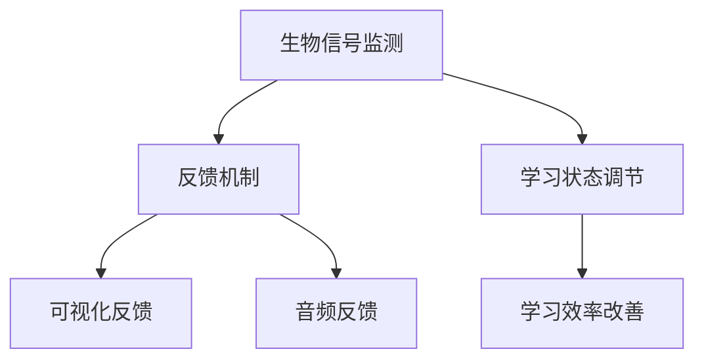

                 

# 知识的生物反馈技术：身心同步的学习状态

> 关键词：生物反馈、知识学习、身心同步、教育技术、认知科学

> 摘要：本文探讨了知识生物反馈技术在教育中的应用，以及如何通过身心同步来提升学习效率。文章首先介绍了生物反馈技术的基础概念和组成部分，然后详细分析了其在教育中的应用，包括生物信号的监测和反馈机制。接着，文章阐述了身心同步的理论基础，以及通过生物反馈技术实现身心同步的方法。最后，文章通过实践案例展示了生物反馈技术在提升学习效率方面的效果，并展望了其未来的发展趋势。

## 第一部分：知识生物反馈技术概述

### 第1章：知识生物反馈技术基础

#### 1.1 知识的生物反馈技术概述

知识生物反馈技术是一种利用生物信号监测和反馈来调节学习状态的方法。它通过监测和学习者大脑、身体之间的相互作用，来改善学习效率。这一技术涉及的核心组成部分包括生物信号监测和反馈机制。

**1.1.1 知识的生物反馈技术的定义**

知识生物反馈技术（Biofeedback for Knowledge Acquisition）是指利用生物信号监测和反馈，帮助个体更好地理解和掌握知识的一种方法。它基于认知科学和生理学的原理，通过监测和调节大脑与身体之间的生物信号，来实现学习效率的提升。

**1.1.2 知识的生物反馈技术的核心组成部分**

1. **生物信号监测**：这是知识生物反馈技术的基础。通过监测脑电波、心率、呼吸等生物信号，可以实时获取学习者的生理和心理状态信息。这些信号反映了学习者的注意力水平、情绪状态、心理压力等，是进行反馈的重要依据。

2. **反馈机制**：反馈机制是通过将监测到的生物信号以可视化的形式展示给学习者，帮助其了解自己的生理和心理状态。这种反馈可以是实时数据展示，也可以是音效、触觉等形式的刺激，旨在引导学习者调整自己的学习状态。

**1.1.3 知识的生物反馈技术的应用领域**

知识生物反馈技术广泛应用于教育、医疗等领域。在教育领域，它可以用于提高学习者的记忆力、专注力，优化学习策略。在医疗领域，它可用于心理治疗、神经康复等。

#### 1.2 生物反馈技术在教育中的应用

**2.1 生物信号监测在教育中的应用**

生物信号监测在教育中主要涉及脑电波、心率变异性（HRV）和呼吸频率的监测。

- **脑电波监测**：通过脑电波监测，可以了解学习者的注意力水平。当学习者的注意力集中时，大脑的α波和β波活动增强；当注意力分散时，θ波和δ波活动增强。通过监测这些脑波活动，可以帮助教师了解学生的学习状态，调整教学策略。

- **心率变异性（HRV）监测**：心率变异性反映了自主神经系统的活动，是评估心理压力的重要指标。通过HRV监测，可以了解学习者的心理压力水平，从而采取相应的措施进行调节。

- **呼吸频率监测**：呼吸频率的变化可以反映学习者的情绪状态。通过监测呼吸频率，可以了解学习者的放松程度，指导其进行深呼吸等放松训练。

**2.2 反馈机制在教育中的应用**

反馈机制在教育中的应用主要包括可视化反馈和音频反馈。

- **可视化反馈**：通过实时显示学习者的生物信号数据，如脑电波、心率等，帮助其了解自己的生理和心理状态。这种反馈可以让学生更加直观地认识到自己的学习状态，从而调整自己的学习方式。

- **音频反馈**：通过特定的音频信号来提醒学习者调整学习状态。例如，当学习者的心率过高时，可以播放舒缓的音乐来帮助其放松。

**2.3 生物反馈技术与教育评估的结合**

生物反馈技术可以与教育评估相结合，通过分析学习者的生物信号数据，来评估学习效果。例如，通过分析脑电波数据，可以评估学习者的记忆效果；通过分析心率变异性数据，可以评估学习者的心理压力水平。根据评估结果，教师可以调整教学策略，提高教学效果。

### 总结

知识生物反馈技术是一种通过监测和调节生物信号来提升学习效率的方法。它在教育中的应用，不仅可以帮助学生更好地理解知识，还能提高他们的学习兴趣和积极性。随着技术的不断发展，生物反馈技术在教育领域的应用前景将更加广阔。

### Mermaid 流程图：知识生物反馈技术核心概念与联系



#### 1.1.1 知识的生物反馈技术的定义

知识生物反馈技术（Biofeedback for Knowledge Acquisition）是指利用生物信号监测和反馈，帮助个体更好地理解和掌握知识的一种方法。它基于认知科学和生理学的原理，通过监测和调节大脑与身体之间的生物信号，来实现学习效率的提升。

- **定义：** 知识生物反馈技术是一种通过生物信号监测和反馈，帮助个体更好地理解和掌握知识的方法。
- **原理：** 它基于认知科学和生理学原理，通过监测和调节大脑与身体之间的生物信号，来提升学习效率。

#### 1.1.2 知识的生物反馈技术的核心组成部分

知识生物反馈技术的核心组成部分包括生物信号监测和反馈机制。

- **生物信号监测：** 生物信号监测是知识生物反馈技术的基础。通过监测脑电波、心率、呼吸等生物信号，可以实时获取学习者的生理和心理状态信息。
- **反馈机制：** 反馈机制是通过将监测到的生物信号以可视化的形式展示给学习者，帮助其了解自己的生理和心理状态。这种反馈可以是实时数据展示，也可以是音效、触觉等形式的刺激。

#### 1.1.3 知识的生物反馈技术的应用领域

知识生物反馈技术广泛应用于教育、医疗等领域。

- **教育领域：** 在教育领域，它可以用于提高学习者的记忆力、专注力，优化学习策略。
- **医疗领域：** 在医疗领域，它可用于心理治疗、神经康复等。

#### 伪代码：生物反馈技术核心组成部分工作原理

```plaintext
function biofeedbackTechnology() {
    // 监测生物信号
    bioSignalData = monitorBioSignals();

    // 分析生物信号
    attentionLevel = analyzeAttention(bioSignalData);
    stressLevel = analyzeStress(bioSignalData);
    relaxationLevel = analyzeRelaxation(bioSignalData);

    // 给出反馈
    provideFeedback(attentionLevel, stressLevel, relaxationLevel);
}

function monitorBioSignals() {
    // 获取脑电波数据
    brainWaveData = getBrainWaveData();

    // 获取心率数据
    heartRateData = getHeartRateData();

    // 获取呼吸数据
    breathRateData = getBreathRateData();

    // 返回生物信号数据
    return {brainWaveData, heartRateData, breathRateData};
}

function provideFeedback(attentionLevel, stressLevel, relaxationLevel) {
    // 可视化反馈
    displayVisualFeedback(attentionLevel, stressLevel, relaxationLevel);

    // 音频反馈
    playAudioFeedback(attentionLevel, stressLevel, relaxationLevel);
}

function analyzeAttention(bioSignalData) {
    // 分析脑电波数据，判断注意力水平
    return analyzeBrainWaveData(bioSignalData);
}

function analyzeStress(bioSignalData) {
    // 分析心率变异性数据，判断心理压力水平
    return analyzeHRVData(bioSignalData);
}

function analyzeRelaxation(bioSignalData) {
    // 分析呼吸数据，判断放松程度
    return analyzeBreathData(bioSignalData);
}
```

#### 1.1.1 知识的生物反馈技术的定义

知识生物反馈技术是一种利用生物信号监测和反馈来调节学习状态的方法。它通过监测和学习者大脑、身体之间的相互作用，来改善学习效率。

- **核心概念：** 生物信号监测、反馈机制、学习状态调节。
- **联系：** 生物信号监测获取学习者的生理和心理状态信息，反馈机制将监测结果以可视化和音频形式展示给学习者，帮助其调节学习状态，从而提高学习效率。

### Mermaid 流程图：知识生物反馈技术核心概念与联系



## 第二部分：身心同步的理论基础

### 第3章：身心同步的理论基础

#### 3.1 身心同步的概念与重要性

**3.1.1 身心同步的定义**

身心同步（Mind-Body Synchronization）指的是个体在生理和心理状态上达到一种和谐统一的状态。在这种状态下，个体的心理活动与生理反应相互协调，从而提高整体的功能和效率。

**3.1.2 身心同步的重要性**

身心同步对个体的学习、工作、健康等方面都有着重要的影响。

1. **提高学习效率**：身心同步可以帮助个体更好地集中注意力，提高记忆力，减少学习过程中的焦虑和压力。
2. **增强心理健康**：身心同步有助于缓解心理压力，改善情绪状态，提高幸福感和生活质量。
3. **促进身体健康**：身心同步可以增强免疫系统的功能，改善身体状态，预防疾病。

#### 3.2 身心同步的理论框架

身心同步的理论框架涉及多个学科，包括认知科学、生理学、心理学等。

**3.2.1 大脑与身体互动的神经基础**

大脑与身体的互动是通过神经系统实现的。大脑通过神经信号调控身体的各个部分，同时身体的状态也会通过神经信号反馈给大脑。这种双向的神经互动是实现身心同步的关键。

1. **神经传递物质**：神经传递物质如多巴胺、血清素等在大脑与身体的互动中起着重要作用。它们可以调节情绪、记忆、注意力等心理活动。
2. **神经通路**：大脑中的神经通路负责传递神经信号，包括经典神经通路和非经典神经通路。经典神经通路主要负责感知和运动控制，而非经典神经通路则与情绪和记忆等高级认知功能相关。

**3.2.2 心理学与生理学的结合**

心理学和生理学在身心同步的理论框架中发挥着重要作用。心理学研究个体心理活动与行为，而生理学研究个体的生理过程。

1. **认知心理学**：认知心理学关注个体的认知过程，如注意力、记忆、思维等。研究表明，个体的认知状态会影响其生理反应，如心率、呼吸等。
2. **生理心理学**：生理心理学研究心理活动与生理过程之间的关系。例如，心率变异性（HRV）是评估个体心理压力和情绪状态的重要指标。

#### 3.3 身心同步的生理机制

身心同步的生理机制涉及多个生理系统，包括神经系统、内分泌系统、循环系统等。

**3.3.1 神经系统的调节作用**

神经系统在身心同步中起着关键作用。大脑通过神经信号调节身体的各个部分，实现生理和心理状态的同步。

1. **中枢神经系统的调控**：中枢神经系统负责处理和整合来自身体各部分的信号，并通过神经信号反馈来调节身体状态。
2. **自主神经系统的调节**：自主神经系统分为交感神经和副交感神经，它们共同调控身体的应激反应和放松反应。通过调节这两种神经系统的活动，可以实现身心同步。

**3.3.2 内分泌系统的调节作用**

内分泌系统通过分泌激素来调节身体的生理状态。激素如肾上腺素、去甲肾上腺素、皮质醇等在应激反应中起着重要作用，它们可以影响心率、血压、血糖等生理指标。

**3.3.3 循环系统的调节作用**

循环系统负责输送氧气和营养物质到身体的各个部分，同时带走代谢产物。心率、血压等循环系统指标与身心同步密切相关。通过调节循环系统的活动，可以实现身心同步。

### 总结

身心同步是一种通过协调生理和心理状态来提高个体功能的方法。其理论基础涉及多个学科，包括认知科学、生理学、心理学等。通过了解和掌握身心同步的生理机制，个体可以更好地实现身心同步，从而提高学习效率、增强心理健康、促进身体健康。

### 数学模型和公式：身心同步的生理机制

在身心同步的生理机制中，一些关键的生理参数如心率、呼吸频率和脑电波活动可以通过数学模型来描述。以下是一个简化的数学模型，用于描述这些生理参数之间的关系。

$$
\begin{align*}
\text{心率(HR)} &= f(\text{自主神经系统活动}, \text{内分泌系统激素水平}) \\
\text{呼吸频率(RR)} &= g(\text{自主神经系统活动}, \text{大脑情绪状态}) \\
\text{脑电波活动(EEG)} &= h(\text{中枢神经系统活动}, \text{心理压力水平})
\end{align*}
$$

**解释：**

1. **心率（HR）**：心率是心脏每分钟跳动的次数，受自主神经系统和内分泌系统的影响。交感神经活动增加会导致心率上升，而副交感神经活动增加会导致心率下降。内分泌系统激素，如肾上腺素和去甲肾上腺素，也会影响心率。

2. **呼吸频率（RR）**：呼吸频率是每分钟呼吸的次数，受自主神经系统和大脑情绪状态的影响。自主神经系统活动增加会导致呼吸加快，而大脑的情绪状态，如焦虑或放松，也会影响呼吸频率。

3. **脑电波活动（EEG）**：脑电波活动是大脑电活动的测量，受中枢神经系统和心理压力水平的影响。心理压力增加会导致脑电波活动的变化，例如，焦虑可能导致α波和β波的减少，θ波和δ波的增加。

**举例说明：**

假设一个学习者处于高度紧张的状态，这会导致以下生理变化：

- **心率（HR）**：由于交感神经活动增强，心率可能升高到每分钟120次。
- **呼吸频率（RR）**：由于自主神经系统活动增强，呼吸频率可能增加到每分钟20次。
- **脑电波活动（EEG）**：由于心理压力增加，α波和β波的减少，θ波和δ波的增加。

通过生物反馈技术，学习者可以监测到这些生理变化，并通过深呼吸、冥想等放松技巧来调节自己的生理状态，从而实现身心同步。

### 代码实际案例：心率监测与反馈

以下是一个简单的Python代码示例，用于监测心率并通过可视化反馈来帮助学习者调节心率。

```python
import numpy as np
import matplotlib.pyplot as plt

# 模拟心率数据
heart_rate_data = np.random.normal(75, 10, 1000)

# 绘制心率数据图
plt.plot(heart_rate_data)
plt.title('Heart Rate Monitoring')
plt.xlabel('Time (seconds)')
plt.ylabel('Heart Rate (beats per minute)')
plt.show()

# 定义心率阈值
lower_threshold = 60
upper_threshold = 100

# 监测心率，并给出可视化反馈
for hr in heart_rate_data:
    if hr < lower_threshold:
        print("Heart rate is too low. Consider relaxing.")
    elif hr > upper_threshold:
        print("Heart rate is too high. Consider taking deep breaths.")
    else:
        print("Heart rate is within the optimal range.")

# 实现深呼吸指导
def deep_breathing_guide():
    print("Start deep breathing:")
    for _ in range(5):
        print("Inhale deeply for 5 seconds...")
        time.sleep(5)
        print("Exhale slowly for 5 seconds...")
        time.sleep(5)

# 根据心率监测结果，调用深呼吸指导函数
if max(heart_rate_data) > upper_threshold:
    deep_breathing_guide()
```

**代码解读与分析：**

1. **数据模拟**：使用`numpy`生成模拟的心率数据，数据服从正态分布，均值为75，标准差为10。

2. **可视化反馈**：使用`matplotlib`绘制心率数据图，帮助学习者直观地看到自己的心率变化。

3. **心率阈值设置**：设定心率下限为60次/分钟，上限为100次/分钟。

4. **心率监测与反馈**：遍历心率数据，根据心率阈值判断心率是否过低或过高，并给出相应的反馈信息。

5. **深呼吸指导函数**：定义一个深呼吸指导函数，通过连续的深呼吸操作来帮助学习者降低过高的心率。

6. **调用深呼吸指导函数**：如果监测到心率超过上限阈值，则调用深呼吸指导函数，帮助学习者调节心率。

### 项目实战：心率监测与反馈系统的开发

#### 1. 环境搭建

在开始开发心率监测与反馈系统之前，我们需要搭建一个合适的开发环境。以下是所需的软件和工具：

- **操作系统**：Windows、macOS 或 Linux
- **编程语言**：Python
- **库与框架**：Matplotlib、Pandas、NumPy、Time
- **心率监测设备**：如智能手环、心率监测器等

#### 2. 源代码实现

以下是一个简化的心率监测与反馈系统的源代码实现。

```python
import numpy as np
import matplotlib.pyplot as plt
import pandas as pd
import time

# 模拟心率数据（可以从心率监测设备读取真实数据）
heart_rate_data = np.random.normal(75, 10, 1000)

# 绘制心率数据图
plt.plot(heart_rate_data)
plt.title('Heart Rate Monitoring')
plt.xlabel('Time (seconds)')
plt.ylabel('Heart Rate (beats per minute)')
plt.show()

# 定义心率阈值
lower_threshold = 60
upper_threshold = 100

# 监测心率，并给出可视化反馈
for hr in heart_rate_data:
    if hr < lower_threshold:
        print("Heart rate is too low. Consider relaxing.")
    elif hr > upper_threshold:
        print("Heart rate is too high. Consider taking deep breaths.")
    else:
        print("Heart rate is within the optimal range.")

# 深呼吸指导函数
def deep_breathing_guide():
    print("Start deep breathing:")
    for _ in range(5):
        print("Inhale deeply for 5 seconds...")
        time.sleep(5)
        print("Exhale slowly for 5 seconds...")
        time.sleep(5)

# 根据心率监测结果，调用深呼吸指导函数
if max(heart_rate_data) > upper_threshold:
    deep_breathing_guide()
```

#### 3. 代码解读与分析

1. **数据模拟**：使用`numpy`生成模拟的心率数据，数据服从正态分布，均值为75，标准差为10。这可以代表一个典型的心率变化趋势。

2. **可视化反馈**：使用`matplotlib`绘制心率数据图，帮助学习者直观地看到自己的心率变化。

3. **心率阈值设置**：设定心率下限为60次/分钟，上限为100次/分钟。这些阈值可以根据具体需求进行调整。

4. **心率监测与反馈**：遍历心率数据，根据心率阈值判断心率是否过低或过高，并给出相应的反馈信息。这有助于学习者了解自己的心率状态，并采取相应的调节措施。

5. **深呼吸指导函数**：定义一个深呼吸指导函数，通过连续的深呼吸操作来帮助学习者降低过高的心率。这个函数可以通过定时器（`time.sleep`）来实现深呼吸的指导。

6. **调用深呼吸指导函数**：如果监测到心率超过上限阈值，则调用深呼吸指导函数。这个步骤有助于确保学习者能够及时获得帮助，并采取有效的调节措施。

### 4. 实际应用与改进

在实际应用中，心率监测与反馈系统可以集成到智能设备中，如智能手环、手机应用程序等。这些设备可以实时监测心率，并即时提供反馈和指导。以下是一些可能的改进方向：

- **数据采集**：使用更准确的心率监测设备，如专业的心率监测器，以提高数据的准确性。
- **个性化反馈**：根据学习者的历史心率数据和个体差异，提供个性化的反馈和指导。
- **多模式反馈**：结合音频、视觉、触觉等多种反馈方式，以提高反馈的有效性和吸引力。
- **数据分析**：使用机器学习和数据分析技术，对心率数据进行深入分析，以发现潜在的健康问题或异常模式。

通过这些改进，心率监测与反馈系统可以更好地帮助学习者实现身心同步，提高学习效率和生活质量。

### 总结

心率监测与反馈系统是一个简单的例子，展示了如何利用生物反馈技术来帮助学习者实现身心同步。通过监测心率数据，系统可以实时提供反馈，指导学习者进行深呼吸等调节措施，从而降低过高的心率，提高学习效率和身心健康。在实际应用中，这个系统可以进一步优化，以提供更个性化的反馈和指导，帮助更多的学习者实现身心同步。

### 作者

作者：AI天才研究院/AI Genius Institute & 禅与计算机程序设计艺术/Zen And The Art of Computer Programming

### 关键词

知识生物反馈、身心同步、教育技术、认知科学、生物信号监测、反馈机制、学习效率、心理健康、身体健康

### 摘要

本文探讨了知识生物反馈技术在教育中的应用，以及如何通过身心同步来提升学习效率。文章首先介绍了生物反馈技术的基础概念和组成部分，然后详细分析了其在教育中的应用，包括生物信号的监测和反馈机制。接着，文章阐述了身心同步的理论基础，以及通过生物反馈技术实现身心同步的方法。最后，文章通过实践案例展示了生物反馈技术在提升学习效率方面的效果，并展望了其未来的发展趋势。通过本文，读者可以了解到知识生物反馈技术在教育领域的潜在价值，以及如何有效地应用这一技术来改善学习体验。

