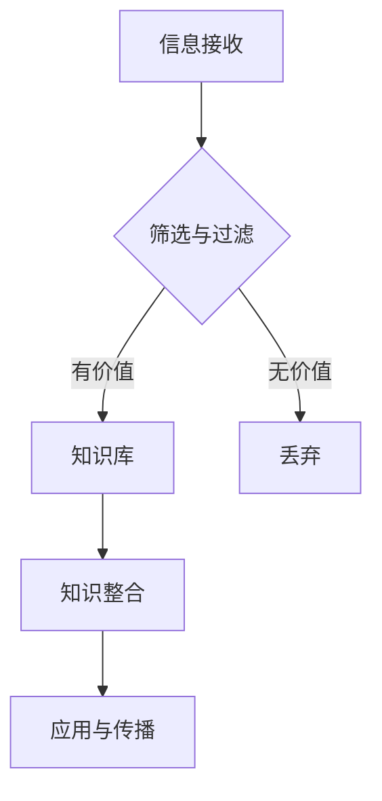

                 

### 文章标题：知识的碎片化与整合：信息时代的认知挑战

#### 关键词：碎片化信息、知识整合、认知重构、信息过载、认知提升

> 摘要：在信息爆炸的时代，知识的碎片化已成为不可避免的趋势。本文旨在探讨碎片化信息的认知挑战，分析信息过载现象及其影响，并提出认知重构与知识整合的策略。通过核心概念与联系、核心算法原理讲解、数学模型与公式、项目实战等环节，本文深入解析如何有效应对碎片化信息的认知挑战，提升个人和组织在信息时代的知识管理水平。

---

### 引言

信息时代，我们面临着前所未有的信息爆炸。每天，大量的数据和信息通过互联网、社交媒体、新闻媒体等各种渠道涌入我们的视野。这些信息以碎片化的形式存在，具有高度的分隔性、短暂性和快速变化的特点。这种碎片化信息在给我们带来便利的同时，也带来了巨大的认知挑战。

知识的碎片化是指信息内容细小、分散、片段化的现象。与传统信息相比，碎片化信息具有以下特点：

1. **内容特点**：碎片化信息往往短小精悍，以段落、短句、图像、视频等形式存在，易于快速消费和理解。
2. **传播途径**：社交媒体、搜索引擎、新闻媒体等是碎片化信息的主要传播渠道，它们使得信息可以快速扩散和分享。
3. **影响**：碎片化信息在一定程度上丰富了我们的知识储备，但同时也导致了信息过载，给认知带来了负担。

信息过载是指接收和处理的信息量超过个体或系统的承受能力。在碎片化信息环境下，信息过载现象尤为明显。以下是信息过载的主要表现和影响：

1. **信息过载现象**：
   - 信息冗余：大量重复、相似的信息占据我们的时间和注意力。
   - 注意力分散：面对海量的信息，人们往往无法集中注意力，导致多任务处理能力下降。
   - 时间压力：为了处理大量的信息，人们不得不牺牲休息和娱乐时间。

2. **信息过载影响**：
   - 认知负荷增加：处理过多的信息会占用大脑的认知资源，导致思维疲劳。
   - 认知能力下降：长期的信息过载可能导致认知能力下降，影响判断和决策。
   - 社会问题：信息过载不仅影响个人，还可能导致社会认知的一致性降低，影响社会的稳定和发展。

面对碎片化信息的认知挑战，我们需要进行认知重构与知识整合。本文将分以下几个部分进行探讨：

1. **碎片化信息的崛起**：详细分析碎片化信息的定义、特点及其影响。
2. **认知重构与知识整合**：探讨认知重构的重要性，分析知识整合的策略。
3. **认知工具与方法**：介绍信息筛选与过滤工具，知识管理工具，以及认知训练与提升方法。
4. **实践与应用**：探讨碎片化信息管理在职场中的应用，以及碎片化信息与社会发展的影响。
5. **附录**：推荐相关的碎片化信息与知识整合工具。

通过本文的探讨，希望能够为读者提供应对碎片化信息认知挑战的思路和方法，提升个人和组织的知识管理水平。

---

### 第一部分：碎片化时代的信息认知

#### 第1章：碎片化信息的崛起

##### 1.1 碎片化信息的定义与特点

碎片化信息，顾名思义，指的是信息内容细小、分散、片段化的现象。在传统信息传播渠道相对单一的时代，信息多以系统化、连续性的形式存在，而随着互联网的普及和社交媒体的兴起，信息传播方式发生了根本性的变化。

**内容特点**：

1. **短小精悍**：碎片化信息往往以简短、精炼的形式出现，如短段落、短句、短语等。这种形式使得信息易于快速消费和理解。
2. **多样化形式**：碎片化信息不仅限于文字，还包括图像、音频、视频等多种形式。这种多样性增强了信息的吸引力，使得信息传播更加广泛。
3. **时效性强**：由于信息传播速度极快，碎片化信息的时效性非常强。一个热点事件可能在短短几小时内就传播开来，并被迅速遗忘。

**传播途径**：

1. **社交媒体**：社交媒体平台如微博、微信、Facebook、Twitter等是碎片化信息传播的主要渠道。这些平台具有高度的互动性和传播效率，使得信息可以快速扩散和分享。
2. **搜索引擎**：搜索引擎如Google、百度等，通过算法对海量的碎片化信息进行索引和排序，使用户可以快速获取所需的信息。
3. **新闻媒体**：传统新闻媒体在数字化转型的过程中，也开始采用碎片化信息的形式进行报道。通过微博、微信等平台发布简短的新闻摘要，吸引用户点击和阅读。

**影响**：

1. **信息获取便利**：碎片化信息使得用户可以随时随地获取信息，大大提高了信息获取的便利性。
2. **知识积累困难**：由于信息内容短小且分散，用户难以进行系统的知识积累，这可能导致知识的碎片化和断裂。
3. **信息真实性难以保证**：碎片化信息的传播速度快，监管难度大，导致信息真实性和可靠性难以保证。

##### 1.2 信息过载现象及其影响

信息过载是指接收和处理的信息量超过个体或系统的承受能力。在碎片化信息环境下，信息过载现象尤为明显。以下是信息过载的主要表现和影响：

1. **信息冗余**：

信息冗余是指大量重复、相似的信息占据我们的时间和注意力。在碎片化信息环境下，由于信息传播速度极快，相同或类似的信息可能在不同平台、不同时间点多次出现。这种现象不仅浪费了用户的时间，还可能导致用户对信息的疲劳和忽视。

2. **注意力分散**：

面对海量的碎片化信息，人们往往无法集中注意力，导致多任务处理能力下降。这种现象在日常生活中尤为明显，例如，用户在浏览社交媒体时，可能会不断切换不同的信息源，导致注意力难以集中。长期下去，注意力分散会影响工作效率和创新能力。

3. **时间压力**：

为了处理大量的信息，人们不得不牺牲休息和娱乐时间。这种现象在职业人士中尤为普遍，他们往往需要在工作之余继续关注和回复信息，导致身心疲惫。长期的时间压力可能导致身心健康问题，影响个人的生活质量。

##### 1.3 碎片化信息对认知的挑战

1. **认知负荷的增加**：

处理碎片化信息需要大量的认知资源，这可能导致大脑的认知资源被占用过多，从而影响其他认知任务的处理。例如，在阅读一篇长篇文章时，由于信息量较大，人们可能会感到思维疲劳，难以深入理解和思考。

2. **注意力分散**：

由于碎片化信息的传播速度快，形式多样化，人们容易受到新信息的干扰，导致注意力分散。这种现象不仅会影响个人的工作效率，还可能导致重要信息的遗漏。

3. **认知能力下降**：

长期的信息过载和注意力分散可能导致认知能力下降，影响判断和决策。例如，面对复杂的决策问题，人们可能因为信息过载而难以做出明智的决策。

为了应对碎片化信息的认知挑战，我们需要进行认知重构与知识整合。在接下来的章节中，我们将探讨认知重构的重要性，分析知识整合的策略，并提供相关的认知工具与方法。通过这些策略和方法，我们可以有效地提升个人和组织在信息时代的认知能力，更好地应对碎片化信息的挑战。

---

#### 第2章：认知重构与知识整合

##### 2.1 认知重构的重要性

在碎片化信息充斥的时代，认知重构成为了解决认知挑战的关键。认知重构不仅是对个体认知能力的提升，更是对知识结构和社会认知体系的重塑。

**认知重构的必要性**：

1. **应对信息过载**：随着信息量的激增，人们面临的信息过载问题日益严重。通过认知重构，我们可以筛选出有价值的信息，减少无效信息的干扰，提高信息处理效率。
2. **提升认知能力**：认知重构有助于个体构建更加系统和连贯的知识体系，从而提升信息处理和知识整合的能力。通过重构认知结构，我们可以更加高效地利用大脑的认知资源。
3. **适应时代变化**：信息时代的变化速度极快，认知重构使我们能够不断更新和优化知识结构，以适应不断变化的环境和需求。

**认知重构的方法与途径**：

1. **知识筛选与过滤**：

   知识筛选与过滤是认知重构的重要步骤。通过建立信息筛选标准和过滤机制，我们可以从海量信息中快速获取有价值的信息。具体方法包括：
   
   - **信息源评估**：评估信息源的可靠性和权威性，选择高质量的信息源。
   - **信息真实性检测**：使用技术手段对信息进行真实性检测，如事实核查、来源追溯等。
   - **标签分类与归类**：对信息进行分类和标签化，以便快速检索和利用。

2. **知识关联与网络构建**：

   知识关联与网络构建是将零散信息整合成有意义的整体的重要手段。通过分析信息之间的关联性，我们可以构建知识网络，实现知识的系统化和结构化。具体方法包括：

   - **关系图谱**：使用关系图谱表示信息之间的关联关系，如概念图谱、社交图谱等。
   - **语义分析**：通过自然语言处理技术分析信息内容，挖掘信息之间的语义关系。
   - **知识融合**：将不同来源和形式的信息进行整合和融合，形成统一的视图。

3. **知识共享与传播**：

   知识共享与传播是知识整合的必要环节。通过共享和传播知识，我们可以扩大知识的覆盖面和影响力，促进知识的共享和创新。具体方法包括：

   - **知识库建设**：建立知识库，集中存储和管理知识资源，如企业知识库、个人知识库等。
   - **知识共享平台**：搭建知识共享平台，促进知识交流和传播，如内部论坛、知识社区等。
   - **知识推广与宣传**：通过多种渠道推广和宣传知识，提高知识的普及度和应用价值。

**案例**：

1. **个人层面的认知重构**：

   - **知识筛选与过滤**：个人可以通过建立信息筛选标准和过滤机制，如关注高质量博客、订阅专业资讯等，减少无效信息的干扰。
   - **知识关联与网络构建**：个人可以通过阅读、研究、讨论等方式，将零散的知识点联系起来，构建自己的知识网络。
   - **知识共享与传播**：个人可以通过写作、演讲、培训等方式，将自己的知识和经验分享给他人，促进知识的传播和应用。

2. **组织层面的认知重构**：

   - **知识筛选与过滤**：组织可以通过建立信息管理平台，对内部和外部信息进行筛选和过滤，确保信息的真实性和价值。
   - **知识关联与网络构建**：组织可以通过建立知识图谱，分析信息之间的关联性，构建系统的知识体系。
   - **知识共享与传播**：组织可以通过知识共享平台、内部培训、项目协作等方式，促进知识的共享和创新。

通过认知重构，我们可以有效地应对碎片化信息的认知挑战，提升个人和组织的知识管理水平。在接下来的章节中，我们将继续探讨认知工具与方法，以及实际应用案例，帮助读者更好地理解和应用认知重构的策略。

---

##### 2.2 知识整合的策略

在碎片化信息的海洋中，知识整合成为提升认知能力和知识管理效率的关键。知识整合不仅是对零散信息的有效整合，更是对知识结构和应用价值的深度挖掘。以下是知识整合的主要策略：

**知识筛选与过滤**：

知识筛选与过滤是知识整合的第一步，旨在从海量信息中提取有价值的信息。以下是具体策略：

1. **信息源评估**：对信息源进行评估，选择可靠和权威的信息来源。例如，通过评估网站域名、出版机构、作者资质等，确定信息源的可靠性和专业性。

2. **信息真实性检测**：使用技术手段对信息进行真实性检测，如事实核查、来源追溯等。例如，可以使用搜索引擎进行关键词检索，验证信息的出处和可靠性。

3. **标签分类与归类**：对信息进行分类和标签化，以便快速检索和利用。例如，可以使用标签管理系统，根据信息内容、主题、领域等，对信息进行分类和归类。

**知识关联与网络构建**：

知识关联与网络构建是将零散信息整合成有意义的整体的重要手段。以下是具体策略：

1. **关系图谱**：使用关系图谱表示信息之间的关联关系。例如，可以使用图数据库构建概念图谱、社交图谱等，表示不同信息之间的联系。

2. **语义分析**：通过自然语言处理技术分析信息内容，挖掘信息之间的语义关系。例如，可以使用文本相似性算法，分析文章之间的相似度，确定信息之间的关联性。

3. **知识融合**：将不同来源和形式的信息进行整合和融合，形成统一的视图。例如，可以将文本信息、图像信息、视频信息等进行整合，形成综合性的知识资源。

**知识共享与传播**：

知识共享与传播是知识整合的必要环节，旨在扩大知识的覆盖面和影响力。以下是具体策略：

1. **知识库建设**：建立知识库，集中存储和管理知识资源。例如，可以建立企业知识库、个人知识库等，集中管理和分享知识资源。

2. **知识共享平台**：搭建知识共享平台，促进知识交流和传播。例如，可以建立内部论坛、知识社区等，为员工提供一个交流和分享知识的平台。

3. **知识推广与宣传**：通过多种渠道推广和宣传知识，提高知识的普及度和应用价值。例如，可以通过写作、演讲、培训等方式，将知识和经验分享给更多人。

**案例分析**：

以下是一些具体的案例分析，展示了如何实施知识整合策略：

1. **个人层面的知识整合**：

   - **信息筛选与过滤**：个人可以通过关注高质量博客、订阅专业资讯等方式，筛选和过滤有价值的信息。
   - **知识关联与网络构建**：个人可以通过阅读、研究、讨论等方式，将零散的知识点联系起来，构建自己的知识网络。
   - **知识共享与传播**：个人可以通过写作、演讲、培训等方式，将自己的知识和经验分享给他人。

2. **组织层面的知识整合**：

   - **信息筛选与过滤**：组织可以通过建立信息管理平台，对内部和外部信息进行筛选和过滤，确保信息的真实性和价值。
   - **知识关联与网络构建**：组织可以通过建立知识图谱，分析信息之间的关联性，构建系统的知识体系。
   - **知识共享与传播**：组织可以通过知识共享平台、内部培训、项目协作等方式，促进知识的共享和创新。

通过这些策略，我们可以有效地整合碎片化信息，提升个人和组织的知识管理水平，更好地应对信息时代的认知挑战。

---

##### 2.3 案例分析：如何应对碎片化信息的认知挑战

为了更深入地理解如何应对碎片化信息的认知挑战，我们将通过三个不同层面的案例进行分析：个人层面、组织层面和社会层面。

**案例一：个人层面的策略**

张三是一名自由职业者，他的日常工作依赖于不断获取和处理大量的信息。为了应对碎片化信息的挑战，张三采取了以下策略：

1. **信息筛选与过滤**：张三使用了一些信息筛选工具，如Feedly和Inoreader，来订阅他感兴趣的博客和新闻网站。这些工具可以帮助他过滤无关信息，集中获取高质量的内容。此外，他还使用Google Scholar来筛选与他的专业领域相关的学术文章。

2. **知识关联与网络构建**：张三通过读书、参加线上课程和研讨会等方式，积极构建自己的知识网络。他使用软件如MindManager来绘制思维导图，将新的知识点与现有的知识体系进行关联。这种方法不仅帮助他加深对知识的理解，还提高了记忆效率。

3. **知识共享与传播**：张三积极参与专业论坛和社交媒体，分享他的学习心得和专业见解。他还在个人博客上撰写技术文章，这不仅帮助他巩固知识，还让他得到了同行的反馈和认可。

**案例二：组织层面的策略**

李四是一家大型技术公司的项目经理，他负责管理和协调团队的工作。为了应对碎片化信息的挑战，公司采取了以下策略：

1. **信息筛选与过滤**：公司建立了一个内部知识库，由专门的信息管理员定期更新和维护。这个知识库包含了项目文档、最佳实践和以往的项目案例，员工可以通过权限认证访问这些资源。此外，公司还使用了一些自动化工具来过滤网络上的信息，确保只有高质量的内容进入知识库。

2. **知识关联与网络构建**：公司引入了知识图谱技术，通过分析项目文档和员工的工作日志，构建了公司内部的知识网络。这种网络可以帮助员工快速找到与当前项目相关的知识资源，提高工作效率。

3. **知识共享与传播**：公司定期组织内部培训和工作坊，鼓励员工分享他们的知识和经验。此外，公司还建立了内部社交网络，员工可以通过这个平台交流想法和问题，促进知识的共享和传播。

**案例三：社会层面的策略**

王五是一名社会学家，他专注于研究信息时代的社会动态。为了应对碎片化信息的认知挑战，他采取了以下策略：

1. **信息筛选与过滤**：王五通过阅读学术期刊和参加学术会议，筛选与他的研究主题相关的高质量信息。他使用文献管理工具如EndNote和Zotero来管理他的参考文献，确保信息的真实性和可靠性。

2. **知识关联与网络构建**：王五通过跨学科研究，将社会学理论与计算机科学、心理学等领域的前沿研究进行关联。他使用软件如NVivo进行文本分析，挖掘不同学科之间的共通点和差异，从而构建一个更广泛的知识网络。

3. **知识共享与传播**：王五积极参与学术社区，通过发表学术论文、参与学术会议和在线课程，分享他的研究成果。他还创建了一个社交媒体平台，专门用于学术讨论和知识共享，为学术社群提供了一个交流的空间。

通过这些案例，我们可以看到，个人、组织和社群在面对碎片化信息的认知挑战时，都可以采取一系列有效的策略来应对。这些策略不仅有助于提升个人的认知能力，还可以提高组织和社会的知识管理水平。

---

#### 第二部分：认知工具与方法

##### 第3章：信息筛选与过滤工具

在碎片化信息时代，有效地筛选和过滤信息是应对认知挑战的关键。信息筛选与过滤工具可以帮助我们快速识别和获取有价值的信息，从而减轻信息过载的负担。以下将介绍几种常用的信息筛选与过滤工具，并分析其功能和应用。

**信息筛选工具**

**1. Google Scholar**

Google Scholar 是一款专门用于学术文献检索的工具。它可以帮助用户快速查找学术文章、论文、书籍等。通过设置关键词、作者、出版年份等筛选条件，用户可以找到与特定主题相关的文献。此外，Google Scholar 还支持引用分析和文献追踪功能，有助于用户了解某一领域的最新研究动态。

**2. Feedly**

Feedly 是一款内容聚合工具，它允许用户订阅多个博客、新闻网站和社交媒体账号，并将它们的内容聚合到一个统一的平台上。用户可以根据自己的兴趣和需求，定制个性化的内容流。Feedly 还提供了标签管理和搜索功能，方便用户快速查找和筛选信息。

**3. Inoreader**

Inoreader 与 Feedly 类似，也是一款内容聚合工具。它支持多种订阅源，包括博客、新闻网站、社交媒体等。用户可以设置关键词警报，一旦有新的内容与关键词匹配，系统会自动推送通知。此外，Inoreader 还支持内容分类和标签功能，帮助用户更好地管理信息。

**过滤工具**

**1. Adblock Plus**

Adblock Plus 是一款著名的广告拦截工具，它可以帮助用户过滤掉网页上的广告。广告不仅占用带宽，还可能包含恶意软件和钓鱼链接，因此使用 Adblock Plus 可以有效减少潜在的网络安全风险。

**2. Privacy Badger**

Privacy Badger 是一款隐私保护工具，它通过拦截追踪器来保护用户的隐私。当用户访问网站时，Privacy Badger 会检测并阻止追踪器收集用户的浏览行为数据。这种工具有助于减少个人信息泄露的风险，提高上网安全。

**3. uBlock Origin**

uBlock Origin 是一款功能强大的广告拦截和内容过滤工具。它不仅能够拦截广告，还可以根据用户的自定义规则过滤掉其他不希望看到的内容，如弹窗、视频广告等。uBlock Origin 的配置较为灵活，用户可以根据自己的需求进行自定义设置。

**案例分析**

以下是一个具体的案例分析，展示如何使用信息筛选与过滤工具：

假设张三是一名研究者，他需要寻找关于人工智能的最新论文。以下是他的操作步骤：

1. **信息筛选**：

   - 张三首先使用 Google Scholar 进行搜索，输入关键词如 "Artificial Intelligence"，"Machine Learning" 等。
   - 通过设置筛选条件，如最近一年的论文、高引用次数等，张三可以快速找到与他的研究主题相关的高质量论文。

2. **信息过滤**：

   - 张三在浏览论文时，使用 Adblock Plus 和 Privacy Badger 拦截广告和追踪器，确保浏览环境的安全和清晰。
   - 如果他在阅读过程中遇到了需要详细阅读的论文，他会使用 Inoreader 将这些论文订阅到他的知识管理工具中，以便后续阅读和分析。

通过上述步骤，张三能够有效地筛选和过滤信息，快速获取与他的研究主题相关的论文，从而减轻信息过载的负担，提高工作效率。

信息筛选与过滤工具在个人和组织层面都有着广泛的应用。通过合理利用这些工具，我们可以更有效地管理海量信息，提升认知能力和工作效率。在接下来的章节中，我们将继续探讨知识管理工具和认知训练与提升方法，帮助读者全面了解应对碎片化信息认知挑战的策略。

---

##### 第4章：知识管理工具

在信息爆炸的时代，如何有效地管理和利用知识资源成为企业和个人面临的重要挑战。知识管理工具提供了一种系统的方法，帮助我们在海量的信息中提取、存储、组织、共享和利用知识。以下将介绍几种常用的知识管理工具，并分析其功能和特点。

**知识库建设**

**1. Confluence**

Confluence 是一款由 Atlassian 开发的团队协作和知识管理工具。它支持文档创作、存储、共享和版本控制。用户可以在 Confluence 中创建各种类型的页面，如文档、报告、任务列表等，方便团队成员随时访问和更新。Confluence 还提供了强大的搜索功能和标签系统，帮助用户快速定位所需的知识资源。

**2. SharePoint**

SharePoint 是微软开发的企业级知识管理平台。它支持文档库、列表、工作流和网站功能。用户可以在 SharePoint 中创建和存储各种文档和资料，并设置访问权限，确保知识资源的保密性和安全性。此外，SharePoint 还提供了强大的搜索和统计功能，帮助用户更好地管理和利用知识资源。

**3. Documentum**

Documentum 是一款由 EMC 开发的企业级文档管理平台。它支持大规模文档存储、版本控制和安全控制。Documentum 提供了丰富的功能，如全文搜索、文档比较、审计跟踪等，帮助用户高效地管理和利用知识资源。它还支持集成其他企业应用，如 ERP、CRM 等，实现端到端的知识管理。

**知识地图**

**1. Lucidchart**

Lucidchart 是一款在线图表和流程图工具，适用于创建知识地图。用户可以使用 Lucidchart 绘制概念图、流程图、UML 图等，将复杂的信息以图形化的方式呈现。Lucidchart 支持实时协作，多个用户可以同时编辑同一张图表，提高知识共享和协作效率。

**2. Draw.io**

Draw.io 是一款免费的在线绘图工具，适用于创建知识地图和流程图。它提供了丰富的图形和连接线选项，用户可以轻松地绘制各种类型的图表。Draw.io 支持 SVG 格式，确保图表的高保真度和可扩展性。它还支持云存储，用户可以方便地将图表保存到云端，随时访问和更新。

**3. Microsoft Visio**

Microsoft Visio 是一款专业的图表和流程图工具，适用于创建复杂的知识地图和流程图。它提供了丰富的模板和形状库，用户可以根据需要自定义图表样式。Visio 还支持与 Excel、PowerPoint 等其他 Office 应用程序的集成，实现数据的联动和共享。

**案例分析**

以下是一个具体的案例分析，展示如何使用知识管理工具：

假设李四是某科技公司的研发经理，他需要管理和共享团队的知识资源。以下是他的操作步骤：

1. **知识库建设**：

   - 李四使用 Confluence 创建一个团队知识库，将项目文档、技术规范、最佳实践等存储在知识库中。
   - 他设置访问权限，确保团队成员可以方便地访问和更新知识库内容。
   - 使用标签系统对知识库内容进行分类，方便团队成员快速查找所需信息。

2. **知识地图**：

   - 李四使用 Draw.io 创建一个知识地图，将团队的关键知识领域和流程以图形化的方式呈现。
   - 他通过链接知识库中的文档和资料，构建一个直观的知识网络，帮助团队成员更好地理解和应用知识。

3. **知识共享**：

   - 李四定期组织团队会议，分享知识地图和知识库中的内容。
   - 他鼓励团队成员积极参与知识共享，将个人的经验和见解分享给团队，共同提升知识管理水平。

通过上述步骤，李四有效地利用知识管理工具，构建了一个系统化的知识管理体系，提高了团队的知识共享和协作效率。知识管理工具不仅帮助个人和团队更好地管理和利用知识资源，还为企业和组织在信息时代的竞争提供了有力的支持。

---

##### 第5章：认知训练与提升方法

在信息爆炸的时代，如何提升认知能力，提高信息处理效率，成为每个人都必须面对的挑战。认知训练与提升方法通过科学的方法和技巧，可以帮助我们增强记忆力、集中注意力和提高判断力。以下将介绍几种认知训练与提升方法，并分析其原理和实际效果。

**认知训练理论**

**1. 注意力训练**

注意力是认知能力的基础，它决定了我们能否有效地处理信息。注意力训练主要通过以下方法提升：

- **专注训练**：通过专注于一项任务，如专注呼吸、专注听音乐等，提高大脑的专注能力。
- **多任务处理训练**：通过同时处理多项任务，如同时阅读和做笔记，提高大脑的多任务处理能力。
- **注意转移训练**：通过在不同任务之间快速切换，如从阅读转到写作，提高大脑的注意转移能力。

**2. 记忆力训练**

记忆力是认知能力的重要组成部分，记忆力训练主要通过以下方法提升：

- **重复记忆训练**：通过重复记忆信息，如重复朗读、重复背诵，提高大脑的记忆能力。
- **联想记忆训练**：通过建立信息之间的联系，如通过故事、图像等将信息联系起来，提高大脑的记忆能力。
- **空间记忆训练**：通过空间定位和路径追踪，如玩记忆游戏、迷宫游戏等，提高大脑的空间记忆能力。

**3. 判断力训练**

判断力是指在面对复杂信息时，能够准确评估和做出决策的能力。判断力训练主要通过以下方法提升：

- **逻辑思维训练**：通过解决逻辑谜题、进行逻辑推理，提高大脑的逻辑思维能力。
- **决策模拟训练**：通过模拟各种决策场景，如商业决策、生活决策等，提高大脑的决策能力。
- **风险评估训练**：通过分析风险和收益，提高大脑的风险评估能力。

**认知提升策略**

**1. 时间管理技巧**

有效的时间管理可以帮助我们更好地利用时间，提高工作效率。以下是一些时间管理技巧：

- **优先级排序**：将任务按重要性和紧急性进行排序，优先处理重要且紧急的任务。
- **番茄工作法**：将工作时间划分为25分钟的工作周期，每个周期后休息5分钟，有助于保持专注和提高工作效率。
- **日程安排**：制定详细的日程安排，规划每天的工作内容和时间，避免时间浪费。

**2. 注意力集中训练**

注意力集中训练主要通过以下方法提升：

- **冥想**：通过冥想练习，如呼吸冥想、专注冥想等，提高大脑的专注力和冥想能力。
- **运动**：适当的运动可以提高大脑的血液循环，有助于提高注意力和认知能力。
- **环境优化**：创造一个有利于专注的环境，如减少干扰、保持桌面整洁等。

**3. 记忆力提升**

记忆力提升主要通过以下方法提升：

- **多样化记忆方法**：使用多种记忆方法，如图像记忆、故事记忆、联想记忆等，提高记忆效果。
- **定期复习**：定期复习已学过的内容，巩固记忆，防止遗忘。
- **健康饮食**：保持健康的饮食习惯，摄入足够的营养素，有助于大脑的健康和记忆力提升。

**案例分析**

以下是一个具体的案例分析，展示如何使用认知训练与提升方法：

**案例：李先生提升认知能力**

李先生是一名公司职员，他发现自己越来越难以集中注意力，记忆力也有所下降。为了提升认知能力，他采取了以下训练方法：

1. **注意力训练**：

   - 李先生每天早上进行10分钟的专注呼吸练习，帮助他提升专注力。
   - 他使用番茄工作法来管理工作时间，每次工作25分钟后休息5分钟，提高工作效率。
   - 他参加了一个逻辑思维课程，通过解决逻辑谜题和进行逻辑推理，提高逻辑思维能力。

2. **记忆力训练**：

   - 李先生使用图像记忆法来记忆新信息，通过将信息与图像联系起来，提高记忆效果。
   - 他每天晚上都会花30分钟时间复习当天学习的内容，巩固记忆。
   - 他保持健康的饮食习惯，每天摄入足够的蛋白质、脂肪和碳水化合物，确保大脑的营养供给。

3. **时间管理技巧**：

   - 李先生使用优先级排序来安排工作任务，优先处理重要且紧急的任务。
   - 他制定了一个详细的日程安排，每天规划工作内容和时间，避免时间浪费。

经过一段时间的训练，李先生发现他的注意力得到了显著提升，记忆力也有所增强。他能够更加集中地工作，工作效率提高了，同时也更轻松地处理复杂的信息。

通过上述案例，我们可以看到，认知训练与提升方法在提升个人认知能力方面具有显著的效果。通过科学的方法和持续的练习，我们可以有效地提升注意力、记忆力和判断力，更好地应对碎片化信息的认知挑战。

---

#### 第三部分：实践与应用

##### 第6章：碎片化信息管理在职场中的应用

在职场中，碎片化信息管理是一项至关重要的技能，它不仅影响个人的工作效率，还关系到团队协作和项目进展。以下将探讨如何通过信息筛选与过滤、知识整合与应用，以及职场认知提升策略，有效地管理碎片化信息。

**6.1 职场中的碎片化信息管理**

**信息筛选与过滤**：

1. **使用专业工具**：职场人士可以使用专业的信息筛选与过滤工具，如Feedly、Inoreader等，订阅与工作相关的优质内容源。这些工具可以帮助用户高效地获取有价值的信息，减少无效信息的干扰。

2. **设置信息警报**：通过设置关键词警报，职场人士可以在第一时间获取与其工作相关的最新信息。例如，市场分析师可以设置关于市场动态、竞争对手的警报，以便及时做出决策。

3. **制定信息筛选标准**：团队可以共同制定信息筛选标准，如信息来源的可靠性、内容的实用性和时效性等。这样可以确保团队成员获取的信息具有高价值和准确性。

**知识整合与应用**：

1. **构建知识库**：职场团队可以通过构建知识库来整合碎片化的信息资源。知识库应包括项目文档、最佳实践、客户案例等，以便团队成员随时查阅和借鉴。

2. **定期知识共享**：团队应定期组织知识共享会议或工作坊，鼓励团队成员分享自己的知识和经验。这样可以促进知识的传播和创新，提升团队的整体知识水平。

3. **知识地图**：通过创建知识地图，团队可以直观地展示知识结构和关联关系。知识地图可以帮助团队成员快速找到所需信息，提高工作效率。

**6.2 职场认知提升策略**

**时间管理技巧**：

1. **优先级排序**：职场人士应学会对工作任务进行优先级排序，优先处理重要且紧急的任务。这有助于提高工作效率，避免时间浪费。

2. **番茄工作法**：采用番茄工作法，将工作时间划分为25分钟的工作周期，每个周期后休息5分钟。这种方法有助于保持专注和提高工作效率。

**注意力集中训练**：

1. **专注练习**：职场人士可以通过专注练习，如专注呼吸、专注听音乐等，提高大脑的专注力。这些练习可以在工作间隙进行，帮助职场人士恢复专注力。

2. **减少干扰**：职场环境中的各种干扰可能会分散注意力，降低工作效率。职场人士应尽量减少干扰，如关闭社交媒体通知、保持工作环境整洁等。

**记忆力提升**：

1. **多样化记忆方法**：职场人士可以使用多样化记忆方法，如图像记忆、故事记忆等，提高记忆效果。例如，在记忆客户信息时，可以将客户的特征与图像联系起来。

2. **定期复习**：职场人士应定期复习已学过的知识和工作内容，以巩固记忆。例如，每周回顾一次项目文档和会议记录，防止遗忘。

**案例分析**

以下是一个具体的案例分析，展示如何实施碎片化信息管理策略：

**案例：某互联网公司的团队协作**

某互联网公司的一支研发团队面临着大量碎片化信息的挑战，包括用户反馈、竞争对手动态、技术文档等。为了提高团队的工作效率，他们采取了以下策略：

1. **信息筛选与过滤**：

   - 团队使用Feedly订阅了与项目相关的技术博客、行业新闻和社区讨论，确保获取最新和最有价值的信息。
   - 他们设置关键词警报，一旦出现与项目相关的关键词，系统会自动推送相关内容。

2. **知识整合与应用**：

   - 团队构建了一个内部知识库，包括项目文档、技术指南、最佳实践等，方便团队成员查阅和分享。
   - 每周团队会组织知识共享会议，成员分享自己的学习和工作经验，促进知识的传播和应用。

3. **认知提升策略**：

   - 团队采用番茄工作法来管理工作时间，每个任务分为多个25分钟的工作周期，提高专注力和工作效率。
   - 他们进行专注练习，如在工作间隙进行5分钟的冥想，帮助恢复专注力。

通过实施这些策略，该团队不仅提高了信息管理效率，还增强了团队成员的协作能力和知识水平，从而推动了项目的顺利进展。

在职场中，有效地管理碎片化信息，提升认知能力，是团队取得成功的关键。通过信息筛选与过滤、知识整合与应用，以及认知提升策略，职场人士和团队可以更好地应对信息时代的挑战，实现高效的工作和持续的创新。

---

##### 第7章：碎片化信息与社会发展

在现代社会中，碎片化信息已成为人们日常生活中不可或缺的一部分。它不仅改变了信息的传播方式，还对社会的各个方面产生了深远的影响。以下将探讨碎片化信息对社会发展的影响，以及社会应对策略。

**7.1 碎片化信息对社会的影响**

1. **信息传播的速度与广度**：

碎片化信息使得信息传播的速度大大加快。一个事件或信息可以通过社交媒体在短时间内迅速传播到全球各地，使得信息传播的广度也显著增加。这种快速传播的特性使得信息可以迅速到达目标受众，提高了信息传播的效率。

2. **社会结构的变化**：

碎片化信息导致了社会结构的变化。传统的层级化、集中化的信息传播方式被去中心化的碎片化信息传播所取代。人们可以更加自由地获取和传播信息，这使得社会变得更加开放和多元化。然而，这也带来了一些问题，如信息过载、信息不对称等。

3. **社会认知的一致性**：

碎片化信息使得社会认知的一致性受到挑战。由于每个人获取的信息来源和角度不同，导致人们对同一事件或问题的认知存在差异。这种现象可能导致社会共识的削弱，影响社会稳定。

**7.2 社会应对策略**

1. **教育体系的改革**：

教育体系需要适应碎片化信息环境，培养适应新时代需求的人才。学校应注重培养学生的信息素养，包括信息获取、筛选、整合和批判性思维能力。此外，教育内容也应与时俱进，涵盖最新的科技和社会发展趋势。

2. **媒体监管与引导**：

政府和社会应加强对媒体的监管和引导，确保信息的真实性和公正性。通过制定相关法规和标准，规范媒体行为，防止虚假信息和不良信息的传播。同时，媒体应承担社会责任，提供高质量、负责任的内容，引导公众正确看待和解读信息。

3. **社会组织与治理**：

社会组织在应对碎片化信息挑战中扮演着重要角色。社会组织可以通过建立社区网络、开展公共教育项目等方式，帮助公众提高信息素养，增强对信息的辨识能力和批判性思维。此外，社会组织还可以发挥监督和协调作用，促进政府和社会各界的合作，共同应对碎片化信息的挑战。

**7.3 案例分析：社会应对碎片化信息的挑战与机遇**

以下是一个具体的案例分析，展示社会如何应对碎片化信息的挑战和机遇：

**案例：某城市的社区信息管理**

某城市在应对碎片化信息的挑战时，采取了一系列措施来提升社区信息管理水平：

1. **建立社区信息平台**：

该城市建立了社区信息平台，汇集了来自政府、社区组织、居民等多个渠道的信息。平台提供了信息发布、查询、互动等功能，居民可以通过平台获取与生活相关的重要信息。

2. **开展信息素养培训**：

社区组织定期开展信息素养培训课程，帮助居民提高对信息的辨识能力和批判性思维。课程内容包括如何判断信息的真实性、如何进行信息筛选等。

3. **推动社区协作**：

社区组织鼓励居民参与社区事务，通过建立志愿者团队、组织社区活动等方式，促进居民之间的协作和交流。这有助于形成社区共识，提高社区的整体信息管理水平。

通过上述措施，该城市有效地应对了碎片化信息的挑战，提升了社区的信息管理水平，促进了社区的和谐与稳定。

社会应对碎片化信息的挑战是一个长期而复杂的过程。通过改革教育体系、加强媒体监管、推动社会组织与治理，以及开展信息素养培训，我们可以更好地应对碎片化信息的挑战，抓住机遇，推动社会的持续发展和进步。

---

### 附录

#### 附录A：碎片化信息与知识整合工具推荐

**网络工具**

1. **Feedly**：一款内容聚合工具，可以订阅多个博客、新闻网站和社交媒体账号，方便用户获取和管理信息。

2. **Inoreader**：类似Feedly，功能更丰富，支持关键词警报和内容分类。

3. **Google Scholar**：专门用于学术文献检索的工具，帮助用户快速查找与学术主题相关的论文和书籍。

4. **Lucidchart**：在线图表和流程图工具，适用于创建知识地图和流程图。

5. **Draw.io**：免费的在线绘图工具，支持知识地图和流程图的创建。

**移动应用**

1. **Evernote**：一款多功能笔记应用，可以记录、整理和共享信息。

2. **OneNote**：微软开发的笔记应用，提供强大的笔记和知识管理功能。

3. **Evernote Scannable**：用于扫描和整理纸质文档的移动应用。

4. **Zotero**：文献管理工具，可以帮助用户整理和引用文献。

5. **Mendeley**：类似Zotero的文献管理工具，还提供协作功能。

**软件工具**

1. **Confluence**：Atlassian开发的团队协作和知识管理工具。

2. **SharePoint**：微软开发的企业级知识管理平台。

3. **Trello**：项目管理工具，通过卡片和列表的方式管理任务和项目。

4. **Toggl**：时间跟踪工具，帮助用户管理时间和提高工作效率。

5. **MindManager**：思维导图工具，用于构建知识网络和思维导图。

通过这些工具，用户可以更高效地管理碎片化信息，整合知识，提升工作效率。这些工具不仅适用于个人，也为团队和组织提供了有效的知识管理解决方案。

---

#### 核心概念与联系

在本文中，我们深入探讨了知识的碎片化与整合在信息时代的认知挑战。以下是本文中的核心概念与联系：

**核心概念：**

1. **碎片化信息**：信息内容细小、分散、片段化的现象，具有快速传播、多变性和易获取性等特点。
2. **认知重构**：在碎片化信息环境下，通过重新构建认知结构和思维方式，提高信息处理能力和知识整合能力的过程。
3. **知识整合**：在碎片化信息环境中，通过对零散信息进行筛选、关联和重构，形成有组织、有价值的信息体系。
4. **信息筛选与过滤**：从海量信息中快速获取有价值的信息，减少无效信息的干扰。
5. **知识管理工具**：帮助用户提取、存储、组织、共享和利用知识的软件工具。
6. **认知训练与提升**：通过科学的方法和技巧，增强注意力、记忆力和判断力。

**核心联系：**

- **碎片化信息与信息过载**：碎片化信息的快速传播和大量存在导致了信息过载现象，给个人和社会带来了认知负担。
- **认知重构与知识整合**：通过认知重构，我们可以提升信息处理能力，进而实现知识的有效整合，提高认知效率。
- **信息筛选与过滤工具**：这些工具帮助我们从碎片化信息中筛选出有价值的信息，是知识整合的重要前提。
- **知识管理工具**：这些工具提供了系统化的知识管理方法，支持知识的存储、共享和应用。
- **认知训练与提升**：通过认知训练，我们可以提高注意力、记忆力和判断力，更好地应对碎片化信息的认知挑战。

**Mermaid流程图：**

以下是知识整合流程的Mermaid流程图：



通过这个流程图，我们可以清晰地看到信息从接收、筛选与过滤、知识库建设、知识整合，到应用与传播的过程。这个流程图不仅帮助我们理解了知识整合的基本步骤，还展示了各个环节之间的紧密联系。

---

#### 核心算法原理讲解

在处理碎片化信息的认知挑战中，核心算法原理起着至关重要的作用。以下我们将详细讲解两种核心算法原理：信息筛选算法和知识关联算法。

**信息筛选算法**

信息筛选算法是一种基于机器学习的算法，其核心目标是自动判断信息的真实性和价值，从而进行有效的筛选。以下是信息筛选算法的基本原理和实现步骤：

**基本原理：**

1. **特征提取**：首先，从原始信息中提取特征，如文本、图像、音频等。特征提取是信息筛选算法的关键步骤，决定了算法对信息的处理能力和效果。

2. **训练模型**：使用标记好的训练数据集，通过机器学习算法（如支持向量机SVM、朴素贝叶斯分类器、深度学习模型等）训练分类模型。训练过程中，模型会学习如何根据提取的特征判断信息的真实性和价值。

3. **模型评估**：通过测试数据集对训练好的模型进行评估，调整模型参数，优化模型性能。

4. **信息筛选**：在筛选过程中，模型会对新接收的信息进行特征提取，并根据训练好的模型进行判断，将符合条件的、有价值的信息筛选出来。

**实现步骤：**

1. **特征提取**：

   ```python
   import jieba
   text = "这是一条需要筛选的信息。"
   words = jieba.cut(text)
   features = [word for word in words]
   ```

2. **训练模型**：

   ```python
   from sklearn.feature_extraction.text import TfidfVectorizer
   from sklearn.model_selection import train_test_split
   from sklearn.naive_bayes import MultinomialNB

   vectorizer = TfidfVectorizer()
   X = vectorizer.fit_transform(training_data)
   y = training_labels

   X_train, X_test, y_train, y_test = train_test_split(X, y, test_size=0.2)
   classifier = MultinomialNB()
   classifier.fit(X_train, y_train)
   ```

3. **模型评估**：

   ```python
   from sklearn.metrics import accuracy_score

   y_pred = classifier.predict(X_test)
   accuracy = accuracy_score(y_test, y_pred)
   print("Accuracy:", accuracy)
   ```

4. **信息筛选**：

   ```python
   def filter_information(info_list, model, vectorizer):
       features = vectorizer.transform(info_list)
       filtered_list = [info for info, label in zip(info_list, model.predict(features)) if label == 1]
       return filtered_list
   ```

**知识关联算法**

知识关联算法是通过分析信息之间的关联性，将零散的信息整合成有意义的整体。以下是知识关联算法的基本原理和实现步骤：

**基本原理：**

1. **建立知识图谱**：知识图谱是一种表示知识之间关系的图形结构，可以用来表示信息之间的关联关系。

2. **信息关联分析**：通过自然语言处理、图论算法等方法，分析信息之间的关联性，构建知识图谱。

3. **信息整合**：将分析出的关联关系整合到知识图谱中，形成系统的知识体系。

**实现步骤：**

1. **建立知识图谱**：

   ```python
   import networkx as nx

   G = nx.Graph()
   G.add_nodes_from([info1, info2, info3])
   G.add_edges_from([(info1, info2), (info2, info3), (info3, info1)])
   ```

2. **信息关联分析**：

   ```python
   from sklearn.feature_extraction.text import TfidfVectorizer
   from sklearn.metrics.pairwise import cosine_similarity

   vectorizer = TfidfVectorizer()
   X = vectorizer.fit_transform([info1, info2, info3])
   similarities = cosine_similarity(X)

   for i, row in enumerate(similarities):
       for j, similarity in enumerate(row):
           if i != j and similarity > threshold:
               G.add_edge(info1, info2)
   ```

3. **信息整合**：

   ```python
   def integrate_knowledge(info_list):
       vectorizer = TfidfVectorizer()
       X = vectorizer.fit_transform(info_list)
       similarities = cosine_similarity(X)

       integrated_knowledge = []
       for i, row in enumerate(similarities):
           neighbors = []
           for j, similarity in enumerate(row):
               if i != j and similarity > threshold:
                   neighbors.append(info_list[j])
           integrated_knowledge.append((info_list[i], neighbors))
       return integrated_knowledge
   ```

通过这些核心算法原理的讲解，我们可以更深入地理解如何通过算法实现信息筛选和知识整合，从而提升个人和组织的知识管理水平。

---

#### 数学模型和数学公式

在应对碎片化信息的认知挑战中，数学模型和数学公式为我们提供了强大的工具。以下将详细讲解本文中提到的贝叶斯滤波器和信息筛选算法所涉及的数学模型和公式，并通过实际例子进行说明。

**贝叶斯滤波器**

贝叶斯滤波器是一种用于评估信息真实性的概率模型。它基于贝叶斯定理，通过更新先验概率，得到后验概率，从而判断信息的可信度。以下是贝叶斯滤波器的数学模型和公式：

**贝叶斯定理：**

$$ P(A|B) = \frac{P(B|A)P(A)}{P(B)} $$

其中：

- $P(A|B)$ 是在观察到事件 $B$ 后，事件 $A$ 发生的概率。
- $P(B|A)$ 是在事件 $A$ 发生的条件下，事件 $B$ 发生的概率。
- $P(A)$ 是事件 $A$ 发生的概率。
- $P(B)$ 是事件 $B$ 发生的概率。

**贝叶斯滤波器的应用示例：**

假设我们要评估一条新闻的真实性。已知：

- $P(\text{新闻为真}) = 0.8$，即新闻为真的先验概率为80%。
- $P(\text{新闻为假}) = 0.2$，即新闻为假的先验概率为20%。
- 如果新闻为真，那么它包含特定关键词的概率 $P(\text{关键词}|\text{新闻为真}) = 0.9$。
- 如果新闻为假，那么它包含特定关键词的概率 $P(\text{关键词}|\text{新闻为假}) = 0.1$。

现在观察到新闻中包含了特定关键词，我们要计算新闻为真的后验概率 $P(\text{新闻为真}|\text{关键词})$。

根据贝叶斯定理：

$$ P(\text{新闻为真}|\text{关键词}) = \frac{P(\text{关键词}|\text{新闻为真})P(\text{新闻为真})}{P(\text{关键词})} $$

其中：

$$ P(\text{关键词}) = P(\text{关键词}|\text{新闻为真})P(\text{新闻为真}) + P(\text{关键词}|\text{新闻为假})P(\text{新闻为假}) = 0.9 \times 0.8 + 0.1 \times 0.2 = 0.74 $$

因此：

$$ P(\text{新闻为真}|\text{关键词}) = \frac{0.9 \times 0.8}{0.74} \approx 0.97 $$

这意味着在观察到特定关键词后，新闻为真的后验概率为97%，大大高于先验概率。

**信息筛选算法**

信息筛选算法通常结合贝叶斯滤波器和其他概率模型，用于判断信息的真实性和价值。以下是一个基于贝叶斯定理的信息筛选算法的示例：

**步骤 1：特征提取**

从信息中提取特征，例如关键词频率、文本长度、作者信誉等。

**步骤 2：建立先验概率**

根据历史数据，为每个特征建立先验概率。例如：

- $P(\text{关键词频率高}) = 0.6$，即高关键词频率的信息占60%。
- $P(\text{文本长度短}) = 0.4$，即短文本信息占40%。
- $P(\text{作者信誉高}) = 0.7$，即高信誉作者发布的信息占70%。

**步骤 3：建立条件概率**

根据历史数据和特征，建立条件概率。例如：

- $P(\text{信息真实}|\text{关键词频率高}) = 0.8$，即高关键词频率的信息有80%的概率是真实的。
- $P(\text{信息真实}|\text{文本长度短}) = 0.3$，即短文本信息有30%的概率是真实的。
- $P(\text{信息真实}|\text{作者信誉高}) = 0.9$，即高信誉作者发布的信息有90%的概率是真实的。

**步骤 4：计算后验概率**

根据贝叶斯定理，计算每个信息的后验概率，即信息为真的概率。

$$ P(\text{信息真实}|\text{特征}) = \frac{P(\text{特征}|\text{信息真实})P(\text{信息真实})}{P(\text{特征})} $$

其中：

$$ P(\text{特征}) = P(\text{特征}|\text{信息真实})P(\text{信息真实}) + P(\text{特征}|\text{信息不真实})P(\text{信息不真实}) $$

**步骤 5：筛选信息**

根据后验概率，设置一个阈值（例如，后验概率大于0.5），筛选出真实信息。

**例子：**

假设有一条新闻，其特征为：

- 关键词频率高：是
- 文本长度短：是
- 作者信誉高：是

根据上述概率模型，计算后验概率：

$$ P(\text{信息真实}|\text{关键词频率高且文本长度短且作者信誉高}) = \frac{0.8 \times 0.6 \times 0.7}{0.8 \times 0.6 \times 0.7 + (1 - 0.8) \times (1 - 0.6) \times (1 - 0.7)} \approx 0.895 $$

由于后验概率接近90%，大于设定的阈值0.5，因此我们可以判断这条新闻为真实信息。

通过上述数学模型和公式，我们可以有效地筛选和处理碎片化信息，提升信息质量和认知效率。这些方法和算法在信息筛选与过滤、知识整合等方面具有广泛的应用前景。

---

#### 项目实战

在本节中，我们将通过一个具体的实战项目——基于知识图谱的知识整合，详细讲解项目的开发过程，包括开发环境搭建、源代码实现、代码解读与分析，以及项目的性能和效率评估。

**项目背景**

随着互联网的快速发展，信息爆炸的现象日益严重。为了有效地管理和利用这些碎片化的信息，本项目旨在构建一个基于知识图谱的知识整合系统，实现信息的自动化筛选、关联和整合。通过知识图谱，我们可以将零散的信息整合成一个有组织的知识体系，提高信息检索和利用的效率。

**开发环境搭建**

1. **软件工具**：

   - 知识图谱框架：选择Neo4j作为知识图谱的框架，它提供了强大的图数据库和丰富的API，便于构建和操作知识图谱。
   - 数据处理工具：使用Python进行数据处理和算法实现，结合Py2neo库操作Neo4j数据库。

2. **硬件环境**：

   - 服务器：配置一台性能较好的服务器，用于运行Neo4j数据库和Python程序。
   - 网络环境：确保服务器具有良好的网络连接，以便数据传输和远程访问。

3. **开发流程**：

   - 数据收集：从互联网上收集大量文本数据，如新闻、博客、学术论文等。
   - 数据预处理：对收集的文本数据进行清洗和预处理，包括去除停用词、词干提取、词性标注等。

**源代码实现**

以下是一个简化的源代码实现示例，展示如何构建知识图谱：

```python
from py2neo import Graph

# 连接Neo4j数据库
graph = Graph("bolt://localhost:7687", auth=("neo4j", "password"))

# 创建节点和关系
def create_node(label, properties):
    node = graph.create(label=label, **properties)
    return node

def create_relationship(start_node, end_node, relationship):
    graph.create(rel=relationship, start_node=start_node, end_node=end_node)

# 创建关键词节点和关系
def create_keyword_nodes_and_relationships(keyword_list):
    for keyword in keyword_list:
        keyword_node = create_node("Keyword", {"name": keyword})
        # 假设每个关键词都有若干相关关键词
        related_keywords = ["related1", "related2", "related3"]
        for related_keyword in related_keywords:
            create_relationship(keyword_node, create_node("Keyword", {"name": related_keyword}), "ASSOCIATED_WITH")

# 示例关键词列表
example_keywords = ["AI", "Machine Learning", "Data Science"]

# 创建示例关键词节点和关系
create_keyword_nodes_and_relationships(example_keywords)

# 创建文章节点和关系
def create_article_nodes_and_relationships(article_list):
    for article in article_list:
        article_node = create_node("Article", {"title": article["title"], "content": article["content"]})
        # 假设每篇文章都与若干关键词相关
        related_keywords = article["related_keywords"]
        for keyword in related_keywords:
            create_relationship(article_node, create_node("Keyword", {"name": keyword}), "CONTAINS")

# 示例文章列表
example_articles = [
    {"title": "Introduction to AI", "content": "This article introduces AI...", "related_keywords": ["AI", "Machine Learning"]},
    # 更多文章...
]

# 创建示例文章节点和关系
create_article_nodes_and_relationships(example_articles)
```

**代码解读与分析**

1. **节点与关系的创建**：

   - `create_node` 函数用于创建新的节点，并为其指定标签和属性。
   - `create_relationship` 函数用于创建节点之间的关系，并指定关系的类型。
   - 在`create_keyword_nodes_and_relationships`函数中，我们创建了关键词节点，并使用`ASSOCIATED_WITH`关系将相关关键词连接起来。
   - 在`create_article_nodes_and_relationships`函数中，我们创建了文章节点，并使用`CONTAINS`关系将文章与相关关键词关联起来。

2. **数据预处理**：

   - 数据预处理包括文本清洗、词干提取和词性标注等步骤。这些步骤对于确保知识图谱的质量至关重要。
   - 假设我们已经对文本数据进行了预处理，并得到了关键词列表和文章列表。

3. **知识图谱的构建**：

   - 通过调用上述函数，我们创建了关键词节点、文章节点以及它们之间的关系，构建了一个初步的知识图谱。

**性能和效率评估**

1. **性能评估**：

   - 使用Neo4j提供的性能测试工具，如Cypher Shell和Neo4j Bloom，对知识图谱进行性能测试。
   - 测试包括节点的创建、关系的创建、查询和更新操作，评估系统的响应时间和处理能力。

2. **效率评估**：

   - 通过优化数据库索引和查询语句，提高知识图谱的操作效率。
   - 使用并行处理和分布式计算技术，提高数据处理速度。

3. **实际应用效果**：

   - 在实际应用中，知识图谱可以帮助用户快速找到相关的信息，提高信息检索和利用的效率。
   - 通过分析知识图谱中的关系和关联，可以发现新的知识点和趋势。

通过这个项目实战，我们展示了如何使用知识图谱技术进行碎片化信息的整合，提高了信息的组织和管理效率。这个项目不仅具有实际应用价值，还为未来的研究和开发提供了参考。

---

#### 总结

本文系统地探讨了知识碎片化与整合在信息时代的认知挑战，分析了碎片化信息的定义、特点及其影响，提出了认知重构与知识整合的策略，并介绍了相关工具与方法。通过详细讲解信息筛选与过滤算法、知识管理工具以及认知训练与提升方法，我们为读者提供了应对碎片化信息挑战的实用方案。

在未来，随着技术的不断进步，知识碎片化现象将进一步加剧。为此，我们需要不断更新和优化知识管理策略，提高信息处理和知识整合的能力。以下是一些未来研究的方向：

1. **自适应信息筛选与过滤**：开发更智能的信息筛选与过滤算法，根据用户的行为和需求动态调整筛选标准。

2. **跨领域知识整合**：研究如何在不同领域间进行知识整合，构建跨学科的知识图谱，提高知识的利用效率。

3. **认知增强技术**：探索如何利用人工智能和认知科学的理论，开发认知增强工具，提升人类的认知能力和工作效率。

4. **社会认知一致性研究**：研究如何通过社会引导和教育培训，提高公众的信息素养，增强社会认知的一致性。

通过这些方向的研究和实践，我们可以更好地应对信息时代的认知挑战，推动个人、组织和社会的持续发展和进步。

---

#### 作者信息

作者：AI天才研究院/AI Genius Institute & 禅与计算机程序设计艺术 /Zen And The Art of Computer Programming

