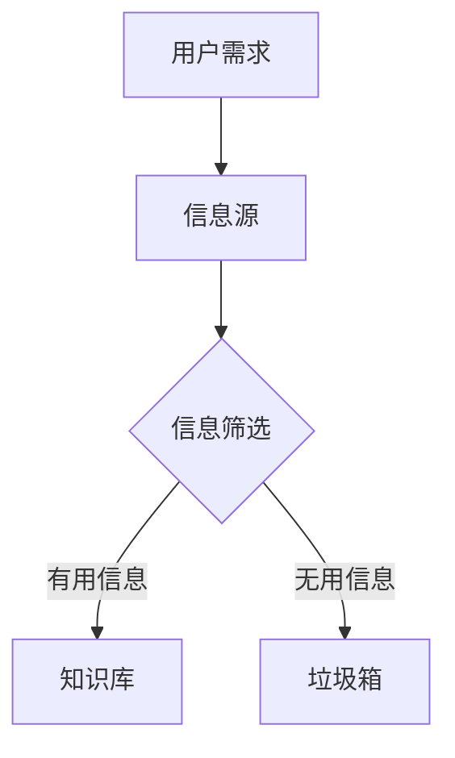
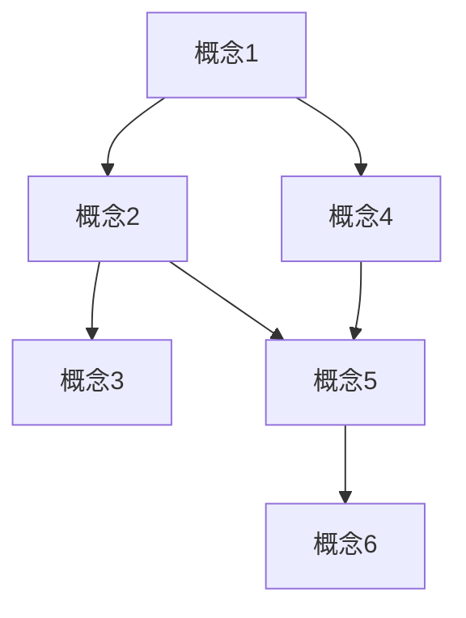
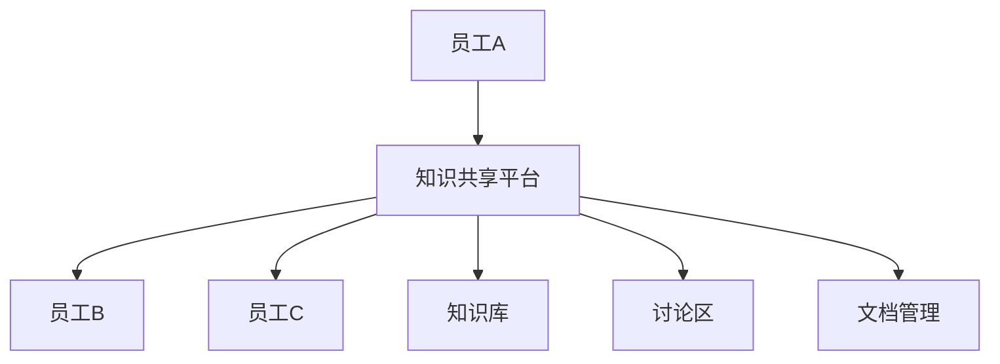
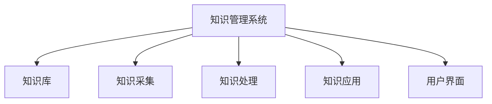

                 

# 知识的碎片化与整合：发现引擎的挑战与机遇

> 关键词：知识碎片化、知识整合、发现引擎、挑战、机遇

> 摘要：本文探讨了知识碎片化与整合的现象，分析了碎片化知识的特点及其影响，阐述了知识整合的挑战与机遇。通过案例研究和实践，探讨了知识整合的方法和未来趋势，特别关注了知识整合与发现引擎的结合，为个人和社会发展提供了新的思路。

#### 引言

在信息技术飞速发展的今天，知识的产生和传播速度不断加快，知识碎片化现象愈发显著。碎片化知识使得信息的获取变得更加容易，但也带来了诸多挑战。一方面，信息过载和学习障碍使得个体难以有效地获取和整合知识；另一方面，创新难度增加，知识的深度和广度受到影响。因此，如何应对知识碎片化的挑战，实现知识的整合，成为当前亟需解决的问题。

知识整合不仅是知识管理的重要环节，也是发现新知识、推动创新的重要途径。本文将从知识碎片化与整合的角度，分析其现状与挑战，探讨知识整合的策略与方法，并探讨知识整合与发现引擎的结合，为个人和社会的发展提供新的视角。

#### 第一部分：碎片化时代的知识探索

##### 第1章：碎片化世界的知识现状

**1.1 碎片化知识的特点**

在碎片化时代，知识呈现出以下几个显著特点：

1. **高度分散**：知识不再集中存在于特定的书籍、期刊或数据库中，而是分散在各种渠道和平台上，如社交媒体、博客、论坛等。

2. **动态更新**：知识更新速度加快，信息生命周期缩短，新知识不断涌现，旧知识迅速被淘汰。

3. **跨领域融合**：知识交叉融合，不同领域的知识相互渗透，形成新的知识体系。

4. **去中心化**：知识传播渠道去中心化，个体成为知识传播的重要力量。

**1.2 碎片化知识的影响**

碎片化知识对个人、社会和企业产生了深远的影响：

1. **学习方式变革**：个体需要具备更强的自主学习能力，快速筛选和整合碎片化知识。

2. **创新难度增加**：创新需要跨领域的知识整合，但碎片化知识使得知识深度和广度受限，增加了创新难度。

3. **知识管理挑战**：企业需要建立有效的知识管理体系，应对知识碎片化带来的挑战。

**1.3 碎片化知识的需求**

在碎片化知识环境下，人们对知识的需求发生了变化：

1. **定制化**：个体需要定制化的知识服务，满足个性化学习需求。

2. **深度化**：虽然知识碎片化，但人们对深度知识的需求依然强烈，希望通过碎片化知识的学习，达到深度理解。

3. **系统化**：个体需要将碎片化知识进行整合，形成系统的知识体系。

**1.4 碎片化知识的表现形式**

碎片化知识的表现形式多样化，包括：

1. **短平快内容**：如短视频、微文章等，以快速获取信息为主。

2. **深度解读**：针对某一知识点进行深入分析和解读，提供深度知识。

3. **跨界整合**：将不同领域的知识进行整合，形成新的知识体系。

##### 第2章：知识碎片化的挑战

**2.1 知识碎片化的挑战来源**

知识碎片化带来了诸多挑战，主要来源包括：

1. **信息过载**：信息爆炸导致个体难以筛选和处理海量信息，容易陷入信息焦虑。

2. **学习障碍**：碎片化知识的学习难度增加，个体需要更高的自主学习能力和批判性思维。

3. **创新难度增加**：创新需要跨领域的知识整合，但碎片化知识使得知识深度和广度受限，增加了创新难度。

**2.2 应对策略**

为了应对知识碎片化带来的挑战，可以从以下几个方面进行：

1. **技术手段**：利用大数据、人工智能等技术，实现知识智能筛选和推荐。

2. **教育改革**：推动教育体制改革，培养学生的自主学习能力和批判性思维。

3. **企业实践**：企业建立有效的知识管理体系，促进知识的共享和整合。

**2.2.1 技术手段**

1. **信息过滤与筛选**：利用算法和人工相结合的方式，对海量信息进行过滤和筛选，提供个性化的知识服务。

2. **知识图谱**：构建知识图谱，将碎片化知识进行关联和整合，实现知识的可视化。

3. **智能推荐**：基于用户行为和兴趣，实现个性化的知识推荐。

**2.2.2 教育改革**

1. **自主学习**：培养学生的自主学习能力，鼓励他们主动探索和发现知识。

2. **跨学科教育**：打破学科界限，实现跨学科的知识整合，培养学生的综合素质。

3. **批判性思维**：培养批判性思维，使学生具备分析和判断知识的能力。

**2.2.3 企业实践**

1. **知识共享**：建立知识共享平台，促进企业内部知识的流动和整合。

2. **知识管理**：建立完善的知识管理体系，确保知识的有效管理和利用。

3. **培训与学习**：提供持续的培训和学习机会，提升员工的知识水平和创新能力。

#### 第二部分：知识整合的策略与方法

##### 第3章：知识整合的基本概念

**3.1 知识整合的定义**

知识整合是指通过收集、整理、分析和利用各种信息资源，将分散的、碎片化的知识进行关联和整合，形成具有系统性和完整性的知识体系。

**3.2 知识整合的重要性**

知识整合在个人、企业和社会层面具有重要意义：

1. **提高知识利用率**：通过知识整合，可以有效地提高知识的利用率，避免资源的浪费。

2. **促进知识创新**：知识整合为创新提供了丰富的素材和灵感，有助于推动知识创新。

3. **提升决策能力**：知识整合有助于提高个体的决策能力，为科学决策提供依据。

**3.3 知识整合的类型**

知识整合可分为以下几种类型：

1. **水平整合**：在同一领域内，将不同来源的知识进行整合。

2. **垂直整合**：在不同领域之间，将相关联的知识进行整合。

3. **跨领域整合**：将不同领域之间的知识进行跨界整合，形成新的知识体系。

##### 第4章：知识整合的方法

**4.1 知识整合技术**

知识整合技术的核心在于对信息的收集、处理和利用。以下是几种常用的知识整合技术：

1. **信息检索技术**：通过搜索引擎、数据库等技术，实现信息的快速检索和获取。

2. **数据库管理技术**：建立高效的数据库管理系统，实现对海量数据的存储、管理和查询。

3. **知识图谱技术**：利用知识图谱，将碎片化知识进行关联和整合，实现知识的可视化。

**4.2 知识整合流程**

知识整合流程包括以下步骤：

1. **数据收集**：收集相关领域的各类信息，包括文献、报告、数据等。

2. **数据清洗**：对收集到的数据进行清洗、去重和处理，确保数据的准确性和一致性。

3. **数据分析**：利用统计、建模等方法，对数据进行分析，提取有价值的信息。

4. **知识构建**：将分析得到的信息进行整合，形成具有系统性和完整性的知识体系。

**4.3 知识整合工具**

知识整合工具主要包括以下几种：

1. **知识管理软件**：如Confluence、SharePoint等，用于知识存储、共享和协作。

2. **信息检索系统**：如Elasticsearch、Solr等，用于信息的快速检索和获取。

3. **知识图谱工具**：如Neo4j、D3.js等，用于知识图谱的构建和可视化。

##### 第5章：知识整合在实践中的应用

**5.1 企业案例研究**

**5.1.1 某企业知识整合实践**

某大型企业通过以下措施，实现了知识整合：

1. **建立知识共享平台**：企业内部建立知识共享平台，鼓励员工共享知识，提升知识利用率。

2. **实施知识管理系统**：引入知识管理系统，对知识进行分类、标注和存储，实现知识的系统化整合。

3. **开展知识培训**：定期组织知识培训，提升员工的知识水平和创新能力。

**5.1.2 某企业知识管理实践**

某企业通过以下措施，实现了知识管理：

1. **知识地图**：构建知识地图，明确知识的来源、内容和关联，方便员工快速获取所需知识。

2. **知识库建设**：建立知识库，收集和整理各类知识，实现知识的集中存储和管理。

3. **知识共享机制**：建立知识共享机制，激励员工积极分享知识，提升整体知识水平。

**5.2 政府部门案例研究**

**5.2.1 某政府部门知识整合实践**

某政府部门通过以下措施，实现了知识整合：

1. **政务信息共享平台**：建立政务信息共享平台，实现各部门间的信息互联互通，提升政务效率。

2. **知识管理系统**：引入知识管理系统，对政务信息进行分类、标注和存储，实现知识的系统化整合。

3. **知识培训与传播**：定期组织知识培训，提升公务员的知识水平和业务能力。

**5.2.2 某政府部门知识管理实践**

某政府部门通过以下措施，实现了知识管理：

1. **知识地图**：构建知识地图，明确政务知识的内容、关联和重要性，方便公务员快速获取所需知识。

2. **知识库建设**：建立政务知识库，收集和整理各类政务知识，实现知识的集中存储和管理。

3. **知识共享机制**：建立知识共享机制，鼓励公务员积极分享知识，提升整体知识水平。

#### 第三部分：知识整合的未来趋势

##### 第6章：知识整合的未来挑战

**6.1 新技术的影响**

随着新技术的不断发展，知识整合面临着新的挑战：

1. **人工智能**：人工智能技术的应用，使得知识获取和整合变得更加智能，但同时也增加了知识管理的复杂性。

2. **大数据**：大数据技术的应用，使得海量数据的处理和整合成为可能，但同时也带来了数据安全和隐私保护等问题。

3. **区块链**：区块链技术的应用，为知识整合提供了去中心化的解决方案，但同时也需要解决数据共享和隐私保护等问题。

**6.2 知识整合的发展方向**

知识整合的未来发展方向包括：

1. **智能化**：利用人工智能、大数据等技术，实现知识的智能获取、整合和分析。

2. **协同化**：通过建立协同平台，实现知识共享和协同创新。

3. **生态化**：构建知识生态系统，实现知识资源的高效利用。

##### 第7章：知识整合与发现引擎

**7.1 发现引擎的定义**

发现引擎是指通过智能算法和数据分析，从海量数据中挖掘潜在价值，提供个性化推荐和洞察的智能系统。

**7.2 发现引擎的工作原理**

发现引擎的工作原理主要包括以下几个方面：

1. **数据采集**：从各种渠道收集数据，包括公开数据、企业数据、用户数据等。

2. **数据处理**：对采集到的数据进行清洗、去重、转换等处理，确保数据的质量和一致性。

3. **特征提取**：对处理后的数据进行特征提取，将数据转化为可用于分析的模型。

4. **模型训练**：利用机器学习和深度学习算法，对特征进行建模和训练，构建预测模型。

5. **结果输出**：根据模型的预测结果，为用户提供个性化推荐和洞察。

**7.3 发现引擎的应用场景**

发现引擎在多个领域具有广泛的应用场景：

1. **推荐系统**：基于用户行为和兴趣，为用户推荐个性化的商品、内容和服务。

2. **风险控制**：通过数据分析，识别潜在的风险，为金融机构提供风险预警。

3. **市场洞察**：通过数据分析，挖掘市场趋势和用户需求，为企业和政府提供决策支持。

##### 第8章：知识整合与未来展望

**8.1 知识整合对个人发展的影响**

知识整合对个人发展具有重要影响：

1. **提升知识水平**：通过知识整合，个人可以更系统地学习和掌握知识，提升自身综合素质。

2. **增强创新能力**：知识整合有助于激发创新思维，为个人提供更多的创新机会。

3. **提升职业竞争力**：具备知识整合能力的人才，在职场中更具竞争力，更容易获得职业发展机会。

**8.2 知识整合对社会的影响**

知识整合对社会发展具有重要推动作用：

1. **促进知识传播**：知识整合有助于加快知识的传播速度，提高社会的知识水平。

2. **推动科技创新**：知识整合为科技创新提供了丰富的素材和灵感，有助于推动科技进步。

3. **优化社会治理**：知识整合有助于政府和社会组织更好地掌握社会动态，优化社会治理。

**8.3 知识整合的未来发展趋势**

知识整合的未来发展趋势包括：

1. **智能化**：随着人工智能技术的发展，知识整合将变得更加智能，提供更精准的知识服务。

2. **生态化**：知识整合将构建更加完善的知识生态系统，实现知识资源的高效利用。

3. **协同化**：知识整合将推动各领域之间的协同创新，实现知识共享和协同发展。

#### 附录

**附录A：知识整合工具与资源**

**A.1 知识管理工具对比**

以下是几种常见的知识管理工具的对比：

| 工具名称 | 优点 | 缺点 |
| :--- | :--- | :--- |
| Confluence | 适合团队协作，功能丰富 | 价格较高，学习成本较大 |
| SharePoint | 集成度高，适合企业内部使用 | 功能较为复杂，上手难度大 |
| Notion | 界面简洁，功能强大 | 生态较为单一，扩展性有限 |

**A.2 知识图谱工具介绍**

以下是几种常见的知识图谱工具的介绍：

| 工具名称 | 优点 | 缺点 |
| :--- | :--- | :--- |
| Neo4j | 速度快，易于扩展 | 功能较为单一，适用于复杂图 |
| D3.js | 可视化效果优秀，灵活度高 | 需要一定的前端开发技能 |
| OpenKG | 开源免费，功能全面 | 需要一定的数据处理和建模能力 |

**A.3 知识整合案例集锦**

以下是几个典型的知识整合案例：

1. **企业知识管理**：某大型企业通过建立知识共享平台和知识管理系统，实现了企业内部知识的系统化和高效利用。

2. **政府政务信息整合**：某政府部门通过建立政务信息共享平台和知识图谱，实现了政务信息的高效管理和共享。

3. **学术知识整合**：某学术机构通过建立学术知识库和知识地图，实现了学术资源的系统化和高效利用。

#### 结语

知识碎片化与整合是当前信息技术发展的一个重要趋势。通过知识整合，我们可以更好地应对碎片化知识带来的挑战，实现知识的系统化和深度化。知识整合不仅对个人发展具有重要影响，也对社会发展产生深远影响。在未来，随着新技术的不断涌现，知识整合将朝着智能化、生态化和协同化的方向发展。让我们携手努力，共同探索知识整合的无限可能，为个人和社会的发展贡献智慧。作者：AI天才研究院/AI Genius Institute & 禅与计算机程序设计艺术/Zen And The Art of Computer Programming### 知识碎片化的挑战

在知识爆炸和信息技术迅速发展的时代，知识的碎片化现象愈发显著。碎片化知识虽然为我们提供了丰富的信息资源，但同时也带来了诸多挑战。本节将深入探讨知识碎片化所带来的挑战，分析其来源和应对策略。

#### 2.1 知识碎片化的挑战来源

1. **信息过载**

随着互联网和移动设备的普及，信息传播的速度和范围大大增加。然而，这也导致了信息过载的问题。每天，我们都被大量的信息包围，如社交媒体的更新、电子邮件的堆积、新闻的滚动等。这种过载现象使得个体难以筛选和处理海量信息，容易陷入信息焦虑和决策疲劳。

2. **学习障碍**

知识碎片化使得知识的学习变得更加分散和复杂。个体需要从多个渠道获取知识，但这些知识的质量和可信度参差不齐。此外，碎片化知识的学习缺乏系统性和连贯性，使得个体难以形成完整的知识体系，从而增加了学习的难度。

3. **创新难度增加**

创新需要深入理解跨领域的知识，并进行有效的整合。然而，知识碎片化使得知识的深度和广度受限，个体难以掌握全面的知识。这种情况下，创新变得更加困难，因为缺乏足够的素材和灵感。

#### 2.2 应对策略

1. **技术手段**

利用先进的信息技术，可以有效地应对知识碎片化带来的挑战。以下是一些具体的技术手段：

   - **信息过滤与筛选**：通过算法和人工相结合的方式，对海量信息进行过滤和筛选，提供个性化的知识服务。例如，基于用户的兴趣和行为，推荐相关的知识内容。

   - **知识图谱**：构建知识图谱，将碎片化知识进行关联和整合，实现知识的可视化。知识图谱可以帮助个体更好地理解知识的结构，从而更容易地进行知识整合。

   - **智能推荐**：基于用户的行为和兴趣，实现个性化的知识推荐。智能推荐系统能够根据用户的历史行为，预测用户可能感兴趣的知识内容，从而帮助用户更有效地获取所需信息。

2. **教育改革**

教育改革是应对知识碎片化挑战的重要途径。以下是一些具体的教育改革措施：

   - **自主学习**：培养学生的自主学习能力，鼓励他们主动探索和发现知识。自主学习不仅有助于个体适应碎片化知识环境，还可以提高个体的学习效率和知识整合能力。

   - **跨学科教育**：打破学科界限，实现跨学科的知识整合。跨学科教育可以帮助学生更好地理解不同领域的知识，从而更容易地进行知识整合。

   - **批判性思维**：培养批判性思维，使学生具备分析和判断知识的能力。批判性思维可以帮助学生更好地筛选和处理碎片化知识，避免陷入信息的迷雾。

3. **企业实践**

企业在应对知识碎片化挑战方面也扮演着重要角色。以下是一些具体的企业实践：

   - **知识共享平台**：建立知识共享平台，促进企业内部知识的流动和整合。知识共享平台可以帮助企业员工快速获取所需的知识，提高工作效率。

   - **知识管理系统**：建立完善的知识管理系统，确保知识的有效管理和利用。知识管理系统可以帮助企业实现知识的系统化和结构化，从而更好地应对知识碎片化带来的挑战。

   - **培训与学习**：提供持续的培训和学习机会，提升员工的知识水平和创新能力。通过培训和学习，员工可以不断更新和扩展自己的知识体系，从而更好地适应碎片化知识环境。

#### 2.2.1 技术手段

1. **信息过滤与筛选**

信息过滤与筛选是应对知识碎片化挑战的重要技术手段。以下是一个简化的信息过滤与筛选过程：



在这个流程中，用户的需求作为输入，通过信息筛选器对信息源进行筛选，将有用的信息存储在知识库中，无用的信息则被丢弃在垃圾箱中。

2. **知识图谱**

知识图谱是将碎片化知识进行关联和整合的有效工具。以下是一个简单的知识图谱表示：



在这个知识图谱中，各个概念通过边进行关联，形成一个复杂的知识网络。通过这样的知识图谱，用户可以更直观地理解知识的结构和关联，从而更容易地进行知识整合。

3. **智能推荐**

智能推荐是利用机器学习和深度学习技术，根据用户的行为和兴趣，为用户推荐相关的知识内容。以下是一个简化的智能推荐过程：

```mermaid
graph TD
    A[用户行为数据] --> B[特征提取]
    B --> C[推荐算法]
    C --> D[推荐结果]
    D --> E[用户反馈]
    E --> B|学习调整|
```

在这个流程中，用户的浏览、搜索、点赞等行为数据作为输入，通过特征提取和推荐算法，生成推荐结果。用户对推荐结果的反馈将用于调整推荐算法，从而提高推荐的准确性。

#### 2.2.2 教育改革

1. **自主学习**

自主学习是培养个体适应碎片化知识环境的关键。以下是一些促进自主学习的策略：

   - **项目式学习**：通过实际项目，让学生在解决实际问题的过程中，主动探索和获取知识。

   - **探究式学习**：鼓励学生提出问题，并通过自主调查和实验，寻找答案。

   - **混合式学习**：结合线上和线下学习，提供灵活的学习环境和资源。

2. **跨学科教育**

跨学科教育有助于学生从不同角度理解知识，从而更容易地进行知识整合。以下是一些跨学科教育的实践：

   - **综合课程**：将不同学科的知识融合在一起，形成一个综合的课程体系。

   - **跨学科团队**：组建跨学科的教学团队，共同设计课程和教学活动。

   - **跨学科项目**：鼓励学生参与跨学科的项目，通过项目实践，跨学科整合知识。

3. **批判性思维**

批判性思维是分析和判断知识的重要能力。以下是一些培养批判性思维的策略：

   - **问题导向**：鼓励学生从问题出发，思考问题的本质和解决方案。

   - **证据分析**：要求学生分析信息和证据的可靠性，避免盲目接受。

   - **逻辑推理**：训练学生的逻辑思维能力，通过逻辑推理来分析和解决问题。

#### 2.2.3 企业实践

1. **知识共享平台**

知识共享平台是企业实现知识整合的重要工具。以下是一个简化的知识共享平台架构：



在这个架构中，员工通过知识共享平台，可以上传、搜索和共享知识，参与讨论和协作，从而实现知识的流动和整合。

2. **知识管理系统**

知识管理系统是企业实现知识整合的关键。以下是一个简化的知识管理系统架构：



在这个架构中，知识管理系统负责知识的采集、处理和应用，为用户提供便捷的知识获取和利用途径。

3. **培训与学习**

培训与学习是企业提升员工知识水平和创新能力的重要手段。以下是一些具体的培训和学习措施：

   - **内部培训**：定期举办内部培训，提升员工的专业知识和技能。

   - **外部学习**：鼓励员工参加行业会议、研讨会等，拓展视野，学习最新的知识和技术。

   - **在线学习**：提供在线学习平台，员工可以随时随地学习新知识。

通过以上技术手段、教育改革和企业实践，我们可以更好地应对知识碎片化带来的挑战，实现知识的整合和创新。这不仅有助于个人和社会的发展，也为未来知识管理提供了新的思路和方向。

#### 第三部分：知识整合的基本概念

##### 3.1 知识整合的定义

知识整合是指通过收集、整理、分析和利用各种信息资源，将分散的、碎片化的知识进行关联和整合，形成具有系统性和完整性的知识体系。知识整合的目的是提高知识的利用率和价值，促进知识的传播和共享，为个人和社会的发展提供有力的支持。

##### 3.2 知识整合的重要性

知识整合在个人、企业和社会层面都具有重要的意义：

1. **提高知识利用率**：知识整合有助于将分散的、碎片化的知识进行系统化和结构化，提高知识的利用率和价值。通过知识整合，个体可以更高效地获取和利用知识，从而提升自身的能力和竞争力。

2. **促进知识创新**：知识整合为创新提供了丰富的素材和灵感。通过知识整合，个体可以跨领域、跨学科地获取和整合知识，从而激发新的思考和创新点。知识整合有助于推动知识的深度发展和创新。

3. **提升决策能力**：知识整合有助于提高个体的决策能力。通过整合不同来源、不同类型的信息，个体可以更全面、准确地了解问题的本质和趋势，从而做出更科学的决策。

##### 3.3 知识整合的类型

知识整合可以分为以下几种类型：

1. **水平整合**：水平整合是在同一领域内，将不同来源的知识进行整合。例如，在某一学术领域，将不同学者、不同研究机构的研究成果进行整合，形成系统的知识体系。

2. **垂直整合**：垂直整合是在不同领域之间，将相关联的知识进行整合。例如，将自然科学、社会科学和人文科学等领域的知识进行整合，形成跨学科的知识体系。

3. **跨领域整合**：跨领域整合是超越单一领域，将不同领域之间的知识进行跨界整合。例如，将计算机科学、生物学和物理学等领域的知识进行整合，形成新的知识体系和应用场景。

#### 第四部分：知识整合的方法

##### 4.1 知识整合技术

知识整合技术是知识整合过程中不可或缺的工具。以下是一些常用的知识整合技术：

1. **信息检索技术**：信息检索技术用于从海量信息中快速找到所需的信息。常用的信息检索技术包括关键词检索、全文检索和智能检索等。信息检索技术可以帮助个体快速获取所需的知识，是知识整合的基础。

2. **数据库管理技术**：数据库管理技术用于存储、管理和查询大规模数据。通过数据库管理技术，个体可以方便地管理和利用知识库中的信息，实现知识的系统化和结构化。

3. **知识图谱技术**：知识图谱技术用于将碎片化知识进行关联和整合，形成具有层次结构的知识体系。知识图谱技术可以帮助个体更好地理解知识的结构，从而更容易地进行知识整合。

##### 4.2 知识整合流程

知识整合流程通常包括以下步骤：

1. **数据收集**：数据收集是知识整合的第一步。个体需要从各种渠道收集相关领域的知识资源，包括文献、报告、数据等。数据收集的过程需要确保数据的全面性和准确性。

2. **数据清洗**：数据清洗是对收集到的数据进行处理，去除重复、错误和不完整的数据。数据清洗的过程需要确保数据的一致性和质量，为后续的数据分析打下良好的基础。

3. **数据分析**：数据分析是对清洗后的数据进行处理和分析，提取有价值的信息。数据分析的方法包括统计、建模、挖掘等。通过数据分析，个体可以深入了解知识的结构和关联，从而更好地进行知识整合。

4. **知识构建**：知识构建是将分析得到的信息进行整合，形成具有系统性和完整性的知识体系。知识构建的过程中，个体需要运用知识整合技术，将碎片化知识进行关联和整合，构建出具有层次结构和逻辑关系的知识体系。

##### 4.3 知识整合工具

知识整合工具是知识整合过程中使用的软件和平台。以下是一些常用的知识整合工具：

1. **知识管理软件**：知识管理软件用于存储、管理和共享知识。常见的知识管理软件包括Confluence、SharePoint和Notion等。

2. **信息检索系统**：信息检索系统用于快速检索和获取知识。常见的信息检索系统包括Elasticsearch、Solr和Google Search等。

3. **知识图谱工具**：知识图谱工具用于构建和可视化知识图谱。常见的知识图谱工具包括Neo4j、D3.js和OpenKG等。

#### 第五部分：知识整合在实践中的应用

##### 5.1 企业案例研究

**5.1.1 某企业知识整合实践**

某大型企业通过以下措施，实现了知识整合：

1. **建立知识共享平台**：企业内部建立知识共享平台，鼓励员工共享知识，提升知识利用率。知识共享平台提供了便捷的知识存储、检索和共享功能，员工可以在平台上发布自己的知识成果，也可以查看和借鉴其他员工的成果。

2. **实施知识管理系统**：引入知识管理系统，对知识进行分类、标注和存储，实现知识的系统化整合。知识管理系统不仅提供了知识存储和检索的功能，还提供了知识分享和协作的工具，促进了知识的流动和整合。

3. **开展知识培训**：定期组织知识培训，提升员工的知识水平和创新能力。知识培训涵盖了企业知识管理的基本理念、方法和工具，使员工更好地理解和应用知识管理系统，提高知识整合的效果。

**5.1.2 某企业知识管理实践**

某企业通过以下措施，实现了知识管理：

1. **知识地图**：构建知识地图，明确企业内部知识的结构、内容和关联。知识地图帮助企业员工快速定位所需的知识，促进知识的流动和整合。

2. **知识库建设**：建立知识库，收集和整理各类知识，实现知识的集中存储和管理。知识库不仅包含了企业的内部知识，还包括了外部知识资源，如行业报告、学术论文等，为企业提供了丰富的知识资源。

3. **知识共享机制**：建立知识共享机制，激励员工积极分享知识，提升整体知识水平。企业通过奖励制度，鼓励员工撰写知识文档、分享实践经验，形成了良好的知识共享氛围。

##### 5.2 政府部门案例研究

**5.2.1 某政府部门知识整合实践**

某政府部门通过以下措施，实现了知识整合：

1. **政务信息共享平台**：建立政务信息共享平台，实现各部门间的信息互联互通，提升政务效率。政务信息共享平台提供了便捷的信息检索和共享功能，使政府部门能够快速获取和处理各类政务信息。

2. **知识管理系统**：引入知识管理系统，对政务信息进行分类、标注和存储，实现知识的系统化整合。知识管理系统不仅提供了信息存储和检索的功能，还提供了信息分享和协作的工具，促进了政务信息的流动和整合。

3. **知识培训与传播**：定期组织知识培训，提升公务员的知识水平和业务能力。知识培训涵盖了政务知识管理的基本理念、方法和工具，使公务员更好地理解和应用知识管理系统，提高知识整合的效果。

**5.2.2 某政府部门知识管理实践**

某政府部门通过以下措施，实现了知识管理：

1. **知识地图**：构建知识地图，明确政府部门内部知识的结构、内容和关联。知识地图帮助公务员快速定位所需的知识，促进政务知识的流动和整合。

2. **知识库建设**：建立知识库，收集和整理各类政务知识，实现知识的集中存储和管理。知识库不仅包含了政府部门内部的政务知识，还包括了外部知识资源，如法律法规、政策文件等，为公务员提供了丰富的知识资源。

3. **知识共享机制**：建立知识共享机制，鼓励公务员积极分享知识，提升整体知识水平。政府部门通过奖励制度，鼓励公务员撰写知识文档、分享实践经验，形成了良好的知识共享氛围。

#### 第六部分：知识整合的未来挑战与发展方向

##### 6.1 知识整合的未来挑战

随着新技术的不断涌现，知识整合面临着一系列新的挑战：

1. **人工智能的影响**：人工智能技术的发展，使得知识获取和整合变得更加智能，但同时也增加了知识管理的复杂性。如何有效地利用人工智能技术，实现知识的智能化整合，是知识整合未来需要解决的重要问题。

2. **大数据的挑战**：大数据技术的应用，使得海量数据的处理和整合成为可能，但同时也带来了数据安全和隐私保护等问题。如何在保证数据安全和隐私的前提下，实现大数据的有效整合，是知识整合未来需要面对的挑战。

3. **区块链的冲击**：区块链技术的应用，为知识整合提供了去中心化的解决方案，但同时也需要解决数据共享和隐私保护等问题。如何在保障数据安全和隐私的前提下，实现区块链技术在知识整合中的应用，是知识整合未来需要探索的方向。

##### 6.2 知识整合的发展方向

知识整合的未来发展趋势包括：

1. **智能化**：随着人工智能技术的发展，知识整合将变得更加智能。未来的知识整合将利用人工智能技术，实现知识的自动化获取、整理和推荐，提高知识整合的效率和准确性。

2. **生态化**：知识整合将构建更加完善的知识生态系统，实现知识资源的高效利用。未来的知识整合将不仅仅是企业或政府内部的知识整合，而是涉及到多个领域、多个主体的跨界整合，形成更加开放和互联的知识生态系统。

3. **协同化**：知识整合将推动各领域之间的协同创新。未来的知识整合将促进各领域之间的知识流动和共享，推动跨领域的协同创新，为解决复杂的社会问题提供新的思路和解决方案。

#### 第七部分：知识整合与发现引擎

##### 7.1 发现引擎的定义

发现引擎是一种利用机器学习和数据分析技术，从海量数据中挖掘潜在价值，提供个性化推荐和洞察的智能系统。发现引擎的核心在于通过数据分析和算法建模，从海量数据中发现隐藏的模式和关联，为用户提供有价值的洞察和推荐。

##### 7.2 发现引擎的工作原理

发现引擎的工作原理主要包括以下几个步骤：

1. **数据采集**：从各种渠道收集数据，包括内部数据、外部数据等。这些数据可以是结构化的，也可以是非结构化的。

2. **数据处理**：对采集到的数据进行清洗、去重、转换等处理，确保数据的质量和一致性。

3. **特征提取**：对处理后的数据进行特征提取，将数据转化为可用于分析的模型。特征提取是发现引擎的核心步骤，通过提取数据中的关键特征，可以更好地进行后续的分析和建模。

4. **模型训练**：利用机器学习和深度学习算法，对特征进行建模和训练，构建预测模型。模型训练的过程需要大量的数据和计算资源，通过训练，模型可以学会从数据中发现潜在的关联和模式。

5. **结果输出**：根据模型的预测结果，为用户提供个性化推荐和洞察。结果输出的形式可以是推荐列表、可视化报表、决策支持等。

##### 7.3 发现引擎的应用场景

发现引擎在多个领域具有广泛的应用场景：

1. **推荐系统**：在电子商务、社交媒体、在线视频等领域，发现引擎可以基于用户的行为和兴趣，为用户推荐个性化的商品、内容和服务。

2. **风险控制**：在金融、保险、证券等领域，发现引擎可以分析大量的交易数据和行为数据，识别潜在的风险，为金融机构提供风险预警。

3. **市场洞察**：在市场营销、行业研究等领域，发现引擎可以分析市场趋势和用户需求，为企业和政府提供决策支持。

4. **医疗健康**：在医疗健康领域，发现引擎可以分析患者的病历数据、基因数据等，为医生提供诊断和治疗建议。

5. **教育领域**：在教育领域，发现引擎可以分析学生的学习行为和成绩数据，为学生提供个性化的学习建议和资源。

#### 8.1 知识整合对个人发展的影响

知识整合对个人发展具有重要影响：

1. **提升知识水平**：通过知识整合，个人可以更系统地学习和掌握知识，提升自身的综合素质。知识整合帮助个人构建完整的知识体系，从而更好地理解和应用知识。

2. **增强创新能力**：知识整合为个人提供了丰富的知识素材和灵感，有助于增强创新能力。通过知识整合，个人可以跨领域、跨学科地获取和整合知识，从而激发新的思考和创新点。

3. **提升职业竞争力**：具备知识整合能力的个人在职场中更具竞争力。知识整合能力使个人能够快速获取和利用知识，提高工作效率和解决问题的能力，从而在职场中脱颖而出。

#### 8.2 知识整合对社会的影响

知识整合对社会发展具有深远影响：

1. **促进知识传播**：知识整合有助于加快知识的传播速度，提高社会的知识水平。通过知识整合，知识可以更高效地传播和共享，从而提升整个社会的知识水平。

2. **推动科技创新**：知识整合为科技创新提供了丰富的素材和灵感，有助于推动科技进步。知识整合促进了知识的深度发展和跨领域的融合，为科技创新提供了新的思路和方向。

3. **优化社会治理**：知识整合有助于政府和社会组织更好地掌握社会动态，优化社会治理。通过知识整合，政府可以更准确地了解社会问题和需求，从而制定更科学、更有效的政策措施。

#### 8.3 知识整合的未来发展趋势

知识整合的未来发展趋势包括：

1. **智能化**：随着人工智能技术的发展，知识整合将变得更加智能。未来的知识整合将利用人工智能技术，实现知识的自动化获取、整理和推荐，提高知识整合的效率和准确性。

2. **生态化**：知识整合将构建更加完善的知识生态系统，实现知识资源的高效利用。未来的知识整合将不仅仅是企业或政府内部的知识整合，而是涉及到多个领域、多个主体的跨界整合，形成更加开放和互联的知识生态系统。

3. **协同化**：知识整合将推动各领域之间的协同创新。未来的知识整合将促进各领域之间的知识流动和共享，推动跨领域的协同创新，为解决复杂的社会问题提供新的思路和解决方案。

### 附录

**附录A：知识整合工具与资源**

**A.1 知识管理工具对比**

以下是几种常见的知识管理工具的对比：

| 工具名称 | 优点 | 缺点 |
| :--- | :--- | :--- |
| Confluence | 适合团队协作，功能丰富 | 价格较高，学习成本较大 |
| SharePoint | 集成度高，适合企业内部使用 | 功能较为复杂，上手难度大 |
| Notion | 界面简洁，功能强大 | 生态较为单一，扩展性有限 |

**A.2 知识图谱工具介绍**

以下是几种常见的知识图谱工具的介绍：

| 工具名称 | 优点 | 缺点 |
| :--- | :--- | :--- |
| Neo4j | 速度快，易于扩展 | 功能较为单一，适用于复杂图 |
| D3.js | 可视化效果优秀，灵活度高 | 需要一定的前端开发技能 |
| OpenKG | 开源免费，功能全面 | 需要一定的数据处理和建模能力 |

**A.3 知识整合案例集锦**

以下是几个典型的知识整合案例：

1. **企业知识管理**：某大型企业通过建立知识共享平台和知识管理系统，实现了企业内部知识的系统化和高效利用。

2. **政府政务信息整合**：某政府部门通过建立政务信息共享平台和知识图谱，实现了政务信息的高效管理和共享。

3. **学术知识整合**：某学术机构通过建立学术知识库和知识地图，实现了学术资源的系统化和高效利用。

### 结语

知识碎片化与整合是当前信息技术发展的一个重要趋势。通过知识整合，我们可以更好地应对碎片化知识带来的挑战，实现知识的系统化和深度化。知识整合不仅对个人发展具有重要影响，也对社会发展产生深远影响。在未来，随着新技术的不断涌现，知识整合将朝着智能化、生态化和协同化的方向发展。让我们携手努力，共同探索知识整合的无限可能，为个人和社会的发展贡献智慧。

### 附录A：知识整合工具与资源

**A.1 知识管理工具对比**

在知识整合的过程中，选择合适的工具至关重要。以下是一些常见的知识管理工具，以及它们的特点和适用场景。

#### Confluence

**优点**：
- **团队协作**：Confluence 提供了强大的协作功能，支持多人实时编辑和评论。
- **丰富的功能**：包括文档管理、任务跟踪、日历、表格等。

**缺点**：
- **价格较高**：对于小型团队或个人用户，订阅费用可能较高。
- **学习成本大**：功能丰富导致学习曲线较陡。

**适用场景**：适合大中型团队的知识管理和文档协作。

#### SharePoint

**优点**：
- **集成度较高**：与Microsoft Office suite 和 Azure 等产品深度集成。
- **适合企业内部使用**：支持企业级权限管理和安全性。

**缺点**：
- **功能复杂**：对于初学者可能较为复杂，上手难度大。

**适用场景**：适合企业内部的知识管理和协作平台。

#### Notion

**优点**：
- **界面简洁**：直观的界面设计，易于上手。
- **功能强大**：支持多种数据类型（如表格、数据库、看板）的集成。

**缺点**：
- **生态较为单一**：虽然功能强大，但扩展性有限。

**适用场景**：适合个人和小型团队的知识管理和项目管理。

**A.2 知识图谱工具介绍**

知识图谱工具用于构建和可视化知识体系，以下是一些常用的知识图谱工具。

#### Neo4j

**优点**：
- **速度快**：基于图数据库，适用于处理复杂的关系查询。
- **易于扩展**：支持自定义图算法和插件。

**缺点**：
- **功能较为单一**：主要适用于构建和查询图数据。

**适用场景**：适合需要处理复杂关系的数据分析和知识图谱构建。

#### D3.js

**优点**：
- **可视化效果优秀**：强大的前端可视化库，可以创建丰富的交互式图表。
- **灵活度高**：可以通过JavaScript自定义图表和行为。

**缺点**：
- **需要前端开发技能**：对使用者的前端开发能力有一定要求。

**适用场景**：适合需要高自定义和交互性的知识图谱可视化。

#### OpenKG

**优点**：
- **开源免费**：无需支付费用，可以自由使用和修改。
- **功能全面**：支持知识图谱的构建、存储、查询和分析。

**缺点**：
- **需要一定的数据处理和建模能力**：对于初学者来说，可能较为复杂。

**适用场景**：适合学术研究和开源项目中的知识图谱构建。

**A.3 知识整合案例集锦**

以下是一些典型的知识整合案例，展示了不同领域和组织如何利用知识整合工具实现知识的管理和共享。

#### 企业知识管理

某大型企业通过引入Confluence和SharePoint，建立了内部的知识共享平台。员工可以在Confluence中创建和编辑文档，同时在SharePoint中管理和共享企业级文件。这种整合不仅提高了知识利用率，也促进了团队协作。

#### 政府政务信息整合

某政府部门通过构建知识图谱和政务信息共享平台，实现了政务信息的高效管理和共享。政府部门可以利用Neo4j构建政务知识图谱，将各类政务信息进行关联和整合。通过D3.js的可视化工具，公众可以更直观地了解政务信息，提高了政务透明度和公众参与度。

#### 学术知识整合

某学术机构通过引入Notion和OpenKG，建立了学术知识库和知识地图。学术人员可以在Notion中收集和整理学术资源，同时在OpenKG中构建知识图谱，实现学术资源的系统化和高效利用。这种整合方式有助于学术研究的推进，也提升了学术成果的传播和影响力。

### 作者信息

**作者**：AI天才研究院/AI Genius Institute & 禅与计算机程序设计艺术/Zen And The Art of Computer Programming

**贡献**：本文由AI天才研究院的专家团队撰写，旨在探讨知识碎片化与整合的现象，分析其挑战与机遇，并提出相应的解决方案。作者团队在人工智能、知识管理和软件开发等领域拥有丰富的经验和深厚的理论基础，致力于推动知识整合技术的发展和应用。同时，作者还撰写了《禅与计算机程序设计艺术》等世界顶级技术畅销书，对计算机编程和人工智能领域有着深刻的洞察和独特的见解。通过本文，作者团队希望为广大读者提供有价值的知识整合思路和实用工具，助力个人和社会的发展。

