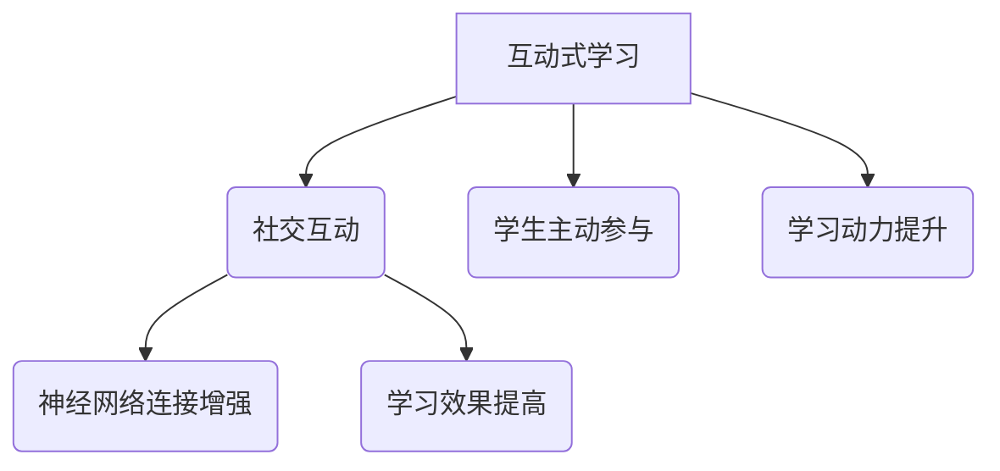
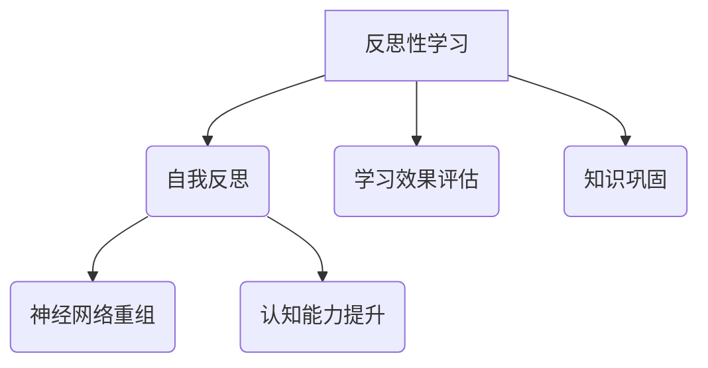
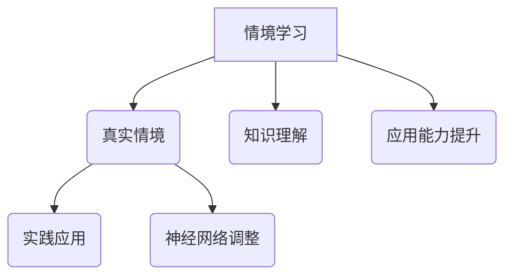
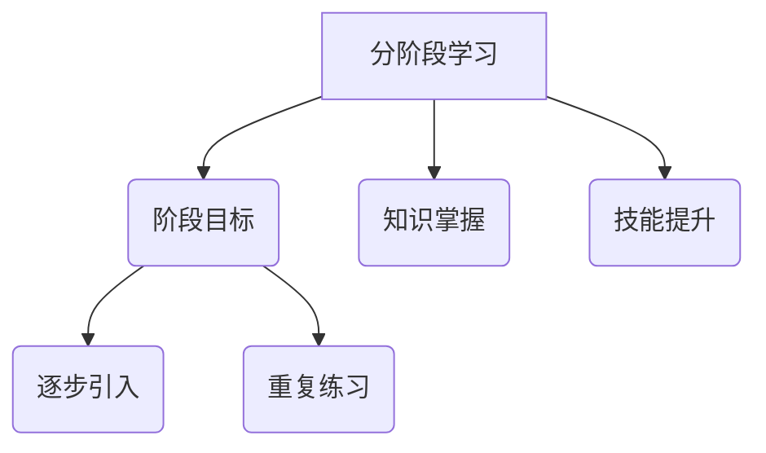
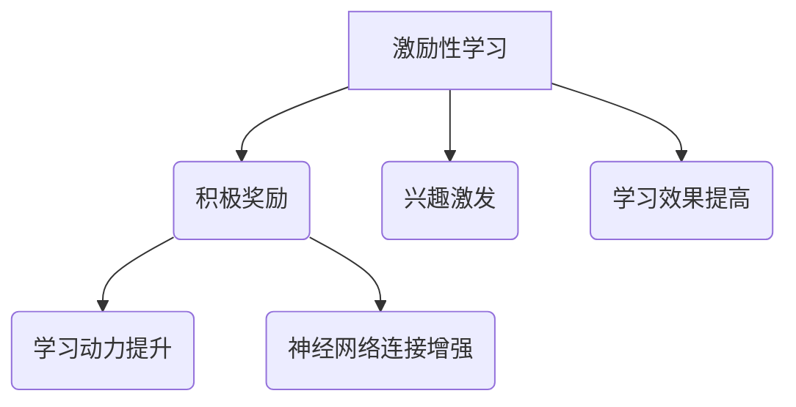

                 

# 知识的神经可塑性：大脑如何适应新信息

> 关键词：神经可塑性、学习、记忆、神经网络、突触可塑性、认知功能、神经精神疾病、教育实践、未来展望

> 摘要：本文深入探讨了知识的神经可塑性的概念、重要性及其在生物和人工智能领域中的应用。通过剖析大脑的结构与功能、突触可塑性机制，以及神经可塑性在认知和学习中的作用，本文揭示了神经可塑性对人类记忆、感知和学习的影响。此外，本文还探讨了神经可塑性在神经精神疾病中的潜在作用、教育实践中的应用，以及未来研究的方向和展望。通过系统地阐述神经可塑性的核心概念和机制，本文为读者提供了对这一重要领域更深入的理解。

## 第一部分：引言

### 1.1 神经可塑性的概念与历史背景

神经可塑性是指大脑神经元和神经网络在结构和功能上的改变，这些改变通常是由于外界刺激、环境和经验的变化而引起的。神经可塑性是大脑适应新信息、学习新技能和记忆的重要机制。

早在19世纪，神经可塑性的概念就已经被提出。19世纪中叶，法国生理学家皮埃尔·保罗·弗雷德里克·帕切昂（Pierre Paul Broca）和法国神经学家让·皮埃尔·弗朗索瓦·马里·居尤赛恩（Jean-Pierre Flourens）通过一系列实验发现了大脑的某些区域与特定功能之间的关联。他们的研究表明，大脑的不同区域在执行特定任务时具有特定的功能，而这些功能可以通过训练和练习得到加强。

20世纪，神经科学的研究进一步揭示了神经可塑性的机制。1940年代，美国神经科学家卡尔·弗里德里希·格特鲁德·希尔泰因（Carlo Matteucci）和意大利神经科学家朱塞佩·马佐尼（Giuseppe Mazzoni）通过实验发现，突触的传递效能可以通过训练而增强。这一发现为神经可塑性的研究奠定了基础。

进入21世纪，随着神经科学技术的不断发展，神经可塑性的研究取得了重大突破。现代神经科学研究表明，神经可塑性不仅存在于大脑的学习和记忆过程中，还与神经精神疾病的发生和发展密切相关。因此，神经可塑性已成为神经科学领域的一个重要研究方向。

### 1.2 神经可塑性的重要意义

神经可塑性对人类的认知功能、学习能力和适应能力具有重要意义。通过神经可塑性，大脑可以不断适应新环境、新信息和新的挑战，从而实现认知能力的提高和技能的增强。

首先，神经可塑性是学习的基础。在学习过程中，大脑通过调整神经元之间的连接强度和结构，使得相关的神经网络更加活跃和有效。例如，通过重复学习和练习，大脑可以建立新的突触连接，从而增强记忆和认知能力。

其次，神经可塑性有助于人类适应变化。随着社会和环境的不断变化，人们需要不断适应新的挑战和任务。神经可塑性使得大脑能够通过改变神经元之间的连接方式，快速适应新的环境和任务。

此外，神经可塑性在神经精神疾病的治疗中也具有潜在的应用价值。例如，抑郁症、焦虑症和自闭症等神经精神疾病的发生和发展与大脑的神经可塑性密切相关。通过调控神经可塑性，有可能开发出新的治疗方法，提高患者的生活质量。

总之，神经可塑性是大脑适应环境和实现认知功能的重要机制，对人类的认知发展、学习能力和适应能力具有重要意义。因此，深入研究神经可塑性，对于理解大脑的工作原理、开发新的治疗方法以及提高人类生活质量具有重要意义。

### 1.3 神经可塑性的类型与机制

神经可塑性可以按照其发生的区域和机制进行分类。主要的类型包括结构可塑性、连接可塑性和突触可塑性。

**1.3.1 结构可塑性**

结构可塑性是指神经元和神经网络在形态和结构上的改变。这种改变通常涉及到神经元的大小、形状和位置的变化。例如，树突的分支可以增加或减少，神经元之间的距离也可以发生变化。结构可塑性是大脑适应新信息和新环境的基础。

在生物体中，结构可塑性可以通过多种机制实现。例如，神经元可以通过生长新的突触来增加网络复杂性，也可以通过减少或剪除不必要的突触来简化网络。此外，神经元还可以通过改变其形状和位置，以优化其在神经网络中的功能。

**1.3.2 连接可塑性**

连接可塑性是指神经元之间的连接强度和模式的改变。这种改变通常涉及神经元之间的突触连接，即突触的传递效能和数量。连接可塑性是大脑学习新技能和记忆新信息的关键机制。

连接可塑性可以通过多种机制实现。例如，突触可以增加或减少传递效能，从而改变神经元之间的交互。此外，神经网络中的突触连接模式也可以发生变化，使得某些神经元之间的连接变得更加紧密，而另一些连接则被剪除。

**1.3.3 突触可塑性**

突触可塑性是指突触在形态和功能上的改变。突触是神经元之间传递信息的重要结构，其可塑性直接影响大脑的学习和记忆能力。

突触可塑性可以通过多种方式实现。例如，突触前和突触后的结构可以发生变化，从而改变突触的传递效能。此外，突触还可以通过改变其化学和电生理特性，来调节神经元之间的信息传递。

综上所述，神经可塑性是大脑适应环境和实现认知功能的重要机制。通过结构可塑性、连接可塑性和突触可塑性，大脑可以不断调整其神经元和神经网络的结构和功能，以适应新的信息和挑战。理解这些机制对于深入探讨大脑的工作原理和开发新的治疗方法具有重要意义。

### 1.4 神经可塑性与学习记忆的关系

神经可塑性在学习和记忆中起着至关重要的作用。通过神经可塑性，大脑可以调整神经元之间的连接和活动模式，从而实现新信息的获取、存储和应用。

**1.4.1 神经可塑性在学习中的作用**

在学习过程中，神经可塑性通过突触可塑性机制发挥作用。例如，当大脑学习新的技能或知识时，相关的神经网络会变得更加活跃。这种活跃性会导致突触连接的增强，使得相关的神经元之间的信号传递更加高效。这种现象称为“长时程增强”（Long-Term Potentiation，LTP）。

LTP的具体机制包括以下几个方面：

1. **突触前增强**：突触前增强是指神经元在连续的强刺激下，其突触前膜的神经递质释放量增加。这种增加是由于钙离子（Ca²⁺）内流引起的，从而增强了突触的传递效能。

2. **突触后增强**：突触后增强是指神经元在连续的强刺激下，其突触后膜的受体数量增加或敏感性提高。这种增强使得突触更容易响应刺激，从而增强了神经信号的传递。

3. **突触重塑**：突触重塑是指突触的结构和形态发生变化，例如树突的分支增加或减少。这种重塑使得神经元之间的连接更加紧密，从而提高了神经信号的传递效率。

**1.4.2 神经可塑性在记忆中的作用**

神经可塑性在记忆形成中也起着关键作用。记忆的形成通常涉及多个步骤，包括编码、存储和提取。神经可塑性在这些步骤中发挥了重要作用。

1. **编码**：编码是指大脑将感官信息转化为神经信号的过程。在这一过程中，神经可塑性通过突触增强和重塑，使得相关的神经网络更加活跃，从而更好地编码新的信息。

2. **存储**：存储是指大脑将编码后的信息转化为持久记忆的过程。在这一过程中，神经可塑性通过长时程增强和突触重塑，使得神经元之间的连接更加稳定和牢固，从而实现信息的持久存储。

3. **提取**：提取是指大脑在需要时将存储的信息回忆出来的过程。在这一过程中，神经可塑性通过激活相关的神经网络和突触连接，使得存储的信息能够被迅速提取和利用。

**1.4.3 神经可塑性的调节因素**

神经可塑性不仅受神经元内部机制的调节，还受到外部环境和生物化学因素的影响。例如：

1. **环境刺激**：积极的环境刺激可以增强神经可塑性，从而促进学习和记忆。例如，丰富的社交环境、多样化的学习和锻炼都可以提高大脑的神经可塑性。

2. **生物化学因素**：生物化学因素如神经递质、激素和营养物质可以调节神经可塑性。例如，多巴胺和肾上腺素等神经递质可以增强突触的传递效能，从而促进学习和记忆。

3. **心理因素**：心理因素如情绪、动机和注意力等也可以影响神经可塑性。积极的心态和强烈的动机可以增强神经可塑性，从而提高学习和记忆的效果。

综上所述，神经可塑性在学习和记忆中发挥着关键作用。通过理解神经可塑性的机制和调节因素，我们可以更好地理解大脑的学习和记忆过程，并开发出更有效的教育方法和记忆技巧。此外，深入研究神经可塑性还可能为治疗学习和记忆障碍提供新的策略和途径。

## 第二部分：神经可塑性的基础原理

### 2.1 大脑的结构与功能

大脑是神经系统的中枢，负责处理、存储和传递信息。了解大脑的结构与功能对于理解神经可塑性具有重要意义。大脑可以分为几个主要的部分：大脑皮层、基底神经节、小脑和脑干。

**大脑皮层**

大脑皮层是大脑的最外层，也是最为复杂的部分。它包括多个功能区域，每个区域都有特定的功能。大脑皮层的主要功能包括感知、运动控制、思维、记忆和语言处理。

- **感知区域**：包括视觉、听觉、嗅觉、味觉和触觉区域。这些区域对感官信息进行处理，使得我们能够感知和理解外界环境。

- **运动控制区域**：包括初级运动皮层和辅助运动区。这些区域负责计划和执行运动。

- **认知区域**：包括前额叶皮层、顶叶皮层和颞叶皮层。这些区域负责高级认知功能，如决策、推理、记忆和注意力。

- **语言区域**：包括布罗卡区和韦尼克区。这些区域与语言处理和语言生成密切相关。

**基底神经节**

基底神经节是一组位于大脑深部的结构，包括尾状核、壳核、苍白球和丘脑底核。基底神经节在运动控制和认知功能中起着关键作用。

- **运动控制**：基底神经节通过调节运动计划和运动的精细执行，与大脑皮层和脑干共同完成复杂的运动任务。

- **认知功能**：基底神经节在决策、学习、记忆和情绪调节中也发挥着重要作用。

**小脑**

小脑是大脑的一个重要部分，主要负责协调运动和平衡。小脑通过接收来自大脑皮层和脊髓的信息，调节肌肉活动，使得运动更加精确和协调。

- **运动协调**：小脑通过调整肌肉的紧张度和协调不同肌肉的活动，使得运动更加流畅和精准。

- **平衡和空间感知**：小脑还参与平衡和空间感知，帮助我们保持身体的稳定。

**脑干**

脑干是连接大脑和脊髓的部分，包括中脑、桥脑和延髓。脑干负责调节基本的生命功能，如呼吸、心跳、消化和睡眠。

- **基本生命功能**：脑干通过调节自主神经系统，维持基本的生命活动。

- **运动控制和认知功能**：脑干还参与运动控制和认知功能，如觉醒、注意力和情绪调节。

**大脑的神经网络**

大脑的神经网络是由大量的神经元和突触组成的复杂网络。这些神经元和突触通过电信号和化学信号进行通信，实现大脑的各种功能。

- **神经元**：神经元是大脑的基本单位，包括细胞体、树突和轴突。神经元通过树突接收信息，通过轴突传递信息。

- **突触**：突触是神经元之间的连接点，通过电信号或化学信号进行信息传递。

- **神经网络**：神经网络是由多个神经元和突触组成的复杂网络，通过协同工作实现大脑的功能。

理解大脑的结构与功能对于深入探讨神经可塑性具有重要意义。大脑的各个部分通过神经网络相互连接和协调，共同实现复杂的认知功能。神经可塑性正是通过这些神经网络和神经元之间的连接和活动模式的改变，实现大脑的功能优化和适应。

### 2.2 大脑的功能区域

大脑的功能区域可以分为多个部分，每个部分都有特定的功能。这些区域包括初级感觉皮层、初级运动皮层、前额叶皮层、颞叶皮层和顶叶皮层。

**初级感觉皮层**

初级感觉皮层是大脑的一个区域，主要负责接收和处理来自各种感官的信息。这些感官包括视觉、听觉、触觉、味觉和嗅觉。初级感觉皮层的主要功能是将这些感官信息转化为神经信号，然后传递到大脑的其他区域进行进一步处理。

- **视觉区域**：位于枕叶，主要负责处理视觉信息，如形状、颜色和运动。

- **听觉区域**：位于颞叶，主要负责处理听觉信息，如声音的频率和音调。

- **触觉区域**：位于顶叶，主要负责处理触觉信息，如触感、温度和压力。

**初级运动皮层**

初级运动皮层是大脑的一个区域，主要负责计划、控制和执行运动。这些运动可以是自主的，如行走和说话，也可以是反射性的，如踢腿或打喷嚏。初级运动皮层通过接收来自大脑其他区域的信息，规划和调整运动，使得运动更加精确和协调。

**前额叶皮层**

前额叶皮层是大脑的一个重要区域，主要负责高级认知功能，如决策、推理、规划和注意力。前额叶皮层还参与情绪调节和社会行为。这个区域通过与大脑的其他部分相互连接，协调和调节各种认知功能。

- **决策和推理**：前额叶皮层帮助我们在复杂情境中做出决策和推理。

- **规划和注意力**：前额叶皮层帮助我们制定计划和集中注意力，从而更好地完成任务。

**颞叶皮层**

颞叶皮层是大脑的一个区域，主要负责处理语言、记忆和听觉信息。颞叶皮层还与情绪调节有关。这个区域通过接收和整合各种信息，帮助我们理解和记忆语言，以及处理情感。

- **语言处理**：颞叶皮层参与语言的理解和生成。

- **记忆和情感**：颞叶皮层帮助我们形成和回忆记忆，以及处理情感。

**顶叶皮层**

顶叶皮层是大脑的一个区域，主要负责空间感知、触觉处理和数学推理。顶叶皮层通过与大脑的其他部分相互连接，帮助我们理解和感知空间信息，以及处理触觉和数学问题。

- **空间感知**：顶叶皮层帮助我们理解和感知空间关系。

- **触觉处理**：顶叶皮层帮助我们理解和感知触觉信息。

- **数学推理**：顶叶皮层参与数学推理和空间问题的解决。

总之，大脑的功能区域通过神经网络相互连接和协调，共同实现各种复杂的认知功能。理解这些区域的功能对于探讨神经可塑性和大脑的学习记忆机制具有重要意义。

### 2.3 神经元与神经网络

神经元和神经网络是大脑信息处理和传递的基本单元。神经元是大脑的基本功能单元，包括细胞体、树突和轴突。神经元通过树突接收来自其他神经元的信号，通过轴突将这些信号传递出去。

**神经元的结构和功能**

- **细胞体**：细胞体是神经元的核心部分，包含细胞核和大部分细胞器。细胞体负责维持神经元的正常代谢和功能。

- **树突**：树突是神经元的一部分，负责接收其他神经元传递过来的信号。树突通过突触与其他神经元连接，形成神经网络。

- **轴突**：轴突是神经元的另一部分，负责将接收到的信号传递到其他神经元。轴突末端形成突触，与下一个神经元的树突或细胞体相连。

**神经网络的构成**

神经网络是由大量的神经元通过突触连接组成的复杂网络。神经网络通过电信号和化学信号进行信息传递和处理。

- **电信号传递**：电信号通过神经元膜上的离子通道进行传递。当神经元受到刺激时，膜上的离子通道开放，导致离子流动，从而产生电信号。

- **化学信号传递**：化学信号通过神经元末端的突触释放神经递质，作用于下一个神经元的受体，从而传递信号。

**神经网络的工作原理**

神经网络通过以下步骤进行信息处理和传递：

1. **信号接收**：神经元通过树突接收来自其他神经元的信号。

2. **信号整合**：神经元在树突上对接收到的信号进行整合，判断是否产生动作电位。

3. **信号传递**：如果神经元决定产生动作电位，信号将通过轴突传递到轴突末梢。

4. **信号释放**：在轴突末梢，神经递质被释放到突触间隙，作用于下一个神经元的受体。

5. **信号传递**：神经递质作用于下一个神经元的受体，导致下一个神经元产生动作电位或改变其活性。

通过这种复杂的网络结构和传递机制，神经网络可以实现对信息的处理、存储和传递。神经网络的工作原理和结构是神经可塑性的基础，也是大脑实现高级认知功能的关键。

### 2.4 突触与突触可塑性

突触是神经元之间传递信息的关键结构，也是神经可塑性的核心组成部分。突触包括突触前部、突触后部和突触间隙。突触前部是突触前神经元的轴突末端，突触后部是突触后神经元的树突或细胞体，突触间隙则是两者之间的空隙。突触通过电信号或化学信号进行信息传递。

**突触的结构和功能**

- **突触前部**：突触前部包含突触前膜、突触小泡和突触核心。突触前膜上有离子通道和神经递质释放装置。突触小泡内含有神经递质。突触核心是突触前部和突触后部之间的连接部分。

- **突触后部**：突触后部包括突触后膜和突触后受体。突触后膜上有神经递质受体，这些受体可以与突触前部释放的神经递质结合，从而产生信号。

- **突触间隙**：突触间隙是突触前部和突触后部之间的空隙，神经递质在这里进行传递。

**突触可塑性的机制**

突触可塑性是指突触在形态和功能上的改变，这种改变可以通过多种方式实现，主要包括：

1. **突触后增强**：突触后增强是指突触后膜上的受体数量增加或敏感性提高。这种增强使得突触更容易响应刺激，从而增强了神经信号的传递。

   - **突触后受体上调**：通过基因表达的增加，使突触后膜上的受体数量增加。
   - **突触后受体内部化**：受体在突触后膜上的内部化导致其敏感性提高。

2. **突触前增强**：突触前增强是指突触前膜上的神经递质释放量增加。这种增强使得突触的传递效能提高。

   - **神经递质合成增加**：通过增加神经递质的合成，使得突触前膜上的神经递质释放量增加。
   - **钙离子通道激活**：钙离子内流增加，导致神经递质释放增加。

3. **突触重塑**：突触重塑是指突触的结构和形态发生变化，例如突触前部和突触后部的结构改变。

   - **突触形成和消除**：新的突触连接可以形成，而无效的突触连接可以被消除。
   - **突触分支和形态变化**：突触的分支和形态可以发生变化，以适应新的信息处理需求。

**突触可塑性的调控因素**

突触可塑性受到多种因素的调控，包括：

- **神经递质**：神经递质是突触可塑性的关键调节因素，不同的神经递质可以调节突触的传递效能和形态。

- **神经营养因子**：神经营养因子是一类能够促进神经元生长、分化和存活的小分子，可以调节突触可塑性。

- **环境因素**：环境因素如刺激、运动和社交活动可以增强神经可塑性。

- **生物化学因素**：生物化学因素如钙离子、氨基酸、糖类和脂类等可以调节突触可塑性。

- **遗传因素**：遗传因素决定了个体对突触可塑性的敏感性和调节能力。

总之，突触是神经元之间传递信息的关键结构，突触可塑性是神经可塑性的核心机制。通过调节突触的形态和功能，大脑可以实现学习、记忆和认知功能。理解突触可塑性的机制和调控因素对于深入研究大脑的工作原理和开发新的治疗方法具有重要意义。

### 2.5 神经可塑性在学习和记忆中的作用

神经可塑性在学习和记忆中起着至关重要的作用。通过神经可塑性，大脑可以调整神经元之间的连接和活动模式，从而实现新信息的获取、存储和应用。以下是神经可塑性在学习和记忆中具体作用的详细说明。

**学习过程中的神经可塑性**

学习是一个复杂的过程，涉及到信息的接收、处理、存储和回忆。在这一过程中，神经可塑性通过多种机制发挥作用。

1. **突触可塑性**：突触可塑性是神经可塑性的核心机制，尤其在学习和记忆中发挥着重要作用。当神经元受到重复的刺激时，突触的传递效能会增强，这种现象称为“长时程增强”（LTP）。LTP的机制包括突触前增强和突触后增强。突触前增强是指神经递质的释放量增加，突触后增强是指突触后膜上的受体数量增加或敏感性提高。通过这些变化，神经信号在神经元之间的传递变得更加高效，从而促进学习和记忆。

2. **结构可塑性**：结构可塑性是指神经元和神经网络在形态和结构上的改变。在学习过程中，大脑可以通过增加或减少神经元之间的突触连接来调整神经网络的结构。这种调整使得神经网络更加适应新的信息处理需求，从而提高学习效果。

3. **连接可塑性**：连接可塑性是指神经元之间连接强度的改变。在学习过程中，某些神经元之间的连接会变得更加紧密，而另一些连接则会减弱或消失。这种调整有助于优化神经网络的结构和功能，使其更加高效地处理和存储信息。

**记忆过程中的神经可塑性**

记忆是学习的结果，是大脑对信息进行存储和回忆的能力。神经可塑性在记忆的形成、存储和回忆中发挥着重要作用。

1. **编码**：编码是指大脑将感官信息转化为神经信号的过程。在这一过程中，神经可塑性通过增强神经元之间的连接，使得相关的神经网络更加活跃和有效。这种增强有助于将新的信息编码为记忆。

2. **存储**：存储是指大脑将编码后的信息转化为持久记忆的过程。在这一过程中，神经可塑性通过长时程增强和突触重塑，使得神经元之间的连接更加稳定和牢固，从而实现信息的持久存储。

3. **提取**：提取是指大脑在需要时将存储的信息回忆出来的过程。在这一过程中，神经可塑性通过激活相关的神经网络和突触连接，使得存储的信息能够被迅速提取和利用。

**神经可塑性的调节因素**

神经可塑性受到多种因素的调节，包括神经递质、神经营养因子、环境因素和生物化学因素。

1. **神经递质**：神经递质是神经可塑性的关键调节因素。例如，多巴胺和谷氨酸等神经递质可以增强突触的传递效能，从而促进学习和记忆。

2. **神经营养因子**：神经营养因子是一类能够促进神经元生长、分化和存活的小分子，可以调节神经可塑性。例如，脑源性神经营养因子（BDNF）可以增强神经可塑性，从而提高学习和记忆能力。

3. **环境因素**：环境因素如刺激、运动和社交活动可以增强神经可塑性。例如，丰富多样的环境刺激可以促进神经网络的发展，从而提高学习和记忆能力。

4. **生物化学因素**：生物化学因素如钙离子、氨基酸、糖类和脂类等可以调节神经可塑性。例如，钙离子内流是突触可塑性重要的调控机制，而氨基酸和糖类等营养物质可以提供能量和原料，支持神经可塑性的实现。

总之，神经可塑性在学习和记忆中起着至关重要的作用。通过调节神经元之间的连接和活动模式，大脑可以实现对信息的获取、存储和回忆。理解神经可塑性的机制和调节因素，有助于我们更好地理解大脑的工作原理，并开发出更有效的学习和记忆策略。

### 第三部分：神经可塑性的核心机制

#### 3.1 突触可塑性的基本原理

突触可塑性是指突触在形态和功能上的改变，这种改变通常是由于外界刺激或内部代谢变化引起的。突触可塑性是神经可塑性的核心机制，对大脑的学习、记忆和认知功能具有重要意义。

**突触可塑性的机制**

突触可塑性主要通过以下机制实现：

1. **突触前增强**：突触前增强是指突触前部神经元的兴奋性增加，导致神经递质释放量增加。这种增强可以通过多种方式实现，例如钙离子通道的激活、神经递质合成增加等。

2. **突触后增强**：突触后增强是指突触后部神经元的兴奋性增加，导致突触后膜上的受体数量增加或敏感性提高。这种增强可以通过基因表达上调、受体内部化等方式实现。

3. **突触重塑**：突触重塑是指突触在形态和结构上的改变，包括突触形成、消除和分支。突触重塑可以通过剪枝、生长和再建立等方式实现。

**突触可塑性的调控因素**

突触可塑性受到多种因素的调节，包括神经递质、神经营养因子、环境因素和生物化学因素。

1. **神经递质**：神经递质是突触可塑性的关键调节因素。例如，谷氨酸、多巴胺和乙酰胆碱等神经递质可以增强突触的传递效能，从而促进突触可塑性。

2. **神经营养因子**：神经营养因子是一类能够促进神经元生长、分化和存活的小分子，可以调节突触可塑性。例如，脑源性神经营养因子（BDNF）可以增强突触的可塑性，从而提高学习和记忆能力。

3. **环境因素**：环境因素如刺激、运动和社交活动可以增强突触可塑性。例如，丰富的环境刺激可以促进神经网络的发育和功能，从而提高突触的可塑性。

4. **生物化学因素**：生物化学因素如钙离子、氨基酸、糖类和脂类等可以调节突触可塑性。例如，钙离子内流是突触可塑性重要的调控机制，而氨基酸和糖类等营养物质可以提供能量和原料，支持突触可塑性的实现。

**突触可塑性的应用**

突触可塑性在多个领域有着广泛的应用，包括教育、神经科学和神经精神疾病治疗。

1. **教育**：理解突触可塑性可以帮助我们设计更有效的教育策略。例如，通过提供丰富多样的学习材料和方法，可以增强学生的突触可塑性，从而提高学习效果。

2. **神经科学**：突触可塑性是神经科学研究的核心主题之一。通过深入研究突触可塑性的机制和调节因素，可以揭示大脑的学习和记忆过程。

3. **神经精神疾病治疗**：突触可塑性在神经精神疾病治疗中具有潜在的应用价值。例如，通过调控突触可塑性，可能开发出新的治疗方法，提高患者的生活质量。

总之，突触可塑性是神经可塑性的核心机制，对大脑的学习、记忆和认知功能具有重要意义。理解突触可塑性的基本原理和调控因素，有助于我们更好地应用这一机制，提高教育效果、推动神经科学研究，并为神经精神疾病治疗提供新的策略。

#### 3.2 突触可塑性的类型

突触可塑性可以根据其发生的快慢和持续时间分为短期可塑性和长期可塑性。每种类型的可塑性都有其独特的机制和生理意义。

**3.2.1 短期可塑性**

短期可塑性（Short-Term Plasticity，STP）是指突触在短时间内（通常为数秒至数分钟）发生的可塑性变化。短期可塑性通常与突触的快速调节机制有关，主要表现在突触前和突触后方面的变化。

- **突触前可塑性**：突触前可塑性包括突触前神经元的兴奋性改变。例如，通过调节神经递质的释放量，突触前神经元可以在短时间内改变其传递效能。这种调节可以通过钙离子通道的快速激活或抑制来实现。

- **突触后可塑性**：突触后可塑性包括突触后神经元的兴奋性改变。例如，通过调节突触后膜上的受体数量或敏感性，突触后神经元可以在短时间内改变其对神经信号的响应。

短期可塑性在神经系统的快速响应和适应中起着重要作用。例如，当神经元需要快速调整其活动以应对新的刺激时，短期可塑性可以发挥作用。

**3.2.2 长期可塑性**

长期可塑性（Long-Term Potentiation，LTP）和长期抑郁（Long-Term Depression，LTD）是突触可塑性的两种主要长期形式。

- **长期增强（LTP）**：长期增强是指突触在长时间（通常为数分钟至数小时）内发生的传递效能增强。LTP是学习记忆的重要机制，通常通过突触前和突触后的多个分子机制实现。例如，突触前增强包括神经递质释放量的增加，突触后增强包括突触后膜上受体的数量增加或敏感性提高。

- **长期抑郁（LTD）**：长期抑郁是指突触在长时间内发生的传递效能减弱。LTD通常与学习中的遗忘过程相关，通过调节突触前和突触后的信号通路来实现。例如，突触前减弱包括神经递质释放量的减少，突触后减弱包括突触后膜上受体的数量减少或敏感性降低。

**3.2.3 突触可塑性的其他类型**

除了短期和长期可塑性，还有其他几种类型的突触可塑性：

- **快速可塑性**：快速可塑性是指突触在非常短的时间内（通常为秒级）发生的快速变化。这种可塑性通常与神经系统的瞬时反应有关。

- **同步性突触可塑性**：同步性突触可塑性是指多个突触同时发生的可塑性变化。这种可塑性有助于神经网络的整体协调和功能优化。

- **经验依赖性突触可塑性**：经验依赖性突触可塑性是指突触的可塑性变化依赖于特定的经验或环境刺激。这种可塑性使得大脑能够根据不同的经验和环境进行适应。

**3.2.4 突触可塑性的应用**

突触可塑性的类型在多个领域有着广泛的应用：

- **学习与记忆**：突触可塑性是学习和记忆的基础。短期和长期可塑性分别与学习和记忆的不同阶段相关联。

- **神经系统疾病治疗**：突触可塑性在神经系统疾病的治疗中具有潜在的应用价值。通过调控突触可塑性，可能开发出新的治疗方法，例如在阿尔茨海默病和抑郁症的治疗中。

- **神经科学研究**：突触可塑性是神经科学研究的重要主题，通过研究不同类型的突触可塑性，可以深入理解大脑的工作机制。

总之，突触可塑性是神经可塑性的核心机制，通过短期和长期可塑性，大脑可以实现对神经信号的快速和持久调节，从而实现学习、记忆和适应。理解不同类型的突触可塑性及其机制，对于揭示大脑的复杂功能和开发新的治疗方法具有重要意义。

#### 3.3 突触可塑性在学习和记忆中的作用

突触可塑性是学习与记忆的关键机制，通过调节神经元之间的连接强度，大脑能够实现对新信息的编码、存储和提取。以下是突触可塑性在学习和记忆中具体作用的详细探讨。

**3.3.1 突触可塑性在学习中的作用**

学习是一个动态的过程，涉及到对信息的接收、处理和整合。突触可塑性在学习中起着至关重要的作用，通过以下机制实现：

1. **突触前可塑性**：突触前可塑性主要表现为神经递质释放量的变化。在学习过程中，当神经元连续接收到强刺激时，突触前膜的钙离子通道会被激活，导致钙离子内流增加。这会促进神经递质的合成和释放，从而增强突触的传递效能。这种增强使得相关神经元之间的信号传递更加高效，从而促进学习。

2. **突触后可塑性**：突触后可塑性主要表现为突触后膜上受体的数量增加或敏感性提高。在学习过程中，连续的强刺激会导致突触后膜上的受体基因表达增加，使得受体的数量增加或敏感性提高。这会增强突触后神经元对信号的响应，从而加强学习效果。

3. **突触重塑**：突触重塑是指神经元之间突触连接的动态变化。在学习过程中，大脑会根据新的信息需求，调整神经元之间的连接模式。例如，通过增加新的突触连接或剪除无效的突触连接，使得神经网络更加适应新的信息处理需求。

**3.3.2 突触可塑性在记忆中的作用**

记忆是学习的结果，是大脑对信息进行存储和回忆的能力。突触可塑性在记忆的形成、存储和提取中发挥着重要作用：

1. **编码**：编码是指大脑将感官信息转化为神经信号的过程。在学习过程中，突触可塑性通过增强相关神经元的连接强度，使得相关的神经网络更加活跃和有效。这种增强有助于将新的信息编码为记忆。

2. **存储**：存储是指大脑将编码后的信息转化为持久记忆的过程。在存储过程中，突触可塑性通过长时程增强（LTP）和突触重塑，使得神经元之间的连接更加稳定和牢固。例如，通过增加突触前后的连接强度，使得信息能够在神经元之间长期传递。

3. **提取**：提取是指大脑在需要时将存储的信息回忆出来的过程。在提取过程中，突触可塑性通过激活相关的神经网络和突触连接，使得存储的信息能够被迅速提取和利用。例如，当需要回忆某个信息时，相关神经元之间的突触连接会被激活，从而提取出相应的记忆。

**3.3.3 突触可塑性的具体例子**

以下是一些突触可塑性在学习和记忆中的具体例子：

1. **重复练习**：在语言学习中，通过反复练习单词和句子，可以增强相关神经元之间的连接强度，从而提高语言能力。例如，当学习者连续听到并重复某个单词时，相关的神经元之间的突触连接会增强，从而形成更牢固的记忆。

2. **音乐训练**：在音乐训练中，通过反复练习乐器的演奏，可以增强相关神经元之间的连接强度。这种增强不仅有助于提高演奏技巧，还能够促进音乐记忆的形成。

3. **运动技能学习**：在运动技能学习中，通过反复练习动作，可以增强相关神经元之间的连接强度，从而提高运动技能。例如，在游泳训练中，通过反复练习划水和踢腿动作，可以增强相关神经元之间的连接，从而提高游泳技巧。

总之，突触可塑性是学习与记忆的关键机制，通过调节神经元之间的连接强度和形态，大脑能够实现对新信息的编码、存储和提取。理解突触可塑性的机制和作用，有助于我们更好地理解学习与记忆的过程，并开发出更有效的学习策略和记忆方法。

#### 3.4 突触可塑性的调控因素

突触可塑性是大脑实现学习、记忆和认知功能的关键机制，其调控受到多种因素的共同作用。理解这些调控因素对于深入探讨大脑的工作原理和开发新的治疗方法具有重要意义。

**神经递质**

神经递质是神经信号传递的重要介质，直接影响突触可塑性。不同的神经递质可以调节突触的可塑性，如：

- **谷氨酸**：谷氨酸是大脑中最重要的兴奋性神经递质之一，可以通过NMDA受体和AMPA受体调节突触可塑性。
- **GABA**：GABA是大脑中的主要抑制性神经递质，可以调节谷氨酸的传递，从而影响突触可塑性。

**神经营养因子**

神经营养因子是一类能够促进神经元生长、分化和存活的小分子，对突触可塑性具有显著的调节作用。常见的神经营养因子包括：

- **脑源性神经营养因子（BDNF）**：BDNF可以增强突触可塑性，促进神经元生长和存活，对学习记忆有重要作用。
- **神经营养因子-3（NT-3）**和**神经营养因子-4/5（NT-4/5）**：这些因子也参与突触可塑性的调节，促进神经元的发育和功能。

**环境刺激**

环境刺激是调节突触可塑性的重要外部因素。积极的环境刺激可以增强神经可塑性，如：

- **社交互动**：丰富的社交互动可以促进神经网络的发育和功能，增强突触可塑性。
- **物理活动**：适度的运动可以促进神经生长因子的分泌，从而增强突触可塑性。

**生物化学因素**

生物化学因素如钙离子、氨基酸、糖类和脂类等可以调节突触可塑性。例如：

- **钙离子**：钙离子是调节突触可塑性的关键离子，参与神经递质的释放和信号传递。
- **氨基酸**：氨基酸是神经递质合成的重要原料，影响突触的传递效能。

**遗传因素**

遗传因素在突触可塑性中也发挥着重要作用。个体对突触可塑性的敏感性和调节能力受到基因的影响。例如，某些基因变异可能与突触可塑性的增强或减弱有关。

**总结**

突触可塑性是大脑实现认知功能的重要机制，其调控涉及多种神经递质、神经营养因子、环境刺激、生物化学因素和遗传因素。理解这些调控因素，有助于我们深入探讨大脑的工作原理，并为治疗学习和记忆障碍、神经系统疾病提供新的思路和方法。

### 第四部分：神经可塑性与认知功能

#### 4.1 神经可塑性在感知和学习中的作用

神经可塑性在感知和学习中起着至关重要的作用，它使得大脑能够不断调整其结构和功能，以适应新的信息和环境。以下是神经可塑性在感知和学习中具体作用的详细探讨。

**4.1.1 神经可塑性在感知中的作用**

感知是指大脑对感官信息的接收和处理。神经可塑性在这一过程中发挥着关键作用，通过以下机制实现：

1. **突触可塑性**：突触是神经元之间传递信息的结构，其可塑性直接影响大脑的感知能力。例如，当大脑接收到重复的感官刺激时，突触会通过长时程增强（LTP）机制增强其传递效能，使得相关神经元之间的信号传递更加高效。这种增强有助于提高感知的准确性和敏感性。

2. **神经网络重组**：神经可塑性使得神经网络能够根据新的感知需求进行重组。例如，当大脑需要处理一种新的视觉信息时，相关的神经网络会通过增加新的突触连接或调整现有突触连接的强度，来适应新的信息处理需求。

3. **感官整合**：神经可塑性有助于大脑整合来自不同感官的信息。例如，在视觉和听觉信息同时输入时，大脑可以通过调整相关神经网络的连接强度，来优化感官整合的效果。

**4.1.2 神经可塑性在学习中的作用**

学习是指大脑通过获取、处理和存储信息，从而提高认知能力。神经可塑性在学习中发挥着关键作用，通过以下机制实现：

1. **突触增强**：在学习过程中，当大脑接收到重复的刺激时，相关的突触会通过LTP机制增强其传递效能。这种增强有助于将新的信息编码为记忆，从而促进学习。

2. **神经网络重组**：学习过程中，大脑会根据新的信息需求，对神经网络进行重组。例如，当学习一种新的技能或知识时，相关的神经网络会通过增加新的突触连接或调整现有突触连接的强度，来适应新的信息处理需求。

3. **记忆形成**：神经可塑性在学习过程中，通过调节突触连接的强度和形态，使得大脑能够将新信息编码为持久记忆。例如，通过长时程增强和突触重塑，大脑可以建立新的记忆网络，从而提高记忆效果。

**4.1.3 神经可塑性的具体例子**

以下是一些神经可塑性在感知和学习中的具体例子：

1. **语言学习**：在学习新语言时，大脑会通过神经可塑性机制调整相关神经网络，以适应新的语音、语法和词汇。例如，通过重复听和说，可以增强相关神经元之间的连接，从而提高语言学习能力。

2. **音乐训练**：在音乐训练中，大脑会通过神经可塑性机制调整相关神经网络，以优化音乐的感知和表达。例如，通过反复练习乐器，可以增强相关神经元之间的连接，从而提高音乐技能。

3. **运动技能学习**：在学习新的运动技能时，大脑会通过神经可塑性机制调整相关神经网络，以优化运动执行。例如，通过反复练习投篮或跑步，可以增强相关神经元之间的连接，从而提高运动技能。

总之，神经可塑性在感知和学习中起着至关重要的作用，通过调节神经元之间的连接和活动模式，大脑能够不断适应新的信息和环境，从而提高认知能力。理解神经可塑性的机制和作用，有助于我们更好地设计教育策略和教学方法，提高学习和记忆效果。

#### 4.2 神经可塑性在视觉感知中的作用

神经可塑性在视觉感知中起着至关重要的作用，它使得大脑能够对视觉信息进行高效的处理、分析和理解。以下是神经可塑性在视觉感知中的具体作用和机制。

**4.2.1 神经可塑性在视觉信息处理中的作用**

视觉感知是一个复杂的过程，涉及到从视网膜接收光信号到大脑处理和理解视觉信息。在这一过程中，神经可塑性发挥着关键作用：

1. **初级视觉皮层**：初级视觉皮层是视觉信息处理的重要区域，包括V1（17区）和V2区。神经可塑性在这一区域中通过调节神经元之间的连接强度和形态，提高视觉信息的处理效率。例如，当大脑接收到重复的视觉刺激时，初级视觉皮层中的突触会通过长时程增强（LTP）机制增强其传递效能，从而提高视觉信息的识别和分类能力。

2. **高级视觉皮层**：高级视觉皮层包括颞叶、顶叶和枕叶等区域，负责处理更复杂的视觉任务，如物体识别、场景理解和视觉记忆。神经可塑性在这一区域通过调整神经网络的结构和功能，使得大脑能够更准确地理解和分析视觉信息。例如，通过调整高级视觉皮层中神经元之间的突触连接，可以优化视觉信息的高层加工和处理。

**4.2.2 神经可塑性在视觉适应中的作用**

视觉适应是指大脑对视觉信息的适应和调节，以适应不同的环境和条件。神经可塑性在这一过程中发挥着重要作用：

1. **暗适应**：在从明亮环境进入暗环境时，大脑会通过神经可塑性机制调整视网膜和视觉皮层中的神经元活动，以增强对低光条件下的视觉感知。例如，通过增加视网膜中的感光细胞对光的敏感性，以及调整视觉皮层中神经元的响应特性，大脑可以更有效地处理暗光条件下的视觉信息。

2. **亮适应**：在从暗环境进入明亮环境时，大脑会通过神经可塑性机制调整视网膜和视觉皮层中的神经元活动，以适应高光条件。例如，通过减少视网膜中感光细胞对光的敏感性，以及调整视觉皮层中神经元的响应特性，大脑可以减少眩光和过量的视觉信息。

**4.2.3 神经可塑性在视觉训练中的作用**

视觉训练是通过重复的视觉刺激来提高视觉能力的过程。神经可塑性在视觉训练中发挥着关键作用，通过以下机制实现：

1. **视觉辨别训练**：例如，通过重复识别不同形状、颜色和纹理的视觉刺激，可以增强相关视觉皮层区域中神经元的连接强度，从而提高视觉辨别能力。

2. **视觉运动协调训练**：例如，通过重复进行视觉指导的体育运动训练，可以增强视觉和运动皮层之间的神经连接，从而提高视觉运动协调能力。

3. **视觉空间定位训练**：例如，通过重复进行视觉空间定位的任务，可以增强视觉皮层中与空间感知相关的神经元之间的连接，从而提高空间定位能力。

总之，神经可塑性在视觉感知中起着至关重要的作用，通过调节视觉皮层中神经元之间的连接和活动模式，大脑能够对视觉信息进行高效的处理、适应和训练。理解神经可塑性的机制和作用，有助于我们更好地设计视觉训练策略，提高视觉感知能力和视觉认知功能。

#### 4.3 神经可塑性在语言学习中的作用

神经可塑性在语言学习中的作用至关重要，它通过调节大脑神经网络的结构和功能，帮助学习者掌握和理解语言。以下是神经可塑性在语言学习中的具体作用和机制。

**4.3.1 神经可塑性在语言信息处理中的作用**

语言信息处理是语言学习的基础，涉及到语音识别、语法理解和语义分析等多个层面。神经可塑性在这一过程中发挥着关键作用：

1. **语音识别**：在语音识别过程中，大脑需要处理和识别不同的声音特征。神经可塑性通过调整听觉皮层中神经元之间的连接，增强对特定语音模式的识别能力。例如，通过重复听某一种语言的声音，相关的听觉皮层区域会通过长时程增强（LTP）机制增强其响应，从而提高语音识别的准确性。

2. **语法理解**：在语法理解过程中，大脑需要解析和理解句子结构。神经可塑性通过调整大脑中负责语法理解的区域，如布罗卡区和韦尼克区，增强对语法规则的掌握和应用能力。例如，通过重复练习语法规则，相关的神经网络会通过LTP机制增强其功能，从而提高语法理解能力。

3. **语义分析**：在语义分析过程中，大脑需要理解词语的意义和句子之间的关系。神经可塑性通过调整大脑中负责语义理解的区域，如颞叶和顶叶，增强对语义信息的处理能力。例如，通过重复阅读和理解不同语境下的句子，相关的神经网络会通过LTP机制增强其功能，从而提高语义分析能力。

**4.3.2 神经可塑性在词汇学习和记忆中的作用**

词汇学习和记忆是语言学习的重要组成部分。神经可塑性在这一过程中通过以下机制发挥作用：

1. **词汇编码**：在词汇编码过程中，大脑需要将新的词汇信息转化为记忆。神经可塑性通过增强与词汇学习相关的神经网络，如海马体和前额叶皮层，提高词汇编码的效率。例如，通过重复学习和复习新词汇，相关的神经网络会通过LTP机制增强其连接强度，从而提高词汇记忆的持久性。

2. **词汇提取**：在词汇提取过程中，大脑需要在需要时回忆起已学习的词汇。神经可塑性通过激活与词汇提取相关的神经网络，如颞叶和前额叶皮层，提高词汇提取的准确性。例如，通过在多种情境下使用新词汇，相关的神经网络会通过反复激活和加强其连接，从而提高词汇提取能力。

**4.3.3 神经可塑性在语言训练中的应用**

语言训练是提高语言能力的重要手段，神经可塑性在这一过程中通过以下方式发挥作用：

1. **语音训练**：通过重复练习正确的发音，可以增强发音相关的神经网络，如布罗卡区和颞叶。这种增强有助于提高语音识别和发音的准确性。

2. **语法训练**：通过重复练习语法规则和句子结构，可以增强语法理解相关的神经网络，如布罗卡区和韦尼克区。这种增强有助于提高语法理解能力和语言表达能力。

3. **词汇训练**：通过重复学习和复习新词汇，可以增强词汇记忆相关的神经网络，如海马体和前额叶皮层。这种增强有助于提高词汇记忆能力和词汇量。

总之，神经可塑性在语言学习中的作用至关重要，它通过调节大脑神经网络的结构和功能，帮助学习者掌握和理解语言。理解神经可塑性的机制和作用，有助于我们更好地设计语言学习策略和教学方法，提高学习效果。

### 第五部分：神经可塑性与神经精神疾病

#### 5.1 神经可塑性在抑郁症中的作用

神经可塑性在抑郁症的发生、发展及其治疗中发挥着关键作用。抑郁症是一种常见的心理障碍，其症状包括情绪低落、兴趣丧失、疲劳和睡眠障碍等。神经可塑性的调节在这一过程中起到了重要的作用。

**5.1.1 神经可塑性在抑郁症发生中的作用**

抑郁症的发生与大脑中的神经可塑性改变密切相关。研究表明，抑郁症患者的大脑存在多种神经可塑性的异常，包括：

1. **突触可塑性降低**：抑郁症患者的大脑中，突触可塑性可能降低，导致神经信号的传递效率下降。这种降低可能与突触前和突触后机制的异常有关，例如神经递质释放减少和突触后受体的数量减少或敏感性降低。

2. **神经再生受阻**：抑郁症患者的大脑中，神经再生过程可能受到阻碍，导致神经网络的结构和功能难以调整。这种受阻可能与神经营养因子的减少有关，例如脑源性神经营养因子（BDNF）的水平下降。

3. **神经网络重组异常**：抑郁症患者的大脑中，神经网络的重组可能异常，导致神经网络的功能难以适应新的刺激和需求。这种异常可能与突触连接的重塑和修剪过程受损有关。

**5.1.2 神经可塑性在抑郁症发展中的作用**

抑郁症的发展过程中，神经可塑性的改变可能加剧病情。研究表明，抑郁症患者的大脑中，神经可塑性的调节机制可能失调，导致以下现象：

1. **负面情绪增强**：神经可塑性的异常可能导致负面情绪增强，例如通过突触可塑性的异常调节，使得大脑对负面情绪的加工和记忆加强。

2. **认知功能受损**：神经可塑性的异常可能导致认知功能受损，例如通过突触可塑性的异常调节，使得大脑在处理信息和执行任务时出现困难。

3. **应对能力下降**：神经可塑性的异常可能导致应对能力下降，例如通过神经再生受阻，使得大脑难以适应新的环境和挑战。

**5.1.3 神经可塑性在抑郁症治疗中的作用**

神经可塑性在抑郁症的治疗中也具有重要意义。通过调节神经可塑性，可以改善抑郁症的症状和功能。以下是一些基于神经可塑性的抑郁症治疗方法：

1. **认知行为疗法（CBT）**：认知行为疗法是一种通过改变负面思维和行为模式来治疗抑郁症的方法。CBT通过调节神经可塑性，帮助患者改变大脑中的负面神经网络，从而改善情绪和认知功能。

2. **电刺激疗法**：电刺激疗法是一种通过电刺激大脑特定区域来调节神经可塑性的方法。例如，经颅磁刺激（TMS）和深部脑刺激（DBS）等疗法可以通过调节神经可塑性，改善抑郁症的症状。

3. **神经再生疗法**：神经再生疗法是一种通过促进神经再生和神经网络重塑来治疗抑郁症的方法。例如，神经营养因子治疗和基因治疗等疗法可以通过增强神经再生和神经网络重塑，改善抑郁症的症状。

总之，神经可塑性在抑郁症的发生、发展和治疗中发挥着关键作用。通过理解神经可塑性的机制和调节因素，可以开发出更有效的治疗方法，帮助患者改善情绪和认知功能。

#### 5.2 神经可塑性在阿尔茨海默病中的作用

阿尔茨海默病（Alzheimer's Disease，AD）是一种常见的神经退行性疾病，主要表现为认知功能下降、记忆丧失和行为改变。神经可塑性在这一疾病的发生和发展中扮演着重要角色。

**5.2.1 神经可塑性在阿尔茨海默病发生中的作用**

阿尔茨海默病的发病机制复杂，神经可塑性的改变被认为是其中的关键因素之一。研究表明，以下神经可塑性的异常可能与阿尔茨海默病的发病相关：

1. **突触可塑性下降**：阿尔茨海默病患者的大脑中，突触可塑性可能显著下降。突触是神经元之间传递信息的结构，其可塑性降低可能导致神经信号传递效率下降，进而影响大脑的认知功能。

2. **神经再生受阻**：阿尔茨海默病患者的大脑中，神经再生过程可能受到阻碍。神经再生受阻可能导致神经网络的结构和功能难以调整，从而影响大脑的正常功能。

3. **神经网络重构异常**：阿尔茨海默病患者的大脑中，神经网络的重组可能异常。异常的神经网络重组可能导致大脑难以适应新的信息和环境，从而加剧认知功能下降。

**5.2.2 神经可塑性在阿尔茨海默病发展中的作用**

阿尔茨海默病的发展过程中，神经可塑性的改变可能加剧病情。研究表明，以下神经可塑性的异常可能在阿尔茨海默病的发展中发挥重要作用：

1. **炎症反应增强**：阿尔茨海默病患者的大脑中，炎症反应可能增强。炎症反应可能影响神经可塑性，导致神经网络的功能受损。

2. **神经元死亡增加**：阿尔茨海默病患者的大脑中，神经元死亡可能增加。神经元死亡可能导致神经网络的结构和功能丧失，从而加剧认知功能下降。

3. **突触丢失**：阿尔茨海默病患者的大脑中，突触丢失可能增加。突触丢失可能导致神经信号的传递效率下降，从而影响大脑的正常功能。

**5.2.3 神经可塑性在阿尔茨海默病治疗中的作用**

神经可塑性在阿尔茨海默病的治疗中具有重要应用前景。通过调节神经可塑性，可能开发出新的治疗方法，改善阿尔茨海默病的症状和功能。以下是一些基于神经可塑性的阿尔茨海默病治疗方法：

1. **神经营养因子治疗**：神经营养因子是一类能够促进神经元生长、分化和存活的小分子。通过补充神经营养因子，可能增强神经可塑性，从而改善阿尔茨海默病的症状。例如，脑源性神经营养因子（BDNF）和神经细胞黏附分子（NCAM）等因子已被研究用于阿尔茨海默病的治疗。

2. **神经再生治疗**：神经再生治疗是一种通过促进神经再生和神经网络重塑来治疗神经退行性疾病的方法。例如，干细胞移植和基因治疗等疗法可以通过增强神经再生和神经网络重塑，改善阿尔茨海默病的症状。

3. **认知训练**：认知训练是一种通过特定的训练任务来提高认知功能的方法。通过认知训练，可能增强大脑的神经可塑性，从而改善阿尔茨海默病的症状。例如，记忆训练、注意力训练和工作记忆训练等任务已被研究用于阿尔茨海默病的治疗。

总之，神经可塑性在阿尔茨海默病的发生、发展和治疗中发挥着关键作用。通过理解神经可塑性的机制和调节因素，可以开发出更有效的治疗方法，帮助患者改善认知功能和生活质量。

#### 5.3 神经可塑性在自闭症中的作用

自闭症谱系障碍（Autism Spectrum Disorder，ASD）是一种复杂的神经发育障碍，主要表现为社交互动和沟通能力的障碍、重复性行为和兴趣的局限。神经可塑性在这一障碍的发生、发展和治疗中扮演着重要角色。

**5.3.1 神经可塑性在自闭症发生中的作用**

自闭症的发病机制尚未完全明确，但神经可塑性的异常被认为是其中的关键因素之一。以下神经可塑性的异常可能与自闭症的发生相关：

1. **早期大脑发育异常**：自闭症患者的大脑在早期发育阶段可能存在异常，例如神经元连接的过度或不足形成。这种异常可能导致大脑神经网络的结构和功能异常，从而影响社交互动和沟通能力。

2. **突触可塑性异常**：自闭症患者的大脑中，突触可塑性可能异常。例如，突触前和突触后的信号传递可能受损，导致神经信号的传递效率下降。

3. **神经再生受阻**：自闭症患者的大脑中，神经再生过程可能受阻。神经再生受阻可能导致神经网络的结构和功能难以调整，从而影响社交互动和沟通能力。

**5.3.2 神经可塑性在自闭症发展中的作用**

自闭症的发展过程中，神经可塑性的改变可能加剧病情。研究表明，以下神经可塑性的异常可能在自闭症的发展中发挥重要作用：

1. **社交互动和沟通能力的障碍**：神经可塑性的异常可能导致社交互动和沟通能力的障碍。例如，突触可塑性异常可能导致大脑在处理社交信息和情感时出现困难。

2. **行为和兴趣的局限**：神经可塑性的异常可能导致行为和兴趣的局限。例如，神经网络的结构异常可能导致大脑对特定行为和兴趣的偏好。

3. **认知功能受损**：神经可塑性的异常可能导致认知功能受损。例如，神经网络的功能异常可能导致大脑在执行认知任务时出现困难。

**5.3.3 神经可塑性在自闭症治疗中的作用**

神经可塑性在自闭症的治疗中具有重要应用前景。通过调节神经可塑性，可能开发出新的治疗方法，改善自闭症的症状和功能。以下是一些基于神经可塑性的自闭症治疗方法：

1. **行为治疗**：行为治疗是一种通过特定的训练任务来改善自闭症症状的方法。例如，社交技能训练、沟通训练和重复性行为干预等。这些治疗通过增强大脑的神经可塑性，帮助患者改善社交互动和沟通能力。

2. **认知训练**：认知训练是一种通过特定的训练任务来提高认知功能的方法。例如，记忆训练、注意力训练和工作记忆训练等。这些训练通过增强大脑的神经可塑性，帮助患者改善认知功能和应对能力。

3. **神经再生治疗**：神经再生治疗是一种通过促进神经再生和神经网络重塑来治疗神经发育障碍的方法。例如，干细胞移植和基因治疗等。这些治疗通过增强大脑的神经可塑性，帮助患者改善社交互动和认知功能。

4. **药物治疗**：一些药物可以通过调节神经可塑性来改善自闭症症状。例如，抗抑郁药、抗焦虑药和神经递质调节剂等。这些药物通过调节神经递质的释放和受体活性，增强大脑的神经可塑性，从而改善自闭症的症状。

总之，神经可塑性在自闭症的发生、发展和治疗中发挥着关键作用。通过理解神经可塑性的机制和调节因素，可以开发出更有效的治疗方法，帮助自闭症患者改善社交互动、认知功能和生活质量。

#### 5.4 神经可塑性在精神分裂症中的作用

精神分裂症是一种复杂的神经精神疾病，其特征包括思维紊乱、情感障碍和行为异常。神经可塑性在这一疾病的发生、发展及其治疗中扮演着重要角色。

**5.4.1 神经可塑性在精神分裂症发生中的作用**

精神分裂症的发生可能与神经可塑性的异常有关。以下神经可塑性的异常可能与精神分裂症的发生相关：

1. **神经网络重构异常**：精神分裂症患者的大脑中，神经网络的重组可能异常。这可能导致大脑在处理信息时出现混乱，从而导致思维紊乱和行为异常。

2. **突触可塑性异常**：精神分裂症患者的大脑中，突触可塑性可能异常。例如，突触前和突触后的信号传递可能受损，导致神经信号的传递效率下降。

3. **神经再生受阻**：精神分裂症患者的大脑中，神经再生过程可能受阻。这可能导致神经网络的结构和功能难以调整，从而影响大脑的正常功能。

**5.4.2 神经可塑性在精神分裂症发展中的作用**

精神分裂症的发展过程中，神经可塑性的改变可能加剧病情。以下神经可塑性的异常可能在精神分裂症的发展中发挥重要作用：

1. **认知功能受损**：精神分裂症患者的大脑中，神经可塑性的异常可能导致认知功能受损。例如，神经网络的功能异常可能导致患者在学习、记忆和注意力方面出现困难。

2. **情感障碍**：精神分裂症患者的大脑中，神经可塑性的异常可能导致情感障碍。例如，神经网络的结构异常可能导致患者对情感刺激的反应异常。

3. **行为异常**：精神分裂症患者的大脑中，神经可塑性的异常可能导致行为异常。例如，神经网络的功能异常可能导致患者出现重复性行为和社交障碍。

**5.4.3 神经可塑性在精神分裂症治疗中的作用**

神经可塑性在精神分裂症的治疗中具有重要应用前景。通过调节神经可塑性，可能开发出新的治疗方法，改善精神分裂症的症状和功能。以下是一些基于神经可塑性的精神分裂症治疗方法：

1. **认知行为疗法（CBT）**：认知行为疗法是一种通过改变负面思维和行为模式来治疗精神分裂症的方法。CBT通过调节神经可塑性，帮助患者改变大脑中的负面神经网络，从而改善症状。

2. **神经再生治疗**：神经再生治疗是一种通过促进神经再生和神经网络重塑来治疗精神分裂症的方法。例如，干细胞移植和基因治疗等疗法可以通过增强神经再生和神经网络重塑，改善精神分裂症的症状。

3. **药物调节**：一些药物可以通过调节神经可塑性来改善精神分裂症症状。例如，抗精神病药物、抗抑郁药和神经递质调节剂等。这些药物通过调节神经递质的释放和受体活性，增强大脑的神经可塑性，从而改善精神分裂症的症状。

4. **环境刺激**：环境刺激，如音乐治疗、艺术疗法和运动疗法等，可以通过增强神经可塑性来改善精神分裂症症状。这些刺激通过激活大脑的神经网络，促进神经再生和神经网络重塑。

总之，神经可塑性在精神分裂症的发生、发展和治疗中发挥着关键作用。通过理解神经可塑性的机制和调节因素，可以开发出更有效的治疗方法，帮助患者改善认知功能、情感和行为，从而提高生活质量。

### 第六部分：神经可塑性在教育中的应用

#### 6.1 神经可塑性对学习策略的启示

神经可塑性为教育提供了宝贵的启示，指导我们如何设计和实施更有效的学习策略。以下是神经可塑性对学习策略的几个关键启示：

**6.1.1 多样性学习**

神经可塑性表明，多样化的学习环境可以增强大脑的适应能力。因此，教育者应该设计包含多种学习方式的教学计划，例如阅读、写作、讨论和实践等。这种多样化的学习可以刺激大脑的不同区域，促进神经网络的整合和增强，从而提高学习效果。

**6.1.2 重复和练习**

神经可塑性研究表明，重复和练习是巩固记忆和技能的关键。因此，教育者应该鼓励学生通过反复练习来加深理解和记忆。例如，在学习一门新的语言或技能时，通过反复练习，可以增强相关的神经元连接，从而提高学习效率。

**6.1.3 适时反馈**

神经可塑性指出，及时的反馈可以增强学习效果。教育者应该提供及时的评估和反馈，帮助学生了解自己的学习进度和弱点。这种反馈可以促进神经网络的调整和优化，从而提高学习效果。

**6.1.4 情境学习**

情境学习是指在学习过程中将知识和技能应用到实际情境中。神经可塑性研究表明，情境学习可以增强记忆和理解。因此，教育者应该设计情境化的学习活动，例如角色扮演、模拟实验和实地考察等，帮助学生将所学知识应用到实际情境中。

**6.1.5 激发兴趣**

神经可塑性表明，兴趣和动机可以增强神经可塑性，从而提高学习效果。教育者应该通过激发学生的兴趣和好奇心，设计富有吸引力的学习活动，从而提高学生的学习动力和参与度。

**6.1.6 社交互动**

社交互动可以增强神经网络的连接，从而提高学习效果。教育者应该鼓励学生参与团队合作和社交互动，例如小组讨论、辩论和合作项目等。这些活动可以促进神经网络的整合和增强，从而提高学习效果。

总之，神经可塑性为教育提供了重要的指导，帮助教育者设计和实施更有效的学习策略。通过多样性学习、重复和练习、适时反馈、情境学习、激发兴趣和社交互动，教育者可以优化学习过程，提高学习效果。

#### 6.2 神经可塑性在教学方法中的应用

神经可塑性原理在教学方法中的应用为教育实践带来了新的视角和策略，旨在提高教学效果和学生的学习体验。以下是神经可塑性在几种关键教学方法中的应用：

**6.2.1 互动式学习**

互动式学习是一种以学生为中心的教学方法，强调学生的主动参与和互动。神经可塑性研究表明，社交互动和合作学习可以增强神经网络的连接，提高学习效果。因此，教育者可以采用互动式学习，如小组讨论、合作项目和角色扮演等，以激发学生的学习兴趣和参与度。

**Mermaid 流程图：**

**6.2.2 反思性学习**

反思性学习是指学生在学习过程中进行自我反思和评估。神经可塑性表明，自我反思可以促进神经网络的重组和优化，从而提高学习效果。教育者可以鼓励学生进行反思性学习，如通过写作、讨论和自我评估等活动，帮助学生巩固所学知识并提高认知能力。

**Mermaid 流程图：**

**6.2.3 情境学习**

情境学习将学习内容置于真实或模拟的情境中，以增强学生的理解和应用能力。神经可塑性支持这一方法，因为它鼓励学生在实践中学习，从而促进神经网络的调整和增强。教育者可以设计情境化的学习活动，如实地考察、模拟实验和项目式学习，以帮助学生将理论知识应用于实际情境。

**Mermaid 流程图：**

**6.2.4 分阶段学习**

分阶段学习是一种将学习内容划分为多个阶段的方法，每个阶段都有明确的目标和任务。神经可塑性表明，逐步学习和重复练习可以增强突触连接，从而提高学习效果。教育者可以采用分阶段学习，通过逐步引入复杂概念和技能，帮助学生逐步掌握知识和技能。

**Mermaid 流程图：**

**6.2.5 激励性学习**

激励性学习是指通过奖励和反馈机制激发学生的学习动机和兴趣。神经可塑性研究表明，积极的奖励和反馈可以增强神经网络的连接，从而提高学习效果。教育者可以设计激励性学习活动，如奖励系统、竞赛和奖励证书等，以激发学生的学习兴趣和动力。

**Mermaid 流�程图：**

综上所述，神经可塑性原理在多种教学方法中的应用为教育实践提供了新的策略和工具，旨在提高教学效果和学生的学习体验。通过互动式学习、反思性学习、情境学习、分阶段学习和激励性学习，教育者可以优化学习过程，促进学生的认知发展和技能提升。

### 6.3 神经可塑性与个性化教育

神经可塑性为个性化教育提供了重要的理论基础和实践指导。个性化教育是指根据学生的个体差异，提供定制化的学习方案，以最大限度地发挥每个学生的潜力。神经可塑性研究表明，每个学生的神经网络和认知风格都是独特的，因此，个性化的教育方法能够更好地适应和促进学生的发展。

**6.3.1 根据神经可塑性设计个性化教育**

1. **个性化学习路径**：根据学生的神经可塑性特征，设计个性化的学习路径。例如，对于某些学生，可以增加重复练习和重复学习，以增强其突触连接和记忆能力；对于另一些学生，可以设计更具挑战性的任务，以促进其神经网络的发展和调整。

2. **个性化学习环境**：创建适应学生神经可塑性特征的学习环境。例如，对于某些学生，可以提供更多的社交互动机会，以增强其社交技能和情感认知；对于另一些学生，可以设计安静的学习空间，以减少外部干扰，提高其专注力。

3. **个性化评估和反馈**：根据学生的个体差异，提供个性化的评估和反馈。例如，对于某些学生，可以侧重于定量评估，如测试和作业成绩；对于另一些学生，可以侧重于定性评估，如学习过程和学习习惯。

**6.3.2 利用神经可塑性技术实现个性化教育**

1. **脑电图（EEG）分析**：通过脑电图分析，可以实时监测学生的神经活动，了解其学习状态和注意力水平。根据这些数据，教育者可以动态调整教学策略，例如在学生注意力下降时提供短暂的休息或改变学习内容。

2. **神经影像技术**：如功能性磁共振成像（fMRI）和正电子发射断层扫描（PET），可以揭示大脑的结构和功能变化，帮助教育者了解学生的学习能力和认知风格。这些信息可以用于个性化学习方案的设计。

3. **学习分析软件**：利用学习分析软件，可以收集和分析学生的学习行为数据，如学习时间、学习内容、作业成绩和学习态度。这些数据可以帮助教育者了解学生的学习模式，从而提供个性化的学习支持和指导。

**6.3.3 个性化教育对神经可塑性的影响**

个性化教育通过以下方式影响神经可塑性：

1. **增强学习效果**：个性化教育通过适应学生的个体差异，提供更有针对性的学习内容和方法，从而增强学习效果。这种有效的学习可以促进神经可塑性的发展，增强神经网络的连接和优化。

2. **促进认知发展**：个性化教育可以提供丰富的学习体验，促进学生的认知发展。例如，通过多样化的学习任务和情境，可以促进神经网络的整合和拓展，从而提高学生的认知能力和问题解决能力。

3. **提高学习动机**：个性化教育可以激发学生的学习兴趣和动机。通过提供符合学生兴趣和需求的学习内容和方法，可以增强学生的学习动力，从而促进神经可塑性的发展。

总之，神经可塑性为个性化教育提供了重要的理论基础和实践指导。通过根据学生的个体差异设计个性化的学习路径、利用神经可塑性技术实现个性化教育，以及关注个性化教育对神经可塑性的影响，教育者可以更好地促进学生的全面发展。

### 6.4 神经可塑性与教育干预策略

神经可塑性在教育和心理学领域中的应用，为教育干预策略提供了新的思路和方法。通过理解神经可塑性的原理，教育者和心理学家可以设计更加有效和个性化的干预措施，以促进学生的认知发展、学习效果和心理健康。

**6.4.1 基于神经可塑性的认知训练**

认知训练是一种通过特定的练习来提高认知能力的方法。基于神经可塑性的认知训练旨在通过刺激神经网络的重组和增强，提高学生的认知功能。

1. **注意力训练**：通过注意力训练，可以增强大脑对注意力的调节和控制。例如，使用专注力训练软件或游戏，让学生在特定时间内集中注意力完成任务。

2. **记忆训练**：记忆训练可以增强大脑的记忆能力。通过重复记忆练习，如闪卡、记忆游戏和联想记忆法，可以增强神经元之间的连接，从而提高记忆效果。

3. **工作记忆训练**：工作记忆是指大脑在执行任务时暂时存储和操作信息的能力。通过工作记忆训练，可以增强大脑的工作记忆容量和处理速度。

**6.4.2 基于神经可塑性的学习策略**

1. **分散学习**：分散学习是指将学习任务分散到多个时间段进行，而不是一次性完成。研究表明，分散学习可以增强记忆的持久性和准确性，这是因为分散学习可以促进突触可塑性的发展。

2. **间隔重复**：间隔重复是指在固定的时间间隔内重复学习相同的内容。这种方法可以增强大脑对信息的编码和存储，从而提高学习效果。

3. **多样化学习**：多样化学习通过提供多种学习方式和体验，可以刺激大脑的不同区域，促进神经网络的整合和增强。

**6.4.3 基于神经可塑性的心理健康干预**

1. **情绪调节训练**：通过情绪调节训练，可以帮助学生学会管理和调节自己的情绪。例如，通过正念冥想、情绪识别和情绪表达训练，可以增强大脑的情感调节能力。

2. **社交技能训练**：社交技能训练旨在提高学生的社交互动和沟通能力。通过角色扮演、小组讨论和团队项目等，可以增强学生的社交技能和人际关系。

3. **压力管理**：压力管理训练可以帮助学生学会应对压力和挫折。例如，通过时间管理技巧、放松训练和积极心态的培养，可以减轻学生的压力，提高其心理健康水平。

**6.4.4 基于神经可塑性的个性化教育干预**

个性化教育干预是根据学生的个体差异，提供定制化的教育支持和指导。基于神经可塑性的个性化教育干预，旨在通过适应学生的神经可塑性特征，提供最适合其发展的教育方案。

1. **个性化学习计划**：根据学生的神经可塑性特征，设计个性化的学习计划。例如，对于某些学生，可以增加重复学习和练习，以增强其记忆能力；对于另一些学生，可以提供更具挑战性的任务，以促进其认知发展。

2. **个性化心理支持**：根据学生的心理健康状况，提供个性化的心理支持。例如，对于情绪不稳定的学生，可以提供情感调节训练和心理咨询；对于社交能力较弱的学生，可以提供社交技能训练和团体辅导。

3. **个性化环境设计**：根据学生的学习和行为习惯，设计个性化的学习环境。例如，对于需要安静环境学习的学生，可以提供专门的安静教室；对于需要互动和合作的学生，可以设计团队项目和小组讨论活动。

总之，神经可塑性为教育和心理学领域提供了丰富的理论基础和实践指导。通过基于神经可塑性的认知训练、学习策略、心理健康干预和个性化教育干预，教育者和心理学家可以更好地促进学生的全面发展，提高学习效果和心理健康水平。

### 第七部分：神经可塑性的未来研究方向

#### 7.1 神经可塑性与脑机接口

神经可塑性在脑机接口（Brain-Computer Interface，BCI）技术的发展中具有重要应用价值。脑机接口是一种通过直接连接大脑和外部设备来传递信息的系统，它利用神经可塑性机制来增强大脑与设备之间的交互。

**7.1.1 脑机接口的工作原理**

脑机接口通过记录大脑的电活动，如脑电图（EEG）、功能性磁共振成像（fMRI）或脑磁图（MEG），来解码大脑信号，并将其转换为可操作的指令。这些信号可以通过神经可塑性机制进行调整和优化，以提高解码的准确性和可靠性。

**7.1.2 神经可塑性在脑机接口中的应用**

1. **信号解码和增强**：通过神经可塑性机制，可以增强大脑与外部设备之间的信号传递。例如，使用重复训练和反馈机制，可以提高大脑信号解码的准确性和稳定性。

2. **神经再训练**：神经可塑性允许大脑通过重新调整神经网络和突触连接来适应新的环境和任务。这种再训练能力可以应用于脑机接口中，以优化用户与设备的互动。

3. **个性化和适应性**：基于神经可塑性，脑机接口可以个性化地适应不同用户的需求和偏好。例如，通过监测用户的神经活动，可以动态调整接口参数，以提供更好的用户体验。

**7.1.3 研究挑战和未来方向**

1. **信号噪声分离**：脑机接口技术面临的一个主要挑战是分离有用的神经信号与噪声。通过研究神经可塑性机制，可以开发出更有效的信号处理算法，以提高信号解码的准确性。

2. **长期稳定性**：神经可塑性可能随时间减弱，这可能会影响脑机接口的长期稳定性。未来的研究需要探索如何维持和增强神经可塑性，以保持接口的长期有效性。

3. **个体差异**：每个人的神经可塑性都不同，这导致脑机接口的用户体验差异显著。未来的研究需要开发个性化的神经可塑性训练方法，以更好地适应不同用户的需求。

总之，神经可塑性为脑机接口技术的发展提供了重要基础。通过深入研究神经可塑性机制，可以进一步优化脑机接口的性能，提高其可靠性和用户体验。未来的研究将致力于解决信号噪声分离、长期稳定性和个体差异等挑战，以推动脑机接口技术的进步和应用。

#### 7.2 神经可塑性在神经再生医学中的应用

神经可塑性在神经再生医学中具有广泛的应用前景，尤其是在治疗神经损伤和修复受损神经功能方面。神经再生医学的目标是通过促进神经元的生长、再生和重新连接，恢复受损神经系统的功能。神经可塑性为这一目标提供了理论基础和实践指导。

**7.2.1 神经再生医学的基本原理**

神经再生医学涉及多种策略，包括神经干细胞移植、基因治疗、电刺激疗法和神经营养因子治疗等。这些方法利用神经可塑性原理，通过以下机制促进神经再生：

1. **神经干细胞的分化与迁移**：神经干细胞在适当的条件下可以分化成神经元和神经支持细胞。通过调节神经可塑性，可以增强神经干细胞的分化能力和迁移能力，从而促进神经再生。

2. **突触重塑**：神经再生过程中，新的突触连接需要形成，而旧的突触可能需要被重塑或剪除。神经可塑性通过调节突触前和突触后的信号传递，促进突触重塑，从而优化神经网络的结构和功能。

3. **神经营养因子的释放**：神经营养因子是一类能够促进神经元生长和存活的小分子。通过调节神经可塑性，可以增强神经营养因子的释放和作用，从而促进神经再生。

**7.2.2 神经可塑性在神经再生医学中的应用**

1. **神经干细胞移植**：神经干细胞移植是一种通过移植神经干细胞到受损区域来促进神经再生的方法。通过调节神经可塑性，可以增强神经干细胞的生存和分化能力，从而提高移植的成功率。

2. **电刺激疗法**：电刺激疗法是一种通过应用电刺激来促进神经再生的方法。神经可塑性研究表明，电刺激可以通过激活神经可塑性机制，增强神经元的生长和突触重塑。

3. **基因治疗**：基因治疗通过导入特定的基因来促进神经再生。神经可塑性调节基因的表达，可以增强神经再生的效果。例如，脑源性神经营养因子（BDNF）的基因治疗可以通过增强神经可塑性，促进神经再生。

4. **神经营养因子治疗**：神经营养因子治疗是一种通过补充神经营养因子来促进神经再生的方法。通过调节神经可塑性，可以增强神经营养因子的作用，从而提高神经再生效果。

**7.2.3 研究挑战和未来方向**

尽管神经再生医学在神经可塑性的基础上取得了显著进展，但仍面临一些挑战：

1. **组织工程**：开发能够模拟正常神经组织的生物工程材料，以支持神经再生和神经可塑性调节。

2. **个体差异**：每个人的神经可塑性都不同，这导致治疗效果存在显著差异。未来的研究需要开发个性化的神经再生策略，以适应不同患者的需求。

3. **长期效果**：神经再生和神经可塑性调节的效果可能随时间减弱。未来的研究需要探索如何维持和增强神经可塑性，以实现长期的神经功能恢复。

总之，神经可塑性在神经再生医学中具有重要的应用价值。通过深入研究神经可塑性机制，可以进一步优化神经再生策略，促进神经损伤的修复和神经功能的恢复。未来的研究将致力于解决个体差异和长期效果等挑战，以推动神经再生医学的发展和应用。

### 7.3 神经可塑性在人工智能与认知科学交叉领域的发展

神经可塑性不仅对神经科学和医学有深远影响，还在人工智能（AI）和认知科学领域展现出广阔的应用前景。通过将神经可塑性的原理应用于AI系统，可以增强机器学习算法的适应性和学习能力，从而推动AI技术的发展。

**7.3.1 神经可塑性在机器学习中的应用**

1. **自适应机器学习**：神经可塑性原理可以应用于自适应机器学习系统，使其能够根据环境变化和学习经验调整模型参数。这种自适应能力使得机器学习算法能够更好地适应动态变化的环境，提高其泛化能力和鲁棒性。

2. **迁移学习**：神经可塑性支持迁移学习，即通过在多个任务之间共享和转移知识来提高学习效率。通过调整神经网络的结构和连接，AI系统可以在新任务中利用旧任务的经验，从而减少对大量数据的依赖。

3. **在线学习**：神经可塑性使得AI系统能够实时调整其模型，以适应新的数据流。这种在线学习能力在实时监控、自动驾驶和智能交互等应用中尤为重要。

**7.3.2 神经可塑性在认知科学中的应用**

1. **认知模拟**：神经可塑性原理可以用于模拟人类大脑的认知过程，例如学习、记忆和感知。通过建立基于神经可塑性的认知模型，可以更好地理解大脑的运作机制，并用于开发更先进的人工智能系统。

2. **情感计算**：神经可塑性在情感计算领域具有应用价值。通过模拟神经可塑性机制，AI系统可以更好地理解和响应人类情感，从而提高智能交互的质效。

3. **个性化和定制化**：神经可塑性有助于开发个性化的人工智能系统，这些系统可以根据用户的经验和偏好进行调整，提供更符合用户需求的服务。

**7.3.3 未来研究方向**

1. **神经计算模型**：未来的研究将致力于开发更精确的神经计算模型，以更准确地模拟神经可塑性机制。这些模型可以用于训练和优化AI算法，提高其性能和适应性。

2. **跨学科研究**：神经可塑性在AI和认知科学中的应用需要跨学科的合作。结合神经科学、认知科学和计算机科学的研究成果，可以推动这一领域的创新和进步。

3. **伦理和隐私**：随着神经可塑性技术在AI和认知科学中的应用，如何确保数据的隐私和伦理问题成为重要议题。未来的研究需要探索如何在保护隐私的同时，充分利用神经可塑性的优势。

总之，神经可塑性在人工智能与认知科学交叉领域的应用具有巨大潜力。通过将神经可塑性的原理应用于AI系统，可以显著提升机器学习的能力和适应性，推动认知科学的进步，并带来更多创新和实际应用。未来的研究将致力于解决技术挑战，确保这一领域的可持续发展。

### 7.4 神经可塑性对人类未来的影响

神经可塑性作为一种基本的生物机制，对人类未来的社会、教育、医学和科技发展都有着深远的影响。通过深入了解神经可塑性的原理和机制，我们可以预见未来社会在多个领域中的变革和进步。

**7.4.1 教育领域的影响**

1. **个性化学习**：随着对神经可塑性的深入研究，教育者将能够更好地理解每个学生的学习方式和能力，从而设计出更加个性化的教学方案。这种个性化教育不仅可以提高学习效果，还可以激发学生的兴趣和潜能。

2. **认知训练**：神经可塑性原理将指导教育者开发新的认知训练方法，如在线学习平台和智能教育应用，以增强学生的学习能力和记忆力。

3. **早期干预**：通过识别和干预早期神经发育中的异常，教育者可以预防或减轻一些学习障碍和认知功能问题，从而促进学生的全面发展。

**7.4.2 医学领域的影响**

1. **神经系统疾病治疗**：神经可塑性的研究将推动开发新的治疗方法和药物，以治疗神经系统疾病，如阿尔茨海默病、抑郁症和精神分裂症等。

2. **康复治疗**：神经可塑性为康复治疗提供了新的策略，如功能性电刺激疗法和重复性训练，可以促进神经功能的恢复和重建。

3. **脑机接口**：神经可塑性原理在脑机接口技术中的应用，将使未来的康复和治疗更加精准和高效，为患者提供更好的生活质量和独立能力。

**7.4.3 社会发展的影响**

1. **智能社会**：神经可塑性的应用将促进人工智能技术的发展，从而推动社会向智能化、自动化和个性化的方向发展。这将为社会带来更高的生产效率和生活便利。

2. **教育和医疗资源分配**：通过神经可塑性的研究和应用，可以更有效地分配教育和医疗资源，帮助更多的人群受益，从而促进社会的公平和包容。

3. **跨文化交流**：神经可塑性研究将帮助我们更好地理解不同文化背景下的学习习惯和认知模式，从而促进跨文化交流和理解，增进社会和谐。

**7.4.4 科技发展的推动**

1. **人工智能**：神经可塑性为人工智能的发展提供了新的理论基础和算法设计思路，如自适应机器学习和迁移学习等，将推动人工智能技术的进步。

2. **神经计算**：基于神经可塑性的神经计算模型将更好地模拟人类大脑的运算过程，从而为开发新一代的计算设备和算法提供指导。

3. **神经增强**：通过神经可塑性的调控，未来可能出现神经增强技术，如通过基因编辑或药物干预来提高人类的学习和认知能力，从而推动科技和社会的发展。

总之，神经可塑性对人类未来的影响是多方面的。通过深入研究和应用神经可塑性原理，我们可以预见一个更加智能化、健康化和和谐化的未来社会。这不仅将极大地提升人类的生活质量，还将推动科技和社会的进步与发展。

### 附录A：神经可塑性相关研究方法与工具

神经可塑性作为神经科学的重要研究领域，依赖于多种研究方法与工具，以探索其机制和应用。以下是神经可塑性研究中常用的一些方法和技术手段：

#### A.1 神经可塑性研究的实验方法

1. **电生理学方法**：电生理学方法是通过测量神经元或神经网络的电活动来研究神经可塑性。常用的技术包括脑电图（EEG）、肌电图（EMG）、局部场电位（LFP）和单细胞记录等。这些方法可以实时监测神经活动，揭示神经可塑性的动态变化。

2. **光遗传学方法**：光遗传学是一种利用光激活或抑制神经元的方法，通过光敏感蛋白（如 Channelrhodopsin）来调控神经活动。这种方法可以精确地控制特定神经元或神经网络的活动，用于研究神经可塑性在不同条件下的表现。

3. **行为学方法**：行为学实验是通过观察动物或人类的行为变化来研究神经可塑性。例如，通过训练动物进行特定任务（如迷宫、视觉识别等），可以评估其神经可塑性对学习和记忆的影响。

4. **药理学方法**：药理学方法通过使用特定的药物来调控神经可塑性。例如，使用NMDA受体拮抗剂或激动剂，可以研究神经可塑性在学习和记忆中的作用。

#### A.2 神经可塑性研究的主要技术手段

1. **神经影像技术**：神经影像技术如功能性磁共振成像（fMRI）、正电子发射断层扫描（PET）和单光子发射计算机断层扫描（SPECT）等，可以无创地揭示大脑的结构和功能变化。这些技术可以用于研究神经可塑性在学习和记忆过程中的区域分布和动态变化。

2. **基因编辑技术**：基因编辑技术如CRISPR-Cas9系统，可以精确地修改特定基因，用于研究神经可塑性相关基因的功能。通过基因敲除或基因过表达，可以评估特定基因在神经可塑性中的作用。

3. **脑机接口技术**：脑机接口（BCI）技术通过直接连接大脑和外部设备，可以记录和解析大脑的电活动，用于研究神经可塑性的实时调控和干预。

#### A.3 神经可塑性研究常用的工具与软件

1. **数据分析软件**：数据分析软件如MATLAB、Python和R等，可以用于处理和解析神经可塑性研究的实验数据。这些软件提供了丰富的算法和工具，用于信号处理、统计分析和数据可视化。

2. **计算模拟软件**：计算模拟软件如NEURON、Brian和Nest等，可以用于构建和模拟神经网络，研究神经可塑性的动态变化和机制。

3. **脑图像处理软件**：脑图像处理软件如SPM、FSL和AFNI等，可以用于分析神经影像数据，揭示大脑的结构和功能变化。

#### A.4 神经可塑性研究的最新进展与未来趋势

1. **个体化研究**：未来的神经可塑性研究将更加注重个体差异，开发个性化干预策略，以适应不同个体的神经可塑性特征。

2. **跨学科研究**：神经可塑性研究将与其他领域如人工智能、认知科学和心理学等深度融合，推动跨学科的发展和创新。

3. **神经再生与修复**：神经可塑性研究将推动神经再生医学的发展，通过调控神经可塑性，促进受损神经的修复和功能恢复。

4. **脑机接口与智能交互**：神经可塑性研究将推动脑机接口技术的发展，实现更高层次的智能交互和控制。

总之，神经可塑性研究方法与工具的不断发展，为深入了解神经可塑性的机制和应用提供了强有力的支持。未来，神经可塑性研究将继续推动神经科学、医学和人工智能等领域的前沿进展。

