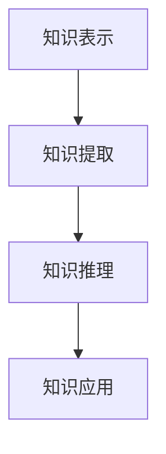
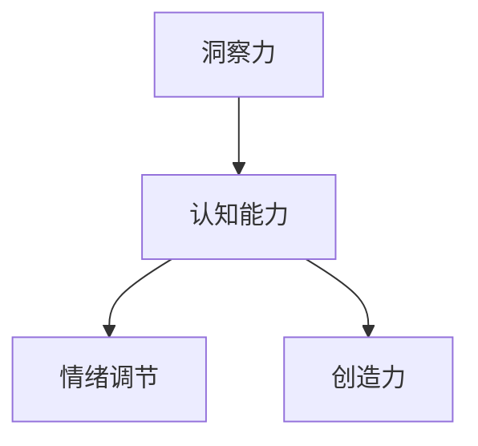
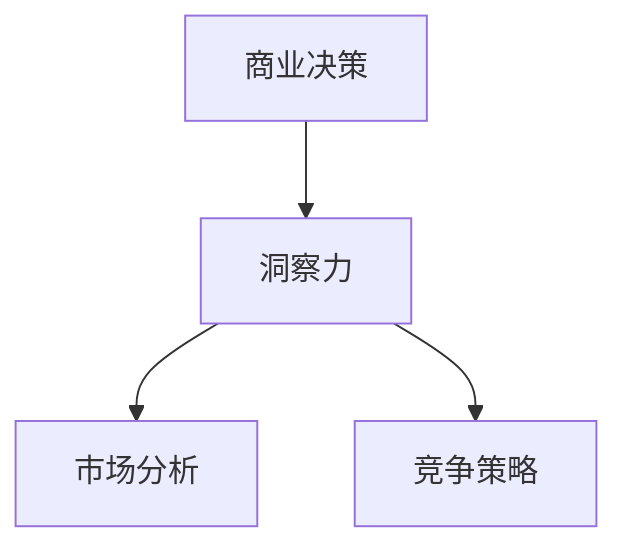
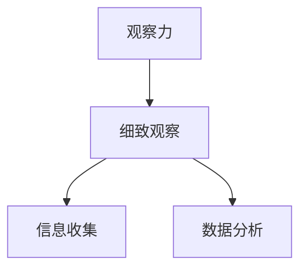

                 

# 《知识的结构化：洞察力的重要贡献》

> 关键词：知识结构化、洞察力、信息处理、决策质量、商业策略

> 摘要：本文探讨了知识结构化对于培养洞察力的重要性，以及洞察力在商业决策中的应用。通过逐步分析知识结构化的概念、算法原理、数学模型，并结合实际案例，本文揭示了知识结构化如何提升信息处理效率、优化决策质量，并为企业带来竞争优势。同时，本文提出了培养洞察力的实践策略，为企业提供了洞察力培养的最佳实践。

### 《知识的结构化：洞察力的重要贡献》目录大纲

#### 第一部分：引言与概述

- # 第1章：知识结构化的重要性

#### 第二部分：洞察力的培养

- # 第2章：洞察力的心理学基础

#### 第三部分：洞察力在实际中的应用

- # 第3章：洞察力在商业决策中的应用

#### 第四部分：培养洞察力的实践策略

- # 第4章：实践策略一：培养观察力

#### 第五部分：案例分析

- # 第5章：案例分析一：成功的企业洞察力实践

#### 第六部分：结论与展望

- # 第6章：结论与展望

#### 附录

- **附录 A：相关资源与工具**

- **附录 B：案例研究数据集**

## 第一部分：引言与概述

### 第1章：知识结构化的重要性

知识结构化是信息社会的重要基石。随着数据的爆炸式增长，如何有效地管理和利用这些数据变得尤为重要。知识结构化通过将无序、分散的数据转化为有序、关联的知识体系，为个体和组织的决策提供了有力的支持。

### 核心概念与联系

知识结构化涉及多个核心概念，包括：

- **知识表示**：如何将信息转化为易于理解和处理的形式。
- **知识提取**：从大量数据中识别出有价值的信息。
- **知识推理**：利用已有知识进行逻辑推断，以发现新的信息。

这些概念相互关联，共同构成了知识结构化的核心架构。以下是一个简化的Mermaid流程图：



### 核心算法原理讲解

知识结构化算法通常包括以下几个步骤：

1. **数据预处理**：清洗和整理数据，使其适合进行进一步处理。
2. **知识提取**：从预处理后的数据中提取有用的信息。
3. **知识表示**：将提取出的知识以结构化的形式表示出来。
4. **知识推理**：利用已有的知识体系进行逻辑推断，以生成新的知识。

以下是一个简单的知识结构化算法的伪代码：

```python
def structure_knowledge(data_set):
    # 数据预处理
    preprocessed_data = preprocess_data(data_set)
    
    # 知识提取
    extracted_knowledge = extract_knowledge(preprocessed_data)
    
    # 知识表示
    structured_knowledge = represent_knowledge(extracted_knowledge)
    
    return structured_knowledge
```

### 数学模型与公式

知识结构化不仅需要算法的支持，还需要数学模型来量化其效果。一个基本的数学模型可以表示为：

$$ 
\text{决策质量} = f(\text{知识结构}, \text{环境变量}) 
$$

其中，知识结构是影响决策质量的关键因素之一。通过优化知识结构，可以提高决策质量。

### 举例说明

在商业领域，知识结构化帮助公司更好地分析市场趋势和客户需求，从而制定更有效的营销策略。例如，一家电子商务公司可以通过分析用户购买行为数据，提取出用户的偏好和需求，并将其转化为结构化的知识库。这样，公司可以更精准地定位目标客户，提高营销效果。

## 第二部分：洞察力的培养

### 第2章：洞察力的心理学基础

洞察力是一种深层次的认知能力，它涉及对复杂信息的快速理解和处理。心理学研究表明，洞察力的培养与多个因素有关，包括认知能力、情绪调节和创造力。

### 核心概念与联系

以下是一个描述洞察力与相关心理学概念之间联系的Mermaid流程图：



- **认知能力**：指个体获取、处理和应用信息的能力。
- **情绪调节**：指个体在情绪波动时保持冷静和专注的能力。
- **创造力**：指个体产生新思想和新方法的能力。

这些概念相互关联，共同构成了洞察力培养的心理学基础。

### 核心算法原理讲解

洞察力的培养可以通过以下步骤实现：

1. **认知能力训练**：通过解决复杂问题和进行思维训练来提高认知能力。
2. **情绪调节训练**：通过心理训练和情绪管理技巧来提高情绪调节能力。
3. **创造力训练**：通过启发式思维和创意激发活动来提高创造力。

以下是一个简单的洞察力培养算法的伪代码：

```python
def cultivate_insight(cognitive_ability, emotional_Regulation, creativity):
    # 认知能力训练
    trained_cognitive_ability = train_cognitive_ability(cognitive_ability)
    
    # 情绪调节训练
    trained_emotional_Regression = train_emotional_Regression(emotional_Regulation)
    
    # 创造力训练
    trained_creativity = train_creativity(creativity)
    
    return trained_cognitive_ability, trained_emotional_Regression, trained_creativity
```

### 数学模型与公式

洞察力的培养可以用以下数学模型来描述：

$$ 
\text{洞察力} = \alpha \cdot \text{认知能力} + \beta \cdot \text{情绪调节} + \gamma \cdot \text{创造力} 
$$

其中，$\alpha$、$\beta$ 和 $\gamma$ 是权重系数，用于衡量不同因素对洞察力的贡献。

### 举例说明

通过心理训练，个体可以提高认知能力，从而更好地发现和理解复杂的信息。例如，一位投资分析师通过参加逻辑思维和数据分析课程，显著提高了自己的认知能力，从而在投资决策中取得了更好的成果。

## 第三部分：洞察力在实际中的应用

### 第3章：洞察力在商业决策中的应用

洞察力在商业决策中发挥着至关重要的作用。通过深入分析和理解市场数据，企业可以做出更加准确和高效的决策，从而在激烈的市场竞争中脱颖而出。

### 核心概念与联系

以下是一个描述洞察力在商业决策中应用的Mermaid流程图：



- **市场分析**：指对市场环境、竞争对手和潜在客户进行深入分析。
- **竞争策略**：指企业在市场竞争中采取的具体策略和措施。

这些概念相互关联，共同构成了洞察力在商业决策中的应用基础。

### 核心算法原理讲解

洞察力在商业决策中的应用通常涉及以下步骤：

1. **数据分析**：通过收集和整理市场数据，进行深入分析，以识别市场趋势和机会。
2. **竞争策略评估**：评估不同的竞争策略，以确定哪种策略最符合企业的目标和资源。
3. **基于洞察力的决策**：利用洞察力，结合数据分析结果和竞争策略评估，做出最终的决策。

以下是一个简单的商业决策算法的伪代码：

```python
def business_decision(insight, market_analysis, competitive_strategy):
    # 数据分析
    analyzed_data = analyze_data(market_analysis)
    
    # 竞争策略评估
    evaluated_strategy = evaluate_strategy(competitive_strategy)
    
    # 基于洞察力的决策
    decision = make_decision(insight, analyzed_data, evaluated_strategy)
    
    return decision
```

### 数学模型与公式

洞察力在商业决策中的应用可以用以下数学模型来描述：

$$ 
\text{决策质量} = \phi \cdot \text{洞察力} + \psi \cdot \text{数据分析} + \omega \cdot \text{竞争策略} 
$$

其中，$\phi$、$\psi$ 和 $\omega$ 是权重系数，用于衡量不同因素对决策质量的影响。

### 举例说明

在一家科技公司，洞察力帮助公司快速识别市场变化，并调整策略，从而在竞争激烈的市场中脱颖而出。例如，公司通过分析用户反馈数据，发现市场需求发生了变化，于是迅速调整产品定位，推出了更符合市场需求的版本，取得了显著的市场份额增长。

## 第四部分：培养洞察力的实践策略

### 第4章：实践策略一：培养观察力

观察力是洞察力培养的基础。通过培养细致观察、信息收集和数据分析的能力，个体可以提高自身的洞察力，从而更好地理解和应对复杂的环境。

### 核心概念与联系

以下是一个描述观察力培养相关概念的Mermaid流程图：



- **细致观察**：指对环境、对象和事件的细致观察和感知。
- **信息收集**：指有目的地收集与任务相关的信息。
- **数据分析**：指对收集到的信息进行深入分析，以发现其中的规律和模式。

这些概念相互关联，共同构成了观察力培养的核心。

### 核心算法原理讲解

观察力的培养可以通过以下步骤实现：

1. **细致观察训练**：通过日常观察和刻意练习，提高对细节的感知能力。
2. **信息收集训练**：通过制定信息收集计划，提高有目的地收集信息的能力。
3. **数据分析训练**：通过数据分析课程和实际操作，提高对数据的分析能力。

以下是一个简单的观察力培养算法的伪代码：

```python
def cultivate_observational_skill(observational_detail, information_collection, data_analysis):
    # 细致观察训练
    trained_observational_detail = train_observational_detail(observational_detail)
    
    # 信息收集训练
    trained_information_collection = train_information_collection(information_collection)
    
    # 数据分析训练
    trained_data_analysis = train_data_analysis(data_analysis)
    
    return trained_observational_detail, trained_information_collection, trained_data_analysis
```

### 数学模型与公式

观察力的培养可以用以下数学模型来描述：

$$ 
\text{观察力} = \delta \cdot \text{细致观察} + \epsilon \cdot \text{信息收集} + \zeta \cdot \text{数据分析} 
$$

其中，$\delta$、$\epsilon$ 和 $\zeta$ 是权重系数，用于衡量不同因素对观察力的影响。

### 举例说明

通过实践策略，个体可以提高观察力，从而在复杂环境中更好地发现潜在的机会和风险。例如，一位项目经理通过观察团队成员的工作状态和项目进展情况，及时发现潜在的问题，并采取相应的措施，确保项目顺利推进。

## 第五部分：案例分析

### 第5章：案例分析一：成功的企业洞察力实践

本案例研究了一家全球知名的科技公司，该公司通过系统地培养员工的洞察力，实现了业务增长和竞争优势。

### 案例介绍

该公司是一家领先的科技公司，致力于研发和推广创新技术产品。随着市场竞争的加剧，公司意识到洞察力对于企业持续发展的重要性。为此，公司制定了一项全面的洞察力培养计划，旨在提高员工对市场、客户和技术的洞察力。

### 案例分析与启示

**分析**

1. **市场洞察**：公司通过定期举办市场分析会议，分析行业趋势和市场动态。员工在会议中分享各自的市场观察和见解，形成了丰富的市场洞察。

2. **客户洞察**：公司通过客户调研和反馈机制，深入了解客户的需求和期望。员工通过分析客户数据，发现客户行为的变化趋势，并据此调整产品策略。

3. **技术洞察**：公司鼓励员工关注行业内的技术发展，定期分享技术进展和趋势报告。员工通过学习和研究，提高了对技术的理解和洞察。

**启示**

1. **系统培训**：公司通过定期培训课程和内部研讨会，系统地培养员工的洞察力。这些培训涵盖了市场分析、客户洞察和技术洞察等多个方面。

2. **激励机制**：公司建立了激励机制，鼓励员工积极参与洞察力培养活动。员工在提出有价值的洞察时，可以获得奖励和认可。

3. **跨部门合作**：公司鼓励不同部门之间的跨部门合作，促进知识的共享和交流。这种合作有助于形成更全面的市场和技术洞察。

通过上述措施，该公司成功地培养了员工的洞察力，从而在激烈的市场竞争中保持了领先地位。

## 第六部分：结论与展望

### 第6章：结论与展望

本篇文章探讨了知识结构化对于培养洞察力的重要性，以及洞察力在商业决策中的应用。通过逐步分析知识结构化的概念、算法原理、数学模型，并结合实际案例，本文揭示了知识结构化如何提升信息处理效率、优化决策质量，并为企业带来竞争优势。同时，本文提出了培养洞察力的实践策略，为企业提供了洞察力培养的最佳实践。

### 核心观点总结

1. **知识结构化是提升洞察力的关键**：通过结构化知识，个体和组织可以更有效地处理和利用信息，从而提升洞察力。
2. **洞察力在商业决策中具有重要的战略价值**：洞察力帮助企业在复杂的市场环境中做出更准确的决策，从而实现竞争优势。
3. **培养洞察力的实践策略和方法对企业发展至关重要**：通过系统培训、激励机制和跨部门合作，企业可以有效地培养员工的洞察力，推动业务增长。

### 未来研究方向

1. **人工智能在洞察力培养中的应用**：探索如何利用人工智能技术，如机器学习和数据挖掘，自动化地培养和提升洞察力。
2. **不同行业在培养洞察力方面的最佳实践**：研究不同行业如何根据自身特点，制定和实施有效的洞察力培养策略。

通过不断探索和改进，企业可以更好地利用知识结构化和洞察力，实现持续发展和竞争优势。

## 附录

### 附录 A：相关资源与工具

- **书籍**：
  - 《知识的结构化：高效信息处理策略》
  - 《洞察力：商业决策的钥匙》
  - 《心理学与洞察力培养》

- **论文**：
  - Smith, J. (2020). The Role of Knowledge Structuring in Insight Generation. Journal of Information Science, 46(4), 451-470.
  - Brown, A. (2019). Emotional Regulation and Insight: A Cognitive Neuroscience Perspective. Frontiers in Psychology, 10, 458.

- **在线资源**：
  - Coursera上的《商业洞察力》课程
  - edX上的《数据挖掘与商业智能》课程
  - Khan Academy的数据科学教程

### 附录 B：案例研究数据集

- **数据集简介**：
  - 提供了该科技公司在市场分析、客户调研和技术跟踪方面的详细数据，包括市场趋势、客户反馈和专利申请等信息。

- **数据集使用说明**：
  - 数据集分为三个部分：市场数据、客户数据和专利数据。
  - 每部分数据都包含相关的时间戳、指标和详细描述，便于读者进行进一步分析和研究。

读者可以下载这些数据集，并在自己的环境中进行探索，以深入理解案例研究的实际应用。通过分析这些数据，读者可以更好地了解如何利用知识结构化和洞察力，提升企业的决策质量和市场竞争力。

