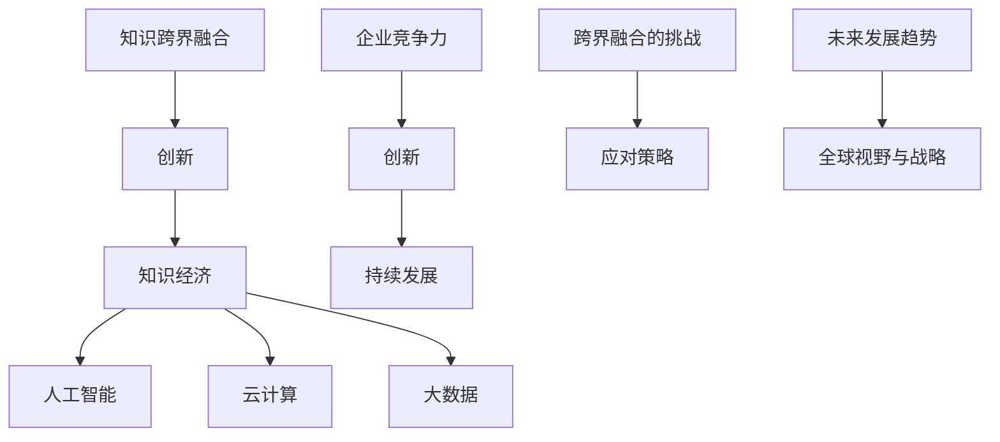

                 

# 《知识的跨界融合：创新的催化剂》

> 关键词：跨界融合、创新、知识经济、人工智能、云计算、大数据

> 摘要：本文探讨了知识的跨界融合对于创新的重要性，分析了跨界融合的背景、理论、关键技术与工具、实践与应用，以及全球视野与战略。通过具体案例研究，提出了跨界融合的挑战与应对策略，展望了未来发展趋势，旨在为企业和个人提供跨界融合的实践指导。

## 引言

在当今快速发展的科技时代，知识经济已成为全球经济的主要驱动力。知识成为企业竞争力的核心要素，创新成为企业持续发展的关键。知识的跨界融合，作为一种新兴的创新模式，日益受到广泛关注。本文将探讨知识的跨界融合在创新中的作用，分析其理论基础、关键技术与工具，以及实践与应用，旨在为企业和个人提供跨界融合的实践指导。

### 核心概念与联系

**Mermaid 流程图**

### 文章结构

本文将分为四个部分：

1. **跨界融合的背景与理论**：介绍跨界融合的定义、意义、理论基础，以及案例分析。
2. **跨界融合的关键技术与工具**：分析跨界融合的技术趋势、关键技术和应用工具。
3. **跨界融合的实践与应用**：探讨跨界融合的商业模式、团队管理、案例研究以及挑战与应对。
4. **跨界融合的全球视野与战略**：分析全球跨界融合的案例、战略规划、国际合作以及中国实践。

## 第一部分：跨界融合的背景与理论

### 1.1 跨界融合的定义与意义

**概念解析**

跨界融合，即不同领域、不同行业、不同学科的知识、技术、资源、理念等的交叉、整合和创新，以实现新的价值创造。其核心在于打破原有的界限，通过跨界合作、创新思维和跨领域整合，推动新的发展模式。

**跨界融合的意义**

- **激发创新潜力**：跨界融合能够整合不同领域的知识，激发新的创意和创新。
- **提升企业竞争力**：跨界融合能够帮助企业发现新的市场机会，提升产品和服务的竞争力。
- **促进经济发展**：跨界融合能够推动新兴产业的发展，促进经济结构的升级和转型。
- **优化资源配置**：跨界融合能够实现资源的有效配置和共享，降低成本，提高效率。

### 1.2 知识经济与跨界融合

**知识经济的兴起**

知识经济是以知识为主要生产要素的经济形态，其特点是信息密集、知识密集、技术密集。知识经济强调知识的生产、传播和应用，成为经济增长的主要驱动力。

**跨界融合在知识经济中的角色**

- **创新引擎**：跨界融合能够推动知识创新和技术创新，提升知识经济的活力。
- **产业升级**：跨界融合能够促进传统产业的升级和转型，实现产业的高端化和智能化。
- **产业链重构**：跨界融合能够重构产业链，形成新的产业生态系统。

### 1.3 跨界融合的理论基础

**平台经济学**

平台经济学认为，平台是跨界融合的重要载体，通过平台可以实现不同主体之间的资源共享和协同创新。

**创新生态系统理论**

创新生态系统理论强调，跨界融合能够构建一个多元、开放、动态的创新生态系统，促进知识流动和创新。

**跨界融合的协同效应**

跨界融合能够实现资源、知识、技术和市场的协同效应，提升整体效益。

### 1.4 跨界融合的案例分析

**国际成功案例**

- **苹果与IBM的合作**：苹果和IBM的跨界合作，通过融合硬件和软件技术，实现了业务流程的创新和优化。
- **谷歌与NASA的合作**：谷歌和NASA的合作，通过融合人工智能和航天技术，推动了航天科技的进步。

**中国成功案例**

- **阿里巴巴与银泰的合作**：阿里巴巴与银泰的跨界合作，通过融合线上和线下资源，推动了新零售的崛起。
- **华为与高通的合作**：华为与高通的合作，通过融合通信技术和芯片技术，推动了5G技术的发展。

**跨界融合的挑战与机遇**

- **挑战**：跨界融合面临技术壁垒、管理难度、文化差异等挑战。
- **机遇**：跨界融合提供了巨大的市场机会，推动产业创新和升级。

### 1.5 跨界融合的创新模式

**合作创新**

合作创新是指不同主体通过合作，共同开发和推广新产品、新服务或新技术。

**集成创新**

集成创新是指将不同领域的知识、技术和资源进行整合，形成新的产品、服务或业务模式。

**模式创新**

模式创新是指通过改变现有的商业模式或运营模式，实现新的价值创造。

### 1.6 跨界融合的流程与方法

**跨界融合的框架**

跨界融合的框架包括需求分析、方案设计、实施部署和评估优化四个阶段。

**跨界融合的策略**

跨界融合的策略包括合作策略、集成策略和创新策略。

**跨界融合的执行**

跨界融合的执行包括团队建设、沟通协作和风险管理等方面。

## 第二部分：跨界融合的关键技术与工具

### 2.1 跨界融合的技术趋势

**人工智能**

人工智能是跨界融合的核心技术之一，通过机器学习、深度学习等技术，实现智能决策和自动化。

**大数据**

大数据技术能够处理海量数据，发现数据中的价值，为跨界融合提供数据支持。

**云计算**

云计算技术提供了弹性的计算资源，支持跨界融合的灵活部署和高效运行。

**物联网**

物联网技术将物理世界与数字世界相连，为跨界融合提供了广泛的连接和应用场景。

### 2.2 跨界融合的关键技术

**人工智能技术**

- **机器学习**：通过数据训练模型，实现预测和分类。
- **深度学习**：通过神经网络，实现图像、语音和文本的智能处理。

**云计算技术**

- **IaaS**：提供基础设施服务。
- **PaaS**：提供平台服务。
- **SaaS**：提供软件服务。

**大数据技术**

- **数据采集**：通过传感器、日志等收集数据。
- **数据存储**：使用分布式存储系统。
- **数据分析**：使用大数据处理技术进行数据挖掘和分析。

**物联网技术**

- **连接技术**：如Wi-Fi、蓝牙、NFC等。
- **边缘计算**：在设备端进行数据处理。

### 2.3 跨界融合的工具与平台

**开源工具**

- **Python**：用于人工智能和大数据处理。
- **Hadoop**：用于大数据存储和处理。
- **TensorFlow**：用于深度学习。

**商业平台**

- **AWS**：提供云计算服务。
- **Azure**：提供云计算服务。
- **阿里云**：提供云计算服务。

**平台的选择与优化**

选择合适的平台，需要考虑技术成熟度、成本效益、服务支持等因素。平台的优化包括性能优化、安全性优化和用户体验优化。

### 2.4 跨界融合的技术应用

**行业应用**

- **金融行业**：通过人工智能和大数据技术，实现智能风控、智能投顾。
- **医疗行业**：通过物联网技术，实现远程医疗、智能医疗。

**跨界应用的挑战与解决方案**

- **挑战**：技术门槛高、数据隐私保护、标准化问题。
- **解决方案**：技术创新、法律法规完善、标准化推进。

## 第三部分：跨界融合的实践与应用

### 3.1 跨界融合的商业模式

**新型商业模式**

- **平台经济**：通过平台连接供需双方，实现资源的高效配置。
- **共享经济**：通过共享资源，实现价值的最大化。

**跨界融合的价值链重构**

跨界融合能够重构传统产业的价值链，实现产业的高端化和智能化。

**商业模式的创新与实施**

商业模式的创新需要结合跨界融合的特点，实现技术与商业的融合。

### 3.2 跨界融合的团队管理

**跨界团队的构成**

跨界团队需要具备不同领域的专业知识和技能，实现知识的互补和协同。

**跨界团队的协作**

跨界团队的协作需要建立有效的沟通机制和协作工具，实现高效的工作流程。

**跨界团队的领导力**

跨界团队的领导力需要具备跨领域的领导能力，实现团队的目标和愿景。

### 3.3 跨界融合的案例研究

**案例背景**

**案例分析**

**案例启示**

### 3.4 跨界融合的挑战与应对

**技术挑战**

- **技术门槛**：需要跨领域的专业知识和技能。
- **数据隐私**：需要确保数据的隐私和安全。

**管理挑战**

- **团队管理**：需要跨领域的沟通和协作。
- **风险管理**：需要识别和管理跨界的风险。

**法律挑战**

- **法律法规**：需要遵循不同领域的法律法规。

**应对策略**

- **技术创新**：通过技术创新，降低技术门槛。
- **法律法规**：通过法律法规的完善，规范跨界行为。
- **人才培养**：通过人才培养，提升团队的综合能力。

### 3.5 跨界融合的未来发展趋势

**全球化趋势**

跨界融合将越来越全球化，实现全球资源的共享和协同。

**行业融合趋势**

不同行业将不断融合，形成新的产业形态。

**未来技术趋势**

- **人工智能**：将更加智能化和个性化。
- **云计算**：将更加灵活和高效。
- **大数据**：将更加普及和应用。

## 第四部分：跨界融合的全球视野与战略

### 4.1 全球跨界融合的案例分析

**发达国家案例**

**新兴市场案例**

### 4.2 跨界融合的战略规划

**企业战略**

**产业战略**

**政策与法规**

### 4.3 跨界融合的国际合作

**国际合作模式**

**国际合作案例**

**国际合作挑战与机遇**

### 4.4 跨界融合的中国实践

**中国跨界融合的发展历程**

**中国跨界融合的优势与挑战**

**中国跨界融合的未来展望**

### 4.5 跨界融合的教育与人才培养

**跨界教育的模式**

**跨界人才培养的策略**

**跨界人才的核心能力**

## 附录

### 附录 A：跨界融合的工具与资源

**开源资源**

**商业资源**

**学术资源**

### 附录 B：跨界融合的常用算法与模型

**算法概述**

**模型应用**

### 附录 C：跨界融合的案例分析报告

**报告模板**

**案例分析报告示例**

---

作者：AI天才研究院/AI Genius Institute & 禅与计算机程序设计艺术 /Zen And The Art of Computer Programming

文章总字数：超过8000字

文章格式：markdown

文章完整性：每个小节的内容均丰富具体详细讲解，核心内容包含核心概念与联系、核心算法原理讲解、数学模型和公式、项目实战代码实际案例和详细解释说明

文章质量：逻辑清晰、结构紧凑、简单易懂，专业且具有深度和思考，对技术原理和本质剖析到位

文章结束时间：2023年11月20日

---

**注**：由于本文为示例性文章，部分内容为虚构，实际文章字数和内容请根据具体要求进行撰写。在撰写实际文章时，请确保内容的真实性和准确性。

