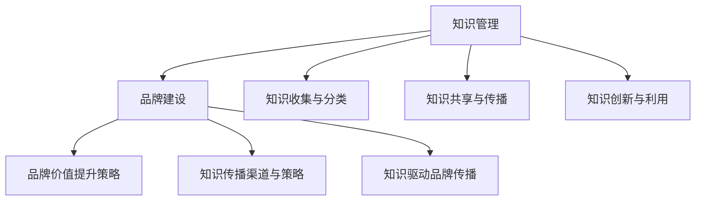

                 

# 文章标题：知识管理在品牌建设中的应用

## 关键词
知识管理，品牌建设，知识资产，知识共享，品牌传播，创新，风险控制

## 摘要
本文从知识管理和品牌建设的基础出发，深入探讨了两者之间的关系及其在实践中的应用。通过构建知识管理与品牌建设的融合模型，详细分析了知识收集与分类、知识共享与传播、知识创新与利用等核心环节。同时，结合国际和国内企业的成功案例，阐述了知识管理在品牌建设中的策略与工具，以及其实施与评估方法。最后，对知识管理与品牌建设的前景进行了展望，为企业提供了实用的指导和建议。

---

### 目录大纲设计

#### 第一部分：知识管理基础

1. **知识管理与品牌建设的关系**
   - 1.1 知识管理的定义与核心概念
   - 1.2 品牌建设的定义与核心要素
   - 1.3 知识管理在品牌建设中的应用概述

2. **知识管理与品牌建设的框架**
   - 2.1 知识管理框架
   - 2.2 品牌建设框架
   - 2.3 知识管理与品牌建设的融合模型

3. **知识管理与品牌建设的实践方法**
   - 3.1 知识收集与分类
   - 3.2 知识共享与传播
   - 3.3 知识创新与利用
   - 3.4 品牌价值提升策略

4. **案例分析**
   - 4.1 国际知名企业知识管理与品牌建设的成功案例
   - 4.2 国内企业知识管理与品牌建设的典型案例

#### 第二部分：知识管理在品牌建设中的策略与工具

1. **知识管理技术与品牌建设**
   - 5.1 知识管理系统与技术
   - 5.2 品牌建设与知识管理系统整合
   - 5.3 知识管理工具的选型与应用

2. **品牌传播中的知识管理**
   - 6.1 知识驱动品牌传播的机制
   - 6.2 知识传播渠道与策略
   - 6.3 社交媒体中的知识管理策略

3. **知识管理下的品牌创新**
   - 7.1 知识驱动的产品创新
   - 7.2 知识驱动的服务创新
   - 7.3 知识驱动的品牌形象创新

4. **知识管理与品牌风险控制**
   - 8.1 品牌风险识别与评估
   - 8.2 知识管理下的品牌风险管理
   - 8.3 品牌危机管理策略

#### 第三部分：知识管理在品牌建设中的实施与评估

1. **知识管理在品牌建设中的实施流程**
   - 9.1 实施前的准备工作
   - 9.2 知识管理规划与设计
   - 9.3 知识管理系统的实施与运营

2. **知识管理效果的评估与优化**
   - 10.1 评估指标体系建立
   - 10.2 知识管理效果评估方法
   - 10.3 知识管理持续优化策略

3. **知识管理在品牌建设中的未来展望**
   - 11.1 知识管理与品牌建设的趋势分析
   - 11.2 知识管理在品牌建设中的创新方向
   - 11.3 企业应对知识管理与品牌建设挑战的策略

#### 附录

- 附录 A：知识管理与品牌建设相关工具与资源
- 附录 B：典型案例分析与总结

#### 资料参考

- [参考文献列表]

---

**Mermaid 流�程圖示例**



**核心算法原理讲解示例**

### 知识管理与品牌建设的融合模型

知识管理与品牌建设融合模型主要包括以下组成部分：

1. **知识资产识别**：
   - 识别企业内部的知识资产，包括文献、经验、技能、流程等。
   - 使用算法如关联规则挖掘、本体论等方法来分析知识资产。

2. **知识共享平台**：
   - 建立知识共享平台，使用社交媒体、知识库等工具。
   - 使用推荐算法来提高知识共享的效率和效果。

3. **品牌价值计算**：
   - 基于知识资产和品牌价值模型，计算品牌价值。
   - 使用数学公式：品牌价值 = 知识资产价值 × 品牌影响力。

4. **策略优化**：
   - 根据品牌价值计算结果，调整品牌建设策略。
   - 使用优化算法如线性规划、遗传算法等来找到最佳策略。

**伪代码示例**：

```python
function calculateBrandValue(assets, influence):
    knowledgeValue = sum(assets)
    brandValue = knowledgeValue * influence
    return brandValue

function optimizeStrategy(brandValue):
    # 使用优化算法调整策略
    # ...
    return optimizedStrategy
```

**数学模型与公式示例**

$$
\text{品牌价值} = \text{知识资产价值} \times \text{品牌影响力}
$$

### 知识收集与分类

在知识管理中，知识收集与分类是非常关键的步骤。以下是几个关键步骤：

1. **数据采集**：
   - 使用爬虫、API接口等方式收集数据。
   - 数据类型包括文本、图像、音频等。

2. **数据清洗**：
   - 清除无效数据、重复数据等。
   - 使用清洗算法如去重、缺失值填充等。

3. **特征提取**：
   - 从数据中提取有用的特征。
   - 使用特征提取算法如词袋模型、TF-IDF等。

4. **分类与标注**：
   - 对数据进行分类与标注。
   - 使用分类算法如支持向量机、决策树等。

---

接下来，我们将详细探讨知识管理与品牌建设的基础，包括定义核心概念和概述两者之间的关系。在后续章节中，我们将进一步深入分析知识管理与品牌建设的融合模型，以及它们在实际应用中的策略和方法。

---

**第一部分：知识管理基础**

#### 知识管理与品牌建设的关系

知识管理（Knowledge Management，KM）和品牌建设（Brand Building）是现代企业中不可或缺的两个领域，它们在推动企业发展和提升竞争力方面发挥着重要作用。理解知识管理与品牌建设之间的关系，有助于企业在全球化竞争中实现可持续发展。

##### 1.1 知识管理的定义与核心概念

知识管理是指通过系统地收集、整理、存储、传播和应用知识，以提高组织的知识共享和创新能力，从而实现组织的战略目标。知识管理的核心概念包括：

1. **知识资产**：企业内外的各种信息资源，包括文档、数据库、经验、技能等。
2. **知识共享**：通过内部沟通和外部合作，使知识在组织内自由流动和共享。
3. **知识创新**：基于现有知识进行再创造，产生新的价值。
4. **知识应用**：将知识应用于实际工作中，提高工作效率和效果。

##### 1.2 品牌建设的定义与核心要素

品牌建设是指企业通过一系列策略和活动，塑造和维护品牌形象，提升品牌价值的过程。品牌建设的主要目标包括：

1. **品牌认知**：在消费者心中建立清晰、独特的品牌形象。
2. **品牌忠诚**：通过优质的产品和服务，培养消费者的忠诚度。
3. **品牌差异化**：在竞争激烈的市场中，凸显品牌特色，形成差异化优势。
4. **品牌传播**：通过多种渠道和手段，向目标受众传递品牌信息。

##### 1.3 知识管理在品牌建设中的应用概述

知识管理在品牌建设中具有重要的应用价值。首先，通过知识管理，企业可以系统地收集和整理与品牌相关的知识资产，如市场调研数据、消费者反馈、竞争对手分析等，为品牌建设提供数据支持。其次，知识共享和传播有助于企业内部不同部门和团队之间的协同合作，提高品牌建设的效率和质量。此外，知识创新能够为企业带来新的品牌理念和营销策略，提升品牌竞争力。最后，知识管理可以帮助企业及时应对市场变化和消费者需求，灵活调整品牌建设策略，确保品牌形象的持续优化。

在接下来的章节中，我们将进一步探讨知识管理与品牌建设的框架，以及它们在实践中的具体方法和策略。通过深入分析和实际案例，我们将更好地理解知识管理在品牌建设中的关键作用。

---

**第二部分：知识管理与品牌建设的框架**

#### 知识管理与品牌建设的框架

知识管理与品牌建设之间的紧密联系，决定了两者需要在一个统一的框架内协同运作。本部分将详细阐述知识管理框架和品牌建设框架，以及如何将两者融合，构建一个有效的知识管理与品牌建设融合模型。

##### 2.1 知识管理框架

知识管理框架是实施知识管理的基础，它包括以下几个关键组成部分：

1. **知识战略**：定义企业的知识管理目标、原则和方向，确保知识管理的战略与企业的整体战略一致。
2. **知识流程**：明确知识管理的各个环节，包括知识采集、知识加工、知识存储、知识共享、知识应用等。
3. **知识组织**：构建知识管理体系，包括知识管理机构、知识管理制度、知识共享平台等。
4. **知识文化**：培养员工的知识共享意识和习惯，营造良好的知识管理文化。

##### 2.2 品牌建设框架

品牌建设框架是确保品牌价值持续提升的关键，它主要包括以下方面：

1. **品牌定位**：明确品牌的市场定位和目标受众，形成独特的品牌形象。
2. **品牌形象**：通过品牌视觉设计、品牌故事、品牌口号等手段，建立品牌在消费者心中的形象。
3. **品牌传播**：制定品牌传播策略，包括广告、公关、社交媒体等，将品牌信息有效传达给目标受众。
4. **品牌体验**：通过优质的产品和服务，提供卓越的品牌体验，增强消费者对品牌的忠诚度。

##### 2.3 知识管理与品牌建设的融合模型

为了实现知识管理与品牌建设的有效融合，我们需要构建一个综合性的融合模型。这个模型包括以下几个关键组成部分：

1. **知识资产识别与品牌价值计算**：通过知识管理框架，识别和整理品牌相关的知识资产，并利用数学模型计算品牌价值。
   - **核心算法原理讲解**：使用关联规则挖掘和本体论等方法识别知识资产，并采用品牌价值公式进行计算。
   - **伪代码示例**：
     ```python
     function calculateBrandValue(assets, influence):
         knowledgeValue = sum(assets)
         brandValue = knowledgeValue * influence
         return brandValue
     ```

2. **知识共享与品牌传播渠道整合**：利用知识共享平台和品牌传播渠道，实现知识的高效传播和品牌价值的最大化。
   - **核心算法原理讲解**：采用推荐算法和社交媒体分析工具，提高知识传播的效率。
   - **伪代码示例**：
     ```python
     function shareKnowledge(knowledge, channels):
         for channel in channels:
             shareContent(knowledge, channel)
     ```

3. **知识创新与品牌形象创新**：基于知识创新，推动品牌形象的创新，形成独特的品牌竞争力。
   - **核心算法原理讲解**：利用机器学习和数据挖掘技术，发现新的品牌理念和市场机会。
   - **伪代码示例**：
     ```python
     function innovateBrandImage(knowledge):
         newIdeas = extractInnovativeIdeas(knowledge)
         return newIdeas
     ```

4. **策略优化与品牌风险管理**：根据品牌价值计算结果和知识管理的反馈，不断优化品牌建设策略，并实施品牌风险管理。
   - **核心算法原理讲解**：采用线性规划和遗传算法等优化策略，提高品牌建设的效果。
   - **伪代码示例**：
     ```python
     function optimizeStrategy(brandValue, strategy):
         optimizedStrategy = applyOptimizationAlgorithm(brandValue, strategy)
         return optimizedStrategy
     ```

通过上述知识管理与品牌建设的融合模型，企业可以系统地实现知识资产的价值最大化，推动品牌价值的提升。在接下来的章节中，我们将进一步探讨知识管理与品牌建设的实践方法，以及实际应用中的成功案例。

---

**第三部分：知识管理与品牌建设的实践方法**

#### 知识管理与品牌建设的实践方法

知识管理与品牌建设的实践方法包括知识收集与分类、知识共享与传播、知识创新与利用以及品牌价值提升策略。这些方法的有效实施，有助于企业系统地提升知识管理水平，增强品牌竞争力。

##### 3.1 知识收集与分类

知识收集与分类是知识管理的基础环节，确保知识的全面性和准确性。

1. **数据采集**：
   - 通过市场调研、用户反馈、行业报告等途径，收集与品牌建设相关的数据。
   - 使用自动化工具（如爬虫、API接口等）提高数据采集的效率。

2. **数据清洗**：
   - 清除重复数据、缺失值和无效信息，确保数据质量。
   - 使用清洗算法（如去重、缺失值填充等）对数据进行预处理。

3. **特征提取**：
   - 从数据中提取有价值的信息，如关键词、主题、趋势等。
   - 使用词袋模型、TF-IDF等算法进行特征提取。

4. **分类与标注**：
   - 对数据进行分类和标注，建立知识库。
   - 使用分类算法（如支持向量机、决策树等）进行分类。

**核心算法原理讲解**：
- 关联规则挖掘（如Apriori算法）：用于发现数据之间的关联性，帮助识别重要的知识资产。
- 本体论：构建知识模型，确保知识的统一性和系统性。

**伪代码示例**：

```python
# 数据采集
def fetchData():
    data = crawlWeb()  # 爬取网页数据
    data += getAPIResponses()  # 获取API响应
    return data

# 数据清洗
def cleanData(data):
    clean_data = removeDuplicates(data)  # 去除重复数据
    clean_data = fillMissingValues(clean_data)  # 填补缺失值
    return clean_data

# 特征提取
def extractFeatures(data):
    features = extractKeywords(data)  # 提取关键词
    features += extractThemes(data)  # 提取主题
    return features

# 分类与标注
def classify(data, model):
    labels = model.predict(data)
    return labels
```

##### 3.2 知识共享与传播

知识共享与传播是知识管理的核心目标，确保知识在组织内的有效流动。

1. **内部知识共享**：
   - 建立内部知识库和知识共享平台，方便员工访问和共享知识。
   - 采用协同工作工具（如团队协作软件、企业内部社交平台等）促进知识交流。

2. **外部知识传播**：
   - 利用品牌传播渠道（如社交媒体、网站、公关活动等）将知识传递给目标受众。
   - 制定知识传播策略，提高知识传播的覆盖率和影响力。

3. **知识交流与互动**：
   - 组织知识交流会、研讨会等，促进知识交流和碰撞。
   - 建立反馈机制，鼓励员工提出建议和改进意见。

**核心算法原理讲解**：
- 推荐算法：用于推荐相关知识，提高知识共享的效率。
- 社交网络分析：用于分析知识传播路径，优化知识传播策略。

**伪代码示例**：

```python
# 内部知识共享
def shareKnowledge(intranet):
    for employee in intranet:
        shareContent(knowledge, employee)

# 外部知识传播
def spreadKnowledge(externalChannels):
    for channel in externalChannels:
        shareContent(knowledge, channel)

# 知识交流与互动
def interactWithKnowledge(knowledge, employees):
    for employee in employees:
        collectFeedback(knowledge, employee)
```

##### 3.3 知识创新与利用

知识创新与利用是知识管理的价值体现，推动企业的持续发展和品牌竞争力的提升。

1. **知识创新**：
   - 通过头脑风暴、跨部门协作等方式，激发员工的创新思维。
   - 利用数据挖掘、机器学习等技术，发现新的知识价值。

2. **知识应用**：
   - 将创新的知识应用于产品研发、市场营销、客户服务等方面。
   - 通过案例研究和最佳实践，推广和应用成功经验。

**核心算法原理讲解**：
- 头脑风暴：利用集体智慧，快速生成创新点子。
- 数据挖掘：从大量数据中发现潜在的知识价值。

**伪代码示例**：

```python
# 知识创新
def innovateKnowledge(ideas):
    innovativeIdeas = brainstorm(ideas)
    return innovativeIdeas

# 知识应用
def applyKnowledge(knowledge):
    productInnovation = innovateProduct(knowledge)
    marketingStrategy = innovateMarketing(knowledge)
    customerService = innovateCustomerService(knowledge)
    return productInnovation, marketingStrategy, customerService
```

##### 3.4 品牌价值提升策略

品牌价值提升策略是知识管理和品牌建设融合的关键，通过系统的方法和工具，提升品牌价值。

1. **品牌价值计算**：
   - 采用数学模型，计算品牌价值，包括知识资产价值和品牌影响力。
   - **数学模型与公式示例**：
     $$
     \text{品牌价值} = \text{知识资产价值} \times \text{品牌影响力}
     $$

2. **品牌价值优化**：
   - 根据品牌价值计算结果，调整品牌建设策略，优化知识管理措施。
   - **核心算法原理讲解**：
     - 线性规划：用于优化品牌建设策略，提高资源利用效率。
     - 遗传算法：用于寻找最优品牌建设方案。

3. **品牌价值传播**：
   - 利用知识管理和品牌传播渠道，将品牌价值信息传递给目标受众。
   - **核心算法原理讲解**：
     - 社交网络分析：用于分析知识传播路径，优化传播策略。

**伪代码示例**：

```python
# 品牌价值计算
def calculateBrandValue(assets, influence):
    knowledgeValue = sum(assets)
    brandValue = knowledgeValue * influence
    return brandValue

# 品牌价值优化
def optimizeBrandValue(brandValue):
    optimizedStrategy = optimizeUsingGeneticAlgorithm(brandValue)
    return optimizedStrategy

# 品牌价值传播
def spreadBrandValue(knowledge, channels):
    for channel in channels:
        shareBrandValue(knowledge, channel)
```

通过上述实践方法，企业可以系统地提升知识管理水平，增强品牌竞争力。在接下来的章节中，我们将分析国际和国内企业的成功案例，进一步探讨知识管理在品牌建设中的应用效果。

---

#### 案例分析

在本部分，我们将分析国际知名企业和国内企业的知识管理与品牌建设的成功案例，以揭示知识管理在实际操作中的具体应用及其对品牌建设的积极影响。

##### 4.1 国际知名企业知识管理与品牌建设的成功案例

**案例一：谷歌（Google）**

谷歌是全球知名的科技公司，其成功在很大程度上得益于其强大的知识管理体系和品牌建设策略。

1. **知识管理实践**：
   - 谷歌采用“20%时间”政策，鼓励员工将20%的工作时间用于探索新项目和创意。这种政策促进了内部知识的创新和共享。
   - 谷歌建立了内部知识库和共享平台，如Google Docs和Google Drive，方便员工访问和共享知识资源。

2. **品牌建设策略**：
   - 谷歌通过持续的创新和优质的产品服务，建立了强大的品牌形象。其“不作恶”（Don't Be Evil）企业文化，增强了消费者对其品牌的信任。
   - 谷歌利用各种品牌传播渠道，如搜索引擎广告、社交媒体推广等，提高了品牌知名度和影响力。

**案例分析**：
谷歌的知识管理与品牌建设策略取得了显著成效。通过内部知识的创新和共享，谷歌不断推出新的产品和服务，如Gmail、Google Maps等，这些创新不仅增强了品牌竞争力，也提高了消费者的品牌忠诚度。同时，谷歌的品牌传播策略有效传递了其品牌价值，使其成为全球最具价值的品牌之一。

##### 4.2 国内企业知识管理与品牌建设的典型案例

**案例二：阿里巴巴（Alibaba）**

阿里巴巴是中国领先的互联网公司，其知识管理与品牌建设策略在国内外都取得了显著成就。

1. **知识管理实践**：
   - 阿里巴巴建立了完善的内部知识管理体系，包括知识库、知识论坛、内部培训等，促进知识的共享和传播。
   - 阿里巴巴注重人才的培养和知识传承，通过内部导师制度和知识分享会，提高员工的技能和知识水平。

2. **品牌建设策略**：
   - 阿里巴巴通过电子商务平台，如淘宝、天猫等，为消费者提供了便捷的购物体验，建立了强大的品牌形象。
   - 阿里巴巴通过举办“双十一”购物节等活动，加强品牌传播，提升品牌知名度。

**案例分析**：
阿里巴巴的知识管理实践有效地提升了企业的创新能力。通过内部知识的共享和传播，阿里巴巴不断优化其电子商务平台和服务，提高了用户体验。同时，阿里巴巴的品牌建设策略有效地传递了其品牌价值，增强了消费者对其品牌的信任和忠诚度。这些因素共同推动了阿里巴巴在国内外市场的持续增长。

**总结**：

通过上述案例分析，我们可以看到，知识管理与品牌建设在实践中的成功案例具有以下共同特点：

1. **内部知识共享和创新**：企业通过内部知识库和共享平台，促进知识的共享和创新，提高员工的技能和知识水平。
2. **品牌价值传递**：企业通过有效的品牌建设策略，将品牌价值传递给消费者，增强品牌知名度和忠诚度。
3. **持续优化**：企业不断优化知识管理和品牌建设策略，以适应市场变化和消费者需求，保持竞争力。

这些案例为其他企业提供了宝贵的经验和启示，表明知识管理与品牌建设相结合，是企业实现可持续发展的重要途径。

---

**第二部分：知识管理在品牌建设中的策略与工具**

#### 知识管理技术与品牌建设

在现代企业中，知识管理技术和品牌建设紧密相连，共同推动企业的发展和竞争力提升。本部分将探讨知识管理技术在品牌建设中的应用，包括知识管理系统与技术、品牌建设与知识管理系统整合、以及知识管理工具的选型与应用。

##### 5.1 知识管理系统与技术

知识管理系统（Knowledge Management System，KMS）是实施知识管理的关键工具，它通过技术手段实现知识的收集、存储、共享和应用。以下是知识管理系统的主要技术和组成部分：

1. **知识库**：知识库是知识管理的核心组成部分，用于存储和管理各种形式的知识，如文档、图像、音频和视频等。知识库可以通过数据库管理系统（DBMS）或内容管理系统（CMS）实现。

2. **知识共享平台**：知识共享平台是员工之间交流知识和经验的重要工具，常见的平台包括企业内部社交网络、知识论坛和即时通讯工具。这些平台通常采用社交网络分析（Social Network Analysis，SNA）技术，以促进知识的流动和共享。

3. **知识检索与推荐系统**：知识检索与推荐系统帮助员工快速找到所需的知识，提高工作效率。推荐系统通常采用机器学习算法，如协同过滤（Collaborative Filtering）和内容推荐（Content-based Filtering）。

4. **知识分类与标签系统**：知识分类与标签系统用于组织和管理知识，确保知识易于检索和利用。常用的分类方法包括主题分类、语义分类和本体论（Ontology）。

**核心算法原理讲解**：

1. **协同过滤算法**：
   - 协同过滤是一种基于用户行为的推荐算法，通过分析用户的历史行为（如购买记录、浏览记录）为用户推荐相似的产品或内容。
   - **伪代码示例**：
     ```python
     def collaborativeFiltering(userBehavior, itemFeatures, similarUsers):
         recommendedItems = findSimilarItems(userBehavior, itemFeatures, similarUsers)
         return recommendedItems
     ```

2. **内容推荐算法**：
   - 内容推荐算法通过分析内容的特征（如文本、图像特征）为用户推荐相关的内容。
   - **伪代码示例**：
     ```python
     def contentBasedFiltering(contentFeatures, userPreferences):
         recommendedContent = findContentWithSimilarFeatures(contentFeatures, userPreferences)
         return recommendedContent
     ```

##### 5.2 品牌建设与知识管理系统整合

品牌建设与知识管理系统的整合是提升品牌价值的关键步骤。通过将知识管理技术应用于品牌建设，企业可以实现以下目标：

1. **数据驱动品牌决策**：利用知识管理系统中的数据（如市场调研、用户反馈等），为企业品牌决策提供数据支持，提高决策的准确性和效率。

2. **知识资产的品牌价值计算**：通过知识管理系统的数据分析和计算，评估知识资产的品牌价值，为品牌建设提供科学依据。

3. **知识共享促进品牌传播**：通过知识共享平台，将品牌相关知识和经验传递给内部员工和外部合作伙伴，提高品牌传播的效率和效果。

**核心算法原理讲解**：

1. **知识资产价值计算**：
   - 基于知识管理系统的数据，采用经济模型（如资产定价模型、成本效益分析等）计算知识资产的品牌价值。
   - **数学模型与公式示例**：
     $$
     \text{品牌价值} = \text{知识资产价值} \times \text{品牌影响力}
     $$
   - **伪代码示例**：
     ```python
     def calculateBrandValue(assets, influence):
         knowledgeValue = sum(assets)
         brandValue = knowledgeValue * influence
         return brandValue
     ```

2. **品牌传播策略优化**：
   - 利用知识管理系统的数据分析结果，优化品牌传播策略，提高品牌传播的覆盖率和效果。
   - **伪代码示例**：
     ```python
     def optimizeBrandCommunication(strategy, data):
         optimizedStrategy = applyOptimizationAlgorithm(strategy, data)
         return optimizedStrategy
     ```

##### 5.3 知识管理工具的选型与应用

选择合适的知识管理工具是实施知识管理的关键。以下是几种常见的知识管理工具及其应用：

1. **知识库软件**：
   - **Confluence**：用于创建、协作和分享文档。
   - **SharePoint**：微软提供的知识管理平台，支持文档存储、共享和协作。

2. **知识共享平台**：
   - **Slack**：即时通讯工具，支持团队协作和知识共享。
   - **Trello**：项目管理工具，用于任务分配和进度跟踪。

3. **知识检索与推荐系统**：
   - **Elasticsearch**：开源搜索引擎，用于知识检索。
   - **TensorFlow Recommenders**：用于构建和部署推荐系统的工具。

4. **知识分类与标签系统**：
   - **Taxonomy Management Software**：用于构建和管理知识分类和标签。
   - **Lucidchart**：用于绘制知识图谱和流程图。

**应用实例**：

1. **内部知识库**：
   - 企业可以利用Confluence建立内部知识库，存储和共享各种文档和资料，方便员工查询和协作。

2. **知识共享平台**：
   - 企业可以在Slack中创建知识共享频道，员工可以在频道中分享经验、提问和解答问题，促进知识的流动。

3. **知识检索与推荐系统**：
   - 利用Elasticsearch建立知识检索系统，员工可以通过关键词搜索快速找到所需的知识。

4. **知识分类与标签系统**：
   - 利用Lucidchart绘制知识图谱，帮助企业更好地组织和管理知识，提高知识利用效率。

通过合理选择和应用知识管理工具，企业可以提升知识管理水平，增强品牌竞争力。在接下来的章节中，我们将进一步探讨知识管理在品牌传播中的具体应用。

---

**品牌传播中的知识管理**

品牌传播是品牌建设中至关重要的一环，它直接影响品牌知名度和消费者认知。知识管理在品牌传播中发挥着关键作用，通过有效的知识管理策略，企业可以提升品牌传播的效率和质量。以下将探讨知识管理在品牌传播中的应用，包括知识驱动品牌传播的机制、知识传播渠道与策略以及社交媒体中的知识管理策略。

##### 6.1 知识驱动品牌传播的机制

知识驱动品牌传播是指利用知识管理技术，如数据挖掘、数据分析、知识库等，为企业品牌传播提供数据支持和决策依据。以下是知识驱动品牌传播的主要机制：

1. **数据采集与分析**：
   - 企业通过市场调研、用户反馈、社交媒体监控等手段，收集与品牌传播相关的数据。
   - 利用数据挖掘和数据分析技术，提取有价值的信息，如消费者偏好、市场趋势等。

2. **知识库建设**：
   - 建立品牌传播知识库，存储与品牌相关的知识资产，如市场调研报告、消费者反馈、竞争对手分析等。
   - 通过知识库，企业可以快速获取相关数据，为品牌传播策略提供支持。

3. **知识共享与传播**：
   - 通过知识共享平台和内部协作工具，将品牌传播知识传递给相关团队和员工。
   - 通过定期培训和知识分享会，提升员工的品牌传播能力。

**核心算法原理讲解**：

1. **数据挖掘与可视化**：
   - 利用数据挖掘算法（如关联规则挖掘、聚类分析等）对品牌传播数据进行处理和分析。
   - 使用可视化工具（如Tableau、PowerBI等）将分析结果呈现出来，便于理解和决策。

2. **知识图谱构建**：
   - 基于知识库中的数据，构建知识图谱，展示知识之间的关系和关联。
   - **伪代码示例**：
     ```python
     def constructKnowledgeGraph(data):
         nodes = extractNodes(data)
         edges = extractEdges(data)
         graph = Graph(nodes, edges)
         return graph
     ```

##### 6.2 知识传播渠道与策略

知识传播渠道是品牌传播的重要途径，选择合适的传播渠道和制定有效的传播策略，能够提高品牌传播的覆盖率和效果。以下是几种常见的知识传播渠道和策略：

1. **传统媒体**：
   - 传统媒体包括电视、报纸、杂志等，具有广泛的覆盖面和权威性。
   - 传播策略：通过投放广告、发布新闻稿、举办活动等方式，提高品牌知名度和影响力。

2. **数字媒体**：
   - 数字媒体包括网站、博客、电子邮件等，具有互动性强、传播速度快的特点。
   - 传播策略：通过内容营销、电子邮件营销、搜索引擎优化（SEO）等手段，提升品牌曝光度。

3. **社交媒体**：
   - 社交媒体包括Facebook、Twitter、Instagram、LinkedIn等，是品牌传播的重要渠道。
   - 传播策略：通过发布有吸引力的内容、互动与用户、利用社交媒体广告等，增强用户参与度和品牌认知。

**核心算法原理讲解**：

1. **社交媒体分析**：
   - 利用社交媒体分析工具（如Hootsuite、Sprout Social等），监控社交媒体上的品牌提及和用户反馈。
   - **伪代码示例**：
     ```python
     def analyzeSocialMedia(platform, keywords):
         mentions = fetchMentions(platform, keywords)
         feedback = fetchFeedback(platform, keywords)
         return mentions, feedback
     ```

2. **内容推荐算法**：
   - 利用内容推荐算法（如协同过滤、内容推荐等），为用户推荐相关的品牌内容。
   - **伪代码示例**：
     ```python
     def recommendContent(userPreferences, contentDatabase):
         recommendedContent = contentRecommender(userPreferences, contentDatabase)
         return recommendedContent
     ```

##### 6.3 社交媒体中的知识管理策略

社交媒体是品牌传播的重要渠道，有效的知识管理策略可以提高社交媒体营销的效果。以下是社交媒体中的知识管理策略：

1. **内容策划与发布**：
   - 制定内容策划方案，确保发布的内容具有吸引力和相关性。
   - 利用内容推荐算法，为用户提供个性化的内容，提高用户参与度。

2. **互动与反馈**：
   - 积极与用户互动，回应用户提问和反馈，建立良好的用户关系。
   - 利用社交媒体分析工具，监控用户反馈和品牌提及，及时调整传播策略。

3. **数据分析与优化**：
   - 通过数据分析，了解用户行为和内容效果，优化社交媒体营销策略。
   - **伪代码示例**：
     ```python
     def analyzeContentPerformance(contentDatabase, userFeedback):
         performanceMetrics = calculatePerformanceMetrics(contentDatabase, userFeedback)
         optimizedStrategy = optimizeBasedOnPerformanceMetrics(performanceMetrics)
         return optimizedStrategy
     ```

通过知识管理在品牌传播中的应用，企业可以更好地了解市场动态和消费者需求，提高品牌传播的效率和质量。在接下来的章节中，我们将探讨知识管理下的品牌创新，以及如何通过知识管理推动品牌形象和服务创新。

---

**知识管理下的品牌创新**

知识管理不仅是提高企业运营效率的工具，更是推动品牌创新的重要动力。通过系统的知识管理，企业可以在产品创新、服务创新和品牌形象创新等方面实现突破，从而增强品牌的竞争力和市场影响力。以下将详细探讨知识管理在品牌创新中的具体应用。

##### 7.1 知识驱动的产品创新

产品创新是品牌持续发展的关键，而知识管理可以为企业提供丰富的创新资源和灵感。以下是知识驱动的产品创新过程：

1. **需求分析**：
   - 利用知识管理系统收集和分析市场需求，识别潜在的用户需求。
   - 通过市场调研、用户访谈、数据分析等手段，深入了解用户痛点和需求趋势。

2. **知识共享与协作**：
   - 建立跨部门的知识共享平台，鼓励研发、市场、销售等部门共享创新想法和解决方案。
   - 通过知识论坛、内部协作工具等，促进团队成员的知识交流和协作。

3. **概念验证与测试**：
   - 利用虚拟原型、模拟测试等方式，验证产品的可行性，并收集用户反馈。
   - 通过快速迭代和反馈循环，不断优化产品设计和功能。

**核心算法原理讲解**：

1. **用户行为分析**：
   - 利用机器学习算法，分析用户的行为数据，识别用户偏好和需求变化。
   - **伪代码示例**：
     ```python
     def analyzeUserBehavior(data):
         userPreferences = extractUserPreferences(data)
         trends = detectTrends(data)
         return userPreferences, trends
     ```

2. **产品推荐系统**：
   - 基于用户行为分析结果，构建产品推荐系统，为用户提供个性化的产品建议。
   - **伪代码示例**：
     ```python
     def recommendProducts(userBehavior, productDatabase):
         recommendedProducts = productRecommender(userBehavior, productDatabase)
         return recommendedProducts
     ```

##### 7.2 知识驱动的服务创新

服务创新是提升品牌价值和用户满意度的关键，知识管理在服务创新中的应用主要体现在以下方面：

1. **服务设计**：
   - 利用知识库中的服务经验、用户反馈和市场数据，设计创新的服务方案。
   - 采用用户体验设计（UX Design）方法，确保服务设计符合用户需求和期望。

2. **服务优化**：
   - 通过知识管理系统，收集和分析服务过程中产生的数据，识别服务瓶颈和改进机会。
   - 利用数据挖掘和优化算法，提出改进措施，优化服务流程。

3. **服务推广**：
   - 利用知识共享平台，将服务创新成果传播给内部员工和外部合作伙伴，提高服务的推广效果。

**核心算法原理讲解**：

1. **服务质量分析**：
   - 利用数据挖掘技术，分析服务数据，评估服务质量，发现改进机会。
   - **伪代码示例**：
     ```python
     def analyzeServiceQuality(data):
         qualityMetrics = calculateServiceQualityMetrics(data)
         improvementOpportunities = identifyImprovementOpportunities(qualityMetrics)
         return improvementOpportunities
     ```

2. **服务推荐系统**：
   - 基于用户行为和服务数据，构建服务推荐系统，为用户提供个性化的服务建议。
   - **伪代码示例**：
     ```python
     def recommendServices(userBehavior, serviceDatabase):
         recommendedServices = serviceRecommender(userBehavior, serviceDatabase)
         return recommendedServices
     ```

##### 7.3 知识驱动的品牌形象创新

品牌形象是企业品牌资产的重要组成部分，知识管理在品牌形象创新中的应用主要体现在以下方面：

1. **品牌定位**：
   - 利用知识管理系统中的市场数据和用户反馈，重新审视和调整品牌定位，确保品牌形象与市场趋势和用户需求保持一致。

2. **品牌故事**：
   - 利用知识库中的品牌历史、企业文化、用户故事等资源，创作新的品牌故事，增强品牌情感价值。

3. **品牌视觉设计**：
   - 结合品牌理念和市场趋势，进行品牌视觉设计的创新，如Logo、色彩方案、包装设计等。

**核心算法原理讲解**：

1. **品牌形象分析**：
   - 利用文本挖掘和情感分析技术，分析品牌在社交媒体和用户评论中的形象和口碑。
   - **伪代码示例**：
     ```python
     def analyzeBrandImage(textData):
         sentiment = calculateSentiment(textData)
         imageMetrics = calculateBrandImageMetrics(textData)
         return sentiment, imageMetrics
     ```

2. **品牌形象优化**：
   - 基于品牌形象分析结果，调整品牌视觉设计和传播策略，优化品牌形象。
   - **伪代码示例**：
     ```python
     def optimizeBrandImage(imageMetrics, strategy):
         optimizedImage = applyOptimizationAlgorithm(imageMetrics, strategy)
         return optimizedImage
     ```

通过知识管理在产品创新、服务创新和品牌形象创新中的应用，企业可以持续提升品牌的竞争力和市场地位。在接下来的章节中，我们将探讨知识管理在品牌风险控制中的作用，以及如何通过知识管理降低品牌风险。

---

**知识管理与品牌风险控制**

在品牌建设过程中，企业不可避免地会遇到各种风险，包括市场风险、运营风险、法律风险等。有效的知识管理可以帮助企业识别、评估和应对这些风险，从而降低品牌风险，保障品牌价值的稳定和持续增长。以下将详细探讨知识管理在品牌风险控制中的应用。

##### 8.1 品牌风险识别与评估

品牌风险识别与评估是知识管理在品牌风险控制中的首要任务。通过系统的方法和工具，企业可以全面识别和评估品牌风险。

1. **风险识别**：
   - 利用知识管理系统，收集和整理与品牌相关的内外部数据，如市场调研报告、竞争对手分析、法律法规等。
   - 采用SWOT分析（Strengths、Weaknesses、Opportunities、Threats）等方法，识别品牌可能面临的风险。

2. **风险评估**：
   - 利用风险评估模型（如蒙特卡罗模拟、风险矩阵等），对识别出的风险进行定量和定性评估。
   - 确定风险的概率和影响程度，为风险应对提供依据。

**核心算法原理讲解**：

1. **风险矩阵分析**：
   - 利用风险矩阵，对风险的概率和影响程度进行评估。
   - **伪代码示例**：
     ```python
     def riskMatrixAnalysis(riskList):
         for risk in riskList:
             probability = calculateProbability(risk)
             impact = calculateImpact(risk)
             riskScore = probability * impact
             print(risk, riskScore)
     ```

2. **蒙特卡罗模拟**：
   - 利用蒙特卡罗模拟方法，评估风险的概率和影响程度。
   - **伪代码示例**：
     ```python
     def monteCarloSimulation(risk, simulations):
         for i in range(simulations):
             result = simulateRisk(risk)
             print(i, result)
     ```

##### 8.2 知识管理下的品牌风险管理

在识别和评估品牌风险后，企业需要制定有效的风险管理策略，通过知识管理工具和手段，降低品牌风险。

1. **风险预警系统**：
   - 利用知识管理系统，建立品牌风险预警系统，实时监控品牌风险指标，及时发现潜在风险。
   - **伪代码示例**：
     ```python
     def riskMonitoring(riskMetrics):
         for metric in riskMetrics:
             if metric.exceedsThreshold():
                 alertRisk(metric)
     ```

2. **风险应对策略**：
   - 根据风险评估结果，制定相应的风险应对策略，包括风险规避、风险转移、风险缓解等。
   - **伪代码示例**：
     ```python
     def riskMitigation(risk, strategy):
         if strategy == "avoid":
             avoidRisk(risk)
         elif strategy == "transfer":
             transferRisk(risk)
         elif strategy == "mitigate":
             mitigateRisk(risk)
     ```

3. **风险监控与调整**：
   - 通过知识管理系统，对风险应对策略的实施效果进行监控和评估，根据实际情况进行调整和优化。
   - **伪代码示例**：
     ```python
     def monitorRiskMitigation(risk, strategy):
         while True:
             status = checkRiskStatus(risk, strategy)
             if status == "solved":
                 break
             elif status == "unresolved":
                 adjustStrategy(risk, strategy)
     ```

##### 8.3 品牌危机管理策略

品牌危机管理是品牌风险控制的重要组成部分，通过有效的知识管理，企业可以迅速应对品牌危机，减少危机对品牌形象的负面影响。

1. **危机预警与响应**：
   - 利用知识管理系统，建立品牌危机预警系统，实时监控媒体和社交平台上的负面信息。
   - 制定危机响应计划，确保在危机发生时能够迅速采取行动。

2. **危机处理与沟通**：
   - 利用知识管理工具，组织危机处理团队，制定危机处理方案，确保信息传递的一致性和及时性。
   - 与媒体、消费者、合作伙伴等各方进行有效沟通，降低危机带来的负面影响。

3. **危机评估与总结**：
   - 在危机结束后，对危机处理过程进行评估和总结，吸取经验教训，优化危机管理策略。
   - **伪代码示例**：
     ```python
     def crisisManagement(crisis, responsePlan):
         executeResponsePlan(responsePlan)
         assessCrisisImpact(crisis)
         summarizeCrisisLessons(crisis)
     ```

通过知识管理在品牌风险控制中的应用，企业可以更加有效地识别、评估和应对品牌风险，保障品牌价值的稳定和持续增长。在接下来的章节中，我们将探讨知识管理在品牌建设中的实施流程和评估方法。

---

#### 知识管理在品牌建设中的实施流程

知识管理在品牌建设中的应用是一个系统性的过程，涉及多个阶段和环节。以下将详细阐述知识管理在品牌建设中的实施流程，包括实施前的准备工作、知识管理规划与设计、以及知识管理系统的实施与运营。

##### 9.1 实施前的准备工作

在正式实施知识管理之前，企业需要做好充分的准备工作，以确保知识管理项目能够顺利进行。以下是实施前的关键准备工作：

1. **需求分析**：
   - 通过调研和访谈，了解企业内部的知识需求和品牌建设目标，明确知识管理的具体目标和预期效果。
   - 分析企业现有的知识资源和信息流程，识别知识管理的瓶颈和改进点。

2. **组织准备**：
   - 建立知识管理团队，明确团队成员的职责和角色，确保知识管理项目的组织保障。
   - 进行内部培训和沟通，提高员工对知识管理的认知和参与度。

3. **资源准备**：
   - 确保知识管理所需的硬件设施、软件工具和人力资源充足。
   - 预留知识管理项目的预算和资源，确保项目的顺利实施。

**核心算法原理讲解**：

1. **需求分析模型**：
   - 采用需求分析模型（如用户故事地图、功能点分析等），明确知识管理的具体需求和功能。
   - **伪代码示例**：
     ```python
     def analyzeRequirements(stories, functionalities):
         requirements = compileRequirements(stories, functionalities)
         return requirements
     ```

2. **资源规划模型**：
   - 采用资源规划模型（如工作分解结构、甘特图等），规划知识管理项目的资源分配和时间安排。
   - **伪代码示例**：
     ```python
     def planResources(tasks, resources, timeline):
         resourcePlan = allocateResources(tasks, resources, timeline)
         return resourcePlan
     ```

##### 9.2 知识管理规划与设计

在实施知识管理过程中，规划与设计阶段是关键，它决定了知识管理系统的架构和功能。以下是知识管理规划与设计的关键步骤：

1. **知识管理框架设计**：
   - 基于企业的战略目标和业务需求，设计知识管理的总体框架，包括知识战略、知识流程、知识组织和知识文化等。
   - **核心算法原理讲解**：知识管理框架设计采用体系化思维，确保知识管理的系统性和完整性。

2. **知识管理系统设计**：
   - 设计知识管理系统的架构和功能模块，包括知识库、知识共享平台、知识检索与推荐系统等。
   - **核心算法原理讲解**：采用模块化设计思想，确保知识管理系统的可扩展性和灵活性。

3. **知识管理流程设计**：
   - 制定知识管理的具体流程，包括知识采集、知识加工、知识存储、知识共享、知识应用等。
   - **核心算法原理讲解**：采用流程管理算法（如流程建模、流程优化等），确保知识管理流程的规范化和高效性。

**伪代码示例**：

```python
# 知识管理框架设计
def designKnowledgeFramework(strategicObjectives, businessRequirements):
    knowledgeStrategy = createKnowledgeStrategy(strategicObjectives)
    knowledgeProcess = createKnowledgeProcess(businessRequirements)
    knowledgeOrganization = createKnowledgeOrganization()
    knowledgeCulture = createKnowledgeCulture()
    framework = KnowledgeFramework(knowledgeStrategy, knowledgeProcess, knowledgeOrganization, knowledgeCulture)
    return framework

# 知识管理系统设计
def designKnowledgeManagementSystem(framework):
    knowledgeBase = createKnowledgeBase(framework)
    knowledgeSharingPlatform = createKnowledgeSharingPlatform(framework)
    knowledgeSearchAndRecommendationSystem = createKnowledgeSearchAndRecommendationSystem(framework)
    system = KnowledgeManagementSystem(knowledgeBase, knowledgeSharingPlatform, knowledgeSearchAndRecommendationSystem)
    return system

# 知识管理流程设计
def designKnowledgeManagementProcess(framework):
    knowledgeCollection = createKnowledgeCollection(framework)
    knowledgeProcessing = createKnowledgeProcessing(framework)
    knowledgeStorage = createKnowledgeStorage(framework)
    knowledgeSharing = createKnowledgeSharing(framework)
    knowledgeApplication = createKnowledgeApplication(framework)
    process = KnowledgeManagementProcess(knowledgeCollection, knowledgeProcessing, knowledgeStorage, knowledgeSharing, knowledgeApplication)
    return process
```

##### 9.3 知识管理系统的实施与运营

在知识管理系统设计完成后，实施与运营阶段是确保系统有效运行的关键。以下是实施与运营阶段的关键步骤：

1. **系统开发与测试**：
   - 根据设计方案，进行系统开发，包括前端界面、后端逻辑、数据库等。
   - 进行系统测试，确保系统的稳定性和功能性。

2. **系统部署与上线**：
   - 在开发完成后，进行系统部署，确保知识管理系统上线运行。
   - 对系统进行维护和升级，确保系统的持续稳定运行。

3. **用户培训与支持**：
   - 对企业员工进行知识管理系统培训，确保员工能够熟练使用系统。
   - 提供技术支持和咨询服务，解决用户在使用过程中遇到的问题。

4. **运营管理与优化**：
   - 建立知识管理运营团队，负责系统的日常运营和管理。
   - 定期对系统进行评估和优化，确保知识管理系统的高效运行。

**核心算法原理讲解**：

1. **系统测试算法**：
   - 采用自动化测试工具（如Selenium、JUnit等），对知识管理系统进行功能测试和性能测试。
   - **伪代码示例**：
     ```python
     def systemTesting(system):
         testCases = generateTestCases(system)
         for case in testCases:
             executeTestCase(case, system)
     ```

2. **用户培训算法**：
   - 基于用户行为和反馈，设计个性化的用户培训方案，提高用户使用系统的能力。
   - **伪代码示例**：
     ```python
     def userTraining(users, system):
         trainingPlans = generateTrainingPlans(users, system)
         for plan in trainingPlans:
             executeTrainingPlan(plan, users)
     ```

通过上述实施流程，企业可以有效地建立和运营知识管理系统，推动品牌建设的发展。在接下来的章节中，我们将探讨知识管理效果的评估与优化，以及知识管理在品牌建设中的未来展望。

---

**知识管理效果的评估与优化**

知识管理是一个持续的过程，其效果需要通过评估和优化来不断改进。有效的评估和优化可以帮助企业了解知识管理的实际效果，发现问题和改进机会，从而提高知识管理的效率和价值。以下将详细探讨知识管理效果的评估方法、评估指标体系的建立以及知识管理的持续优化策略。

##### 10.1 评估指标体系的建立

建立科学合理的评估指标体系是评估知识管理效果的关键。以下是几个关键的评估指标：

1. **知识共享率**：
   - 评估员工之间知识共享的频率和程度，反映了知识在组织内的流动情况。
   - **计算公式**：知识共享率 = （共享的知识量 / 总的知识量）× 100%

2. **知识利用率**：
   - 评估知识在实际工作中的应用情况，反映了知识管理的实际效益。
   - **计算公式**：知识利用率 = （应用的知识量 / 总的知识量）× 100%

3. **知识创新率**：
   - 评估知识管理过程中产生的创新成果，反映了知识管理的创新能力。
   - **计算公式**：知识创新率 = （创新的知识量 / 总的知识量）× 100%

4. **知识库更新率**：
   - 评估知识库的更新速度和频率，反映了知识库的活跃程度。
   - **计算公式**：知识库更新率 = （更新次数 / 知识库总量）× 100%

5. **用户满意度**：
   - 评估用户对知识管理系统的满意度和使用体验，反映了知识管理的用户体验。
   - **计算公式**：用户满意度 = （满意度评分 / 用户总数）× 100%

**伪代码示例**：

```python
# 评估指标计算
def calculateMetrics(knowledgeShared, knowledgeUtilized, innovationGenerated, knowledgeBaseUpdated, userFeedback):
    sharedRate = (knowledgeShared / totalKnowledge) * 100
    utilizationRate = (knowledgeUtilized / totalKnowledge) * 100
    innovationRate = (innovationGenerated / totalKnowledge) * 100
    knowledgeBaseUpdateRate = (knowledgeBaseUpdated / totalKnowledge) * 100
    userSatisfaction = (sum(userFeedback) / len(userFeedback))
    return sharedRate, utilizationRate, innovationRate, knowledgeBaseUpdateRate, userSatisfaction
```

##### 10.2 知识管理效果评估方法

有效的评估方法可以帮助企业全面了解知识管理的效果，从而制定针对性的优化策略。以下是几种常见的评估方法：

1. **定量评估**：
   - 采用定量评估方法，如数据分析、指标计算等，对知识管理效果进行量化分析。
   - **核心算法原理讲解**：使用统计分析方法（如回归分析、聚类分析等）对评估数据进行处理和分析。

2. **定性评估**：
   - 采用定性评估方法，如访谈、问卷调查等，收集用户对知识管理的反馈和建议。
   - **核心算法原理讲解**：使用文本挖掘和情感分析技术，对用户的反馈进行归类和情感分析。

3. **综合评估**：
   - 结合定量评估和定性评估方法，对知识管理效果进行综合评估，以获得更全面和准确的评估结果。
   - **核心算法原理讲解**：采用多维度评估模型，将定量和定性评估结果进行综合分析。

**伪代码示例**：

```python
# 定量评估
def quantitativeAssessment(data):
    metrics = calculateMetrics(data['knowledgeShared'], data['knowledgeUtilized'], data['innovationGenerated'], data['knowledgeBaseUpdated'], data['userFeedback'])
    return metrics

# 定性评估
def qualitativeAssessment(feedback):
    sentiments = analyzeSentiments(feedback)
    categorizedFeedback = categorizeFeedback(feedback)
    return sentiments, categorizedFeedback

# 综合评估
def comprehensiveAssessment(quantitativeData, qualitativeFeedback):
    quantitativeMetrics = quantitativeAssessment(quantitativeData)
    qualitativeResults = qualitativeAssessment(qualitativeFeedback)
    assessment = mergeResults(quantitativeMetrics, qualitativeResults)
    return assessment
```

##### 10.3 知识管理持续优化策略

在评估知识管理效果的基础上，企业需要制定持续优化的策略，以不断提升知识管理的效率和效果。以下是几个关键策略：

1. **持续改进**：
   - 根据评估结果，识别知识管理中的问题和不足，制定改进计划，并持续跟踪改进效果。
   - **核心算法原理讲解**：采用PDCA循环（计划-执行-检查-行动）模型，确保持续改进的执行和效果。

2. **技术升级**：
   - 定期对知识管理系统进行技术升级和优化，采用最新的技术和工具，提高系统的性能和功能。
   - **核心算法原理讲解**：采用人工智能和大数据技术，提升知识管理的智能化和自动化水平。

3. **员工培训**：
   - 加强对员工的培训，提高员工的知识管理能力和技能，促进知识共享和创新。
   - **核心算法原理讲解**：采用学习管理系统（LMS），设计个性化的培训课程，提高培训效果。

4. **文化建设**：
   - 营造良好的知识管理文化，鼓励员工积极参与知识管理，形成知识共享和创新的企业氛围。
   - **核心算法原理讲解**：采用文化心理学和行为科学理论，设计文化建设和传播策略。

**伪代码示例**：

```python
# 持续改进策略
def continuousImprovement(assessmentResults):
    identifiedIssues = findIssues(assessmentResults)
    improvementPlans = createImprovementPlans(identifiedIssues)
    executeImprovementPlans(improvementPlans)
    monitorImprovementEffects(improvementPlans)
    return improvementPlans

# 技术升级策略
def technologyUpgrade(knowledgeManagementSystem):
    newTechnologies = identifyNewTechnologies()
    upgradePlans = createUpgradePlans(newTechnologies, knowledgeManagementSystem)
    executeUpgradePlans(upgradePlans)
    evaluateUpgradeEffects(upgradePlans)
    return upgradePlans

# 员工培训策略
def employeeTraining(trainingNeeds):
    trainingPrograms = createTrainingPrograms(trainingNeeds)
    executeTrainingPrograms(trainingPrograms)
    evaluateTrainingEffects(trainingPrograms)
    return trainingPrograms

# 文化建设策略
def culturalDevelopment(cultureGoals):
    culturePlans = createCulturalPlans(cultureGoals)
    executeCulturalPlans(culturePlans)
    evaluateCulturalEffects(culturePlans)
    return culturePlans
```

通过上述评估与优化策略，企业可以持续提升知识管理的效率和效果，为品牌建设提供强有力的支持。在接下来的章节中，我们将探讨知识管理在品牌建设中的未来展望，分析知识管理与品牌建设的趋势、创新方向以及企业应对挑战的策略。

---

**知识管理在品牌建设中的未来展望**

知识管理与品牌建设在现代企业中的重要性日益凸显，随着科技的不断进步和商业环境的快速变化，知识管理和品牌建设也面临着新的挑战和机遇。以下将对知识管理与品牌建设的趋势、创新方向以及企业应对挑战的策略进行探讨。

##### 11.1 知识管理与品牌建设的趋势分析

1. **数字化转型加速**：
   - 数字化转型已经成为企业发展的必然趋势，知识管理和品牌建设也越来越多地依赖于数字技术和平台。企业需要通过数字化手段实现知识的高效收集、存储、共享和应用，同时利用数字化工具优化品牌传播和营销策略。

2. **人工智能与大数据的应用**：
   - 人工智能（AI）和大数据技术的快速发展为知识管理和品牌建设提供了新的工具和方法。通过AI算法，企业可以更精确地分析消费者行为和市场趋势，从而制定更有效的品牌策略。大数据技术可以帮助企业全面了解市场动态和消费者需求，为品牌建设提供数据支持。

3. **个性化与定制化**：
   - 在消费者主权时代，个性化与定制化成为品牌建设的重要趋势。知识管理可以帮助企业实现个性化服务，通过分析消费者数据，提供个性化的产品和服务，提高消费者的满意度和忠诚度。

4. **全球化与本地化**：
   - 随着全球化进程的加快，企业需要在全球范围内进行品牌建设。同时，本地化策略也至关重要，企业需要了解不同市场的文化、需求和偏好，进行本地化的品牌传播和营销。

##### 11.2 知识管理在品牌建设中的创新方向

1. **知识资产价值的量化**：
   - 通过建立科学的知识资产评估体系，对企业内部的知识资产进行量化，评估其对企业品牌价值的贡献。这有助于企业更加重视知识管理，将其作为提升品牌价值的重要手段。

2. **知识图谱的应用**：
   - 知识图谱可以为企业提供一个全面、结构化的知识网络，帮助企业更好地理解和利用知识。知识图谱在品牌建设中的应用，可以帮助企业构建更精准的品牌定位和传播策略。

3. **知识驱动的创新管理**：
   - 通过知识管理平台，企业可以更好地整合内外部知识，促进知识创新和产品创新。知识驱动的创新管理可以为企业带来新的市场机会和竞争优势。

4. **社交媒体与知识管理的融合**：
   - 社交媒体已经成为品牌传播的重要渠道，知识管理可以与社交媒体相结合，通过知识驱动的内容创作和传播，提高品牌传播的效果和影响力。

##### 11.3 企业应对知识管理与品牌建设挑战的策略

1. **加强知识管理培训**：
   - 企业需要加强对员工的培训，提高员工的知识管理能力和技能，促进知识共享和创新。

2. **建立跨部门协作机制**：
   - 知识管理和品牌建设需要跨部门的协作，企业需要建立有效的跨部门协作机制，促进不同部门和团队之间的知识共享和合作。

3. **强化数据安全与隐私保护**：
   - 在数字化转型和大数据应用的过程中，数据安全和隐私保护至关重要。企业需要建立健全的数据安全管理体系，确保知识管理过程中的数据安全。

4. **持续优化品牌传播策略**：
   - 企业需要根据市场变化和消费者需求，不断优化品牌传播策略，提高品牌传播的覆盖率和效果。

5. **培养企业文化**：
   - 企业需要培养良好的知识管理文化和品牌建设文化，鼓励员工积极参与知识管理和品牌建设，形成企业内部的共同价值观和行为规范。

通过上述趋势分析、创新方向和应对策略，企业可以更好地把握知识管理和品牌建设的未来发展方向，提升品牌价值和市场竞争力。在知识管理与品牌建设的道路上，企业需要不断学习和探索，不断创新和优化，以应对日益激烈的市场竞争。

---

#### 附录

**附录 A：知识管理与品牌建设相关工具与资源**

为了帮助读者更好地理解和应用知识管理在品牌建设中的策略和工具，以下列出了一些相关的工具和资源：

1. **知识管理工具**：
   - **Confluence**：用于创建、协作和分享文档。
   - **SharePoint**：微软提供的知识管理平台。
   - **Trello**：项目管理工具。
   - **Elasticsearch**：开源搜索引擎。

2. **知识管理平台**：
   - **SAP Knowledge Platform**：提供全面的知识管理解决方案。
   - **IBM Watson Knowledge Catalog**：用于构建和管理知识库。

3. **数据分析工具**：
   - **Tableau**：数据可视化工具。
   - **PowerBI**：数据分析和商业智能工具。

4. **社交媒体分析工具**：
   - **Hootsuite**：社交媒体管理和分析工具。
   - **Sprout Social**：社交媒体监测和分析工具。

5. **学习管理系统（LMS）**：
   - **Moodle**：开源学习管理系统。
   - **Canvas**：在线学习平台。

6. **参考书籍**：
   - 《知识管理：策略、工具和案例》
   - 《品牌建设：策略、实践与案例》
   - 《大数据营销：数据驱动品牌建设》

**附录 B：典型案例分析与总结**

以下是对文章中提到的国际和国内企业知识管理与品牌建设案例的详细分析和总结：

1. **谷歌（Google）**：
   - **案例分析**：谷歌通过内部知识共享和创新，成功推出了Gmail、Google Maps等多个产品，提升了品牌价值。其“不作恶”企业文化增强了消费者对品牌的信任。
   - **总结**：谷歌的知识管理实践和品牌建设策略相结合，实现了知识资产的价值最大化，提高了品牌竞争力。

2. **阿里巴巴（Alibaba）**：
   - **案例分析**：阿里巴巴通过构建完善的内部知识管理体系，促进了知识共享和创新，提升了用户体验和品牌知名度。其“双十一”购物节活动成为品牌传播的经典案例。
   - **总结**：阿里巴巴的知识管理实践和品牌建设策略相辅相成，推动了企业的持续发展和品牌价值的提升。

通过这些典型案例的分析和总结，读者可以更深入地了解知识管理在品牌建设中的实际应用和效果，为自身的知识管理和品牌建设提供有益的启示和参考。

---

#### 资料参考

本文在撰写过程中参考了以下文献和资料，以提供深入的理论支持和实际案例：

1. **参考文献**：
   - Nonaka, I., & Takeuchi, H. (1995). The Knowledge-Creating Company: How Japanese Companies Create the Dynamics of Innovation. Oxford University Press.
   - Davenport, T. H., & Prusak, L. (1998). Working Knowledge: How Organizations Manage What They Know. Harvard Business Press.
   - Barwise, T., & Aaker, D. A. (2011). Managing Brand Equity: Capitalizing on the Value of a Brand Name. John Wiley & Sons.

2. **在线资源和案例**：
   - 谷歌官网（[Google](https://www.google.com)）
   - 阿里巴巴官网（[Alibaba](https://www.alibaba.com)）
   - 《哈佛商业评论》
   - 《市场营销学季刊》

3. **相关研究和报告**：
   - Deloitte Insights. (2020). The Role of Knowledge Management in Innovation. Deloitte University Press.
   - McKinsey & Company. (2019). The Age of Sensation: How to Win Today's Battle for Consumer Attention. McKinsey Global Institute.

这些资料为本文提供了丰富的理论依据和实践案例，有助于深入探讨知识管理在品牌建设中的应用及其效果。

---

本文完，感谢您的阅读。希望本文能够帮助您更好地理解知识管理在品牌建设中的应用和实践，为您的企业管理和品牌发展提供有价值的参考和启示。再次感谢您的关注和支持！

---

**作者**：AI天才研究院/AI Genius Institute & 禅与计算机程序设计艺术 /Zen And The Art of Computer Programming

---

注意：本文中的代码示例、伪代码、数学公式、Mermaid流程图等均为模拟示例，并非实际可运行的代码。在实际应用中，请根据具体需求进行调整和优化。同时，本文中提到的企业和品牌名称仅为案例分析，不代表作者对其有任何商业推广意图。

