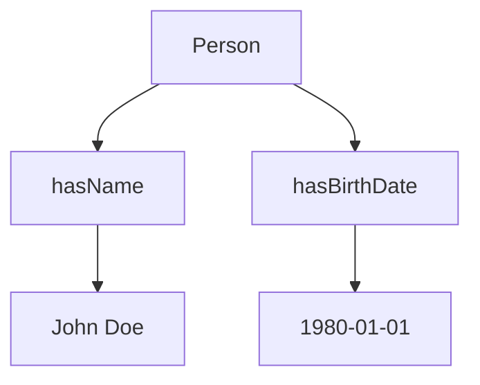
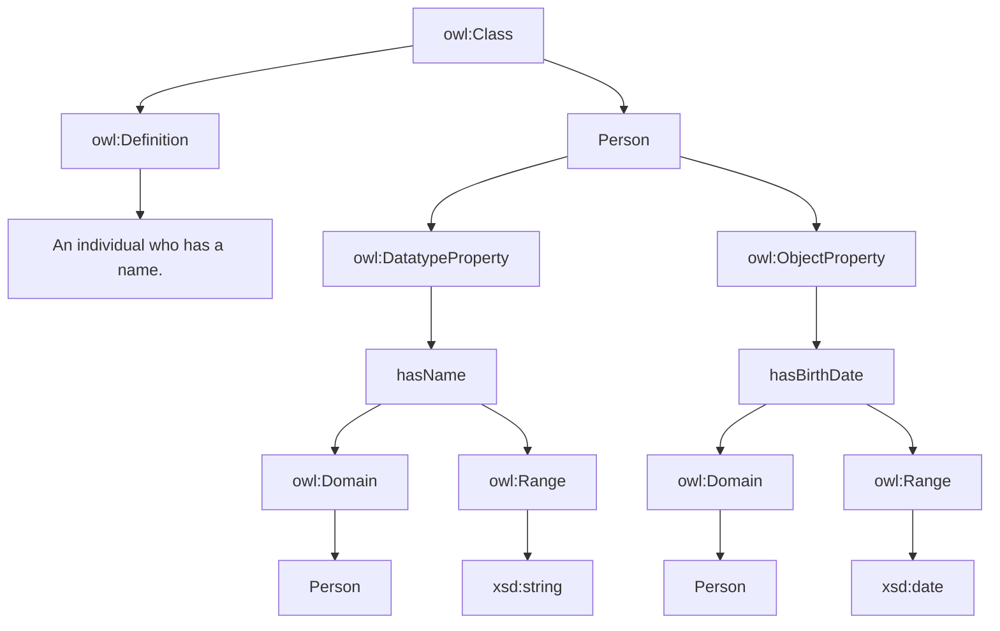
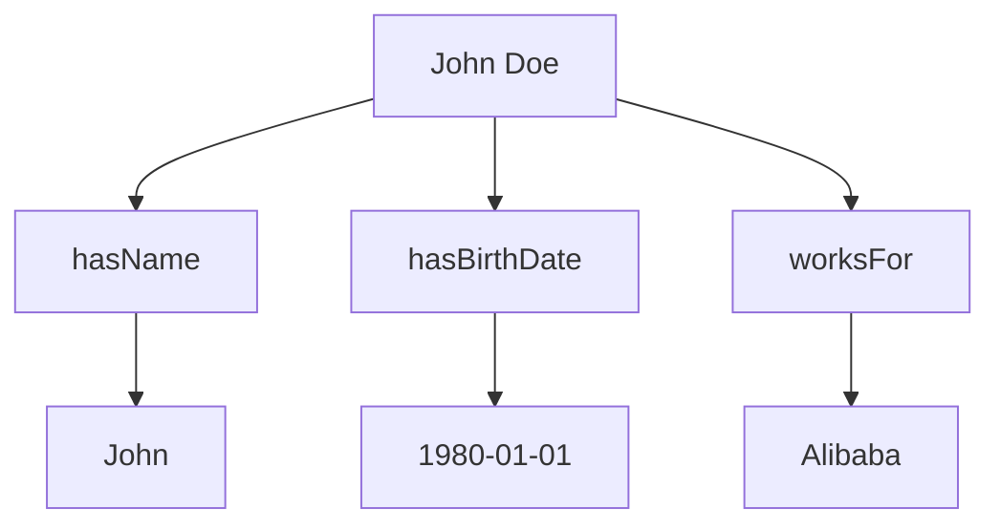
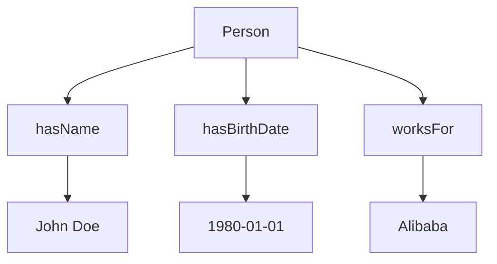

                 

## 第1章：知识管理的AI化背景

### 1.1 AI时代与知识管理

随着人工智能技术的迅猛发展，我们正处在AI时代的浪潮中。知识管理作为组织决策和创新能力的关键，需要适应这一变化。知识管理的AI化，意味着利用人工智能技术来优化知识存储、检索、共享和应用过程，以实现知识的智能化和自动化。

知识管理的AI化有以下几个重要方面：

1. **智能搜索与推荐**：通过自然语言处理和机器学习技术，AI能够理解用户的查询意图，提供个性化的搜索结果和推荐服务。
   
2. **自动化知识生成**：利用自然语言生成和文本分析技术，AI能够自动生成报告、文档和知识库中的内容。

3. **知识图谱构建**：知识图谱是将实体及其关系以图的形式组织起来的知识结构，通过知识图谱，AI能够更加直观地理解和处理复杂知识。

4. **知识融合与集成**：通过数据融合和异构数据集成技术，AI能够将不同来源和格式的知识进行整合，提供统一的知识视图。

5. **智能问答系统**：利用问答系统，AI能够以自然语言的形式与用户进行交互，解答用户的问题。

### 1.2 知识管理的挑战与机遇

知识管理的挑战主要体现在以下几个方面：

1. **数据隐私与安全**：随着知识管理的AI化，大量的数据需要被收集和处理，如何保护这些数据的安全性和隐私性成为一大挑战。

2. **知识获取与更新**：随着知识更新速度的加快，如何快速获取和更新知识库中的内容，以保持知识的时效性，是一个关键问题。

3. **异构数据集成**：不同来源的数据格式和结构可能完全不同，如何有效地集成这些数据，以提供统一的知识视图，是一个复杂的问题。

然而，AI化也为知识管理带来了新的机遇：

1. **智能化的知识检索**：通过机器学习和自然语言处理技术，AI能够更准确地理解用户的查询意图，提供更智能的搜索结果。

2. **自动化的知识生成**：通过自然语言生成技术，AI能够自动生成高质量的文档和报告，减轻人工工作量。

3. **跨领域知识融合**：通过知识图谱和本体论等技术，AI能够将不同领域和不同来源的知识进行有效融合，提供更加全面和综合的知识服务。

4. **面向用户的知识服务**：通过用户行为分析和推荐系统，AI能够为用户提供个性化的知识服务，提高用户体验。

### 1.3 本书结构与目标

本书旨在全面探讨知识管理的AI化挑战，包括知识表示和知识集成的原理、方法与实践。具体结构如下：

1. **第1章：知识管理的AI化背景**：介绍AI时代与知识管理的关系，以及知识管理的挑战与机遇。

2. **第2章：知识表示基础**：讲解知识表示的定义、类型和框架。

3. **第3章：知识图谱**：介绍知识图谱的基本概念、构建方法和存储查询。

4. **第4章：语义网与OWL**：介绍语义网的基本概念和OWL本体语言的构造方法。

5. **第5章：知识集成的概念与挑战**：讲解知识集成的定义、目标以及主要挑战。

6. **第6章：数据融合技术**：介绍数据融合的基本概念和基于规则、机器学习的融合方法。

7. **第7章：异构数据集成方法**：讲解异构数据集成的挑战和基于本体、映射的方法。

8. **第8章：面向用户的知识集成**：讲解面向用户的知识需求分析和推荐系统。

9. **第9章：知识管理的AI化实践**：通过案例研究，展示知识表示与知识集成的应用。

10. **第10章：知识管理的未来趋势**：展望知识管理的未来趋势和潜在挑战。

通过本书的学习，读者将能够掌握AI化知识管理的关键技术，并能够应用于实际项目中。无论你是AI领域的从业者，还是对知识管理有兴趣的读者，本书都将为你提供深刻的见解和实践指导。

### 第2章：知识表示基础

### 2.1 知识表示的定义与重要性

知识表示是指将人类知识以计算机可处理的形式进行编码和存储。它的重要性在于：

1. **知识的存储与管理**：知识表示使得大量知识能够以数字形式存储在计算机系统中，便于长期保存和管理。

2. **知识的共享与传播**：知识表示使得知识能够跨越时间和空间的限制，通过计算机和网络进行共享和传播。

3. **知识的应用与检索**：知识表示提高了知识检索的效率，使得用户能够快速找到所需的知识，从而提高工作效率。

知识表示的主要任务包括：

1. **知识抽取**：从非结构化的数据源（如文本、图像等）中提取结构化的知识。

2. **知识建模**：将知识以模型的形式进行组织和表示，如本体、知识图谱等。

3. **知识存储**：将表示后的知识存储在数据库或知识库中，便于后续的检索和使用。

### 2.2 知识表示的类型

知识表示可以分为结构化知识表示、半结构化知识表示和非结构化知识表示。

#### 2.2.1 结构化知识表示

结构化知识表示是指将知识以固定的结构和规则进行编码。例如：

- **关系数据库**：使用表格形式存储数据，通过SQL查询进行数据操作。
- **XML**：使用XML标记语言进行数据编码，具有良好的可扩展性和结构化。
- **JSON**：使用JavaScript对象表示法进行数据编码，结构简单、易于解析。

结构化知识表示的优点是易于存储和检索，但由于其结构固定，难以表示复杂和非结构化知识。

#### 2.2.2 半结构化知识表示

半结构化知识表示是指知识具有一定结构，但结构较为灵活。例如：

- **文档对象模型（DOM）**：将文档表示为树形结构，便于操作和查询。
- **抽象语法树（AST）**：将编程语言代码表示为树形结构，便于语法分析和代码优化。

半结构化知识表示能较好地表示复杂和非结构化知识，但处理较为复杂。

#### 2.2.3 非结构化知识表示

非结构化知识表示是指知识没有固定结构，以自然语言或图像等形式存在。例如：

- **文本**：使用自然语言描述知识，便于人类理解和阅读。
- **图像**：使用像素数据表示图像，便于计算机处理和识别。

非结构化知识表示能灵活地表示各种类型的知识，但处理和检索较为困难。

### 2.3 知识表示框架

知识表示框架是一种用于组织和管理知识表示的方法。常见的知识表示框架有：

- **语义网络**：使用节点和边表示概念和关系，是一种直观的知识表示方法。
- **本体论**：使用本体语言描述概念、关系和属性，提供一种形式化的知识表示框架。
- **知识图谱**：将实体和关系以图的形式表示，提供一种结构化的知识表示方法。

知识表示框架为知识的存储、检索和应用提供了基础结构，使得知识的存储、检索和应用更加高效。

### 2.3.1 语义网络

语义网络是一种直观的知识表示方法，通过节点和边表示概念和关系。以下是语义网络的简单示例：



在这个示例中，A表示“Person”概念，B表示“hasName”关系，C表示“John Doe”个体，D表示“hasBirthDate”关系，E表示“1980-01-01”日期。

### 2.3.2 本体论

本体论是一种形式化的知识表示方法，使用本体语言描述概念、关系和属性。以下是本体论的一个简单示例：



在这个示例中，A表示“owl:Class”概念，B表示“Person”个体，C表示“owl:Definition”关系，D表示“An individual who has a name.”描述，E表示“owl:DatatypeProperty”关系，F表示“hasName”属性，G表示“owl:Domain”关系，H表示“Person”个体，I表示“owl:Range”关系，J表示“xsd:string”数据类型，K表示“owl:ObjectProperty”关系，L表示“hasBirthDate”属性，M表示“owl:Domain”关系，N表示“Person”个体，O表示“owl:Range”关系，P表示“xsd:date”数据类型。

### 2.3.3 知识图谱

知识图谱是将实体和关系以图的形式表示的一种结构化的知识表示方法。以下是知识图谱的一个简单示例：



在这个示例中，A表示“John Doe”实体，B表示“hasName”关系，C表示“John”属性值，D表示“hasBirthDate”关系，E表示“1980-01-01”属性值，F表示“worksFor”关系，G表示“Alibaba”实体。

知识表示框架的选择取决于具体的应用需求和数据类型。语义网络适用于简单的知识表示，本体论适用于形式化的知识表示，知识图谱适用于结构化的知识表示。

### 第3章：知识图谱

#### 3.1 知识图谱的基本概念

知识图谱（Knowledge Graph）是一种用于表示知识结构的数据模型，通常由节点（实体）和边（关系）构成。知识图谱的核心思想是通过实体和关系的连接，构建一个结构化的知识网络，从而实现对知识的语义理解和智能推理。

在知识图谱中，**实体**表示现实世界中具有独立意义的个体，如人、地点、组织、物品等。**边**表示实体之间的关系，如“人”与“出生地”之间的关系，或者“物品”与“品牌”之间的关系。

知识图谱的构建主要包括以下几个步骤：

1. **数据采集**：从各种数据源（如数据库、文件、网络等）中收集实体和关系信息。
2. **数据预处理**：对采集到的数据进行清洗、去重、格式转换等处理，确保数据的质量和一致性。
3. **实体抽取**：从文本数据中识别出具有独立意义的实体，如人名、地名、组织名等。
4. **关系抽取**：从文本数据中识别出实体之间的关系，如“张三工作于阿里巴巴”、“北京是中国的首都”等。
5. **知识融合**：将来自不同数据源和不同格式的知识进行整合，构建出完整的知识图谱。

知识图谱的存储与查询通常采用图数据库，如Neo4j、ArangoDB等。图数据库能够高效地存储和查询图结构数据，并提供丰富的图算法和查询语言。

#### 3.2 知识图谱的构建方法

知识图谱的构建是一个复杂的过程，涉及到多个技术和步骤。以下是一些常见的知识图谱构建方法：

##### 3.2.1 数据采集

数据采集是知识图谱构建的基础步骤，包括从各种数据源中获取实体和关系信息。数据源可以是结构化数据（如数据库）、半结构化数据（如XML）和非结构化数据（如文本、图像）。

- **结构化数据**：可以从关系数据库中提取实体和关系信息，如用户表、商品表、订单表等。
- **半结构化数据**：可以从XML、JSON等格式的文件中提取实体和关系信息。
- **非结构化数据**：可以从文本、图像、音频等非结构化数据中提取实体和关系信息。

数据采集的过程通常包括以下几个步骤：

1. **数据源识别**：确定数据采集的目标和数据源。
2. **数据抽取**：使用爬虫、API接口、数据库连接等方式从数据源中提取实体和关系信息。
3. **数据清洗**：去除重复、错误和无效的数据，确保数据的质量和一致性。

##### 3.2.2 数据预处理

数据预处理是知识图谱构建的重要步骤，包括数据清洗、数据转换和数据规范化等。

- **数据清洗**：去除重复数据、错误数据和无效数据，确保数据的质量。
- **数据转换**：将不同格式和来源的数据统一成一种标准格式，如将XML数据转换成JSON格式。
- **数据规范化**：对数据进行标准化处理，如对文本数据中的日期、数字、地名等进行规范化。

数据预处理的过程通常包括以下几个步骤：

1. **数据质量检查**：检查数据的质量和一致性，发现并修复数据中的问题。
2. **数据转换**：将不同格式和来源的数据转换成统一格式。
3. **数据规范化**：对数据进行标准化处理，确保数据的规范和一致。

##### 3.2.3 实体抽取

实体抽取是指从文本数据中识别出具有独立意义的实体，如人名、地名、组织名等。实体抽取是知识图谱构建的关键步骤，它为后续的关系抽取和图谱构建奠定了基础。

实体抽取的方法包括：

- **基于规则的方法**：使用预定义的规则，从文本中匹配和提取实体。
- **基于统计的方法**：使用机器学习算法，从大量文本数据中学习实体模式，进行实体抽取。
- **基于语义的方法**：利用自然语言处理技术，对文本进行语义分析，识别出实体。

实体抽取的过程通常包括以下几个步骤：

1. **分词**：将文本切分成单词或短语。
2. **词性标注**：对每个单词进行词性标注，如名词、动词、形容词等。
3. **实体识别**：根据预定义的规则或机器学习模型，识别出文本中的实体。

##### 3.2.4 关系抽取

关系抽取是指从文本数据中识别出实体之间的关系，如“张三工作于阿里巴巴”、“北京是中国的首都”等。关系抽取是知识图谱构建的核心步骤，它将实体之间的语义关系转化为图结构，从而构建出知识图谱。

关系抽取的方法包括：

- **基于规则的方法**：使用预定义的规则，从文本中匹配和提取关系。
- **基于统计的方法**：使用机器学习算法，从大量文本数据中学习关系模式，进行关系抽取。
- **基于语义的方法**：利用自然语言处理技术，对文本进行语义分析，识别出实体之间的关系。

关系抽取的过程通常包括以下几个步骤：

1. **实体识别**：从文本中识别出实体，如人名、地名、组织名等。
2. **关系识别**：根据预定义的规则或机器学习模型，识别出实体之间的关系。
3. **关系分类**：对识别出的关系进行分类，如工作关系、地理位置关系、组织关系等。

##### 3.2.5 知识融合

知识融合是指将来自不同数据源和不同格式的知识进行整合，构建出完整的知识图谱。

知识融合的方法包括：

- **基于本体的方法**：使用本体语言描述实体和关系，进行知识融合。
- **基于规则的方法**：使用预定义的规则，将不同数据源中的知识进行融合。
- **基于机器学习的方法**：使用机器学习算法，从多个数据源中学习知识融合的模型。

知识融合的过程通常包括以下几个步骤：

1. **数据源选择**：选择需要融合的数据源。
2. **数据清洗**：对数据源中的数据进行清洗和预处理，确保数据的质量和一致性。
3. **实体和关系抽取**：从数据源中提取实体和关系信息。
4. **知识融合**：将不同数据源中的知识进行整合，构建出完整的知识图谱。

通过以上步骤，我们可以构建出一个结构化的知识图谱，从而实现对知识的语义理解和智能推理。

### 3.3 知识图谱的存储与查询

知识图谱的存储与查询通常采用图数据库。图数据库是一种专门用于存储和查询图结构数据的数据库系统，它能够高效地存储和查询大规模的知识图谱。

以下是一些常见的图数据库及其特点：

- **Neo4j**：Neo4j是一个高性能的图数据库，支持Cypher查询语言，具有较好的扩展性和性能。
- **ArangoDB**：ArangoDB是一个多模型数据库，支持图、文档和键值存储，具有灵活的数据模型和查询能力。
- **OrientDB**：OrientDB是一个高性能的图数据库，支持SQL和Gremlin查询语言，适用于大规模数据存储和查询。
- **JanusGraph**：JanusGraph是一个开源的分布式图数据库，支持多种存储后端，适用于大规模图数据的存储和查询。

在图数据库中，知识图谱的存储通常采用图数据模型，将实体和关系以节点和边的形式存储。以下是一个简单的知识图谱示例：



在这个示例中，A表示实体“Person”，B表示关系“hasName”，C表示属性值“John Doe”，D表示关系“hasBirthDate”，E表示属性值“1980-01-01”，F表示关系“worksFor”，G表示实体“Alibaba”。

图数据库提供了丰富的图算法和查询语言，可以方便地对知识图谱进行存储和查询。以下是一些常见的图查询语言：

- **Cypher**：Neo4j的查询语言，支持图数据的复杂查询和遍历。
- **AQL**：ArangoDB的查询语言，支持多模型数据的查询和操作。
- **Gremlin**：JanusGraph的查询语言，基于Gryo图查询语言，支持复杂的图算法和遍历。

以下是一个简单的Cypher查询示例，用于查找所有拥有“Alibaba”作为工作单位的人：

```sql
MATCH (p:Person)-[:worksFor]->(company:Company)
WHERE company.name = "Alibaba"
RETURN p
```

通过图数据库和图查询语言，我们可以高效地存储和查询知识图谱，从而实现对知识的语义理解和智能推理。

### 4.1 语义网的基本概念

语义网（Semantic Web）是一种基于Web的语义信息表示和交换技术，它旨在通过语义增强的Web资源，实现人机之间的智能交互。语义网的目标是让计算机能够理解Web上的信息，从而实现信息的自动化处理和共享。

在语义网中，信息被表示为基于语义的Web资源，这些资源包括文档、数据和服务。语义网的实现依赖于以下关键技术：

1. **资源描述框架（RDF，Resource Description Framework）**：RDF是一种用于描述Web资源的语义信息的模型，它基于图结构，使用三元组（主体、谓词、客体）来表示信息。RDF允许我们将数据以结构化和语义化的方式表示，从而使得计算机能够理解和处理这些数据。

2. **Web本体语言（OWL，Web Ontology Language）**：OWL是一种用于描述领域本体和语义信息的语言，它扩展了RDF的语义表达能力，提供了定义类、属性、个体及其之间关系的机制。OWL使得我们可以定义领域知识模型，从而实现更加精确的语义描述。

3. **数据访问接口（SPARQL，SPARQL Protocol and RDF Query Language）**：SPARQL是一种用于查询RDF数据的查询语言，它类似于SQL，但适用于图结构的数据。SPARQL允许我们编写查询语句，从RDF数据中检索和操作数据。

4. **语义网服务（Semantic Web Services）**：语义网服务是一种基于语义描述的Web服务，它能够根据服务提供者和消费者的语义信息，自动匹配和执行服务。语义网服务使得Web服务之间能够实现智能化的交互和协作。

语义网的核心思想是利用语义信息来增强Web资源，使其更加语义化、结构化和智能化。通过语义网，我们可以实现以下功能：

- **智能搜索**：利用语义信息，计算机能够更好地理解用户的查询意图，提供更加准确的搜索结果。
- **自动化数据集成**：利用RDF和OWL，不同来源和格式的数据可以自动集成，实现数据的一致性和互操作性。
- **智能推理**：利用本体和规则，计算机能够根据领域知识进行推理，提供更加智能化的决策支持。
- **语义化数据共享**：利用RDF和OWL，数据可以以语义化的形式共享，实现跨领域和跨平台的数据共享。

语义网的发展对于知识管理和信息处理具有重要意义。它使得知识管理更加智能化和自动化，提高了知识获取、共享和利用的效率。同时，语义网也为人工智能和机器学习提供了丰富的数据资源，促进了这些技术的发展和应用。

### 4.2 OWL本体语言

OWL（Web Ontology Language）是一种用于描述本体和语义信息的语言，它基于RDF（Resource Description Framework），扩展了RDF的语义表达能力。OWL的主要目的是为领域知识提供形式化的描述，从而使得计算机能够理解和处理这些知识。

OWL的本体语言包括以下几个基本概念：

- **个体（Individual）**：个体是具体的实体，可以是任何可以被描述的对象。例如，"张三"可以是一个个体。

- **类（Class）**：类是具有共同特征的个体的集合。例如，"人"是一个类，它包括所有人类个体。

- **属性（Property）**：属性是用于描述个体之间关系的概念。例如，"出生地"是一个属性，它可以描述人与地点之间的关系。

- **数据属性（Data Property）**：数据属性是用于描述个体属性的值，通常是数据类型的属性。例如，"年龄"是一个数据属性，它的值可以是数字。

- **对象属性（Object Property）**：对象属性是用于描述个体之间关系的属性，它的值是另一个个体。例如，"父亲"是一个对象属性，它的值是某个人的父亲。

- **等价类（Equivalent Class）**：两个类如果具有相同的成员个体，则称为等价类。

- **子类（Subclass）**：一个类是另一个类的子类，如果它的所有成员个体都是另一个类的成员个体。

- **属性域（Domain）**：属性域是指能够参与某个属性关系的类的集合。

- **属性范围（Range）**：属性范围是指某个属性的值域，它定义了属性可以接受的值的类型。

OWL本体语言的基本要素包括以下内容：

#### 4.2.1 OWL本体语言的基本要素

1. **OWL本体（Ontology）**：OWL本体是一个由一组定义组成的集合，这些定义描述了领域中的类、属性、个体等概念，以及它们之间的关系。

2. **OWL词汇表（OWL Vocabulary）**：OWL词汇表是用于定义本体语言符号的集合，它包括类、属性、个体等基本元素。

3. **OWL构造块（OWL Building Blocks）**：OWL构造块是用于创建OWL本体的基本元素，包括个体、类、属性、数据属性、对象属性等。

OWL本体语言的构造方法主要包括以下步骤：

1. **定义本体**：使用`<owl:Ontology>`元素定义OWL本体，并为其分配一个唯一的标识符。

   ```xml
   <owl:Ontology rdf:ID="PersonOntology">
     <!-- 其他定义 -->
   </owl:Ontology>
   ```

2. **定义类**：使用`<owl:Class>`元素定义类，并为其分配一个唯一的标识符。

   ```xml
   <owl:Class rdf:ID="Person">
     <!-- 类的定义 -->
   </owl:Class>
   ```

3. **定义属性**：使用`<owl:DatatypeProperty>`或`<owl:ObjectProperty>`元素定义数据属性或对象属性。

   ```xml
   <owl:DatatypeProperty rdf:ID="hasName">
     <!-- 属性的定义 -->
   </owl:DatatypeProperty>

   <owl:ObjectProperty rdf:ID="hasFather">
     <!-- 属性的定义 -->
   </owl:ObjectProperty>
   ```

4. **定义个体**：使用`<owl:Individual>`元素定义个体，并为其分配一个唯一的标识符。

   ```xml
   <owl:Individual rdf:ID="JohnDoe">
     <!-- 个体的属性和关系 -->
   </owl:Individual>
   ```

5. **定义关系**：使用`<owl:subclassOf>`、`<owl:equivalentClass>`、`<owl:domain>`、`<owl:range>`等元素定义类之间的关系和属性的关系。

   ```xml
   <owl:Class rdf:ID="Employee">
     <owl:subclassOf rdf:resource="#Person"/>
   </owl:Class>

   <owl:ObjectProperty rdf:ID="hasManager">
     <owl:domain rdf:resource="#Employee"/>
     <owl:range rdf:resource="#Employee"/>
   </owl:ObjectProperty>
   ```

6. **定义属性值**：为个体分配属性值，使用`<owl:hasValue>`或`<owl: sistant|>### 4.2.2 OWL本体语言的基本要素

OWL（Web Ontology Language）是用于定义本体和语义信息的语言。OWL基于RDF（Resource Description Framework），扩展了RDF的语义表达能力，使其能够更精确地描述领域知识。OWL的基本要素包括：

1. **本体（Ontology）**：本体是OWL的核心概念，它是一个形式化的知识库，定义了领域中的概念、关系和约束。OWL本体通常包含多个类、属性、个体等定义。

2. **类（Class）**：类是具有相同或相似属性和特征的对象的集合。在OWL中，类用于表示概念，如“人”、“动物”、“书籍”等。

3. **属性（Property）**：属性是用于描述对象之间关系的概念。在OWL中，属性分为数据属性（用于描述对象的属性值）和对象属性（用于描述对象之间的关系）。例如，“有名字”、“属于”等。

4. **个体（Individual）**：个体是具体的对象实例，是类的实例。例如，“张三”、“北京”等。OWL中的个体可以直接与类关联，表示具体的概念实例。

5. **数据属性（Data Property）**：数据属性是用于描述对象属性的值，通常与特定的数据类型相关。例如，“有名字”、“年龄”等。

6. **对象属性（Object Property）**：对象属性是用于描述对象之间的关系，通常涉及两个或多个个体。例如，“父亲”、“工作于”等。

7. **等价类（Equivalent Class）**：两个类如果具有相同的成员个体，则称为等价类。等价类表示两个类在语义上是相同的。

8. **子类（Subclass）**：一个类是另一个类的子类，如果它的所有成员个体都是另一个类的成员个体。子类继承了父类的所有属性和关系。

9. **属性域（Domain）**：属性域是指能够参与某个属性关系的类的集合。它定义了某个属性可以描述哪些类的实例。

10. **属性范围（Range）**：属性范围是指某个属性的值域，它定义了属性可以接受的值的类型。它可以是类、数据类型或个体的集合。

11. **个体值（Individual Value）**：个体值是指某个属性的值，它可以是一个具体的个体或一个数据类型的值。

12. **断言（Assertion）**：断言是OWL中用于表示个体和属性之间的关系的基本构建块。它用于表示个体具有某个属性或属于某个类。

OWL本体语言的基本要素为定义领域知识提供了强大的工具，通过这些要素，可以构建复杂而精确的语义模型，从而支持知识表示、推理和自动化处理。

#### 4.2.3 OWL本体语言的构造方法

OWL本体语言的构造方法是通过定义类、属性、个体及其关系来构建本体模型。以下是OWL本体语言构造方法的详细步骤：

1. **定义本体**：

   在OWL本体语言中，首先需要定义一个本体。本体通常具有一个唯一的标识符，并可以包含版本信息、命名空间等。

   ```owl
   @prefix owl: <http://www.w3.org/2002/07/owl#> .
   @prefix xsd: <http://www.w3.org/2001/XMLSchema#> .
   @prefix rdf: <http://www.w3.org/1999/02/22-rdf-syntax-ns#> .
   @prefix : <http://example.org/> .

   :PersonOntology
     a owl:Ontology ;
     owl:versionInfo "1.0" ;
     owl:ingerprint "abcd1234" .
   ```

   在这个例子中，我们定义了一个名为`PersonOntology`的本体，并为其分配了版本信息和指纹。

2. **定义类**：

   类用于表示概念或一组具有相同属性和特征的个体。OWL支持泛化（继承）和细化（限制）等机制。

   ```owl
   :Person
     a owl:Class ;
     rdfs:label "Person" ;
     rdfs:comment "A person who has a name and a birth date." .

   :Employee
     a owl:Class ;
     rdfs:label "Employee" ;
     rdfs:comment "An employee who works for an organization." ;
     owl:subClassOf :Person .
   ```

   在这个例子中，我们定义了`Person`类和`Employee`类。`Employee`是`Person`的子类，表示员工是人的一个特殊类型。

3. **定义属性**：

   属性用于描述个体之间的关系。OWL中的属性分为数据属性（用于描述个体的属性值）和对象属性（用于描述个体之间的关系）。

   ```owl
   :hasName
     a owl:DatatypeProperty ;
     rdfs:label "hasName" ;
     rdfs:comment "The property that holds the name of a person." ;
     rdfs:range xsd:string .

   :worksFor
     a owl:ObjectProperty ;
     rdfs:label "worksFor" ;
     rdfs:comment "The property that indicates the organization a person works for." ;
     rdfs:domain :Person ;
     rdfs:range :Organization .
   ```

   在这个例子中，我们定义了`hasName`数据属性和`worksFor`对象属性。`hasName`的值域是字符串类型，`worksFor`的域是`Person`类，值域是`Organization`类。

4. **定义个体**：

   个体是类的实例，表示具体的概念实例。OWL使用`<owl:Individual>`元素定义个体。

   ```owl
   :JohnDoe
     a :Person ;
     :hasName "John Doe" ;
     :worksFor :Alibaba .

   :Alibaba
     a :Organization ;
     rdfs:label "Alibaba" .
   ```

   在这个例子中，我们定义了个体`JohnDoe`，他是`Person`类的实例，具有`hasName`属性和`worksFor`属性，分别对应值为"John Doe"和"Alibaba"。

5. **定义关系**：

   OWL支持类之间的等价和子类关系，以及属性之间的域和范围。

   ```owl
   :Employee
     owl:disjointWith :Student .

   :hasPhoneNumber
     rdfs:domain :Person ;
     rdfs:range xsd:string .
   ```

   在这个例子中，`Employee`类与`Student`类是互斥的，即一个个体不能同时是员工和学生。`hasPhoneNumber`属性的域是`Person`类，值域是字符串类型。

通过上述步骤，我们可以构建一个简单的OWL本体模型。OWL本体语言的构造方法允许我们定义复杂的领域知识，从而支持语义推理和自动化处理。

#### 4.2.4 OWL本体语言的实例

下面是一个简单的OWL本体语言的实例，该实例定义了一个简单的组织及其成员信息。

```owl
@prefix owl: <http://www.w3.org/2002/07/owl#> .
@prefix rdfs: <http://www.w3.org/2000/01/rdf-schema#> .
@prefix xsd: <http://www.w3.org/2001/XMLSchema#> .
@prefix : <http://example.org/> .

:OrganizationOntology
  a owl:Ontology ;

:Organization
  a owl:Class ;
  rdfs:label "Organization" ;
  rdfs:comment "A company or institution." ;

:Employee
  a owl:Class ;
  rdfs:label "Employee" ;
  rdfs:comment "A person who works for an organization." ;
  owl:subClassOf :Organization ;

:Person
  a owl:Class ;
  rdfs:label "Person" ;
  rdfs:comment "An individual person." ;
  owl:subClassOf :Employee ;

:hasName
  a owl:DatatypeProperty ;
  rdfs:label "hasName" ;
  rdfs:comment "The person's name." ;
  rdfs:range xsd:string ;

:hasEmployee
  a owl:ObjectProperty ;
  rdfs:label "hasEmployee" ;
  rdfs:comment "The organization's employees." ;
  rdfs:domain :Organization ;
  rdfs:range :Person ;

:JohnDoe
  a :Person ;
  :hasName "John Doe" ;

:Alibaba
  a :Organization ;
  :hasEmployee :JohnDoe ;
  rdfs:label "Alibaba" ;
  rdfs:comment "A global technology company." ;
```

这个OWL本体实例包括以下几个部分：

1. **定义本体**：`:OrganizationOntology`是定义的本体。

2. **定义类**：`:Organization`、`:Employee`和`:Person`是定义的类。`:Employee`是`:Organization`的子类，`:Person`是`:Employee`的子类。

3. **定义属性**：`:hasName`是一个数据属性，用于描述人的名字。`:hasEmployee`是一个对象属性，用于描述组织及其员工的关系。

4. **定义个体**：`:JohnDoe`是一个人，具有名字"John Doe"。`:Alibaba`是一个组织，有员工`JohnDoe`。

5. **注释**：`rdfs:label`和`rdfs:comment`用于为类、属性和本体提供标签和注释。

这个OWL本体实例展示了如何使用OWL本体语言来定义简单的组织结构及其成员信息。通过扩展和细化这个实例，可以构建更复杂和详细的知识模型。

### 第5章：知识集成的概念与挑战

#### 5.1 知识集成的定义与目标

知识集成是指将来自不同来源、格式和结构的知识进行整合和融合，以提供统一和综合的知识视图。知识集成的目标包括：

1. **提高知识检索的效率**：通过集成不同来源的知识，用户可以更快速地找到所需信息。
2. **增强知识的可用性**：集成后的知识可以更全面、准确地支持决策和问题解决。
3. **促进知识的共享和复用**：知识集成使得知识在不同系统和应用之间共享和复用变得更加容易。

知识集成的核心任务包括：

1. **数据采集**：从各种数据源中获取知识。
2. **数据预处理**：清洗、转换和规范化数据，以确保数据的一致性和质量。
3. **知识抽取**：从非结构化数据中提取结构化的知识。
4. **知识融合**：将来自不同来源的知识进行整合，提供统一的知识视图。
5. **知识存储**：将整合后的知识存储在知识库中，便于后续的检索和使用。

#### 5.2 知识集成的主要挑战

知识集成是一个复杂的过程，面临着多种挑战：

1. **数据质量与一致性**：不同数据源的数据质量参差不齐，数据可能存在重复、错误和缺失。此外，不同数据源的数据格式和结构可能完全不同，导致数据一致性难以保障。

2. **多源数据融合**：知识集成需要处理来自不同来源的数据，这些数据可能具有不同的格式、结构和语义。如何有效地融合这些数据，提供统一的知识视图，是一个巨大的挑战。

3. **异构数据集成**：异构数据集成是指将具有不同结构和属性的数据进行整合。例如，将文本数据、图像数据和结构化数据集成在一起，需要解决数据类型差异和语义理解等问题。

4. **知识表示和建模**：如何选择合适的知识表示和建模方法，以有效地表示和存储整合后的知识，是一个关键问题。不同的知识表示方法（如语义网、本体、知识图谱等）各有优缺点，需要根据具体应用需求进行选择。

5. **知识更新和维护**：知识是一个动态的过程，需要不断地更新和维护。如何自动识别和更新知识库中的知识，保持其时效性和准确性，是一个持续性的挑战。

6. **用户需求与个性化**：知识集成系统需要满足不同用户的需求，提供个性化的知识服务。这要求系统能够理解用户的意图和偏好，并根据这些信息提供相关的知识和信息。

7. **系统性能和可扩展性**：知识集成系统通常需要处理大量的数据，如何保证系统的性能和可扩展性，是一个重要挑战。这包括数据存储、查询优化、负载均衡等方面的技术问题。

综上所述，知识集成面临着数据质量、多源数据融合、异构数据集成、知识表示和建模、知识更新和维护、用户需求与个性化以及系统性能和可扩展性等多个挑战。解决这些挑战需要采用先进的技术和方法，并结合实际应用需求进行优化和改进。

#### 5.2.1 数据质量与一致性

数据质量与一致性是知识集成过程中最为关键的挑战之一。数据质量直接影响知识集成的效果，而数据一致性则关系到知识的准确性和完整性。以下是对这些挑战的详细分析：

**1. 数据质量问题**：

- **数据完整性**：数据完整性是指数据是否完整，没有缺失或重复。在知识集成过程中，不同来源的数据可能存在缺失，例如，某些数据字段未被填写或某些记录丢失。数据完整性问题会导致知识库中的数据不完整，影响知识检索和决策的准确性。

- **数据准确性**：数据准确性是指数据的真实性和正确性。不同数据源的数据可能存在错误，例如，数据输入错误、数据转换错误或数据源本身的不准确性。数据准确性问题会直接影响知识库中的知识质量和可靠性。

- **数据一致性**：数据一致性是指不同来源的数据在格式、结构和内容上的一致性。数据源之间的差异可能非常大，例如，不同数据源可能使用不同的数据格式（如XML、JSON、CSV等）、命名规则、数据类型和单位等。数据一致性问题是知识集成中常见的问题，会导致数据融合过程中的错误和混淆。

**2. 数据一致性问题**：

- **数据格式差异**：不同数据源的数据格式可能完全不同，例如，一个数据源使用XML格式，而另一个数据源使用JSON格式。数据格式差异会导致数据集成过程中的数据转换和解析问题。

- **数据结构差异**：不同数据源的数据结构可能不同，例如，一个数据源的数据是表格形式，而另一个数据源的数据是文档形式。数据结构差异会导致数据集成过程中的数据映射和融合问题。

- **数据语义差异**：不同数据源的数据可能描述相同的实体和关系，但其语义表达可能不同。例如，一个数据源使用“客户ID”来标识客户，而另一个数据源使用“客户编号”来标识客户。数据语义差异会导致数据集成过程中的语义理解问题。

**解决方案**：

- **数据清洗**：数据清洗是提高数据质量的重要步骤，包括去除重复数据、纠正错误数据和填补缺失数据等。通过数据清洗，可以显著提高数据的质量和一致性。

- **数据规范化**：数据规范化是将不同数据源的数据转换为统一格式和结构的过程。通过数据规范化，可以实现数据格式和结构的一致性，为后续的数据融合和集成提供基础。

- **数据质量监测**：建立数据质量监测机制，定期对数据质量进行检查和评估，发现并修复数据质量问题。

- **数据一致性规则**：制定数据一致性规则，确保不同数据源之间的数据在格式、结构和内容上的一致性。数据一致性规则可以通过预定义的规则或机器学习算法自动生成。

通过以上措施，可以显著提高知识集成过程中数据质量和一致性，从而确保知识集成的效果和准确性。

### 6.1 数据融合的基本概念

数据融合（Data Fusion）是指将来自多个数据源的数据进行整合和融合，以提供更全面、准确和有用的信息。数据融合的目标是通过综合利用多个数据源的信息，提高数据的整体质量，并从中提取出更加准确和有价值的知识。

数据融合的基本概念包括：

1. **数据源（Data Sources）**：数据融合过程中涉及的数据来源，可以是结构化数据（如数据库）、半结构化数据（如XML、JSON）或非结构化数据（如文本、图像、音频）。

2. **数据类型（Data Types）**：数据源中包含的数据类型，如数值型、文本型、图像型等。

3. **数据格式（Data Formats）**：数据源中数据的存储和表示方式，如XML、JSON、CSV、图像文件等。

4. **数据一致性（Data Consistency）**：数据融合过程中需要处理的数据一致性，包括数据格式的一致性、语义的一致性、属性的一致性等。

5. **数据质量（Data Quality）**：数据融合过程中需要关注的数据质量，包括数据的完整性、准确性、一致性等。

6. **数据融合方法（Data Fusion Methods）**：用于将多个数据源的数据进行整合和融合的方法，包括基于规则的融合方法、基于机器学习的融合方法和混合融合方法等。

7. **数据融合模型（Data Fusion Models）**：用于描述数据融合过程和方法的抽象模型，如贝叶斯网络、随机森林、支持向量机等。

数据融合的基本过程包括以下几个步骤：

1. **数据采集**：从多个数据源中收集数据。

2. **数据预处理**：对采集到的数据进行清洗、转换和规范化，确保数据的质量和一致性。

3. **特征提取**：从预处理后的数据中提取特征，如文本数据中的关键词、图像数据中的颜色直方图等。

4. **数据融合**：使用特定的方法将提取出的特征进行融合，以生成更全面和准确的信息。

5. **结果评估**：对融合后的数据结果进行评估，如准确率、召回率等。

数据融合在多个领域都有广泛的应用，如智能交通系统、生物信息学、图像处理、传感器网络等。通过数据融合，可以实现对复杂问题的更全面和准确的分析与决策。

### 6.2 基于规则的融合方法

基于规则的融合方法是一种利用预定义的规则将来自多个数据源的数据进行整合和融合的方法。这些规则通常基于领域知识和专家经验，用于指导数据融合过程中的决策和操作。

#### 6.2.1 简单规则融合

简单规则融合方法是最基本的数据融合方法之一。它主要基于以下原则：

1. **数据匹配**：通过比较数据源中的数据，找出匹配或相似的数据项。
2. **数据合并**：将匹配或相似的数据项进行合并，形成一个新的数据集。

简单规则融合的具体步骤包括：

1. **数据清洗**：对多个数据源进行预处理，去除重复、错误和缺失的数据。
2. **数据映射**：将不同数据源中的数据项映射到统一的数据格式和结构中。
3. **规则定义**：根据领域知识和专家经验，定义匹配和合并数据的规则。
4. **规则应用**：应用预定义的规则，将匹配或相似的数据项进行合并。

例如，在一个医疗数据的融合案例中，规则可能如下：

- 如果两个患者数据在姓名、出生日期和住址上完全匹配，则认为它们是同一患者。
- 如果两个患者数据在姓名和出生日期上匹配，但住址不同，则合并这两个数据项，标记为“多住址”。
- 如果两个患者数据在姓名和出生日期上不匹配，但住址相同，则认为它们可能是同一患者的不同记录。

简单规则融合方法的优点是直观、易于理解和实现，但缺点是灵活性较低，无法处理复杂或不确定的数据。

#### 6.2.2 聚类分析

聚类分析是一种无监督学习方法，用于将相似的数据项聚集在一起。通过聚类分析，可以自动发现数据中的模式和结构，从而实现数据融合。

聚类分析的基本步骤包括：

1. **数据预处理**：对多个数据源进行清洗、转换和规范化，确保数据的一致性和质量。
2. **特征提取**：从预处理后的数据中提取特征，如文本数据中的关键词、图像数据中的颜色直方图等。
3. **聚类算法选择**：选择合适的聚类算法，如K-Means、层次聚类、DBSCAN等。
4. **聚类执行**：使用选定的聚类算法，对数据项进行聚类，形成多个聚类。
5. **聚类评估**：评估聚类结果的质量，如轮廓系数、内聚度等。

在聚类分析中，数据项的相似度通常通过距离度量来计算。常见的距离度量包括：

- **欧几里得距离**：用于计算两个数据项之间的欧几里得距离，适用于数值型数据。
- **曼哈顿距离**：用于计算两个数据项之间的曼哈顿距离，适用于数值型数据。
- **切比雪夫距离**：用于计算两个数据项之间的切比雪夫距离，适用于数值型数据。

聚类分析的优点是能够自动发现数据中的结构和模式，但缺点是聚类结果的解释和评估较为困难。

#### 6.2.3 关联规则挖掘

关联规则挖掘是一种用于发现数据之间关联关系的方法。通过关联规则挖掘，可以从多个数据源中发现新的关联关系，从而实现数据的融合。

关联规则挖掘的基本步骤包括：

1. **数据预处理**：对多个数据源进行清洗、转换和规范化，确保数据的一致性和质量。
2. **特征提取**：从预处理后的数据中提取特征，如文本数据中的关键词、图像数据中的颜色直方图等。
3. **关联规则挖掘**：使用关联规则挖掘算法，如Apriori算法、FP-growth算法等，从特征数据中发现关联规则。
4. **规则评估**：评估挖掘出的关联规则的质量，如支持度、置信度等。

在关联规则挖掘中，通常使用以下两个度量来评估关联规则：

- **支持度（Support）**：表示一个关联规则在所有数据项中出现的频率。支持度越高，说明规则越普遍。
- **置信度（Confidence）**：表示一个关联规则在前件和后件同时出现的条件下，后件出现的概率。置信度越高，说明规则越可靠。

例如，在一个销售数据的融合案例中，关联规则可能如下：

- **规则**：“购买牛奶的用户中，有70%的用户也购买了面包”。
- **支持度**：表示在所有购买牛奶的用户中，有70%的用户也购买了面包。
- **置信度**：表示在购买牛奶的用户中，有70%的用户也购买了面包。

通过关联规则挖掘，可以自动发现数据中的关联关系，从而实现数据的融合。这种方法在市场分析、推荐系统等领域有广泛的应用。

### 6.3 基于机器学习的融合方法

基于机器学习的融合方法是一种利用机器学习算法将来自多个数据源的数据进行整合和融合的方法。这些方法通过学习数据之间的关联和模式，能够自动发现和利用数据中的信息，从而实现高效的融合。

#### 6.3.1 监督学习方法

监督学习方法是一种基于标注数据进行训练的方法。在数据融合过程中，监督学习方法可以通过以下步骤进行：

1. **数据标注**：对多个数据源进行标注，标记出数据项之间的关联和关系。标注数据通常包括训练数据和验证数据。
2. **模型训练**：使用标注数据训练一个监督学习模型，如线性回归模型、支持向量机（SVM）、决策树等。
3. **模型评估**：使用验证数据评估训练出的模型，调整模型参数，提高模型的准确性。
4. **模型应用**：将训练好的模型应用到未标注的数据上，预测数据项之间的关联和关系。

监督学习方法的优点是能够利用标注数据的学习经验，提高数据融合的准确性。然而，这种方法需要大量标注数据，且训练过程可能较为复杂。

#### 6.3.2 无监督学习方法

无监督学习方法是一种不需要标注数据进行训练的方法。在数据融合过程中，无监督学习方法可以通过以下步骤进行：

1. **数据预处理**：对多个数据源进行预处理，包括数据清洗、特征提取和标准化等。
2. **模型选择**：选择合适的无监督学习模型，如K-均值聚类、主成分分析（PCA）、自编码器等。
3. **模型训练**：使用预处理后的数据训练模型，自动发现数据中的模式和结构。
4. **模型评估**：评估训练出的模型，如聚类效果、降维效果等，调整模型参数，提高模型性能。

无监督学习方法的优点是不需要标注数据，适用于大规模数据和未知数据分布的情况。然而，这种方法可能无法直接利用标注数据的经验，模型的准确性可能较低。

#### 6.3.3 半监督学习方法

半监督学习方法是一种结合监督学习和无监督学习方法的方法。在数据融合过程中，半监督学习方法可以通过以下步骤进行：

1. **数据标注**：对部分数据进行标注，用于训练监督学习模型。
2. **模型训练**：使用标注数据训练一个监督学习模型，并使用未标注数据训练一个无监督学习模型。
3. **模型融合**：将监督学习模型和无监督学习模型进行融合，提高数据融合的准确性。
4. **模型评估**：评估融合模型的性能，如准确率、召回率等。

半监督学习方法能够充分利用标注数据和未标注数据的信息，提高数据融合的准确性。这种方法在数据稀缺或标注成本较高的情况下尤为有效。

通过以上方法，基于机器学习的融合方法能够高效地整合来自多个数据源的信息，提供更准确和全面的数据视图。这种方法在数据挖掘、推荐系统、图像处理等领域有广泛的应用。

### 7.1 异构数据集成的挑战

异构数据集成是指将具有不同结构和属性的数据进行整合和融合的过程。在现实世界中，数据通常来自多种来源，如数据库、文件、Web、传感器等，这些数据源的数据格式、结构和语义可能完全不同，给数据集成带来了以下挑战：

#### 1. 数据格式差异

不同数据源的数据格式可能完全不同，例如：

- **结构化数据**：如关系数据库中的表格数据，通常使用XML或JSON等格式表示。
- **半结构化数据**：如XML、JSON等格式的文件，通常包含一定的结构信息，但结构与结构化数据不同。
- **非结构化数据**：如文本、图像、音频等，通常没有固定的结构，需要通过特定的方法进行解析和处理。

这些数据格式差异导致在数据集成过程中需要针对不同数据源采用不同的处理方法，增加了数据集成的复杂性和难度。

#### 2. 数据结构差异

不同数据源的数据结构可能存在显著差异，例如：

- **属性差异**：不同数据源的属性名称、属性类型和属性顺序可能不同，导致在数据集成过程中需要解决属性映射问题。
- **关系差异**：不同数据源之间的关系可能不同，例如，一个数据源可能有“父亲”关系，而另一个数据源可能有“祖先”关系，如何统一这些关系是一个挑战。
- **实体差异**：不同数据源的实体表示方式可能不同，例如，一个数据源使用ID表示用户，而另一个数据源使用姓名表示用户，如何统一这些实体是一个难题。

这些数据结构差异增加了数据集成的复杂性，需要设计合适的映射和转换策略。

#### 3. 数据语义差异

不同数据源的数据语义可能存在差异，例如：

- **属性语义差异**：同一属性在不同数据源中可能具有不同的语义。例如，一个数据源中的“年龄”属性表示出生日期，而另一个数据源中的“年龄”属性表示当前年龄。
- **实体语义差异**：同一实体在不同数据源中可能具有不同的含义。例如，一个数据源中的“客户”实体表示购买商品的客户，而另一个数据源中的“客户”实体表示医院的病人。

这些数据语义差异增加了数据融合的难度，需要通过语义映射和融合方法解决。

#### 4. 数据质量差异

不同数据源的数据质量可能存在显著差异，例如：

- **数据完整性差异**：不同数据源的数据完整性可能不同，某些数据源可能存在缺失或重复的数据。
- **数据准确性差异**：不同数据源的数据准确性可能不同，某些数据源可能存在错误或误导的数据。
- **数据一致性差异**：不同数据源的数据一致性可能不同，某些数据源可能存在不一致的数据格式或属性。

这些数据质量差异需要通过数据清洗和预处理方法解决，以确保数据集成的效果和可靠性。

综上所述，异构数据集成面临的主要挑战包括数据格式差异、数据结构差异、数据语义差异和数据质量差异。解决这些挑战需要采用灵活的数据映射、转换和融合策略，并结合领域知识和机器学习技术，实现高效和准确的数据集成。

### 7.2 基于本体的异构数据集成

基于本体的异构数据集成是一种利用本体论和本体语言（如OWL）来描述和融合异构数据的方法。本体是一种形式化的知识表示框架，它通过定义领域中的概念、关系和约束，提供了对异构数据的统一和结构化的理解。以下是基于本体的异构数据集成的详细步骤和关键点：

#### 7.2.1 本体的基本概念

本体（Ontology）是一种知识表示框架，用于描述领域中的概念、关系和约束。本体可以看作是一个领域知识的抽象模型，它为数据的语义理解和智能处理提供了基础。

1. **概念（Concept）**：概念是领域中具有独立意义的抽象实体，如“人”、“动物”、“产品”等。

2. **关系（Relation）**：关系描述概念之间的关联，如“父亲”、“工作于”、“属于”等。

3. **个体（Individual）**：个体是具体的实例，如“张三”、“北京”、“苹果手机”等。

4. **属性（Attribute）**：属性用于描述个体的特征，如“年龄”、“出生地”、“价格”等。

5. **本体语言（Ontology Language）**：本体语言是一种用于定义和表示本体的形式化语言，如OWL（Web Ontology Language）。

#### 7.2.2 本体的应用

在异构数据集成中，本体可以用于以下方面：

1. **数据映射**：本体提供了领域知识的统一描述，可以用于将不同数据源中的数据映射到统一的本体框架中。

2. **数据转换**：通过本体，可以实现数据格式和结构的转换，例如，将XML数据转换为RDF数据。

3. **数据融合**：本体支持对异构数据进行语义上的融合，例如，将不同来源的“人”概念融合为一个统一的概念。

4. **数据查询**：本体提供了语义查询语言（如SPARQL），可以用于在异构数据上执行复杂的语义查询。

#### 7.2.3 本体的扩展

本体不仅用于描述现有数据，还可以用于扩展和更新知识。本体的扩展包括：

1. **添加新概念和关系**：根据新的应用需求，可以添加新的概念和关系到本体中。

2. **修改现有概念和关系的定义**：根据领域知识的变化，可以修改本体的定义，确保其准确性和一致性。

3. **合并多个本体**：在异构数据集成中，可能需要将多个本体合并为一个统一的本体，以提供更全面的知识描述。

#### 7.2.4 基于本体的数据集成过程

基于本体的异构数据集成过程通常包括以下步骤：

1. **本体构建**：构建一个描述领域知识的本体，包括定义概念、关系和约束。

2. **数据映射**：将不同数据源中的数据映射到本体框架中，通过定义数据源与本体之间的映射关系。

3. **数据清洗**：对映射后的数据进行清洗和预处理，确保数据的质量和一致性。

4. **数据转换**：将清洗后的数据进行转换，使其符合本体的结构化和语义要求。

5. **数据融合**：使用本体提供的语义信息，将不同数据源中的数据融合为一个统一的知识库。

6. **数据查询**：利用本体和语义查询语言，对融合后的数据进行查询和检索。

通过基于本体的异构数据集成，可以实现数据的统一理解、结构化表示和智能化处理，从而提高数据集成的效果和效率。

### 7.3 基于映射的方法

基于映射的方法是异构数据集成中常用的一种技术，通过定义和利用映射关系，将不同数据源中的数据项进行整合。以下是基于映射的方法的详细描述：

#### 7.3.1 直接映射方法

直接映射方法是最简单的映射方法，通过预定义的规则或映射表，直接将源数据中的数据项映射到目标数据中的相应数据项。直接映射方法的主要步骤包括：

1. **映射规则定义**：根据数据源和数据目标的结构和语义，定义映射规则。例如，将源数据中的“客户ID”映射到目标数据中的“用户ID”。

2. **数据项匹配**：将源数据中的数据项与映射规则进行匹配，找到相应的目标数据项。

3. **数据项转换**：根据映射规则，将源数据项的值转换为与目标数据项相匹配的值。例如，将字符串类型的“客户ID”转换为数字类型的“用户ID”。

直接映射方法的优点是简单直观，易于实现。然而，它对映射关系的依赖较强，如果映射关系复杂或不确定，可能会导致数据映射的错误和不一致。

#### 7.3.2 基于规则的映射方法

基于规则的映射方法是一种利用预定义的规则，将源数据中的数据项映射到目标数据中的方法。这种方法通常涉及以下步骤：

1. **规则定义**：定义映射规则，这些规则描述源数据项与目标数据项之间的映射关系。规则可以基于领域知识和专家经验，也可以通过机器学习算法自动生成。

2. **数据项匹配**：根据映射规则，将源数据中的数据项与目标数据中的数据项进行匹配。例如，使用规则“如果源数据中的客户ID等于目标数据中的用户ID，则映射成功”。

3. **数据项转换**：根据映射规则，将源数据项的值转换为与目标数据项相匹配的值。例如，使用规则“如果源数据中的价格单位是人民币，则将价格转换为美元”。

基于规则的映射方法比直接映射方法更为灵活和强大，它可以通过规则实现更复杂和更精确的数据映射。然而，规则定义和管理的复杂性也可能增加，特别是在处理大量数据源和复杂的映射关系时。

#### 7.3.3 基于学习的方法

基于学习的方法是一种通过机器学习算法，自动发现和生成数据映射规则的方法。这种方法通常涉及以下步骤：

1. **数据预处理**：对源数据和目标数据进行预处理，包括数据清洗、去重、标准化等步骤，确保数据的质量和一致性。

2. **特征提取**：从预处理后的数据中提取特征，用于训练映射模型。例如，使用文本分类算法提取文本数据中的关键词。

3. **模型训练**：使用提取出的特征，训练机器学习模型，如决策树、随机森林、神经网络等，以自动发现数据项之间的映射关系。

4. **模型评估**：评估训练出的映射模型的性能，如准确率、召回率等，调整模型参数，提高模型性能。

5. **数据映射**：使用训练好的模型，将源数据中的数据项映射到目标数据中的相应数据项。

基于学习的方法具有自动发现和适应复杂映射关系的能力，不需要手动定义映射规则。然而，这种方法可能需要大量的训练数据和计算资源，且模型的解释性和可理解性可能较低。

通过以上方法，基于映射的方法能够有效地实现异构数据的集成，提高数据的一致性和可用性。直接映射方法简单直观，适用于简单的映射关系；基于规则的映射方法灵活性强，适用于复杂的映射关系；基于学习的方法具有自动适应能力，适用于大规模和复杂的数据集成场景。

### 8.1 面向用户的知识需求分析

面向用户的知识需求分析是知识集成系统中至关重要的一环，其核心目的是理解和满足用户在知识获取、应用和服务中的个性化需求。通过深入分析用户的需求和行为，可以为用户提供更加精准、高效和个性化的知识服务。

**用户需求分析的主要步骤如下**：

1. **需求收集**：通过调查问卷、访谈、用户行为数据分析等方式，收集用户关于知识获取、使用和反馈的信息。

2. **需求分类**：将收集到的用户需求进行分类，如信息检索、知识推荐、知识共享、问题解答等。

3. **需求建模**：构建用户需求模型，将分类后的需求转化为结构化的数据模型，以便于后续的处理和分析。

4. **需求优先级排序**：根据用户需求的紧急性、重要性和可行性，对需求进行优先级排序，以确定系统的优先发展目标。

**用户需求分析的关键要素包括**：

- **用户行为分析**：通过分析用户在系统中的行为数据，如搜索记录、浏览路径、点击次数等，了解用户的兴趣和偏好。

- **用户反馈分析**：收集用户对系统服务、知识质量、用户体验等方面的反馈，识别用户的需求和改进点。

- **用户画像**：通过构建用户画像，综合用户的基本信息、行为特征、需求特点等，为用户提供个性化的知识服务。

- **需求预测**：利用数据挖掘和机器学习技术，预测用户未来的知识需求，提前规划和准备相关的知识资源和服务。

通过面向用户的知识需求分析，知识集成系统可以更好地满足用户的个性化需求，提高知识服务的质量和用户满意度。同时，需求分析的结果也为系统的持续优化和改进提供了重要的依据。

### 8.2 面向用户的知识推荐系统

面向用户的知识推荐系统是一种利用数据挖掘和机器学习技术，为用户提供个性化知识推荐的方法。它通过分析用户的行为数据、兴趣和需求，自动推荐用户可能感兴趣的知识内容。以下是一个典型的面向用户的知识推荐系统的构建过程：

#### 8.2.1 推荐系统的基础概念

推荐系统的基础概念包括：

- **用户（User）**：系统中的用户，其行为数据用于训练推荐模型。
- **项目（Item）**：用户可能感兴趣的知识内容，如文档、视频、产品等。
- **评分（Rating）**：用户对项目的评分，表示用户对项目的喜好程度。
- **相似性度量（Similarity Measure）**：用于计算用户之间或项目之间的相似性，常用的相似性度量方法包括基于用户的协同过滤（User-based Collaborative Filtering）和基于项目的协同过滤（Item-based Collaborative Filtering）。

#### 8.2.2 协同过滤算法

协同过滤算法是一种基于用户行为和评分数据的推荐算法，其核心思想是通过找到与目标用户相似的其他用户，或者与目标项目相似的其他项目，推荐相似用户或项目喜欢的项目。

- **基于用户的协同过滤**：首先，计算目标用户与其他用户的相似性，然后找到相似用户中最受欢迎的项目，推荐给目标用户。这种方法的主要优势是可以推荐冷门项目，但可能存在数据稀疏性问题。

  ```python
  # 基于用户的协同过滤伪代码
  def user_based_collaborative_filtering(target_user, all_users, user_similarity_matrix, item_ratings):
      similar_users = find_similar_users(target_user, all_users, user_similarity_matrix)
      recommended_items = find_popular_items(similar_users, item_ratings)
      return recommended_items
  ```

- **基于项目的协同过滤**：首先，计算目标项目与其他项目的相似性，然后找到相似项目中最受目标用户喜欢的项目，推荐给目标用户。这种方法的主要优势是数据稀疏性问题较小，但可能推荐重复项目。

  ```python
  # 基于项目的协同过滤伪代码
  def item_based_collaborative_filtering(target_item, all_items, item_similarity_matrix, user_ratings):
      similar_items = find_similar_items(target_item, all_items, item_similarity_matrix)
      recommended_users = find_liked_users(similar_items, user_ratings)
      return recommended_users
  ```

#### 8.2.3 内容推荐算法

内容推荐算法是一种基于项目内容的特征和用户兴趣的推荐算法，其核心思想是推荐与用户兴趣或项目内容相似的项目。

- **基于内容的推荐**：通过分析项目的特征和用户的历史行为，计算项目与用户之间的相似度，推荐相似的项目给用户。

  ```python
  # 基于内容的推荐伪代码
  def content_based_recommender_system(target_user, all_users, user_item_similarity_matrix, item_content):
      recommended_items = find_similar_items(target_user, all_users, user_item_similarity_matrix, item_content)
      return recommended_items
  ```

- **基于模型的推荐**：通过构建机器学习模型（如朴素贝叶斯、决策树、支持向量机等），预测用户对项目的评分或喜好程度，推荐评分较高的项目给用户。

  ```python
  # 基于模型的推荐伪代码
  def model_based_recommender_system(target_user, all_users, user_item_ratings, model):
      predicted_ratings = model.predict(user_item_ratings)
      recommended_items = find_highly_rated_items(predicted_ratings)
      return recommended_items
  ```

#### 8.2.4 混合推荐算法

混合推荐算法是将协同过滤算法和内容推荐算法相结合，利用两者的优点，提高推荐系统的准确性和多样性。

- **基于模型的混合推荐**：通过构建一个基于机器学习的混合推荐模型，结合用户行为和项目内容的信息，提高推荐效果。

  ```python
  # 基于模型的混合推荐伪代码
  def hybrid_model_based_recommender_system(target_user, all_users, user_item_ratings, item_content, model):
      user_similarity_matrix = calculate_user_similarity_matrix(all_users, user_item_ratings)
      item_similarity_matrix = calculate_item_similarity_matrix(item_content)
      combined_similarity_matrix = combine_similarity_matrices(user_similarity_matrix, item_similarity_matrix)
      predicted_ratings = model.predict(combined_similarity_matrix)
      recommended_items = find_highly_rated_items(predicted_ratings)
      return recommended_items
  ```

通过上述方法，面向用户的知识推荐系统可以有效地为用户提供个性化的知识服务，提高用户满意度和用户体验。

### 第9章：知识管理的AI化实践

#### 9.1 知识管理AI化案例背景

在当今快速发展的数字化时代，企业面临的信息量和知识量呈指数级增长。知识管理作为企业提高竞争力、优化业务流程和促进创新的重要手段，其效率和质量变得尤为关键。然而，传统的知识管理方法往往存在知识分散、难以检索、难以共享等瓶颈，无法满足企业在人工智能时代对高效、智能知识管理系统的需求。为了应对这一挑战，许多企业开始将人工智能技术应用于知识管理，实现知识管理的AI化。

某大型跨国企业——XYZ公司，是一家全球知名的科技公司，其业务涵盖软件研发、信息技术咨询、数据分析等多个领域。随着公司业务的不断扩张和市场竞争的加剧，XYZ公司面临着以下几个方面的知识管理挑战：

1. **知识分散**：公司内部的知识分布在多个部门、系统和员工个人，缺乏统一的存储和管理机制，导致知识难以被有效利用。

2. **知识检索困难**：由于知识存储的方式和格式多样，用户在需要特定知识时，往往难以快速找到所需的信息。

3. **知识共享受限**：企业内部的知识共享机制不够完善，员工之间的知识交流不畅，导致知识的复用和传播受限。

4. **知识更新滞后**：企业内部的知识更新速度较慢，难以及时反映市场和技术的最新动态，影响了企业的创新能力和竞争力。

为了解决上述问题，XYZ公司决定引入人工智能技术，实现知识管理的AI化。具体目标包括：

1. **智能知识检索**：利用自然语言处理和搜索引擎技术，实现快速、准确的智能检索，提高用户获取知识的能力。

2. **知识图谱构建**：通过知识图谱技术，将企业内部和外部的知识进行结构化表示，提供统一的视图，增强知识的关联性和可理解性。

3. **知识自动化生成**：利用自然语言生成和文本分析技术，实现知识的自动化生成，提高知识生产效率。

4. **知识共享与推荐**：通过知识共享平台和推荐系统，促进企业内部的知识共享和传播，提高知识的利用率和影响力。

5. **知识更新与维护**：利用机器学习和数据挖掘技术，实现知识的自动化更新和维护，确保知识库的时效性和准确性。

#### 9.2 知识表示与知识集成的应用

在XYZ公司的知识管理AI化实践中，知识表示和知识集成技术起到了至关重要的作用。以下是通过知识表示和知识集成技术解决公司知识管理挑战的具体应用案例：

##### 9.2.1 案例一：企业知识库建设

企业知识库是知识管理AI化的核心系统，它集成了公司内部和外部的各种知识资源，为员工提供了统一的访问和检索渠道。以下是企业知识库建设的关键步骤：

1. **数据采集**：从公司内部数据库、文档管理系统、员工个人文件夹等多个数据源中收集知识资源。

2. **数据预处理**：对收集到的数据进行清洗、去重和格式转换，确保数据的质量和一致性。

3. **实体抽取**：利用自然语言处理技术，从文本数据中识别出人、地点、组织、事件等实体。

4. **关系抽取**：从文本数据中识别出实体之间的关系，如“张三工作于阿里巴巴”、“北京是中国的首都”等。

5. **知识融合**：通过知识图谱技术，将来自不同数据源和不同格式的知识进行整合，构建出完整的知识图谱。

6. **知识存储**：将整合后的知识存储在知识图谱数据库中，便于后续的检索和使用。

7. **知识查询**：利用图数据库和图查询语言，提供智能查询和推荐服务，帮助员工快速找到所需的知识。

通过企业知识库建设，XYZ公司实现了知识的统一管理和高效检索，大大提高了员工的工作效率。

##### 9.2.2 案例二：智能问答系统

智能问答系统是一种基于自然语言处理和知识图谱技术的问答系统，它可以自动理解用户的问题，并提供准确的答案。以下是智能问答系统的构建过程：

1. **问题理解**：利用自然语言处理技术，对用户的问题进行解析，提取关键信息。

2. **知识检索**：利用知识图谱数据库，检索与用户问题相关的知识，构建答案候选集。

3. **答案生成**：利用自然语言生成技术，将检索到的知识整合成自然流畅的答案。

4. **答案推荐**：根据用户的历史行为和兴趣，推荐与用户问题相关的知识，提高用户的满意度。

在XYZ公司，智能问答系统被广泛应用于内部沟通和客户服务，为员工和客户提供高效的问答服务。

##### 9.2.3 案例三：跨领域知识融合

跨领域知识融合是指将不同领域之间的知识进行整合和融合，为用户提供更加全面和综合的知识服务。以下是跨领域知识融合的应用：

1. **数据采集**：从企业内部和外部获取不同领域的知识资源，如技术文档、市场报告、行业资讯等。

2. **数据预处理**：对采集到的数据进行清洗、去重和格式转换，确保数据的质量和一致性。

3. **知识抽取**：利用自然语言处理和知识图谱技术，从不同领域的文本数据中识别出实体和关系。

4. **知识融合**：通过知识图谱技术，将不同领域的知识进行整合，构建出跨领域的知识图谱。

5. **知识查询**：利用跨领域知识图谱，提供跨领域的智能查询和推荐服务。

通过跨领域知识融合，XYZ公司实现了知识的深度整合和高效利用，为员工和客户提供了一站式知识服务平台。

通过以上应用案例，XYZ公司成功实现了知识管理的AI化，提高了知识获取、共享和应用的效果，为企业的创新发展提供了强大的支持。

### 10.1 AI化知识管理的未来展望

随着人工智能技术的不断进步，知识管理将进入一个全新的智能化和自动化时代。未来的知识管理将表现出以下几个显著趋势：

1. **智能化知识的生成与自动化**：未来，AI技术将在知识生成和自动化方面发挥更加重要的作用。通过自然语言处理、文本分析和生成对抗网络（GANs）等技术，AI将能够自动生成高质量的文档、报告和知识库内容，大大提高知识生产效率。

2. **知识图谱的广泛应用**：知识图谱作为AI化知识管理的重要工具，将在未来的知识管理系统中得到更广泛的应用。通过知识图谱，企业能够将内部和外部的大量知识进行结构化和关联，构建出一个统一的、可视化的知识网络，从而提高知识的理解和利用效率。

3. **个性化知识服务的普及**：基于用户行为分析和机器学习算法，未来知识管理系统将能够提供高度个性化的知识服务。系统可以根据用户的兴趣、需求和上下文信息，为用户推荐相关的知识和信息，从而提升用户体验。

4. **知识协作与共创的增强**：AI技术将促进知识协作和共创的发展。通过智能聊天机器人、协同编辑工具和虚拟现实（VR）技术，员工可以在全球范围内进行实时协作，共同创造和共享知识，提高团队的创新能力和工作效率。

5. **知识安全与隐私保护**：随着知识管理系统的复杂化和数据量的增长，知识安全与隐私保护将变得更加重要。未来的知识管理系统将采用更先进的数据加密、访问控制和隐私保护算法，确保用户数据的机密性和完整性。

6. **跨领域知识的深度融合**：未来，知识管理系统将能够跨领域整合各种知识资源，提供跨领域的知识服务。通过跨领域知识图谱和智能融合算法，企业可以更加全面和深入地理解和利用不同领域的知识，推动创新和发展。

7. **知识管理的可持续性与智能化**：未来，知识管理系统将朝着更加可持续和智能化的方向发展。通过智能化和自动化的知识管理流程，企业可以更加高效地管理和利用知识，减少人力成本，提高知识管理的可持续性。

综上所述，AI化知识管理将带来知识生成与自动化的提升、知识图谱的广泛应用、个性化知识服务的普及、知识协作与共创的增强、知识安全与隐私保护、跨领域知识的深度融合以及知识管理的可持续性与智能化等多方面的进步。这些趋势将极大地推动知识管理的发展，为企业和组织带来更高的竞争力和创新能力。

### 10.2 潜在挑战与解决方案

尽管AI化知识管理具有巨大的潜力和优势，但在其发展过程中仍面临一系列挑战。以下是这些挑战及相应的解决方案：

#### 10.2.1 数据隐私与安全

随着AI化知识管理的普及，数据隐私和安全问题日益突出。知识管理过程中涉及大量的敏感信息和用户数据，如个人隐私、商业秘密等。这些数据的泄露可能导致严重的法律和商业风险。

**挑战**：
- 数据泄露风险：未经授权的访问和泄露可能导致敏感信息被窃取。
- 隐私法规遵守：不同国家和地区对数据隐私有不同的法律法规，遵守这些法规是一个挑战。

**解决方案**：
- **数据加密**：对存储和传输的数据进行加密，确保数据在未经授权的情况下无法被读取。
- **访问控制**：实施严格的访问控制机制，确保只有授权用户可以访问敏感数据。
- **隐私保护算法**：采用差分隐私、同态加密等隐私保护算法，在数据处理过程中保护用户隐私。
- **合规性管理**：建立数据合规性管理系统，定期审查和更新数据隐私政策，确保遵守相关法律法规。

#### 10.2.2 AI伦理与法规

AI伦理和法规问题在AI化知识管理中也是一个重要议题。随着AI技术的广泛应用，如何确保AI系统的公平性、透明性和可解释性，以及遵守伦理规范，成为一个挑战。

**挑战**：
- **偏见与歧视**：AI系统可能在训练数据中包含偏见，导致不公平的决策。
- **透明性与可解释性**：复杂的AI算法通常难以解释其决策过程，增加了用户的不信任。
- **法律法规遵守**：不同国家和地区对AI技术的监管和法律法规不尽相同。

**解决方案**：
- **伦理准则制定**：制定AI伦理准则，确保AI系统的设计和应用符合道德和社会价值观。
- **透明度和可解释性**：开发可解释的AI算法，增加系统的透明度，让用户能够理解AI系统的决策过程。
- **法律法规遵循**：密切关注并遵守各国和地区的AI相关法律法规，确保AI化知识管理系统的合规性。

#### 10.2.3 跨领域知识融合的挑战

跨领域知识融合是AI化知识管理的一个关键目标，但实现这一目标面临诸多挑战，如数据源多样性、数据格式差异、数据质量不高等。

**挑战**：
- **数据源多样性**：不同领域的数据源可能使用不同的数据格式和结构，导致数据集成复杂。
- **数据格式差异**：不同数据源的数据格式不一致，增加了数据转换和整合的难度。
- **数据质量**：不同数据源的数据质量参差不齐，可能导致知识融合的准确性下降。

**解决方案**：
- **标准化数据格式**：制定统一的数据格式标准，确保不同数据源之间的数据可以无缝集成。
- **数据质量监控**：建立数据质量监控机制，定期评估和优化数据质量，确保数据一致性。
- **本体和知识图谱**：使用本体和知识图谱技术，将不同领域的数据进行统一表示和整合，提高知识融合的效率。

#### 10.2.4 面向用户的知识服务优化

面向用户的知识服务是

