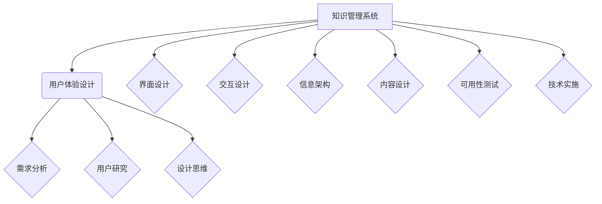

                 

# 知识管理系统的用户体验设计

## 关键词
- 知识管理系统
- 用户体验设计
- 需求分析
- 用户研究
- 设计思维
- 可用性测试

## 摘要
本文旨在深入探讨知识管理系统的用户体验设计。通过对知识管理系统的定义、核心概念、应用领域及其与用户体验设计的关联性进行分析，本文将阐述用户体验设计的基本原理、关键环节和方法论，包括需求分析与用户研究、设计思维与应用、界面与交互设计、信息架构与内容设计、可用性测试与评估，以及技术与实施等。通过详细讲解和案例研究，本文旨在为读者提供实用的知识管理系统用户体验设计指南，助力提升知识管理系统在各个行业中的应用效果。

### 第一部分：概述与核心概念

#### 第1章：知识管理系统的定义与概述

##### 1.1 知识管理系统概述

知识管理系统（Knowledge Management System，简称KMS）是一种集成了信息技术和人力资源管理的系统，旨在有效捕捉、存储、组织和共享组织内部的知识和经验。KMS的目标是提高组织的信息透明度、知识传播效率和创新力。

- **知识管理系统的定义**：知识管理系统是指一种通过技术手段，整合和组织组织内部的知识资源，促进知识创造、共享和应用的管理体系。

- **知识管理系统的关键要素**：知识管理系统主要包括以下关键要素：
  - **知识库**：存储和组织各种形式的知识资源，如文档、图片、视频和音频等。
  - **知识共享平台**：提供一个交互式的环境，用于知识的交流、讨论和协作。
  - **搜索和检索功能**：帮助用户快速找到所需的知识资源。
  - **用户反馈机制**：收集用户对知识资源的评价和反馈，以不断优化知识管理系统的质量。

- **知识管理系统的应用领域**：知识管理系统广泛应用于各个行业，如：
  - **企业**：通过知识管理系统，企业可以更好地管理内部知识，提高员工的工作效率和创新能力。
  - **教育**：学校和教育机构可以利用知识管理系统，为师生提供丰富的教学资源和学术交流平台。
  - **医疗**：医疗机构可以通过知识管理系统，快速获取和共享医疗信息，提高医疗质量和效率。
  - **科研**：科研机构可以利用知识管理系统，整合和组织科研数据，促进科研成果的传播和应用。

##### 1.2 用户体验设计的基本原理

用户体验设计（User Experience Design，简称UXD）是一种以用户为中心的设计方法，旨在优化用户在使用产品或服务过程中的体验。用户体验设计涉及多个方面，包括用户界面、交互设计、信息架构和内容设计等。

- **用户体验设计的概念**：用户体验设计是指通过系统化的研究和分析，设计出能够满足用户需求、提升用户满意度和效率的产品或服务。

- **用户体验设计的流程**：用户体验设计的基本流程包括以下步骤：
  - **需求分析**：理解用户需求和使用场景，明确设计目标。
  - **用户研究**：通过调查、访谈、观察等方法，收集用户反馈和需求。
  - **设计原型**：构建用户界面和交互原型，进行迭代和优化。
  - **可用性测试**：测试设计原型的可用性和用户体验，收集反馈并进行改进。

- **用户体验设计的原则**：用户体验设计应遵循以下基本原则：
  - **用户至上**：以用户需求为中心，设计出符合用户期望和使用习惯的产品。
  - **简洁明了**：界面设计应简洁明了，避免复杂和冗余。
  - **一致性**：保持界面和交互的一致性，使用户能够轻松上手。
  - **可访问性**：确保系统对所有用户（包括残障人士）都是可访问和可用的。
  - **可定制性**：允许用户根据个人喜好和需求进行系统设置和个性化。

##### 1.3 知识管理系统与用户体验设计的关系

知识管理系统与用户体验设计之间存在着密切的内在联系。良好的用户体验设计能够提升知识管理系统的使用效率、用户满意度和组织效能。

- **关系概述**：知识管理系统需要通过用户体验设计来确保用户在使用过程中的顺畅和愉悦，从而提高系统的使用率和价值。

- **互动机制**：用户体验设计通过以下方式与知识管理系统互动：
  - **交互界面**：设计直观、易用的界面，使用户能够快速找到所需的知识资源。
  - **搜索功能**：优化搜索算法和界面，提高知识资源的检索效率和准确性。
  - **个性化推荐**：根据用户行为和偏好，提供个性化的知识推荐，增加用户黏性和参与度。

- **设计策略**：在知识管理系统构建过程中，可以采取以下设计策略：
  - **用户研究**：通过用户研究和需求分析，深入了解用户需求和习惯，指导系统设计和功能开发。
  - **迭代优化**：采用迭代设计方法，不断收集用户反馈，进行系统的改进和优化。
  - **协作共享**：设计协同工作平台，鼓励用户之间的知识共享和协作，提高知识创造和传播效率。

#### Mermaid 流程图

### 第2章：用户体验设计的关键环节

#### 2.1 需求分析与用户研究

##### 2.1.1 需求分析

需求分析是用户体验设计的核心环节，它旨在明确用户需求和使用场景，为系统设计和功能开发提供依据。

- **需求分析的重要性**：需求分析是确保知识管理系统满足用户需求的关键步骤。通过需求分析，可以避免系统开发过程中的盲目性和偏差，提高系统的实用性和用户满意度。

- **需求分析方法**：常见的需求分析方法包括：
  - **问卷调查**：通过问卷调查收集用户对知识管理系统的需求和期望。
  - **访谈**：通过与用户进行面对面访谈，深入了解用户的需求和痛点。
  - **用户场景分析**：分析用户在使用知识管理系统时的具体场景和操作流程。
  - **用户画像**：构建用户画像，了解不同用户群体的特点和需求。

- **需求文档的编写**：需求文档是需求分析的结果体现，它包括用户需求、功能需求、性能需求和设计约束等。编写需求文档时，应确保其清晰、完整和可执行。

##### 2.1.2 用户研究

用户研究是用户体验设计的重要环节，它通过深入了解用户行为、需求和偏好，为系统设计和功能开发提供数据支持。

- **用户研究的目的**：用户研究旨在：
  - **了解用户需求**：通过用户行为数据和分析，发现用户在知识管理系统中的需求和痛点。
  - **优化设计决策**：基于用户研究数据，指导系统界面和交互设计，提高用户体验。
  - **验证设计效果**：通过用户测试和反馈，验证系统设计是否符合用户期望和使用习惯。

- **用户研究方法**：常见的用户研究方法包括：
  - **问卷调查**：通过在线问卷或纸质问卷，收集用户对知识管理系统的看法和反馈。
  - **访谈**：通过与用户进行面对面或视频通话，深入了解用户的需求和意见。
  - **用户测试**：通过用户测试，评估系统设计的可用性和用户体验，发现问题和改进机会。
  - **行为分析**：通过分析用户行为数据，了解用户在使用知识管理系统时的行为模式和操作习惯。

- **用户角色与场景**：构建用户角色和用户场景是用户研究的重要步骤。用户角色是用户群体的代表，用于指导系统设计和功能开发。用户场景是用户在使用知识管理系统时的具体情境和操作流程，用于验证系统设计的可行性和实用性。

#### 2.2 设计思维与方法论

##### 2.2.1 设计思维

设计思维（Design Thinking）是一种以用户为中心的创新方法，它强调通过观察、反思、实验和迭代来解决问题和创造价值。

- **设计思维的概念**：设计思维是一种以人为本的解决问题的方法，它通过以下四个核心步骤来实现创新：
  - **发现（Discover）**：深入了解用户需求和使用场景，发现问题。
  - **定义（Define）**：明确问题和目标，确定解决方案的方向。
  - **开发（Develop）**：通过原型和实验，不断迭代和优化解决方案。
  - **交付（Deliver）**：将最终解决方案交付给用户，并进行评估和反馈。

- **设计思维的应用**：设计思维在用户体验设计中具有广泛的应用，包括：
  - **需求分析**：通过用户研究和观察，发现用户需求和痛点。
  - **界面设计**：基于用户反馈和原型测试，不断优化界面和交互设计。
  - **内容设计**：通过用户测试和反馈，确保内容组织结构和呈现方式符合用户期望。
  - **可用性测试**：通过用户测试和反馈，验证系统设计的可行性和用户体验。

- **设计思维流程**：设计思维的流程包括以下步骤：
  - **理解问题**：通过用户研究和观察，了解用户需求和痛点。
  - **提出假设**：基于问题理解，提出可能的解决方案。
  - **构建原型**：通过快速构建原型，测试和验证解决方案。
  - **迭代优化**：根据用户反馈和测试结果，不断优化和改进原型。
  - **交付使用**：将最终解决方案交付给用户，并进行评估和反馈。

##### 2.2.2 设计方法论

设计方法论是指用于指导设计和创新的方法和策略。不同的设计方法论适用于不同的设计场景和需求。

- **方法论的选择**：选择合适的设计方法论，需要考虑以下因素：
  - **设计目标**：明确设计的目标和期望结果。
  - **用户需求**：了解用户需求和期望，确保设计符合用户需求。
  - **资源限制**：根据资源和时间限制，选择适合的方法论。

- **设计迭代**：设计迭代是设计过程中不断优化和改进的方法。通过设计迭代，可以：
  - **快速测试**：快速构建原型，进行用户测试和反馈。
  - **持续改进**：根据用户反馈和测试结果，不断优化设计。
  - **降低风险**：通过早期测试和反馈，降低设计失败的风险。

- **敏捷设计**：敏捷设计是一种以用户为中心的迭代设计方法，它强调快速响应变化和持续交付价值。敏捷设计的核心原则包括：
  - **用户至上**：始终关注用户需求和体验。
  - **迭代开发**：通过迭代和增量开发，逐步完善系统。
  - **持续交付**：持续交付可用的系统功能，确保及时反馈和改进。

### 第3章：界面设计与交互设计

#### 3.1 界面设计原则

界面设计（Interface Design）是用户体验设计的重要组成部分，它直接影响用户对系统的第一印象和使用体验。

- **用户友好性**：界面设计应遵循用户友好性的原则，包括：
  - **简洁明了**：界面应简洁明了，避免过多的装饰和冗余信息。
  - **直观易用**：界面设计应直观易用，使用户能够轻松理解和使用系统功能。
  - **一致性**：界面和交互应保持一致性，使用户能够快速上手。

- **一致性**：界面设计的一致性包括以下几个方面：
  - **视觉一致性**：使用统一的色彩、字体、图标和布局，确保视觉上的统一性。
  - **交互一致性**：保持交互操作的统一性，如按钮、链接和菜单的样式和功能应保持一致。
  - **行为一致性**：保持系统行为的一致性，如错误提示、确认提示和操作反馈应保持一致。

- **美观性**：界面设计的美观性能够提升用户的满意度和使用体验。美观性包括以下几个方面：
  - **色彩搭配**：选择合适的色彩搭配，创造视觉上的舒适感和愉悦感。
  - **视觉焦点**：通过视觉焦点引导用户注意力，提高界面信息的优先级。
  - **图像和图标**：使用适当的图像和图标，提高界面的视觉吸引力和易用性。

##### 3.1.2 界面布局与导航设计

界面布局（Layout）和导航设计（Navigation）是界面设计的关键组成部分，它们直接影响用户对系统的导航和使用体验。

- **布局策略**：界面布局应遵循以下策略：
  - **对称与平衡**：使用对称或平衡的布局，提高界面的稳定感和美感。
  - **网格布局**：使用网格布局，确保界面的结构化和组织性。
  - **重点突出**：通过视觉焦点和颜色等手段，突出界面的重要信息和功能。

- **导航设计**：导航设计应考虑以下几个方面：
  - **主导航**：设计清晰的主导航栏，使用户能够快速访问主要功能页面。
  - **面包屑导航**：在页面顶部或底部添加面包屑导航，帮助用户了解当前页面的位置和导航路径。
  - **侧导航**：在适当的情况下，使用侧导航栏，提高页面内容的可访问性。

#### 3.2 交互设计要素

交互设计（Interaction Design）是用户体验设计的重要组成部分，它关注用户与系统之间的交互过程和体验。

- **交互设计的基础概念**：
  - **交互元素**：交互元素是用户与系统进行交互的界面组件，包括按钮、输入框、菜单、图标等。
  - **交互行为**：交互行为是用户与系统之间的操作和反馈，包括点击、滑动、拖拽、输入等。

- **交互设计的原则**：
  - **直观性**：交互设计应直观易懂，使用户能够快速理解和使用系统功能。
  - **一致性**：交互设计应保持一致性，使用户在不同页面和功能中具有一致的操作体验。
  - **反馈性**：交互设计应提供及时的反馈，使用户了解操作的结果和系统状态。

- **交互设计的方法**：
  - **原型设计**：通过原型设计工具，快速构建交互原型，进行迭代和优化。
  - **用户测试**：通过用户测试，验证交互设计的可行性和用户体验，收集反馈并进行改进。
  - **用户访谈**：通过与用户进行访谈，了解用户对交互设计的看法和建议，指导设计改进。

#### 3.2 交互反馈与错误处理

交互反馈（Interaction Feedback）和错误处理（Error Handling）是交互设计的重要方面，它们直接影响用户的满意度和系统稳定性。

- **交互反馈的设计**：
  - **即时反馈**：在用户进行操作时，提供即时反馈，如按钮的点击效果、输入框的输入提示等。
  - **状态反馈**：在系统状态发生变化时，提供相应的状态反馈，如加载进度条、成功/失败提示等。
  - **视觉反馈**：通过视觉效果，如颜色、图标和动画等，提供明确的反馈，增强用户体验。

- **错误处理**：
  - **错误提示**：在用户操作错误时，提供明确的错误提示，帮助用户了解错误原因和解决方案。
  - **错误恢复**：在发生错误时，提供恢复操作的方法，如撤销操作、重试操作等。
  - **错误预防**：通过设计优化和提示，预防用户操作错误，提高系统的稳定性。

### 第4章：信息架构与内容设计

#### 4.1 信息架构的设计

信息架构（Information Architecture，简称IA）是用户体验设计的重要组成部分，它关注如何组织、分类和导航信息，以提供良好的用户体验。

- **信息架构的概念**：
  - **信息架构的定义**：信息架构是指组织和结构化信息的方式，以提供清晰的导航和访问路径。
  - **信息架构的作用**：信息架构在用户体验设计中具有重要作用，包括：
    - **提高信息可访问性**：通过合理的组织结构，提高用户找到所需信息的能力。
    - **改善用户体验**：清晰的信息架构有助于用户快速理解和使用系统功能。
    - **提升系统易用性**：合理的信息架构有助于减少用户的认知负担，提高系统易用性。

- **信息架构的设计方法**：
  - **内容建模**：通过内容建模，明确信息内容的分类和关系，构建信息架构的框架。
  - **用户研究**：通过用户研究和用户画像，了解用户的需求和使用习惯，指导信息架构设计。
  - **原型设计**：通过原型设计，验证信息架构的可行性和用户体验，收集反馈并进行改进。

#### 4.2 内容设计策略

内容设计（Content Design）是信息架构的重要组成部分，它关注如何组织、呈现和交互内容，以提高用户的理解和满意度。

- **内容设计的基本原则**：
  - **可读性**：内容设计应确保内容的可读性，包括简洁明了的语言、合适的字体和格式等。
  - **准确性**：内容设计应确保内容的准确性，避免错误和误导。
  - **一致性**：内容设计应保持一致性，包括术语、风格和格式等。

- **内容的组织结构**：
  - **模块化**：将内容划分为模块，以提高内容的可读性和易用性。
  - **层次化**：通过层次化的组织结构，使内容易于浏览和查找。
  - **逻辑性**：内容设计应确保内容的逻辑性，使用户能够轻松理解和跟随内容的脉络。

- **内容的呈现与交互**：
  - **文字内容**：使用简洁明了的语言，避免冗长和复杂的句子结构。
  - **图表和图像**：通过图表和图像，直观地展示数据和内容，提高用户的理解和兴趣。
  - **交互元素**：在内容中添加交互元素，如链接、按钮和搜索框等，提高用户的参与度和互动性。

### 第5章：可用性测试与评估

#### 5.1 可用性测试的方法

可用性测试（Usability Testing）是评估和改进用户体验的重要方法，它通过模拟真实用户的使用场景，评估系统的可用性和用户体验。

- **可用性测试的概念**：
  - **可用性测试的定义**：可用性测试是指通过观察和分析用户在系统中的操作过程，评估系统的可用性和用户体验的方法。
  - **可用性测试的目的**：可用性测试的主要目的是发现和解决系统设计中的问题，提高系统的可用性和用户满意度。

- **可用性测试的流程**：
  - **测试计划**：制定测试计划，明确测试目标、测试环境和测试方法。
  - **测试执行**：根据测试计划，执行测试任务，观察用户在系统中的操作过程，记录问题和反馈。
  - **测试结果分析**：分析测试结果，总结问题和改进机会，制定改进计划。

- **测试执行**：
  - **测试任务**：设计测试任务，模拟真实用户的使用场景，评估系统的可用性和用户体验。
  - **观察记录**：观察用户在系统中的操作过程，记录用户的行为和反馈，如点击次数、操作时间、错误率等。
  - **用户访谈**：通过与用户进行访谈，了解用户对系统的看法和意见，收集更深入的反馈。

- **测试结果分析**：
  - **问题总结**：根据测试结果，总结系统中的问题和不足，如界面设计、交互设计、内容设计等方面。
  - **改进计划**：根据问题总结，制定改进计划，包括设计优化、功能改进和用户反馈机制等。

#### 5.2 评估与优化

- **评估方法**：
  - **量化评估**：通过量化指标，如点击率、转化率、错误率等，评估系统的可用性和用户体验。
  - **定性评估**：通过用户访谈、用户调查和观察等定性方法，深入了解用户对系统的看法和意见。

- **优化策略**：
  - **基于数据的优化**：根据测试结果和用户反馈，进行数据分析和优化，提高系统的可用性和用户体验。
  - **用户参与**：鼓励用户参与系统设计和改进，收集用户的意见和建议，指导系统优化。
  - **持续迭代**：采用迭代设计方法，不断进行可用性测试和优化，持续改进系统的可用性和用户体验。

### 第6章：技术与实施

#### 6.1 技术选型与架构设计

技术选型（Technology Selection）和架构设计（Architecture Design）是知识管理系统开发的关键环节，它们直接影响系统的性能、可维护性和扩展性。

- **技术选型**：
  - **前端技术**：选择合适的前端技术，如HTML、CSS和JavaScript等，确保界面的响应速度和用户体验。
  - **后端技术**：选择合适的后端技术，如Java、Python、Node.js等，确保系统的性能和稳定性。

- **架构设计**：
  - **系统架构**：设计系统的整体架构，包括前端、后端和数据库等，确保系统的可扩展性和可维护性。
  - **模块划分**：将系统划分为多个模块，如用户管理模块、知识库管理模块等，提高系统的模块化和可维护性。

#### 6.2 系统开发与部署

系统开发（System Development）和系统部署（System Deployment）是知识管理系统实施的关键环节，它们直接影响系统的交付和上线。

- **开发流程**：
  - **需求分析**：分析用户需求，明确系统功能和性能要求。
  - **设计阶段**：进行系统设计，包括架构设计、数据库设计和界面设计等。
  - **编码与测试**：编写系统代码，进行单元测试和集成测试，确保系统的质量和稳定性。

- **系统部署与维护**：
  - **部署策略**：选择合适的部署策略，如云部署、虚拟化部署等，确保系统的可靠性和安全性。
  - **维护与升级**：定期进行系统维护和升级，修复漏洞和改进功能，确保系统的长期稳定运行。

### 第7章：案例分析与实践指南

#### 7.1 案例分析

- **案例选择与分析方法**：
  - **案例选择**：选择具有代表性的知识管理系统案例，如企业知识管理系统、教育知识管理系统等。
  - **分析方法**：通过用户研究、测试和分析等方法，深入分析案例的成功经验和教训。

- **案例研究**：
  - **成功案例**：分析成功案例的设计思路、实施过程和用户体验，总结成功的关键因素。
  - **失败案例**：分析失败案例的设计缺陷、实施问题和用户体验，探讨失败的原因和改进方向。

#### 7.2 实践指南

- **设计文档编写**：
  - **文档类型**：包括需求文档、设计文档、测试文档和用户手册等。
  - **文档规范**：制定统一的文档规范，确保文档的结构、格式和内容的一致性。

- **设计评审与反馈**：
  - **评审流程**：制定设计评审流程，包括评审准备、评审会议和评审报告等。
  - **反馈机制**：建立有效的反馈机制，收集用户和团队的反馈，指导设计改进。

### 附录

#### 附录 A：工具与资源推荐

- **A.1 设计工具推荐**：
  - **界面设计工具**：如Sketch、Adobe XD、Figma等。
  - **原型设计工具**：如Axure、Mockplus、Balsamiq等。

- **A.2 研究方法与工具**：
  - **用户研究方法**：如问卷调查、访谈、用户测试等。
  - **数据分析工具**：如SPSS、Excel、Python等。

#### 附录 B：参考文献

- **B.1 主要参考文献**：
  - [1] 胡斌. 知识管理系统的设计与实现[M]. 北京：清华大学出版社，2018.
  - [2] 史静寰. 用户体验设计原理与实践[M]. 北京：电子工业出版社，2017.
  - [3]唐纳德·诺曼. 用户体验要素[M]. 北京：电子工业出版社，2014.

- **B.2 推荐阅读**：
  - [1] 菲利普·布鲁克斯. 交互设计精髓[M]. 北京：电子工业出版社，2013.
  - [2] 斯科特·贝森. 信息架构[M]. 北京：电子工业出版社，2012.
  - [3] 约翰·霍兰. 敏捷开发实践指南[M]. 北京：电子工业出版社，2015.

